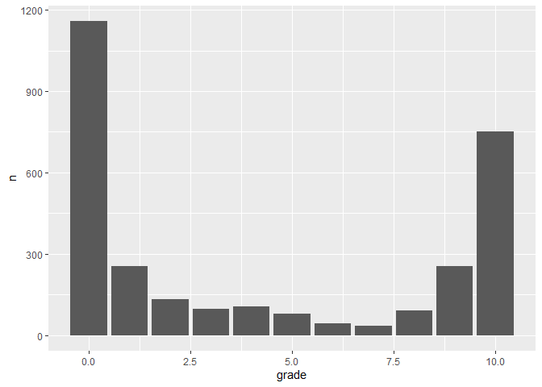
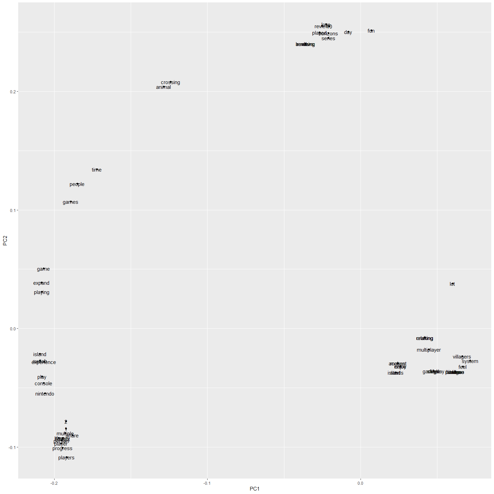
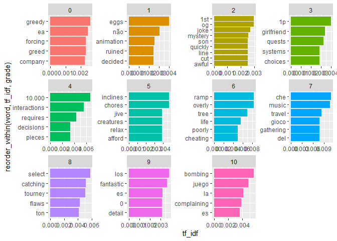
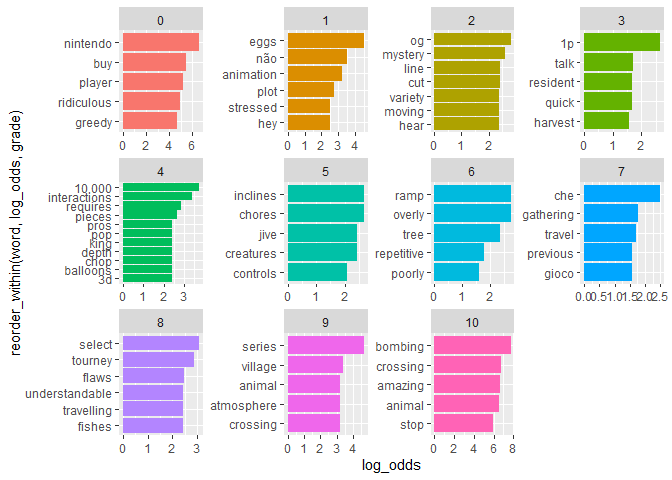
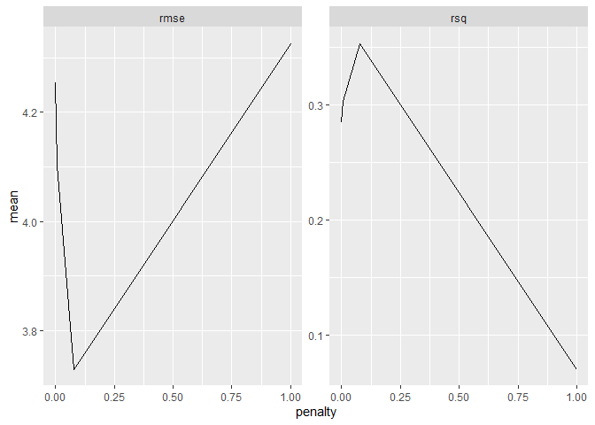
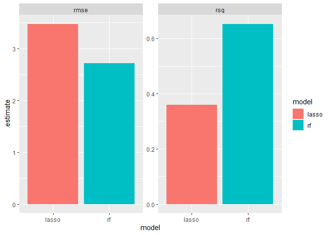
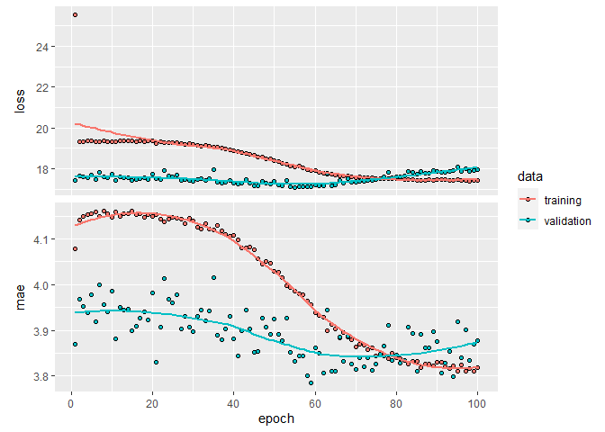

TidyTuesdayAnimalCrossing
================

``` r
library(tidyverse)
```

    ## -- Attaching packages ----------------------------------------------------------------------------------------------------------------- tidyverse 1.3.0 --

    ## v ggplot2 3.3.0     v purrr   0.3.4
    ## v tibble  3.0.1     v dplyr   0.8.5
    ## v tidyr   1.0.2     v stringr 1.4.0
    ## v readr   1.3.1     v forcats 0.5.0

    ## -- Conflicts -------------------------------------------------------------------------------------------------------------------- tidyverse_conflicts() --
    ## x dplyr::filter() masks stats::filter()
    ## x dplyr::lag()    masks stats::lag()

``` r
library(tidytext)
library(tidymodels)
```

    ## -- Attaching packages ---------------------------------------------------------------------------------------------------------------- tidymodels 0.1.0 --

    ## v broom     0.5.6      v rsample   0.0.6 
    ## v dials     0.0.6      v tune      0.1.0 
    ## v infer     0.5.1      v workflows 0.1.1 
    ## v parsnip   0.1.0      v yardstick 0.0.6 
    ## v recipes   0.1.12

    ## -- Conflicts ------------------------------------------------------------------------------------------------------------------- tidymodels_conflicts() --
    ## x scales::discard() masks purrr::discard()
    ## x dplyr::filter()   masks stats::filter()
    ## x recipes::fixed()  masks stringr::fixed()
    ## x dplyr::lag()      masks stats::lag()
    ## x dials::margin()   masks ggplot2::margin()
    ## x yardstick::spec() masks readr::spec()
    ## x recipes::step()   masks stats::step()

``` r
user_reviews <- readr::read_tsv('https://raw.githubusercontent.com/rfordatascience/tidytuesday/master/data/2020/2020-05-05/user_reviews.tsv')
```

    ## Parsed with column specification:
    ## cols(
    ##   grade = col_double(),
    ##   user_name = col_character(),
    ##   text = col_character(),
    ##   date = col_date(format = "")
    ## )

``` r
#brief look at grade distribution 
user_reviews %>% 
  count(grade) %>% 
  ggplot(aes(x = grade, y = n)) + geom_col()
```

<!-- -->

``` r
#Clustering of the top 25 words for each grade using pCA and visualizing it 
sparse_df <- user_reviews %>% 
  select(grade, text) %>% 
  unnest_tokens("word", "text") %>% 
  count(grade, word) %>% 
  anti_join(stop_words) %>% 
  filter(n >= 5) %>% 
  group_by(grade) %>% 
  top_n(n, n = 25) %>% 
  ungroup() %>% 
  cast_sparse(row = grade, column = word, value = n)
```

    ## Joining, by = "word"

``` r
library(irlba)
```

    ## Loading required package: Matrix

    ## 
    ## Attaching package: 'Matrix'

    ## The following objects are masked from 'package:tidyr':
    ## 
    ##     expand, pack, unpack

``` r
pca_text <- prcomp_irlba(sparse_df, n = 4, scale. = TRUE)

pca_text$center %>% 
  tidy() %>% 
  select(names) %>% 
  cbind(pca_text$rotation) %>% 
  ggplot(aes(x = PC1, y = PC2, label = names)) + 
  geom_point() + 
  geom_text()
```

    ## Warning: 'tidy.numeric' is deprecated.
    ## See help("Deprecated")

    ## Warning: `data_frame()` is deprecated as of tibble 1.1.0.
    ## Please use `tibble()` instead.
    ## This warning is displayed once every 8 hours.
    ## Call `lifecycle::last_warnings()` to see where this warning was generated.

<!-- -->

``` r
#using tf_idf
user_reviews %>% 
  unnest_tokens("word", "text") %>% 
  count(grade, word) %>% 
  anti_join(stop_words) %>% 
  filter(n >= 5) %>% 
  bind_tf_idf(word, grade, n) %>% 
  group_by(grade) %>% 
  top_n(tf_idf, n =5) %>% 
  ungroup() %>% 
  mutate(grade = as.factor(grade)) %>% 
  ggplot(aes(x = reorder_within(word, tf_idf, grade), y = tf_idf, fill = grade)) + 
  geom_col() + 
  scale_x_reordered() + 
  coord_flip() + 
  facet_wrap(~grade, scales = "free") + 
  theme(legend.position = 'none')
```

    ## Joining, by = "word"

<!-- -->

``` r
#Using weighted log odds 
library(tidylo)
user_reviews %>% 
  unnest_tokens("word", "text") %>% 
  count(grade, word) %>% 
  anti_join(stop_words) %>% 
  filter(n >= 5) %>% 
  bind_log_odds(grade, word, n) %>% 
  group_by(grade) %>% 
  top_n(log_odds, n =5) %>% 
  ungroup() %>% 
  mutate(grade = as.factor(grade)) %>% 
  ggplot(aes(x = reorder_within(word, log_odds, grade), y = log_odds, fill = grade)) + 
  geom_col() + 
  scale_x_reordered() + 
  coord_flip() + 
  facet_wrap(~grade, scales = "free") + 
  theme(legend.position = 'none')
```

    ## Joining, by = "word"

<!-- -->

``` r
#Partition data 
set.seed(42)

tidy_data <- user_reviews %>% select(-user_name)

tidy_split <- initial_split(tidy_data, p = .8)
tidy_train <- training(tidy_split)
tidy_test <- testing(tidy_split)


tidy_split$in_id
```

    ##    [1]    1    4    5    6    7    9   10   11   12   13   14   15   17   18
    ##   [15]   19   20   22   23   24   26   28   29   30   31   32   34   35   36
    ##   [29]   37   38   40   41   42   43   44   45   46   47   48   50   51   52
    ##   [43]   53   54   55   56   59   60   61   63   64   65   66   67   68   69
    ##   [57]   70   71   72   73   74   75   77   79   80   81   83   84   85   86
    ##   [71]   87   88   89   90   92   93   96   97   99  101  102  104  106  107
    ##   [85]  108  109  111  112  113  114  115  116  117  118  119  120  121  122
    ##   [99]  123  124  125  126  127  128  129  131  133  134  135  136  137  139
    ##  [113]  140  142  143  144  145  146  147  150  151  152  154  155  157  160
    ##  [127]  161  164  166  167  168  170  171  172  173  174  175  177  178  179
    ##  [141]  182  183  184  185  186  188  189  190  191  192  193  194  195  196
    ##  [155]  198  199  200  202  203  205  206  207  208  209  210  211  212  213
    ##  [169]  214  215  216  217  218  219  220  221  223  224  226  227  229  230
    ##  [183]  231  232  233  234  235  238  239  240  241  243  244  245  246  247
    ##  [197]  248  249  250  251  252  253  255  256  257  258  260  261  263  264
    ##  [211]  265  266  269  270  272  274  276  277  278  279  282  283  284  285
    ##  [225]  286  287  288  289  290  291  293  296  297  298  300  301  302  303
    ##  [239]  304  305  306  307  308  309  310  312  313  314  315  316  319  320
    ##  [253]  321  322  323  324  326  327  328  329  330  332  333  334  336  338
    ##  [267]  339  340  341  342  343  344  345  347  349  350  351  352  354  355
    ##  [281]  357  358  359  360  362  363  364  365  366  367  368  369  370  371
    ##  [295]  372  373  375  377  378  379  380  381  382  383  384  385  386  387
    ##  [309]  388  389  390  391  392  393  395  396  397  399  400  401  402  403
    ##  [323]  404  405  406  407  408  409  410  411  412  413  414  415  416  417
    ##  [337]  419  421  422  423  424  425  426  428  429  430  431  432  433  434
    ##  [351]  435  436  437  438  439  440  441  442  443  445  446  447  448  449
    ##  [365]  450  451  452  453  454  455  456  457  458  459  460  462  465  466
    ##  [379]  467  468  469  470  472  475  476  477  478  479  482  483  484  485
    ##  [393]  486  487  488  492  493  494  495  496  497  498  499  500  501  502
    ##  [407]  504  505  506  507  508  509  510  512  513  514  515  516  518  519
    ##  [421]  521  523  524  525  528  530  531  532  533  534  535  536  537  538
    ##  [435]  541  543  544  545  548  549  550  551  552  553  554  555  556  557
    ##  [449]  558  559  560  561  562  563  564  565  567  568  569  570  571  572
    ##  [463]  574  575  576  577  578  579  580  581  582  583  585  586  587  588
    ##  [477]  590  591  593  594  595  596  597  598  599  600  602  603  604  606
    ##  [491]  608  609  610  611  612  613  614  616  617  618  622  624  627  628
    ##  [505]  629  630  631  632  633  635  637  638  639  641  642  643  644  645
    ##  [519]  648  649  651  652  654  655  656  657  658  660  661  662  663  665
    ##  [533]  666  667  669  672  673  674  675  676  677  678  679  680  681  683
    ##  [547]  684  686  687  690  692  693  694  695  696  697  698  699  700  701
    ##  [561]  702  704  706  709  710  711  713  714  716  717  718  719  721  723
    ##  [575]  724  725  726  728  729  730  731  733  734  735  736  737  738  739
    ##  [589]  740  742  744  745  746  748  749  750  757  758  759  761  762  763
    ##  [603]  764  766  768  769  770  772  773  774  775  776  777  778  779  780
    ##  [617]  781  782  783  784  785  786  787  788  789  790  791  792  793  794
    ##  [631]  795  797  798  800  801  802  804  805  806  807  808  810  811  812
    ##  [645]  813  814  815  816  817  818  819  822  823  824  825  827  830  832
    ##  [659]  833  834  835  837  838  839  840  841  842  844  845  846  847  848
    ##  [673]  849  850  851  852  853  854  855  856  857  858  861  862  863  865
    ##  [687]  866  867  869  871  872  873  874  875  876  877  878  879  880  881
    ##  [701]  882  883  884  885  886  887  888  889  890  891  892  893  894  895
    ##  [715]  896  897  898  901  902  903  904  905  908  909  910  911  912  913
    ##  [729]  915  916  918  920  921  922  923  924  926  927  929  930  931  934
    ##  [743]  935  936  937  939  940  941  942  944  947  948  949  950  952  953
    ##  [757]  955  956  957  958  960  961  962  963  964  965  966  967  968  969
    ##  [771]  970  971  972  973  974  975  976  977  979  980  986  989  990  991
    ##  [785]  992  993  994  995  996  998 1000 1001 1002 1004 1005 1006 1007 1008
    ##  [799] 1009 1011 1012 1013 1014 1016 1017 1019 1021 1022 1023 1024 1025 1026
    ##  [813] 1028 1029 1030 1031 1032 1033 1037 1038 1039 1040 1041 1042 1043 1045
    ##  [827] 1047 1048 1049 1050 1051 1052 1053 1054 1055 1058 1059 1060 1061 1062
    ##  [841] 1063 1064 1065 1066 1067 1068 1069 1070 1071 1072 1074 1075 1076 1077
    ##  [855] 1079 1080 1081 1082 1084 1086 1087 1088 1090 1091 1092 1093 1094 1095
    ##  [869] 1096 1097 1099 1100 1101 1102 1103 1104 1105 1106 1107 1108 1111 1112
    ##  [883] 1113 1114 1115 1116 1117 1118 1119 1120 1123 1124 1125 1127 1128 1130
    ##  [897] 1131 1132 1133 1135 1137 1139 1140 1142 1144 1145 1146 1147 1148 1149
    ##  [911] 1150 1153 1154 1155 1156 1157 1158 1159 1161 1163 1164 1166 1167 1168
    ##  [925] 1169 1170 1171 1173 1175 1176 1178 1179 1180 1181 1182 1183 1184 1186
    ##  [939] 1187 1188 1189 1190 1191 1193 1194 1195 1196 1197 1199 1200 1201 1202
    ##  [953] 1203 1204 1205 1206 1207 1209 1210 1211 1213 1214 1215 1218 1219 1220
    ##  [967] 1221 1222 1223 1224 1228 1229 1230 1232 1233 1234 1239 1240 1241 1242
    ##  [981] 1243 1244 1245 1246 1247 1253 1254 1257 1258 1259 1260 1261 1262 1263
    ##  [995] 1264 1265 1266 1267 1268 1269 1270 1272 1274 1276 1277 1278 1279 1281
    ## [1009] 1284 1285 1286 1287 1288 1289 1290 1291 1292 1294 1295 1296 1297 1298
    ## [1023] 1299 1300 1302 1303 1304 1305 1306 1310 1311 1313 1314 1315 1317 1318
    ## [1037] 1319 1320 1321 1323 1324 1326 1328 1329 1330 1331 1332 1334 1335 1339
    ## [1051] 1340 1342 1343 1344 1345 1346 1347 1348 1350 1351 1352 1354 1355 1356
    ## [1065] 1357 1358 1359 1360 1362 1364 1366 1367 1368 1369 1371 1373 1374 1375
    ## [1079] 1376 1377 1378 1379 1380 1382 1383 1384 1385 1386 1388 1392 1393 1394
    ## [1093] 1395 1397 1398 1399 1400 1403 1404 1405 1407 1408 1409 1410 1411 1412
    ## [1107] 1413 1415 1416 1417 1418 1419 1420 1421 1422 1423 1424 1426 1427 1429
    ## [1121] 1430 1431 1432 1434 1435 1436 1437 1438 1439 1440 1441 1443 1444 1445
    ## [1135] 1446 1447 1448 1451 1452 1453 1454 1455 1456 1457 1458 1459 1460 1461
    ## [1149] 1462 1463 1464 1465 1466 1467 1469 1470 1471 1472 1473 1474 1475 1476
    ## [1163] 1477 1478 1479 1480 1481 1482 1483 1484 1485 1486 1487 1489 1491 1492
    ## [1177] 1494 1495 1496 1497 1498 1500 1501 1502 1503 1504 1505 1506 1507 1508
    ## [1191] 1509 1510 1511 1513 1514 1516 1517 1518 1519 1520 1521 1522 1523 1524
    ## [1205] 1525 1526 1527 1528 1529 1530 1531 1532 1533 1534 1536 1538 1539 1542
    ## [1219] 1543 1544 1545 1547 1548 1549 1550 1551 1552 1553 1554 1555 1556 1557
    ## [1233] 1558 1559 1560 1561 1562 1564 1565 1567 1569 1570 1572 1573 1574 1575
    ## [1247] 1576 1577 1580 1583 1584 1585 1586 1588 1589 1590 1592 1594 1595 1596
    ## [1261] 1597 1598 1599 1600 1601 1602 1604 1605 1606 1607 1608 1609 1610 1612
    ## [1275] 1613 1614 1615 1617 1618 1619 1620 1621 1622 1623 1624 1626 1627 1628
    ## [1289] 1629 1630 1632 1633 1635 1636 1637 1638 1639 1640 1641 1642 1645 1649
    ## [1303] 1650 1651 1652 1653 1655 1656 1657 1658 1659 1660 1662 1663 1664 1666
    ## [1317] 1667 1668 1669 1670 1672 1673 1674 1675 1676 1677 1679 1680 1681 1682
    ## [1331] 1683 1685 1686 1687 1688 1689 1691 1692 1694 1695 1696 1697 1698 1699
    ## [1345] 1700 1701 1702 1703 1704 1705 1706 1707 1708 1711 1712 1713 1715 1716
    ## [1359] 1718 1719 1723 1724 1725 1727 1728 1729 1730 1731 1732 1733 1735 1736
    ## [1373] 1737 1738 1739 1740 1741 1743 1744 1745 1747 1748 1749 1750 1751 1752
    ## [1387] 1754 1755 1756 1757 1758 1759 1760 1761 1762 1763 1764 1765 1766 1767
    ## [1401] 1768 1770 1771 1772 1773 1775 1776 1777 1778 1780 1781 1783 1784 1785
    ## [1415] 1786 1787 1789 1791 1792 1794 1795 1796 1798 1799 1800 1802 1804 1805
    ## [1429] 1806 1807 1808 1809 1810 1811 1812 1813 1814 1815 1817 1818 1820 1821
    ## [1443] 1822 1824 1826 1827 1829 1830 1831 1832 1833 1834 1835 1836 1837 1838
    ## [1457] 1839 1840 1841 1842 1844 1845 1847 1849 1852 1854 1855 1856 1857 1858
    ## [1471] 1859 1861 1862 1864 1865 1866 1867 1868 1869 1870 1872 1873 1874 1875
    ## [1485] 1876 1878 1879 1880 1881 1882 1883 1884 1886 1888 1890 1891 1892 1893
    ## [1499] 1896 1897 1898 1899 1901 1902 1904 1906 1908 1909 1910 1911 1912 1913
    ## [1513] 1914 1915 1916 1917 1918 1920 1921 1922 1923 1924 1926 1927 1928 1931
    ## [1527] 1932 1933 1935 1936 1937 1938 1940 1941 1942 1946 1947 1948 1949 1950
    ## [1541] 1951 1952 1953 1955 1956 1958 1959 1961 1962 1963 1964 1965 1966 1967
    ## [1555] 1968 1969 1970 1971 1972 1973 1974 1976 1977 1978 1979 1980 1981 1983
    ## [1569] 1984 1985 1986 1987 1988 1989 1991 1992 1993 1994 1995 1996 1997 1998
    ## [1583] 1999 2000 2001 2002 2003 2005 2006 2007 2008 2009 2010 2011 2012 2013
    ## [1597] 2014 2016 2017 2018 2019 2020 2021 2023 2024 2025 2026 2027 2028 2030
    ## [1611] 2032 2033 2034 2036 2037 2038 2039 2040 2042 2043 2044 2045 2046 2047
    ## [1625] 2048 2049 2050 2051 2052 2053 2054 2055 2056 2057 2058 2059 2060 2061
    ## [1639] 2062 2063 2064 2065 2067 2068 2069 2070 2071 2073 2074 2075 2076 2077
    ## [1653] 2078 2079 2080 2081 2082 2083 2084 2086 2087 2091 2092 2093 2095 2096
    ## [1667] 2098 2099 2100 2102 2103 2104 2105 2106 2107 2109 2110 2111 2112 2113
    ## [1681] 2114 2115 2116 2118 2119 2120 2122 2123 2124 2125 2126 2127 2128 2129
    ## [1695] 2130 2131 2134 2137 2138 2139 2140 2141 2142 2143 2144 2146 2147 2149
    ## [1709] 2150 2152 2153 2154 2158 2159 2160 2161 2162 2164 2165 2166 2167 2168
    ## [1723] 2169 2170 2171 2172 2173 2175 2176 2177 2180 2182 2183 2184 2185 2187
    ## [1737] 2188 2189 2190 2192 2193 2195 2196 2197 2198 2199 2200 2201 2202 2203
    ## [1751] 2205 2207 2208 2209 2210 2212 2213 2214 2215 2216 2217 2220 2221 2222
    ## [1765] 2223 2224 2225 2228 2229 2231 2233 2234 2235 2238 2239 2240 2241 2242
    ## [1779] 2244 2246 2247 2248 2249 2251 2252 2253 2255 2256 2257 2258 2259 2261
    ## [1793] 2262 2263 2264 2265 2267 2268 2269 2270 2271 2272 2273 2275 2276 2277
    ## [1807] 2278 2279 2280 2282 2283 2284 2285 2286 2287 2289 2290 2291 2292 2293
    ## [1821] 2294 2295 2296 2297 2299 2301 2302 2303 2305 2306 2307 2308 2309 2311
    ## [1835] 2313 2315 2318 2319 2320 2323 2324 2325 2326 2327 2328 2329 2330 2331
    ## [1849] 2332 2333 2334 2335 2337 2338 2339 2340 2341 2342 2343 2345 2347 2348
    ## [1863] 2349 2350 2351 2353 2354 2355 2356 2357 2358 2359 2360 2361 2363 2364
    ## [1877] 2365 2366 2367 2368 2370 2371 2372 2373 2374 2375 2376 2377 2379 2381
    ## [1891] 2382 2383 2384 2385 2386 2387 2388 2390 2391 2392 2393 2394 2395 2396
    ## [1905] 2397 2398 2399 2400 2401 2402 2404 2405 2406 2407 2408 2409 2410 2411
    ## [1919] 2412 2413 2414 2415 2416 2418 2419 2421 2422 2424 2428 2429 2430 2431
    ## [1933] 2432 2433 2434 2436 2437 2440 2441 2442 2443 2444 2445 2447 2448 2449
    ## [1947] 2451 2452 2453 2455 2456 2457 2459 2461 2462 2463 2464 2465 2466 2467
    ## [1961] 2468 2469 2470 2471 2472 2475 2476 2477 2478 2480 2481 2482 2483 2484
    ## [1975] 2485 2487 2488 2489 2491 2493 2494 2495 2496 2497 2498 2499 2500 2501
    ## [1989] 2502 2503 2506 2507 2509 2510 2511 2512 2513 2514 2515 2516 2517 2518
    ## [2003] 2519 2520 2521 2522 2523 2524 2525 2526 2527 2528 2529 2530 2532 2533
    ## [2017] 2534 2535 2536 2537 2538 2539 2540 2542 2545 2546 2548 2549 2550 2551
    ## [2031] 2554 2555 2556 2558 2559 2561 2563 2564 2565 2566 2567 2568 2569 2570
    ## [2045] 2571 2572 2573 2575 2577 2578 2579 2580 2581 2582 2583 2586 2589 2590
    ## [2059] 2591 2592 2593 2594 2595 2596 2597 2599 2600 2601 2602 2603 2604 2605
    ## [2073] 2606 2607 2608 2610 2611 2612 2613 2614 2615 2616 2617 2618 2619 2620
    ## [2087] 2621 2622 2623 2624 2625 2626 2627 2628 2629 2630 2631 2632 2633 2634
    ## [2101] 2635 2636 2637 2638 2639 2640 2641 2642 2643 2644 2645 2646 2647 2648
    ## [2115] 2649 2650 2651 2652 2655 2656 2657 2658 2659 2660 2661 2662 2663 2665
    ## [2129] 2666 2667 2668 2669 2671 2672 2673 2674 2676 2677 2679 2680 2681 2682
    ## [2143] 2683 2684 2685 2687 2688 2689 2690 2691 2692 2694 2695 2696 2697 2698
    ## [2157] 2699 2700 2702 2703 2704 2705 2706 2707 2708 2709 2710 2711 2712 2713
    ## [2171] 2714 2715 2716 2718 2719 2720 2721 2722 2723 2724 2726 2727 2728 2730
    ## [2185] 2732 2733 2734 2735 2736 2737 2738 2740 2741 2743 2744 2748 2749 2750
    ## [2199] 2751 2752 2753 2755 2756 2757 2758 2759 2760 2761 2762 2763 2764 2766
    ## [2213] 2767 2769 2770 2771 2772 2773 2774 2775 2777 2779 2780 2782 2783 2784
    ## [2227] 2785 2786 2787 2788 2789 2790 2791 2792 2794 2795 2796 2797 2798 2799
    ## [2241] 2800 2801 2802 2803 2804 2805 2807 2808 2809 2810 2811 2813 2815 2816
    ## [2255] 2817 2819 2820 2823 2824 2825 2826 2827 2828 2830 2832 2833 2834 2835
    ## [2269] 2837 2838 2839 2840 2841 2842 2843 2844 2845 2846 2847 2848 2850 2851
    ## [2283] 2852 2853 2854 2855 2856 2857 2858 2860 2861 2862 2864 2865 2868 2869
    ## [2297] 2870 2871 2872 2873 2874 2875 2876 2877 2879 2880 2881 2882 2883 2884
    ## [2311] 2886 2887 2888 2890 2891 2892 2893 2894 2895 2896 2898 2900 2901 2902
    ## [2325] 2903 2904 2905 2906 2907 2908 2909 2913 2915 2916 2917 2919 2920 2921
    ## [2339] 2922 2923 2924 2925 2927 2928 2929 2930 2931 2932 2933 2934 2936 2937
    ## [2353] 2938 2940 2941 2942 2943 2944 2945 2946 2947 2948 2949 2950 2951 2952
    ## [2367] 2953 2954 2955 2959 2960 2961 2963 2964 2965 2967 2968 2970 2971 2973
    ## [2381] 2974 2975 2976 2977 2979 2980 2981 2983 2984 2985 2986 2987 2989 2991
    ## [2395] 2992 2993 2994 2996 2997 2998

``` r
library(textrecipes)

text_recipe <- recipe(grade~text, data = tidy_train) %>% 
  step_tokenize(text) %>% 
  step_stopwords(text) %>% 
  step_tokenfilter(text, max_tokens = 500) %>% 
  step_tf(text)

text_prep <- text_recipe %>% prep()

cross_validation <- vfold_cv(tidy_train, v = 10)

wf <- workflow() %>% 
  add_recipe(text_recipe)
```

``` r
lasso_model <- linear_reg(penalty = tune(), mixture = 1) %>% 
  set_mode("regression") %>% 
  set_engine("glmnet")

lasso_grid <- grid_regular(penalty(), levels = 10)

lasso_tune <- tune_grid(
  wf %>% add_model(lasso_model),
  resamples = cross_validation,
  grid = lasso_grid
)

lasso_tune %>% 
  collect_metrics() %>% 
  ggplot(aes(x = penalty, y = mean)) + geom_line() + facet_wrap(~.metric, scales = "free")
```

<!-- -->

``` r
lasso_best_tune <- lasso_tune %>% select_best("rmse")
  
final_lasso_model <- finalize_model(lasso_model, lasso_best_tune)  

lasso_wf <- workflow() %>% 
  add_recipe(text_recipe) %>% 
  add_model(final_lasso_model)

lasso_eval <- lasso_wf %>% last_fit(tidy_split)
lasso_eval %>% collect_metrics()
```

    ## # A tibble: 2 x 3
    ##   .metric .estimator .estimate
    ##   <chr>   <chr>          <dbl>
    ## 1 rmse    standard       3.47 
    ## 2 rsq     standard       0.359

``` r
random_forest_model <- rand_forest(mtry = 25,
                                   trees = 1000,
                                   min_n = 20) %>% 
  set_mode("regression") %>% 
  set_engine("randomForest")

random_forest_tune <- fit_resamples(
  random_forest_model,
  text_recipe,
  cross_validation
)

random_forest_tune %>% 
  collect_metrics()
```

    ## # A tibble: 2 x 5
    ##   .metric .estimator  mean     n std_err
    ##   <chr>   <chr>      <dbl> <int>   <dbl>
    ## 1 rmse    standard   2.98     10  0.0340
    ## 2 rsq     standard   0.560    10  0.0129

``` r
final_rf_wf <- workflow() %>% 
  add_recipe(text_recipe) %>% 
  add_model(random_forest_model) 

final_rf_eval <- final_rf_wf %>% last_fit(tidy_split)
```

``` r
#RF has better performance than lasso 
final_rf_eval %>% collect_metrics() %>% mutate(model = "rf") %>% 
  rbind(lasso_eval %>% collect_metrics() %>% mutate(model = "lasso")) %>% 
  ggplot(aes(x = model, y = .estimate, fill = model)) + geom_col() + facet_wrap(~.metric, scales = "free")
```

<!-- -->

``` r
library(keras)
```

    ## 
    ## Attaching package: 'keras'

    ## The following object is masked from 'package:yardstick':
    ## 
    ##     get_weights

``` r
keras_df <- user_reviews %>% select(-user_name)

max_features <- 2000

tokenizer <- text_tokenizer(num_words = max_features) %>% 
  fit_text_tokenizer(keras_df$text)

one_hot_results <- texts_to_matrix(tokenizer = tokenizer, keras_df$text, mode = "binary")

word_index <- tokenizer$word_index
```

``` r
#Create the train and test inputs and outputs 
#Also apply padding to the inputs 
x_train <- one_hot_results[tidy_split$in_id,]
x_test <- one_hot_results[-tidy_split$in_id,]

y_train <- keras_df$grade[tidy_split$in_id]
y_test <- keras_df$grade[-tidy_split$in_id]


maxlen <- 128
x_train <- pad_sequences(x_train, maxlen = maxlen)
x_test <- pad_sequences(x_test, maxlen = maxlen)
```

``` r
model <- keras_model_sequential() %>% 
  layer_embedding(input_dim = max_features,
                  output_dim = 16,
                  input_length = maxlen) %>% 
  layer_flatten() %>% 
  layer_dense(units = 1)


model %>% compile(
  optimizer = "rmsprop",
  loss = "mse",
  metrics = c("mae")
)
 

history <- model %>% 
  fit(
    x_train,
    y_train,
    validation_split = .2,
    epochs = 100,
    batch_size = 64
  )
```

``` r
plot(history)
```

    ## `geom_smooth()` using formula 'y ~ x'

<!-- -->

``` r
evaluate(model,
         x_test,
         y_test)
```

    ## $loss
    ## [1] 18.53417
    ## 
    ## $mae
    ## [1] 3.978105
