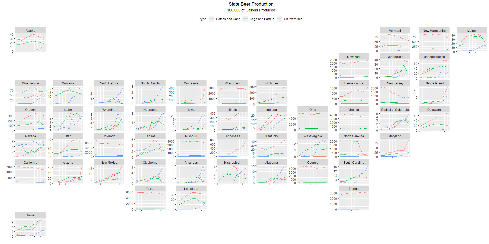
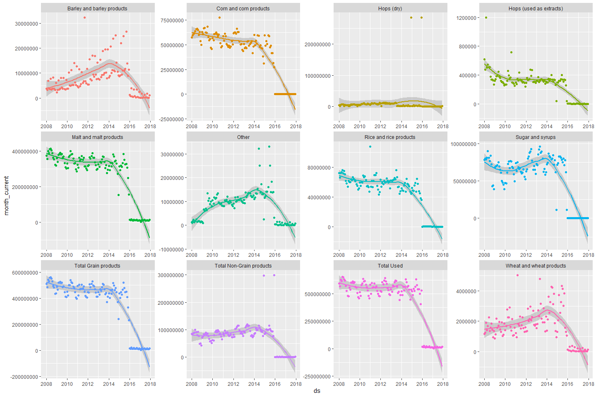
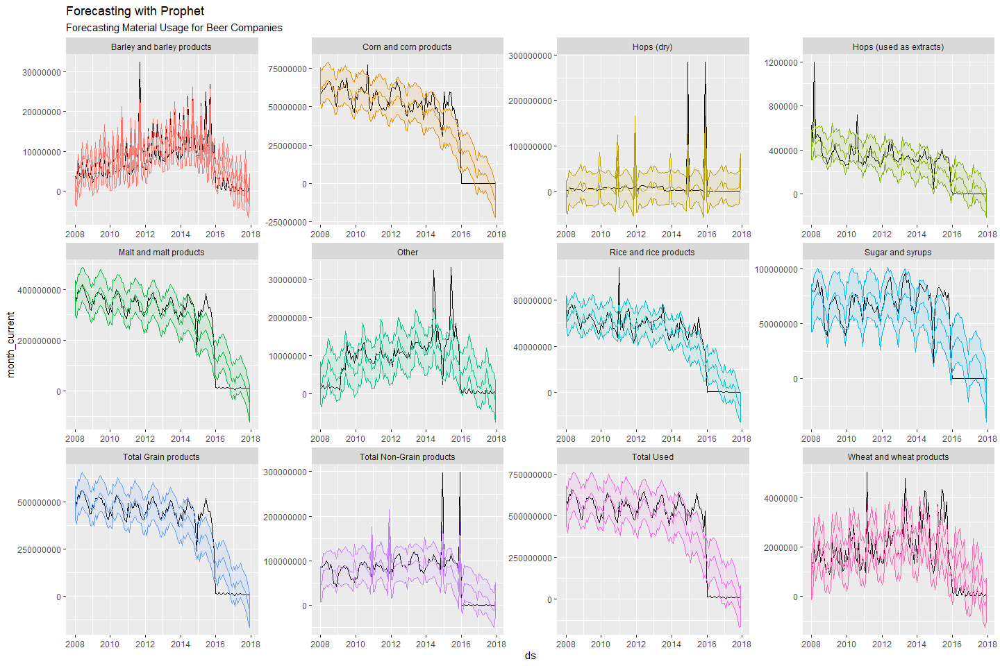
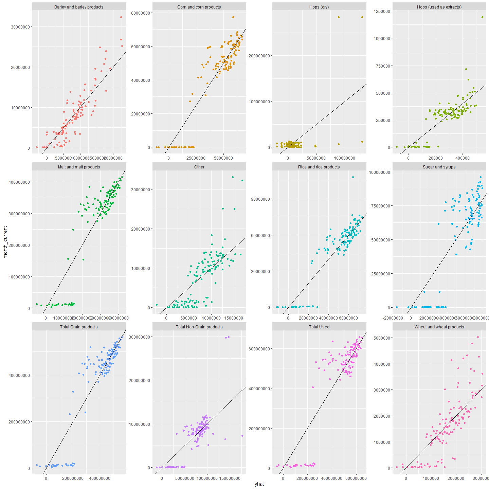
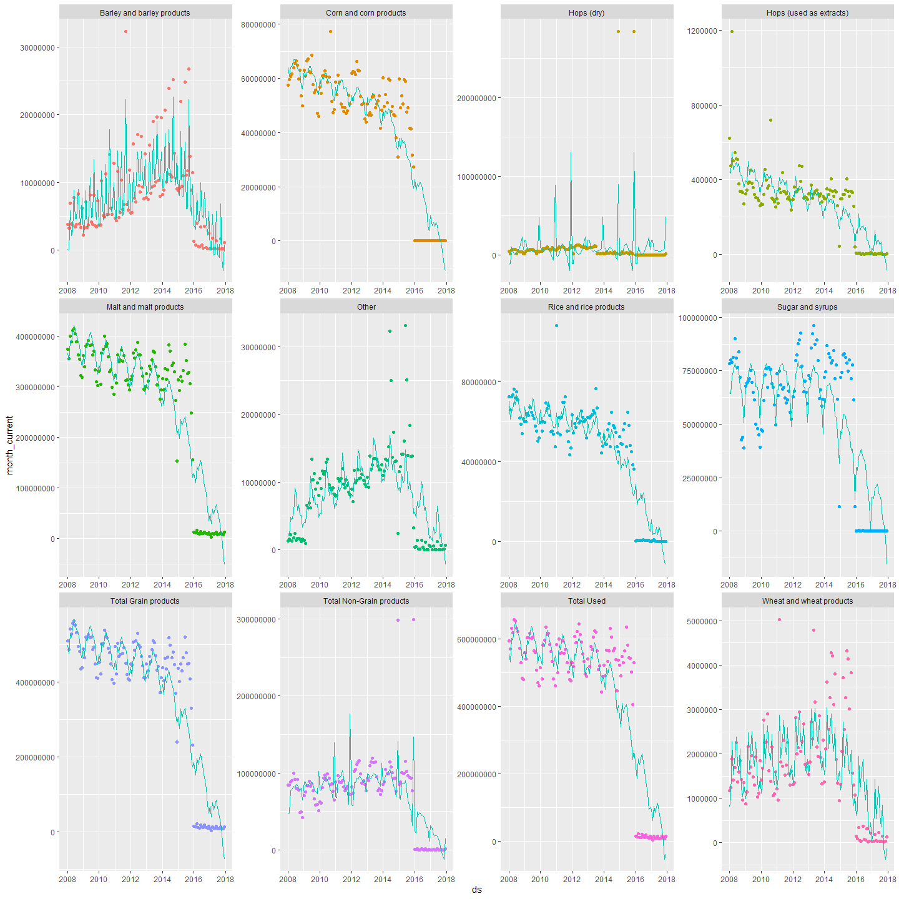
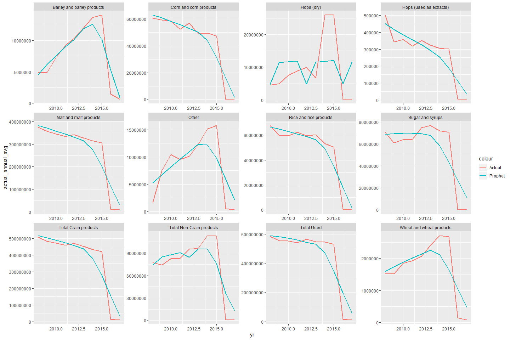
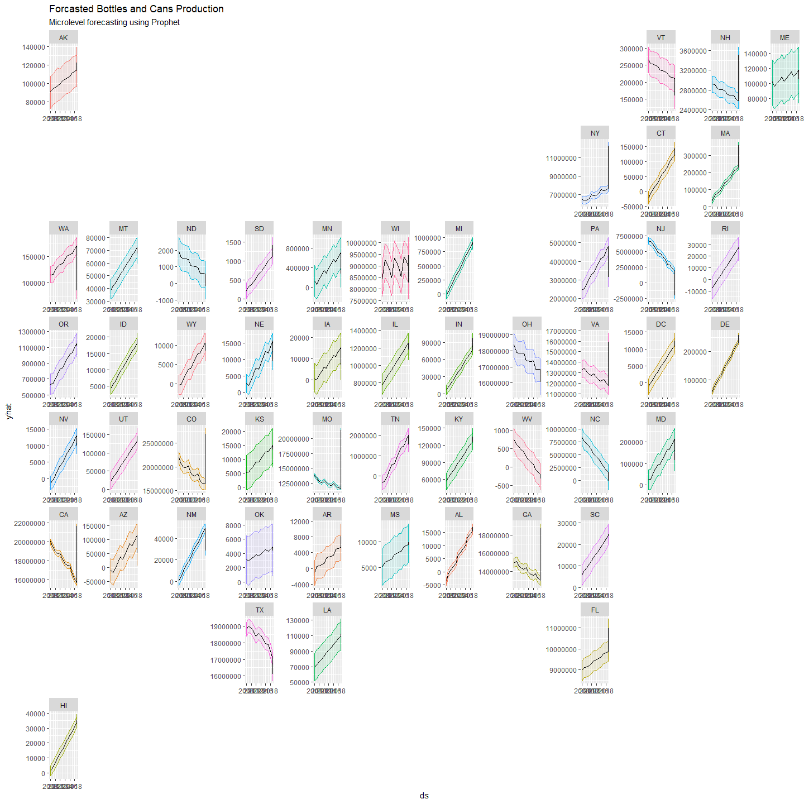

TidyTuesdayBeerProduction
================

``` r
library(tidyverse)
```

    ## Warning: package 'tidyverse' was built under R version 3.5.3

    ## -- Attaching packages --------------------------------------- tidyverse 1.2.1 --

    ## v ggplot2 3.2.1     v purrr   0.3.3
    ## v tibble  2.1.3     v dplyr   0.8.3
    ## v tidyr   1.0.0     v stringr 1.4.0
    ## v readr   1.3.1     v forcats 0.4.0

    ## Warning: package 'ggplot2' was built under R version 3.5.3

    ## Warning: package 'tibble' was built under R version 3.5.3

    ## Warning: package 'tidyr' was built under R version 3.5.3

    ## Warning: package 'purrr' was built under R version 3.5.3

    ## Warning: package 'dplyr' was built under R version 3.5.3

    ## Warning: package 'stringr' was built under R version 3.5.3

    ## Warning: package 'forcats' was built under R version 3.5.3

    ## -- Conflicts ------------------------------------------ tidyverse_conflicts() --
    ## x dplyr::filter() masks stats::filter()
    ## x dplyr::lag()    masks stats::lag()

``` r
brewing_materials <- readr::read_csv('https://raw.githubusercontent.com/rfordatascience/tidytuesday/master/data/2020/2020-03-31/brewing_materials.csv')
```

    ## Parsed with column specification:
    ## cols(
    ##   data_type = col_character(),
    ##   material_type = col_character(),
    ##   year = col_double(),
    ##   month = col_double(),
    ##   type = col_character(),
    ##   month_current = col_double(),
    ##   month_prior_year = col_double(),
    ##   ytd_current = col_double(),
    ##   ytd_prior_year = col_double()
    ## )

``` r
beer_taxed <- readr::read_csv('https://raw.githubusercontent.com/rfordatascience/tidytuesday/master/data/2020/2020-03-31/beer_taxed.csv')
```

    ## Parsed with column specification:
    ## cols(
    ##   data_type = col_character(),
    ##   tax_status = col_character(),
    ##   year = col_double(),
    ##   month = col_double(),
    ##   type = col_character(),
    ##   month_current = col_double(),
    ##   month_prior_year = col_double(),
    ##   ytd_current = col_double(),
    ##   ytd_prior_year = col_double(),
    ##   tax_rate = col_character()
    ## )

``` r
brewer_size <- readr::read_csv('https://raw.githubusercontent.com/rfordatascience/tidytuesday/master/data/2020/2020-03-31/brewer_size.csv')
```

    ## Parsed with column specification:
    ## cols(
    ##   year = col_double(),
    ##   brewer_size = col_character(),
    ##   n_of_brewers = col_double(),
    ##   total_barrels = col_double(),
    ##   taxable_removals = col_double(),
    ##   total_shipped = col_double()
    ## )

``` r
beer_states <- readr::read_csv('https://raw.githubusercontent.com/rfordatascience/tidytuesday/master/data/2020/2020-03-31/beer_states.csv')
```

    ## Parsed with column specification:
    ## cols(
    ##   state = col_character(),
    ##   year = col_double(),
    ##   barrels = col_double(),
    ##   type = col_character()
    ## )

``` r
options(scipen = 999)
library(geofacet)
```

    ## Warning: package 'geofacet' was built under R version 3.5.3

``` r
beer_states %>% 
  filter(!state == "total") %>% 
  mutate(barrels = 31*barrels/100000) %>% 
  ggplot(aes(x = year, y = barrels, color = type)) +
  geom_line() + 
  facet_geo(~ state, grid = "us_state_grid2", label = "name", scales = "free_y") +
  theme(legend.position = "top",
        axis.text.x = element_blank(),
        plot.title = element_text(hjust = 0.5),
        plot.subtitle = element_text(hjust = 0.5)) + 
  labs(title = "State Beer Production",
       subtitle = "100,000 of Gallons Produced") +
  xlab("") + 
  ylab("")
```

<!-- -->

``` r
us_ia_counties_grid1
```

    ##     code          name row col
    ## 1  19005     Allamakee   1  11
    ## 2  19059     Dickinson   1   3
    ## 3  19063         Emmet   1   4
    ## 4  19089        Howard   1   9
    ## 5  19109       Kossuth   1   5
    ## 6  19119          Lyon   1   1
    ## 7  19131      Mitchell   1   8
    ## 8  19143       Osceola   1   2
    ## 9  19189     Winnebago   1   6
    ## 10 19191    Winneshiek   1  10
    ## 11 19195         Worth   1   7
    ## 12 19033   Cerro Gordo   2   7
    ## 13 19037     Chickasaw   2   9
    ## 14 19041          Clay   2   3
    ## 15 19043       Clayton   2  11
    ## 16 19065       Fayette   2  10
    ## 17 19067         Floyd   2   8
    ## 18 19081       Hancock   2   6
    ## 19 19141       O'Brien   2   2
    ## 20 19147     Palo Alto   2   4
    ## 21 19167         Sioux   2   1
    ## 22 19017        Bremer   3   9
    ## 23 19021   Buena Vista   3   3
    ## 24 19023        Butler   3   8
    ## 25 19035      Cherokee   3   2
    ## 26 19069      Franklin   3   7
    ## 27 19091      Humboldt   3   5
    ## 28 19149      Plymouth   3   1
    ## 29 19151    Pocahontas   3   4
    ## 30 19197        Wright   3   6
    ## 31 19013    Black Hawk   4   9
    ## 32 19019      Buchanan   4  10
    ## 33 19025       Calhoun   4   4
    ## 34 19055      Delaware   4  11
    ## 35 19061       Dubuque   4  12
    ## 36 19075        Grundy   4   8
    ## 37 19079      Hamilton   4   6
    ## 38 19083        Hardin   4   7
    ## 39 19093           Ida   4   2
    ## 40 19161           Sac   4   3
    ## 41 19187       Webster   4   5
    ## 42 19193      Woodbury   4   1
    ## 43 19011        Benton   5   9
    ## 44 19015         Boone   5   5
    ## 45 19027       Carroll   5   3
    ## 46 19045       Clinton   5  13
    ## 47 19047      Crawford   5   2
    ## 48 19073        Greene   5   4
    ## 49 19097       Jackson   5  12
    ## 50 19105         Jones   5  11
    ## 51 19113          Linn   5  10
    ## 52 19127      Marshall   5   7
    ## 53 19133        Monona   5   1
    ## 54 19169         Story   5   6
    ## 55 19171          Tama   5   8
    ## 56 19009       Audubon   6   3
    ## 57 19031         Cedar   6  11
    ## 58 19049        Dallas   6   5
    ## 59 19077       Guthrie   6   4
    ## 60 19085      Harrison   6   1
    ## 61 19095          Iowa   6   9
    ## 62 19099        Jasper   6   7
    ## 63 19103       Johnson   6  10
    ## 64 19153          Polk   6   6
    ## 65 19157     Poweshiek   6   8
    ## 66 19163         Scott   6  12
    ## 67 19165        Shelby   6   2
    ## 68 19001         Adair   7   3
    ## 69 19029          Cass   7   2
    ## 70 19107        Keokuk   7   9
    ## 71 19115        Louisa   7  11
    ## 72 19121       Madison   7   4
    ## 73 19123       Mahaska   7   8
    ## 74 19125        Marion   7   6
    ## 75 19139     Muscatine   7  12
    ## 76 19155 Pottawattamie   7   1
    ## 77 19181        Warren   7   5
    ## 78 19183    Washington   7  10
    ## 79 19003         Adams   8   3
    ## 80 19039        Clarke   8   5
    ## 81 19057    Des Moines   8  11
    ## 82 19087         Henry   8  10
    ## 83 19101     Jefferson   8   9
    ## 84 19117         Lucas   8   6
    ## 85 19129         Mills   8   1
    ## 86 19135        Monroe   8   7
    ## 87 19137    Montgomery   8   2
    ## 88 19175         Union   8   4
    ## 89 19179       Wapello   8   8
    ## 90 19007     Appanoose   9   7
    ## 91 19051         Davis   9   8
    ## 92 19053       Decatur   9   5
    ## 93 19071       Fremont   9   1
    ## 94 19111           Lee   9  10
    ## 95 19145          Page   9   2
    ## 96 19159      Ringgold   9   4
    ## 97 19173        Taylor   9   3
    ## 98 19177     Van Buren   9   9
    ## 99 19185         Wayne   9   6

``` r
model_data <- brewing_materials %>% 
  select(year, month, type, month_current) %>% 
  mutate(month = if_else(month < 10, paste(0, month, sep = ""), month %>% as.character()),
         year = as.character(year),
         ds = paste(year, month, "01", sep = "-") %>% as.Date()) %>% 
  select(type, ds, month_current)
  

key <- model_data %>% 
  select(type) %>% 
  distinct() %>% 
  mutate(name = c("Malt", "Corn", "Rice", "Barley", "Wheat", "Total_Grain", "Sugar", "Hops_Dry", "Hops_Extract", "Other", "Total_Non_Grain", "Total_Used"))

key
```

    ## # A tibble: 12 x 2
    ##    type                       name           
    ##    <chr>                      <chr>          
    ##  1 Malt and malt products     Malt           
    ##  2 Corn and corn products     Corn           
    ##  3 Rice and rice products     Rice           
    ##  4 Barley and barley products Barley         
    ##  5 Wheat and wheat products   Wheat          
    ##  6 Total Grain products       Total_Grain    
    ##  7 Sugar and syrups           Sugar          
    ##  8 Hops (dry)                 Hops_Dry       
    ##  9 Hops (used as extracts)    Hops_Extract   
    ## 10 Other                      Other          
    ## 11 Total Non-Grain products   Total_Non_Grain
    ## 12 Total Used                 Total_Used

``` r
model_data %>% 
  ggplot(aes(x = ds, y = month_current, color = type)) + 
  geom_smooth() + 
  geom_point() + 
  facet_wrap(~type, scales = "free") + 
  theme(legend.position = "none")
```

    ## `geom_smooth()` using method = 'loess' and formula 'y ~ x'

<!-- -->

``` r
library(prophet)
```

    ## Warning: package 'prophet' was built under R version 3.5.3

    ## Loading required package: Rcpp

    ## Warning: package 'Rcpp' was built under R version 3.5.3

    ## Loading required package: rlang

    ## Warning: package 'rlang' was built under R version 3.5.3

    ## 
    ## Attaching package: 'rlang'

    ## The following objects are masked from 'package:purrr':
    ## 
    ##     %@%, as_function, flatten, flatten_chr, flatten_dbl,
    ##     flatten_int, flatten_lgl, flatten_raw, invoke, list_along,
    ##     modify, prepend, splice

``` r
model_results <- data.frame()

#Old way of doing micro level models 
for (i in 1:12){
  
  model <- model_data %>% 
    filter(type ==  key$type[i]) %>% 
    select(ds, y = month_current) %>% 
    prophet()
  
  assign(paste(key$name[i], "model", sep = "_"), model)

future <- make_future_dataframe(model, periods = 3)  

results <- predict(model, future) %>% 
  select(ds, yhat_lower, yhat_upper, yhat) %>% 
  mutate(type = key$type[i],
         ds = as.Date(ds)) %>% 
  inner_join(model_data, by = c("type" = "type", "ds" = "ds"))

model_results <- rbind(model_results, results) 
}
```

    ## Disabling weekly seasonality. Run prophet with weekly.seasonality=TRUE to override this.

    ## Disabling daily seasonality. Run prophet with daily.seasonality=TRUE to override this.

    ## Disabling weekly seasonality. Run prophet with weekly.seasonality=TRUE to override this.

    ## Disabling daily seasonality. Run prophet with daily.seasonality=TRUE to override this.

    ## Disabling weekly seasonality. Run prophet with weekly.seasonality=TRUE to override this.

    ## Disabling daily seasonality. Run prophet with daily.seasonality=TRUE to override this.

    ## Disabling weekly seasonality. Run prophet with weekly.seasonality=TRUE to override this.

    ## Disabling daily seasonality. Run prophet with daily.seasonality=TRUE to override this.

    ## Disabling weekly seasonality. Run prophet with weekly.seasonality=TRUE to override this.

    ## Disabling daily seasonality. Run prophet with daily.seasonality=TRUE to override this.

    ## Disabling weekly seasonality. Run prophet with weekly.seasonality=TRUE to override this.

    ## Disabling daily seasonality. Run prophet with daily.seasonality=TRUE to override this.

    ## Disabling weekly seasonality. Run prophet with weekly.seasonality=TRUE to override this.

    ## Disabling daily seasonality. Run prophet with daily.seasonality=TRUE to override this.

    ## Disabling weekly seasonality. Run prophet with weekly.seasonality=TRUE to override this.

    ## Disabling daily seasonality. Run prophet with daily.seasonality=TRUE to override this.

    ## Disabling weekly seasonality. Run prophet with weekly.seasonality=TRUE to override this.

    ## Disabling daily seasonality. Run prophet with daily.seasonality=TRUE to override this.

    ## Disabling weekly seasonality. Run prophet with weekly.seasonality=TRUE to override this.

    ## Disabling daily seasonality. Run prophet with daily.seasonality=TRUE to override this.

    ## Disabling weekly seasonality. Run prophet with weekly.seasonality=TRUE to override this.

    ## Disabling daily seasonality. Run prophet with daily.seasonality=TRUE to override this.

    ## Disabling weekly seasonality. Run prophet with weekly.seasonality=TRUE to override this.

    ## Disabling daily seasonality. Run prophet with daily.seasonality=TRUE to override this.

``` r
model_results %>% 
  ggplot(aes(x = ds, y = month_current, color = type)) + 
  geom_line(color = "black")  + 
  geom_line(aes(x = ds, y = yhat, color = type)) +
  geom_ribbon(aes(ymin = yhat_lower, ymax = yhat_upper, fill = type), alpha = .1) + 
  facet_wrap(~type, scales = "free") + 
  theme(legend.position = "none") + 
  labs(title = "Forecasting with Prophet",
       subtitle = "Forecasting Material Usage for Beer Companies")
```

<!-- -->

``` r
model_results %>% 
  ggplot(aes(x = yhat, y = month_current, color = type)) + 
  geom_point() + 
  geom_abline(slope = 1) + 
  facet_wrap(~type, scales = "free") + 
  theme(legend.position = "none") 
```

<!-- -->

``` r
model_results %>% 
  ggplot(aes(x = ds, month_current, color = type)) + 
  geom_point() + 
  geom_line(aes(y = yhat, color = "prophet")) + 
  facet_wrap(~type, scales = "free") + 
  theme(legend.position = "none")
```

<!-- -->

``` r
model_results %>% 
  select(ds, pred = yhat, actual = month_current, type) %>% 
  mutate(residual = actual - pred,
         res_type = if_else(residual > 0, "Over", "Under")) %>% 
  mutate(yr = lubridate::year(ds)) %>% 
  group_by(yr, type) %>% 
  summarise(actual_annual_avg = mean(actual),
            predicted_annual_avg = mean(pred)) %>% 
  ungroup() %>% 
  mutate(difference = actual_annual_avg - predicted_annual_avg) %>% 
  ggplot(aes(x = yr)) + 
  geom_line(aes(y = actual_annual_avg, color = "Actual"), size = 1) + 
  geom_line(aes(y = predicted_annual_avg, color = "Prophet"), size = 1) + 
  facet_wrap(~type, scales = "free")
```

<!-- -->

``` r
model_results %>% 
  select(type, ds, pred = yhat, actual = month_current) %>% 
  mutate(residual = pred - actual) %>%
  ggplot(aes(x = residual, fill = residual > 0)) + 
  geom_density(color = "white", alpha = .5) + 
  facet_wrap(~type, scales = "free") + 
  theme(legend.position = "none")
```

<!-- -->

``` r
state_data <- beer_states %>% 
  filter(type == "Bottles and Cans") %>%
  select(state, ds = year, y = barrels) %>%
  mutate(ds = paste(ds, "01", "01", sep = "-") %>% as.Date()) 
```

``` r
model_func <- function(state_name){
  
  data <- state_data %>% filter(state == state_name) %>% select(-state)
  
  model <- prophet(data)
  
  future <- make_future_dataframe(model, 2)
  
  results <- predict(model, future) %>% select(ds, yhat, yhat_upper, yhat_lower)
  
  return(results)
}


state_list <- state_data %>% select(state) %>% distinct() 
results <- state_list %>% 
  mutate(results = map(state, model_func))
```

    ## Disabling weekly seasonality. Run prophet with weekly.seasonality=TRUE to override this.

    ## Disabling daily seasonality. Run prophet with daily.seasonality=TRUE to override this.

    ## n.changepoints greater than number of observations. Using 8

    ## Disabling weekly seasonality. Run prophet with weekly.seasonality=TRUE to override this.

    ## Disabling daily seasonality. Run prophet with daily.seasonality=TRUE to override this.

    ## n.changepoints greater than number of observations. Using 6

    ## Disabling weekly seasonality. Run prophet with weekly.seasonality=TRUE to override this.

    ## Disabling daily seasonality. Run prophet with daily.seasonality=TRUE to override this.

    ## n.changepoints greater than number of observations. Using 8

    ## Disabling weekly seasonality. Run prophet with weekly.seasonality=TRUE to override this.

    ## Disabling daily seasonality. Run prophet with daily.seasonality=TRUE to override this.

    ## n.changepoints greater than number of observations. Using 8

    ## Disabling weekly seasonality. Run prophet with weekly.seasonality=TRUE to override this.

    ## Disabling daily seasonality. Run prophet with daily.seasonality=TRUE to override this.

    ## n.changepoints greater than number of observations. Using 8

    ## Disabling weekly seasonality. Run prophet with weekly.seasonality=TRUE to override this.

    ## Disabling daily seasonality. Run prophet with daily.seasonality=TRUE to override this.

    ## n.changepoints greater than number of observations. Using 8

    ## Disabling weekly seasonality. Run prophet with weekly.seasonality=TRUE to override this.

    ## Disabling daily seasonality. Run prophet with daily.seasonality=TRUE to override this.

    ## n.changepoints greater than number of observations. Using 8

    ## Disabling weekly seasonality. Run prophet with weekly.seasonality=TRUE to override this.

    ## Disabling daily seasonality. Run prophet with daily.seasonality=TRUE to override this.

    ## n.changepoints greater than number of observations. Using 8

    ## Disabling weekly seasonality. Run prophet with weekly.seasonality=TRUE to override this.

    ## Disabling daily seasonality. Run prophet with daily.seasonality=TRUE to override this.

    ## n.changepoints greater than number of observations. Using 8

    ## Disabling weekly seasonality. Run prophet with weekly.seasonality=TRUE to override this.

    ## Disabling daily seasonality. Run prophet with daily.seasonality=TRUE to override this.

    ## n.changepoints greater than number of observations. Using 8

    ## Disabling weekly seasonality. Run prophet with weekly.seasonality=TRUE to override this.

    ## Disabling daily seasonality. Run prophet with daily.seasonality=TRUE to override this.

    ## n.changepoints greater than number of observations. Using 8

    ## Disabling weekly seasonality. Run prophet with weekly.seasonality=TRUE to override this.

    ## Disabling daily seasonality. Run prophet with daily.seasonality=TRUE to override this.

    ## n.changepoints greater than number of observations. Using 8

    ## Disabling weekly seasonality. Run prophet with weekly.seasonality=TRUE to override this.

    ## Disabling daily seasonality. Run prophet with daily.seasonality=TRUE to override this.

    ## n.changepoints greater than number of observations. Using 8

    ## Disabling weekly seasonality. Run prophet with weekly.seasonality=TRUE to override this.

    ## Disabling daily seasonality. Run prophet with daily.seasonality=TRUE to override this.

    ## n.changepoints greater than number of observations. Using 8

    ## Disabling weekly seasonality. Run prophet with weekly.seasonality=TRUE to override this.

    ## Disabling daily seasonality. Run prophet with daily.seasonality=TRUE to override this.

    ## n.changepoints greater than number of observations. Using 8

    ## Disabling weekly seasonality. Run prophet with weekly.seasonality=TRUE to override this.

    ## Disabling daily seasonality. Run prophet with daily.seasonality=TRUE to override this.

    ## n.changepoints greater than number of observations. Using 8

    ## Disabling weekly seasonality. Run prophet with weekly.seasonality=TRUE to override this.

    ## Disabling daily seasonality. Run prophet with daily.seasonality=TRUE to override this.

    ## n.changepoints greater than number of observations. Using 8

    ## Disabling weekly seasonality. Run prophet with weekly.seasonality=TRUE to override this.

    ## Disabling daily seasonality. Run prophet with daily.seasonality=TRUE to override this.

    ## n.changepoints greater than number of observations. Using 8

    ## Disabling weekly seasonality. Run prophet with weekly.seasonality=TRUE to override this.

    ## Disabling daily seasonality. Run prophet with daily.seasonality=TRUE to override this.

    ## n.changepoints greater than number of observations. Using 8

    ## Disabling weekly seasonality. Run prophet with weekly.seasonality=TRUE to override this.

    ## Disabling daily seasonality. Run prophet with daily.seasonality=TRUE to override this.

    ## n.changepoints greater than number of observations. Using 8

    ## Disabling weekly seasonality. Run prophet with weekly.seasonality=TRUE to override this.

    ## Disabling daily seasonality. Run prophet with daily.seasonality=TRUE to override this.

    ## n.changepoints greater than number of observations. Using 8

    ## Disabling weekly seasonality. Run prophet with weekly.seasonality=TRUE to override this.

    ## Disabling daily seasonality. Run prophet with daily.seasonality=TRUE to override this.

    ## n.changepoints greater than number of observations. Using 8

    ## Disabling weekly seasonality. Run prophet with weekly.seasonality=TRUE to override this.

    ## Disabling daily seasonality. Run prophet with daily.seasonality=TRUE to override this.

    ## n.changepoints greater than number of observations. Using 8

    ## Disabling weekly seasonality. Run prophet with weekly.seasonality=TRUE to override this.

    ## Disabling daily seasonality. Run prophet with daily.seasonality=TRUE to override this.

    ## n.changepoints greater than number of observations. Using 8

    ## Disabling weekly seasonality. Run prophet with weekly.seasonality=TRUE to override this.

    ## Disabling daily seasonality. Run prophet with daily.seasonality=TRUE to override this.

    ## n.changepoints greater than number of observations. Using 8

    ## Disabling weekly seasonality. Run prophet with weekly.seasonality=TRUE to override this.

    ## Disabling daily seasonality. Run prophet with daily.seasonality=TRUE to override this.

    ## n.changepoints greater than number of observations. Using 8

    ## Disabling weekly seasonality. Run prophet with weekly.seasonality=TRUE to override this.

    ## Disabling daily seasonality. Run prophet with daily.seasonality=TRUE to override this.

    ## n.changepoints greater than number of observations. Using 8

    ## Disabling weekly seasonality. Run prophet with weekly.seasonality=TRUE to override this.

    ## Disabling daily seasonality. Run prophet with daily.seasonality=TRUE to override this.

    ## n.changepoints greater than number of observations. Using 8

    ## Disabling weekly seasonality. Run prophet with weekly.seasonality=TRUE to override this.

    ## Disabling daily seasonality. Run prophet with daily.seasonality=TRUE to override this.

    ## n.changepoints greater than number of observations. Using 4

    ## Disabling weekly seasonality. Run prophet with weekly.seasonality=TRUE to override this.

    ## Disabling daily seasonality. Run prophet with daily.seasonality=TRUE to override this.

    ## n.changepoints greater than number of observations. Using 8

    ## Disabling weekly seasonality. Run prophet with weekly.seasonality=TRUE to override this.

    ## Disabling daily seasonality. Run prophet with daily.seasonality=TRUE to override this.

    ## n.changepoints greater than number of observations. Using 8

    ## Disabling weekly seasonality. Run prophet with weekly.seasonality=TRUE to override this.

    ## Disabling daily seasonality. Run prophet with daily.seasonality=TRUE to override this.

    ## n.changepoints greater than number of observations. Using 8

    ## Disabling weekly seasonality. Run prophet with weekly.seasonality=TRUE to override this.

    ## Disabling daily seasonality. Run prophet with daily.seasonality=TRUE to override this.

    ## n.changepoints greater than number of observations. Using 8

    ## Disabling weekly seasonality. Run prophet with weekly.seasonality=TRUE to override this.

    ## Disabling daily seasonality. Run prophet with daily.seasonality=TRUE to override this.

    ## n.changepoints greater than number of observations. Using 8

    ## Disabling weekly seasonality. Run prophet with weekly.seasonality=TRUE to override this.

    ## Disabling daily seasonality. Run prophet with daily.seasonality=TRUE to override this.

    ## n.changepoints greater than number of observations. Using 8

    ## Disabling weekly seasonality. Run prophet with weekly.seasonality=TRUE to override this.

    ## Disabling daily seasonality. Run prophet with daily.seasonality=TRUE to override this.

    ## n.changepoints greater than number of observations. Using 8

    ## Disabling weekly seasonality. Run prophet with weekly.seasonality=TRUE to override this.

    ## Disabling daily seasonality. Run prophet with daily.seasonality=TRUE to override this.

    ## n.changepoints greater than number of observations. Using 8

    ## Disabling weekly seasonality. Run prophet with weekly.seasonality=TRUE to override this.

    ## Disabling daily seasonality. Run prophet with daily.seasonality=TRUE to override this.

    ## n.changepoints greater than number of observations. Using 8

    ## Disabling weekly seasonality. Run prophet with weekly.seasonality=TRUE to override this.

    ## Disabling daily seasonality. Run prophet with daily.seasonality=TRUE to override this.

    ## n.changepoints greater than number of observations. Using 8

    ## Disabling weekly seasonality. Run prophet with weekly.seasonality=TRUE to override this.

    ## Disabling daily seasonality. Run prophet with daily.seasonality=TRUE to override this.

    ## n.changepoints greater than number of observations. Using 8

    ## Disabling weekly seasonality. Run prophet with weekly.seasonality=TRUE to override this.

    ## Disabling daily seasonality. Run prophet with daily.seasonality=TRUE to override this.

    ## n.changepoints greater than number of observations. Using 8

    ## Disabling weekly seasonality. Run prophet with weekly.seasonality=TRUE to override this.

    ## Disabling daily seasonality. Run prophet with daily.seasonality=TRUE to override this.

    ## n.changepoints greater than number of observations. Using 7

    ## Disabling weekly seasonality. Run prophet with weekly.seasonality=TRUE to override this.

    ## Disabling daily seasonality. Run prophet with daily.seasonality=TRUE to override this.

    ## n.changepoints greater than number of observations. Using 8

    ## Disabling weekly seasonality. Run prophet with weekly.seasonality=TRUE to override this.

    ## Disabling daily seasonality. Run prophet with daily.seasonality=TRUE to override this.

    ## n.changepoints greater than number of observations. Using 8

    ## Disabling weekly seasonality. Run prophet with weekly.seasonality=TRUE to override this.

    ## Disabling daily seasonality. Run prophet with daily.seasonality=TRUE to override this.

    ## n.changepoints greater than number of observations. Using 8

    ## Disabling weekly seasonality. Run prophet with weekly.seasonality=TRUE to override this.

    ## Disabling daily seasonality. Run prophet with daily.seasonality=TRUE to override this.

    ## n.changepoints greater than number of observations. Using 8

    ## Disabling weekly seasonality. Run prophet with weekly.seasonality=TRUE to override this.

    ## Disabling daily seasonality. Run prophet with daily.seasonality=TRUE to override this.

    ## n.changepoints greater than number of observations. Using 8

    ## Disabling weekly seasonality. Run prophet with weekly.seasonality=TRUE to override this.

    ## Disabling daily seasonality. Run prophet with daily.seasonality=TRUE to override this.

    ## n.changepoints greater than number of observations. Using 8

    ## Disabling weekly seasonality. Run prophet with weekly.seasonality=TRUE to override this.

    ## Disabling daily seasonality. Run prophet with daily.seasonality=TRUE to override this.

    ## n.changepoints greater than number of observations. Using 8

    ## Disabling weekly seasonality. Run prophet with weekly.seasonality=TRUE to override this.

    ## Disabling daily seasonality. Run prophet with daily.seasonality=TRUE to override this.

    ## n.changepoints greater than number of observations. Using 8

    ## Disabling weekly seasonality. Run prophet with weekly.seasonality=TRUE to override this.

    ## Disabling daily seasonality. Run prophet with daily.seasonality=TRUE to override this.

    ## n.changepoints greater than number of observations. Using 8

    ## Disabling weekly seasonality. Run prophet with weekly.seasonality=TRUE to override this.

    ## Disabling daily seasonality. Run prophet with daily.seasonality=TRUE to override this.

    ## n.changepoints greater than number of observations. Using 8

``` r
results %>% 
  unnest() %>% 
  select(state, ds, yhat, yhat_upper, yhat_lower) %>%
  mutate(ds = ds -2000) %>% 
  ggplot(aes(x = ds, y= yhat, color = state)) +
  geom_ribbon(aes(ymax = yhat_upper, ymin = yhat_lower, fill = state), alpha = .1)  +
  geom_line(color = "black") + 
  facet_geo(~state, grid = "us_state_grid2", scales = "free") + 
  theme(legend.position = "none") + 
  labs(title = "Forcasted Bottles and Cans Production",
       subtitle = "Microlevel forecasting using Prophet")
```

    ## Warning: `cols` is now required.
    ## Please use `cols = c(results)`

    ## Some values in the specified facet_geo column 'state' do not match
    ##   the 'code' column of the specified grid and will be removed:
    ##   total

<!-- -->

``` r
ggsave("forecast.pdf", plot = last_plot(), width = 32, height = 18, units = "in")
```
