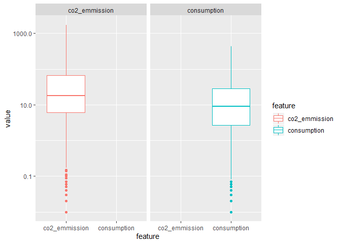
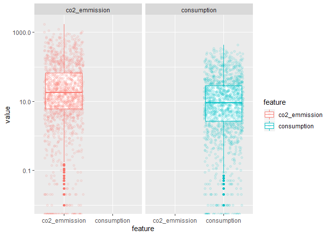
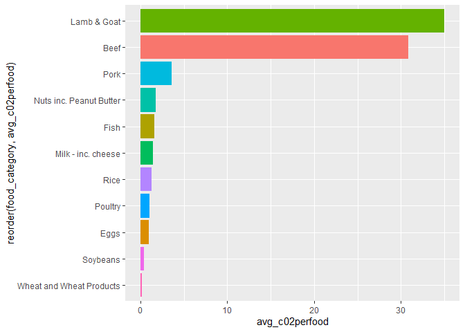
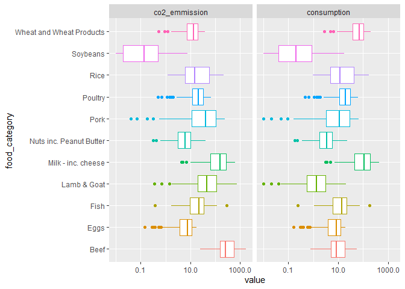
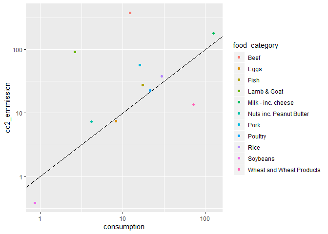
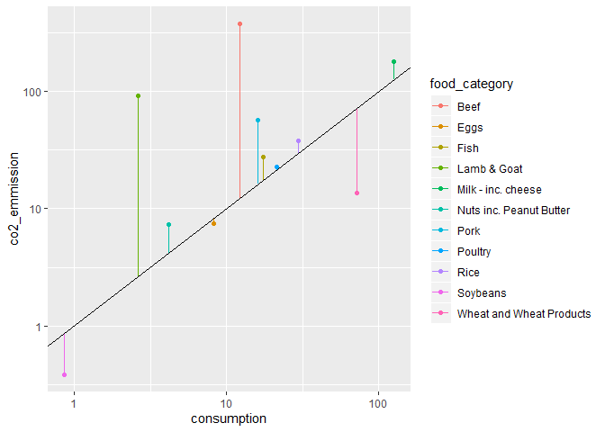
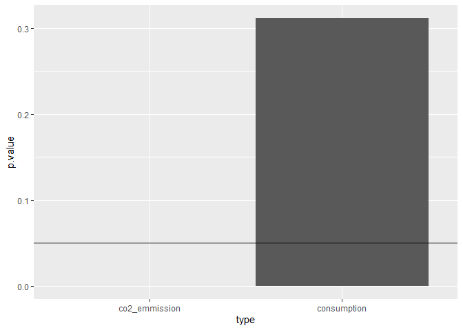
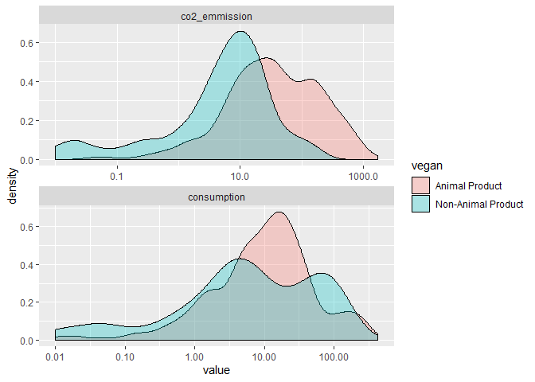

TidyTuesdayCO2Emissions
================

``` r
library(tidyverse)
```

    ## Warning: package 'tidyverse' was built under R version 3.5.3

    ## -- Attaching packages -------------------------------------------------------------------------------------------------------------------------------------------- tidyverse 1.2.1 --

    ## v ggplot2 3.2.1     v purrr   0.3.3
    ## v tibble  2.1.3     v dplyr   0.8.3
    ## v tidyr   1.0.0     v stringr 1.4.0
    ## v readr   1.3.1     v forcats 0.4.0

    ## Warning: package 'ggplot2' was built under R version 3.5.3

    ## Warning: package 'tibble' was built under R version 3.5.3

    ## Warning: package 'tidyr' was built under R version 3.5.3

    ## Warning: package 'purrr' was built under R version 3.5.3

    ## Warning: package 'dplyr' was built under R version 3.5.3

    ## Warning: package 'stringr' was built under R version 3.5.3

    ## Warning: package 'forcats' was built under R version 3.5.3

    ## -- Conflicts ----------------------------------------------------------------------------------------------------------------------------------------------- tidyverse_conflicts() --
    ## x dplyr::filter() masks stats::filter()
    ## x dplyr::lag()    masks stats::lag()

``` r
food_consumption <- readr::read_csv('https://raw.githubusercontent.com/rfordatascience/tidytuesday/master/data/2020/2020-02-18/food_consumption.csv')
```

    ## Parsed with column specification:
    ## cols(
    ##   country = col_character(),
    ##   food_category = col_character(),
    ##   consumption = col_double(),
    ##   co2_emmission = col_double()
    ## )

``` r
#Viewing the basic summary of the dataset 
#Many countries and 11 food categories
food_consumption %>% 
  summary()
```

    ##    country          food_category       consumption      co2_emmission    
    ##  Length:1430        Length:1430        Min.   :  0.000   Min.   :   0.00  
    ##  Class :character   Class :character   1st Qu.:  2.365   1st Qu.:   5.21  
    ##  Mode  :character   Mode  :character   Median :  8.890   Median :  16.53  
    ##                                        Mean   : 28.110   Mean   :  74.38  
    ##                                        3rd Qu.: 28.133   3rd Qu.:  62.60  
    ##                                        Max.   :430.760   Max.   :1712.00

``` r
#Distributions of CO2 and Consumption are not as proportional as I would imagine
options(scipen = 999)
food_consumption %>% 
  gather(key = "feature", value = "value", -country, -food_category) %>% 
  ggplot(aes(x = feature, y = value, color = feature)) + 
  geom_boxplot() +
  facet_wrap(~feature, scales = "fixed") + 
  scale_y_log10()
```

    ## Warning: Transformation introduced infinite values in continuous y-axis

    ## Warning: Removed 75 rows containing non-finite values (stat_boxplot).

<!-- -->

``` r
food_consumption %>% 
  gather(key = "feature", value = "value", -country, -food_category) %>% 
  ggplot(aes(x = feature, y = value, color = feature)) + 
  geom_boxplot() +
  geom_jitter(alpha = .1) + 
  facet_wrap(~feature, scales = "fixed") + 
  scale_y_log10()
```

    ## Warning: Transformation introduced infinite values in continuous y-axis
    
    ## Warning: Transformation introduced infinite values in continuous y-axis

    ## Warning: Removed 75 rows containing non-finite values (stat_boxplot).

<!-- -->

``` r
#Consumption = Kg ate by each person / year
#CO2 Emission = Kg of CO2 produced by each person / year

#Consumption = Kg ate by each person
#CO2 Emission = Kg of CO2 produced by each person


#For every Kg of CO2 emitted how many Kgs of food do they eat? 
#Or Kgs of Food eaten produces how many Kgs of CO2? 


food_consumption %>% 
  filter(consumption != 0) %>% 
  mutate(co2perfood = co2_emmission/consumption) %>% 
  group_by(food_category) %>% 
  summarise(avg_c02perfood = mean(co2perfood)) %>% 
  ggplot(aes(x = reorder(food_category, avg_c02perfood), y = avg_c02perfood, fill = food_category)) + 
  geom_col() + 
  coord_flip() + 
  theme(legend.position = "none")
```

<!-- -->

``` r
#Lamb & Goat is inefficient and should be avoided
#Same with beef but mostly everyone knows this 
#Rice is more inefficient than Wheat? 
```

``` r
food_consumption %>% 
  select(-country) %>% 
  gather(key = "feature", value = "value", -food_category) %>% 
  ggplot(aes(x = food_category, y = value, color = food_category)) +
  geom_boxplot() + 
  scale_y_log10() +
  facet_wrap(~feature, scales = "fixed") + 
  coord_flip() +
  theme(legend.position = "none")
```

    ## Warning: Transformation introduced infinite values in continuous y-axis

    ## Warning: Removed 75 rows containing non-finite values (stat_boxplot).

<!-- -->

``` r
food_consumption %>% 
  group_by(food_category) %>%  
  summarise(consumption = mean(consumption),
            co2_emmission = mean(co2_emmission)) %>% 
  ggplot(aes(x = consumption, y = co2_emmission, color = food_category)) + 
  geom_point() + 
  geom_abline(slope = 1) + 
  scale_x_log10() + 
  scale_y_log10()
```

<!-- -->

``` r
food_consumption %>% 
  group_by(food_category) %>%  
  summarise(consumption = mean(consumption),
            co2_emmission = mean(co2_emmission)) %>% 
  mutate(residuals = co2_emmission-consumption) %>% 
  ggplot(aes(x = consumption, y = co2_emmission, color = food_category)) + 
  geom_point() + 
  geom_segment(aes(xend = consumption, yend = consumption, x = consumption, y = co2_emmission)) + 
  geom_abline(slope = 1) + 
  scale_x_log10() + 
  scale_y_log10()
```

<!-- -->

``` r
#Top 5 consumers of each food category
food_consumption %>% 
  group_by(food_category) %>% 
  top_n(consumption, n = 5) %>% 
  arrange(food_category, -consumption) 
```

    ## # A tibble: 55 x 4
    ## # Groups:   food_category [11]
    ##    country   food_category consumption co2_emmission
    ##    <chr>     <chr>               <dbl>         <dbl>
    ##  1 Argentina Beef                 55.5        1712  
    ##  2 Brazil    Beef                 39.2        1211. 
    ##  3 USA       Beef                 36.2        1118. 
    ##  4 Australia Beef                 33.9        1045. 
    ##  5 Bermuda   Beef                 33.2        1023. 
    ##  6 Japan     Eggs                 19.2          17.6
    ##  7 Paraguay  Eggs                 18.8          17.3
    ##  8 China     Eggs                 18.8          17.2
    ##  9 Mexico    Eggs                 18.3          16.8
    ## 10 Ukraine   Eggs                 18.0          16.5
    ## # ... with 45 more rows

``` r
#Coutries that appear more than once in the top 5 consumers by food category
food_consumption %>% 
  group_by(food_category) %>% 
  top_n(consumption, n = 5) %>% 
  arrange(food_category, -consumption) %>% 
  ungroup() %>% 
  count(country, sort = TRUE) %>% 
  filter(n != 1)
```

    ## # A tibble: 7 x 2
    ##   country                  n
    ##   <chr>                <int>
    ## 1 Hong Kong SAR. China     3
    ## 2 Albania                  2
    ## 3 Iceland                  2
    ## 4 Japan                    2
    ## 5 Kuwait                   2
    ## 6 Maldives                 2
    ## 7 Myanmar                  2

``` r
#T test between animal and non animal for consumption and co2 emission 
library(broom)
```

    ## Warning: package 'broom' was built under R version 3.5.3

``` r
food_consumption %>% 
  mutate(vegan = if_else(food_category %in% c("Wheat and Wheat Products", "Rice", "Soybeans", "Nuts inc. Peanut Butter"), "Non-Animal Product", "Animal Product")) %>% 
  select(consumption, co2_emmission, vegan) %>% 
  gather(key = "type", value = "value", -vegan) %>% 
  mutate(type = as.factor(type),
         vegan = as.factor(vegan)) %>%
  group_by(type) %>% 
  do(test = t.test(value~vegan, data = (.))) %>% 
  tidy(test) %>% 
  ggplot(aes(x = type, y = p.value)) + geom_col() + geom_hline(yintercept = .05) 
```

<!-- -->

``` r
food_consumption %>% 
  mutate(vegan = if_else(food_category %in% c("Wheat and Wheat Products", "Rice", "Soybeans", "Nuts inc. Peanut Butter"), "Non-Animal Product", "Animal Product")) %>%
  group_by(country) %>% 
  top_n(consumption, n = 1) %>% 
  group_by(food_category) %>% 
  count(vegan, sort = TRUE)
```

    ## # A tibble: 4 x 3
    ## # Groups:   food_category [4]
    ##   food_category            vegan                  n
    ##   <chr>                    <chr>              <int>
    ## 1 Milk - inc. cheese       Animal Product        89
    ## 2 Rice                     Non-Animal Product    23
    ## 3 Wheat and Wheat Products Non-Animal Product    17
    ## 4 Fish                     Animal Product         1

``` r
food_consumption %>% 
  mutate(vegan = if_else(food_category %in% c("Wheat and Wheat Products", "Rice", "Soybeans", "Nuts inc. Peanut Butter"), "Non-Animal Product", "Animal Product")) %>%
  gather(key = "feature", value = "value", -country, -food_category, -vegan) %>% 
  select(-country) %>% 
  ggplot(aes(x = value, fill = vegan)) + 
  geom_density(alpha = .3) + 
  scale_x_log10() + 
  facet_wrap(~feature, scale = "free", nrow = 2) 
```

    ## Warning: Transformation introduced infinite values in continuous x-axis

    ## Warning: Removed 75 rows containing non-finite values (stat_density).

<!-- -->
