TidyTuesdayARMAModels
================
Andrew Couch
6/9/2020

``` r
library(tidyverse)
```

    ## -- Attaching packages --------------------------------- tidyverse 1.3.0 --

    ## v ggplot2 3.3.0     v purrr   0.3.4
    ## v tibble  3.0.1     v dplyr   1.0.0
    ## v tidyr   1.0.2     v stringr 1.4.0
    ## v readr   1.3.1     v forcats 0.5.0

    ## -- Conflicts ------------------------------------ tidyverse_conflicts() --
    ## x dplyr::filter() masks stats::filter()
    ## x dplyr::lag()    masks stats::lag()

``` r
library(modeldata)
library(forecast)
```

    ## Registered S3 method overwritten by 'quantmod':
    ##   method            from
    ##   as.zoo.data.frame zoo

``` r
data("Chicago")
Chicago %>% 
  glimpse()
```

    ## Rows: 5,698
    ## Columns: 50
    ## $ ridership        <dbl> 15.732, 15.762, 15.872, 15.874, 15.423, 2.425, 1.4...
    ## $ Austin           <dbl> 1.463, 1.505, 1.519, 1.490, 1.496, 0.693, 0.408, 0...
    ## $ Quincy_Wells     <dbl> 8.371, 8.351, 8.359, 7.852, 7.621, 0.911, 0.414, 4...
    ## $ Belmont          <dbl> 4.599, 4.725, 4.684, 4.769, 4.720, 2.274, 1.631, 3...
    ## $ Archer_35th      <dbl> 2.009, 2.088, 2.108, 2.166, 2.058, 0.624, 0.378, 1...
    ## $ Oak_Park         <dbl> 1.421, 1.429, 1.488, 1.445, 1.415, 0.426, 0.225, 0...
    ## $ Western          <dbl> 3.319, 3.344, 3.363, 3.359, 3.271, 1.111, 0.567, 1...
    ## $ Clark_Lake       <dbl> 15.561, 15.720, 15.558, 15.745, 15.602, 2.413, 1.3...
    ## $ Clinton          <dbl> 2.403, 2.402, 2.367, 2.415, 2.416, 0.814, 0.583, 1...
    ## $ Merchandise_Mart <dbl> 6.481, 6.477, 6.405, 6.489, 5.798, 0.858, 0.268, 4...
    ## $ Irving_Park      <dbl> 3.744, 3.853, 3.861, 3.843, 3.878, 1.735, 1.164, 2...
    ## $ Washington_Wells <dbl> 7.560, 7.576, 7.620, 7.364, 7.089, 0.786, 0.298, 4...
    ## $ Harlem           <dbl> 2.655, 2.760, 2.789, 2.812, 2.732, 1.034, 0.642, 1...
    ## $ Monroe           <dbl> 5.672, 6.013, 5.786, 5.959, 5.769, 1.044, 0.530, 3...
    ## $ Polk             <dbl> 2.481, 2.436, 2.526, 2.450, 2.573, 0.006, 0.000, 1...
    ## $ Ashland          <dbl> 1.319, 1.314, 1.324, 1.350, 1.355, 0.566, 0.347, 0...
    ## $ Kedzie           <dbl> 3.013, 3.020, 2.982, 3.013, 3.085, 1.130, 0.635, 1...
    ## $ Addison          <dbl> 2.500, 2.570, 2.587, 2.528, 2.557, 0.800, 0.487, 1...
    ## $ Jefferson_Park   <dbl> 6.595, 6.750, 6.967, 7.013, 6.922, 2.765, 1.856, 4...
    ## $ Montrose         <dbl> 1.836, 1.915, 1.977, 1.979, 1.953, 0.772, 0.475, 1...
    ## $ California       <dbl> 0.756, 0.781, 0.812, 0.776, 0.789, 0.370, 0.274, 0...
    ## $ temp_min         <dbl> 15.1, 25.0, 19.0, 15.1, 21.0, 19.0, 15.1, 26.6, 34...
    ## $ temp             <dbl> 19.45, 30.45, 25.00, 22.45, 27.00, 24.80, 18.00, 3...
    ## $ temp_max         <dbl> 30.0, 36.0, 28.9, 27.0, 32.0, 30.0, 28.9, 41.0, 43...
    ## $ temp_change      <dbl> 14.9, 11.0, 9.9, 11.9, 11.0, 11.0, 13.8, 14.4, 9.0...
    ## $ dew              <dbl> 13.45, 25.00, 18.00, 10.90, 21.90, 15.10, 10.90, 3...
    ## $ humidity         <dbl> 78.0, 79.0, 81.0, 66.5, 84.0, 71.0, 74.0, 93.0, 93...
    ## $ pressure         <dbl> 30.430, 30.190, 30.160, 30.440, 29.910, 30.280, 30...
    ## $ pressure_change  <dbl> 0.12, 0.18, 0.23, 0.16, 0.65, 0.49, 0.10, 0.78, 0....
    ## $ wind             <dbl> 5.20, 8.10, 10.40, 9.80, 12.70, 12.70, 8.10, 8.10,...
    ## $ wind_max         <dbl> 10.4, 11.5, 19.6, 16.1, 19.6, 17.3, 13.8, 17.3, 23...
    ## $ gust             <dbl> 0, 0, 0, 0, 0, 0, 0, 0, 0, 0, 0, 0, 0, 0, 0, 0, 0,...
    ## $ gust_max         <dbl> 0.0, 0.0, 0.0, 0.0, 25.3, 26.5, 0.0, 26.5, 31.1, 0...
    ## $ percip           <dbl> 0.00, 0.00, 0.00, 0.00, 0.00, 0.00, 0.00, 0.00, 0....
    ## $ percip_max       <dbl> 0.00, 0.00, 0.00, 0.00, 0.00, 0.00, 0.00, 0.07, 0....
    ## $ weather_rain     <dbl> 0.00000000, 0.00000000, 0.00000000, 0.00000000, 0....
    ## $ weather_snow     <dbl> 0.00000000, 0.00000000, 0.21428571, 0.00000000, 0....
    ## $ weather_cloud    <dbl> 0.7083333, 1.0000000, 0.3571429, 0.2916667, 0.4516...
    ## $ weather_storm    <dbl> 0.00000000, 0.20833333, 0.07142857, 0.04166667, 0....
    ## $ Blackhawks_Away  <dbl> 0, 0, 0, 0, 0, 0, 0, 0, 0, 0, 0, 0, 0, 0, 0, 0, 0,...
    ## $ Blackhawks_Home  <dbl> 0, 0, 0, 0, 0, 0, 0, 0, 0, 0, 0, 0, 0, 0, 0, 0, 0,...
    ## $ Bulls_Away       <dbl> 0, 0, 1, 0, 0, 0, 0, 0, 1, 0, 1, 0, 1, 0, 1, 1, 0,...
    ## $ Bulls_Home       <dbl> 0, 1, 0, 0, 0, 1, 0, 0, 0, 0, 0, 0, 0, 0, 0, 0, 0,...
    ## $ Bears_Away       <dbl> 0, 0, 0, 0, 0, 0, 0, 0, 0, 0, 0, 0, 0, 0, 0, 0, 0,...
    ## $ Bears_Home       <dbl> 0, 0, 0, 0, 0, 0, 0, 0, 0, 0, 0, 0, 0, 0, 0, 0, 0,...
    ## $ WhiteSox_Away    <dbl> 0, 0, 0, 0, 0, 0, 0, 0, 0, 0, 0, 0, 0, 0, 0, 0, 0,...
    ## $ WhiteSox_Home    <dbl> 0, 0, 0, 0, 0, 0, 0, 0, 0, 0, 0, 0, 0, 0, 0, 0, 0,...
    ## $ Cubs_Away        <dbl> 0, 0, 0, 0, 0, 0, 0, 0, 0, 0, 0, 0, 0, 0, 0, 0, 0,...
    ## $ Cubs_Home        <dbl> 0, 0, 0, 0, 0, 0, 0, 0, 0, 0, 0, 0, 0, 0, 0, 0, 0,...
    ## $ date             <date> 2001-01-22, 2001-01-23, 2001-01-24, 2001-01-25, 2...

``` r
library(lubridate)
```

    ## 
    ## Attaching package: 'lubridate'

    ## The following objects are masked from 'package:base':
    ## 
    ##     date, intersect, setdiff, union

``` r
#Need to clean up and evaluate the timeseries components 
Chicago %>% 
  select(ridership, date) %>% 
  ggplot(aes(x = date, y = ridership)) + 
  geom_line()
```

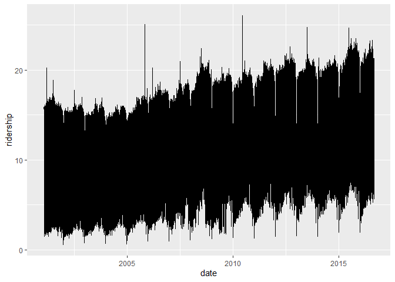<!-- -->

``` r
Chicago <- Chicago %>% 
  select(ridership, date) 


Chicago %>% 
  mutate(month_name = month.abb[month(date)],
         month = month(date),
         year = year(date)) %>% 
  mutate(year = as.factor(year)) %>% 
  ggplot(aes(x = month, y = ridership, color = year)) + geom_smooth(se = FALSE)
```

    ## `geom_smooth()` using method = 'loess' and formula 'y ~ x'

<!-- -->

``` r
Chicago %>% 
  ts() %>% 
  mstl() %>% 
  autoplot()
```

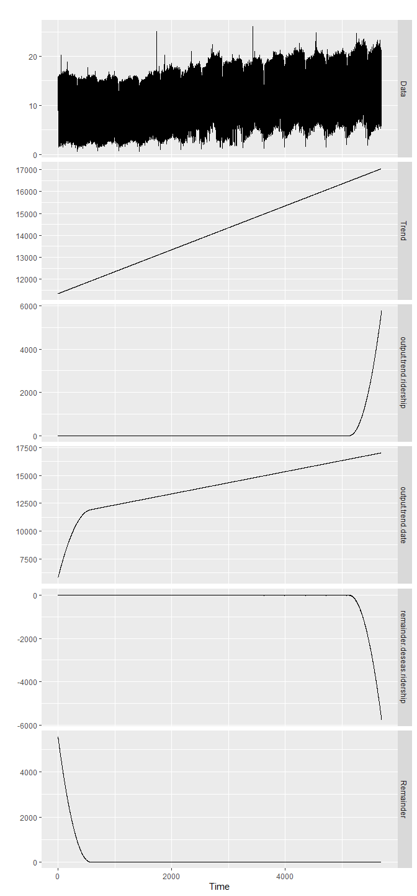<!-- -->

``` r
Chicago %>% 
  select(ridership) %>% 
  ts() %>% 
  ggtsdisplay()
```

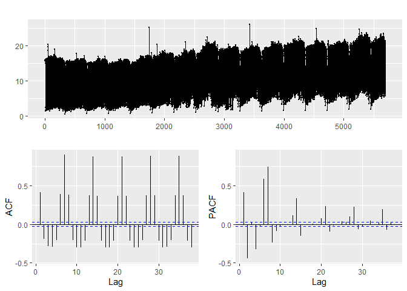<!-- -->

``` r
#We suspect this data is non-stationary so we will try using differencing
Chicago %>% 
  mutate(ridership_daily_change = ridership - lag(ridership, 1)) %>% 
  ggplot(aes(x = date, y = ridership_daily_change)) + geom_line()
```

    ## Warning: Removed 1 row(s) containing missing values (geom_path).

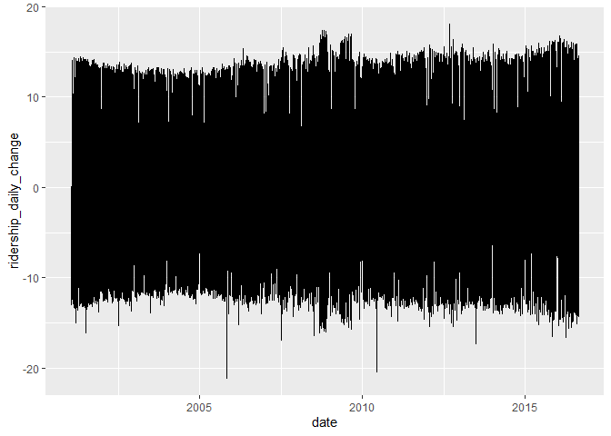<!-- -->

``` r
Chicago <- Chicago %>% 
  mutate(ridership_daily_change = ridership - lag(ridership, 1)) 


Chicago %>% 
  select(ridership_daily_change) %>% 
  ts() %>% 
  ggtsdisplay()
```

    ## Warning: Removed 1 rows containing missing values (geom_point).

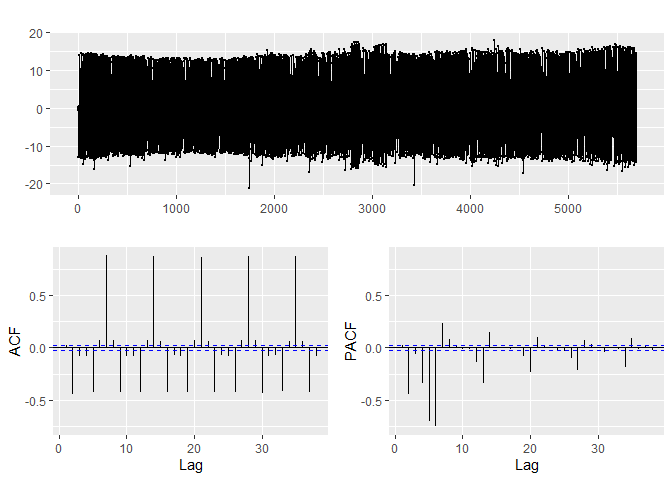<!-- -->

``` r
Chicago %>% 
  select(ridership_daily_change) %>% 
  ts() %>% 
  mstl() %>% 
  autoplot()
```

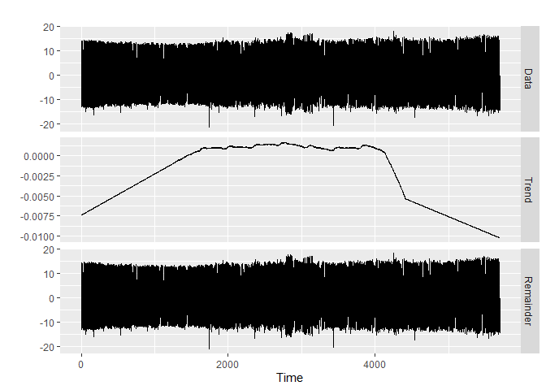<!-- -->

``` r
Chicago %>% 
  select(ridership_daily_change) %>% 
  ts() %>% 
  auto.arima() %>% 
  forecast(h = 20) %>% 
  autoplot()
```

    ## Warning: Removed 1 row(s) containing missing values (geom_path).

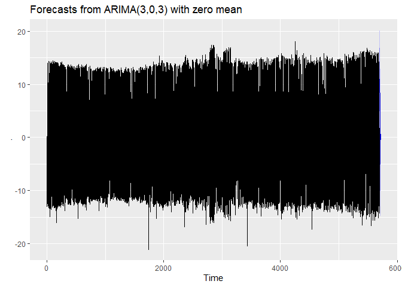<!-- -->

``` r
Chicago %>% 
  select(ridership_daily_change) %>% 
  ts() %>% 
  ets() %>% 
  forecast() %>% 
  autoplot()
```

    ## Warning in ets(.): Missing values encountered. Using longest contiguous portion
    ## of time series

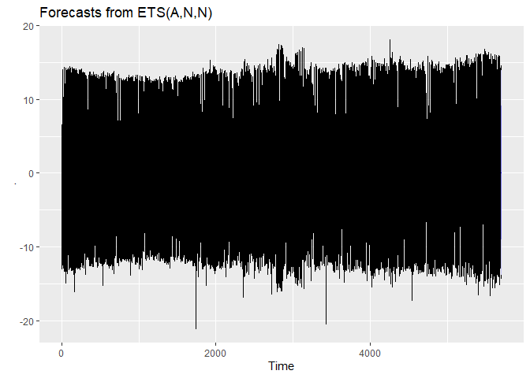<!-- -->

``` r
data("drinks")
drinks <- drinks %>% 
  rename("sales" = 2)

drinks %>% 
  select(sales) %>% 
  ts() %>% 
  ggtsdisplay()
```

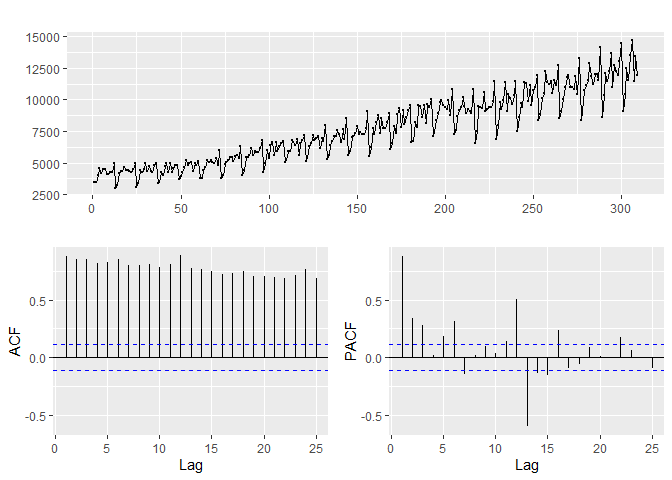<!-- -->

``` r
drinks %>% 
  select(sales) %>% 
  ts() %>% 
  mstl() %>% 
  autoplot()
```

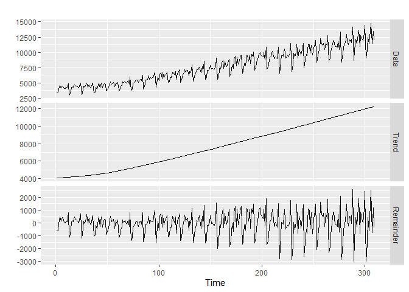<!-- -->

``` r
drinks %>% 
  select(sales) %>% 
  ts() %>% 
  auto.arima() %>% 
  forecast(h = 3) %>% 
  autoplot()
```

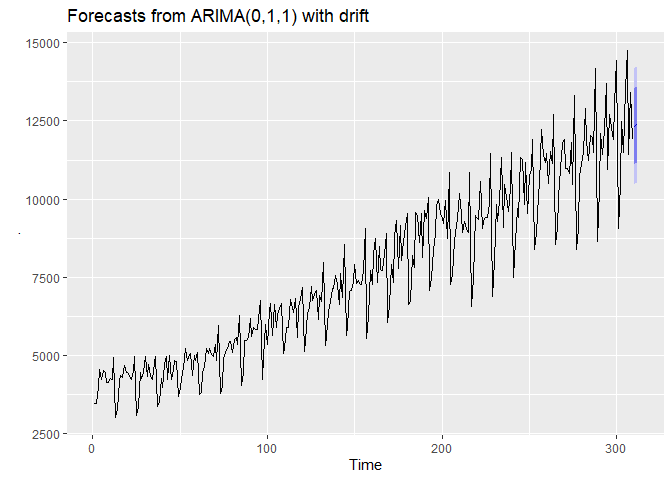<!-- -->

``` r
drinks %>% 
  mutate(log10sales = log10(sales)) %>% 
  gather(key = "key", value = "value", -date) %>% 
  ggplot(aes(x = date, y = value, color = key)) + 
  geom_line() + 
  facet_wrap(~key, scales = "free_y")
```

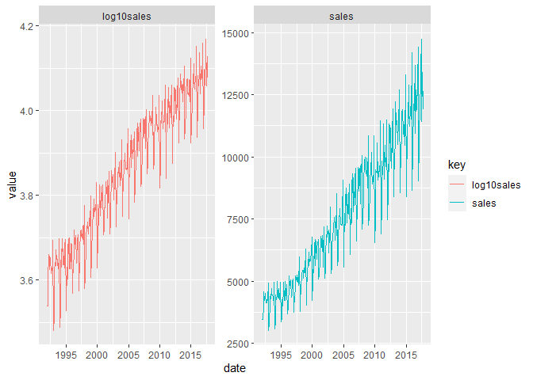<!-- -->

``` r
regular_arima <- drinks %>% 
  select(sales) %>% 
  ts() %>% 
  auto.arima()
```

``` r
logged_arima <- drinks %>% 
  select(sales) %>% 
  mutate(sales = log10(sales)) %>% 
  ts() %>% 
  auto.arima()
```

``` r
regular_arima
```

    ## Series: . 
    ## ARIMA(0,1,1) with drift 
    ## 
    ## Coefficients:
    ##           ma1    drift
    ##       -0.9595  28.0569
    ## s.e.   0.0159   2.3721
    ## 
    ## sigma^2 estimated as 899197:  log likelihood=-2548.52
    ## AIC=5103.05   AICc=5103.12   BIC=5114.24

``` r
logged_arima
```

    ## Series: . 
    ## ARIMA(2,1,1) with drift 
    ## 
    ## Coefficients:
    ##          ar1      ar2      ma1   drift
    ##       0.1523  -0.1015  -0.9654  0.0017
    ## s.e.  0.0581   0.0580   0.0147  0.0001
    ## 
    ## sigma^2 estimated as 0.002757:  log likelihood=471.3
    ## AIC=-932.59   AICc=-932.39   BIC=-913.94

``` r
library(broom)

model_data <- drinks %>% 
  mutate(time = row_number()) 
```

``` r
linear_forecast <- model_data %>% 
  mutate(month = month.abb[month(date)]) %>% 
  select(time, month, sales) %>% 
  lm(sales ~ time + month, data = .) 
```

``` r
#Looking at the residuals 
augment(linear_forecast) %>% 
  ggplot(aes(x = time, y = .std.resid)) + geom_point()
```

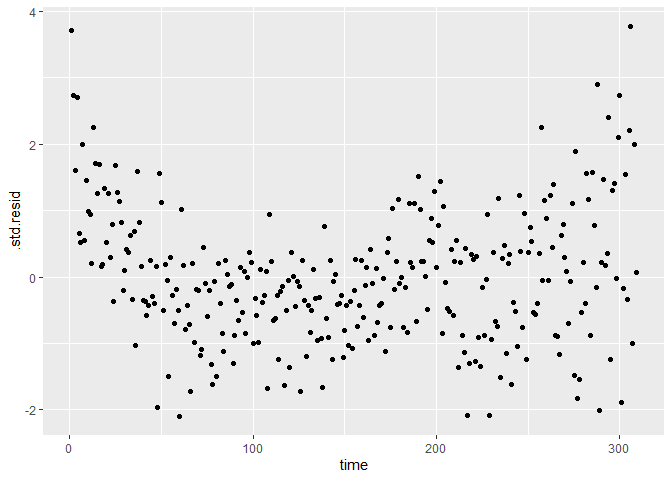<!-- -->

``` r
model_data_with_resid <-  model_data %>% 
  mutate(month = month.abb[month(date)]) %>% 
  select(time, month, sales) %>% 
  left_join(augment(linear_forecast) %>% 
  select(time, "residuals" = .std.resid),
  by = c("time" = "time")) %>% 
  mutate(lagged_residuals = lag(residuals, 1)) %>% 
  drop_na()


linear_forecast_with_resid <- lm(sales ~ time + month + lagged_residuals, data = model_data_with_resid)
```

``` r
#Charts show a small dif between models
linear_forecast_with_resid %>% glance() %>% 
  mutate(model  = "resid") %>% 
  rbind(linear_forecast %>% glance() %>% 
  mutate(model  = "no resid")) %>% 
  gather(key = "key", value = "value", -model) %>% 
  ggplot(aes(x = model, y = value, fill = model)) + geom_col() + facet_wrap(~key, scales = "free")
```

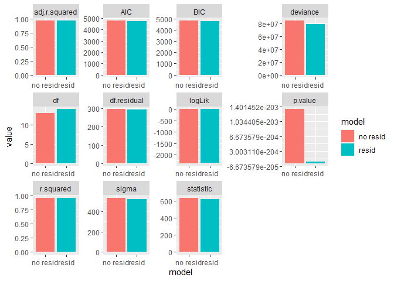<!-- -->

``` r
linear_forecast_with_resid %>% glance() %>% 
  mutate(model  = "resid") %>% 
  rbind(linear_forecast %>% glance() %>% 
  mutate(model  = "no resid")) 
```

    ## # A tibble: 2 x 12
    ##   r.squared adj.r.squared sigma statistic   p.value    df logLik   AIC   BIC
    ##       <dbl>         <dbl> <dbl>     <dbl>     <dbl> <int>  <dbl> <dbl> <dbl>
    ## 1     0.965         0.963  520.      621. 4.66e-205    14 -2356. 4742. 4798.
    ## 2     0.963         0.961  535.      639. 1.33e-203    13 -2373. 4774. 4827.
    ## # ... with 3 more variables: deviance <dbl>, df.residual <int>, model <chr>

``` r
#Lets add a tranformation 
log_linear_forecast_with_resid <- lm(log(sales, 10) ~ time + month + lagged_residuals, data = model_data_with_resid)
```

``` r
log_linear_forecast_with_resid %>% 
  augment() %>% 
  rename("sales" = 1) %>% 
  mutate(sales = 10^sales,
         .fitted = 10^.fitted) %>% 
  mutate(error = abs(sales- .fitted)) %>% 
  summarise(mae = mean(error))
```

    ## # A tibble: 1 x 1
    ##     mae
    ##   <dbl>
    ## 1  311.

``` r
linear_forecast_with_resid %>% augment() %>% 
  mutate(error = abs(sales - .fitted)) %>% 
  summarise(mae = mean(error))
```

    ## # A tibble: 1 x 1
    ##     mae
    ##   <dbl>
    ## 1  395.
