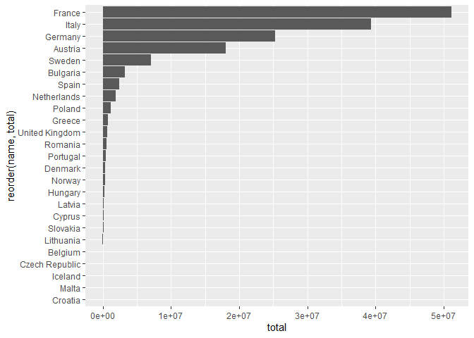
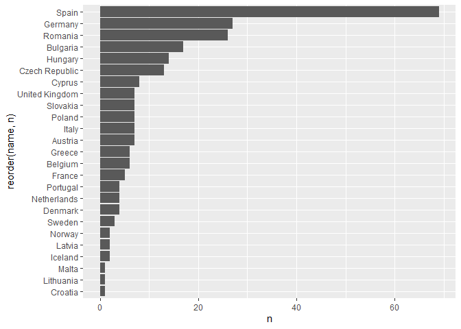
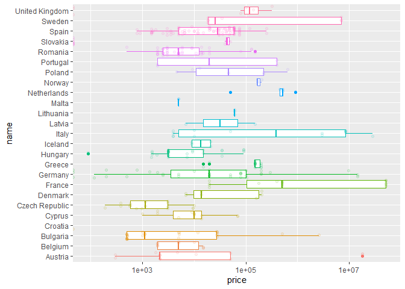
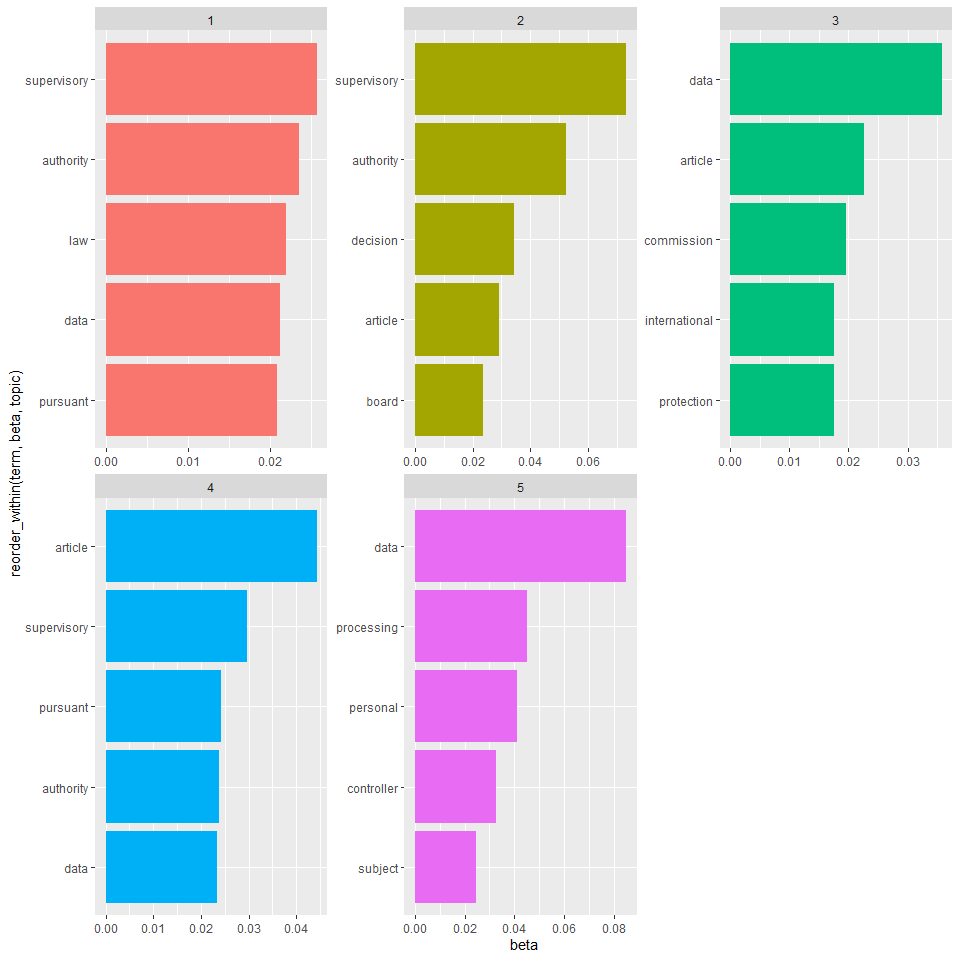
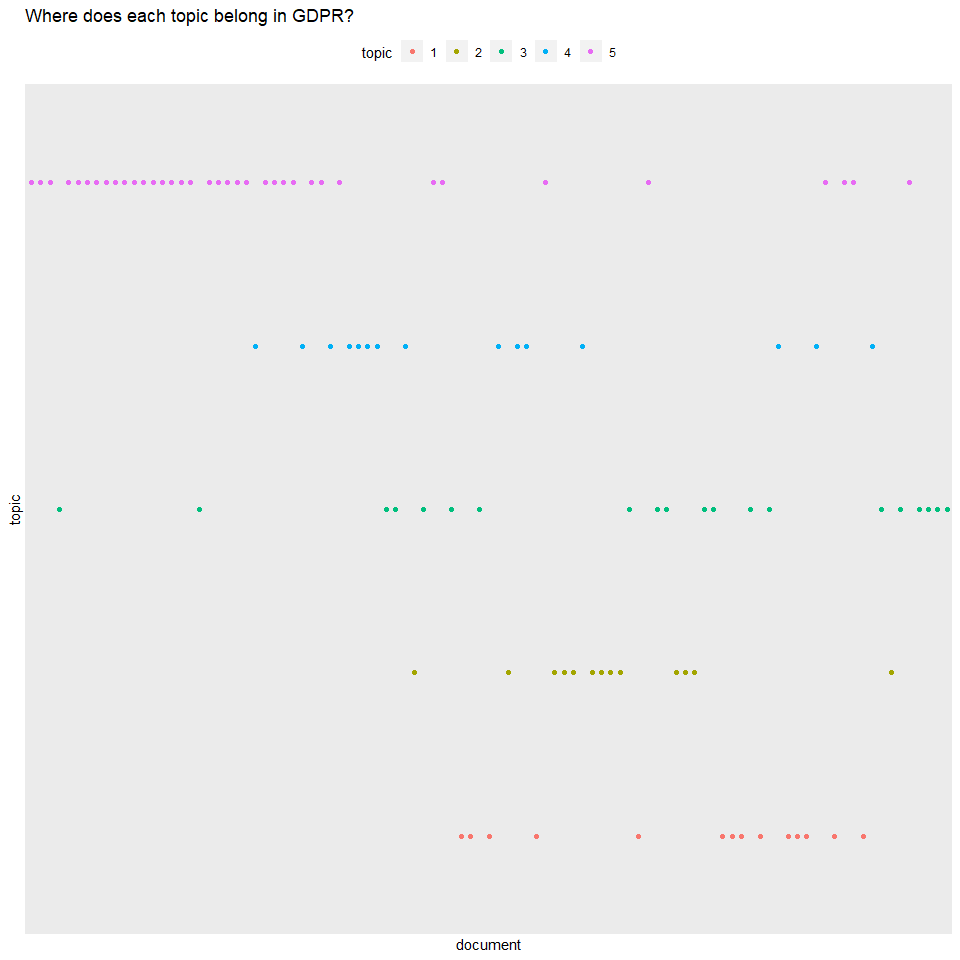
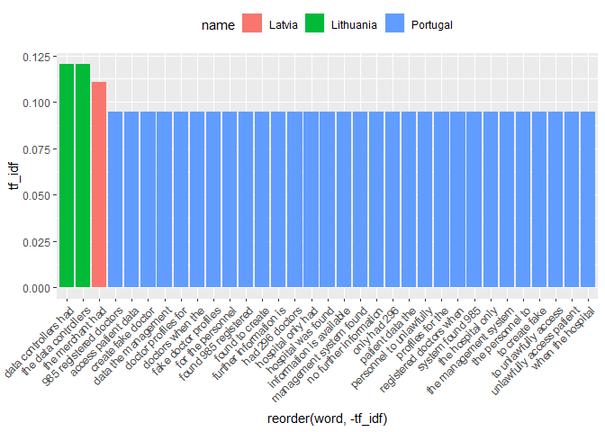

TidyTuesdayGDPR
================
Andrew Couch
4/21/2020

``` r
library(tidyverse)
```

    ## Warning: package 'tidyverse' was built under R version 3.5.3

    ## -- Attaching packages ------------------------------------------------------------------------------------------------------------------------------------------------------------------------------------------ tidyverse 1.2.1 --

    ## v ggplot2 3.2.1     v purrr   0.3.3
    ## v tibble  2.1.3     v dplyr   0.8.3
    ## v tidyr   1.0.0     v stringr 1.4.0
    ## v readr   1.3.1     v forcats 0.4.0

    ## Warning: package 'ggplot2' was built under R version 3.5.3

    ## Warning: package 'tibble' was built under R version 3.5.3

    ## Warning: package 'tidyr' was built under R version 3.5.3

    ## Warning: package 'purrr' was built under R version 3.5.3

    ## Warning: package 'dplyr' was built under R version 3.5.3

    ## Warning: package 'stringr' was built under R version 3.5.3

    ## Warning: package 'forcats' was built under R version 3.5.3

    ## -- Conflicts --------------------------------------------------------------------------------------------------------------------------------------------------------------------------------------------- tidyverse_conflicts() --
    ## x dplyr::filter() masks stats::filter()
    ## x dplyr::lag()    masks stats::lag()

``` r
gdpr_violations <- readr::read_tsv('https://raw.githubusercontent.com/rfordatascience/tidytuesday/master/data/2020/2020-04-21/gdpr_violations.tsv')
```

    ## Parsed with column specification:
    ## cols(
    ##   id = col_double(),
    ##   picture = col_character(),
    ##   name = col_character(),
    ##   price = col_double(),
    ##   authority = col_character(),
    ##   date = col_character(),
    ##   controller = col_character(),
    ##   article_violated = col_character(),
    ##   type = col_character(),
    ##   source = col_character(),
    ##   summary = col_character()
    ## )

``` r
gdpr_text <- readr::read_tsv('https://raw.githubusercontent.com/rfordatascience/tidytuesday/master/data/2020/2020-04-21/gdpr_text.tsv')
```

    ## Parsed with column specification:
    ## cols(
    ##   chapter = col_double(),
    ##   chapter_title = col_character(),
    ##   article = col_double(),
    ##   article_title = col_character(),
    ##   sub_article = col_double(),
    ##   gdpr_text = col_character(),
    ##   href = col_character()
    ## )

``` r
#France, Italy, and Germany have the highest amount of fines
gdpr_violations %>% 
  group_by(name) %>% 
  summarise(total = sum(price)) %>% 
  ungroup() %>% 
  ggplot(aes(x = reorder(name, total), y = total)) + geom_col() + coord_flip()
```

<!-- -->

``` r
#Spain, Germany, and Romana have been fined the most frequently 
gdpr_violations %>% 
  count(name, name) %>%  
  ggplot(aes(x = reorder(name, n), y = n)) + geom_col() + coord_flip()
```

<!-- -->

``` r
gdpr_text %>% 
  select(article, sub_article) %>% 
  distinct()
```

    ## # A tibble: 425 x 2
    ##    article sub_article
    ##      <dbl>       <dbl>
    ##  1       1           1
    ##  2       1           2
    ##  3       1           3
    ##  4       2           1
    ##  5       2           2
    ##  6       2           3
    ##  7       2           4
    ##  8       3           1
    ##  9       3           2
    ## 10       3           3
    ## # ... with 415 more rows

``` r
#Key to link the violations with text
gdpr_text %>% 
  select(article, article_title, text = gdpr_text) %>% 
  distinct()
```

    ## # A tibble: 425 x 3
    ##    article article_title          text                                     
    ##      <dbl> <chr>                  <chr>                                    
    ##  1       1 Subject-matter and ob~ This Regulation lays down rules relating~
    ##  2       1 Subject-matter and ob~ This Regulation protects fundamental rig~
    ##  3       1 Subject-matter and ob~ The free movement of personal data withi~
    ##  4       2 Material scope         This Regulation applies to the processin~
    ##  5       2 Material scope         "This Regulation does not apply to the p~
    ##  6       2 Material scope         For the processing of personal data by t~
    ##  7       2 Material scope         This Regulation shall be without prejudi~
    ##  8       3 Territorial scope      This Regulation applies to the processin~
    ##  9       3 Territorial scope      "This Regulation applies to the processi~
    ## 10       3 Territorial scope      the monitoring of their behaviour as far~
    ## # ... with 415 more rows

``` r
#GDPR Violations with the extracted article
gdpr_price <- gdpr_violations %>% 
  select(date, name, price, article_violated) %>% 
  separate_rows(article_violated, sep = "\\|") %>% 
  mutate(article = str_extract(article_violated, "[0-9][0-9]?")) %>% 
  select(-article_violated)
```

``` r
gdpr_price %>% 
  ggplot(aes(x = name, y = price, color = name)) + geom_boxplot(show.legend = FALSE) + geom_jitter(alpha = .1, show.legend = FALSE) + coord_flip() + scale_y_log10()
```

    ## Warning: Transformation introduced infinite values in continuous y-axis
    
    ## Warning: Transformation introduced infinite values in continuous y-axis

    ## Warning: Removed 15 rows containing non-finite values (stat_boxplot).

<!-- -->

``` r
library(tidytext)
```

    ## Warning: package 'tidytext' was built under R version 3.5.3

``` r
#Conversion of n-grams
gdbr_words <- gdpr_text %>% 
  select(article, text = gdpr_text) %>% 
  unnest_tokens("word", "text", token = "words")

gdbr_bigrams <- gdpr_text %>% 
  select(article, text = gdpr_text) %>% 
  unnest_tokens("word", "text", token = "ngrams", n = 2)

gdbr_trigrams <- gdpr_text %>% 
  select(article, text = gdpr_text) %>% 
  unnest_tokens("word", "text", token = "ngrams", n = 3)
```

``` r
gdbr_words %>% 
  anti_join(stop_words) %>% 
  count(word, sort = TRUE) %>% 
  top_n(n, n = 5) 
```

    ## Joining, by = "word"

    ## # A tibble: 5 x 2
    ##   word            n
    ##   <chr>       <int>
    ## 1 data          593
    ## 2 article       331
    ## 3 processing    284
    ## 4 supervisory   283
    ## 5 personal      256

``` r
#These articles have the most amount of sentiment positive and negative
gdbr_words %>% 
  inner_join(get_sentiments(lexicon = "bing")) %>% 
  group_by(article) %>% 
  count(sentiment) %>% 
  group_by(sentiment) %>% 
  top_n(n, n = 3)
```

    ## Joining, by = "word"

    ## # A tibble: 6 x 3
    ## # Groups:   sentiment [2]
    ##   article sentiment     n
    ##     <dbl> <chr>     <int>
    ## 1      14 positive     30
    ## 2      45 positive     23
    ## 3      60 negative     30
    ## 4      65 negative     24
    ## 5      70 positive     48
    ## 6      83 negative     32

``` r
gdpr_text %>% select(gdpr_text)
```

    ## # A tibble: 425 x 1
    ##    gdpr_text                                                               
    ##    <chr>                                                                   
    ##  1 This Regulation lays down rules relating to the protection of natural p~
    ##  2 This Regulation protects fundamental rights and freedoms of natural per~
    ##  3 The free movement of personal data within the Union shall be neither re~
    ##  4 This Regulation applies to the processing of personal data wholly or pa~
    ##  5 "This Regulation does not apply to the processing of personal data\nin ~
    ##  6 For the processing of personal data by the Union institutions, bodies, ~
    ##  7 This Regulation shall be without prejudice to the application of Direct~
    ##  8 This Regulation applies to the processing of personal data in the conte~
    ##  9 "This Regulation applies to the processing of personal data of data sub~
    ## 10 the monitoring of their behaviour as far as their behaviour takes place~
    ## # ... with 415 more rows

``` r
library(topicmodels)
```

    ## Warning: package 'topicmodels' was built under R version 3.5.3

``` r
gdpr_dtm <- gdbr_words %>% 
  count(article, word) %>% 
  anti_join(stop_words) %>% 
  cast_dtm(document = "article", term = "word", value = "n")
```

    ## Joining, by = "word"

``` r
gdpr_topic_model <- LDA(gdpr_dtm, k = 5)
```

``` r
#What terms make up a topic?
tidy(gdpr_topic_model, matrix = "beta") %>% 
  group_by(topic) %>% 
  top_n(beta, n = 5) %>% 
  ungroup() %>% 
  mutate(topic = as.factor(topic)) %>% 
  ggplot(aes(x = reorder_within(term, beta, topic), y = beta, fill = topic)) + 
  geom_col() + 
  scale_x_reordered() + 
  coord_flip() + 
  facet_wrap(~topic, scales = "free") + 
  theme(legend.position = "none")
```

<!-- -->

``` r
#Where does the topic belong in the GDPR article? 
tidy(gdpr_topic_model, matrix = "gamma") %>% 
  group_by(document) %>% 
  top_n(gamma, n = 1) %>% 
  ungroup() %>% 
  mutate(topic = as.factor(topic)) %>% 
  ggplot(aes(x = document, y = topic, color = topic)) + 
  geom_point() + 
  theme(legend.position = "top") +
  scale_x_discrete(breaks = NULL) + 
  scale_y_discrete(breaks = NULL) + 
  ggtitle("Where does each topic belong in GDPR?")
```

<!-- -->

``` r
#Instead of topic modeling let's do something simpler and faster 
gdpr_tf <- gdbr_words %>% 
  count(article, word) %>% 
  bind_tf_idf(word, article, n) %>% 
  group_by(article) %>% 
  top_n(tf_idf, n =3) %>% 
  ungroup() %>% 
  arrange(article, -tf_idf)
gdpr_tf
```

    ## # A tibble: 347 x 6
    ##    article word           n      tf   idf tf_idf
    ##      <dbl> <chr>      <int>   <dbl> <dbl>  <dbl>
    ##  1       1 movement       2 0.0241   3.50 0.0843
    ##  2       1 free           2 0.0241   2.52 0.0606
    ##  3       1 protects       1 0.0120   4.60 0.0554
    ##  4       2 2001           2 0.00893  3.90 0.0348
    ##  5       2 filing         2 0.00893  3.90 0.0348
    ##  6       2 prevention     2 0.00893  3.90 0.0348
    ##  7       3 applies        4 0.0276   2.29 0.0632
    ##  8       3 takes          2 0.0138   3.50 0.0482
    ##  9       3 behaviour      2 0.0138   3.21 0.0443
    ## 10       4 means         30 0.0233   1.38 0.0320
    ## # ... with 337 more rows

``` r
library(tidylo)
gdpr_log <- gdbr_words %>% 
  count(article, word) %>% 
  bind_log_odds(article, word, n) %>% 
  group_by(article) %>% 
  top_n(log_odds, n = 3) %>% 
  ungroup() %>% 
  arrange(article, -log_odds)

gdpr_log
```

    ## # A tibble: 391 x 4
    ##    article word           n log_odds
    ##      <dbl> <chr>      <int>    <dbl>
    ##  1       1 movement       2    1.19 
    ##  2       1 protects       1    1.13 
    ##  3       1 connected      1    0.844
    ##  4       1 lays           1    0.844
    ##  5       1 prohibited     1    0.844
    ##  6       1 restricted     1    0.844
    ##  7       2 2001           2    1.35 
    ##  8       2 filing         2    1.35 
    ##  9       2 course         2    1.18 
    ## 10       2 system         2    1.18 
    ## # ... with 381 more rows

``` r
#What are predictions are different? 
setdiff(gdpr_tf %>% select(article, word),
gdpr_log %>% select(article, word))
```

    ## # A tibble: 89 x 2
    ##    article word        
    ##      <dbl> <chr>       
    ##  1       1 free        
    ##  2       2 prevention  
    ##  3       3 takes       
    ##  4       3 behaviour   
    ##  5       5 incompatible
    ##  6       6 processing  
    ##  7       7 withdraw    
    ##  8       7 withdrawal  
    ##  9      10 criminal    
    ## 10      10 official    
    ## # ... with 79 more rows

``` r
shared_words <- intersect(gdpr_tf %>% select(article, word, article),
gdpr_log %>% select(article, word, article)) 

shared_words
```

    ## # A tibble: 258 x 2
    ##    article word     
    ##      <dbl> <chr>    
    ##  1       1 movement 
    ##  2       1 protects 
    ##  3       2 2001     
    ##  4       2 filing   
    ##  5       3 applies  
    ##  6       4 means    
    ##  7       4 person   
    ##  8       4 natural  
    ##  9       5 purposes 
    ## 10       5 processed
    ## # ... with 248 more rows

``` r
gdpr_violations %>% 
  unnest_tokens("word", "summary", token = "ngrams", n = 3,drop = TRUE) %>% 
  select(name, word) %>% 
  count(name, word) %>% 
  bind_tf_idf(word, name, n) %>% 
  group_by(name) %>% 
  top_n(tf_idf, n = 3) %>% 
  ungroup() %>% 
  select(name, word, tf_idf) %>% 
  top_n(tf_idf, n = 4) %>% 
  ggplot(aes(x = reorder(word, -tf_idf), y = tf_idf, fill = name)) + geom_col() + theme(legend.position = "top", axis.text.x = element_text(angle = 45, hjust = 1))
```

<!-- -->
