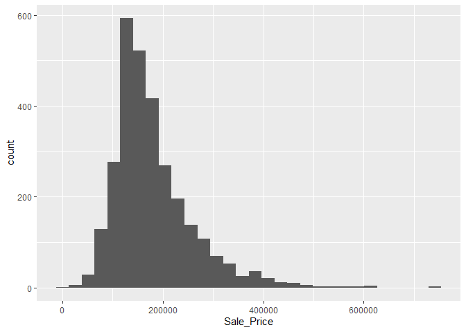
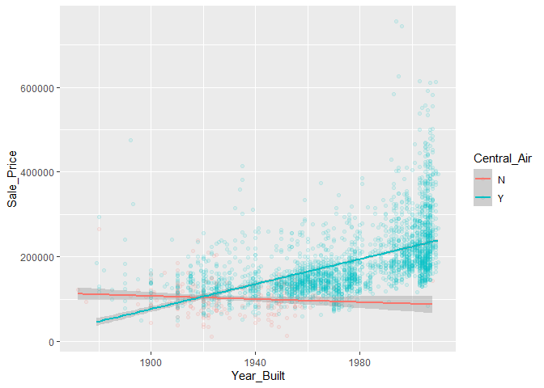
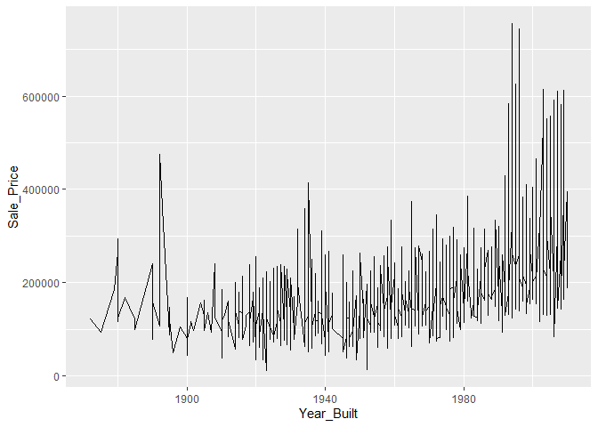
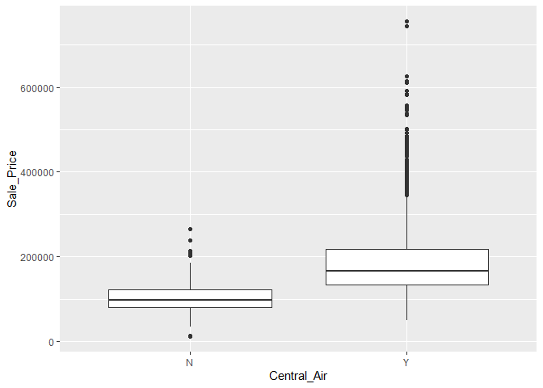

TidyTuesdayInteractionEffects
================

``` r
library(tidymodels)
```

    ## -- Attaching packages ------------------------------------------- tidymodels 0.1.0 --

    ## v broom     0.5.6      v recipes   0.1.12
    ## v dials     0.0.6      v rsample   0.0.6 
    ## v dplyr     1.0.0      v tibble    3.0.1 
    ## v ggplot2   3.3.0      v tune      0.1.0 
    ## v infer     0.5.1      v workflows 0.1.1 
    ## v parsnip   0.1.0      v yardstick 0.0.6 
    ## v purrr     0.3.4

    ## -- Conflicts ---------------------------------------------- tidymodels_conflicts() --
    ## x purrr::discard()  masks scales::discard()
    ## x dplyr::filter()   masks stats::filter()
    ## x dplyr::lag()      masks stats::lag()
    ## x ggplot2::margin() masks dials::margin()
    ## x recipes::step()   masks stats::step()

``` r
library(tidyverse)
```

    ## -- Attaching packages -------------------------------------------- tidyverse 1.3.0 --

    ## v tidyr   1.0.2     v stringr 1.4.0
    ## v readr   1.3.1     v forcats 0.5.0

    ## -- Conflicts ----------------------------------------------- tidyverse_conflicts() --
    ## x readr::col_factor() masks scales::col_factor()
    ## x purrr::discard()    masks scales::discard()
    ## x dplyr::filter()     masks stats::filter()
    ## x stringr::fixed()    masks recipes::fixed()
    ## x dplyr::lag()        masks stats::lag()
    ## x ggplot2::margin()   masks dials::margin()
    ## x readr::spec()       masks yardstick::spec()

``` r
library(AmesHousing)
options(scipen = 999)
ames_data <- make_ames()
```

    ## Warning: `funs()` is deprecated as of dplyr 0.8.0.
    ## Please use a list of either functions or lambdas: 
    ## 
    ##   # Simple named list: 
    ##   list(mean = mean, median = median)
    ## 
    ##   # Auto named with `tibble::lst()`: 
    ##   tibble::lst(mean, median)
    ## 
    ##   # Using lambdas
    ##   list(~ mean(., trim = .2), ~ median(., na.rm = TRUE))
    ## This warning is displayed once every 8 hours.
    ## Call `lifecycle::last_warnings()` to see where this warning was generated.

``` r
ames_data %>% glimpse()
```

    ## Rows: 2,930
    ## Columns: 81
    ## $ MS_SubClass        <fct> One_Story_1946_and_Newer_All_Styles, One_Story_1...
    ## $ MS_Zoning          <fct> Residential_Low_Density, Residential_High_Densit...
    ## $ Lot_Frontage       <dbl> 141, 80, 81, 93, 74, 78, 41, 43, 39, 60, 75, 0, ...
    ## $ Lot_Area           <int> 31770, 11622, 14267, 11160, 13830, 9978, 4920, 5...
    ## $ Street             <fct> Pave, Pave, Pave, Pave, Pave, Pave, Pave, Pave, ...
    ## $ Alley              <fct> No_Alley_Access, No_Alley_Access, No_Alley_Acces...
    ## $ Lot_Shape          <fct> Slightly_Irregular, Regular, Slightly_Irregular,...
    ## $ Land_Contour       <fct> Lvl, Lvl, Lvl, Lvl, Lvl, Lvl, Lvl, HLS, Lvl, Lvl...
    ## $ Utilities          <fct> AllPub, AllPub, AllPub, AllPub, AllPub, AllPub, ...
    ## $ Lot_Config         <fct> Corner, Inside, Corner, Corner, Inside, Inside, ...
    ## $ Land_Slope         <fct> Gtl, Gtl, Gtl, Gtl, Gtl, Gtl, Gtl, Gtl, Gtl, Gtl...
    ## $ Neighborhood       <fct> North_Ames, North_Ames, North_Ames, North_Ames, ...
    ## $ Condition_1        <fct> Norm, Feedr, Norm, Norm, Norm, Norm, Norm, Norm,...
    ## $ Condition_2        <fct> Norm, Norm, Norm, Norm, Norm, Norm, Norm, Norm, ...
    ## $ Bldg_Type          <fct> OneFam, OneFam, OneFam, OneFam, OneFam, OneFam, ...
    ## $ House_Style        <fct> One_Story, One_Story, One_Story, One_Story, Two_...
    ## $ Overall_Qual       <fct> Above_Average, Average, Above_Average, Good, Ave...
    ## $ Overall_Cond       <fct> Average, Above_Average, Above_Average, Average, ...
    ## $ Year_Built         <int> 1960, 1961, 1958, 1968, 1997, 1998, 2001, 1992, ...
    ## $ Year_Remod_Add     <int> 1960, 1961, 1958, 1968, 1998, 1998, 2001, 1992, ...
    ## $ Roof_Style         <fct> Hip, Gable, Hip, Hip, Gable, Gable, Gable, Gable...
    ## $ Roof_Matl          <fct> CompShg, CompShg, CompShg, CompShg, CompShg, Com...
    ## $ Exterior_1st       <fct> BrkFace, VinylSd, Wd Sdng, BrkFace, VinylSd, Vin...
    ## $ Exterior_2nd       <fct> Plywood, VinylSd, Wd Sdng, BrkFace, VinylSd, Vin...
    ## $ Mas_Vnr_Type       <fct> Stone, None, BrkFace, None, None, BrkFace, None,...
    ## $ Mas_Vnr_Area       <dbl> 112, 0, 108, 0, 0, 20, 0, 0, 0, 0, 0, 0, 0, 0, 0...
    ## $ Exter_Qual         <fct> Typical, Typical, Typical, Good, Typical, Typica...
    ## $ Exter_Cond         <fct> Typical, Typical, Typical, Typical, Typical, Typ...
    ## $ Foundation         <fct> CBlock, CBlock, CBlock, CBlock, PConc, PConc, PC...
    ## $ Bsmt_Qual          <fct> Typical, Typical, Typical, Typical, Good, Typica...
    ## $ Bsmt_Cond          <fct> Good, Typical, Typical, Typical, Typical, Typica...
    ## $ Bsmt_Exposure      <fct> Gd, No, No, No, No, No, Mn, No, No, No, No, No, ...
    ## $ BsmtFin_Type_1     <fct> BLQ, Rec, ALQ, ALQ, GLQ, GLQ, GLQ, ALQ, GLQ, Unf...
    ## $ BsmtFin_SF_1       <dbl> 2, 6, 1, 1, 3, 3, 3, 1, 3, 7, 7, 1, 7, 3, 3, 1, ...
    ## $ BsmtFin_Type_2     <fct> Unf, LwQ, Unf, Unf, Unf, Unf, Unf, Unf, Unf, Unf...
    ## $ BsmtFin_SF_2       <dbl> 0, 144, 0, 0, 0, 0, 0, 0, 0, 0, 0, 0, 0, 0, 1120...
    ## $ Bsmt_Unf_SF        <dbl> 441, 270, 406, 1045, 137, 324, 722, 1017, 415, 9...
    ## $ Total_Bsmt_SF      <dbl> 1080, 882, 1329, 2110, 928, 926, 1338, 1280, 159...
    ## $ Heating            <fct> GasA, GasA, GasA, GasA, GasA, GasA, GasA, GasA, ...
    ## $ Heating_QC         <fct> Fair, Typical, Typical, Excellent, Good, Excelle...
    ## $ Central_Air        <fct> Y, Y, Y, Y, Y, Y, Y, Y, Y, Y, Y, Y, Y, Y, Y, Y, ...
    ## $ Electrical         <fct> SBrkr, SBrkr, SBrkr, SBrkr, SBrkr, SBrkr, SBrkr,...
    ## $ First_Flr_SF       <int> 1656, 896, 1329, 2110, 928, 926, 1338, 1280, 161...
    ## $ Second_Flr_SF      <int> 0, 0, 0, 0, 701, 678, 0, 0, 0, 776, 892, 0, 676,...
    ## $ Low_Qual_Fin_SF    <int> 0, 0, 0, 0, 0, 0, 0, 0, 0, 0, 0, 0, 0, 0, 0, 0, ...
    ## $ Gr_Liv_Area        <int> 1656, 896, 1329, 2110, 1629, 1604, 1338, 1280, 1...
    ## $ Bsmt_Full_Bath     <dbl> 1, 0, 0, 1, 0, 0, 1, 0, 1, 0, 0, 1, 0, 1, 1, 1, ...
    ## $ Bsmt_Half_Bath     <dbl> 0, 0, 0, 0, 0, 0, 0, 0, 0, 0, 0, 0, 0, 0, 0, 0, ...
    ## $ Full_Bath          <int> 1, 1, 1, 2, 2, 2, 2, 2, 2, 2, 2, 2, 2, 1, 1, 3, ...
    ## $ Half_Bath          <int> 0, 0, 1, 1, 1, 1, 0, 0, 0, 1, 1, 0, 1, 1, 1, 1, ...
    ## $ Bedroom_AbvGr      <int> 3, 2, 3, 3, 3, 3, 2, 2, 2, 3, 3, 3, 3, 2, 1, 4, ...
    ## $ Kitchen_AbvGr      <int> 1, 1, 1, 1, 1, 1, 1, 1, 1, 1, 1, 1, 1, 1, 1, 1, ...
    ## $ Kitchen_Qual       <fct> Typical, Typical, Good, Excellent, Typical, Good...
    ## $ TotRms_AbvGrd      <int> 7, 5, 6, 8, 6, 7, 6, 5, 5, 7, 7, 6, 7, 5, 4, 12,...
    ## $ Functional         <fct> Typ, Typ, Typ, Typ, Typ, Typ, Typ, Typ, Typ, Typ...
    ## $ Fireplaces         <int> 2, 0, 0, 2, 1, 1, 0, 0, 1, 1, 1, 0, 1, 1, 0, 1, ...
    ## $ Fireplace_Qu       <fct> Good, No_Fireplace, No_Fireplace, Typical, Typic...
    ## $ Garage_Type        <fct> Attchd, Attchd, Attchd, Attchd, Attchd, Attchd, ...
    ## $ Garage_Finish      <fct> Fin, Unf, Unf, Fin, Fin, Fin, Fin, RFn, RFn, Fin...
    ## $ Garage_Cars        <dbl> 2, 1, 1, 2, 2, 2, 2, 2, 2, 2, 2, 2, 2, 2, 2, 3, ...
    ## $ Garage_Area        <dbl> 528, 730, 312, 522, 482, 470, 582, 506, 608, 442...
    ## $ Garage_Qual        <fct> Typical, Typical, Typical, Typical, Typical, Typ...
    ## $ Garage_Cond        <fct> Typical, Typical, Typical, Typical, Typical, Typ...
    ## $ Paved_Drive        <fct> Partial_Pavement, Paved, Paved, Paved, Paved, Pa...
    ## $ Wood_Deck_SF       <int> 210, 140, 393, 0, 212, 360, 0, 0, 237, 140, 157,...
    ## $ Open_Porch_SF      <int> 62, 0, 36, 0, 34, 36, 0, 82, 152, 60, 84, 21, 75...
    ## $ Enclosed_Porch     <int> 0, 0, 0, 0, 0, 0, 170, 0, 0, 0, 0, 0, 0, 0, 0, 0...
    ## $ Three_season_porch <int> 0, 0, 0, 0, 0, 0, 0, 0, 0, 0, 0, 0, 0, 0, 0, 0, ...
    ## $ Screen_Porch       <int> 0, 120, 0, 0, 0, 0, 0, 144, 0, 0, 0, 0, 0, 0, 14...
    ## $ Pool_Area          <int> 0, 0, 0, 0, 0, 0, 0, 0, 0, 0, 0, 0, 0, 0, 0, 0, ...
    ## $ Pool_QC            <fct> No_Pool, No_Pool, No_Pool, No_Pool, No_Pool, No_...
    ## $ Fence              <fct> No_Fence, Minimum_Privacy, No_Fence, No_Fence, M...
    ## $ Misc_Feature       <fct> None, None, Gar2, None, None, None, None, None, ...
    ## $ Misc_Val           <int> 0, 0, 12500, 0, 0, 0, 0, 0, 0, 0, 0, 500, 0, 0, ...
    ## $ Mo_Sold            <int> 5, 6, 6, 4, 3, 6, 4, 1, 3, 6, 4, 3, 5, 2, 6, 6, ...
    ## $ Year_Sold          <int> 2010, 2010, 2010, 2010, 2010, 2010, 2010, 2010, ...
    ## $ Sale_Type          <fct> WD , WD , WD , WD , WD , WD , WD , WD , WD , WD ...
    ## $ Sale_Condition     <fct> Normal, Normal, Normal, Normal, Normal, Normal, ...
    ## $ Sale_Price         <int> 215000, 105000, 172000, 244000, 189900, 195500, ...
    ## $ Longitude          <dbl> -93.61975, -93.61976, -93.61939, -93.61732, -93....
    ## $ Latitude           <dbl> 42.05403, 42.05301, 42.05266, 42.05125, 42.06090...

``` r
ames_data %>% 
  select(Sale_Price) %>% 
  ggplot(aes(Sale_Price)) + geom_histogram()
```

    ## `stat_bin()` using `bins = 30`. Pick better value with `binwidth`.

<!-- -->

``` r
ames_data %>% 
  select(Sale_Price, Year_Built, Central_Air) %>% 
  ggplot(aes(x = Year_Built, y = Sale_Price, color = Central_Air)) + 
  geom_point(alpha = .1) + 
  geom_smooth(method = "lm")
```

    ## `geom_smooth()` using formula 'y ~ x'

<!-- -->

``` r
ames_data %>% 
  select(Sale_Price, Year_Built) %>% 
  ggplot(aes(x = Year_Built, y = Sale_Price)) + 
  geom_line()
```

<!-- -->

``` r
ames_data %>% 
  select(Sale_Price, Central_Air) %>% 
  ggplot(aes(x = Central_Air, y = Sale_Price)) + geom_boxplot()
```

<!-- -->

``` r
library(broom)

#This seems like a lot of work and might not pan out
lm(Sale_Price~., data = ames_data) %>% tidy() %>% filter(p.value <= .05)
```

    ## # A tibble: 92 x 5
    ##    term                                    estimate std.error statistic  p.value
    ##    <chr>                                      <dbl>     <dbl>     <dbl>    <dbl>
    ##  1 MS_SubClassDuplex_All_Styles_and_Ages -18129.      4.67e+3     -3.88 1.06e- 4
    ##  2 MS_SubClassOne_Story_PUD_1946_and_Ne~ -17747.      8.53e+3     -2.08 3.77e- 2
    ##  3 MS_SubClassTwo_Story_PUD_1946_and_Ne~ -19686.      1.00e+4     -1.96 4.99e- 2
    ##  4 Lot_Area                                   0.565   7.80e-2      7.24 5.75e-13
    ##  5 StreetPave                             17897.      7.38e+3      2.43 1.53e- 2
    ##  6 Land_ContourHLS                         7625.      3.20e+3      2.38 1.74e- 2
    ##  7 Lot_ConfigCulDSac                       4119.      2.09e+3      1.97 4.90e- 2
    ##  8 Lot_ConfigFR2                          -6163.      2.69e+3     -2.29 2.19e- 2
    ##  9 Land_SlopeSev                         -25173.      7.81e+3     -3.22 1.28e- 3
    ## 10 NeighborhoodSomerset                   19101.      4.64e+3      4.11 4.01e- 5
    ## # ... with 82 more rows

``` r
#Can't just generate all pairwise combinations when there is a lot of features 
lm(Sepal.Length~.^2, data = iris) %>% tidy() %>% summarise(adjusted_pvalue = p.adjust(p.value, method = "fdr"))
```

    ## # A tibble: 15 x 1
    ##    adjusted_pvalue
    ##              <dbl>
    ##  1           0.331
    ##  2           0.109
    ##  3           0.828
    ##  4           0.331
    ##  5           0.331
    ##  6           0.331
    ##  7           0.946
    ##  8           0.366
    ##  9           0.709
    ## 10           0.630
    ## 11           0.828
    ## 12           0.366
    ## 13           0.366
    ## 14           0.630
    ## 15           0.910

``` r
#Select the numerical features first and create a model
#Generate a model with only numerical features
numerical_features <- ames_data %>% 
  select(Sale_Price, where(is.numeric)) %>% 
  lm(Sale_Price~., data = .) %>% 
  tidy() %>% 
  filter(p.value <= .05) %>% 
  select(term)

#Generate a model with only categorical features
categorical_features <- ames_data %>% 
  select(Sale_Price, where(is.factor)) %>% 
  rename_if(is.factor, .funs = ~paste(., "/", sep = "")) %>% 
  lm(Sale_Price~., data = .) %>% 
  tidy() %>% 
  filter(p.value <= .05) %>% 
  select(term) %>% 
  mutate(new_term = str_replace_all(term, "\\/.*", "")) %>% 
  mutate(new_term = str_replace(new_term, "`", "")) %>% 
  select(new_term)
```

``` r
#Created data for modeling
main_effects_data <- ames_data %>% 
  select(Sale_Price, any_of(numerical_features$term), any_of(categorical_features$new_term))

#Renamed columns for each feature/data type
main_effects_data <- main_effects_data %>% 
  rename_if(is.factor, .funs = ~paste(., "_Dummy", sep = "")) %>% 
  rename_if(is.numeric, .funs = ~paste(., "_Numeric", sep = "")) %>% 
  rename("Sale_Price" = 1)
```

``` r
set.seed(2020)
#Create train and test splits 
tidy_split <- initial_split(main_effects_data, prop = .8)
tidy_train <- training(tidy_split)
tidy_test <- testing(tidy_split)

#Create k-folds 
tidy_kfolds <- vfold_cv(tidy_train)
```

``` r
#Create basic recipe for a main effects model/baseline
main_effects_recipe <- recipe(Sale_Price~., 
                              data = tidy_train) %>% 
  step_dummy(all_nominal()) %>% 
  step_center(all_predictors())

#Create the interactions 
interaction_effects_recipe <- recipe(Sale_Price~., 
       data = tidy_train) %>% 
  step_dummy(all_nominal()) %>% 
  step_interact(~contains("Dummy"):contains("Numeric")) %>% 
  step_center(all_predictors())

#That's a lot of features, we will need to do some feature elimination
interaction_effects_recipe %>% prep() %>% bake(tidy_train %>% head()) %>% colnames() %>% length()
```

    ## [1] 4848

``` r
#Create a lasso model
lasso_model <- linear_reg(penalty = tune(), mixture = 1) %>% 
  set_mode("regression") %>% 
  set_engine("glmnet")

#Define model parameters
lasso_info <- parameters(lasso_model)

#Create the workflows

#Main effects model workflow
main_wf <- workflow() %>% 
  add_recipe(main_effects_recipe) %>% 
  add_model(lasso_model)

#Interaction Effects model workflow
int_wf <- workflow() %>% 
  add_recipe(interaction_effects_recipe) %>% 
  add_model(lasso_model)
```

``` r
#Create the tune grid for the models 
lasso_grid <- grid_regular(lasso_info, levels = 15)

#Tune models using grid search

main_res <- tune_grid(
  main_wf,
  resamples = tidy_kfolds,
  grid = lasso_grid
)


int_res <- tune_grid(
  int_wf,
  resamples = tidy_kfolds,
  grid = lasso_grid
)
```

``` r
#Extract model parameter
main_tune <- main_res %>% select_best("rmse")
int_tune <- int_res %>% select_best("rmse")

#Finalize the workflow for modeling
main_wf <- main_wf %>% finalize_workflow(main_tune)
int_wf <- int_wf %>% finalize_workflow(int_tune)
```

``` r
#Get test metrics
main_wf %>% last_fit(tidy_split) %>% collect_metrics()
```

    ## # A tibble: 2 x 3
    ##   .metric .estimator .estimate
    ##   <chr>   <chr>          <dbl>
    ## 1 rmse    standard   53264.   
    ## 2 rsq     standard       0.628

``` r
int_wf %>% last_fit(tidy_split) %>% collect_metrics()
```

    ## # A tibble: 2 x 3
    ##   .metric .estimator .estimate
    ##   <chr>   <chr>          <dbl>
    ## 1 rmse    standard   51734.   
    ## 2 rsq     standard       0.637

``` r
#Create our final models
main_effects_model <- fit(main_wf, main_effects_data)
interaction_effects_model <- fit(int_wf, main_effects_data)
```

``` r
post_main_model <- main_effects_model %>% pull_workflow_fit()
post_main_model %>% pluck("fit") %>% coef(s = main_tune$penalty) %>% tidy()
```

    ## Warning: 'tidy.dgCMatrix' is deprecated.
    ## See help("Deprecated")

    ## Warning: 'tidy.dgTMatrix' is deprecated.
    ## See help("Deprecated")

    ##                                                             row column
    ## 1                                                   (Intercept)      1
    ## 2                                          Lot_Frontage_Numeric      1
    ## 3                                              Lot_Area_Numeric      1
    ## 4                                            Year_Built_Numeric      1
    ## 5                                        Year_Remod_Add_Numeric      1
    ## 6                                          Mas_Vnr_Area_Numeric      1
    ## 7                                          BsmtFin_SF_2_Numeric      1
    ## 8                                           Bsmt_Unf_SF_Numeric      1
    ## 9                                         Total_Bsmt_SF_Numeric      1
    ## 10                                         First_Flr_SF_Numeric      1
    ## 11                                        Second_Flr_SF_Numeric      1
    ## 12                                       Bsmt_Full_Bath_Numeric      1
    ## 13                                        Bedroom_AbvGr_Numeric      1
    ## 14                                        Kitchen_AbvGr_Numeric      1
    ## 15                                        TotRms_AbvGrd_Numeric      1
    ## 16                                           Fireplaces_Numeric      1
    ## 17                                          Garage_Cars_Numeric      1
    ## 18                                          Garage_Area_Numeric      1
    ## 19                                         Wood_Deck_SF_Numeric      1
    ## 20                                       Enclosed_Porch_Numeric      1
    ## 21                                         Screen_Porch_Numeric      1
    ## 22                                            Pool_Area_Numeric      1
    ## 23                                             Misc_Val_Numeric      1
    ## 24                                             Latitude_Numeric      1
    ## 25                   MS_SubClass_Dummy_One_Story_1945_and_Older      1
    ## 26     MS_SubClass_Dummy_One_Story_with_Finished_Attic_All_Ages      1
    ## 27     MS_SubClass_Dummy_One_and_Half_Story_Unfinished_All_Ages      1
    ## 28       MS_SubClass_Dummy_One_and_Half_Story_Finished_All_Ages      1
    ## 29                   MS_SubClass_Dummy_Two_Story_1946_and_Newer      1
    ## 30                   MS_SubClass_Dummy_Two_Story_1945_and_Older      1
    ## 31                MS_SubClass_Dummy_Two_and_Half_Story_All_Ages      1
    ## 32                                MS_SubClass_Dummy_Split_Foyer      1
    ## 33                 MS_SubClass_Dummy_Duplex_All_Styles_and_Ages      1
    ## 34               MS_SubClass_Dummy_One_Story_PUD_1946_and_Newer      1
    ## 35            MS_SubClass_Dummy_One_and_Half_Story_PUD_All_Ages      1
    ## 36               MS_SubClass_Dummy_Two_Story_PUD_1946_and_Newer      1
    ## 37           MS_SubClass_Dummy_PUD_Multilevel_Split_Level_Foyer      1
    ## 38  MS_SubClass_Dummy_Two_Family_conversion_All_Styles_and_Ages      1
    ## 39                     MS_Zoning_Dummy_Residential_High_Density      1
    ## 40                      MS_Zoning_Dummy_Residential_Low_Density      1
    ## 41                   MS_Zoning_Dummy_Residential_Medium_Density      1
    ## 42                                        MS_Zoning_Dummy_A_agr      1
    ## 43                                        MS_Zoning_Dummy_C_all      1
    ## 44                                        MS_Zoning_Dummy_I_all      1
    ## 45                           Lot_Shape_Dummy_Slightly_Irregular      1
    ## 46                         Lot_Shape_Dummy_Moderately_Irregular      1
    ## 47                                    Lot_Shape_Dummy_Irregular      1
    ## 48                                       Land_Contour_Dummy_HLS      1
    ## 49                                       Land_Contour_Dummy_Low      1
    ## 50                                       Land_Contour_Dummy_Lvl      1
    ## 51                                     Lot_Config_Dummy_CulDSac      1
    ## 52                                         Lot_Config_Dummy_FR2      1
    ## 53                                         Lot_Config_Dummy_FR3      1
    ## 54                                      Lot_Config_Dummy_Inside      1
    ## 55                                         Land_Slope_Dummy_Mod      1
    ## 56                                         Land_Slope_Dummy_Sev      1
    ## 57                             Neighborhood_Dummy_College_Creek      1
    ## 58                                  Neighborhood_Dummy_Old_Town      1
    ## 59                                   Neighborhood_Dummy_Edwards      1
    ## 60                                  Neighborhood_Dummy_Somerset      1
    ## 61                        Neighborhood_Dummy_Northridge_Heights      1
    ## 62                                   Neighborhood_Dummy_Gilbert      1
    ## 63                                    Neighborhood_Dummy_Sawyer      1
    ## 64                            Neighborhood_Dummy_Northwest_Ames      1
    ## 65                               Neighborhood_Dummy_Sawyer_West      1
    ## 66                                  Neighborhood_Dummy_Mitchell      1
    ## 67                                 Neighborhood_Dummy_Brookside      1
    ## 68                                  Neighborhood_Dummy_Crawford      1
    ## 69                    Neighborhood_Dummy_Iowa_DOT_and_Rail_Road      1
    ## 70                                Neighborhood_Dummy_Timberland      1
    ## 71                                Neighborhood_Dummy_Northridge      1
    ## 72                               Neighborhood_Dummy_Stone_Brook      1
    ## 73   Neighborhood_Dummy_South_and_West_of_Iowa_State_University      1
    ## 74                               Neighborhood_Dummy_Clear_Creek      1
    ## 75                            Neighborhood_Dummy_Meadow_Village      1
    ## 76                                 Neighborhood_Dummy_Briardale      1
    ## 77                       Neighborhood_Dummy_Bloomington_Heights      1
    ## 78                                   Neighborhood_Dummy_Veenker      1
    ## 79                           Neighborhood_Dummy_Northpark_Villa      1
    ## 80                                   Neighborhood_Dummy_Blueste      1
    ## 81                                    Neighborhood_Dummy_Greens      1
    ## 82                               Neighborhood_Dummy_Green_Hills      1
    ## 83                                  Neighborhood_Dummy_Landmark      1
    ## 84                                      Condition_1_Dummy_Feedr      1
    ## 85                                       Condition_1_Dummy_Norm      1
    ## 86                                       Condition_1_Dummy_PosA      1
    ## 87                                       Condition_1_Dummy_PosN      1
    ## 88                                       Condition_1_Dummy_RRAe      1
    ## 89                                       Condition_1_Dummy_RRAn      1
    ## 90                                       Condition_1_Dummy_RRNe      1
    ## 91                                       Condition_1_Dummy_RRNn      1
    ## 92                                      Condition_2_Dummy_Feedr      1
    ## 93                                       Condition_2_Dummy_Norm      1
    ## 94                                       Condition_2_Dummy_PosA      1
    ## 95                                       Condition_2_Dummy_PosN      1
    ## 96                                       Condition_2_Dummy_RRAe      1
    ## 97                                       Condition_2_Dummy_RRAn      1
    ## 98                                       Condition_2_Dummy_RRNn      1
    ## 99                           House_Style_Dummy_One_and_Half_Unf      1
    ## 100                                 House_Style_Dummy_One_Story      1
    ## 101                                    House_Style_Dummy_SFoyer      1
    ## 102                                      House_Style_Dummy_SLvl      1
    ## 103                          House_Style_Dummy_Two_and_Half_Fin      1
    ## 104                          House_Style_Dummy_Two_and_Half_Unf      1
    ## 105                                 House_Style_Dummy_Two_Story      1
    ## 106                                     Overall_Qual_Dummy_Poor      1
    ## 107                                     Overall_Qual_Dummy_Fair      1
    ## 108                            Overall_Qual_Dummy_Below_Average      1
    ## 109                                  Overall_Qual_Dummy_Average      1
    ## 110                            Overall_Qual_Dummy_Above_Average      1
    ## 111                                     Overall_Qual_Dummy_Good      1
    ## 112                                Overall_Qual_Dummy_Very_Good      1
    ## 113                                Overall_Qual_Dummy_Excellent      1
    ## 114                           Overall_Qual_Dummy_Very_Excellent      1
    ## 115                                      Roof_Style_Dummy_Gable      1
    ## 116                                    Roof_Style_Dummy_Gambrel      1
    ## 117                                        Roof_Style_Dummy_Hip      1
    ## 118                                    Roof_Style_Dummy_Mansard      1
    ## 119                                       Roof_Style_Dummy_Shed      1
    ## 120                                     Roof_Matl_Dummy_CompShg      1
    ## 121                                     Roof_Matl_Dummy_Membran      1
    ## 122                                       Roof_Matl_Dummy_Metal      1
    ## 123                                        Roof_Matl_Dummy_Roll      1
    ## 124                                     Roof_Matl_Dummy_Tar.Grv      1
    ## 125                                     Roof_Matl_Dummy_WdShake      1
    ## 126                                     Roof_Matl_Dummy_WdShngl      1
    ## 127                                  Exterior_1st_Dummy_AsphShn      1
    ## 128                                  Exterior_1st_Dummy_BrkComm      1
    ## 129                                  Exterior_1st_Dummy_BrkFace      1
    ## 130                                   Exterior_1st_Dummy_CBlock      1
    ## 131                                  Exterior_1st_Dummy_CemntBd      1
    ## 132                                  Exterior_1st_Dummy_HdBoard      1
    ## 133                                  Exterior_1st_Dummy_ImStucc      1
    ## 134                                  Exterior_1st_Dummy_MetalSd      1
    ## 135                                  Exterior_1st_Dummy_Plywood      1
    ## 136                                  Exterior_1st_Dummy_PreCast      1
    ## 137                                    Exterior_1st_Dummy_Stone      1
    ## 138                                   Exterior_1st_Dummy_Stucco      1
    ## 139                                  Exterior_1st_Dummy_VinylSd      1
    ## 140                                  Exterior_1st_Dummy_Wd.Sdng      1
    ## 141                                  Exterior_1st_Dummy_WdShing      1
    ## 142                                       Exter_Qual_Dummy_Fair      1
    ## 143                                       Exter_Qual_Dummy_Good      1
    ## 144                                    Exter_Qual_Dummy_Typical      1
    ## 145                                     Foundation_Dummy_CBlock      1
    ## 146                                      Foundation_Dummy_PConc      1
    ## 147                                       Foundation_Dummy_Slab      1
    ## 148                                      Foundation_Dummy_Stone      1
    ## 149                                       Foundation_Dummy_Wood      1
    ## 150                                        Bsmt_Qual_Dummy_Fair      1
    ## 151                                        Bsmt_Qual_Dummy_Good      1
    ## 152                                 Bsmt_Qual_Dummy_No_Basement      1
    ## 153                                        Bsmt_Qual_Dummy_Poor      1
    ## 154                                     Bsmt_Qual_Dummy_Typical      1
    ## 155                                      Bsmt_Exposure_Dummy_Gd      1
    ## 156                                      Bsmt_Exposure_Dummy_Mn      1
    ## 157                                      Bsmt_Exposure_Dummy_No      1
    ## 158                             Bsmt_Exposure_Dummy_No_Basement      1
    ## 159                                    BsmtFin_Type_1_Dummy_BLQ      1
    ## 160                                    BsmtFin_Type_1_Dummy_GLQ      1
    ## 161                                    BsmtFin_Type_1_Dummy_LwQ      1
    ## 162                            BsmtFin_Type_1_Dummy_No_Basement      1
    ## 163                                    BsmtFin_Type_1_Dummy_Rec      1
    ## 164                                    BsmtFin_Type_1_Dummy_Unf      1
    ## 165                                       Heating_QC_Dummy_Fair      1
    ## 166                                       Heating_QC_Dummy_Good      1
    ## 167                                       Heating_QC_Dummy_Poor      1
    ## 168                                    Heating_QC_Dummy_Typical      1
    ## 169                                         Central_Air_Dummy_Y      1
    ## 170                                     Kitchen_Qual_Dummy_Fair      1
    ## 171                                     Kitchen_Qual_Dummy_Good      1
    ## 172                                     Kitchen_Qual_Dummy_Poor      1
    ## 173                                  Kitchen_Qual_Dummy_Typical      1
    ## 174                                       Functional_Dummy_Maj2      1
    ## 175                                       Functional_Dummy_Min1      1
    ## 176                                       Functional_Dummy_Min2      1
    ## 177                                        Functional_Dummy_Mod      1
    ## 178                                        Functional_Dummy_Sal      1
    ## 179                                        Functional_Dummy_Sev      1
    ## 180                                        Functional_Dummy_Typ      1
    ## 181                                     Fireplace_Qu_Dummy_Fair      1
    ## 182                                     Fireplace_Qu_Dummy_Good      1
    ## 183                             Fireplace_Qu_Dummy_No_Fireplace      1
    ## 184                                     Fireplace_Qu_Dummy_Poor      1
    ## 185                                  Fireplace_Qu_Dummy_Typical      1
    ## 186                                   Garage_Type_Dummy_Basment      1
    ## 187                                   Garage_Type_Dummy_BuiltIn      1
    ## 188                                   Garage_Type_Dummy_CarPort      1
    ## 189                                    Garage_Type_Dummy_Detchd      1
    ## 190                       Garage_Type_Dummy_More_Than_Two_Types      1
    ## 191                                 Garage_Type_Dummy_No_Garage      1
    ## 192                                      Garage_Qual_Dummy_Fair      1
    ## 193                                      Garage_Qual_Dummy_Good      1
    ## 194                                 Garage_Qual_Dummy_No_Garage      1
    ## 195                                      Garage_Qual_Dummy_Poor      1
    ## 196                                   Garage_Qual_Dummy_Typical      1
    ## 197                                      Garage_Cond_Dummy_Fair      1
    ## 198                                      Garage_Cond_Dummy_Good      1
    ## 199                                 Garage_Cond_Dummy_No_Garage      1
    ## 200                                      Garage_Cond_Dummy_Poor      1
    ## 201                                   Garage_Cond_Dummy_Typical      1
    ## 202                                          Pool_QC_Dummy_Fair      1
    ## 203                                          Pool_QC_Dummy_Good      1
    ## 204                                       Pool_QC_Dummy_No_Pool      1
    ## 205                                       Pool_QC_Dummy_Typical      1
    ## 206                                     Misc_Feature_Dummy_Gar2      1
    ## 207                                     Misc_Feature_Dummy_None      1
    ## 208                                     Misc_Feature_Dummy_Othr      1
    ## 209                                     Misc_Feature_Dummy_Shed      1
    ## 210                                     Misc_Feature_Dummy_TenC      1
    ## 211                                         Sale_Type_Dummy_Con      1
    ## 212                                       Sale_Type_Dummy_ConLD      1
    ## 213                                       Sale_Type_Dummy_ConLI      1
    ## 214                                       Sale_Type_Dummy_ConLw      1
    ## 215                                         Sale_Type_Dummy_CWD      1
    ## 216                                         Sale_Type_Dummy_New      1
    ## 217                                         Sale_Type_Dummy_Oth      1
    ## 218                                         Sale_Type_Dummy_VWD      1
    ## 219                                         Sale_Type_Dummy_WD.      1
    ## 220                                Sale_Condition_Dummy_AdjLand      1
    ## 221                                 Sale_Condition_Dummy_Alloca      1
    ## 222                                 Sale_Condition_Dummy_Family      1
    ## 223                                 Sale_Condition_Dummy_Normal      1
    ## 224                                Sale_Condition_Dummy_Partial      1
    ##               value
    ## 1    180796.0600683
    ## 2        12.1021191
    ## 3         0.4947571
    ## 4       283.5705641
    ## 5       216.2139759
    ## 6        13.0042426
    ## 7        -5.9306652
    ## 8       -19.9239586
    ## 9        35.0217875
    ## 10       50.5036772
    ## 11       60.6714446
    ## 12     1274.3646790
    ## 13    -3155.3872889
    ## 14   -10415.8091040
    ## 15      730.2689073
    ## 16     8280.8918915
    ## 17     4155.1893984
    ## 18       11.1743017
    ## 19        9.3971257
    ## 20        5.3390806
    ## 21       42.3752096
    ## 22       -3.9342732
    ## 23       -0.8691515
    ## 24   287044.3422105
    ## 25     4294.3430321
    ## 26    15826.1403526
    ## 27    11528.6093596
    ## 28     5429.9047483
    ## 29    -1350.3363401
    ## 30     7932.3425888
    ## 31    -5258.5335600
    ## 32      717.0000625
    ## 33   -13717.4735298
    ## 34   -21383.6610256
    ## 35   -43553.4480916
    ## 36   -27191.3828114
    ## 37   -19925.4129289
    ## 38    -8007.3847520
    ## 39     5003.0890375
    ## 40     2629.2531038
    ## 41    -1847.0092604
    ## 42   -19750.3786859
    ## 43   -15116.6249334
    ## 44   -21724.9167496
    ## 45     -807.4102034
    ## 46     4639.8449214
    ## 47     1043.1348266
    ## 48     6947.4926363
    ## 49    -3356.5113044
    ## 50     4562.9869095
    ## 51     3976.2277529
    ## 52    -6837.7851866
    ## 53    -2701.4152853
    ## 54     -810.7036270
    ## 55     5238.0348225
    ## 56   -21034.2888143
    ## 57     7972.1375141
    ## 58     1869.8397283
    ## 59     1500.8608620
    ## 60    17615.3624712
    ## 61    18657.3462338
    ## 62    -3601.8505732
    ## 63     6942.0284254
    ## 64     -801.1758879
    ## 65     3329.2329541
    ## 66    12280.6552602
    ## 67    10488.8708222
    ## 68    28767.1069773
    ## 69    10348.0504534
    ## 70    16281.8713641
    ## 71    31707.4036500
    ## 72    38487.5932963
    ## 73     6902.2260183
    ## 74    12308.0346768
    ## 75    22207.8308820
    ## 76    14538.5588926
    ## 77     4601.2138524
    ## 78     3847.1868055
    ## 79    22461.3275897
    ## 80    28635.3403048
    ## 81     8790.9023912
    ## 82   132556.8483250
    ## 83    13247.0201668
    ## 84     1636.7588672
    ## 85    11211.1892435
    ## 86    15022.0807376
    ## 87    13788.5938852
    ## 88    -3574.7488124
    ## 89     7150.2153609
    ## 90     1065.1293868
    ## 91    -2652.8431217
    ## 92    -5784.8992088
    ## 93      423.8886615
    ## 94    23268.1854378
    ## 95  -128214.9805220
    ## 96   -19432.4710995
    ## 97     4850.1965513
    ## 98    13696.3259022
    ## 99     3878.1229010
    ## 100    6347.7284292
    ## 101    3942.1731035
    ## 102    3491.5484342
    ## 103    8368.3683381
    ## 104    7748.5832855
    ## 105     -88.0013291
    ## 106  -13479.4797406
    ## 107  -11715.9592448
    ## 108   -7557.9667576
    ## 109   -2511.7948799
    ## 110    1342.0015211
    ## 111    6737.2830078
    ## 112   20758.4543971
    ## 113   53189.9220355
    ## 114   86442.4781159
    ## 115     262.5459929
    ## 116   -3431.2809113
    ## 117     896.1157827
    ## 118  -14381.0216947
    ## 119   -9236.4450515
    ## 120  644145.6616832
    ## 121  706936.7870547
    ## 122  665799.5313495
    ## 123  657333.4533486
    ## 124  638738.0462821
    ## 125  646874.4944420
    ## 126  695806.0967027
    ## 127     344.0301539
    ## 128    8788.1731910
    ## 129   18164.4552036
    ## 130   -5804.8565107
    ## 131    4028.1119232
    ## 132     405.7316308
    ## 133  -15567.7879772
    ## 134    4946.7360240
    ## 135    1316.6627757
    ## 136   62905.4004238
    ## 137    2219.2646897
    ## 138    4341.0890746
    ## 139    3230.2930063
    ## 140    2108.2752867
    ## 141     461.8823139
    ## 142  -13058.4946674
    ## 143  -12856.5583762
    ## 144  -14174.7568975
    ## 145     842.8818724
    ## 146    1852.9489855
    ## 147    1065.9500936
    ## 148   13909.4788393
    ## 149  -14725.6431204
    ## 150  -11208.8278688
    ## 151  -13333.8258485
    ## 152     128.4938663
    ## 153   -1312.9638917
    ## 154  -12036.1143274
    ## 155   10317.4409982
    ## 156   -5457.4567095
    ## 157   -5354.9249357
    ## 158  -11711.3349949
    ## 159   -1996.4098141
    ## 160    1490.9639087
    ## 161   -4922.1072140
    ## 162    3134.9237943
    ## 163   -3451.9688898
    ## 164    1333.5468582
    ## 165   -9040.2147140
    ## 166   -2456.3621832
    ## 167  -13680.4379773
    ## 168   -4604.7780965
    ## 169     836.6784192
    ## 170  -18993.2470767
    ## 171  -14241.8084278
    ## 172    7043.5931695
    ## 173  -17117.5035260
    ## 174   -4658.0008955
    ## 175   16807.1503497
    ## 176   13987.9025279
    ## 177    5946.3096366
    ## 178   -5403.2468082
    ## 179  -27974.9266832
    ## 180   25218.0580013
    ## 181   -2571.1042924
    ## 182     457.1446227
    ## 183    6507.9136994
    ## 184     692.6731707
    ## 185    -730.0247887
    ## 186   -2737.6223286
    ## 187    -665.8609642
    ## 188   -4497.7954688
    ## 189    1566.9498607
    ## 190   -9270.1998920
    ## 191    7187.1773188
    ## 192  -31647.5907337
    ## 193  -19245.6751727
    ## 194   -5907.3109131
    ## 195  -37388.4889202
    ## 196  -32184.1645644
    ## 197   20259.0450332
    ## 198   22965.8915483
    ## 199    -694.3251812
    ## 200   22667.8781519
    ## 201   27580.6543515
    ## 202  -56451.1115199
    ## 203  -50503.5097873
    ## 204  -74514.8801961
    ## 205  -64534.9352660
    ## 206  508214.5350056
    ## 207  492183.8542988
    ## 208  516331.5779361
    ## 209  493807.3271042
    ## 210  442408.2597956
    ## 211   29259.2142877
    ## 212    5106.9132321
    ## 213   -1536.5392812
    ## 214    6711.4728028
    ## 215    7866.1630460
    ## 216   15020.9571541
    ## 217    4316.3300341
    ## 218  -10290.1770241
    ## 219    3661.0261916
    ## 220   17232.3387361
    ## 221   10670.6050550
    ## 222    2332.2724680
    ## 223    9541.8988887
    ## 224    8422.7931625

``` r
post_int_model <- pull_workflow_fit(interaction_effects_model)
post_int_model %>% pluck("fit") %>% coef(s = int_tune$penalty) %>% tidy()
```

    ## Warning: 'tidy.dgCMatrix' is deprecated.
    ## See help("Deprecated")

    ## Warning: 'tidy.dgTMatrix' is deprecated.
    ## See help("Deprecated")

    ##                                                                                      row
    ## 1                                                                            (Intercept)
    ## 2                                                                     Year_Built_Numeric
    ## 3                                                                 Year_Remod_Add_Numeric
    ## 4                                                                   First_Flr_SF_Numeric
    ## 5                                                                  Second_Flr_SF_Numeric
    ## 6                                                                  TotRms_AbvGrd_Numeric
    ## 7                                                                     Fireplaces_Numeric
    ## 8                                                                    Garage_Cars_Numeric
    ## 9                                                                    Garage_Area_Numeric
    ## 10                                                                 MS_Zoning_Dummy_A_agr
    ## 11                                                               Overall_Qual_Dummy_Fair
    ## 12                                                      Overall_Qual_Dummy_Below_Average
    ## 13                                                            Exterior_1st_Dummy_PreCast
    ## 14                                                                 Exter_Qual_Dummy_Fair
    ## 15                                                              BsmtFin_Type_1_Dummy_LwQ
    ## 16                      MS_SubClass_Dummy_One_Story_1945_and_Older_x_Garage_Area_Numeric
    ## 17       MS_SubClass_Dummy_One_Story_with_Finished_Attic_All_Ages_x_Wood_Deck_SF_Numeric
    ## 18                    MS_SubClass_Dummy_Two_Story_1946_and_Newer_x_Second_Flr_SF_Numeric
    ## 19                   MS_SubClass_Dummy_Two_Story_1946_and_Newer_x_Bsmt_Full_Bath_Numeric
    ## 20                       MS_SubClass_Dummy_Two_Story_1945_and_Older_x_Fireplaces_Numeric
    ## 21                  MS_SubClass_Dummy_Two_and_Half_Story_All_Ages_x_Wood_Deck_SF_Numeric
    ## 22                                 MS_SubClass_Dummy_Split_Foyer_x_Bedroom_AbvGr_Numeric
    ## 23                    MS_SubClass_Dummy_Duplex_All_Styles_and_Ages_x_Bsmt_Unf_SF_Numeric
    ## 24                   MS_SubClass_Dummy_Duplex_All_Styles_and_Ages_x_First_Flr_SF_Numeric
    ## 25                    MS_SubClass_Dummy_Duplex_All_Styles_and_Ages_x_Garage_Area_Numeric
    ## 26                  MS_SubClass_Dummy_One_Story_PUD_1946_and_Newer_x_Bsmt_Unf_SF_Numeric
    ## 27                  MS_SubClass_Dummy_One_Story_PUD_1946_and_Newer_x_Garage_Cars_Numeric
    ## 28                     MS_SubClass_Dummy_Two_Story_PUD_1946_and_Newer_x_Lot_Area_Numeric
    ## 29                MS_SubClass_Dummy_Two_Story_PUD_1946_and_Newer_x_Total_Bsmt_SF_Numeric
    ## 30                 MS_SubClass_Dummy_Two_Story_PUD_1946_and_Newer_x_First_Flr_SF_Numeric
    ## 31                MS_SubClass_Dummy_Two_Story_PUD_1946_and_Newer_x_TotRms_AbvGrd_Numeric
    ## 32  MS_SubClass_Dummy_Two_Family_conversion_All_Styles_and_Ages_x_Bsmt_Full_Bath_Numeric
    ## 33     MS_SubClass_Dummy_Two_Family_conversion_All_Styles_and_Ages_x_Garage_Cars_Numeric
    ## 34                      MS_Zoning_Dummy_Residential_High_Density_x_Second_Flr_SF_Numeric
    ## 35                       MS_Zoning_Dummy_Residential_Low_Density_x_Second_Flr_SF_Numeric
    ## 36                      MS_Zoning_Dummy_Residential_Low_Density_x_Bsmt_Full_Bath_Numeric
    ## 37                    MS_Zoning_Dummy_Residential_Medium_Density_x_Kitchen_AbvGr_Numeric
    ## 38                                        MS_Zoning_Dummy_A_agr_x_Year_Remod_Add_Numeric
    ## 39                                           MS_Zoning_Dummy_A_agr_x_Garage_Area_Numeric
    ## 40                                              MS_Zoning_Dummy_A_agr_x_Latitude_Numeric
    ## 41                                            MS_Zoning_Dummy_C_all_x_Fireplaces_Numeric
    ## 42                                           MS_Zoning_Dummy_C_all_x_Garage_Cars_Numeric
    ## 43                                        MS_Zoning_Dummy_C_all_x_Enclosed_Porch_Numeric
    ## 44                             Lot_Shape_Dummy_Slightly_Irregular_x_Mas_Vnr_Area_Numeric
    ## 45                         Lot_Shape_Dummy_Moderately_Irregular_x_Enclosed_Porch_Numeric
    ## 46                           Lot_Shape_Dummy_Moderately_Irregular_x_Screen_Porch_Numeric
    ## 47                                      Lot_Shape_Dummy_Irregular_x_Mas_Vnr_Area_Numeric
    ## 48                                         Lot_Shape_Dummy_Irregular_x_Pool_Area_Numeric
    ## 49                                         Land_Contour_Dummy_HLS_x_Lot_Frontage_Numeric
    ## 50                                        Land_Contour_Dummy_HLS_x_Total_Bsmt_SF_Numeric
    ## 51                                         Land_Contour_Dummy_HLS_x_First_Flr_SF_Numeric
    ## 52                                        Land_Contour_Dummy_Low_x_Second_Flr_SF_Numeric
    ## 53                                           Land_Contour_Dummy_Low_x_Fireplaces_Numeric
    ## 54                                             Land_Contour_Dummy_Lvl_x_Lot_Area_Numeric
    ## 55                                        Land_Contour_Dummy_Lvl_x_Second_Flr_SF_Numeric
    ## 56                                         Land_Contour_Dummy_Lvl_x_Wood_Deck_SF_Numeric
    ## 57                                             Land_Contour_Dummy_Lvl_x_Misc_Val_Numeric
    ## 58                                       Lot_Config_Dummy_CulDSac_x_Lot_Frontage_Numeric
    ## 59                                      Lot_Config_Dummy_CulDSac_x_Total_Bsmt_SF_Numeric
    ## 60                                     Lot_Config_Dummy_CulDSac_x_Bsmt_Full_Bath_Numeric
    ## 61                                            Lot_Config_Dummy_FR2_x_Garage_Area_Numeric
    ## 62                                           Lot_Config_Dummy_FR2_x_Wood_Deck_SF_Numeric
    ## 63                                           Lot_Config_Dummy_FR3_x_Lot_Frontage_Numeric
    ## 64                                          Lot_Config_Dummy_FR3_x_Second_Flr_SF_Numeric
    ## 65                                             Lot_Config_Dummy_FR3_x_Fireplaces_Numeric
    ## 66                                         Lot_Config_Dummy_Inside_x_Bsmt_Unf_SF_Numeric
    ## 67                                      Lot_Config_Dummy_Inside_x_Bsmt_Full_Bath_Numeric
    ## 68                                        Lot_Config_Dummy_Inside_x_Wood_Deck_SF_Numeric
    ## 69                                               Land_Slope_Dummy_Mod_x_Lot_Area_Numeric
    ## 70                                         Land_Slope_Dummy_Mod_x_Bsmt_Full_Bath_Numeric
    ## 71                                             Land_Slope_Dummy_Mod_x_Fireplaces_Numeric
    ## 72                                              Land_Slope_Dummy_Mod_x_Pool_Area_Numeric
    ## 73                               Neighborhood_Dummy_College_Creek_x_Screen_Porch_Numeric
    ## 74                                    Neighborhood_Dummy_Old_Town_x_Lot_Frontage_Numeric
    ## 75                                   Neighborhood_Dummy_Old_Town_x_Bedroom_AbvGr_Numeric
    ## 76                                     Neighborhood_Dummy_Edwards_x_Mas_Vnr_Area_Numeric
    ## 77                                    Neighborhood_Dummy_Edwards_x_Total_Bsmt_SF_Numeric
    ## 78                                         Neighborhood_Dummy_Edwards_x_Misc_Val_Numeric
    ## 79                                        Neighborhood_Dummy_Somerset_x_Lot_Area_Numeric
    ## 80                                   Neighborhood_Dummy_Somerset_x_Total_Bsmt_SF_Numeric
    ## 81                                    Neighborhood_Dummy_Somerset_x_First_Flr_SF_Numeric
    ## 82                                   Neighborhood_Dummy_Somerset_x_Second_Flr_SF_Numeric
    ## 83                                   Neighborhood_Dummy_Somerset_x_TotRms_AbvGrd_Numeric
    ## 84                                      Neighborhood_Dummy_Somerset_x_Fireplaces_Numeric
    ## 85                                    Neighborhood_Dummy_Somerset_x_Wood_Deck_SF_Numeric
    ## 86                              Neighborhood_Dummy_Northridge_Heights_x_Lot_Area_Numeric
    ## 87                          Neighborhood_Dummy_Northridge_Heights_x_Mas_Vnr_Area_Numeric
    ## 88                          Neighborhood_Dummy_Northridge_Heights_x_BsmtFin_SF_2_Numeric
    ## 89                         Neighborhood_Dummy_Northridge_Heights_x_Second_Flr_SF_Numeric
    ## 90                             Neighborhood_Dummy_Northridge_Heights_x_Pool_Area_Numeric
    ## 91                                      Neighborhood_Dummy_Sawyer_x_Mas_Vnr_Area_Numeric
    ## 92                                      Neighborhood_Dummy_Sawyer_x_Wood_Deck_SF_Numeric
    ## 93                                  Neighborhood_Dummy_Sawyer_West_x_Bsmt_Unf_SF_Numeric
    ## 94                                  Neighborhood_Dummy_Sawyer_West_x_Garage_Area_Numeric
    ## 95                                        Neighborhood_Dummy_Mitchell_x_Lot_Area_Numeric
    ## 96                                   Neighborhood_Dummy_Mitchell_x_Second_Flr_SF_Numeric
    ## 97                                       Neighborhood_Dummy_Brookside_x_Lot_Area_Numeric
    ## 98                                  Neighborhood_Dummy_Brookside_x_Second_Flr_SF_Numeric
    ## 99                                 Neighborhood_Dummy_Brookside_x_Enclosed_Porch_Numeric
    ## 100                                   Neighborhood_Dummy_Crawford_x_Lot_Frontage_Numeric
    ## 101                                   Neighborhood_Dummy_Crawford_x_Mas_Vnr_Area_Numeric
    ## 102                                   Neighborhood_Dummy_Crawford_x_First_Flr_SF_Numeric
    ## 103                                  Neighborhood_Dummy_Crawford_x_Second_Flr_SF_Numeric
    ## 104                                     Neighborhood_Dummy_Crawford_x_Fireplaces_Numeric
    ## 105                                 Neighborhood_Dummy_Timberland_x_Lot_Frontage_Numeric
    ## 106                                 Neighborhood_Dummy_Timberland_x_Mas_Vnr_Area_Numeric
    ## 107                               Neighborhood_Dummy_Timberland_x_Enclosed_Porch_Numeric
    ## 108                                 Neighborhood_Dummy_Northridge_x_Lot_Frontage_Numeric
    ## 109                                     Neighborhood_Dummy_Northridge_x_Lot_Area_Numeric
    ## 110                                 Neighborhood_Dummy_Northridge_x_Mas_Vnr_Area_Numeric
    ## 111                                 Neighborhood_Dummy_Northridge_x_BsmtFin_SF_2_Numeric
    ## 112                                Neighborhood_Dummy_Northridge_x_Total_Bsmt_SF_Numeric
    ## 113                                Neighborhood_Dummy_Northridge_x_Second_Flr_SF_Numeric
    ## 114                                    Neighborhood_Dummy_Northridge_x_Pool_Area_Numeric
    ## 115                                Neighborhood_Dummy_Stone_Brook_x_Lot_Frontage_Numeric
    ## 116                                    Neighborhood_Dummy_Stone_Brook_x_Lot_Area_Numeric
    ## 117                                Neighborhood_Dummy_Stone_Brook_x_Mas_Vnr_Area_Numeric
    ## 118                               Neighborhood_Dummy_Stone_Brook_x_TotRms_AbvGrd_Numeric
    ## 119                                  Neighborhood_Dummy_Stone_Brook_x_Fireplaces_Numeric
    ## 120                                Neighborhood_Dummy_Stone_Brook_x_Wood_Deck_SF_Numeric
    ## 121    Neighborhood_Dummy_South_and_West_of_Iowa_State_University_x_Wood_Deck_SF_Numeric
    ## 122                                 Neighborhood_Dummy_Clear_Creek_x_Garage_Cars_Numeric
    ## 123                             Neighborhood_Dummy_Meadow_Village_x_Lot_Frontage_Numeric
    ## 124                            Neighborhood_Dummy_Meadow_Village_x_Total_Bsmt_SF_Numeric
    ## 125                            Neighborhood_Dummy_Meadow_Village_x_TotRms_AbvGrd_Numeric
    ## 126                        Neighborhood_Dummy_Bloomington_Heights_x_Mas_Vnr_Area_Numeric
    ## 127                                    Neighborhood_Dummy_Veenker_x_Lot_Frontage_Numeric
    ## 128                                    Neighborhood_Dummy_Veenker_x_BsmtFin_SF_2_Numeric
    ## 129                                  Neighborhood_Dummy_Veenker_x_Bsmt_Full_Bath_Numeric
    ## 130                                    Neighborhood_Dummy_Green_Hills_x_Lot_Area_Numeric
    ## 131                                Neighborhood_Dummy_Green_Hills_x_Mas_Vnr_Area_Numeric
    ## 132                                 Neighborhood_Dummy_Green_Hills_x_Bsmt_Unf_SF_Numeric
    ## 133                               Neighborhood_Dummy_Green_Hills_x_Total_Bsmt_SF_Numeric
    ## 134                                            Condition_1_Dummy_Norm_x_Lot_Area_Numeric
    ## 135                                       Condition_1_Dummy_Norm_x_Total_Bsmt_SF_Numeric
    ## 136                                        Condition_1_Dummy_Norm_x_First_Flr_SF_Numeric
    ## 137                                       Condition_1_Dummy_Norm_x_Second_Flr_SF_Numeric
    ## 138                                          Condition_1_Dummy_Norm_x_Fireplaces_Numeric
    ## 139                                        Condition_1_Dummy_Norm_x_Wood_Deck_SF_Numeric
    ## 140                                           Condition_1_Dummy_Norm_x_Pool_Area_Numeric
    ## 141                                       Condition_1_Dummy_PosA_x_Second_Flr_SF_Numeric
    ## 142                                          Condition_1_Dummy_PosA_x_Fireplaces_Numeric
    ## 143                                      Condition_1_Dummy_PosA_x_Enclosed_Porch_Numeric
    ## 144                                      Condition_1_Dummy_PosN_x_Year_Remod_Add_Numeric
    ## 145                                       Condition_1_Dummy_PosN_x_Bedroom_AbvGr_Numeric
    ## 146                                       Condition_1_Dummy_PosN_x_TotRms_AbvGrd_Numeric
    ## 147                                        Condition_1_Dummy_RRAe_x_Mas_Vnr_Area_Numeric
    ## 148                                      Condition_1_Dummy_RRAn_x_Bsmt_Full_Bath_Numeric
    ## 149                                         Condition_2_Dummy_Norm_x_Bsmt_Unf_SF_Numeric
    ## 150                                       Condition_2_Dummy_Norm_x_Second_Flr_SF_Numeric
    ## 151                                          Condition_2_Dummy_PosA_x_Fireplaces_Numeric
    ## 152                                        Condition_2_Dummy_PosN_x_Mas_Vnr_Area_Numeric
    ## 153                                       Condition_2_Dummy_PosN_x_Second_Flr_SF_Numeric
    ## 154                                    House_Style_Dummy_One_Story_x_Bsmt_Unf_SF_Numeric
    ## 155                            House_Style_Dummy_Two_and_Half_Unf_x_Wood_Deck_SF_Numeric
    ## 156                                  House_Style_Dummy_Two_Story_x_Second_Flr_SF_Numeric
    ## 157                                        Overall_Qual_Dummy_Poor_x_Bsmt_Unf_SF_Numeric
    ## 158                                        Overall_Qual_Dummy_Poor_x_Garage_Area_Numeric
    ## 159                                       Overall_Qual_Dummy_Fair_x_Lot_Frontage_Numeric
    ## 160                                      Overall_Qual_Dummy_Fair_x_Total_Bsmt_SF_Numeric
    ## 161                                      Overall_Qual_Dummy_Fair_x_Bedroom_AbvGr_Numeric
    ## 162                                           Overall_Qual_Dummy_Fair_x_Latitude_Numeric
    ## 163                            Overall_Qual_Dummy_Below_Average_x_Year_Remod_Add_Numeric
    ## 164                              Overall_Qual_Dummy_Below_Average_x_Mas_Vnr_Area_Numeric
    ## 165                             Overall_Qual_Dummy_Below_Average_x_Second_Flr_SF_Numeric
    ## 166                             Overall_Qual_Dummy_Below_Average_x_TotRms_AbvGrd_Numeric
    ## 167                               Overall_Qual_Dummy_Below_Average_x_Garage_Area_Numeric
    ## 168                                        Overall_Qual_Dummy_Average_x_Lot_Area_Numeric
    ## 169                                     Overall_Qual_Dummy_Average_x_Bsmt_Unf_SF_Numeric
    ## 170                                    Overall_Qual_Dummy_Average_x_First_Flr_SF_Numeric
    ## 171                                     Overall_Qual_Dummy_Average_x_Garage_Area_Numeric
    ## 172                                           Overall_Qual_Dummy_Good_x_Lot_Area_Numeric
    ## 173                                       Overall_Qual_Dummy_Good_x_BsmtFin_SF_2_Numeric
    ## 174                                      Overall_Qual_Dummy_Good_x_Total_Bsmt_SF_Numeric
    ## 175                                       Overall_Qual_Dummy_Good_x_First_Flr_SF_Numeric
    ## 176                                     Overall_Qual_Dummy_Good_x_Bsmt_Full_Bath_Numeric
    ## 177                                         Overall_Qual_Dummy_Good_x_Fireplaces_Numeric
    ## 178                                        Overall_Qual_Dummy_Good_x_Garage_Area_Numeric
    ## 179                                     Overall_Qual_Dummy_Good_x_Enclosed_Porch_Numeric
    ## 180                                  Overall_Qual_Dummy_Very_Good_x_Lot_Frontage_Numeric
    ## 181                                      Overall_Qual_Dummy_Very_Good_x_Lot_Area_Numeric
    ## 182                                  Overall_Qual_Dummy_Very_Good_x_Mas_Vnr_Area_Numeric
    ## 183                                  Overall_Qual_Dummy_Very_Good_x_First_Flr_SF_Numeric
    ## 184                                Overall_Qual_Dummy_Very_Good_x_Bsmt_Full_Bath_Numeric
    ## 185                                  Overall_Qual_Dummy_Excellent_x_BsmtFin_SF_2_Numeric
    ## 186                                 Overall_Qual_Dummy_Excellent_x_Total_Bsmt_SF_Numeric
    ## 187                                    Overall_Qual_Dummy_Excellent_x_Fireplaces_Numeric
    ## 188                                  Overall_Qual_Dummy_Excellent_x_Screen_Porch_Numeric
    ## 189                             Overall_Qual_Dummy_Very_Excellent_x_BsmtFin_SF_2_Numeric
    ## 190                            Overall_Qual_Dummy_Very_Excellent_x_Second_Flr_SF_Numeric
    ## 191                           Overall_Qual_Dummy_Very_Excellent_x_Bsmt_Full_Bath_Numeric
    ## 192                               Overall_Qual_Dummy_Very_Excellent_x_Fireplaces_Numeric
    ## 193                              Overall_Qual_Dummy_Very_Excellent_x_Garage_Cars_Numeric
    ## 194                           Overall_Qual_Dummy_Very_Excellent_x_Enclosed_Porch_Numeric
    ## 195                                 Overall_Qual_Dummy_Very_Excellent_x_Misc_Val_Numeric
    ## 196                                 Overall_Qual_Dummy_Very_Excellent_x_Latitude_Numeric
    ## 197                                         Roof_Style_Dummy_Gable_x_Bsmt_Unf_SF_Numeric
    ## 198                                         Roof_Style_Dummy_Hip_x_Second_Flr_SF_Numeric
    ## 199                                      Roof_Style_Dummy_Mansard_x_Mas_Vnr_Area_Numeric
    ## 200                                         Roof_Style_Dummy_Shed_x_Mas_Vnr_Area_Numeric
    ## 201                                      Roof_Matl_Dummy_CompShg_x_Total_Bsmt_SF_Numeric
    ## 202                                      Roof_Matl_Dummy_CompShg_x_Kitchen_AbvGr_Numeric
    ## 203                                           Roof_Matl_Dummy_WdShngl_x_Lot_Area_Numeric
    ## 204                                       Roof_Matl_Dummy_WdShngl_x_Mas_Vnr_Area_Numeric
    ## 205                                      Roof_Matl_Dummy_WdShngl_x_Second_Flr_SF_Numeric
    ## 206                                   Exterior_1st_Dummy_BrkComm_x_Second_Flr_SF_Numeric
    ## 207                                    Exterior_1st_Dummy_BrkFace_x_First_Flr_SF_Numeric
    ## 208                                   Exterior_1st_Dummy_BrkFace_x_Second_Flr_SF_Numeric
    ## 209                                      Exterior_1st_Dummy_BrkFace_x_Fireplaces_Numeric
    ## 210                                    Exterior_1st_Dummy_BrkFace_x_Wood_Deck_SF_Numeric
    ## 211                                    Exterior_1st_Dummy_CemntBd_x_Lot_Frontage_Numeric
    ## 212                                        Exterior_1st_Dummy_CemntBd_x_Misc_Val_Numeric
    ## 213                                    Exterior_1st_Dummy_Plywood_x_Mas_Vnr_Area_Numeric
    ## 214                                       Exterior_1st_Dummy_Plywood_x_Pool_Area_Numeric
    ## 215                                    Exterior_1st_Dummy_PreCast_x_Lot_Frontage_Numeric
    ## 216                                  Exterior_1st_Dummy_PreCast_x_Bsmt_Full_Bath_Numeric
    ## 217                                   Exterior_1st_Dummy_PreCast_x_Bedroom_AbvGr_Numeric
    ## 218                                   Exterior_1st_Dummy_PreCast_x_Kitchen_AbvGr_Numeric
    ## 219                                      Exterior_1st_Dummy_Stucco_x_Garage_Cars_Numeric
    ## 220                                     Exterior_1st_Dummy_Stucco_x_Screen_Porch_Numeric
    ## 221                                        Exterior_1st_Dummy_Stucco_x_Pool_Area_Numeric
    ## 222                                    Exterior_1st_Dummy_VinylSd_x_Mas_Vnr_Area_Numeric
    ## 223                                      Exterior_1st_Dummy_VinylSd_x_Fireplaces_Numeric
    ## 224                                     Exterior_1st_Dummy_Wd.Sdng_x_Bsmt_Unf_SF_Numeric
    ## 225                                       Exterior_1st_Dummy_Wd.Sdng_x_Pool_Area_Numeric
    ## 226                                        Exter_Qual_Dummy_Good_x_Second_Flr_SF_Numeric
    ## 227                                         Exter_Qual_Dummy_Good_x_Screen_Porch_Numeric
    ## 228                                     Exter_Qual_Dummy_Typical_x_Total_Bsmt_SF_Numeric
    ## 229                                      Exter_Qual_Dummy_Typical_x_First_Flr_SF_Numeric
    ## 230                                     Exter_Qual_Dummy_Typical_x_Bedroom_AbvGr_Numeric
    ## 231                                            Foundation_Dummy_PConc_x_Lot_Area_Numeric
    ## 232                                        Foundation_Dummy_PConc_x_First_Flr_SF_Numeric
    ## 233                                       Foundation_Dummy_PConc_x_Second_Flr_SF_Numeric
    ## 234                                      Foundation_Dummy_PConc_x_Bsmt_Full_Bath_Numeric
    ## 235                                          Foundation_Dummy_PConc_x_Fireplaces_Numeric
    ## 236                                         Foundation_Dummy_PConc_x_Garage_Area_Numeric
    ## 237                                       Foundation_Dummy_Stone_x_Second_Flr_SF_Numeric
    ## 238                                         Foundation_Dummy_Stone_x_Garage_Cars_Numeric
    ## 239                                         Foundation_Dummy_Wood_x_Lot_Frontage_Numeric
    ## 240                                         Foundation_Dummy_Wood_x_Wood_Deck_SF_Numeric
    ## 241                                          Bsmt_Qual_Dummy_Fair_x_Mas_Vnr_Area_Numeric
    ## 242                                         Bsmt_Qual_Dummy_Fair_x_Total_Bsmt_SF_Numeric
    ## 243                                          Bsmt_Qual_Dummy_Good_x_Mas_Vnr_Area_Numeric
    ## 244                                           Bsmt_Qual_Dummy_Good_x_Bsmt_Unf_SF_Numeric
    ## 245                                        Bsmt_Qual_Dummy_Good_x_Enclosed_Porch_Numeric
    ## 246                                       Bsmt_Qual_Dummy_Typical_x_BsmtFin_SF_2_Numeric
    ## 247                                      Bsmt_Qual_Dummy_Typical_x_Total_Bsmt_SF_Numeric
    ## 248                                        Bsmt_Exposure_Dummy_Gd_x_Mas_Vnr_Area_Numeric
    ## 249                                       Bsmt_Exposure_Dummy_Gd_x_Total_Bsmt_SF_Numeric
    ## 250                                       Bsmt_Exposure_Dummy_Gd_x_TotRms_AbvGrd_Numeric
    ## 251                                          Bsmt_Exposure_Dummy_Gd_x_Fireplaces_Numeric
    ## 252                                      Bsmt_Exposure_Dummy_Gd_x_Enclosed_Porch_Numeric
    ## 253                                            Bsmt_Exposure_Dummy_Gd_x_Misc_Val_Numeric
    ## 254                                        Bsmt_Exposure_Dummy_Mn_x_Mas_Vnr_Area_Numeric
    ## 255                                         Bsmt_Exposure_Dummy_No_x_Bsmt_Unf_SF_Numeric
    ## 256                                       Bsmt_Exposure_Dummy_No_x_Total_Bsmt_SF_Numeric
    ## 257                                   Bsmt_Exposure_Dummy_No_Basement_x_Lot_Area_Numeric
    ## 258                                      BsmtFin_Type_1_Dummy_BLQ_x_Mas_Vnr_Area_Numeric
    ## 259                                      BsmtFin_Type_1_Dummy_GLQ_x_Lot_Frontage_Numeric
    ## 260                                       BsmtFin_Type_1_Dummy_GLQ_x_Bsmt_Unf_SF_Numeric
    ## 261                                      BsmtFin_Type_1_Dummy_GLQ_x_First_Flr_SF_Numeric
    ## 262                                     BsmtFin_Type_1_Dummy_GLQ_x_Second_Flr_SF_Numeric
    ## 263                                    BsmtFin_Type_1_Dummy_GLQ_x_Bsmt_Full_Bath_Numeric
    ## 264                                    BsmtFin_Type_1_Dummy_LwQ_x_Enclosed_Porch_Numeric
    ## 265                                     BsmtFin_Type_1_Dummy_Rec_x_Kitchen_AbvGr_Numeric
    ## 266                                    BsmtFin_Type_1_Dummy_Unf_x_Bsmt_Full_Bath_Numeric
    ## 267                                      BsmtFin_Type_1_Dummy_Unf_x_Screen_Porch_Numeric
    ## 268                                         Heating_QC_Dummy_Fair_x_Lot_Frontage_Numeric
    ## 269                                          Heating_QC_Dummy_Fair_x_Bsmt_Unf_SF_Numeric
    ## 270                                        Heating_QC_Dummy_Fair_x_Total_Bsmt_SF_Numeric
    ## 271                                         Heating_QC_Dummy_Fair_x_First_Flr_SF_Numeric
    ## 272                                     Heating_QC_Dummy_Typical_x_Bedroom_AbvGr_Numeric
    ## 273                                     Heating_QC_Dummy_Typical_x_Kitchen_AbvGr_Numeric
    ## 274                                       Heating_QC_Dummy_Typical_x_Garage_Area_Numeric
    ## 275                                         Heating_QC_Dummy_Typical_x_Pool_Area_Numeric
    ## 276                                           Central_Air_Dummy_Y_x_Lot_Frontage_Numeric
    ## 277                                          Central_Air_Dummy_Y_x_Total_Bsmt_SF_Numeric
    ## 278                                           Central_Air_Dummy_Y_x_First_Flr_SF_Numeric
    ## 279                                          Central_Air_Dummy_Y_x_Second_Flr_SF_Numeric
    ## 280                                         Central_Air_Dummy_Y_x_Bsmt_Full_Bath_Numeric
    ## 281                                            Central_Air_Dummy_Y_x_Garage_Area_Numeric
    ## 282                                       Kitchen_Qual_Dummy_Fair_x_Lot_Frontage_Numeric
    ## 283                                     Kitchen_Qual_Dummy_Typical_x_Bsmt_Unf_SF_Numeric
    ## 284                                    Kitchen_Qual_Dummy_Typical_x_First_Flr_SF_Numeric
    ## 285                                         Functional_Dummy_Maj2_x_Lot_Frontage_Numeric
    ## 286                                         Functional_Dummy_Maj2_x_First_Flr_SF_Numeric
    ## 287                                             Functional_Dummy_Min1_x_Lot_Area_Numeric
    ## 288                                        Functional_Dummy_Min1_x_Total_Bsmt_SF_Numeric
    ## 289                                       Functional_Dummy_Min1_x_Enclosed_Porch_Numeric
    ## 290                                         Functional_Dummy_Min1_x_Screen_Porch_Numeric
    ## 291                                         Functional_Dummy_Min2_x_Lot_Frontage_Numeric
    ## 292                                          Functional_Dummy_Sal_x_Lot_Frontage_Numeric
    ## 293                                              Functional_Dummy_Sal_x_Lot_Area_Numeric
    ## 294                                          Functional_Dummy_Sev_x_First_Flr_SF_Numeric
    ## 295                                          Functional_Dummy_Typ_x_First_Flr_SF_Numeric
    ## 296                                         Functional_Dummy_Typ_x_Second_Flr_SF_Numeric
    ## 297                                          Functional_Dummy_Typ_x_Wood_Deck_SF_Numeric
    ## 298                                       Fireplace_Qu_Dummy_Good_x_First_Flr_SF_Numeric
    ## 299                                        Fireplace_Qu_Dummy_Good_x_Garage_Cars_Numeric
    ## 300                                       Fireplace_Qu_Dummy_Good_x_Screen_Porch_Numeric
    ## 301                                     Garage_Type_Dummy_Basment_x_Mas_Vnr_Area_Numeric
    ## 302                                   Garage_Type_Dummy_Basment_x_Bsmt_Full_Bath_Numeric
    ## 303                                      Garage_Type_Dummy_BuiltIn_x_Garage_Area_Numeric
    ## 304                                     Garage_Type_Dummy_BuiltIn_x_Screen_Porch_Numeric
    ## 305                                    Garage_Type_Dummy_CarPort_x_Total_Bsmt_SF_Numeric
    ## 306                                     Garage_Type_Dummy_Detchd_x_Total_Bsmt_SF_Numeric
    ## 307                             Garage_Type_Dummy_More_Than_Two_Types_x_Lot_Area_Numeric
    ## 308                                        Garage_Qual_Dummy_Fair_x_Mas_Vnr_Area_Numeric
    ## 309                                            Garage_Qual_Dummy_Good_x_Lot_Area_Numeric
    ## 310                                   Garage_Qual_Dummy_Typical_x_Bsmt_Full_Bath_Numeric
    ## 311                                            Garage_Cond_Dummy_Fair_x_Lot_Area_Numeric
    ## 312                                         Garage_Cond_Dummy_Fair_x_Bsmt_Unf_SF_Numeric
    ## 313                                            Garage_Cond_Dummy_Good_x_Lot_Area_Numeric
    ## 314                                          Garage_Cond_Dummy_Good_x_Fireplaces_Numeric
    ## 315                                      Garage_Cond_Dummy_Poor_x_Bsmt_Full_Bath_Numeric
    ## 316                                     Garage_Cond_Dummy_Typical_x_First_Flr_SF_Numeric
    ## 317                                    Garage_Cond_Dummy_Typical_x_Second_Flr_SF_Numeric
    ## 318                                      Garage_Cond_Dummy_Typical_x_Garage_Cars_Numeric
    ## 319                                            Pool_QC_Dummy_Good_x_Mas_Vnr_Area_Numeric
    ## 320                                          Pool_QC_Dummy_No_Pool_x_Bsmt_Unf_SF_Numeric
    ## 321                                        Pool_QC_Dummy_No_Pool_x_Total_Bsmt_SF_Numeric
    ## 322                                        Pool_QC_Dummy_No_Pool_x_Kitchen_AbvGr_Numeric
    ## 323                                           Misc_Feature_Dummy_None_x_Lot_Area_Numeric
    ## 324                                      Misc_Feature_Dummy_None_x_Kitchen_AbvGr_Numeric
    ## 325                                     Misc_Feature_Dummy_Othr_x_Bsmt_Full_Bath_Numeric
    ## 326                                       Misc_Feature_Dummy_Othr_x_Wood_Deck_SF_Numeric
    ## 327                                               Sale_Type_Dummy_Con_x_Lot_Area_Numeric
    ## 328                                           Sale_Type_Dummy_Con_x_Mas_Vnr_Area_Numeric
    ## 329                                             Sale_Type_Dummy_Con_x_Fireplaces_Numeric
    ## 330                                         Sale_Type_Dummy_New_x_Bsmt_Full_Bath_Numeric
    ## 331                                          Sale_Type_Dummy_New_x_TotRms_AbvGrd_Numeric
    ## 332                                             Sale_Type_Dummy_New_x_Fireplaces_Numeric
    ## 333                                            Sale_Type_Dummy_New_x_Garage_Area_Numeric
    ## 334                                           Sale_Type_Dummy_New_x_Wood_Deck_SF_Numeric
    ## 335                                           Sale_Type_Dummy_New_x_Screen_Porch_Numeric
    ## 336                                               Sale_Type_Dummy_New_x_Misc_Val_Numeric
    ## 337                                           Sale_Type_Dummy_Oth_x_Mas_Vnr_Area_Numeric
    ## 338                                 Sale_Condition_Dummy_Alloca_x_Bsmt_Full_Bath_Numeric
    ## 339                                     Sale_Condition_Dummy_Alloca_x_Fireplaces_Numeric
    ## 340                                   Sale_Condition_Dummy_Alloca_x_Wood_Deck_SF_Numeric
    ## 341                                   Sale_Condition_Dummy_Alloca_x_Screen_Porch_Numeric
    ## 342                                       Sale_Condition_Dummy_Alloca_x_Misc_Val_Numeric
    ## 343                                   Sale_Condition_Dummy_Family_x_Lot_Frontage_Numeric
    ## 344                                   Sale_Condition_Dummy_Family_x_Mas_Vnr_Area_Numeric
    ## 345                                  Sale_Condition_Dummy_Family_x_Second_Flr_SF_Numeric
    ## 346                                 Sale_Condition_Dummy_Family_x_Bsmt_Full_Bath_Numeric
    ## 347                                       Sale_Condition_Dummy_Normal_x_Lot_Area_Numeric
    ## 348                                   Sale_Condition_Dummy_Normal_x_First_Flr_SF_Numeric
    ## 349                                  Sale_Condition_Dummy_Normal_x_Second_Flr_SF_Numeric
    ## 350                                     Sale_Condition_Dummy_Normal_x_Fireplaces_Numeric
    ## 351                                  Sale_Condition_Dummy_Partial_x_Mas_Vnr_Area_Numeric
    ## 352                                 Sale_Condition_Dummy_Partial_x_TotRms_AbvGrd_Numeric
    ## 353                                   Sale_Condition_Dummy_Partial_x_Garage_Cars_Numeric
    ## 354                                   Sale_Condition_Dummy_Partial_x_Garage_Area_Numeric
    ## 355                                  Sale_Condition_Dummy_Partial_x_Wood_Deck_SF_Numeric
    ## 356                                      Sale_Condition_Dummy_Partial_x_Misc_Val_Numeric
    ##     column                     value
    ## 1        1 180796.060068258986575529
    ## 2        1    138.859147808103131183
    ## 3        1    233.722928697645215834
    ## 4        1     39.507309404164061561
    ## 5        1      0.847150674633684653
    ## 6        1     38.099588909493874667
    ## 7        1   1306.879970335312236784
    ## 8        1   2251.339710216014282196
    ## 9        1     12.823468771053059712
    ## 10       1 -11446.880059974109826726
    ## 11       1  -1284.888661708109111714
    ## 12       1    -29.349669200441784511
    ## 13       1  55040.671585886913817376
    ## 14       1   -297.015378164798278249
    ## 15       1   -317.285956061818808394
    ## 16       1     -5.472114206398149605
    ## 17       1     21.778170096656143784
    ## 18       1      0.734394854456720148
    ## 19       1   2799.271386174838880834
    ## 20       1    652.822876621054660973
    ## 21       1      1.136875555799368831
    ## 22       1    965.480410016053269828
    ## 23       1     -1.599498537938283560
    ## 24       1     -3.344445160729668576
    ## 25       1     -2.793549480325456358
    ## 26       1     -5.139389017964047568
    ## 27       1   -248.865039961463651252
    ## 28       1     -0.146867138136527520
    ## 29       1     -5.418566311262773993
    ## 30       1     -0.343707613077079699
    ## 31       1   -701.213896221144409537
    ## 32       1  -1150.019017610368791793
    ## 33       1   -941.001612972428233661
    ## 34       1      2.742002158506826159
    ## 35       1      5.494795020875507419
    ## 36       1    157.888858788894651752
    ## 37       1  -2932.185282971794094919
    ## 38       1     -0.019491964560428593
    ## 39       1    -10.774799403242672824
    ## 40       1    -62.717324904799085061
    ## 41       1 -10854.540646261655638227
    ## 42       1  -5359.865081115422071889
    ## 43       1    -63.019245278331837312
    ## 44       1     13.898075418975366802
    ## 45       1     19.363918219112665753
    ## 46       1     13.283543651455367751
    ## 47       1    -66.820558051388104559
    ## 48       1   -499.238699172656026803
    ## 49       1     10.406596491383552916
    ## 50       1      0.547705760602953728
    ## 51       1      0.863407666791312867
    ## 52       1     -0.402950887163520066
    ## 53       1    485.750076318788842400
    ## 54       1      0.069035476569737131
    ## 55       1      2.217466340440129802
    ## 56       1      0.085200962543622069
    ## 57       1      0.314373922791989668
    ## 58       1     80.158532369416093388
    ## 59       1      0.704368842037755849
    ## 60       1   2852.136808421128080226
    ## 61       1     -2.872308417268970793
    ## 62       1    -14.743528669717635537
    ## 63       1   -105.584629371008844601
    ## 64       1      0.788445555693155109
    ## 65       1  -1321.519638273309965371
    ## 66       1     -0.524158819604042869
    ## 67       1    455.649945342046180485
    ## 68       1      3.072921473152501637
    ## 69       1      0.057162237313226949
    ## 70       1   1818.552959581194045313
    ## 71       1   2491.739572991097702470
    ## 72       1    646.197907440237145238
    ## 73       1     24.575629973469691691
    ## 74       1     -7.533628586090624246
    ## 75       1   -102.556981134447426030
    ## 76       1    -27.052829097742328912
    ## 77       1     -5.016853898396605338
    ## 78       1     -4.303474110020610865
    ## 79       1      0.754353295438184079
    ## 80       1      0.649884923086688437
    ## 81       1      1.516440781875578292
    ## 82       1      6.447143605164035840
    ## 83       1     67.233203541630501832
    ## 84       1   1689.738202235961352926
    ## 85       1      2.283896518718231849
    ## 86       1      1.362390790750191760
    ## 87       1     11.206060132783267846
    ## 88       1     10.624585685131110679
    ## 89       1      4.109633221166931527
    ## 90       1     21.564418484793090869
    ## 91       1     -3.382663821423922634
    ## 92       1      0.701159102307306159
    ## 93       1     -1.018967258985976843
    ## 94       1     -0.674941492397809095
    ## 95       1     -0.033301978505678301
    ## 96       1     -4.271655831036794027
    ## 97       1      0.190922524698187379
    ## 98       1      7.245347377314873327
    ## 99       1      0.061055193932409782
    ## 100      1     84.840198573399661086
    ## 101      1      7.370922067653773446
    ## 102      1      0.371772683126349202
    ## 103      1     10.255187792740208863
    ## 104      1   7136.669542746430124680
    ## 105      1      5.970563073359623552
    ## 106      1      3.425049916695094065
    ## 107      1    -18.517673090502913880
    ## 108      1     56.422279054893557770
    ## 109      1      0.326789534046081298
    ## 110      1     14.491317817076305730
    ## 111      1      1.752468043718641511
    ## 112      1      0.325845617604833770
    ## 113      1      3.008475454754451661
    ## 114      1    165.054481102744972532
    ## 115      1    149.990358751068129095
    ## 116      1      0.598787841590281755
    ## 117      1     29.405351966368414196
    ## 118      1     47.174907871177168772
    ## 119      1   5503.062688775517017348
    ## 120      1     18.374048562158922238
    ## 121      1     -1.027545233898235821
    ## 122      1   2792.118656729191116028
    ## 123      1   -137.817990662737344110
    ## 124      1     -2.656130376739522347
    ## 125      1  -1345.913902193816966246
    ## 126      1    -11.094529832899510779
    ## 127      1      9.064894434660688560
    ## 128      1      1.494634980995239948
    ## 129      1   4633.473282840940555616
    ## 130      1      9.352830156639429404
    ## 131      1     24.071248604136080473
    ## 132      1      0.268917830569711247
    ## 133      1      0.000000000007408941
    ## 134      1      0.058257289156182446
    ## 135      1      2.820786630502374770
    ## 136      1      1.798958076486921076
    ## 137      1      6.550888353679307663
    ## 138      1    233.171418775116137567
    ## 139      1      4.552065085158554680
    ## 140      1     35.357411265535958478
    ## 141      1      2.133930813208831268
    ## 142      1   5099.737579940321666072
    ## 143      1     72.558431760844484870
    ## 144      1      0.061106339762533178
    ## 145      1   1516.114289690151281320
    ## 146      1     10.641787489612278605
    ## 147      1    -17.652506219130067677
    ## 148      1   6827.111022192732889380
    ## 149      1     -1.257533402826688240
    ## 150      1     16.020358051611804484
    ## 151      1  29882.543480934618855827
    ## 152      1    -29.598946062320308670
    ## 153      1   -203.490348339544681266
    ## 154      1     -1.896815111513343366
    ## 155      1     66.992487578095321510
    ## 156      1      3.866868290563286958
    ## 157      1    -23.644875010949053973
    ## 158      1    -41.174063053547378388
    ## 159      1    -75.706484795752501782
    ## 160      1     -4.555471565242836363
    ## 161      1  -1311.288836849554400033
    ## 162      1    -11.531487796139012758
    ## 163      1     -0.038830425186872547
    ## 164      1     -0.755231372467783602
    ## 165      1     -2.949013048244008672
    ## 166      1   -181.910009925890875593
    ## 167      1    -18.471794358995492047
    ## 168      1     -0.015728520725674516
    ## 169      1     -1.626317854524872653
    ## 170      1     -0.691694467602907204
    ## 171      1     -4.358412425057843542
    ## 172      1      0.134146118536648151
    ## 173      1      2.949755342311588091
    ## 174      1      0.139937587207982023
    ## 175      1      2.783147234199007336
    ## 176      1    518.380263008376800826
    ## 177      1    501.716415561520705069
    ## 178      1      0.291341094821269520
    ## 179      1     21.870236967687226581
    ## 180      1      7.939480929227887174
    ## 181      1      1.115098716009996993
    ## 182      1      0.156919626936235901
    ## 183      1      4.758995690637033427
    ## 184      1   8262.758382001993595622
    ## 185      1     42.694974921334207352
    ## 186      1     31.817399355829088847
    ## 187      1  12827.499874823097343324
    ## 188      1     65.460720373388369353
    ## 189      1      5.749383092694977826
    ## 190      1      7.171502420243865750
    ## 191      1  13179.958987260382855311
    ## 192      1  34066.729533752237330191
    ## 193      1  14685.978435024757345673
    ## 194      1   -479.964286308878513410
    ## 195      1    -18.024795682396820951
    ## 196      1      2.005541521349196277
    ## 197      1     -1.778207944129701845
    ## 198      1      2.377459374501252221
    ## 199      1    -21.080564173028022878
    ## 200      1   -145.354878366792149791
    ## 201      1      3.988384356233574124
    ## 202      1  -1718.517684234673879473
    ## 203      1      0.186742053976303279
    ## 204      1     19.501013851240060148
    ## 205      1     52.408730305571822328
    ## 206      1      9.501514926856824417
    ## 207      1      3.643398938176221957
    ## 208      1     15.080263663237559513
    ## 209      1   1183.863796530604304280
    ## 210      1     12.748497100042778030
    ## 211      1    110.098962731659213432
    ## 212      1     -0.051515778795500747
    ## 213      1    -14.403250251681182448
    ## 214      1      0.538105775255722896
    ## 215      1      0.796035123014711132
    ## 216      1      0.000000022188946120
    ## 217      1     12.244992968069487560
    ## 218      1      0.599635138810447610
    ## 219      1     66.698345696370296309
    ## 220      1      2.993340579903969623
    ## 221      1    -34.985933241816994155
    ## 222      1      5.091229496372102759
    ## 223      1    167.522724470244583017
    ## 224      1     -0.804162432153809892
    ## 225      1    132.658500670592815140
    ## 226      1      1.004819685299342957
    ## 227      1     31.417664346722798285
    ## 228      1     -0.321627213738491291
    ## 229      1     -1.302810707740367890
    ## 230      1    -18.692459610478859844
    ## 231      1      0.053965941102180615
    ## 232      1      0.171424427682670577
    ## 233      1      1.650869186016270085
    ## 234      1    574.182046667874942614
    ## 235      1    165.098187260705770996
    ## 236      1      0.765274311379611993
    ## 237      1      1.280029636615653166
    ## 238      1   2113.159300275097848498
    ## 239      1    -53.837454124310816894
    ## 240      1    -11.119994410285043429
    ## 241      1    -19.054745209447450094
    ## 242      1     -0.269584070135141129
    ## 243      1     -1.467286869005017147
    ## 244      1     -0.737035385012012489
    ## 245      1      0.202928302034562691
    ## 246      1     -2.200468638144410960
    ## 247      1     -0.643406618967750088
    ## 248      1     16.230791684293048860
    ## 249      1      2.729005768092814588
    ## 250      1    491.519795103338481113
    ## 251      1    902.200116022727570453
    ## 252      1     -9.174031694474470200
    ## 253      1     -7.122321636384123522
    ## 254      1      0.423976149464635466
    ## 255      1     -1.567257889873830079
    ## 256      1     -0.505872683664764011
    ## 257      1     -0.034714823649844996
    ## 258      1     -0.818944560053392889
    ## 259      1      1.025627573752256438
    ## 260      1     -0.010399505785629424
    ## 261      1      3.843497114903710266
    ## 262      1      0.234435139890858818
    ## 263      1     93.978639525138689237
    ## 264      1     -2.826072322052004981
    ## 265      1   -192.424799662333327888
    ## 266      1  -2068.899400853876613837
    ## 267      1     43.231345891164089323
    ## 268      1     -2.093933667386977948
    ## 269      1     -0.983895055652203476
    ## 270      1     -2.814258113499533476
    ## 271      1     -0.005860845234314480
    ## 272      1   -336.085983355344183110
    ## 273      1   -843.929583878218863902
    ## 274      1     -2.312613133649688013
    ## 275      1      3.426082710737393011
    ## 276      1      2.998426223355432185
    ## 277      1      3.254814316308684674
    ## 278      1      0.151561014923841608
    ## 279      1      7.314178260437946832
    ## 280      1      0.543555986226509691
    ## 281      1      4.703288087443692866
    ## 282      1    -65.641944070244989007
    ## 283      1     -0.490050557480076310
    ## 284      1     -3.986673824682224421
    ## 285      1    -30.537518492760025168
    ## 286      1     -6.056653835853913037
    ## 287      1      0.006485650878749982
    ## 288      1      0.384828000892709798
    ## 289      1      7.974474994775032854
    ## 290      1     17.017344192679129122
    ## 291      1     11.030358854942107882
    ## 292      1   -194.024255413065844778
    ## 293      1     -0.559425955906695305
    ## 294      1    -18.601838225495477275
    ## 295      1     10.285051017547331753
    ## 296      1      0.707457908598682628
    ## 297      1      0.737821647394045099
    ## 298      1      1.466822503216412388
    ## 299      1    130.554228502304368931
    ## 300      1     17.861259252592660118
    ## 301      1    -12.679066721662472617
    ## 302      1  -4708.166967802749240946
    ## 303      1      3.181551561464669664
    ## 304      1     74.782014488124062268
    ## 305      1     -5.138711919747839474
    ## 306      1     -0.512949956673831475
    ## 307      1     -0.158834377525855219
    ## 308      1      4.543111672565786741
    ## 309      1      0.358096638494617092
    ## 310      1    453.112317502430187233
    ## 311      1     -0.170423567222645317
    ## 312      1     -0.732475026879752966
    ## 313      1      0.177366700278352080
    ## 314      1   1674.358437621196799228
    ## 315      1  -3168.191894544279875845
    ## 316      1      1.073295735136966966
    ## 317      1      2.288238318369645086
    ## 318      1   1449.515294627759658397
    ## 319      1   -186.476621406091197741
    ## 320      1     -4.056142816600567080
    ## 321      1     16.100213742890932878
    ## 322      1  -5366.519465743276668945
    ## 323      1      0.134683609950794148
    ## 324      1  -1183.192864535470334886
    ## 325      1  13369.838684769685642095
    ## 326      1      0.000000000196256401
    ## 327      1      0.400404392780419616
    ## 328      1    450.292199435018460463
    ## 329      1    965.800824367000132042
    ## 330      1   5750.259366558567307948
    ## 331      1   1527.345505785894829387
    ## 332      1    202.564800567880524795
    ## 333      1      1.915679505601815880
    ## 334      1      8.379455958028261264
    ## 335      1     20.281463427285924439
    ## 336      1     -0.153297560572328906
    ## 337      1   -330.376820729184601078
    ## 338      1     81.095076137791537008
    ## 339      1    489.398973871945088376
    ## 340      1     42.535927437790007843
    ## 341      1    118.353016696796004226
    ## 342      1   -227.966223174154720255
    ## 343      1     10.241295843059569748
    ## 344      1   -104.503186637964120109
    ## 345      1      2.483251453507427708
    ## 346      1   1346.138581070073314550
    ## 347      1      0.238310801992615090
    ## 348      1      0.554373974508981404
    ## 349      1      2.843719675433902250
    ## 350      1   1875.597900321418592284
    ## 351      1      0.829428208847619475
    ## 352      1      2.758703166125791473
    ## 353      1    556.459253081806650698
    ## 354      1      2.840272003058549544
    ## 355      1     12.250597110601127326
    ## 356      1     -0.297064854285788382
