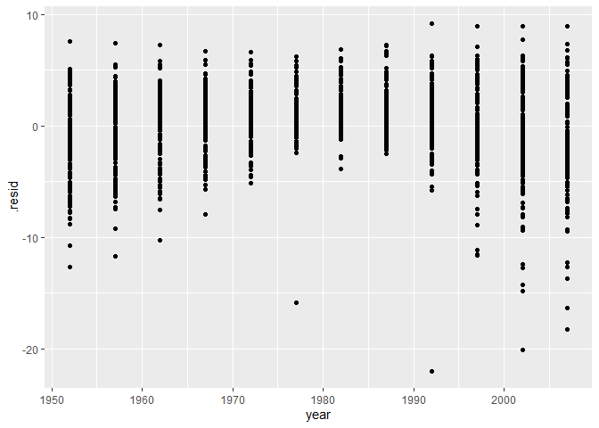
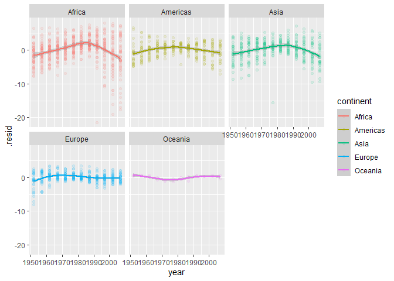

TidyTuesdayManyModels
================

``` r
library(tidyverse)
```

    ## -- Attaching packages -------------------------------------------------------------- tidyverse 1.3.0 --

    ## v ggplot2 3.3.1     v purrr   0.3.4
    ## v tibble  3.0.1     v dplyr   1.0.0
    ## v tidyr   1.1.0     v stringr 1.4.0
    ## v readr   1.3.1     v forcats 0.5.0

    ## -- Conflicts ----------------------------------------------------------------- tidyverse_conflicts() --
    ## x dplyr::filter() masks stats::filter()
    ## x dplyr::lag()    masks stats::lag()

``` r
library(tidymodels)
```

    ## -- Attaching packages ------------------------------------------------------------- tidymodels 0.1.0 --

    ## v broom     0.5.6      v rsample   0.0.7 
    ## v dials     0.0.7      v tune      0.1.0 
    ## v infer     0.5.2      v workflows 0.1.1 
    ## v parsnip   0.1.1      v yardstick 0.0.6 
    ## v recipes   0.1.13

    ## -- Conflicts ---------------------------------------------------------------- tidymodels_conflicts() --
    ## x scales::discard() masks purrr::discard()
    ## x dplyr::filter()   masks stats::filter()
    ## x recipes::fixed()  masks stringr::fixed()
    ## x dplyr::lag()      masks stats::lag()
    ## x yardstick::spec() masks readr::spec()
    ## x recipes::step()   masks stats::step()

``` r
library(broom)
library(gapminder)

gapminder
```

    ## # A tibble: 1,704 x 6
    ##    country     continent  year lifeExp      pop gdpPercap
    ##    <fct>       <fct>     <int>   <dbl>    <int>     <dbl>
    ##  1 Afghanistan Asia       1952    28.8  8425333      779.
    ##  2 Afghanistan Asia       1957    30.3  9240934      821.
    ##  3 Afghanistan Asia       1962    32.0 10267083      853.
    ##  4 Afghanistan Asia       1967    34.0 11537966      836.
    ##  5 Afghanistan Asia       1972    36.1 13079460      740.
    ##  6 Afghanistan Asia       1977    38.4 14880372      786.
    ##  7 Afghanistan Asia       1982    39.9 12881816      978.
    ##  8 Afghanistan Asia       1987    40.8 13867957      852.
    ##  9 Afghanistan Asia       1992    41.7 16317921      649.
    ## 10 Afghanistan Asia       1997    41.8 22227415      635.
    ## # ... with 1,694 more rows

``` r
gapminder %>% 
  count(continent)
```

    ## # A tibble: 5 x 2
    ##   continent     n
    ##   <fct>     <int>
    ## 1 Africa      624
    ## 2 Americas    300
    ## 3 Asia        396
    ## 4 Europe      360
    ## 5 Oceania      24

``` r
gapminder %>% 
  count(country)
```

    ## # A tibble: 142 x 2
    ##    country         n
    ##    <fct>       <int>
    ##  1 Afghanistan    12
    ##  2 Albania        12
    ##  3 Algeria        12
    ##  4 Angola         12
    ##  5 Argentina      12
    ##  6 Australia      12
    ##  7 Austria        12
    ##  8 Bahrain        12
    ##  9 Bangladesh     12
    ## 10 Belgium        12
    ## # ... with 132 more rows

``` r
baseline_model <- lm(lifeExp~., data = gapminder)

baseline_model %>% augment() %>% 
  ggplot(aes(x = year, y = .resid)) + geom_point()
```

<!-- -->

``` r
gapminder %>% 
  group_by(continent) %>% 
  nest() %>% 
  mutate(model = map(data, function(x){
    lm(lifeExp~., data = x)
  }))
```

    ## # A tibble: 5 x 3
    ## # Groups:   continent [5]
    ##   continent data               model 
    ##   <fct>     <list>             <list>
    ## 1 Asia      <tibble [396 x 5]> <lm>  
    ## 2 Europe    <tibble [360 x 5]> <lm>  
    ## 3 Africa    <tibble [624 x 5]> <lm>  
    ## 4 Americas  <tibble [300 x 5]> <lm>  
    ## 5 Oceania   <tibble [24 x 5]>  <lm>

``` r
create_baseline_model <- function(x){
  lm(lifeExp~., data = x)
}

#Basic many linear models for each continent 
gapminder %>% 
  group_by(continent) %>% 
  nest() %>% 
  mutate(model = map(data, create_baseline_model)) %>% 
  mutate(results = map(model, augment)) %>% 
  select(continent, results) %>% 
  unnest() %>% 
  ungroup() %>% 
  select(continent, year, .resid) %>% 
  ggplot(aes(x = year, y = .resid, color = continent)) + 
  geom_point(alpha = .1) + 
  geom_smooth() + 
  facet_wrap(~continent, scales = "fixed")
```

    ## Warning: `cols` is now required when using unnest().
    ## Please use `cols = c(results)`

    ## `geom_smooth()` using method = 'loess' and formula 'y ~ x'

<!-- -->

``` r
#Create mars model function
create_mars_model <- function(x){
  mars_rec <- recipe(lifeExp~., data = x) %>% 
  step_normalize(all_numeric(),-all_outcomes()) %>% 
  step_dummy(all_nominal()) 

mars_kfolds <- vfold_cv(x)

mars_model <- mars(num_terms = tune(), prod_degree = tune()) %>% 
  set_mode("regression") %>% 
  set_engine("earth")

mars_grid <- grid_regular(parameters(mars_model), levels = 10)

mars_wf <- workflow() %>% 
  add_model(mars_model) %>% 
  add_recipe(mars_rec)

mars_res <- mars_wf %>% 
  tune_grid(
    resamples = mars_kfolds,
    grid = mars_grid,
    metrics = metric_set(mae)
  )

mars_tune <- mars_res %>% select_best("mae")

mars_wf <- mars_wf %>% finalize_workflow(mars_tune)

final_model <- fit(mars_wf, x)

cat("Model Completed \n")

return(final_model)
}
```

``` r
#train nested mars models
mars_models <- gapminder %>% 
  group_by(continent) %>% 
  nest() %>% 
  mutate(model = map(data, create_mars_model))
```

    ## Model Completed 
    ## Model Completed 
    ## Model Completed 
    ## Model Completed 
    ## Model Completed

``` r
mars_models %>% 
  mutate(results = map2(model, data, predict)) %>% 
  select(continent, data, results) %>% 
  unnest() %>% 
  ungroup() %>% 
  mutate(resid = lifeExp - .pred) %>% 
  ggplot(aes(x = year, y = resid, color = continent)) + 
  geom_point(alpha = .1) + 
  geom_smooth() + 
  facet_wrap(~continent, scales = "fixed")
```

    ## Warning: `cols` is now required when using unnest().
    ## Please use `cols = c(data, results)`

    ## `geom_smooth()` using method = 'loess' and formula 'y ~ x'

<!-- -->

``` r
gapminder %>% 
  group_by(continent) %>% 
  nest() %>% 
  mutate(model = map(data, create_baseline_model)) %>% 
  mutate(results = map(model, augment)) %>% 
  select(continent, results) %>% 
  unnest() %>% 
  ungroup() %>% 
  select(continent, year, .resid) %>% 
  ggplot(aes(x = year, y = .resid, color = continent)) + 
  geom_point(alpha = .1) + 
  geom_smooth() + 
  facet_wrap(~continent, scales = "fixed")
```

    ## Warning: `cols` is now required when using unnest().
    ## Please use `cols = c(results)`

    ## `geom_smooth()` using method = 'loess' and formula 'y ~ x'

<!-- -->
