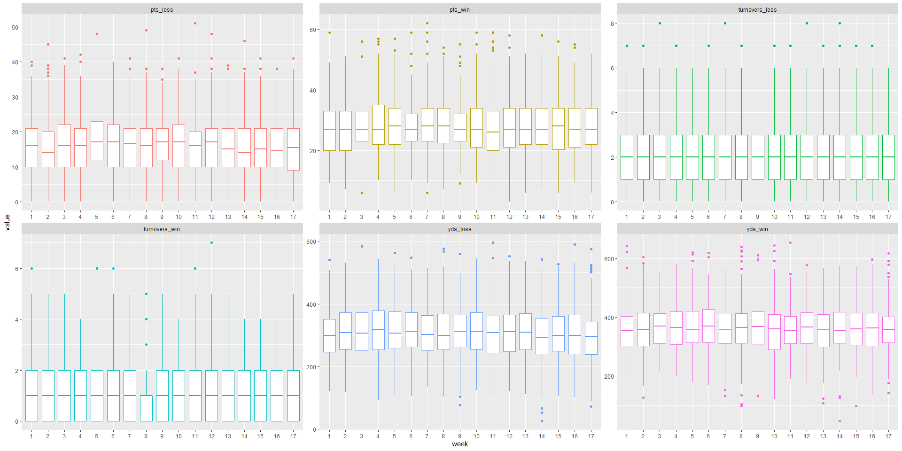
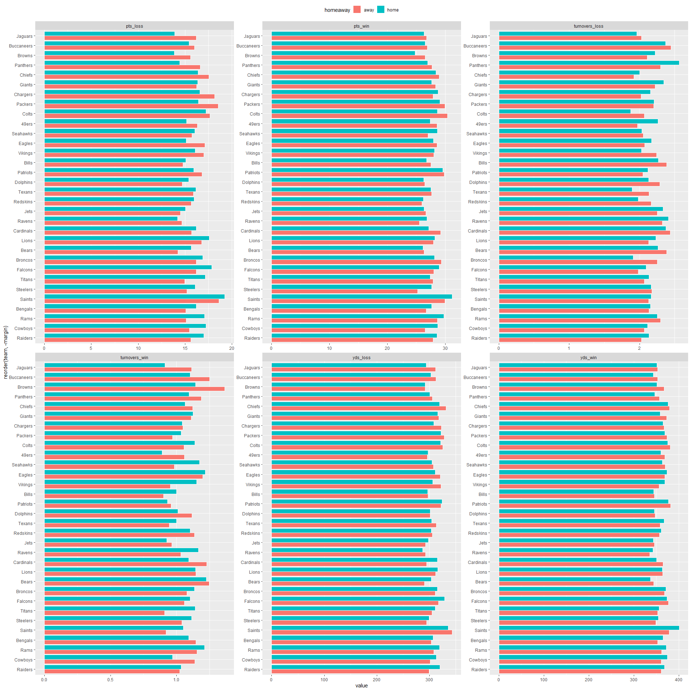
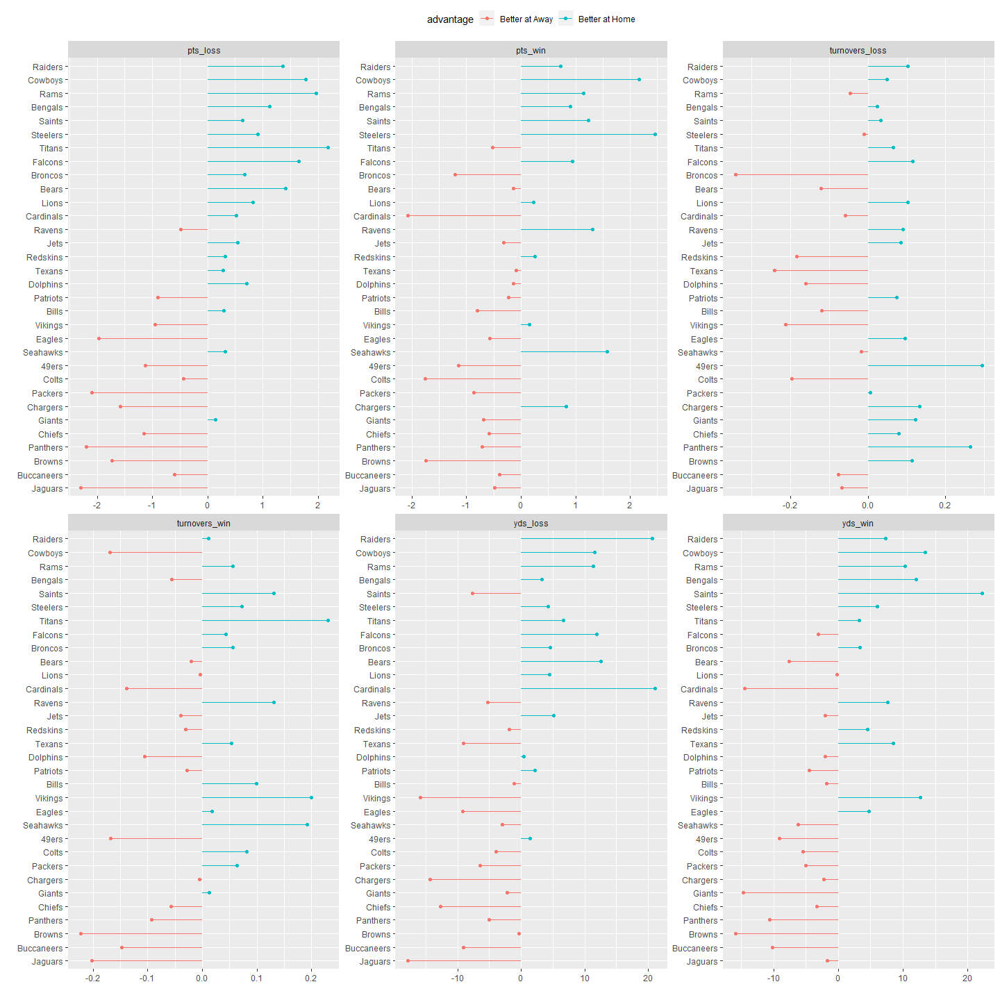
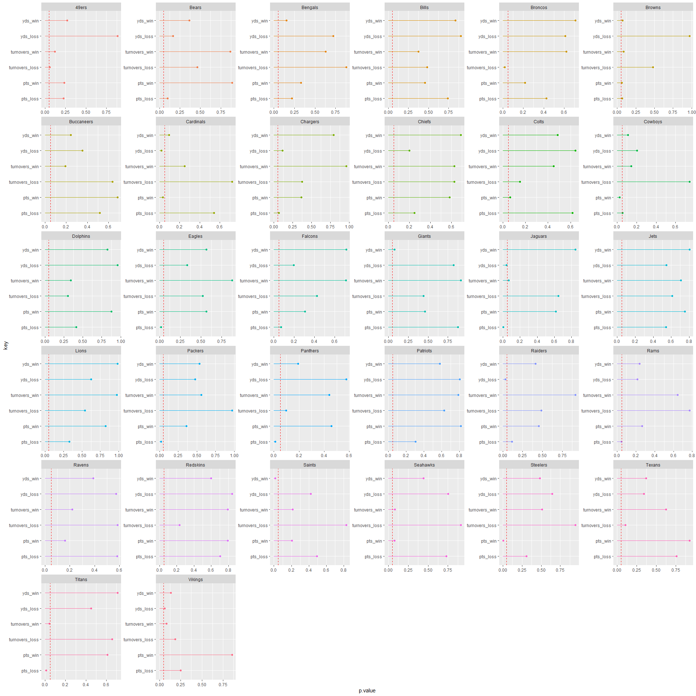
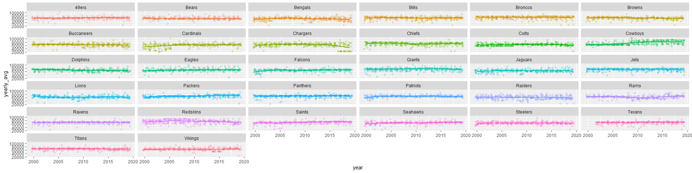
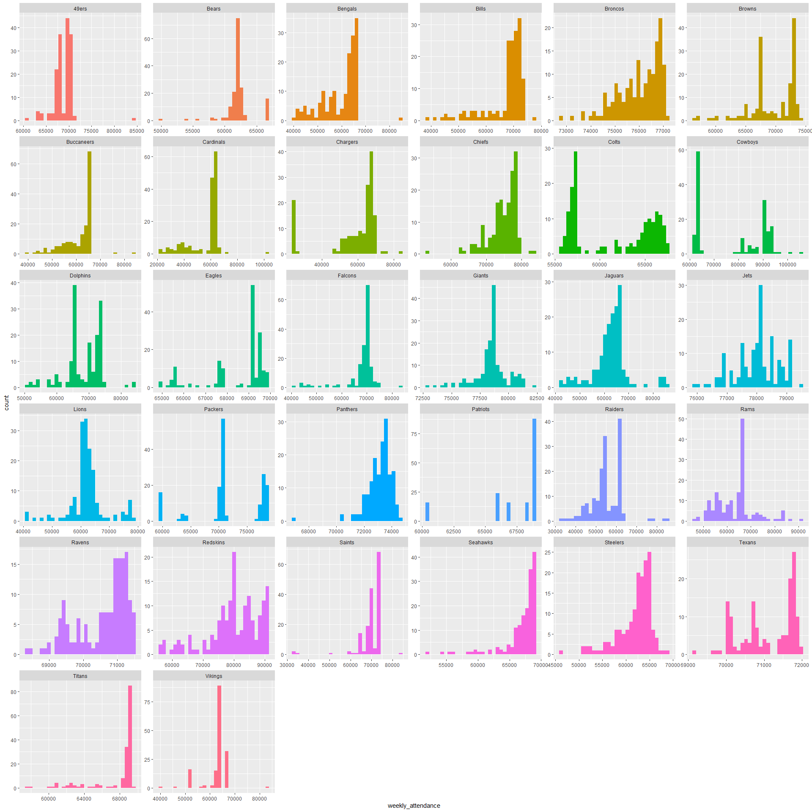
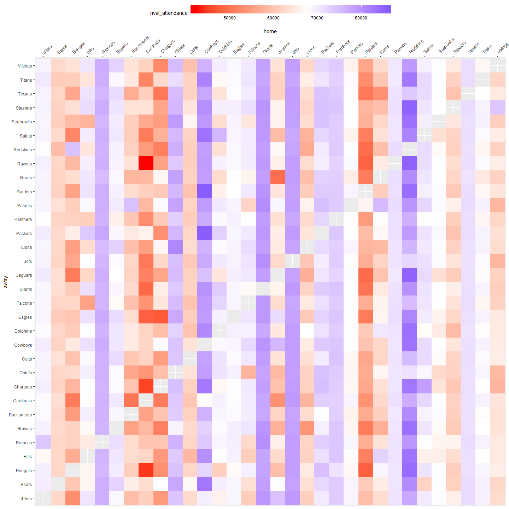

TidyTuesdayNFLAttendance
================
Andrew Couch
2/4/2020

``` r
attendance %>% glimpse()
```

    ## Observations: 10,846
    ## Variables: 8
    ## $ team              <chr> "Arizona", "Arizona", "Arizona", "Arizona", "Arizon…
    ## $ team_name         <chr> "Cardinals", "Cardinals", "Cardinals", "Cardinals",…
    ## $ year              <dbl> 2000, 2000, 2000, 2000, 2000, 2000, 2000, 2000, 200…
    ## $ total             <dbl> 893926, 893926, 893926, 893926, 893926, 893926, 893…
    ## $ home              <dbl> 387475, 387475, 387475, 387475, 387475, 387475, 387…
    ## $ away              <dbl> 506451, 506451, 506451, 506451, 506451, 506451, 506…
    ## $ week              <dbl> 1, 2, 3, 4, 5, 6, 7, 8, 9, 10, 11, 12, 13, 14, 15, …
    ## $ weekly_attendance <dbl> 77434, 66009, NA, 71801, 66985, 44296, 38293, 62981…

``` r
standings %>% glimpse()
```

    ## Observations: 638
    ## Variables: 15
    ## $ team                 <chr> "Miami", "Indianapolis", "New York", "Buffalo", …
    ## $ team_name            <chr> "Dolphins", "Colts", "Jets", "Bills", "Patriots"…
    ## $ year                 <dbl> 2000, 2000, 2000, 2000, 2000, 2000, 2000, 2000, …
    ## $ wins                 <dbl> 11, 10, 9, 8, 5, 13, 12, 9, 7, 4, 3, 12, 11, 7, …
    ## $ loss                 <dbl> 5, 6, 7, 8, 11, 3, 4, 7, 9, 12, 13, 4, 5, 9, 10,…
    ## $ points_for           <dbl> 323, 429, 321, 315, 276, 346, 333, 321, 367, 185…
    ## $ points_against       <dbl> 226, 326, 321, 350, 338, 191, 165, 255, 327, 359…
    ## $ points_differential  <dbl> 97, 103, 0, -35, -62, 155, 168, 66, 40, -174, -2…
    ## $ margin_of_victory    <dbl> 6.1, 6.4, 0.0, -2.2, -3.9, 9.7, 10.5, 4.1, 2.5, …
    ## $ strength_of_schedule <dbl> 1.0, 1.5, 3.5, 2.2, 1.4, -1.3, -2.5, -0.2, -1.4,…
    ## $ simple_rating        <dbl> 7.1, 7.9, 3.5, 0.0, -2.5, 8.3, 8.0, 3.9, 1.1, -1…
    ## $ offensive_ranking    <dbl> 0.0, 7.1, 1.4, 0.5, -2.7, 1.5, 0.0, 0.6, 3.2, -8…
    ## $ defensive_ranking    <dbl> 7.1, 0.8, 2.2, -0.5, 0.2, 6.8, 8.0, 3.3, -2.1, -…
    ## $ playoffs             <chr> "Playoffs", "Playoffs", "No Playoffs", "No Playo…
    ## $ sb_winner            <chr> "No Superbowl", "No Superbowl", "No Superbowl", …

``` r
games %>% glimpse()
```

    ## Observations: 5,324
    ## Variables: 19
    ## $ year           <dbl> 2000, 2000, 2000, 2000, 2000, 2000, 2000, 2000, 2000, …
    ## $ week           <chr> "1", "1", "1", "1", "1", "1", "1", "1", "1", "1", "1",…
    ## $ home_team      <chr> "Minnesota Vikings", "Kansas City Chiefs", "Washington…
    ## $ away_team      <chr> "Chicago Bears", "Indianapolis Colts", "Carolina Panth…
    ## $ winner         <chr> "Minnesota Vikings", "Indianapolis Colts", "Washington…
    ## $ tie            <chr> NA, NA, NA, NA, NA, NA, NA, NA, NA, NA, NA, NA, NA, NA…
    ## $ day            <chr> "Sun", "Sun", "Sun", "Sun", "Sun", "Sun", "Sun", "Sun"…
    ## $ date           <chr> "September 3", "September 3", "September 3", "Septembe…
    ## $ time           <time> 13:00:00, 13:00:00, 13:01:00, 13:02:00, 13:02:00, 13:…
    ## $ pts_win        <dbl> 30, 27, 20, 36, 16, 27, 21, 14, 21, 41, 9, 23, 20, 16,…
    ## $ pts_loss       <dbl> 27, 14, 17, 28, 0, 7, 16, 10, 16, 14, 6, 0, 16, 13, 36…
    ## $ yds_win        <dbl> 374, 386, 396, 359, 336, 398, 296, 187, 395, 425, 233,…
    ## $ turnovers_win  <dbl> 1, 2, 0, 1, 0, 0, 1, 2, 2, 3, 0, 1, 1, 0, 3, 4, 1, 0, …
    ## $ yds_loss       <dbl> 425, 280, 236, 339, 223, 249, 278, 252, 355, 167, 255,…
    ## $ turnovers_loss <dbl> 1, 1, 1, 1, 1, 1, 1, 3, 4, 2, 4, 6, 2, 1, 0, 1, 3, 3, …
    ## $ home_team_name <chr> "Vikings", "Chiefs", "Redskins", "Falcons", "Steelers"…
    ## $ home_team_city <chr> "Minnesota", "Kansas City", "Washington", "Atlanta", "…
    ## $ away_team_name <chr> "Bears", "Colts", "Panthers", "49ers", "Ravens", "Jagu…
    ## $ away_team_city <chr> "Chicago", "Indianapolis", "Carolina", "San Francisco"…

``` r
#What are the distributions of game metrics by week? 
#Are there any seasonal trends? 
games %>% 
  select(week, (10:15)) %>% 
  filter(!week %in% c("WildCard", "SuperBowl", "Division","ConfChamp")) %>% 
  gather(key = "key", value = "value", -week) %>%
  mutate(week = reorder(week, week %>% as.numeric())) %>% 
  ggplot(aes(x = week, y= value, color = key)) + 
  geom_boxplot() + 
  facet_wrap(~key, scales = "free") + 
  theme(legend.position = "none")
```

<!-- -->

``` r
#How do teams perform when they're playing at home vs playing awawy? 

games %>% 
  select(home = home_team_name, away = away_team_name, (10:15)) %>%
  gather(key = "key", value = "value", -home, -away) %>%
  gather(key = "homeaway", value = "team", -key, -value) %>% 
  select(team, homeaway, key, value) %>% 
  group_by(homeaway, team, key) %>% 
  summarise(mean = mean(value)) %>%
  pivot_wider(names_from = "homeaway", values_from = "mean") %>% 
  mutate(margin = home-away) %>% 
  gather(key = "homeaway", value = "value", -key, -margin, -team) %>% 
  ggplot(aes(x = reorder(team, -margin), y = value, fill = homeaway)) + 
  geom_col(color = "white", position = "dodge") + 
  facet_wrap(~key, scales = "free") + 
  coord_flip() + 
  theme(legend.position = "top")
```

<!-- -->

``` r
#Better visual for looking at how teams perform home and away for all of the metrics
games %>% 
  select(home = home_team_name, away = away_team_name, (10:15)) %>%
  gather(key = "key", value = "value", -home, -away) %>%
  gather(key = "homeaway", value = "team", -key, -value) %>% 
  select(team, homeaway, key, value) %>% 
  group_by(homeaway, team, key) %>% 
  summarise(mean = mean(value)) %>%
  pivot_wider(names_from = "homeaway", values_from = "mean") %>% 
  mutate(margin = home-away) %>% 
  select(team, key, margin) %>% 
  mutate(advantage = if_else(margin > 0, "Better at Home", "Better at Away")) %>% 
  ggplot(aes(x = reorder(team, margin), y = margin, color = advantage)) +
  geom_point() + 
  geom_segment(aes(xend = team, yend = 0)) + 
  facet_wrap(~key, scales = "free") + 
  theme(legend.position = "top") +
  xlab("") +
  ylab("") + 
  coord_flip()
```

<!-- -->

``` r
#Exploring the statistical significance using ttest
library(broom)
games %>% 
  select(home = home_team_name, away = away_team_name, (10:15)) %>%
  gather(key = "key", value = "value", -home, -away) %>%
  gather(key = "homeaway", value = "team", -key, -value) %>% 
  select(team, homeaway, key, value) %>% 
  group_by(team, key) %>% 
  do(ttest = tidy(t.test(value~homeaway, data = (.)))) %>% 
  unnest(ttest) %>% 
  select(team, key, p.value) %>% 
  ggplot(aes(x = key, y = p.value, color = team)) + 
  geom_point() + 
  geom_segment(aes(xend = key, yend = 0)) + 
  geom_hline(yintercept = .05, linetype = "dashed", color = "red") + 
  facet_wrap(~team, scales = "free") + 
  theme(legend.position = "none") + 
  coord_flip()
```

<!-- -->

``` r
#Teams and their metrics that are statistically significant if they play home or away
  games %>% 
  select(home = home_team_name, away = away_team_name, (10:15)) %>%
  gather(key = "key", value = "value", -home, -away) %>%
  gather(key = "homeaway", value = "team", -key, -value) %>% 
  select(team, homeaway, key, value) %>% 
  group_by(team, key) %>% 
  do(ttest = tidy(t.test(value~homeaway, data = (.)))) %>% 
  unnest(ttest) %>% 
  select(team, key, p.value) %>% 
  filter(p.value <= .05) %>% 
  arrange(team, key)
```

    ## # A tibble: 15 x 3
    ##    team      key            p.value
    ##    <chr>     <chr>            <dbl>
    ##  1 Broncos   turnovers_loss 0.0174 
    ##  2 Cardinals pts_win        0.0328 
    ##  3 Cardinals yds_loss       0.0200 
    ##  4 Cowboys   pts_win        0.0261 
    ##  5 Eagles    pts_loss       0.0191 
    ##  6 Jaguars   pts_loss       0.00591
    ##  7 Jaguars   yds_loss       0.0414 
    ##  8 Packers   pts_loss       0.0201 
    ##  9 Panthers  pts_loss       0.0111 
    ## 10 Raiders   yds_loss       0.0321 
    ## 11 Rams      pts_loss       0.0431 
    ## 12 Saints    yds_win        0.0139 
    ## 13 Steelers  pts_win        0.00570
    ## 14 Titans    pts_loss       0.00978
    ## 15 Titans    turnovers_win  0.0432

``` r
#How are team's attendance throughout the years? 
options(scipen = 999)
attendance %>% 
  drop_na() %>% 
  select(team_name, weekly_attendance, week, year) %>% 
  group_by(team_name, year) %>% 
  mutate(yearly_avg = mean(weekly_attendance)) %>% 
  ggplot(aes(x = year, y = yearly_avg, color = team_name)) + 
  geom_jitter(alpha = .2, aes(x = year, y = weekly_attendance, color = team_name)) +
  geom_smooth(se = FALSE) + 
  facet_wrap(~team_name, scales = "fixed") + 
  theme(legend.position = "none")
```

    ## `geom_smooth()` using method = 'loess' and formula 'y ~ x'

<!-- -->

``` r
#What are the weekly distributions? 
attendance %>% 
  select(-team) %>% 
  mutate(week = as.character(week)) %>% 
  left_join(games %>% select(year, week, home_team_name, away_team_name), by = c("team_name" = "home_team_name", "year" = "year", "week" = "week")) %>% 
  drop_na() %>% 
  select(home = team_name, away = away_team_name, year, week, weekly_attendance) %>%
  group_by(home, away) %>% 
  ggplot(aes(x = weekly_attendance)) + geom_histogram(fill = "blue", color = "white")
```

    ## `stat_bin()` using `bins = 30`. Pick better value with `binwidth`.

<!-- -->

``` r
#What about by team? 
attendance %>% 
  select(-team) %>% 
  mutate(week = as.character(week)) %>% 
  left_join(games %>% select(year, week, home_team_name, away_team_name), by = c("team_name" = "home_team_name", "year" = "year", "week" = "week")) %>% 
  drop_na() %>% 
  select(home = team_name, away = away_team_name, year, week, weekly_attendance) %>%
  group_by(home, away) %>% 
  ungroup() %>% 
  select(home, weekly_attendance) %>% 
  ggplot(aes(x = weekly_attendance, fill = home)) + 
  geom_histogram() + 
  facet_wrap(~home, scales = "free") + 
  theme(legend.position = "none")
```

    ## `stat_bin()` using `bins = 30`. Pick better value with `binwidth`.

<!-- -->

``` r
#Who are each team's biggest rivals?  (This is the the team with the most average attendance vs a team)
attendance %>% 
  select(-team) %>% 
  mutate(week = as.character(week)) %>% 
  left_join(games %>% select(year, week, home_team_name, away_team_name), by = c("team_name" = "home_team_name", "year" = "year", "week" = "week")) %>% 
  drop_na() %>% 
  select(home = team_name, away = away_team_name, year, week, weekly_attendance) %>%
  group_by(home) %>% 
  mutate(average_attendance = mean(weekly_attendance)) %>% 
  group_by(home, away) %>% 
  mutate(rival_attendance = mean(weekly_attendance)) %>% 
  select(home, away, average_attendance, rival_attendance) %>% 
  arrange(home) %>% 
  unique() %>% 
  ungroup() %>% 
  mutate(average = mean(rival_attendance)) %>% 
  ggplot(aes(x = home, y= away, fill = rival_attendance)) + 
  geom_tile() + 
  scale_x_discrete(position = "top") +
  theme(axis.text.x = element_text(angle = 45, hjust = -.1),
        legend.position = "top",
        legend.key.width = unit(3, "cm")) + 
  scale_fill_gradient2(midpoint = 67574, high = "blue", low = "red")
```

<!-- -->
