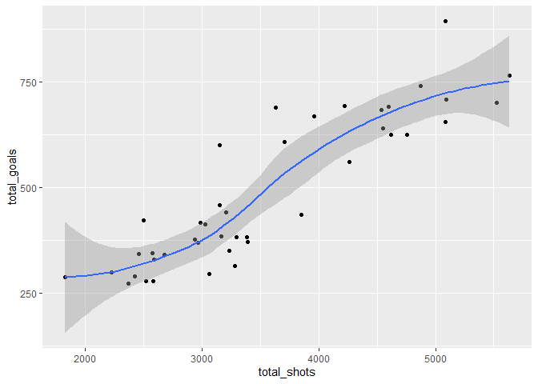
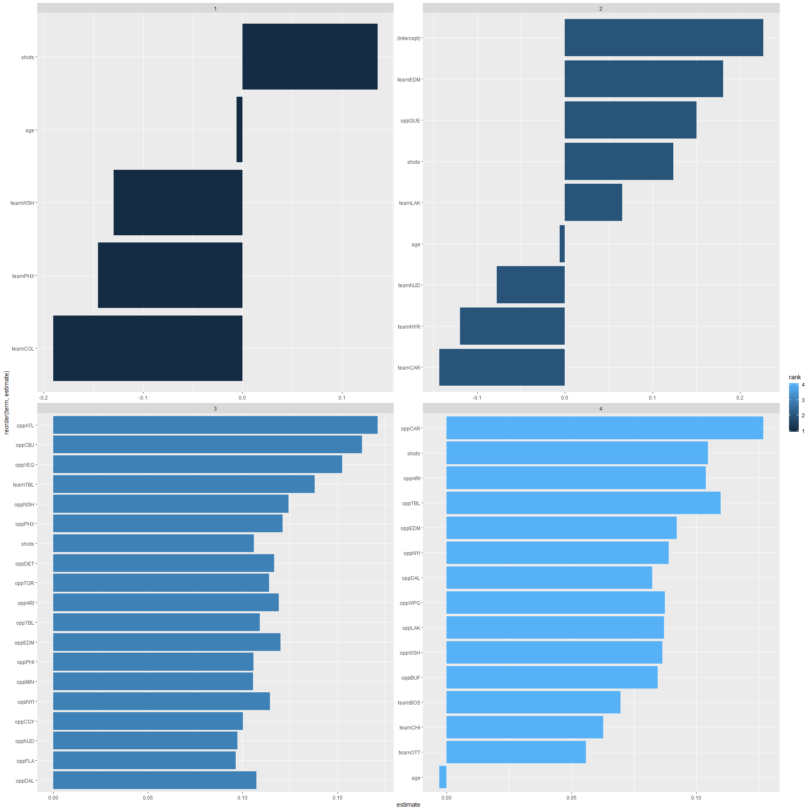
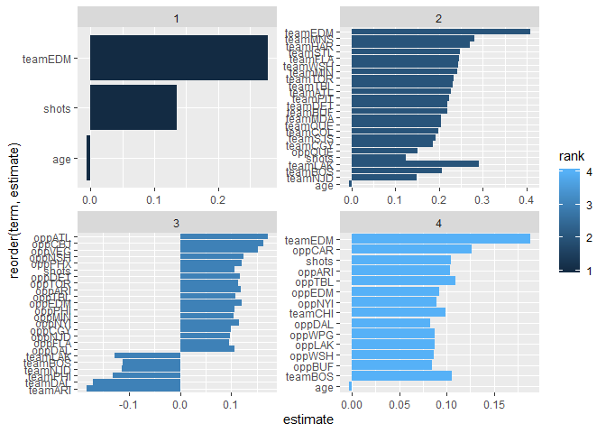
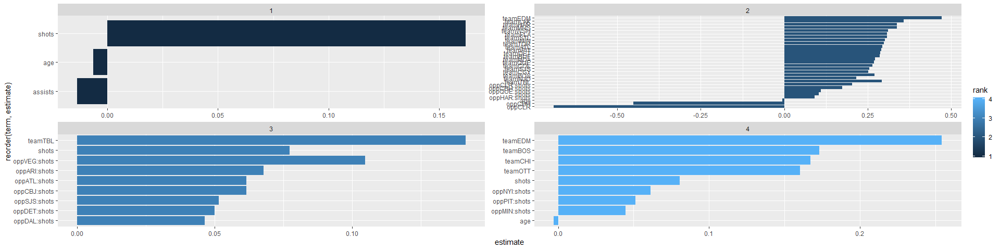
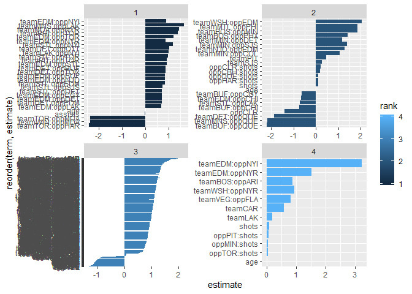
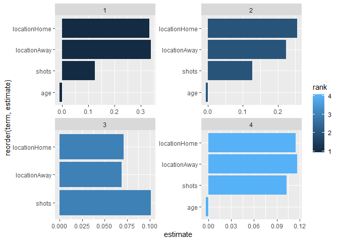

TidyTuesdayNHL
================

``` r
library(tidyverse)
```

    ## Warning: package 'tidyverse' was built under R version 3.5.3

    ## -- Attaching packages -------------------------------------------------------------------------------------------------------------------------------------- tidyverse 1.2.1 --

    ## v ggplot2 3.2.1     v purrr   0.3.3
    ## v tibble  2.1.3     v dplyr   0.8.3
    ## v tidyr   1.0.0     v stringr 1.4.0
    ## v readr   1.3.1     v forcats 0.4.0

    ## Warning: package 'ggplot2' was built under R version 3.5.3

    ## Warning: package 'tibble' was built under R version 3.5.3

    ## Warning: package 'tidyr' was built under R version 3.5.3

    ## Warning: package 'purrr' was built under R version 3.5.3

    ## Warning: package 'dplyr' was built under R version 3.5.3

    ## Warning: package 'stringr' was built under R version 3.5.3

    ## Warning: package 'forcats' was built under R version 3.5.3

    ## -- Conflicts ----------------------------------------------------------------------------------------------------------------------------------------- tidyverse_conflicts() --
    ## x dplyr::filter() masks stats::filter()
    ## x dplyr::lag()    masks stats::lag()

``` r
game_goals <- readr::read_csv('https://raw.githubusercontent.com/rfordatascience/tidytuesday/master/data/2020/2020-03-03/game_goals.csv')
```

    ## Parsed with column specification:
    ## cols(
    ##   .default = col_double(),
    ##   player = col_character(),
    ##   date = col_date(format = ""),
    ##   age = col_character(),
    ##   team = col_character(),
    ##   at = col_character(),
    ##   opp = col_character(),
    ##   location = col_character(),
    ##   outcome = col_character()
    ## )

    ## See spec(...) for full column specifications.

``` r
top_250 <- readr::read_csv('https://raw.githubusercontent.com/rfordatascience/tidytuesday/master/data/2020/2020-03-03/top_250.csv')
```

    ## Parsed with column specification:
    ## cols(
    ##   raw_rank = col_double(),
    ##   player = col_character(),
    ##   years = col_character(),
    ##   total_goals = col_double(),
    ##   url_number = col_double(),
    ##   raw_link = col_character(),
    ##   link = col_character(),
    ##   active = col_character(),
    ##   yr_start = col_double()
    ## )

``` r
season_goals <- readr::read_csv('https://raw.githubusercontent.com/rfordatascience/tidytuesday/master/data/2020/2020-03-03/season_goals.csv')
```

    ## Parsed with column specification:
    ## cols(
    ##   .default = col_double(),
    ##   position = col_character(),
    ##   hand = col_character(),
    ##   player = col_character(),
    ##   years = col_character(),
    ##   status = col_character(),
    ##   season = col_character(),
    ##   team = col_character(),
    ##   league = col_character(),
    ##   headshot = col_character()
    ## )
    ## See spec(...) for full column specifications.

``` r
game_goals %>% 
  glimpse()
```

    ## Observations: 49,384
    ## Variables: 25
    ## $ player            <chr> "Alex Ovechkin", "Alex Ovechkin", "Alex Ovec...
    ## $ season            <dbl> 2006, 2006, 2006, 2006, 2006, 2006, 2006, 20...
    ## $ rank              <dbl> 1, 2, 3, 4, 5, 6, 7, 8, 9, 10, 11, 12, 13, 1...
    ## $ date              <date> 2005-10-05, 2005-10-07, 2005-10-08, 2005-10...
    ## $ game_num          <dbl> 1, 2, 3, 4, 5, 6, 7, 8, 9, 10, 11, 12, 13, 1...
    ## $ age               <chr> "20-018", "20-020", "20-021", "20-023", "20-...
    ## $ team              <chr> "WSH", "WSH", "WSH", "WSH", "WSH", "WSH", "W...
    ## $ at                <chr> NA, NA, "@", NA, "@", NA, NA, "@", NA, "@", ...
    ## $ opp               <chr> "CBJ", "ATL", "ATL", "NYR", "CAR", "NYI", "T...
    ## $ location          <chr> "Home", "Home", "Away", "Home", "Away", "Hom...
    ## $ outcome           <chr> "W", "L", "L", "W", "L", "L", "W", "L", "L",...
    ## $ goals             <dbl> 2, 0, 0, 1, 1, 0, 0, 2, 0, 0, 2, 0, 0, 2, 2,...
    ## $ assists           <dbl> 0, 1, 1, 0, 0, 1, 1, 0, 0, 1, 0, 0, 0, 0, 0,...
    ## $ points            <dbl> 2, 1, 1, 1, 1, 1, 1, 2, 0, 1, 2, 0, 0, 2, 2,...
    ## $ plus_minus        <dbl> 1, -2, 0, 1, 0, -1, 1, 1, 0, 0, 0, -2, 1, -1...
    ## $ penalty_min       <dbl> 2, 0, 4, 2, 0, 0, 0, 0, 0, 0, 0, 0, 2, 0, 4,...
    ## $ goals_even        <dbl> 1, 0, 0, 0, 1, 0, 0, 2, 0, 0, 1, 0, 0, 0, 1,...
    ## $ goals_powerplay   <dbl> 1, 0, 0, 1, 0, 0, 0, 0, 0, 0, 0, 0, 0, 2, 1,...
    ## $ goals_short       <dbl> 0, 0, 0, 0, 0, 0, 0, 0, 0, 0, 1, 0, 0, 0, 0,...
    ## $ goals_gamewinner  <dbl> 0, 0, 0, 1, 0, 0, 0, 0, 0, 0, 0, 0, 0, 1, 0,...
    ## $ assists_even      <dbl> NA, NA, NA, NA, NA, NA, NA, NA, NA, NA, NA, ...
    ## $ assists_powerplay <dbl> NA, NA, NA, NA, NA, NA, NA, NA, NA, NA, NA, ...
    ## $ assists_short     <dbl> NA, NA, NA, NA, NA, NA, NA, NA, NA, NA, NA, ...
    ## $ shots             <dbl> 5, 1, 3, 6, 6, 5, 2, 10, 2, 5, 4, 7, 7, 8, 7...
    ## $ shot_percent      <dbl> 40.0, 0.0, 0.0, 16.7, 16.7, 0.0, 0.0, 20.0, ...

``` r
game_goals %>% 
  select(goals, player, season, game_num, age, team, opp, location,assists, shots) %>% 
  count(player)
```

    ## # A tibble: 42 x 2
    ##    player               n
    ##    <chr>            <int>
    ##  1 Alex Ovechkin     1146
    ##  2 Anze Kopitar      1067
    ##  3 Brad Marchand      745
    ##  4 Brendan Shanahan  1524
    ##  5 Brett Hull        1269
    ##  6 Corey Perry       1039
    ##  7 Dave Andreychuk   1639
    ##  8 Dino Ciccarelli   1232
    ##  9 Dustin Brown      1177
    ## 10 Eric Staal        1236
    ## # ... with 32 more rows

``` r
df <- game_goals %>% 
  select(goals, player, season, game_num, age, team, opp, location,assists, shots) 


df %>% 
  group_by(player) %>% 
  summarise(total_goals = sum(goals),
            total_assits = sum(assists),
            total_shots = sum(shots)) %>% 
  mutate(shots_per_goal  = total_shots / total_goals) %>% 
  ggplot(aes(x = total_shots, y = total_goals)) + geom_point() + geom_smooth()
```

    ## `geom_smooth()` using method = 'loess' and formula 'y ~ x'

<!-- -->

``` r
df %>% 
  select(assists, shots, goals) %>% 
  gather(key = "key", value = "value", -goals) %>% 
  ggplot(aes(x = value, y = goals, color = key)) + 
  geom_jitter(alpha = .1) + 
  geom_smooth() + 
  facet_wrap(~key, scales = "free")
```

    ## `geom_smooth()` using method = 'gam' and formula 'y ~ s(x, bs = "cs")'

    ## Warning: Computation failed in `stat_smooth()`:
    ## x has insufficient unique values to support 10 knots: reduce k.

<!-- -->

``` r
model_data <- df %>% 
  group_by(player) %>% 
  mutate(total_goals = sum(goals)) %>% 
  ungroup() %>% 
  mutate(rank = dense_rank(-total_goals)) %>% 
  mutate(rank = floor(rank/10) + 1) %>% 
  separate(age, into = c("year", "days")) %>% 
  mutate(age = as.integer(year) + as.numeric(days)/365) %>% 
  select(-year, -days,-season, -total_goals) %>% 
  group_by(rank) %>% 
  mutate(standardized_game_num = (game_num - mean(game_num)) / sd(game_num)) %>% 
  ungroup() %>% 
  select(-player, -game_num) %>% 
  select(rank, goals, everything())
```

``` r
library(broom)
```

    ## Warning: package 'broom' was built under R version 3.5.3

``` r
model_data %>% 
  group_by(rank) %>% 
  do(linear_model = lm(goals~. -rank , data = .)) %>% 
  tidy(linear_model) %>% 
  filter(p.value <= .05) %>% 
  ggplot(aes(x = reorder(term, estimate), y = estimate, fill = rank)) +
  geom_col() + 
  coord_flip() + 
  facet_wrap(~rank, scales = "free")
```

<!-- -->

``` r
model_data %>% 
  group_by(rank) %>% 
  do(linear_model = lm(goals~. -rank+ 0, data = .)) %>% 
  tidy(linear_model) %>% 
  filter(p.value <= .05) %>% 
  ggplot(aes(x = reorder(term, estimate), y = estimate, fill = rank)) +
  geom_col() + 
  coord_flip() + 
  facet_wrap(~rank, scales = "free")
```

<!-- -->

``` r
model_data %>% 
  group_by(rank) %>% 
  do(linear_model = lm(goals~.+ opp*shots -rank + 0, data = .)) %>% 
  tidy(linear_model) %>% 
  filter(p.value <= .05) %>%  
  ggplot(aes(x = reorder(term, estimate), y = estimate, fill = rank)) +
  geom_col() + 
  coord_flip() + 
  facet_wrap(~rank, scales = "free")
```

<!-- -->

``` r
model_data %>% 
  group_by(rank) %>% 
  do(linear_model = lm(goals~.+ opp*shots + opp:team -rank + 0, data = .)) %>% 
  tidy(linear_model) %>% 
  filter(p.value <= .05) %>%  
  ggplot(aes(x = reorder(term, estimate), y = estimate, fill = rank)) +
  geom_col() + 
  coord_flip() + 
  facet_wrap(~rank, scales = "free")
```

<!-- -->

``` r
model_data %>% 
  select(-opp, -team) %>% 
  group_by(rank) %>% 
  do(linear_model = lm(goals~.-rank +shots*location + assists*shots + 0, data = .)) %>% 
  tidy(linear_model) %>% 
  filter(p.value <= .05) %>%  
  ggplot(aes(x = reorder(term, estimate), y = estimate, fill = rank)) +
  geom_col() + 
  coord_flip() + 
  facet_wrap(~rank, scales = "free")
```

<!-- -->

``` r
model_data %>% 
  select(-opp, -team) %>% 
  group_by(rank) %>% 
  do(linear_model = lm(goals~.-rank +shots*location + assists*shots + 0, data = .)) %>% 
  glance(linear_model)
```

    ## # A tibble: 4 x 12
    ## # Groups:   rank [4]
    ##    rank r.squared adj.r.squared sigma statistic p.value    df  logLik
    ##   <dbl>     <dbl>         <dbl> <dbl>     <dbl>   <dbl> <int>   <dbl>
    ## 1     1     0.441         0.441 0.677     1252.       0     8 -13071.
    ## 2     2     0.391         0.391 0.613     1194.       0     8 -13816.
    ## 3     3     0.353         0.352 0.573      774.       0     8  -9790.
    ## 4     4     0.324         0.324 0.536      626.       0     8  -8321.
    ## # ... with 4 more variables: AIC <dbl>, BIC <dbl>, deviance <dbl>,
    ## #   df.residual <int>

``` r
model_data %>% 
  group_by(rank) %>% 
  do(linear_model = lm(goals~.+ opp*shots + opp*team -rank  + shots*location + assists*shots+ 0, data = .)) %>% 
  glance(linear_model) 
```

    ## # A tibble: 4 x 12
    ## # Groups:   rank [4]
    ##    rank r.squared adj.r.squared sigma statistic p.value    df  logLik
    ##   <dbl>     <dbl>         <dbl> <dbl>     <dbl>   <dbl> <int>   <dbl>
    ## 1     1     0.472         0.443 0.676      16.1       0   669 -12709.
    ## 2     2     0.432         0.402 0.608      14.4       0   746 -13297.
    ## 3     3     0.387         0.357 0.571      13.2       0   516  -9487.
    ## 4     4     0.360         0.324 0.536      10.2       0   546  -8038.
    ## # ... with 4 more variables: AIC <dbl>, BIC <dbl>, deviance <dbl>,
    ## #   df.residual <int>
