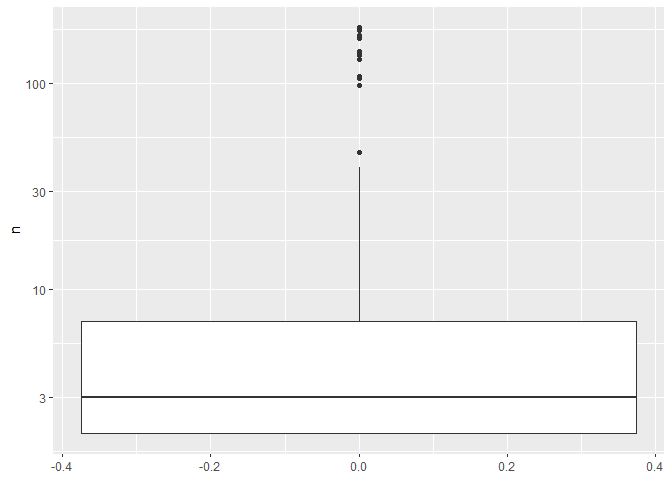
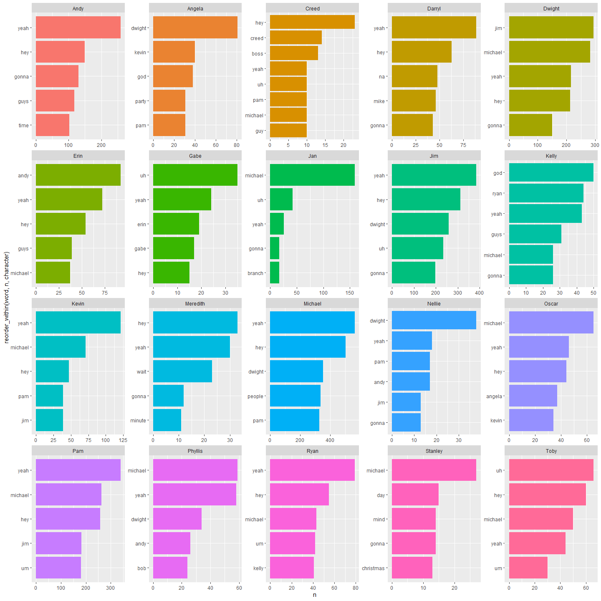
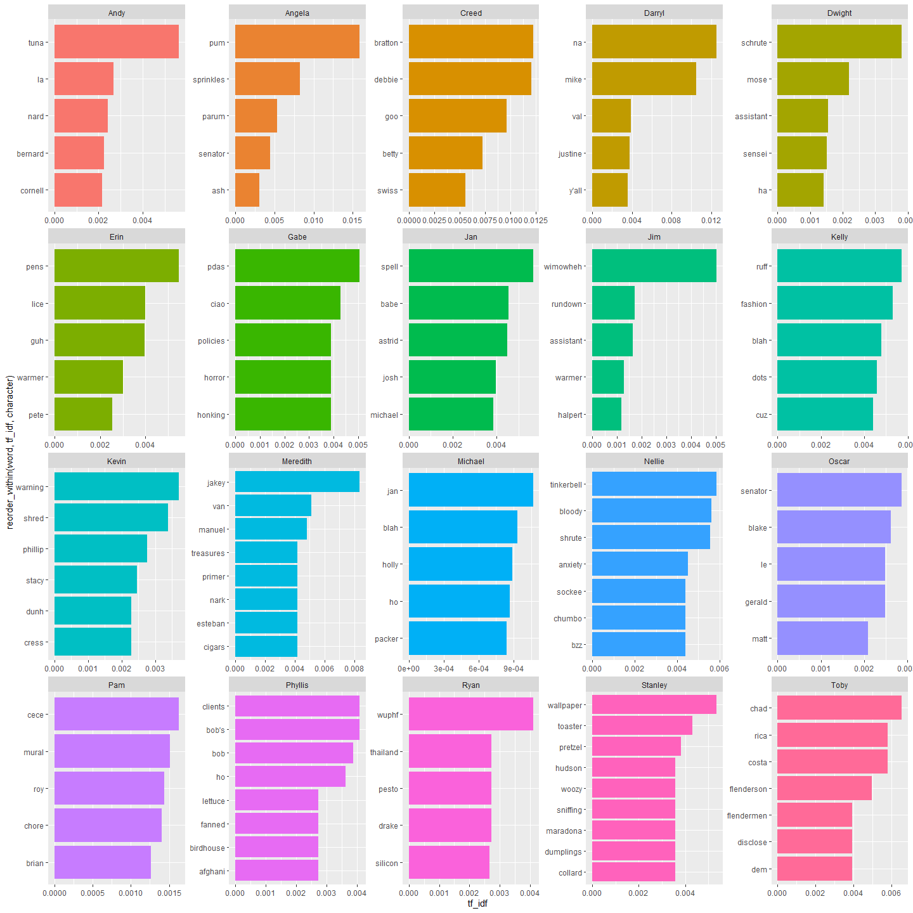
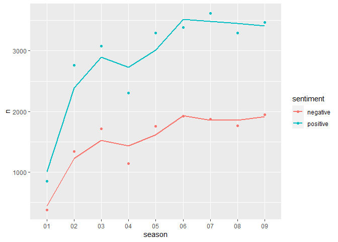
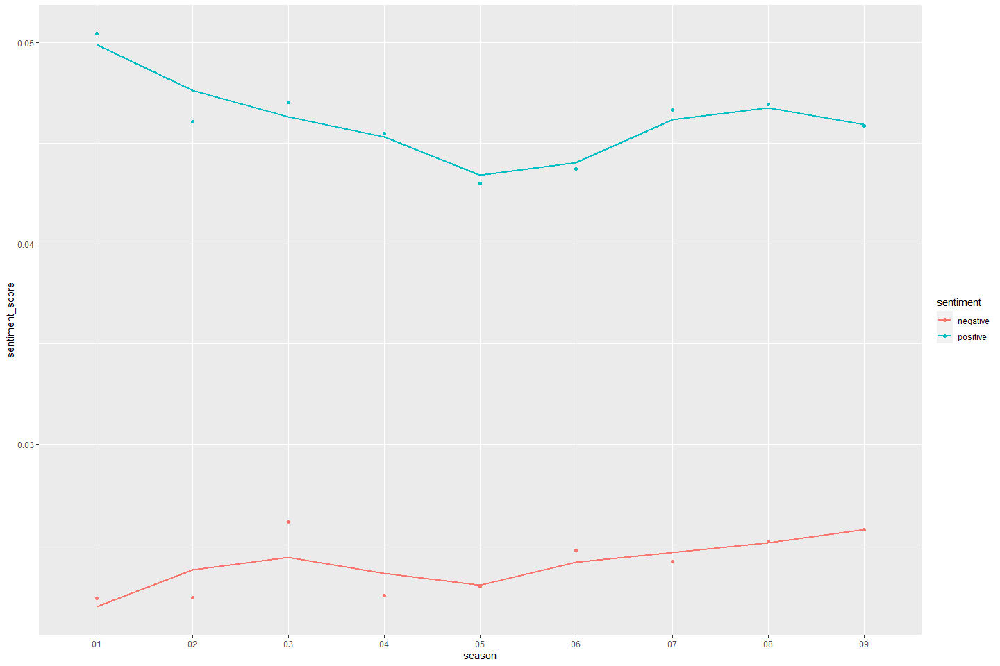
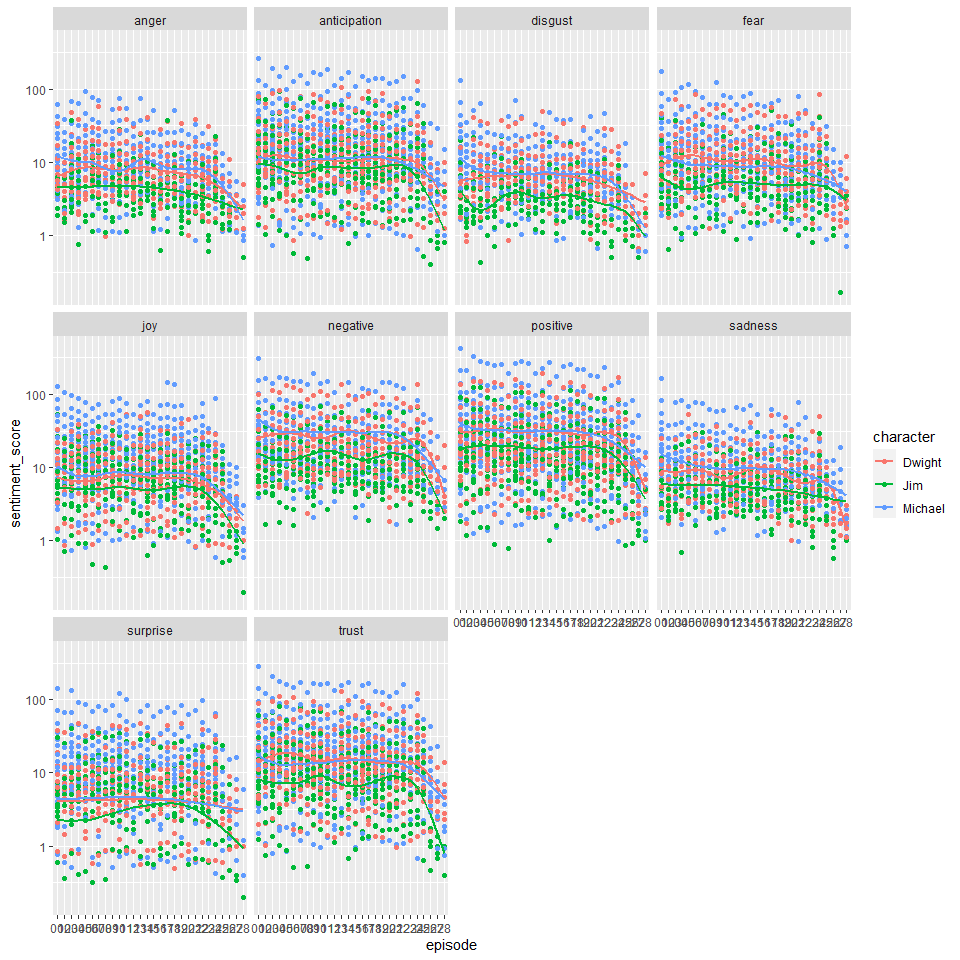
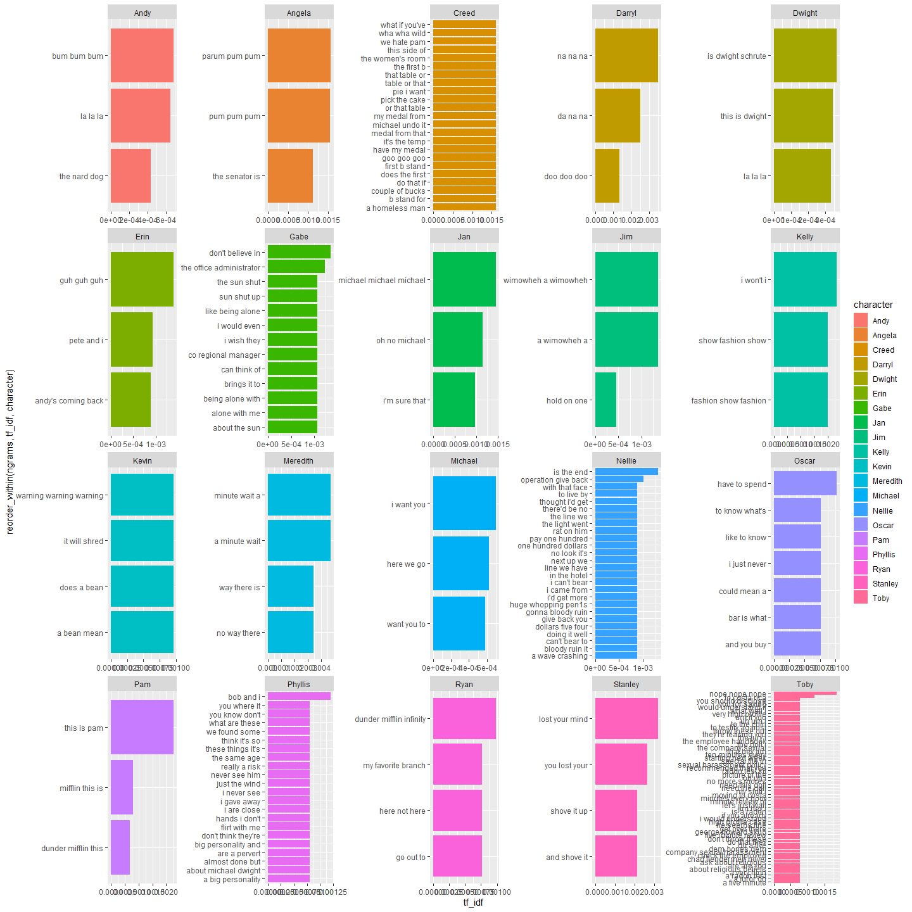
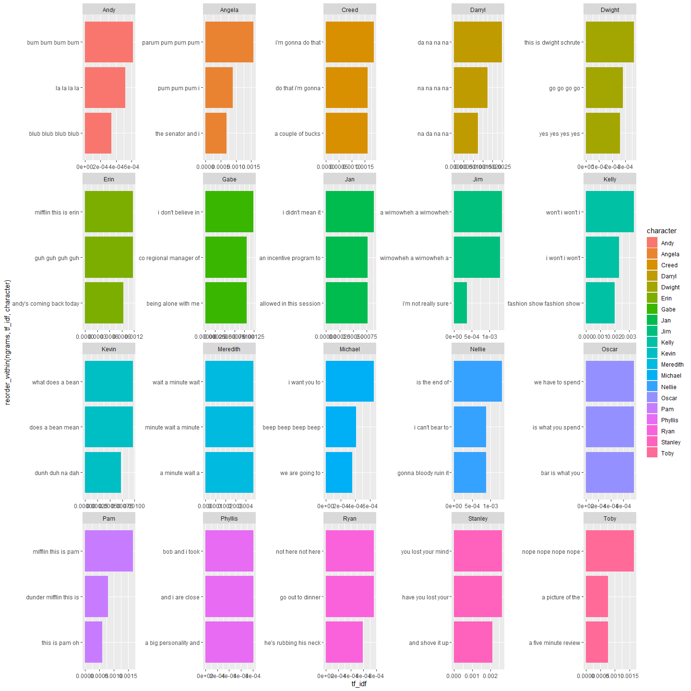

TidyTuesdadyOffice
================

``` r
library(tidyverse)
```

    ## Warning: package 'tidyverse' was built under R version 3.6.3

    ## -- Attaching packages ------------------------------------------------------------------------------------------------------------------- tidyverse 1.3.0 --

    ## v ggplot2 3.3.0     v purrr   0.3.3
    ## v tibble  2.1.3     v dplyr   0.8.5
    ## v tidyr   1.0.2     v stringr 1.4.0
    ## v readr   1.3.1     v forcats 0.5.0

    ## Warning: package 'ggplot2' was built under R version 3.6.3

    ## Warning: package 'tidyr' was built under R version 3.6.2

    ## Warning: package 'dplyr' was built under R version 3.6.3

    ## Warning: package 'forcats' was built under R version 3.6.3

    ## -- Conflicts ---------------------------------------------------------------------------------------------------------------------- tidyverse_conflicts() --
    ## x dplyr::filter() masks stats::filter()
    ## x dplyr::lag()    masks stats::lag()

``` r
library(schrute)
```

    ## Warning: package 'schrute' was built under R version 3.6.3

``` r
df <- schrute::theoffice
```

``` r
df %>% glimpse()
```

    ## Observations: 55,130
    ## Variables: 9
    ## $ index            <int> 1, 2, 3, 4, 5, 6, 7, 8, 9, 10, 11, 12, 13, 14, 15,...
    ## $ season           <chr> "01", "01", "01", "01", "01", "01", "01", "01", "0...
    ## $ episode          <chr> "01", "01", "01", "01", "01", "01", "01", "01", "0...
    ## $ episode_name     <chr> "Pilot", "Pilot", "Pilot", "Pilot", "Pilot", "Pilo...
    ## $ director         <chr> "Ken Kwapis", "Ken Kwapis", "Ken Kwapis", "Ken Kwa...
    ## $ writer           <chr> "Ricky Gervais;Stephen Merchant;Greg Daniels", "Ri...
    ## $ character        <chr> "Michael", "Jim", "Michael", "Jim", "Michael", "Mi...
    ## $ text             <chr> "All right Jim. Your quarterlies look very good. H...
    ## $ text_w_direction <chr> "All right Jim. Your quarterlies look very good. H...

``` r
df %>% head()
```

    ## # A tibble: 6 x 9
    ##   index season episode episode_name director writer character text 
    ##   <int> <chr>  <chr>   <chr>        <chr>    <chr>  <chr>     <chr>
    ## 1     1 01     01      Pilot        Ken Kwa~ Ricky~ Michael   All ~
    ## 2     2 01     01      Pilot        Ken Kwa~ Ricky~ Jim       Oh, ~
    ## 3     3 01     01      Pilot        Ken Kwa~ Ricky~ Michael   So y~
    ## 4     4 01     01      Pilot        Ken Kwa~ Ricky~ Jim       Actu~
    ## 5     5 01     01      Pilot        Ken Kwa~ Ricky~ Michael   All ~
    ## 6     6 01     01      Pilot        Ken Kwa~ Ricky~ Michael   Yes,~
    ## # ... with 1 more variable: text_w_direction <chr>

``` r
#Most characters only appear once, if more than once than the character is probably a show regular
df %>% 
  select(season, episode, character) %>% 
  unique() %>% 
  count(character, sort = TRUE) %>% 
  summary()
```

    ##   character               n          
    ##  Length:773         Min.   :  1.000  
    ##  Class :character   1st Qu.:  1.000  
    ##  Mode  :character   Median :  1.000  
    ##                     Mean   :  5.182  
    ##                     3rd Qu.:  1.000  
    ##                     Max.   :186.000

``` r
df %>% 
  select(season, episode, character) %>% 
  unique() %>% 
  count(character, sort = TRUE) %>% 
  filter(n > 1) %>% 
  ggplot(aes(y = n)) + geom_boxplot() + scale_y_log10()
```

<!-- -->

``` r
characters <- df %>% 
  select(season, episode, character) %>% 
  unique() %>% 
  count(character, sort = TRUE) %>% 
  select(character) %>% 
  slice(1:20)
```

``` r
df %>% 
  select(season, episode, writer) %>% 
  unique() %>% 
  count(writer, sort = TRUE)
```

    ## # A tibble: 47 x 2
    ##    writer                            n
    ##    <chr>                         <int>
    ##  1 Mindy Kaling                     20
    ##  2 B.J. Novak                       15
    ##  3 Paul Lieberstein                 13
    ##  4 Brent Forrester                   9
    ##  5 Greg Daniels                      9
    ##  6 Justin Spitzer                    9
    ##  7 Jennifer Celotta                  8
    ##  8 Charlie Grandy                    7
    ##  9 Gene Stupnitsky;Lee Eisenberg     7
    ## 10 Michael Schur                     7
    ## # ... with 37 more rows

``` r
#Gene and Lee as a duo wrote a lot of episodes together
df %>% 
  select(season, episode, writer) %>% 
  unique() %>% 
  count(writer, sort = TRUE) %>% 
  filter(str_detect(writer, ";"))
```

    ## # A tibble: 15 x 2
    ##    writer                                          n
    ##    <chr>                                       <int>
    ##  1 Gene Stupnitsky;Lee Eisenberg                   7
    ##  2 Lee Eisenberg;Gene Stupnitsky                   6
    ##  3 Warren Lieberstein;Halsted Sullivan             4
    ##  4 Halsted Sullivan;Warren Lieberstein             3
    ##  5 Brent Forrester;Justin Spitzer                  2
    ##  6 Jennifer Celotta;Paul Lieberstein               2
    ##  7 Jonathan Green;Gabe Miller                      2
    ##  8 Daniel Chun;Charlie Grandy                      1
    ##  9 Greg Daniels;Mindy Kaling                       1
    ## 10 Jennifer Celotta;Greg Daniels                   1
    ## 11 Lee Eisenberg;Gene Stupnitsky;Michael Schur     1
    ## 12 Michael Schur;Lee Eisenberg;Gene Stupnitsky     1
    ## 13 Paul Lieberstein;Michael Schur                  1
    ## 14 Ricky Gervais;Stephen Merchant                  1
    ## 15 Ricky Gervais;Stephen Merchant;Greg Daniels     1

``` r
library(tidytext)
```

    ## Warning: package 'tidytext' was built under R version 3.6.3

``` r
word_df <- df %>% 
  unnest_tokens("word", "text") 


#Top 5 words with stop word removal
word_df %>% 
  inner_join(characters) %>% 
  count(character, word) %>% 
  anti_join(stop_words) %>% 
  group_by(character) %>% 
  top_n(n, n = 5) %>% 
  ggplot(aes(x = reorder_within(word, n, character), y = n, fill = character)) +
  geom_col() + 
  scale_x_reordered() + 
  coord_flip() + 
  facet_wrap(~character, scales = "free") + 
  theme(legend.position = "none")
```

    ## Joining, by = "character"

    ## Joining, by = "word"

<!-- -->

``` r
word_df %>% 
  inner_join(characters) %>% 
  count(character, word) %>% 
  anti_join(stop_words) %>% 
  bind_tf_idf(word, character, n) %>% 
  group_by(character) %>% 
  top_n(tf_idf, n = 5) %>% 
  ungroup() %>% 
  ggplot(aes(x = reorder_within(word, tf_idf, character), y = tf_idf, fill = character)) +
  geom_col() + 
  scale_x_reordered() + 
  coord_flip() + 
  facet_wrap(~character, scales = "free") + 
  theme(legend.position = "none")
```

    ## Joining, by = "character"

    ## Joining, by = "word"

<!-- -->

``` r
word_df %>% 
  select(season, word) %>% 
  inner_join(get_sentiments(lexicon = "bing")) %>% 
  group_by(season) %>% 
  count(sentiment) %>% 
  ungroup() %>% 
  ggplot(aes(x = season, y = n, color = sentiment, group = sentiment)) + geom_point() + geom_smooth(se = FALSE)
```

    ## Joining, by = "word"

    ## `geom_smooth()` using method = 'loess' and formula 'y ~ x'

<!-- -->

``` r
word_df %>% 
  select(season, word) %>% 
  add_count(season, name = "season_word_count") %>% 
  inner_join(get_sentiments(lexicon = "bing")) %>% 
  group_by(season) %>% 
  add_count(sentiment) %>% 
  ungroup() %>% 
  mutate(sentiment_score = n/season_word_count) %>% 
  select(season, sentiment, sentiment_score) %>% 
  unique() %>% 
  ggplot(aes(x = season, y = sentiment_score, color = sentiment, group = sentiment)) + geom_point() + geom_smooth(se = FALSE)
```

    ## Joining, by = "word"

    ## `geom_smooth()` using method = 'loess' and formula 'y ~ x'

<!-- -->

``` r
word_df %>% 
  select(episode, character, word) %>% 
  filter(character %in% c("Michael", "Dwight", "Jim")) %>% 
  inner_join(get_sentiments(lexicon = "nrc")) %>% 
  group_by(character, episode) %>% 
  add_count(word, name = "word_count") %>% 
  add_count(sentiment) %>% 
  ungroup() %>% 
  mutate(sentiment_score = n / word_count) %>% 
  select(episode, character, sentiment, sentiment_score) %>% 
  ggplot(aes(x = episode, y = sentiment_score, color = character, group = interaction(character, sentiment))) +
  geom_point() + 
  geom_smooth(se = FALSE) +
  scale_y_log10() +
  facet_wrap(~sentiment, scales = "fixed")
```

    ## Joining, by = "word"

    ## `geom_smooth()` using method = 'gam' and formula 'y ~ s(x, bs = "cs")'

<!-- -->

``` r
trigram <- df %>% 
  select(character, text) %>% 
  inner_join(characters) %>% 
  unnest_tokens("ngrams", "text", token = "ngrams", n = 3) %>% 
  count(character, ngrams)
```

    ## Joining, by = "character"

``` r
quadgram <- df %>% 
  select(character, text) %>% 
  inner_join(characters) %>% 
  unnest_tokens("ngrams", "text", token = "ngrams", n = 4) %>% 
  count(character, ngrams)
```

    ## Joining, by = "character"

``` r
trigram <- trigram %>% 
  bind_tf_idf(ngrams, character, n) %>% 
  group_by(character) %>% 
  top_n(tf_idf, n = 3) %>% 
  ungroup()


quadgram <- quadgram %>% 
  bind_tf_idf(ngrams, character, n) %>% 
  group_by(character) %>% 
  top_n(tf_idf, n = 3) %>% 
  ungroup()
```

``` r
trigram %>%
  ggplot(aes(x = reorder_within(ngrams, tf_idf, character), y = tf_idf, fill = character)) + 
  geom_col() + 
  scale_x_reordered() + 
  coord_flip() + 
  facet_wrap(~character, scales = "free")
```

<!-- -->

``` r
#Top 3 Catch phrases for each character 
quadgram %>% 
  group_by(character) %>% 
  arrange(desc(tf_idf)) %>% 
  slice(1:3) %>% 
  ungroup() %>%
  ggplot(aes(x = reorder_within(ngrams, tf_idf, character), y = tf_idf, fill = character)) + 
  geom_col() + 
  scale_x_reordered() + 
  coord_flip() + 
  facet_wrap(~character, scales = "free")
```

<!-- -->
