TidyTuesday Password 1/14/2020
================
Andrew Couch
1/20/2020

``` r
library(tidyverse)
```

    ## Warning: package 'tidyverse' was built under R version 3.5.3

    ## -- Attaching packages -------------------------------------------------------------------------------------------------------------------------------------------------- tidyverse 1.2.1 --

    ## v ggplot2 3.2.1     v purrr   0.3.3
    ## v tibble  2.1.3     v dplyr   0.8.3
    ## v tidyr   1.0.0     v stringr 1.4.0
    ## v readr   1.3.1     v forcats 0.4.0

    ## Warning: package 'ggplot2' was built under R version 3.5.3

    ## Warning: package 'tibble' was built under R version 3.5.3

    ## Warning: package 'tidyr' was built under R version 3.5.3

    ## Warning: package 'purrr' was built under R version 3.5.3

    ## Warning: package 'dplyr' was built under R version 3.5.3

    ## Warning: package 'stringr' was built under R version 3.5.3

    ## Warning: package 'forcats' was built under R version 3.5.3

    ## -- Conflicts ----------------------------------------------------------------------------------------------------------------------------------------------------- tidyverse_conflicts() --
    ## x dplyr::filter() masks stats::filter()
    ## x dplyr::lag()    masks stats::lag()

``` r
passwords <- readr::read_csv('https://raw.githubusercontent.com/rfordatascience/tidytuesday/master/data/2020/2020-01-14/passwords.csv')
```

    ## Parsed with column specification:
    ## cols(
    ##   rank = col_double(),
    ##   password = col_character(),
    ##   category = col_character(),
    ##   value = col_double(),
    ##   time_unit = col_character(),
    ##   offline_crack_sec = col_double(),
    ##   rank_alt = col_double(),
    ##   strength = col_double(),
    ##   font_size = col_double()
    ## )

``` r
passwords %>% 
  glimpse()
```

    ## Observations: 507
    ## Variables: 9
    ## $ rank              <dbl> 1, 2, 3, 4, 5, 6, 7, 8, 9, 10, 11, 12, 13, 1...
    ## $ password          <chr> "password", "123456", "12345678", "1234", "q...
    ## $ category          <chr> "password-related", "simple-alphanumeric", "...
    ## $ value             <dbl> 6.91, 18.52, 1.29, 11.11, 3.72, 1.85, 3.72, ...
    ## $ time_unit         <chr> "years", "minutes", "days", "seconds", "days...
    ## $ offline_crack_sec <dbl> 2.17e+00, 1.11e-05, 1.11e-03, 1.11e-07, 3.21...
    ## $ rank_alt          <dbl> 1, 2, 3, 4, 5, 6, 7, 8, 9, 10, 11, 12, 13, 1...
    ## $ strength          <dbl> 8, 4, 4, 4, 8, 4, 8, 4, 7, 8, 8, 1, 32, 9, 9...
    ## $ font_size         <dbl> 11, 8, 8, 8, 11, 8, 11, 8, 11, 11, 11, 4, 23...

``` r
passwords <- passwords %>% na.omit()
```

``` r
passwords %>% 
  select(value, time_unit) %>% 
  group_by(time_unit) %>% 
  summarise(mean = mean(value),
            n = n()) %>% 
  arrange(-n)
```

    ## # A tibble: 7 x 3
    ##   time_unit  mean     n
    ##   <chr>     <dbl> <int>
    ## 1 days       3.67   238
    ## 2 months     3.19    87
    ## 3 years     11.8     65
    ## 4 minutes   11.4     51
    ## 5 hours      3.73    43
    ## 6 seconds   11.1     11
    ## 7 weeks      3.33     5

``` r
#Most passwords take days to crack 
```

``` r
passwords %>% 
  select(value, time_unit) %>% 
  group_by(time_unit) %>% 
  summarise(n = n()) %>% 
  ggplot(aes(x = reorder(time_unit, -n), y = n, fill = time_unit)) + 
  geom_col()
```

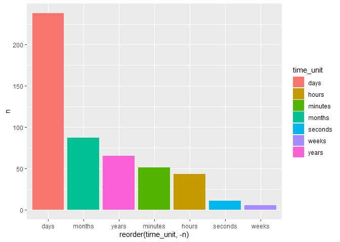<!-- -->

``` r
#Convert value to minutes for each group, create a conversion data frame and use a join 

#MinuteDf contains minutes for each single unit 
minuteDf <- data.frame(date = c("years", "months", "weeks", "days", "hours", "minutes", "seconds"), marginalminutes = c(365*24*60, 31*24*60, 7*24*60, 24*60, 60, 1, 1/60))


passwords <- passwords %>% 
  left_join(minuteDf, by = c("time_unit" = "date")) %>% 
  mutate(minutes = value*marginalminutes)
```

    ## Warning: Column `time_unit`/`date` joining character vector and factor,
    ## coercing into character vector

``` r
#Which categories are weakest? 
passwords %>% 
  select(minutes, category) %>% 
  group_by(category) %>% 
  mutate(median = median(minutes)) %>% 
  ungroup() %>% 
  ggplot(aes(x = reorder(category, median), y = minutes, color = category)) + 
  geom_boxplot() + 
  geom_jitter(alpha = .2) + 
  scale_y_log10() + 
  theme(axis.text.x = element_text(angle = 90)) + 
  xlab("")
```

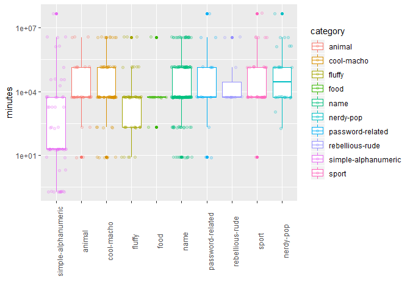<!-- -->

``` r
#Looking at sumamry statistics of categories and their respective minutes 
passwords %>% 
  select(minutes, category) %>% 
  group_by(category) %>% 
  summarise(sd = sd(minutes), 
            mean = mean(minutes),
            median = median(minutes),
            max = max(minutes), 
            min = min(minutes),
            n = n()) %>% 
  arrange(-median , -sd)
```

    ## # A tibble: 10 x 7
    ##    category                   sd     mean  median      max      min     n
    ##    <chr>                   <dbl>    <dbl>   <dbl>    <dbl>    <dbl> <int>
    ##  1 nerdy-pop            8823676. 2154649. 73879.  48497112  185.       30
    ##  2 password-related    12440395. 3757168.  5357.  48497112    7.92     15
    ##  3 sport                7980788. 1839208.  5357.  48497112    7.92     37
    ##  4 rebellious-rude      1461419.  677186.  5357.   3631896 5357.       11
    ##  5 cool-macho           1300321.  581445.  5357.   3631896    7.92     79
    ##  6 name                 1173961.  468213.  5357.   3631896    7.92    183
    ##  7 animal               1115847.  408146.  5357.   3631896    7.92     29
    ##  8 food                 1093599.  334574.  5357.   3631896  206.       11
    ##  9 fluffy                921331.  269413.  5357.   3631896    7.92     44
    ## 10 simple-alphanumeric  6233339. 1023638.    18.5 48497112    0.185    61

``` r
#Why do nerdy-pop have the highest median time? 
#Why does rebellioius-rude passwords have the highest minimum time to crack? 
```

``` r
#Viewing top 5 passwords from those categories 
passwords %>% 
  select(category, password, minutes, value, time_unit) %>% 
  filter(category %in% c("nerdy-pop", "rebellious-rude")) %>% 
  group_by(category) %>% 
  top_n(minutes, n = 5) %>% 
  arrange(category, -minutes)
```

    ## # A tibble: 18 x 5
    ## # Groups:   category [2]
    ##    category        password   minutes value time_unit
    ##    <chr>           <chr>        <dbl> <dbl> <chr>    
    ##  1 nerdy-pop       rush2112 48497112  92.3  years    
    ##  2 nerdy-pop       starwars  3631896   6.91 years    
    ##  3 nerdy-pop       computer  3631896   6.91 years    
    ##  4 nerdy-pop       startrek  3631896   6.91 years    
    ##  5 nerdy-pop       ncc1701   1345536   2.56 years    
    ##  6 nerdy-pop       thx1138   1345536   2.56 years    
    ##  7 nerdy-pop       bond007   1345536   2.56 years    
    ##  8 rebellious-rude whatever  3631896   6.91 years    
    ##  9 rebellious-rude butthead  3631896   6.91 years    
    ## 10 rebellious-rude freedom    142402.  3.19 months   
    ## 11 rebellious-rude biteme       5357.  3.72 days     
    ## 12 rebellious-rude secret       5357.  3.72 days     
    ## 13 rebellious-rude badboy       5357.  3.72 days     
    ## 14 rebellious-rude sexsex       5357.  3.72 days     
    ## 15 rebellious-rude booger       5357.  3.72 days     
    ## 16 rebellious-rude stupid       5357.  3.72 days     
    ## 17 rebellious-rude horny        5357.  3.72 days     
    ## 18 rebellious-rude sucker       5357.  3.72 days

``` r
#Rebellious-rude do not have any numbers, also whatever and butthead take 3631896 minutes or 6.91 years to crack?
#I believe these may be outliers for how online guessing works 
```

``` r
#Looking at the hardest passwords by looking at the top 25 highest times for time to crack by online guessing
passwords %>% 
  select(password, minutes, value, time_unit) %>% 
  top_n(minutes, n = 25) %>% 
  arrange(-minutes)
```

    ## # A tibble: 60 x 4
    ##    password  minutes value time_unit
    ##    <chr>       <dbl> <dbl> <chr>    
    ##  1 trustno1 48497112 92.3  years    
    ##  2 rush2112 48497112 92.3  years    
    ##  3 jordan23 48497112 92.3  years    
    ##  4 passw0rd 48497112 92.3  years    
    ##  5 password  3631896  6.91 years    
    ##  6 baseball  3631896  6.91 years    
    ##  7 football  3631896  6.91 years    
    ##  8 jennifer  3631896  6.91 years    
    ##  9 superman  3631896  6.91 years    
    ## 10 michelle  3631896  6.91 years    
    ## # ... with 50 more rows

``` r
#Data contains popular weak passwords which makes sense however, it is odd seeding password to take 6.91 years of online guessing 
```

``` r
#Lets look at time to crack offline in seconds 
#Is this from brute force or what? 

passwords %>% 
  select(password, offline_crack_sec) %>% 
  top_n(offline_crack_sec, n = 25) %>% 
  arrange(-offline_crack_sec)
```

    ## # A tibble: 60 x 2
    ##    password offline_crack_sec
    ##    <chr>                <dbl>
    ##  1 jordan23             29.3 
    ##  2 trustno1             29.0 
    ##  3 rush2112             29.0 
    ##  4 passw0rd             29.0 
    ##  5 password              2.17
    ##  6 baseball              2.17
    ##  7 football              2.17
    ##  8 jennifer              2.17
    ##  9 superman              2.17
    ## 10 michelle              2.17
    ## # ... with 50 more rows

``` r
#Lets see what is passwords are shared and not shared between top 25 online guessing and offline crack offline 

topMinutes <- passwords %>% 
  select(password, minutes) %>% 
  top_n(minutes, n = 25) %>% 
  select(password) 
  
topOffline <- passwords %>% 
   select(password, offline_crack_sec) %>% 
   top_n(offline_crack_sec, n = 25) %>% 
   select(password)

#Share the same passwords
intersect(topMinutes, topOffline)
```

    ## # A tibble: 60 x 1
    ##    password
    ##    <chr>   
    ##  1 password
    ##  2 baseball
    ##  3 football
    ##  4 jennifer
    ##  5 superman
    ##  6 trustno1
    ##  7 michelle
    ##  8 sunshine
    ##  9 starwars
    ## 10 computer
    ## # ... with 50 more rows

``` r
#No different passwords betweeen the two 
setdiff(topMinutes, topOffline)
```

    ## # A tibble: 0 x 1
    ## # ... with 1 variable: password <chr>

``` r
#Can I make a model to predict the time it would take to guess the password online or offline? 
modelDf <- passwords %>% 
  select(password) %>% 
  mutate(character = str_split(password,"")) %>% 
  unnest(character) %>% 
  count(password, character) %>% 
  spread(key = character, value = n) %>% 
  mutate_if(is.numeric, funs(replace_na(., 0))) %>% 
  left_join(passwords %>% select(password, minutes), by = c("password" = "password")) %>% 
  select(-password)
```

    ## Warning: funs() is soft deprecated as of dplyr 0.8.0
    ## Please use a list of either functions or lambdas: 
    ## 
    ##   # Simple named list: 
    ##   list(mean = mean, median = median)
    ## 
    ##   # Auto named with `tibble::lst()`: 
    ##   tibble::lst(mean, median)
    ## 
    ##   # Using lambdas
    ##   list(~ mean(., trim = .2), ~ median(., na.rm = TRUE))
    ## This warning is displayed once per session.

``` r
library(caret)
```

    ## Warning: package 'caret' was built under R version 3.5.3

    ## Loading required package: lattice

    ## 
    ## Attaching package: 'caret'

    ## The following object is masked from 'package:purrr':
    ## 
    ##     lift

``` r
dataPartition <- createDataPartition(modelDf$minutes, p = .8, list = FALSE)
trainData <- modelDf[dataPartition,]
testData <- modelDf[-dataPartition,]
```

``` r
#We are using the characters and numbers to predict how many minutes it takes to guess the password online 
#This is a simple regression problem 
#Lets first create a linear model and see what going on

baseLineModel <- train(minutes~., 
                       data = trainData, 
                       method = "glm")
```

    ## Warning in predict.lm(object, newdata, se.fit, scale = 1, type =
    ## ifelse(type == : prediction from a rank-deficient fit may be misleading
    
    ## Warning in predict.lm(object, newdata, se.fit, scale = 1, type =
    ## ifelse(type == : prediction from a rank-deficient fit may be misleading
    
    ## Warning in predict.lm(object, newdata, se.fit, scale = 1, type =
    ## ifelse(type == : prediction from a rank-deficient fit may be misleading
    
    ## Warning in predict.lm(object, newdata, se.fit, scale = 1, type =
    ## ifelse(type == : prediction from a rank-deficient fit may be misleading
    
    ## Warning in predict.lm(object, newdata, se.fit, scale = 1, type =
    ## ifelse(type == : prediction from a rank-deficient fit may be misleading

``` r
baseLineModel$finalModel %>% plot()
```

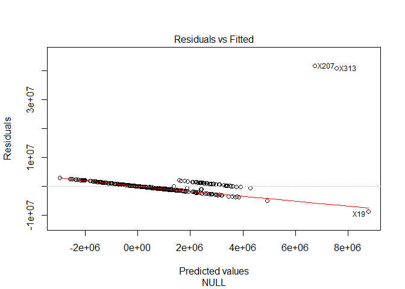<!-- -->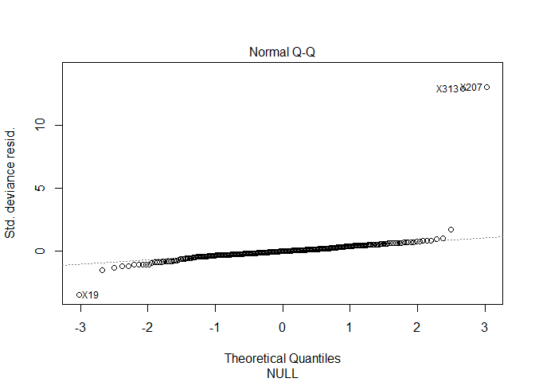<!-- -->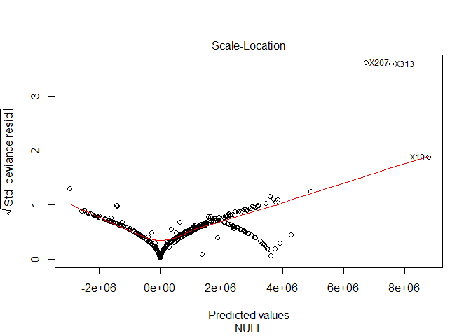<!-- -->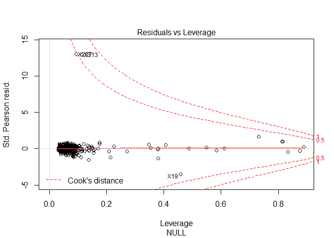<!-- -->

``` r
baseLineModel %>% varImp()
```

    ## glm variable importance
    ## 
    ##   only 20 most important variables shown (out of 36)
    ## 
    ##           Overall
    ## `\\`2\\``  100.00
    ## r           76.62
    ## j           61.16
    ## `\\`1\\``   60.75
    ## l           58.80
    ## d           58.29
    ## x           54.14
    ## s           53.03
    ## h           49.41
    ## u           43.91
    ## n           43.19
    ## a           37.99
    ## o           37.43
    ## `\\`3\\``   29.93
    ## t           28.81
    ## b           27.06
    ## i           26.92
    ## c           26.69
    ## e           26.01
    ## `\\`8\\``   24.58

``` r
predict(baseLineModel, testData) %>% 
  cbind(testData$minutes) %>% 
  as.tibble() %>% 
  rename("Pred" = 1, "Actual" = 2) %>% 
  ggplot(aes(x = Pred, y = Actual)) + 
  geom_point() +
  geom_smooth(se = FALSE, method = "lm") + 
  scale_y_log10() 
```

    ## Warning: `as.tibble()` is deprecated, use `as_tibble()` (but mind the new semantics).
    ## This warning is displayed once per session.

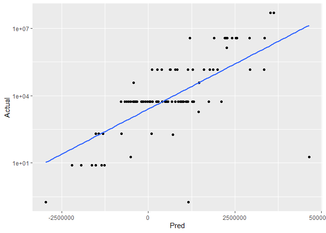<!-- -->

``` r
#Linear Model is not very good 
```

``` r
#More EDA 
#What are the most common characters? 
passwords %>% 
  select(password) %>% 
  mutate(character = str_split(password,"")) %>% 
  unnest(character) %>% 
  count(password, character) %>% 
  mutate_if(is.numeric, funs(replace_na(., 0))) %>% 
  arrange(password, character) %>%
  group_by(character) %>% 
  summarise(n = sum(n)) %>% 
  ggplot(aes(x = reorder(character, -n), y = n)) + 
  geom_col()
```

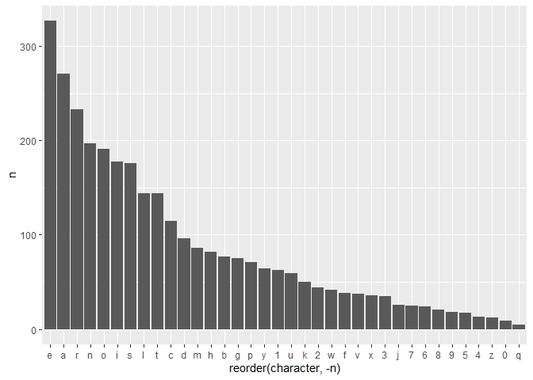<!-- -->

``` r
#what are the common letters for each category? 
passwords %>% 
  select(password) %>% 
  mutate(character = str_split(password,"")) %>% 
  unnest(character) %>% 
  count(password, character) %>% 
  mutate_if(is.numeric, funs(replace_na(., 0))) %>% 
  arrange(password, character) %>% 
  left_join(passwords %>% select(password, category), by = c("password"="password")) %>% 
  group_by(category, character) %>% 
  summarise(n = sum(n)) %>% 
  top_n(n, n = 10) %>% 
  ggplot(aes(x = character, y = n, fill = category)) + 
  geom_col() + 
  facet_wrap(~category, scales = "free") + 
  theme(legend.position = "none")
```

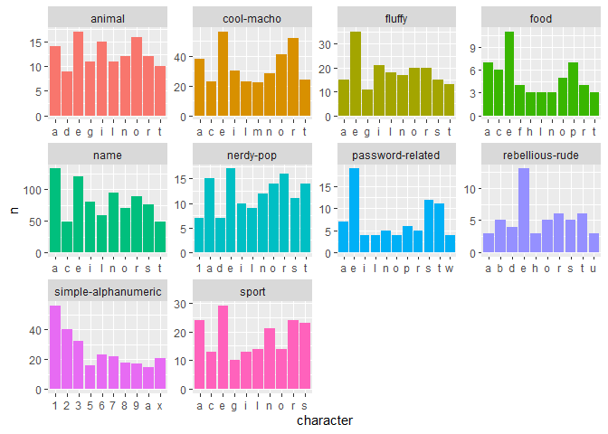<!-- -->

``` r
#Zipfs Law? 
passwords %>% 
  select(password) %>% 
  mutate(character = str_split(password,"")) %>% 
  unnest(character) %>% 
  count(password, character) %>% 
  mutate_if(is.numeric, funs(replace_na(., 0))) %>% 
  arrange(password, character) %>%
  group_by(character) %>% 
  summarise(n = sum(n)) %>% 
  arrange(-n) %>% 
  mutate(rank = row_number()) %>% 
  ggplot(aes(x = rank, y = n)) +
  geom_line() + 
  geom_point() +
  scale_x_log10() + 
  scale_y_log10()
```

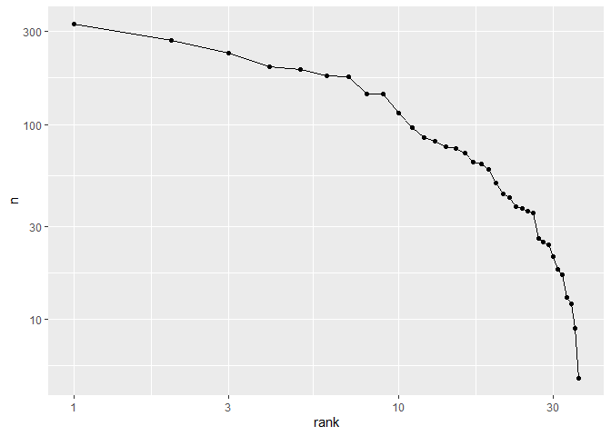<!-- -->

``` r
#What words are most common when removing numbers? 
passwords %>% 
  select(password) %>% 
  mutate(password = str_replace_all(password, pattern = "[0-9]", "")) %>% 
  arrange(password) %>% 
  filter(password != "") %>% 
  count(password) %>% 
  filter(n > 1)
```

    ## # A tibble: 4 x 2
    ##   password     n
    ##   <chr>    <int>
    ## 1 abc          2
    ## 2 eagle        2
    ## 3 jordan       2
    ## 4 test         2

``` r
#Lets find the most common first, second, and third letters 

passwords %>% 
  select(password) %>% 
  mutate(first = substr(password, 1, 1),
         second = substr(password, 2,2),
         third = substr(password, 3,3)) %>% 
  select(-password) %>% 
  gather(key = "positions", value = "letter") %>% 
  group_by(positions) %>% 
  count(letter) %>% 
  arrange(-n) %>% 
  ggplot(aes(x = letter, y = n, fill = positions)) + 
  geom_col() + 
  facet_wrap(~positions, scales = "free") + 
  theme(legend.position = "none")
```

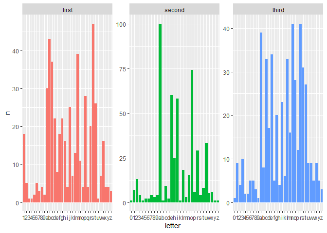<!-- -->

``` r
#Zips law for each position 
passwords %>% 
  select(password) %>% 
  mutate(first = substr(password, 1, 1),
         second = substr(password, 2,2),
         third = substr(password, 3,3)) %>% 
  select(-password) %>% 
  gather(key = "positions", value = "letter") %>% 
  group_by(positions) %>% 
  count(letter) %>% 
  arrange(positions, -n) %>% 
  mutate(rank = row_number()) %>% 
  ggplot(aes(x = rank, y = n, color = positions)) + 
  geom_line() + 
  scale_x_log10() + 
  scale_y_log10() 
```

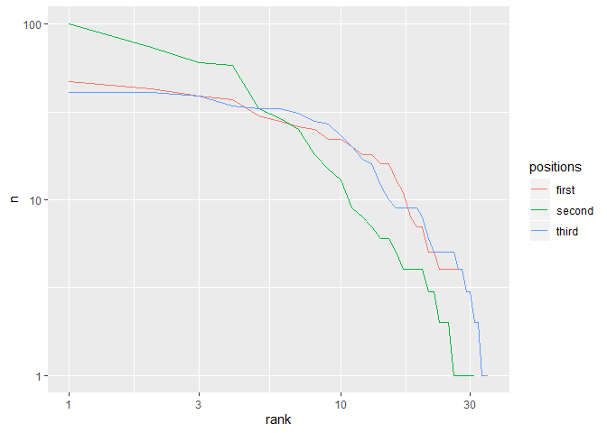<!-- -->

``` r
#Better Chart for First 3 letters 
passwords %>% 
  select(password) %>% 
  mutate(first = substr(password, 1, 1),
         second = substr(password, 2,2),
         third = substr(password, 3,3)) %>% 
  select(-password) %>% 
  gather(key = "positions", value = "letter") %>% 
  group_by(positions) %>% 
  count(letter) %>% 
  top_n(n, n = 5) %>% 
  ggplot(aes(x = reorder(letter, n), y = n, color = positions, group = positions)) + 
  geom_point() + 
  geom_segment(aes(xend = letter, yend = 0)) + 
  facet_wrap(~positions, scales = "free")
```

<!-- -->

``` r
#What are the most common first 3 letters combinations and their variations?  
passwords %>% 
  select(password) %>% 
  mutate(three = substr(password, 1, 3)) %>% 
  count(three) %>% 
  top_n(n, n = 5) %>% 
  select(three) %>% 
  inner_join(passwords %>% 
  select(password) %>% 
  mutate(three = substr(password, 1, 3))) %>% 
  arrange(three, password)
```

    ## Joining, by = "three"

    ## # A tibble: 35 x 2
    ##    three password 
    ##    <chr> <chr>    
    ##  1 123   123123   
    ##  2 123   123321   
    ##  3 123   1234     
    ##  4 123   12345    
    ##  5 123   123456   
    ##  6 123   1234567  
    ##  7 123   12345678 
    ##  8 123   123456789
    ##  9 123   123abc   
    ## 10 che   cheese   
    ## # ... with 25 more rows
