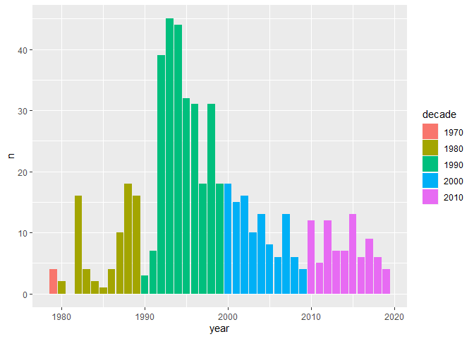
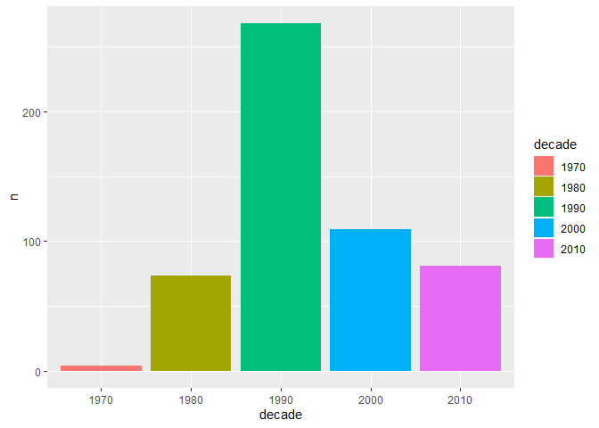
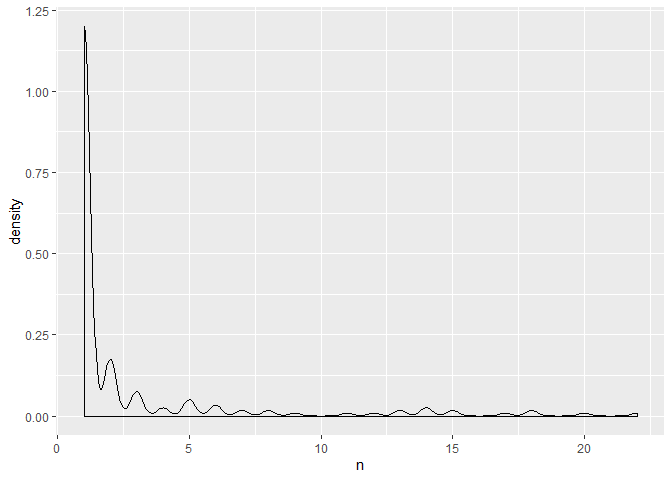
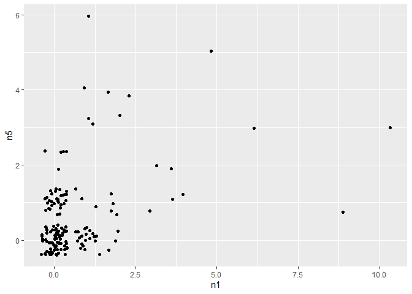
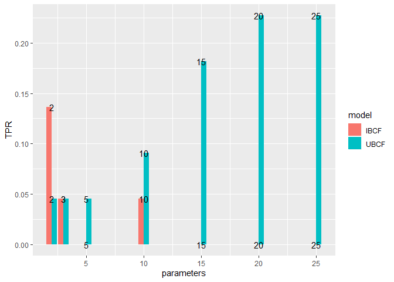

TidyTuesdayBestRapArtists
================

``` r
library(tidyverse)
```

    ## Warning: package 'tidyverse' was built under R version 3.5.3

    ## -- Attaching packages --------

    ## v ggplot2 3.2.1     v purrr   0.3.3
    ## v tibble  2.1.3     v dplyr   0.8.3
    ## v tidyr   1.0.0     v stringr 1.4.0
    ## v readr   1.3.1     v forcats 0.4.0

    ## Warning: package 'ggplot2' was built under R version 3.5.3

    ## Warning: package 'tibble' was built under R version 3.5.3

    ## Warning: package 'tidyr' was built under R version 3.5.3

    ## Warning: package 'purrr' was built under R version 3.5.3

    ## Warning: package 'dplyr' was built under R version 3.5.3

    ## Warning: package 'stringr' was built under R version 3.5.3

    ## Warning: package 'forcats' was built under R version 3.5.3

    ## -- Conflicts -----------------
    ## x dplyr::filter() masks stats::filter()
    ## x dplyr::lag()    masks stats::lag()

``` r
polls <- readr::read_csv('https://raw.githubusercontent.com/rfordatascience/tidytuesday/master/data/2020/2020-04-14/polls.csv')
```

    ## Parsed with column specification:
    ## cols(
    ##   rank = col_double(),
    ##   title = col_character(),
    ##   artist = col_character(),
    ##   gender = col_character(),
    ##   year = col_double(),
    ##   critic_name = col_character(),
    ##   critic_rols = col_character(),
    ##   critic_country = col_character(),
    ##   critic_country2 = col_character()
    ## )

``` r
rankings <- readr::read_csv('https://raw.githubusercontent.com/rfordatascience/tidytuesday/master/data/2020/2020-04-14/rankings.csv')
```

    ## Parsed with column specification:
    ## cols(
    ##   ID = col_double(),
    ##   title = col_character(),
    ##   artist = col_character(),
    ##   year = col_double(),
    ##   gender = col_character(),
    ##   points = col_double(),
    ##   n = col_double(),
    ##   n1 = col_double(),
    ##   n2 = col_double(),
    ##   n3 = col_double(),
    ##   n4 = col_double(),
    ##   n5 = col_double()
    ## )

``` r
polls
```

    ## # A tibble: 535 x 9
    ##     rank title artist gender  year critic_name critic_rols critic_country
    ##    <dbl> <chr> <chr>  <chr>  <dbl> <chr>       <chr>       <chr>         
    ##  1     1 Term~ Publi~ male    1998 Joseph Aba~ Fat Beats   US            
    ##  2     2 4th ~ Gza f~ male    1995 Joseph Aba~ Fat Beats   US            
    ##  3     3 Pete~ Run D~ male    1986 Joseph Aba~ Fat Beats   US            
    ##  4     4 Play~ GLOBE~ male    2001 Joseph Aba~ Fat Beats   US            
    ##  5     5 Time~ O.C.   male    1994 Joseph Aba~ Fat Beats   US            
    ##  6     1 Play~ Slum ~ male    1997 Biba Adams  Critic      US            
    ##  7     2 Self~ Stop ~ mixed   1989 Biba Adams  Critic      US            
    ##  8     3 Push~ Salt-~ female  1986 Biba Adams  Critic      US            
    ##  9     4 Ambi~ 2Pac   male    1996 Biba Adams  Critic      US            
    ## 10     5 Big ~ JAY-Z~ male    1999 Biba Adams  Critic      US            
    ## # ... with 525 more rows, and 1 more variable: critic_country2 <chr>

``` r
rankings
```

    ## # A tibble: 311 x 12
    ##       ID title artist  year gender points     n    n1    n2    n3    n4
    ##    <dbl> <chr> <chr>  <dbl> <chr>   <dbl> <dbl> <dbl> <dbl> <dbl> <dbl>
    ##  1     1 Juicy The N~  1994 male      140    18     9     3     3     1
    ##  2     2 Figh~ Publi~  1989 male      100    11     7     3     1     0
    ##  3     3 Shoo~ Mobb ~  1995 male       94    13     4     5     1     1
    ##  4     4 The ~ Grand~  1982 male       90    14     5     3     1     0
    ##  5     5 Nuth~ Dr Dr~  1992 male       84    14     2     4     2     4
    ##  6     6 C.R.~ Wu-Ta~  1993 male       62    10     3     1     1     4
    ##  7     7 93 ’~ Souls~  1993 male       50     7     2     2     2     0
    ##  8     8 Pass~ The P~  1992 male       48     6     3     2     0     0
    ##  9     9 N.Y.~ Nas     1994 male       46     7     1     3     1     1
    ## 10    10 Dear~ 2Pac    1995 male       42     6     2     1     1     2
    ## # ... with 301 more rows, and 1 more variable: n5 <dbl>

``` r
polls %>% 
  count(title, sort = TRUE)
```

    ## # A tibble: 309 x 2
    ##    title                       n
    ##    <chr>                   <int>
    ##  1 Juicy                      18
    ##  2 Nuthin’ But A ‘G’ Thang    14
    ##  3 The Message                14
    ##  4 Shook Ones (Part II)       13
    ##  5 Fight The Power            11
    ##  6 C.R.E.A.M.                 10
    ##  7 93 ’Til Infinity            7
    ##  8 N.Y. State Of Mind          7
    ##  9 Dear Mama                   6
    ## 10 Jesus Walks                 6
    ## # ... with 299 more rows

``` r
polls %>% 
  count(year) %>% 
  mutate(decade = floor(year / 10)*10) %>% 
  mutate(decade = as.factor(decade)) %>% 
  ggplot(aes(x = year, y = n, fill = decade)) + geom_col() 
```

<!-- -->

``` r
#The golden-age of rap is the 1990s 
polls %>% 
  count(year) %>% 
  mutate(decade = floor(year / 10)*10) %>% 
  mutate(decade = as.factor(decade)) %>% 
  ggplot(aes(x = decade, y = n, fill = decade)) + geom_col() 
```

<!-- -->

``` r
polls %>% 
  count(artist, sort = TRUE) %>% 
  ggplot(aes(x = n)) + geom_density()
```

<!-- -->

``` r
rankings %>% 
  select(artist, n, n1, n2, n3, n4, n5) %>% 
  group_by(artist) %>% 
  summarise_all(sum) %>% 
  filter(!str_detect(artist, "ft.")) %>% 
  ggplot(aes(x = n1, y = n5)) + geom_jitter() 
```

<!-- -->

``` r
rankings %>% 
  select(artist, n, n1, n2, n3, n4, n5) %>% 
  group_by(artist) %>% 
  summarise_all(sum) %>% 
  filter(!str_detect(artist, "ft.")) %>% 
  arrange(desc(n1)) %>% 
  slice(1:5)
```

    ## # A tibble: 5 x 7
    ##   artist                                   n    n1    n2    n3    n4    n5
    ##   <chr>                                <dbl> <dbl> <dbl> <dbl> <dbl> <dbl>
    ## 1 The Notorious B.I.G.                    22    10     3     4     2     3
    ## 2 Public Enemy                            18     9     4     2     2     1
    ## 3 Wu-Tang Clan                            20     6     1     3     7     3
    ## 4 Grandmaster Flash & The Furious Five    14     5     3     1     0     5
    ## 5 2Pac                                    13     4     3     1     4     1

``` r
rankings %>% 
  select(artist, n, n1, n2, n3, n4, n5) %>% 
  group_by(artist) %>% 
  summarise_all(sum) %>% 
  filter(!str_detect(artist, "ft.")) %>% 
  arrange(desc(n5)) %>% 
  slice(1:5)
```

    ## # A tibble: 5 x 7
    ##   artist                                   n    n1    n2    n3    n4    n5
    ##   <chr>                                <dbl> <dbl> <dbl> <dbl> <dbl> <dbl>
    ## 1 Kendrick Lamar                          15     1     3     4     1     6
    ## 2 Grandmaster Flash & The Furious Five    14     5     3     1     0     5
    ## 3 JAY-Z                                   18     2     5     3     4     4
    ## 4 Kanye West                              14     1     1     4     4     4
    ## 5 OutKast                                 17     2     4     3     4     4

``` r
#15% of the top songs were voted by only one country 
#Home town / country bias? 
polls %>% 
  count(title, critic_country, name = "song_nom") %>% 
  add_count(title, name = "number_of_countries") %>% 
  filter(number_of_countries == 1 & critic_country != "US") %>% 
  nrow() / nrow(polls)
```

    ## [1] 0.1551402

``` r
polls %>% 
  count(title, critic_country, name = "song_nom_country") %>% 
  add_count(title, name = "number_of_countries") %>% 
  filter(number_of_countries != 1) %>% 
  select(-number_of_countries) %>% 
  pivot_wider(names_from = "critic_country", values_from = "song_nom_country")
```

    ## # A tibble: 52 x 14
    ##    title `South Africa`    US Germany India Japan    UK `New Zealand`
    ##    <chr>          <int> <int>   <int> <int> <int> <int>         <int>
    ##  1 93 ’~              1     6      NA    NA    NA    NA            NA
    ##  2 All ~             NA     2       1    NA    NA    NA            NA
    ##  3 Alri~             NA     4      NA     1    NA    NA            NA
    ##  4 B.O.~             NA     3      NA    NA     1    NA            NA
    ##  5 Bloo~             NA    NA       1    NA    NA     1            NA
    ##  6 Boda~             NA     1      NA    NA    NA    NA             1
    ##  7 Brin~             NA     1      NA     1    NA    NA            NA
    ##  8 C.R.~             NA     7      NA    NA    NA     1             1
    ##  9 Cali~             NA     1       1    NA    NA    NA            NA
    ## 10 Can’~             NA     1       1    NA    NA    NA            NA
    ## # ... with 42 more rows, and 6 more variables: `Russian Federation` <int>,
    ## #   China <int>, Nigeria <int>, Kenya <int>, Canada <int>, Colombia <int>

``` r
library(recommenderlab)
```

    ## Warning: package 'recommenderlab' was built under R version 3.5.3

    ## Loading required package: Matrix

    ## Warning: package 'Matrix' was built under R version 3.5.3

    ## 
    ## Attaching package: 'Matrix'

    ## The following objects are masked from 'package:tidyr':
    ## 
    ##     expand, pack, unpack

    ## Loading required package: arules

    ## Warning: package 'arules' was built under R version 3.5.3

    ## 
    ## Attaching package: 'arules'

    ## The following object is masked from 'package:dplyr':
    ## 
    ##     recode

    ## The following objects are masked from 'package:base':
    ## 
    ##     abbreviate, write

    ## Loading required package: proxy

    ## Warning: package 'proxy' was built under R version 3.5.3

    ## 
    ## Attaching package: 'proxy'

    ## The following object is masked from 'package:Matrix':
    ## 
    ##     as.matrix

    ## The following objects are masked from 'package:stats':
    ## 
    ##     as.dist, dist

    ## The following object is masked from 'package:base':
    ## 
    ##     as.matrix

    ## Loading required package: registry

``` r
rap_matrix <- polls %>% 
  select(critic_name, title) %>% 
  mutate(n = 1) %>% 
  arrange(title) %>% 
  pivot_wider(names_from = "title", values_from = "n", values_fill = list(n = 0)) %>% 
  select(-critic_name) %>% 
  as.matrix() %>% 
  as("binaryRatingMatrix")
```

``` r
training_schema <- evaluationScheme(rap_matrix, method = "split", train = .8, given = -1)
training_schema
```

    ## Evaluation scheme using all-but-1 items
    ## Method: 'split' with 1 run(s).
    ## Training set proportion: 0.800
    ## Good ratings: NA
    ## Data set: 107 x 309 rating matrix of class 'binaryRatingMatrix' with 535 ratings.

``` r
UBCF_Model <- evaluate(training_schema, method = "UBCF", type = "topNList", n = 5)
```

    ## UBCF run fold/sample [model time/prediction time]
    ##   1  [0sec/0.14sec]

``` r
IBCF_Model <- evaluate(training_schema, method = "IBCF", type = "topNList", n = 5)
```

    ## IBCF run fold/sample [model time/prediction time]
    ##   1  [0.33sec/0.08sec]

``` r
UBCF_Model %>% avg()
```

    ##          TP       FP        FN       TN  precision    recall       TPR
    ## 5 0.2272727 4.545455 0.7727273 304.4545 0.04761905 0.2272727 0.2272727
    ##          FPR
    ## 5 0.01471021

``` r
IBCF_Model %>% avg() %>% as_tibble()
```

    ## # A tibble: 1 x 8
    ##      TP    FP    FN    TN precision recall   TPR    FPR
    ##   <dbl> <dbl> <dbl> <dbl>     <dbl>  <dbl> <dbl>  <dbl>
    ## 1     0     5     1   304         0      0     0 0.0162

``` r
tune_engines <- function(schema, parameters){
  
  UBCF_Model <- evaluate(schema, method = "UBCF", type = "topNList", n = 5, param = list(nn = parameters))
  IBCF_Model <- evaluate(schema, method = "IBCF", type = "topNList", n = 5, param = list(k = parameters))
  
  
  UBCF_Model %>% 
    avg() %>% 
    as_tibble() %>% 
    mutate(model = "UBCF") %>% 
    rbind(IBCF_Model %>% 
    avg() %>% 
    as_tibble() %>% 
    mutate(model = "IBCF")) %>% 
    return()
  
  

}
```

``` r
tune_grid <- tibble(parameters = c(2, 3, 5, 10, 15, 20, 25))


history <- tune_grid %>% 
  mutate(results = map(parameters, ~tune_engines(training_schema, .x))) %>% 
  unnest()
```

    ## UBCF run fold/sample [model time/prediction time]
    ##   1  [0sec/0.09sec] 
    ## IBCF run fold/sample [model time/prediction time]
    ##   1  [0.18sec/0.02sec] 
    ## UBCF run fold/sample [model time/prediction time]
    ##   1  [0sec/0.08sec] 
    ## IBCF run fold/sample [model time/prediction time]
    ##   1  [0.28sec/0.02sec] 
    ## UBCF run fold/sample [model time/prediction time]
    ##   1  [0sec/0.06sec] 
    ## IBCF run fold/sample [model time/prediction time]
    ##   1  [0.12sec/0sec] 
    ## UBCF run fold/sample [model time/prediction time]
    ##   1  [0sec/0.08sec] 
    ## IBCF run fold/sample [model time/prediction time]
    ##   1  [0.11sec/0sec] 
    ## UBCF run fold/sample [model time/prediction time]
    ##   1  [0sec/0.06sec] 
    ## IBCF run fold/sample [model time/prediction time]
    ##   1  [0.12sec/0sec] 
    ## UBCF run fold/sample [model time/prediction time]
    ##   1  [0sec/0.06sec] 
    ## IBCF run fold/sample [model time/prediction time]
    ##   1  [0.13sec/0sec] 
    ## UBCF run fold/sample [model time/prediction time]
    ##   1  [0sec/0.06sec] 
    ## IBCF run fold/sample [model time/prediction time]
    ##   1  [0.13sec/0.01sec]

    ## Warning: `cols` is now required.
    ## Please use `cols = c(results)`

``` r
#Use 5 nearest neighbros
history %>% 
  ggplot(aes(x = parameters, y = TPR, fill = model, label = parameters)) + geom_col(position = "dodge") + geom_text(aes(x = parameters, y = TPR))
```

<!-- -->

``` r
UBCF_Final_model <- Recommender(getData(training_schema, "train"), "UBCF", param = list(nn = 5))


UBCF_Final_model
```

    ## Recommender of type 'UBCF' for 'binaryRatingMatrix' 
    ## learned using 85 users.

``` r
predictions <- predict(UBCF_Final_model, getData(training_schema, "known"), type = "topNList")
calcPredictionAccuracy(predictions, getData(training_schema,"unknown"), given = -1)
```

    ##           TP           FP           FN           TN    precision 
    ## 4.545455e-02 9.500000e+00 9.545455e-01 2.995000e+02 4.761905e-03 
    ##       recall          TPR          FPR 
    ## 4.545455e-02 4.545455e-02 3.074434e-02

``` r
rec_engine <- Recommender(rap_matrix, "UBCF", param = list(nn = 5))
rec_engine
```

    ## Recommender of type 'UBCF' for 'binaryRatingMatrix' 
    ## learned using 107 users.

``` r
polls %>% filter(str_detect(artist, "2Pac")) %>% distinct(title) %>% arrange(title)
```

    ## # A tibble: 8 x 1
    ##   title               
    ##   <chr>               
    ## 1 Ambitionz Az A Ridah
    ## 2 Brenda’s Got A Baby 
    ## 3 California Love     
    ## 4 Changes             
    ## 5 Dear Mama           
    ## 6 Hit ’Em Up          
    ## 7 I Get Around        
    ## 8 So Many Tears

``` r
andrew_songs <- polls %>% 
  select(title) %>% 
  distinct() %>% 
  arrange(title) %>% 
  filter(title %in% c("All Of The Lights", "Alright", "Bitch Don’t Kill My Vibe", "m.A.A.d. city", "Changes")) %>%  
  rbind(polls %>% select(title) %>% distinct()) %>% 
  count(title) %>% 
  mutate(n = n -1) %>% 
  pivot_wider(names_from = "title", values_from = "n", values_fill = list(n = 0)) %>% 
  as.matrix() %>% 
  as("binaryRatingMatrix")
```

``` r
rec_engine
```

    ## Recommender of type 'UBCF' for 'binaryRatingMatrix' 
    ## learned using 107 users.

``` r
predict(rec_engine, andrew_songs) %>% as("list") %>% as.data.frame()
```

    ##                                    X1
    ## 1                             1 Train
    ## 2    Black Steel In The Hour Of Chaos
    ## 3                        Bodak Yellow
    ## 4                     Country Grammar
    ## 5           Da Mystery Of Chessboxin'
    ## 6                        Day 'N' Nite
    ## 7                Doo Wop (That Thing)
    ## 8  Double Trouble At The Amphitheatre
    ## 9                              Get By
    ## 10                    Get Ur Freak On
