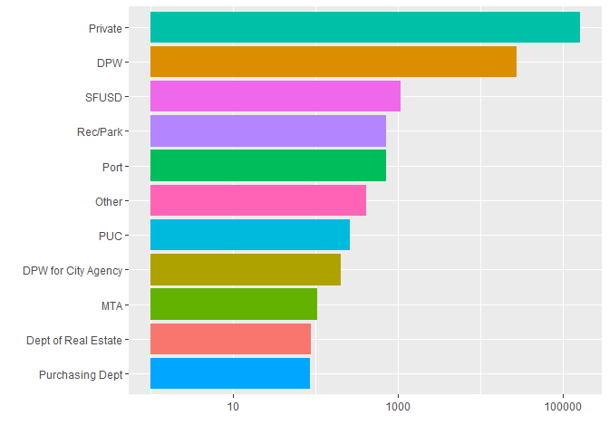
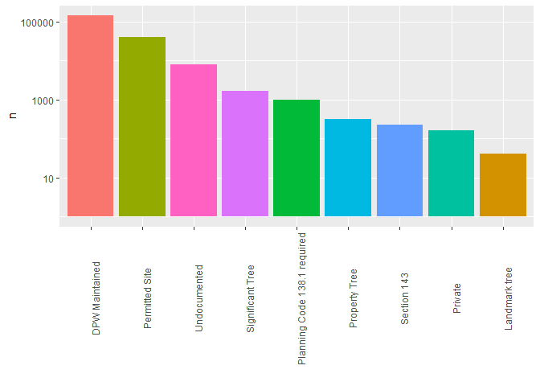
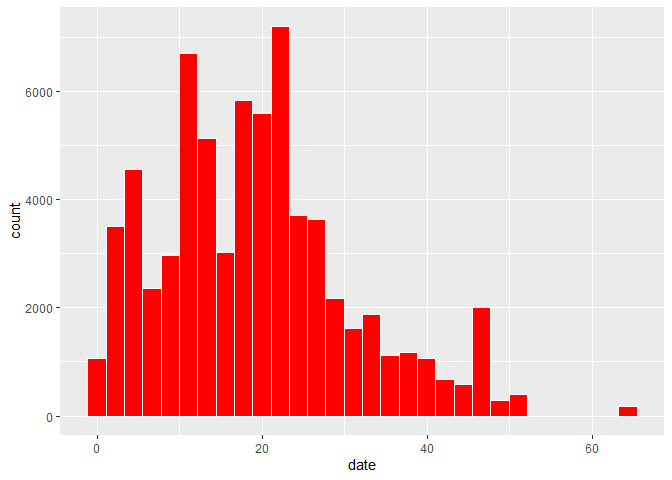
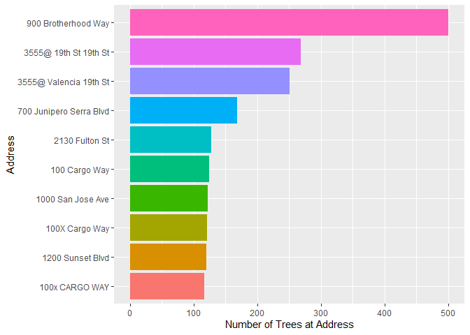

TidyTuesday 1/29/20
================
Andrew Couch
1/29/2020

``` r
df %>% glimpse()
```

    ## Observations: 192,987
    ## Variables: 12
    ## $ tree_id      <dbl> 53719, 30313, 30312, 30314, 30315, 30316, 48435, 30319, …
    ## $ legal_status <chr> "Permitted Site", "Permitted Site", "Permitted Site", "D…
    ## $ species      <chr> "Tree(s) ::", "Tree(s) ::", "Tree(s) ::", "Pittosporum u…
    ## $ address      <chr> "2963 Webster St", "501 Arkansas St", "501 Arkansas St",…
    ## $ site_order   <dbl> 1, 3, 2, 1, 5, 6, 4, 2, 1, 3, 1, 3, 1, 2, 4, 1, 1, 1, 2,…
    ## $ site_info    <chr> "Sidewalk: Curb side : Cutout", "Sidewalk: Curb side : C…
    ## $ caretaker    <chr> "Private", "Private", "Private", "Private", "Private", "…
    ## $ date         <date> 1955-09-19, 1955-10-20, 1955-10-20, 1955-10-20, 1955-10…
    ## $ dbh          <dbl> NA, NA, NA, 16, NA, NA, NA, NA, NA, NA, 2, NA, NA, NA, N…
    ## $ plot_size    <chr> NA, NA, NA, NA, NA, NA, NA, NA, NA, NA, NA, NA, NA, NA, …
    ## $ latitude     <dbl> 37.79787, 37.75984, 37.75984, 37.75977, 37.79265, 37.792…
    ## $ longitude    <dbl> -122.4341, -122.3981, -122.3981, -122.3981, -122.4124, -…

``` r
#Viewing NAs 
df %>%
  is.na() %>% 
  colSums()
```

    ##      tree_id legal_status      species      address   site_order    site_info 
    ##            0           54            0         1487         1634            0 
    ##    caretaker         date          dbh    plot_size     latitude    longitude 
    ##            0       124610        41819        50013         2832         2832

``` r
options(scipen = 999)
df %>%
  select(caretaker) %>%
  mutate(caretaker = fct_lump(caretaker, n = 10)) %>% 
  count(caretaker, caretaker, sort = TRUE) %>% 
  ggplot(aes(x = reorder(caretaker, n), y = n, fill = caretaker)) +
  geom_col() + 
  coord_flip() + 
  scale_y_log10() + 
  theme(legend.position = "none") +
  ylab("") + 
  xlab("")
```

<!-- -->

``` r
#Most caretakers are private 
```

``` r
#Let's look at tree species 
df %>% 
  select(species) %>% 
  count(species, species, sort = TRUE)
```

    ## # A tibble: 571 x 2
    ##    species                                                                     n
    ##    <chr>                                                                   <int>
    ##  1 Tree(s) ::                                                              11629
    ##  2 Platanus x hispanica :: Sycamore: London Plane                          11557
    ##  3 Metrosideros excelsa :: New Zealand Xmas Tree                            8744
    ##  4 Lophostemon confertus :: Brisbane Box                                    8581
    ##  5 Tristaniopsis laurina :: Swamp Myrtle                                    7197
    ##  6 Pittosporum undulatum :: Victorian Box                                   7122
    ##  7 Prunus cerasifera :: Cherry Plum                                         6716
    ##  8 Magnolia grandiflora :: Southern Magnolia                                6285
    ##  9 Arbutus 'Marina' :: Hybrid Strawberry Tree                               5702
    ## 10 Ficus microcarpa nitida 'Green Gem' :: Indian Laurel Fig Tree 'Green G…  5624
    ## # … with 561 more rows

``` r
#After the :: is the common name
```

``` r
#Remove the common name from the species
df <- df %>% 
  mutate(species = gsub("(::)*", "", species))
```

``` r
df %>% 
  select(legal_status) %>% 
  filter(!is.na(legal_status)) %>% 
  count(legal_status, legal_status, sort = TRUE) %>% 
  ggplot(aes(x = reorder(legal_status, -n), y = n, fill = legal_status)) + 
  geom_col() + 
  scale_y_log10() + 
  theme(legend.position = "none", 
        axis.text.x = element_text(angle = 90)) + 
  xlab("")
```

<!-- -->

``` r
df <- df %>% 
  mutate(date = (Sys.Date() - date)/365.25) %>% 
  mutate(date = date %>% as.numeric() %>% round(digits = 2)) 

#Looking at ages of the trees
df %>%
  select(date) %>% 
  ggplot(aes(x = date)) + 
  geom_histogram(fill = "red", color = "white")
```

    ## `stat_bin()` using `bins = 30`. Pick better value with `binwidth`.

    ## Warning: Removed 124610 rows containing non-finite values (stat_bin).

<!-- -->

``` r
#Find the places with the most amount of trees 
df %>% 
  select(address, site_order) %>% 
  group_by(address) %>% 
  filter(site_order == max(site_order)) %>% 
  ungroup() %>% 
  top_n(site_order, n = 10) %>% 
  arrange(-site_order) %>% 
  mutate(address = reorder(address, site_order)) %>% 
  ggplot(aes(x = address, y = site_order, fill = address)) + 
  geom_col() + 
  coord_flip() + 
  theme(legend.position = "none") +
  ylab("Number of Trees at Address") + 
  xlab("Address")
```

<!-- -->
