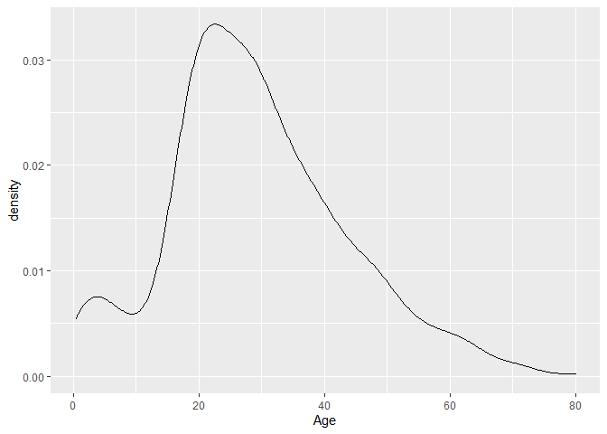
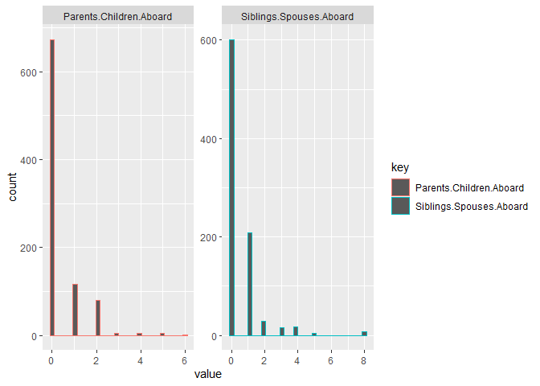
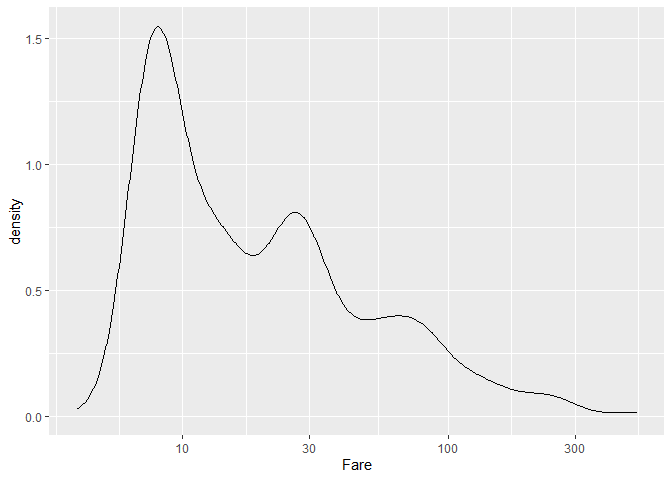
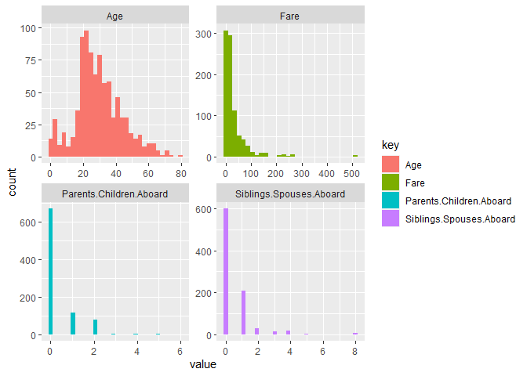

TidyTuesdayTitanic
================

``` r
library(tidyverse)
```

    ## -- Attaching packages ------------------------------------------------------------------------------------------- tidyverse 1.3.0 --

    ## v ggplot2 3.3.0     v purrr   0.3.4
    ## v tibble  3.0.1     v dplyr   0.8.5
    ## v tidyr   1.0.2     v stringr 1.4.0
    ## v readr   1.3.1     v forcats 0.5.0

    ## -- Conflicts ---------------------------------------------------------------------------------------------- tidyverse_conflicts() --
    ## x dplyr::filter() masks stats::filter()
    ## x dplyr::lag()    masks stats::lag()

``` r
library(tidymodels)
```

    ## -- Attaching packages ------------------------------------------------------------------------------------------ tidymodels 0.1.0 --

    ## v broom     0.5.6      v rsample   0.0.6 
    ## v dials     0.0.6      v tune      0.1.0 
    ## v infer     0.5.1      v workflows 0.1.1 
    ## v parsnip   0.1.0      v yardstick 0.0.6 
    ## v recipes   0.1.12

    ## -- Conflicts --------------------------------------------------------------------------------------------- tidymodels_conflicts() --
    ## x scales::discard() masks purrr::discard()
    ## x dplyr::filter()   masks stats::filter()
    ## x recipes::fixed()  masks stringr::fixed()
    ## x dplyr::lag()      masks stats::lag()
    ## x dials::margin()   masks ggplot2::margin()
    ## x yardstick::spec() masks readr::spec()
    ## x recipes::step()   masks stats::step()

``` r
df <- read.csv("titanic.csv")
df %>% summary()
```

    ##     Survived          Pclass          Name               Sex           
    ##  Min.   :0.0000   Min.   :1.000   Length:887         Length:887        
    ##  1st Qu.:0.0000   1st Qu.:2.000   Class :character   Class :character  
    ##  Median :0.0000   Median :3.000   Mode  :character   Mode  :character  
    ##  Mean   :0.3849   Mean   :2.306                                        
    ##  3rd Qu.:1.0000   3rd Qu.:3.000                                        
    ##  Max.   :1.0000   Max.   :3.000                                        
    ##  NA's   :1        NA's   :4                                            
    ##       Age        Siblings.Spouses.Aboard Parents.Children.Aboard
    ##  Min.   : 0.42   Min.   :0.0000          Min.   :0.0000         
    ##  1st Qu.:20.12   1st Qu.:0.0000          1st Qu.:0.0000         
    ##  Median :28.00   Median :0.0000          Median :0.0000         
    ##  Mean   :29.47   Mean   :0.5271          Mean   :0.3831         
    ##  3rd Qu.:38.00   3rd Qu.:1.0000          3rd Qu.:0.0000         
    ##  Max.   :80.00   Max.   :8.0000          Max.   :6.0000         
    ##  NA's   :1       NA's   :3               NA's   :2              
    ##       Fare        
    ##  Min.   :  0.000  
    ##  1st Qu.:  7.925  
    ##  Median : 14.456  
    ##  Mean   : 32.327  
    ##  3rd Qu.: 31.206  
    ##  Max.   :512.329  
    ##  NA's   :1

``` r
#Row wise counts of na's
df %>%
  mutate(row_key = row_number()) %>% 
  gather(key = "key", value = "value", -row_key) %>% 
  filter(value %>% is.na()) %>% 
  count(row_key, sort = TRUE)
```

    ## # A tibble: 17 x 2
    ##    row_key     n
    ##      <int> <int>
    ##  1     126     2
    ##  2     852     2
    ##  3       2     1
    ##  4       9     1
    ##  5      10     1
    ##  6      57     1
    ##  7     180     1
    ##  8     537     1
    ##  9     553     1
    ## 10     565     1
    ## 11     589     1
    ## 12     623     1
    ## 13     658     1
    ## 14     771     1
    ## 15     843     1
    ## 16     858     1
    ## 17     859     1

``` r
df %>% group_by(Pclass) %>% 
  summarise(count = n(),
            min_fare = min(Fare, na.rm = TRUE),
            avg_age = mean(Age, na.rm = TRUE),
            avg_fare = mean(Fare, na.rm = TRUE))
```

    ## # A tibble: 4 x 5
    ##   Pclass count min_fare avg_age avg_fare
    ##    <int> <int>    <dbl>   <dbl>    <dbl>
    ## 1      1   215     0       38.7     84.4
    ## 2      2   183     0       29.9     20.8
    ## 3      3   485     0       25.1     13.7
    ## 4     NA     4     7.90    39.2     13.5

``` r
#Step knn-impute
df %>% filter(Pclass %>% is.na())
```

    ##   Survived Pclass                              Name  Sex Age
    ## 1        0     NA           Mr. Percy Andrew Bailey male  18
    ## 2        0     NA          Mr. Francis Davis Millet male  65
    ## 3        0     NA                 Mr. Todor Sdycoff male  42
    ## 4        1     NA Mr. Berk (Berk Trembisky) Pickard male  32
    ##   Siblings.Spouses.Aboard Parents.Children.Aboard    Fare
    ## 1                       0                       0 11.5000
    ## 2                       0                       0 26.5500
    ## 3                      NA                       0  7.8958
    ## 4                       0                       0  8.0500

``` r
#But first we need to clean
df <- df %>% 
  select(-Name) %>% 
  mutate(Sex = as.factor(Sex),
         Survived = as.factor(Survived),
         Pclass = as.factor(Pclass))

titanic_rec <- recipe(Survived ~., data = df)

titanic_rec <- titanic_rec %>% 
  step_knnimpute(Pclass)
```

``` r
df %>% group_by(Sex) %>% 
  summarise(avg_age = mean(Age, na.rm = TRUE),
            avg_fare = mean(Fare, na.rm = TRUE))
```

    ## Warning: Factor `Sex` contains implicit NA, consider using
    ## `forcats::fct_explicit_na`

    ## # A tibble: 3 x 3
    ##   Sex    avg_age avg_fare
    ##   <fct>    <dbl>    <dbl>
    ## 1 female    27.8     44.6
    ## 2 male      30.4     25.7
    ## 3 <NA>      36       15.7

``` r
df %>% filter(Sex %>% is.na())
```

    ##   Survived Pclass  Sex Age Siblings.Spouses.Aboard Parents.Children.Aboard
    ## 1        0      3 <NA>  23                       0                       0
    ## 2        1      3 <NA>  15                       0                       0
    ## 3        1      2 <NA>  62                       0                       0
    ## 4        0      1 <NA>  31                       1                       0
    ## 5        0      3 <NA>  49                       0                       0
    ##      Fare
    ## 1  7.8958
    ## 2  8.0292
    ## 3 10.5000
    ## 4 52.0000
    ## 5  0.0000

``` r
#Impute the modal categorical value

titanic_rec <- titanic_rec %>% 
  step_modeimpute(Sex)
```

``` r
df %>% 
  ggplot(aes(Age)) + 
  geom_density()
```

    ## Warning: Removed 1 rows containing non-finite values (stat_density).

<!-- -->

``` r
#Impute using median age 

titanic_rec <- titanic_rec %>% 
  step_medianimpute(Age)
```

``` r
df %>% 
  select(Siblings.Spouses.Aboard, Parents.Children.Aboard) %>% 
  gather() %>% 
  ggplot(aes(x = value, color = key)) + 
  geom_histogram() + 
  facet_wrap(~key, scales = "free")
```

    ## `stat_bin()` using `bins = 30`. Pick better value with `binwidth`.

    ## Warning: Removed 5 rows containing non-finite values (stat_bin).

<!-- -->

``` r
#Since you cannot have a half a parent or sibling aboard lets impute with mode
titanic_rec <- titanic_rec %>% 
  step_modeimpute(Siblings.Spouses.Aboard, Parents.Children.Aboard)
```

``` r
df %>% ggplot(aes(x = Fare)) + geom_density() + scale_x_log10()
```

    ## Warning: Transformation introduced infinite values in continuous x-axis

    ## Warning: Removed 16 rows containing non-finite values (stat_density).

<!-- -->

``` r
df %>% select(Fare) %>% summary()
```

    ##       Fare        
    ##  Min.   :  0.000  
    ##  1st Qu.:  7.925  
    ##  Median : 14.456  
    ##  Mean   : 32.327  
    ##  3rd Qu.: 31.206  
    ##  Max.   :512.329  
    ##  NA's   :1

``` r
#Impute fare with the median value strong suspision that it is 3 or 2nd class 
#Scratch that impute using mean since the Pclass is 2nd class 
df %>% filter(Fare %>% is.na())
```

    ##   Survived Pclass  Sex Age Siblings.Spouses.Aboard Parents.Children.Aboard Fare
    ## 1        0      2 male  39                      NA                       0   NA

``` r
titanic_rec <- titanic_rec %>% 
  step_meanimpute(Fare)
```

``` r
df %>% select_if(negate(is.factor)) %>% gather() %>% 
  ggplot(aes(x = value, fill = key)) + geom_histogram() + facet_wrap(~key, scales = "free")
```

    ## `stat_bin()` using `bins = 30`. Pick better value with `binwidth`.

    ## Warning: Removed 7 rows containing non-finite values (stat_bin).

<!-- -->

``` r
#Finished imputing now lets put in some dummyvars
titanic_rec <- titanic_rec %>% 
  step_dummy(Pclass, Sex)
```

``` r
#Normalization 

titanic_rec <- titanic_rec %>% 
  step_normalize(all_numeric)
```

``` r
#Finally prep and bake the recipe


titanic_prep <- recipe(Survived ~., data = df) %>%
  step_meanimpute(Fare) %>%
  step_medianimpute(Age, Siblings.Spouses.Aboard, Parents.Children.Aboard) %>%
  step_modeimpute(Sex) %>%
  step_knnimpute(Pclass) %>%
  step_normalize(all_numeric()) %>% 
  step_dummy(Pclass, Sex) %>%
  prep(strings_as_factors = FALSE) 


processed_df <- bake(titanic_prep, df)
processed_df <- processed_df %>% drop_na()
processed_df
```

    ## # A tibble: 886 x 8
    ##        Age Siblings.Spouse~ Parents.Childre~    Fare Survived Pclass_X2
    ##      <dbl>            <dbl>            <dbl>   <dbl> <fct>        <dbl>
    ##  1 -0.246            -0.476           -0.473 -0.490  1                0
    ##  2 -0.812            -0.476           -0.473 -0.418  0                0
    ##  3  2.23             -0.476           -0.473  0.0236 0                0
    ##  4 -0.458            -0.476           -0.473 -0.388  1                1
    ##  5 -0.0334           -0.476           -0.473 -0.459  1                0
    ##  6  0.462             0.430            2.00  -0.0920 0                1
    ##  7 -0.529            -0.476           -0.473 -0.491  0                0
    ##  8  0.250            -0.476           -0.473 -0.475  0                0
    ##  9 -0.458            -0.476           -0.473 -0.491  0                0
    ## 10 -1.02             -0.476           -0.473 -0.488  1                0
    ## # ... with 876 more rows, and 2 more variables: Pclass_X3 <dbl>, Sex_male <dbl>
