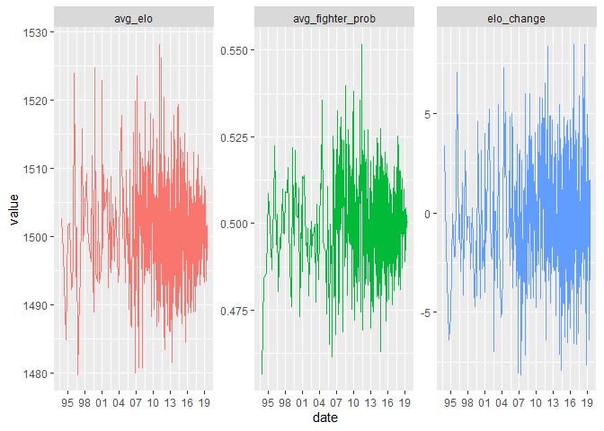
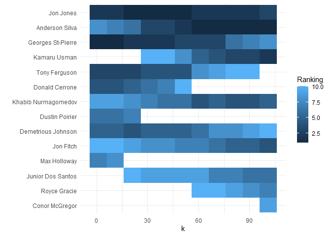
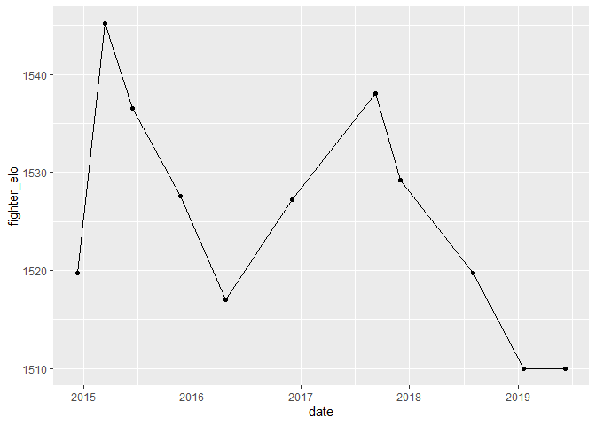

TidyTuesdayUFCELO
================

``` r
library(tidyverse)
```

    ## -- Attaching packages ------------------------------------------------------------------------------------------------------------------------------------------------ tidyverse 1.3.0 --

    ## v ggplot2 3.3.0     v purrr   0.3.4
    ## v tibble  3.0.1     v dplyr   0.8.5
    ## v tidyr   1.0.2     v stringr 1.4.0
    ## v readr   1.3.1     v forcats 0.5.0

    ## -- Conflicts --------------------------------------------------------------------------------------------------------------------------------------------------- tidyverse_conflicts() --
    ## x dplyr::filter() masks stats::filter()
    ## x dplyr::lag()    masks stats::lag()

``` r
df <- read.csv("data.csv")
df %>% colnames()
```

    ##   [1] "R_fighter"                    "B_fighter"                   
    ##   [3] "Referee"                      "date"                        
    ##   [5] "location"                     "Winner"                      
    ##   [7] "title_bout"                   "weight_class"                
    ##   [9] "no_of_rounds"                 "B_current_lose_streak"       
    ##  [11] "B_current_win_streak"         "B_draw"                      
    ##  [13] "B_avg_BODY_att"               "B_avg_BODY_landed"           
    ##  [15] "B_avg_CLINCH_att"             "B_avg_CLINCH_landed"         
    ##  [17] "B_avg_DISTANCE_att"           "B_avg_DISTANCE_landed"       
    ##  [19] "B_avg_GROUND_att"             "B_avg_GROUND_landed"         
    ##  [21] "B_avg_HEAD_att"               "B_avg_HEAD_landed"           
    ##  [23] "B_avg_KD"                     "B_avg_LEG_att"               
    ##  [25] "B_avg_LEG_landed"             "B_avg_PASS"                  
    ##  [27] "B_avg_REV"                    "B_avg_SIG_STR_att"           
    ##  [29] "B_avg_SIG_STR_landed"         "B_avg_SIG_STR_pct"           
    ##  [31] "B_avg_SUB_ATT"                "B_avg_TD_att"                
    ##  [33] "B_avg_TD_landed"              "B_avg_TD_pct"                
    ##  [35] "B_avg_TOTAL_STR_att"          "B_avg_TOTAL_STR_landed"      
    ##  [37] "B_longest_win_streak"         "B_losses"                    
    ##  [39] "B_avg_opp_BODY_att"           "B_avg_opp_BODY_landed"       
    ##  [41] "B_avg_opp_CLINCH_att"         "B_avg_opp_CLINCH_landed"     
    ##  [43] "B_avg_opp_DISTANCE_att"       "B_avg_opp_DISTANCE_landed"   
    ##  [45] "B_avg_opp_GROUND_att"         "B_avg_opp_GROUND_landed"     
    ##  [47] "B_avg_opp_HEAD_att"           "B_avg_opp_HEAD_landed"       
    ##  [49] "B_avg_opp_KD"                 "B_avg_opp_LEG_att"           
    ##  [51] "B_avg_opp_LEG_landed"         "B_avg_opp_PASS"              
    ##  [53] "B_avg_opp_REV"                "B_avg_opp_SIG_STR_att"       
    ##  [55] "B_avg_opp_SIG_STR_landed"     "B_avg_opp_SIG_STR_pct"       
    ##  [57] "B_avg_opp_SUB_ATT"            "B_avg_opp_TD_att"            
    ##  [59] "B_avg_opp_TD_landed"          "B_avg_opp_TD_pct"            
    ##  [61] "B_avg_opp_TOTAL_STR_att"      "B_avg_opp_TOTAL_STR_landed"  
    ##  [63] "B_total_rounds_fought"        "B_total_time_fought.seconds."
    ##  [65] "B_total_title_bouts"          "B_win_by_Decision_Majority"  
    ##  [67] "B_win_by_Decision_Split"      "B_win_by_Decision_Unanimous" 
    ##  [69] "B_win_by_KO.TKO"              "B_win_by_Submission"         
    ##  [71] "B_win_by_TKO_Doctor_Stoppage" "B_wins"                      
    ##  [73] "B_Stance"                     "B_Height_cms"                
    ##  [75] "B_Reach_cms"                  "B_Weight_lbs"                
    ##  [77] "R_current_lose_streak"        "R_current_win_streak"        
    ##  [79] "R_draw"                       "R_avg_BODY_att"              
    ##  [81] "R_avg_BODY_landed"            "R_avg_CLINCH_att"            
    ##  [83] "R_avg_CLINCH_landed"          "R_avg_DISTANCE_att"          
    ##  [85] "R_avg_DISTANCE_landed"        "R_avg_GROUND_att"            
    ##  [87] "R_avg_GROUND_landed"          "R_avg_HEAD_att"              
    ##  [89] "R_avg_HEAD_landed"            "R_avg_KD"                    
    ##  [91] "R_avg_LEG_att"                "R_avg_LEG_landed"            
    ##  [93] "R_avg_PASS"                   "R_avg_REV"                   
    ##  [95] "R_avg_SIG_STR_att"            "R_avg_SIG_STR_landed"        
    ##  [97] "R_avg_SIG_STR_pct"            "R_avg_SUB_ATT"               
    ##  [99] "R_avg_TD_att"                 "R_avg_TD_landed"             
    ## [101] "R_avg_TD_pct"                 "R_avg_TOTAL_STR_att"         
    ## [103] "R_avg_TOTAL_STR_landed"       "R_longest_win_streak"        
    ## [105] "R_losses"                     "R_avg_opp_BODY_att"          
    ## [107] "R_avg_opp_BODY_landed"        "R_avg_opp_CLINCH_att"        
    ## [109] "R_avg_opp_CLINCH_landed"      "R_avg_opp_DISTANCE_att"      
    ## [111] "R_avg_opp_DISTANCE_landed"    "R_avg_opp_GROUND_att"        
    ## [113] "R_avg_opp_GROUND_landed"      "R_avg_opp_HEAD_att"          
    ## [115] "R_avg_opp_HEAD_landed"        "R_avg_opp_KD"                
    ## [117] "R_avg_opp_LEG_att"            "R_avg_opp_LEG_landed"        
    ## [119] "R_avg_opp_PASS"               "R_avg_opp_REV"               
    ## [121] "R_avg_opp_SIG_STR_att"        "R_avg_opp_SIG_STR_landed"    
    ## [123] "R_avg_opp_SIG_STR_pct"        "R_avg_opp_SUB_ATT"           
    ## [125] "R_avg_opp_TD_att"             "R_avg_opp_TD_landed"         
    ## [127] "R_avg_opp_TD_pct"             "R_avg_opp_TOTAL_STR_att"     
    ## [129] "R_avg_opp_TOTAL_STR_landed"   "R_total_rounds_fought"       
    ## [131] "R_total_time_fought.seconds." "R_total_title_bouts"         
    ## [133] "R_win_by_Decision_Majority"   "R_win_by_Decision_Split"     
    ## [135] "R_win_by_Decision_Unanimous"  "R_win_by_KO.TKO"             
    ## [137] "R_win_by_Submission"          "R_win_by_TKO_Doctor_Stoppage"
    ## [139] "R_wins"                       "R_Stance"                    
    ## [141] "R_Height_cms"                 "R_Reach_cms"                 
    ## [143] "R_Weight_lbs"                 "B_age"                       
    ## [145] "R_age"

``` r
#Separate red and blue corner and clean names 
r_df <- df %>% 
  select_at(vars(starts_with("R_"),contains("Winner"))) %>%
  mutate(key = row_number()) %>% 
  rename_all(.funs = function(x) { str_replace(x, "R_", "")}) 

b_df <- df %>% 
  select_at(vars(starts_with("B_"),contains("Winner"))) %>% 
  mutate(key = row_number()) %>% 
  rename_all(.funs = function(x) { str_replace(x, "B_", "")})

shared_features <- df %>% select(date, location, title_bout, weight_class, no_of_rounds) %>% mutate(key = row_number())

#Combines data to a tidy format for each fighter and the fight event stats 
tidy_df <- rbind(
  r_df %>% 
    mutate(Winner = case_when(
      Winner == "Red" ~ 1,
      Winner == "Blue" ~ 0,
      TRUE ~ .5)),
  b_df %>% 
    mutate(Winner = case_when(
      Winner == "Blue" ~ 1,
      Winner == "Red" ~ 0,
      TRUE ~ .5)))  %>% 
  left_join(shared_features, by = "key") %>% 
  rename("match_id" = "key", 
         "winner" = "Winner")
```

``` r
#Joins the tidy format together into a head to head match format 
elo_df <- tidy_df %>% 
  select(match_id, date, fighter, winner, weight_class) %>% 
  left_join(tidy_df %>% 
              select(match_id, fighter),
            by = "match_id") %>% 
  select(match_id, date, fighter = fighter.x, opponent = fighter.y, winner, weight_class) %>% 
  filter(fighter != opponent) %>% #Applies filtering to remove duplicated fighters 
  arrange(fighter, date) %>% 
  group_by(match_id) %>% 
  slice(1) %>% 
  ungroup()
```

``` r
library(elo)
library(broom)
#Simulate ELO scores with a K of 20
elo <- elo.run(winner~fighter + opponent, 
                   k = 20,
                   data = elo_df)

#Finds the overall top 10 fighters overall 
rank.teams(elo) %>% 
  tidy() %>% 
  rename("ranking" = "x") %>% 
  arrange(ranking)
```

    ## Warning: 'tidy.numeric' is deprecated.
    ## See help("Deprecated")

    ## Warning: `data_frame()` is deprecated as of tibble 1.1.0.
    ## Please use `tibble()` instead.
    ## This warning is displayed once every 8 hours.
    ## Call `lifecycle::last_warnings()` to see where this warning was generated.

    ## # A tibble: 1,915 x 2
    ##    names               ranking
    ##    <chr>                 <int>
    ##  1 Jon Jones                 1
    ##  2 Georges St-Pierre         2
    ##  3 Tony Ferguson             3
    ##  4 Demetrious Johnson        4
    ##  5 Donald Cerrone            5
    ##  6 Anderson Silva            6
    ##  7 Dustin Poirier            7
    ##  8 Khabib Nurmagomedov       8
    ##  9 Jon Fitch                 9
    ## 10 Junior Dos Santos        10
    ## # ... with 1,905 more rows

``` r
#Plot of elo scores, probabilities, and elo changes throughout the UFC 
elo %>% 
  as.data.frame() %>% 
  cbind(list("match_id" = elo_df$match_id,
             "date" = elo_df$date)) %>% 
  select_at(vars(contains(".A"), contains("date"))) %>% 
  rename_all(.funs = function(x){str_replace(x, ".A", "")}) %>% 
  group_by(date) %>% 
  summarise(avg_elo = mean(elo),
            elo_change = mean(update),
            avg_fighter_prob = mean(p)) %>% 
  ungroup() %>% 
  mutate(date = as.Date(date)) %>% 
  pivot_longer(-date) %>% 
  ggplot(aes(x = date, y = value, color = name, group = name)) + 
  geom_line() + 
  facet_wrap(~name, scales = "free") + 
  scale_x_date(date_breaks = "3 years", date_labels = "%y") + 
  theme(legend.position = "none")
```

<!-- -->

``` r
#Need to see how K affects the top 10 overall fighters
k_sensitivity <- function(k){
  results <- elo.run(winner~fighter + opponent, 
                   k = k,
                   data = elo_df)
  
  rank.teams(results) %>% 
    tidy() %>% 
    rename("ranking" = "x") %>% 
    arrange(ranking) %>% 
    filter(ranking <= 10) 
}


#Applies function to a list of k's, essentially a grid search 
k_rankings <- tibble(k = seq(from = 1, to = 101, by = 10)) %>%
  mutate(ranking = map(k, k_sensitivity)) %>% 
  unnest()
```

    ## Warning: 'tidy.numeric' is deprecated.
    ## See help("Deprecated")
    
    ## Warning: 'tidy.numeric' is deprecated.
    ## See help("Deprecated")
    
    ## Warning: 'tidy.numeric' is deprecated.
    ## See help("Deprecated")
    
    ## Warning: 'tidy.numeric' is deprecated.
    ## See help("Deprecated")
    
    ## Warning: 'tidy.numeric' is deprecated.
    ## See help("Deprecated")
    
    ## Warning: 'tidy.numeric' is deprecated.
    ## See help("Deprecated")
    
    ## Warning: 'tidy.numeric' is deprecated.
    ## See help("Deprecated")
    
    ## Warning: 'tidy.numeric' is deprecated.
    ## See help("Deprecated")
    
    ## Warning: 'tidy.numeric' is deprecated.
    ## See help("Deprecated")
    
    ## Warning: 'tidy.numeric' is deprecated.
    ## See help("Deprecated")
    
    ## Warning: 'tidy.numeric' is deprecated.
    ## See help("Deprecated")

    ## Warning: `cols` is now required.
    ## Please use `cols = c(ranking)`

``` r
#Plot the rankings for each k, K doesn't seem to affect the overall top 10 rankings (may need to see the time series data)
k_rankings %>% 
  group_by(names) %>% 
  mutate(avg_ranking = mean(ranking)) %>% 
  ungroup() %>% 
  ggplot(aes(x = reorder(names, -ranking), y = k, fill = ranking)) + 
  geom_tile() + 
  coord_flip() + 
  labs(fill = "Ranking") +
  theme_minimal() + 
  xlab("")
```

<!-- -->

``` r
#Creates a helper function for finding the top 10 ranked fighters 
elo_top <- function(data){
  results <- elo.run(winner~fighter + opponent, 
                   k = 20,
                   data = data)
rank.teams(results) %>% 
  tidy() %>% 
  rename("ranking" = "x") %>% 
  filter(ranking <= 10)

}

#Finds the top 10 ranked fighters for each weight class
top10_weight <- elo_df %>% 
  group_by(weight_class) %>% 
  nest() %>% 
  mutate(ranking = map(data, elo_top)) %>% 
  select(weight_class, ranking) %>% 
  unnest() %>% 
  arrange(ranking, weight_class)
```

    ## Warning: 'tidy.numeric' is deprecated.
    ## See help("Deprecated")
    
    ## Warning: 'tidy.numeric' is deprecated.
    ## See help("Deprecated")
    
    ## Warning: 'tidy.numeric' is deprecated.
    ## See help("Deprecated")
    
    ## Warning: 'tidy.numeric' is deprecated.
    ## See help("Deprecated")
    
    ## Warning: 'tidy.numeric' is deprecated.
    ## See help("Deprecated")
    
    ## Warning: 'tidy.numeric' is deprecated.
    ## See help("Deprecated")
    
    ## Warning: 'tidy.numeric' is deprecated.
    ## See help("Deprecated")
    
    ## Warning: 'tidy.numeric' is deprecated.
    ## See help("Deprecated")
    
    ## Warning: 'tidy.numeric' is deprecated.
    ## See help("Deprecated")
    
    ## Warning: 'tidy.numeric' is deprecated.
    ## See help("Deprecated")
    
    ## Warning: 'tidy.numeric' is deprecated.
    ## See help("Deprecated")
    
    ## Warning: 'tidy.numeric' is deprecated.
    ## See help("Deprecated")
    
    ## Warning: 'tidy.numeric' is deprecated.
    ## See help("Deprecated")
    
    ## Warning: 'tidy.numeric' is deprecated.
    ## See help("Deprecated")

    ## Warning: `cols` is now required.
    ## Please use `cols = c(ranking)`

``` r
top10_weight 
```

    ## # A tibble: 153 x 3
    ## # Groups:   weight_class [14]
    ##    weight_class      names              ranking
    ##    <chr>             <chr>                <int>
    ##  1 Bantamweight      Raphael Assuncao         1
    ##  2 Catch Weight      Royce Gracie             1
    ##  3 Featherweight     Max Holloway             1
    ##  4 Flyweight         Demetrious Johnson       1
    ##  5 Heavyweight       Junior Dos Santos        1
    ##  6 Light Heavyweight Jon Jones                1
    ##  7 Lightweight       Tony Ferguson            1
    ##  8 Middleweight      Anderson Silva           1
    ##  9 Open Weight       Royce Gracie             1
    ## 10 Welterweight      Georges St-Pierre        1
    ## # ... with 143 more rows

``` r
#Creates a function for getting the total history of ELO to be appleid for each weight class 
elo_history <- function(data){
  results <- elo.run(winner~fighter + opponent, 
                   k = 20,
                   data = data)
  
  results %>% 
    as.data.frame() %>% 
    rename("fighter" = 1, "opponent" = 2, "fighter_prob" = 3, "fighter_wins" = 4, "fighter_elo_change" = 5, "opponent_elo_change" = 6, "fighter_elo" = 7, "opponent_elo" = 8)
}


#Finds the ELO history for each weight class 
elo_changes <- elo_df %>% 
  arrange(weight_class, match_id) %>% 
  group_by(weight_class) %>% 
  nest() %>% 
  mutate(elo_history = map(data, elo_history)) %>% 
  select(weight_class, elo_history) %>% 
  unnest() %>% 
  ungroup() %>% 
  cbind(elo_df %>% 
          arrange(weight_class, match_id) %>% 
          select(match_id))
```

    ## Warning: `cols` is now required.
    ## Please use `cols = c(elo_history)`

``` r
elo_changes
```

    ##               weight_class                   fighter                  opponent
    ## 1             Bantamweight              Henry Cejudo             Marlon Moraes
    ## 2             Bantamweight             Jimmie Rivera                  Petr Yan
    ## 3             Bantamweight         Aljamain Sterling              Pedro Munhoz
    ## 4             Bantamweight            Eddie Wineland            Grigorii Popov
    ## 5             Bantamweight            Carlos Huachin            Raoni Barcelos
    ## 6             Bantamweight               Brad Katona         Merab Dvalishvili
    ## 7             Bantamweight            Aiemann Zahabi             Vince Morales
    ## 8             Bantamweight                Cole Smith              Mitch Gagnon
    ## 9             Bantamweight            Cory Sandhagen              John Lineker
    ## 10            Bantamweight             Boston Salmon               Khalid Taha
    ## 11            Bantamweight        Andre Soukhamthath            Montel Jackson
    ## 12            Bantamweight             Brandon Davis               Randy Costa
    ## 13            Bantamweight              Casey Kenney                  Ray Borg
    ## 14            Bantamweight                Alex Perez           Mark De La Rosa
    ## 15            Bantamweight             Frankie Saenz               Marlon Vera
    ## 16            Bantamweight           Chris Gutierrez            Ryan MacDonald
    ## 17            Bantamweight             Jose Quinonez            Nathaniel Wood
    ## 18            Bantamweight              Louis Smolka              Matt Schnell
    ## 19            Bantamweight            Cody Garbrandt              Pedro Munhoz
    ## 20            Bantamweight           Alejandro Perez              Cody Stamann
    ## 21            Bantamweight               John Dodson                  Petr Yan
    ## 22            Bantamweight         Aljamain Sterling             Jimmie Rivera
    ## 23            Bantamweight              Benito Lopez            Manny Bermudez
    ## 24            Bantamweight              Luke Sanders               Renan Barao
    ## 25            Bantamweight                Rani Yahya               Ricky Simon
    ## 26            Bantamweight             Kyung Ho Kang           Teruto Ishihara
    ## 27            Bantamweight         Jonathan Martinez              Wuliji Buren
    ## 28            Bantamweight             Marlon Moraes          Raphael Assuncao
    ## 29            Bantamweight             Ricardo Ramos         Said Nurmagomedov
    ## 30            Bantamweight            Cory Sandhagen            Mario Bautista
    ## 31            Bantamweight  Douglas Silva de Andrade                  Petr Yan
    ## 32            Bantamweight               Andre Ewell            Nathaniel Wood
    ## 33            Bantamweight            Brian Kelleher            Montel Jackson
    ## 34            Bantamweight                  Rob Font             Sergio Pettis
    ## 35            Bantamweight               Brad Katona             Matthew Lopez
    ## 36            Bantamweight             Bryan Caraway              Pedro Munhoz
    ## 37            Bantamweight           Chris Gutierrez            Raoni Barcelos
    ## 38            Bantamweight               Song Yadong             Vince Morales
    ## 39            Bantamweight              Liu Pingyuan                Martin Day
    ## 40            Bantamweight              Louis Smolka               Su Mudaerji
    ## 41            Bantamweight            Guido Cannetti               Marlon Vera
    ## 42            Bantamweight              Joby Sanchez           Mark De La Rosa
    ## 43            Bantamweight        Andre Soukhamthath         Jonathan Martinez
    ## 44            Bantamweight               Andre Ewell               Renan Barao
    ## 45            Bantamweight               Jin Soo Son                  Petr Yan
    ## 46            Bantamweight         Merab Dvalishvili              Terrion Ware
    ## 47            Bantamweight             Jimmie Rivera               John Dodson
    ## 48            Bantamweight         Aljamain Sterling              Cody Stamann
    ## 49            Bantamweight            Cory Sandhagen            Iuri Alcantara
    ## 50            Bantamweight              Luke Sanders                Rani Yahya
    ## 51            Bantamweight            Cody Garbrandt              TJ Dillashaw
    ## 52            Bantamweight               Brett Johns              Pedro Munhoz
    ## 53            Bantamweight            Montel Jackson               Ricky Simon
    ## 54            Bantamweight             Kyung Ho Kang             Ricardo Ramos
    ## 55            Bantamweight               Marlon Vera              Wuliji Buren
    ## 56            Bantamweight               Davey Grant            Manny Bermudez
    ## 57            Bantamweight            Damian Stasiak              Liu Pingyuan
    ## 58            Bantamweight           Alejandro Perez            Eddie Wineland
    ## 59            Bantamweight          Raphael Assuncao                  Rob Font
    ## 60            Bantamweight                  Petr Yan           Teruto Ishihara
    ## 61            Bantamweight            Felipe Arantes               Song Yadong
    ## 62            Bantamweight             Jimmie Rivera             Marlon Moraes
    ## 63            Bantamweight            Johnny Eduardo            Nathaniel Wood
    ## 64            Bantamweight               Diego Rivas            Guido Cannetti
    ## 65            Bantamweight             Frankie Saenz             Henry Briones
    ## 66            Bantamweight            Brian Kelleher              John Lineker
    ## 67            Bantamweight         Aljamain Sterling               Brett Johns
    ## 68            Bantamweight         Merab Dvalishvili               Ricky Simon
    ## 69            Bantamweight           Alejandro Perez             Matthew Lopez
    ## 70            Bantamweight              Luke Sanders          Patrick Williams
    ## 71            Bantamweight              Terrion Ware             Tom Duquesnoy
    ## 72            Bantamweight        Andre Soukhamthath             Sean O'Malley
    ## 73            Bantamweight               John Dodson              Pedro Munhoz
    ## 74            Bantamweight             Bryan Caraway              Cody Stamann
    ## 75            Bantamweight            Brian Kelleher               Renan Barao
    ## 76            Bantamweight                Rani Yahya             Russell Doane
    ## 77            Bantamweight            Albert Morales            Manny Bermudez
    ## 78            Bantamweight             Jose Quinonez           Teruto Ishihara
    ## 79            Bantamweight  Douglas Silva de Andrade               Marlon Vera
    ## 80            Bantamweight            Iuri Alcantara                  Joe Soto
    ## 81            Bantamweight                  Rob Font            Thomas Almeida
    ## 82            Bantamweight            Guido Cannetti             Kyung Ho Kang
    ## 83            Bantamweight           Mark De La Rosa               Tim Elliott
    ## 84            Bantamweight         Aljamain Sterling             Marlon Moraes
    ## 85            Bantamweight            Albert Morales              Benito Lopez
    ## 86            Bantamweight        Andre Soukhamthath              Luke Sanders
    ## 87            Bantamweight                Alex Perez       Carls John De Tomas
    ## 88            Bantamweight             Frankie Saenz         Merab Dvalishvili
    ## 89            Bantamweight           Alejandro Perez            Iuri Alcantara
    ## 90            Bantamweight             Sean O'Malley              Terrion Ware
    ## 91            Bantamweight               Brett Johns                  Joe Soto
    ## 92            Bantamweight             Matthew Lopez          Raphael Assuncao
    ## 93            Bantamweight               John Dodson             Marlon Moraes
    ## 94            Bantamweight            Cody Garbrandt              TJ Dillashaw
    ## 95            Bantamweight            Aiemann Zahabi             Ricardo Ramos
    ## 96            Bantamweight              Pedro Munhoz                  Rob Font
    ## 97            Bantamweight              John Lineker               Marlon Vera
    ## 98            Bantamweight            Brian Kelleher            Damian Stasiak
    ## 99            Bantamweight              Cody Stamann             Tom Duquesnoy
    ## 100           Bantamweight           Alejandro Perez        Andre Soukhamthath
    ## 101           Bantamweight             Henry Briones                Rani Yahya
    ## 102           Bantamweight               Diego Rivas             Jose Quinonez
    ## 103           Bantamweight             Jimmie Rivera            Thomas Almeida
    ## 104           Bantamweight            Brian Kelleher               Marlon Vera
    ## 105           Bantamweight            Albert Morales               Brett Johns
    ## 106           Bantamweight  Douglas Silva de Andrade                  Rob Font
    ## 107           Bantamweight              Kwan Ho Kwak             Russell Doane
    ## 108           Bantamweight             Marlon Moraes          Raphael Assuncao
    ## 109           Bantamweight            Johnny Eduardo             Matthew Lopez
    ## 110           Bantamweight            Brian Kelleher            Iuri Alcantara
    ## 111           Bantamweight            Damian Stasiak              Pedro Munhoz
    ## 112           Bantamweight            Eddie Wineland               John Dodson
    ## 113           Bantamweight          Patrick Williams             Tom Duquesnoy
    ## 114           Bantamweight         Aljamain Sterling            Augusto Mendes
    ## 115           Bantamweight                  Joe Soto                Rani Yahya
    ## 116           Bantamweight            Iuri Alcantara              Luke Sanders
    ## 117           Bantamweight            Albert Morales        Andre Soukhamthath
    ## 118           Bantamweight            Aiemann Zahabi          Reginaldo Vieira
    ## 119           Bantamweight          Michinori Tanaka             Ricardo Ramos
    ## 120           Bantamweight         Aljamain Sterling          Raphael Assuncao
    ## 121           Bantamweight            Augusto Mendes             Frankie Saenz
    ## 122           Bantamweight            Cody Garbrandt             Dominick Cruz
    ## 123           Bantamweight              John Lineker              TJ Dillashaw
    ## 124           Bantamweight              Brad Pickett              Urijah Faber
    ## 125           Bantamweight            Eddie Wineland           Takeya Mizugaki
    ## 126           Bantamweight             Matthew Lopez              Mitch Gagnon
    ## 127           Bantamweight              Matt Schnell                  Rob Font
    ## 128           Bantamweight            Albert Morales            Thomas Almeida
    ## 129           Bantamweight            Johnny Eduardo          Manvel Gamburyan
    ## 130           Bantamweight           Justin Scoggins              Pedro Munhoz
    ## 131           Bantamweight               Brett Johns              Kwan Ho Kwak
    ## 132           Bantamweight                Erik Perez            Felipe Arantes
    ## 133           Bantamweight  Douglas Silva de Andrade             Henry Briones
    ## 134           Bantamweight              Brad Pickett            Iuri Alcantara
    ## 135           Bantamweight            Damian Stasiak               Davey Grant
    ## 136           Bantamweight               John Dodson              John Lineker
    ## 137           Bantamweight          Michinori Tanaka                Rani Yahya
    ## 138           Bantamweight                Joey Gomez             Jose Quinonez
    ## 139           Bantamweight            Albert Morales           Alejandro Perez
    ## 140           Bantamweight             Jimmie Rivera              Urijah Faber
    ## 141           Bantamweight              Leandro Issa            Taylor Lapilus
    ## 142           Bantamweight            Cody Garbrandt           Takeya Mizugaki
    ## 143           Bantamweight                Erik Perez          Francisco Rivera
    ## 144           Bantamweight            Eddie Wineland             Frankie Saenz
    ## 145           Bantamweight              John Lineker          Michael McDonald
    ## 146           Bantamweight             Matthew Lopez                Rani Yahya
    ## 147           Bantamweight          Raphael Assuncao              TJ Dillashaw
    ## 148           Bantamweight           Anthony Birchak              Dileno Lopes
    ## 149           Bantamweight              Pedro Munhoz             Russell Doane
    ## 150           Bantamweight            Felipe Arantes            Jerrod Sanders
    ## 151           Bantamweight             Marco Beltran          Reginaldo Vieira
    ## 152           Bantamweight                Chris Beal                  Joe Soto
    ## 153           Bantamweight             Dominick Cruz              Urijah Faber
    ## 154           Bantamweight            Cody Garbrandt            Thomas Almeida
    ## 155           Bantamweight         Aljamain Sterling             Bryan Caraway
    ## 156           Bantamweight              John Lineker                  Rob Font
    ## 157           Bantamweight               John Dodson          Manvel Gamburyan
    ## 158           Bantamweight           Alejandro Perez             Ian Entwistle
    ## 159           Bantamweight            Damian Stasiak               Filip Pejic
    ## 160           Bantamweight              Brad Pickett          Francisco Rivera
    ## 161           Bantamweight               Davey Grant               Marlon Vera
    ## 162           Bantamweight            Iuri Alcantara             Jimmie Rivera
    ## 163           Bantamweight             Dominick Cruz              TJ Dillashaw
    ## 164           Bantamweight                Joey Gomez                  Rob Font
    ## 165           Bantamweight         Masanori Kanehara          Michael McDonald
    ## 166           Bantamweight                  Joe Soto          Michinori Tanaka
    ## 167           Bantamweight             Frankie Saenz              Urijah Faber
    ## 168           Bantamweight         Aljamain Sterling            Johnny Eduardo
    ## 169           Bantamweight             Marco Beltran             Ning Guangyou
    ## 170           Bantamweight                Erik Perez            Taylor Lapilus
    ## 171           Bantamweight           Alejandro Perez           Scott Jorgensen
    ## 172           Bantamweight           Anthony Birchak            Thomas Almeida
    ## 173           Bantamweight             Jimmie Rivera              Pedro Munhoz
    ## 174           Bantamweight               Bruno Korea           Matheus Nicolau
    ## 175           Bantamweight               George Roop           Takeya Mizugaki
    ## 176           Bantamweight          Francisco Rivera              John Lineker
    ## 177           Bantamweight            Felipe Arantes              Yves Jabouin
    ## 178           Bantamweight             Frankie Saenz              Sirwan Kakai
    ## 179           Bantamweight               Marlon Vera             Roman Salazar
    ## 180           Bantamweight              Dileno Lopes          Reginaldo Vieira
    ## 181           Bantamweight            Iuri Alcantara              Leandro Issa
    ## 182           Bantamweight            Guido Cannetti                Hugo Viana
    ## 183           Bantamweight               Renan Barao              TJ Dillashaw
    ## 184           Bantamweight             Bryan Caraway            Eddie Wineland
    ## 185           Bantamweight             Jimmie Rivera            Marcus Brimage
    ## 186           Bantamweight          Manvel Gamburyan           Scott Jorgensen
    ## 187           Bantamweight         Masanori Kanehara                Rani Yahya
    ## 188           Bantamweight            Jerrod Sanders             Russell Doane
    ## 189           Bantamweight              Brad Pickett            Thomas Almeida
    ## 190           Bantamweight            Cody Garbrandt             Henry Briones
    ## 191           Bantamweight            Danny Martinez              Sirwan Kakai
    ## 192           Bantamweight            Taylor Lapilus               Ulka Sasaki
    ## 193           Bantamweight           Alejandro Perez          Patrick Williams
    ## 194           Bantamweight           Anthony Birchak                  Joe Soto
    ## 195           Bantamweight              Alex Caceres          Francisco Rivera
    ## 196           Bantamweight             Jose Quinonez          Leonardo Morales
    ## 197           Bantamweight             Ning Guangyou               Royston Wee
    ## 198           Bantamweight            Thomas Almeida              Yves Jabouin
    ## 199           Bantamweight         Aljamain Sterling           Takeya Mizugaki
    ## 200           Bantamweight         Norifumi Yamamoto             Roman Salazar
    ## 201           Bantamweight             Frankie Saenz            Iuri Alcantara
    ## 202           Bantamweight               Cody Gibson  Douglas Silva de Andrade
    ## 203           Bantamweight            Cody Garbrandt            Marcus Brimage
    ## 204           Bantamweight              Mitch Gagnon               Renan Barao
    ## 205           Bantamweight              Leandro Issa               Ulka Sasaki
    ## 206           Bantamweight             Dustin Kimura              Henry Cejudo
    ## 207           Bantamweight           Anthony Birchak             Ian Entwistle
    ## 208           Bantamweight          Francisco Rivera              Urijah Faber
    ## 209           Bantamweight                Matt Hobar             Sergio Pettis
    ## 210           Bantamweight           Alejandro Perez             Jose Quinonez
    ## 211           Bantamweight            Guido Cannetti             Henry Briones
    ## 212           Bantamweight             Marco Beltran               Marlon Vera
    ## 213           Bantamweight            Thomas Almeida                Tim Gorman
    ## 214           Bantamweight         Jumabieke Tuerxun            Marcus Brimage
    ## 215           Bantamweight             Bryan Caraway          Raphael Assuncao
    ## 216           Bantamweight              Mitch Gagnon             Roman Salazar
    ## 217           Bantamweight            Jerrod Sanders              Pedro Munhoz
    ## 218           Bantamweight             Dominick Cruz           Takeya Mizugaki
    ## 219           Bantamweight               Cody Gibson          Manvel Gamburyan
    ## 220           Bantamweight              Alex Caceres         Masanori Kanehara
    ## 221           Bantamweight             Kyung Ho Kang          Michinori Tanaka
    ## 222           Bantamweight            Iuri Alcantara             Russell Doane
    ## 223           Bantamweight            Johnny Bedford                Rani Yahya
    ## 224           Bantamweight                Chris Beal            Tateki Matsuda
    ## 225           Bantamweight                  Joe Soto              TJ Dillashaw
    ## 226           Bantamweight            Aaron Phillips                Matt Hobar
    ## 227           Bantamweight            Roland Delorme               Ulka Sasaki
    ## 228           Bantamweight               Royston Wee                Yao Zhikui
    ## 229           Bantamweight             Frankie Saenz              Nolan Ticman
    ## 230           Bantamweight         Aljamain Sterling                Hugo Viana
    ## 231           Bantamweight         Jumabieke Tuerxun              Leandro Issa
    ## 232           Bantamweight            Marcus Brimage             Russell Doane
    ## 233           Bantamweight              Alex Caceres              Urijah Faber
    ## 234           Bantamweight               George Roop                  Rob Font
    ## 235           Bantamweight               Cody Gibson            Johnny Bedford
    ## 236           Bantamweight               Mike Easton              Yves Jabouin
    ## 237           Bantamweight          Michinori Tanaka            Roland Delorme
    ## 238           Bantamweight             Bryan Caraway                Erik Perez
    ## 239           Bantamweight             Sergio Pettis              Yaotzin Meza
    ## 240           Bantamweight                Matt Hobar              Pedro Munhoz
    ## 241           Bantamweight            Iuri Alcantara               Vaughan Lee
    ## 242           Bantamweight               Renan Barao              TJ Dillashaw
    ## 243           Bantamweight          Francisco Rivera           Takeya Mizugaki
    ## 244           Bantamweight               Chico Camus          Chris Holdsworth
    ## 245           Bantamweight            Eddie Wineland            Johnny Eduardo
    ## 246           Bantamweight                Chris Beal          Patrick Williams
    ## 247           Bantamweight             Dustin Kimura               George Roop
    ## 248           Bantamweight              Mitch Gagnon                Tim Gorman
    ## 249           Bantamweight            Johnny Bedford                Rani Yahya
    ## 250           Bantamweight                  Nam Phan               Vaughan Lee
    ## 251           Bantamweight              Pedro Munhoz          Raphael Assuncao
    ## 252           Bantamweight         Aljamain Sterling               Cody Gibson
    ## 253           Bantamweight            Iuri Alcantara               Wilson Reis
    ## 254           Bantamweight               Renan Barao              Urijah Faber
    ## 255           Bantamweight              Alex Caceres             Sergio Pettis
    ## 256           Bantamweight            Eddie Wineland              Yves Jabouin
    ## 257           Bantamweight               Chico Camus              Yaotzin Meza
    ## 258           Bantamweight                Hugo Viana          Junior Hernandez
    ## 259           Bantamweight               Mike Easton              TJ Dillashaw
    ## 260           Bantamweight             Kyung Ho Kang          Shunichi Shimizu
    ## 261           Bantamweight               Dave Galera               Royston Wee
    ## 262           Bantamweight             Dustin Kimura           Jon Delos Reyes
    ## 263           Bantamweight              Leandro Issa             Russell Doane
    ## 264           Bantamweight          Michael McDonald              Urijah Faber
    ## 265           Bantamweight                  Nam Phan           Takeya Mizugaki
    ## 266           Bantamweight          Chris Holdsworth               Davey Grant
    ## 267           Bantamweight            Edwin Figueroa                Erik Perez
    ## 268           Bantamweight             Sergio Pettis            Will Campuzano
    ## 269           Bantamweight          Francisco Rivera               George Roop
    ## 270           Bantamweight              Dustin Pague           Kyoji Horiguchi
    ## 271           Bantamweight          Raphael Assuncao              TJ Dillashaw
    ## 272           Bantamweight            Eddie Wineland               Renan Barao
    ## 273           Bantamweight             Ivan Menjivar               Wilson Reis
    ## 274           Bantamweight             Dustin Kimura              Mitch Gagnon
    ## 275           Bantamweight              Alex Caceres            Roland Delorme
    ## 276           Bantamweight          Junior Hernandez             Lucas Martins
    ## 277           Bantamweight               Chico Camus             Kyung Ho Kang
    ## 278           Bantamweight                Erik Perez           Takeya Mizugaki
    ## 279           Bantamweight            Iuri Alcantara              Urijah Faber
    ## 280           Bantamweight              Brad Pickett          Michael McDonald
    ## 281           Bantamweight               John Albert              Yaotzin Meza
    ## 282           Bantamweight            Edwin Figueroa            Roland Delorme
    ## 283           Bantamweight              Dustin Pague              Yves Jabouin
    ## 284           Bantamweight          Raphael Assuncao               Vaughan Lee
    ## 285           Bantamweight              Brian Bowles               George Roop
    ## 286           Bantamweight            Iliarde Santos            Iuri Alcantara
    ## 287           Bantamweight             Bryan Caraway            Johnny Bedford
    ## 288           Bantamweight                Hugo Viana              TJ Dillashaw
    ## 289           Bantamweight           Scott Jorgensen              Urijah Faber
    ## 290           Bantamweight              Brad Pickett               Mike Easton
    ## 291           Bantamweight              Issei Tamura              TJ Dillashaw
    ## 292           Bantamweight               George Roop              Reuben Duran
    ## 293           Bantamweight             Bryan Caraway           Takeya Mizugaki
    ## 294           Bantamweight              Alex Caceres             Kyung Ho Kang
    ## 295           Bantamweight             Ivan Menjivar              Urijah Faber
    ## 296           Bantamweight          Michael McDonald               Renan Barao
    ## 297           Bantamweight           Motonobu Tezuka               Vaughan Lee
    ## 298           Bantamweight               Chico Camus             Dustin Kimura
    ## 299           Bantamweight            Edwin Figueroa          Francisco Rivera
    ## 300           Bantamweight            Iuri Alcantara               Pedro Nobre
    ## 301           Bantamweight              Brad Pickett            Eddie Wineland
    ## 302           Bantamweight          Byron Bloodworth                Erik Perez
    ## 303           Bantamweight            Johnny Bedford           Marcos Vinicius
    ## 304           Bantamweight                Hugo Viana              Reuben Duran
    ## 305           Bantamweight               Mike Easton          Raphael Assuncao
    ## 306           Bantamweight               John Albert           Scott Jorgensen
    ## 307           Bantamweight           Azamat Gashimov             Ivan Menjivar
    ## 308           Bantamweight             Jeff Hougland           Takeya Mizugaki
    ## 309           Bantamweight              Alex Caceres           Motonobu Tezuka
    ## 310           Bantamweight              Brad Pickett              Yves Jabouin
    ## 311           Bantamweight              Mitch Gagnon              Walel Watson
    ## 312           Bantamweight                Erik Perez                 Ken Stone
    ## 313           Bantamweight               Chico Camus              Dustin Pague
    ## 314           Bantamweight               Renan Barao              Urijah Faber
    ## 315           Bantamweight          Francisco Rivera            Roland Delorme
    ## 316           Bantamweight             Bryan Caraway              Mitch Gagnon
    ## 317           Bantamweight              TJ Dillashaw               Vaughan Lee
    ## 318           Bantamweight              Alex Caceres              Damacio Page
    ## 319           Bantamweight              Issei Tamura          Raphael Assuncao
    ## 320           Bantamweight             Ivan Menjivar               Mike Easton
    ## 321           Bantamweight              Dustin Pague                 Ken Stone
    ## 322           Bantamweight            Eddie Wineland           Scott Jorgensen
    ## 323           Bantamweight              Dustin Pague            Jared Papazian
    ## 324           Bantamweight                Erik Perez               John Albert
    ## 325           Bantamweight             Jeff Hougland              Yves Jabouin
    ## 326           Bantamweight               Jeff Curran            Johnny Eduardo
    ## 327           Bantamweight                 Alex Soto          Francisco Rivera
    ## 328           Bantamweight                Nick Denis            Roland Delorme
    ## 329           Bantamweight          Michael McDonald             Miguel Torres
    ## 330           Bantamweight              Brad Pickett              Damacio Page
    ## 331           Bantamweight         Norifumi Yamamoto               Vaughan Lee
    ## 332           Bantamweight             Chris Cariaso           Takeya Mizugaki
    ## 333           Bantamweight              TJ Dillashaw              Walel Watson
    ## 334           Bantamweight             Ivan Menjivar               John Albert
    ## 335           Bantamweight               Renan Barao           Scott Jorgensen
    ## 336           Bantamweight              Alex Caceres            Edwin Figueroa
    ## 337           Bantamweight            Jared Papazian               Mike Easton
    ## 338           Bantamweight           Joseph Sandoval                Nick Denis
    ## 339           Bantamweight              Walel Watson              Yves Jabouin
    ## 340           Bantamweight               John Dodson              TJ Dillashaw
    ## 341           Bantamweight            Johnny Bedford            Louis Gaudinot
    ## 342           Bantamweight              Dustin Pague               John Albert
    ## 343           Bantamweight             Josh Ferguson            Roland Delorme
    ## 344           Bantamweight              Brian Bowles              Urijah Faber
    ## 345           Bantamweight                 Alex Soto          Michael McDonald
    ## 346           Bantamweight             Miguel Torres                 Nick Pace
    ## 347           Bantamweight          Darren Uyenoyama         Norifumi Yamamoto
    ## 348           Bantamweight              Alex Caceres             Cole Escovedo
    ## 349           Bantamweight              Brad Pickett               Renan Barao
    ## 350           Bantamweight             Chris Cariaso               Vaughan Lee
    ## 351           Bantamweight               Jeff Curran           Scott Jorgensen
    ## 352           Bantamweight        Demetrious Johnson             Dominick Cruz
    ## 353           Bantamweight          Byron Bloodworth               Mike Easton
    ## 354           Bantamweight           Joseph Sandoval              Walel Watson
    ## 355           Bantamweight             Cole Escovedo           Takeya Mizugaki
    ## 356           Bantamweight              Donny Walker                 Ken Stone
    ## 357           Bantamweight            Johnny Eduardo          Raphael Assuncao
    ## 358           Bantamweight              Ian Loveland              Yves Jabouin
    ## 359           Bantamweight            Eddie Wineland          Joseph Benavidez
    ## 360           Bantamweight            Edwin Figueroa           Jason Reinhardt
    ## 361           Bantamweight             Ivan Menjivar                 Nick Pace
    ## 362           Bantamweight             Dominick Cruz              Urijah Faber
    ## 363           Bantamweight              Brian Bowles           Takeya Mizugaki
    ## 364           Bantamweight              Donny Walker             Jeff Hougland
    ## 365           Bantamweight                 Ken Stone           Scott Jorgensen
    ## 366           Bantamweight          Francisco Rivera              Reuben Duran
    ## 367           Bantamweight        Demetrious Johnson             Miguel Torres
    ## 368           Bantamweight             Chris Cariaso          Michael McDonald
    ## 369           Bantamweight             Cole Escovedo               Renan Barao
    ## 370           Bantamweight          Charlie Valencia             Ivan Menjivar
    ## 371           Bantamweight            Edwin Figueroa          Michael McDonald
    ## 372           Bantamweight            Eddie Wineland              Urijah Faber
    ## 373           Bantamweight              Ian Loveland          Joseph Benavidez
    ## 374           Bantamweight              Brian Bowles              Damacio Page
    ## 375           Bantamweight              Reuben Duran           Takeya Mizugaki
    ## 376           Bantamweight          Antonio Banuelos             Miguel Torres
    ## 377           Bantamweight        Demetrious Johnson         Norifumi Yamamoto
    ## 378           Bantamweight             Chris Cariaso            Will Campuzano
    ## 379           Bantamweight                 Nick Pace            Will Campuzano
    ## 380           Catch Weight     Alexander Volkanovski               Shane Young
    ## 381           Catch Weight         Aljamain Sterling               Renan Barao
    ## 382           Catch Weight              Brad Pickett               Marlon Vera
    ## 383           Catch Weight                Jim Miller              Thiago Alves
    ## 384           Catch Weight                  Joe Soto             Marco Beltran
    ## 385           Catch Weight               Cris Cyborg             Lina Lansberg
    ## 386           Catch Weight               Cris Cyborg              Leslie Smith
    ## 387           Catch Weight           Darrell Horcher       Khabib Nurmagomedov
    ## 388           Catch Weight            Augusto Mendes            Cody Garbrandt
    ## 389           Catch Weight           Fabio Maldonado           Rampage Jackson
    ## 390           Catch Weight             John Makdessi            Shane Campbell
    ## 391           Catch Weight              Clay Collard              Max Holloway
    ## 392           Catch Weight           Alexis Dufresne               Sarah Moras
    ## 393           Catch Weight         DaMarques Johnson             Gunnar Nelson
    ## 394           Catch Weight             Rich Franklin           Wanderlei Silva
    ## 395           Catch Weight          Costas Philippou               Nick Catone
    ## 396           Catch Weight              Alan Belcher            Wilson Gouveia
    ## 397           Catch Weight         Houston Alexander            Kevin Ferguson
    ## 398           Catch Weight             Rich Franklin             Vitor Belfort
    ## 399           Catch Weight             Rich Franklin           Wanderlei Silva
    ## 400           Catch Weight             Hermes Franca                Joe Jordan
    ## 401           Catch Weight               Matt Hughes              Royce Gracie
    ## 402           Catch Weight              David Abbott                  Don Frye
    ## 403           Catch Weight                  Don Frye              Mark Coleman
    ## 404           Catch Weight                Dan Severn              Ken Shamrock
    ## 405           Catch Weight                  Don Frye            Gary Goodridge
    ## 406           Catch Weight              Ken Shamrock             Kimo Leopoldo
    ## 407           Catch Weight                Dan Severn             Oleg Taktarov
    ## 408           Catch Weight                Marco Ruas             Paul Varelans
    ## 409           Catch Weight              Ken Shamrock             Oleg Taktarov
    ## 410           Catch Weight              David Abbott             Oleg Taktarov
    ## 411           Catch Weight                Dan Severn              Ken Shamrock
    ## 412           Catch Weight                Dan Severn             Dave Beneteau
    ## 413           Catch Weight              Ken Shamrock              Royce Gracie
    ## 414           Catch Weight                Dan Severn              Royce Gracie
    ## 415           Catch Weight             Harold Howard              Steve Jennum
    ## 416           Catch Weight             Patrick Smith              Royce Gracie
    ## 417           Catch Weight            Gerard Gordeau              Royce Gracie
    ## 418          Featherweight             Calvin Kattar             Ricardo Lamas
    ## 419          Featherweight            Chris Fishgold          Makwan Amirkhani
    ## 420          Featherweight             Daniel Teymur               Sung Bin Jo
    ## 421          Featherweight              Grant Dawson           Michael Trizano
    ## 422          Featherweight              Julian Erosa                Julio Arce
    ## 423          Featherweight     Alexander Volkanovski                 Jose Aldo
    ## 424          Featherweight               Cub Swanson              Shane Burgos
    ## 425          Featherweight               Kyle Nelson               Matt Sayles
    ## 426          Featherweight             Movsar Evloev             Seungwoo Choi
    ## 427          Featherweight               Josh Emmett           Michael Johnson
    ## 428          Featherweight            Sheymon Moraes              Sodiq Yusuff
    ## 429          Featherweight           Enrique Barzola             Kevin Aguilar
    ## 430          Featherweight                 Luis Pena           Steven Peterson
    ## 431          Featherweight             Bobby Moffett            Bryce Mitchell
    ## 432          Featherweight              Arnold Allen            Jordan Rinaldi
    ## 433          Featherweight                   Dan Ige               Danny Henry
    ## 434          Featherweight               Mike Grundy              Nad Narimani
    ## 435          Featherweight              Grant Dawson              Julian Erosa
    ## 436          Featherweight           Jeremy Stephens     Zabit Magomedsharipov
    ## 437          Featherweight            Chris Fishgold             Daniel Teymur
    ## 438          Featherweight              Alex Caceres               Kron Gracie
    ## 439          Featherweight                Andre Fili                Myles Jury
    ## 440          Featherweight             Austin Arnett               Shane Young
    ## 441          Featherweight                 Jose Aldo            Renato Moicano
    ## 442          Featherweight            Felipe Colares        Geraldo de Freitas
    ## 443          Featherweight     Alexander Volkanovski               Chad Mendes
    ## 444          Featherweight                   Dan Ige            Jordan Griffin
    ## 445          Featherweight              Brian Ortega              Max Holloway
    ## 446          Featherweight             Hakeem Dawodu             Kyle Bochniak
    ## 447          Featherweight              Sodiq Yusuff          Suman Mokhtarian
    ## 448          Featherweight             Kevin Aguilar                Rick Glenn
    ## 449          Featherweight             Darren Elkins             Ricardo Lamas
    ## 450          Featherweight             Austin Arnett         Humberto Bandenay
    ## 451          Featherweight       Anderson Dos Santos              Nad Narimani
    ## 452          Featherweight            Chan Sung Jung            Yair Rodriguez
    ## 453          Featherweight             Bobby Moffett               Chas Skelly
    ## 454          Featherweight              Jason Knight            Jordan Rinaldi
    ## 455          Featherweight                Julio Arce            Sheymon Moraes
    ## 456          Featherweight            Kurt Holobaugh              Shane Burgos
    ## 457          Featherweight               Artem Lobov           Michael Johnson
    ## 458          Featherweight             Calvin Kattar            Chris Fishgold
    ## 459          Featherweight             Brandon Davis     Zabit Magomedsharipov
    ## 460          Featherweight                Andre Fili           Michael Johnson
    ## 461          Featherweight               Cub Swanson            Renato Moicano
    ## 462          Featherweight               Matt Sayles            Sheymon Moraes
    ## 463          Featherweight           Jeremy Stephens                 Jose Aldo
    ## 464          Featherweight             Austin Arnett             Hakeem Dawodu
    ## 465          Featherweight               Khalid Taha              Nad Narimani
    ## 466          Featherweight           Dennis Bermudez                Rick Glenn
    ## 467          Featherweight               Chad Mendes                Myles Jury
    ## 468          Featherweight     Alexander Volkanovski             Darren Elkins
    ## 469          Featherweight            Kurt Holobaugh            Raoni Barcelos
    ## 470          Featherweight               Brad Katona           Jay Cucciniello
    ## 471          Featherweight              Alex Caceres              Martin Bravo
    ## 472          Featherweight            Bryce Mitchell             Tyler Diamond
    ## 473          Featherweight             Matt Bessette           Steven Peterson
    ## 474          Featherweight                Rolando Dy               Shane Young
    ## 475          Featherweight             Mirsad Bektic             Ricardo Lamas
    ## 476          Featherweight                   Dan Ige             Mike Santiago
    ## 477          Featherweight             Daniel Teymur                Julio Arce
    ## 478          Featherweight              Arnold Allen              Mads Burnell
    ## 479          Featherweight              Jason Knight          Makwan Amirkhani
    ## 480          Featherweight           Gabriel Benitez         Humberto Bandenay
    ## 481          Featherweight             Brandon Davis           Enrique Barzola
    ## 482          Featherweight               Cub Swanson             Frankie Edgar
    ## 483          Featherweight             Calvin Kattar            Renato Moicano
    ## 484          Featherweight             Kyle Bochniak     Zabit Magomedsharipov
    ## 485          Featherweight               Danny Henry             Hakeem Dawodu
    ## 486          Featherweight              Brian Ortega             Frankie Edgar
    ## 487          Featherweight           Jeremy Stephens               Josh Emmett
    ## 488          Featherweight             Brandon Davis           Steven Peterson
    ## 489          Featherweight     Alexander Volkanovski            Jeremy Kennedy
    ## 490          Featherweight                Andre Fili           Dennis Bermudez
    ## 491          Featherweight           Godofredo Pepey             Mirsad Bektic
    ## 492          Featherweight             Austin Arnett            Cory Sandhagen
    ## 493          Featherweight             Calvin Kattar              Shane Burgos
    ## 494          Featherweight             Brandon Davis             Kyle Bochniak
    ## 495          Featherweight                   Dan Ige                Julio Arce
    ## 496          Featherweight           Enrique Barzola             Matt Bessette
    ## 497          Featherweight                Dooho Choi           Jeremy Stephens
    ## 498          Featherweight             Darren Elkins           Michael Johnson
    ## 499          Featherweight              Mads Burnell             Mike Santiago
    ## 500          Featherweight                Myles Jury                Rick Glenn
    ## 501          Featherweight               Josh Emmett             Ricardo Lamas
    ## 502          Featherweight              Brian Ortega               Cub Swanson
    ## 503          Featherweight           Gabriel Benitez              Jason Knight
    ## 504          Featherweight                 Jose Aldo              Max Holloway
    ## 505          Featherweight              Alex Caceres                 Wang Guan
    ## 506          Featherweight            Sheymon Moraes     Zabit Magomedsharipov
    ## 507          Featherweight            Bharat Kandare               Song Yadong
    ## 508          Featherweight                Rolando Dy              Wuliji Buren
    ## 509          Featherweight                Andre Fili               Artem Lobov
    ## 510          Featherweight            Felipe Arantes               Josh Emmett
    ## 511          Featherweight                Rolando Dy           Teruto Ishihara
    ## 512          Featherweight          Gilbert Melendez           Jeremy Stephens
    ## 513          Featherweight              Gavin Tucker                Rick Glenn
    ## 514          Featherweight             Mike Santiago     Zabit Magomedsharipov
    ## 515          Featherweight         Humberto Bandenay              Martin Bravo
    ## 516          Featherweight              Jason Knight             Ricardo Lamas
    ## 517          Featherweight              Brian Ortega            Renato Moicano
    ## 518          Featherweight                Andre Fili             Calvin Kattar
    ## 519          Featherweight             Darren Elkins           Dennis Bermudez
    ## 520          Featherweight            Jeremy Kennedy             Kyle Bochniak
    ## 521          Featherweight           Godofredo Pepey              Shane Burgos
    ## 522          Featherweight              Cody Stamann              Terrion Ware
    ## 523          Featherweight              Gray Maynard           Teruto Ishihara
    ## 524          Featherweight                   BJ Penn              Dennis Siver
    ## 525          Featherweight              Jared Gordon           Michel Quinones
    ## 526          Featherweight              Alex Caceres                Rolando Dy
    ## 527          Featherweight     Alexander Volkanovski             Mizuto Hirota
    ## 528          Featherweight                 Jose Aldo              Max Holloway
    ## 529          Featherweight             Frankie Edgar            Yair Rodriguez
    ## 530          Featherweight               Chas Skelly              Jason Knight
    ## 531          Featherweight           Enrique Barzola           Gabriel Benitez
    ## 532          Featherweight               Artem Lobov               Cub Swanson
    ## 533          Featherweight           Jeremy Stephens            Renato Moicano
    ## 534          Featherweight          Mike de la Torre                Myles Jury
    ## 535          Featherweight              Charles Rosa              Shane Burgos
    ## 536          Featherweight              Arnold Allen          Makwan Amirkhani
    ## 537          Featherweight            Jeremy Kennedy                Rony Jason
    ## 538          Featherweight             Darren Elkins             Mirsad Bektic
    ## 539          Featherweight              Gavin Tucker               Sam Sicilia
    ## 540          Featherweight            Phillipe Nover                Rick Glenn
    ## 541          Featherweight            Chan Sung Jung           Dennis Bermudez
    ## 542          Featherweight               Chas Skelly       Chris Gruetzemacher
    ## 543          Featherweight              Alex Caceres              Jason Knight
    ## 544          Featherweight                   BJ Penn            Yair Rodriguez
    ## 545          Featherweight               Cole Miller             Mizuto Hirota
    ## 546          Featherweight            Anthony Pettis              Max Holloway
    ## 547          Featherweight               Cub Swanson                Dooho Choi
    ## 548          Featherweight              Shane Burgos              Tiago Trator
    ## 549          Featherweight              Gray Maynard                 Ryan Hall
    ## 550          Featherweight                Dan Hooker              Jason Knight
    ## 551          Featherweight               Marlon Vera             Ning Guangyou
    ## 552          Featherweight               Artem Lobov           Teruto Ishihara
    ## 553          Featherweight             Frankie Edgar           Jeremy Stephens
    ## 554          Featherweight          Charles Oliveira             Ricardo Lamas
    ## 555          Featherweight               Chris Avila           Enrique Barzola
    ## 556          Featherweight             Mirsad Bektic             Russell Doane
    ## 557          Featherweight                Andre Fili               Hacran Dias
    ## 558          Featherweight            Phillipe Nover               Renan Barao
    ## 559          Featherweight           Godofredo Pepey          Mike de la Torre
    ## 560          Featherweight               Chas Skelly             Maximo Blanco
    ## 561          Featherweight           Gabriel Benitez               Sam Sicilia
    ## 562          Featherweight            Anthony Pettis          Charles Oliveira
    ## 563          Featherweight           Enrique Barzola             Kyle Bochniak
    ## 564          Featherweight               Artem Lobov               Chris Avila
    ## 565          Featherweight              Alex Caceres            Yair Rodriguez
    ## 566          Featherweight           Dennis Bermudez                Rony Jason
    ## 567          Featherweight         Horacio Gutierrez           Teruto Ishihara
    ## 568          Featherweight               Cub Swanson          Tatsuya Kawajiri
    ## 569          Featherweight             Darren Elkins           Godofredo Pepey
    ## 570          Featherweight              Jason Knight                 Jim Alers
    ## 571          Featherweight             Frankie Edgar                 Jose Aldo
    ## 572          Featherweight                Dooho Choi            Thiago Tavares
    ## 573          Featherweight            Fernando Bruno              Gray Maynard
    ## 574          Featherweight              Max Holloway             Ricardo Lamas
    ## 575          Featherweight              Brian Ortega                Clay Guida
    ## 576          Featherweight              Alex Caceres               Cole Miller
    ## 577          Featherweight           Jeremy Stephens               Renan Barao
    ## 578          Featherweight            Renato Moicano          Zubaira Tukhugov
    ## 579          Featherweight                Andre Fili            Yair Rodriguez
    ## 580          Featherweight               Cub Swanson               Hacran Dias
    ## 581          Featherweight             Lucas Martins             Rob Whiteford
    ## 582          Featherweight                Dan Hooker               Mark Eddiva
    ## 583          Featherweight               Chas Skelly             Darren Elkins
    ## 584          Featherweight              Julian Erosa           Teruto Ishihara
    ## 585          Featherweight          Makwan Amirkhani            Mike Wilkinson
    ## 586          Featherweight              Arnold Allen              Yaotzin Meza
    ## 587          Featherweight           Dennis Bermudez          Tatsuya Kawajiri
    ## 588          Featherweight               Diego Rivas                Noad Lahat
    ## 589          Featherweight                Alex White               Artem Lobov
    ## 590          Featherweight              Alex Caceres              Masio Fullen
    ## 591          Featherweight             Damon Jackson          Levan Makashvili
    ## 592          Featherweight              Luke Sanders             Maximo Blanco
    ## 593          Featherweight              Charles Rosa             Kyle Bochniak
    ## 594          Featherweight              Brian Ortega             Diego Brandao
    ## 595          Featherweight          Charles Oliveira                Myles Jury
    ## 596          Featherweight               Cole Miller                 Jim Alers
    ## 597          Featherweight            Conor McGregor                 Jose Aldo
    ## 598          Featherweight           Jeremy Stephens              Max Holloway
    ## 599          Featherweight               Chad Mendes             Frankie Edgar
    ## 600          Featherweight              Jason Knight          Tatsuya Kawajiri
    ## 601          Featherweight            Phillipe Nover          Zubaira Tukhugov
    ## 602          Featherweight                Dooho Choi               Sam Sicilia
    ## 603          Featherweight          Mike de la Torre              Yui Chul Nam
    ## 604          Featherweight             Diego Sanchez             Ricardo Lamas
    ## 605          Featherweight                Andre Fili           Gabriel Benitez
    ## 606          Featherweight                Clay Guida            Thiago Tavares
    ## 607          Featherweight               Chas Skelly               Kevin Souza
    ## 608          Featherweight             Darren Elkins             Rob Whiteford
    ## 609          Featherweight                Dan Hooker            Yair Rodriguez
    ## 610          Featherweight             Diego Brandao          Katsunori Kikuno
    ## 611          Featherweight             Mizuto Hirota           Teruto Ishihara
    ## 612          Featherweight              Clay Collard              Tiago Trator
    ## 613          Featherweight          Charles Oliveira              Max Holloway
    ## 614          Featherweight              Paul Redmond             Rob Whiteford
    ## 615          Featherweight               Sam Sicilia              Yaotzin Meza
    ## 616          Featherweight             Maximo Blanco          Mike de la Torre
    ## 617          Featherweight               Chad Mendes            Conor McGregor
    ## 618          Featherweight           Dennis Bermudez           Jeremy Stephens
    ## 619          Featherweight               Hacran Dias          Levan Makashvili
    ## 620          Featherweight              Dennis Siver          Tatsuya Kawajiri
    ## 621          Featherweight          Makwan Amirkhani              Masio Fullen
    ## 622          Featherweight                 Alan Omer              Arnold Allen
    ## 623          Featherweight          Niklas Backstrom                Noad Lahat
    ## 624          Featherweight              Charles Rosa            Yair Rodriguez
    ## 625          Featherweight              Clay Collard           Gabriel Benitez
    ## 626          Featherweight              Brian Ortega            Thiago Tavares
    ## 627          Featherweight          Charles Oliveira                 Nik Lentz
    ## 628          Featherweight             Damon Jackson                Rony Jason
    ## 629          Featherweight             Lucas Martins             Mirsad Bektic
    ## 630          Featherweight             Frankie Edgar              Urijah Faber
    ## 631          Featherweight            Phillipe Nover              Yui Chul Nam
    ## 632          Featherweight          Levan Makashvili               Mark Eddiva
    ## 633          Featherweight                Dan Hooker               Hatsu Hioki
    ## 634          Featherweight               Cub Swanson              Max Holloway
    ## 635          Featherweight             Diego Brandao               Jimy Hettes
    ## 636          Featherweight            Damian Stasiak              Yaotzin Meza
    ## 637          Featherweight                 Rocky Lee            Taylor Lapilus
    ## 638          Featherweight               Chad Mendes             Ricardo Lamas
    ## 639          Featherweight                Clay Guida            Robert Peralta
    ## 640          Featherweight                Andre Fili           Godofredo Pepey
    ## 641          Featherweight          Katsunori Kikuno               Kevin Souza
    ## 642          Featherweight               Alex Torres              Masio Fullen
    ## 643          Featherweight          Mike de la Torre              Tiago Trator
    ## 644          Featherweight               Cole Miller              Max Holloway
    ## 645          Featherweight               Chas Skelly                 Jim Alers
    ## 646          Featherweight           Akira Corassani               Sam Sicilia
    ## 647          Featherweight                 Andy Ogle          Makwan Amirkhani
    ## 648          Featherweight             Mirsad Bektic              Paul Redmond
    ## 649          Featherweight            Conor McGregor              Dennis Siver
    ## 650          Featherweight              Charles Rosa              Sean Soriano
    ## 651          Featherweight            Renato Moicano             Tom Niinimaki
    ## 652          Featherweight             Darren Elkins               Hacran Dias
    ## 653          Featherweight          Charles Oliveira           Jeremy Stephens
    ## 654          Featherweight                Alex White              Clay Collard
    ## 655          Featherweight               Cub Swanson             Frankie Edgar
    ## 656          Featherweight                Dooho Choi                 Juan Puig
    ## 657          Featherweight           Dennis Bermudez             Ricardo Lamas
    ## 658          Featherweight          Leonardo Morales            Yair Rodriguez
    ## 659          Featherweight           Gabriel Benitez            Humberto Brown
    ## 660          Featherweight               Diego Rivas             Rodolfo Rubio
    ## 661          Featherweight               Chad Mendes                 Jose Aldo
    ## 662          Featherweight             Darren Elkins             Lucas Martins
    ## 663          Featherweight                Andre Fili            Felipe Arantes
    ## 664          Featherweight           Akira Corassani              Max Holloway
    ## 665          Featherweight            Mike Wilkinson          Niklas Backstrom
    ## 666          Featherweight              Charles Rosa              Dennis Siver
    ## 667          Featherweight             Ernest Chavez          Zubaira Tukhugov
    ## 668          Featherweight            Conor McGregor            Dustin Poirier
    ## 669          Featherweight          Katsunori Kikuno               Sam Sicilia
    ## 670          Featherweight                Dan Hooker             Maximo Blanco
    ## 671          Featherweight            Dashon Johnson           Godofredo Pepey
    ## 672          Featherweight               Chas Skelly              Sean Soriano
    ## 673          Featherweight               Chas Skelly             Tom Niinimaki
    ## 674          Featherweight             Jianping Yang             Ning Guangyou
    ## 675          Featherweight            Robert Peralta            Thiago Tavares
    ## 676          Featherweight                Clay Guida           Dennis Bermudez
    ## 677          Featherweight              Brian Ortega          Mike de la Torre
    ## 678          Featherweight                Noad Lahat              Steven Siler
    ## 679          Featherweight            Conor McGregor             Diego Brandao
    ## 680          Featherweight                Alex White             Lucas Martins
    ## 681          Featherweight                   BJ Penn             Frankie Edgar
    ## 682          Featherweight               Cub Swanson           Jeremy Stephens
    ## 683          Featherweight               Hacran Dias             Ricardo Lamas
    ## 684          Featherweight          Charles Oliveira               Hatsu Hioki
    ## 685          Featherweight                Dan Hooker             Ian Entwistle
    ## 686          Featherweight            Robert Peralta                Rony Jason
    ## 687          Featherweight               Kevin Souza               Mark Eddiva
    ## 688          Featherweight          Niklas Backstrom             Tom Niinimaki
    ## 689          Featherweight                 Andy Ogle             Maximo Blanco
    ## 690          Featherweight            Aaron Phillips               Sam Sicilia
    ## 691          Featherweight          Manvel Gamburyan                 Nik Lentz
    ## 692          Featherweight                Andre Fili              Max Holloway
    ## 693          Featherweight                Alex White             Estevan Payan
    ## 694          Featherweight               Chas Skelly             Mirsad Bektic
    ## 695          Featherweight           Akira Corassani            Dustin Poirier
    ## 696          Featherweight                Clay Guida          Tatsuya Kawajiri
    ## 697          Featherweight                 Alan Omer                 Jim Alers
    ## 698          Featherweight                Rony Jason              Steven Siler
    ## 699          Featherweight           Godofredo Pepey                Noad Lahat
    ## 700          Featherweight           Dennis Bermudez               Jimy Hettes
    ## 701          Featherweight             Daniel Pineda             Rob Whiteford
    ## 702          Featherweight               Hatsu Hioki             Ivan Menjivar
    ## 703          Featherweight         Jumabieke Tuerxun               Mark Eddiva
    ## 704          Featherweight                 Andy Ogle          Charles Oliveira
    ## 705          Featherweight            Felipe Arantes             Maximo Blanco
    ## 706          Featherweight  Douglas Silva de Andrade          Zubaira Tukhugov
    ## 707          Featherweight                 Jose Aldo             Ricardo Lamas
    ## 708          Featherweight             Darren Elkins           Jeremy Stephens
    ## 709          Featherweight               Cole Miller               Sam Sicilia
    ## 710          Featherweight              Sean Soriano          Tatsuya Kawajiri
    ## 711          Featherweight              Max Holloway                Will Chope
    ## 712          Featherweight             Diego Brandao            Dustin Poirier
    ## 713          Featherweight              Dennis Siver          Manvel Gamburyan
    ## 714          Featherweight             Estevan Payan            Robert Peralta
    ## 715          Featherweight               Chad Mendes                 Nik Lentz
    ## 716          Featherweight           Akira Corassani             Maximo Blanco
    ## 717          Featherweight                Rani Yahya             Tom Niinimaki
    ## 718          Featherweight           Jeremy Stephens                Rony Jason
    ## 719          Featherweight           Godofredo Pepey               Sam Sicilia
    ## 720          Featherweight           Dennis Bermudez              Steven Siler
    ## 721          Featherweight                 Andy Ogle               Cole Miller
    ## 722          Featherweight               Jimy Hettes             Rob Whiteford
    ## 723          Featherweight                Andre Fili             Jeremy Larsen
    ## 724          Featherweight            Felipe Arantes               Kevin Souza
    ## 725          Featherweight               Chad Mendes                Clay Guida
    ## 726          Featherweight            Dustin Poirier                 Erik Koch
    ## 727          Featherweight             Darren Elkins               Hatsu Hioki
    ## 728          Featherweight            Conor McGregor              Max Holloway
    ## 729          Featherweight                Mike Brown              Steven Siler
    ## 730          Featherweight             Daniel Pineda             Diego Brandao
    ## 731          Featherweight               Cole Miller          Manvel Gamburyan
    ## 732          Featherweight            Chan Sung Jung                 Jose Aldo
    ## 733          Featherweight              Josh Clopton                Rani Yahya
    ## 734          Featherweight          Charles Oliveira             Frankie Edgar
    ## 735          Featherweight               Cub Swanson              Dennis Siver
    ## 736          Featherweight            Mike Wilkinson                Rony Jason
    ## 737          Featherweight            Felipe Arantes           Godofredo Pepey
    ## 738          Featherweight             Mizuto Hirota              Rodrigo Damm
    ## 739          Featherweight           Dennis Bermudez              Max Holloway
    ## 740          Featherweight             Estevan Payan           Jeremy Stephens
    ## 741          Featherweight               Hacran Dias                 Nik Lentz
    ## 742          Featherweight             Cody McKenzie            Leonard Garcia
    ## 743          Featherweight            Kurt Holobaugh              Steven Siler
    ## 744          Featherweight               Chad Mendes             Darren Elkins
    ## 745          Featherweight          Bart Palaszewski               Cole Miller
    ## 746          Featherweight             Maximo Blanco               Sam Sicilia
    ## 747          Featherweight             Daniel Pineda           Justin Lawrence
    ## 748          Featherweight             Diego Brandao               Pablo Garza
    ## 749          Featherweight           Akira Corassani            Robert Peralta
    ## 750          Featherweight            Conor McGregor            Marcus Brimage
    ## 751          Featherweight          Antonio Carvalho             Darren Elkins
    ## 752          Featherweight             Mizuto Hirota                Rani Yahya
    ## 753          Featherweight           Dennis Bermudez                Matt Grice
    ## 754          Featherweight               Cub Swanson            Dustin Poirier
    ## 755          Featherweight                 Andy Ogle               Josh Grispi
    ## 756          Featherweight             Frankie Edgar                 Jose Aldo
    ## 757          Featherweight                 Erik Koch             Ricardo Lamas
    ## 758          Featherweight                Clay Guida               Hatsu Hioki
    ## 759          Featherweight           Godofredo Pepey             Milton Vieira
    ## 760          Featherweight               Diego Nunes                 Nik Lentz
    ## 761          Featherweight            Leonard Garcia              Max Holloway
    ## 762          Featherweight            Dustin Poirier         Jonathan Brookins
    ## 763          Featherweight               Chad Mendes              Yaotzin Meza
    ## 764          Featherweight              Dennis Siver                  Nam Phan
    ## 765          Featherweight             Mark Hominick               Pablo Garza
    ## 766          Featherweight          Antonio Carvalho              Rodrigo Damm
    ## 767          Featherweight             Darren Elkins              Steven Siler
    ## 768          Featherweight                Rony Jason               Sam Sicilia
    ## 769          Featherweight             Diego Brandao              Joey Gambino
    ## 770          Featherweight          Bart Palaszewski               Diego Nunes
    ## 771          Featherweight           Akira Corassani                 Andy Ogle
    ## 772          Featherweight               Jason Young            Robert Peralta
    ## 773          Featherweight          Charles Oliveira               Cub Swanson
    ## 774          Featherweight               Jimy Hettes            Marcus Brimage
    ## 775          Featherweight           Justin Lawrence              Max Holloway
    ## 776          Featherweight           Dennis Bermudez              Tommy Hayden
    ## 777          Featherweight             Eiji Mitsuoka                 Nik Lentz
    ## 778          Featherweight               Cole Miller                  Nam Phan
    ## 779          Featherweight               Josh Grispi                Rani Yahya
    ## 780          Featherweight          Manvel Gamburyan         Michihiro Omigawa
    ## 781          Featherweight          Antonio Carvalho             Daniel Pineda
    ## 782          Featherweight               Chad Mendes             Cody McKenzie
    ## 783          Featherweight           Godofredo Pepey                Rony Jason
    ## 784          Featherweight               Hacran Dias            Iuri Alcantara
    ## 785          Featherweight        Anistavio Medeiros              Rodrigo Damm
    ## 786          Featherweight                Hugo Viana             John Teixeira
    ## 787          Featherweight           Marcos Vinicius             Wagner Campos
    ## 788          Featherweight            Felipe Arantes             Milton Vieira
    ## 789          Featherweight               Cub Swanson              Ross Pearson
    ## 790          Featherweight               Hatsu Hioki             Ricardo Lamas
    ## 791          Featherweight              Joey Gambino              Steven Siler
    ## 792          Featherweight            Leonard Garcia                Matt Grice
    ## 793          Featherweight          Charles Oliveira         Jonathan Brookins
    ## 794          Featherweight              Max Holloway             Pat Schilling
    ## 795          Featherweight             Darren Elkins             Diego Brandao
    ## 796          Featherweight             Daniel Pineda                Mike Brown
    ## 797          Featherweight            Chan Sung Jung            Dustin Poirier
    ## 798          Featherweight           Dennis Bermudez               Pablo Garza
    ## 799          Featherweight               Eddie Yagin             Mark Hominick
    ## 800          Featherweight            Marcus Brimage             Maximo Blanco
    ## 801          Featherweight              Dennis Siver               Diego Nunes
    ## 802          Featherweight               Eric Wisely               Jason Young
    ## 803          Featherweight               Cole Miller              Steven Siler
    ## 804          Featherweight             Daniel Pineda         Mackens Semerzier
    ## 805          Featherweight          Bart Palaszewski               Hatsu Hioki
    ## 806          Featherweight              Issei Tamura             Tiequan Zhang
    ## 807          Featherweight         Jonathan Brookins              Vagner Rocha
    ## 808          Featherweight            Dustin Poirier              Max Holloway
    ## 809          Featherweight               Cub Swanson               George Roop
    ## 810          Featherweight          Charles Oliveira               Eric Wisely
    ## 811          Featherweight             Daniel Pineda             Pat Schilling
    ## 812          Featherweight               Chad Mendes                 Jose Aldo
    ## 813          Featherweight            Iuri Alcantara         Michihiro Omigawa
    ## 814          Featherweight          Antonio Carvalho            Felipe Arantes
    ## 815          Featherweight               Jimy Hettes                  Nam Phan
    ## 816          Featherweight           Junior Assuncao              Ross Pearson
    ## 817          Featherweight               Diego Nunes          Manvel Gamburyan
    ## 818          Featherweight            Chan Sung Jung             Mark Hominick
    ## 819          Featherweight           Dennis Bermudez             Diego Brandao
    ## 820          Featherweight            Marcus Brimage              Stephen Bass
    ## 821          Featherweight              Josh Clopton              Steven Siler
    ## 822          Featherweight             Bryan Caraway              Dustin Neace
    ## 823          Featherweight            Dustin Poirier               Pablo Garza
    ## 824          Featherweight               Cub Swanson             Ricardo Lamas
    ## 825          Featherweight         Mackens Semerzier            Robert Peralta
    ## 826          Featherweight               Jason Young         Michihiro Omigawa
    ## 827          Featherweight               George Roop               Hatsu Hioki
    ## 828          Featherweight          Bart Palaszewski             Tyson Griffin
    ## 829          Featherweight                 Jose Aldo             Kenny Florian
    ## 830          Featherweight            Leonard Garcia                  Nam Phan
    ## 831          Featherweight             Darren Elkins             Tiequan Zhang
    ## 832          Featherweight               Eddie Yagin           Junior Assuncao
    ## 833          Featherweight                 Erik Koch         Jonathan Brookins
    ## 834          Featherweight                Mike Lullo            Robert Peralta
    ## 835          Featherweight            Felipe Arantes            Iuri Alcantara
    ## 836          Featherweight              Alex Caceres               Jimy Hettes
    ## 837          Featherweight               Chad Mendes                Rani Yahya
    ## 838          Featherweight                Mike Brown                  Nam Phan
    ## 839          Featherweight          Manvel Gamburyan             Tyson Griffin
    ## 840          Featherweight            Javier Vazquez             Joe Stevenson
    ## 841          Featherweight                Matt Grice             Ricardo Lamas
    ## 842          Featherweight               Diego Nunes             Kenny Florian
    ## 843          Featherweight            Dustin Poirier               Jason Young
    ## 844          Featherweight             Darren Elkins         Michihiro Omigawa
    ## 845          Featherweight               George Roop               Josh Grispi
    ## 846          Featherweight                 Jose Aldo             Mark Hominick
    ## 847          Featherweight               Pablo Garza              Yves Jabouin
    ## 848          Featherweight            Chan Sung Jung            Leonard Garcia
    ## 849          Featherweight              Alex Caceres         Mackens Semerzier
    ## 850          Featherweight                 Erik Koch          Raphael Assuncao
    ## 851          Featherweight           Jason Reinhardt             Tiequan Zhang
    ## 852          Featherweight               Chad Mendes         Michihiro Omigawa
    ## 853          Featherweight               George Roop             Mark Hominick
    ## 854          Featherweight                Mike Brown                Rani Yahya
    ## 855          Featherweight            Dustin Poirier               Josh Grispi
    ## 856          Featherweight               Diego Nunes                Mike Brown
    ## 857          Featherweight            Leonard Garcia                  Nam Phan
    ## 858          Featherweight              Ian Loveland               Tyler Toner
    ## 859          Featherweight            Fredson Paixao               Pablo Garza
    ## 860              Flyweight         Alexandre Pantoja               Wilson Reis
    ## 861              Flyweight       Deiveson Figueiredo           Jussier Formiga
    ## 862              Flyweight              Eric Shelton           Jordan Espinosa
    ## 863              Flyweight           Kai Kara-France             Raulian Paiva
    ## 864              Flyweight         Magomed Bibulatov          Rogerio Bontorin
    ## 865              Flyweight              Henry Cejudo              TJ Dillashaw
    ## 866              Flyweight              Dustin Ortiz          Joseph Benavidez
    ## 867              Flyweight                Ben Nguyen               Wilson Reis
    ## 868              Flyweight              Elias Garcia           Kai Kara-France
    ## 869              Flyweight                Alex Perez          Joseph Benavidez
    ## 870              Flyweight         Alexandre Pantoja               Ulka Sasaki
    ## 871              Flyweight              Eric Shelton            Joseph Morales
    ## 872              Flyweight           Jussier Formiga             Sergio Pettis
    ## 873              Flyweight             Jarred Brooks           Roberto Sanchez
    ## 874              Flyweight       Deiveson Figueiredo               John Moraga
    ## 875              Flyweight        Demetrious Johnson              Henry Cejudo
    ## 876              Flyweight                Alex Perez               Jose Torres
    ## 877              Flyweight              Dustin Ortiz           Matheus Nicolau
    ## 878              Flyweight           Justin Scoggins         Said Nurmagomedov
    ## 879              Flyweight              Elias Garcia           Mark De La Rosa
    ## 880              Flyweight              Matt Schnell               Naoki Inoue
    ## 881              Flyweight               Jenel Lausa               Ulka Sasaki
    ## 882              Flyweight          Joseph Benavidez             Sergio Pettis
    ## 883              Flyweight             Jarred Brooks               Jose Torres
    ## 884              Flyweight         Alexandre Pantoja            Brandon Moreno
    ## 885              Flyweight               John Moraga               Wilson Reis
    ## 886              Flyweight                Alex Perez              Eric Shelton
    ## 887              Flyweight              Joby Sanchez           Roberto Sanchez
    ## 888              Flyweight                Ben Nguyen           Jussier Formiga
    ## 889              Flyweight       Deiveson Figueiredo            Joseph Morales
    ## 890              Flyweight         Alexandre Pantoja              Dustin Ortiz
    ## 891              Flyweight              Louis Smolka           Matheus Nicolau
    ## 892              Flyweight              Henry Cejudo             Sergio Pettis
    ## 893              Flyweight         Ashkan Mokhtarian               Ryan Benoit
    ## 894              Flyweight              Eric Shelton               Jenel Lausa
    ## 895              Flyweight       Deiveson Figueiredo             Jarred Brooks
    ## 896              Flyweight        Demetrious Johnson                  Ray Borg
    ## 897              Flyweight             Marco Beltran              Matt Schnell
    ## 898              Flyweight               John Moraga         Magomed Bibulatov
    ## 899              Flyweight           Jussier Formiga               Ulka Sasaki
    ## 900              Flyweight              Henry Cejudo               Wilson Reis
    ## 901              Flyweight            Brandon Moreno             Sergio Pettis
    ## 902              Flyweight              Dustin Ortiz           Hector Sandoval
    ## 903              Flyweight            Joseph Morales           Roberto Sanchez
    ## 904              Flyweight              Eric Shelton             Jarred Brooks
    ## 905              Flyweight         Alexandre Pantoja                Neil Seery
    ## 906              Flyweight           Justin Scoggins               Ulka Sasaki
    ## 907              Flyweight       Carls John De Tomas               Naoki Inoue
    ## 908              Flyweight                Ben Nguyen               Tim Elliott
    ## 909              Flyweight         Ashkan Mokhtarian               John Moraga
    ## 910              Flyweight            Brandon Moreno              Dustin Ortiz
    ## 911              Flyweight           Hector Sandoval              Matt Schnell
    ## 912              Flyweight        Demetrious Johnson               Wilson Reis
    ## 913              Flyweight              Louis Smolka               Tim Elliott
    ## 914              Flyweight               Jenel Lausa         Magomed Bibulatov
    ## 915              Flyweight           Jussier Formiga                  Ray Borg
    ## 916              Flyweight               Ulka Sasaki               Wilson Reis
    ## 917              Flyweight         Alexandre Pantoja              Eric Shelton
    ## 918              Flyweight               John Moraga             Sergio Pettis
    ## 919              Flyweight              Louis Smolka                  Ray Borg
    ## 920              Flyweight             Fredy Serrano           Hector Sandoval
    ## 921              Flyweight              Dustin Ortiz             Zach Makovsky
    ## 922              Flyweight        Demetrious Johnson               Tim Elliott
    ## 923              Flyweight              Henry Cejudo          Joseph Benavidez
    ## 924              Flyweight            Brandon Moreno               Ryan Benoit
    ## 925              Flyweight                Ben Nguyen             Geane Herrera
    ## 926              Flyweight               Jenel Lausa                Yao Zhikui
    ## 927              Flyweight            Ali Bagautinov           Kyoji Horiguchi
    ## 928              Flyweight            Brandon Moreno              Louis Smolka
    ## 929              Flyweight              Dustin Ortiz           Jussier Formiga
    ## 930              Flyweight             Fredy Serrano               Ryan Benoit
    ## 931              Flyweight           Hector Sandoval               Wilson Reis
    ## 932              Flyweight                Ben Nguyen              Louis Smolka
    ## 933              Flyweight               John Moraga           Matheus Nicolau
    ## 934              Flyweight            Ali Bagautinov             Geane Herrera
    ## 935              Flyweight           Kyoji Horiguchi                Neil Seery
    ## 936              Flyweight               Ulka Sasaki              Willie Gates
    ## 937              Flyweight        Demetrious Johnson              Henry Cejudo
    ## 938              Flyweight             Chris Kelades             Sergio Pettis
    ## 939              Flyweight          Joseph Benavidez             Zach Makovsky
    ## 940              Flyweight           Justin Scoggins                  Ray Borg
    ## 941              Flyweight              Dustin Ortiz               Wilson Reis
    ## 942              Flyweight             Geane Herrera              Joby Sanchez
    ## 943              Flyweight             Fredy Serrano                Yao Zhikui
    ## 944              Flyweight              Henry Cejudo           Jussier Formiga
    ## 945              Flyweight            Danny Martinez            Richie Vaculik
    ## 946              Flyweight                Ben Nguyen               Ryan Benoit
    ## 947              Flyweight              Louis Smolka             Paddy Holohan
    ## 948              Flyweight           Jon Delos Reyes                Neil Seery
    ## 949              Flyweight            Ali Bagautinov          Joseph Benavidez
    ## 950              Flyweight             Chris Cariaso             Sergio Pettis
    ## 951              Flyweight               Chico Camus           Kyoji Horiguchi
    ## 952              Flyweight        Demetrious Johnson               John Dodson
    ## 953              Flyweight                Chris Beal             Chris Kelades
    ## 954              Flyweight             Geane Herrera                  Ray Borg
    ## 955              Flyweight              Dustin Ortiz              Willie Gates
    ## 956              Flyweight             Paddy Holohan               Vaughan Lee
    ## 957              Flyweight          Darrell Montague              Willie Gates
    ## 958              Flyweight              Louis Smolka                Neil Seery
    ## 959              Flyweight               Chico Camus              Henry Cejudo
    ## 960              Flyweight           Jussier Formiga               Wilson Reis
    ## 961              Flyweight               John Moraga          Joseph Benavidez
    ## 962              Flyweight               John Dodson             Zach Makovsky
    ## 963              Flyweight              Joshua Sampo           Justin Scoggins
    ## 964              Flyweight           Jon Delos Reyes         Roldan Sangcha-an
    ## 965              Flyweight              Nolan Ticman                Yao Zhikui
    ## 966              Flyweight          Alptekin Ozkilic                Ben Nguyen
    ## 967              Flyweight        Demetrious Johnson           Kyoji Horiguchi
    ## 968              Flyweight             Bentley Syler             Fredy Serrano
    ## 969              Flyweight             Chris Cariaso              Henry Cejudo
    ## 970              Flyweight               Ryan Benoit             Sergio Pettis
    ## 971              Flyweight             Chris Kelades                  Ray Borg
    ## 972              Flyweight               Tim Elliott             Zach Makovsky
    ## 973              Flyweight                Ian McCall              John Lineker
    ## 974              Flyweight                Chris Beal                Neil Seery
    ## 975              Flyweight             Paddy Holohan              Shane Howell
    ## 976              Flyweight              Joby Sanchez            Tateki Matsuda
    ## 977              Flyweight           Kyoji Horiguchi            Louis Gaudinot
    ## 978              Flyweight               John Moraga              Willie Gates
    ## 979              Flyweight              Brad Pickett               Chico Camus
    ## 980              Flyweight              Dustin Ortiz          Joseph Benavidez
    ## 981              Flyweight              Louis Smolka            Richie Vaculik
    ## 982              Flyweight           Scott Jorgensen               Wilson Reis
    ## 983              Flyweight             Chris Kelades             Paddy Holohan
    ## 984              Flyweight             Chris Cariaso        Demetrious Johnson
    ## 985              Flyweight           Jon Delos Reyes           Kyoji Horiguchi
    ## 986              Flyweight               John Moraga           Justin Scoggins
    ## 987              Flyweight              Joby Sanchez               Wilson Reis
    ## 988              Flyweight           Jussier Formiga             Zach Makovsky
    ## 989              Flyweight              Brad Pickett                Ian McCall
    ## 990              Flyweight                Neil Seery               Phil Harris
    ## 991              Flyweight              Joshua Sampo             Paddy Holohan
    ## 992              Flyweight          Alptekin Ozkilic              John Lineker
    ## 993              Flyweight              Dustin Ortiz           Justin Scoggins
    ## 994              Flyweight                  Ray Borg              Shane Howell
    ## 995              Flyweight            Richie Vaculik         Roldan Sangcha-an
    ## 996              Flyweight            Ali Bagautinov        Demetrious Johnson
    ## 997              Flyweight               John Dodson               John Moraga
    ## 998              Flyweight            Danny Martinez           Scott Jorgensen
    ## 999              Flyweight             Chris Cariaso              Louis Smolka
    ## 1000             Flyweight          Darrell Montague           Kyoji Horiguchi
    ## 1001             Flyweight          Joseph Benavidez               Tim Elliott
    ## 1002             Flyweight              Dustin Ortiz                  Ray Borg
    ## 1003             Flyweight           Jussier Formiga           Scott Jorgensen
    ## 1004             Flyweight           Justin Scoggins            Will Campuzano
    ## 1005             Flyweight              Brad Pickett                Neil Seery
    ## 1006             Flyweight            Louis Gaudinot               Phil Harris
    ## 1007             Flyweight              Joshua Sampo             Zach Makovsky
    ## 1008             Flyweight            Ali Bagautinov              John Lineker
    ## 1009             Flyweight             Chris Cariaso            Danny Martinez
    ## 1010             Flyweight              Dustin Ortiz               John Moraga
    ## 1011             Flyweight          Alptekin Ozkilic              Louis Smolka
    ## 1012             Flyweight        Demetrious Johnson          Joseph Benavidez
    ## 1013             Flyweight           Scott Jorgensen             Zach Makovsky
    ## 1014             Flyweight          Alptekin Ozkilic          Darren Uyenoyama
    ## 1015             Flyweight           Justin Scoggins            Richie Vaculik
    ## 1016             Flyweight              Joshua Sampo               Ryan Benoit
    ## 1017             Flyweight            Ali Bagautinov               Tim Elliott
    ## 1018             Flyweight              Dustin Ortiz                Jose Maria
    ## 1019             Flyweight              John Lineker               Phil Harris
    ## 1020             Flyweight          Darrell Montague               John Dodson
    ## 1021             Flyweight             Chris Cariaso            Iliarde Santos
    ## 1022             Flyweight          Joseph Benavidez           Jussier Formiga
    ## 1023             Flyweight            Ali Bagautinov           Marcos Vinicius
    ## 1024             Flyweight            Louis Gaudinot               Tim Elliott
    ## 1025             Flyweight              John Lineker                Jose Maria
    ## 1026             Flyweight                Ian McCall            Iliarde Santos
    ## 1027             Flyweight        Demetrious Johnson               John Moraga
    ## 1028             Flyweight           Azamat Gashimov              John Lineker
    ## 1029             Flyweight             Chris Cariaso           Jussier Formiga
    ## 1030             Flyweight          Darren Uyenoyama          Joseph Benavidez
    ## 1031             Flyweight               Phil Harris             Ulysses Gomez
    ## 1032             Flyweight                Ian McCall          Joseph Benavidez
    ## 1033             Flyweight        Demetrious Johnson               John Dodson
    ## 1034             Flyweight             Chris Cariaso               John Moraga
    ## 1035             Flyweight            Jared Papazian               Tim Elliott
    ## 1036             Flyweight              John Lineker       Yasuhiro Urushitani
    ## 1037             Flyweight               John Dodson           Jussier Formiga
    ## 1038             Flyweight          Darren Uyenoyama               Phil Harris
    ## 1039             Flyweight        Demetrious Johnson          Joseph Benavidez
    ## 1040             Flyweight               John Moraga             Ulysses Gomez
    ## 1041             Flyweight             Chris Cariaso             Josh Ferguson
    ## 1042             Flyweight        Demetrious Johnson                Ian McCall
    ## 1043             Flyweight               John Dodson               Tim Elliott
    ## 1044             Flyweight              John Lineker            Louis Gaudinot
    ## 1045             Flyweight          Joseph Benavidez       Yasuhiro Urushitani
    ## 1046             Flyweight        Demetrious Johnson                Ian McCall
    ## 1047           Heavyweight             Blagoy Ivanov               Tai Tuivasa
    ## 1048           Heavyweight            Serghei Spivac               Walt Harris
    ## 1049           Heavyweight             Arjan Bhullar                Juan Adams
    ## 1050           Heavyweight         Dmitrii Smoliakov                Greg Hardy
    ## 1051           Heavyweight           Andrei Arlovski             Augusto Sakai
    ## 1052           Heavyweight           Aleksei Oleinik          Alistair Overeem
    ## 1053           Heavyweight              Marcelo Golm          Sergei Pavlovich
    ## 1054           Heavyweight             Marcin Tybura       Shamil Abdurakhimov
    ## 1055           Heavyweight            Curtis Blaydes             Justin Willis
    ## 1056           Heavyweight             Derrick Lewis         Junior Dos Santos
    ## 1057           Heavyweight              Ben Rothwell             Blagoy Ivanov
    ## 1058           Heavyweight               Jeff Hughes            Maurice Greene
    ## 1059           Heavyweight    Marcos Rogerio de Lima             Stefan Struve
    ## 1060           Heavyweight            Cain Velasquez           Francis Ngannou
    ## 1061           Heavyweight     Jairzinho Rozenstruik             Junior Albini
    ## 1062           Heavyweight             Allen Crowder                Greg Hardy
    ## 1063           Heavyweight           Andrei Arlovski               Walt Harris
    ## 1064           Heavyweight         Chris de la Rocha                Juan Adams
    ## 1065           Heavyweight         Junior Dos Santos               Tai Tuivasa
    ## 1066           Heavyweight             Justin Willis                 Mark Hunt
    ## 1067           Heavyweight               Juan Espino            Justin Frazier
    ## 1068           Heavyweight            Maurice Greene            Michel Batista
    ## 1069           Heavyweight            Curtis Blaydes           Francis Ngannou
    ## 1070           Heavyweight          Alistair Overeem          Sergei Pavlovich
    ## 1071           Heavyweight            Daniel Cormier             Derrick Lewis
    ## 1072           Heavyweight            Adam Wieczorek    Marcos Rogerio de Lima
    ## 1073           Heavyweight             Arjan Bhullar              Marcelo Golm
    ## 1074           Heavyweight          Alexander Volkov             Derrick Lewis
    ## 1075           Heavyweight             Augusto Sakai             Chase Sherman
    ## 1076           Heavyweight           Aleksei Oleinik                 Mark Hunt
    ## 1077           Heavyweight           Andrei Arlovski       Shamil Abdurakhimov
    ## 1078           Heavyweight             Marcin Tybura             Stefan Struve
    ## 1079           Heavyweight             Blagoy Ivanov         Junior Dos Santos
    ## 1080           Heavyweight            Daniel Cormier              Stipe Miocic
    ## 1081           Heavyweight             Derrick Lewis           Francis Ngannou
    ## 1082           Heavyweight           Andrei Arlovski               Tai Tuivasa
    ## 1083           Heavyweight          Alistair Overeem            Curtis Blaydes
    ## 1084           Heavyweight         Chris de la Rocha            Rashad Coulter
    ## 1085           Heavyweight              Daniel Spitz               Walt Harris
    ## 1086           Heavyweight           Aleksei Oleinik             Junior Albini
    ## 1087           Heavyweight             Chase Sherman             Justin Willis
    ## 1088           Heavyweight            Adam Wieczorek             Arjan Bhullar
    ## 1089           Heavyweight          Alexander Volkov           Fabricio Werdum
    ## 1090           Heavyweight         Dmitry Sosnovskiy              Mark Godbeer
    ## 1091           Heavyweight           Andrei Arlovski             Stefan Struve
    ## 1092           Heavyweight             Derrick Lewis             Marcin Tybura
    ## 1093           Heavyweight            Curtis Blaydes                 Mark Hunt
    ## 1094           Heavyweight               Cyril Asker               Tai Tuivasa
    ## 1095           Heavyweight              Marcelo Golm               Tim Johnson
    ## 1096           Heavyweight           Francis Ngannou              Stipe Miocic
    ## 1097           Heavyweight          Alistair Overeem           Francis Ngannou
    ## 1098           Heavyweight             Allen Crowder             Justin Willis
    ## 1099           Heavyweight             Chase Sherman       Shamil Abdurakhimov
    ## 1100           Heavyweight               Cyril Asker                Hu Yaozong
    ## 1101           Heavyweight           Fabricio Werdum             Marcin Tybura
    ## 1102           Heavyweight            Rashad Coulter               Tai Tuivasa
    ## 1103           Heavyweight            Adam Wieczorek          Anthony Hamilton
    ## 1104           Heavyweight           Andrei Arlovski             Junior Albini
    ## 1105           Heavyweight              Mark Godbeer               Walt Harris
    ## 1106           Heavyweight           Aleksei Oleinik            Curtis Blaydes
    ## 1107           Heavyweight         Christian Colombo              Marcelo Golm
    ## 1108           Heavyweight           Fabricio Werdum               Walt Harris
    ## 1109           Heavyweight              Justin Ledet                Zu Anyanwu
    ## 1110           Heavyweight          Anthony Hamilton              Daniel Spitz
    ## 1111           Heavyweight             Arjan Bhullar             Luis Henrique
    ## 1112           Heavyweight          Alexander Volkov             Stefan Struve
    ## 1113           Heavyweight             Chase Sherman          Damian Grabowski
    ## 1114           Heavyweight             Junior Albini               Tim Johnson
    ## 1115           Heavyweight            James Mulheron             Justin Willis
    ## 1116           Heavyweight          Alistair Overeem           Fabricio Werdum
    ## 1117           Heavyweight            Curtis Blaydes        Daniel Omielanczuk
    ## 1118           Heavyweight           Aleksei Oleinik             Travis Browne
    ## 1119           Heavyweight           Andrei Arlovski             Marcin Tybura
    ## 1120           Heavyweight               Cyril Asker               Walt Harris
    ## 1121           Heavyweight             Derrick Lewis                 Mark Hunt
    ## 1122           Heavyweight         Junior Dos Santos              Stipe Miocic
    ## 1123           Heavyweight             Chase Sherman            Rashad Coulter
    ## 1124           Heavyweight          Alexander Volkov                Roy Nelson
    ## 1125           Heavyweight        Daniel Omielanczuk               Tim Johnson
    ## 1126           Heavyweight          Alistair Overeem                 Mark Hunt
    ## 1127           Heavyweight             Luis Henrique             Marcin Tybura
    ## 1128           Heavyweight              Daniel Spitz              Mark Godbeer
    ## 1129           Heavyweight             Derrick Lewis             Travis Browne
    ## 1130           Heavyweight          Anthony Hamilton            Marcel Fortuna
    ## 1131           Heavyweight             Adam Milstead            Curtis Blaydes
    ## 1132           Heavyweight           Andrei Arlovski           Francis Ngannou
    ## 1133           Heavyweight           Aleksei Oleinik              Viktor Pesta
    ## 1134           Heavyweight             Chase Sherman               Walt Harris
    ## 1135           Heavyweight               Cyril Asker         Dmitrii Smoliakov
    ## 1136           Heavyweight             Derrick Lewis       Shamil Abdurakhimov
    ## 1137           Heavyweight          Anthony Hamilton           Francis Ngannou
    ## 1138           Heavyweight         Christian Colombo             Luis Henrique
    ## 1139           Heavyweight          Alexander Volkov               Tim Johnson
    ## 1140           Heavyweight              Justin Ledet              Mark Godbeer
    ## 1141           Heavyweight        Daniel Omielanczuk             Stefan Struve
    ## 1142           Heavyweight       Shamil Abdurakhimov               Walt Harris
    ## 1143           Heavyweight                 Cody East            Curtis Blaydes
    ## 1144           Heavyweight             Antonio Silva                Roy Nelson
    ## 1145           Heavyweight          Alistair Overeem              Stipe Miocic
    ## 1146           Heavyweight           Fabricio Werdum             Travis Browne
    ## 1147           Heavyweight           Andrei Arlovski              Josh Barnett
    ## 1148           Heavyweight         Christian Colombo              Jarjis Danho
    ## 1149           Heavyweight             Marcin Tybura              Viktor Pesta
    ## 1150           Heavyweight             Chase Sherman              Justin Ledet
    ## 1151           Heavyweight          Anthony Hamilton          Damian Grabowski
    ## 1152           Heavyweight          Bojan Mihajlovic           Francis Ngannou
    ## 1153           Heavyweight         Dmitrii Smoliakov             Luis Henrique
    ## 1154           Heavyweight           Aleksei Oleinik        Daniel Omielanczuk
    ## 1155           Heavyweight              Brock Lesnar                 Mark Hunt
    ## 1156           Heavyweight            Cain Velasquez             Travis Browne
    ## 1157           Heavyweight             Derrick Lewis                Roy Nelson
    ## 1158           Heavyweight             Adam Milstead         Chris de la Rocha
    ## 1159           Heavyweight           Fabricio Werdum              Stipe Miocic
    ## 1160           Heavyweight          Alistair Overeem           Andrei Arlovski
    ## 1161           Heavyweight             Antonio Silva             Stefan Struve
    ## 1162           Heavyweight                 Cody East               Walt Harris
    ## 1163           Heavyweight              Ben Rothwell         Junior Dos Santos
    ## 1164           Heavyweight             Derrick Lewis           Gabriel Gonzaga
    ## 1165           Heavyweight            Curtis Blaydes           Francis Ngannou
    ## 1166           Heavyweight             Marcin Tybura               Tim Johnson
    ## 1167           Heavyweight               Cyril Asker           Jared Cannonier
    ## 1168           Heavyweight                 Frank Mir                 Mark Hunt
    ## 1169           Heavyweight        Daniel Omielanczuk              Jarjis Danho
    ## 1170           Heavyweight          Anthony Hamilton       Shamil Abdurakhimov
    ## 1171           Heavyweight             Jared Rosholt                Roy Nelson
    ## 1172           Heavyweight          Damian Grabowski             Derrick Lewis
    ## 1173           Heavyweight              Ben Rothwell              Josh Barnett
    ## 1174           Heavyweight             Matt Mitrione             Travis Browne
    ## 1175           Heavyweight           Andrei Arlovski              Stipe Miocic
    ## 1176           Heavyweight          Alistair Overeem         Junior Dos Santos
    ## 1177           Heavyweight           Francis Ngannou             Luis Henrique
    ## 1178           Heavyweight           Gabriel Gonzaga        Konstantin Erokhin
    ## 1179           Heavyweight             Antonio Silva                 Mark Hunt
    ## 1180           Heavyweight             Jared Rosholt             Stefan Struve
    ## 1181           Heavyweight          Ruslan Magomedov              Shawn Jordan
    ## 1182           Heavyweight             Derrick Lewis              Viktor Pesta
    ## 1183           Heavyweight              Josh Barnett                Roy Nelson
    ## 1184           Heavyweight           Andrei Arlovski                 Frank Mir
    ## 1185           Heavyweight             Jared Rosholt               Tim Johnson
    ## 1186           Heavyweight        Minotauro Nogueira             Stefan Struve
    ## 1187           Heavyweight             Antonio Silva               Soa Palelei
    ## 1188           Heavyweight         Chris de la Rocha        Daniel Omielanczuk
    ## 1189           Heavyweight                 Frank Mir               Todd Duffee
    ## 1190           Heavyweight            Cain Velasquez           Fabricio Werdum
    ## 1191           Heavyweight              Ben Rothwell             Matt Mitrione
    ## 1192           Heavyweight             Derrick Lewis              Shawn Jordan
    ## 1193           Heavyweight           Andrei Arlovski             Travis Browne
    ## 1194           Heavyweight                 Mark Hunt              Stipe Miocic
    ## 1195           Heavyweight           Gabriel Gonzaga             Mirko Cro Cop
    ## 1196           Heavyweight          Anthony Hamilton        Daniel Omielanczuk
    ## 1197           Heavyweight       Shamil Abdurakhimov               Tim Johnson
    ## 1198           Heavyweight          Alistair Overeem                Roy Nelson
    ## 1199           Heavyweight             Jared Rosholt             Josh Copeland
    ## 1200           Heavyweight             Derrick Lewis                Ruan Potts
    ## 1201           Heavyweight             Antonio Silva                 Frank Mir
    ## 1202           Heavyweight        Konstantin Erokhin              Viktor Pesta
    ## 1203           Heavyweight           Jared Cannonier              Shawn Jordan
    ## 1204           Heavyweight         Junior Dos Santos              Stipe Miocic
    ## 1205           Heavyweight          Alistair Overeem             Stefan Struve
    ## 1206           Heavyweight           Gabriel Gonzaga             Matt Mitrione
    ## 1207           Heavyweight            Brendan Schaub             Travis Browne
    ## 1208           Heavyweight          Anthony Hamilton               Todd Duffee
    ## 1209           Heavyweight           Aleksei Oleinik             Jared Rosholt
    ## 1210           Heavyweight             Josh Copeland          Ruslan Magomedov
    ## 1211           Heavyweight           Fabricio Werdum                 Mark Hunt
    ## 1212           Heavyweight               Soa Palelei               Walt Harris
    ## 1213           Heavyweight                 Mark Hunt                Roy Nelson
    ## 1214           Heavyweight           Andrei Arlovski             Antonio Silva
    ## 1215           Heavyweight          Alistair Overeem              Ben Rothwell
    ## 1216           Heavyweight             Derrick Lewis             Matt Mitrione
    ## 1217           Heavyweight          Anthony Hamilton                Ruan Potts
    ## 1218           Heavyweight                  Jack May              Shawn Jordan
    ## 1219           Heavyweight             Derrick Lewis             Guto Inocente
    ## 1220           Heavyweight           Aleksei Oleinik          Anthony Hamilton
    ## 1221           Heavyweight             Jared Rosholt               Soa Palelei
    ## 1222           Heavyweight           Andrei Arlovski            Brendan Schaub
    ## 1223           Heavyweight           Fabio Maldonado              Stipe Miocic
    ## 1224           Heavyweight     Antonio Carlos Junior             Vitor Miranda
    ## 1225           Heavyweight    Marcos Rogerio de Lima        Richardson Moreira
    ## 1226           Heavyweight          Ruslan Magomedov              Viktor Pesta
    ## 1227           Heavyweight                Ruan Potts               Soa Palelei
    ## 1228           Heavyweight           Fabricio Werdum             Travis Browne
    ## 1229           Heavyweight             Derrick Lewis                  Jack May
    ## 1230           Heavyweight        Minotauro Nogueira                Roy Nelson
    ## 1231           Heavyweight        Daniel Omielanczuk             Jared Rosholt
    ## 1232           Heavyweight             Matt Mitrione              Shawn Jordan
    ## 1233           Heavyweight          Alistair Overeem                 Frank Mir
    ## 1234           Heavyweight           Gabriel Gonzaga              Stipe Miocic
    ## 1235           Heavyweight             Nikita Krylov               Walt Harris
    ## 1236           Heavyweight              Josh Barnett             Travis Browne
    ## 1237           Heavyweight             Antonio Silva                 Mark Hunt
    ## 1238           Heavyweight                 Pat Barry               Soa Palelei
    ## 1239           Heavyweight             Jared Rosholt               Walt Harris
    ## 1240           Heavyweight            Cain Velasquez         Junior Dos Santos
    ## 1241           Heavyweight            Daniel Cormier                Roy Nelson
    ## 1242           Heavyweight           Gabriel Gonzaga              Shawn Jordan
    ## 1243           Heavyweight            Brendan Schaub             Matt Mitrione
    ## 1244           Heavyweight        Daniel Omielanczuk           Nandor Guelmino
    ## 1245           Heavyweight                 Frank Mir              Josh Barnett
    ## 1246           Heavyweight              Ben Rothwell              Brandon Vera
    ## 1247           Heavyweight             Nikita Krylov               Soa Palelei
    ## 1248           Heavyweight          Alistair Overeem             Travis Browne
    ## 1249           Heavyweight               Dave Herman           Gabriel Gonzaga
    ## 1250           Heavyweight                Roy Nelson              Stipe Miocic
    ## 1251           Heavyweight                 Pat Barry              Shawn Jordan
    ## 1252           Heavyweight           Fabricio Werdum        Minotauro Nogueira
    ## 1253           Heavyweight             Antonio Silva            Cain Velasquez
    ## 1254           Heavyweight         Junior Dos Santos                 Mark Hunt
    ## 1255           Heavyweight              Cheick Kongo                Roy Nelson
    ## 1256           Heavyweight            Daniel Cormier                 Frank Mir
    ## 1257           Heavyweight           Gabriel Gonzaga             Travis Browne
    ## 1258           Heavyweight             Matt Mitrione           Philip De Fries
    ## 1259           Heavyweight                 Mark Hunt             Stefan Struve
    ## 1260           Heavyweight            Brendan Schaub             Lavar Johnson
    ## 1261           Heavyweight          Alistair Overeem             Antonio Silva
    ## 1262           Heavyweight               Mike Russow              Shawn Jordan
    ## 1263           Heavyweight              Ben Rothwell           Gabriel Gonzaga
    ## 1264           Heavyweight            Cain Velasquez         Junior Dos Santos
    ## 1265           Heavyweight           Philip De Fries               Todd Duffee
    ## 1266           Heavyweight             Matt Mitrione                Roy Nelson
    ## 1267           Heavyweight                 Pat Barry         Shane del Rosario
    ## 1268           Heavyweight               Dave Herman        Minotauro Nogueira
    ## 1269           Heavyweight             Antonio Silva             Travis Browne
    ## 1270           Heavyweight             Stefan Struve              Stipe Miocic
    ## 1271           Heavyweight              Oli Thompson           Philip De Fries
    ## 1272           Heavyweight              Cheick Kongo              Shawn Jordan
    ## 1273           Heavyweight           Fabricio Werdum               Mike Russow
    ## 1274           Heavyweight                 Frank Mir         Junior Dos Santos
    ## 1275           Heavyweight             Antonio Silva            Cain Velasquez
    ## 1276           Heavyweight               Dave Herman                Roy Nelson
    ## 1277           Heavyweight         Shane del Rosario              Stipe Miocic
    ## 1278           Heavyweight             Lavar Johnson             Stefan Struve
    ## 1279           Heavyweight             Lavar Johnson                 Pat Barry
    ## 1280           Heavyweight              Ben Rothwell            Brendan Schaub
    ## 1281           Heavyweight               Chad Griggs             Travis Browne
    ## 1282           Heavyweight              Oli Thompson              Shawn Jordan
    ## 1283           Heavyweight              Cheick Kongo                 Mark Hunt
    ## 1284           Heavyweight               Dave Herman             Stefan Struve
    ## 1285           Heavyweight           Philip De Fries              Stipe Miocic
    ## 1286           Heavyweight           Fabricio Werdum                Roy Nelson
    ## 1287           Heavyweight           Jon Olav Einemo               Mike Russow
    ## 1288           Heavyweight              Joey Beltran             Lavar Johnson
    ## 1289           Heavyweight       Christian Morecraft                 Pat Barry
    ## 1290           Heavyweight          Ednaldo Oliveira           Gabriel Gonzaga
    ## 1291           Heavyweight          Alistair Overeem              Brock Lesnar
    ## 1292           Heavyweight                 Frank Mir        Minotauro Nogueira
    ## 1293           Heavyweight            Cain Velasquez         Junior Dos Santos
    ## 1294           Heavyweight           Philip De Fries             Rob Broughton
    ## 1295           Heavyweight              Cheick Kongo             Matt Mitrione
    ## 1296           Heavyweight             Mirko Cro Cop                Roy Nelson
    ## 1297           Heavyweight              Joey Beltran              Stipe Miocic
    ## 1298           Heavyweight                 Pat Barry             Stefan Struve
    ## 1299           Heavyweight              Ben Rothwell                 Mark Hunt
    ## 1300           Heavyweight             Rob Broughton             Travis Browne
    ## 1301           Heavyweight            Brendan Schaub        Minotauro Nogueira
    ## 1302           Heavyweight              Cheick Kongo                 Pat Barry
    ## 1303           Heavyweight       Christian Morecraft             Matt Mitrione
    ## 1304           Heavyweight         Junior Dos Santos              Shane Carwin
    ## 1305           Heavyweight               Dave Herman           Jon Olav Einemo
    ## 1306           Heavyweight                Aaron Rosa              Joey Beltran
    ## 1307           Heavyweight                 Frank Mir                Roy Nelson
    ## 1308           Heavyweight             Stefan Struve             Travis Browne
    ## 1309           Heavyweight                Jon Madsen               Mike Russow
    ## 1310           Heavyweight       Christian Morecraft             Sean McCorkle
    ## 1311           Heavyweight            Brendan Schaub             Mirko Cro Cop
    ## 1312           Heavyweight         Chris Tuchscherer                 Mark Hunt
    ## 1313           Heavyweight             Matt Mitrione                 Tim Hague
    ## 1314           Heavyweight              Joey Beltran                 Pat Barry
    ## 1315           Heavyweight             Sean McCorkle             Stefan Struve
    ## 1316           Heavyweight              Brock Lesnar            Cain Velasquez
    ## 1317           Heavyweight            Brendan Schaub           Gabriel Gonzaga
    ## 1318           Heavyweight              Gilbert Yvel                Jon Madsen
    ## 1319           Heavyweight              Cheick Kongo             Travis Browne
    ## 1320           Heavyweight             Rob Broughton          Vinicius Queiroz
    ## 1321           Heavyweight                 Frank Mir             Mirko Cro Cop
    ## 1322           Heavyweight              Joey Beltran             Matt Mitrione
    ## 1323           Heavyweight                 Mark Hunt             Sean McCorkle
    ## 1324           Heavyweight               James Toney             Randy Couture
    ## 1325           Heavyweight         Junior Dos Santos                Roy Nelson
    ## 1326           Heavyweight       Christian Morecraft             Stefan Struve
    ## 1327           Heavyweight              Brock Lesnar              Shane Carwin
    ## 1328           Heavyweight            Brendan Schaub         Chris Tuchscherer
    ## 1329           Heavyweight                Jon Madsen             Karlos Vemola
    ## 1330           Heavyweight           James McSweeney             Travis Browne
    ## 1331           Heavyweight             Mirko Cro Cop                 Pat Barry
    ## 1332           Heavyweight              Ben Rothwell              Gilbert Yvel
    ## 1333           Heavyweight               Mike Russow               Todd Duffee
    ## 1334           Heavyweight            Kevin Ferguson             Matt Mitrione
    ## 1335           Heavyweight              Joey Beltran                 Tim Hague
    ## 1336           Heavyweight                Jon Madsen          Mostapha Al-Turk
    ## 1337           Heavyweight                Roy Nelson             Stefan Struve
    ## 1338           Heavyweight                 Frank Mir              Shane Carwin
    ## 1339           Heavyweight           Gabriel Gonzaga         Junior Dos Santos
    ## 1340           Heavyweight              Cheick Kongo            Paul Buentello
    ## 1341           Heavyweight            Brendan Schaub             Chase Gormley
    ## 1342           Heavyweight            Cain Velasquez        Minotauro Nogueira
    ## 1343           Heavyweight            Anthony Perosh             Mirko Cro Cop
    ## 1344           Heavyweight         Chris Tuchscherer                 Tim Hague
    ## 1345           Heavyweight              Joey Beltran             Rolles Gracie
    ## 1346           Heavyweight              Gilbert Yvel         Junior Dos Santos
    ## 1347           Heavyweight              Cheick Kongo                 Frank Mir
    ## 1348           Heavyweight            Paul Buentello             Stefan Struve
    ## 1349           Heavyweight            Brendan Schaub                Roy Nelson
    ## 1350           Heavyweight              Marcus Jones             Matt Mitrione
    ## 1351           Heavyweight        Darrill Schoonover           James McSweeney
    ## 1352           Heavyweight                Jon Madsen               Justin Wren
    ## 1353           Heavyweight              Ben Rothwell            Cain Velasquez
    ## 1354           Heavyweight            Antoni Hardonk                 Pat Barry
    ## 1355           Heavyweight             Chase Gormley             Stefan Struve
    ## 1356           Heavyweight         Junior Dos Santos             Mirko Cro Cop
    ## 1357           Heavyweight        Minotauro Nogueira             Randy Couture
    ## 1358           Heavyweight         Chris Tuchscherer           Gabriel Gonzaga
    ## 1359           Heavyweight            Justin McCully               Mike Russow
    ## 1360           Heavyweight                 Tim Hague               Todd Duffee
    ## 1361           Heavyweight              Brock Lesnar                 Frank Mir
    ## 1362           Heavyweight            Cain Velasquez              Cheick Kongo
    ## 1363           Heavyweight             Mirko Cro Cop          Mostapha Al-Turk
    ## 1364           Heavyweight             Denis Stojnic             Stefan Struve
    ## 1365           Heavyweight                 Pat Barry                 Tim Hague
    ## 1366           Heavyweight            Antoni Hardonk              Cheick Kongo
    ## 1367           Heavyweight           Gabriel Gonzaga              Shane Carwin
    ## 1368           Heavyweight         Junior Dos Santos             Stefan Struve
    ## 1369           Heavyweight         Mike Ciesnolevicz                Neil Grove
    ## 1370           Heavyweight            Cain Velasquez             Denis Stojnic
    ## 1371           Heavyweight                 Frank Mir        Minotauro Nogueira
    ## 1372           Heavyweight              Cheick Kongo          Mostapha Al-Turk
    ## 1373           Heavyweight            Antoni Hardonk               Mike Wessel
    ## 1374           Heavyweight               Dan Evensen                 Pat Barry
    ## 1375           Heavyweight             Eddie Sanchez            Justin McCully
    ## 1376           Heavyweight              Brock Lesnar             Randy Couture
    ## 1377           Heavyweight           Gabriel Gonzaga            Josh Hendricks
    ## 1378           Heavyweight           Fabricio Werdum         Junior Dos Santos
    ## 1379           Heavyweight                 Neil Wain              Shane Carwin
    ## 1380           Heavyweight              Brock Lesnar             Heath Herring
    ## 1381           Heavyweight              Cheick Kongo               Dan Evensen
    ## 1382           Heavyweight            Cain Velasquez              Jake O'Brien
    ## 1383           Heavyweight           Gabriel Gonzaga            Justin McCully
    ## 1384           Heavyweight              Brandon Vera           Fabricio Werdum
    ## 1385           Heavyweight            Antoni Hardonk             Eddie Sanchez
    ## 1386           Heavyweight        Christian Wellisch              Shane Carwin
    ## 1387           Heavyweight               Brad Morris            Cain Velasquez
    ## 1388           Heavyweight              Cheick Kongo             Heath Herring
    ## 1389           Heavyweight           Andrei Arlovski              Jake O'Brien
    ## 1390           Heavyweight        Minotauro Nogueira                Tim Sylvia
    ## 1391           Heavyweight              Brock Lesnar                 Frank Mir
    ## 1392           Heavyweight           Fabricio Werdum           Gabriel Gonzaga
    ## 1393           Heavyweight            Antoni Hardonk            Colin Robinson
    ## 1394           Heavyweight             Eddie Sanchez               Soa Palelei
    ## 1395           Heavyweight              Brandon Vera                Tim Sylvia
    ## 1396           Heavyweight        Christian Wellisch                Scott Junk
    ## 1397           Heavyweight              Cheick Kongo             Mirko Cro Cop
    ## 1398           Heavyweight           Gabriel Gonzaga             Randy Couture
    ## 1399           Heavyweight            Antoni Hardonk                 Frank Mir
    ## 1400           Heavyweight             Heath Herring        Minotauro Nogueira
    ## 1401           Heavyweight            Colin Robinson             Eddie Sanchez
    ## 1402           Heavyweight           Gabriel Gonzaga             Mirko Cro Cop
    ## 1403           Heavyweight           Andrei Arlovski           Fabricio Werdum
    ## 1404           Heavyweight            Assuerio Silva              Cheick Kongo
    ## 1405           Heavyweight                 Brad Imes             Heath Herring
    ## 1406           Heavyweight            Antoni Hardonk            Justin McCully
    ## 1407           Heavyweight             Randy Couture                Tim Sylvia
    ## 1408           Heavyweight             Eddie Sanchez             Mirko Cro Cop
    ## 1409           Heavyweight             Heath Herring              Jake O'Brien
    ## 1410           Heavyweight           Andrei Arlovski               Marcio Cruz
    ## 1411           Heavyweight           Carmelo Marrero           Gabriel Gonzaga
    ## 1412           Heavyweight            Anthony Perosh        Christian Wellisch
    ## 1413           Heavyweight               Jeff Monson                Tim Sylvia
    ## 1414           Heavyweight              Brandon Vera                 Frank Mir
    ## 1415           Heavyweight            Antoni Hardonk       Sherman Pendergarst
    ## 1416           Heavyweight              Jake O'Brien             Josh Shockman
    ## 1417           Heavyweight           Carmelo Marrero              Cheick Kongo
    ## 1418           Heavyweight             Eddie Sanchez                Mario Neto
    ## 1419           Heavyweight              Cheick Kongo        Christian Wellisch
    ## 1420           Heavyweight              Jake O'Brien            Kristof Midoux
    ## 1421           Heavyweight           Andrei Arlovski                Tim Sylvia
    ## 1422           Heavyweight            Dan Christison                 Frank Mir
    ## 1423           Heavyweight            Anthony Perosh               Jeff Monson
    ## 1424           Heavyweight              Cheick Kongo            Gilbert Aldana
    ## 1425           Heavyweight            Assuerio Silva              Brandon Vera
    ## 1426           Heavyweight          Fabiano Scherner           Gabriel Gonzaga
    ## 1427           Heavyweight           Andrei Arlovski                Tim Sylvia
    ## 1428           Heavyweight               Jeff Monson               Marcio Cruz
    ## 1429           Heavyweight                 Brad Imes            Dan Christison
    ## 1430           Heavyweight              Icho Larenas                Tom Murphy
    ## 1431           Heavyweight              Brandon Vera             Justin Eilers
    ## 1432           Heavyweight                 Frank Mir               Marcio Cruz
    ## 1433           Heavyweight            Gilbert Aldana            Paul Buentello
    ## 1434           Heavyweight        Branden Lee Hinkle               Jeff Monson
    ## 1435           Heavyweight            Assuerio Silva                Tim Sylvia
    ## 1436           Heavyweight           Gabriel Gonzaga              Kevin Jordan
    ## 1437           Heavyweight                 Brad Imes              Rashad Evans
    ## 1438           Heavyweight             Keith Jardine              Kerry Schall
    ## 1439           Heavyweight           Andrei Arlovski            Paul Buentello
    ## 1440           Heavyweight        Branden Lee Hinkle               Sean Gannon
    ## 1441           Heavyweight            Keigo Kunihara               Marcio Cruz
    ## 1442           Heavyweight              Brandon Vera          Fabiano Scherner
    ## 1443           Heavyweight                Tim Sylvia             Tra Telligman
    ## 1444           Heavyweight           Andrei Arlovski             Justin Eilers
    ## 1445           Heavyweight              Kevin Jordan            Paul Buentello
    ## 1446           Heavyweight                John Marsh          Mike van Arsdale
    ## 1447           Heavyweight           Andrei Arlovski                Tim Sylvia
    ## 1448           Heavyweight             Justin Eilers            Paul Buentello
    ## 1449           Heavyweight               James Irvin                 Mike Kyle
    ## 1450           Heavyweight             Justin Eilers                 Mike Kyle
    ## 1451           Heavyweight              Ken Shamrock             Kimo Leopoldo
    ## 1452           Heavyweight                 Frank Mir                Tim Sylvia
    ## 1453           Heavyweight           Andrei Arlovski           Wesley Correira
    ## 1454           Heavyweight                 Mike Kyle                  Wes Sims
    ## 1455           Heavyweight         Jonathan Wiezorek                Wade Shipp
    ## 1456           Heavyweight                 Frank Mir                  Wes Sims
    ## 1457           Heavyweight              David Abbott           Wesley Correira
    ## 1458           Heavyweight               Pedro Rizzo           Ricco Rodriguez
    ## 1459           Heavyweight           Andrei Arlovski      Vladimir Matyushenko
    ## 1460           Heavyweight                 Gan McGee                Tim Sylvia
    ## 1461           Heavyweight              David Abbott             Kimo Leopoldo
    ## 1462           Heavyweight               Ian Freeman              Vernon White
    ## 1463           Heavyweight                 Frank Mir                  Wes Sims
    ## 1464           Heavyweight               Pedro Rizzo             Tra Telligman
    ## 1465           Heavyweight              Sean Alvarez           Wesley Correira
    ## 1466           Heavyweight           Ricco Rodriguez                Tim Sylvia
    ## 1467           Heavyweight              David Abbott                 Frank Mir
    ## 1468           Heavyweight               Pedro Rizzo      Vladimir Matyushenko
    ## 1469           Heavyweight          Alexandre Dantas                 Gan McGee
    ## 1470           Heavyweight           Andrei Arlovski               Ian Freeman
    ## 1471           Heavyweight              Travis Wiuff      Vladimir Matyushenko
    ## 1472           Heavyweight             Randy Couture           Ricco Rodriguez
    ## 1473           Heavyweight                Tim Sylvia           Wesley Correira
    ## 1474           Heavyweight                 Gan McGee               Pedro Rizzo
    ## 1475           Heavyweight                 Frank Mir               Ian Freeman
    ## 1476           Heavyweight           Ricco Rodriguez          Tsuyoshi Kohsaka
    ## 1477           Heavyweight              Josh Barnett             Randy Couture
    ## 1478           Heavyweight           Andrei Arlovski               Pedro Rizzo
    ## 1479           Heavyweight                 Frank Mir             Pete Williams
    ## 1480           Heavyweight               Jeff Monson           Ricco Rodriguez
    ## 1481           Heavyweight               Pedro Rizzo             Randy Couture
    ## 1482           Heavyweight             Pete Williams           Ricco Rodriguez
    ## 1483           Heavyweight             Bobby Hoffman              Josh Barnett
    ## 1484           Heavyweight                 Frank Mir            Roberto Traven
    ## 1485           Heavyweight              Josh Barnett              Semmy Schilt
    ## 1486           Heavyweight           Andrei Arlovski           Ricco Rodriguez
    ## 1487           Heavyweight               Pedro Rizzo             Randy Couture
    ## 1488           Heavyweight             Pete Williams              Semmy Schilt
    ## 1489           Heavyweight              Josh Barnett               Pedro Rizzo
    ## 1490           Heavyweight             Bobby Hoffman             Mark Robinson
    ## 1491           Heavyweight           Kevin Randleman             Randy Couture
    ## 1492           Heavyweight             Maurice Smith             Renato Sobral
    ## 1493           Heavyweight                 Gan McGee              Josh Barnett
    ## 1494           Heavyweight               Aaron Brink           Andrei Arlovski
    ## 1495           Heavyweight                Dan Severn               Pedro Rizzo
    ## 1496           Heavyweight             Bobby Hoffman             Maurice Smith
    ## 1497           Heavyweight               Ian Freeman             Tedd Williams
    ## 1498           Heavyweight               Jeff Monson                Tim Lajcik
    ## 1499           Heavyweight           Kevin Randleman               Pedro Rizzo
    ## 1500           Heavyweight              Ron Waterman             Satoshi Honma
    ## 1501           Heavyweight              Steve Judson             Tedd Williams
    ## 1502           Heavyweight               Ian Freeman               Scott Adams
    ## 1503           Heavyweight           Kevin Randleman             Pete Williams
    ## 1504           Heavyweight               Pedro Rizzo          Tsuyoshi Kohsaka
    ## 1505           Heavyweight           Katsuhisa Fujii          Kenichi Yamamoto
    ## 1506           Heavyweight              Ron Waterman                Tim Lajcik
    ## 1507           Heavyweight              Jason Godsey               Jeremy Horn
    ## 1508           Heavyweight               Brad Kohler              Steve Judson
    ## 1509           Heavyweight                Marco Ruas             Maurice Smith
    ## 1510           Heavyweight                Tim Lajcik          Tsuyoshi Kohsaka
    ## 1511           Heavyweight             Andre Roberts              Ron Waterman
    ## 1512           Heavyweight                Bas Rutten           Kevin Randleman
    ## 1513           Heavyweight               Pedro Rizzo             Tra Telligman
    ## 1514           Heavyweight             Pete Williams             Travis Fulton
    ## 1515           Heavyweight               Chris Condo              Ron Waterman
    ## 1516           Heavyweight             Andre Roberts            Gary Goodridge
    ## 1517           Heavyweight           Kevin Randleman             Maurice Smith
    ## 1518           Heavyweight              Jason Godsey             Pete Williams
    ## 1519           Heavyweight              Joey Roberts                Sione Latu
    ## 1520           Heavyweight                Bas Rutten          Tsuyoshi Kohsaka
    ## 1521           Heavyweight              Mark Coleman               Pedro Rizzo
    ## 1522           Heavyweight              David Abbott               Pedro Rizzo
    ## 1523           Heavyweight             Pete Williams          Tsuyoshi Kohsaka
    ## 1524           Heavyweight              Mark Coleman             Pete Williams
    ## 1525           Heavyweight              David Abbott               Hugo Duarte
    ## 1526           Heavyweight                 Joe Pardo          Mike van Arsdale
    ## 1527           Heavyweight             Kimo Leopoldo          Tsuyoshi Kohsaka
    ## 1528           Heavyweight             Maurice Smith             Randy Couture
    ## 1529           Heavyweight          Kazushi Sakuraba           Marcus Silveira
    ## 1530           Heavyweight               Joe Charles             Vitor Belfort
    ## 1531           Heavyweight          Kazushi Sakuraba           Marcus Silveira
    ## 1532           Heavyweight              David Abbott                 Yoji Anjo
    ## 1533           Heavyweight               Brad Kohler             Tra Telligman
    ## 1534           Heavyweight              David Abbott             Maurice Smith
    ## 1535           Heavyweight              Dwayne Cason                 Mark Kerr
    ## 1536           Heavyweight             Randy Couture             Vitor Belfort
    ## 1537           Heavyweight            Carlos Barreto             Dave Beneteau
    ## 1538           Heavyweight                Greg Stott                 Mark Kerr
    ## 1539           Heavyweight              Dwayne Cason              Houston Dorr
    ## 1540           Heavyweight               Alex Hunter           Harry Moskowitz
    ## 1541           Heavyweight              Mark Coleman             Maurice Smith
    ## 1542           Heavyweight                Dan Bobish                 Mark Kerr
    ## 1543           Heavyweight            Brian Johnston                Dan Bobish
    ## 1544           Heavyweight                 Mark Kerr           Moti Horenstein
    ## 1545           Heavyweight               Alex Hunter                Sam Fulton
    ## 1546           Heavyweight              David Abbott             Vitor Belfort
    ## 1547           Heavyweight             Randy Couture             Steven Graham
    ## 1548           Heavyweight             Randy Couture                Tony Halme
    ## 1549           Heavyweight           Dmitri Stepanov             Steven Graham
    ## 1550           Heavyweight                Dan Severn              Mark Coleman
    ## 1551           Heavyweight            Scott Ferrozzo             Vitor Belfort
    ## 1552           Heavyweight             Tra Telligman             Vitor Belfort
    ## 1553           Heavyweight                Jim Mullen            Scott Ferrozzo
    ## 1554     Light Heavyweight      Alexander Gustafsson             Anthony Smith
    ## 1555     Light Heavyweight          Aleksandar Rakic               Jimi Manuwa
    ## 1556     Light Heavyweight              Darko Stosic               Devin Clark
    ## 1557     Light Heavyweight                 Ed Herman           Patrick Cummins
    ## 1558     Light Heavyweight          Rogerio Nogueira                Ryan Spann
    ## 1559     Light Heavyweight           Glover Teixeira              Ion Cutelaba
    ## 1560     Light Heavyweight     Gadzhimurad Antigulov       Michal Oleksiejczuk
    ## 1561     Light Heavyweight               Eryk Anders       Khalil Rountree Jr.
    ## 1562     Light Heavyweight             Nikita Krylov        Ovince Saint Preux
    ## 1563     Light Heavyweight         Kennedy Nzechukwu                Paul Craig
    ## 1564     Light Heavyweight            Dominick Reyes           Volkan Oezdemir
    ## 1565     Light Heavyweight       Nicolae Negumereanu          Saparbeg Safarov
    ## 1566     Light Heavyweight             Anthony Smith                 Jon Jones
    ## 1567     Light Heavyweight             Johnny Walker            Misha Cirkunov
    ## 1568     Light Heavyweight            Jan Blachowicz             Thiago Santos
    ## 1569     Light Heavyweight             Gian Villante       Michal Oleksiejczuk
    ## 1570     Light Heavyweight             Klidson Abreu          Magomed Ankalaev
    ## 1571     Light Heavyweight               Jimmy Crute                 Sam Alvey
    ## 1572     Light Heavyweight             Johnny Walker              Justin Ledet
    ## 1573     Light Heavyweight           Glover Teixeira             Karl Roberson
    ## 1574     Light Heavyweight          Alonzo Menifield          Vinicius Moreira
    ## 1575     Light Heavyweight      Alexander Gustafsson                 Jon Jones
    ## 1576     Light Heavyweight            Corey Anderson               Ilir Latifi
    ## 1577     Light Heavyweight             Adam Milstead            Mike Rodriguez
    ## 1578     Light Heavyweight               Jimi Manuwa             Thiago Santos
    ## 1579     Light Heavyweight          Aleksandar Rakic               Devin Clark
    ## 1580     Light Heavyweight              Mauricio Rua               Tyson Pedro
    ## 1581     Light Heavyweight               Jimmy Crute                Paul Craig
    ## 1582     Light Heavyweight                Hu Yaozong            Rashad Coulter
    ## 1583     Light Heavyweight             Johnny Walker       Khalil Rountree Jr.
    ## 1584     Light Heavyweight             Anthony Smith           Volkan Oezdemir
    ## 1585     Light Heavyweight            Misha Cirkunov           Patrick Cummins
    ## 1586     Light Heavyweight                 Ed Herman             Gian Villante
    ## 1587     Light Heavyweight            Dominick Reyes        Ovince Saint Preux
    ## 1588     Light Heavyweight               Eryk Anders             Thiago Santos
    ## 1589     Light Heavyweight          Rogerio Nogueira                 Sam Alvey
    ## 1590     Light Heavyweight             Luis Henrique                Ryan Spann
    ## 1591     Light Heavyweight            Jan Blachowicz             Nikita Krylov
    ## 1592     Light Heavyweight          Magomed Ankalaev           Marcin Prachnio
    ## 1593     Light Heavyweight     Gadzhimurad Antigulov              Ion Cutelaba
    ## 1594     Light Heavyweight             Anthony Smith              Mauricio Rua
    ## 1595     Light Heavyweight            Corey Anderson           Glover Teixeira
    ## 1596     Light Heavyweight          Aleksandar Rakic              Justin Ledet
    ## 1597     Light Heavyweight              Darko Stosic            Jeremy Kimball
    ## 1598     Light Heavyweight               Gokhan Saki       Khalil Rountree Jr.
    ## 1599     Light Heavyweight        Ovince Saint Preux               Tyson Pedro
    ## 1600     Light Heavyweight             Anthony Smith              Rashad Evans
    ## 1601     Light Heavyweight             Gian Villante                 Sam Alvey
    ## 1602     Light Heavyweight            Dominick Reyes           Jared Cannonier
    ## 1603     Light Heavyweight            Corey Anderson           Patrick Cummins
    ## 1604     Light Heavyweight               Devin Clark            Mike Rodriguez
    ## 1605     Light Heavyweight            Jan Blachowicz               Jimi Manuwa
    ## 1606     Light Heavyweight          Magomed Ankalaev                Paul Craig
    ## 1607     Light Heavyweight             Adam Milstead            Jordan Johnson
    ## 1608     Light Heavyweight               Ilir Latifi        Ovince Saint Preux
    ## 1609     Light Heavyweight           Marcin Prachnio                 Sam Alvey
    ## 1610     Light Heavyweight          Saparbeg Safarov               Tyson Pedro
    ## 1611     Light Heavyweight            Daniel Cormier           Volkan Oezdemir
    ## 1612     Light Heavyweight         Francimar Barroso             Gian Villante
    ## 1613     Light Heavyweight       Khalil Rountree Jr.       Michal Oleksiejczuk
    ## 1614     Light Heavyweight           Glover Teixeira            Misha Cirkunov
    ## 1615     Light Heavyweight            Jan Blachowicz           Jared Cannonier
    ## 1616     Light Heavyweight            Dominick Reyes            Jeremy Kimball
    ## 1617     Light Heavyweight              Jake Collier            Marcel Fortuna
    ## 1618     Light Heavyweight            Corey Anderson        Ovince Saint Preux
    ## 1619     Light Heavyweight               Devin Clark            Jan Blachowicz
    ## 1620     Light Heavyweight        Ovince Saint Preux              Yushin Okami
    ## 1621     Light Heavyweight               Gokhan Saki         Henrique da Silva
    ## 1622     Light Heavyweight               Ilir Latifi               Tyson Pedro
    ## 1623     Light Heavyweight          Aleksandar Rakic         Francimar Barroso
    ## 1624     Light Heavyweight        Abdul-Kerim Edilov          Bojan Mihajlovic
    ## 1625     Light Heavyweight            Daniel Cormier                 Jon Jones
    ## 1626     Light Heavyweight               Jimi Manuwa           Volkan Oezdemir
    ## 1627     Light Heavyweight             Gian Villante           Patrick Cummins
    ## 1628     Light Heavyweight       Khalil Rountree Jr.                Paul Craig
    ## 1629     Light Heavyweight           James Bochnovic              Trevin Giles
    ## 1630     Light Heavyweight           Jared Cannonier             Nick Roehrick
    ## 1631     Light Heavyweight            Jordan Johnson            Marcel Fortuna
    ## 1632     Light Heavyweight               CB Dollaway                 Ed Herman
    ## 1633     Light Heavyweight            Jeremy Kimball            Josh Stansbury
    ## 1634     Light Heavyweight         Henrique da Silva              Ion Cutelaba
    ## 1635     Light Heavyweight      Alexander Gustafsson           Glover Teixeira
    ## 1636     Light Heavyweight            Misha Cirkunov           Volkan Oezdemir
    ## 1637     Light Heavyweight     Gadzhimurad Antigulov       Joachim Christensen
    ## 1638     Light Heavyweight    Marcos Rogerio de Lima        Ovince Saint Preux
    ## 1639     Light Heavyweight               Devin Clark              Jake Collier
    ## 1640     Light Heavyweight           Anthony Johnson            Daniel Cormier
    ## 1641     Light Heavyweight            Jan Blachowicz           Patrick Cummins
    ## 1642     Light Heavyweight            Corey Anderson               Jimi Manuwa
    ## 1643     Light Heavyweight            Darren Stewart         Francimar Barroso
    ## 1644     Light Heavyweight             Gian Villante              Mauricio Rua
    ## 1645     Light Heavyweight                Paul Craig               Tyson Pedro
    ## 1646     Light Heavyweight           Glover Teixeira           Jared Cannonier
    ## 1647     Light Heavyweight        Ovince Saint Preux           Volkan Oezdemir
    ## 1648     Light Heavyweight              Daniel Jolly       Khalil Rountree Jr.
    ## 1649     Light Heavyweight         Henrique da Silva            Jordan Johnson
    ## 1650     Light Heavyweight            Jeremy Kimball    Marcos Rogerio de Lima
    ## 1651     Light Heavyweight          Bojan Mihajlovic       Joachim Christensen
    ## 1652     Light Heavyweight         Henrique da Silva                Paul Craig
    ## 1653     Light Heavyweight            Misha Cirkunov             Nikita Krylov
    ## 1654     Light Heavyweight            Corey Anderson            Sean O'Connell
    ## 1655     Light Heavyweight             Gian Villante          Saparbeg Safarov
    ## 1656     Light Heavyweight              Ion Cutelaba           Jared Cannonier
    ## 1657     Light Heavyweight               Devin Clark            Josh Stansbury
    ## 1658     Light Heavyweight       Khalil Rountree Jr.               Tyson Pedro
    ## 1659     Light Heavyweight          Rogerio Nogueira                Ryan Bader
    ## 1660     Light Heavyweight     Gadzhimurad Antigulov    Marcos Rogerio de Lima
    ## 1661     Light Heavyweight            Darren Stewart         Francimar Barroso
    ## 1662     Light Heavyweight               Jimi Manuwa        Ovince Saint Preux
    ## 1663     Light Heavyweight         Henrique da Silva       Joachim Christensen
    ## 1664     Light Heavyweight              Ion Cutelaba           Jonathan Wilson
    ## 1665     Light Heavyweight      Alexander Gustafsson            Jan Blachowicz
    ## 1666     Light Heavyweight               Ilir Latifi                Ryan Bader
    ## 1667     Light Heavyweight           Anthony Johnson           Glover Teixeira
    ## 1668     Light Heavyweight                 Ed Herman             Nikita Krylov
    ## 1669     Light Heavyweight            Anderson Silva            Daniel Cormier
    ## 1670     Light Heavyweight            Andrew Sanchez       Khalil Rountree Jr.
    ## 1671     Light Heavyweight            Cory Hendricks            Josh Stansbury
    ## 1672     Light Heavyweight            Sean O'Connell               Steve Bosse
    ## 1673     Light Heavyweight              Ion Cutelaba            Misha Cirkunov
    ## 1674     Light Heavyweight         Henrique da Silva           Jonathan Wilson
    ## 1675     Light Heavyweight            Corey Anderson              Mauricio Rua
    ## 1676     Light Heavyweight           Patrick Cummins          Rogerio Nogueira
    ## 1677     Light Heavyweight         Francimar Barroso             Nikita Krylov
    ## 1678     Light Heavyweight                 Jon Jones        Ovince Saint Preux
    ## 1679     Light Heavyweight              Clint Hester    Marcos Rogerio de Lima
    ## 1680     Light Heavyweight           Glover Teixeira              Rashad Evans
    ## 1681     Light Heavyweight             Igor Pokrajac            Jan Blachowicz
    ## 1682     Light Heavyweight             James Te Huna               Steve Bosse
    ## 1683     Light Heavyweight             Gian Villante               Ilir Latifi
    ## 1684     Light Heavyweight            Corey Anderson                Tom Lawlor
    ## 1685     Light Heavyweight        Ovince Saint Preux             Rafael Feijao
    ## 1686     Light Heavyweight            Alex Nicholson            Misha Cirkunov
    ## 1687     Light Heavyweight           Anthony Johnson                Ryan Bader
    ## 1688     Light Heavyweight                 Ed Herman               Tim Boetsch
    ## 1689     Light Heavyweight               Ilir Latifi            Sean O'Connell
    ## 1690     Light Heavyweight            Elvis Mutapcic         Francimar Barroso
    ## 1691     Light Heavyweight            Anthony Perosh             Gian Villante
    ## 1692     Light Heavyweight           Glover Teixeira           Patrick Cummins
    ## 1693     Light Heavyweight            Corey Anderson           Fabio Maldonado
    ## 1694     Light Heavyweight      Alexander Gustafsson            Daniel Cormier
    ## 1695     Light Heavyweight              Rashad Evans                Ryan Bader
    ## 1696     Light Heavyweight           Anthony Johnson               Jimi Manuwa
    ## 1697     Light Heavyweight            Corey Anderson            Jan Blachowicz
    ## 1698     Light Heavyweight    Marcos Rogerio de Lima             Nikita Krylov
    ## 1699     Light Heavyweight              Daniel Jolly            Misha Cirkunov
    ## 1700     Light Heavyweight           Glover Teixeira        Ovince Saint Preux
    ## 1701     Light Heavyweight             Chris Dempsey           Jonathan Wilson
    ## 1702     Light Heavyweight              Mauricio Rua          Rogerio Nogueira
    ## 1703     Light Heavyweight           Patrick Cummins             Rafael Feijao
    ## 1704     Light Heavyweight             Gian Villante                Tom Lawlor
    ## 1705     Light Heavyweight             Hans Stringer               Ilir Latifi
    ## 1706     Light Heavyweight         Francimar Barroso                Ryan Jimmo
    ## 1707     Light Heavyweight           Anthony Johnson            Daniel Cormier
    ## 1708     Light Heavyweight            Anthony Perosh            Sean O'Connell
    ## 1709     Light Heavyweight        Ovince Saint Preux           Patrick Cummins
    ## 1710     Light Heavyweight            Corey Anderson             Gian Villante
    ## 1711     Light Heavyweight            Jan Blachowicz               Jimi Manuwa
    ## 1712     Light Heavyweight      Alexander Gustafsson           Anthony Johnson
    ## 1713     Light Heavyweight                Phil Davis                Ryan Bader
    ## 1714     Light Heavyweight             Nikita Krylov          Stanislav Nedkov
    ## 1715     Light Heavyweight            Matt Van Buren            Sean O'Connell
    ## 1716     Light Heavyweight            Daniel Cormier                 Jon Jones
    ## 1717     Light Heavyweight     Antonio Carlos Junior           Patrick Cummins
    ## 1718     Light Heavyweight             Igor Pokrajac    Marcos Rogerio de Lima
    ## 1719     Light Heavyweight            Corey Anderson              Justin Jones
    ## 1720     Light Heavyweight              Mauricio Rua        Ovince Saint Preux
    ## 1721     Light Heavyweight            Anthony Perosh             Guto Inocente
    ## 1722     Light Heavyweight           Glover Teixeira                Phil Davis
    ## 1723     Light Heavyweight           Fabio Maldonado             Hans Stringer
    ## 1724     Light Heavyweight               Ilir Latifi            Jan Blachowicz
    ## 1725     Light Heavyweight        Ovince Saint Preux                Ryan Bader
    ## 1726     Light Heavyweight           Anthony Johnson          Rogerio Nogueira
    ## 1727     Light Heavyweight            Kyle Kingsbury           Patrick Cummins
    ## 1728     Light Heavyweight             Chris Dempsey               Ilir Latifi
    ## 1729     Light Heavyweight              Cody Donovan             Nikita Krylov
    ## 1730     Light Heavyweight            Corey Anderson            Matt Van Buren
    ## 1731     Light Heavyweight              Daniel Spohn             Patrick Walsh
    ## 1732     Light Heavyweight              Keith Berish           Robert Drysdale
    ## 1733     Light Heavyweight             Gian Villante            Sean O'Connell
    ## 1734     Light Heavyweight             Rafael Feijao                Ryan Bader
    ## 1735     Light Heavyweight        Ovince Saint Preux                Ryan Jimmo
    ## 1736     Light Heavyweight           Patrick Cummins             Roger Narvaez
    ## 1737     Light Heavyweight             Dan Henderson            Daniel Cormier
    ## 1738     Light Heavyweight           Glover Teixeira                 Jon Jones
    ## 1739     Light Heavyweight           Anthony Johnson                Phil Davis
    ## 1740     Light Heavyweight                Ryan Jimmo            Sean O'Connell
    ## 1741     Light Heavyweight             Dan Henderson              Mauricio Rua
    ## 1742     Light Heavyweight           Fabio Maldonado             Gian Villante
    ## 1743     Light Heavyweight         Francimar Barroso             Hans Stringer
    ## 1744     Light Heavyweight             Nikita Krylov        Ovince Saint Preux
    ## 1745     Light Heavyweight      Alexander Gustafsson               Jimi Manuwa
    ## 1746     Light Heavyweight           Cyrille Diabate               Ilir Latifi
    ## 1747     Light Heavyweight            Daniel Cormier           Patrick Cummins
    ## 1748     Light Heavyweight             James Te Huna              Mauricio Rua
    ## 1749     Light Heavyweight            Anthony Perosh                Ryan Bader
    ## 1750     Light Heavyweight              Chael Sonnen              Rashad Evans
    ## 1751     Light Heavyweight              Cody Donovan             Gian Villante
    ## 1752     Light Heavyweight             Dan Henderson             Vitor Belfort
    ## 1753     Light Heavyweight             Igor Pokrajac             Rafael Feijao
    ## 1754     Light Heavyweight               Jimi Manuwa                Ryan Jimmo
    ## 1755     Light Heavyweight               Matt Hamill              Thiago Silva
    ## 1756     Light Heavyweight           Fabio Maldonado              Joey Beltran
    ## 1757     Light Heavyweight      Alexander Gustafsson                 Jon Jones
    ## 1758     Light Heavyweight           Glover Teixeira                Ryan Bader
    ## 1759     Light Heavyweight              Chael Sonnen              Mauricio Rua
    ## 1760     Light Heavyweight              Cody Donovan        Ovince Saint Preux
    ## 1761     Light Heavyweight             Lyoto Machida                Phil Davis
    ## 1762     Light Heavyweight            Anthony Perosh           Vinny Magalhaes
    ## 1763     Light Heavyweight          Ednaldo Oliveira         Francimar Barroso
    ## 1764     Light Heavyweight             Dan Henderson              Rashad Evans
    ## 1765     Light Heavyweight             Igor Pokrajac                Ryan Jimmo
    ## 1766     Light Heavyweight             Rafael Feijao              Thiago Silva
    ## 1767     Light Heavyweight           Glover Teixeira             James Te Huna
    ## 1768     Light Heavyweight           Fabio Maldonado             Roger Hollett
    ## 1769     Light Heavyweight              Chael Sonnen                 Jon Jones
    ## 1770     Light Heavyweight                Phil Davis           Vinny Magalhaes
    ## 1771     Light Heavyweight             Gian Villante        Ovince Saint Preux
    ## 1772     Light Heavyweight            Gegard Mousasi               Ilir Latifi
    ## 1773     Light Heavyweight               Brian Stann           Wanderlei Silva
    ## 1774     Light Heavyweight             Dan Henderson             Lyoto Machida
    ## 1775     Light Heavyweight           Cyrille Diabate               Jimi Manuwa
    ## 1776     Light Heavyweight             James Te Huna                Ryan Jimmo
    ## 1777     Light Heavyweight              Rashad Evans          Rogerio Nogueira
    ## 1778     Light Heavyweight           Glover Teixeira           Rampage Jackson
    ## 1779     Light Heavyweight                Ryan Bader      Vladimir Matyushenko
    ## 1780     Light Heavyweight         Ildemar Alcantara              Wagner Prado
    ## 1781     Light Heavyweight             Igor Pokrajac              Joey Beltran
    ## 1782     Light Heavyweight              Cody Donovan               Nick Penner
    ## 1783     Light Heavyweight      Alexander Gustafsson              Mauricio Rua
    ## 1784     Light Heavyweight               Chad Griggs           Cyrille Diabate
    ## 1785     Light Heavyweight          Stanislav Nedkov              Thiago Silva
    ## 1786     Light Heavyweight            Anderson Silva            Stephan Bonnar
    ## 1787     Light Heavyweight           Fabio Maldonado           Glover Teixeira
    ## 1788     Light Heavyweight                Phil Davis              Wagner Prado
    ## 1789     Light Heavyweight               Jimi Manuwa            Kyle Kingsbury
    ## 1790     Light Heavyweight                 Jon Jones             Vitor Belfort
    ## 1791     Light Heavyweight               Matt Hamill             Roger Hollett
    ## 1792     Light Heavyweight             Igor Pokrajac           Vinny Magalhaes
    ## 1793     Light Heavyweight              Brandon Vera              Mauricio Rua
    ## 1794     Light Heavyweight             Lyoto Machida                Ryan Bader
    ## 1795     Light Heavyweight                Phil Davis              Wagner Prado
    ## 1796     Light Heavyweight            Anthony Perosh                Ryan Jimmo
    ## 1797     Light Heavyweight             James Te Huna              Joey Beltran
    ## 1798     Light Heavyweight           Forrest Griffin                Tito Ortiz
    ## 1799     Light Heavyweight           Glover Teixeira            Kyle Kingsbury
    ## 1800     Light Heavyweight           Fabio Maldonado             Igor Pokrajac
    ## 1801     Light Heavyweight                 Jon Jones              Rashad Evans
    ## 1802     Light Heavyweight      Alexander Gustafsson              Thiago Silva
    ## 1803     Light Heavyweight           Cyrille Diabate               Tom DeBlass
    ## 1804     Light Heavyweight                Aaron Rosa             James Te Huna
    ## 1805     Light Heavyweight            Anthony Perosh               Nick Penner
    ## 1806     Light Heavyweight           Rampage Jackson                Ryan Bader
    ## 1807     Light Heavyweight                Phil Davis              Rashad Evans
    ## 1808     Light Heavyweight      Alexander Gustafsson      Vladimir Matyushenko
    ## 1809     Light Heavyweight                 Jon Jones             Lyoto Machida
    ## 1810     Light Heavyweight          Rogerio Nogueira                Tito Ortiz
    ## 1811     Light Heavyweight             Igor Pokrajac       Krzysztof Soszynski
    ## 1812     Light Heavyweight             Dan Henderson              Mauricio Rua
    ## 1813     Light Heavyweight            Kyle Kingsbury            Stephan Bonnar
    ## 1814     Light Heavyweight               Jason Brilz                Ryan Bader
    ## 1815     Light Heavyweight                Aaron Rosa                Matt Lucas
    ## 1816     Light Heavyweight            Anthony Perosh           Cyrille Diabate
    ## 1817     Light Heavyweight              Brandon Vera            Eliot Marshall
    ## 1818     Light Heavyweight                 Jon Jones           Rampage Jackson
    ## 1819     Light Heavyweight             James Te Huna            Ricardo Romero
    ## 1820     Light Heavyweight           Forrest Griffin              Mauricio Rua
    ## 1821     Light Heavyweight                 Luiz Cane          Stanislav Nedkov
    ## 1822     Light Heavyweight             Karlos Vemola              Ronny Markes
    ## 1823     Light Heavyweight              Rashad Evans                Tito Ortiz
    ## 1824     Light Heavyweight      Alexander Gustafsson               Matt Hamill
    ## 1825     Light Heavyweight                Ryan Bader                Tito Ortiz
    ## 1826     Light Heavyweight       Krzysztof Soszynski            Mike Massenzio
    ## 1827     Light Heavyweight           Fabio Maldonado            Kyle Kingsbury
    ## 1828     Light Heavyweight               Matt Hamill           Rampage Jackson
    ## 1829     Light Heavyweight             Lyoto Machida             Randy Couture
    ## 1830     Light Heavyweight               Jason Brilz      Vladimir Matyushenko
    ## 1831     Light Heavyweight                Phil Davis          Rogerio Nogueira
    ## 1832     Light Heavyweight                 Jon Jones              Mauricio Rua
    ## 1833     Light Heavyweight            Eliot Marshall                 Luiz Cane
    ## 1834     Light Heavyweight           Cyrille Diabate            Steve Cantwell
    ## 1835     Light Heavyweight             Igor Pokrajac                Todd Brown
    ## 1836     Light Heavyweight      Alexander Gustafsson             James Te Huna
    ## 1837     Light Heavyweight            Anthony Perosh            Tom Blackledge
    ## 1838     Light Heavyweight           Forrest Griffin             Rich Franklin
    ## 1839     Light Heavyweight                 Jon Jones                Ryan Bader
    ## 1840     Light Heavyweight            Kyle Kingsbury            Ricardo Romero
    ## 1841     Light Heavyweight              Brandon Vera              Thiago Silva
    ## 1842     Light Heavyweight             Igor Pokrajac            Stephan Bonnar
    ## 1843     Light Heavyweight             Lyoto Machida           Rampage Jackson
    ## 1844     Light Heavyweight                Phil Davis               Tim Boetsch
    ## 1845     Light Heavyweight              Goran Reljic       Krzysztof Soszynski
    ## 1846     Light Heavyweight        Alexandre Ferreira      Vladimir Matyushenko
    ## 1847     Light Heavyweight             Karlos Vemola           Seth Petruzelli
    ## 1848     Light Heavyweight               Matt Hamill                Tito Ortiz
    ## 1849     Light Heavyweight      Alexander Gustafsson           Cyrille Diabate
    ## 1850     Light Heavyweight           Fabio Maldonado           James McSweeney
    ## 1851     Light Heavyweight          Rogerio Nogueira                Ryan Bader
    ## 1852     Light Heavyweight              Jared Hamman            Kyle Kingsbury
    ## 1853     Light Heavyweight                Phil Davis            Rodney Wallace
    ## 1854     Light Heavyweight               Tim Boetsch                Todd Brown
    ## 1855     Light Heavyweight                 Jon Jones      Vladimir Matyushenko
    ## 1856     Light Heavyweight             Igor Pokrajac               James Irvin
    ## 1857     Light Heavyweight       Krzysztof Soszynski            Stephan Bonnar
    ## 1858     Light Heavyweight            Ricardo Romero           Seth Petruzelli
    ## 1859     Light Heavyweight             Keith Jardine               Matt Hamill
    ## 1860     Light Heavyweight             Chuck Liddell             Rich Franklin
    ## 1861     Light Heavyweight           Rampage Jackson              Rashad Evans
    ## 1862     Light Heavyweight               Jason Brilz          Rogerio Nogueira
    ## 1863     Light Heavyweight           Cyrille Diabate                 Luiz Cane
    ## 1864     Light Heavyweight             Lyoto Machida              Mauricio Rua
    ## 1865     Light Heavyweight      Alexander Gustafsson                Phil Davis
    ## 1866     Light Heavyweight              Jared Hamman            Rodney Wallace
    ## 1867     Light Heavyweight              Brandon Vera                 Jon Jones
    ## 1868     Light Heavyweight            Eliot Marshall      Vladimir Matyushenko
    ## 1869     Light Heavyweight              Eric Schafer               Jason Brilz
    ## 1870     Light Heavyweight             Keith Jardine                Ryan Bader
    ## 1871     Light Heavyweight       Krzysztof Soszynski            Stephan Bonnar
    ## 1872     Light Heavyweight             Igor Pokrajac             James Te Huna
    ## 1873     Light Heavyweight              Mark Coleman             Randy Couture
    ## 1874     Light Heavyweight               Brian Stann                Phil Davis
    ## 1875     Light Heavyweight              Rashad Evans              Thiago Silva
    ## 1876     Light Heavyweight                 Jon Jones               Matt Hamill
    ## 1877     Light Heavyweight               Brian Stann            Rodney Wallace
    ## 1878     Light Heavyweight           Forrest Griffin                Tito Ortiz
    ## 1879     Light Heavyweight                 Luiz Cane          Rogerio Nogueira
    ## 1880     Light Heavyweight              Brandon Vera             Randy Couture
    ## 1881     Light Heavyweight      Alexander Gustafsson              Jared Hamman
    ## 1882     Light Heavyweight             Lyoto Machida              Mauricio Rua
    ## 1883     Light Heavyweight              Eric Schafer                Ryan Bader
    ## 1884     Light Heavyweight            Kyle Kingsbury           Razak Al-Hassan
    ## 1885     Light Heavyweight            Eliot Marshall               Jason Brilz
    ## 1886     Light Heavyweight             Igor Pokrajac      Vladimir Matyushenko
    ## 1887     Light Heavyweight               Brian Stann            Steve Cantwell
    ## 1888     Light Heavyweight             Keith Jardine              Thiago Silva
    ## 1889     Light Heavyweight              Brandon Vera       Krzysztof Soszynski
    ## 1890     Light Heavyweight            Anderson Silva           Forrest Griffin
    ## 1891     Light Heavyweight              Mark Coleman            Stephan Bonnar
    ## 1892     Light Heavyweight              Jake O'Brien                 Jon Jones
    ## 1893     Light Heavyweight         Mike Ciesnolevicz              Tomasz Drwal
    ## 1894     Light Heavyweight             Lyoto Machida              Rashad Evans
    ## 1895     Light Heavyweight              Andre Gusmao       Krzysztof Soszynski
    ## 1896     Light Heavyweight             Chuck Liddell              Mauricio Rua
    ## 1897     Light Heavyweight               Brian Stann       Krzysztof Soszynski
    ## 1898     Light Heavyweight                 Luiz Cane            Steve Cantwell
    ## 1899     Light Heavyweight            Eliot Marshall           Vinny Magalhaes
    ## 1900     Light Heavyweight           Carmelo Marrero                Ryan Bader
    ## 1901     Light Heavyweight             Keith Jardine           Rampage Jackson
    ## 1902     Light Heavyweight                Mark Munoz               Matt Hamill
    ## 1903     Light Heavyweight               Jason Brilz               Tim Boetsch
    ## 1904     Light Heavyweight              Brandon Vera              Michael Patt
    ## 1905     Light Heavyweight             Lyoto Machida              Thiago Silva
    ## 1906     Light Heavyweight                 Jon Jones            Stephan Bonnar
    ## 1907     Light Heavyweight        Christian Wellisch              Jake O'Brien
    ## 1908     Light Heavyweight             Dan Henderson             Rich Franklin
    ## 1909     Light Heavyweight              Mark Coleman              Mauricio Rua
    ## 1910     Light Heavyweight            Antonio Mendes              Eric Schafer
    ## 1911     Light Heavyweight               Ivan Serati              Tomasz Drwal
    ## 1912     Light Heavyweight           Forrest Griffin              Rashad Evans
    ## 1913     Light Heavyweight           Rampage Jackson           Wanderlei Silva
    ## 1914     Light Heavyweight               Matt Hamill                Reese Andy
    ## 1915     Light Heavyweight                Ryan Bader           Vinny Magalhaes
    ## 1916     Light Heavyweight       Krzysztof Soszynski               Shane Primm
    ## 1917     Light Heavyweight            Eliot Marshall             Jules Bruchez
    ## 1918     Light Heavyweight            Kyle Kingsbury                Tom Lawlor
    ## 1919     Light Heavyweight           Razak Al-Hassan            Steve Cantwell
    ## 1920     Light Heavyweight              Brandon Vera             Keith Jardine
    ## 1921     Light Heavyweight                 Luiz Cane  Rameau Thierry Sokoudjou
    ## 1922     Light Heavyweight              Eric Schafer         Houston Alexander
    ## 1923     Light Heavyweight               Brad Morris               Jason Brilz
    ## 1924     Light Heavyweight             Chuck Liddell              Rashad Evans
    ## 1925     Light Heavyweight               Matt Hamill             Rich Franklin
    ## 1926     Light Heavyweight              Michael Patt               Tim Boetsch
    ## 1927     Light Heavyweight              Andre Gusmao                 Jon Jones
    ## 1928     Light Heavyweight            Anderson Silva               James Irvin
    ## 1929     Light Heavyweight              Brandon Vera                Reese Andy
    ## 1930     Light Heavyweight           Forrest Griffin           Rampage Jackson
    ## 1931     Light Heavyweight             Jason Lambert                 Luiz Cane
    ## 1932     Light Heavyweight             Keith Jardine           Wanderlei Silva
    ## 1933     Light Heavyweight              Goran Reljic            Wilson Gouveia
    ## 1934     Light Heavyweight             Lyoto Machida                Tito Ortiz
    ## 1935     Light Heavyweight            Antonio Mendes              Thiago Silva
    ## 1936     Light Heavyweight         Kazuhiro Nakamura  Rameau Thierry Sokoudjou
    ## 1937     Light Heavyweight               Matt Hamill               Tim Boetsch
    ## 1938     Light Heavyweight         Houston Alexander               James Irvin
    ## 1939     Light Heavyweight               David Heath               Tim Boetsch
    ## 1940     Light Heavyweight             Jason Lambert            Wilson Gouveia
    ## 1941     Light Heavyweight            Alessio Sakara                 James Lee
    ## 1942     Light Heavyweight             Chuck Liddell           Wanderlei Silva
    ## 1943     Light Heavyweight             Lyoto Machida  Rameau Thierry Sokoudjou
    ## 1944     Light Heavyweight               James Irvin                 Luiz Cane
    ## 1945     Light Heavyweight           Michael Bisping              Rashad Evans
    ## 1946     Light Heavyweight         Houston Alexander              Thiago Silva
    ## 1947     Light Heavyweight              Eric Schafer            Stephan Bonnar
    ## 1948     Light Heavyweight             Chuck Liddell             Keith Jardine
    ## 1949     Light Heavyweight           Forrest Griffin              Mauricio Rua
    ## 1950     Light Heavyweight         Kazuhiro Nakamura             Lyoto Machida
    ## 1951     Light Heavyweight             Dan Henderson           Rampage Jackson
    ## 1952     Light Heavyweight               Matt Hamill           Michael Bisping
    ## 1953     Light Heavyweight            Alessio Sakara         Houston Alexander
    ## 1954     Light Heavyweight              Thiago Silva              Tomasz Drwal
    ## 1955     Light Heavyweight               David Heath             Renato Sobral
    ## 1956     Light Heavyweight              Rashad Evans                Tito Ortiz
    ## 1957     Light Heavyweight              Mike Nickels            Stephan Bonnar
    ## 1958     Light Heavyweight           Forrest Griffin            Hector Ramirez
    ## 1959     Light Heavyweight             Chuck Liddell           Rampage Jackson
    ## 1960     Light Heavyweight         Houston Alexander             Keith Jardine
    ## 1961     Light Heavyweight               James Irvin              Thiago Silva
    ## 1962     Light Heavyweight              Alan Belcher               Sean Salmon
    ## 1963     Light Heavyweight           Carmelo Marrero            Wilson Gouveia
    ## 1964     Light Heavyweight             Elvis Sinosic           Michael Bisping
    ## 1965     Light Heavyweight               David Heath             Lyoto Machida
    ## 1966     Light Heavyweight            Alessio Sakara           Victor Valimaki
    ## 1967     Light Heavyweight           Seth Petruzelli            Wilson Gouveia
    ## 1968     Light Heavyweight             Jason Lambert             Renato Sobral
    ## 1969     Light Heavyweight               Matt Hamill                Rex Holman
    ## 1970     Light Heavyweight            Marvin Eastman           Rampage Jackson
    ## 1971     Light Heavyweight             Lyoto Machida                 Sam Hoger
    ## 1972     Light Heavyweight              Rashad Evans               Sean Salmon
    ## 1973     Light Heavyweight             Chuck Liddell                Tito Ortiz
    ## 1974     Light Heavyweight           Forrest Griffin             Keith Jardine
    ## 1975     Light Heavyweight              Eric Schafer           Michael Bisping
    ## 1976     Light Heavyweight               David Heath           Victor Valimaki
    ## 1977     Light Heavyweight            Alessio Sakara            Drew McFedries
    ## 1978     Light Heavyweight            Hector Ramirez               James Irvin
    ## 1979     Light Heavyweight              Ken Shamrock                Tito Ortiz
    ## 1980     Light Heavyweight               Matt Hamill           Seth Petruzelli
    ## 1981     Light Heavyweight             Jason Lambert              Rashad Evans
    ## 1982     Light Heavyweight             Chuck Liddell             Renato Sobral
    ## 1983     Light Heavyweight           Forrest Griffin            Stephan Bonnar
    ## 1984     Light Heavyweight              Eric Schafer             Rob MacDonald
    ## 1985     Light Heavyweight                 Wes Combs            Wilson Gouveia
    ## 1986     Light Heavyweight             Cory Walmsley               David Heath
    ## 1987     Light Heavyweight              Ken Shamrock                Tito Ortiz
    ## 1988     Light Heavyweight              Rashad Evans            Stephan Bonnar
    ## 1989     Light Heavyweight        Branden Lee Hinkle             Jason Lambert
    ## 1990     Light Heavyweight       Kristian Rothaermel             Rob MacDonald
    ## 1991     Light Heavyweight               Josh Haynes           Michael Bisping
    ## 1992     Light Heavyweight             Keith Jardine            Wilson Gouveia
    ## 1993     Light Heavyweight              Jesse Forbes               Matt Hamill
    ## 1994     Light Heavyweight              Mike Nickels                 Wes Combs
    ## 1995     Light Heavyweight            Alessio Sakara               Dean Lister
    ## 1996     Light Heavyweight           Forrest Griffin                Tito Ortiz
    ## 1997     Light Heavyweight             Jason Lambert              Terry Martin
    ## 1998     Light Heavyweight             Keith Jardine            Stephan Bonnar
    ## 1999     Light Heavyweight              Rashad Evans                 Sam Hoger
    ## 2000     Light Heavyweight             Jason Lambert             Rob MacDonald
    ## 2001     Light Heavyweight             Chuck Liddell             Randy Couture
    ## 2002     Light Heavyweight          Mike van Arsdale             Renato Sobral
    ## 2003     Light Heavyweight            Alessio Sakara             Elvis Sinosic
    ## 2004     Light Heavyweight             Keith Jardine            Mike Whitehead
    ## 2005     Light Heavyweight               James Irvin            Stephan Bonnar
    ## 2006     Light Heavyweight               Jeff Newton                 Sam Hoger
    ## 2007     Light Heavyweight             Elvis Sinosic           Forrest Griffin
    ## 2008     Light Heavyweight              Chael Sonnen             Renato Sobral
    ## 2009     Light Heavyweight            Alessio Sakara             Ron Faircloth
    ## 2010     Light Heavyweight             Chuck Liddell               Jeremy Horn
    ## 2011     Light Heavyweight          Mike van Arsdale             Randy Couture
    ## 2012     Light Heavyweight               James Irvin              Terry Martin
    ## 2013     Light Heavyweight                 Sam Hoger            Stephan Bonnar
    ## 2014     Light Heavyweight               Bill Mahood           Forrest Griffin
    ## 2015     Light Heavyweight             Chuck Liddell             Randy Couture
    ## 2016     Light Heavyweight             Renato Sobral              Travis Wiuff
    ## 2017     Light Heavyweight              Ken Shamrock             Rich Franklin
    ## 2018     Light Heavyweight           Forrest Griffin            Stephan Bonnar
    ## 2019     Light Heavyweight          Bobby Southworth                 Sam Hoger
    ## 2020     Light Heavyweight                Tito Ortiz             Vitor Belfort
    ## 2021     Light Heavyweight              Patrick Cote                Tito Ortiz
    ## 2022     Light Heavyweight            Marvin Eastman             Travis Lutter
    ## 2023     Light Heavyweight             Randy Couture             Vitor Belfort
    ## 2024     Light Heavyweight             Chuck Liddell              Vernon White
    ## 2025     Light Heavyweight             Chuck Liddell                Tito Ortiz
    ## 2026     Light Heavyweight             Randy Couture             Vitor Belfort
    ## 2027     Light Heavyweight             Randy Couture                Tito Ortiz
    ## 2028     Light Heavyweight              Edwin DeWees             Rich Franklin
    ## 2029     Light Heavyweight             Chuck Liddell             Randy Couture
    ## 2030     Light Heavyweight            Marvin Eastman             Vitor Belfort
    ## 2031     Light Heavyweight               Evan Tanner             Rich Franklin
    ## 2032     Light Heavyweight              Ken Shamrock                Tito Ortiz
    ## 2033     Light Heavyweight             Chuck Liddell             Renato Sobral
    ## 2034     Light Heavyweight               James Zikic            Phillip Miller
    ## 2035     Light Heavyweight             Elvis Sinosic             Renato Sobral
    ## 2036     Light Heavyweight             Chris Haseman               Evan Tanner
    ## 2037     Light Heavyweight             Chuck Liddell             Vitor Belfort
    ## 2038     Light Heavyweight             Elvis Sinosic               Evan Tanner
    ## 2039     Light Heavyweight               Amar Suloev             Chuck Liddell
    ## 2040     Light Heavyweight           Kevin Randleman             Renato Sobral
    ## 2041     Light Heavyweight               Evan Tanner               Homer Moore
    ## 2042     Light Heavyweight                Tito Ortiz      Vladimir Matyushenko
    ## 2043     Light Heavyweight             Chuck Liddell         Murilo Bustamante
    ## 2044     Light Heavyweight             Elvis Sinosic                Tito Ortiz
    ## 2045     Light Heavyweight      Vladimir Matyushenko                Yuki Kondo
    ## 2046     Light Heavyweight             Chuck Liddell           Kevin Randleman
    ## 2047     Light Heavyweight             Matt Lindland           Ricardo Almeida
    ## 2048     Light Heavyweight               Evan Tanner                Tito Ortiz
    ## 2049     Light Heavyweight                Tito Ortiz                Yuki Kondo
    ## 2050     Light Heavyweight                Tito Ortiz           Wanderlei Silva
    ## 2051     Light Heavyweight            Frank Shamrock                Tito Ortiz
    ## 2052     Light Heavyweight            Frank Shamrock                John Lober
    ## 2053     Light Heavyweight            Frank Shamrock               Jeremy Horn
    ## 2054     Light Heavyweight            Frank Shamrock             Igor Zinoviev
    ## 2055     Light Heavyweight            Frank Shamrock             Kevin Jackson
    ## 2056           Lightweight            Donald Cerrone             Tony Ferguson
    ## 2057           Lightweight           Christos Giagos            Damir Hadzovic
    ## 2058           Lightweight           Leonardo Santos                Stevie Ray
    ## 2059           Lightweight             Frank Camacho                 Nick Hein
    ## 2060           Lightweight          Danilo Belluardo              Joel Alvarez
    ## 2061           Lightweight          Charles Oliveira                 Nik Lentz
    ## 2062           Lightweight            Austin Hubbard                Davi Ramos
    ## 2063           Lightweight          Charles Jourdain             Desmond Green
    ## 2064           Lightweight            Kurt Holobaugh             Thiago Moises
    ## 2065           Lightweight                   BJ Penn                Clay Guida
    ## 2066           Lightweight               Al Iaquinta            Donald Cerrone
    ## 2067           Lightweight         Roosevelt Roberts            Thomas Gifford
    ## 2068           Lightweight             Gilbert Burns                Mike Davis
    ## 2069           Lightweight            Jason Gonzalez                Jim Miller
    ## 2070           Lightweight           Arman Tsarukyan           Islam Makhachev
    ## 2071           Lightweight             Alex Da Silva        Alexander Yakovlev
    ## 2072           Lightweight         Magomed Mustafaev             Rafael Fiziev
    ## 2073           Lightweight            Dustin Poirier              Max Holloway
    ## 2074           Lightweight              Jalin Turner              Matt Frevola
    ## 2075           Lightweight             Edson Barboza            Justin Gaethje
    ## 2076           Lightweight             Desmond Green              Ross Pearson
    ## 2077           Lightweight              Jesus Pinedo             John Makdessi
    ## 2078           Lightweight                 Joe Duffy             Marc Diakiese
    ## 2079           Lightweight            Beneil Dariush                Drew Dober
    ## 2080           Lightweight                Alex White                 Dan Moret
    ## 2081           Lightweight            Damir Hadzovic                Polo Reyes
    ## 2082           Lightweight            Diego Ferreira           Rustam Khabilov
    ## 2083           Lightweight           Damir Ismagulov              Joel Alvarez
    ## 2084           Lightweight                James Vick               Paul Felder
    ## 2085           Lightweight                 Nik Lentz            Scott Holtzman
    ## 2086           Lightweight             Lando Vannata            Marcos Mariano
    ## 2087           Lightweight             Devonte Smith              Dong Hyun Ma
    ## 2088           Lightweight             Callan Potter              Jalin Turner
    ## 2089           Lightweight          Charles Oliveira              David Teymur
    ## 2090           Lightweight          Gregor Gillespie            Yancy Medeiros
    ## 2091           Lightweight       Alexander Hernandez            Donald Cerrone
    ## 2092           Lightweight           Dennis Bermudez                Te Edwards
    ## 2093           Lightweight                   BJ Penn                 Ryan Hall
    ## 2094           Lightweight               Al Iaquinta                 Kevin Lee
    ## 2095           Lightweight                Dan Hooker             Edson Barboza
    ## 2096           Lightweight          Charles Oliveira                Jim Miller
    ## 2097           Lightweight               Bobby Green             Drakkar Klose
    ## 2098           Lightweight              Jared Gordon             Joaquim Silva
    ## 2099           Lightweight             Gilbert Burns     Olivier Aubin-Mercier
    ## 2100           Lightweight            Diego Ferreira               Kyle Nelson
    ## 2101           Lightweight           Christos Giagos             Mizuto Hirota
    ## 2102           Lightweight              Alex Gorgees           Damir Ismagulov
    ## 2103           Lightweight           Darrell Horcher         Roosevelt Roberts
    ## 2104           Lightweight              Devin Powell              Jesus Pinedo
    ## 2105           Lightweight            Beneil Dariush             Thiago Moises
    ## 2106           Lightweight                 Luis Pena           Michael Trizano
    ## 2107           Lightweight                Davi Ramos              John Gunther
    ## 2108           Lightweight             Devonte Smith              Julian Erosa
    ## 2109           Lightweight             Lando Vannata              Matt Frevola
    ## 2110           Lightweight          Nasrat Haqparast            Thibault Gouti
    ## 2111           Lightweight                 Don Madge                Te Edwards
    ## 2112           Lightweight              Jessin Ayari                Stevie Ray
    ## 2113           Lightweight            Conor McGregor       Khabib Nurmagomedov
    ## 2114           Lightweight            Anthony Pettis             Tony Ferguson
    ## 2115           Lightweight              Alan Patrick            Scott Holtzman
    ## 2116           Lightweight              Gray Maynard                 Nik Lentz
    ## 2117           Lightweight          Charles Oliveira           Christos Giagos
    ## 2118           Lightweight               Evan Dunham        Francisco Trinaldo
    ## 2119           Lightweight             Kajan Johnson           Rustam Khabilov
    ## 2120           Lightweight             Desmond Green          Mairbek Taisumov
    ## 2121           Lightweight                Alex White                Jim Miller
    ## 2122           Lightweight                James Vick            Justin Gaethje
    ## 2123           Lightweight                Drew Dober                  Jon Tuck
    ## 2124           Lightweight            Dustin Poirier             Eddie Alvarez
    ## 2125           Lightweight       Alexander Hernandez     Olivier Aubin-Mercier
    ## 2126           Lightweight           Islam Makhachev             Kajan Johnson
    ## 2127           Lightweight             John Makdessi              Ross Pearson
    ## 2128           Lightweight            Alvaro Herrera              Devin Powell
    ## 2129           Lightweight             Marc Diakiese          Nasrat Haqparast
    ## 2130           Lightweight            Damir Hadzovic                 Nick Hein
    ## 2131           Lightweight            Anthony Pettis            Michael Chiesa
    ## 2132           Lightweight             Drakkar Klose             Lando Vannata
    ## 2133           Lightweight                Dan Hooker             Gilbert Burns
    ## 2134           Lightweight             Joe Giannetti           Michael Trizano
    ## 2135           Lightweight                 Luis Pena            Richie Smullen
    ## 2136           Lightweight              Allan Zuniga              John Gunther
    ## 2137           Lightweight          Charles Oliveira                Clay Guida
    ## 2138           Lightweight          Gregor Gillespie               Vinc Pichel
    ## 2139           Lightweight              David Teymur                 Nik Lentz
    ## 2140           Lightweight             Desmond Green             Gleison Tibau
    ## 2141           Lightweight           Claudio Puelles              Felipe Silva
    ## 2142           Lightweight                Davi Ramos                 Nick Hein
    ## 2143           Lightweight             Edson Barboza                 Kevin Lee
    ## 2144           Lightweight                Dan Hooker                Jim Miller
    ## 2145           Lightweight            Dustin Poirier            Justin Gaethje
    ## 2146           Lightweight                 Dan Moret             Gilbert Burns
    ## 2147           Lightweight               Al Iaquinta       Khabib Nurmagomedov
    ## 2148           Lightweight       Chris Gruetzemacher                Joe Lauzon
    ## 2149           Lightweight               Evan Dunham     Olivier Aubin-Mercier
    ## 2150           Lightweight             Kajan Johnson                Stevie Ray
    ## 2151           Lightweight       Alexander Hernandez            Beneil Dariush
    ## 2152           Lightweight        Francisco Trinaldo                James Vick
    ## 2153           Lightweight            Sage Northcutt            Thibault Gouti
    ## 2154           Lightweight            Diego Ferreira              Jared Gordon
    ## 2155           Lightweight              Damien Brown              Dong Hyun Ma
    ## 2156           Lightweight             Mizuto Hirota              Ross Pearson
    ## 2157           Lightweight             Desmond Green           Michel Prazeres
    ## 2158           Lightweight              Alan Patrick            Damir Hadzovic
    ## 2159           Lightweight          Gregor Gillespie            Jordan Rinaldi
    ## 2160           Lightweight               Bobby Green                 Erik Koch
    ## 2161           Lightweight             Joaquim Silva               Vinc Pichel
    ## 2162           Lightweight             Gleison Tibau           Islam Makhachev
    ## 2163           Lightweight                Alex White              James Krause
    ## 2164           Lightweight              Matt Frevola                Polo Reyes
    ## 2165           Lightweight             Edson Barboza       Khabib Nurmagomedov
    ## 2166           Lightweight                Dan Hooker             Marc Diakiese
    ## 2167           Lightweight             Abel Trujillo             John Makdessi
    ## 2168           Lightweight           Darrell Horcher            Scott Holtzman
    ## 2169           Lightweight       Chris Gruetzemacher                Davi Ramos
    ## 2170           Lightweight             Eddie Alvarez            Justin Gaethje
    ## 2171           Lightweight          Charles Oliveira               Paul Felder
    ## 2172           Lightweight              David Teymur             Drakkar Klose
    ## 2173           Lightweight                 Nik Lentz               Will Brooks
    ## 2174           Lightweight              Damien Brown             Frank Camacho
    ## 2175           Lightweight            Anthony Pettis            Dustin Poirier
    ## 2176           Lightweight                Clay Guida                Joe Lauzon
    ## 2177           Lightweight           Michel Quinones            Sage Northcutt
    ## 2178           Lightweight                James Vick                 Joe Duffy
    ## 2179           Lightweight        Francisco Trinaldo                Jim Miller
    ## 2180           Lightweight               Hacran Dias              Jared Gordon
    ## 2181           Lightweight               Marcin Held          Nasrat Haqparast
    ## 2182           Lightweight                 Kevin Lee             Tony Ferguson
    ## 2183           Lightweight            Beneil Dariush               Evan Dunham
    ## 2184           Lightweight               Bobby Green             Lando Vannata
    ## 2185           Lightweight              Dong Hyun Ma             Takanori Gomi
    ## 2186           Lightweight          Gregor Gillespie            Jason Gonzalez
    ## 2187           Lightweight      Anthony Rocco Martin     Olivier Aubin-Mercier
    ## 2188           Lightweight             Gilbert Burns               Jason Saggo
    ## 2189           Lightweight                Alex White              Mitch Clarke
    ## 2190           Lightweight           Adriano Martins             Kajan Johnson
    ## 2191           Lightweight              Felipe Silva          Mairbek Taisumov
    ## 2192           Lightweight              Mads Burnell           Michel Prazeres
    ## 2193           Lightweight             Desmond Green           Rustam Khabilov
    ## 2194           Lightweight           Andrew Holbrook            Thibault Gouti
    ## 2195           Lightweight            Alvaro Herrera            Jordan Rinaldi
    ## 2196           Lightweight                Drew Dober            Joshua Burkman
    ## 2197           Lightweight                Chris Wade             Frankie Perez
    ## 2198           Lightweight               Paul Felder                Stevie Ray
    ## 2199           Lightweight             Daniel Teymur               Danny Henry
    ## 2200           Lightweight            Anthony Pettis                Jim Miller
    ## 2201           Lightweight            Justin Gaethje           Michael Johnson
    ## 2202           Lightweight                 Kevin Lee            Michael Chiesa
    ## 2203           Lightweight                Clay Guida                 Erik Koch
    ## 2204           Lightweight           Darrell Horcher              Devin Powell
    ## 2205           Lightweight      Anthony Rocco Martin               Johnny Case
    ## 2206           Lightweight                  Jon Tuck             Takanori Gomi
    ## 2207           Lightweight                Dan Hooker              Ross Pearson
    ## 2208           Lightweight              Damien Brown               Vinc Pichel
    ## 2209           Lightweight             Joaquim Silva               Reza Madadi
    ## 2210           Lightweight            Damir Hadzovic               Marcin Held
    ## 2211           Lightweight            Dustin Poirier             Eddie Alvarez
    ## 2212           Lightweight                James Vick                Polo Reyes
    ## 2213           Lightweight               Al Iaquinta             Diego Sanchez
    ## 2214           Lightweight                Joe Lauzon                Stevie Ray
    ## 2215           Lightweight           Michael McBride            Scott Holtzman
    ## 2216           Lightweight               Bobby Green          Rashid Magomedov
    ## 2217           Lightweight          Charles Oliveira               Will Brooks
    ## 2218           Lightweight           Andrew Holbrook          Gregor Gillespie
    ## 2219           Lightweight             Desmond Green               Josh Emmett
    ## 2220           Lightweight                 Joe Duffy               Reza Madadi
    ## 2221           Lightweight             Marc Diakiese            Teemu Packalen
    ## 2222           Lightweight            Beneil Dariush             Edson Barboza
    ## 2223           Lightweight        Francisco Trinaldo                 Kevin Lee
    ## 2224           Lightweight            Joshua Burkman           Michel Prazeres
    ## 2225           Lightweight              David Teymur             Lando Vannata
    ## 2226           Lightweight          Alessandro Ricci               Paul Felder
    ## 2227           Lightweight            Dustin Poirier                Jim Miller
    ## 2228           Lightweight           Islam Makhachev                 Nik Lentz
    ## 2229           Lightweight             Abel Trujillo                James Vick
    ## 2230           Lightweight            Jason Gonzalez               JC Cottrell
    ## 2231           Lightweight                Joe Lauzon               Marcin Held
    ## 2232           Lightweight              Devin Powell             Drakkar Klose
    ## 2233           Lightweight                Alex White      Anthony Rocco Martin
    ## 2234           Lightweight               Josh Emmett            Scott Holtzman
    ## 2235           Lightweight                Drew Dober     Olivier Aubin-Mercier
    ## 2236           Lightweight             John Makdessi             Lando Vannata
    ## 2237           Lightweight               Jason Saggo           Rustam Khabilov
    ## 2238           Lightweight             Frankie Perez             Marc Diakiese
    ## 2239           Lightweight          Brendan O'Reilly              Dong Hyun Ma
    ## 2240           Lightweight           Andrew Holbrook             Jake Matthews
    ## 2241           Lightweight     Alexander Volkanovski             Yusuke Kasuya
    ## 2242           Lightweight              Damien Brown                  Jon Tuck
    ## 2243           Lightweight              Ross Pearson                Stevie Ray
    ## 2244           Lightweight                 Kevin Lee         Magomed Mustafaev
    ## 2245           Lightweight            Conor McGregor             Eddie Alvarez
    ## 2246           Lightweight       Khabib Nurmagomedov           Michael Johnson
    ## 2247           Lightweight          Rafael Dos Anjos             Tony Ferguson
    ## 2248           Lightweight             Diego Sanchez               Marcin Held
    ## 2249           Lightweight           Claudio Puelles              Martin Bravo
    ## 2250           Lightweight            Beneil Dariush          Rashid Magomedov
    ## 2251           Lightweight             Jason Novelli                Polo Reyes
    ## 2252           Lightweight           Lukasz Sajewski             Marc Diakiese
    ## 2253           Lightweight           Adriano Martins           Leonardo Santos
    ## 2254           Lightweight             Alex Oliveira               Will Brooks
    ## 2255           Lightweight        Francisco Trinaldo               Paul Felder
    ## 2256           Lightweight             Gilbert Burns           Michel Prazeres
    ## 2257           Lightweight              Alan Patrick                Stevie Ray
    ## 2258           Lightweight             Glaico Franca          Gregor Gillespie
    ## 2259           Lightweight            Dustin Poirier           Michael Johnson
    ## 2260           Lightweight               Evan Dunham                Rick Glenn
    ## 2261           Lightweight                Chris Wade           Islam Makhachev
    ## 2262           Lightweight           Michael McBride                 Nik Lentz
    ## 2263           Lightweight                Drew Dober            Jason Gonzalez
    ## 2264           Lightweight                 Nick Hein             Tae Hyun Bang
    ## 2265           Lightweight             Leandro Silva           Rustam Khabilov
    ## 2266           Lightweight                Jim Miller                Joe Lauzon
    ## 2267           Lightweight              Felipe Silva            Shane Campbell
    ## 2268           Lightweight              Chad Laprise            Thibault Gouti
    ## 2269           Lightweight          Alessandro Ricci            Jeremy Kennedy
    ## 2270           Lightweight              David Teymur             Jason Novelli
    ## 2271           Lightweight          Cesar Arzamendia              Damien Brown
    ## 2272           Lightweight             Edson Barboza          Gilbert Melendez
    ## 2273           Lightweight               JC Cottrell           Michel Prazeres
    ## 2274           Lightweight             Lando Vannata             Tony Ferguson
    ## 2275           Lightweight              Cody Pfister            Scott Holtzman
    ## 2276           Lightweight             Enrique Marin            Sage Northcutt
    ## 2277           Lightweight             Diego Sanchez                Joe Lauzon
    ## 2278           Lightweight                Jim Miller             Takanori Gomi
    ## 2279           Lightweight              Ross Pearson               Will Brooks
    ## 2280           Lightweight           Andrew Holbrook             Joaquim Silva
    ## 2281           Lightweight             Jake Matthews                 Kevin Lee
    ## 2282           Lightweight             Eddie Alvarez          Rafael Dos Anjos
    ## 2283           Lightweight                 Joe Duffy              Mitch Clarke
    ## 2284           Lightweight             John Makdessi             Mehdi Baghdad
    ## 2285           Lightweight             Gilbert Burns           Lukasz Sajewski
    ## 2286           Lightweight     Olivier Aubin-Mercier            Thibault Gouti
    ## 2287           Lightweight               Jason Saggo             Leandro Silva
    ## 2288           Lightweight               Bobby Green            Dustin Poirier
    ## 2289           Lightweight            Beneil Dariush                James Vick
    ## 2290           Lightweight              Dong Hyun Ma                Polo Reyes
    ## 2291           Lightweight            Joshua Burkman               Paul Felder
    ## 2292           Lightweight             Abel Trujillo            Jordan Rinaldi
    ## 2293           Lightweight                 Erik Koch            Shane Campbell
    ## 2294           Lightweight        Francisco Trinaldo            Yancy Medeiros
    ## 2295           Lightweight                Chris Wade           Rustam Khabilov
    ## 2296           Lightweight                  Jon Tuck               Josh Emmett
    ## 2297           Lightweight               Reza Madadi                Yan Cabral
    ## 2298           Lightweight            Anthony Pettis             Edson Barboza
    ## 2299           Lightweight             Glaico Franca                James Vick
    ## 2300           Lightweight           Efrain Escudero                 Kevin Lee
    ## 2301           Lightweight            Beneil Dariush            Michael Chiesa
    ## 2302           Lightweight            Damir Hadzovic          Mairbek Taisumov
    ## 2303           Lightweight             Jake Matthews               Johnny Case
    ## 2304           Lightweight              Chad Laprise              Ross Pearson
    ## 2305           Lightweight              Alan Patrick              Damien Brown
    ## 2306           Lightweight             Diego Sanchez                Jim Miller
    ## 2307           Lightweight               Jason Saggo              Justin Salas
    ## 2308           Lightweight              Norman Parke           Rustam Khabilov
    ## 2309           Lightweight            Teemu Packalen            Thibault Gouti
    ## 2310           Lightweight              David Teymur           Martin Svensson
    ## 2311           Lightweight              James Krause            Shane Campbell
    ## 2312           Lightweight            Joshua Burkman                  KJ Noons
    ## 2313           Lightweight            Diego Ferreira     Olivier Aubin-Mercier
    ## 2314           Lightweight      Anthony Rocco Martin           Felipe Olivieri
    ## 2315           Lightweight            Anthony Pettis             Eddie Alvarez
    ## 2316           Lightweight        Francisco Trinaldo              Ross Pearson
    ## 2317           Lightweight                Chris Wade             Mehdi Baghdad
    ## 2318           Lightweight         Daron Cruickshank               Paul Felder
    ## 2319           Lightweight             Abel Trujillo                 Tony Sims
    ## 2320           Lightweight                Drew Dober            Scott Holtzman
    ## 2321           Lightweight            Dustin Poirier                 Joe Duffy
    ## 2322           Lightweight            Donald Cerrone          Rafael Dos Anjos
    ## 2323           Lightweight           Michael Johnson                 Nate Diaz
    ## 2324           Lightweight            Danny Castillo                 Nik Lentz
    ## 2325           Lightweight                 Kevin Lee           Leonardo Santos
    ## 2326           Lightweight               Joe Proctor         Magomed Mustafaev
    ## 2327           Lightweight             John Makdessi            Yancy Medeiros
    ## 2328           Lightweight               Artem Lobov                 Ryan Hall
    ## 2329           Lightweight             Edson Barboza             Tony Ferguson
    ## 2330           Lightweight               Evan Dunham                Joe Lauzon
    ## 2331           Lightweight              Julian Erosa            Marcin Wrzosek
    ## 2332           Lightweight            Abner Lloveras       Chris Gruetzemacher
    ## 2333           Lightweight                Jim Miller            Michael Chiesa
    ## 2334           Lightweight              Cody Pfister            Sage Northcutt
    ## 2335           Lightweight                 Leo Kuntz             Tae Hyun Bang
    ## 2336           Lightweight           Enrique Barzola         Horacio Gutierrez
    ## 2337           Lightweight           Efrain Escudero             Leandro Silva
    ## 2338           Lightweight          Cesar Arzamendia                Polo Reyes
    ## 2339           Lightweight           Michel Prazeres             Valmir Lazaro
    ## 2340           Lightweight            Akbarh Arreola             Jake Matthews
    ## 2341           Lightweight             Alex Oliveira            Piotr Hallmann
    ## 2342           Lightweight             Gilbert Burns          Rashid Magomedov
    ## 2343           Lightweight             Abel Trujillo             Gleison Tibau
    ## 2344           Lightweight               Johnny Case                Yan Cabral
    ## 2345           Lightweight              Norman Parke               Reza Madadi
    ## 2346           Lightweight            Mickael Lebout                Stevie Ray
    ## 2347           Lightweight           Adriano Martins           Islam Makhachev
    ## 2348           Lightweight         Francisco Trevino            Sage Northcutt
    ## 2349           Lightweight                 Nick Hein             Yusuke Kasuya
    ## 2350           Lightweight             Kajan Johnson            Naoyuki Kotani
    ## 2351           Lightweight               Paul Felder              Ross Pearson
    ## 2352           Lightweight             Joaquim Silva        Nazareno Malegarie
    ## 2353           Lightweight              Chad Laprise        Francisco Trinaldo
    ## 2354           Lightweight     Olivier Aubin-Mercier                 Tony Sims
    ## 2355           Lightweight             Frankie Perez                 Sam Stout
    ## 2356           Lightweight            Elias Silverio            Shane Campbell
    ## 2357           Lightweight            Beneil Dariush           Michael Johnson
    ## 2358           Lightweight     Anthony Christodoulou            Scott Holtzman
    ## 2359           Lightweight            Fernando Bruno             Glaico Franca
    ## 2360           Lightweight             Edson Barboza               Paul Felder
    ## 2361           Lightweight                Joe Lauzon             Takanori Gomi
    ## 2362           Lightweight            Danny Castillo                Jim Miller
    ## 2363           Lightweight         Daron Cruickshank              James Krause
    ## 2364           Lightweight           Andrew Holbrook              Ramsey Nijem
    ## 2365           Lightweight               Evan Dunham              Ross Pearson
    ## 2366           Lightweight                Ivan Jorge                 Joe Duffy
    ## 2367           Lightweight            Leonardo Mafra                Stevie Ray
    ## 2368           Lightweight            Mickael Lebout            Teemu Packalen
    ## 2369           Lightweight              Josh Thomson             Tony Ferguson
    ## 2370           Lightweight           James Moontasri                 Kevin Lee
    ## 2371           Lightweight              Cody Pfister           Yosdenis Cedeno
    ## 2372           Lightweight           Lukasz Sajewski                 Nick Hein
    ## 2373           Lightweight              Alan Patrick          Mairbek Taisumov
    ## 2374           Lightweight         Magomed Mustafaev            Piotr Hallmann
    ## 2375           Lightweight             Eddie Alvarez          Gilbert Melendez
    ## 2376           Lightweight                Drew Dober           Efrain Escudero
    ## 2377           Lightweight         Francisco Trevino               Johnny Case
    ## 2378           Lightweight            Dustin Poirier            Yancy Medeiros
    ## 2379           Lightweight                Chris Wade           Christos Giagos
    ## 2380           Lightweight               Joe Proctor            Justin Edwards
    ## 2381           Lightweight        Francisco Trinaldo              Norman Parke
    ## 2382           Lightweight            Donald Cerrone             John Makdessi
    ## 2383           Lightweight           Islam Makhachev                 Leo Kuntz
    ## 2384           Lightweight                  Jon Tuck             Tae Hyun Bang
    ## 2385           Lightweight             Kajan Johnson              Zhang Lipeng
    ## 2386           Lightweight             Jake Matthews                James Vick
    ## 2387           Lightweight           Bryan Barberena              Chad Laprise
    ## 2388           Lightweight             David Michaud     Olivier Aubin-Mercier
    ## 2389           Lightweight            Beneil Dariush                Jim Miller
    ## 2390           Lightweight             Marcin Bandel                Stevie Ray
    ## 2391           Lightweight               Al Iaquinta            Jorge Masvidal
    ## 2392           Lightweight            Michael Chiesa              Mitch Clarke
    ## 2393           Lightweight            Diego Ferreira            Dustin Poirier
    ## 2394           Lightweight        Alexander Yakovlev              Gray Maynard
    ## 2395           Lightweight      Anthony Rocco Martin           Leonardo Santos
    ## 2396           Lightweight             Alex Oliveira             Gilbert Burns
    ## 2397           Lightweight            Akbarh Arreola        Francisco Trinaldo
    ## 2398           Lightweight                Drew Dober             Leandro Silva
    ## 2399           Lightweight            Cain Carrizosa            Leonardo Mafra
    ## 2400           Lightweight           Christos Giagos         Jorge de Oliveira
    ## 2401           Lightweight            Anthony Pettis          Rafael Dos Anjos
    ## 2402           Lightweight              Ross Pearson                 Sam Stout
    ## 2403           Lightweight            Beneil Dariush         Daron Cruickshank
    ## 2404           Lightweight              Jake Lindsey                 Joe Duffy
    ## 2405           Lightweight             Gleison Tibau             Tony Ferguson
    ## 2406           Lightweight              James Krause             Valmir Lazaro
    ## 2407           Lightweight             Edson Barboza           Michael Johnson
    ## 2408           Lightweight           Adriano Martins           Rustam Khabilov
    ## 2409           Lightweight                Ivan Jorge             Josh Shockley
    ## 2410           Lightweight                 Kevin Lee           Michel Prazeres
    ## 2411           Lightweight           Efrain Escudero           Rodrigo de Lima
    ## 2412           Lightweight              Cody Pfister           James Moontasri
    ## 2413           Lightweight               Al Iaquinta                Joe Lauzon
    ## 2414           Lightweight     Anthony Christodoulou          Mairbek Taisumov
    ## 2415           Lightweight          Benson Henderson            Donald Cerrone
    ## 2416           Lightweight             Gleison Tibau              Norman Parke
    ## 2417           Lightweight                Chris Wade              Zhang Lipeng
    ## 2418           Lightweight             Frankie Perez               Johnny Case
    ## 2419           Lightweight            Donald Cerrone                Myles Jury
    ## 2420           Lightweight            Danny Castillo               Paul Felder
    ## 2421           Lightweight               Evan Dunham              Rodrigo Damm
    ## 2422           Lightweight            Elias Silverio          Rashid Magomedov
    ## 2423           Lightweight                 Nate Diaz          Rafael Dos Anjos
    ## 2424           Lightweight                Drew Dober              Jamie Varner
    ## 2425           Lightweight           Bryan Barberena           Joe Ellenberger
    ## 2426           Lightweight             David Michaud           Garett Whiteley
    ## 2427           Lightweight         Daron Cruickshank                  KJ Noons
    ## 2428           Lightweight               Joe Proctor            Yancy Medeiros
    ## 2429           Lightweight            Anthony Pettis          Gilbert Melendez
    ## 2430           Lightweight             Abel Trujillo             Tony Ferguson
    ## 2431           Lightweight               Bobby Green             Edson Barboza
    ## 2432           Lightweight        Isaac Vallie-Flagg                Matt Wiman
    ## 2433           Lightweight                James Vick                 Nick Hein
    ## 2434           Lightweight            Akbarh Arreola              Yves Edwards
    ## 2435           Lightweight         Charlie Brenneman             Leandro Silva
    ## 2436           Lightweight               Al Iaquinta              Ross Pearson
    ## 2437           Lightweight             Jake Matthews              Vagner Rocha
    ## 2438           Lightweight            Beneil Dariush            Diego Ferreira
    ## 2439           Lightweight            Naoyuki Kotani                Yan Cabral
    ## 2440           Lightweight           Christos Giagos             Gilbert Burns
    ## 2441           Lightweight      Anthony Rocco Martin           Fabricio Camoes
    ## 2442           Lightweight              Chad Laprise           Yosdenis Cedeno
    ## 2443           Lightweight          Anthony Njokuani         Daron Cruickshank
    ## 2444           Lightweight              Jake Lindsey     Olivier Aubin-Mercier
    ## 2445           Lightweight               Jason Saggo               Paul Felder
    ## 2446           Lightweight          Mairbek Taisumov             Marcin Bandel
    ## 2447           Lightweight            Donald Cerrone             Eddie Alvarez
    ## 2448           Lightweight              James Krause            Jorge Masvidal
    ## 2449           Lightweight                  Jon Tuck                 Kevin Lee
    ## 2450           Lightweight                Myles Jury             Takanori Gomi
    ## 2451           Lightweight               Johnny Case           Kazuki Tokudome
    ## 2452           Lightweight             Gleison Tibau            Piotr Hallmann
    ## 2453           Lightweight           Efrain Escudero           Leonardo Santos
    ## 2454           Lightweight        Francisco Trinaldo             Leandro Silva
    ## 2455           Lightweight                Joe Lauzon            Michael Chiesa
    ## 2456           Lightweight               Al Iaquinta              Rodrigo Damm
    ## 2457           Lightweight            Danny Castillo             Tony Ferguson
    ## 2458           Lightweight            Diego Ferreira              Ramsey Nijem
    ## 2459           Lightweight             Damon Jackson            Yancy Medeiros
    ## 2460           Lightweight            Cain Carrizosa                Chris Wade
    ## 2461           Lightweight          Benson Henderson          Rafael Dos Anjos
    ## 2462           Lightweight                James Vick             Valmir Lazaro
    ## 2463           Lightweight      Anthony Rocco Martin            Beneil Dariush
    ## 2464           Lightweight          Brendan O'Reilly              Zhang Lipeng
    ## 2465           Lightweight              Gray Maynard              Ross Pearson
    ## 2466           Lightweight               Bobby Green              Josh Thomson
    ## 2467           Lightweight         Daron Cruickshank            Jorge Masvidal
    ## 2468           Lightweight            Akbarh Arreola              Tiago Trator
    ## 2469           Lightweight            Naoyuki Kotani              Norman Parke
    ## 2470           Lightweight            Donald Cerrone                Jim Miller
    ## 2471           Lightweight             Edson Barboza               Evan Dunham
    ## 2472           Lightweight               Joe Proctor              Justin Salas
    ## 2473           Lightweight             Gleison Tibau                 Pat Healy
    ## 2474           Lightweight            Jerrod Sanders           Yosdenis Cedeno
    ## 2475           Lightweight              Jesse Ronson                 Kevin Lee
    ## 2476           Lightweight           Adriano Martins                 Juan Puig
    ## 2477           Lightweight           James Moontasri           Joe Ellenberger
    ## 2478           Lightweight              Colton Smith            Diego Ferreira
    ## 2479           Lightweight            Dashon Johnson             Jake Matthews
    ## 2480           Lightweight             Kajan Johnson             Tae Hyun Bang
    ## 2481           Lightweight               Jason Saggo             Josh Shockley
    ## 2482           Lightweight          Benson Henderson           Rustam Khabilov
    ## 2483           Lightweight             Diego Sanchez              Ross Pearson
    ## 2484           Lightweight                Jason High          Rafael Dos Anjos
    ## 2485           Lightweight            Piotr Hallmann              Yves Edwards
    ## 2486           Lightweight              Jake Lindsey                  Jon Tuck
    ## 2487           Lightweight          Rashid Magomedov              Rodrigo Damm
    ## 2488           Lightweight            Elias Silverio             Ernest Chavez
    ## 2489           Lightweight                Drew Dober                 Nick Hein
    ## 2490           Lightweight              James Krause              Jamie Varner
    ## 2491           Lightweight        Francisco Trinaldo            Michael Chiesa
    ## 2492           Lightweight          Katsunori Kikuno             Tony Ferguson
    ## 2493           Lightweight               Al Iaquinta              Mitch Clarke
    ## 2494           Lightweight          Anthony Njokuani               Vinc Pichel
    ## 2495           Lightweight         Daron Cruickshank                 Erik Koch
    ## 2496           Lightweight                  Ben Wall              Justin Salas
    ## 2497           Lightweight                Jim Miller            Yancy Medeiros
    ## 2498           Lightweight        Isaac Vallie-Flagg             Takanori Gomi
    ## 2499           Lightweight         Charlie Brenneman            Danny Castillo
    ## 2500           Lightweight            Donald Cerrone             Edson Barboza
    ## 2501           Lightweight       Khabib Nurmagomedov          Rafael Dos Anjos
    ## 2502           Lightweight            Jorge Masvidal                 Pat Healy
    ## 2503           Lightweight                Mark Bocek          Mike de la Torre
    ## 2504           Lightweight            Beneil Dariush              Ramsey Nijem
    ## 2505           Lightweight           Leonardo Santos              Norman Parke
    ## 2506           Lightweight          Mairbek Taisumov           Michel Prazeres
    ## 2507           Lightweight             Diego Sanchez                Myles Jury
    ## 2508           Lightweight         Francisco Trevino               Renee Forte
    ## 2509           Lightweight           Melvin Guillard           Michael Johnson
    ## 2510           Lightweight           Kazuki Tokudome              Yui Chul Nam
    ## 2511           Lightweight                 Erik Koch         Rafaello Oliveira
    ## 2512           Lightweight             Ernest Chavez           Yosdenis Cedeno
    ## 2513           Lightweight        Cristiano Marcello               Joe Proctor
    ## 2514           Lightweight                Ivan Jorge              Rodrigo Damm
    ## 2515           Lightweight        Francisco Trinaldo              Jesse Ronson
    ## 2516           Lightweight             Abel Trujillo              Jamie Varner
    ## 2517           Lightweight              Alan Patrick             John Makdessi
    ## 2518           Lightweight               Al Iaquinta                 Kevin Lee
    ## 2519           Lightweight      Anthony Rocco Martin          Rashid Magomedov
    ## 2520           Lightweight          Benson Henderson              Josh Thomson
    ## 2521           Lightweight           Adriano Martins            Donald Cerrone
    ## 2522           Lightweight         Daron Cruickshank                  Mike Rio
    ## 2523           Lightweight            Justin Edwards              Ramsey Nijem
    ## 2524           Lightweight            Elias Silverio        Isaac Vallie-Flagg
    ## 2525           Lightweight           Garett Whiteley               Vinc Pichel
    ## 2526           Lightweight            Beneil Dariush         Charlie Brenneman
    ## 2527           Lightweight          Katsunori Kikuno             Quinn Mulhern
    ## 2528           Lightweight          Mairbek Taisumov             Tae Hyun Bang
    ## 2529           Lightweight           Fabricio Camoes                Jim Miller
    ## 2530           Lightweight             Gleison Tibau           Michael Johnson
    ## 2531           Lightweight                Joe Lauzon                Mac Danzig
    ## 2532           Lightweight            Danny Castillo             Edson Barboza
    ## 2533           Lightweight               Bobby Green                 Pat Healy
    ## 2534           Lightweight             Cody McKenzie                 Sam Stout
    ## 2535           Lightweight             Abel Trujillo             Roger Bowling
    ## 2536           Lightweight              Gray Maynard                 Nate Diaz
    ## 2537           Lightweight            Donald Cerrone               Evan Dunham
    ## 2538           Lightweight              Justin Salas            Thiago Tavares
    ## 2539           Lightweight           Adriano Martins         Daron Cruickshank
    ## 2540           Lightweight            Jorge Masvidal           Rustam Khabilov
    ## 2541           Lightweight              Colton Smith            Michael Chiesa
    ## 2542           Lightweight               Bobby Green              James Krause
    ## 2543           Lightweight            Yancy Medeiros              Yves Edwards
    ## 2544           Lightweight           Melvin Guillard              Ross Pearson
    ## 2545           Lightweight                  Jon Tuck              Norman Parke
    ## 2546           Lightweight               Al Iaquinta            Piotr Hallmann
    ## 2547           Lightweight             Diego Sanchez          Gilbert Melendez
    ## 2548           Lightweight       George Sotiropoulos                  KJ Noons
    ## 2549           Lightweight                  Mike Rio             Tony Ferguson
    ## 2550           Lightweight              Alan Patrick           Garett Whiteley
    ## 2551           Lightweight       Khabib Nurmagomedov                 Pat Healy
    ## 2552           Lightweight                Mike Ricci                Myles Jury
    ## 2553           Lightweight             John Makdessi               Renee Forte
    ## 2554           Lightweight              Jesse Ronson           Michel Prazeres
    ## 2555           Lightweight        Francisco Trinaldo            Piotr Hallmann
    ## 2556           Lightweight            Anthony Pettis          Benson Henderson
    ## 2557           Lightweight             Gleison Tibau              Jamie Varner
    ## 2558           Lightweight               Al Iaquinta              Ryan Couture
    ## 2559           Lightweight            Donald Cerrone          Rafael Dos Anjos
    ## 2560           Lightweight             Abel Trujillo             Roger Bowling
    ## 2561           Lightweight                Joe Lauzon           Michael Johnson
    ## 2562           Lightweight                James Vick              Ramsey Nijem
    ## 2563           Lightweight            Jorge Masvidal            Michael Chiesa
    ## 2564           Lightweight            Danny Castillo                 Tim Means
    ## 2565           Lightweight                Mac Danzig           Melvin Guillard
    ## 2566           Lightweight         Daron Cruickshank              Yves Edwards
    ## 2567           Lightweight               Aaron Riley              Justin Salas
    ## 2568           Lightweight           Kazuki Tokudome              Norman Parke
    ## 2569           Lightweight             Edson Barboza         Rafaello Oliveira
    ## 2570           Lightweight              James Krause                 Sam Stout
    ## 2571           Lightweight              John Maguire              Mitch Clarke
    ## 2572           Lightweight              Gray Maynard                  TJ Grant
    ## 2573           Lightweight            Donald Cerrone                  KJ Noons
    ## 2574           Lightweight             Abel Trujillo       Khabib Nurmagomedov
    ## 2575           Lightweight               Evan Dunham          Rafael Dos Anjos
    ## 2576           Lightweight        Francisco Trinaldo                  Mike Rio
    ## 2577           Lightweight             Gleison Tibau              John Cholish
    ## 2578           Lightweight             Jeremy Larsen             Lucas Martins
    ## 2579           Lightweight                Jim Miller                 Pat Healy
    ## 2580           Lightweight           Rustam Khabilov            Yancy Medeiros
    ## 2581           Lightweight          Benson Henderson          Gilbert Melendez
    ## 2582           Lightweight              Josh Thomson                 Nate Diaz
    ## 2583           Lightweight                Myles Jury              Ramsey Nijem
    ## 2584           Lightweight            Jorge Masvidal                 Tim Means
    ## 2585           Lightweight          Anthony Njokuani             Roger Bowling
    ## 2586           Lightweight              Ross Pearson              Ryan Couture
    ## 2587           Lightweight           Michael Johnson               Reza Madadi
    ## 2588           Lightweight            Colin Fletcher                Mike Ricci
    ## 2589           Lightweight         Daron Cruickshank             John Makdessi
    ## 2590           Lightweight             Diego Sanchez             Takanori Gomi
    ## 2591           Lightweight        Cristiano Marcello           Kazuki Tokudome
    ## 2592           Lightweight            Anton Kuivanen            Michael Chiesa
    ## 2593           Lightweight               Caros Fodor                 Sam Stout
    ## 2594           Lightweight               Renee Forte                Terry Etim
    ## 2595           Lightweight            Danny Castillo                 Paul Sass
    ## 2596           Lightweight               Evan Dunham             Gleison Tibau
    ## 2597           Lightweight               Bobby Green            Jacob Volkmann
    ## 2598           Lightweight        Isaac Vallie-Flagg              Yves Edwards
    ## 2599           Lightweight            Anthony Pettis            Donald Cerrone
    ## 2600           Lightweight                Matt Wiman                  TJ Grant
    ## 2601           Lightweight       Khabib Nurmagomedov            Thiago Tavares
    ## 2602           Lightweight             Edson Barboza             Lucas Martins
    ## 2603           Lightweight                  CJ Keith        Francisco Trinaldo
    ## 2604           Lightweight                Jim Miller                Joe Lauzon
    ## 2605           Lightweight              Jamie Varner           Melvin Guillard
    ## 2606           Lightweight           Michael Johnson                Myles Jury
    ## 2607           Lightweight           Rustam Khabilov               Vinc Pichel
    ## 2608           Lightweight                John Cofer                  Mike Rio
    ## 2609           Lightweight       George Sotiropoulos              Ross Pearson
    ## 2610           Lightweight            Colin Fletcher              Norman Parke
    ## 2611           Lightweight         Brendan Loughnane            Mike Wilkinson
    ## 2612           Lightweight          Benson Henderson                 Nate Diaz
    ## 2613           Lightweight           Jeremy Stephens              Yves Edwards
    ## 2614           Lightweight               Joe Proctor              Ramsey Nijem
    ## 2615           Lightweight         Daron Cruickshank            Henry Martinez
    ## 2616           Lightweight             Abel Trujillo          Marcus LeVesseur
    ## 2617           Lightweight                Mark Bocek          Rafael Dos Anjos
    ## 2618           Lightweight             John Makdessi                 Sam Stout
    ## 2619           Lightweight                Mac Danzig             Takanori Gomi
    ## 2620           Lightweight                  Jon Tuck             Tiequan Zhang
    ## 2621           Lightweight        Francisco Trinaldo             Gleison Tibau
    ## 2622           Lightweight        Cristiano Marcello               Reza Madadi
    ## 2623           Lightweight            Danny Castillo           Michael Johnson
    ## 2624           Lightweight              Carlo Prater          Marcus LeVesseur
    ## 2625           Lightweight            Jacob Volkmann              Shane Roller
    ## 2626           Lightweight                Matt Wiman                 Paul Sass
    ## 2627           Lightweight               Evan Dunham                  TJ Grant
    ## 2628           Lightweight          Benson Henderson             Frankie Edgar
    ## 2629           Lightweight            Donald Cerrone           Melvin Guillard
    ## 2630           Lightweight              Jamie Varner                Joe Lauzon
    ## 2631           Lightweight            Anton Kuivanen              Mitch Clarke
    ## 2632           Lightweight          Anthony Njokuani          Rafael Dos Anjos
    ## 2633           Lightweight           Fabricio Camoes           Melvin Guillard
    ## 2634           Lightweight             Gleison Tibau       Khabib Nurmagomedov
    ## 2635           Lightweight              John Alessio              Shane Roller
    ## 2636           Lightweight         Rafaello Oliveira       Yoislandy Izquierdo
    ## 2637           Lightweight                Clay Guida              Gray Maynard
    ## 2638           Lightweight                 Sam Stout            Spencer Fisher
    ## 2639           Lightweight                  CJ Keith              Ramsey Nijem
    ## 2640           Lightweight              Justin Salas                 Tim Means
    ## 2641           Lightweight        Bernardo Magalhaes            Henry Martinez
    ## 2642           Lightweight               Al Iaquinta            Michael Chiesa
    ## 2643           Lightweight                John Cofer           Justin Lawrence
    ## 2644           Lightweight              Chris Tickle         Daron Cruickshank
    ## 2645           Lightweight            Chris Saunders                Myles Jury
    ## 2646           Lightweight        Cristiano Marcello               Sam Sicilia
    ## 2647           Lightweight             Jeremy Larsen               Joe Proctor
    ## 2648           Lightweight             Edson Barboza              Jamie Varner
    ## 2649           Lightweight            Jacob Volkmann                 Paul Sass
    ## 2650           Lightweight            Donald Cerrone           Jeremy Stephens
    ## 2651           Lightweight             Cody McKenzie          Marcus LeVesseur
    ## 2652           Lightweight              Carlo Prater                  TJ Grant
    ## 2653           Lightweight            Kamal Shalorus          Rafael Dos Anjos
    ## 2654           Lightweight                Jim Miller                 Nate Diaz
    ## 2655           Lightweight           Michael Johnson             Tony Ferguson
    ## 2656           Lightweight            Danny Castillo              John Cholish
    ## 2657           Lightweight              John Alessio                Mark Bocek
    ## 2658           Lightweight          Anthony Njokuani             John Makdessi
    ## 2659           Lightweight           Efrain Escudero                Mac Danzig
    ## 2660           Lightweight               Reza Madadi       Yoislandy Izquierdo
    ## 2661           Lightweight          Benson Henderson             Frankie Edgar
    ## 2662           Lightweight            Anthony Pettis                Joe Lauzon
    ## 2663           Lightweight             Eiji Mitsuoka             Takanori Gomi
    ## 2664           Lightweight            Anton Kuivanen              Justin Salas
    ## 2665           Lightweight        Bernardo Magalhaes                 Tim Means
    ## 2666           Lightweight               Evan Dunham                 Nik Lentz
    ## 2667           Lightweight           Michael Johnson              Shane Roller
    ## 2668           Lightweight                Jim Miller           Melvin Guillard
    ## 2669           Lightweight            Kamal Shalorus       Khabib Nurmagomedov
    ## 2670           Lightweight           Fabricio Camoes              Tommy Hayden
    ## 2671           Lightweight             Edson Barboza                Terry Etim
    ## 2672           Lightweight                 Sam Stout            Thiago Tavares
    ## 2673           Lightweight            Donald Cerrone                 Nate Diaz
    ## 2674           Lightweight          Anthony Njokuani            Danny Castillo
    ## 2675           Lightweight           Efrain Escudero            Jacob Volkmann
    ## 2676           Lightweight            Dennis Hallman             John Makdessi
    ## 2677           Lightweight                Mark Bocek                 Nik Lentz
    ## 2678           Lightweight              John Cholish              Mitch Clarke
    ## 2679           Lightweight             Tony Ferguson              Yves Edwards
    ## 2680           Lightweight             Gleison Tibau          Rafael Dos Anjos
    ## 2681           Lightweight            Danny Castillo             Shamar Bailey
    ## 2682           Lightweight          Benson Henderson                Clay Guida
    ## 2683           Lightweight          Edward Faaloloto                Terry Etim
    ## 2684           Lightweight              Dennis Siver            Donald Cerrone
    ## 2685           Lightweight              Danny Downes              Ramsey Nijem
    ## 2686           Lightweight             Frankie Edgar              Gray Maynard
    ## 2687           Lightweight                Joe Lauzon           Melvin Guillard
    ## 2688           Lightweight            Anthony Pettis           Jeremy Stephens
    ## 2689           Lightweight                Mac Danzig                Matt Wiman
    ## 2690           Lightweight         Rafaello Oliveira              Yves Edwards
    ## 2691           Lightweight           Michael Johnson                 Paul Sass
    ## 2692           Lightweight              Shane Roller                  TJ Grant
    ## 2693           Lightweight                 Nate Diaz             Takanori Gomi
    ## 2694           Lightweight               Aaron Riley             Tony Ferguson
    ## 2695           Lightweight             Cody McKenzie              Vagner Rocha
    ## 2696           Lightweight               Evan Dunham             Shamar Bailey
    ## 2697           Lightweight             Edson Barboza              Ross Pearson
    ## 2698           Lightweight            Spencer Fisher            Thiago Tavares
    ## 2699           Lightweight          Benson Henderson                Jim Miller
    ## 2700           Lightweight          Charles Oliveira            Donald Cerrone
    ## 2701           Lightweight               Cole Miller                TJ O'Brien
    ## 2702           Lightweight            Danny Castillo            Jacob Volkmann
    ## 2703           Lightweight              Dennis Siver                Matt Wiman
    ## 2704           Lightweight           Melvin Guillard              Shane Roller
    ## 2705           Lightweight       George Sotiropoulos          Rafael Dos Anjos
    ## 2706           Lightweight              Andre Winner          Anthony Njokuani
    ## 2707           Lightweight            Curt Warburton                Joe Lauzon
    ## 2708           Lightweight          Charles Oliveira                 Nik Lentz
    ## 2709           Lightweight          Edward Faaloloto           Michael Johnson
    ## 2710           Lightweight            Donald Cerrone              Vagner Rocha
    ## 2711           Lightweight                 Sam Stout              Yves Edwards
    ## 2712           Lightweight            Anthony Pettis                Clay Guida
    ## 2713           Lightweight              Danny Downes           Jeremy Stephens
    ## 2714           Lightweight             Gleison Tibau         Rafaello Oliveira
    ## 2715           Lightweight          Benson Henderson                Mark Bocek
    ## 2716           Lightweight             John Makdessi               Kyle Watson
    ## 2717           Lightweight                 Nik Lentz               Waylon Lowe
    ## 2718           Lightweight                Jim Miller            Kamal Shalorus
    ## 2719           Lightweight          Anthony Njokuani             Edson Barboza
    ## 2720           Lightweight             Gleison Tibau           Kurt Pellegrino
    ## 2721           Lightweight            Danny Castillo             Joe Stevenson
    ## 2722           Lightweight              Shane Roller            Thiago Tavares
    ## 2723           Lightweight              Dennis Siver       George Sotiropoulos
    ## 2724           Lightweight              Ross Pearson            Spencer Fisher
    ## 2725           Lightweight            Curt Warburton          Maciej Jewtuszko
    ## 2726           Lightweight            Donald Cerrone                Paul Kelly
    ## 2727           Lightweight             Gabe Ruediger               Paul Taylor
    ## 2728           Lightweight               Evan Dunham           Melvin Guillard
    ## 2729           Lightweight               Cole Miller                Matt Wiman
    ## 2730           Lightweight             Cody McKenzie              Yves Edwards
    ## 2731           Lightweight               Waylon Lowe            Willamy Freire
    ## 2732           Lightweight             Frankie Edgar              Gray Maynard
    ## 2733           Lightweight                Clay Guida             Takanori Gomi
    ## 2734           Lightweight           Jeremy Stephens              Marcus Davis
    ## 2735           Lightweight             Antonio McKee            Jacob Volkmann
    ## 2736           Lightweight          Charles Oliveira                Jim Miller
    ## 2737           Lightweight             Joe Stevenson                Mac Danzig
    ## 2738           Lightweight           Dustin Hazelett                Mark Bocek
    ## 2739           Lightweight             John Makdessi             Pat Audinwood
    ## 2740           Lightweight         Jonathan Brookins           Michael Johnson
    ## 2741           Lightweight           Aaron Wilkinson             Cody McKenzie
    ## 2742           Lightweight               Kyle Watson          Sako Chivitchian
    ## 2743           Lightweight       George Sotiropoulos                Joe Lauzon
    ## 2744           Lightweight             Edson Barboza                Mike Lullo
    ## 2745           Lightweight                Paul Kelly                TJ O'Brien
    ## 2746           Lightweight                 Nik Lentz             Tyson Griffin
    ## 2747           Lightweight              Andre Winner              Dennis Siver
    ## 2748           Lightweight               Paul Taylor                 Sam Stout
    ## 2749           Lightweight                Mark Holst                 Paul Sass
    ## 2750           Lightweight            Curt Warburton            Spencer Fisher
    ## 2751           Lightweight               Evan Dunham                Sean Sherk
    ## 2752           Lightweight           Jeremy Stephens           Melvin Guillard
    ## 2753           Lightweight             Pat Audinwood            Thiago Tavares
    ## 2754           Lightweight               Steve Lopez               Waylon Lowe
    ## 2755           Lightweight          Charles Oliveira           Efrain Escudero
    ## 2756           Lightweight             Gleison Tibau                Jim Miller
    ## 2757           Lightweight               Cole Miller              Ross Pearson
    ## 2758           Lightweight            John Gunderson              Yves Edwards
    ## 2759           Lightweight                   BJ Penn             Frankie Edgar
    ## 2760           Lightweight              Gray Maynard             Kenny Florian
    ## 2761           Lightweight             Gabe Ruediger                Joe Lauzon
    ## 2762           Lightweight              Andre Winner                 Nik Lentz
    ## 2763           Lightweight                Clay Guida          Rafael Dos Anjos
    ## 2764           Lightweight             Takanori Gomi             Tyson Griffin
    ## 2765           Lightweight            Jacob Volkmann                Paul Kelly
    ## 2766           Lightweight          Charles Oliveira             Darren Elkins
    ## 2767           Lightweight       George Sotiropoulos           Kurt Pellegrino
    ## 2768           Lightweight              Dennis Siver            Spencer Fisher
    ## 2769           Lightweight            John Gunderson                Mark Holst
    ## 2770           Lightweight               Evan Dunham             Tyson Griffin
    ## 2771           Lightweight                Mac Danzig                Matt Wiman
    ## 2772           Lightweight                Dan Lauzon           Efrain Escudero
    ## 2773           Lightweight           Melvin Guillard               Waylon Lowe
    ## 2774           Lightweight               Aaron Riley               Joe Brammer
    ## 2775           Lightweight           Jeremy Stephens                 Sam Stout
    ## 2776           Lightweight                   BJ Penn             Frankie Edgar
    ## 2777           Lightweight          Rafael Dos Anjos                Terry Etim
    ## 2778           Lightweight                Matt Veach                Paul Kelly
    ## 2779           Lightweight             Kenny Florian             Takanori Gomi
    ## 2780           Lightweight              Dennis Siver              Ross Pearson
    ## 2781           Lightweight              Andre Winner         Rafaello Oliveira
    ## 2782           Lightweight            Jacob Volkmann              Ronys Torres
    ## 2783           Lightweight                 Nik Lentz               Rob Emerson
    ## 2784           Lightweight                  Caol Uno             Gleison Tibau
    ## 2785           Lightweight           Fabricio Camoes           Kurt Pellegrino
    ## 2786           Lightweight                Jim Miller                Mark Bocek
    ## 2787           Lightweight                Clay Guida           Shannon Gugerty
    ## 2788           Lightweight             Darren Elkins              Duane Ludwig
    ## 2789           Lightweight       George Sotiropoulos             Joe Stevenson
    ## 2790           Lightweight           Justin Buchholz                Mac Danzig
    ## 2791           Lightweight           Melvin Guillard              Ronys Torres
    ## 2792           Lightweight            Phillipe Nover               Rob Emerson
    ## 2793           Lightweight              Gray Maynard                 Nate Diaz
    ## 2794           Lightweight           Efrain Escudero               Evan Dunham
    ## 2795           Lightweight                 Nik Lentz            Thiago Tavares
    ## 2796           Lightweight              Kyle Bradley          Rafael Dos Anjos
    ## 2797           Lightweight                Joe Lauzon                 Sam Stout
    ## 2798           Lightweight              Duane Ludwig                Jim Miller
    ## 2799           Lightweight               Cole Miller                Dan Lauzon
    ## 2800           Lightweight            John Gunderson         Rafaello Oliveira
    ## 2801           Lightweight                   BJ Penn             Diego Sanchez
    ## 2802           Lightweight                Clay Guida             Kenny Florian
    ## 2803           Lightweight                Matt Wiman              Shane Nelson
    ## 2804           Lightweight             Frankie Edgar                Matt Veach
    ## 2805           Lightweight               Joe Brammer                Mark Bocek
    ## 2806           Lightweight                  Caol Uno           Fabricio Camoes
    ## 2807           Lightweight       George Sotiropoulos                Jason Dent
    ## 2808           Lightweight               Aaron Riley              Ross Pearson
    ## 2809           Lightweight           Shannon Gugerty                Terry Etim
    ## 2810           Lightweight              Dennis Siver                Paul Kelly
    ## 2811           Lightweight              Andre Winner           Rolando Delgado
    ## 2812           Lightweight             Gleison Tibau                 Josh Neer
    ## 2813           Lightweight             Joe Stevenson            Spencer Fisher
    ## 2814           Lightweight             Hermes Franca             Tyson Griffin
    ## 2815           Lightweight               Cole Miller           Efrain Escudero
    ## 2816           Lightweight                Jim Miller               Steve Lopez
    ## 2817           Lightweight                 Nik Lentz         Rafaello Oliveira
    ## 2818           Lightweight          Rafael Dos Anjos               Rob Emerson
    ## 2819           Lightweight           Melvin Guillard                 Nate Diaz
    ## 2820           Lightweight              Gray Maynard              Roger Huerta
    ## 2821           Lightweight           Jeremy Stephens           Justin Buchholz
    ## 2822           Lightweight               Evan Dunham            Marcus Aurelio
    ## 2823           Lightweight                   BJ Penn             Kenny Florian
    ## 2824           Lightweight               Aaron Riley              Shane Nelson
    ## 2825           Lightweight                 Josh Neer           Kurt Pellegrino
    ## 2826           Lightweight               George Roop       George Sotiropoulos
    ## 2827           Lightweight                Jim Miller                Mac Danzig
    ## 2828           Lightweight                Matt Grice           Shannon Gugerty
    ## 2829           Lightweight                Clay Guida             Diego Sanchez
    ## 2830           Lightweight              Andre Winner              Ross Pearson
    ## 2831           Lightweight             Joe Stevenson                 Nate Diaz
    ## 2832           Lightweight             Gleison Tibau           Melvin Guillard
    ## 2833           Lightweight            Cameron Dollar                Jason Dent
    ## 2834           Lightweight                  Caol Uno            Spencer Fisher
    ## 2835           Lightweight           Justin Buchholz                Terry Etim
    ## 2836           Lightweight                Dale Hartt              Dennis Siver
    ## 2837           Lightweight                Paul Kelly           Rolando Delgado
    ## 2838           Lightweight             Frankie Edgar                Sean Sherk
    ## 2839           Lightweight              Kyle Bradley            Phillipe Nover
    ## 2840           Lightweight              David Kaplan               George Roop
    ## 2841           Lightweight                Matt Wiman                 Sam Stout
    ## 2842           Lightweight          David Bielkheden                Mark Bocek
    ## 2843           Lightweight          Rafael Dos Anjos             Tyson Griffin
    ## 2844           Lightweight               Cole Miller            Junie Browning
    ## 2845           Lightweight             Gleison Tibau           Jeremy Stephens
    ## 2846           Lightweight              Gray Maynard                Jim Miller
    ## 2847           Lightweight               Aaron Riley              Shane Nelson
    ## 2848           Lightweight             Diego Sanchez             Joe Stevenson
    ## 2849           Lightweight                Brian Cobb                Terry Etim
    ## 2850           Lightweight               Evan Dunham                Per Eklund
    ## 2851           Lightweight           Jeremy Stephens                Joe Lauzon
    ## 2852           Lightweight                 Josh Neer                Mac Danzig
    ## 2853           Lightweight           Kurt Pellegrino               Rob Emerson
    ## 2854           Lightweight                Matt Grice                Matt Veach
    ## 2855           Lightweight             Gleison Tibau             Rich Clementi
    ## 2856           Lightweight                Clay Guida                 Nate Diaz
    ## 2857           Lightweight          Manvel Gamburyan            Thiago Tavares
    ## 2858           Lightweight              Dennis Siver                 Nate Mohr
    ## 2859           Lightweight           Efrain Escudero            Phillipe Nover
    ## 2860           Lightweight              David Kaplan            Junie Browning
    ## 2861           Lightweight               George Roop              Shane Nelson
    ## 2862           Lightweight           John Polakowski           Rolando Delgado
    ## 2863           Lightweight                Jim Miller                Matt Wiman
    ## 2864           Lightweight                Corey Hill                Dale Hartt
    ## 2865           Lightweight             Joe Stevenson             Kenny Florian
    ## 2866           Lightweight               Aaron Riley              Jorge Gurgel
    ## 2867           Lightweight           Jeremy Stephens          Rafael Dos Anjos
    ## 2868           Lightweight            Alvin Robinson                Mark Bocek
    ## 2869           Lightweight              Gray Maynard             Rich Clementi
    ## 2870           Lightweight                Sean Sherk             Tyson Griffin
    ## 2871           Lightweight           Shannon Gugerty            Spencer Fisher
    ## 2872           Lightweight             Hermes Franca            Marcus Aurelio
    ## 2873           Lightweight          David Bielkheden              Jess Liaudin
    ## 2874           Lightweight                 Sam Stout                Terry Etim
    ## 2875           Lightweight               David Baron                Jim Miller
    ## 2876           Lightweight                Per Eklund              Samy Schiavo
    ## 2877           Lightweight                 Josh Neer                 Nate Diaz
    ## 2878           Lightweight                Clay Guida                Mac Danzig
    ## 2879           Lightweight                Joe Lauzon              Kyle Bradley
    ## 2880           Lightweight           Kurt Pellegrino            Thiago Tavares
    ## 2881           Lightweight          Manvel Gamburyan               Rob Emerson
    ## 2882           Lightweight             Kenny Florian              Roger Huerta
    ## 2883           Lightweight             Frankie Edgar             Hermes Franca
    ## 2884           Lightweight                Dale Hartt           Shannon Gugerty
    ## 2885           Lightweight             Gleison Tibau             Joe Stevenson
    ## 2886           Lightweight            Marcus Aurelio             Tyson Griffin
    ## 2887           Lightweight               Cole Miller              Jorge Gurgel
    ## 2888           Lightweight              Dennis Siver           Melvin Guillard
    ## 2889           Lightweight                Corey Hill           Justin Buchholz
    ## 2890           Lightweight           Jeremy Stephens            Spencer Fisher
    ## 2891           Lightweight                Matt Wiman            Thiago Tavares
    ## 2892           Lightweight                   BJ Penn                Sean Sherk
    ## 2893           Lightweight             Rich Clementi                Terry Etim
    ## 2894           Lightweight                Mac Danzig                Mark Bocek
    ## 2895           Lightweight             Rich Clementi                 Sam Stout
    ## 2896           Lightweight                Joe Lauzon             Kenny Florian
    ## 2897           Lightweight             Frankie Edgar              Gray Maynard
    ## 2898           Lightweight           Kurt Pellegrino                 Nate Diaz
    ## 2899           Lightweight                Din Thomas                 Josh Neer
    ## 2900           Lightweight            Marcus Aurelio              Ryan Roberts
    ## 2901           Lightweight                  Jeff Cox          Manvel Gamburyan
    ## 2902           Lightweight                Clay Guida              Samy Schiavo
    ## 2903           Lightweight            John Halverson              Jorge Gurgel
    ## 2904           Lightweight             Gleison Tibau             Tyson Griffin
    ## 2905           Lightweight            Keita Nakamura               Rob Emerson
    ## 2906           Lightweight         Michihiro Omigawa            Thiago Tavares
    ## 2907           Lightweight            Alvin Robinson                 Nate Diaz
    ## 2908           Lightweight             Alberto Crane           Kurt Pellegrino
    ## 2909           Lightweight              Dennis Siver              Gray Maynard
    ## 2910           Lightweight               Cole Miller           Jeremy Stephens
    ## 2911           Lightweight                Corey Hill                 Joe Veres
    ## 2912           Lightweight           Justin Buchholz                Matt Wiman
    ## 2913           Lightweight                   BJ Penn             Joe Stevenson
    ## 2914           Lightweight                Per Eklund                 Sam Stout
    ## 2915           Lightweight           Melvin Guillard             Rich Clementi
    ## 2916           Lightweight          Manvel Gamburyan                 Nate Mohr
    ## 2917           Lightweight                Doug Evans                Mark Bocek
    ## 2918           Lightweight                Clay Guida              Roger Huerta
    ## 2919           Lightweight             Frankie Edgar            Spencer Fisher
    ## 2920           Lightweight           Jason Reinhardt                Joe Lauzon
    ## 2921           Lightweight             Luke Caudillo            Marcus Aurelio
    ## 2922           Lightweight            Alvin Robinson              Jorge Gurgel
    ## 2923           Lightweight               Jason Black                Matt Grice
    ## 2924           Lightweight            Thiago Tavares             Tyson Griffin
    ## 2925           Lightweight             Diego Saraiva           Jeremy Stephens
    ## 2926           Lightweight                Matt Wiman         Michihiro Omigawa
    ## 2927           Lightweight                Din Thomas             Kenny Florian
    ## 2928           Lightweight           Junior Assuncao                 Nate Diaz
    ## 2929           Lightweight               Cole Miller            Leonard Garcia
    ## 2930           Lightweight              Gray Maynard                 Joe Veres
    ## 2931           Lightweight             Gleison Tibau                Terry Etim
    ## 2932           Lightweight              Dennis Siver            Naoyuki Kotani
    ## 2933           Lightweight             Alberto Crane              Roger Huerta
    ## 2934           Lightweight             Joe Stevenson           Kurt Pellegrino
    ## 2935           Lightweight                Clay Guida            Marcus Aurelio
    ## 2936           Lightweight            Alvin Robinson             Kenny Florian
    ## 2937           Lightweight             Hermes Franca                Sean Sherk
    ## 2938           Lightweight             Diego Saraiva              Jorge Gurgel
    ## 2939           Lightweight             Frankie Edgar                Mark Bocek
    ## 2940           Lightweight                   BJ Penn               Jens Pulver
    ## 2941           Lightweight          Manvel Gamburyan                 Nate Diaz
    ## 2942           Lightweight                Doug Evans              Roger Huerta
    ## 2943           Lightweight          Brandon Melendez                Joe Lauzon
    ## 2944           Lightweight                 Andy Wang               Cole Miller
    ## 2945           Lightweight              Gray Maynard               Rob Emerson
    ## 2946           Lightweight              Allen Berube            Leonard Garcia
    ## 2947           Lightweight            Brian Geraghty                Matt Wiman
    ## 2948           Lightweight                Clay Guida             Tyson Griffin
    ## 2949           Lightweight                 Sam Stout            Spencer Fisher
    ## 2950           Lightweight               Jason Black            Thiago Tavares
    ## 2951           Lightweight             Gleison Tibau                  Jeff Cox
    ## 2952           Lightweight             Luke Caudillo                 Nate Mohr
    ## 2953           Lightweight                Din Thomas           Jeremy Stephens
    ## 2954           Lightweight                Matt Grice                Terry Etim
    ## 2955           Lightweight                 David Lee           Junior Assuncao
    ## 2956           Lightweight            Leonard Garcia              Roger Huerta
    ## 2957           Lightweight             Joe Stevenson           Melvin Guillard
    ## 2958           Lightweight     Dokonjonosuke Mishima             Kenny Florian
    ## 2959           Lightweight           Kurt Pellegrino                 Nate Mohr
    ## 2960           Lightweight            Naoyuki Kotani            Thiago Tavares
    ## 2961           Lightweight             Gleison Tibau                Jason Dent
    ## 2962           Lightweight              Jamie Varner             Jason Gilliam
    ## 2963           Lightweight            John Halverson              Roger Huerta
    ## 2964           Lightweight             Frankie Edgar             Tyson Griffin
    ## 2965           Lightweight             Diego Saraiva           Dustin Hazelett
    ## 2966           Lightweight             Hermes Franca            Spencer Fisher
    ## 2967           Lightweight                Clay Guida                Din Thomas
    ## 2968           Lightweight     Dokonjonosuke Mishima             Joe Stevenson
    ## 2969           Lightweight                Din Thomas             Rich Clementi
    ## 2970           Lightweight             Kenny Florian                Sean Sherk
    ## 2971           Lightweight                Dan Lauzon            Spencer Fisher
    ## 2972           Lightweight                Clay Guida              Justin James
    ## 2973           Lightweight           Junior Assuncao           Kurt Pellegrino
    ## 2974           Lightweight             Gabe Ruediger           Melvin Guillard
    ## 2975           Lightweight               Jens Pulver                Joe Lauzon
    ## 2976           Lightweight                Jason Dent              Roger Huerta
    ## 2977           Lightweight              Danny Abbadi              Jorge Gurgel
    ## 2978           Lightweight                 David Lee             Tyson Griffin
    ## 2979           Lightweight             Hermes Franca              Jamie Varner
    ## 2980           Lightweight             Joe Stevenson              Yves Edwards
    ## 2981           Lightweight              Jorge Gurgel             Mark Hominick
    ## 2982           Lightweight             Kenny Florian                 Sam Stout
    ## 2983           Lightweight                Matt Wiman            Spencer Fisher
    ## 2984           Lightweight           Melvin Guillard                Rick Davis
    ## 2985           Lightweight             Mark Hominick              Yves Edwards
    ## 2986           Lightweight                 Sam Stout            Spencer Fisher
    ## 2987           Lightweight              Josh Thomson              Yves Edwards
    ## 2988           Lightweight             Ivan Menjivar                Matt Serra
    ## 2989           Lightweight             Hermes Franca              Yves Edwards
    ## 2990           Lightweight                Genki Sudo                Mike Brown
    ## 2991           Lightweight             Hermes Franca              Josh Thomson
    ## 2992           Lightweight               Jeff Curran                Matt Serra
    ## 2993           Lightweight              Nick Agallar              Yves Edwards
    ## 2994           Lightweight          Gerald Strebendt              Josh Thomson
    ## 2995           Lightweight                  Caol Uno             Hermes Franca
    ## 2996           Lightweight                Eddie Ruiz              Yves Edwards
    ## 2997           Lightweight              Duane Ludwig                Genki Sudo
    ## 2998           Lightweight             Hermes Franca        Richard Crunkilton
    ## 2999           Lightweight                   BJ Penn                  Caol Uno
    ## 3000           Lightweight                Din Thomas                Matt Serra
    ## 3001           Lightweight             Rich Clementi              Yves Edwards
    ## 3002           Lightweight                   BJ Penn                Matt Serra
    ## 3003           Lightweight                  Caol Uno                Din Thomas
    ## 3004           Lightweight                Genki Sudo            Leigh Remedios
    ## 3005           Lightweight              Joao Pierini              Yves Edwards
    ## 3006           Lightweight                   BJ Penn            Paul Creighton
    ## 3007           Lightweight                  Caol Uno              Yves Edwards
    ## 3008           Lightweight            Kelly Dullanty                Matt Serra
    ## 3009           Lightweight                   BJ Penn               Jens Pulver
    ## 3010           Lightweight                   BJ Penn                  Caol Uno
    ## 3011           Lightweight            Dennis Hallman               Jens Pulver
    ## 3012           Lightweight                Din Thomas               Fabiano Iha
    ## 3013           Lightweight                   BJ Penn                Din Thomas
    ## 3014           Lightweight                  Caol Uno               Fabiano Iha
    ## 3015           Lightweight            Paul Rodriguez              Tony DeSouza
    ## 3016           Lightweight                   BJ Penn              Joey Gilbert
    ## 3017           Lightweight                  Caol Uno               Jens Pulver
    ## 3018           Lightweight               Jens Pulver                John Lewis
    ## 3019           Lightweight               Jens Pulver                Joao Roque
    ## 3020           Lightweight                Koji Oishi             Laverne Clark
    ## 3021           Lightweight                Dave Menne               Fabiano Iha
    ## 3022           Lightweight                  Bob Cook                Tiki Ghosn
    ## 3023           Lightweight           David Velasquez               Jens Pulver
    ## 3024           Lightweight                 Brad Gumm             Shonie Carter
    ## 3025           Lightweight               Matt Hughes            Valeri Ignatov
    ## 3026           Lightweight           Alfonso Alcarez               Jens Pulver
    ## 3027           Lightweight             David Roberts             Marcelo Mello
    ## 3028           Lightweight               Fabiano Iha             Laverne Clark
    ## 3029           Lightweight             Mikey Burnett         Townsend Saunders
    ## 3030           Lightweight             Frank Caracci             Laverne Clark
    ## 3031           Lightweight             Chris Brennan              Pat Miletich
    ## 3032           Lightweight              Pat Miletich         Townsend Saunders
    ## 3033           Lightweight             Eugenio Tadeu             Mikey Burnett
    ## 3034           Lightweight             Kevin Jackson               Todd Butler
    ## 3035           Lightweight               Joe Moreira               Yuri Vaulin
    ## 3036           Lightweight           Donnie Chappell             Tony Fryklund
    ## 3037           Lightweight                Guy Mezger                Tito Ortiz
    ## 3038           Lightweight               Enson Inoue               Royce Alger
    ## 3039           Lightweight       Christophe Leninger                Guy Mezger
    ## 3040           Lightweight               Jack Nilson            Saeed Hosseini
    ## 3041           Lightweight                Tito Ortiz             Wes Albritton
    ## 3042           Lightweight           Jerry Bohlander                Nick Sanzo
    ## 3043           Lightweight             Wallid Ismail         Yoshiki Takahashi
    ## 3044           Lightweight           Jerry Bohlander            Rainy Martinez
    ## 3045          Middleweight               Bevon Lewis            Darren Stewart
    ## 3046          Middleweight     Antonio Carlos Junior              Ian Heinisch
    ## 3047          Middleweight              Trevin Giles              Zak Cummings
    ## 3048          Middleweight            Anderson Silva           Jared Cannonier
    ## 3049          Middleweight             Derek Brunson           Elias Theodorou
    ## 3050          Middleweight            Andrew Sanchez      Marc-Andre Barriault
    ## 3051          Middleweight              Jacare Souza           Jack Hermansson
    ## 3052          Middleweight            Alen Amedovski           Krzysztof Jotko
    ## 3053          Middleweight           Israel Adesanya           Kelvin Gastelum
    ## 3054          Middleweight              David Branch           Jack Hermansson
    ## 3055          Middleweight        Gerald Meerschaert             Kevin Holland
    ## 3056          Middleweight             Jack Marshman             John Phillips
    ## 3057          Middleweight            Omari Akhmedov               Tim Boetsch
    ## 3058          Middleweight              Charles Byrd          Edmen Shahbazyan
    ## 3059          Middleweight            Anderson Silva           Israel Adesanya
    ## 3060          Middleweight         Anthony Hernandez              Markus Perez
    ## 3061          Middleweight               Bevon Lewis                Uriah Hall
    ## 3062          Middleweight        Gerald Meerschaert           Jack Hermansson
    ## 3063          Middleweight              Trevor Smith              Zak Cummings
    ## 3064          Middleweight           Elias Theodorou               Eryk Anders
    ## 3065          Middleweight            Darren Stewart          Edmen Shahbazyan
    ## 3066          Middleweight             John Phillips             Kevin Holland
    ## 3067          Middleweight            Cezar Ferreira              Ian Heinisch
    ## 3068          Middleweight             Chris Weidman              Jacare Souza
    ## 3069          Middleweight              David Branch           Jared Cannonier
    ## 3070          Middleweight             Jack Marshman             Karl Roberson
    ## 3071          Middleweight             Derek Brunson           Israel Adesanya
    ## 3072          Middleweight            Hector Lombard             Thales Leites
    ## 3073          Middleweight               CB Dollaway        Khalid Murtazaliev
    ## 3074          Middleweight              Adam Yandiev            Jordan Johnson
    ## 3075          Middleweight              Charles Byrd            Darren Stewart
    ## 3076          Middleweight               Eryk Anders              Tim Williams
    ## 3077          Middleweight            Andrew Sanchez              Markus Perez
    ## 3078          Middleweight             Kevin Holland             Thiago Santos
    ## 3079          Middleweight               Abu Azaitar             Vitor Miranda
    ## 3080          Middleweight               Paulo Costa                Uriah Hall
    ## 3081          Middleweight              Brad Tavares           Israel Adesanya
    ## 3082          Middleweight        Alessio Di Chirico            Julian Marquez
    ## 3083          Middleweight        Gerald Meerschaert            Oskar Piechota
    ## 3084          Middleweight          Robert Whittaker               Yoel Romero
    ## 3085          Middleweight            Darren Stewart              Eric Spicely
    ## 3086          Middleweight              Daniel Kelly                Tom Breese
    ## 3087          Middleweight           Elias Theodorou              Trevor Smith
    ## 3088          Middleweight              Jacare Souza           Kelvin Gastelum
    ## 3089          Middleweight             Lyoto Machida             Vitor Belfort
    ## 3090          Middleweight            Cezar Ferreira             Karl Roberson
    ## 3091          Middleweight           Jack Hermansson             Thales Leites
    ## 3092          Middleweight           James Bochnovic              Markus Perez
    ## 3093          Middleweight              David Branch             Thiago Santos
    ## 3094          Middleweight           Israel Adesanya            Marvin Vettori
    ## 3095          Middleweight     Antonio Carlos Junior               Tim Boetsch
    ## 3096          Middleweight              Brad Tavares           Krzysztof Jotko
    ## 3097          Middleweight              Charles Byrd             John Phillips
    ## 3098          Middleweight               CB Dollaway            Hector Lombard
    ## 3099          Middleweight            Oskar Piechota              Tim Williams
    ## 3100          Middleweight             Luke Rockhold               Yoel Romero
    ## 3101          Middleweight           Israel Adesanya             Rob Wilkinson
    ## 3102          Middleweight               Eryk Anders             Lyoto Machida
    ## 3103          Middleweight             Anthony Smith             Thiago Santos
    ## 3104          Middleweight             Derek Brunson              Jacare Souza
    ## 3105          Middleweight            Marvin Vettori            Omari Akhmedov
    ## 3106          Middleweight            Darren Stewart            Julian Marquez
    ## 3107          Middleweight        Alessio Di Chirico          Oluwale Bamgbose
    ## 3108          Middleweight               Eryk Anders              Markus Perez
    ## 3109          Middleweight        Antonio Braga Neto              Trevin Giles
    ## 3110          Middleweight              Eric Spicely        Gerald Meerschaert
    ## 3111          Middleweight            Andrew Sanchez                Ryan Janes
    ## 3112          Middleweight           Kelvin Gastelum           Michael Bisping
    ## 3113          Middleweight              Daniel Kelly           Elias Theodorou
    ## 3114          Middleweight            Cezar Ferreira            Nate Marquardt
    ## 3115          Middleweight            Darren Stewart             Karl Roberson
    ## 3116          Middleweight         Georges St-Pierre           Michael Bisping
    ## 3117          Middleweight           Johny Hendricks               Paulo Costa
    ## 3118          Middleweight             Derek Brunson             Lyoto Machida
    ## 3119          Middleweight           Jack Hermansson             Thiago Santos
    ## 3120          Middleweight     Antonio Carlos Junior             Jack Marshman
    ## 3121          Middleweight           Jonathan Wilson            Oskar Piechota
    ## 3122          Middleweight             Ramazan Emeev                 Sam Alvey
    ## 3123          Middleweight              Brad Tavares             Thales Leites
    ## 3124          Middleweight              David Branch             Luke Rockhold
    ## 3125          Middleweight             Anthony Smith            Hector Lombard
    ## 3126          Middleweight           Krzysztof Jotko                Uriah Hall
    ## 3127          Middleweight             Rob Wilkinson         Siyar Bahadurzada
    ## 3128          Middleweight              Rashad Evans                 Sam Alvey
    ## 3129          Middleweight             Bradley Scott           Jack Hermansson
    ## 3130          Middleweight             Chris Weidman           Kelvin Gastelum
    ## 3131          Middleweight               Eryk Anders              Rafael Natal
    ## 3132          Middleweight             Jack Marshman                Ryan Janes
    ## 3133          Middleweight          Robert Whittaker               Yoel Romero
    ## 3134          Middleweight        Gerald Meerschaert             Thiago Santos
    ## 3135          Middleweight              Brad Tavares           Elias Theodorou
    ## 3136          Middleweight           Johny Hendricks               Tim Boetsch
    ## 3137          Middleweight            Marvin Vettori             Vitor Miranda
    ## 3138          Middleweight              Daniel Kelly             Derek Brunson
    ## 3139          Middleweight            Nate Marquardt             Vitor Belfort
    ## 3140          Middleweight          Oluwale Bamgbose               Paulo Costa
    ## 3141          Middleweight            Alex Nicholson           Jack Hermansson
    ## 3142          Middleweight             Chris Camozzi              Trevor Smith
    ## 3143          Middleweight              David Branch           Krzysztof Jotko
    ## 3144          Middleweight                 Sam Alvey             Thales Leites
    ## 3145          Middleweight              Jacare Souza          Robert Whittaker
    ## 3146          Middleweight            Andrew Sanchez             Anthony Smith
    ## 3147          Middleweight             Chris Weidman            Gegard Mousasi
    ## 3148          Middleweight             Bradley Scott              Scott Askham
    ## 3149          Middleweight           Kelvin Gastelum             Vitor Belfort
    ## 3150          Middleweight          Garreth McLellan               Paulo Costa
    ## 3151          Middleweight              Daniel Kelly              Rashad Evans
    ## 3152          Middleweight            Hector Lombard           Johny Hendricks
    ## 3153          Middleweight            Cezar Ferreira           Elias Theodorou
    ## 3154          Middleweight             Jack Marshman             Thiago Santos
    ## 3155          Middleweight        Gerald Meerschaert                Ryan Janes
    ## 3156          Middleweight            Anderson Silva             Derek Brunson
    ## 3157          Middleweight              Jacare Souza               Tim Boetsch
    ## 3158          Middleweight            Nate Marquardt                 Sam Alvey
    ## 3159          Middleweight        Alessio Di Chirico              Eric Spicely
    ## 3160          Middleweight     Antonio Carlos Junior            Marvin Vettori
    ## 3161          Middleweight           Kelvin Gastelum               Tim Kennedy
    ## 3162          Middleweight        Gerald Meerschaert             Joe Gigliotti
    ## 3163          Middleweight            Andrew Sanchez              Trevor Smith
    ## 3164          Middleweight              Keith Berish                Ryan Janes
    ## 3165          Middleweight             Anthony Smith            Elvis Mutapcic
    ## 3166          Middleweight             Derek Brunson          Robert Whittaker
    ## 3167          Middleweight             Chris Camozzi              Daniel Kelly
    ## 3168          Middleweight           Krzysztof Jotko             Thales Leites
    ## 3169          Middleweight            Cezar Ferreira           Jack Hermansson
    ## 3170          Middleweight            Gegard Mousasi                Uriah Hall
    ## 3171          Middleweight             Jack Marshman          Magnus Cedenblad
    ## 3172          Middleweight             Chris Weidman               Yoel Romero
    ## 3173          Middleweight              Rafael Natal               Tim Boetsch
    ## 3174          Middleweight            Alex Nicholson                 Sam Alvey
    ## 3175          Middleweight             Dan Henderson           Michael Bisping
    ## 3176          Middleweight            Gegard Mousasi             Vitor Belfort
    ## 3177          Middleweight            Nate Marquardt            Tamdan McCrory
    ## 3178          Middleweight              Eric Spicely             Thiago Santos
    ## 3179          Middleweight             Derek Brunson                Uriah Hall
    ## 3180          Middleweight     Antonio Carlos Junior   Leonardo Augusto Leleco
    ## 3181          Middleweight              Brad Tavares            Caio Magalhaes
    ## 3182          Middleweight           Jack Hermansson              Scott Askham
    ## 3183          Middleweight               Kevin Casey                 Sam Alvey
    ## 3184          Middleweight        Alessio Di Chirico          Garreth McLellan
    ## 3185          Middleweight               Alberto Uda            Marvin Vettori
    ## 3186          Middleweight             Chris Camozzi             Thales Leites
    ## 3187          Middleweight             Joe Gigliotti              Trevor Smith
    ## 3188          Middleweight               Josh Samman               Tim Boetsch
    ## 3189          Middleweight              Eric Spicely                 Sam Alvey
    ## 3190          Middleweight            Alex Nicholson               Devin Clark
    ## 3191          Middleweight            Gegard Mousasi             Thiago Santos
    ## 3192          Middleweight             Anthony Smith            Cezar Ferreira
    ## 3193          Middleweight           Krzysztof Jotko            Tamdan McCrory
    ## 3194          Middleweight           Elias Theodorou                 Sam Alvey
    ## 3195          Middleweight             Luke Rockhold           Michael Bisping
    ## 3196          Middleweight             Dan Henderson            Hector Lombard
    ## 3197          Middleweight            Elvis Mutapcic               Kevin Casey
    ## 3198          Middleweight             Chris Camozzi             Vitor Miranda
    ## 3199          Middleweight               Alberto Uda              Jake Collier
    ## 3200          Middleweight              Jacare Souza             Vitor Belfort
    ## 3201          Middleweight            Nate Marquardt             Thiago Santos
    ## 3202          Middleweight          Garreth McLellan          Magnus Cedenblad
    ## 3203          Middleweight              Rafael Natal          Robert Whittaker
    ## 3204          Middleweight            Cezar Ferreira          Oluwale Bamgbose
    ## 3205          Middleweight        Alessio Di Chirico          Bojan Velickovic
    ## 3206          Middleweight     Antonio Carlos Junior              Daniel Kelly
    ## 3207          Middleweight         Marcelo Guimaraes             Vitor Miranda
    ## 3208          Middleweight            Anderson Silva           Michael Bisping
    ## 3209          Middleweight            Gegard Mousasi             Thales Leites
    ## 3210          Middleweight             Chris Dempsey              Scott Askham
    ## 3211          Middleweight             Bradley Scott           Krzysztof Jotko
    ## 3212          Middleweight             Derek Brunson             Roan Carneiro
    ## 3213          Middleweight             Chris Camozzi                 Joe Riggs
    ## 3214          Middleweight           Daniel Sarafian          Oluwale Bamgbose
    ## 3215          Middleweight             Anthony Smith   Leonardo Augusto Leleco
    ## 3216          Middleweight               Kevin Casey              Rafael Natal
    ## 3217          Middleweight               CB Dollaway            Nate Marquardt
    ## 3218          Middleweight               Josh Samman            Tamdan McCrory
    ## 3219          Middleweight             Chris Weidman             Luke Rockhold
    ## 3220          Middleweight              Jacare Souza               Yoel Romero
    ## 3221          Middleweight           Elias Theodorou             Thiago Santos
    ## 3222          Middleweight     Antonio Carlos Junior               Kevin Casey
    ## 3223          Middleweight                Dongi Yang              Jake Collier
    ## 3224          Middleweight          Robert Whittaker                Uriah Hall
    ## 3225          Middleweight              Daniel Kelly          Steve Montgomery
    ## 3226          Middleweight             Dan Henderson             Vitor Belfort
    ## 3227          Middleweight           Krzysztof Jotko              Scott Askham
    ## 3228          Middleweight                Bubba Bush          Garreth McLellan
    ## 3229          Middleweight            Gegard Mousasi                Uriah Hall
    ## 3230          Middleweight                 Joe Riggs             Ron Stallings
    ## 3231          Middleweight             Derek Brunson                 Sam Alvey
    ## 3232          Middleweight          Oluwale Bamgbose                Uriah Hall
    ## 3233          Middleweight             Chris Camozzi                Tom Watson
    ## 3234          Middleweight              Clint Hester             Vitor Miranda
    ## 3235          Middleweight          Dominique Steele              Zak Cummings
    ## 3236          Middleweight           Michael Bisping             Thales Leites
    ## 3237          Middleweight         Ildemar Alcantara               Kevin Casey
    ## 3238          Middleweight            Caio Magalhaes               Josh Samman
    ## 3239          Middleweight                Dan Miller              Trevor Smith
    ## 3240          Middleweight             Lyoto Machida               Yoel Romero
    ## 3241          Middleweight     Antonio Carlos Junior              Eddie Gordon
    ## 3242          Middleweight               Steve Bosse             Thiago Santos
    ## 3243          Middleweight        Antonio Dos Santos              Scott Askham
    ## 3244          Middleweight           Kelvin Gastelum            Nate Marquardt
    ## 3245          Middleweight             Dan Henderson               Tim Boetsch
    ## 3246          Middleweight              Jake Collier             Ricardo Abreu
    ## 3247          Middleweight             Chris Weidman             Vitor Belfort
    ## 3248          Middleweight              Rafael Natal                Uriah Hall
    ## 3249          Middleweight          Costas Philippou            Gegard Mousasi
    ## 3250          Middleweight              Luke Barnatt                Mark Munoz
    ## 3251          Middleweight              Brad Tavares          Robert Whittaker
    ## 3252          Middleweight              Daniel Kelly                 Sam Alvey
    ## 3253          Middleweight             Bradley Scott             Dylan Andrews
    ## 3254          Middleweight               CB Dollaway           Michael Bisping
    ## 3255          Middleweight             Luke Rockhold             Lyoto Machida
    ## 3256          Middleweight             Chris Camozzi              Jacare Souza
    ## 3257          Middleweight             Chris Dempsey              Eddie Gordon
    ## 3258          Middleweight          Bartosz Fabinski          Garreth McLellan
    ## 3259          Middleweight              Justin Jones             Ron Stallings
    ## 3260          Middleweight           Elias Theodorou             Roger Narvaez
    ## 3261          Middleweight                Mark Munoz             Roan Carneiro
    ## 3262          Middleweight            Cezar Ferreira                 Sam Alvey
    ## 3263          Middleweight              Daniel Kelly             Patrick Walsh
    ## 3264          Middleweight            Anderson Silva                 Nick Diaz
    ## 3265          Middleweight             Thales Leites               Tim Boetsch
    ## 3266          Middleweight             Derek Brunson                 Ed Herman
    ## 3267          Middleweight              Rafael Natal                Tom Watson
    ## 3268          Middleweight         Ildemar Alcantara        Richardson Moreira
    ## 3269          Middleweight                  Andy Enz             Thiago Santos
    ## 3270          Middleweight             Dan Henderson            Gegard Mousasi
    ## 3271          Middleweight             Ron Stallings                Uriah Hall
    ## 3272          Middleweight              Brad Tavares            Nate Marquardt
    ## 3273          Middleweight               CB Dollaway             Lyoto Machida
    ## 3274          Middleweight        Antonio Dos Santos           Daniel Sarafian
    ## 3275          Middleweight              Jake Collier             Vitor Miranda
    ## 3276          Middleweight              Eddie Gordon               Josh Samman
    ## 3277          Middleweight              Luke Barnatt             Roger Narvaez
    ## 3278          Middleweight            Caio Magalhaes              Trevor Smith
    ## 3279          Middleweight             Luke Rockhold           Michael Bisping
    ## 3280          Middleweight              Clint Hester          Robert Whittaker
    ## 3281          Middleweight             Dylan Andrews                 Sam Alvey
    ## 3282          Middleweight              Daniel Kelly             Luke Zachrich
    ## 3283          Middleweight              Bruno Santos           Elias Theodorou
    ## 3284          Middleweight          Magnus Cedenblad              Scott Askham
    ## 3285          Middleweight           Krzysztof Jotko                Tor Troeng
    ## 3286          Middleweight               Tim Kennedy               Yoel Romero
    ## 3287          Middleweight            Gegard Mousasi              Jacare Souza
    ## 3288          Middleweight             Chris Camozzi              Rafael Natal
    ## 3289          Middleweight             Derek Brunson             Lorenz Larkin
    ## 3290          Middleweight           Francis Carmont             Thales Leites
    ## 3291          Middleweight                   Cung Le           Michael Bisping
    ## 3292          Middleweight              Brad Tavares               Tim Boetsch
    ## 3293          Middleweight                 Sam Alvey                Tom Watson
    ## 3294          Middleweight            Cathal Pendred                 Mike King
    ## 3295          Middleweight                Tor Troeng              Trevor Smith
    ## 3296          Middleweight               Dhiego Lima              Eddie Gordon
    ## 3297          Middleweight             Chris Weidman             Lyoto Machida
    ## 3298          Middleweight             Thiago Santos                Uriah Hall
    ## 3299          Middleweight              Bruno Santos             Chris Camozzi
    ## 3300          Middleweight     Guilherme Vasconcelos             Luke Zachrich
    ## 3301          Middleweight                Bubba Bush               Kevin Casey
    ## 3302          Middleweight              Andrew Craig            Cezar Ferreira
    ## 3303          Middleweight        Antonio Braga Neto              Clint Hester
    ## 3304          Middleweight                  Andy Enz         Marcelo Guimaraes
    ## 3305          Middleweight             James Te Huna            Nate Marquardt
    ## 3306          Middleweight   Marcio Alexandre Junior             Warlley Alves
    ## 3307          Middleweight             Ricardo Abreu              Wagner Silva
    ## 3308          Middleweight            Gegard Mousasi                Mark Munoz
    ## 3309          Middleweight               CB Dollaway           Francis Carmont
    ## 3310          Middleweight              Luke Barnatt           Sean Strickland
    ## 3311          Middleweight           Krzysztof Jotko          Magnus Cedenblad
    ## 3312          Middleweight          Costas Philippou             Lorenz Larkin
    ## 3313          Middleweight                 Ed Herman              Rafael Natal
    ## 3314          Middleweight             Luke Rockhold               Tim Boetsch
    ## 3315          Middleweight              Brad Tavares               Yoel Romero
    ## 3316          Middleweight            Caio Magalhaes             Luke Zachrich
    ## 3317          Middleweight           Michael Bisping               Tim Kennedy
    ## 3318          Middleweight           Elias Theodorou          Sheldon Westcott
    ## 3319          Middleweight             Nordine Taleb                Vik Grujic
    ## 3320          Middleweight             Thales Leites              Trevor Smith
    ## 3321          Middleweight               CB Dollaway            Cezar Ferreira
    ## 3322          Middleweight              Ronny Markes             Thiago Santos
    ## 3323          Middleweight            Bubba McDaniel           Sean Strickland
    ## 3324          Middleweight              Luke Barnatt              Mats Nilsson
    ## 3325          Middleweight             Bradley Scott             Claudio Silva
    ## 3326          Middleweight            Gegard Mousasi             Lyoto Machida
    ## 3327          Middleweight           Francis Carmont              Jacare Souza
    ## 3328          Middleweight               Nick Catone                Tom Watson
    ## 3329          Middleweight                  Andy Enz              Clint Hester
    ## 3330          Middleweight          Costas Philippou             Luke Rockhold
    ## 3331          Middleweight              Brad Tavares             Lorenz Larkin
    ## 3332          Middleweight             Derek Brunson               Yoel Romero
    ## 3333          Middleweight             Brian Houston              Trevor Smith
    ## 3334          Middleweight            Anderson Silva             Chris Weidman
    ## 3335          Middleweight               Chris Leben                Uriah Hall
    ## 3336          Middleweight              Clint Hester             Dylan Andrews
    ## 3337          Middleweight            Caio Magalhaes                 Nick Ring
    ## 3338          Middleweight              Bruno Santos           Krzysztof Jotko
    ## 3339          Middleweight                 Ed Herman             Thales Leites
    ## 3340          Middleweight            Cezar Ferreira           Daniel Sarafian
    ## 3341          Middleweight            Omari Akhmedov           Thiago Perpetuo
    ## 3342          Middleweight              Rafael Natal               Tim Kennedy
    ## 3343          Middleweight              Ronny Markes               Yoel Romero
    ## 3344          Middleweight             Chris Camozzi             Lorenz Larkin
    ## 3345          Middleweight             Brian Houston             Derek Brunson
    ## 3346          Middleweight             Lyoto Machida                Mark Munoz
    ## 3347          Middleweight            Alessio Sakara               Nico Musoke
    ## 3348          Middleweight              Andrew Craig              Luke Barnatt
    ## 3349          Middleweight             Bradley Scott            Michael Kuiper
    ## 3350          Middleweight               CB Dollaway               Tim Boetsch
    ## 3351          Middleweight          Costas Philippou           Francis Carmont
    ## 3352          Middleweight              Jacare Souza              Yushin Okami
    ## 3353          Middleweight              Rafael Natal                Tor Troeng
    ## 3354          Middleweight              Jared Hamman          Magnus Cedenblad
    ## 3355          Middleweight              Brad Tavares            Bubba McDaniel
    ## 3356          Middleweight             Dylan Andrews                Papy Abedi
    ## 3357          Middleweight               John Howard                Uriah Hall
    ## 3358          Middleweight            Cezar Ferreira             Thiago Santos
    ## 3359          Middleweight             Thales Leites                Tom Watson
    ## 3360          Middleweight                 Ed Herman              Trevor Smith
    ## 3361          Middleweight            Anderson Silva             Chris Weidman
    ## 3362          Middleweight              Roger Gracie               Tim Kennedy
    ## 3363          Middleweight                Mark Munoz               Tim Boetsch
    ## 3364          Middleweight              Andrew Craig               Chris Leben
    ## 3365          Middleweight           Daniel Sarafian              Eddie Mendez
    ## 3366          Middleweight            Caio Magalhaes             Karlos Vemola
    ## 3367          Middleweight             Anthony Smith        Antonio Braga Neto
    ## 3368          Middleweight             Luke Rockhold             Vitor Belfort
    ## 3369          Middleweight             Chris Camozzi              Jacare Souza
    ## 3370          Middleweight             Joao Zeferino              Rafael Natal
    ## 3371          Middleweight              Alan Belcher           Michael Bisping
    ## 3372          Middleweight           Francis Carmont             Lorenz Larkin
    ## 3373          Middleweight           Clifford Starks               Yoel Romero
    ## 3374          Middleweight           Kelvin Gastelum                Uriah Hall
    ## 3375          Middleweight            Bubba McDaniel             Gilbert Smith
    ## 3376          Middleweight               Josh Samman               Kevin Casey
    ## 3377          Middleweight               Collin Hart              Luke Barnatt
    ## 3378          Middleweight             Dylan Andrews             Jimmy Quinlan
    ## 3379          Middleweight           Bristol Marunde              Clint Hester
    ## 3380          Middleweight                Adam Cella                Tor Troeng
    ## 3381          Middleweight            Michael Kuiper                Tom Lawlor
    ## 3382          Middleweight             Chris Camozzi                 Nick Ring
    ## 3383          Middleweight            Hector Lombard              Yushin Okami
    ## 3384          Middleweight              Brad Tavares               Riki Fukuda
    ## 3385          Middleweight          Stanislav Nedkov                Tom Watson
    ## 3386          Middleweight              Rafael Natal              Sean Spencer
    ## 3387          Middleweight           Michael Bisping             Vitor Belfort
    ## 3388          Middleweight               CB Dollaway           Daniel Sarafian
    ## 3389          Middleweight              Andrew Craig              Ronny Markes
    ## 3390          Middleweight          Costas Philippou               Tim Boetsch
    ## 3391          Middleweight              Alan Belcher              Yushin Okami
    ## 3392          Middleweight               Chris Leben             Derek Brunson
    ## 3393          Middleweight            Hector Lombard         Rousimar Palhares
    ## 3394          Middleweight           Francis Carmont                Tom Lawlor
    ## 3395          Middleweight            Alessio Sakara              Patrick Cote
    ## 3396          Middleweight                   Cung Le             Rich Franklin
    ## 3397          Middleweight               Riki Fukuda               Tom DeBlass
    ## 3398          Middleweight             Chris Camozzi                 Luiz Cane
    ## 3399          Middleweight              Brad Tavares                Tom Watson
    ## 3400          Middleweight               Brian Stann           Michael Bisping
    ## 3401          Middleweight                 Ed Herman              Jake Shields
    ## 3402          Middleweight             Buddy Roberts              Yushin Okami
    ## 3403          Middleweight              Jared Hamman            Michael Kuiper
    ## 3404          Middleweight            Hector Lombard               Tim Boetsch
    ## 3405          Middleweight               Court McGee                 Nick Ring
    ## 3406          Middleweight             Chris Weidman                Mark Munoz
    ## 3407          Middleweight           Francis Carmont             Karlos Vemola
    ## 3408          Middleweight              Andrew Craig              Rafael Natal
    ## 3409          Middleweight            Anderson Silva              Chael Sonnen
    ## 3410          Middleweight                   Cung Le              Patrick Cote
    ## 3411          Middleweight          Costas Philippou               Riki Fukuda
    ## 3412          Middleweight            Cezar Ferreira             Sergio Moraes
    ## 3413          Middleweight             Delson Heleno        Francisco Trinaldo
    ## 3414          Middleweight            Leonardo Mafra           Thiago Perpetuo
    ## 3415          Middleweight             Chris Camozzi               Nick Catone
    ## 3416          Middleweight             Buddy Roberts            Caio Magalhaes
    ## 3417          Middleweight               CB Dollaway              Jason Miller
    ## 3418          Middleweight           Jason MacDonald                Tom Lawlor
    ## 3419          Middleweight              Brad Tavares                Dongi Yang
    ## 3420          Middleweight              Alan Belcher         Rousimar Palhares
    ## 3421          Middleweight             Karlos Vemola            Mike Massenzio
    ## 3422          Middleweight            Alessio Sakara               Brian Stann
    ## 3423          Middleweight           Francis Carmont          Magnus Cedenblad
    ## 3424          Middleweight          Costas Philippou               Court McGee
    ## 3425          Middleweight              Andrew Craig                 Kyle Noke
    ## 3426          Middleweight               Tim Boetsch              Yushin Okami
    ## 3427          Middleweight               Riki Fukuda            Steve Cantwell
    ## 3428          Middleweight             Aaron Simpson              Ronny Markes
    ## 3429          Middleweight           Clifford Starks                 Ed Herman
    ## 3430          Middleweight            Michael Kuiper              Rafael Natal
    ## 3431          Middleweight              Chael Sonnen           Michael Bisping
    ## 3432          Middleweight             Chris Weidman               Demian Maia
    ## 3433          Middleweight             Chris Camozzi             Dustin Jacoby
    ## 3434          Middleweight              Eric Schafer              Jorge Rivera
    ## 3435          Middleweight           Anthony Johnson             Vitor Belfort
    ## 3436          Middleweight            Mike Massenzio         Rousimar Palhares
    ## 3437          Middleweight          Costas Philippou              Jared Hamman
    ## 3438          Middleweight              Jason Miller           Michael Bisping
    ## 3439          Middleweight                   Cung Le           Wanderlei Silva
    ## 3440          Middleweight             Chris Weidman                Tom Lawlor
    ## 3441          Middleweight               Chris Leben                Mark Munoz
    ## 3442          Middleweight             Chris Camozzi           Francis Carmont
    ## 3443          Middleweight           Clifford Starks             Dustin Jacoby
    ## 3444          Middleweight               Brian Stann              Chael Sonnen
    ## 3445          Middleweight               Demian Maia            Jorge Santiago
    ## 3446          Middleweight             Aaron Simpson              Eric Schafer
    ## 3447          Middleweight            Mike Massenzio            Steve Cantwell
    ## 3448          Middleweight                 Nick Ring               Tim Boetsch
    ## 3449          Middleweight               Court McGee                Dongi Yang
    ## 3450          Middleweight              Alan Belcher           Jason MacDonald
    ## 3451          Middleweight            Anderson Silva              Yushin Okami
    ## 3452          Middleweight                Dan Miller         Rousimar Palhares
    ## 3453          Middleweight               CB Dollaway              Jared Hamman
    ## 3454          Middleweight                 Ed Herman                 Kyle Noke
    ## 3455          Middleweight             Vitor Belfort         Yoshihiro Akiyama
    ## 3456          Middleweight          Costas Philippou              Jorge Rivera
    ## 3457          Middleweight              Paul Bradley              Rafael Natal
    ## 3458          Middleweight               Chris Leben           Wanderlei Silva
    ## 3459          Middleweight             Aaron Simpson              Brad Tavares
    ## 3460          Middleweight               Demian Maia                Mark Munoz
    ## 3461          Middleweight             Chris Weidman           Jesse Bongfeldt
    ## 3462          Middleweight                James Head                 Nick Ring
    ## 3463          Middleweight                 Ed Herman               Tim Credeur
    ## 3464          Middleweight               Brian Stann            Jorge Santiago
    ## 3465          Middleweight             Kendall Grove               Tim Boetsch
    ## 3466          Middleweight           Jason MacDonald               Ryan Jensen
    ## 3467          Middleweight             Aaron Simpson             Mario Miranda
    ## 3468          Middleweight                Dan Miller            Nate Marquardt
    ## 3469          Middleweight               CB Dollaway                Mark Munoz
    ## 3470          Middleweight            Alessio Sakara             Chris Weidman
    ## 3471          Middleweight                Dongi Yang               Rob Kimmons
    ## 3472          Middleweight              David Branch         Rousimar Palhares
    ## 3473          Middleweight              Jorge Rivera           Michael Bisping
    ## 3474          Middleweight             Chris Camozzi                 Kyle Noke
    ## 3475          Middleweight                 Nick Ring               Riki Fukuda
    ## 3476          Middleweight            Anderson Silva             Vitor Belfort
    ## 3477          Middleweight               Brian Stann               Chris Leben
    ## 3478          Middleweight              Brad Tavares               Phil Baroni
    ## 3479          Middleweight                Dan Miller              Joe Doerksen
    ## 3480          Middleweight           Jesse Bongfeldt              Rafael Natal
    ## 3481          Middleweight               Demian Maia             Kendall Grove
    ## 3482          Middleweight              David Branch             Rich Attonito
    ## 3483          Middleweight             Gerald Harris            Maiquel Falcao
    ## 3484          Middleweight             Aaron Simpson                Mark Munoz
    ## 3485          Middleweight            Nate Marquardt              Yushin Okami
    ## 3486          Middleweight                 Kyle Noke               Rob Kimmons
    ## 3487          Middleweight               Court McGee               Ryan Jensen
    ## 3488          Middleweight              Patrick Cote                Tom Lawlor
    ## 3489          Middleweight             Chris Camozzi                Dongi Yang
    ## 3490          Middleweight           Michael Bisping         Yoshihiro Akiyama
    ## 3491          Middleweight               CB Dollaway              Joe Doerksen
    ## 3492          Middleweight            Nate Marquardt         Rousimar Palhares
    ## 3493          Middleweight              David Branch              Tomasz Drwal
    ## 3494          Middleweight              Rafael Natal             Rich Attonito
    ## 3495          Middleweight               Demian Maia             Mario Miranda
    ## 3496          Middleweight                Dan Miller               John Salter
    ## 3497          Middleweight            Anderson Silva              Chael Sonnen
    ## 3498          Middleweight                Mark Munoz              Yushin Okami
    ## 3499          Middleweight               Brian Stann            Mike Massenzio
    ## 3500          Middleweight               Rob Kimmons          Steve Steinbeiss
    ## 3501          Middleweight               Chris Leben         Yoshihiro Akiyama
    ## 3502          Middleweight              Goran Reljic             Kendall Grove
    ## 3503          Middleweight              David Branch             Gerald Harris
    ## 3504          Middleweight               Court McGee               Kris McCray
    ## 3505          Middleweight             Aaron Simpson               Chris Leben
    ## 3506          Middleweight               Jamie Yager             Rich Attonito
    ## 3507          Middleweight              Brad Tavares            Seth Baczynski
    ## 3508          Middleweight               Josh Bryant                 Kyle Noke
    ## 3509          Middleweight             Chris Camozzi          James Hammortree
    ## 3510          Middleweight             David Loiseau             Mario Miranda
    ## 3511          Middleweight                Dan Miller           Michael Bisping
    ## 3512          Middleweight              Jesse Forbes               Ryan Jensen
    ## 3513          Middleweight              Alan Belcher              Patrick Cote
    ## 3514          Middleweight              Joe Doerksen                Tom Lawlor
    ## 3515          Middleweight           Jason MacDonald               John Salter
    ## 3516          Middleweight            Anderson Silva               Demian Maia
    ## 3517          Middleweight             Kendall Grove                Mark Munoz
    ## 3518          Middleweight              Jorge Rivera               Nate Quarry
    ## 3519          Middleweight            Lucio Linhares              Yushin Okami
    ## 3520          Middleweight             Gerald Harris             Mario Miranda
    ## 3521          Middleweight         Rousimar Palhares              Tomasz Drwal
    ## 3522          Middleweight            Alessio Sakara               James Irvin
    ## 3523          Middleweight           Michael Bisping           Wanderlei Silva
    ## 3524          Middleweight               CB Dollaway              Goran Reljic
    ## 3525          Middleweight              Chael Sonnen            Nate Marquardt
    ## 3526          Middleweight                Dan Miller               Demian Maia
    ## 3527          Middleweight             Aaron Simpson                Tom Lawlor
    ## 3528          Middleweight               Chris Leben                 Jay Silva
    ## 3529          Middleweight             Gerald Harris               John Salter
    ## 3530          Middleweight              Jesse Forbes               Nick Catone
    ## 3531          Middleweight                Mark Munoz               Ryan Jensen
    ## 3532          Middleweight            Lucio Linhares         Rousimar Palhares
    ## 3533          Middleweight              Jake Rosholt             Kendall Grove
    ## 3534          Middleweight                Denis Kang           Michael Bisping
    ## 3535          Middleweight              Chael Sonnen              Yushin Okami
    ## 3536          Middleweight              Jorge Rivera               Rob Kimmons
    ## 3537          Middleweight            Drew McFedries              Tomasz Drwal
    ## 3538          Middleweight               Nate Quarry               Tim Credeur
    ## 3539          Middleweight               CB Dollaway                 Jay Silva
    ## 3540          Middleweight               Ryan Jensen          Steve Steinbeiss
    ## 3541          Middleweight               Chris Leben              Jake Rosholt
    ## 3542          Middleweight               Demian Maia            Nate Marquardt
    ## 3543          Middleweight             Aaron Simpson                 Ed Herman
    ## 3544          Middleweight                Mark Munoz               Nick Catone
    ## 3545          Middleweight             Kendall Grove           Ricardo Almeida
    ## 3546          Middleweight            Alessio Sakara             Thales Leites
    ## 3547          Middleweight             Dan Henderson           Michael Bisping
    ## 3548          Middleweight              Alan Belcher         Yoshihiro Akiyama
    ## 3549          Middleweight               CB Dollaway                Tom Lawlor
    ## 3550          Middleweight               Paul Taylor             Peter Sobotta
    ## 3551          Middleweight            Drew McFedries        Xavier Foupa-Pokam
    ## 3552          Middleweight              Chael Sonnen                Dan Miller
    ## 3553          Middleweight            Anderson Silva             Thales Leites
    ## 3554          Middleweight                Denis Kang        Xavier Foupa-Pokam
    ## 3555          Middleweight           Jason MacDonald               Nate Quarry
    ## 3556          Middleweight             David Loiseau                 Ed Herman
    ## 3557          Middleweight              Matt Horwich           Ricardo Almeida
    ## 3558          Middleweight               Nick Catone               Tim Credeur
    ## 3559          Middleweight              Jorge Rivera          Nissen Osterneck
    ## 3560          Middleweight                Joe Vedepo               Rob Kimmons
    ## 3561          Middleweight             Aaron Simpson              Tim McKenzie
    ## 3562          Middleweight                 Jason Day             Kendall Grove
    ## 3563          Middleweight            Nate Marquardt            Wilson Gouveia
    ## 3564          Middleweight              Chael Sonnen               Demian Maia
    ## 3565          Middleweight                Dan Miller              Jake Rosholt
    ## 3566          Middleweight              Derek Downey               Nick Catone
    ## 3567          Middleweight               Jeremy Horn         Rousimar Palhares
    ## 3568          Middleweight              Alan Belcher                Denis Kang
    ## 3569          Middleweight               CB Dollaway            Mike Massenzio
    ## 3570          Middleweight               Dean Lister              Yushin Okami
    ## 3571          Middleweight           Jason MacDonald            Wilson Gouveia
    ## 3572          Middleweight             Nate Loughran               Tim Credeur
    ## 3573          Middleweight               Demian Maia               Nate Quarry
    ## 3574          Middleweight            Anderson Silva              Patrick Cote
    ## 3575          Middleweight            Drew McFedries             Thales Leites
    ## 3576          Middleweight                Dan Miller              Matt Horwich
    ## 3577          Middleweight               Chris Leben           Michael Bisping
    ## 3578          Middleweight              Alan Belcher                 Ed Herman
    ## 3579          Middleweight            Alessio Sakara                Joe Vedepo
    ## 3580          Middleweight               Ryan Jensen            Wilson Gouveia
    ## 3581          Middleweight            Drew McFedries            Mike Massenzio
    ## 3582          Middleweight                Dan Miller               Rob Kimmons
    ## 3583          Middleweight             Dan Henderson         Rousimar Palhares
    ## 3584          Middleweight           Martin Kampmann            Nate Marquardt
    ## 3585          Middleweight             Jason Lambert           Jason MacDonald
    ## 3586          Middleweight               Demian Maia           Jason MacDonald
    ## 3587          Middleweight               CB Dollaway              Jesse Taylor
    ## 3588          Middleweight            Cale Yarbrough               Tim Credeur
    ## 3589          Middleweight               Johnny Rees             Nate Loughran
    ## 3590          Middleweight              Patrick Cote           Ricardo Almeida
    ## 3591          Middleweight               Evan Tanner             Kendall Grove
    ## 3592          Middleweight             Amir Sadollah               CB Dollaway
    ## 3593          Middleweight              Dante Rivera            Matthew Riddle
    ## 3594          Middleweight            Drew McFedries            Marvin Eastman
    ## 3595          Middleweight               Dean Lister               Jeremy Horn
    ## 3596          Middleweight               Rob Kimmons                 Rob Yundt
    ## 3597          Middleweight                 Jason Day           Michael Bisping
    ## 3598          Middleweight            Nate Marquardt             Thales Leites
    ## 3599          Middleweight              Jorge Rivera           Martin Kampmann
    ## 3600          Middleweight            Ivan Salaverry         Rousimar Palhares
    ## 3601          Middleweight             Rich Franklin             Travis Lutter
    ## 3602          Middleweight             Kalib Starnes               Nate Quarry
    ## 3603          Middleweight          Charles McCarthy           Michael Bisping
    ## 3604          Middleweight           Jason MacDonald              Joe Doerksen
    ## 3605          Middleweight              Alan Belcher                 Jason Day
    ## 3606          Middleweight               Demian Maia                 Ed Herman
    ## 3607          Middleweight            Anderson Silva             Dan Henderson
    ## 3608          Middleweight            Alessio Sakara               Chris Leben
    ## 3609          Middleweight               Evan Tanner              Yushin Okami
    ## 3610          Middleweight               Jeremy Horn            Nate Marquardt
    ## 3611          Middleweight           Ricardo Almeida                 Rob Yundt
    ## 3612          Middleweight            Marvin Eastman              Terry Martin
    ## 3613          Middleweight            Drew McFedries              Patrick Cote
    ## 3614          Middleweight              Jorge Rivera             Kendall Grove
    ## 3615          Middleweight               Dean Lister              Jordan Radev
    ## 3616          Middleweight                 Ed Herman              Joe Doerksen
    ## 3617          Middleweight            Anderson Silva             Rich Franklin
    ## 3618          Middleweight              Alan Belcher             Kalib Starnes
    ## 3619          Middleweight           Jason MacDonald              Yushin Okami
    ## 3620          Middleweight               Demian Maia               Ryan Jensen
    ## 3621          Middleweight               Chris Leben              Terry Martin
    ## 3622          Middleweight               Nate Quarry                 Pete Sell
    ## 3623          Middleweight             Kendall Grove              Patrick Cote
    ## 3624          Middleweight               Ryan Jensen             Thales Leites
    ## 3625          Middleweight            Anderson Silva            Nate Marquardt
    ## 3626          Middleweight               Floyd Sword             Thales Leites
    ## 3627          Middleweight             Rich Franklin              Yushin Okami
    ## 3628          Middleweight           Jason MacDonald               Rory Singer
    ## 3629          Middleweight                 Ed Herman               Scott Smith
    ## 3630          Middleweight            Drew McFedries              Jordan Radev
    ## 3631          Middleweight            Ivan Salaverry              Terry Martin
    ## 3632          Middleweight               Chris Leben             Kalib Starnes
    ## 3633          Middleweight                Mike Swick              Yushin Okami
    ## 3634          Middleweight              Alan Belcher             Kendall Grove
    ## 3635          Middleweight                 Pete Sell             Thales Leites
    ## 3636          Middleweight            Drew McFedries           Martin Kampmann
    ## 3637          Middleweight           Jason MacDonald             Rich Franklin
    ## 3638          Middleweight            Anderson Silva             Travis Lutter
    ## 3639          Middleweight              Patrick Cote               Scott Smith
    ## 3640          Middleweight              Jorge Rivera              Terry Martin
    ## 3641          Middleweight               Dean Lister            Nate Marquardt
    ## 3642          Middleweight               Chris Price                 Ed Herman
    ## 3643          Middleweight               Chris Leben           Jason MacDonald
    ## 3644          Middleweight               Rory Singer              Yushin Okami
    ## 3645          Middleweight              Alan Belcher            Jorge Santiago
    ## 3646          Middleweight               Logan Clark              Steve Byrnes
    ## 3647          Middleweight              Patrick Cote             Travis Lutter
    ## 3648          Middleweight              Edwin DeWees              Jorge Rivera
    ## 3649          Middleweight                 Pete Sell               Scott Smith
    ## 3650          Middleweight          Charles McCarthy                Gideon Ray
    ## 3651          Middleweight           Martin Kampmann             Thales Leites
    ## 3652          Middleweight            Anderson Silva             Rich Franklin
    ## 3653          Middleweight             Kalib Starnes              Yushin Okami
    ## 3654          Middleweight               Chris Price             Kendall Grove
    ## 3655          Middleweight                 Ed Herman           Jason MacDonald
    ## 3656          Middleweight           Crafton Wallace            Nate Marquardt
    ## 3657          Middleweight               Josh Haynes               Rory Singer
    ## 3658          Middleweight             David Loiseau                Mike Swick
    ## 3659          Middleweight              Alan Belcher              Yushin Okami
    ## 3660          Middleweight               Chris Leben            Jorge Santiago
    ## 3661          Middleweight               Dean Lister               Yuki Sasaki
    ## 3662          Middleweight           Crafton Wallace           Martin Kampmann
    ## 3663          Middleweight            Anderson Silva               Chris Leben
    ## 3664          Middleweight            Jorge Santiago             Justin Levens
    ## 3665          Middleweight                 Ed Herman             Kendall Grove
    ## 3666          Middleweight               Rory Singer              Ross Pointon
    ## 3667          Middleweight              Danny Abbadi             Kalib Starnes
    ## 3668          Middleweight          Luigi Fioravanti        Solomon Hutcherson
    ## 3669          Middleweight                 Joe Riggs                Mike Swick
    ## 3670          Middleweight              Chael Sonnen               Jeremy Horn
    ## 3671          Middleweight               Evan Tanner             Justin Levens
    ## 3672          Middleweight             David Terrell               Scott Smith
    ## 3673          Middleweight               Chris Leben          Luigi Fioravanti
    ## 3674          Middleweight              Chael Sonnen           Trevor Prangley
    ## 3675          Middleweight             David Loiseau             Rich Franklin
    ## 3676          Middleweight                Mike Swick           Steve Vigneault
    ## 3677          Middleweight              Joe Doerksen            Nate Marquardt
    ## 3678          Middleweight               Chris Leben              Jorge Rivera
    ## 3679          Middleweight               Nate Quarry             Rich Franklin
    ## 3680          Middleweight               Jeremy Horn           Trevor Prangley
    ## 3681          Middleweight            Dennis Hallman              Jorge Rivera
    ## 3682          Middleweight             David Loiseau               Evan Tanner
    ## 3683          Middleweight               Chris Leben              Edwin DeWees
    ## 3684          Middleweight              Brock Larson                 Jon Fitch
    ## 3685          Middleweight              Joe Doerksen             Matt Lindland
    ## 3686          Middleweight             Travis Lutter           Trevor Prangley
    ## 3687          Middleweight            Ivan Salaverry            Nate Marquardt
    ## 3688          Middleweight               Chris Leben              Patrick Cote
    ## 3689          Middleweight               Nate Quarry                 Pete Sell
    ## 3690          Middleweight                Gideon Ray                Mike Swick
    ## 3691          Middleweight               Evan Tanner             Rich Franklin
    ## 3692          Middleweight               Nate Quarry             Shonie Carter
    ## 3693          Middleweight          Charles McCarthy             David Loiseau
    ## 3694          Middleweight             Matt Lindland             Travis Lutter
    ## 3695          Middleweight            Ivan Salaverry                 Joe Riggs
    ## 3696          Middleweight              Joe Doerksen              Patrick Cote
    ## 3697          Middleweight             Diego Sanchez             Kenny Florian
    ## 3698          Middleweight               Chris Leben             Jason Thacker
    ## 3699          Middleweight             Chris Sanford             Josh Koscheck
    ## 3700          Middleweight            Lodune Sincaid               Nate Quarry
    ## 3701          Middleweight           Alex Schoenauer                Mike Swick
    ## 3702          Middleweight                 Pete Sell               Phil Baroni
    ## 3703          Middleweight             David Terrell               Evan Tanner
    ## 3704          Middleweight             David Loiseau                Gideon Ray
    ## 3705          Middleweight              Jorge Rivera             Rich Franklin
    ## 3706          Middleweight               Evan Tanner             Robbie Lawler
    ## 3707          Middleweight            Ivan Salaverry             Tony Fryklund
    ## 3708          Middleweight              Joe Doerksen                 Joe Riggs
    ## 3709          Middleweight             David Terrell             Matt Lindland
    ## 3710          Middleweight               Evan Tanner               Phil Baroni
    ## 3711          Middleweight              Curtis Stout           Trevor Prangley
    ## 3712          Middleweight              Jorge Rivera                Lee Murray
    ## 3713          Middleweight           Falaniko Vitale             Matt Lindland
    ## 3714          Middleweight               Evan Tanner               Phil Baroni
    ## 3715          Middleweight             Chris Liguori              Keith Rockel
    ## 3716          Middleweight             David Loiseau              Jorge Rivera
    ## 3717          Middleweight           Falaniko Vitale             Matt Lindland
    ## 3718          Middleweight             David Loiseau                 Mark Weir
    ## 3719          Middleweight             Matt Lindland               Phil Baroni
    ## 3720          Middleweight                 Mark Weir            Phillip Miller
    ## 3721          Middleweight                Dave Menne               Phil Baroni
    ## 3722          Middleweight            Ivan Salaverry             Matt Lindland
    ## 3723          Middleweight            Eugene Jackson                 Mark Weir
    ## 3724          Middleweight              Rodrigo Ruas             Tony Fryklund
    ## 3725          Middleweight             Matt Lindland         Murilo Bustamante
    ## 3726          Middleweight               Amar Suloev               Phil Baroni
    ## 3727          Middleweight            Andrei Semenov            Ivan Salaverry
    ## 3728          Middleweight             Matt Lindland              Pat Miletich
    ## 3729          Middleweight                Dave Menne         Murilo Bustamante
    ## 3730          Middleweight            Andrei Semenov           Ricardo Almeida
    ## 3731          Middleweight            Eugene Jackson              Keith Rockel
    ## 3732          Middleweight             Matt Lindland               Phil Baroni
    ## 3733          Middleweight                Dave Menne              Gil Castillo
    ## 3734          Middleweight            Eugene Jackson           Ricardo Almeida
    ## 3735          Middleweight             Elvis Sinosic               Jeremy Horn
    ## 3736          Middleweight              Curtis Stout               Phil Baroni
    ## 3737          Middleweight             Matt Lindland                 Yoji Anjo
    ## 3738          Middleweight               Evan Tanner              Lance Gibson
    ## 3739          Middleweight             Chuck Liddell               Jeff Monson
    ## 3740          Middleweight            Alex Stiebling               Mark Hughes
    ## 3741          Middleweight            Eugene Jackson               Jeremy Horn
    ## 3742          Middleweight          Alexandre Dantas                Yuki Kondo
    ## 3743          Middleweight                David Dodd            Tyrone Roberts
    ## 3744          Middleweight              Alex Andrade            Amaury Bitetti
    ## 3745          Middleweight         Murilo Bustamante                 Yoji Anjo
    ## 3746          Middleweight            Eugene Jackson              Sanae Kikuta
    ## 3747          Middleweight            Ikuhisa Minowa                 Joe Slick
    ## 3748          Middleweight            Jermaine Andre              Lance Gibson
    ## 3749          Middleweight             Jason DeLucia                 Joe Slick
    ## 3750          Middleweight            Eugene Jackson        Keiichiro Yamamiya
    ## 3751          Middleweight             Chuck Liddell                Paul Jones
    ## 3752          Middleweight                John Lewis           Lowell Anderson
    ## 3753          Middleweight              Daiju Takase               Jeremy Horn
    ## 3754          Middleweight         Flavio Luiz Moura                Paul Jones
    ## 3755          Middleweight            Eugene Jackson               Royce Alger
    ## 3756          Middleweight              Tony Petarra           Wanderlei Silva
    ## 3757          Middleweight                Guy Mezger                Tito Ortiz
    ## 3758          Middleweight             Chuck Liddell               Jeremy Horn
    ## 3759          Middleweight               Evan Tanner            Valeri Ignatov
    ## 3760          Middleweight           Jerry Bohlander                Tito Ortiz
    ## 3761          Middleweight             Darrel Gholar               Evan Tanner
    ## 3762          Middleweight             Vitor Belfort           Wanderlei Silva
    ## 3763          Middleweight     Ebenezer Fontes Braga               Jeremy Horn
    ## 3764          Middleweight             Carlos Newton             Dan Henderson
    ## 3765          Middleweight              Bob Gilstrap             Carlos Newton
    ## 3766          Middleweight                Allan Goes             Dan Henderson
    ## 3767          Middleweight             Chuck Liddell             Noe Hernandez
    ## 3768          Middleweight           Jerry Bohlander             Kevin Jackson
    ## 3769          Middleweight             Kevin Jackson             Tony Fryklund
    ## 3770           Open Weight              Daiju Takase          Kenichi Yamamoto
    ## 3771           Open Weight           Katsuhisa Fujii            Masutatsu Yano
    ## 3772           Open Weight              David Abbott             Steve Nelmark
    ## 3773           Open Weight                  Don Frye                 Mark Hall
    ## 3774           Open Weight            Brian Johnston              Ken Shamrock
    ## 3775           Open Weight             Kimo Leopoldo             Paul Varelans
    ## 3776           Open Weight               Cal Worsham              David Abbott
    ## 3777           Open Weight                  Don Frye            Gary Goodridge
    ## 3778           Open Weight              David Abbott            Scott Ferrozzo
    ## 3779           Open Weight            Brian Johnston              Mark Coleman
    ## 3780           Open Weight              Fabio Gurgel           Jerry Bohlander
    ## 3781           Open Weight              David Abbott                Sam Adkins
    ## 3782           Open Weight            Brian Johnston                Reza Nasri
    ## 3783           Open Weight            Julian Sanchez              Mark Coleman
    ## 3784           Open Weight            Gary Goodridge              Mark Coleman
    ## 3785           Open Weight            Brian Johnston                  Don Frye
    ## 3786           Open Weight            Gary Goodridge           John Campetella
    ## 3787           Open Weight              Mark Coleman           Moti Horenstein
    ## 3788           Open Weight            Brian Johnston             Scott Fiedler
    ## 3789           Open Weight                  Don Frye                 Mark Hall
    ## 3790           Open Weight             Dieusel Berto               Geza Kalman
    ## 3791           Open Weight            Amaury Bitetti                  Don Frye
    ## 3792           Open Weight                Koji Kitao                 Mark Hall
    ## 3793           Open Weight            Gary Goodridge              Mark Schultz
    ## 3794           Open Weight             Matt Andersen             Rafael Carino
    ## 3795           Open Weight               Cal Worsham              Zane Frazier
    ## 3796           Open Weight             Steve Nelmark                Tai Bowden
    ## 3797           Open Weight            Gary Goodridge           Jerry Bohlander
    ## 3798           Open Weight                  Don Frye                Sam Adkins
    ## 3799           Open Weight            Gary Goodridge              Paul Herrera
    ## 3800           Open Weight           Jerry Bohlander            Scott Ferrozzo
    ## 3801           Open Weight               Joe Moreira             Paul Varelans
    ## 3802           Open Weight                  Don Frye            Thomas Ramirez
    ## 3803           Open Weight                Marco Ruas             Oleg Taktarov
    ## 3804           Open Weight                Dan Severn              David Abbott
    ## 3805           Open Weight             Dave Beneteau             Oleg Taktarov
    ## 3806           Open Weight             Keith Hackney                Marco Ruas
    ## 3807           Open Weight                Dan Severn             Paul Varelans
    ## 3808           Open Weight              David Abbott              Steve Jennum
    ## 3809           Open Weight                Marco Ruas             Remco Pardoel
    ## 3810           Open Weight                 Mark Hall             Paul Varelans
    ## 3811           Open Weight             Larry Cureton                Marco Ruas
    ## 3812           Open Weight             Remco Pardoel               Ryan Parker
    ## 3813           Open Weight             Harold Howard                 Mark Hall
    ## 3814           Open Weight              Gerry Harris             Paul Varelans
    ## 3815           Open Weight                David Hood              Scott Bessac
    ## 3816           Open Weight            Anthony Macias             Oleg Taktarov
    ## 3817           Open Weight              David Abbott             Paul Varelans
    ## 3818           Open Weight             Dave Beneteau             Oleg Taktarov
    ## 3819           Open Weight             Patrick Smith           Rudyard Moncayo
    ## 3820           Open Weight               Cal Worsham             Paul Varelans
    ## 3821           Open Weight              David Abbott                John Matua
    ## 3822           Open Weight                Dan Severn             Oleg Taktarov
    ## 3823           Open Weight             Dave Beneteau               Todd Medina
    ## 3824           Open Weight                Dan Severn               Joe Charles
    ## 3825           Open Weight            Ernie Verdicia             Oleg Taktarov
    ## 3826           Open Weight             Larry Cureton               Todd Medina
    ## 3827           Open Weight             Andy Anderson                  Jon Hess
    ## 3828           Open Weight              Asbel Cancio             Dave Beneteau
    ## 3829           Open Weight                Dan Severn            Marcus Bossett
    ## 3830           Open Weight             Keith Hackney              Royce Gracie
    ## 3831           Open Weight            Anthony Macias                Dan Severn
    ## 3832           Open Weight              Melton Bowen              Steve Jennum
    ## 3833           Open Weight                   Joe Son             Keith Hackney
    ## 3834           Open Weight             Ron van Clief              Royce Gracie
    ## 3835           Open Weight                Guy Mezger               Jason Fairn
    ## 3836           Open Weight        Felix Lee Mitchell              Ken Shamrock
    ## 3837           Open Weight             Kimo Leopoldo              Royce Gracie
    ## 3838           Open Weight             Harold Howard              Roland Payne
    ## 3839           Open Weight       Christophe Leninger              Ken Shamrock
    ## 3840           Open Weight       Emmanuel Yarborough             Keith Hackney
    ## 3841           Open Weight             Remco Pardoel              Royce Gracie
    ## 3842           Open Weight             Johnny Rhodes             Patrick Smith
    ## 3843           Open Weight             Jason DeLucia              Royce Gracie
    ## 3844           Open Weight              Orlando Wiet             Remco Pardoel
    ## 3845           Open Weight               Fred Ettish             Johnny Rhodes
    ## 3846           Open Weight             Patrick Smith              Scott Morris
    ## 3847           Open Weight           Minoki Ichihara              Royce Gracie
    ## 3848           Open Weight             Jason DeLucia               Scott Baker
    ## 3849           Open Weight        Alberta Cerra Leon             Remco Pardoel
    ## 3850           Open Weight              Orlando Wiet          Robert Lucarelli
    ## 3851           Open Weight             Frank Hamaker           Thaddeus Luster
    ## 3852           Open Weight             David Levicki             Johnny Rhodes
    ## 3853           Open Weight             Patrick Smith                Ray Wizard
    ## 3854           Open Weight              Scott Morris            Sean Daugherty
    ## 3855           Open Weight             Jason DeLucia             Trent Jenkins
    ## 3856           Open Weight              Ken Shamrock              Royce Gracie
    ## 3857           Open Weight            Gerard Gordeau              Kevin Rosier
    ## 3858           Open Weight              Ken Shamrock             Patrick Smith
    ## 3859           Open Weight             Art Jimmerson              Royce Gracie
    ## 3860           Open Weight              Kevin Rosier              Zane Frazier
    ## 3861           Open Weight            Gerard Gordeau                Teila Tuli
    ## 3862          Welterweight              Rostem Akman         Sergey Khandozhko
    ## 3863          Welterweight                 Kevin Lee          Rafael Dos Anjos
    ## 3864          Welterweight            Derrick Krantz             Vicente Luque
    ## 3865          Welterweight             Danny Roberts            Michel Pereira
    ## 3866          Welterweight        Laureano Staropoli              Thiago Alves
    ## 3867          Welterweight             Sergio Moraes             Warlley Alves
    ## 3868          Welterweight             Kyle Prepolec             Nordine Taleb
    ## 3869          Welterweight             Alex Oliveira                Mike Perry
    ## 3870          Welterweight              Ben Saunders              Takashi Sato
    ## 3871          Welterweight               Court McGee               Dhiego Lima
    ## 3872          Welterweight            Keita Nakamura              Sultan Aliev
    ## 3873          Welterweight               Alan Jouban              Dwight Grant
    ## 3874          Welterweight               Max Griffin             Zelim Imadaev
    ## 3875          Welterweight            Belal Muhammad          Curtis Millender
    ## 3876          Welterweight            Anthony Pettis          Stephen Thompson
    ## 3877          Welterweight               Darren Till            Jorge Masvidal
    ## 3878          Welterweight             Gunnar Nelson              Leon Edwards
    ## 3879          Welterweight             Claudio Silva             Danny Roberts
    ## 3880          Welterweight          Curtis Millender Elizeu Zaleski dos Santos
    ## 3881          Welterweight                Niko Price                 Tim Means
    ## 3882          Welterweight      Anthony Rocco Martin             Sergio Moraes
    ## 3883          Welterweight               Alex Morono                 Zak Ottow
    ## 3884          Welterweight              Kamaru Usman             Tyron Woodley
    ## 3885          Welterweight                Ben Askren             Robbie Lawler
    ## 3886          Welterweight             Diego Sanchez               Mickey Gall
    ## 3887          Welterweight           Carlo Pedersoli              Dwight Grant
    ## 3888          Welterweight           Ismail Naurdiev           Michel Prazeres
    ## 3889          Welterweight           Bryan Barberena             Vicente Luque
    ## 3890          Welterweight               Demian Maia                Lyman Good
    ## 3891          Welterweight               Max Griffin              Thiago Alves
    ## 3892          Welterweight            Belal Muhammad                Geoff Neal
    ## 3893          Welterweight         Chance Rencountre              Kyle Stewart
    ## 3894          Welterweight             Carlos Condit            Michael Chiesa
    ## 3895          Welterweight          Curtis Millender         Siyar Bahadurzada
    ## 3896          Welterweight              Dwight Grant                 Zak Ottow
    ## 3897          Welterweight             Alex Oliveira             Gunnar Nelson
    ## 3898          Welterweight              Chad Laprise               Dhiego Lima
    ## 3899          Welterweight      Anthony Rocco Martin             Jake Matthews
    ## 3900          Welterweight         Aleksei Kunchenko              Yushin Okami
    ## 3901          Welterweight            Keita Nakamura             Salim Touahri
    ## 3902          Welterweight              Kamaru Usman          Rafael Dos Anjos
    ## 3903          Welterweight              Ricky Rainey                 Tim Means
    ## 3904          Welterweight              David Zawada              Li Jingliang
    ## 3905          Welterweight               Alex Morono                Song Kenan
    ## 3906          Welterweight                Neil Magny      Santiago Ponzinibbio
    ## 3907          Welterweight          Bartosz Fabinski           Michel Prazeres
    ## 3908          Welterweight             Hector Aldana        Laureano Staropoli
    ## 3909          Welterweight            Donald Cerrone                Mike Perry
    ## 3910          Welterweight              Ben Saunders                Lyman Good
    ## 3911          Welterweight               Alex Garcia               Court McGee
    ## 3912          Welterweight             Nordine Taleb           Sean Strickland
    ## 3913          Welterweight              Jalin Turner             Vicente Luque
    ## 3914          Welterweight      Anthony Rocco Martin              Ryan LaFlare
    ## 3915          Welterweight             Alex Oliveira           Carlo Pedersoli
    ## 3916          Welterweight              Ben Saunders             Sergio Moraes
    ## 3917          Welterweight Elizeu Zaleski dos Santos          Luigi Vendramini
    ## 3918          Welterweight         Aleksei Kunchenko              Thiago Alves
    ## 3919          Welterweight             Ramazan Emeev            Stefan Sekulic
    ## 3920          Welterweight               Darren Till             Tyron Woodley
    ## 3921          Welterweight      Abdul Razak Alhassan                Niko Price
    ## 3922          Welterweight             Frank Camacho                Geoff Neal
    ## 3923          Welterweight               Craig White             Diego Sanchez
    ## 3924          Welterweight           Bryan Barberena          Jake Ellenberger
    ## 3925          Welterweight              James Krause             Warlley Alves
    ## 3926          Welterweight           George Sullivan               Mickey Gall
    ## 3927          Welterweight               Alex Morono               Jordan Mein
    ## 3928          Welterweight             Danny Roberts              David Zawada
    ## 3929          Welterweight          Bartosz Fabinski                 Emil Meek
    ## 3930          Welterweight            Sage Northcutt                 Zak Ottow
    ## 3931          Welterweight                Niko Price               Randy Brown
    ## 3932          Welterweight                Mike Perry               Paul Felder
    ## 3933          Welterweight          Curtis Millender               Max Griffin
    ## 3934          Welterweight            Donald Cerrone              Leon Edwards
    ## 3935          Welterweight                Daichi Abe              Li Jingliang
    ## 3936          Welterweight             Hector Aldana                Song Kenan
    ## 3937          Welterweight             Jake Matthews             Shinsho Anzai
    ## 3938          Welterweight           Colby Covington          Rafael Dos Anjos
    ## 3939          Welterweight                   CM Punk              Mike Jackson
    ## 3940          Welterweight              Ben Saunders          Jake Ellenberger
    ## 3941          Welterweight            Belal Muhammad         Chance Rencountre
    ## 3942          Welterweight               Darren Till          Stephen Thompson
    ## 3943          Welterweight               Craig White                Neil Magny
    ## 3944          Welterweight             Claudio Silva             Nordine Taleb
    ## 3945          Welterweight             Bradley Scott           Carlo Pedersoli
    ## 3946          Welterweight               Demian Maia              Kamaru Usman
    ## 3947          Welterweight              Chad Laprise             Vicente Luque
    ## 3948          Welterweight           Michel Prazeres              Zak Cummings
    ## 3949          Welterweight Elizeu Zaleski dos Santos           Sean Strickland
    ## 3950          Welterweight              Sultan Aliev             Warlley Alves
    ## 3951          Welterweight              Alberto Mina             Ramazan Emeev
    ## 3952          Welterweight               Alex Garcia              Ryan LaFlare
    ## 3953          Welterweight               Luan Chagas         Siyar Bahadurzada
    ## 3954          Welterweight      Anthony Rocco Martin            Keita Nakamura
    ## 3955          Welterweight             Alex Oliveira             Carlos Condit
    ## 3956          Welterweight           Muslim Salikhov              Ricky Rainey
    ## 3957          Welterweight               Dhiego Lima              Yushin Okami
    ## 3958          Welterweight              Leon Edwards             Peter Sobotta
    ## 3959          Welterweight             Danny Roberts             Oliver Enkamp
    ## 3960          Welterweight                 Mike Pyle                 Zak Ottow
    ## 3961          Welterweight               Max Griffin                Mike Perry
    ## 3962          Welterweight               Alan Jouban              Ben Saunders
    ## 3963          Welterweight            Donald Cerrone            Yancy Medeiros
    ## 3964          Welterweight          Curtis Millender              Thiago Alves
    ## 3965          Welterweight             Brian Camozzi                Geoff Neal
    ## 3966          Welterweight               Alex Morono            Joshua Burkman
    ## 3967          Welterweight             Jake Matthews              Li Jingliang
    ## 3968          Welterweight                Daichi Abe               Luke Jumeau
    ## 3969          Welterweight             Sergio Moraes                 Tim Means
    ## 3970          Welterweight                Drew Dober             Frank Camacho
    ## 3971          Welterweight           George Sullivan                Niko Price
    ## 3972          Welterweight      Abdul Razak Alhassan              Sabah Homasi
    ## 3973          Welterweight                 Emil Meek              Kamaru Usman
    ## 3974          Welterweight             Carlos Condit                Neil Magny
    ## 3975          Welterweight          Rafael Dos Anjos             Robbie Lawler
    ## 3976          Welterweight                Mike Perry      Santiago Ponzinibbio
    ## 3977          Welterweight              Chad Laprise            Galore Bofando
    ## 3978          Welterweight             Danny Roberts             Nordine Taleb
    ## 3979          Welterweight               Erick Silva               Jordan Mein
    ## 3980          Welterweight             Alex Oliveira            Yancy Medeiros
    ## 3981          Welterweight      Abdul Razak Alhassan              Sabah Homasi
    ## 3982          Welterweight              Li Jingliang                 Zak Ottow
    ## 3983          Welterweight               Alex Garcia           Muslim Salikhov
    ## 3984          Welterweight                Bobby Nash                Song Kenan
    ## 3985          Welterweight            Belal Muhammad                 Tim Means
    ## 3986          Welterweight          Bojan Velickovic             Jake Matthews
    ## 3987          Welterweight             Diego Sanchez                Matt Brown
    ## 3988          Welterweight               Court McGee           Sean Strickland
    ## 3989          Welterweight            Jorge Masvidal          Stephen Thompson
    ## 3990          Welterweight               Mickey Gall               Randy Brown
    ## 3991          Welterweight           Colby Covington               Demian Maia
    ## 3992          Welterweight                Niko Price             Vicente Luque
    ## 3993          Welterweight Elizeu Zaleski dos Santos               Max Griffin
    ## 3994          Welterweight               Darren Till            Donald Cerrone
    ## 3995          Welterweight             Salim Touahri             Warlley Alves
    ## 3996          Welterweight               Alex Morono            Keita Nakamura
    ## 3997          Welterweight               Luke Jumeau             Shinsho Anzai
    ## 3998          Welterweight                Daichi Abe              Hyun Gyu Lim
    ## 3999          Welterweight                Alex Reyes                Mike Perry
    ## 4000          Welterweight              Kamaru Usman             Sergio Moraes
    ## 4001          Welterweight                Neil Magny          Rafael Dos Anjos
    ## 4002          Welterweight           Bryan Barberena              Leon Edwards
    ## 4003          Welterweight          Bojan Velickovic               Darren Till
    ## 4004          Welterweight               Alan Jouban                Niko Price
    ## 4005          Welterweight               Demian Maia             Tyron Woodley
    ## 4006          Welterweight            Donald Cerrone             Robbie Lawler
    ## 4007          Welterweight Elizeu Zaleski dos Santos                Lyman Good
    ## 4008          Welterweight             Alex Oliveira              Ryan LaFlare
    ## 4009          Welterweight             Gunnar Nelson      Santiago Ponzinibbio
    ## 4010          Welterweight                Bobby Nash             Danny Roberts
    ## 4011          Welterweight              Charlie Ward            Galore Bofando
    ## 4012          Welterweight             Brian Camozzi              Chad Laprise
    ## 4013          Welterweight            Belal Muhammad               Jordan Mein
    ## 4014          Welterweight               Dhiego Lima              Jesse Taylor
    ## 4015          Welterweight              James Krause            Tom Gallicchio
    ## 4016          Welterweight               Alex Garcia                 Tim Means
    ## 4017          Welterweight           Colby Covington             Dong Hyun Kim
    ## 4018          Welterweight          Rafael Dos Anjos          Tarec Saffiedine
    ## 4019          Welterweight          Dominique Steele               Luke Jumeau
    ## 4020          Welterweight           Kiichi Kunimoto                 Zak Ottow
    ## 4021          Welterweight               Erick Silva            Yancy Medeiros
    ## 4022          Welterweight            Jimmy Wallhead               Luan Chagas
    ## 4023          Welterweight              Ben Saunders             Peter Sobotta
    ## 4024          Welterweight      Abdul Razak Alhassan            Omari Akhmedov
    ## 4025          Welterweight             Nordine Taleb             Oliver Enkamp
    ## 4026          Welterweight          Bojan Velickovic               Nico Musoke
    ## 4027          Welterweight               Darren Till              Jessin Ayari
    ## 4028          Welterweight               Demian Maia            Jorge Masvidal
    ## 4029          Welterweight          Jake Ellenberger                Mike Perry
    ## 4030          Welterweight           Bryan Barberena               Joe Proctor
    ## 4031          Welterweight                Nathan Coy              Zak Cummings
    ## 4032          Welterweight              Patrick Cote              Thiago Alves
    ## 4033          Welterweight              Kamaru Usman           Sean Strickland
    ## 4034          Welterweight               Alan Jouban             Gunnar Nelson
    ## 4035          Welterweight              Leon Edwards             Vicente Luque
    ## 4036          Welterweight             Alex Oliveira                 Tim Means
    ## 4037          Welterweight                Davi Ramos             Sergio Moraes
    ## 4038          Welterweight          Stephen Thompson             Tyron Woodley
    ## 4039          Welterweight             Nordine Taleb      Santiago Ponzinibbio
    ## 4040          Welterweight            Belal Muhammad               Randy Brown
    ## 4041          Welterweight             Roan Carneiro              Ryan LaFlare
    ## 4042          Welterweight               Alex Morono                Niko Price
    ## 4043          Welterweight            Donald Cerrone            Jorge Masvidal
    ## 4044          Welterweight                Bobby Nash              Li Jingliang
    ## 4045          Welterweight              Ben Saunders               Court McGee
    ## 4046          Welterweight             Dong Hyun Kim          Tarec Saffiedine
    ## 4047          Welterweight           Johny Hendricks                Neil Magny
    ## 4048          Welterweight               Alex Garcia                 Mike Pyle
    ## 4049          Welterweight            Brandon Thatch                Niko Price
    ## 4050          Welterweight             Alex Oliveira                 Tim Means
    ## 4051          Welterweight               Mickey Gall            Sage Northcutt
    ## 4052          Welterweight               Alan Jouban                Mike Perry
    ## 4053          Welterweight           Bryan Barberena           Colby Covington
    ## 4054          Welterweight               Alex Morono           James Moontasri
    ## 4055          Welterweight          Bojan Velickovic              Sultan Aliev
    ## 4056          Welterweight            Donald Cerrone                Matt Brown
    ## 4057          Welterweight                 Emil Meek               Jordan Mein
    ## 4058          Welterweight             Brian Camozzi               Randy Brown
    ## 4059          Welterweight          Jake Ellenberger            Jorge Masvidal
    ## 4060          Welterweight                 Kyle Noke            Omari Akhmedov
    ## 4061          Welterweight          Jonathan Meunier             Richard Walsh
    ## 4062          Welterweight              Kamaru Usman             Warlley Alves
    ## 4063          Welterweight             Sergio Moraes                 Zak Ottow
    ## 4064          Welterweight        Alexander Yakovlev              Zak Cummings
    ## 4065          Welterweight      Abdul Razak Alhassan              Charlie Ward
    ## 4066          Welterweight          Stephen Thompson             Tyron Woodley
    ## 4067          Welterweight            Belal Muhammad             Vicente Luque
    ## 4068          Welterweight             Erick Montano               Max Griffin
    ## 4069          Welterweight            Albert Tumenov              Leon Edwards
    ## 4070          Welterweight             Danny Roberts                Mike Perry
    ## 4071          Welterweight            Joshua Burkman                 Zak Ottow
    ## 4072          Welterweight Elizeu Zaleski dos Santos            Keita Nakamura
    ## 4073          Welterweight               Erick Silva               Luan Chagas
    ## 4074          Welterweight             Hector Urbina             Vicente Luque
    ## 4075          Welterweight           Kenny Robertson             Roan Carneiro
    ## 4076          Welterweight           Augusto Montano            Belal Muhammad
    ## 4077          Welterweight             Erick Montano               Randy Brown
    ## 4078          Welterweight                   CM Punk               Mickey Gall
    ## 4079          Welterweight              Sean Spencer            Yancy Medeiros
    ## 4080          Welterweight              Jessin Ayari            Jimmy Wallhead
    ## 4081          Welterweight             Nicolas Dalby             Peter Sobotta
    ## 4082          Welterweight             Carlos Condit               Demian Maia
    ## 4083          Welterweight            Conor McGregor                 Nate Diaz
    ## 4084          Welterweight            Donald Cerrone                Rick Story
    ## 4085          Welterweight              Hyun Gyu Lim                Mike Perry
    ## 4086          Welterweight              Sabah Homasi                 Tim Means
    ## 4087          Welterweight             Lorenz Larkin                Neil Magny
    ## 4088          Welterweight           Colby Covington               Max Griffin
    ## 4089          Welterweight      Santiago Ponzinibbio              Zak Cummings
    ## 4090          Welterweight               Court McGee          Dominique Steele
    ## 4091          Welterweight             Robbie Lawler             Tyron Woodley
    ## 4092          Welterweight          Jake Ellenberger                Matt Brown
    ## 4093          Welterweight            Jorge Masvidal              Ross Pearson
    ## 4094          Welterweight          Bojan Velickovic            Michael Graves
    ## 4095          Welterweight        Alexander Yakovlev              Kamaru Usman
    ## 4096          Welterweight             Alex Oliveira           James Moontasri
    ## 4097          Welterweight            Keita Nakamura                 Kyle Noke
    ## 4098          Welterweight           Johny Hendricks           Kelvin Gastelum
    ## 4099          Welterweight               Anton Zafir              Li Jingliang
    ## 4100          Welterweight               Alan Jouban            Belal Muhammad
    ## 4101          Welterweight              Alberto Mina                 Mike Pyle
    ## 4102          Welterweight            Alvaro Herrera             Vicente Luque
    ## 4103          Welterweight            Rory MacDonald          Stephen Thompson
    ## 4104          Welterweight            Donald Cerrone              Patrick Cote
    ## 4105          Welterweight           Colby Covington          Jonathan Meunier
    ## 4106          Welterweight           Sean Strickland                Tom Breese
    ## 4107          Welterweight                Rick Story          Tarec Saffiedine
    ## 4108          Welterweight            Jorge Masvidal             Lorenz Larkin
    ## 4109          Welterweight           Bryan Barberena             Warlley Alves
    ## 4110          Welterweight               Demian Maia                Matt Brown
    ## 4111          Welterweight               Luan Chagas             Sergio Moraes
    ## 4112          Welterweight            Albert Tumenov             Gunnar Nelson
    ## 4113          Welterweight            Dominic Waters              Leon Edwards
    ## 4114          Welterweight             Danny Roberts          Dominique Steele
    ## 4115          Welterweight               Court McGee      Santiago Ponzinibbio
    ## 4116          Welterweight            Michael Graves               Randy Brown
    ## 4117          Welterweight Elizeu Zaleski dos Santos            Omari Akhmedov
    ## 4118          Welterweight             Nicolas Dalby              Zak Cummings
    ## 4119          Welterweight            Hector Lombard                Neil Magny
    ## 4120          Welterweight               Alan Jouban          Brendan O'Reilly
    ## 4121          Welterweight             Richard Walsh          Viscardi Andrade
    ## 4122          Welterweight            Conor McGregor                 Nate Diaz
    ## 4123          Welterweight            Brandon Thatch         Siyar Bahadurzada
    ## 4124          Welterweight               Erick Silva             Nordine Taleb
    ## 4125          Welterweight            Keita Nakamura                Tom Breese
    ## 4126          Welterweight             Alex Oliveira            Donald Cerrone
    ## 4127          Welterweight               Alex Garcia           Sean Strickland
    ## 4128          Welterweight              Jonavin Webb                Nathan Coy
    ## 4129          Welterweight           Johny Hendricks          Stephen Thompson
    ## 4130          Welterweight                 Mike Pyle              Sean Spencer
    ## 4131          Welterweight               Mickey Gall              Mike Jackson
    ## 4132          Welterweight           Bryan Barberena            Sage Northcutt
    ## 4133          Welterweight          Jake Ellenberger          Tarec Saffiedine
    ## 4134          Welterweight        Alexander Yakovlev           George Sullivan
    ## 4135          Welterweight                Matt Dwyer               Randy Brown
    ## 4136          Welterweight              Ben Saunders              Patrick Cote
    ## 4137          Welterweight             Carlos Condit             Robbie Lawler
    ## 4138          Welterweight            Albert Tumenov             Lorenz Larkin
    ## 4139          Welterweight               Alex Morono                 Kyle Noke
    ## 4140          Welterweight              Edgar Garcia          Sheldon Westcott
    ## 4141          Welterweight              Kamaru Usman              Leon Edwards
    ## 4142          Welterweight             Hayder Hassan             Vicente Luque
    ## 4143          Welterweight               Demian Maia             Gunnar Nelson
    ## 4144          Welterweight           Colby Covington             Warlley Alves
    ## 4145          Welterweight               Court McGee   Marcio Alexandre Junior
    ## 4146          Welterweight               Mike Pierce              Ryan LaFlare
    ## 4147          Welterweight               John Howard                 Tim Means
    ## 4148          Welterweight            Omari Akhmedov             Sergio Moraes
    ## 4149          Welterweight             Andreas Stahl      Santiago Ponzinibbio
    ## 4150          Welterweight             Danny Roberts                Nathan Coy
    ## 4151          Welterweight          Benson Henderson            Jorge Masvidal
    ## 4152          Welterweight            Dominic Waters             Dong Hyun Kim
    ## 4153          Welterweight              Alberto Mina         Yoshihiro Akiyama
    ## 4154          Welterweight          Dominique Steele              Dong Hyun Ma
    ## 4155          Welterweight           Kelvin Gastelum                Neil Magny
    ## 4156          Welterweight             Enrique Marin             Erick Montano
    ## 4157          Welterweight          Bartosz Fabinski             Hector Urbina
    ## 4158          Welterweight            Alvaro Herrera              Vernon Ramos
    ## 4159          Welterweight                 Kyle Noke             Peter Sobotta
    ## 4160          Welterweight             Richard Walsh             Steve Kennedy
    ## 4161          Welterweight               Anton Zafir           James Moontasri
    ## 4162          Welterweight            Gasan Umalatov          Viscardi Andrade
    ## 4163          Welterweight               Darren Till             Nicolas Dalby
    ## 4164          Welterweight            Cathal Pendred                Tom Breese
    ## 4165          Welterweight               Alan Jouban            Albert Tumenov
    ## 4166          Welterweight            Keita Nakamura              Li Jingliang
    ## 4167          Welterweight              Roger Zapata             Shinsho Anzai
    ## 4168          Welterweight               Erick Silva                Neil Magny
    ## 4169          Welterweight            Joshua Burkman              Patrick Cote
    ## 4170          Welterweight               Demian Maia                Neil Magny
    ## 4171          Welterweight             Nordine Taleb             Warlley Alves
    ## 4172          Welterweight              Ben Saunders           Kenny Robertson
    ## 4173          Welterweight              Leon Edwards              Pawel Pawlak
    ## 4174          Welterweight               Alan Jouban                Matt Dwyer
    ## 4175          Welterweight               Igor Araujo           Sean Strickland
    ## 4176          Welterweight              Andrew Craig                Lyman Good
    ## 4177          Welterweight          Jake Ellenberger          Stephen Thompson
    ## 4178          Welterweight             Hayder Hassan              Kamaru Usman
    ## 4179          Welterweight            Michael Graves             Vicente Luque
    ## 4180          Welterweight            Cezar Ferreira            Jorge Masvidal
    ## 4181          Welterweight            Dominic Waters           George Sullivan
    ## 4182          Welterweight             Robbie Lawler            Rory MacDonald
    ## 4183          Welterweight            Brandon Thatch             Gunnar Nelson
    ## 4184          Welterweight                Matt Brown                 Tim Means
    ## 4185          Welterweight               Alex Garcia                Mike Swick
    ## 4186          Welterweight            Cathal Pendred               John Howard
    ## 4187          Welterweight             Lorenz Larkin      Santiago Ponzinibbio
    ## 4188          Welterweight             Alex Oliveira               Joe Merritt
    ## 4189          Welterweight             Leandro Silva            Lewis Gonzalez
    ## 4190          Welterweight          Steve Montgomery                 Tony Sims
    ## 4191          Welterweight             Peter Sobotta             Steve Kennedy
    ## 4192          Welterweight           Augusto Montano            Cathal Pendred
    ## 4193          Welterweight            Brian Ebersole            Omari Akhmedov
    ## 4194          Welterweight             Carlos Condit              Thiago Alves
    ## 4195          Welterweight             Alex Oliveira                  KJ Noons
    ## 4196          Welterweight               Darren Till          Wendell Oliveira
    ## 4197          Welterweight Elizeu Zaleski dos Santos             Nicolas Dalby
    ## 4198          Welterweight                Luiz Dutra                Tom Breese
    ## 4199          Welterweight             Dong Hyun Kim            Joshua Burkman
    ## 4200          Welterweight           Colby Covington                 Mike Pyle
    ## 4201          Welterweight              Hyun Gyu Lim                Neil Magny
    ## 4202          Welterweight               Dhiego Lima              Li Jingliang
    ## 4203          Welterweight              Jonavin Webb                 Kyle Noke
    ## 4204          Welterweight          Brendan O'Reilly                Vik Grujic
    ## 4205          Welterweight                 Joe Riggs              Patrick Cote
    ## 4206          Welterweight            Chris Clements             Nordine Taleb
    ## 4207          Welterweight           George Sullivan                 Tim Means
    ## 4208          Welterweight              Pawel Pawlak          Sheldon Westcott
    ## 4209          Welterweight              Leon Edwards            Seth Baczynski
    ## 4210          Welterweight            Mickael Lebout             Sergio Moraes
    ## 4211          Welterweight               Demian Maia              Ryan LaFlare
    ## 4212          Welterweight               Erick Silva             Josh Koscheck
    ## 4213          Welterweight           Johny Hendricks                Matt Brown
    ## 4214          Welterweight          Jake Ellenberger             Josh Koscheck
    ## 4215          Welterweight               Alan Jouban             Richard Walsh
    ## 4216          Welterweight               Dhiego Lima                 Tim Means
    ## 4217          Welterweight      Santiago Ponzinibbio           Sean Strickland
    ## 4218          Welterweight                Matt Dwyer          William Patolino
    ## 4219          Welterweight          Benson Henderson            Brandon Thatch
    ## 4220          Welterweight           Kiichi Kunimoto                Neil Magny
    ## 4221          Welterweight           Kelvin Gastelum             Tyron Woodley
    ## 4222          Welterweight               Jordan Mein              Thiago Alves
    ## 4223          Welterweight            Albert Tumenov               Nico Musoke
    ## 4224          Welterweight           Kenny Robertson              Sultan Aliev
    ## 4225          Welterweight            Cathal Pendred              Sean Spencer
    ## 4226          Welterweight               John Howard             Lorenz Larkin
    ## 4227          Welterweight            Hector Lombard            Joshua Burkman
    ## 4228          Welterweight              Mats Nilsson            Omari Akhmedov
    ## 4229          Welterweight               Erick Silva               Mike Rhodes
    ## 4230          Welterweight   Marcio Alexandre Junior                 Tim Means
    ## 4231          Welterweight              Ben Saunders                 Joe Riggs
    ## 4232          Welterweight           Johny Hendricks             Robbie Lawler
    ## 4233          Welterweight          Jake Ellenberger           Kelvin Gastelum
    ## 4234          Welterweight           Augusto Montano           Chris Heatherly
    ## 4235          Welterweight              Edgar Garcia             Hector Urbina
    ## 4236          Welterweight               Alan Jouban             Warlley Alves
    ## 4237          Welterweight             Claudio Silva              Leon Edwards
    ## 4238          Welterweight               Dhiego Lima         Jorge de Oliveira
    ## 4239          Welterweight           Colby Covington              Wagner Silva
    ## 4240          Welterweight            Chris Clements                Vik Grujic
    ## 4241          Welterweight                Neil Magny          William Patolino
    ## 4242          Welterweight            Rory MacDonald          Tarec Saffiedine
    ## 4243          Welterweight              Li Jingliang             Nordine Taleb
    ## 4244          Welterweight            Albert Tumenov                Matt Dwyer
    ## 4245          Welterweight             Gunnar Nelson                Rick Story
    ## 4246          Welterweight        Alexander Yakovlev               Nico Musoke
    ## 4247          Welterweight            Cathal Pendred            Gasan Umalatov
    ## 4248          Welterweight              Patrick Cote          Stephen Thompson
    ## 4249          Welterweight            Brian Ebersole               John Howard
    ## 4250          Welterweight             Amir Sadollah         Yoshihiro Akiyama
    ## 4251          Welterweight           Kiichi Kunimoto             Richard Walsh
    ## 4252          Welterweight              Hyun Gyu Lim             Takenori Sato
    ## 4253          Welterweight      Santiago Ponzinibbio          Wendell Oliveira
    ## 4254          Welterweight           George Sullivan               Igor Araujo
    ## 4255          Welterweight              Paulo Thiago              Sean Spencer
    ## 4256          Welterweight               Jordan Mein                 Mike Pyle
    ## 4257          Welterweight               Alex Garcia                Neil Magny
    ## 4258          Welterweight              Ben Saunders           Chris Heatherly
    ## 4259          Welterweight             Dong Hyun Kim             Tyron Woodley
    ## 4260          Welterweight            Danny Mitchell                  Sai Wang
    ## 4261          Welterweight              Alberto Mina             Shinsho Anzai
    ## 4262          Welterweight              An Ying Wang           Colby Covington
    ## 4263          Welterweight               Alan Jouban            Seth Baczynski
    ## 4264          Welterweight                Matt Brown             Robbie Lawler
    ## 4265          Welterweight          Hernani Perpetuo                 Tim Means
    ## 4266          Welterweight             Andreas Stahl             Gilbert Burns
    ## 4267          Welterweight             Gunnar Nelson              Zak Cummings
    ## 4268          Welterweight            Leonardo Mafra                Rick Story
    ## 4269          Welterweight         Ildemar Alcantara           Kenny Robertson
    ## 4270          Welterweight           Kelvin Gastelum               Nico Musoke
    ## 4271          Welterweight               Mike Rhodes          Robert Whittaker
    ## 4272          Welterweight              Chris Indich                Vik Grujic
    ## 4273          Welterweight                Neil Magny           Rodrigo de Lima
    ## 4274          Welterweight            Rory MacDonald             Tyron Woodley
    ## 4275          Welterweight           Daniel Sarafian           Kiichi Kunimoto
    ## 4276          Welterweight             Bobby Voelker             Lance Benoist
    ## 4277          Welterweight        Alexander Yakovlev               Demian Maia
    ## 4278          Welterweight            Gasan Umalatov              Paulo Thiago
    ## 4279          Welterweight              Pawel Pawlak             Peter Sobotta
    ## 4280          Welterweight          Jake Ellenberger             Robbie Lawler
    ## 4281          Welterweight             David Michaud              Li Jingliang
    ## 4282          Welterweight               Erick Silva                Matt Brown
    ## 4283          Welterweight                Neil Magny                 Tim Means
    ## 4284          Welterweight                Yan Cabral              Zak Cummings
    ## 4285          Welterweight            Albert Tumenov           Anthony Lapsley
    ## 4286          Welterweight            Seth Baczynski              Thiago Alves
    ## 4287          Welterweight          Hernani Perpetuo               Jordan Mein
    ## 4288          Welterweight                 Kyle Noke              Patrick Cote
    ## 4289          Welterweight              Chad Laprise     Olivier Aubin-Mercier
    ## 4290          Welterweight                  KJ Noons                 Sam Stout
    ## 4291          Welterweight              Chris Indich             Richard Walsh
    ## 4292          Welterweight               John Howard              Ryan LaFlare
    ## 4293          Welterweight           Kenny Robertson           Thiago Perpetuo
    ## 4294          Welterweight           Johny Hendricks             Robbie Lawler
    ## 4295          Welterweight             Carlos Condit             Tyron Woodley
    ## 4296          Welterweight            Hector Lombard              Jake Shields
    ## 4297          Welterweight           Kelvin Gastelum                Rick Story
    ## 4298          Welterweight               Alex Garcia              Sean Spencer
    ## 4299          Welterweight             Gunnar Nelson            Omari Akhmedov
    ## 4300          Welterweight            Danny Mitchell               Igor Araujo
    ## 4301          Welterweight             Dong Hyun Kim             John Hathaway
    ## 4302          Welterweight                  Sai Wang              Zhang Lipeng
    ## 4303          Welterweight              Albert Cheng              An Ying Wang
    ## 4304          Welterweight               Demian Maia            Rory MacDonald
    ## 4305          Welterweight                 Mike Pyle             TJ Waldburger
    ## 4306          Welterweight          Robert Whittaker          Stephen Thompson
    ## 4307          Welterweight               Erick Silva             Takenori Sato
    ## 4308          Welterweight               Nico Musoke          Viscardi Andrade
    ## 4309          Welterweight            Albert Tumenov         Ildemar Alcantara
    ## 4310          Welterweight            Gasan Umalatov                Neil Magny
    ## 4311          Welterweight           George Sullivan               Mike Rhodes
    ## 4312          Welterweight              Hyun Gyu Lim          Tarec Saffiedine
    ## 4313          Welterweight           Kiichi Kunimoto                Luiz Dutra
    ## 4314          Welterweight               John Howard         Siyar Bahadurzada
    ## 4315          Welterweight             Bobby Voelker          William Patolino
    ## 4316          Welterweight               Court McGee              Ryan LaFlare
    ## 4317          Welterweight               Alex Garcia                  Ben Wall
    ## 4318          Welterweight                Drew Dober              Sean Spencer
    ## 4319          Welterweight         Georges St-Pierre           Johny Hendricks
    ## 4320          Welterweight             Robbie Lawler            Rory MacDonald
    ## 4321          Welterweight             Josh Koscheck             Tyron Woodley
    ## 4322          Welterweight            Brian Ebersole                Rick Story
    ## 4323          Welterweight           Anthony Lapsley                Jason High
    ## 4324          Welterweight            Brandon Thatch              Paulo Thiago
    ## 4325          Welterweight              Ryan LaFlare      Santiago Ponzinibbio
    ## 4326          Welterweight                Neil Magny            Seth Baczynski
    ## 4327          Welterweight            Hector Lombard            Nate Marquardt
    ## 4328          Welterweight              Adlan Amagov             TJ Waldburger
    ## 4329          Welterweight               Demian Maia              Jake Shields
    ## 4330          Welterweight             Dong Hyun Kim               Erick Silva
    ## 4331          Welterweight               Mike Pierce         Rousimar Palhares
    ## 4332          Welterweight               Igor Araujo         Ildemar Alcantara
    ## 4333          Welterweight            David Mitchell                Yan Cabral
    ## 4334          Welterweight            Chris Clements          Stephen Thompson
    ## 4335          Welterweight            Elias Silverio             Joao Zeferino
    ## 4336          Welterweight                Ivan Jorge          Keith Wisniewski
    ## 4337          Welterweight              Sean Spencer            Yuri Villefort
    ## 4338          Welterweight              Hyun Gyu Lim             Pascal Krauss
    ## 4339          Welterweight             Carlos Condit           Martin Kampmann
    ## 4340          Welterweight            Brian Melancon           Kelvin Gastelum
    ## 4341          Welterweight               Court McGee          Robert Whittaker
    ## 4342          Welterweight            Brandon Thatch            Justin Edwards
    ## 4343          Welterweight                James Head                Jason High
    ## 4344          Welterweight             Benny Alloway              Zak Cummings
    ## 4345          Welterweight                Matt Brown                 Mike Pyle
    ## 4346          Welterweight                Neil Magny             Sergio Moraes
    ## 4347          Welterweight           Bristol Marunde          Viscardi Andrade
    ## 4348          Welterweight          Jake Ellenberger            Rory MacDonald
    ## 4349          Welterweight             Bobby Voelker             Robbie Lawler
    ## 4350          Welterweight            Brian Melancon            Seth Baczynski
    ## 4351          Welterweight            David Mitchell               Mike Pierce
    ## 4352          Welterweight              Jake Shields             Tyron Woodley
    ## 4353          Welterweight           Kenny Robertson              Sean Pierson
    ## 4354          Welterweight           Leonardo Santos          William Patolino
    ## 4355          Welterweight               Erick Silva                Jason High
    ## 4356          Welterweight         Ildemar Alcantara             Leandro Silva
    ## 4357          Welterweight                 Mike Pyle                Rick Story
    ## 4358          Welterweight              Colton Smith          Robert Whittaker
    ## 4359          Welterweight          Nah-Shon Burrell          Stephen Thompson
    ## 4360          Welterweight           Michel Prazeres              Paulo Thiago
    ## 4361          Welterweight               Jordan Mein                Matt Brown
    ## 4362          Welterweight              Adlan Amagov               Chris Spang
    ## 4363          Welterweight             Benny Alloway              Ryan LaFlare
    ## 4364          Welterweight              Besam Yousef                Papy Abedi
    ## 4365          Welterweight         Georges St-Pierre                 Nick Diaz
    ## 4366          Welterweight             Carlos Condit           Johny Hendricks
    ## 4367          Welterweight          Jake Ellenberger            Nate Marquardt
    ## 4368          Welterweight             Bobby Voelker              Patrick Cote
    ## 4369          Welterweight                Dan Miller               Jordan Mein
    ## 4370          Welterweight             Quinn Mulhern                Rick Story
    ## 4371          Welterweight             Dong Hyun Kim         Siyar Bahadurzada
    ## 4372          Welterweight              Hyun Gyu Lim         Marcelo Guimaraes
    ## 4373          Welterweight               Court McGee                 Josh Neer
    ## 4374          Welterweight             Josh Koscheck             Robbie Lawler
    ## 4375          Welterweight             Brock Jardine           Kenny Robertson
    ## 4376          Welterweight                Jon Manley                Neil Magny
    ## 4377          Welterweight          Nah-Shon Burrell            Yuri Villefort
    ## 4378          Welterweight             Gunnar Nelson            Jorge Santiago
    ## 4379          Welterweight                 Che Mills            Matthew Riddle
    ## 4380          Welterweight               Demian Maia                 Jon Fitch
    ## 4381          Welterweight                Jay Hieron             Tyron Woodley
    ## 4382          Welterweight               Mike Stumpf             Pascal Krauss
    ## 4383          Welterweight            David Mitchell           Simeon Thoresen
    ## 4384          Welterweight              Colton Smith                Mike Ricci
    ## 4385          Welterweight                James Head                 Mike Pyle
    ## 4386          Welterweight               Nick Catone             TJ Waldburger
    ## 4387          Welterweight             Bradley Scott          Robert Whittaker
    ## 4388          Welterweight               Mike Pierce            Seth Baczynski
    ## 4389          Welterweight             Benny Alloway          Manuel Rodriguez
    ## 4390          Welterweight                   BJ Penn            Rory MacDonald
    ## 4391          Welterweight                Matt Brown                Mike Swick
    ## 4392          Welterweight             Carlos Condit         Georges St-Pierre
    ## 4393          Welterweight           Johny Hendricks           Martin Kampmann
    ## 4394          Welterweight              John Maguire            Matthew Riddle
    ## 4395          Welterweight             Dong Hyun Kim              Paulo Thiago
    ## 4396          Welterweight               Erick Silva                 Jon Fitch
    ## 4397          Welterweight               Demian Maia                Rick Story
    ## 4398          Welterweight               Renee Forte             Sergio Moraes
    ## 4399          Welterweight          Jake Ellenberger                Jay Hieron
    ## 4400          Welterweight                 Josh Neer            Justin Edwards
    ## 4401          Welterweight             Aaron Simpson               Mike Pierce
    ## 4402          Welterweight             Amir Sadollah                 Dan Hardy
    ## 4403          Welterweight             John Hathaway              John Maguire
    ## 4404          Welterweight                 Che Mills              Duane Ludwig
    ## 4405          Welterweight             Lance Benoist              Sean Pierson
    ## 4406          Welterweight            Seth Baczynski           Simeon Thoresen
    ## 4407          Welterweight         Charlie Brenneman                 Kyle Noke
    ## 4408          Welterweight         DaMarques Johnson                Mike Swick
    ## 4409          Welterweight            Brian Ebersole                James Head
    ## 4410          Welterweight            Chris Clements            Matthew Riddle
    ## 4411          Welterweight             Aaron Simpson           Kenny Robertson
    ## 4412          Welterweight              Dan Stittgen         Marcelo Guimaraes
    ## 4413          Welterweight               Demian Maia             Dong Hyun Kim
    ## 4414          Welterweight            Brian Ebersole             TJ Waldburger
    ## 4415          Welterweight             Brock Jardine                Rick Story
    ## 4416          Welterweight                Luis Ramos                Matt Brown
    ## 4417          Welterweight                Dan Miller             Ricardo Funch
    ## 4418          Welterweight         Charlie Brenneman               Erick Silva
    ## 4419          Welterweight                 Josh Neer                 Mike Pyle
    ## 4420          Welterweight      Carlos Eduardo Rocha               Mike Pierce
    ## 4421          Welterweight             Lance Benoist            Seth Baczynski
    ## 4422          Welterweight                Jake Hecht              Sean Pierson
    ## 4423          Welterweight          Jake Ellenberger           Martin Kampmann
    ## 4424          Welterweight                 Dan Hardy              Duane Ludwig
    ## 4425          Welterweight             Amir Sadollah               Jorge Lopez
    ## 4426          Welterweight           Johny Hendricks             Josh Koscheck
    ## 4427          Welterweight             John Hathaway             Pascal Krauss
    ## 4428          Welterweight                 Che Mills            Rory MacDonald
    ## 4429          Welterweight                Matt Brown          Stephen Thompson
    ## 4430          Welterweight            Chris Clements          Keith Wisniewski
    ## 4431          Welterweight              Paulo Thiago         Siyar Bahadurzada
    ## 4432          Welterweight         DaMarques Johnson              John Maguire
    ## 4433          Welterweight                James Head                Papy Abedi
    ## 4434          Welterweight              Besam Yousef           Simeon Thoresen
    ## 4435          Welterweight           Martin Kampmann              Thiago Alves
    ## 4436          Welterweight                Jake Hecht             TJ Waldburger
    ## 4437          Welterweight              Jake Shields         Yoshihiro Akiyama
    ## 4438          Welterweight             Diego Sanchez          Jake Ellenberger
    ## 4439          Welterweight             Carlos Condit                 Nick Diaz
    ## 4440          Welterweight             Josh Koscheck               Mike Pierce
    ## 4441          Welterweight                Chris Cope                Matt Brown
    ## 4442          Welterweight            Henry Martinez            Matthew Riddle
    ## 4443          Welterweight              Dan Stittgen          Stephen Thompson
    ## 4444          Welterweight              Duane Ludwig                 Josh Neer
    ## 4445          Welterweight         Charlie Brenneman            Daniel Roberts
    ## 4446          Welterweight              Carlo Prater               Erick Silva
    ## 4447          Welterweight                 Mike Pyle             Ricardo Funch
    ## 4448          Welterweight           Johny Hendricks                 Jon Fitch
    ## 4449          Welterweight             Dong Hyun Kim              Sean Pierson
    ## 4450          Welterweight            Brian Ebersole            Claude Patrick
    ## 4451          Welterweight                Jake Hecht             Rich Attonito
    ## 4452          Welterweight           Martin Kampmann                Rick Story
    ## 4453          Welterweight                Matt Brown            Seth Baczynski
    ## 4454          Welterweight             Clay Harvison         DaMarques Johnson
    ## 4455          Welterweight               Mike Pierce              Paul Bradley
    ## 4456          Welterweight                Papy Abedi              Thiago Alves
    ## 4457          Welterweight              John Maguire            Justin Edwards
    ## 4458          Welterweight                 Che Mills                Chris Cope
    ## 4459          Welterweight                   BJ Penn                 Nick Diaz
    ## 4460          Welterweight           Anthony Johnson         Charlie Brenneman
    ## 4461          Welterweight                 Josh Neer          Keith Wisniewski
    ## 4462          Welterweight             Josh Koscheck               Matt Hughes
    ## 4463          Welterweight          Jake Ellenberger              Jake Shields
    ## 4464          Welterweight             Lance Benoist            Matthew Riddle
    ## 4465          Welterweight             Clay Harvison            Seth Baczynski
    ## 4466          Welterweight               Mike Stumpf             TJ Waldburger
    ## 4467          Welterweight               Jorge Lopez            Justin Edwards
    ## 4468          Welterweight            David Mitchell              Paulo Thiago
    ## 4469          Welterweight               Erick Silva                Luis Ramos
    ## 4470          Welterweight               Chris Lytle                 Dan Hardy
    ## 4471          Welterweight             Amir Sadollah              Duane Ludwig
    ## 4472          Welterweight            Brian Ebersole            Dennis Hallman
    ## 4473          Welterweight                 Mike Pyle            Rory MacDonald
    ## 4474          Welterweight           Johny Hendricks               Mike Pierce
    ## 4475          Welterweight             Carlos Condit             Dong Hyun Kim
    ## 4476          Welterweight         Charlie Brenneman                Rick Story
    ## 4477          Welterweight               John Howard                Matt Brown
    ## 4478          Welterweight            Daniel Roberts             Rich Attonito
    ## 4479          Welterweight              Ramsey Nijem             Tony Ferguson
    ## 4480          Welterweight                Chris Cope              Chuck O'Neil
    ## 4481          Welterweight          Ryan McGillivray             Shamar Bailey
    ## 4482          Welterweight             Clay Harvison            Justin Edwards
    ## 4483          Welterweight                Rick Story              Thiago Alves
    ## 4484          Welterweight         Georges St-Pierre              Jake Shields
    ## 4485          Welterweight                 Nate Diaz            Rory MacDonald
    ## 4486          Welterweight          Jake Ellenberger              Sean Pierson
    ## 4487          Welterweight            Claude Patrick            Daniel Roberts
    ## 4488          Welterweight           Anthony Johnson                 Dan Hardy
    ## 4489          Welterweight             Amir Sadollah         DaMarques Johnson
    ## 4490          Welterweight             John Hathaway               Kris McCray
    ## 4491          Welterweight           Johny Hendricks             TJ Waldburger
    ## 4492          Welterweight                 Mike Pyle           Ricardo Almeida
    ## 4493          Welterweight             Diego Sanchez           Martin Kampmann
    ## 4494          Welterweight                   BJ Penn                 Jon Fitch
    ## 4495          Welterweight            Brian Ebersole               Chris Lytle
    ## 4496          Welterweight      Carlos Eduardo Rocha          Jake Ellenberger
    ## 4497          Welterweight           Kenny Robertson               Mike Pierce
    ## 4498          Welterweight         DaMarques Johnson               Mike Guymon
    ## 4499          Welterweight             Amilcar Alves         Charlie Brenneman
    ## 4500          Welterweight             Dong Hyun Kim                 Nate Diaz
    ## 4501          Welterweight            Daniel Roberts                 Greg Soto
    ## 4502          Welterweight         Georges St-Pierre             Josh Koscheck
    ## 4503          Welterweight               John Howard              Thiago Alves
    ## 4504          Welterweight            Matthew Riddle              Sean Pierson
    ## 4505          Welterweight           Ricardo Almeida                  TJ Grant
    ## 4506          Welterweight           Johny Hendricks                Rick Story
    ## 4507          Welterweight                   BJ Penn               Matt Hughes
    ## 4508          Welterweight              Brian Foster                Matt Brown
    ## 4509          Welterweight            Dennis Hallman             Karo Parisyan
    ## 4510          Welterweight             Amir Sadollah             Peter Sobotta
    ## 4511          Welterweight              Duane Ludwig             Nick Osipczak
    ## 4512          Welterweight              Mark Scanlon             Pascal Krauss
    ## 4513          Welterweight      Carlos Eduardo Rocha               Kris McCray
    ## 4514          Welterweight              Jake Shields           Martin Kampmann
    ## 4515          Welterweight             Diego Sanchez              Paulo Thiago
    ## 4516          Welterweight            Daniel Roberts               Mike Guymon
    ## 4517          Welterweight             Carlos Condit                 Dan Hardy
    ## 4518          Welterweight             John Hathaway                 Mike Pyle
    ## 4519          Welterweight            Claude Patrick               James Wilks
    ## 4520          Welterweight               Chris Lytle                Matt Serra
    ## 4521          Welterweight             Julio Paulino                  TJ Grant
    ## 4522          Welterweight            David Mitchell             TJ Waldburger
    ## 4523          Welterweight              Brian Foster              Forrest Petz
    ## 4524          Welterweight              Marcus Davis                 Nate Diaz
    ## 4525          Welterweight                 Greg Soto             Nick Osipczak
    ## 4526          Welterweight             Amilcar Alves               Mike Pierce
    ## 4527          Welterweight                 Jon Fitch              Thiago Alves
    ## 4528          Welterweight               Matt Hughes           Ricardo Almeida
    ## 4529          Welterweight           Dustin Hazelett                Rick Story
    ## 4530          Welterweight         Charlie Brenneman           Johny Hendricks
    ## 4531          Welterweight              Ben Saunders            Dennis Hallman
    ## 4532          Welterweight          Jake Ellenberger               John Howard
    ## 4533          Welterweight         DaMarques Johnson            Matthew Riddle
    ## 4534          Welterweight               Chris Lytle                Matt Brown
    ## 4535          Welterweight            Daniel Roberts              Forrest Petz
    ## 4536          Welterweight           Martin Kampmann              Paulo Thiago
    ## 4537          Welterweight             Carlos Condit            Rory MacDonald
    ## 4538          Welterweight               James Wilks             Peter Sobotta
    ## 4539          Welterweight            Claude Patrick             Ricardo Funch
    ## 4540          Welterweight              Jesse Lennox                 Mike Pyle
    ## 4541          Welterweight             Diego Sanchez             John Hathaway
    ## 4542          Welterweight             Amir Sadollah             Dong Hyun Kim
    ## 4543          Welterweight             Josh Koscheck                Paul Daley
    ## 4544          Welterweight           Jonathan Goulet              Marcus Davis
    ## 4545          Welterweight           Johny Hendricks                  TJ Grant
    ## 4546          Welterweight               Mike Guymon         Yoshiyuki Yoshida
    ## 4547          Welterweight               Matt Hughes              Renzo Gracie
    ## 4548          Welterweight             Nick Osipczak                Rick Story
    ## 4549          Welterweight            Brad Blackburn         DaMarques Johnson
    ## 4550          Welterweight         Charlie Brenneman                Jason High
    ## 4551          Welterweight                 Dan Hardy         Georges St-Pierre
    ## 4552          Welterweight              Ben Saunders                 Jon Fitch
    ## 4553          Welterweight                 Nate Diaz              Rory Markham
    ## 4554          Welterweight                Matt Brown           Ricardo Almeida
    ## 4555          Welterweight                 Greg Soto            Matthew Riddle
    ## 4556          Welterweight            Daniel Roberts               John Howard
    ## 4557          Welterweight             Julio Paulino               Mike Pierce
    ## 4558          Welterweight              Brian Foster               Chris Lytle
    ## 4559          Welterweight                Mike Swick              Paulo Thiago
    ## 4560          Welterweight               Frank Trigg                Matt Serra
    ## 4561          Welterweight             Amir Sadollah            Brad Blackburn
    ## 4562          Welterweight              Jesse Lennox                Rick Story
    ## 4563          Welterweight               Mike Guymon            Rory MacDonald
    ## 4564          Welterweight           Dustin Hazelett                Paul Daley
    ## 4565          Welterweight            Jacob Volkmann           Martin Kampmann
    ## 4566          Welterweight          Jake Ellenberger                 Mike Pyle
    ## 4567          Welterweight                 Jon Fitch               Mike Pierce
    ## 4568          Welterweight           Johny Hendricks             Ricardo Funch
    ## 4569          Welterweight         DaMarques Johnson              Edgar Garcia
    ## 4570          Welterweight               Kevin Burns                  TJ Grant
    ## 4571          Welterweight            Dennis Hallman               John Howard
    ## 4572          Welterweight           Anthony Johnson             Josh Koscheck
    ## 4573          Welterweight            Jacob Volkmann              Paulo Thiago
    ## 4574          Welterweight             Amir Sadollah               Phil Baroni
    ## 4575          Welterweight              Ben Saunders              Marcus Davis
    ## 4576          Welterweight              Brian Foster              Brock Larson
    ## 4577          Welterweight                 Dan Hardy                Mike Swick
    ## 4578          Welterweight               James Wilks                Matt Brown
    ## 4579          Welterweight             John Hathaway               Paul Taylor
    ## 4580          Welterweight            Matthew Riddle             Nick Osipczak
    ## 4581          Welterweight           Anthony Johnson         Yoshiyuki Yoshida
    ## 4582          Welterweight           Martin Kampmann                Paul Daley
    ## 4583          Welterweight               Frank Trigg             Josh Koscheck
    ## 4584          Welterweight              Brian Foster                Rick Story
    ## 4585          Welterweight             Carlos Condit          Jake Ellenberger
    ## 4586          Welterweight              Chris Wilson                 Mike Pyle
    ## 4587          Welterweight              Brock Larson               Mike Pierce
    ## 4588          Welterweight             Amir Sadollah           Johny Hendricks
    ## 4589          Welterweight               John Howard            Tamdan McCrory
    ## 4590          Welterweight                Dan Cramer            Matthew Riddle
    ## 4591          Welterweight         Danillo Villefort              Jesse Lennox
    ## 4592          Welterweight                 Jon Fitch              Paulo Thiago
    ## 4593          Welterweight         Georges St-Pierre              Thiago Alves
    ## 4594          Welterweight             Dong Hyun Kim                  TJ Grant
    ## 4595          Welterweight         DaMarques Johnson               James Wilks
    ## 4596          Welterweight               Chris Lytle               Kevin Burns
    ## 4597          Welterweight            Brad Blackburn              Edgar Garcia
    ## 4598          Welterweight              Frank Lester             Nick Osipczak
    ## 4599          Welterweight              Ben Saunders                Mike Swick
    ## 4600          Welterweight                 Dan Hardy              Marcus Davis
    ## 4601          Welterweight             John Hathaway                Rick Story
    ## 4602          Welterweight               Matt Hughes                Matt Serra
    ## 4603          Welterweight              Brock Larson                 Mike Pyle
    ## 4604          Welterweight             Brandon Wolff         Yoshiyuki Yoshida
    ## 4605          Welterweight                Ryo Chonan                  TJ Grant
    ## 4606          Welterweight             Carlos Condit           Martin Kampmann
    ## 4607          Welterweight              Brock Larson             Jesse Sanders
    ## 4608          Welterweight                Matt Brown                 Pete Sell
    ## 4609          Welterweight              Ryan Madigan            Tamdan McCrory
    ## 4610          Welterweight                 Dan Hardy              Rory Markham
    ## 4611          Welterweight             Josh Koscheck              Paulo Thiago
    ## 4612          Welterweight                Paul Kelly           Troy Mandaloniz
    ## 4613          Welterweight           Anthony Johnson          Luigi Fioravanti
    ## 4614          Welterweight            Matthew Riddle               Steve Bruno
    ## 4615          Welterweight                   BJ Penn         Georges St-Pierre
    ## 4616          Welterweight             Dong Hyun Kim             Karo Parisyan
    ## 4617          Welterweight              Akihiro Gono                 Jon Fitch
    ## 4618          Welterweight              Chris Wilson               John Howard
    ## 4619          Welterweight                Dan Cramer               Matt Arroyo
    ## 4620          Welterweight               Chris Lytle              Marcus Davis
    ## 4621          Welterweight             John Hathaway                  Tom Egan
    ## 4622          Welterweight          Alexandre Barros           Martin Kampmann
    ## 4623          Welterweight            Brad Blackburn                Ryo Chonan
    ## 4624          Welterweight           Anthony Johnson               Kevin Burns
    ## 4625          Welterweight             Josh Koscheck         Yoshiyuki Yoshida
    ## 4626          Welterweight           Jonathan Goulet                Mike Swick
    ## 4627          Welterweight             Brodie Farber          Luigi Fioravanti
    ## 4628          Welterweight               Johnny Rees               Steve Bruno
    ## 4629          Welterweight              Ben Saunders             Brandon Wolff
    ## 4630          Welterweight           Dustin Hazelett            Tamdan McCrory
    ## 4631          Welterweight                Matt Brown               Ryan Thomas
    ## 4632          Welterweight             Josh Koscheck              Thiago Alves
    ## 4633          Welterweight            Joshua Burkman                 Pete Sell
    ## 4634          Welterweight               Chris Lytle               Paul Taylor
    ## 4635          Welterweight              Marcus Davis                Paul Kelly
    ## 4636          Welterweight              Akihiro Gono                 Dan Hardy
    ## 4637          Welterweight             Dong Hyun Kim                Matt Brown
    ## 4638          Welterweight             Roan Carneiro                Ryo Chonan
    ## 4639          Welterweight         Georges St-Pierre                 Jon Fitch
    ## 4640          Welterweight                Luke Cummo            Tamdan McCrory
    ## 4641          Welterweight              Chris Wilson               Steve Bruno
    ## 4642          Welterweight              Ben Saunders               Ryan Thomas
    ## 4643          Welterweight           Anthony Johnson               Kevin Burns
    ## 4644          Welterweight             Brodie Farber              Rory Markham
    ## 4645          Welterweight            Brad Blackburn               James Giboo
    ## 4646          Welterweight               Chris Lytle             Josh Koscheck
    ## 4647          Welterweight             Diego Sanchez          Luigi Fioravanti
    ## 4648          Welterweight           Dustin Hazelett            Joshua Burkman
    ## 4649          Welterweight               Matt Arroyo                Matt Brown
    ## 4650          Welterweight               Matt Hughes              Thiago Alves
    ## 4651          Welterweight              Marcus Davis                Mike Swick
    ## 4652          Welterweight               Kevin Burns             Roan Carneiro
    ## 4653          Welterweight              Jess Liaudin               Paul Taylor
    ## 4654          Welterweight           Jon Koppenhaver         Yoshiyuki Yoshida
    ## 4655          Welterweight             Dong Hyun Kim                 Jason Tan
    ## 4656          Welterweight         Georges St-Pierre                Matt Serra
    ## 4657          Welterweight           Jonathan Goulet        Kuniyoshi Hironaka
    ## 4658          Welterweight             Karo Parisyan              Thiago Alves
    ## 4659          Welterweight       George Sotiropoulos           Roman Mitichyan
    ## 4660          Welterweight           Anthony Johnson               Tommy Speer
    ## 4661          Welterweight              Chris Wilson                 Jon Fitch
    ## 4662          Welterweight          Luigi Fioravanti                Luke Cummo
    ## 4663          Welterweight           Dustin Hazelett             Josh Koscheck
    ## 4664          Welterweight          David Bielkheden             Diego Sanchez
    ## 4665          Welterweight               Chris Lytle              Kyle Bradley
    ## 4666          Welterweight            Joshua Burkman                Mike Swick
    ## 4667          Welterweight              Jess Liaudin              Marcus Davis
    ## 4668          Welterweight                Paul Kelly               Paul Taylor
    ## 4669          Welterweight         Georges St-Pierre               Matt Hughes
    ## 4670          Welterweight             Roan Carneiro              Tony DeSouza
    ## 4671          Welterweight                Mac Danzig               Tommy Speer
    ## 4672          Welterweight             Jared Rollins           Jon Koppenhaver
    ## 4673          Welterweight               Billy Miles       George Sotiropoulos
    ## 4674          Welterweight              Ben Saunders               Dan Barrera
    ## 4675          Welterweight          Richie Hightower           Troy Mandaloniz
    ## 4676          Welterweight              John Kolosci               Matt Arroyo
    ## 4677          Welterweight              Dorian Price           Roman Mitichyan
    ## 4678          Welterweight           Jonathan Goulet            Paul Georgieff
    ## 4679          Welterweight             Karo Parisyan                Ryo Chonan
    ## 4680          Welterweight               Chris Lytle              Thiago Alves
    ## 4681          Welterweight              Akihiro Gono            Tamdan McCrory
    ## 4682          Welterweight              Forrest Petz            Joshua Burkman
    ## 4683          Welterweight             Diego Sanchez                 Jon Fitch
    ## 4684          Welterweight           Anthony Johnson             Rich Clementi
    ## 4685          Welterweight     Edilberto de Oliveira                Luke Cummo
    ## 4686          Welterweight        Kuniyoshi Hironaka              Thiago Alves
    ## 4687          Welterweight           Dustin Hazelett           Jonathan Goulet
    ## 4688          Welterweight              Marcus Davis               Paul Taylor
    ## 4689          Welterweight            Anthony Torres              Jess Liaudin
    ## 4690          Welterweight         Georges St-Pierre             Josh Koscheck
    ## 4691          Welterweight               Chris Lytle             Jason Gilliam
    ## 4692          Welterweight                 Jason Tan              Marcus Davis
    ## 4693          Welterweight           Dustin Hazelett              Stevie Lynch
    ## 4694          Welterweight                 Jon Fitch             Roan Carneiro
    ## 4695          Welterweight              Forrest Petz          Luigi Fioravanti
    ## 4696          Welterweight               Pete Spratt            Tamdan McCrory
    ## 4697          Welterweight           Anthony Johnson               Chad Reiner
    ## 4698          Welterweight            Joshua Burkman             Karo Parisyan
    ## 4699          Welterweight              Dennis Siver              Jess Liaudin
    ## 4700          Welterweight     Edilberto de Oliveira               Paul Taylor
    ## 4701          Welterweight         Georges St-Pierre                Matt Serra
    ## 4702          Welterweight             Diego Sanchez             Josh Koscheck
    ## 4703          Welterweight              Marcus Davis               Pete Spratt
    ## 4704          Welterweight               Josh Haynes                Luke Cummo
    ## 4705          Welterweight              Drew Fickett            Keita Nakamura
    ## 4706          Welterweight              Forrest Petz        Kuniyoshi Hironaka
    ## 4707          Welterweight             Rich Clementi             Roan Carneiro
    ## 4708          Welterweight               Chris Lytle               Matt Hughes
    ## 4709          Welterweight                 Jon Fitch          Luigi Fioravanti
    ## 4710          Welterweight               Chad Reiner            Joshua Burkman
    ## 4711          Welterweight             Rich Clementi              Ross Pointon
    ## 4712          Welterweight              Thiago Alves              Tony DeSouza
    ## 4713          Welterweight             Diego Sanchez                 Joe Riggs
    ## 4714          Welterweight               Jeff Joslin             Josh Koscheck
    ## 4715          Welterweight              Drew Fickett             Karo Parisyan
    ## 4716          Welterweight              Marcus Davis             Shonie Carter
    ## 4717          Welterweight                Dave Menne          Luigi Fioravanti
    ## 4718          Welterweight              Brock Larson            Keita Nakamura
    ## 4719          Welterweight         Georges St-Pierre               Matt Hughes
    ## 4720          Welterweight             Gleison Tibau                 Nick Diaz
    ## 4721          Welterweight               Chris Lytle                Matt Serra
    ## 4722          Welterweight            Jeremy Jackson               Pete Spratt
    ## 4723          Welterweight                 Jon Fitch        Kuniyoshi Hironaka
    ## 4724          Welterweight           Dustin Hazelett              Tony DeSouza
    ## 4725          Welterweight              John Alessio              Thiago Alves
    ## 4726          Welterweight              Forrest Petz              Marcus Davis
    ## 4727          Welterweight                   BJ Penn               Matt Hughes
    ## 4728          Welterweight                 Josh Neer                 Nick Diaz
    ## 4729          Welterweight             Diego Sanchez             Karo Parisyan
    ## 4730          Welterweight           Jonathan Goulet             Josh Koscheck
    ## 4731          Welterweight            Jason Von Flue                 Joe Riggs
    ## 4732          Welterweight              Forrest Petz              Sammy Morgan
    ## 4733          Welterweight            Anthony Torres                 Pat Healy
    ## 4734          Welterweight                 Josh Neer            Joshua Burkman
    ## 4735          Welterweight              Drew Fickett           Kurt Pellegrino
    ## 4736          Welterweight           Jonathan Goulet                Luke Cummo
    ## 4737          Welterweight                Dave Menne             Josh Koscheck
    ## 4738          Welterweight                 Jon Fitch              Thiago Alves
    ## 4739          Welterweight             Diego Sanchez              John Alessio
    ## 4740          Welterweight                 Nick Diaz                Sean Sherk
    ## 4741          Welterweight             Karo Parisyan             Nick Thompson
    ## 4742          Welterweight             Derrick Noble              Thiago Alves
    ## 4743          Welterweight             Joe Stevenson                 Josh Neer
    ## 4744          Welterweight            Jason Von Flue                Luke Cummo
    ## 4745          Welterweight                 Jon Fitch            Joshua Burkman
    ## 4746          Welterweight           Ansar Chalangov             Josh Koscheck
    ## 4747          Welterweight                   BJ Penn         Georges St-Pierre
    ## 4748          Welterweight                 Joe Riggs                 Nick Diaz
    ## 4749          Welterweight              Drew Fickett            Joshua Burkman
    ## 4750          Welterweight                 Josh Neer           Melvin Guillard
    ## 4751          Welterweight              Duane Ludwig           Jonathan Goulet
    ## 4752          Welterweight               Aaron Riley            Spencer Fisher
    ## 4753          Welterweight            Alex Karalexis            Jason Von Flue
    ## 4754          Welterweight                 Joe Riggs               Matt Hughes
    ## 4755          Welterweight         Georges St-Pierre                Sean Sherk
    ## 4756          Welterweight           Ansar Chalangov              Thiago Alves
    ## 4757          Welterweight          Keith Wisniewski             Nick Thompson
    ## 4758          Welterweight             Diego Sanchez                 Nick Diaz
    ## 4759          Welterweight             Joe Stevenson                Luke Cummo
    ## 4760          Welterweight             Kenny Florian                  Kit Cope
    ## 4761          Welterweight            Joshua Burkman              Sammy Morgan
    ## 4762          Welterweight              Marcus Davis           Melvin Guillard
    ## 4763          Welterweight               Chris Lytle                 Joe Riggs
    ## 4764          Welterweight              Drew Fickett             Josh Koscheck
    ## 4765          Welterweight            Spencer Fisher              Thiago Alves
    ## 4766          Welterweight                Jay Hieron           Jonathan Goulet
    ## 4767          Welterweight            Brian Gassaway             Diego Sanchez
    ## 4768          Welterweight               Frank Trigg         Georges St-Pierre
    ## 4769          Welterweight             Josh Koscheck               Pete Spratt
    ## 4770          Welterweight            Alex Karalexis             Kenny Florian
    ## 4771          Welterweight              Drew Fickett                 Josh Neer
    ## 4772          Welterweight             Karo Parisyan                Matt Serra
    ## 4773          Welterweight                Koji Oishi                 Nick Diaz
    ## 4774          Welterweight               Frank Trigg               Matt Hughes
    ## 4775          Welterweight         Georges St-Pierre              Jason Miller
    ## 4776          Welterweight            Alex Karalexis             Josh Rafferty
    ## 4777          Welterweight               Chris Lytle             Karo Parisyan
    ## 4778          Welterweight              Drew Fickett                 Nick Diaz
    ## 4779          Welterweight         Georges St-Pierre               Matt Hughes
    ## 4780          Welterweight               Frank Trigg          Renato Verissimo
    ## 4781          Welterweight               Chris Lytle               Ronald Jhun
    ## 4782          Welterweight             Karo Parisyan                 Nick Diaz
    ## 4783          Welterweight            Dennis Hallman               Frank Trigg
    ## 4784          Welterweight               Matt Hughes          Renato Verissimo
    ## 4785          Welterweight         Georges St-Pierre                Jay Hieron
    ## 4786          Welterweight               Chris Lytle                Tiki Ghosn
    ## 4787          Welterweight                 Nick Diaz             Robbie Lawler
    ## 4788          Welterweight             Carlos Newton          Renato Verissimo
    ## 4789          Welterweight                   BJ Penn               Matt Hughes
    ## 4790          Welterweight         Georges St-Pierre             Karo Parisyan
    ## 4791          Welterweight               Frank Trigg               Matt Hughes
    ## 4792          Welterweight               Chris Lytle             Robbie Lawler
    ## 4793          Welterweight             Dave Strasser             Karo Parisyan
    ## 4794          Welterweight            Jeremy Jackson                 Nick Diaz
    ## 4795          Welterweight               Matt Hughes                Sean Sherk
    ## 4796          Welterweight               Pete Spratt             Robbie Lawler
    ## 4797          Welterweight             Dave Strasser                Romie Aram
    ## 4798          Welterweight              Gil Castillo               Matt Hughes
    ## 4799          Welterweight             Carlos Newton               Pete Spratt
    ## 4800          Welterweight             Robbie Lawler                Tiki Ghosn
    ## 4801          Welterweight              Benji Radach                Sean Sherk
    ## 4802          Welterweight             Carlos Newton               Matt Hughes
    ## 4803          Welterweight              Benji Radach                Nick Serra
    ## 4804          Welterweight               Pete Spratt                Zach Light
    ## 4805          Welterweight             Robbie Lawler              Steve Berger
    ## 4806          Welterweight              Benji Radach              Steve Berger
    ## 4807          Welterweight               Aaron Riley             Robbie Lawler
    ## 4808          Welterweight            Hayato Sakurai               Matt Hughes
    ## 4809          Welterweight              Jutaro Nakao                Sean Sherk
    ## 4810          Welterweight             Chris Brennan              Gil Castillo
    ## 4811          Welterweight             Carlos Newton               Matt Hughes
    ## 4812          Welterweight                Matt Serra              Yves Edwards
    ## 4813          Welterweight              Jutaro Nakao              Tony DeSouza
    ## 4814          Welterweight              Pat Miletich             Shonie Carter
    ## 4815          Welterweight             Carlos Newton              Pat Miletich
    ## 4816          Welterweight                Matt Serra             Shonie Carter
    ## 4817          Welterweight              Steve Berger              Tony DeSouza
    ## 4818          Welterweight               Fabiano Iha                Phil Johns
    ## 4819          Welterweight                Sean Sherk                Tiki Ghosn
    ## 4820          Welterweight          Kenichi Yamamoto              Pat Miletich
    ## 4821          Welterweight              Daiju Takase               Fabiano Iha
    ## 4822          Welterweight            Dennis Hallman               Matt Hughes
    ## 4823          Welterweight               Ben Earwood               Chris Lytle
    ## 4824          Welterweight               Fabiano Iha             Laverne Clark
    ## 4825          Welterweight                 Brad Gumm              CJ Fernandes
    ## 4826          Welterweight              John Alessio              Pat Miletich
    ## 4827          Welterweight            Marcelo Aguiar               Matt Hughes
    ## 4828          Welterweight         Andre Pederneiras              Pat Miletich
    ## 4829          Welterweight              Jorge Patino              Pat Miletich
    ## 4830          Welterweight             Mikey Burnett              Pat Miletich
    ## 4831  Women's Bantamweight             Lina Lansberg             Tonya Evinger
    ## 4832  Women's Bantamweight               Bea Malecki              Duda Santana
    ## 4833  Women's Bantamweight                Aspen Ladd            Sijara Eubanks
    ## 4834  Women's Bantamweight             Bethe Correia              Irene Aldana
    ## 4835  Women's Bantamweight           Talita Bernardo            Viviane Araujo
    ## 4836  Women's Bantamweight             Macy Chiasson               Sarah Moras
    ## 4837  Women's Bantamweight             Marion Reneau           Yana Kunitskaya
    ## 4838  Women's Bantamweight               Gina Mazany             Macy Chiasson
    ## 4839  Women's Bantamweight      Germaine de Randamie         Raquel Pennington
    ## 4840  Women's Bantamweight               Sarah Moras           Talita Bernardo
    ## 4841  Women's Bantamweight                Aspen Ladd             Tonya Evinger
    ## 4842  Women's Bantamweight             Lina Lansberg           Yana Kunitskaya
    ## 4843  Women's Bantamweight              Irene Aldana            Lucie Pudilova
    ## 4844  Women's Bantamweight               Cat Zingano             Marion Reneau
    ## 4845  Women's Bantamweight               Gina Mazany             Lina Lansberg
    ## 4846  Women's Bantamweight              Amanda Nunes         Raquel Pennington
    ## 4847  Women's Bantamweight               Cat Zingano             Ketlen Vieira
    ## 4848  Women's Bantamweight             Marion Reneau               Sara McMann
    ## 4849  Women's Bantamweight            Lucie Pudilova               Sarah Moras
    ## 4850  Women's Bantamweight              Irene Aldana           Talita Bernardo
    ## 4851  Women's Bantamweight               Gina Mazany                  Wu Yanan
    ## 4852  Women's Bantamweight                Aspen Ladd             Lina Lansberg
    ## 4853  Women's Bantamweight              Amanda Nunes      Valentina Shevchenko
    ## 4854  Women's Bantamweight             Ketlen Vieira               Sara McMann
    ## 4855  Women's Bantamweight        Ashlee Evans-Smith               Sarah Moras
    ## 4856  Women's Bantamweight             Marion Reneau           Talita Bernardo
    ## 4857  Women's Bantamweight              Amanda Lemos              Leslie Smith
    ## 4858  Women's Bantamweight             Bethe Correia                Holly Holm
    ## 4859  Women's Bantamweight               Ji Yeon Kim            Lucie Pudilova
    ## 4860  Women's Bantamweight              Alexis Davis             Cindy Dandois
    ## 4861  Women's Bantamweight        Ashlee Evans-Smith             Ketlen Vieira
    ## 4862  Women's Bantamweight              Irene Aldana         Katlyn Chookagian
    ## 4863  Women's Bantamweight             Lina Lansberg            Lucie Pudilova
    ## 4864  Women's Bantamweight             Bethe Correia             Marion Reneau
    ## 4865  Women's Bantamweight               Gina Mazany               Sara McMann
    ## 4866  Women's Bantamweight             Julianna Pena      Valentina Shevchenko
    ## 4867  Women's Bantamweight              Amanda Nunes              Ronda Rousey
    ## 4868  Women's Bantamweight              Irene Aldana              Leslie Smith
    ## 4869  Women's Bantamweight              Alexis Davis               Sara McMann
    ## 4870  Women's Bantamweight             Marion Reneau            Milana Dudieva
    ## 4871  Women's Bantamweight               Miesha Tate         Raquel Pennington
    ## 4872  Women's Bantamweight         Katlyn Chookagian             Liz Carmouche
    ## 4873  Women's Bantamweight            Kelly Faszholz             Ketlen Vieira
    ## 4874  Women's Bantamweight             Bethe Correia               Jessica Eye
    ## 4875  Women's Bantamweight        Ashlee Evans-Smith           Veronica Macedo
    ## 4876  Women's Bantamweight        Elizabeth Phillips         Raquel Pennington
    ## 4877  Women's Bantamweight                Holly Holm      Valentina Shevchenko
    ## 4878  Women's Bantamweight         Katlyn Chookagian             Lauren Murphy
    ## 4879  Women's Bantamweight              Amanda Nunes               Miesha Tate
    ## 4880  Women's Bantamweight               Cat Zingano             Julianna Pena
    ## 4881  Women's Bantamweight               Jessica Eye               Sara McMann
    ## 4882  Women's Bantamweight               Anna Elmose      Germaine de Randamie
    ## 4883  Women's Bantamweight             Bethe Correia         Raquel Pennington
    ## 4884  Women's Bantamweight              Leslie Smith                 Rin Nakai
    ## 4885  Women's Bantamweight                Holly Holm               Miesha Tate
    ## 4886  Women's Bantamweight              Amanda Nunes      Valentina Shevchenko
    ## 4887  Women's Bantamweight        Ashlee Evans-Smith             Marion Reneau
    ## 4888  Women's Bantamweight            Kelly Faszholz             Lauren Murphy
    ## 4889  Women's Bantamweight             Sarah Kaufman      Valentina Shevchenko
    ## 4890  Women's Bantamweight                Holly Holm              Ronda Rousey
    ## 4891  Women's Bantamweight               Jessica Eye             Julianna Pena
    ## 4892  Women's Bantamweight           Jessica Andrade         Raquel Pennington
    ## 4893  Women's Bantamweight              Amanda Nunes               Sara McMann
    ## 4894  Women's Bantamweight             Bethe Correia              Ronda Rousey
    ## 4895  Women's Bantamweight               Jessica Eye               Miesha Tate
    ## 4896  Women's Bantamweight        Elizabeth Phillips             Jessamyn Duke
    ## 4897  Women's Bantamweight                Holly Holm             Marion Reneau
    ## 4898  Women's Bantamweight           Jessica Andrade               Sarah Moras
    ## 4899  Women's Bantamweight              Alexis Davis             Sarah Kaufman
    ## 4900  Women's Bantamweight             Julianna Pena            Milana Dudieva
    ## 4901  Women's Bantamweight             Lauren Murphy             Liz Carmouche
    ## 4902  Women's Bantamweight              Amanda Nunes            Shayna Baszler
    ## 4903  Women's Bantamweight      Germaine de Randamie           Larissa Pacheco
    ## 4904  Women's Bantamweight               Cat Zingano              Ronda Rousey
    ## 4905  Women's Bantamweight                Holly Holm         Raquel Pennington
    ## 4906  Women's Bantamweight           Jessica Andrade             Marion Reneau
    ## 4907  Women's Bantamweight               Miesha Tate               Sara McMann
    ## 4908  Women's Bantamweight           Alexis Dufresne             Marion Reneau
    ## 4909  Women's Bantamweight        Ashlee Evans-Smith         Raquel Pennington
    ## 4910  Women's Bantamweight               Jessica Eye              Leslie Smith
    ## 4911  Women's Bantamweight              Amanda Nunes               Cat Zingano
    ## 4912  Women's Bantamweight               Miesha Tate                 Rin Nakai
    ## 4913  Women's Bantamweight           Jessica Andrade           Larissa Pacheco
    ## 4914  Women's Bantamweight             Bethe Correia            Shayna Baszler
    ## 4915  Women's Bantamweight        Elizabeth Phillips            Milana Dudieva
    ## 4916  Women's Bantamweight             Lauren Murphy               Sara McMann
    ## 4917  Women's Bantamweight             Jessamyn Duke              Leslie Smith
    ## 4918  Women's Bantamweight              Alexis Davis              Ronda Rousey
    ## 4919  Women's Bantamweight        Elizabeth Phillips        Valerie Letourneau
    ## 4920  Women's Bantamweight             Bethe Correia             Jessamyn Duke
    ## 4921  Women's Bantamweight             Liz Carmouche               Miesha Tate
    ## 4922  Women's Bantamweight              Leslie Smith             Sarah Kaufman
    ## 4923  Women's Bantamweight           Jessica Andrade         Raquel Pennington
    ## 4924  Women's Bantamweight              Ronda Rousey               Sara McMann
    ## 4925  Women's Bantamweight              Alexis Davis               Jessica Eye
    ## 4926  Women's Bantamweight               Miesha Tate              Ronda Rousey
    ## 4927  Women's Bantamweight             Bethe Correia              Julie Kedzie
    ## 4928  Women's Bantamweight           Jessica Rakoczy             Julianna Pena
    ## 4929  Women's Bantamweight             Jessamyn Duke              Peggy Morgan
    ## 4930  Women's Bantamweight         Raquel Pennington         Roxanne Modafferi
    ## 4931  Women's Bantamweight              Alexis Davis             Liz Carmouche
    ## 4932  Women's Bantamweight              Amanda Nunes      Germaine de Randamie
    ## 4933  Women's Bantamweight           Jessica Andrade               Rosi Sexton
    ## 4934  Women's Bantamweight               Jessica Eye             Sarah Kaufman
    ## 4935  Women's Bantamweight              Amanda Nunes               Sheila Gaff
    ## 4936  Women's Bantamweight           Jessica Andrade             Liz Carmouche
    ## 4937  Women's Bantamweight      Germaine de Randamie              Julie Kedzie
    ## 4938  Women's Bantamweight              Alexis Davis               Rosi Sexton
    ## 4939  Women's Bantamweight               Sara McMann               Sheila Gaff
    ## 4940  Women's Bantamweight               Cat Zingano               Miesha Tate
    ## 4941  Women's Bantamweight             Liz Carmouche              Ronda Rousey
    ## 4942 Women's Featherweight           Felicia Spencer            Megan Anderson
    ## 4943 Women's Featherweight              Amanda Nunes               Cris Cyborg
    ## 4944 Women's Featherweight               Cat Zingano            Megan Anderson
    ## 4945 Women's Featherweight             Macy Chiasson            Pannie Kianzad
    ## 4946 Women's Featherweight        Julija Stoliarenko               Leah Letson
    ## 4947 Women's Featherweight                Holly Holm            Megan Anderson
    ## 4948 Women's Featherweight               Cris Cyborg           Yana Kunitskaya
    ## 4949 Women's Featherweight               Cris Cyborg                Holly Holm
    ## 4950 Women's Featherweight               Cris Cyborg             Tonya Evinger
    ## 4951 Women's Featherweight      Germaine de Randamie                Holly Holm
    ## 4952     Women's Flyweight               Jessica Eye      Valentina Shevchenko
    ## 4953     Women's Flyweight         Joanne Calderwood         Katlyn Chookagian
    ## 4954     Women's Flyweight            Luana Carolina        Priscila Cachoeira
    ## 4955     Women's Flyweight       Antonina Shevchenko         Roxanne Modafferi
    ## 4956     Women's Flyweight            Lauren Mueller           Poliana Botelho
    ## 4957     Women's Flyweight              Maryna Moroz               Sabina Mazo
    ## 4958     Women's Flyweight                JJ Aldrich             Maycee Barber
    ## 4959     Women's Flyweight              Alexis Davis             Jennifer Maia
    ## 4960     Women's Flyweight              Molly McCann        Priscila Cachoeira
    ## 4961     Women's Flyweight             Liz Carmouche            Lucie Pudilova
    ## 4962     Women's Flyweight         Gillian Robertson           Veronica Macedo
    ## 4963     Women's Flyweight                Andrea Lee        Ashlee Evans-Smith
    ## 4964     Women's Flyweight        Montana De La Rosa              Nadia Kassem
    ## 4965     Women's Flyweight       Mara Romero Borella              Taila Santos
    ## 4966     Women's Flyweight             Paige VanZant          Rachael Ostovich
    ## 4967     Women's Flyweight             Ariane Lipski         Joanne Calderwood
    ## 4968     Women's Flyweight        Joanna Jedrzejczyk      Valentina Shevchenko
    ## 4969     Women's Flyweight               Jessica Eye         Katlyn Chookagian
    ## 4970     Women's Flyweight       Antonina Shevchenko               Ji Yeon Kim
    ## 4971     Women's Flyweight            Lauren Mueller                  Wu Yanan
    ## 4972     Women's Flyweight         Roxanne Modafferi            Sijara Eubanks
    ## 4973     Women's Flyweight         Gillian Robertson         Mayra Bueno Silva
    ## 4974     Women's Flyweight         Joanne Calderwood            Kalindra Faria
    ## 4975     Women's Flyweight              Alexis Davis         Katlyn Chookagian
    ## 4976     Women's Flyweight             Jennifer Maia             Liz Carmouche
    ## 4977     Women's Flyweight              Barb Honchak         Roxanne Modafferi
    ## 4978     Women's Flyweight        Montana De La Rosa          Rachael Ostovich
    ## 4979     Women's Flyweight        Jessica-Rose Clark               Jessica Eye
    ## 4980     Women's Flyweight               Ji Yeon Kim            Melinda Fabian
    ## 4981     Women's Flyweight             Lauren Murphy            Sijara Eubanks
    ## 4982     Women's Flyweight         Gillian Robertson              Molly McCann
    ## 4983     Women's Flyweight                Andrea Lee           Veronica Macedo
    ## 4984     Women's Flyweight            Lauren Mueller              Shana Dobson
    ## 4985     Women's Flyweight        Ashlee Evans-Smith              Bec Rawlings
    ## 4986     Women's Flyweight        Priscila Cachoeira      Valentina Shevchenko
    ## 4987     Women's Flyweight         Katlyn Chookagian       Mara Romero Borella
    ## 4988     Women's Flyweight               Ji Yeon Kim              Justine Kish
    ## 4989     Women's Flyweight        Jessica-Rose Clark             Paige VanZant
    ## 4990     Women's Flyweight               Jessica Eye            Kalindra Faria
    ## 4991     Women's Flyweight              Alexis Davis             Liz Carmouche
    ## 4992     Women's Flyweight             Nicco Montano         Roxanne Modafferi
    ## 4993     Women's Flyweight              Barb Honchak             Lauren Murphy
    ## 4994     Women's Flyweight            DeAnna Bennett            Melinda Fabian
    ## 4995     Women's Flyweight           Christina Marks        Montana De La Rosa
    ## 4996     Women's Flyweight          Karine Gevorgyan          Rachael Ostovich
    ## 4997     Women's Flyweight                Ariel Beck              Shana Dobson
    ## 4998     Women's Flyweight            Emily Whitmire         Gillian Robertson
    ## 4999     Women's Flyweight              Bec Rawlings        Jessica-Rose Clark
    ## 5000     Women's Flyweight            Kalindra Faria       Mara Romero Borella
    ## 5001     Women's Flyweight         Joanne Calderwood        Valerie Letourneau
    ## 5002   Women's Strawweight             Nina Ansaroff            Tatiana Suarez
    ## 5003   Women's Strawweight              Alexa Grasso     Karolina Kowalkiewicz
    ## 5004   Women's Strawweight               Angela Hill               Yan Xiaonan
    ## 5005   Women's Strawweight           Jessica Andrade            Rose Namajunas
    ## 5006   Women's Strawweight             Carla Esparza           Virna Jandiroba
    ## 5007   Women's Strawweight               Angela Hill            Jodie Esquibel
    ## 5008   Women's Strawweight     Karolina Kowalkiewicz         Michelle Waterson
    ## 5009   Women's Strawweight           Jessica Aguilar          Marina Rodriguez
    ## 5010   Women's Strawweight               Angela Hill              Randa Markos
    ## 5011   Women's Strawweight              Tecia Torres               Weili Zhang
    ## 5012   Women's Strawweight             Hannah Cifers             Polyana Viana
    ## 5013   Women's Strawweight             Cortney Casey          Cynthia Calvillo
    ## 5014   Women's Strawweight            Alexandra Albu            Emily Whitmire
    ## 5015   Women's Strawweight             Livinha Souza               Sarah Frota
    ## 5016   Women's Strawweight           Claudia Gadelha             Nina Ansaroff
    ## 5017   Women's Strawweight           Jessica Aguilar               Weili Zhang
    ## 5018   Women's Strawweight               Syuri Kondo               Yan Xiaonan
    ## 5019   Women's Strawweight          Cynthia Calvillo           Poliana Botelho
    ## 5020   Women's Strawweight             Hannah Cifers             Maycee Barber
    ## 5021   Women's Strawweight             Amanda Cooper              Ashley Yoder
    ## 5022   Women's Strawweight             Felice Herrig         Michelle Waterson
    ## 5023   Women's Strawweight          Marina Rodriguez              Randa Markos
    ## 5024   Women's Strawweight             Alex Chambers             Livinha Souza
    ## 5025   Women's Strawweight           Jessica Andrade     Karolina Kowalkiewicz
    ## 5026   Women's Strawweight             Carla Esparza            Tatiana Suarez
    ## 5027   Women's Strawweight               Angela Hill             Cortney Casey
    ## 5028   Women's Strawweight                JJ Aldrich             Polyana Viana
    ## 5029   Women's Strawweight           Danielle Taylor               Weili Zhang
    ## 5030   Women's Strawweight        Joanna Jedrzejczyk              Tecia Torres
    ## 5031   Women's Strawweight             Nina Ansaroff              Randa Markos
    ## 5032   Women's Strawweight           Jessica Aguilar            Jodie Esquibel
    ## 5033   Women's Strawweight            Emily Whitmire               Jamie Moyle
    ## 5034   Women's Strawweight           Viviane Pereira               Yan Xiaonan
    ## 5035   Women's Strawweight             Carla Esparza           Claudia Gadelha
    ## 5036   Women's Strawweight              Alexa Grasso            Tatiana Suarez
    ## 5037   Women's Strawweight           Poliana Botelho               Syuri Kondo
    ## 5038   Women's Strawweight             Amanda Cooper            Mackenzie Dern
    ## 5039   Women's Strawweight             Cortney Casey         Michelle Waterson
    ## 5040   Women's Strawweight        Joanna Jedrzejczyk            Rose Namajunas
    ## 5041   Women's Strawweight             Felice Herrig     Karolina Kowalkiewicz
    ## 5042   Women's Strawweight              Ashley Yoder            Mackenzie Dern
    ## 5043   Women's Strawweight           Jessica Andrade              Tecia Torres
    ## 5044   Women's Strawweight               Angela Hill              Maryna Moroz
    ## 5045   Women's Strawweight            Maia Stevenson             Polyana Viana
    ## 5046   Women's Strawweight              Juliana Lima              Randa Markos
    ## 5047   Women's Strawweight           Danielle Taylor                JJ Aldrich
    ## 5048   Women's Strawweight             Carla Esparza          Cynthia Calvillo
    ## 5049   Women's Strawweight         Michelle Waterson              Tecia Torres
    ## 5050   Women's Strawweight             Cortney Casey             Felice Herrig
    ## 5051   Women's Strawweight             Amanda Cooper             Angela Magana
    ## 5052   Women's Strawweight             Kailin Curran               Yan Xiaonan
    ## 5053   Women's Strawweight             Alex Chambers              Nadia Kassem
    ## 5054   Women's Strawweight            Tatiana Suarez           Viviane Pereira
    ## 5055   Women's Strawweight               Angela Hill             Nina Ansaroff
    ## 5056   Women's Strawweight        Joanna Jedrzejczyk            Rose Namajunas
    ## 5057   Women's Strawweight            Jodie Esquibel     Karolina Kowalkiewicz
    ## 5058   Women's Strawweight            Pearl Gonzalez           Poliana Botelho
    ## 5059   Women's Strawweight           Claudia Gadelha           Jessica Andrade
    ## 5060   Women's Strawweight               Chanmi Jeon               Syuri Kondo
    ## 5061   Women's Strawweight              Alexa Grasso              Randa Markos
    ## 5062   Women's Strawweight            Alexandra Albu             Kailin Curran
    ## 5063   Women's Strawweight          Cynthia Calvillo         Joanne Calderwood
    ## 5064   Women's Strawweight               Angela Hill              Ashley Yoder
    ## 5065   Women's Strawweight              Juliana Lima              Tecia Torres
    ## 5066   Women's Strawweight             Felice Herrig              Justine Kish
    ## 5067   Women's Strawweight               Chanmi Jeon                JJ Aldrich
    ## 5068   Women's Strawweight           Claudia Gadelha     Karolina Kowalkiewicz
    ## 5069   Women's Strawweight               Jamie Moyle           Viviane Pereira
    ## 5070   Women's Strawweight           Jessica Andrade        Joanna Jedrzejczyk
    ## 5071   Women's Strawweight             Cortney Casey           Jessica Aguilar
    ## 5072   Women's Strawweight           Danielle Taylor             Jessica Penne
    ## 5073   Women's Strawweight         Michelle Waterson            Rose Namajunas
    ## 5074   Women's Strawweight          Cynthia Calvillo            Pearl Gonzalez
    ## 5075   Women's Strawweight             Amanda Cooper          Cynthia Calvillo
    ## 5076   Women's Strawweight             Carla Esparza              Randa Markos
    ## 5077   Women's Strawweight              Alexa Grasso             Felice Herrig
    ## 5078   Women's Strawweight               Angela Hill           Jessica Andrade
    ## 5079   Women's Strawweight              Bec Rawlings              Tecia Torres
    ## 5080   Women's Strawweight    Jocelyn Jones-Lybarger             Nina Ansaroff
    ## 5081   Women's Strawweight         Michelle Waterson             Paige VanZant
    ## 5082   Women's Strawweight        Valerie Letourneau           Viviane Pereira
    ## 5083   Women's Strawweight              Ashley Yoder              Justine Kish
    ## 5084   Women's Strawweight                JJ Aldrich              Juliana Lima
    ## 5085   Women's Strawweight               Jamie Moyle             Kailin Curran
    ## 5086   Women's Strawweight           Danielle Taylor                Seohee Ham
    ## 5087   Women's Strawweight           Claudia Gadelha             Cortney Casey
    ## 5088   Women's Strawweight             Amanda Cooper               Anna Elmose
    ## 5089   Women's Strawweight        Joanna Jedrzejczyk     Karolina Kowalkiewicz
    ## 5090   Women's Strawweight              Alexa Grasso          Heather Jo Clark
    ## 5091   Women's Strawweight           Jessica Andrade         Joanne Calderwood
    ## 5092   Women's Strawweight              Bec Rawlings             Paige VanZant
    ## 5093   Women's Strawweight             Cortney Casey              Randa Markos
    ## 5094   Women's Strawweight           Danielle Taylor              Maryna Moroz
    ## 5095   Women's Strawweight     Karolina Kowalkiewicz            Rose Namajunas
    ## 5096   Women's Strawweight             Felice Herrig             Kailin Curran
    ## 5097   Women's Strawweight             Cortney Casey          Cristina Stanciu
    ## 5098   Women's Strawweight           Claudia Gadelha        Joanna Jedrzejczyk
    ## 5099   Women's Strawweight             Amanda Cooper            Tatiana Suarez
    ## 5100   Women's Strawweight    Jocelyn Jones-Lybarger              Randa Markos
    ## 5101   Women's Strawweight           Jessica Andrade             Jessica Penne
    ## 5102   Women's Strawweight          Heather Jo Clark     Karolina Kowalkiewicz
    ## 5103   Women's Strawweight             Carla Esparza              Juliana Lima
    ## 5104   Women's Strawweight            Rose Namajunas              Tecia Torres
    ## 5105   Women's Strawweight          Cristina Stanciu              Maryna Moroz
    ## 5106   Women's Strawweight              Bec Rawlings                Seohee Ham
    ## 5107   Women's Strawweight              Justine Kish             Nina Ansaroff
    ## 5108   Women's Strawweight     Karolina Kowalkiewicz              Randa Markos
    ## 5109   Women's Strawweight    Jocelyn Jones-Lybarger              Tecia Torres
    ## 5110   Women's Strawweight             Paige VanZant            Rose Namajunas
    ## 5111   Women's Strawweight        Emily Peters Kagan             Kailin Curran
    ## 5112   Women's Strawweight             Cortney Casey                Seohee Ham
    ## 5113   Women's Strawweight        Joanna Jedrzejczyk        Valerie Letourneau
    ## 5114   Women's Strawweight              Aisling Daly            Ericka Almeida
    ## 5115   Women's Strawweight               Angela Hill            Rose Namajunas
    ## 5116   Women's Strawweight             Alex Chambers             Paige VanZant
    ## 5117   Women's Strawweight              Maryna Moroz        Valerie Letourneau
    ## 5118   Women's Strawweight           Claudia Gadelha           Jessica Aguilar
    ## 5119   Women's Strawweight             Cortney Casey         Joanne Calderwood
    ## 5120   Women's Strawweight             Angela Magana         Michelle Waterson
    ## 5121   Women's Strawweight             Jessica Penne        Joanna Jedrzejczyk
    ## 5122   Women's Strawweight               Angela Hill              Tecia Torres
    ## 5123   Women's Strawweight            Ericka Almeida              Juliana Lima
    ## 5124   Women's Strawweight              Bec Rawlings                Lisa Ellis
    ## 5125   Women's Strawweight             Alex Chambers             Kailin Curran
    ## 5126   Women's Strawweight           Jessica Rakoczy        Valerie Letourneau
    ## 5127   Women's Strawweight              Aisling Daly              Randa Markos
    ## 5128   Women's Strawweight             Felice Herrig             Paige VanZant
    ## 5129   Women's Strawweight         Joanne Calderwood              Maryna Moroz
    ## 5130   Women's Strawweight            Alexandra Albu           Izabela Badurek
    ## 5131   Women's Strawweight             Carla Esparza        Joanna Jedrzejczyk
    ## 5132   Women's Strawweight           Claudia Gadelha        Joanna Jedrzejczyk
    ## 5133   Women's Strawweight             Carla Esparza            Rose Namajunas
    ## 5134   Women's Strawweight             Jessica Penne              Randa Markos
    ## 5135   Women's Strawweight             Felice Herrig                Lisa Ellis
    ## 5136   Women's Strawweight              Bec Rawlings          Heather Jo Clark
    ## 5137   Women's Strawweight         Joanne Calderwood                Seohee Ham
    ## 5138   Women's Strawweight             Angela Magana              Tecia Torres
    ## 5139   Women's Strawweight              Aisling Daly             Alex Chambers
    ## 5140   Women's Strawweight               Angela Hill        Emily Peters Kagan
    ## 5141   Women's Strawweight             Kailin Curran             Paige VanZant
    ## 5142   Women's Strawweight              Juliana Lima             Nina Ansaroff
    ## 5143   Women's Strawweight        Joanna Jedrzejczyk              Juliana Lima
    ## 5144   Women's Strawweight           Claudia Gadelha            Tina Lahdemaki
    ##      fighter_prob fighter_wins fighter_elo_change opponent_elo_change
    ## 1       0.5000000          1.0       10.000000000       -10.000000000
    ## 2       0.5000000          0.0      -10.000000000        10.000000000
    ## 3       0.5000000          1.0       10.000000000       -10.000000000
    ## 4       0.5000000          1.0       10.000000000       -10.000000000
    ## 5       0.5000000          0.0      -10.000000000        10.000000000
    ## 6       0.5000000          0.0      -10.000000000        10.000000000
    ## 7       0.5000000          0.0      -10.000000000        10.000000000
    ## 8       0.5000000          1.0       10.000000000       -10.000000000
    ## 9       0.5000000          1.0       10.000000000       -10.000000000
    ## 10      0.5000000          0.0      -10.000000000        10.000000000
    ## 11      0.5000000          0.0      -10.000000000        10.000000000
    ## 12      0.5000000          1.0       10.000000000       -10.000000000
    ## 13      0.5000000          1.0       10.000000000       -10.000000000
    ## 14      0.5000000          1.0       10.000000000       -10.000000000
    ## 15      0.5000000          0.0      -10.000000000        10.000000000
    ## 16      0.5000000          1.0       10.000000000       -10.000000000
    ## 17      0.5000000          0.0      -10.000000000        10.000000000
    ## 18      0.5000000          0.0      -10.000000000        10.000000000
    ## 19      0.5143872          0.0      -10.287743683        10.287743683
    ## 20      0.5000000          0.0      -10.000000000        10.000000000
    ## 21      0.4856128          0.0       -9.712256317         9.712256317
    ## 22      0.5287506          1.0        9.424988722        -9.424988722
    ## 23      0.5000000          0.0      -10.000000000        10.000000000
    ## 24      0.5000000          1.0       10.000000000       -10.000000000
    ## 25      0.5000000          0.0      -10.000000000        10.000000000
    ## 26      0.5000000          1.0       10.000000000       -10.000000000
    ## 27      0.5000000          1.0       10.000000000       -10.000000000
    ## 28      0.4856128          1.0       10.287743683       -10.287743683
    ## 29      0.5000000          0.0      -10.000000000        10.000000000
    ## 30      0.5143872          1.0        9.712256317        -9.712256317
    ## 31      0.4716622          0.0       -9.433243659         9.433243659
    ## 32      0.4856128          0.0       -9.712256317         9.712256317
    ## 33      0.4856128          0.0       -9.712256317         9.712256317
    ## 34      0.5000000          1.0       10.000000000       -10.000000000
    ## 35      0.4856128          1.0       10.287743683       -10.287743683
    ## 36      0.4995859          0.0       -9.991718073         9.991718073
    ## 37      0.5000000          0.0      -10.000000000        10.000000000
    ## 38      0.4856128          1.0       10.287743683       -10.287743683
    ## 39      0.5000000          1.0       10.000000000       -10.000000000
    ## 40      0.4856128          1.0       10.287743683       -10.287743683
    ## 41      0.4856128          0.0       -9.712256317         9.712256317
    ## 42      0.5143872          0.0      -10.287743683        10.287743683
    ## 43      0.4712494          1.0       10.575011278       -10.575011278
    ## 44      0.5004141          1.0        9.991718073        -9.991718073
    ## 45      0.4581544          0.0       -9.163087307         9.163087307
    ## 46      0.5143872          1.0        9.712256317        -9.712256317
    ## 47      0.4860259          1.0       10.279482108       -10.279482108
    ## 48      0.5135603          1.0        9.728793541        -9.728793541
    ## 49      0.5283378          1.0        9.433243659        -9.433243659
    ## 50      0.5287506          0.0      -10.575011278        10.575011278
    ## 51      0.4851991          0.0       -9.703981444         9.703981444
    ## 52      0.4852110          0.0       -9.704219608         9.704219608
    ## 53      0.5139734          0.0      -10.279468416        10.279468416
    ## 54      0.5287506          0.0      -10.575011278        10.575011278
    ## 55      0.5426554          1.0        9.146891230        -9.146891230
    ## 56      0.4856128          0.0       -9.712256317         9.712256317
    ## 57      0.4856128          0.0       -9.712256317         9.712256317
    ## 58      0.4712494          1.0       10.575011278       -10.575011278
    ## 59      0.4708367          1.0       10.583265429       -10.583265429
    ## 60      0.5690771          1.0        8.618458764        -8.618458764
    ## 61      0.4851991          0.0       -9.703981444         9.703981444
    ## 62      0.4864278          0.0       -9.728555929         9.728555929
    ## 63      0.4716622          0.0       -9.433243659         9.433243659
    ## 64      0.5139734          0.0      -10.279468416        10.279468416
    ## 65      0.4856128          1.0       10.287743683       -10.287743683
    ## 66      0.5004141          0.0      -10.008281927        10.008281927
    ## 67      0.5556892          1.0        8.886216928        -8.886216928
    ## 68      0.4991837          0.0       -9.983674338         9.983674338
    ## 69      0.5156277          1.0        9.687446617        -9.687446617
    ## 70      0.4991725          1.0       10.016550140       -10.016550140
    ## 71      0.4860266          0.0       -9.720531584         9.720531584
    ## 72      0.5008275          0.0      -10.016550140        10.016550140
    ## 73      0.4427233          1.0       11.145534489       -11.145534489
    ## 74      0.4852348          0.0       -9.704695172         9.704695172
    ## 75      0.5003903          1.0        9.992194819        -9.992194819
    ## 76      0.5008275          1.0        9.983449860        -9.983449860
    ## 77      0.4716622          0.0       -9.433243659         9.433243659
    ## 78      0.5124004          1.0        9.751991684        -9.751991684
    ## 79      0.4451149          1.0       11.097702537       -11.097702537
    ## 80      0.4864278          1.0       10.271443880       -10.271443880
    ## 81      0.4991606          1.0       10.016787713       -10.016787713
    ## 82      0.5016438          0.0      -10.032875713        10.032875713
    ## 83      0.5004141          0.0      -10.008281927        10.008281927
    ## 84      0.5402421          0.0      -10.804842280        10.804842280
    ## 85      0.5008156          0.0      -10.016312544        10.016312544
    ## 86      0.4728518          1.0       10.542964149       -10.542964149
    ## 87      0.5143872          1.0        9.712256317        -9.712256317
    ## 88      0.4864169          1.0       10.271662310       -10.271662310
    ## 89      0.5135593          1.0        9.728814567        -9.728814567
    ## 90      0.5422798          1.0        9.154404035        -9.154404035
    ## 91      0.4880303          1.0       10.239394108       -10.239394108
    ## 92      0.4708612          0.0       -9.417223115         9.417223115
    ## 93      0.4574087          0.0       -9.148174465         9.148174465
    ## 94      0.4573682          0.0       -9.147364105         9.147364105
    ## 95      0.4847860          0.0       -9.695720667         9.695720667
    ## 96      0.4991432          1.0       10.017136265       -10.017136265
    ## 97      0.4744734          1.0       10.510532856       -10.510532856
    ## 98      0.4999768          1.0       10.000463024       -10.000463024
    ## 99      0.5003675          1.0        9.992649861        -9.992649861
    ## 100     0.5271579          1.0        9.456841585        -9.456841585
    ## 101     0.4700358          0.0       -9.400716966         9.400716966
    ## 102     0.4855676          0.0       -9.711351574         9.711351574
    ## 103     0.4872561          1.0       10.254877649       -10.254877649
    ## 104     0.4899581          0.0       -9.799161214         9.799161214
    ## 105     0.4840334          0.0       -9.680667706         9.680667706
    ## 106     0.5032352          0.0      -10.064703835        10.064703835
    ## 107     0.5143634          0.0      -10.287267726        10.287267726
    ## 108     0.5291186          0.0      -10.582371269        10.582371269
    ## 109     0.5286920          0.0      -10.573839967        10.573839967
    ## 110     0.4990841          1.0       10.018317829       -10.018317829
    ## 111     0.4447231          0.0       -8.894461002         8.894461002
    ## 112     0.5250475          0.0      -10.500950010        10.500950010
    ## 113     0.4859803          0.0       -9.719606223         9.719606223
    ## 114     0.5391145          1.0        9.217710864        -9.217710864
    ## 115     0.4420209          1.0       11.159581008       -11.159581008
    ## 116     0.4743954          1.0       10.512092907       -10.512092907
    ## 117     0.4701382          1.0       10.597235412       -10.597235412
    ## 118     0.4716859          1.0       10.566281934       -10.566281934
    ## 119     0.4852235          0.0       -9.704470653         9.704470653
    ## 120     0.5232361          0.0      -10.464722493        10.464722493
    ## 121     0.4715691          1.0       10.568617161       -10.568617161
    ## 122     0.4581635          1.0       10.836729469       -10.836729469
    ## 123     0.4880108          0.0       -9.760216457         9.760216457
    ## 124     0.5000000          0.0      -10.000000000        10.000000000
    ## 125     0.4840658          1.0       10.318683842       -10.318683842
    ## 126     0.4873118          1.0       10.253764454       -10.253764454
    ## 127     0.5007468          0.0      -10.014935423        10.014935423
    ## 128     0.5025021          0.0      -10.050042725        10.050042725
    ## 129     0.4712393          1.0       10.575214487       -10.575214487
    ## 130     0.4601496          0.0       -9.202992209         9.202992209
    ## 131     0.5167118          1.0        9.665763488        -9.665763488
    ## 132     0.5139615          1.0        9.720769568        -9.720769568
    ## 133     0.5162393          1.0        9.675213310        -9.675213310
    ## 134     0.4976929          0.0       -9.953857652         9.953857652
    ## 135     0.4728348          1.0       10.543304107       -10.543304107
    ## 136     0.4881266          0.0       -9.762532231         9.762532231
    ## 137     0.4733957          0.0       -9.467913115         9.467913115
    ## 138     0.4863845          0.0       -9.727690424         9.727690424
    ## 139     0.4172545          0.5        1.654909594        -1.654909594
    ## 140     0.4732305          1.0       10.535390784       -10.535390784
    ## 141     0.5000000          0.0      -10.000000000        10.000000000
    ## 142     0.4885126          1.0       10.229748228       -10.229748228
    ## 143     0.5139857          1.0        9.720286744        -9.720286744
    ## 144     0.4989234          1.0       10.021531045       -10.021531045
    ## 145     0.5151365          1.0        9.697270051        -9.697270051
    ## 146     0.4614618          0.0       -9.229235550         9.229235550
    ## 147     0.5030916          0.0      -10.061831583        10.061831583
    ## 148     0.5000000          1.0       10.000000000       -10.000000000
    ## 149     0.5525473          1.0        8.949054363        -8.949054363
    ## 150     0.4720746          1.0       10.558507469       -10.558507469
    ## 151     0.5152014          1.0        9.695971685        -9.695971685
    ## 152     0.5134543          0.0      -10.269085837        10.269085837
    ## 153     0.4851795          1.0       10.296409508       -10.296409508
    ## 154     0.5030926          1.0        9.938147277        -9.938147277
    ## 155     0.5653691          0.0      -11.307381172        11.307381172
    ## 156     0.5010396          1.0        9.979208397        -9.979208397
    ## 157     0.4903868          1.0       10.192263635       -10.192263635
    ## 158     0.5399125          1.0        9.201749279        -9.201749279
    ## 159     0.4740274          1.0       10.519452180       -10.519452180
    ## 160     0.4852770          1.0       10.294460697       -10.294460697
    ## 161     0.4465183          1.0       11.069634921       -11.069634921
    ## 162     0.4994831          0.0       -9.989661756         9.989661756
    ## 163     0.4438053          1.0       11.123893114       -11.123893114
    ## 164     0.4723332          0.0       -9.446664329         9.446664329
    ## 165     0.5139519          0.0      -10.279037413        10.279037413
    ## 166     0.5288800          0.0      -10.577599182        10.577599182
    ## 167     0.5011528          0.0      -10.023056264        10.023056264
    ## 168     0.5346453          1.0        9.307094752        -9.307094752
    ## 169     0.5139500          1.0        9.720999928        -9.720999928
    ## 170     0.5135834          1.0        9.728331419        -9.728331419
    ## 171     0.5530397          1.0        8.939205705        -8.939205705
    ## 172     0.5432947          0.0      -10.865894091        10.865894091
    ## 173     0.4512315          1.0       10.975370490       -10.975370490
    ## 174     0.5000000          0.0      -10.000000000        10.000000000
    ## 175     0.5295371          0.0      -10.590742789        10.590742789
    ## 176     0.4282375          0.0       -8.564750923         8.564750923
    ## 177     0.4872432          1.0       10.255135622       -10.255135622
    ## 178     0.4711723          1.0       10.576554589       -10.576554589
    ## 179     0.5086057          1.0        9.827886143        -9.827886143
    ## 180     0.5147643          0.0      -10.295285534        10.295285534
    ## 181     0.5022556          1.0        9.954888156        -9.954888156
    ## 182     0.4863812          1.0       10.272376312       -10.272376312
    ## 183     0.4179514          0.0       -8.359027230         8.359027230
    ## 184     0.4746167          1.0       10.507665604       -10.507665604
    ## 185     0.5328812          1.0        9.342375504        -9.342375504
    ## 186     0.4829843          1.0       10.340313579       -10.340313579
    ## 187     0.4458495          0.0       -8.916989858         8.916989858
    ## 188     0.4972466          1.0       10.055067809       -10.055067809
    ## 189     0.4994740          0.0       -9.989479460         9.989479460
    ## 190     0.5448218          1.0        9.103563982        -9.103563982
    ## 191     0.5152162          0.0      -10.304323712        10.304323712
    ## 192     0.5003910          1.0        9.992180751        -9.992180751
    ## 193     0.5933976          0.0      -11.867951353        11.867951353
    ## 194     0.5126527          1.0        9.746945932        -9.746945932
    ## 195     0.5410367          0.0      -10.820733771        10.820733771
    ## 196     0.5275901          1.0        9.448198724        -9.448198724
    ## 197     0.4860140          1.0       10.279719881       -10.279719881
    ## 198     0.5157542          1.0        9.684916719        -9.684916719
    ## 199     0.5486967          1.0        9.026065643        -9.026065643
    ## 200     0.5141397          0.5       -0.282793880         0.282793880
    ## 201     0.4841757          1.0       10.316485003       -10.316485003
    ## 202     0.4981652          0.0       -9.963303626         9.963303626
    ## 203     0.5291973          1.0        9.416053849        -9.416053849
    ## 204     0.5260089          0.0      -10.520178389        10.520178389
    ## 205     0.4856664          1.0       10.286671202       -10.286671202
    ## 206     0.4856128          0.0       -9.712256317         9.712256317
    ## 207     0.5259998          0.0      -10.519995411        10.519995411
    ## 208     0.4756263          0.0       -9.512525873         9.512525873
    ## 209     0.5143872          0.0      -10.287743683        10.287743683
    ## 210     0.5078094          1.0        9.843811786        -9.843811786
    ## 211     0.5562802          0.0      -11.125604944        11.125604944
    ## 212     0.5051931          1.0        9.896138524        -9.896138524
    ## 213     0.5149343          1.0        9.701313478        -9.701313478
    ## 214     0.5269693          0.0      -10.539386988        10.539386988
    ## 215     0.4732876          0.0       -9.465751802         9.465751802
    ## 216     0.4694872          1.0       10.610256182       -10.610256182
    ## 217     0.4491883          0.5        1.016233187        -1.016233187
    ## 218     0.5424484          1.0        9.151032389        -9.151032389
    ## 219     0.5006675          0.0      -10.013350982        10.013350982
    ## 220     0.5120507          0.0      -10.241013642        10.241013642
    ## 221     0.5259565          1.0        9.480870094        -9.480870094
    ## 222     0.5142521          1.0        9.714957792        -9.714957792
    ## 223     0.4477875          0.0       -8.955749181         8.955749181
    ## 224     0.4852259          1.0       10.295482010       -10.295482010
    ## 225     0.4210608          0.0       -8.421216398         8.421216398
    ## 226     0.5148009          0.0      -10.296018556        10.296018556
    ## 227     0.5291505          0.0      -10.583010374        10.583010374
    ## 228     0.4852106          1.0       10.295787815       -10.295787815
    ## 229     0.5012078          1.0        9.975844746        -9.975844746
    ## 230     0.5619737          1.0        8.760526590        -8.760526590
    ## 231     0.4987463          0.0       -9.974925763         9.974925763
    ## 232     0.5290320          0.0      -10.580640079        10.580640079
    ## 233     0.4572685          0.0       -9.145369091         9.145369091
    ## 234     0.4575703          0.0       -9.151406837         9.151406837
    ## 235     0.4841450          1.0       10.317100808       -10.317100808
    ## 236     0.5286646          0.0      -10.573291533        10.573291533
    ## 237     0.4892189          1.0       10.215622213       -10.215622213
    ## 238     0.4476412          1.0       11.047176442       -11.047176442
    ## 239     0.5004141          1.0        9.991718073        -9.991718073
    ## 240     0.4513655          0.0       -9.027309690         9.027309690
    ## 241     0.5013250          1.0        9.973499680        -9.973499680
    ## 242     0.3976316          0.0       -7.952632282         7.952632282
    ## 243     0.5012427          0.0      -10.024853386        10.024853386
    ## 244     0.5000000          0.0      -10.000000000        10.000000000
    ## 245     0.5251569          0.0      -10.503137257        10.503137257
    ## 246     0.5113593          1.0        9.772814211        -9.772814211
    ## 247     0.5144302          0.0      -10.288603367        10.288603367
    ## 248     0.4849480          1.0       10.301040318       -10.301040318
    ## 249     0.4080310          0.5        1.839380359        -1.839380359
    ## 250     0.5143491          0.0      -10.286981573        10.286981573
    ## 251     0.5183746          0.0      -10.367492163        10.367492163
    ## 252     0.5734835          1.0        8.530330880        -8.530330880
    ## 253     0.5156729          1.0        9.686541946        -9.686541946
    ## 254     0.4234351          1.0       11.531298200       -11.531298200
    ## 255     0.4419974          1.0       11.160051293       -11.160051293
    ## 256     0.4965753          1.0       10.068494747       -10.068494747
    ## 257     0.4999881          0.5        0.000238373        -0.000238373
    ## 258     0.4726368          1.0       10.547263650       -10.547263650
    ## 259     0.4105175          0.0       -8.210350796         8.210350796
    ## 260     0.5272281          1.0        9.455438656        -9.455438656
    ## 261     0.4999769          0.0       -9.999537528         9.999537528
    ## 262     0.4712482          1.0       10.575035940       -10.575035940
    ## 263     0.5260838          0.0      -10.521675461        10.521675461
    ## 264     0.4917459          0.0       -9.834917190         9.834917190
    ## 265     0.5112562          0.0      -10.225124625        10.225124625
    ## 266     0.5275827          1.0        9.448345302        -9.448345302
    ## 267     0.4739437          0.0       -9.478873347         9.478873347
    ## 268     0.4987327          1.0       10.025345350       -10.025345350
    ## 269     0.4600168          1.0       10.799663295       -10.799663295
    ## 270     0.5000000          0.0      -10.000000000        10.000000000
    ## 271     0.4713047          1.0       10.573906132       -10.573906132
    ## 272     0.5324296          0.0      -10.648591099        10.648591099
    ## 273     0.5139364          0.0      -10.278728874        10.278728874
    ## 274     0.5006286          0.0      -10.012572758        10.012572758
    ## 275     0.5025207          1.0        9.949586265        -9.949586265
    ## 276     0.4848259          0.0       -9.696518571         9.696518571
    ## 277     0.4449705          1.0       11.100589888       -11.100589888
    ## 278     0.5508915          0.0      -11.017829295        11.017829295
    ## 279     0.5063720          0.0      -10.127440876        10.127440876
    ## 280     0.4850438          0.0       -9.700876198         9.700876198
    ## 281     0.5143756          0.0      -10.287512363        10.287512363
    ## 282     0.5305709          0.0      -10.611417371        10.611417371
    ## 283     0.5135751          0.0      -10.271501744        10.271501744
    ## 284     0.5725788          1.0        8.548424188        -8.548424188
    ## 285     0.5291137          0.0      -10.582274832        10.582274832
    ## 286     0.4849610          0.0       -9.699220066         9.699220066
    ## 287     0.5303761          1.0        9.392477256        -9.392477256
    ## 288     0.4167321          0.0       -8.334641670         8.334641670
    ## 289     0.4348075          0.0       -8.696150434         8.696150434
    ## 290     0.4847988          1.0       10.304023379       -10.304023379
    ## 291     0.4169434          0.0       -8.338867501         8.338867501
    ## 292     0.4860860          1.0       10.278280010       -10.278280010
    ## 293     0.5143290          0.0      -10.286579405        10.286579405
    ## 294     0.4620931          0.5        0.758138275        -0.758138275
    ## 295     0.4352385          0.0       -8.704770599         8.704770599
    ## 296     0.5201988          0.0      -10.403976707        10.403976707
    ## 297     0.5118488          0.0      -10.236976317        10.236976317
    ## 298     0.5295239          0.0      -10.590478706        10.590478706
    ## 299     0.5092182          0.0      -10.184364073        10.184364073
    ## 300     0.5289694          0.5       -0.579387059         0.579387059
    ## 301     0.4903317          0.0       -9.806633333         9.806633333
    ## 302     0.4761529          0.0       -9.523057678         9.523057678
    ## 303     0.4614709          1.0       10.770582130       -10.770582130
    ## 304     0.4905864          1.0       10.188271672       -10.188271672
    ## 305     0.3749976          0.0       -7.499952855         7.499952855
    ## 306     0.5254333          0.0      -10.508666700        10.508666700
    ## 307     0.5272923          0.0      -10.545845953        10.545845953
    ## 308     0.4806972          0.0       -9.613944843         9.613944843
    ## 309     0.5027309          1.0        9.945382199        -9.945382199
    ## 310     0.4716961          1.0       10.566077893       -10.566077893
    ## 311     0.5002158          1.0        9.995684771        -9.995684771
    ## 312     0.5374995          1.0        9.250010864        -9.250010864
    ## 313     0.5155114          1.0        9.689772953        -9.689772953
    ## 314     0.4329511          1.0       11.340977827       -11.340977827
    ## 315     0.5055039          0.5       -0.110078837         0.110078837
    ## 316     0.4894390          1.0       10.211220837       -10.211220837
    ## 317     0.5918967          1.0        8.162066796        -8.162066796
    ## 318     0.5023113          1.0        9.953774738        -9.953774738
    ## 319     0.3930358          0.0       -7.860715580         7.860715580
    ## 320     0.5404226          0.0      -10.808452845        10.808452845
    ## 321     0.4702294          0.0       -9.404587021         9.404587021
    ## 322     0.5214972          1.0        9.570056238        -9.570056238
    ## 323     0.4435892          1.0       11.128216763       -11.128216763
    ## 324     0.5801136          1.0        8.397727792        -8.397727792
    ## 325     0.5145538          0.0      -10.291076381        10.291076381
    ## 326     0.5118501          0.0      -10.237001756        10.237001756
    ## 327     0.5236159          0.0      -10.472317086        10.472317086
    ## 328     0.5287889          0.0      -10.575777871        10.575777871
    ## 329     0.4856757          1.0       10.286485505       -10.286485505
    ## 330     0.4880109          1.0       10.239782944       -10.239782944
    ## 331     0.5084572          0.0      -10.169144400        10.169144400
    ## 332     0.4669005          1.0       10.661989134       -10.661989134
    ## 333     0.6196023          1.0        7.607953287        -7.607953287
    ## 334     0.5143121          1.0        9.713757502        -9.713757502
    ## 335     0.5504650          1.0        8.990699170        -8.990699170
    ## 336     0.5599154          0.0      -11.198307280        11.198307280
    ## 337     0.5210719          0.0      -10.421438436        10.421438436
    ## 338     0.5152151          0.0      -10.304301377        10.304301377
    ## 339     0.4882520          0.0       -9.765039036         9.765039036
    ## 340     0.3740742          1.0       12.518516226       -12.518516226
    ## 341     0.4769109          1.0       10.461781885       -10.461781885
    ## 342     0.5153506          0.0      -10.307011332        10.307011332
    ## 343     0.5135976          0.0      -10.271952983        10.271952983
    ## 344     0.4385420          0.0       -8.770840106         8.770840106
    ## 345     0.4844589          0.0       -9.689177706         9.689177706
    ## 346     0.4852009          1.0       10.295982374       -10.295982374
    ## 347     0.5150370          1.0        9.699259751        -9.699259751
    ## 348     0.5005203          1.0        9.989594939        -9.989594939
    ## 349     0.4638169          0.0       -9.276337148         9.276337148
    ## 350     0.5095731          1.0        9.808538193        -9.808538193
    ## 351     0.5370479          0.0      -10.740957169        10.740957169
    ## 352     0.4716301          0.0       -9.432602465         9.432602465
    ## 353     0.5083960          0.0      -10.167919505        10.167919505
    ## 354     0.5245379          0.0      -10.490757659        10.490757659
    ## 355     0.4678641          0.0       -9.357281561         9.357281561
    ## 356     0.4997775          0.0       -9.995550941         9.995550941
    ## 357     0.3964457          0.0       -7.928913450         7.928913450
    ## 358     0.4995304          0.0       -9.990608803         9.990608803
    ## 359     0.5101444          0.0      -10.202888731        10.202888731
    ## 360     0.4725745          1.0       10.548510333       -10.548510333
    ## 361     0.5010990          1.0        9.978020896        -9.978020896
    ## 362     0.4828183          1.0       10.343634442       -10.343634442
    ## 363     0.4411523          1.0       11.176953534       -11.176953534
    ## 364     0.5142570          0.0      -10.285140167        10.285140167
    ## 365     0.5508217          0.0      -11.016434533        11.016434533
    ## 366     0.5208790          0.0      -10.417580478        10.417580478
    ## 367     0.4864151          1.0       10.271698579       -10.271698579
    ## 368     0.5150358          0.0      -10.300716559        10.300716559
    ## 369     0.4345195          0.0       -8.690389498         8.690389498
    ## 370     0.4993586          0.0       -9.987172535         9.987172535
    ## 371     0.4585796          0.0       -9.171591631         9.171591631
    ## 372     0.4513394          0.0       -9.026788180         9.026788180
    ## 373     0.4709719          0.0       -9.419438008         9.419438008
    ## 374     0.5172875          1.0        9.654249404        -9.654249404
    ## 375     0.4703877          0.0       -9.407753656         9.407753656
    ## 376     0.5147642          0.0      -10.295284042        10.295284042
    ## 377     0.5301708          1.0        9.396584739        -9.396584739
    ## 378     0.5290305          1.0        9.419390431        -9.419390431
    ## 379     0.4988066          1.0       10.023868192       -10.023868192
    ## 380     0.5000000          1.0       10.000000000       -10.000000000
    ## 381     0.5000000          1.0       10.000000000       -10.000000000
    ## 382     0.5000000          0.0      -10.000000000        10.000000000
    ## 383     0.5000000          1.0       10.000000000       -10.000000000
    ## 384     0.5000000          1.0       10.000000000       -10.000000000
    ## 385     0.5000000          1.0       10.000000000       -10.000000000
    ## 386     0.5143872          1.0        9.712256317        -9.712256317
    ## 387     0.5000000          0.0      -10.000000000        10.000000000
    ## 388     0.5000000          0.0      -10.000000000        10.000000000
    ## 389     0.5000000          0.0      -10.000000000        10.000000000
    ## 390     0.5000000          1.0       10.000000000       -10.000000000
    ## 391     0.5000000          0.0      -10.000000000        10.000000000
    ## 392     0.5000000          0.0      -10.000000000        10.000000000
    ## 393     0.5000000          0.0      -10.000000000        10.000000000
    ## 394     0.5000000          1.0       10.000000000       -10.000000000
    ## 395     0.5000000          0.0      -10.000000000        10.000000000
    ## 396     0.5000000          1.0       10.000000000       -10.000000000
    ## 397     0.5000000          0.0      -10.000000000        10.000000000
    ## 398     0.5143872          0.0      -10.287743683        10.287743683
    ## 399     0.5139734          1.0        9.720531584        -9.720531584
    ## 400     0.5000000          1.0       10.000000000       -10.000000000
    ## 401     0.5000000          1.0       10.000000000       -10.000000000
    ## 402     0.5000000          0.0      -10.000000000        10.000000000
    ## 403     0.5143872          0.0      -10.287743683        10.287743683
    ## 404     0.5000000          1.0       10.000000000       -10.000000000
    ## 405     0.4995859          1.0       10.008281927       -10.008281927
    ## 406     0.4856128          1.0       10.287743683       -10.287743683
    ## 407     0.5143872          1.0        9.712256317        -9.712256317
    ## 408     0.5000000          1.0       10.000000000       -10.000000000
    ## 409     0.5143872          0.5       -0.287743683         0.287743683
    ## 410     0.4991718          0.0       -9.983436157         9.983436157
    ## 411     0.5283378          0.0      -10.566756341        10.566756341
    ## 412     0.5131584          1.0        9.736832131        -9.736832131
    ## 413     0.5295634          0.5       -0.591268362         0.591268362
    ## 414     0.5406244          0.0      -10.812487316        10.812487316
    ## 415     0.5000000          0.0      -10.000000000        10.000000000
    ## 416     0.4979798          0.0       -9.959596884         9.959596884
    ## 417     0.4836526          0.0       -9.673052993         9.673052993
    ## 418     0.5000000          1.0       10.000000000       -10.000000000
    ## 419     0.5000000          0.0      -10.000000000        10.000000000
    ## 420     0.5000000          1.0       10.000000000       -10.000000000
    ## 421     0.5000000          1.0       10.000000000       -10.000000000
    ## 422     0.5000000          0.0      -10.000000000        10.000000000
    ## 423     0.5000000          1.0       10.000000000       -10.000000000
    ## 424     0.5000000          0.0      -10.000000000        10.000000000
    ## 425     0.5000000          0.0      -10.000000000        10.000000000
    ## 426     0.5000000          1.0       10.000000000       -10.000000000
    ## 427     0.5000000          1.0       10.000000000       -10.000000000
    ## 428     0.5000000          0.0      -10.000000000        10.000000000
    ## 429     0.5000000          0.0      -10.000000000        10.000000000
    ## 430     0.5000000          1.0       10.000000000       -10.000000000
    ## 431     0.5000000          0.0      -10.000000000        10.000000000
    ## 432     0.5000000          1.0       10.000000000       -10.000000000
    ## 433     0.5000000          1.0       10.000000000       -10.000000000
    ## 434     0.5000000          1.0       10.000000000       -10.000000000
    ## 435     0.5287506          1.0        9.424988722        -9.424988722
    ## 436     0.5000000          0.0      -10.000000000        10.000000000
    ## 437     0.4712494          1.0       10.575011278       -10.575011278
    ## 438     0.5000000          0.0      -10.000000000        10.000000000
    ## 439     0.5000000          1.0       10.000000000       -10.000000000
    ## 440     0.5000000          0.0      -10.000000000        10.000000000
    ## 441     0.4856128          1.0       10.287743683       -10.287743683
    ## 442     0.5000000          0.0      -10.000000000        10.000000000
    ## 443     0.5143872          1.0        9.712256317        -9.712256317
    ## 444     0.5143872          1.0        9.712256317        -9.712256317
    ## 445     0.5000000          0.0      -10.000000000        10.000000000
    ## 446     0.5000000          1.0       10.000000000       -10.000000000
    ## 447     0.5143872          1.0        9.712256317        -9.712256317
    ## 448     0.5143872          1.0        9.712256317        -9.712256317
    ## 449     0.5143872          0.0      -10.287743683        10.287743683
    ## 450     0.4856128          1.0       10.287743683       -10.287743683
    ## 451     0.5143872          0.0      -10.287743683        10.287743683
    ## 452     0.5000000          0.0      -10.000000000        10.000000000
    ## 453     0.4856128          1.0       10.287743683       -10.287743683
    ## 454     0.5143872          0.0      -10.287743683        10.287743683
    ## 455     0.5287506          0.0      -10.575011278        10.575011278
    ## 456     0.4856128          0.0       -9.712256317         9.712256317
    ## 457     0.5143872          0.0      -10.287743683        10.287743683
    ## 458     0.5135603          1.0        9.728793541        -9.728793541
    ## 459     0.4856128          0.0       -9.712256317         9.712256317
    ## 460     0.5139734          0.0      -10.279468416        10.279468416
    ## 461     0.5004141          0.0      -10.008281927        10.008281927
    ## 462     0.5135603          0.0      -10.271206459        10.271206459
    ## 463     0.4851991          0.0       -9.703981444         9.703981444
    ## 464     0.4860266          0.0       -9.720531584         9.720531584
    ## 465     0.4995859          0.0       -9.991718073         9.991718073
    ## 466     0.5139734          0.0      -10.279468416        10.279468416
    ## 467     0.5004141          1.0        9.991718073        -9.991718073
    ## 468     0.5430665          1.0        9.138670160        -9.138670160
    ## 469     0.4860266          0.0       -9.720531584         9.720531584
    ## 470     0.5000000          1.0       10.000000000       -10.000000000
    ## 471     0.4856128          1.0       10.287743683       -10.287743683
    ## 472     0.5143872          1.0        9.712256317        -9.712256317
    ## 473     0.5143872          0.0      -10.287743683        10.287743683
    ## 474     0.4856128          0.0       -9.712256317         9.712256317
    ## 475     0.4995859          1.0       10.008281927       -10.008281927
    ## 476     0.5283378          1.0        9.433243659        -9.433243659
    ## 477     0.5000000          0.0      -10.000000000        10.000000000
    ## 478     0.5143872          1.0        9.712256317        -9.712256317
    ## 479     0.4708367          0.0       -9.416734571         9.416734571
    ## 480     0.5148009          1.0        9.703981444        -9.703981444
    ## 481     0.5004141          0.0      -10.008281927        10.008281927
    ## 482     0.4712376          0.0       -9.424751138         9.424751138
    ## 483     0.5287624          0.0      -10.575248098        10.575248098
    ## 484     0.4573446          0.0       -9.146891230         9.146891230
    ## 485     0.4573327          1.0       10.853345217       -10.853345217
    ## 486     0.4720746          1.0       10.558507472       -10.558507472
    ## 487     0.4573564          1.0       10.852872333       -10.852872333
    ## 488     0.4712376          1.0       10.575248862       -10.575248862
    ## 489     0.5414246          1.0        9.171507024        -9.171507024
    ## 490     0.5143872          1.0        9.712256317        -9.712256317
    ## 491     0.4856009          0.0       -9.712018141         9.712018141
    ## 492     0.4864285          0.0       -9.728569228         9.728569228
    ## 493     0.4848095          1.0       10.303810603       -10.303810603
    ## 494     0.5143895          0.0      -10.287789750        10.287789750
    ## 495     0.5283497          0.0      -10.566993174        10.566993174
    ## 496     0.5148128          1.0        9.703743280        -9.703743280
    ## 497     0.5127350          0.0      -10.254700301        10.254700301
    ## 498     0.4569426          1.0       10.861147741       -10.861147741
    ## 499     0.4995985          1.0       10.008030628       -10.008030628
    ## 500     0.4704478          1.0       10.591043894       -10.591043894
    ## 501     0.5127588          1.0        9.744823466        -9.744823466
    ## 502     0.5430544          1.0        9.138911837        -9.138911837
    ## 503     0.5422214          1.0        9.155572207        -9.155572207
    ## 504     0.4999881          0.0       -9.999761830         9.999761830
    ## 505     0.5004141          0.0      -10.008281927        10.008281927
    ## 506     0.4741005          0.0       -9.482010230         9.482010230
    ## 507     0.5000000          0.0      -10.000000000        10.000000000
    ## 508     0.4860266          1.0       10.279468416       -10.279468416
    ## 509     0.5283497          1.0        9.433006243        -9.433006243
    ## 510     0.4872062          0.0       -9.744124938         9.744124938
    ## 511     0.5008163          0.0      -10.016325662        10.016325662
    ## 512     0.4979801          0.0       -9.959601618         9.959601618
    ## 513     0.5144215          0.0      -10.288429048        10.288429048
    ## 514     0.4176027          0.0       -8.352053718         8.352053718
    ## 515     0.4860385          1.0       10.279230432       -10.279230432
    ## 516     0.4864833          0.0       -9.729665005         9.729665005
    ## 517     0.4991389          1.0       10.017222371       -10.017222371
    ## 518     0.4991487          0.0       -9.982973496         9.982973496
    ## 519     0.5164381          1.0        9.671238607        -9.671238607
    ## 520     0.4995504          1.0       10.008991752       -10.008991752
    ## 521     0.4725112          0.0       -9.450223725         9.450223725
    ## 522     0.5000000          1.0       10.000000000       -10.000000000
    ## 523     0.4855893          1.0       10.288213184       -10.288213184
    ## 524     0.5000000          0.0      -10.000000000        10.000000000
    ## 525     0.5000000          1.0       10.000000000       -10.000000000
    ## 526     0.4996094          1.0       10.007812229       -10.007812229
    ## 527     0.5545013          1.0        8.909974499        -8.909974499
    ## 528     0.4712383          0.0       -9.424765005         9.424765005
    ## 529     0.4839827          1.0       10.320345619       -10.320345619
    ## 530     0.5406400          0.0      -10.812799201        10.812799201
    ## 531     0.4868387          1.0       10.263226213       -10.263226213
    ## 532     0.5271025          0.0      -10.542049191        10.542049191
    ## 533     0.5159467          0.0      -10.318933060        10.318933060
    ## 534     0.5135254          0.0      -10.270507143        10.270507143
    ## 535     0.4728868          0.0       -9.457736309         9.457736309
    ## 536     0.5004253          1.0        9.991494202        -9.991494202
    ## 537     0.5012052          1.0        9.975895299        -9.975895299
    ## 538     0.4732374          1.0       10.535251380       -10.535251380
    ## 539     0.4851981          1.0       10.296038265       -10.296038265
    ## 540     0.4996192          0.0       -9.992384280         9.992384280
    ## 541     0.5282671          1.0        9.434657879        -9.434657879
    ## 542     0.4696712          1.0       10.606576860       -10.606576860
    ## 543     0.5403000          0.0      -10.806000135        10.806000135
    ## 544     0.4860735          0.0       -9.721469212         9.721469212
    ## 545     0.5128197          0.0      -10.256393476        10.256393476
    ## 546     0.4577557          0.0       -9.155113057         9.155113057
    ## 547     0.4744417          1.0       10.511165342       -10.511165342
    ## 548     0.5406606          1.0        9.186788102        -9.186788102
    ## 549     0.5148016          0.0      -10.296032058        10.296032058
    ## 550     0.5244037          0.0      -10.488074119        10.488074119
    ## 551     0.5000000          1.0       10.000000000       -10.000000000
    ## 552     0.4569465          1.0       10.861070195       -10.861070195
    ## 553     0.5117156          1.0        9.765687812        -9.765687812
    ## 554     0.5140071          0.0      -10.280142557        10.280142557
    ## 555     0.4712849          0.0       -9.425698691         9.425698691
    ## 556     0.5132153          1.0        9.735694619        -9.735694619
    ## 557     0.5127806          1.0        9.744387562        -9.744387562
    ## 558     0.4856238          0.0       -9.712475333         9.712475333
    ## 559     0.4872066          1.0       10.255868838       -10.255868838
    ## 560     0.4849026          1.0       10.301948806       -10.301948806
    ## 561     0.5271615          1.0        9.456769310        -9.456769310
    ## 562     0.5016190          1.0        9.967619161        -9.967619161
    ## 563     0.5690212          0.0      -11.380424777        11.380424777
    ## 564     0.4856473          1.0       10.287054348       -10.287054348
    ## 565     0.4713644          0.0       -9.427288035         9.427288035
    ## 566     0.4581883          1.0       10.836233210       -10.836233210
    ## 567     0.5160161          0.0      -10.320322656        10.320322656
    ## 568     0.4748099          1.0       10.503802696       -10.503802696
    ## 569     0.5295359          1.0        9.409281165        -9.409281165
    ## 570     0.4906715          1.0       10.186569541       -10.186569541
    ## 571     0.5407588          0.0      -10.815175365        10.815175365
    ## 572     0.4701511          1.0       10.596978959       -10.596978959
    ## 573     0.5000113          0.0      -10.000225045        10.000225045
    ## 574     0.5545194          1.0        8.909611586        -8.909611586
    ## 575     0.5283412          1.0        9.433175223        -9.433175223
    ## 576     0.4860591          1.0       10.278817419       -10.278817419
    ## 577     0.4734963          1.0       10.530073089       -10.530073089
    ## 578     0.5152463          1.0        9.695074076        -9.695074076
    ## 579     0.4997104          0.0       -9.994208901         9.994208901
    ## 580     0.5039279          1.0        9.921441445        -9.921441445
    ## 581     0.5000000          1.0       10.000000000       -10.000000000
    ## 582     0.4849110          1.0       10.301779378       -10.301779378
    ## 583     0.4694676          0.0       -9.389351782         9.389351782
    ## 584     0.4732403          0.0       -9.464805271         9.464805271
    ## 585     0.5135607          1.0        9.728786303        -9.728786303
    ## 586     0.5426433          1.0        9.147134266        -9.147134266
    ## 587     0.4744670          1.0       10.510659806       -10.510659806
    ## 588     0.5000000          1.0       10.000000000       -10.000000000
    ## 589     0.5131141          1.0        9.737718745        -9.737718745
    ## 590     0.4860914          1.0       10.278172506       -10.278172506
    ## 591     0.5000000          0.5        0.000000000         0.000000000
    ## 592     0.5148214          1.0        9.703572946        -9.703572946
    ## 593     0.4971649          1.0       10.056702503       -10.056702503
    ## 594     0.5418489          1.0        9.163021087        -9.163021087
    ## 595     0.4696467          1.0       10.607065843       -10.607065843
    ## 596     0.4851115          0.5        0.297769787        -0.297769787
    ## 597     0.4980106          1.0       10.039787702       -10.039787702
    ## 598     0.4346365          0.0       -8.692730633         8.692730633
    ## 599     0.4886939          0.0       -9.773877493         9.773877493
    ## 600     0.5355124          0.0      -10.710248780        10.710248780
    ## 601     0.4855987          0.0       -9.711974900         9.711974900
    ## 602     0.5137889          1.0        9.724222527        -9.724222527
    ## 603     0.4704945          1.0       10.590110177       -10.590110177
    ## 604     0.5120361          0.0      -10.240722311        10.240722311
    ## 605     0.4864467          1.0       10.271065780       -10.271065780
    ## 606     0.5016748          0.0      -10.033496839        10.033496839
    ## 607     0.4862148          1.0       10.275704079       -10.275704079
    ## 608     0.5579362          1.0        8.841275382        -8.841275382
    ## 609     0.4583496          0.0       -9.166991124         9.166991124
    ## 610     0.4868164          1.0       10.263671817       -10.263671817
    ## 611     0.4894877          0.5        0.210245437        -0.210245437
    ## 612     0.5132178          0.0      -10.264355410        10.264355410
    ## 613     0.4063908          0.0       -8.127816673         8.127816673
    ## 614     0.5270882          0.0      -10.541764520        10.541764520
    ## 615     0.4707763          1.0       10.584474529       -10.584474529
    ## 616     0.4855132          1.0       10.289735368       -10.289735368
    ## 617     0.4719176          0.0       -9.438352119         9.438352119
    ## 618     0.4843667          0.0       -9.687334831         9.687334831
    ## 619     0.4717288          1.0       10.565424338       -10.565424338
    ## 620     0.5291869          0.0      -10.583737860        10.583737860
    ## 621     0.5422553          1.0        9.154893806        -9.154893806
    ## 622     0.4443210          0.0       -8.886419234         8.886419234
    ## 623     0.5143872          0.0      -10.287743683        10.287743683
    ## 624     0.4463973          0.0       -8.927946305         8.927946305
    ## 625     0.4740525          0.0       -9.481049861         9.481049861
    ## 626     0.5557123          1.0        8.885753080        -8.885753080
    ## 627     0.4744513          1.0       10.510973497       -10.510973497
    ## 628     0.5299153          0.5       -0.598305755         0.598305755
    ## 629     0.4871648          0.0       -9.743296777         9.743296777
    ## 630     0.5257532          1.0        9.484936775        -9.484936775
    ## 631     0.4729327          1.0       10.541346936       -10.541346936
    ## 632     0.4996206          1.0       10.007588310       -10.007588310
    ## 633     0.4865428          1.0       10.269144191       -10.269144191
    ## 634     0.4125422          0.0       -8.250844913         8.250844913
    ## 635     0.5015840          1.0        9.968320831        -9.968320831
    ## 636     0.5283656          0.0      -10.567311559        10.567311559
    ## 637     0.5000000          0.0      -10.000000000        10.000000000
    ## 638     0.4700902          1.0       10.598196657       -10.598196657
    ## 639     0.4720145          1.0       10.559710282       -10.559710282
    ## 640     0.5533595          0.0      -11.067190330        11.067190330
    ## 641     0.5000173          0.0      -10.000346316        10.000346316
    ## 642     0.5279373          0.0      -10.558746055        10.558746055
    ## 643     0.4693801          1.0       10.612398699       -10.612398699
    ## 644     0.3695405          0.0       -7.390809347         7.390809347
    ## 645     0.5160819          1.0        9.678362867        -9.678362867
    ## 646     0.5271618          0.0      -10.543236139        10.543236139
    ## 647     0.4593501          0.0       -9.187002121         9.187002121
    ## 648     0.5561834          1.0        8.876331649        -8.876331649
    ## 649     0.5288393          1.0        9.423213646        -9.423213646
    ## 650     0.4880159          1.0       10.239681405       -10.239681405
    ## 651     0.5291702          1.0        9.416596100        -9.416596100
    ## 652     0.5691800          0.0      -11.383600760        11.383600760
    ## 653     0.4855254          1.0       10.289491853       -10.289491853
    ## 654     0.5423281          0.0      -10.846561442        10.846561442
    ## 655     0.4530220          0.0       -9.060439407         9.060439407
    ## 656     0.4993601          1.0       10.012798456       -10.012798456
    ## 657     0.4730924          0.0       -9.461847243         9.461847243
    ## 658     0.4328877          0.0       -8.657753161         8.657753161
    ## 659     0.5248231          1.0        9.503537083        -9.503537083
    ## 660     0.5143872          1.0        9.712256317        -9.712256317
    ## 661     0.5004646          0.0      -10.009292161        10.009292161
    ## 662     0.5396946          1.0        9.206107226        -9.206107226
    ## 663     0.5252795          1.0        9.494409614        -9.494409614
    ## 664     0.3726350          0.0       -7.452699132         7.452699132
    ## 665     0.5008044          1.0        9.983911927        -9.983911927
    ## 666     0.5171442          0.0      -10.342883152        10.342883152
    ## 667     0.4999757          0.0       -9.999513555         9.999513555
    ## 668     0.5414967          1.0        9.170065598        -9.170065598
    ## 669     0.4828601          1.0       10.342798226       -10.342798226
    ## 670     0.5152954          0.0      -10.305907857        10.305907857
    ## 671     0.5104299          0.0      -10.208597297        10.208597297
    ## 672     0.5296288          1.0        9.407423103        -9.407423103
    ## 673     0.5419188          1.0        9.161623501        -9.161623501
    ## 674     0.5143872          0.0      -10.287743683        10.287743683
    ## 675     0.4984019          0.0       -9.968038067         9.968038067
    ## 676     0.5401981          0.0      -10.803962920        10.803962920
    ## 677     0.5810355          0.5       -1.620710468         1.620710468
    ## 678     0.5004141          1.0        9.991718073        -9.991718073
    ## 679     0.5387816          1.0        9.224368138        -9.224368138
    ## 680     0.5112816          0.0      -10.225631194        10.225631194
    ## 681     0.4198509          0.0       -8.397017695         8.397017695
    ## 682     0.4900448          1.0       10.199104924       -10.199104924
    ## 683     0.5022220          0.0      -10.044439281        10.044439281
    ## 684     0.5191325          1.0        9.617350578        -9.617350578
    ## 685     0.4864899          1.0       10.270201565       -10.270201565
    ## 686     0.4995482          1.0       10.009035502       -10.009035502
    ## 687     0.5287993          1.0        9.424013080        -9.424013080
    ## 688     0.4975630          1.0       10.048740620       -10.048740620
    ## 689     0.4859333          0.0       -9.718666021         9.718666021
    ## 690     0.5268742          0.0      -10.537483917        10.537483917
    ## 691     0.5151219          0.0      -10.302437873        10.302437873
    ## 692     0.4005025          0.0       -8.010049729         8.010049729
    ## 693     0.4836942          1.0       10.326116698       -10.326116698
    ## 694     0.4876281          0.0       -9.752562132         9.752562132
    ## 695     0.4873013          0.0       -9.746025679         9.746025679
    ## 696     0.4712631          1.0       10.574737282       -10.574737282
    ## 697     0.5162222          0.0      -10.324443601        10.324443601
    ## 698     0.4709179          1.0       10.581641776       -10.581641776
    ## 699     0.4894682          1.0       10.210636044       -10.210636044
    ## 700     0.4768071          1.0       10.463857291       -10.463857291
    ## 701     0.5119417          0.0      -10.238833698        10.238833698
    ## 702     0.4714122          1.0       10.571755075       -10.571755075
    ## 703     0.5426856          0.0      -10.853712352        10.853712352
    ## 704     0.4547132          0.0       -9.094263934         9.094263934
    ## 705     0.4575802          1.0       10.848395939       -10.848395939
    ## 706     0.4855892          0.0       -9.711784265         9.711784265
    ## 707     0.4864299          1.0       10.271401448       -10.271401448
    ## 708     0.5782005          0.0      -11.564010711        11.564010711
    ## 709     0.4720045          1.0       10.559909538       -10.559909538
    ## 710     0.4865448          0.0       -9.730895917         9.730895917
    ## 711     0.6339612          1.0        7.320776546        -7.320776546
    ## 712     0.5018257          0.0      -10.036514328        10.036514328
    ## 713     0.5153051          0.5       -0.306101231         0.306101231
    ## 714     0.5002772          0.0      -10.005543362        10.005543362
    ## 715     0.4739248          1.0       10.521503149       -10.521503149
    ## 716     0.4609325          1.0       10.781350720       -10.781350720
    ## 717     0.5411045          0.0      -10.822090616        10.822090616
    ## 718     0.5194469          1.0        9.611062880        -9.611062880
    ## 719     0.5457583          0.0      -10.915165237        10.915165237
    ## 720     0.5071106          1.0        9.857788411        -9.857788411
    ## 721     0.4842734          0.0       -9.685467299         9.685467299
    ## 722     0.4678492          1.0       10.643015131       -10.643015131
    ## 723     0.5134111          1.0        9.731777651        -9.731777651
    ## 724     0.4747811          0.0       -9.495621295         9.495621295
    ## 725     0.5018907          1.0        9.962185193        -9.962185193
    ## 726     0.5152678          1.0        9.694643393        -9.694643393
    ## 727     0.5499919          1.0        9.000162494        -9.000162494
    ## 728     0.4208869          1.0       11.582261973       -11.582261973
    ## 729     0.5436823          0.0      -10.873645898        10.873645898
    ## 730     0.4970543          0.0       -9.941085508         9.941085508
    ## 731     0.5037610          0.0      -10.075220094        10.075220094
    ## 732     0.4824664          0.0       -9.649327116         9.649327116
    ## 733     0.5155692          0.0      -10.311384109        10.311384109
    ## 734     0.4667913          0.0       -9.335825533         9.335825533
    ## 735     0.4939049          1.0       10.121901337       -10.121901337
    ## 736     0.5423628          0.0      -10.847255292        10.847255292
    ## 737     0.4710467          1.0       10.579066517       -10.579066517
    ## 738     0.5022402          0.0      -10.044804104        10.044804104
    ## 739     0.3640204          1.0       12.719592881       -12.719592881
    ## 740     0.4657719          0.0       -9.315437755         9.315437755
    ## 741     0.5042723          0.0      -10.085446726        10.085446726
    ## 742     0.5000000          1.0       10.000000000       -10.000000000
    ## 743     0.5001795          0.0      -10.003589571        10.003589571
    ## 744     0.4535074          1.0       10.929852069       -10.929852069
    ## 745     0.5251031          0.0      -10.502061847        10.502061847
    ## 746     0.4949322          1.0       10.101355781       -10.101355781
    ## 747     0.4709914          1.0       10.580172493       -10.580172493
    ## 748     0.5025172          1.0        9.949655133        -9.949655133
    ## 749     0.4763479          1.0       10.473042084       -10.473042084
    ## 750     0.5839304          1.0        8.321391747        -8.321391747
    ## 751     0.4660748          0.0       -9.321495440         9.321495440
    ## 752     0.4885216          0.0       -9.770431358         9.770431358
    ## 753     0.5099937          1.0        9.800125072        -9.800125072
    ## 754     0.4793017          1.0       10.413966170       -10.413966170
    ## 755     0.4459780          1.0       11.080439127       -11.080439127
    ## 756     0.5472296          0.0      -10.944591158        10.944591158
    ## 757     0.4853153          0.0       -9.706306623         9.706306623
    ## 758     0.4988725          1.0       10.022550053       -10.022550053
    ## 759     0.4880239          1.0       10.239522681       -10.239522681
    ## 760     0.5009276          0.0      -10.018552829        10.018552829
    ## 761     0.3754134          0.0       -7.508268900         7.508268900
    ## 762     0.5142335          1.0        9.715329141        -9.715329141
    ## 763     0.5319537          1.0        9.360926938        -9.360926938
    ## 764     0.4854804          1.0       10.290391483       -10.290391483
    ## 765     0.5143148          0.0      -10.286295835        10.286295835
    ## 766     0.4721585          1.0       10.556830332       -10.556830332
    ## 767     0.5608384          1.0        8.783232186        -8.783232186
    ## 768     0.4992743          1.0       10.014514630       -10.014514630
    ## 769     0.5168296          1.0        9.663407813        -9.663407813
    ## 770     0.4993042          0.0       -9.986083501         9.986083501
    ## 771     0.5289189          1.0        9.421621143        -9.421621143
    ## 772     0.5158052          0.0      -10.316103239        10.316103239
    ## 773     0.4943554          0.0       -9.887107319         9.887107319
    ## 774     0.4978877          0.0       -9.957754399         9.957754399
    ## 775     0.3645609          0.0       -7.291217298         7.291217298
    ## 776     0.5240799          1.0        9.518401031        -9.518401031
    ## 777     0.4865131          0.0       -9.730261169         9.730261169
    ## 778     0.5047984          0.0      -10.095967638        10.095967638
    ## 779     0.4707615          0.0       -9.415230940         9.415230940
    ## 780     0.5001135          1.0        9.997729552        -9.997729552
    ## 781     0.5155879          1.0        9.688242344        -9.688242344
    ## 782     0.5178814          1.0        9.642371041        -9.642371041
    ## 783     0.5148280          0.0      -10.296559941        10.296559941
    ## 784     0.4743391          1.0       10.513217721       -10.513217721
    ## 785     0.5007369          0.0      -10.014737289        10.014737289
    ## 786     0.5000000          1.0       10.000000000       -10.000000000
    ## 787     0.5000000          1.0       10.000000000       -10.000000000
    ## 788     0.5042206          0.5       -0.084411608         0.084411608
    ## 789     0.5376583          1.0        9.246834183        -9.246834183
    ## 790     0.4447401          0.0       -8.894802131         8.894802131
    ## 791     0.5124799          0.0      -10.249598372        10.249598372
    ## 792     0.4889089          0.0       -9.778178180         9.778178180
    ## 793     0.5176017          1.0        9.647966188        -9.647966188
    ## 794     0.6310421          1.0        7.379157957        -7.379157957
    ## 795     0.5292560          1.0        9.414879147        -9.414879147
    ## 796     0.4878932          0.0       -9.757863074         9.757863074
    ## 797     0.4571861          1.0       10.856277231       -10.856277231
    ## 798     0.5372431          1.0        9.255138020        -9.255138020
    ## 799     0.5147988          1.0        9.704023080        -9.704023080
    ## 800     0.5041100          1.0        9.917800541        -9.917800541
    ## 801     0.5003321          1.0        9.993357334        -9.993357334
    ## 802     0.5148417          0.0      -10.296834092        10.296834092
    ## 803     0.4871020          0.0       -9.742039547         9.742039547
    ## 804     0.4582968          1.0       10.834064618       -10.834064618
    ## 805     0.5240781          0.0      -10.481561430        10.481561430
    ## 806     0.5000000          1.0       10.000000000       -10.000000000
    ## 807     0.4721628          1.0       10.556744132       -10.556744132
    ## 808     0.3708000          1.0       12.583999162       -12.583999162
    ## 809     0.5508605          1.0        8.982790254        -8.982790254
    ## 810     0.5322854          1.0        9.354292463        -9.354292463
    ## 811     0.4844156          1.0       10.311687149       -10.311687149
    ## 812     0.4997924          0.0       -9.995848934         9.995848934
    ## 813     0.4992582          1.0       10.014836931       -10.014836931
    ## 814     0.5263326          0.0      -10.526651208        10.526651208
    ## 815     0.4718914          1.0       10.562172650       -10.562172650
    ## 816     0.5133041          0.0      -10.266082460        10.266082460
    ## 817     0.4711025          1.0       10.577949930       -10.577949930
    ## 818     0.5296569          1.0        9.406862457        -9.406862457
    ## 819     0.5338703          0.0      -10.677406077        10.677406077
    ## 820     0.5166217          1.0        9.667566991        -9.667566991
    ## 821     0.4827865          0.0       -9.655730481         9.655730481
    ## 822     0.5000000          1.0       10.000000000       -10.000000000
    ## 823     0.5434303          1.0        9.131394151        -9.131394151
    ## 824     0.5363935          0.0      -10.727869538        10.727869538
    ## 825     0.4853771          0.5        0.292458753        -0.292458753
    ## 826     0.5287409          0.0      -10.574818997        10.574818997
    ## 827     0.5255478          0.0      -10.510955989        10.510955989
    ## 828     0.4555487          1.0       10.889026451       -10.889026451
    ## 829     0.5604523          1.0        8.790954306        -8.790954306
    ## 830     0.4762296          0.0       -9.524591305         9.524591305
    ## 831     0.5870758          1.0        8.258483772        -8.258483772
    ## 832     0.5287077          0.0      -10.574153687        10.574153687
    ## 833     0.4847582          1.0       10.304836833       -10.304836833
    ## 834     0.5013852          0.0      -10.027704837        10.027704837
    ## 835     0.5052295          0.0      -10.104589013        10.104589013
    ## 836     0.5140934          0.0      -10.281868816        10.281868816
    ## 837     0.5048960          1.0        9.902080797        -9.902080797
    ## 838     0.5001673          1.0        9.996654852        -9.996654852
    ## 839     0.5149446          0.0      -10.298892683        10.298892683
    ## 840     0.5000000          1.0       10.000000000       -10.000000000
    ## 841     0.4571290          0.0       -9.142579353         9.142579353
    ## 842     0.5134425          0.0      -10.268850586        10.268850586
    ## 843     0.5588189          1.0        8.823621710        -8.823621710
    ## 844     0.5977726          1.0        8.044547022        -8.044547022
    ## 845     0.5014419          1.0        9.971162394        -9.971162394
    ## 846     0.6136845          1.0        7.726310706        -7.726310706
    ## 847     0.4740475          1.0       10.519050752       -10.519050752
    ## 848     0.5670303          1.0        8.659393885        -8.659393885
    ## 849     0.5012531          0.0      -10.025061076        10.025061076
    ## 850     0.4869126          1.0       10.261747382       -10.261747382
    ## 851     0.5262519          0.0      -10.525038158        10.525038158
    ## 852     0.5707038          1.0        8.585923622        -8.585923622
    ## 853     0.5396376          0.0      -10.792751015        10.792751015
    ## 854     0.5001554          0.0      -10.003108404        10.003108404
    ## 855     0.5990623          1.0        8.018753638        -8.018753638
    ## 856     0.4876341          1.0       10.247318890       -10.247318890
    ## 857     0.4508811          1.0       10.982378794       -10.982378794
    ## 858     0.5000000          1.0       10.000000000       -10.000000000
    ## 859     0.5108361          0.0      -10.216721080        10.216721080
    ## 860     0.5000000          1.0       10.000000000       -10.000000000
    ## 861     0.5000000          0.0      -10.000000000        10.000000000
    ## 862     0.5000000          0.0      -10.000000000        10.000000000
    ## 863     0.5000000          1.0       10.000000000       -10.000000000
    ## 864     0.5000000          0.0      -10.000000000        10.000000000
    ## 865     0.5000000          1.0       10.000000000       -10.000000000
    ## 866     0.5000000          0.0      -10.000000000        10.000000000
    ## 867     0.5143872          0.0      -10.287743683        10.287743683
    ## 868     0.4856128          0.0       -9.712256317         9.712256317
    ## 869     0.4856128          0.0       -9.712256317         9.712256317
    ## 870     0.5143872          1.0        9.712256317        -9.712256317
    ## 871     0.4856128          1.0       10.287743683       -10.287743683
    ## 872     0.5143872          1.0        9.712256317        -9.712256317
    ## 873     0.5000000          1.0       10.000000000       -10.000000000
    ## 874     0.4856128          1.0       10.287743683       -10.287743683
    ## 875     0.4856128          0.0       -9.712256317         9.712256317
    ## 876     0.4860266          1.0       10.279468416       -10.279468416
    ## 877     0.4856128          1.0       10.287743683       -10.287743683
    ## 878     0.5000000          0.0      -10.000000000        10.000000000
    ## 879     0.4860266          0.0       -9.720531584         9.720531584
    ## 880     0.5000000          1.0       10.000000000       -10.000000000
    ## 881     0.5139734          0.0      -10.279468416        10.279468416
    ## 882     0.5422443          0.0      -10.844886537        10.844886537
    ## 883     0.5291514          0.0      -10.583028057        10.583028057
    ## 884     0.5283378          1.0        9.433243659        -9.433243659
    ## 885     0.4847853          1.0       10.304293023       -10.304293023
    ## 886     0.5004022          1.0        9.991956254        -9.991956254
    ## 887     0.5143872          0.0      -10.287743683        10.287743683
    ## 888     0.4569335          0.0       -9.138670160         9.138670160
    ## 889     0.5152147          1.0        9.695706977        -9.695706977
    ## 890     0.5414344          0.0      -10.828688205        10.828688205
    ## 891     0.5148009          0.0      -10.296018556        10.296018556
    ## 892     0.5267128          1.0        9.465744553        -9.465744553
    ## 893     0.5000000          0.0      -10.000000000        10.000000000
    ## 894     0.5008279          1.0        9.983442821        -9.983442821
    ## 895     0.5152017          1.0        9.695966027        -9.695966027
    ## 896     0.4860266          1.0       10.279468416       -10.279468416
    ## 897     0.4856128          0.0       -9.712256317         9.712256317
    ## 898     0.5144110          1.0        9.711780383        -9.711780383
    ## 899     0.5406139          1.0        9.187722820        -9.187722820
    ## 900     0.5561674          1.0        8.876651487        -8.876651487
    ## 901     0.4984168          0.0       -9.968335838         9.968335838
    ## 902     0.5159924          1.0        9.680152508        -9.680152508
    ## 903     0.4708605          1.0       10.582790719       -10.582790719
    ## 904     0.5151898          0.0      -10.303796612        10.303796612
    ## 905     0.5263356          1.0        9.473287669        -9.473287669
    ## 906     0.4980148          0.0       -9.960295315         9.960295315
    ## 907     0.5143872          0.0      -10.287743683        10.287743683
    ## 908     0.4720722          1.0       10.558555179       -10.558555179
    ## 909     0.4716391          0.0       -9.432782517         9.432782517
    ## 910     0.4424070          1.0       11.151860985       -11.151860985
    ## 911     0.4578015          1.0       10.843969104       -10.843969104
    ## 912     0.5279765          1.0        9.440469307        -9.440469307
    ## 913     0.5003778          0.0      -10.007556410        10.007556410
    ## 914     0.4992069          0.0       -9.984137192         9.984137192
    ## 915     0.5690905          0.0      -11.381810308        11.381810308
    ## 916     0.5426000          0.0      -10.852000088        10.852000088
    ## 917     0.5542058          1.0        8.915883866        -8.915883866
    ## 918     0.5252004          0.0      -10.504008265        10.504008265
    ## 919     0.4692333          0.0       -9.384666579         9.384666579
    ## 920     0.4983251          0.0       -9.966502791         9.966502791
    ## 921     0.5138763          1.0        9.722473829        -9.722473829
    ## 922     0.5151905          1.0        9.696190280        -9.696190280
    ## 923     0.5419053          0.0      -10.838106858        10.838106858
    ## 924     0.4737607          1.0       10.524786569       -10.524786569
    ## 925     0.4872409          1.0       10.255182078       -10.255182078
    ## 926     0.4565806          1.0       10.868387279       -10.868387279
    ## 927     0.5000000          0.0      -10.000000000        10.000000000
    ## 928     0.5458696          1.0        9.082608681        -9.082608681
    ## 929     0.4895109          0.0       -9.790218027         9.790218027
    ## 930     0.4864156          0.0       -9.728312440         9.728312440
    ## 931     0.5410831          0.0      -10.821662632        10.821662632
    ## 932     0.5575363          0.0      -11.150725229        11.150725229
    ## 933     0.5124441          0.0      -10.248881905        10.248881905
    ## 934     0.5003672          1.0        9.992655271        -9.992655271
    ## 935     0.5279950          1.0        9.440099903        -9.440099903
    ## 936     0.4863142          1.0       10.273715183       -10.273715183
    ## 937     0.4891901          1.0       10.216198440       -10.216198440
    ## 938     0.4825373          0.0       -9.650746989         9.650746989
    ## 939     0.5422492          1.0        9.155015221        -9.155015221
    ## 940     0.4562946          1.0       10.874107340       -10.874107340
    ## 941     0.5233499          0.0      -10.466998109        10.466998109
    ## 942     0.4856702          1.0       10.286596034       -10.286596034
    ## 943     0.4873005          1.0       10.253990379       -10.253990379
    ## 944     0.4720431          1.0       10.559137524       -10.559137524
    ## 945     0.5000000          1.0       10.000000000       -10.000000000
    ## 946     0.4727315          1.0       10.545370399       -10.545370399
    ## 947     0.4603350          1.0       10.793300640       -10.793300640
    ## 948     0.5271917          0.0      -10.543833961        10.543833961
    ## 949     0.4585512          0.0       -9.171023654         9.171023654
    ## 950     0.4686828          0.0       -9.373655055         9.373655055
    ## 951     0.4720526          0.0       -9.441052134         9.441052134
    ## 952     0.5429523          1.0        9.140953704        -9.140953704
    ## 953     0.5138850          0.0      -10.277699409        10.277699409
    ## 954     0.4862252          0.0       -9.724503760         9.724503760
    ## 955     0.5135009          1.0        9.729981163        -9.729981163
    ## 956     0.4844722          1.0       10.310556268       -10.310556268
    ## 957     0.5287559          0.0      -10.575117315        10.575117315
    ## 958     0.4878314          1.0       10.243371753       -10.243371753
    ## 959     0.4469523          0.0       -8.939046823         8.939046823
    ## 960     0.5317343          1.0        9.365314074        -9.365314074
    ## 961     0.4432234          0.0       -8.864468683         8.864468683
    ## 962     0.5140083          1.0        9.719833324        -9.719833324
    ## 963     0.5130731          0.0      -10.261461907        10.261461907
    ## 964     0.4848309          1.0       10.303382806       -10.303382806
    ## 965     0.5303602          0.0      -10.607203001        10.607203001
    ## 966     0.4988747          0.0       -9.977493173         9.977493173
    ## 967     0.5146458          1.0        9.707083554        -9.707083554
    ## 968     0.5135831          0.0      -10.271661923        10.271661923
    ## 969     0.4343656          0.0       -8.687311142         8.687311142
    ## 970     0.4533569          1.0       10.932862573       -10.932862573
    ## 971     0.4874673          0.0       -9.749345538         9.749345538
    ## 972     0.5263834          0.0      -10.527668736        10.527668736
    ## 973     0.5000000          0.0      -10.000000000        10.000000000
    ## 974     0.5119931          0.0      -10.239861072        10.239861072
    ## 975     0.4993053          1.0       10.013894491       -10.013894491
    ## 976     0.4704257          1.0       10.591485866       -10.591485866
    ## 977     0.5275657          1.0        9.448685537        -9.448685537
    ## 978     0.4985211          1.0       10.029578564       -10.029578564
    ## 979     0.5264264          0.0      -10.528528811        10.528528811
    ## 980     0.4454510          0.0       -8.909019243         8.909019243
    ## 981     0.5049166          1.0        9.901667031        -9.901667031
    ## 982     0.5079984          0.0      -10.159967760        10.159967760
    ## 983     0.4731812          1.0       10.536376857       -10.536376857
    ## 984     0.4049940          0.0       -8.099880799         8.099880799
    ## 985     0.4585578          0.0       -9.171156041         9.171156041
    ## 986     0.4976946          1.0       10.046107270       -10.046107270
    ## 987     0.4790235          0.0       -9.580470788         9.580470788
    ## 988     0.5761409          1.0        8.477181742        -8.477181742
    ## 989     0.4992394          0.0       -9.984787730         9.984787730
    ## 990     0.4879525          1.0       10.240949517       -10.240949517
    ## 991     0.4866824          0.0       -9.733647150         9.733647150
    ## 992     0.4712817          0.0       -9.425634381         9.425634381
    ## 993     0.5126641          1.0        9.746718694        -9.746718694
    ## 994     0.5417815          1.0        9.164369310        -9.164369310
    ## 995     0.4861905          1.0       10.276190568       -10.276190568
    ## 996     0.4060803          0.0       -8.121605091         8.121605091
    ## 997     0.4869925          1.0       10.260149510       -10.260149510
    ## 998     0.5289800          0.0      -10.579600175        10.579600175
    ## 999     0.4576777          1.0       10.846445349       -10.846445349
    ## 1000    0.4308376          0.0       -8.616752402         8.616752402
    ## 1001    0.6084566          1.0        7.830868499        -7.830868499
    ## 1002    0.4732961          1.0       10.534078422       -10.534078422
    ## 1003    0.5620084          1.0        8.759832771        -8.759832771
    ## 1004    0.4732328          1.0       10.535343921       -10.535343921
    ## 1005    0.4678353          1.0       10.643293188       -10.643293188
    ## 1006    0.5011402          0.5       -0.022803151         0.022803151
    ## 1007    0.5094276          0.0      -10.188551493        10.188551493
    ## 1008    0.4473436          1.0       11.053128505       -11.053128505
    ## 1009    0.4788076          1.0       10.423847594       -10.423847594
    ## 1010    0.5299731          0.0      -10.599462151        10.599462151
    ## 1011    0.4829173          0.0       -9.658346028         9.658346028
    ## 1012    0.5019482          1.0        9.961036965        -9.961036965
    ## 1013    0.5115369          0.0      -10.230738034        10.230738034
    ## 1014    0.4582744          1.0       10.834511110       -10.834511110
    ## 1015    0.5022209          1.0        9.955581458        -9.955581458
    ## 1016    0.4430084          1.0       11.139832136       -11.139832136
    ## 1017    0.5321327          1.0        9.357346591        -9.357346591
    ## 1018    0.5138297          1.0        9.723406967        -9.723406967
    ## 1019    0.5267286          1.0        9.465428101        -9.465428101
    ## 1020    0.4568894          0.0       -9.137787424         9.137787424
    ## 1021    0.4929624          1.0       10.140752165       -10.140752165
    ## 1022    0.5017048          1.0        9.965904981        -9.965904981
    ## 1023    0.5044763          1.0        9.910474959        -9.910474959
    ## 1024    0.5409110          0.0      -10.818220390        10.818220390
    ## 1025    0.5395810          1.0        9.208380676        -9.208380676
    ## 1026    0.5145677          1.0        9.708646017        -9.708646017
    ## 1027    0.5924549          1.0        8.150901154        -8.150901154
    ## 1028    0.4611557          0.0       -9.223113148         9.223113148
    ## 1029    0.4465631          0.0       -8.931261039         8.931261039
    ## 1030    0.3944335          0.0       -7.888669131         7.888669131
    ## 1031    0.4717033          1.0       10.565933459       -10.565933459
    ## 1032    0.4119387          0.0       -8.238774750         8.238774750
    ## 1033    0.5898572          1.0        8.202856065        -8.202856065
    ## 1034    0.4921015          0.0       -9.842029508         9.842029508
    ## 1035    0.5389853          0.0      -10.779705819        10.779705819
    ## 1036    0.5520071          1.0        8.959857579        -8.959857579
    ## 1037    0.4431405          1.0       11.137189084       -11.137189084
    ## 1038    0.4861800          1.0       10.276399224       -10.276399224
    ## 1039    0.5165958          1.0        9.668083339        -9.668083339
    ## 1040    0.5319276          1.0        9.361447510        -9.361447510
    ## 1041    0.4805485          1.0       10.389029452       -10.389029452
    ## 1042    0.6394253          1.0        7.211494378        -7.211494378
    ## 1043    0.5562836          1.0        8.874328400        -8.874328400
    ## 1044    0.5931874          0.0      -11.863747603        11.863747603
    ## 1045    0.6118525          1.0        7.762950551        -7.762950551
    ## 1046    0.6583379          0.5       -3.166757477         3.166757477
    ## 1047    0.5000000          1.0       10.000000000       -10.000000000
    ## 1048    0.5000000          0.0      -10.000000000        10.000000000
    ## 1049    0.5000000          1.0       10.000000000       -10.000000000
    ## 1050    0.5000000          0.0      -10.000000000        10.000000000
    ## 1051    0.5000000          0.0      -10.000000000        10.000000000
    ## 1052    0.5000000          0.0      -10.000000000        10.000000000
    ## 1053    0.5000000          0.0      -10.000000000        10.000000000
    ## 1054    0.5000000          0.0      -10.000000000        10.000000000
    ## 1055    0.5000000          1.0       10.000000000       -10.000000000
    ## 1056    0.5000000          0.0      -10.000000000        10.000000000
    ## 1057    0.4856128          0.0       -9.712256317         9.712256317
    ## 1058    0.5000000          0.0      -10.000000000        10.000000000
    ## 1059    0.5000000          0.0      -10.000000000        10.000000000
    ## 1060    0.5000000          0.0      -10.000000000        10.000000000
    ## 1061    0.5000000          1.0       10.000000000       -10.000000000
    ## 1062    0.4856128          1.0       10.287743683       -10.287743683
    ## 1063    0.4712494          0.5        0.575011278        -0.575011278
    ## 1064    0.5143872          0.0      -10.287743683        10.287743683
    ## 1065    0.5287506          1.0        9.424988722        -9.424988722
    ## 1066    0.4856128          1.0       10.287743683       -10.287743683
    ## 1067    0.5000000          1.0       10.000000000       -10.000000000
    ## 1068    0.5143872          1.0        9.712256317        -9.712256317
    ## 1069    0.5000000          0.0      -10.000000000        10.000000000
    ## 1070    0.5000000          1.0       10.000000000       -10.000000000
    ## 1071    0.5143872          1.0        9.712256317        -9.712256317
    ## 1072    0.5143872          0.0      -10.287743683        10.287743683
    ## 1073    0.5287506          1.0        9.424988722        -9.424988722
    ## 1074    0.5283378          0.0      -10.566756341        10.566756341
    ## 1075    0.5143872          1.0        9.712256317        -9.712256317
    ## 1076    0.5004141          1.0        9.991718073        -9.991718073
    ## 1077    0.4720743          0.0       -9.441485711         9.441485711
    ## 1078    0.4712494          1.0       10.575011278       -10.575011278
    ## 1079    0.5004134          0.0      -10.008268224        10.008268224
    ## 1080    0.5139734          1.0        9.720531584        -9.720531584
    ## 1081    0.4581544          1.0       10.836912693       -10.836912693
    ## 1082    0.5008038          0.0      -10.016075320        10.016075320
    ## 1083    0.5287506          0.0      -10.575011278        10.575011278
    ## 1084    0.4851991          1.0       10.296018556       -10.296018556
    ## 1085    0.4864397          0.0       -9.728793541         9.728793541
    ## 1086    0.5143753          1.0        9.712494493        -9.712494493
    ## 1087    0.4856128          0.0       -9.712256317         9.712256317
    ## 1088    0.4573439          1.0       10.853122373       -10.853122373
    ## 1089    0.4847979          1.0       10.304041956       -10.304041956
    ## 1090    0.5000000          1.0       10.000000000       -10.000000000
    ## 1091    0.4593521          1.0       10.812958365       -10.812958365
    ## 1092    0.5016066          1.0        9.967867494        -9.967867494
    ## 1093    0.5442868          1.0        9.114264126        -9.114264126
    ## 1094    0.5135372          0.0      -10.270744114        10.270744114
    ## 1095    0.4720743          0.0       -9.441485711         9.441485711
    ## 1096    0.5271490          0.0      -10.542979679        10.542979679
    ## 1097    0.5155445          0.0      -10.310889258        10.310889258
    ## 1098    0.5004141          0.0      -10.008281927        10.008281927
    ## 1099    0.4442995          0.0       -8.885989627         8.885989627
    ## 1100    0.4852235          1.0       10.295529697       -10.295529697
    ## 1101    0.4986887          1.0       10.026225974       -10.026225974
    ## 1102    0.4839481          0.0       -9.678961644         9.678961644
    ## 1103    0.5008136          1.0        9.983727108        -9.983727108
    ## 1104    0.5023643          1.0        9.952713800        -9.952713800
    ## 1105    0.4581425          1.0       10.837149406       -10.837149406
    ## 1106    0.4856343          0.0       -9.712685887         9.712685887
    ## 1107    0.5414469          0.0      -10.828937409        10.828937409
    ## 1108    0.4876341          1.0       10.247317679       -10.247317679
    ## 1109    0.5000000          1.0       10.000000000       -10.000000000
    ## 1110    0.4996331          0.0       -9.992662423         9.992662423
    ## 1111    0.5123334          1.0        9.753331901        -9.753331901
    ## 1112    0.5160051          1.0        9.679898811        -9.679898811
    ## 1113    0.4593478          1.0       10.813043106       -10.813043106
    ## 1114    0.4439574          1.0       11.120851647       -11.120851647
    ## 1115    0.4712376          0.0       -9.424751138         9.424751138
    ## 1116    0.4843829          1.0       10.312341961       -10.312341961
    ## 1117    0.5422121          1.0        9.155757913        -9.155757913
    ## 1118    0.4999878          1.0       10.000243882       -10.000243882
    ## 1119    0.5162594          0.0      -10.325188898        10.325188898
    ## 1120    0.5028141          0.0      -10.056282368        10.056282368
    ## 1121    0.5588066          0.0      -11.176131948        11.176131948
    ## 1122    0.5410814          0.0      -10.821628882        10.821628882
    ## 1123    0.5035654          1.0        9.928692421        -9.928692421
    ## 1124    0.5135491          1.0        9.729018002        -9.729018002
    ## 1125    0.4892423          0.0       -9.784845350         9.784845350
    ## 1126    0.5396992          1.0        9.206015499        -9.206015499
    ## 1127    0.4990510          0.0       -9.981019854         9.981019854
    ## 1128    0.4991750          0.0       -9.983499675         9.983499675
    ## 1129    0.5150822          1.0        9.698355257        -9.698355257
    ## 1130    0.4712833          0.0       -9.425666042         9.425666042
    ## 1131    0.4447377          0.5        1.105246638        -1.105246638
    ## 1132    0.4606883          0.0       -9.213766011         9.213766011
    ## 1133    0.5143754          1.0        9.712492983        -9.712492983
    ## 1134    0.4774293          0.0       -9.548586881         9.548586881
    ## 1135    0.4999547          1.0       10.000906550       -10.000906550
    ## 1136    0.4739096          1.0       10.521808676       -10.521808676
    ## 1137    0.4319986          0.0       -8.639972233         8.639972233
    ## 1138    0.5128131          0.0      -10.256262311        10.256262311
    ## 1139    0.5158835          1.0        9.682329371        -9.682329371
    ## 1140    0.4988190          1.0       10.023620135       -10.023620135
    ## 1141    0.5030613          0.0      -10.061226849        10.061226849
    ## 1142    0.5001892          1.0        9.996215637        -9.996215637
    ## 1143    0.4463094          0.0       -8.926187263         8.926187263
    ## 1144    0.5139975          0.0      -10.279950479        10.279950479
    ## 1145    0.5100557          0.0      -10.201114622        10.201114622
    ## 1146    0.5278264          1.0        9.443472113        -9.443472113
    ## 1147    0.4602839          0.0       -9.205678092         9.205678092
    ## 1148    0.4696932          0.5        0.606136872        -0.606136872
    ## 1149    0.5152493          1.0        9.695013042        -9.695013042
    ## 1150    0.4467525          0.0       -8.935050390         8.935050390
    ## 1151    0.4608944          1.0       10.782112572       -10.782112572
    ## 1152    0.4615299          0.0       -9.230597007         9.230597007
    ## 1153    0.4848611          0.0       -9.697221552         9.697221552
    ## 1154    0.5696381          0.0      -11.392762239        11.392762239
    ## 1155    0.5393840          0.5       -0.787679812         0.787679812
    ## 1156    0.5275198          1.0        9.449603696        -9.449603696
    ## 1157    0.5289691          1.0        9.420617493        -9.420617493
    ## 1158    0.5015787          1.0        9.968426719        -9.968426719
    ## 1159    0.4816673          0.0       -9.633346520         9.633346520
    ## 1160    0.5648149          1.0        8.703701947        -8.703701947
    ## 1161    0.5010458          0.0      -10.020915821        10.020915821
    ## 1162    0.4761229          0.0       -9.522457477         9.522457477
    ## 1163    0.4593287          0.0       -9.186574273         9.186574273
    ## 1164    0.5432435          1.0        9.135129748        -9.135129748
    ## 1165    0.5149096          0.0      -10.298192118        10.298192118
    ## 1166    0.5174911          0.0      -10.349821049        10.349821049
    ## 1167    0.4999560          0.0       -9.999119542         9.999119542
    ## 1168    0.5382573          0.0      -10.765145240        10.765145240
    ## 1169    0.4755503          1.0       10.488993382       -10.488993382
    ## 1170    0.4214165          0.0       -8.428330165         8.428330165
    ## 1171    0.5127617          0.0      -10.255234611        10.255234611
    ## 1172    0.4133085          0.0       -8.266169123         8.266169123
    ## 1173    0.4596423          1.0       10.807153044       -10.807153044
    ## 1174    0.5553106          0.0      -11.106212013        11.106212013
    ## 1175    0.3909074          0.0       -7.818148600         7.818148600
    ## 1176    0.4846593          1.0       10.306814033       -10.306814033
    ## 1177    0.5659487          1.0        8.681026283        -8.681026283
    ## 1178    0.4868565          1.0       10.262869597       -10.262869597
    ## 1179    0.4936249          0.0       -9.872498902         9.872498902
    ## 1180    0.4866633          1.0       10.266734625       -10.266734625
    ## 1181    0.5000000          1.0       10.000000000       -10.000000000
    ## 1182    0.5951497          1.0        8.097005080        -8.097005080
    ## 1183    0.4957014          1.0       10.085971359       -10.085971359
    ## 1184    0.4389732          1.0       11.220535304       -11.220535304
    ## 1185    0.4873939          1.0       10.252121967       -10.252121967
    ## 1186    0.5161879          0.0      -10.323758653        10.323758653
    ## 1187    0.4566859          1.0       10.866282460       -10.866282460
    ## 1188    0.4959129          0.0       -9.918257823         9.918257823
    ## 1189    0.4684022          1.0       10.631955457       -10.631955457
    ## 1190    0.4999746          0.0       -9.999491082         9.999491082
    ## 1191    0.5043382          1.0        9.913236901        -9.913236901
    ## 1192    0.5933308          0.0      -11.866615691        11.866615691
    ## 1193    0.4788901          1.0       10.422197338       -10.422197338
    ## 1194    0.4351821          0.0       -8.703641974         8.703641974
    ## 1195    0.5016229          0.0      -10.032458848        10.032458848
    ## 1196    0.4448390          1.0       11.103219752       -11.103219752
    ## 1197    0.5540560          0.0      -11.081120809        11.081120809
    ## 1198    0.5518261          1.0        8.963477730        -8.963477730
    ## 1199    0.5147662          1.0        9.704675115        -9.704675115
    ## 1200    0.5626386          1.0        8.747228315        -8.747228315
    ## 1201    0.4885562          0.0       -9.771123943         9.771123943
    ## 1202    0.5247924          0.0      -10.495847362        10.495847362
    ## 1203    0.5117015          0.0      -10.234029537        10.234029537
    ## 1204    0.4562066          1.0       10.875867802       -10.875867802
    ## 1205    0.5535222          1.0        8.929556908        -8.929556908
    ## 1206    0.5174274          0.0      -10.348548707        10.348548707
    ## 1207    0.5543381          0.0      -11.086761195        11.086761195
    ## 1208    0.4799307          0.0       -9.598614124         9.598614124
    ## 1209    0.4832308          1.0       10.335383719       -10.335383719
    ## 1210    0.4716731          0.0       -9.433461163         9.433461163
    ## 1211    0.5347256          1.0        9.305488677        -9.305488677
    ## 1212    0.4596964          1.0       10.806072152       -10.806072152
    ## 1213    0.4908720          1.0       10.182560800       -10.182560800
    ## 1214    0.4961685          1.0       10.076629160       -10.076629160
    ## 1215    0.5622954          0.0      -11.245907026        11.245907026
    ## 1216    0.5899255          0.0      -11.798509565        11.798509565
    ## 1217    0.4634593          1.0       10.730813524       -10.730813524
    ## 1218    0.4825928          0.0       -9.651856191         9.651856191
    ## 1219    0.5583117          1.0        8.833765909        -8.833765909
    ## 1220    0.5602916          1.0        8.794168806        -8.794168806
    ## 1221    0.5139459          1.0        9.721081836        -9.721081836
    ## 1222    0.4847828          1.0       10.304343368       -10.304343368
    ## 1223    0.4467760          0.0       -8.935520281         8.935520281
    ## 1224    0.5000000          1.0       10.000000000       -10.000000000
    ## 1225    0.5004141          1.0        9.991718073        -9.991718073
    ## 1226    0.5522530          1.0        8.954940989        -8.954940989
    ## 1227    0.4860489          0.0       -9.720977552         9.720977552
    ## 1228    0.5652398          1.0        8.695204495        -8.695204495
    ## 1229    0.5843666          1.0        8.312668544        -8.312668544
    ## 1230    0.5251958          0.0      -10.503916708        10.503916708
    ## 1231    0.4602793          0.0       -9.205586594         9.205586594
    ## 1232    0.4703532          1.0       10.592935776       -10.592935776
    ## 1233    0.5511559          1.0        8.976881685        -8.976881685
    ## 1234    0.4070985          0.0       -8.141969163         8.141969163
    ## 1235    0.4907988          1.0       10.184023529       -10.184023529
    ## 1236    0.5629856          0.0      -11.259711557        11.259711557
    ## 1237    0.4636117          0.5        0.727766488        -0.727766488
    ## 1238    0.5000868          0.0      -10.001735993        10.001735993
    ## 1239    0.5464202          1.0        9.071595003        -9.071595003
    ## 1240    0.4442268          1.0       11.115464156       -11.115464156
    ## 1241    0.5527272          1.0        8.945456228        -8.945456228
    ## 1242    0.4447418          1.0       11.105163714       -11.105163714
    ## 1243    0.4524923          1.0       10.950154983       -10.950154983
    ## 1244    0.4748215          1.0       10.503569940       -10.503569940
    ## 1245    0.4887994          0.0       -9.775988248         9.775988248
    ## 1246    0.5187967          1.0        9.624065333        -9.624065333
    ## 1247    0.5003491          0.0      -10.006982649        10.006982649
    ## 1248    0.5956899          0.0      -11.913798032        11.913798032
    ## 1249    0.5234261          0.0      -10.468522719        10.468522719
    ## 1250    0.3861944          0.0       -7.723887989         7.723887989
    ## 1251    0.4855321          0.0       -9.710641883         9.710641883
    ## 1252    0.5690581          1.0        8.618838283        -8.618838283
    ## 1253    0.4441195          0.0       -8.882389795         8.882389795
    ## 1254    0.5456428          1.0        9.087143771        -9.087143771
    ## 1255    0.5487913          0.0      -10.975825619        10.975825619
    ## 1256    0.5696489          1.0        8.607022651        -8.607022651
    ## 1257    0.5093834          0.0      -10.187668684        10.187668684
    ## 1258    0.5011087          1.0        9.977826425        -9.977826425
    ## 1259    0.4801772          1.0       10.396455746       -10.396455746
    ## 1260    0.4849788          1.0       10.300424254       -10.300424254
    ## 1261    0.6110340          0.0      -12.220680941        12.220680941
    ## 1262    0.4859507          0.0       -9.719013431         9.719013431
    ## 1263    0.5554656          0.0      -11.109312944        11.109312944
    ## 1264    0.4757111          1.0       10.485778516       -10.485778516
    ## 1265    0.4871307          0.0       -9.742613884         9.742613884
    ## 1266    0.5484668          0.0      -10.969336472        10.969336472
    ## 1267    0.4716620          1.0       10.566759828       -10.566759828
    ## 1268    0.5272844          0.0      -10.545687877        10.545687877
    ## 1269    0.4527458          1.0       10.945083534       -10.945083534
    ## 1270    0.3838900          1.0       12.322199164       -12.322199164
    ## 1271    0.5283496          0.0      -10.566991138        10.566991138
    ## 1272    0.4562767          1.0       10.874466628       -10.874466628
    ## 1273    0.5655399          1.0        8.689202562        -8.689202562
    ## 1274    0.4358887          0.0       -8.717774697         8.717774697
    ## 1275    0.4369056          0.0       -8.738111973         8.738111973
    ## 1276    0.4871264          0.0       -9.742527601         9.742527601
    ## 1277    0.4142633          0.0       -8.285265756         8.285265756
    ## 1278    0.4965924          0.0       -9.931847155         9.931847155
    ## 1279    0.4840504          1.0       10.318991271       -10.318991271
    ## 1280    0.5168640          1.0        9.662720284        -9.662720284
    ## 1281    0.5188435          0.0      -10.376869987        10.376869987
    ## 1282    0.4724307          0.0       -9.448613419         9.448613419
    ## 1283    0.5189038          0.0      -10.378075455        10.378075455
    ## 1284    0.4529994          0.0       -9.059988007         9.059988007
    ## 1285    0.4046982          0.0       -8.093964419         8.093964419
    ## 1286    0.5673697          1.0        8.652605263        -8.652605263
    ## 1287    0.5264668          0.0      -10.529335821        10.529335821
    ## 1288    0.5142625          0.0      -10.285249734        10.285249734
    ## 1289    0.5279826          0.0      -10.559651097        10.559651097
    ## 1290    0.5070511          0.0      -10.141021287        10.141021287
    ## 1291    0.5283476          1.0        9.433048221        -9.433048221
    ## 1292    0.4730292          1.0       10.539416068       -10.539416068
    ## 1293    0.5059014          0.0      -10.118028633        10.118028633
    ## 1294    0.4751993          1.0       10.496013088       -10.496013088
    ## 1295    0.4852414          1.0       10.295172258       -10.295172258
    ## 1296    0.5301980          0.0      -10.603959216        10.603959216
    ## 1297    0.3919710          0.0       -7.839420647         7.839420647
    ## 1298    0.4713007          0.0       -9.426013487         9.426013487
    ## 1299    0.5346417          0.0      -10.692834789        10.692834789
    ## 1300    0.4888158          0.0       -9.776316013         9.776316013
    ## 1301    0.5282299          0.0      -10.564597113        10.564597113
    ## 1302    0.5260915          1.0        9.478170149        -9.478170149
    ## 1303    0.4999376          0.0       -9.998752029         9.998752029
    ## 1304    0.5497562          1.0        9.004875925        -9.004875925
    ## 1305    0.4579516          1.0       10.840967884       -10.840967884
    ## 1306    0.5260599          0.0      -10.521197239        10.521197239
    ## 1307    0.4615824          1.0       10.768352156       -10.768352156
    ## 1308    0.5193208          0.0      -10.386416033        10.386416033
    ## 1309    0.5113367          0.0      -10.226733535        10.226733535
    ## 1310    0.4704486          1.0       10.591028777       -10.591028777
    ## 1311    0.4715416          1.0       10.569168724       -10.569168724
    ## 1312    0.4887371          0.0       -9.774741661         9.774741661
    ## 1313    0.4992552          1.0       10.014895991       -10.014895991
    ## 1314    0.5290456          0.0      -10.580911125        10.580911125
    ## 1315    0.4702599          0.0       -9.405198420         9.405198420
    ## 1316    0.4586845          0.0       -9.173690081         9.173690081
    ## 1317    0.4783695          1.0       10.432609746       -10.432609746
    ## 1318    0.5147132          0.0      -10.294264072        10.294264072
    ## 1319    0.4882796          0.5        0.234408720        -0.234408720
    ## 1320    0.4708588          1.0       10.582823269       -10.582823269
    ## 1321    0.4925001          1.0       10.149997307       -10.149997307
    ## 1322    0.4602469          0.0       -9.204937119         9.204937119
    ## 1323    0.5538985          0.0      -11.077969063        11.077969063
    ## 1324    0.5000000          0.0      -10.000000000        10.000000000
    ## 1325    0.5782652          1.0        8.434696409        -8.434696409
    ## 1326    0.4576886          0.0       -9.153771009         9.153771009
    ## 1327    0.4850527          1.0       10.298945960       -10.298945960
    ## 1328    0.5149748          1.0        9.700503778        -9.700503778
    ## 1329    0.5000972          1.0        9.998056315        -9.998056315
    ## 1330    0.4752600          0.0       -9.505199381         9.505199381
    ## 1331    0.4941540          1.0       10.116920969       -10.116920969
    ## 1332    0.5299644          1.0        9.400712277        -9.400712277
    ## 1333    0.4908462          1.0       10.183075905       -10.183075905
    ## 1334    0.4731112          0.0       -9.462224060         9.462224060
    ## 1335    0.4750170          1.0       10.499659721       -10.499659721
    ## 1336    0.5144815          1.0        9.710370149        -9.710370149
    ## 1337    0.4310285          1.0       11.379429129       -11.379429129
    ## 1338    0.5188454          0.0      -10.376907643        10.376907643
    ## 1339    0.4182502          0.0       -8.365004186         8.365004186
    ## 1340    0.5137089          1.0        9.725821735        -9.725821735
    ## 1341    0.5148681          1.0        9.702638613        -9.702638613
    ## 1342    0.5666680          1.0        8.666640217        -8.666640217
    ## 1343    0.5160748          0.0      -10.321495412        10.321495412
    ## 1344    0.5014957          1.0        9.970086335        -9.970086335
    ## 1345    0.4757130          1.0       10.485740972       -10.485740972
    ## 1346    0.3866058          0.0       -7.732116180         7.732116180
    ## 1347    0.5513865          0.0      -11.027730936        11.027730936
    ## 1348    0.4612158          0.0       -9.224315729         9.224315729
    ## 1349    0.5405421          0.0      -10.810842607        10.810842607
    ## 1350    0.4595566          0.0       -9.191131053         9.191131053
    ## 1351    0.5136757          0.0      -10.273513395        10.273513395
    ## 1352    0.5284292          1.0        9.431416114        -9.431416114
    ## 1353    0.4763567          0.0       -9.527133054         9.527133054
    ## 1354    0.5392718          0.0      -10.785435587        10.785435587
    ## 1355    0.4480840          0.0       -8.961680203         8.961680203
    ## 1356    0.5981216          1.0        8.037568705        -8.037568705
    ## 1357    0.4461816          1.0       11.076367867       -11.076367867
    ## 1358    0.5058301          0.0      -10.116601646        10.116601646
    ## 1359    0.4819744          0.0       -9.639487171         9.639487171
    ## 1360    0.4583468          0.0       -9.166936147         9.166936147
    ## 1361    0.4949002          1.0       10.101995012       -10.101995012
    ## 1362    0.5540354          1.0        8.919291063        -8.919291063
    ## 1363    0.5011809          1.0        9.976382675        -9.976382675
    ## 1364    0.4491391          0.0       -8.982781418         8.982781418
    ## 1365    0.5331830          0.0      -10.663660282        10.663660282
    ## 1366    0.4854797          0.0       -9.709594682         9.709594682
    ## 1367    0.5078958          0.0      -10.157915918        10.157915918
    ## 1368    0.5456593          1.0        9.086813446        -9.086813446
    ## 1369    0.5000000          1.0       10.000000000       -10.000000000
    ## 1370    0.5908298          1.0        8.183403832        -8.183403832
    ## 1371    0.5011689          1.0        9.976621825        -9.976621825
    ## 1372    0.5412139          1.0        9.175722352        -9.175722352
    ## 1373    0.4705394          1.0       10.589211112       -10.589211112
    ## 1374    0.5390976          0.0      -10.781952139        10.781952139
    ## 1375    0.5138688          0.0      -10.277375575        10.277375575
    ## 1376    0.5029975          1.0        9.940050304        -9.940050304
    ## 1377    0.4804412          1.0       10.391176813       -10.391176813
    ## 1378    0.4541895          0.0       -9.083789965         9.083789965
    ## 1379    0.4982285          0.0       -9.964569072         9.964569072
    ## 1380    0.5157482          1.0        9.685036510        -9.685036510
    ## 1381    0.5416011          1.0        9.167978080        -9.167978080
    ## 1382    0.5897169          1.0        8.205661765        -8.205661765
    ## 1383    0.4944675          1.0       10.110649799       -10.110649799
    ## 1384    0.4229519          0.0       -8.459038646         8.459038646
    ## 1385    0.5005347          1.0        9.989305751        -9.989305751
    ## 1386    0.4838939          0.0       -9.677877056         9.677877056
    ## 1387    0.3989047          0.0       -7.978094638         7.978094638
    ## 1388    0.5531116          0.0      -11.062231261        11.062231261
    ## 1389    0.4954612          1.0       10.090776757       -10.090776757
    ## 1390    0.4620194          1.0       10.759611360       -10.759611360
    ## 1391    0.5377890          0.0      -10.755780208        10.755780208
    ## 1392    0.5656729          1.0        8.686542769        -8.686542769
    ## 1393    0.5001201          1.0        9.997597063        -9.997597063
    ## 1394    0.4423829          1.0       11.152341560       -11.152341560
    ## 1395    0.4894622          0.0       -9.789244151         9.789244151
    ## 1396    0.4860760          1.0       10.278479672       -10.278479672
    ## 1397    0.5218773          1.0        9.562454031        -9.562454031
    ## 1398    0.5132855          0.0      -10.265710129        10.265710129
    ## 1399    0.5071985          0.0      -10.143969438        10.143969438
    ## 1400    0.5245318          0.0      -10.490635530        10.490635530
    ## 1401    0.4987289          0.0       -9.974577866         9.974577866
    ## 1402    0.4948592          1.0       10.102816855       -10.102816855
    ## 1403    0.4106525          1.0       11.786949904       -11.786949904
    ## 1404    0.4628521          0.0       -9.257042663         9.257042663
    ## 1405    0.5131123          0.0      -10.262245768        10.262245768
    ## 1406    0.5135386          0.0      -10.270771788        10.270771788
    ## 1407    0.5003161          1.0        9.993677702        -9.993677702
    ## 1408    0.5279457          0.0      -10.558914730        10.558914730
    ## 1409    0.5279548          0.0      -10.559095448        10.559095448
    ## 1410    0.5151321          1.0        9.697358040        -9.697358040
    ## 1411    0.5027997          0.0      -10.055993176        10.055993176
    ## 1412    0.4842870          0.0       -9.685740264         9.685740264
    ## 1413    0.5157733          0.0      -10.315465868        10.315465868
    ## 1414    0.4382974          1.0       11.234052825       -11.234052825
    ## 1415    0.4851331          1.0       10.297338901       -10.297338901
    ## 1416    0.4888669          1.0       10.222661827       -10.222661827
    ## 1417    0.4353537          1.0       11.292925191       -11.292925191
    ## 1418    0.4860461          1.0       10.279077866       -10.279077866
    ## 1419    0.5194735          1.0        9.610530373        -9.610530373
    ## 1420    0.5035766          1.0        9.928467996        -9.928467996
    ## 1421    0.5299897          0.0      -10.599793602        10.599793602
    ## 1422    0.4942601          0.0       -9.885202640         9.885202640
    ## 1423    0.4860560          0.0       -9.721120773         9.721120773
    ## 1424    0.5479692          1.0        9.040615040        -9.040615040
    ## 1425    0.5106209          0.0      -10.212417572        10.212417572
    ## 1426    0.4883301          0.0       -9.766601407         9.766601407
    ## 1427    0.4995171          0.0       -9.990341251         9.990341251
    ## 1428    0.5130973          1.0        9.738054163        -9.738054163
    ## 1429    0.4994574          0.0       -9.989147831         9.989147831
    ## 1430    0.5000000          0.0      -10.000000000        10.000000000
    ## 1431    0.4907535          1.0       10.184930543       -10.184930543
    ## 1432    0.5477895          0.0      -10.955790979        10.955790979
    ## 1433    0.5142571          0.0      -10.285141666        10.285141666
    ## 1434    0.4868442          0.0       -9.736883641         9.736883641
    ## 1435    0.4435250          0.0       -8.870500153         8.870500153
    ## 1436    0.5257046          1.0        9.485907247        -9.485907247
    ## 1437    0.4708889          0.0       -9.417777258         9.417777258
    ## 1438    0.5000000          1.0       10.000000000       -10.000000000
    ## 1439    0.5119284          1.0        9.761431558        -9.761431558
    ## 1440    0.4859912          1.0       10.280176693       -10.280176693
    ## 1441    0.5122007          0.0      -10.244014669        10.244014669
    ## 1442    0.5194552          1.0        9.610896925        -9.610896925
    ## 1443    0.5413691          1.0        9.172618138        -9.172618138
    ## 1444    0.5281361          1.0        9.437277556        -9.437277556
    ## 1445    0.5128636          0.0      -10.257272070        10.257272070
    ## 1446    0.5000000          0.0      -10.000000000        10.000000000
    ## 1447    0.4724535          1.0       10.550930027       -10.550930027
    ## 1448    0.4835237          0.0       -9.670473994         9.670473994
    ## 1449    0.5000000          0.0      -10.000000000        10.000000000
    ## 1450    0.4436931          1.0       11.126137244       -11.126137244
    ## 1451    0.5000000          1.0       10.000000000       -10.000000000
    ## 1452    0.4647775          1.0       10.704449476       -10.704449476
    ## 1453    0.5421735          1.0        9.156530309        -9.156530309
    ## 1454    0.4983794          1.0       10.032412722       -10.032412722
    ## 1455    0.5000000          1.0       10.000000000       -10.000000000
    ## 1456    0.5339897          1.0        9.320206797        -9.320206797
    ## 1457    0.5131743          0.0      -10.263485128        10.263485128
    ## 1458    0.5000000          1.0       10.000000000       -10.000000000
    ## 1459    0.5552250          1.0        8.895499842        -8.895499842
    ## 1460    0.4759432          0.0       -9.518863976         9.518863976
    ## 1461    0.4996208          0.0       -9.992416290         9.992416290
    ## 1462    0.5000000          0.5        0.000000000         0.000000000
    ## 1463    0.5605690          1.0        8.788620649        -8.788620649
    ## 1464    0.5275636          1.0        9.448727154        -9.448727154
    ## 1465    0.4984070          0.0       -9.968139387         9.968139387
    ## 1466    0.4480232          0.0       -8.960463138         8.960463138
    ## 1467    0.4257378          0.0       -8.514755254         8.514755254
    ## 1468    0.5407004          0.0      -10.814007358        10.814007358
    ## 1469    0.5136953          0.0      -10.273906399        10.273906399
    ## 1470    0.5678321          1.0        8.643358296        -8.643358296
    ## 1471    0.4972391          0.0       -9.944781476         9.944781476
    ## 1472    0.5404991          0.0      -10.809981694        10.809981694
    ## 1473    0.5346752          1.0        9.306496257        -9.306496257
    ## 1474    0.4886622          1.0       10.226756469       -10.226756469
    ## 1475    0.5698968          0.0      -11.397936799        11.397936799
    ## 1476    0.4882727          1.0       10.234546689       -10.234546689
    ## 1477    0.5123275          1.0        9.753449296        -9.753449296
    ## 1478    0.5822292          0.0      -11.644583941        11.644583941
    ## 1479    0.5414207          1.0        9.171586358        -9.171586358
    ## 1480    0.5241533          0.0      -10.483066644        10.483066644
    ## 1481    0.5307195          0.0      -10.614389826        10.614389826
    ## 1482    0.4687562          0.0       -9.375124619         9.375124619
    ## 1483    0.4759074          0.0       -9.518148159         9.518148159
    ## 1484    0.5544974          1.0        8.910051176        -8.910051176
    ## 1485    0.5377371          1.0        9.245258399        -9.245258399
    ## 1486    0.5323112          0.0      -10.646224783        10.646224783
    ## 1487    0.5002076          0.0      -10.004151243        10.004151243
    ## 1488    0.4866173          0.0       -9.732346616         9.732346616
    ## 1489    0.5659335          0.0      -11.318669140        11.318669140
    ## 1490    0.4863057          0.5        0.273885811        -0.273885811
    ## 1491    0.4866222          0.0       -9.732443625         9.732443625
    ## 1492    0.5000000          0.0      -10.000000000        10.000000000
    ## 1493    0.4809881          0.0       -9.619762937         9.619762937
    ## 1494    0.4515400          0.0       -9.030799416         9.030799416
    ## 1495    0.4989168          0.0       -9.978336296         9.978336296
    ## 1496    0.5010876          0.0      -10.021751844        10.021751844
    ## 1497    0.5039641          1.0        9.920718519        -9.920718519
    ## 1498    0.5120827          1.0        9.758346826        -9.758346826
    ## 1499    0.4705847          1.0       10.588305460       -10.588305460
    ## 1500    0.5000000          1.0       10.000000000       -10.000000000
    ## 1501    0.5142732          0.0      -10.285463653        10.285463653
    ## 1502    0.5182331          0.0      -10.364662604        10.364662604
    ## 1503    0.5418305          1.0        9.163389707        -9.163389707
    ## 1504    0.5149296          1.0        9.701407440        -9.701407440
    ## 1505    0.5000000          0.0      -10.000000000        10.000000000
    ## 1506    0.5284039          0.5       -0.568078661         0.568078661
    ## 1507    0.5000000          0.0      -10.000000000        10.000000000
    ## 1508    0.5147976          1.0        9.704047011        -9.704047011
    ## 1509    0.4999687          0.0       -9.999373932         9.999373932
    ## 1510    0.5154594          0.0      -10.309187123        10.309187123
    ## 1511    0.4864297          1.0       10.271405849       -10.271405849
    ## 1512    0.4855851          1.0       10.288297328       -10.288297328
    ## 1513    0.5408737          1.0        9.182526527        -9.182526527
    ## 1514    0.4463236          1.0       11.073527513       -11.073527513
    ## 1515    0.5012081          0.0      -10.024162259        10.024162259
    ## 1516    0.5147774          0.0      -10.295548727        10.295548727
    ## 1517    0.4851956          1.0       10.296088375       -10.296088375
    ## 1518    0.5235394          0.0      -10.470787102        10.470787102
    ## 1519    0.5000000          0.0      -10.000000000        10.000000000
    ## 1520    0.5286287          1.0        9.427425318        -9.427425318
    ## 1521    0.4726458          0.0       -9.452916067         9.452916067
    ## 1522    0.4183480          0.0       -8.366959960         8.366959960
    ## 1523    0.5045418          0.0      -10.090836200        10.090836200
    ## 1524    0.5237793          0.0      -10.475586806        10.475586806
    ## 1525    0.4467573          1.0       11.064854080       -11.064854080
    ## 1526    0.4856128          0.0       -9.712256317         9.712256317
    ## 1527    0.5128855          0.0      -10.257710775        10.257710775
    ## 1528    0.4722457          0.0       -9.444914613         9.444914613
    ## 1529    0.5000000          1.0       10.000000000       -10.000000000
    ## 1530    0.5000000          0.0      -10.000000000        10.000000000
    ## 1531    0.5287506          0.5       -0.575011278         0.575011278
    ## 1532    0.4625486          1.0       10.749028901       -10.749028901
    ## 1533    0.5537695          0.0      -11.075390180        11.075390180
    ## 1534    0.4919361          0.0       -9.838722032         9.838722032
    ## 1535    0.5000000          0.0      -10.000000000        10.000000000
    ## 1536    0.5265633          1.0        9.468734816        -9.468734816
    ## 1537    0.5000000          0.0      -10.000000000        10.000000000
    ## 1538    0.4856128          0.0       -9.712256317         9.712256317
    ## 1539    0.4856128          1.0       10.287743683       -10.287743683
    ## 1540    0.5000000          1.0       10.000000000       -10.000000000
    ## 1541    0.4711815          0.0       -9.423630463         9.423630463
    ## 1542    0.4716622          0.0       -9.433243659         9.433243659
    ## 1543    0.5135722          0.0      -10.271443880        10.271443880
    ## 1544    0.5418456          1.0        9.163087307        -9.163087307
    ## 1545    0.5143872          1.0        9.712256317        -9.712256317
    ## 1546    0.4630910          0.0       -9.261820470         9.261820470
    ## 1547    0.5543900          1.0        8.912200314        -8.912200314
    ## 1548    0.5670259          1.0        8.659482516        -8.659482516
    ## 1549    0.5128229          0.0      -10.256457498        10.256457498
    ## 1550    0.5278523          0.0      -10.557045458        10.557045458
    ## 1551    0.4859103          0.0       -9.718206961         9.718206961
    ## 1552    0.4480351          0.0       -8.960701851         8.960701851
    ## 1553    0.5139820          0.0      -10.279639556        10.279639556
    ## 1554    0.5000000          0.0      -10.000000000        10.000000000
    ## 1555    0.5000000          1.0       10.000000000       -10.000000000
    ## 1556    0.5000000          0.0      -10.000000000        10.000000000
    ## 1557    0.5000000          1.0       10.000000000       -10.000000000
    ## 1558    0.5000000          0.0      -10.000000000        10.000000000
    ## 1559    0.5000000          1.0       10.000000000       -10.000000000
    ## 1560    0.5000000          0.0      -10.000000000        10.000000000
    ## 1561    0.5000000          0.0      -10.000000000        10.000000000
    ## 1562    0.5000000          1.0       10.000000000       -10.000000000
    ## 1563    0.5000000          0.0      -10.000000000        10.000000000
    ## 1564    0.5000000          1.0       10.000000000       -10.000000000
    ## 1565    0.5000000          0.0      -10.000000000        10.000000000
    ## 1566    0.5143872          0.0      -10.287743683        10.287743683
    ## 1567    0.5000000          1.0       10.000000000       -10.000000000
    ## 1568    0.5000000          0.0      -10.000000000        10.000000000
    ## 1569    0.4856128          0.0       -9.712256317         9.712256317
    ## 1570    0.5000000          0.0      -10.000000000        10.000000000
    ## 1571    0.5000000          1.0       10.000000000       -10.000000000
    ## 1572    0.5143872          1.0        9.712256317        -9.712256317
    ## 1573    0.5143872          1.0        9.712256317        -9.712256317
    ## 1574    0.5000000          1.0       10.000000000       -10.000000000
    ## 1575    0.4708367          0.0       -9.416734571         9.416734571
    ## 1576    0.5000000          1.0       10.000000000       -10.000000000
    ## 1577    0.5000000          0.0      -10.000000000        10.000000000
    ## 1578    0.4712494          0.0       -9.424988722         9.424988722
    ## 1579    0.5000000          1.0       10.000000000       -10.000000000
    ## 1580    0.5000000          1.0       10.000000000       -10.000000000
    ## 1581    0.5000000          1.0       10.000000000       -10.000000000
    ## 1582    0.5000000          0.0      -10.000000000        10.000000000
    ## 1583    0.5139734          1.0        9.720531584        -9.720531584
    ## 1584    0.5139734          1.0        9.720531584        -9.720531584
    ## 1585    0.5000000          1.0       10.000000000       -10.000000000
    ## 1586    0.5283378          0.0      -10.566756341        10.566756341
    ## 1587    0.5287506          1.0        9.424988722        -9.424988722
    ## 1588    0.4577550          0.0       -9.155099858         9.155099858
    ## 1589    0.5000000          1.0       10.000000000       -10.000000000
    ## 1590    0.4856128          0.0       -9.712256317         9.712256317
    ## 1591    0.4712494          1.0       10.575011278       -10.575011278
    ## 1592    0.5143872          1.0        9.712256317        -9.712256317
    ## 1593    0.5000000          0.0      -10.000000000        10.000000000
    ## 1594    0.4991837          1.0       10.016325662       -10.016325662
    ## 1595    0.4860266          1.0       10.279468416       -10.279468416
    ## 1596    0.5426554          1.0        9.146891230        -9.146891230
    ## 1597    0.4856128          1.0       10.287743683       -10.287743683
    ## 1598    0.4995978          0.0       -9.991956254         9.991956254
    ## 1599    0.4864397          1.0       10.271206459       -10.271206459
    ## 1600    0.5279603          1.0        9.440793511        -9.440793511
    ## 1601    0.5299760          0.0      -10.599520931        10.599520931
    ## 1602    0.5279257          1.0        9.441485711        -9.441485711
    ## 1603    0.5577085          1.0        8.845829993        -8.845829993
    ## 1604    0.4856128          1.0       10.287743683       -10.287743683
    ## 1605    0.5287506          1.0        9.424988722        -9.424988722
    ## 1606    0.5283378          0.0      -10.566756341        10.566756341
    ## 1607    0.4856128          0.0       -9.712256317         9.712256317
    ## 1608    0.4987822          1.0       10.024356056       -10.024356056
    ## 1609    0.4995513          0.0       -9.991026332         9.991026332
    ## 1610    0.5434539          0.0      -10.869077356        10.869077356
    ## 1611    0.5283497          1.0        9.433006243        -9.433006243
    ## 1612    0.5140205          0.0      -10.280410718        10.280410718
    ## 1613    0.4864169          0.5        0.271662119        -0.271662119
    ## 1614    0.5135715          1.0        9.728569228        -9.728569228
    ## 1615    0.5279494          1.0        9.441012372        -9.441012372
    ## 1616    0.5561101          1.0        8.877797704        -8.877797704
    ## 1617    0.5000000          1.0       10.000000000       -10.000000000
    ## 1618    0.5690698          0.0      -11.381395821        11.381395821
    ## 1619    0.4868304          0.0       -9.736608684         9.736608684
    ## 1620    0.4887815          1.0       10.224370626       -10.224370626
    ## 1621    0.4856244          1.0       10.287512357       -10.287512357
    ## 1622    0.5135625          1.0        9.728750502        -9.728750502
    ## 1623    0.5564981          1.0        8.870037390        -8.870037390
    ## 1624    0.5000000          1.0       10.000000000       -10.000000000
    ## 1625    0.4852225          0.5        0.295550629        -0.295550629
    ## 1626    0.5004369          0.0      -10.008737168        10.008737168
    ## 1627    0.5421825          0.0      -10.843649351        10.843649351
    ## 1628    0.4999659          1.0       10.000681264       -10.000681264
    ## 1629    0.5000000          0.0      -10.000000000        10.000000000
    ## 1630    0.4728526          1.0       10.542947515       -10.542947515
    ## 1631    0.5283378          1.0        9.433243659        -9.433243659
    ## 1632    0.5008156          1.0        9.983687456        -9.983687456
    ## 1633    0.4724465          1.0       10.551069779       -10.551069779
    ## 1634    0.4851994          0.0       -9.703988096         9.703988096
    ## 1635    0.4447087          1.0       11.105825839       -11.105825839
    ## 1636    0.5135477          0.0      -10.270954589        10.270954589
    ## 1637    0.4712494          1.0       10.575011278       -10.575011278
    ## 1638    0.4965064          0.0       -9.930128383         9.930128383
    ## 1639    0.4864053          1.0       10.271893167       -10.271893167
    ## 1640    0.4860031          0.0       -9.720062783         9.720062783
    ## 1641    0.5674829          0.0      -11.349658082        11.349658082
    ## 1642    0.5807446          0.0      -11.614892311        11.614892311
    ## 1643    0.5275318          0.0      -10.550636678        10.550636678
    ## 1644    0.4851930          0.0       -9.703860946         9.703860946
    ## 1645    0.5283159          0.0      -10.566317338        10.566317338
    ## 1646    0.5235769          1.0        9.528461565        -9.528461565
    ## 1647    0.5305168          0.0      -10.610335096        10.610335096
    ## 1648    0.4704695          0.0       -9.409390984         9.409390984
    ## 1649    0.4439144          0.0       -8.878287031         8.878287031
    ## 1650    0.5018934          0.0      -10.037867465        10.037867465
    ## 1651    0.5008275          0.0      -10.016550140        10.016550140
    ## 1652    0.4728712          0.0       -9.457424200         9.457424200
    ## 1653    0.4720750          1.0       10.558500626       -10.558500626
    ## 1654    0.5088194          1.0        9.823611200        -9.823611200
    ## 1655    0.4724788          1.0       10.550424192       -10.550424192
    ## 1656    0.5395962          0.0      -10.791924200        10.791924200
    ## 1657    0.5307211          1.0        9.385578938        -9.385578938
    ## 1658    0.5552055          0.0      -11.104109454        11.104109454
    ## 1659    0.5000000          0.0      -10.000000000        10.000000000
    ## 1660    0.4862847          1.0       10.274305132       -10.274305132
    ## 1661    0.4971926          0.5        0.056148674        -0.056148674
    ## 1662    0.4583748          1.0       10.832503775       -10.832503775
    ## 1663    0.4458595          1.0       11.082810100       -11.082810100
    ## 1664    0.4984343          1.0       10.031313216       -10.031313216
    ## 1665    0.4624540          1.0       10.750920973       -10.750920973
    ## 1666    0.4996447          0.0       -9.992893837         9.992893837
    ## 1667    0.4607870          1.0       10.784260034       -10.784260034
    ## 1668    0.5008391          0.0      -10.016782033        10.016782033
    ## 1669    0.4720404          0.0       -9.440807682         9.440807682
    ## 1670    0.4729006          1.0       10.541987623       -10.541987623
    ## 1671    0.5286597          0.0      -10.573193891        10.573193891
    ## 1672    0.4858665          0.0       -9.717329065         9.717329065
    ## 1673    0.5264326          0.0      -10.528652268        10.528652268
    ## 1674    0.4752486          1.0       10.495027554       -10.495027554
    ## 1675    0.5090152          0.0      -10.180304133        10.180304133
    ## 1676    0.5048173          0.0      -10.096345164        10.096345164
    ## 1677    0.4891519          0.0       -9.783037564         9.783037564
    ## 1678    0.5409145          1.0        9.181710258        -9.181710258
    ## 1679    0.5146267          0.0      -10.292533804        10.292533804
    ## 1680    0.5233550          1.0        9.532900232        -9.532900232
    ## 1681    0.4898167          0.0       -9.796334524         9.796334524
    ## 1682    0.4860193          0.0       -9.720385692         9.720385692
    ## 1683    0.4867317          0.0       -9.734634438         9.734634438
    ## 1684    0.5083063          1.0        9.833874636        -9.833874636
    ## 1685    0.4737362          1.0       10.525276647       -10.525276647
    ## 1686    0.4984348          0.0       -9.968695621         9.968695621
    ## 1687    0.4727863          1.0       10.544273285       -10.544273285
    ## 1688    0.4704359          1.0       10.591281828       -10.591281828
    ## 1689    0.5416888          1.0        9.166223053        -9.166223053
    ## 1690    0.5265110          0.0      -10.530219302        10.530219302
    ## 1691    0.5275977          0.0      -10.551953273        10.551953273
    ## 1692    0.5474648          1.0        9.050704946        -9.050704946
    ## 1693    0.5224440          1.0        9.551119541        -9.551119541
    ## 1694    0.4620096          0.0       -9.240191869         9.240191869
    ## 1695    0.4591880          0.0       -9.183760043         9.183760043
    ## 1696    0.5402365          1.0        9.195269544        -9.195269544
    ## 1697    0.5119193          1.0        9.761614356        -9.761614356
    ## 1698    0.4877119          0.0       -9.754238754         9.754238754
    ## 1699    0.4705815          0.0       -9.411629705         9.411629705
    ## 1700    0.5475266          1.0        9.049468400        -9.049468400
    ## 1701    0.5295055          0.0      -10.590109167        10.590109167
    ## 1702    0.5284228          1.0        9.431544147        -9.431544147
    ## 1703    0.4780327          1.0       10.439346568       -10.439346568
    ## 1704    0.5017118          0.0      -10.034236347        10.034236347
    ## 1705    0.4731704          0.0       -9.463407123         9.463407123
    ## 1706    0.4886203          1.0       10.227593630       -10.227593630
    ## 1707    0.4750867          0.0       -9.501734074         9.501734074
    ## 1708    0.5261037          0.0      -10.522073850        10.522073850
    ## 1709    0.4979410          1.0       10.041180300       -10.041180300
    ## 1710    0.5765270          0.0      -11.530539143        11.530539143
    ## 1711    0.5469468          0.0      -10.938935910        10.938935910
    ## 1712    0.4739724          0.0       -9.479448168         9.479448168
    ## 1713    0.4732115          0.0       -9.464230502         9.464230502
    ## 1714    0.5264845          1.0        9.470310276        -9.470310276
    ## 1715    0.5261466          0.0      -10.522931501        10.522931501
    ## 1716    0.5273744          0.0      -10.547487838        10.547487838
    ## 1717    0.5364906          0.0      -10.729811372        10.729811372
    ## 1718    0.4997581          0.0       -9.995162743         9.995162743
    ## 1719    0.5336078          1.0        9.327843127        -9.327843127
    ## 1720    0.5516936          0.0      -11.033871568        11.033871568
    ## 1721    0.4697092          1.0       10.605816479       -10.605816479
    ## 1722    0.5628389          0.0      -11.256777963        11.256777963
    ## 1723    0.4998738          1.0       10.002524566       -10.002524566
    ## 1724    0.5458529          0.0      -10.917058583        10.917058583
    ## 1725    0.4657846          0.0       -9.315691070         9.315691070
    ## 1726    0.5432331          1.0        9.135337618        -9.135337618
    ## 1727    0.5211016          0.0      -10.422031621        10.422031621
    ## 1728    0.4600813          0.0       -9.201625633         9.201625633
    ## 1729    0.4599478          0.0       -9.198956594         9.198956594
    ## 1730    0.5619069          1.0        8.761862551        -8.761862551
    ## 1731    0.5000000          0.0      -10.000000000        10.000000000
    ## 1732    0.5000000          0.5        0.000000000         0.000000000
    ## 1733    0.5007398          1.0        9.985203504        -9.985203504
    ## 1734    0.4167706          0.0       -8.335412219         8.335412219
    ## 1735    0.5074770          1.0        9.850459109        -9.850459109
    ## 1736    0.4938847          1.0       10.122306168       -10.122306168
    ## 1737    0.4468338          0.0       -8.936675486         8.936675486
    ## 1738    0.4770448          0.0       -9.540896877         9.540896877
    ## 1739    0.5403859          1.0        9.192282622        -9.192282622
    ## 1740    0.4965020          1.0       10.069959777       -10.069959777
    ## 1741    0.4609327          1.0       10.781345999       -10.781345999
    ## 1742    0.4965667          1.0       10.068665572       -10.068665572
    ## 1743    0.5313098          0.0      -10.626195010        10.626195010
    ## 1744    0.5463086          0.0      -10.926171478        10.926171478
    ## 1745    0.4976802          1.0       10.046396055       -10.046396055
    ## 1746    0.4620674          0.0       -9.241347134         9.241347134
    ## 1747    0.5575215          1.0        8.849569447        -8.849569447
    ## 1748    0.4752609          0.0       -9.505217549         9.505217549
    ## 1749    0.4197975          0.0       -8.395949274         8.395949274
    ## 1750    0.5404333          0.0      -10.808666980        10.808666980
    ## 1751    0.4971687          0.0       -9.943373710         9.943373710
    ## 1752    0.5026547          0.0      -10.053093386        10.053093386
    ## 1753    0.5136805          0.0      -10.273609421        10.273609421
    ## 1754    0.4788491          1.0       10.423018822       -10.423018822
    ## 1755    0.5000000          0.0      -10.000000000        10.000000000
    ## 1756    0.5151350          1.0        9.697300531        -9.697300531
    ## 1757    0.4216264          0.0       -8.432528327         8.432528327
    ## 1758    0.4419663          1.0       11.160674668       -11.160674668
    ## 1759    0.4600805          1.0       10.798389313       -10.798389313
    ## 1760    0.4499612          0.0       -8.999223046         8.999223046
    ## 1761    0.5106475          0.0      -10.212949301        10.212949301
    ## 1762    0.4728789          1.0       10.542421255       -10.542421255
    ## 1763    0.5119530          0.0      -10.239060053        10.239060053
    ## 1764    0.5131510          0.0      -10.263020144        10.263020144
    ## 1765    0.4861391          0.0       -9.722782383         9.722782383
    ## 1766    0.4583245          0.0       -9.166490623         9.166490623
    ## 1767    0.5630150          1.0        8.739699007        -8.739699007
    ## 1768    0.5290623          1.0        9.418753189        -9.418753189
    ## 1769    0.4185278          0.0       -8.370556830         8.370556830
    ## 1770    0.5192108          1.0        9.615783144        -9.615783144
    ## 1771    0.4683353          0.0       -9.366705429         9.366705429
    ## 1772    0.4488743          1.0       11.022514641       -11.022514641
    ## 1773    0.5000000          0.0      -10.000000000        10.000000000
    ## 1774    0.4881173          0.0       -9.762346200         9.762346200
    ## 1775    0.5072666          0.0      -10.145331305        10.145331305
    ## 1776    0.4751856          1.0       10.496287548       -10.496287548
    ## 1777    0.5163781          0.0      -10.327562788        10.327562788
    ## 1778    0.5481121          1.0        9.037757018        -9.037757018
    ## 1779    0.5615438          1.0        8.769123416        -8.769123416
    ## 1780    0.5000000          1.0       10.000000000       -10.000000000
    ## 1781    0.4568041          0.5        0.863917786        -0.863917786
    ## 1782    0.4595894          1.0       10.808212319       -10.808212319
    ## 1783    0.4700207          1.0       10.599585581       -10.599585581
    ## 1784    0.5278708          0.0      -10.557415063        10.557415063
    ## 1785    0.4588814          0.5        0.822371938        -0.822371938
    ## 1786    0.4864169          1.0       10.271661430       -10.271661430
    ## 1787    0.4813906          0.0       -9.627811239         9.627811239
    ## 1788    0.5322332          1.0        9.355336852        -9.355336852
    ## 1789    0.5090314          1.0        9.819372248        -9.819372248
    ## 1790    0.5790988          1.0        8.418023609        -8.418023609
    ## 1791    0.4991635          1.0       10.016729612       -10.016729612
    ## 1792    0.4730201          0.0       -9.460402436         9.460402436
    ## 1793    0.5063441          0.0      -10.126882649        10.126882649
    ## 1794    0.4254345          1.0       11.491309428       -11.491309428
    ## 1795    0.5589296          0.5       -1.178591787         1.178591787
    ## 1796    0.5185315          0.0      -10.370629198        10.370629198
    ## 1797    0.4900602          1.0       10.198796168       -10.198796168
    ## 1798    0.5000000          1.0       10.000000000       -10.000000000
    ## 1799    0.6027681          1.0        7.944637441        -7.944637441
    ## 1800    0.5971731          0.0      -11.943461388        11.943461388
    ## 1801    0.6284662          1.0        7.430675398        -7.430675398
    ## 1802    0.4677936          1.0       10.644127036       -10.644127036
    ## 1803    0.4872964          1.0       10.254071937       -10.254071937
    ## 1804    0.5104612          0.0      -10.209223174        10.209223174
    ## 1805    0.4886557          1.0       10.226885294       -10.226885294
    ## 1806    0.4295260          0.0       -8.590519979         8.590519979
    ## 1807    0.5650369          0.0      -11.300737691        11.300737691
    ## 1808    0.5220719          1.0        9.558562720        -9.558562720
    ## 1809    0.5997977          1.0        8.004045610        -8.004045610
    ## 1810    0.5026725          1.0        9.946550999        -9.946550999
    ## 1811    0.4477488          1.0       11.045024492       -11.045024492
    ## 1812    0.4512940          1.0       10.974120590       -10.974120590
    ## 1813    0.4742420          0.0       -9.484839156         9.484839156
    ## 1814    0.4301570          0.0       -8.603139049         8.603139049
    ## 1815    0.4853120          1.0       10.293760519       -10.293760519
    ## 1816    0.4857706          1.0       10.284588594       -10.284588594
    ## 1817    0.4854304          1.0       10.291392597       -10.291392597
    ## 1818    0.6492466          1.0        7.015067696        -7.015067696
    ## 1819    0.5042295          1.0        9.915410664        -9.915410664
    ## 1820    0.5219408          0.0      -10.438816077        10.438816077
    ## 1821    0.5124428          0.0      -10.248856283        10.248856283
    ## 1822    0.5000000          0.0      -10.000000000        10.000000000
    ## 1823    0.5092140          1.0        9.815719540        -9.815719540
    ## 1824    0.5231816          1.0        9.536367902        -9.536367902
    ## 1825    0.6229433          0.0      -12.458865724        12.458865724
    ## 1826    0.4841103          1.0       10.317794311       -10.317794311
    ## 1827    0.5654414          0.0      -11.308828864        11.308828864
    ## 1828    0.5217510          0.0      -10.435020534        10.435020534
    ## 1829    0.5043700          1.0        9.912600104        -9.912600104
    ## 1830    0.5139911          0.0      -10.279821896        10.279821896
    ## 1831    0.5107937          1.0        9.784125105        -9.784125105
    ## 1832    0.6282693          1.0        7.434614817        -7.434614817
    ## 1833    0.4999388          0.0       -9.998775706         9.998775706
    ## 1834    0.4872525          1.0       10.254949708       -10.254949708
    ## 1835    0.4635173          1.0       10.729653380       -10.729653380
    ## 1836    0.5184389          1.0        9.631222150        -9.631222150
    ## 1837    0.5026179          1.0        9.947642398        -9.947642398
    ## 1838    0.4993685          1.0       10.012630135       -10.012630135
    ## 1839    0.5838058          1.0        8.323884393        -8.323884393
    ## 1840    0.4763490          1.0       10.473019115       -10.473019115
    ## 1841    0.4891573          0.5        0.216854596        -0.216854596
    ## 1842    0.4800365          0.0       -9.600730774         9.600730774
    ## 1843    0.5390035          0.0      -10.780070061        10.780070061
    ## 1844    0.5426099          1.0        9.147801132        -9.147801132
    ## 1845    0.5010466          0.0      -10.020931337        10.020931337
    ## 1846    0.5115797          0.0      -10.231594733        10.231594733
    ## 1847    0.4856128          1.0       10.287743683       -10.287743683
    ## 1848    0.4961846          1.0       10.076307743       -10.076307743
    ## 1849    0.5486445          1.0        9.027109451        -9.027109451
    ## 1850    0.4953317          1.0       10.093366455       -10.093366455
    ## 1851    0.4360917          0.0       -8.721834186         8.721834186
    ## 1852    0.5228502          0.0      -10.457004561        10.457004561
    ## 1853    0.5405470          1.0        9.189060487        -9.189060487
    ## 1854    0.4870373          1.0       10.259254121       -10.259254121
    ## 1855    0.6531190          1.0        6.937620872        -6.937620872
    ## 1856    0.4651337          1.0       10.697325816       -10.697325816
    ## 1857    0.5006905          0.0      -10.013809534        10.013809534
    ## 1858    0.4854680          1.0       10.290639238       -10.290639238
    ## 1859    0.5142123          0.0      -10.284245210        10.284245210
    ## 1860    0.5144053          0.0      -10.288106906        10.288106906
    ## 1861    0.5004307          0.0      -10.008614358        10.008614358
    ## 1862    0.4968619          0.0       -9.937238720         9.937238720
    ## 1863    0.4893782          1.0       10.212435022       -10.212435022
    ## 1864    0.5063617          0.0      -10.127234527        10.127234527
    ## 1865    0.5099361          0.0      -10.198722141        10.198722141
    ## 1866    0.4981753          1.0       10.036494202       -10.036494202
    ## 1867    0.3355723          0.0       -6.711445346         6.711445346
    ## 1868    0.4776564          0.0       -9.553127793         9.553127793
    ## 1869    0.5413807          0.0      -10.827614652        10.827614652
    ## 1870    0.4205522          0.0       -8.411043224         8.411043224
    ## 1871    0.4718981          1.0       10.562038744       -10.562038744
    ## 1872    0.4758520          0.0       -9.517039455         9.517039455
    ## 1873    0.5142615          0.0      -10.285230177        10.285230177
    ## 1874    0.4178235          0.0       -8.356470272         8.356470272
    ## 1875    0.4982701          1.0       10.034598227       -10.034598227
    ## 1876    0.6729552          0.0      -13.459104744        13.459104744
    ## 1877    0.5012507          1.0        9.974985792        -9.974985792
    ## 1878    0.5529808          1.0        8.940384671        -8.940384671
    ## 1879    0.4946793          0.0       -9.893585090         9.893585090
    ## 1880    0.4903552          0.0       -9.807104403         9.807104403
    ## 1881    0.5495625          1.0        9.008750497        -9.008750497
    ## 1882    0.4772293          1.0       10.455413850       -10.455413850
    ## 1883    0.4080451          0.0       -8.160901366         8.160901366
    ## 1884    0.4921833          1.0       10.156333594       -10.156333594
    ## 1885    0.4829521          1.0       10.340958667       -10.340958667
    ## 1886    0.4599549          0.0       -9.199097878         9.199097878
    ## 1887    0.5026961          1.0        9.946077859        -9.946077859
    ## 1888    0.4767839          0.0       -9.535677419         9.535677419
    ## 1889    0.4626826          1.0       10.746348592       -10.746348592
    ## 1890    0.4745736          1.0       10.508528547       -10.508528547
    ## 1891    0.4733284          1.0       10.533431272       -10.533431272
    ## 1892    0.3437919          0.0       -6.875837946         6.875837946
    ## 1893    0.5000000          0.0      -10.000000000        10.000000000
    ## 1894    0.4801244          1.0       10.397512920       -10.397512920
    ## 1895    0.5013016          0.0      -10.026031190        10.026031190
    ## 1896    0.4889087          0.0       -9.778173700         9.778173700
    ## 1897    0.4891263          0.0       -9.782525787         9.782525787
    ## 1898    0.4997768          1.0       10.004463363       -10.004463363
    ## 1899    0.4873320          1.0       10.253360668       -10.253360668
    ## 1900    0.4117581          0.0       -8.235162868         8.235162868
    ## 1901    0.4787224          0.0       -9.574448810         9.574448810
    ## 1902    0.4800572          0.0       -9.601144962         9.601144962
    ## 1903    0.4728939          1.0       10.542121505       -10.542121505
    ## 1904    0.4922426          1.0       10.155148300       -10.155148300
    ## 1905    0.5085053          1.0        9.829893746        -9.829893746
    ## 1906    0.6679829          1.0        6.640341656        -6.640341656
    ## 1907    0.5098938          0.0      -10.197876692        10.197876692
    ## 1908    0.4747863          1.0       10.504273958       -10.504273958
    ## 1909    0.4899992          0.0       -9.799984843         9.799984843
    ## 1910    0.5272995          0.0      -10.545989910        10.545989910
    ## 1911    0.4856128          0.0       -9.712256317         9.712256317
    ## 1912    0.5030041          0.0      -10.060082879        10.060082879
    ## 1913    0.4800610          1.0       10.398780920       -10.398780920
    ## 1914    0.5337192          1.0        9.325615242        -9.325615242
    ## 1915    0.6282489          1.0        7.435021292        -7.435021292
    ## 1916    0.5271784          1.0        9.456431455        -9.456431455
    ## 1917    0.4866928          1.0       10.266144084       -10.266144084
    ## 1918    0.5065101          0.0      -10.130202216        10.130202216
    ## 1919    0.5288211          0.0      -10.576421450        10.576421450
    ## 1920    0.5609580          0.0      -11.219160430        11.219160430
    ## 1921    0.4851072          1.0       10.297855941       -10.297855941
    ## 1922    0.4878526          1.0       10.242947619       -10.242947619
    ## 1923    0.5255816          0.0      -10.511631165        10.511631165
    ## 1924    0.4483131          0.0       -8.966261469         8.966261469
    ## 1925    0.5615971          0.0      -11.231941461        11.231941461
    ## 1926    0.5141957          0.0      -10.283913070        10.283913070
    ## 1927    0.3138973          0.0       -6.277946688         6.277946688
    ## 1928    0.5316709          1.0        9.366581731        -9.366581731
    ## 1929    0.5041313          1.0        9.917374579        -9.917374579
    ## 1930    0.4876394          1.0       10.247211972       -10.247211972
    ## 1931    0.5000774          0.0      -10.001547953        10.001547953
    ## 1932    0.4623844          0.0       -9.247688063         9.247688063
    ## 1933    0.4855827          1.0       10.288345636       -10.288345636
    ## 1934    0.5841637          1.0        8.316725815        -8.316725815
    ## 1935    0.4889202          0.0       -9.778403475         9.778403475
    ## 1936    0.5148155          0.0      -10.296309355        10.296309355
    ## 1937    0.5449198          1.0        9.101604126        -9.101604126
    ## 1938    0.5141297          0.0      -10.282594687        10.282594687
    ## 1939    0.5270859          0.0      -10.541717629        10.541717629
    ## 1940    0.5004127          0.0      -10.008254699        10.008254699
    ## 1941    0.5000000          1.0       10.000000000       -10.000000000
    ## 1942    0.4456992          1.0       11.086015684       -11.086015684
    ## 1943    0.5445560          1.0        9.108879310        -9.108879310
    ## 1944    0.4716381          1.0       10.567238992       -10.567238992
    ## 1945    0.4641635          0.0       -9.283270759         9.283270759
    ## 1946    0.4605664          0.0       -9.211328824         9.211328824
    ## 1947    0.5154059          0.0      -10.308118280        10.308118280
    ## 1948    0.5257193          0.0      -10.514386815        10.514386815
    ## 1949    0.4873305          1.0       10.253389905       -10.253389905
    ## 1950    0.4279073          0.0       -8.558145803         8.558145803
    ## 1951    0.4956187          0.0       -9.912373223         9.912373223
    ## 1952    0.5572331          0.0      -11.144661684        11.144661684
    ## 1953    0.5569379          0.0      -11.138758074        11.138758074
    ## 1954    0.4948651          1.0       10.102697485       -10.102697485
    ## 1955    0.4848339          0.0       -9.696678051         9.696678051
    ## 1956    0.6115854          0.5       -2.231707042         2.231707042
    ## 1957    0.4979852          0.0       -9.959704270         9.959704270
    ## 1958    0.5265213          1.0        9.469574292        -9.469574292
    ## 1959    0.4502816          0.0       -9.005631816         9.005631816
    ## 1960    0.5096717          1.0        9.806565467        -9.806565467
    ## 1961    0.4634244          0.0       -9.268487521         9.268487521
    ## 1962    0.5000000          1.0       10.000000000       -10.000000000
    ## 1963    0.4885537          0.0       -9.771074628         9.771074628
    ## 1964    0.4973213          0.0       -9.946425375         9.946425375
    ## 1965    0.4020597          0.0       -8.041193694         8.041193694
    ## 1966    0.4983612          1.0       10.032775975       -10.032775975
    ## 1967    0.4568344          0.0       -9.136688474         9.136688474
    ## 1968    0.4573528          1.0       10.852943744       -10.852943744
    ## 1969    0.5280574          1.0        9.438852598        -9.438852598
    ## 1970    0.4781291          0.0       -9.562582211         9.562582211
    ## 1971    0.5809508          1.0        8.380984390        -8.380984390
    ## 1972    0.5601446          1.0        8.797108853        -8.797108853
    ## 1973    0.5071067          1.0        9.857866073        -9.857866073
    ## 1974    0.5897418          0.0      -11.794836783        11.794836783
    ## 1975    0.4707969          0.0       -9.415938027         9.415938027
    ## 1976    0.4737648          1.0       10.524703183       -10.524703183
    ## 1977    0.5127967          0.0      -10.255934510        10.255934510
    ## 1978    0.4985796          0.0       -9.971591561         9.971591561
    ## 1979    0.5746503          0.0      -11.493005418        11.493005418
    ## 1980    0.5836404          1.0        8.327192601        -8.327192601
    ## 1981    0.4286073          0.0       -8.572146612         8.572146612
    ## 1982    0.4620053          1.0       10.759893926       -10.759893926
    ## 1983    0.5068515          1.0        9.862970290        -9.862970290
    ## 1984    0.4742287          1.0       10.515426515       -10.515426515
    ## 1985    0.4732183          0.0       -9.464365633         9.464365633
    ## 1986    0.5255291          0.0      -10.510582322        10.510582322
    ## 1987    0.5420335          0.0      -10.840670117        10.840670117
    ## 1988    0.5684558          1.0        8.630884289        -8.630884289
    ## 1989    0.5254920          0.0      -10.509839355        10.509839355
    ## 1990    0.5151283          0.0      -10.302565924        10.302565924
    ## 1991    0.4694945          0.0       -9.389889954         9.389889954
    ## 1992    0.4265316          1.0       11.469368280       -11.469368280
    ## 1993    0.4465507          0.0       -8.931014624         8.931014624
    ## 1994    0.4992872          1.0       10.014256982       -10.014256982
    ## 1995    0.4980401          0.0       -9.960801090         9.960801090
    ## 1996    0.5797780          0.0      -11.595560700        11.595560700
    ## 1997    0.4896123          1.0       10.207754407       -10.207754407
    ## 1998    0.4931966          0.0       -9.863931657         9.863931657
    ## 1999    0.5943790          1.0        8.112420721        -8.112420721
    ## 2000    0.5046071          1.0        9.907857503        -9.907857503
    ## 2001    0.4611811          1.0       10.776377756       -10.776377756
    ## 2002    0.5171420          0.0      -10.342840225        10.342840225
    ## 2003    0.4980194          1.0       10.039612670       -10.039612670
    ## 2004    0.4687747          1.0       10.624506378       -10.624506378
    ## 2005    0.4982144          0.0       -9.964287753         9.964287753
    ## 2006    0.5237181          0.0      -10.474362076        10.474362076
    ## 2007    0.4506921          0.0       -9.013841585         9.013841585
    ## 2008    0.4902045          0.0       -9.804089035         9.804089035
    ## 2009    0.4981535          0.5        0.036930564        -0.036930564
    ## 2010    0.4912620          1.0       10.174760136       -10.174760136
    ## 2011    0.4859778          0.0       -9.719555460         9.719555460
    ## 2012    0.5024932          1.0        9.950135146        -9.950135146
    ## 2013    0.4730956          0.0       -9.461912854         9.461912854
    ## 2014    0.4663724          0.0       -9.327447980         9.327447980
    ## 2015    0.4927753          1.0       10.144493256       -10.144493256
    ## 2016    0.5118428          1.0        9.763143714        -9.763143714
    ## 2017    0.4664660          0.0       -9.329320651         9.329320651
    ## 2018    0.5152120          1.0        9.695760696        -9.695760696
    ## 2019    0.5222642          0.0      -10.445283080        10.445283080
    ## 2020    0.4712942          1.0       10.574116682       -10.574116682
    ## 2021    0.5111651          0.0      -10.223302953        10.223302953
    ## 2022    0.4862418          0.0       -9.724836238         9.724836238
    ## 2023    0.5113922          1.0        9.772156454        -9.772156454
    ## 2024    0.5204914          1.0        9.590172484        -9.590172484
    ## 2025    0.5307200          1.0        9.385600533        -9.385600533
    ## 2026    0.5394386          0.0      -10.788771587        10.788771587
    ## 2027    0.5070278          1.0        9.859444193        -9.859444193
    ## 2028    0.4851348          0.0       -9.702695396         9.702695396
    ## 2029    0.5364905          0.0      -10.729810363        10.729810363
    ## 2030    0.4836503          0.0       -9.673006010         9.673006010
    ## 2031    0.4711990          0.0       -9.423980079         9.423980079
    ## 2032    0.4785967          0.0       -9.571934145         9.571934145
    ## 2033    0.5064741          1.0        9.870518618        -9.870518618
    ## 2034    0.5000000          0.0      -10.000000000        10.000000000
    ## 2035    0.4467777          0.0       -8.935554045         8.935554045
    ## 2036    0.5135589          0.0      -10.271177449        10.271177449
    ## 2037    0.5439416          1.0        9.121167226        -9.121167226
    ## 2038    0.4444180          0.0       -8.888359416         8.888359416
    ## 2039    0.4405811          0.0       -8.811622403         8.811622403
    ## 2040    0.4754699          1.0       10.490601835       -10.490601835
    ## 2041    0.5140069          1.0        9.719861467        -9.719861467
    ## 2042    0.4695174          1.0       10.609651751       -10.609651751
    ## 2043    0.5718805          1.0        8.562389843        -8.562389843
    ## 2044    0.4282211          0.0       -8.564422473         8.564422473
    ## 2045    0.5048766          1.0        9.902468940        -9.902468940
    ## 2046    0.5691608          1.0        8.616784087        -8.616784087
    ## 2047    0.5000000          1.0       10.000000000       -10.000000000
    ## 2048    0.5107784          0.0      -10.215568602        10.215568602
    ## 2049    0.5460399          1.0        9.079202091        -9.079202091
    ## 2050    0.5480566          1.0        9.038868821        -9.038868821
    ## 2051    0.4422648          1.0       11.154704145       -11.154704145
    ## 2052    0.5160474          1.0        9.679052075        -9.679052075
    ## 2053    0.5445067          1.0        9.109865360        -9.109865360
    ## 2054    0.5429860          1.0        9.140280845        -9.140280845
    ## 2055    0.5560102          1.0        8.879796111        -8.879796111
    ## 2056    0.5000000          0.0      -10.000000000        10.000000000
    ## 2057    0.5000000          1.0       10.000000000       -10.000000000
    ## 2058    0.5000000          1.0       10.000000000       -10.000000000
    ## 2059    0.5000000          1.0       10.000000000       -10.000000000
    ## 2060    0.5000000          0.0      -10.000000000        10.000000000
    ## 2061    0.5000000          1.0       10.000000000       -10.000000000
    ## 2062    0.5000000          0.0      -10.000000000        10.000000000
    ## 2063    0.5000000          0.0      -10.000000000        10.000000000
    ## 2064    0.5000000          0.0      -10.000000000        10.000000000
    ## 2065    0.5000000          0.0      -10.000000000        10.000000000
    ## 2066    0.5143872          0.0      -10.287743683        10.287743683
    ## 2067    0.5000000          1.0       10.000000000       -10.000000000
    ## 2068    0.5000000          1.0       10.000000000       -10.000000000
    ## 2069    0.5000000          0.0      -10.000000000        10.000000000
    ## 2070    0.5000000          0.0      -10.000000000        10.000000000
    ## 2071    0.5000000          0.0      -10.000000000        10.000000000
    ## 2072    0.5000000          1.0       10.000000000       -10.000000000
    ## 2073    0.5000000          1.0       10.000000000       -10.000000000
    ## 2074    0.5000000          0.0      -10.000000000        10.000000000
    ## 2075    0.5000000          0.0      -10.000000000        10.000000000
    ## 2076    0.5143872          1.0        9.712256317        -9.712256317
    ## 2077    0.5000000          0.0      -10.000000000        10.000000000
    ## 2078    0.5000000          0.0      -10.000000000        10.000000000
    ## 2079    0.5000000          1.0       10.000000000       -10.000000000
    ## 2080    0.5000000          1.0       10.000000000       -10.000000000
    ## 2081    0.4856128          1.0       10.287743683       -10.287743683
    ## 2082    0.5000000          1.0       10.000000000       -10.000000000
    ## 2083    0.4856128          1.0       10.287743683       -10.287743683
    ## 2084    0.5000000          0.0      -10.000000000        10.000000000
    ## 2085    0.4856128          1.0       10.287743683       -10.287743683
    ## 2086    0.5000000          1.0       10.000000000       -10.000000000
    ## 2087    0.5000000          1.0       10.000000000       -10.000000000
    ## 2088    0.5143872          0.0      -10.287743683        10.287743683
    ## 2089    0.5143872          1.0        9.712256317        -9.712256317
    ## 2090    0.5000000          1.0       10.000000000       -10.000000000
    ## 2091    0.4995859          0.0       -9.991718073         9.991718073
    ## 2092    0.5000000          1.0       10.000000000       -10.000000000
    ## 2093    0.4856128          0.0       -9.712256317         9.712256317
    ## 2094    0.4851991          1.0       10.296018556       -10.296018556
    ## 2095    0.5143872          0.0      -10.287743683        10.287743683
    ## 2096    0.5139734          1.0        9.720531584        -9.720531584
    ## 2097    0.5000000          0.0      -10.000000000        10.000000000
    ## 2098    0.5000000          0.0      -10.000000000        10.000000000
    ## 2099    0.5143872          1.0        9.712256317        -9.712256317
    ## 2100    0.5143872          1.0        9.712256317        -9.712256317
    ## 2101    0.5143872          1.0        9.712256317        -9.712256317
    ## 2102    0.4851991          0.0       -9.703981444         9.703981444
    ## 2103    0.4856128          0.0       -9.712256317         9.712256317
    ## 2104    0.5143872          0.0      -10.287743683        10.287743683
    ## 2105    0.5000000          1.0       10.000000000       -10.000000000
    ## 2106    0.5000000          0.0      -10.000000000        10.000000000
    ## 2107    0.5143872          1.0        9.712256317        -9.712256317
    ## 2108    0.5143872          1.0        9.712256317        -9.712256317
    ## 2109    0.5000000          0.5        0.000000000         0.000000000
    ## 2110    0.5000000          1.0       10.000000000       -10.000000000
    ## 2111    0.5143872          1.0        9.712256317        -9.712256317
    ## 2112    0.5143872          0.0      -10.287743683        10.287743683
    ## 2113    0.5000000          0.0      -10.000000000        10.000000000
    ## 2114    0.4856128          0.0       -9.712256317         9.712256317
    ## 2115    0.5148009          0.0      -10.296018556        10.296018556
    ## 2116    0.4995859          0.0       -9.991718073         9.991718073
    ## 2117    0.5139853          1.0        9.720293589        -9.720293589
    ## 2118    0.5000000          0.0      -10.000000000        10.000000000
    ## 2119    0.5143872          0.0      -10.287743683        10.287743683
    ## 2120    0.5283378          0.0      -10.566756341        10.566756341
    ## 2121    0.5139853          0.0      -10.279706411        10.279706411
    ## 2122    0.4712494          0.0       -9.424988722         9.424988722
    ## 2123    0.4856128          1.0       10.287743683       -10.287743683
    ## 2124    0.5143872          1.0        9.712256317        -9.712256317
    ## 2125    0.4995978          1.0       10.008043554       -10.008043554
    ## 2126    0.5291633          1.0        9.416734571        -9.416734571
    ## 2127    0.5283378          1.0        9.433243659        -9.433243659
    ## 2128    0.5148009          0.0      -10.296018556        10.296018556
    ## 2129    0.5000000          0.0      -10.000000000        10.000000000
    ## 2130    0.5148009          1.0        9.703981444        -9.703981444
    ## 2131    0.4860266          1.0       10.279468416       -10.279468416
    ## 2132    0.5000000          1.0       10.000000000       -10.000000000
    ## 2133    0.4569335          1.0       10.861329840       -10.861329840
    ## 2134    0.4856128          0.0       -9.712256317         9.712256317
    ## 2135    0.4856128          1.0       10.287743683       -10.287743683
    ## 2136    0.5139734          0.0      -10.279468416        10.279468416
    ## 2137    0.5418565          1.0        9.162870622        -9.162870622
    ## 2138    0.5143872          1.0        9.712256317        -9.712256317
    ## 2139    0.4712613          1.0       10.574773693       -10.574773693
    ## 2140    0.5131584          1.0        9.736832131        -9.736832131
    ## 2141    0.5000000          1.0       10.000000000       -10.000000000
    ## 2142    0.5564824          1.0        8.870351778        -8.870351778
    ## 2143    0.5152265          0.0      -10.304530972        10.304530972
    ## 2144    0.4856335          1.0       10.287329235       -10.287329235
    ## 2145    0.5004134          1.0        9.991731776        -9.991731776
    ## 2146    0.4728979          0.0       -9.457958515         9.457958515
    ## 2147    0.4856247          0.0       -9.712494290         9.712494290
    ## 2148    0.5000000          1.0       10.000000000       -10.000000000
    ## 2149    0.5139850          0.0      -10.279699747        10.279699747
    ## 2150    0.4712606          1.0       10.574788147       -10.574788147
    ## 2151    0.4712729          1.0       10.574542945       -10.574542945
    ## 2152    0.5422450          0.0      -10.844900142        10.844900142
    ## 2153    0.5143872          1.0        9.712256317        -9.712256317
    ## 2154    0.5426554          1.0        9.146891230        -9.146891230
    ## 2155    0.5143872          0.0      -10.287743683        10.287743683
    ## 2156    0.5135722          0.0      -10.271443880        10.271443880
    ## 2157    0.5271471          0.0      -10.542942752        10.542942752
    ## 2158    0.4708367          1.0       10.583265429       -10.583265429
    ## 2159    0.5283378          1.0        9.433243659        -9.433243659
    ## 2160    0.4856128          1.0       10.287743683       -10.287743683
    ## 2161    0.5283378          0.0      -10.566756341        10.566756341
    ## 2162    0.4581428          0.0       -9.162856754         9.162856754
    ## 2163    0.4995975          0.0       -9.991949404         9.991949404
    ## 2164    0.5291633          0.0      -10.583265429        10.583265429
    ## 2165    0.4573202          0.0       -9.146404772         9.146404772
    ## 2166    0.5156250          1.0        9.687499512        -9.687499512
    ## 2167    0.4720624          0.0       -9.441248856         9.441248856
    ## 2168    0.4860147          0.0       -9.720293600         9.720293600
    ## 2169    0.4732829          0.0       -9.465658969         9.465658969
    ## 2170    0.4724752          1.0       10.550495072       -10.550495072
    ## 2171    0.5549186          0.0      -11.098372498        11.098372498
    ## 2172    0.4724868          1.0       10.550264632       -10.550264632
    ## 2173    0.4995750          1.0       10.008499759       -10.008499759
    ## 2174    0.4708367          0.0       -9.416734571         9.416734571
    ## 2175    0.4581668          0.0       -9.163336645         9.163336645
    ## 2176    0.5155908          1.0        9.688183461        -9.688183461
    ## 2177    0.4860266          0.0       -9.720531584         9.720531584
    ## 2178    0.5020434          1.0        9.959131892        -9.959131892
    ## 2179    0.4983929          1.0       10.032142415       -10.032142415
    ## 2180    0.5275267          0.0      -10.550534613        10.550534613
    ## 2181    0.4712494          1.0       10.575011278       -10.575011278
    ## 2182    0.4716744          0.0       -9.433487880         9.433487880
    ## 2183    0.5426453          0.5       -0.852905916         0.852905916
    ## 2184    0.5004141          0.5       -0.008281927         0.008281927
    ## 2185    0.5004141          1.0        9.991718073        -9.991718073
    ## 2186    0.5560977          1.0        8.878045473        -8.878045473
    ## 2187    0.5135828          0.0      -10.271655460        10.271655460
    ## 2188    0.5263242          1.0        9.473515188        -9.473515188
    ## 2189    0.4852222          1.0       10.295555915       -10.295555915
    ## 2190    0.5131357          0.0      -10.262713139        10.262713139
    ## 2191    0.4704366          0.0       -9.408731638         9.408731638
    ## 2192    0.4848321          0.0       -9.696642822         9.696642822
    ## 2193    0.5115852          0.0      -10.231703513        10.231703513
    ## 2194    0.5283378          0.0      -10.566756341        10.566756341
    ## 2195    0.4987584          0.0       -9.975167393         9.975167393
    ## 2196    0.5004141          1.0        9.991718073        -9.991718073
    ## 2197    0.5000000          1.0       10.000000000       -10.000000000
    ## 2198    0.5450448          1.0        9.099104285        -9.099104285
    ## 2199    0.5000000          0.0      -10.000000000        10.000000000
    ## 2200    0.5016754          1.0        9.966492554        -9.966492554
    ## 2201    0.4983922          1.0       10.032156587       -10.032156587
    ## 2202    0.5012297          1.0        9.975405765        -9.975405765
    ## 2203    0.5299166          1.0        9.401667630        -9.401667630
    ## 2204    0.4720516          1.0       10.558968665       -10.558968665
    ## 2205    0.4852222          1.0       10.295555905       -10.295555905
    ## 2206    0.4995740          1.0       10.008520300       -10.008520300
    ## 2207    0.5422414          1.0        9.155171806        -9.155171806
    ## 2208    0.4704477          0.0       -9.408954726         9.408954726
    ## 2209    0.4991844          1.0       10.016312544       -10.016312544
    ## 2210    0.4839356          1.0       10.321288570       -10.321288570
    ## 2211    0.5545107          0.5       -1.090214700         1.090214700
    ## 2212    0.5015593          1.0        9.968813844        -9.968813844
    ## 2213    0.4860381          1.0       10.279237276       -10.279237276
    ## 2214    0.4995653          0.0       -9.991306744         9.991306744
    ## 2215    0.4860031          0.0       -9.720062450         9.720062450
    ## 2216    0.5004022          0.0      -10.008043554        10.008043554
    ## 2217    0.5675483          1.0        8.649034226        -8.649034226
    ## 2218    0.4305253          0.0       -8.610506022         8.610506022
    ## 2219    0.4972768          1.0       10.054464641       -10.054464641
    ## 2220    0.4856950          1.0       10.286099247       -10.286099247
    ## 2221    0.4860622          1.0       10.278756413       -10.278756413
    ## 2222    0.5398304          0.0      -10.796607370        10.796607370
    ## 2223    0.5124268          0.0      -10.248536238        10.248536238
    ## 2224    0.4566031          0.0       -9.132062476         9.132062476
    ## 2225    0.5164065          1.0        9.671869943        -9.671869943
    ## 2226    0.4566514          0.0       -9.133028765         9.133028765
    ## 2227    0.5820073          1.0        8.359853846        -8.359853846
    ## 2228    0.5271243          1.0        9.457514360        -9.457514360
    ## 2229    0.4701177          0.0       -9.402354516         9.402354516
    ## 2230    0.4728590          1.0       10.542819736       -10.542819736
    ## 2231    0.4570289          1.0       10.859421783       -10.859421783
    ## 2232    0.4712488          0.0       -9.424976411         9.424976411
    ## 2233    0.5000000          0.0       -9.999999990         9.999999990
    ## 2234    0.4576434          1.0       10.847132147       -10.847132147
    ## 2235    0.5135940          0.0      -10.271879977        10.271879977
    ## 2236    0.5552344          0.0      -11.104688293        11.104688293
    ## 2237    0.4712595          0.0       -9.425190612         9.425190612
    ## 2238    0.4847627          0.0       -9.695253514         9.695253514
    ## 2239    0.4852110          0.0       -9.704219608         9.704219608
    ## 2240    0.4724297          1.0       10.551406111       -10.551406111
    ## 2241    0.5000000          1.0       10.000000000       -10.000000000
    ## 2242    0.4585992          1.0       10.828015127       -10.828015127
    ## 2243    0.4875767          0.0       -9.751533546         9.751533546
    ## 2244    0.5011498          1.0        9.977003935        -9.977003935
    ## 2245    0.4828403          1.0       10.343193654       -10.343193654
    ## 2246    0.5557361          1.0        8.885277376        -8.885277376
    ## 2247    0.4581540          0.0       -9.163080327         9.163080327
    ## 2248    0.5004698          1.0        9.990603677        -9.990603677
    ## 2249    0.5143872          0.0      -10.287743683        10.287743683
    ## 2250    0.4824039          1.0       10.351922740       -10.351922740
    ## 2251    0.5139174          0.0      -10.278347808        10.278347808
    ## 2252    0.4852008          0.0       -9.704016909         9.704016909
    ## 2253    0.4708726          0.0       -9.417452560         9.417452560
    ## 2254    0.5268246          1.0        9.463508611        -9.463508611
    ## 2255    0.4421320          1.0       11.157359967       -11.157359967
    ## 2256    0.4977129          0.0       -9.954258088         9.954258088
    ## 2257    0.4999001          1.0       10.001998778       -10.001998778
    ## 2258    0.4332883          0.0       -8.665766998         8.665766998
    ## 2259    0.5925418          0.0      -11.850836717        11.850836717
    ## 2260    0.4720717          1.0       10.558566082       -10.558566082
    ## 2261    0.4597387          0.0       -9.194774362         9.194774362
    ## 2262    0.4856477          0.0       -9.712954116         9.712954116
    ## 2263    0.5120040          1.0        9.759920839        -9.759920839
    ## 2264    0.4589707          1.0       10.820586107       -10.820586107
    ## 2265    0.4713288          0.0       -9.426576920         9.426576920
    ## 2266    0.4866675          1.0       10.266650237       -10.266650237
    ## 2267    0.4720976          1.0       10.558047831       -10.558047831
    ## 2268    0.5131584          1.0        9.736832131        -9.736832131
    ## 2269    0.4868595          0.0       -9.737190833         9.737190833
    ## 2270    0.5450128          1.0        9.099744271        -9.099744271
    ## 2271    0.5262906          0.0      -10.525811243        10.525811243
    ## 2272    0.4879618          1.0       10.240763128       -10.240763128
    ## 2273    0.4287220          0.0       -8.574439040         8.574439040
    ## 2274    0.4471413          0.0       -8.942826597         8.942826597
    ## 2275    0.4876240          0.0       -9.752479532         9.752479532
    ## 2276    0.4720631          0.0       -9.441261933         9.441261933
    ## 2277    0.5413491          0.0      -10.826982499        10.826982499
    ## 2278    0.5031376          1.0        9.937248317        -9.937248317
    ## 2279    0.5004897          0.0      -10.009794076        10.009794076
    ## 2280    0.4740108          0.0       -9.480216677         9.480216677
    ## 2281    0.4550381          0.0       -9.100761288         9.100761288
    ## 2282    0.5010769          1.0        9.978461073        -9.978461073
    ## 2283    0.5008959          1.0        9.982082359        -9.982082359
    ## 2284    0.5255505          1.0        9.488989423        -9.488989423
    ## 2285    0.5395392          1.0        9.209215342        -9.209215342
    ## 2286    0.5430454          1.0        9.139091053        -9.139091053
    ## 2287    0.4863719          1.0       10.272562259       -10.272562259
    ## 2288    0.4369944          0.0       -8.739888800         8.739888800
    ## 2289    0.4818430          1.0       10.363140545       -10.363140545
    ## 2290    0.5278592          0.0      -10.557184005        10.557184005
    ## 2291    0.4323516          0.0       -8.647032364         8.647032364
    ## 2292    0.4721309          1.0       10.557382028       -10.557382028
    ## 2293    0.4868619          1.0       10.262761270       -10.262761270
    ## 2294    0.5288884          1.0        9.422232906        -9.422232906
    ## 2295    0.4589826          0.0       -9.179652440         9.179652440
    ## 2296    0.4828814          0.0       -9.657627042         9.657627042
    ## 2297    0.4708157          1.0       10.583686173       -10.583686173
    ## 2298    0.4992750          0.0       -9.985499180         9.985499180
    ## 2299    0.4726082          0.0       -9.452164288         9.452164288
    ## 2300    0.4571096          0.0       -9.142191890         9.142191890
    ## 2301    0.5555298          0.0      -11.110595899        11.110595899
    ## 2302    0.4852595          0.0       -9.705189360         9.705189360
    ## 2303    0.4865380          1.0       10.269239841       -10.269239841
    ## 2304    0.5679739          0.0      -11.359478844        11.359478844
    ## 2305    0.5259510          1.0        9.480979079        -9.480979079
    ## 2306    0.4953477          1.0       10.093046834       -10.093046834
    ## 2307    0.4875885          1.0       10.248229366       -10.248229366
    ## 2308    0.4447474          0.0       -8.894948171         8.894948171
    ## 2309    0.5255116          1.0        9.489768466        -9.489768466
    ## 2310    0.5433299          1.0        9.133402426        -9.133402426
    ## 2311    0.5442272          1.0        9.115455360        -9.115455360
    ## 2312    0.4601195          1.0       10.797610344       -10.797610344
    ## 2313    0.5123985          1.0        9.752030159        -9.752030159
    ## 2314    0.5144216          1.0        9.711568978        -9.711568978
    ## 2315    0.4853556          0.0       -9.707112880         9.707112880
    ## 2316    0.5657436          1.0        8.685127807        -8.685127807
    ## 2317    0.5016040          1.0        9.967920419        -9.967920419
    ## 2318    0.4472090          0.0       -8.944179815         8.944179815
    ## 2319    0.4880774          1.0       10.238451413       -10.238451413
    ## 2320    0.4876456          1.0       10.247088333       -10.247088333
    ## 2321    0.5611668          1.0        8.776664871        -8.776664871
    ## 2322    0.5422393          0.0      -10.844786247        10.844786247
    ## 2323    0.4898318          0.0       -9.796635024         9.796635024
    ## 2324    0.4856579          0.0       -9.713158542         9.713158542
    ## 2325    0.5281789          0.0      -10.563577871        10.563577871
    ## 2326    0.4999669          0.0       -9.999338120         9.999338120
    ## 2327    0.5667780          0.0      -11.335560961        11.335560961
    ## 2328    0.4860266          0.0       -9.720531584         9.720531584
    ## 2329    0.4492423          0.0       -8.984846021         8.984846021
    ## 2330    0.5135122          1.0        9.729756476        -9.729756476
    ## 2331    0.4860266          1.0       10.279468416       -10.279468416
    ## 2332    0.4992310          0.0       -9.984620441         9.984620441
    ## 2333    0.4872932          0.0       -9.745863349         9.745863349
    ## 2334    0.4446399          0.0       -8.892797083         8.892797083
    ## 2335    0.5155670          0.0      -10.311340847        10.311340847
    ## 2336    0.5000000          1.0       10.000000000       -10.000000000
    ## 2337    0.5151880          0.0      -10.303759890        10.303759890
    ## 2338    0.4688289          0.0       -9.376577260         9.376577260
    ## 2339    0.5685007          1.0        8.629986512        -8.629986512
    ## 2340    0.5134998          0.0      -10.269996728        10.269996728
    ## 2341    0.5136157          1.0        9.727685668        -9.727685668
    ## 2342    0.5393234          0.0      -10.786467779        10.786467779
    ## 2343    0.5299723          1.0        9.400553091        -9.400553091
    ## 2344    0.4856400          1.0       10.287200422       -10.287200422
    ## 2345    0.5011855          1.0        9.976289824        -9.976289824
    ## 2346    0.5138771          0.0      -10.277542961        10.277542961
    ## 2347    0.4048789          1.0       11.902421005       -11.902421005
    ## 2348    0.4458622          0.0       -8.917244048         8.917244048
    ## 2349    0.4888433          1.0       10.223133739       -10.223133739
    ## 2350    0.5016305          1.0        9.967389091        -9.967389091
    ## 2351    0.6143385          0.0      -12.286769549        12.286769549
    ## 2352    0.5272152          1.0        9.455695828        -9.455695828
    ## 2353    0.4571820          0.0       -9.143639243         9.143639243
    ## 2354    0.5297953          1.0        9.404094187        -9.404094187
    ## 2355    0.4716866          1.0       10.566268531       -10.566268531
    ## 2356    0.5429754          0.0      -10.859508965        10.859508965
    ## 2357    0.5348329          1.0        9.303342179        -9.303342179
    ## 2358    0.4883354          0.0       -9.766707287         9.766707287
    ## 2359    0.5260502          0.0      -10.521003799        10.521003799
    ## 2360    0.4560726          1.0       10.878547272       -10.878547272
    ## 2361    0.5028034          1.0        9.943932812        -9.943932812
    ## 2362    0.5258931          0.0      -10.517862506        10.517862506
    ## 2363    0.4597180          0.0       -9.194360329         9.194360329
    ## 2364    0.4739668          1.0       10.520663414       -10.520663414
    ## 2365    0.5340413          1.0        9.319174118        -9.319174118
    ## 2366    0.5121835          0.0      -10.243669312        10.243669312
    ## 2367    0.4990901          0.0       -9.981802813         9.981802813
    ## 2368    0.4863483          1.0       10.273034689       -10.273034689
    ## 2369    0.4197686          0.0       -8.395372402         8.395372402
    ## 2370    0.4591408          0.0       -9.182815661         9.182815661
    ## 2371    0.4731930          1.0       10.536139609       -10.536139609
    ## 2372    0.4836250          0.0       -9.672499058         9.672499058
    ## 2373    0.4857416          0.0       -9.714831583         9.714831583
    ## 2374    0.5283920          1.0        9.432160235        -9.432160235
    ## 2375    0.5309182          1.0        9.381636437        -9.381636437
    ## 2376    0.5565454          0.0      -11.130907131        11.130907131
    ## 2377    0.5019577          0.0      -10.039153857        10.039153857
    ## 2378    0.5853441          1.0        8.293118157        -8.293118157
    ## 2379    0.4879160          1.0       10.241680301       -10.241680301
    ## 2380    0.4856138          1.0       10.287724649       -10.287724649
    ## 2381    0.5520018          1.0        8.959963021        -8.959963021
    ## 2382    0.4762889          1.0       10.474222855       -10.474222855
    ## 2383    0.5653072          1.0        8.693856795        -8.693856795
    ## 2384    0.4708828          1.0       10.582343984       -10.582343984
    ## 2385    0.5159693          1.0        9.680613123        -9.680613123
    ## 2386    0.4727527          0.0       -9.455053207         9.455053207
    ## 2387    0.5154890          0.0      -10.309779471        10.309779471
    ## 2388    0.4714014          0.0       -9.428027020         9.428027020
    ## 2389    0.5486140          1.0        9.027719280        -9.027719280
    ## 2390    0.4847299          0.0       -9.694598416         9.694598416
    ## 2391    0.5008275          1.0        9.983449671        -9.983449671
    ## 2392    0.5300115          1.0        9.399770035        -9.399770035
    ## 2393    0.4691205          0.0       -9.382409892         9.382409892
    ## 2394    0.5287387          1.0        9.425226307        -9.425226307
    ## 2395    0.4852597          0.0       -9.705194499         9.705194499
    ## 2396    0.5042313          0.0      -10.084626750        10.084626750
    ## 2397    0.4192913          0.0       -8.385825070         8.385825070
    ## 2398    0.5262814          0.5       -0.525628845         0.525628845
    ## 2399    0.5143610          0.0      -10.287220359        10.287220359
    ## 2400    0.4996406          1.0       10.007187448       -10.007187448
    ## 2401    0.4855762          0.0       -9.711523296         9.711523296
    ## 2402    0.4689804          1.0       10.620391917       -10.620391917
    ## 2403    0.5627723          1.0        8.744554145        -8.744554145
    ## 2404    0.4974441          0.0       -9.948881497         9.948881497
    ## 2405    0.3693607          0.0       -7.387214730         7.387214730
    ## 2406    0.5529498          0.0      -11.058995627        11.058995627
    ## 2407    0.5571979          0.0      -11.143958957        11.143958957
    ## 2408    0.4211895          1.0       11.576210394       -11.576210394
    ## 2409    0.4852624          1.0       10.294751101       -10.294751101
    ## 2410    0.4728387          1.0       10.543225081       -10.543225081
    ## 2411    0.4880360          1.0       10.239280541       -10.239280541
    ## 2412    0.5015451          0.0      -10.030902857        10.030902857
    ## 2413    0.5410718          1.0        9.178564988        -9.178564988
    ## 2414    0.4297183          0.0       -8.594366520         8.594366520
    ## 2415    0.4857438          0.0       -9.714876281         9.714876281
    ## 2416    0.4600651          1.0       10.798697745       -10.798697745
    ## 2417    0.5309242          1.0        9.381516296        -9.381516296
    ## 2418    0.4872083          0.0       -9.744165426         9.744165426
    ## 2419    0.5282109          1.0        9.435782223        -9.435782223
    ## 2420    0.4386729          0.0       -8.773458557         8.773458557
    ## 2421    0.5146470          1.0        9.707059655        -9.707059655
    ## 2422    0.4693822          0.0       -9.387643479         9.387643479
    ## 2423    0.5120601          0.0      -10.241202729        10.241202729
    ## 2424    0.5120259          1.0        9.759482235        -9.759482235
    ## 2425    0.4851674          1.0       10.296652240       -10.296652240
    ## 2426    0.4864353          1.0       10.271293844       -10.271293844
    ## 2427    0.4768677          0.5        0.462646933        -0.462646933
    ## 2428    0.5239690          0.0      -10.479380965        10.479380965
    ## 2429    0.4878974          1.0       10.242051338       -10.242051338
    ## 2430    0.4135708          0.0       -8.271415622         8.271415622
    ## 2431    0.4697036          0.0       -9.394072732         9.394072732
    ## 2432    0.5000000          0.0      -10.000000000        10.000000000
    ## 2433    0.5389961          1.0        9.220078183        -9.220078183
    ## 2434    0.4731779          1.0       10.536442251       -10.536442251
    ## 2435    0.5127618          0.0      -10.255236493        10.255236493
    ## 2436    0.5591078          1.0        8.817844128        -8.817844128
    ## 2437    0.4876722          1.0       10.246556425       -10.246556425
    ## 2438    0.5075221          1.0        9.849558745        -9.849558745
    ## 2439    0.5156862          0.0      -10.313724898        10.313724898
    ## 2440    0.4761604          0.0       -9.523207258         9.523207258
    ## 2441    0.5144307          1.0        9.711385658        -9.711385658
    ## 2442    0.5145017          1.0        9.709966204        -9.709966204
    ## 2443    0.5379490          0.0      -10.758979180        10.758979180
    ## 2444    0.4437239          0.0       -8.874478937         8.874478937
    ## 2445    0.4572900          0.0       -9.145800977         9.145800977
    ## 2446    0.5822602          1.0        8.354796740        -8.354796740
    ## 2447    0.5120964          1.0        9.758071810        -9.758071810
    ## 2448    0.5391017          0.0      -10.782033460        10.782033460
    ## 2449    0.4167888          0.0       -8.335776507         8.335776507
    ## 2450    0.5437030          1.0        9.125940259        -9.125940259
    ## 2451    0.5136764          1.0        9.726471518        -9.726471518
    ## 2452    0.4917562          1.0       10.164876430       -10.164876430
    ## 2453    0.4458691          0.0       -8.917382230         8.917382230
    ## 2454    0.5761191          1.0        8.477618065        -8.477618065
    ## 2455    0.4466323          1.0       11.067354245       -11.067354245
    ## 2456    0.5548418          1.0        8.903163472        -8.903163472
    ## 2457    0.3477027          0.0       -6.954054721         6.954054721
    ## 2458    0.5429235          1.0        9.141530752        -9.141530752
    ## 2459    0.5084906          0.0      -10.169811102        10.169811102
    ## 2460    0.4547861          0.0       -9.095721549         9.095721549
    ## 2461    0.4692836          0.0       -9.385672150         9.385672150
    ## 2462    0.5517451          1.0        8.965098513        -8.965098513
    ## 2463    0.4647085          0.0       -9.294169068         9.294169068
    ## 2464    0.5134639          0.0      -10.269277183        10.269277183
    ## 2465    0.5157231          0.0      -10.314461556        10.314461556
    ## 2466    0.4720138          1.0       10.559724595       -10.559724595
    ## 2467    0.4763298          0.0       -9.526595749         9.526595749
    ## 2468    0.4883174          0.0       -9.766348004         9.766348004
    ## 2469    0.4976920          0.0       -9.953839401         9.953839401
    ## 2470    0.5925345          1.0        8.149309424        -8.149309424
    ## 2471    0.4886556          1.0       10.226888583       -10.226888583
    ## 2472    0.5000824          1.0        9.998352646        -9.998352646
    ## 2473    0.4788233          1.0       10.423533886       -10.423533886
    ## 2474    0.5291036          0.0      -10.582071063        10.582071063
    ## 2475    0.4193752          0.0       -8.387503210         8.387503210
    ## 2476    0.5054662          1.0        9.890675725        -9.890675725
    ## 2477    0.5160331          0.0      -10.320661413        10.320661413
    ## 2478    0.4590473          0.0       -9.180946068         9.180946068
    ## 2479    0.4975844          0.0       -9.951687179         9.951687179
    ## 2480    0.5457401          0.0      -10.914802811        10.914802811
    ## 2481    0.5039878          1.0        9.920244865        -9.920244865
    ## 2482    0.4215451          1.0       11.569097154       -11.569097154
    ## 2483    0.5273289          1.0        9.453421399        -9.453421399
    ## 2484    0.4697556          0.0       -9.395112194         9.395112194
    ## 2485    0.4729878          1.0       10.540243657       -10.540243657
    ## 2486    0.4995610          0.0       -9.991219602         9.991219602
    ## 2487    0.5550956          1.0        8.898087386        -8.898087386
    ## 2488    0.4708949          1.0       10.582101085       -10.582101085
    ## 2489    0.5361961          0.0      -10.723922797        10.723922797
    ## 2490    0.5233258          1.0        9.533483472        -9.533483472
    ## 2491    0.5914046          0.0      -11.828091477        11.828091477
    ## 2492    0.3770191          0.0       -7.540381923         7.540381923
    ## 2493    0.5954309          0.0      -11.908617575        11.908617575
    ## 2494    0.4697832          0.0       -9.395663055         9.395663055
    ## 2495    0.4773330          1.0       10.453339013       -10.453339013
    ## 2496    0.5291042          0.0      -10.582084723        10.582084723
    ## 2497    0.4446062          1.0       11.107876510       -11.107876510
    ## 2498    0.5559014          0.0      -11.118028406        11.118028406
    ## 2499    0.5369227          0.0      -10.738453675        10.738453675
    ## 2500    0.5355387          1.0        9.289225249        -9.289225249
    ## 2501    0.5105147          1.0        9.789706518        -9.789706518
    ## 2502    0.5298244          1.0        9.403512963        -9.403512963
    ## 2503    0.5000000          1.0       10.000000000       -10.000000000
    ## 2504    0.6038971          0.0      -12.077941447        12.077941447
    ## 2505    0.5817597          0.5       -1.635193567         1.635193567
    ## 2506    0.5149013          0.0      -10.298026419        10.298026419
    ## 2507    0.5125762          0.0      -10.251524337        10.251524337
    ## 2508    0.4727466          1.0       10.545068228       -10.545068228
    ## 2509    0.5216058          0.0      -10.432116374        10.432116374
    ## 2510    0.4860061          0.0       -9.720122757         9.720122757
    ## 2511    0.4714216          1.0       10.571568438       -10.571568438
    ## 2512    0.4986788          1.0       10.026424012       -10.026424012
    ## 2513    0.5002772          0.0      -10.005544676        10.005544676
    ## 2514    0.5395782          0.0      -10.791563589        10.791563589
    ## 2515    0.5851213          1.0        8.297574667        -8.297574667
    ## 2516    0.5321548          1.0        9.356903686        -9.356903686
    ## 2517    0.5066287          1.0        9.867425398        -9.867425398
    ## 2518    0.4436042          1.0       11.127915040       -11.127915040
    ## 2519    0.4737160          0.0       -9.474320499         9.474320499
    ## 2520    0.5164340          1.0        9.671319481        -9.671319481
    ## 2521    0.4390458          0.0       -8.780916252         8.780916252
    ## 2522    0.4788077          1.0       10.423845395       -10.423845395
    ## 2523    0.4961095          0.0       -9.922189393         9.922189393
    ## 2524    0.5164762          1.0        9.670476172        -9.670476172
    ## 2525    0.4570329          0.0       -9.140658248         9.140658248
    ## 2526    0.5890085          1.0        8.219829598        -8.219829598
    ## 2527    0.4891502          1.0       10.216995569       -10.216995569
    ## 2528    0.5661311          1.0        8.677377004        -8.677377004
    ## 2529    0.5195067          0.0      -10.390134925        10.390134925
    ## 2530    0.5004176          0.0      -10.008351200        10.008351200
    ## 2531    0.4767653          1.0       10.464694316       -10.464694316
    ## 2532    0.4453014          0.0       -8.906027063         8.906027063
    ## 2533    0.5036326          1.0        9.927348153        -9.927348153
    ## 2534    0.5304523          0.0      -10.609046366        10.609046366
    ## 2535    0.5178925          1.0        9.642150643        -9.642150643
    ## 2536    0.4579524          0.0       -9.159047896         9.159047896
    ## 2537    0.5790247          1.0        8.419505561        -8.419505561
    ## 2538    0.4860953          0.0       -9.721905131         9.721905131
    ## 2539    0.5132642          1.0        9.734715096        -9.734715096
    ## 2540    0.4934210          0.0       -9.868420173         9.868420173
    ## 2541    0.4713311          0.0       -9.426622803         9.426622803
    ## 2542    0.4664189          1.0       10.671621169       -10.671621169
    ## 2543    0.5204790          0.5       -0.409579404         0.409579404
    ## 2544    0.5273919          0.5       -0.547837623         0.547837623
    ## 2545    0.4979294          0.0       -9.958588465         9.958588465
    ## 2546    0.5791448          1.0        8.417103136        -8.417103136
    ## 2547    0.5402708          0.0      -10.805416458        10.805416458
    ## 2548    0.5161991          0.0      -10.323982829        10.323982829
    ## 2549    0.3530566          0.0       -7.061131971         7.061131971
    ## 2550    0.5563667          1.0        8.872666729        -8.872666729
    ## 2551    0.6094277          1.0        7.811446614        -7.811446614
    ## 2552    0.4856967          0.0       -9.713933451         9.713933451
    ## 2553    0.5088160          1.0        9.823679037        -9.823679037
    ## 2554    0.3965047          0.0       -7.930094279         7.930094279
    ## 2555    0.6224358          0.0      -12.448716950        12.448716950
    ## 2556    0.4713476          1.0       10.573048602       -10.573048602
    ## 2557    0.5206269          1.0        9.587462228        -9.587462228
    ## 2558    0.5645341          1.0        8.709317161        -8.709317161
    ## 2559    0.5754191          0.0      -11.508382237        11.508382237
    ## 2560    0.5455260          0.5       -0.910520227         0.910520227
    ## 2561    0.4840170          0.0       -9.680339504         9.680339504
    ## 2562    0.5646008          1.0        8.707984462        -8.707984462
    ## 2563    0.4851406          1.0       10.297188940       -10.297188940
    ## 2564    0.4510459          1.0       10.979081723       -10.979081723
    ## 2565    0.5007415          0.0      -10.014830355        10.014830355
    ## 2566    0.5095280          1.0        9.809440639        -9.809440639
    ## 2567    0.5278704          0.0      -10.557407144        10.557407144
    ## 2568    0.4679275          0.0       -9.358550026         9.358550026
    ## 2569    0.5465194          1.0        9.069611904        -9.069611904
    ## 2570    0.5228663          1.0        9.542674328        -9.542674328
    ## 2571    0.5255491          0.0      -10.510981483        10.510981483
    ## 2572    0.4442647          0.0       -8.885294482         8.885294482
    ## 2573    0.5895226          1.0        8.209548164        -8.209548164
    ## 2574    0.4509756          0.0       -9.019512355         9.019512355
    ## 2575    0.4556281          0.0       -9.112562482         9.112562482
    ## 2576    0.5920161          1.0        8.159677479        -8.159677479
    ## 2577    0.4932060          1.0       10.135879778       -10.135879778
    ## 2578    0.5000000          0.0      -10.000000000        10.000000000
    ## 2579    0.5354621          0.5       -0.709241948         0.709241948
    ## 2580    0.5593231          1.0        8.813538177        -8.813538177
    ## 2581    0.5152871          1.0        9.694258656        -9.694258656
    ## 2582    0.4464681          1.0       11.070638245       -11.070638245
    ## 2583    0.5373840          1.0        9.252319124        -9.252319124
    ## 2584    0.5446895          1.0        9.106209774        -9.106209774
    ## 2585    0.4835669          1.0       10.328662293       -10.328662293
    ## 2586    0.4709226          1.0       10.581547866       -10.581547866
    ## 2587    0.5499047          0.0      -10.998094729        10.998094729
    ## 2588    0.5139758          0.0      -10.279516650        10.279516650
    ## 2589    0.4861284          0.0       -9.722568910         9.722568910
    ## 2590    0.5362928          1.0        9.274144233        -9.274144233
    ## 2591    0.5270284          0.0      -10.540568509        10.540568509
    ## 2592    0.4857688          0.0       -9.715375887         9.715375887
    ## 2593    0.5289231          0.0      -10.578461941        10.578461941
    ## 2594    0.4707206          1.0       10.585588936       -10.585588936
    ## 2595    0.4667379          1.0       10.665241017       -10.665241017
    ## 2596    0.4808895          1.0       10.382210826       -10.382210826
    ## 2597    0.5047434          1.0        9.905132006        -9.905132006
    ## 2598    0.4995511          1.0       10.008978854       -10.008978854
    ## 2599    0.3904516          1.0       12.190968630       -12.190968630
    ## 2600    0.5016042          0.0      -10.032083694        10.032083694
    ## 2601    0.5779955          1.0        8.440090373        -8.440090373
    ## 2602    0.5300654          1.0        9.398692541        -9.398692541
    ## 2603    0.4210108          0.0       -8.420215287         8.420215287
    ## 2604    0.5025621          1.0        9.948757448        -9.948757448
    ## 2605    0.4465658          1.0       11.068683846       -11.068683846
    ## 2606    0.4643592          0.0       -9.287184005         9.287184005
    ## 2607    0.5203992          1.0        9.592015956        -9.592015956
    ## 2608    0.5368387          0.0      -10.736774977        10.736774977
    ## 2609    0.5115564          0.0      -10.231128380        10.231128380
    ## 2610    0.4676531          0.0       -9.353061878         9.353061878
    ## 2611    0.5000000          0.0      -10.000000000        10.000000000
    ## 2612    0.5052054          1.0        9.895891331        -9.895891331
    ## 2613    0.5580011          0.0      -11.160021414        11.160021414
    ## 2614    0.5365390          0.0      -10.730780840        10.730780840
    ## 2615    0.4799226          1.0       10.401548311       -10.401548311
    ## 2616    0.5174787          1.0        9.650426184        -9.650426184
    ## 2617    0.4551228          0.0       -9.102456678         9.102456678
    ## 2618    0.5354429          1.0        9.291141028        -9.291141028
    ## 2619    0.5383260          0.0      -10.766519298        10.766519298
    ## 2620    0.4734221          1.0       10.531558765       -10.531558765
    ## 2621    0.5976521          0.0      -11.953042427        11.953042427
    ## 2622    0.4829542          1.0       10.340915008       -10.340915008
    ## 2623    0.4895036          0.0       -9.790072565         9.790072565
    ## 2624    0.5138845          0.0      -10.277690183        10.277690183
    ## 2625    0.4857492          1.0       10.285015402       -10.285015402
    ## 2626    0.5152976          1.0        9.694048648        -9.694048648
    ## 2627    0.4764069          0.0       -9.528137633         9.528137633
    ## 2628    0.5160507          1.0        9.678986937        -9.678986937
    ## 2629    0.5993976          1.0        8.012047757        -8.012047757
    ## 2630    0.4973413          0.0       -9.946825909         9.946825909
    ## 2631    0.4964633          1.0       10.070733274       -10.070733274
    ## 2632    0.4142269          0.0       -8.284538562         8.284538562
    ## 2633    0.4999199          0.0       -9.998397823         9.998397823
    ## 2634    0.4063953          0.0       -8.127906088         8.127906088
    ## 2635    0.5147970          0.0      -10.295940099        10.295940099
    ## 2636    0.4717641          1.0       10.564717157       -10.564717157
    ## 2637    0.5962173          0.0      -11.924345515        11.924345515
    ## 2638    0.4729237          1.0       10.541526102       -10.541526102
    ## 2639    0.4949221          0.0       -9.898441379         9.898441379
    ## 2640    0.5161934          0.0      -10.323868941        10.323868941
    ## 2641    0.5149646          0.0      -10.299291214        10.299291214
    ## 2642    0.5490549          0.0      -10.981098456        10.981098456
    ## 2643    0.4845535          0.0       -9.691069111         9.691069111
    ## 2644    0.5051190          0.0      -10.102380137        10.102380137
    ## 2645    0.4452532          0.0       -8.905063533         8.905063533
    ## 2646    0.4853178          0.0       -9.706355229         9.706355229
    ## 2647    0.4869328          0.0       -9.738655040         9.738655040
    ## 2648    0.6096232          0.0      -12.192463084        12.192463084
    ## 2649    0.5298107          0.0      -10.596213419        10.596213419
    ## 2650    0.6092229          1.0        7.815541834        -7.815541834
    ## 2651    0.4838353          1.0       10.323294304       -10.323294304
    ## 2652    0.4445024          0.0       -8.890048702         8.890048702
    ## 2653    0.4163816          0.0       -8.327631712         8.327631712
    ## 2654    0.5123865          0.0      -10.247729199        10.247729199
    ## 2655    0.3635992          1.0       12.728015039       -12.728015039
    ## 2656    0.4825420          1.0       10.349159525       -10.349159525
    ## 2657    0.4838969          0.0       -9.677937071         9.677937071
    ## 2658    0.4390990          1.0       11.218019586       -11.218019586
    ## 2659    0.5348461          0.0      -10.696922886        10.696922886
    ## 2660    0.4878086          1.0       10.243827619       -10.243827619
    ## 2661    0.5438020          1.0        9.123960741        -9.123960741
    ## 2662    0.5292478          1.0        9.415044939        -9.415044939
    ## 2663    0.5521887          0.0      -11.043773135        11.043773135
    ## 2664    0.5280451          0.0      -10.560902419        10.560902419
    ## 2665    0.4992259          0.0       -9.984518908         9.984518908
    ## 2666    0.4616526          1.0       10.766947239       -10.766947239
    ## 2667    0.5249050          1.0        9.501900694        -9.501900694
    ## 2668    0.4944689          1.0       10.110622206       -10.110622206
    ## 2669    0.3742974          0.0       -7.485947720         7.485947720
    ## 2670    0.4567908          1.0       10.864184317       -10.864184317
    ## 2671    0.5554768          1.0        8.890463540        -8.890463540
    ## 2672    0.4862265          0.0       -9.724529250         9.724529250
    ## 2673    0.6073848          0.0      -12.147695126        12.147695126
    ## 2674    0.5072385          0.0      -10.144770653        10.144770653
    ## 2675    0.4892461          0.0       -9.784921667         9.784921667
    ## 2676    0.4810114          1.0       10.379771259       -10.379771259
    ## 2677    0.5023898          1.0        9.952203259        -9.952203259
    ## 2678    0.4954576          1.0       10.090848781       -10.090848781
    ## 2679    0.6641439          1.0        6.717122538        -6.717122538
    ## 2680    0.4031976          1.0       11.936048101       -11.936048101
    ## 2681    0.4974414          1.0       10.051172416       -10.051172416
    ## 2682    0.5315571          1.0        9.368858650        -9.368858650
    ## 2683    0.5279990          0.0      -10.559979425        10.559979425
    ## 2684    0.4122027          0.0       -8.244054696         8.244054696
    ## 2685    0.4927951          0.0       -9.855901095         9.855901095
    ## 2686    0.5245150          1.0        9.509699470        -9.509699470
    ## 2687    0.4933354          1.0       10.133291997       -10.133291997
    ## 2688    0.5478661          1.0        9.042678963        -9.042678963
    ## 2689    0.4566320          0.0       -9.132640005         9.132640005
    ## 2690    0.5387297          0.0      -10.774593811        10.774593811
    ## 2691    0.5524719          0.0      -11.049438676        11.049438676
    ## 2692    0.4330163          0.0       -8.660325747         8.660325747
    ## 2693    0.5509067          1.0        8.981866946        -8.981866946
    ## 2694    0.3515017          0.0       -7.030033520         7.030033520
    ## 2695    0.5143308          0.0      -10.286616473        10.286616473
    ## 2696    0.5198508          1.0        9.602984118        -9.602984118
    ## 2697    0.5645958          1.0        8.708084466        -8.708084466
    ## 2698    0.4690298          0.0       -9.380596409         9.380596409
    ## 2699    0.5617227          1.0        8.765546619        -8.765546619
    ## 2700    0.4654815          0.0       -9.309630245         9.309630245
    ## 2701    0.5000000          1.0       10.000000000       -10.000000000
    ## 2702    0.5125244          0.0      -10.250487656        10.250487656
    ## 2703    0.4611666          1.0       10.776667853       -10.776667853
    ## 2704    0.4825361          1.0       10.349277162       -10.349277162
    ## 2705    0.3928857          0.0       -7.857714349         7.857714349
    ## 2706    0.5244990          0.0      -10.489979357        10.489979357
    ## 2707    0.5210793          0.0      -10.421586438        10.421586438
    ## 2708    0.5538924          0.5       -1.077848976         1.077848976
    ## 2709    0.4621612          0.0       -9.243224485         9.243224485
    ## 2710    0.6119896          1.0        7.760207137        -7.760207137
    ## 2711    0.5104350          1.0        9.791299166        -9.791299166
    ## 2712    0.5356242          0.0      -10.712484123        10.712484123
    ## 2713    0.5261139          0.0      -10.522278539        10.522278539
    ## 2714    0.5439872          1.0        9.120255609        -9.120255609
    ## 2715    0.5395885          1.0        9.208229144        -9.208229144
    ## 2716    0.5040599          1.0        9.918801623        -9.918801623
    ## 2717    0.5000583          1.0        9.998834760        -9.998834760
    ## 2718    0.5047024          1.0        9.905952772        -9.905952772
    ## 2719    0.4253415          0.0       -8.506829100         8.506829100
    ## 2720    0.5286270          1.0        9.427459542        -9.427459542
    ## 2721    0.4971545          1.0       10.056909002       -10.056909002
    ## 2722    0.4301059          1.0       11.397882424       -11.397882424
    ## 2723    0.5444167          1.0        9.111666524        -9.111666524
    ## 2724    0.5044461          1.0        9.911078499        -9.911078499
    ## 2725    0.4850066          1.0       10.299867440       -10.299867440
    ## 2726    0.6225969          1.0        7.548062739        -7.548062739
    ## 2727    0.5000000          0.0      -10.000000000        10.000000000
    ## 2728    0.5477691          0.0      -10.955381611        10.955381611
    ## 2729    0.5028524          0.0      -10.057047737        10.057047737
    ## 2730    0.5351813          0.0      -10.703626818        10.703626818
    ## 2731    0.4856145          1.0       10.287710173       -10.287710173
    ## 2732    0.5517202          0.5       -1.034403085         1.034403085
    ## 2733    0.5625333          1.0        8.749333545        -8.749333545
    ## 2734    0.4748425          1.0       10.503149079       -10.503149079
    ## 2735    0.4858730          0.0       -9.717459399         9.717459399
    ## 2736    0.5546388          0.0      -11.092775486        11.092775486
    ## 2737    0.5282124          0.0      -10.564248690        10.564248690
    ## 2738    0.4837158          0.0       -9.674315135         9.674315135
    ## 2739    0.5183261          1.0        9.633478038        -9.633478038
    ## 2740    0.4640459          1.0       10.719082684       -10.719082684
    ## 2741    0.5305804          0.0      -10.611608053        10.611608053
    ## 2742    0.4857296          1.0       10.285408526       -10.285408526
    ## 2743    0.4522379          1.0       10.955241106       -10.955241106
    ## 2744    0.5774133          1.0        8.451733493        -8.451733493
    ## 2745    0.5035286          1.0        9.929428744        -9.929428744
    ## 2746    0.5144437          1.0        9.711125555        -9.711125555
    ## 2747    0.4681893          0.0       -9.363785305         9.363785305
    ## 2748    0.5262034          0.0      -10.524067640        10.524067640
    ## 2749    0.4981488          0.0       -9.962975682         9.962975682
    ## 2750    0.5426543          0.0      -10.853086646        10.853086646
    ## 2751    0.5034501          0.0      -10.069002453        10.069002453
    ## 2752    0.5028694          0.0      -10.057388375        10.057388375
    ## 2753    0.4732257          0.0       -9.464513039         9.464513039
    ## 2754    0.4995843          0.0       -9.991685499         9.991685499
    ## 2755    0.5740851          1.0        8.518298750        -8.518298750
    ## 2756    0.5300249          0.0      -10.600497451        10.600497451
    ## 2757    0.5098775          1.0        9.802450506        -9.802450506
    ## 2758    0.5349934          0.0      -10.699867505        10.699867505
    ## 2759    0.4864978          0.0       -9.729955026         9.729955026
    ## 2760    0.4365526          1.0       11.268947410       -11.268947410
    ## 2761    0.5074681          0.0      -10.149362045        10.149362045
    ## 2762    0.4432505          0.0       -8.865010882         8.865010882
    ## 2763    0.4358703          1.0       11.282594500       -11.282594500
    ## 2764    0.4521192          1.0       10.957616165       -10.957616165
    ## 2765    0.5246682          1.0        9.506635322        -9.506635322
    ## 2766    0.5472125          1.0        9.055749268        -9.055749268
    ## 2767    0.4753510          1.0       10.492980471       -10.492980471
    ## 2768    0.5572948          1.0        8.854103082        -8.854103082
    ## 2769    0.4989395          1.0       10.021209420       -10.021209420
    ## 2770    0.5186957          1.0        9.626085837        -9.626085837
    ## 2771    0.4466792          0.0       -8.933584267         8.933584267
    ## 2772    0.5516140          0.0      -11.032279865        11.032279865
    ## 2773    0.4867490          1.0       10.265019738       -10.265019738
    ## 2774    0.4747112          1.0       10.505775298       -10.505775298
    ## 2775    0.4721824          1.0       10.556351145       -10.556351145
    ## 2776    0.4585845          0.0       -9.171690292         9.171690292
    ## 2777    0.5862498          1.0        8.275004870        -8.275004870
    ## 2778    0.5102526          0.0      -10.205052990        10.205052990
    ## 2779    0.5299808          1.0        9.400383854        -9.400383854
    ## 2780    0.5666439          0.0      -11.332878291        11.332878291
    ## 2781    0.5003634          1.0        9.992731400        -9.992731400
    ## 2782    0.5416994          1.0        9.166011928        -9.166011928
    ## 2783    0.5410881          1.0        9.178238272        -9.178238272
    ## 2784    0.4730559          0.0       -9.461117990         9.461117990
    ## 2785    0.5009854          0.0      -10.019707395        10.019707395
    ## 2786    0.4972074          1.0       10.055851259       -10.055851259
    ## 2787    0.5421781          1.0        9.156437277        -9.156437277
    ## 2788    0.4869707          1.0       10.260586408       -10.260586408
    ## 2789    0.5065402          1.0        9.869195092        -9.869195092
    ## 2790    0.5402813          0.0      -10.805625719        10.805625719
    ## 2791    0.5294701          1.0        9.410597379        -9.410597379
    ## 2792    0.5132055          0.0      -10.264109498        10.264109498
    ## 2793    0.4254623          1.0       11.490754407       -11.490754407
    ## 2794    0.4613428          0.0       -9.226855052         9.226855052
    ## 2795    0.5278040          0.5       -0.556079245         0.556079245
    ## 2796    0.4146456          0.0       -8.292912933         8.292912933
    ## 2797    0.5046289          0.0      -10.092577455        10.092577455
    ## 2798    0.4435837          0.0       -8.871673724         8.871673724
    ## 2799    0.5298659          1.0        9.402682133        -9.402682133
    ## 2800    0.5548752          0.0      -11.097503338        11.097503338
    ## 2801    0.4494275          1.0       11.011450233       -11.011450233
    ## 2802    0.5578842          0.0      -11.157683399        11.157683399
    ## 2803    0.5387903          1.0        9.224193004        -9.224193004
    ## 2804    0.5269989          1.0        9.460021316        -9.460021316
    ## 2805    0.4691792          0.0       -9.383583399         9.383583399
    ## 2806    0.5284555          0.5       -0.569110805         0.569110805
    ## 2807    0.4910683          1.0       10.178634987       -10.178634987
    ## 2808    0.4975671          0.0       -9.951341582         9.951341582
    ## 2809    0.5115607          0.0      -10.231214332        10.231214332
    ## 2810    0.5222190          1.0        9.555620327        -9.555620327
    ## 2811    0.4730771          1.0       10.538457574       -10.538457574
    ## 2812    0.5404970          1.0        9.190060663        -9.190060663
    ## 2813    0.4961776          1.0       10.076448231       -10.076448231
    ## 2814    0.5434876          0.0      -10.869752087        10.869752087
    ## 2815    0.5761593          0.0      -11.523185507        11.523185507
    ## 2816    0.5686025          1.0        8.627949093        -8.627949093
    ## 2817    0.5926110          1.0        8.147780239        -8.147780239
    ## 2818    0.5953869          1.0        8.092261872        -8.092261872
    ## 2819    0.5188605          0.0      -10.377209030        10.377209030
    ## 2820    0.4690024          1.0       10.619952004       -10.619952004
    ## 2821    0.5062048          1.0        9.875903542        -9.875903542
    ## 2822    0.5160857          1.0        9.678285441        -9.678285441
    ## 2823    0.4471074          1.0       11.057852099       -11.057852099
    ## 2824    0.4887641          1.0       10.224717895       -10.224717895
    ## 2825    0.5010227          0.0      -10.020454755        10.020454755
    ## 2826    0.4942847          0.0       -9.885694305         9.885694305
    ## 2827    0.5908728          1.0        8.182544970        -8.182544970
    ## 2828    0.5278721          0.0      -10.557442986        10.557442986
    ## 2829    0.5597818          0.0      -11.195636703        11.195636703
    ## 2830    0.4816626          0.0       -9.633252155         9.633252155
    ## 2831    0.4449255          1.0       11.101490266       -11.101490266
    ## 2832    0.5388109          0.0      -10.776217804        10.776217804
    ## 2833    0.5146440          0.0      -10.292880878        10.292880878
    ## 2834    0.5400373          0.0      -10.800745423        10.800745423
    ## 2835    0.4802632          0.0       -9.605263928         9.605263928
    ## 2836    0.4596704          0.0       -9.193407376         9.193407376
    ## 2837    0.5058463          1.0        9.883073699        -9.883073699
    ## 2838    0.5114606          1.0        9.770788654        -9.770788654
    ## 2839    0.5028367          1.0        9.943265011        -9.943265011
    ## 2840    0.5142228          0.0      -10.284456394        10.284456394
    ## 2841    0.5493404          0.0      -10.986807277        10.986807277
    ## 2842    0.4707883          0.0       -9.415766246         9.415766246
    ## 2843    0.6343521          0.0      -12.687042745        12.687042745
    ## 2844    0.5109714          1.0        9.780572981        -9.780572981
    ## 2845    0.5333863          1.0        9.332274165        -9.332274165
    ## 2846    0.4065080          1.0       11.869840929       -11.869840929
    ## 2847    0.5181833          0.0      -10.363665896        10.363665896
    ## 2848    0.5088419          1.0        9.823161011        -9.823161011
    ## 2849    0.4961930          0.0       -9.923860729         9.923860729
    ## 2850    0.5299834          1.0        9.400331296        -9.400331296
    ## 2851    0.5132120          0.0      -10.264239204        10.264239204
    ## 2852    0.5089467          1.0        9.821065051        -9.821065051
    ## 2853    0.5102539          1.0        9.794922744        -9.794922744
    ## 2854    0.5131039          0.0      -10.262078674        10.262078674
    ## 2855    0.5515496          1.0        8.969007852        -8.969007852
    ## 2856    0.5133390          1.0        9.733219627        -9.733219627
    ## 2857    0.4726702          0.0       -9.453403612         9.453403612
    ## 2858    0.5534429          1.0        8.931142317        -8.931142317
    ## 2859    0.4964637          1.0       10.070725739       -10.070725739
    ## 2860    0.4992749          0.0       -9.985497080         9.985497080
    ## 2861    0.5136452          0.0      -10.272903887        10.272903887
    ## 2862    0.5293551          0.0      -10.587102959        10.587102959
    ## 2863    0.5254152          1.0        9.491696630        -9.491696630
    ## 2864    0.5132273          0.0      -10.264545795        10.264545795
    ## 2865    0.4750279          0.0       -9.500557972         9.500557972
    ## 2866    0.4753077          1.0       10.493846533       -10.493846533
    ## 2867    0.3871236          1.0       12.257527740       -12.257527740
    ## 2868    0.4573088          0.0       -9.146176579         9.146176579
    ## 2869    0.5142316          1.0        9.715367914        -9.715367914
    ## 2870    0.5101246          1.0        9.797508228        -9.797508228
    ## 2871    0.5262824          0.0      -10.525647459        10.525647459
    ## 2872    0.4982853          1.0       10.034293032       -10.034293032
    ## 2873    0.4864529          1.0       10.270941210       -10.270941210
    ## 2874    0.5003643          0.0      -10.007286779        10.007286779
    ## 2875    0.4251384          0.0       -8.502768942         8.502768942
    ## 2876    0.4864751          1.0       10.270497282       -10.270497282
    ## 2877    0.4905513          0.0       -9.811025251         9.811025251
    ## 2878    0.5871233          1.0        8.257533165        -8.257533165
    ## 2879    0.4906194          1.0       10.187612280       -10.187612280
    ## 2880    0.4733320          1.0       10.533359508       -10.533359508
    ## 2881    0.5105729          0.0      -10.211458318        10.211458318
    ## 2882    0.5263858          1.0        9.472284066        -9.472284066
    ## 2883    0.5411235          1.0        9.177529087        -9.177529087
    ## 2884    0.5293630          0.0      -10.587259661        10.587259661
    ## 2885    0.6042981          0.0      -12.085961238        12.085961238
    ## 2886    0.4954280          0.0       -9.908560058         9.908560058
    ## 2887    0.5400643          1.0        9.198714596        -9.198714596
    ## 2888    0.5360078          0.0      -10.720155613        10.720155613
    ## 2889    0.5287825          0.0      -10.575649490        10.575649490
    ## 2890    0.5181642          0.0      -10.363284087        10.363284087
    ## 2891    0.4968693          1.0       10.062613268       -10.062613268
    ## 2892    0.4617365          1.0       10.765270903       -10.765270903
    ## 2893    0.4408983          1.0       11.182033098       -11.182033098
    ## 2894    0.3836048          1.0       12.327903255       -12.327903255
    ## 2895    0.4851563          1.0       10.296873846       -10.296873846
    ## 2896    0.4829024          0.0       -9.658048997         9.658048997
    ## 2897    0.5378398          0.0      -10.756796340        10.756796340
    ## 2898    0.5193608          0.0      -10.387216027        10.387216027
    ## 2899    0.5276036          0.0      -10.552072208        10.552072208
    ## 2900    0.4574747          1.0       10.850505218       -10.850505218
    ## 2901    0.5282698          0.0      -10.565396592        10.565396592
    ## 2902    0.5636114          1.0        8.727771805        -8.727771805
    ## 2903    0.5283096          0.0      -10.566191287        10.566191287
    ## 2904    0.5565419          0.0      -11.130837609        11.130837609
    ## 2905    0.5094824          0.0      -10.189648534        10.189648534
    ## 2906    0.4886803          0.0       -9.773605895         9.773605895
    ## 2907    0.4619066          0.0       -9.238131843         9.238131843
    ## 2908    0.4855254          0.0       -9.710508144         9.710508144
    ## 2909    0.5202723          0.0      -10.405445456        10.405445456
    ## 2910    0.5586241          0.0      -11.172481552        11.172481552
    ## 2911    0.4700445          1.0       10.599110687       -10.599110687
    ## 2912    0.4348524          0.0       -8.697047755         8.697047755
    ## 2913    0.5154955          1.0        9.690089475        -9.690089475
    ## 2914    0.5120170          0.0      -10.240340623        10.240340623
    ## 2915    0.5417391          0.0      -10.834781273        10.834781273
    ## 2916    0.4997578          1.0       10.004844726       -10.004844726
    ## 2917    0.4618578          0.0       -9.237155015         9.237155015
    ## 2918    0.5896725          0.0      -11.793449059        11.793449059
    ## 2919    0.5465590          1.0        9.068819431        -9.068819431
    ## 2920    0.5062442          0.0      -10.124884796        10.124884796
    ## 2921    0.5269869          0.0      -10.539737224        10.539737224
    ## 2922    0.4866799          1.0       10.266401843       -10.266401843
    ## 2923    0.5299259          0.0      -10.598517785        10.598517785
    ## 2924    0.5188964          0.0      -10.377928284        10.377928284
    ## 2925    0.5045298          0.0      -10.090596659        10.090596659
    ## 2926    0.5633919          1.0        8.732161971        -8.732161971
    ## 2927    0.4463638          0.0       -8.927275266         8.927275266
    ## 2928    0.4617750          0.0       -9.235500573         9.235500573
    ## 2929    0.5221934          1.0        9.556131661        -9.556131661
    ## 2930    0.5607167          1.0        8.785666089        -8.785666089
    ## 2931    0.5148268          1.0        9.703463269        -9.703463269
    ## 2932    0.5789442          1.0        8.421116259        -8.421116259
    ## 2933    0.4979684          0.0       -9.959367623         9.959367623
    ## 2934    0.4341685          1.0       11.316630962       -11.316630962
    ## 2935    0.5563702          1.0        8.872595499        -8.872595499
    ## 2936    0.4371465          0.0       -8.742930157         8.742930157
    ## 2937    0.4865570          0.0       -9.731139012         9.731139012
    ## 2938    0.5133837          0.0      -10.267674163        10.267674163
    ## 2939    0.4992828          1.0       10.014343374       -10.014343374
    ## 2940    0.5056278          1.0        9.887444002        -9.887444002
    ## 2941    0.4498812          0.0       -8.997623314         8.997623314
    ## 2942    0.4843220          0.0       -9.686440779         9.686440779
    ## 2943    0.4916745          0.0       -9.833489071         9.833489071
    ## 2944    0.4641015          0.0       -9.282029733         9.282029733
    ## 2945    0.5530274          0.5       -1.060547394         1.060547394
    ## 2946    0.5137489          0.0      -10.274978241        10.274978241
    ## 2947    0.4380833          0.0       -8.761666436         8.761666436
    ## 2948    0.5360551          0.0      -10.721101450        10.721101450
    ## 2949    0.5259504          0.0      -10.519008453        10.519008453
    ## 2950    0.4743182          0.0       -9.486363549         9.486363549
    ## 2951    0.5601064          1.0        8.797872547        -8.797872547
    ## 2952    0.5120808          0.0      -10.241616462        10.241616462
    ## 2953    0.4620485          1.0       10.759029555       -10.759029555
    ## 2954    0.4828639          0.0       -9.657277767         9.657277767
    ## 2955    0.5132878          0.0      -10.265756483        10.265756483
    ## 2956    0.4847096          0.0       -9.694191922         9.694191922
    ## 2957    0.4484415          1.0       11.031169778       -11.031169778
    ## 2958    0.4362614          0.0       -8.725228831         8.725228831
    ## 2959    0.5246594          1.0        9.506811517        -9.506811517
    ## 2960    0.4209346          0.0       -8.418692121         8.418692121
    ## 2961    0.5574357          1.0        8.851285798        -8.851285798
    ## 2962    0.4641943          1.0       10.716114005       -10.716114005
    ## 2963    0.4546384          0.0       -9.092767189         9.092767189
    ## 2964    0.5283286          1.0        9.433428514        -9.433428514
    ## 2965    0.4846294          0.0       -9.692587928         9.692587928
    ## 2966    0.4784650          1.0       10.430700390       -10.430700390
    ## 2967    0.5544384          0.0      -11.088767273        11.088767273
    ## 2968    0.4930455          0.0       -9.860910724         9.860910724
    ## 2969    0.4838000          1.0       10.324000248       -10.324000248
    ## 2970    0.5632623          0.0      -11.265246064        11.265246064
    ## 2971    0.4924690          0.0       -9.849380249         9.849380249
    ## 2972    0.5261236          1.0        9.477527227        -9.477527227
    ## 2973    0.4756533          0.0       -9.513065679         9.513065679
    ## 2974    0.4567209          0.0       -9.134417339         9.134417339
    ## 2975    0.4633588          0.0       -9.267175674         9.267175674
    ## 2976    0.4442923          0.0       -8.885846874         8.885846874
    ## 2977    0.5131291          0.0      -10.262581045        10.262581045
    ## 2978    0.4620299          0.0       -9.240598240         9.240598240
    ## 2979    0.5070418          1.0        9.859163929        -9.859163929
    ## 2980    0.5282116          1.0        9.435767491        -9.435767491
    ## 2981    0.5016370          0.0      -10.032739291        10.032739291
    ## 2982    0.5711145          1.0        8.577709535        -8.577709535
    ## 2983    0.5818056          0.0      -11.636111826        11.636111826
    ## 2984    0.5275081          1.0        9.449837503        -9.449837503
    ## 2985    0.5475259          1.0        9.049482919        -9.049482919
    ## 2986    0.4674901          1.0       10.650197801       -10.650197801
    ## 2987    0.5209776          0.0      -10.419552545        10.419552545
    ## 2988    0.5000000          0.0      -10.000000000        10.000000000
    ## 2989    0.5320014          0.0      -10.640027561        10.640027561
    ## 2990    0.5000000          1.0       10.000000000       -10.000000000
    ## 2991    0.5257102          0.0      -10.514203798        10.514203798
    ## 2992    0.4856128          0.0       -9.712256317         9.712256317
    ## 2993    0.5159422          0.0      -10.318843340        10.318843340
    ## 2994    0.5251074          0.0      -10.502148932        10.502148932
    ## 2995    0.4996798          0.0       -9.993596511         9.993596511
    ## 2996    0.5010976          0.0      -10.021951231        10.021951231
    ## 2997    0.4581733          1.0       10.836534288       -10.836534288
    ## 2998    0.4847287          1.0       10.305426289       -10.305426289
    ## 2999    0.5638666          0.5       -1.277331051         1.277331051
    ## 3000    0.4898991          1.0       10.202018790       -10.202018790
    ## 3001    0.4914324          0.0       -9.828647629         9.828647629
    ## 3002    0.5043325          1.0        9.913349085        -9.913349085
    ## 3003    0.4250983          1.0       11.498034512       -11.498034512
    ## 3004    0.4987961          1.0       10.024077346       -10.024077346
    ## 3005    0.4725579          0.0       -9.451157192         9.451157192
    ## 3006    0.5322406          1.0        9.355187065        -9.355187065
    ## 3007    0.4333530          1.0       11.332939478       -11.332939478
    ## 3008    0.5005801          0.0      -10.011602478        10.011602478
    ## 3009    0.5727934          0.0      -11.455868259        11.455868259
    ## 3010    0.5388493          1.0        9.223013220        -9.223013220
    ## 3011    0.5259936          0.0      -10.519872600        10.519872600
    ## 3012    0.5163949          1.0        9.672101857        -9.672101857
    ## 3013    0.5122128          1.0        9.755743756        -9.755743756
    ## 3014    0.4909818          1.0       10.180364294       -10.180364294
    ## 3015    0.5000000          0.0      -10.000000000        10.000000000
    ## 3016    0.5563347          1.0        8.873305303        -8.873305303
    ## 3017    0.4876548          0.0       -9.753096908         9.753096908
    ## 3018    0.5180879          1.0        9.638242843        -9.638242843
    ## 3019    0.5319228          1.0        9.361543616        -9.361543616
    ## 3020    0.5000000          0.0      -10.000000000        10.000000000
    ## 3021    0.5285389          1.0        9.429221151        -9.429221151
    ## 3022    0.5000000          1.0       10.000000000       -10.000000000
    ## 3023    0.4546860          0.0       -9.093720616         9.093720616
    ## 3024    0.5000000          0.0      -10.000000000        10.000000000
    ## 3025    0.5000000          1.0       10.000000000       -10.000000000
    ## 3026    0.4417403          0.5        1.165194646        -1.165194646
    ## 3027    0.5000000          0.0      -10.000000000        10.000000000
    ## 3028    0.4437088          0.0       -8.874175199         8.874175199
    ## 3029    0.5000000          1.0       10.000000000       -10.000000000
    ## 3030    0.4728646          0.0       -9.457291331         9.457291331
    ## 3031    0.5000000          0.0      -10.000000000        10.000000000
    ## 3032    0.5287506          1.0        9.424988722        -9.424988722
    ## 3033    0.4856128          0.0       -9.712256317         9.712256317
    ## 3034    0.5000000          1.0       10.000000000       -10.000000000
    ## 3035    0.5000000          1.0       10.000000000       -10.000000000
    ## 3036    0.5000000          0.0      -10.000000000        10.000000000
    ## 3037    0.5000000          1.0       10.000000000       -10.000000000
    ## 3038    0.5000000          1.0       10.000000000       -10.000000000
    ## 3039    0.4856128          0.0       -9.712256317         9.712256317
    ## 3040    0.5000000          1.0       10.000000000       -10.000000000
    ## 3041    0.4856128          1.0       10.287743683       -10.287743683
    ## 3042    0.5000000          1.0       10.000000000       -10.000000000
    ## 3043    0.5000000          0.0      -10.000000000        10.000000000
    ## 3044    0.5143872          1.0        9.712256317        -9.712256317
    ## 3045    0.5000000          0.0      -10.000000000        10.000000000
    ## 3046    0.5000000          0.0      -10.000000000        10.000000000
    ## 3047    0.5000000          0.0      -10.000000000        10.000000000
    ## 3048    0.5000000          0.0      -10.000000000        10.000000000
    ## 3049    0.5000000          1.0       10.000000000       -10.000000000
    ## 3050    0.5000000          1.0       10.000000000       -10.000000000
    ## 3051    0.5000000          0.0      -10.000000000        10.000000000
    ## 3052    0.5000000          0.0      -10.000000000        10.000000000
    ## 3053    0.5000000          1.0       10.000000000       -10.000000000
    ## 3054    0.4856128          0.0       -9.712256317         9.712256317
    ## 3055    0.5000000          0.0      -10.000000000        10.000000000
    ## 3056    0.5000000          1.0       10.000000000       -10.000000000
    ## 3057    0.5000000          1.0       10.000000000       -10.000000000
    ## 3058    0.5000000          0.0      -10.000000000        10.000000000
    ## 3059    0.4712494          0.0       -9.424988722         9.424988722
    ## 3060    0.5000000          0.0      -10.000000000        10.000000000
    ## 3061    0.4856128          0.0       -9.712256317         9.712256317
    ## 3062    0.4573446          0.0       -9.146891230         9.146891230
    ## 3063    0.4856128          0.0       -9.712256317         9.712256317
    ## 3064    0.4856128          1.0       10.287743683       -10.287743683
    ## 3065    0.5000000          0.0      -10.000000000        10.000000000
    ## 3066    0.4712494          0.0       -9.424988722         9.424988722
    ## 3067    0.4856128          0.0       -9.712256317         9.712256317
    ## 3068    0.5143872          0.0      -10.287743683        10.287743683
    ## 3069    0.4716622          0.0       -9.433243659         9.433243659
    ## 3070    0.5143872          0.0      -10.287743683        10.287743683
    ## 3071    0.4864397          0.0       -9.728793541         9.728793541
    ## 3072    0.5000000          0.0      -10.000000000        10.000000000
    ## 3073    0.5000000          0.0      -10.000000000        10.000000000
    ## 3074    0.5000000          0.0      -10.000000000        10.000000000
    ## 3075    0.4856128          0.0       -9.712256317         9.712256317
    ## 3076    0.4851991          1.0       10.296018556       -10.296018556
    ## 3077    0.5000000          1.0       10.000000000       -10.000000000
    ## 3078    0.5279257          0.0      -10.558514289        10.558514289
    ## 3079    0.5000000          1.0       10.000000000       -10.000000000
    ## 3080    0.4860266          1.0       10.279468416       -10.279468416
    ## 3081    0.4581425          0.0       -9.162850594         9.162850594
    ## 3082    0.5000000          1.0       10.000000000       -10.000000000
    ## 3083    0.4724733          1.0       10.550534613       -10.550534613
    ## 3084    0.5000000          1.0       10.000000000       -10.000000000
    ## 3085    0.5139734          1.0        9.720531584        -9.720531584
    ## 3086    0.5000000          0.0      -10.000000000        10.000000000
    ## 3087    0.5143872          1.0        9.712256317        -9.712256317
    ## 3088    0.5148009          0.0      -10.296018556        10.296018556
    ## 3089    0.5000000          1.0       10.000000000       -10.000000000
    ## 3090    0.4712494          1.0       10.575011278       -10.575011278
    ## 3091    0.5271139          1.0        9.457722589        -9.457722589
    ## 3092    0.5000000          0.0      -10.000000000        10.000000000
    ## 3093    0.4573563          1.0       10.852873270       -10.852873270
    ## 3094    0.5549196          1.0        8.901608145        -8.901608145
    ## 3095    0.5000000          1.0       10.000000000       -10.000000000
    ## 3096    0.4724504          1.0       10.550992567       -10.550992567
    ## 3097    0.4995866          1.0       10.008268224       -10.008268224
    ## 3098    0.5000000          1.0       10.000000000       -10.000000000
    ## 3099    0.4996337          1.0       10.007325560       -10.007325560
    ## 3100    0.5143872          0.0      -10.287743683        10.287743683
    ## 3101    0.5675372          1.0        8.649255716        -8.649255716
    ## 3102    0.4856247          0.0       -9.712494290         9.712494290
    ## 3103    0.5004236          0.0      -10.008472331        10.008472331
    ## 3104    0.5147890          0.0      -10.295780955        10.295780955
    ## 3105    0.4728252          0.5        0.543495924        -0.543495924
    ## 3106    0.5422562          0.0      -10.845123018        10.845123018
    ## 3107    0.5143872          1.0        9.712256317        -9.712256317
    ## 3108    0.4716737          1.0       10.566525763       -10.566525763
    ## 3109    0.5143872          0.0      -10.287743683        10.287743683
    ## 3110    0.4983822          0.0       -9.967643756         9.967643756
    ## 3111    0.5287506          0.0      -10.575011278        10.575011278
    ## 3112    0.5004260          1.0        9.991479903        -9.991479903
    ## 3113    0.4712494          0.0       -9.424988722         9.424988722
    ## 3114    0.5012416          1.0        9.975167967        -9.975167967
    ## 3115    0.5127693          0.0      -10.255385546        10.255385546
    ## 3116    0.5143749          1.0        9.712501342        -9.712501342
    ## 3117    0.4852110          0.0       -9.704219417         9.704219417
    ## 3118    0.4573091          1.0       10.853817728       -10.853817728
    ## 3119    0.5410699          0.0      -10.821398689        10.821398689
    ## 3120    0.5004141          1.0        9.991718073        -9.991718073
    ## 3121    0.5007817          0.0      -10.015634801        10.015634801
    ## 3122    0.5000000          1.0       10.000000000       -10.000000000
    ## 3123    0.5012173          1.0        9.975654109        -9.975654109
    ## 3124    0.5028712          0.0      -10.057423451        10.057423451
    ## 3125    0.5143750          1.0        9.712499968        -9.712499968
    ## 3126    0.5000233          0.0      -10.000466836        10.000466836
    ## 3127    0.4875553          0.0       -9.751105823         9.751105823
    ## 3128    0.5143872          0.0      -10.287743683        10.287743683
    ## 3129    0.4605132          0.0       -9.210264700         9.210264700
    ## 3130    0.4704244          1.0       10.591511749       -10.591511749
    ## 3131    0.5012410          1.0        9.975180879        -9.975180879
    ## 3132    0.4700240          1.0       10.599520157       -10.599520157
    ## 3133    0.5139734          1.0        9.720531584        -9.720531584
    ## 3134    0.4724484          0.0       -9.448967997         9.448967997
    ## 3135    0.4884011          1.0       10.231978149       -10.231978149
    ## 3136    0.5148125          0.0      -10.296249674        10.296249674
    ## 3137    0.5023628          1.0        9.952743023        -9.952743023
    ## 3138    0.4708848          0.0       -9.417695841         9.417695841
    ## 3139    0.5000357          0.0      -10.000714723        10.000714723
    ## 3140    0.4573679          0.0       -9.147357317         9.147357317
    ## 3141    0.4473719          0.0       -8.947437109         8.947437109
    ## 3142    0.5279250          0.0      -10.558500629        10.558500629
    ## 3143    0.4887788          1.0       10.224423796       -10.224423796
    ## 3144    0.5139862          0.0      -10.279723345        10.279723345
    ## 3145    0.4720628          0.0       -9.441255116         9.441255116
    ## 3146    0.5139859          0.0      -10.279718764        10.279718764
    ## 3147    0.5004372          0.0      -10.008743146        10.008743146
    ## 3148    0.4867485          1.0       10.265030648       -10.265030648
    ## 3149    0.4995615          0.5        0.008770775        -0.008770775
    ## 3150    0.4581750          0.0       -9.163500437         9.163500437
    ## 3151    0.4733227          1.0       10.533546975       -10.533546975
    ## 3152    0.4860269          0.0       -9.720538067         9.720538067
    ## 3153    0.5023672          0.0      -10.047344030        10.047344030
    ## 3154    0.4574129          0.0       -9.148258019         9.148258019
    ## 3155    0.4884126          1.0       10.231747420       -10.231747420
    ## 3156    0.4574022          1.0       10.851956458       -10.851956458
    ## 3157    0.5007915          1.0        9.984169704        -9.984169704
    ## 3158    0.4856360          0.0       -9.712719242         9.712719242
    ## 3159    0.5564600          0.0      -11.129199089        11.129199089
    ## 3160    0.5120820          1.0        9.758359448        -9.758359448
    ## 3161    0.4995751          1.0       10.008497761       -10.008497761
    ## 3162    0.5030999          1.0        9.938001775        -9.938001775
    ## 3163    0.5115271          1.0        9.769457627        -9.769457627
    ## 3164    0.5147557          0.0      -10.295113068        10.295113068
    ## 3165    0.5143638          1.0        9.712723746        -9.712723746
    ## 3166    0.4572666          0.0       -9.145332667         9.145332667
    ## 3167    0.5111522          0.0      -10.223044266        10.223044266
    ## 3168    0.4689232          1.0       10.621535597       -10.621535597
    ## 3169    0.4357940          1.0       11.284120364       -11.284120364
    ## 3170    0.5008282          1.0        9.983436127        -9.983436127
    ## 3171    0.4872979          1.0       10.254041339       -10.254041339
    ## 3172    0.4996083          0.0       -9.992165825         9.992165825
    ## 3173    0.5139741          0.0      -10.279482302        10.279482302
    ## 3174    0.4875281          0.0       -9.750561572         9.750561572
    ## 3175    0.5283259          0.0      -10.566518930        10.566518930
    ## 3176    0.5287509          1.0        9.424981971        -9.424981971
    ## 3177    0.4573784          1.0       10.852432893       -10.852432893
    ## 3178    0.4317940          1.0       11.364120833       -11.364120833
    ## 3179    0.4867630          1.0       10.264740264       -10.264740264
    ## 3180    0.5283921          1.0        9.432158581        -9.432158581
    ## 3181    0.5310389          1.0        9.379222919        -9.379222919
    ## 3182    0.5638826          1.0        8.722348798        -8.722348798
    ## 3183    0.4863731          0.0       -9.727461548         9.727461548
    ## 3184    0.5255172          1.0        9.489656768        -9.489656768
    ## 3185    0.5117464          0.0      -10.234927765        10.234927765
    ## 3186    0.4841659          0.0       -9.683317539         9.683317539
    ## 3187    0.5125140          0.0      -10.250280969        10.250280969
    ## 3188    0.5135365          0.0      -10.270730433        10.270730433
    ## 3189    0.4764252          0.0       -9.528503601         9.528503601
    ## 3190    0.4731174          1.0       10.537652698       -10.537652698
    ## 3191    0.5023724          1.0        9.952551445        -9.952551445
    ## 3192    0.5109669          0.0      -10.219337017        10.219337017
    ## 3193    0.5010046          1.0        9.979907517        -9.979907517
    ## 3194    0.4863506          1.0       10.272987426       -10.272987426
    ## 3195    0.5128156          0.0      -10.256312006        10.256312006
    ## 3196    0.5414469          1.0        9.171061314        -9.171061314
    ## 3197    0.5000212          0.5       -0.000424188         0.000424188
    ## 3198    0.4848765          1.0       10.302470825       -10.302470825
    ## 3199    0.4852750          0.0       -9.705500283         9.705500283
    ## 3200    0.5147660          1.0        9.704679811        -9.704679811
    ## 3201    0.4474480          0.0       -8.948959965         8.948959965
    ## 3202    0.4879151          0.0       -9.758301095         9.758301095
    ## 3203    0.4165120          0.0       -8.330239487         8.330239487
    ## 3204    0.5589494          1.0        8.821011458        -8.821011458
    ## 3205    0.5259853          0.0      -10.519705865        10.519705865
    ## 3206    0.5534287          0.0      -11.068573487        11.068573487
    ## 3207    0.5434310          0.0      -10.868620526        10.868620526
    ## 3208    0.4860559          0.0       -9.721117548         9.721117548
    ## 3209    0.5565468          1.0        8.869063280        -8.869063280
    ## 3210    0.5272979          0.0      -10.545957295        10.545957295
    ## 3211    0.5017690          0.0      -10.035379246        10.035379246
    ## 3212    0.5007403          1.0        9.985194670        -9.985194670
    ## 3213    0.4710165          1.0       10.579669704       -10.579669704
    ## 3214    0.5397515          0.0      -10.795030990        10.795030990
    ## 3215    0.5271858          1.0        9.456283579        -9.456283579
    ## 3216    0.5271120          0.0      -10.542240614        10.542240614
    ## 3217    0.5399010          0.0      -10.798019771        10.798019771
    ## 3218    0.5151947          0.0      -10.303893969        10.303893969
    ## 3219    0.4867481          0.0       -9.734962335         9.734962335
    ## 3220    0.5143523          0.0      -10.287045499        10.287045499
    ## 3221    0.5039551          0.0      -10.079101252        10.079101252
    ## 3222    0.5550139          0.5       -1.100277280         1.100277280
    ## 3223    0.4860363          1.0       10.279274114       -10.279274114
    ## 3224    0.5819350          1.0        8.361299626        -8.361299626
    ## 3225    0.5042920          1.0        9.914159429        -9.914159429
    ## 3226    0.5255110          0.0      -10.510219864        10.510219864
    ## 3227    0.5263149          1.0        9.473702434        -9.473702434
    ## 3228    0.5407965          0.0      -10.815929578        10.815929578
    ## 3229    0.5958185          0.0      -11.916369342        11.916369342
    ## 3230    0.4847793          1.0       10.304413289       -10.304413289
    ## 3231    0.4885543          1.0       10.228914500       -10.228914500
    ## 3232    0.4861510          0.0       -9.723019734         9.723019734
    ## 3233    0.4862129          1.0       10.275742989       -10.275742989
    ## 3234    0.5278706          0.0      -10.557412621        10.557412621
    ## 3235    0.4716622          0.0       -9.433243659         9.433243659
    ## 3236    0.5284650          1.0        9.430700466        -9.430700466
    ## 3237    0.5275585          0.0      -10.551169044        10.551169044
    ## 3238    0.5161059          0.0      -10.322118078        10.322118078
    ## 3239    0.5120649          0.0      -10.241298282        10.241298282
    ## 3240    0.4971394          0.0       -9.942788671         9.942788671
    ## 3241    0.5244647          1.0        9.510706438        -9.510706438
    ## 3242    0.4471749          0.0       -8.943498195         8.943498195
    ## 3243    0.5257591          0.0      -10.515182222        10.515182222
    ## 3244    0.5383494          1.0        9.233011059        -9.233011059
    ## 3245    0.4816337          1.0       10.367326379       -10.367326379
    ## 3246    0.4991743          1.0       10.016514523       -10.016514523
    ## 3247    0.4700955          1.0       10.598089994       -10.598089994
    ## 3248    0.4705240          1.0       10.589520869       -10.589520869
    ## 3249    0.4479175          0.0       -8.958349248         8.958349248
    ## 3250    0.5000000          0.0      -10.000000000        10.000000000
    ## 3251    0.4654822          0.0       -9.309643320         9.309643320
    ## 3252    0.5067221          0.0      -10.134442008        10.134442008
    ## 3253    0.4870787          1.0       10.258425277       -10.258425277
    ## 3254    0.4554074          0.0       -9.108147244         9.108147244
    ## 3255    0.5004784          1.0        9.990431547        -9.990431547
    ## 3256    0.5006404          0.0      -10.012807147        10.012807147
    ## 3257    0.4985102          1.0       10.029796827       -10.029796827
    ## 3258    0.5253004          1.0        9.493992505        -9.493992505
    ## 3259    0.5148249          0.0      -10.296497925        10.296497925
    ## 3260    0.5279390          1.0        9.441220246        -9.441220246
    ## 3261    0.5287293          0.0      -10.574586554        10.574586554
    ## 3262    0.5183480          0.0      -10.366960508        10.366960508
    ## 3263    0.5039750          1.0        9.920499238        -9.920499238
    ## 3264    0.4736969          0.5        0.526061874        -0.526061874
    ## 3265    0.4872139          1.0       10.255721188       -10.255721188
    ## 3266    0.5297954          1.0        9.404092702        -9.404092702
    ## 3267    0.5040620          1.0        9.918760777        -9.918760777
    ## 3268    0.4848203          1.0       10.303593732       -10.303593732
    ## 3269    0.4344852          0.0       -8.689703149         8.689703149
    ## 3270    0.4330268          0.0       -8.660535862         8.660535862
    ## 3271    0.5116812          0.0      -10.233624902        10.233624902
    ## 3272    0.5684797          1.0        8.630406504        -8.630406504
    ## 3273    0.4872930          0.0       -9.745860181         9.745860181
    ## 3274    0.5004027          0.0      -10.008054693        10.008054693
    ## 3275    0.5262712          0.0      -10.525423857        10.525423857
    ## 3276    0.4866367          0.0       -9.732733623         9.732733623
    ## 3277    0.4991959          0.0       -9.983917040         9.983917040
    ## 3278    0.4690161          1.0       10.619678282       -10.619678282
    ## 3279    0.4710486          1.0       10.579028914       -10.579028914
    ## 3280    0.3938967          0.0       -7.877934222         7.877934222
    ## 3281    0.4441301          0.0       -8.882601658         8.882601658
    ## 3282    0.5182438          1.0        9.635124696        -9.635124696
    ## 3283    0.4585403          0.0       -9.170805714         9.170805714
    ## 3284    0.5099346          1.0        9.801307242        -9.801307242
    ## 3285    0.5277961          1.0        9.444078036        -9.444078036
    ## 3286    0.4557943          0.0       -9.115885108         9.115885108
    ## 3287    0.5625321          0.0      -11.250641497        11.250641497
    ## 3288    0.4830459          0.0       -9.660918802         9.660918802
    ## 3289    0.5432559          1.0        9.134882290        -9.134882290
    ## 3290    0.5117064          0.0      -10.234127634        10.234127634
    ## 3291    0.4729713          0.0       -9.459426142         9.459426142
    ## 3292    0.5715428          0.0      -11.430855720        11.430855720
    ## 3293    0.5824273          0.0      -11.648546617        11.648546617
    ## 3294    0.5000000          1.0       10.000000000       -10.000000000
    ## 3295    0.4990207          0.0       -9.980413391         9.980413391
    ## 3296    0.5420282          0.0      -10.840563393        10.840563393
    ## 3297    0.4748291          1.0       10.503417974       -10.503417974
    ## 3298    0.5748009          0.0      -11.496018432        11.496018432
    ## 3299    0.5141138          1.0        9.717723414        -9.717723414
    ## 3300    0.5138625          0.0      -10.277250110        10.277250110
    ## 3301    0.4968367          0.5        0.063265500        -0.063265500
    ## 3302    0.4701765          0.0       -9.403530923         9.403530923
    ## 3303    0.5117232          0.0      -10.234463891        10.234463891
    ## 3304    0.5031357          0.0      -10.062713461        10.062713461
    ## 3305    0.5499864          0.0      -10.999728062        10.999728062
    ## 3306    0.5000000          0.0      -10.000000000        10.000000000
    ## 3307    0.4855891          1.0       10.288218615       -10.288218615
    ## 3308    0.5619438          1.0        8.761123552        -8.761123552
    ## 3309    0.4720845          1.0       10.558310883       -10.558310883
    ## 3310    0.4712725          0.0       -9.425450098         9.425450098
    ## 3311    0.5279948          0.0      -10.559896223        10.559896223
    ## 3312    0.5002541          1.0        9.994918971        -9.994918971
    ## 3313    0.4690545          1.0       10.618909315       -10.618909315
    ## 3314    0.5404194          1.0        9.191612216        -9.191612216
    ## 3315    0.4841172          0.0       -9.682344622         9.682344622
    ## 3316    0.4860100          1.0       10.279800069       -10.279800069
    ## 3317    0.5677708          0.0      -11.355416422        11.355416422
    ## 3318    0.5545352          1.0        8.909296679        -8.909296679
    ## 3319    0.5000000          1.0       10.000000000       -10.000000000
    ## 3320    0.5012684          1.0        9.974632217        -9.974632217
    ## 3321    0.4296011          1.0       11.407978469       -11.407978469
    ## 3322    0.4384586          0.0       -8.769171012         8.769171012
    ## 3323    0.4864390          0.0       -9.728780271         9.728780271
    ## 3324    0.4577773          1.0       10.844453725       -10.844453725
    ## 3325    0.5018389          0.0      -10.036778219        10.036778219
    ## 3326    0.5900788          0.0      -11.801576620        11.801576620
    ## 3327    0.4394188          0.0       -8.788376451         8.788376451
    ## 3328    0.5122961          1.0        9.754077175        -9.754077175
    ## 3329    0.4848198          0.0       -9.696395783         9.696395783
    ## 3330    0.4598306          0.0       -9.196612309         9.196612309
    ## 3331    0.5406548          1.0        9.186903742        -9.186903742
    ## 3332    0.4995395          0.0       -9.990790599         9.990790599
    ## 3333    0.5126008          0.0      -10.252016013        10.252016013
    ## 3334    0.4864217          0.0       -9.728433914         9.728433914
    ## 3335    0.4804333          0.0       -9.608665783         9.608665783
    ## 3336    0.5296635          1.0        9.406730155        -9.406730155
    ## 3337    0.5017243          1.0        9.965514972        -9.965514972
    ## 3338    0.4745900          0.0       -9.491799851         9.491799851
    ## 3339    0.4843791          0.0       -9.687582500         9.687582500
    ## 3340    0.5280772          1.0        9.438455049        -9.438455049
    ## 3341    0.5136056          1.0        9.727887126        -9.727887126
    ## 3342    0.5133469          0.0      -10.266938452        10.266938452
    ## 3343    0.4168119          0.0       -8.336238396         8.336238396
    ## 3344    0.4994507          0.0       -9.989013125         9.989013125
    ## 3345    0.4433578          0.0       -8.867156284         8.867156284
    ## 3346    0.5133880          1.0        9.732239257        -9.732239257
    ## 3347    0.5000000          0.0      -10.000000000        10.000000000
    ## 3348    0.5131812          0.0      -10.263624688        10.263624688
    ## 3349    0.4873975          1.0       10.252049918       -10.252049918
    ## 3350    0.5141510          0.0      -10.283020715        10.283020715
    ## 3351    0.5307880          0.0      -10.615759377        10.615759377
    ## 3352    0.5434948          1.0        9.130103590        -9.130103590
    ## 3353    0.5153436          1.0        9.693127767        -9.693127767
    ## 3354    0.4714424          0.0       -9.428848284         9.428848284
    ## 3355    0.5403487          1.0        9.193026094        -9.193026094
    ## 3356    0.4590087          1.0       10.819826330       -10.819826330
    ## 3357    0.4666449          1.0       10.667101560       -10.667101560
    ## 3358    0.4661343          1.0       10.677314087       -10.677314087
    ## 3359    0.5573975          1.0        8.852049967        -8.852049967
    ## 3360    0.4856603          1.0       10.286794490       -10.286794490
    ## 3361    0.4585133          0.0       -9.170265486         9.170265486
    ## 3362    0.4964052          0.0       -9.928103825         9.928103825
    ## 3363    0.4829826          1.0       10.340347684       -10.340347684
    ## 3364    0.4855287          1.0       10.289425754       -10.289425754
    ## 3365    0.4852887          1.0       10.294226625       -10.294226625
    ## 3366    0.5160603          1.0        9.678794791        -9.678794791
    ## 3367    0.5565384          0.0      -11.130767377        11.130767377
    ## 3368    0.5819061          0.0      -11.638121205        11.638121205
    ## 3369    0.3894368          0.0       -7.788736813         7.788736813
    ## 3370    0.4986561          0.0       -9.973122611         9.973122611
    ## 3371    0.4756927          0.0       -9.513853177         9.513853177
    ## 3372    0.4990828          1.0       10.018344782       -10.018344782
    ## 3373    0.4174178          0.0       -8.348356777         8.348356777
    ## 3374    0.5092113          1.0        9.815773403        -9.815773403
    ## 3375    0.4727962          1.0       10.544075556       -10.544075556
    ## 3376    0.5117429          1.0        9.765141396        -9.765141396
    ## 3377    0.5119442          0.0      -10.238884840        10.238884840
    ## 3378    0.4745096          1.0       10.509808502       -10.509808502
    ## 3379    0.4843156          0.0       -9.686311174         9.686311174
    ## 3380    0.5418058          0.0      -10.836115835        10.836115835
    ## 3381    0.4852504          0.0       -9.705007896         9.705007896
    ## 3382    0.4476495          1.0       11.047010118       -11.047010118
    ## 3383    0.4434355          0.0       -8.868710614         8.868710614
    ## 3384    0.5395826          1.0        9.208347815        -9.208347815
    ## 3385    0.5389956          0.0      -10.779912701        10.779912701
    ## 3386    0.5156912          1.0        9.686176087        -9.686176087
    ## 3387    0.5487816          0.0      -10.975632557        10.975632557
    ## 3388    0.4740652          1.0       10.518696602       -10.518696602
    ## 3389    0.5111192          0.0      -10.222383826        10.222383826
    ## 3390    0.4982774          1.0       10.034451247       -10.034451247
    ## 3391    0.4866878          0.0       -9.733755725         9.733755725
    ## 3392    0.4172394          0.0       -8.344788454         8.344788454
    ## 3393    0.4180362          1.0       11.639275386       -11.639275386
    ## 3394    0.4731838          1.0       10.536324494       -10.536324494
    ## 3395    0.4856128          0.0       -9.712256317         9.712256317
    ## 3396    0.4863902          1.0       10.272196916       -10.272196916
    ## 3397    0.4867512          1.0       10.264975514       -10.264975514
    ## 3398    0.4491893          1.0       11.016213482       -11.016213482
    ## 3399    0.5758880          1.0        8.482239384        -8.482239384
    ## 3400    0.4777918          0.0       -9.555835473         9.555835473
    ## 3401    0.5026106          0.5       -0.052211466         0.052211466
    ## 3402    0.4863716          0.0       -9.727431015         9.727431015
    ## 3403    0.5151467          0.0      -10.302933512        10.302933512
    ## 3404    0.4738030          0.0       -9.476059414         9.476059414
    ## 3405    0.5302026          0.0      -10.604052787        10.604052787
    ## 3406    0.5277402          1.0        9.445195242        -9.445195242
    ## 3407    0.5162109          1.0        9.675782807        -9.675782807
    ## 3408    0.4424140          1.0       11.151720882       -11.151720882
    ## 3409    0.4474273          1.0       11.051454261       -11.051454261
    ## 3410    0.4871954          1.0       10.256091778       -10.256091778
    ## 3411    0.4859033          1.0       10.281933752       -10.281933752
    ## 3412    0.5556912          1.0        8.886176935        -8.886176935
    ## 3413    0.5000000          0.0      -10.000000000        10.000000000
    ## 3414    0.5139959          0.0      -10.279917955        10.279917955
    ## 3415    0.4509876          1.0       10.980248307       -10.980248307
    ## 3416    0.4561196          1.0       10.877608250       -10.877608250
    ## 3417    0.4892801          1.0       10.214397161       -10.214397161
    ## 3418    0.5011964          0.0      -10.023927169        10.023927169
    ## 3419    0.5501620          1.0        8.996759353        -8.996759353
    ## 3420    0.4890525          1.0       10.218950444       -10.218950444
    ## 3421    0.4721753          1.0       10.556493993       -10.556493993
    ## 3422    0.4853879          0.0       -9.707757949         9.707757949
    ## 3423    0.4740776          1.0       10.518448625       -10.518448625
    ## 3424    0.5174704          1.0        9.650591580        -9.650591580
    ## 3425    0.4878442          1.0       10.243116376       -10.243116376
    ## 3426    0.4464736          1.0       11.070528056       -11.070528056
    ## 3427    0.4867268          1.0       10.265463268       -10.265463268
    ## 3428    0.5099042          0.0      -10.198083488        10.198083488
    ## 3429    0.4854544          0.0       -9.709087911         9.709087911
    ## 3430    0.4725470          0.0       -9.450939485         9.450939485
    ## 3431    0.4483063          1.0       11.033874941       -11.033874941
    ## 3432    0.5287696          1.0        9.424607202        -9.424607202
    ## 3433    0.4806784          1.0       10.386431841       -10.386431841
    ## 3434    0.5000000          0.0      -10.000000000        10.000000000
    ## 3435    0.4951242          0.0       -9.902483841         9.902483841
    ## 3436    0.5162588          0.0      -10.325175306        10.325175306
    ## 3437    0.5443846          1.0        9.112308514        -9.112308514
    ## 3438    0.4652606          0.0       -9.305211689         9.305211689
    ## 3439    0.5159240          0.0      -10.318479731        10.318479731
    ## 3440    0.5291024          1.0        9.417952166        -9.417952166
    ## 3441    0.4855120          0.0       -9.710240846         9.710240846
    ## 3442    0.4643273          0.0       -9.286545954         9.286545954
    ## 3443    0.4889623          1.0       10.220753628       -10.220753628
    ## 3444    0.5002439          0.0      -10.004878653        10.004878653
    ## 3445    0.4864402          1.0       10.271195486       -10.271195486
    ## 3446    0.4997149          1.0       10.005701300       -10.005701300
    ## 3447    0.4847268          1.0       10.305463911       -10.305463911
    ## 3448    0.4951910          0.0       -9.903819088         9.903819088
    ## 3449    0.4690452          1.0       10.619096487       -10.619096487
    ## 3450    0.5014323          1.0        9.971353942        -9.971353942
    ## 3451    0.4515897          1.0       10.968205109       -10.968205109
    ## 3452    0.5018590          0.0      -10.037179447        10.037179447
    ## 3453    0.5453631          0.0      -10.907261953        10.907261953
    ## 3454    0.5312084          1.0        9.375832678        -9.375832678
    ## 3455    0.5191175          1.0        9.617650837        -9.617650837
    ## 3456    0.5148236          1.0        9.703528824        -9.703528824
    ## 3457    0.4728385          0.0       -9.456770171         9.456770171
    ## 3458    0.4309752          1.0       11.380496977       -11.380496977
    ## 3459    0.4222864          1.0       11.554272561       -11.554272561
    ## 3460    0.5133937          0.0      -10.267874613        10.267874613
    ## 3461    0.5556861          1.0        8.886277847        -8.886277847
    ## 3462    0.5291985          0.0      -10.583969562        10.583969562
    ## 3463    0.5299649          1.0        9.400701683        -9.400701683
    ## 3464    0.5006019          1.0        9.987962111        -9.987962111
    ## 3465    0.4959172          0.0       -9.918343024         9.918343024
    ## 3466    0.4712562          1.0       10.574875906       -10.574875906
    ## 3467    0.5163452          1.0        9.673095033        -9.673095033
    ## 3468    0.5051408          0.0      -10.102816041        10.102816041
    ## 3469    0.4856872          0.0       -9.713744710         9.713744710
    ## 3470    0.3907452          0.0       -7.814903239         7.814903239
    ## 3471    0.4865668          1.0       10.268663755       -10.268663755
    ## 3472    0.4904602          0.0       -9.809203461         9.809203461
    ## 3473    0.4669877          0.0       -9.339753951         9.339753951
    ## 3474    0.5104840          0.0      -10.209680902        10.209680902
    ## 3475    0.4845079          1.0       10.309842532       -10.309842532
    ## 3476    0.4461629          1.0       11.076741783       -11.076741783
    ## 3477    0.5383598          1.0        9.232803177        -9.232803177
    ## 3478    0.5611364          1.0        8.777271668        -8.777271668
    ## 3479    0.4563889          1.0       10.872221905       -10.872221905
    ## 3480    0.4466182          0.5        1.067636051        -1.067636051
    ## 3481    0.5007153          1.0        9.985693568        -9.985693568
    ## 3482    0.4742126          1.0       10.515747877       -10.515747877
    ## 3483    0.5000000          0.0      -10.000000000        10.000000000
    ## 3484    0.5136911          0.0      -10.273821790        10.273821790
    ## 3485    0.4843058          0.0       -9.686115638         9.686115638
    ## 3486    0.5012368          1.0        9.975264657        -9.975264657
    ## 3487    0.5013518          1.0        9.972964032        -9.972964032
    ## 3488    0.4995417          0.0       -9.990833012         9.990833012
    ## 3489    0.4662687          1.0       10.674626562       -10.674626562
    ## 3490    0.5604715          1.0        8.790570104        -8.790570104
    ## 3491    0.4899499          1.0       10.201001542       -10.201001542
    ## 3492    0.4544385          1.0       10.911229768       -10.911229768
    ## 3493    0.4893247          1.0       10.213505893       -10.213505893
    ## 3494    0.5541810          0.0      -11.083619836        11.083619836
    ## 3495    0.5147287          1.0        9.705426247        -9.705426247
    ## 3496    0.4719537          1.0       10.560926815       -10.560926815
    ## 3497    0.4804988          1.0       10.390023611       -10.390023611
    ## 3498    0.5214953          0.0      -10.429906933        10.429906933
    ## 3499    0.5286703          1.0        9.426594801        -9.426594801
    ## 3500    0.4708996          1.0       10.582008605       -10.582008605
    ## 3501    0.4749843          1.0       10.500313763       -10.500313763
    ## 3502    0.5286129          0.0      -10.572258318        10.572258318
    ## 3503    0.5184043          0.0      -10.368086750        10.368086750
    ## 3504    0.5004856          1.0        9.990288386        -9.990288386
    ## 3505    0.5517179          0.0      -11.034358176        11.034358176
    ## 3506    0.4991828          0.0       -9.983655346         9.983655346
    ## 3507    0.5735381          1.0        8.529237404        -8.529237404
    ## 3508    0.4991855          0.0       -9.983709325         9.983709325
    ## 3509    0.4829274          1.0       10.341452102       -10.341452102
    ## 3510    0.5278591          0.0      -10.557181011        10.557181011
    ## 3511    0.4280469          0.0       -8.560937073         8.560937073
    ## 3512    0.5295363          0.0      -10.590725806        10.590725806
    ## 3513    0.5165112          1.0        9.669775024        -9.669775024
    ## 3514    0.4557357          1.0       10.885285874       -10.885285874
    ## 3515    0.5016413          0.0      -10.032826733        10.032826733
    ## 3516    0.4950349          1.0       10.099301361       -10.099301361
    ## 3517    0.4702530          0.0       -9.405060461         9.405060461
    ## 3518    0.4869886          1.0       10.260227837       -10.260227837
    ## 3519    0.4751568          0.0       -9.503135058         9.503135058
    ## 3520    0.5132216          1.0        9.735568689        -9.735568689
    ## 3521    0.5109580          1.0        9.780840265        -9.780840265
    ## 3522    0.4466189          1.0       11.067622786       -11.067622786
    ## 3523    0.5729039          0.0      -11.458077937        11.458077937
    ## 3524    0.5041972          1.0        9.916055810        -9.916055810
    ## 3525    0.5174352          1.0        9.651295644        -9.651295644
    ## 3526    0.4745789          0.0       -9.491578555         9.491578555
    ## 3527    0.5012184          1.0        9.975632944        -9.975632944
    ## 3528    0.4794743          1.0       10.410514513       -10.410514513
    ## 3529    0.5152956          1.0        9.694088957        -9.694088957
    ## 3530    0.4865266          0.0       -9.730531702         9.730531702
    ## 3531    0.5441021          1.0        9.117957185        -9.117957185
    ## 3532    0.4760052          0.0       -9.520104979         9.520104979
    ## 3533    0.5269384          0.0      -10.538767366        10.538767366
    ## 3534    0.4448163          0.0       -8.896326957         8.896326957
    ## 3535    0.4747913          1.0       10.504173518       -10.504173518
    ## 3536    0.5156508          1.0        9.686983390        -9.686983390
    ## 3537    0.5287425          0.0      -10.574849085        10.574849085
    ## 3538    0.4987630          1.0       10.024739101       -10.024739101
    ## 3539    0.5182268          1.0        9.635463772        -9.635463772
    ## 3540    0.4877799          1.0       10.244401316       -10.244401316
    ## 3541    0.5096100          0.0      -10.192199781        10.192199781
    ## 3542    0.5456883          0.0      -10.913765617        10.913765617
    ## 3543    0.4704678          1.0       10.590644380       -10.590644380
    ## 3544    0.5307319          1.0        9.385362819        -9.385362819
    ## 3545    0.4882042          0.0       -9.764084320         9.764084320
    ## 3546    0.4190071          1.0       11.619857883       -11.619857883
    ## 3547    0.4178615          1.0       11.642770008       -11.642770008
    ## 3548    0.5566313          0.0      -11.132625090        11.132625090
    ## 3549    0.5330389          0.0      -10.660777908        10.660777908
    ## 3550    0.5000000          1.0       10.000000000       -10.000000000
    ## 3551    0.4847863          1.0       10.304274669       -10.304274669
    ## 3552    0.5668803          1.0        8.662393020        -8.662393020
    ## 3553    0.4970158          1.0       10.059684648       -10.059684648
    ## 3554    0.5020262          1.0        9.959476229        -9.959476229
    ## 3555    0.4723716          0.0       -9.447432307         9.447432307
    ## 3556    0.4566279          0.0       -9.132557450         9.132557450
    ## 3557    0.4859521          0.0       -9.719041025         9.719041025
    ## 3558    0.5266623          0.0      -10.533245553        10.533245553
    ## 3559    0.5156869          1.0        9.686262710        -9.686262710
    ## 3560    0.5278166          0.0      -10.556331176        10.556331176
    ## 3561    0.5291709          1.0        9.416581423        -9.416581423
    ## 3562    0.5258266          0.0      -10.516532283        10.516532283
    ## 3563    0.4838007          1.0       10.323986892       -10.323986892
    ## 3564    0.5425905          0.0      -10.851809735        10.851809735
    ## 3565    0.4493498          1.0       11.013003621       -11.013003621
    ## 3566    0.5164205          0.0      -10.328410317        10.328410317
    ## 3567    0.4759809          0.0       -9.519617671         9.519617671
    ## 3568    0.4977215          1.0       10.045570833       -10.045570833
    ## 3569    0.5305257          1.0        9.389485130        -9.389485130
    ## 3570    0.4765940          0.0       -9.531880166         9.531880166
    ## 3571    0.4732915          0.0       -9.465829182         9.465829182
    ## 3572    0.5127941          0.0      -10.255882084        10.255882084
    ## 3573    0.5005587          1.0        9.988826387        -9.988826387
    ## 3574    0.5674875          1.0        8.650249649        -8.650249649
    ## 3575    0.4867582          0.0       -9.735163625         9.735163625
    ## 3576    0.4785258          1.0       10.429484622       -10.429484622
    ## 3577    0.4288070          0.0       -8.576140986         8.576140986
    ## 3578    0.4723053          1.0       10.553893166       -10.553893166
    ## 3579    0.4942566          1.0       10.114868202       -10.114868202
    ## 3580    0.4885286          0.0       -9.770572918         9.770572918
    ## 3581    0.5278706          0.0      -10.557411300        10.557411300
    ## 3582    0.4921891          1.0       10.156217500       -10.156217500
    ## 3583    0.4644008          1.0       10.711983952       -10.711983952
    ## 3584    0.5013476          0.0      -10.026952030        10.026952030
    ## 3585    0.5549905          0.0      -11.099809621        11.099809621
    ## 3586    0.5670249          1.0        8.659502531        -8.659502531
    ## 3587    0.5152852          1.0        9.694295956        -9.694295956
    ## 3588    0.4980375          0.0       -9.960750139         9.960750139
    ## 3589    0.5147551          0.0      -10.295102307        10.295102307
    ## 3590    0.4308817          1.0       11.382366510       -11.382366510
    ## 3591    0.5107135          0.0      -10.214269468        10.214269468
    ## 3592    0.4707921          1.0       10.584157771       -10.584157771
    ## 3593    0.5000000          0.0      -10.000000000        10.000000000
    ## 3594    0.4704418          1.0       10.591164907       -10.591164907
    ## 3595    0.4999824          1.0       10.000352943       -10.000352943
    ## 3596    0.4727575          1.0       10.544849891       -10.544849891
    ## 3597    0.4217158          0.0       -8.434315427         8.434315427
    ## 3598    0.4862203          0.0       -9.724405495         9.724405495
    ## 3599    0.5439479          0.0      -10.878958153        10.878958153
    ## 3600    0.4776932          0.0       -9.553863046         9.553863046
    ## 3601    0.4852214          1.0       10.295571476       -10.295571476
    ## 3602    0.5011180          0.0      -10.022360448        10.022360448
    ## 3603    0.4246416          0.0       -8.492831523         8.492831523
    ## 3604    0.4630273          1.0       10.739454150       -10.739454150
    ## 3605    0.5559338          0.0      -11.118676360        11.118676360
    ## 3606    0.5144059          1.0        9.711881755        -9.711881755
    ## 3607    0.5337291          1.0        9.325418629        -9.325418629
    ## 3608    0.5261623          0.0      -10.523245037        10.523245037
    ## 3609    0.4483449          0.0       -8.966897063         8.966897063
    ## 3610    0.4728474          0.0       -9.456948963         9.456948963
    ## 3611    0.5268075          1.0        9.463850860        -9.463850860
    ## 3612    0.4847628          1.0       10.304743840       -10.304743840
    ## 3613    0.5107922          0.0      -10.215843673        10.215843673
    ## 3614    0.5099899          1.0        9.800202877        -9.800202877
    ## 3615    0.5006742          1.0        9.986516278        -9.986516278
    ## 3616    0.5422821          1.0        9.154357420        -9.154357420
    ## 3617    0.5643027          1.0        8.713945623        -8.713945623
    ## 3618    0.5272916          1.0        9.454168567        -9.454168567
    ## 3619    0.4145550          0.0       -8.291100652         8.291100652
    ## 3620    0.5806871          1.0        8.386257257        -8.386257257
    ## 3621    0.4974088          1.0       10.051824753       -10.051824753
    ## 3622    0.5133022          1.0        9.733956557        -9.733956557
    ## 3623    0.5003237          0.0      -10.006473894        10.006473894
    ## 3624    0.4209699          0.0       -8.419398937         8.419398937
    ## 3625    0.5641813          1.0        8.716373348        -8.716373348
    ## 3626    0.4472208          0.0       -8.944415308         8.944415308
    ## 3627    0.4260625          1.0       11.478749367       -11.478749367
    ## 3628    0.4519701          1.0       10.960598380       -10.960598380
    ## 3629    0.5254187          1.0        9.491626763        -9.491626763
    ## 3630    0.4853233          1.0       10.293533009       -10.293533009
    ## 3631    0.5155413          0.0      -10.310826702        10.310826702
    ## 3632    0.5250527          0.0      -10.501054811        10.501054811
    ## 3633    0.4546672          0.0       -9.093344705         9.093344705
    ## 3634    0.5508444          0.0      -11.016887555        11.016887555
    ## 3635    0.4208152          0.0       -8.416304540         8.416304540
    ## 3636    0.4845398          0.0       -9.690795185         9.690795185
    ## 3637    0.4636468          0.0       -9.272936887         9.272936887
    ## 3638    0.6030957          1.0        7.938085698        -7.938085698
    ## 3639    0.5176098          1.0        9.647803652        -9.647803652
    ## 3640    0.5424339          0.0      -10.848677567        10.848677567
    ## 3641    0.5148880          0.0      -10.297759355        10.297759355
    ## 3642    0.4609794          0.0       -9.219587319         9.219587319
    ## 3643    0.5276540          0.0      -10.553080225        10.553080225
    ## 3644    0.4262250          0.0       -8.524499002         8.524499002
    ## 3645    0.5397179          1.0        9.205642651        -9.205642651
    ## 3646    0.5000000          1.0       10.000000000       -10.000000000
    ## 3647    0.5439683          0.0      -10.879366804        10.879366804
    ## 3648    0.4875359          0.0       -9.750717428         9.750717428
    ## 3649    0.5014235          0.0      -10.028470505        10.028470505
    ## 3650    0.4877803          1.0       10.244394665       -10.244394665
    ## 3651    0.4375396          1.0       11.249207661       -11.249207661
    ## 3652    0.5830680          1.0        8.338640281        -8.338640281
    ## 3653    0.4170455          0.0       -8.340909908         8.340909908
    ## 3654    0.4953972          0.0       -9.907943977         9.907943977
    ## 3655    0.5821786          0.0      -11.643572482        11.643572482
    ## 3656    0.4850312          0.0       -9.700624774         9.700624774
    ## 3657    0.5280119          0.0      -10.560238942        10.560238942
    ## 3658    0.4847553          0.0       -9.695105801         9.695105801
    ## 3659    0.4413504          0.0       -8.827008480         8.827008480
    ## 3660    0.5091477          1.0        9.817046826        -9.817046826
    ## 3661    0.5002263          1.0        9.995474566        -9.995474566
    ## 3662    0.4548022          0.0       -9.096043469         9.096043469
    ## 3663    0.6293240          1.0        7.413519844        -7.413519844
    ## 3664    0.4437085          1.0       11.125829341       -11.125829341
    ## 3665    0.5299822          0.0      -10.599643554        10.599643554
    ## 3666    0.4871589          1.0       10.256821588       -10.256821588
    ## 3667    0.5248997          0.0      -10.497993315        10.497993315
    ## 3668    0.5000000          1.0       10.000000000       -10.000000000
    ## 3669    0.4987379          0.0       -9.974757461         9.974757461
    ## 3670    0.5665791          0.0      -11.331581082        11.331581082
    ## 3671    0.4884095          1.0       10.231809707       -10.231809707
    ## 3672    0.5131087          1.0        9.737825588        -9.737825588
    ## 3673    0.4559279          1.0       10.881442141       -10.881442141
    ## 3674    0.5089672          1.0        9.820655133        -9.820655133
    ## 3675    0.4524984          0.0       -9.049968534         9.049968534
    ## 3676    0.5152161          1.0        9.695677324        -9.695677324
    ## 3677    0.4282735          0.0       -8.565470120         8.565470120
    ## 3678    0.4594541          1.0       10.810917277       -10.810917277
    ## 3679    0.5089316          0.0      -10.178632551        10.178632551
    ## 3680    0.4887413          1.0       10.225174422       -10.225174422
    ## 3681    0.4890608          0.0       -9.781215696         9.781215696
    ## 3682    0.4576686          1.0       10.846628080       -10.846628080
    ## 3683    0.5154497          1.0        9.691006360        -9.691006360
    ## 3684    0.5000000          0.0      -10.000000000        10.000000000
    ## 3685    0.4446104          0.0       -8.892208884         8.892208884
    ## 3686    0.5182565          0.0      -10.365129469        10.365129469
    ## 3687    0.4306030          0.0       -8.612059857         8.612059857
    ## 3688    0.5131804          1.0        9.736391537        -9.736391537
    ## 3689    0.5530178          1.0        8.939644550        -8.939644550
    ## 3690    0.4561957          0.0       -9.123913698         9.123913698
    ## 3691    0.4387906          0.0       -8.775811649         8.775811649
    ## 3692    0.5255084          1.0        9.489832212        -9.489832212
    ## 3693    0.5421232          0.0      -10.842464176        10.842464176
    ## 3694    0.5382225          1.0        9.235550105        -9.235550105
    ## 3695    0.4737937          1.0       10.524126891       -10.524126891
    ## 3696    0.4436522          1.0       11.126955152       -11.126955152
    ## 3697    0.5000000          1.0       10.000000000       -10.000000000
    ## 3698    0.5293467          1.0        9.413066088        -9.413066088
    ## 3699    0.5000000          0.0      -10.000000000        10.000000000
    ## 3700    0.4608925          0.0       -9.217850420         9.217850420
    ## 3701    0.4577963          0.0       -9.155925139         9.155925139
    ## 3702    0.4593041          1.0       10.813918080       -10.813918080
    ## 3703    0.5549096          0.0      -11.098192505        11.098192505
    ## 3704    0.5037741          1.0        9.924517288        -9.924517288
    ## 3705    0.4793703          0.0       -9.587406373         9.587406373
    ## 3706    0.4748746          1.0       10.502507145       -10.502507145
    ## 3707    0.4741871          1.0       10.516258634       -10.516258634
    ## 3708    0.4775098          0.0       -9.550196338         9.550196338
    ## 3709    0.4719837          1.0       10.560325836       -10.560325836
    ## 3710    0.5181538          1.0        9.636924196        -9.636924196
    ## 3711    0.5139280          0.0      -10.278560862        10.278560862
    ## 3712    0.5112180          0.0      -10.224359846        10.224359846
    ## 3713    0.4891113          0.0       -9.782226202         9.782226202
    ## 3714    0.5457706          1.0        9.084588496        -9.084588496
    ## 3715    0.5000000          0.0      -10.000000000        10.000000000
    ## 3716    0.4936780          0.0       -9.873559956         9.873559956
    ## 3717    0.4610333          1.0       10.779334869       -10.779334869
    ## 3718    0.4759928          1.0       10.480144427       -10.480144427
    ## 3719    0.5642349          1.0        8.715301241        -8.715301241
    ## 3720    0.4849224          0.0       -9.698448649         9.698448649
    ## 3721    0.5672684          0.0      -11.345368317        11.345368317
    ## 3722    0.4673470          0.0       -9.346939354         9.346939354
    ## 3723    0.5290067          0.0      -10.580134452        10.580134452
    ## 3724    0.5151295          0.0      -10.302589853        10.302589853
    ## 3725    0.5353898          0.0      -10.707796685        10.707796685
    ## 3726    0.5511716          0.0      -11.023432981        11.023432981
    ## 3727    0.5241343          0.0      -10.482686913        10.482686913
    ## 3728    0.5200286          1.0        9.599427406        -9.599427406
    ## 3729    0.4683055          0.0       -9.366109966         9.366109966
    ## 3730    0.4597241          1.0       10.805517054       -10.805517054
    ## 3731    0.4704174          1.0       10.591652068       -10.591652068
    ## 3732    0.5689003          1.0        8.621993398        -8.621993398
    ## 3733    0.4702290          1.0       10.595419129       -10.595419129
    ## 3734    0.4902907          0.0       -9.805813593         9.805813593
    ## 3735    0.5106769          1.0        9.786462975        -9.786462975
    ## 3736    0.5330552          0.0      -10.661103385        10.661103385
    ## 3737    0.5461305          1.0        9.077389535        -9.077389535
    ## 3738    0.5169038          1.0        9.661924736        -9.661924736
    ## 3739    0.5000000          1.0       10.000000000       -10.000000000
    ## 3740    0.5000000          0.0      -10.000000000        10.000000000
    ## 3741    0.5106656          0.0      -10.213311675        10.213311675
    ## 3742    0.5000000          0.0      -10.000000000        10.000000000
    ## 3743    0.5000000          0.0      -10.000000000        10.000000000
    ## 3744    0.5000000          0.0      -10.000000000        10.000000000
    ## 3745    0.5418539          1.0        9.162921647        -9.162921647
    ## 3746    0.4712385          0.0       -9.424770481         9.424770481
    ## 3747    0.5000000          1.0       10.000000000       -10.000000000
    ## 3748    0.5139010          0.0      -10.278020882        10.278020882
    ## 3749    0.5143872          0.0      -10.287743683        10.287743683
    ## 3750    0.4577444          1.0       10.845111308       -10.845111308
    ## 3751    0.5143872          1.0        9.712256317        -9.712256317
    ## 3752    0.5000000          1.0       10.000000000       -10.000000000
    ## 3753    0.5100628          0.0      -10.201256618        10.201256618
    ## 3754    0.5139734          0.0      -10.279468416        10.279468416
    ## 3755    0.4732763          1.0       10.534474737       -10.534474737
    ## 3756    0.4850433          0.0       -9.700866591         9.700866591
    ## 3757    0.5000000          0.0      -10.000000000        10.000000000
    ## 3758    0.5237338          0.0      -10.474675383        10.474675383
    ## 3759    0.5307759          1.0        9.384482391        -9.384482391
    ## 3760    0.4856128          0.0       -9.712256317         9.712256317
    ## 3761    0.4557955          0.0       -9.115910436         9.115910436
    ## 3762    0.4881074          1.0       10.237851563       -10.237851563
    ## 3763    0.4803193          1.0       10.393613896       -10.393613896
    ## 3764    0.4959267          0.0       -9.918534950         9.918534950
    ## 3765    0.5142700          0.0      -10.285400856        10.285400856
    ## 3766    0.4816610          0.0       -9.633219370         9.633219370
    ## 3767    0.5132908          1.0        9.734183682        -9.734183682
    ## 3768    0.4860266          1.0       10.279468416       -10.279468416
    ## 3769    0.4855182          1.0       10.289635971       -10.289635971
    ## 3770    0.5000000          0.0      -10.000000000        10.000000000
    ## 3771    0.5000000          1.0       10.000000000       -10.000000000
    ## 3772    0.5000000          1.0       10.000000000       -10.000000000
    ## 3773    0.5000000          1.0       10.000000000       -10.000000000
    ## 3774    0.5000000          0.0      -10.000000000        10.000000000
    ## 3775    0.5000000          1.0       10.000000000       -10.000000000
    ## 3776    0.4856128          0.0       -9.712256317         9.712256317
    ## 3777    0.5143872          1.0        9.712256317        -9.712256317
    ## 3778    0.5283378          0.0      -10.566756341        10.566756341
    ## 3779    0.4856128          0.0       -9.712256317         9.712256317
    ## 3780    0.5000000          0.0      -10.000000000        10.000000000
    ## 3781    0.5131584          1.0        9.736832131        -9.736832131
    ## 3782    0.4716622          1.0       10.566756341       -10.566756341
    ## 3783    0.4860266          0.0       -9.720531584         9.720531584
    ## 3784    0.4581550          0.0       -9.163100333         9.163100333
    ## 3785    0.4585656          0.0       -9.171311795         9.171311795
    ## 3786    0.4728629          1.0       10.542742574       -10.542742574
    ## 3787    0.5410601          1.0        9.178797671        -9.178797671
    ## 3788    0.4736644          1.0       10.526712331       -10.526712331
    ## 3789    0.5557255          1.0        8.885490207        -8.885490207
    ## 3790    0.5000000          0.0      -10.000000000        10.000000000
    ## 3791    0.4458591          0.0       -8.917181145         8.917181145
    ## 3792    0.5271517          0.0      -10.543033381        10.543033381
    ## 3793    0.4880107          0.0       -9.760214061         9.760214061
    ## 3794    0.5000000          0.0      -10.000000000        10.000000000
    ## 3795    0.4860266          1.0       10.279468416       -10.279468416
    ## 3796    0.4856128          1.0       10.287743683       -10.287743683
    ## 3797    0.4596590          1.0       10.806819040       -10.806819040
    ## 3798    0.5804929          1.0        8.390141078        -8.390141078
    ## 3799    0.4895161          1.0       10.209677463       -10.209677463
    ## 3800    0.4836380          1.0       10.327240929       -10.327240929
    ## 3801    0.5143872          0.0      -10.287743683        10.287743683
    ## 3802    0.5786040          1.0        8.427920803        -8.427920803
    ## 3803    0.5000000          0.0      -10.000000000        10.000000000
    ## 3804    0.4728529          1.0       10.542942752       -10.542942752
    ## 3805    0.4856128          0.0       -9.712256317         9.712256317
    ## 3806    0.5143872          0.0      -10.287743683        10.287743683
    ## 3807    0.5147541          1.0        9.704917335        -9.704917335
    ## 3808    0.5119990          1.0        9.760019165        -9.760019165
    ## 3809    0.5004141          1.0        9.991718073        -9.991718073
    ## 3810    0.5015466          0.0      -10.030932738        10.030932738
    ## 3811    0.4852110          0.0       -9.704219608         9.704219608
    ## 3812    0.4856247          1.0       10.287505507       -10.287505507
    ## 3813    0.5264168          0.0      -10.528336239        10.528336239
    ## 3814    0.4991167          0.0       -9.982334612         9.982334612
    ## 3815    0.5000000          0.0      -10.000000000        10.000000000
    ## 3816    0.4716622          0.0       -9.433243659         9.433243659
    ## 3817    0.5107965          1.0        9.784070808        -9.784070808
    ## 3818    0.4443112          0.0       -8.886223909         8.886223909
    ## 3819    0.5000000          1.0       10.000000000       -10.000000000
    ## 3820    0.4996477          0.0       -9.992953780         9.992953780
    ## 3821    0.5400416          1.0        9.199167570        -9.199167570
    ## 3822    0.4744293          1.0       10.511414186       -10.511414186
    ## 3823    0.4732602          1.0       10.534796562       -10.534796562
    ## 3824    0.5441509          1.0        9.116982736        -9.116982736
    ## 3825    0.4604777          0.0       -9.209554260         9.209554260
    ## 3826    0.5011953          0.0      -10.023905881        10.023905881
    ## 3827    0.5000000          0.0      -10.000000000        10.000000000
    ## 3828    0.5116025          0.0      -10.232049808        10.232049808
    ## 3829    0.5571359          1.0        8.857282283        -8.857282283
    ## 3830    0.4851991          0.0       -9.703981444         9.703981444
    ## 3831    0.4170647          0.0       -8.341293604         8.341293604
    ## 3832    0.5140421          0.0      -10.280842062        10.280842062
    ## 3833    0.5287387          0.0      -10.574773895        10.574773895
    ## 3834    0.4860385          0.0       -9.720769568         9.720769568
    ## 3835    0.5000000          1.0       10.000000000       -10.000000000
    ## 3836    0.4856128          0.0       -9.712256317         9.712256317
    ## 3837    0.4864400          0.0       -9.728800378         9.728800378
    ## 3838    0.4848531          1.0       10.302937155       -10.302937155
    ## 3839    0.4716622          0.0       -9.433243659         9.433243659
    ## 3840    0.5135488          0.0      -10.270975291        10.270975291
    ## 3841    0.4585656          0.0       -9.171311576         9.171311576
    ## 3842    0.4856128          0.0       -9.712256317         9.712256317
    ## 3843    0.4450687          0.0       -8.901374122         8.901374122
    ## 3844    0.5127701          0.0      -10.255402565        10.255402565
    ## 3845    0.5139734          0.0      -10.279468416        10.279468416
    ## 3846    0.5283378          1.0        9.433243659        -9.433243659
    ## 3847    0.4324515          0.0       -8.649029770         8.649029770
    ## 3848    0.4871927          1.0       10.256146100       -10.256146100
    ## 3849    0.4980142          0.0       -9.960284115         9.960284115
    ## 3850    0.4852456          1.0       10.295088517       -10.295088517
    ## 3851    0.5000000          1.0       10.000000000       -10.000000000
    ## 3852    0.4991837          0.0       -9.983674338         9.983674338
    ## 3853    0.5418456          1.0        9.163087307        -9.163087307
    ## 3854    0.4864278          1.0       10.271443880       -10.271443880
    ## 3855    0.5019497          1.0        9.961006726        -9.961006726
    ## 3856    0.4616085          0.0       -9.232169774         9.232169774
    ## 3857    0.5000000          1.0       10.000000000       -10.000000000
    ## 3858    0.4735518          1.0       10.528963877       -10.528963877
    ## 3859    0.4073845          0.0       -8.147689040         8.147689040
    ## 3860    0.5004022          1.0        9.991956254        -9.991956254
    ## 3861    0.5143872          1.0        9.712256317        -9.712256317
    ## 3862    0.5000000          0.0      -10.000000000        10.000000000
    ## 3863    0.5000000          0.0      -10.000000000        10.000000000
    ## 3864    0.5000000          0.0      -10.000000000        10.000000000
    ## 3865    0.5000000          0.0      -10.000000000        10.000000000
    ## 3866    0.5000000          1.0       10.000000000       -10.000000000
    ## 3867    0.5000000          0.0      -10.000000000        10.000000000
    ## 3868    0.5000000          0.0      -10.000000000        10.000000000
    ## 3869    0.5000000          0.0      -10.000000000        10.000000000
    ## 3870    0.5000000          0.0      -10.000000000        10.000000000
    ## 3871    0.5000000          0.0      -10.000000000        10.000000000
    ## 3872    0.5000000          0.0      -10.000000000        10.000000000
    ## 3873    0.5000000          0.0      -10.000000000        10.000000000
    ## 3874    0.5000000          1.0       10.000000000       -10.000000000
    ## 3875    0.5000000          1.0       10.000000000       -10.000000000
    ## 3876    0.5000000          1.0       10.000000000       -10.000000000
    ## 3877    0.5000000          0.0      -10.000000000        10.000000000
    ## 3878    0.5000000          0.0      -10.000000000        10.000000000
    ## 3879    0.5143872          1.0        9.712256317        -9.712256317
    ## 3880    0.4856128          0.0       -9.712256317         9.712256317
    ## 3881    0.5000000          1.0       10.000000000       -10.000000000
    ## 3882    0.5143872          1.0        9.712256317        -9.712256317
    ## 3883    0.5000000          1.0       10.000000000       -10.000000000
    ## 3884    0.5000000          1.0       10.000000000       -10.000000000
    ## 3885    0.5000000          1.0       10.000000000       -10.000000000
    ## 3886    0.5000000          1.0       10.000000000       -10.000000000
    ## 3887    0.4856128          0.0       -9.712256317         9.712256317
    ## 3888    0.5000000          1.0       10.000000000       -10.000000000
    ## 3889    0.4856128          0.0       -9.712256317         9.712256317
    ## 3890    0.5000000          1.0       10.000000000       -10.000000000
    ## 3891    0.5287506          0.0      -10.575011278        10.575011278
    ## 3892    0.5143872          0.0      -10.287743683        10.287743683
    ## 3893    0.5000000          1.0       10.000000000       -10.000000000
    ## 3894    0.5000000          0.0      -10.000000000        10.000000000
    ## 3895    0.4716622          1.0       10.566756341       -10.566756341
    ## 3896    0.5426554          0.0      -10.853108770        10.853108770
    ## 3897    0.5000000          0.0      -10.000000000        10.000000000
    ## 3898    0.4856128          0.0       -9.712256317         9.712256317
    ## 3899    0.5139734          1.0        9.720531584        -9.720531584
    ## 3900    0.5000000          1.0       10.000000000       -10.000000000
    ## 3901    0.4856128          1.0       10.287743683       -10.287743683
    ## 3902    0.5000000          1.0       10.000000000       -10.000000000
    ## 3903    0.5143872          0.0      -10.287743683        10.287743683
    ## 3904    0.5000000          0.0      -10.000000000        10.000000000
    ## 3905    0.5143872          1.0        9.712256317        -9.712256317
    ## 3906    0.5000000          0.0      -10.000000000        10.000000000
    ## 3907    0.5143872          0.0      -10.287743683        10.287743683
    ## 3908    0.4856128          0.0       -9.712256317         9.712256317
    ## 3909    0.4856128          1.0       10.287743683       -10.287743683
    ## 3910    0.5000000          0.0      -10.000000000        10.000000000
    ## 3911    0.5143872          0.0      -10.287743683        10.287743683
    ## 3912    0.5143872          0.0      -10.287743683        10.287743683
    ## 3913    0.4716622          0.0       -9.433243659         9.433243659
    ## 3914    0.5279369          1.0        9.441261933        -9.441261933
    ## 3915    0.4851991          1.0       10.296018556       -10.296018556
    ## 3916    0.4995859          0.0       -9.991718073         9.991718073
    ## 3917    0.5139734          1.0        9.720531584        -9.720531584
    ## 3918    0.5135603          1.0        9.728793541        -9.728793541
    ## 3919    0.5000000          1.0       10.000000000       -10.000000000
    ## 3920    0.5000000          0.0      -10.000000000        10.000000000
    ## 3921    0.4856128          1.0       10.287743683       -10.287743683
    ## 3922    0.4851991          0.0       -9.703981444         9.703981444
    ## 3923    0.4856128          0.0       -9.712256317         9.712256317
    ## 3924    0.4860266          1.0       10.279468416       -10.279468416
    ## 3925    0.4856128          1.0       10.287743683       -10.287743683
    ## 3926    0.5143872          0.0      -10.287743683        10.287743683
    ## 3927    0.5283378          0.0      -10.566756341        10.566756341
    ## 3928    0.4860266          1.0       10.279468416       -10.279468416
    ## 3929    0.4851991          1.0       10.296018556       -10.296018556
    ## 3930    0.4987723          1.0       10.024554395       -10.024554395
    ## 3931    0.4995859          1.0       10.008281927       -10.008281927
    ## 3932    0.4995859          1.0       10.008281927       -10.008281927
    ## 3933    0.4876686          1.0       10.246628471       -10.246628471
    ## 3934    0.5004141          0.0      -10.008281927        10.008281927
    ## 3935    0.4856128          0.0       -9.712256317         9.712256317
    ## 3936    0.5000000          0.0      -10.000000000        10.000000000
    ## 3937    0.4860147          1.0       10.279706411       -10.279706411
    ## 3938    0.5000000          1.0       10.000000000       -10.000000000
    ## 3939    0.5000000          0.0      -10.000000000        10.000000000
    ## 3940    0.4716622          1.0       10.566756150       -10.566756150
    ## 3941    0.4851991          1.0       10.296018556       -10.296018556
    ## 3942    0.4856128          1.0       10.287743683       -10.287743683
    ## 3943    0.5004141          0.0      -10.008281927        10.008281927
    ## 3944    0.5143872          1.0        9.712256317        -9.712256317
    ## 3945    0.5287624          0.0      -10.575248660        10.575248660
    ## 3946    0.4856128          0.0       -9.712256317         9.712256317
    ## 3947    0.4443112          0.0       -8.886223909         8.886223909
    ## 3948    0.5004141          1.0        9.991718073        -9.991718073
    ## 3949    0.5131577          1.0        9.736845239        -9.736845239
    ## 3950    0.5148009          0.0      -10.296018556        10.296018556
    ## 3951    0.4856128          0.0       -9.712256317         9.712256317
    ## 3952    0.4987818          0.0       -9.975636345         9.975636345
    ## 3953    0.5152021          0.0      -10.304041956        10.304041956
    ## 3954    0.5410464          1.0        9.179071606        -9.179071606
    ## 3955    0.5004260          1.0        9.991479903        -9.991479903
    ## 3956    0.5148009          1.0        9.703981444        -9.703981444
    ## 3957    0.5426554          0.0      -10.853108770        10.853108770
    ## 3958    0.5287624          1.0        9.424751138        -9.424751138
    ## 3959    0.4864285          1.0       10.271430772       -10.271430772
    ## 3960    0.5131957          0.0      -10.263914126        10.263914126
    ## 3961    0.4704718          1.0       10.590563410       -10.590563410
    ## 3962    0.5135603          1.0        9.728794312        -9.728794312
    ## 3963    0.5004022          1.0        9.991956446        -9.991956446
    ## 3964    0.5147537          1.0        9.704925626        -9.704925626
    ## 3965    0.4712613          0.0       -9.425226105         9.425226105
    ## 3966    0.5131584          1.0        9.736832131        -9.736832131
    ## 3967    0.4724644          1.0       10.550712243       -10.550712243
    ## 3968    0.4860266          0.0       -9.720531584         9.720531584
    ## 3969    0.4856009          1.0       10.287981859       -10.287981859
    ## 3970    0.5139615          1.0        9.720769568        -9.720769568
    ## 3971    0.4712376          0.0       -9.424751138         9.424751138
    ## 3972    0.5148009          1.0        9.703981444        -9.703981444
    ## 3973    0.4426766          0.0       -8.853532285         8.853532285
    ## 3974    0.4712498          0.0       -9.424995555         9.424995555
    ## 3975    0.5000000          1.0       10.000000000       -10.000000000
    ## 3976    0.4843619          0.0       -9.687237568         9.687237568
    ## 3977    0.4732602          1.0       10.534796562       -10.534796562
    ## 3978    0.5155930          0.0      -10.311860058        10.311860058
    ## 3979    0.4847979          0.0       -9.695958044         9.695958044
    ## 3980    0.5147890          0.0      -10.295780195        10.295780195
    ## 3981    0.5426318          1.0        9.147364105        -9.147364105
    ## 3982    0.5116102          1.0        9.767795084        -9.767795084
    ## 3983    0.4569801          1.0       10.860397390       -10.860397390
    ## 3984    0.4995859          0.0       -9.991718073         9.991718073
    ## 3985    0.5287628          1.0        9.424744507        -9.424744507
    ## 3986    0.4840170          0.0       -9.680340691         9.680340691
    ## 3987    0.5283378          0.0      -10.566756341        10.566756341
    ## 3988    0.4996213          0.0       -9.992425799         9.992425799
    ## 3989    0.5434775          0.0      -10.869549738        10.869549738
    ## 3990    0.5148128          0.0      -10.296256720        10.296256720
    ## 3991    0.5139734          1.0        9.720531584        -9.720531584
    ## 3992    0.4728470          0.0       -9.456939520         9.456939520
    ## 3993    0.5422103          1.0        9.155793686        -9.155793686
    ## 3994    0.4712729          1.0       10.574542945       -10.574542945
    ## 3995    0.4708249          0.0       -9.416497212         9.416497212
    ## 3996    0.5398846          0.0      -10.797691769        10.797691769
    ## 3997    0.5287509          0.0      -10.575018105        10.575018105
    ## 3998    0.4720631          1.0       10.558738067       -10.558738067
    ## 3999    0.5151884          0.0      -10.303768961        10.303768961
    ## 4000    0.5544670          1.0        8.910659589        -8.910659589
    ## 4001    0.5135722          0.0      -10.271444853        10.271444853
    ## 4002    0.4585541          0.0       -9.171081270         9.171081270
    ## 4003    0.4848326          0.0       -9.696651892         9.696651892
    ## 4004    0.4856710          0.0       -9.713419442         9.713419442
    ## 4005    0.4864285          0.0       -9.728569228         9.728569228
    ## 4006    0.5283158          0.0      -10.566315059        10.566315059
    ## 4007    0.5549321          1.0        8.901358088        -8.901358088
    ## 4008    0.4848326          1.0       10.303348937       -10.303348937
    ## 4009    0.4716981          0.0       -9.433961446         9.433961446
    ## 4010    0.4992538          0.0       -9.985076356         9.985076356
    ## 4011    0.5151561          0.0      -10.303122928        10.303122928
    ## 4012    0.4980406          0.0       -9.960811859         9.960811859
    ## 4013    0.4988060          1.0       10.023880496       -10.023880496
    ## 4014    0.5127466          0.0      -10.254931515        10.254931515
    ## 4015    0.5148009          1.0        9.703981444        -9.703981444
    ## 4016    0.5144188          0.0      -10.288376370        10.288376370
    ## 4017    0.5283497          1.0        9.433006243        -9.433006243
    ## 4018    0.5147775          1.0        9.704450152        -9.704450152
    ## 4019    0.5012297          0.0      -10.024594049        10.024594049
    ## 4020    0.5124822          0.0      -10.249644090        10.249644090
    ## 4021    0.4856131          0.0       -9.712262592         9.712262592
    ## 4022    0.5148244          0.0      -10.296487246        10.296487246
    ## 4023    0.4716382          0.0       -9.432763140         9.432763140
    ## 4024    0.5418365          0.0      -10.836729469        10.836729469
    ## 4025    0.5152259          1.0        9.695482583        -9.695482583
    ## 4026    0.4721431          1.0       10.557137148       -10.557137148
    ## 4027    0.5151909          1.0        9.696182851        -9.696182851
    ## 4028    0.4737003          1.0       10.525994640       -10.525994640
    ## 4029    0.4703993          0.0       -9.407986650         9.407986650
    ## 4030    0.4876206          1.0       10.247588652       -10.247588652
    ## 4031    0.5143753          0.0      -10.287505507        10.287505507
    ## 4032    0.5271132          0.0      -10.542264794        10.542264794
    ## 4033    0.5529517          1.0        8.940965317        -8.940965317
    ## 4034    0.4992075          0.0       -9.984150638         9.984150638
    ## 4035    0.4872169          1.0       10.255662153       -10.255662153
    ## 4036    0.5135699          1.0        9.728601279        -9.728601279
    ## 4037    0.5120045          0.0      -10.240090911        10.240090911
    ## 4038    0.4724735          0.0       -9.449469061         9.449469061
    ## 4039    0.4725207          0.0       -9.450413329         9.450413329
    ## 4040    0.5418791          1.0        9.162417804        -9.162417804
    ## 4041    0.5140550          0.0      -10.281099615        10.281099615
    ## 4042    0.4837191          0.5        0.325618001        -0.325618001
    ## 4043    0.5007571          0.0      -10.015142495        10.015142495
    ## 4044    0.4442424          0.0       -8.884848793         8.884848793
    ## 4045    0.4585312          1.0       10.829376547       -10.829376547
    ## 4046    0.5003906          1.0        9.992187218        -9.992187218
    ## 4047    0.5012062          0.0      -10.024124349        10.024124349
    ## 4048    0.4864361          1.0       10.271277101       -10.271277101
    ## 4049    0.4725748          0.0       -9.451495297         9.451495297
    ## 4050    0.5414789          0.5       -0.829577746         0.829577746
    ## 4051    0.4712020          1.0       10.575959883       -10.575959883
    ## 4052    0.4581861          1.0       10.836277303       -10.836277303
    ## 4053    0.4604927          0.0       -9.209854340         9.209854340
    ## 4054    0.5121010          1.0        9.757980576        -9.757980576
    ## 4055    0.4877357          0.0       -9.754713464         9.754713464
    ## 4056    0.4548611          1.0       10.902777662       -10.902777662
    ## 4057    0.4578073          1.0       10.843854106       -10.843854106
    ## 4058    0.4848772          0.0       -9.697544256         9.697544256
    ## 4059    0.4585426          0.0       -9.170852926         9.170852926
    ## 4060    0.4844097          0.0       -9.688194960         9.688194960
    ## 4061    0.5000000          1.0       10.000000000       -10.000000000
    ## 4062    0.5530364          1.0        8.939271510        -8.939271510
    ## 4063    0.5004642          1.0        9.990716054        -9.990716054
    ## 4064    0.4995743          0.0       -9.991486555         9.991486555
    ## 4065    0.5410738          1.0        9.178523383        -9.178523383
    ## 4066    0.4454656          0.5        1.090687240        -1.090687240
    ## 4067    0.5019951          0.0      -10.039901183        10.039901183
    ## 4068    0.5135055          0.0      -10.270110118        10.270110118
    ## 4069    0.4301450          0.0       -8.602900485         8.602900485
    ## 4070    0.5031569          0.0      -10.063137299        10.063137299
    ## 4071    0.4980998          0.0       -9.961995049         9.961995049
    ## 4072    0.5648539          1.0        8.702921813        -8.702921813
    ## 4073    0.4721092          1.0       10.557816404       -10.557816404
    ## 4074    0.4323856          0.0       -8.647711171         8.647711171
    ## 4075    0.5147914          0.0      -10.295827492        10.295827492
    ## 4076    0.4589634          0.0       -9.179268570         9.179268570
    ## 4077    0.4840410          0.0       -9.680820166         9.680820166
    ## 4078    0.4847969          0.0       -9.695938188         9.695938188
    ## 4079    0.4855897          0.0       -9.711793699         9.711793699
    ## 4080    0.5008639          1.0        9.982721868        -9.982721868
    ## 4081    0.4999885          0.0       -9.999769396         9.999769396
    ## 4082    0.4701292          0.0       -9.402583753         9.402583753
    ## 4083    0.5000000          1.0       10.000000000       -10.000000000
    ## 4084    0.4856390          1.0       10.287220411       -10.287220411
    ## 4085    0.4727700          0.0       -9.455399731         9.455399731
    ## 4086    0.4988261          0.0       -9.976521858         9.976521858
    ## 4087    0.4867834          1.0       10.264331505       -10.264331505
    ## 4088    0.5537300          1.0        8.925399776        -8.925399776
    ## 4089    0.5406148          1.0        9.187704979        -9.187704979
    ## 4090    0.4848803          1.0       10.302394484       -10.302394484
    ## 4091    0.4604767          0.0       -9.209533486         9.209533486
    ## 4092    0.4439825          1.0       11.120349985       -11.120349985
    ## 4093    0.5112095          1.0        9.775810366        -9.775810366
    ## 4094    0.4732945          0.5        0.534110305        -0.534110305
    ## 4095    0.3932339          0.0       -7.864677223         7.864677223
    ## 4096    0.5272472          1.0        9.455055931        -9.455055931
    ## 4097    0.5041613          1.0        9.916773919        -9.916773919
    ## 4098    0.4855781          0.0       -9.711562538         9.711562538
    ## 4099    0.4600575          0.0       -9.201149177         9.201149177
    ## 4100    0.4329249          1.0       11.341501391       -11.341501391
    ## 4101    0.5155704          1.0        9.688591614        -9.688591614
    ## 4102    0.4202116          0.0       -8.404231451         8.404231451
    ## 4103    0.5255608          0.0      -10.511216451        10.511216451
    ## 4104    0.5156060          1.0        9.687880069        -9.687880069
    ## 4105    0.5534578          1.0        8.930844283        -8.930844283
    ## 4106    0.5023060          1.0        9.953880730        -9.953880730
    ## 4107    0.5135379          1.0        9.729241403        -9.729241403
    ## 4108    0.5105068          0.0      -10.210135499        10.210135499
    ## 4109    0.4740450          1.0       10.519100812       -10.519100812
    ## 4110    0.5175839          1.0        9.648321815        -9.648321815
    ## 4111    0.4677325          0.5        0.645350042        -0.645350042
    ## 4112    0.4868307          0.0       -9.736613833         9.736613833
    ## 4113    0.4180504          0.0       -8.361008429         8.361008429
    ## 4114    0.5155025          1.0        9.689949532        -9.689949532
    ## 4115    0.4173107          0.0       -8.346214774         8.346214774
    ## 4116    0.4841203          1.0       10.317593246       -10.317593246
    ## 4117    0.5507759          1.0        8.984481155        -8.984481155
    ## 4118    0.4840322          0.0       -9.680643996         9.680643996
    ## 4119    0.5015519          0.0      -10.031038014        10.031038014
    ## 4120    0.5031790          1.0        9.936420642        -9.936420642
    ## 4121    0.4856128          0.0       -9.712256317         9.712256317
    ## 4122    0.5287506          0.0      -10.575011278        10.575011278
    ## 4123    0.4867794          0.0       -9.735587272         9.735587272
    ## 4124    0.4864651          0.0       -9.729301325         9.729301325
    ## 4125    0.5188063          0.0      -10.376125232        10.376125232
    ## 4126    0.5124542          0.0      -10.249083881        10.249083881
    ## 4127    0.4698493          0.0       -9.396985439         9.396985439
    ## 4128    0.5148006          0.0      -10.296011707        10.296011707
    ## 4129    0.4820620          0.0       -9.641240670         9.641240670
    ## 4130    0.4705151          1.0       10.589697531       -10.589697531
    ## 4131    0.5003790          1.0        9.992419171        -9.992419171
    ## 4132    0.5050430          1.0        9.899139502        -9.899139502
    ## 4133    0.5016135          0.0      -10.032269600        10.032269600
    ## 4134    0.5026714          1.0        9.946571006        -9.946571006
    ## 4135    0.4997319          0.0       -9.994637045         9.994637045
    ## 4136    0.4891695          0.0       -9.783389471         9.783389471
    ## 4137    0.4709972          0.0       -9.419944499         9.419944499
    ## 4138    0.4443734          1.0       11.112531758       -11.112531758
    ## 4139    0.5541468          1.0        8.917063114        -8.917063114
    ## 4140    0.5000000          0.0      -10.000000000        10.000000000
    ## 4141    0.5106445          1.0        9.787109916        -9.787109916
    ## 4142    0.4084725          0.0       -8.169450041         8.169450041
    ## 4143    0.5001853          1.0        9.996294564        -9.996294564
    ## 4144    0.5802548          0.0      -11.605096986        11.605096986
    ## 4145    0.4732897          1.0       10.534205304       -10.534205304
    ## 4146    0.4992630          0.0       -9.985259866         9.985259866
    ## 4147    0.5115959          0.0      -10.231918181        10.231918181
    ## 4148    0.5004291          0.0      -10.008582951        10.008582951
    ## 4149    0.4199523          0.0       -8.399045043         8.399045043
    ## 4150    0.5001873          1.0        9.996253544        -9.996253544
    ## 4151    0.4894153          1.0       10.211694691       -10.211694691
    ## 4152    0.4871656          0.0       -9.743312709         9.743312709
    ## 4153    0.4999659          1.0       10.000681125       -10.000681125
    ## 4154    0.4569093          1.0       10.861813738       -10.861813738
    ## 4155    0.5010921          0.0      -10.021842836        10.021842836
    ## 4156    0.5286802          0.0      -10.573603596        10.573603596
    ## 4157    0.5124544          1.0        9.750912229        -9.750912229
    ## 4158    0.4879077          1.0       10.241846058       -10.241846058
    ## 4159    0.4447773          1.0       11.104453248       -11.104453248
    ## 4160    0.4716622          1.0       10.566756341       -10.566756341
    ## 4161    0.5144043          0.0      -10.288085545        10.288085545
    ## 4162    0.4860266          0.0       -9.720531584         9.720531584
    ## 4163    0.5572201          0.5       -1.144401556         1.144401556
    ## 4164    0.4993923          0.0       -9.987846832         9.987846832
    ## 4165    0.5278503          0.0      -10.557005549        10.557005549
    ## 4166    0.4366311          1.0       11.267377019       -11.267377019
    ## 4167    0.4995750          0.0       -9.991500248         9.991500248
    ## 4168    0.4461646          0.0       -8.923292827         8.923292827
    ## 4169    0.4866883          0.0       -9.733766897         9.733766897
    ## 4170    0.4892285          1.0       10.215429956       -10.215429956
    ## 4171    0.4981504          0.0       -9.963007236         9.963007236
    ## 4172    0.4608719          1.0       10.782562264       -10.782562264
    ## 4173    0.5799511          1.0        8.400978965        -8.400978965
    ## 4174    0.5166632          1.0        9.666736338        -9.666736338
    ## 4175    0.4698824          0.0       -9.397647794         9.397647794
    ## 4176    0.5128073          0.0      -10.256145639        10.256145639
    ## 4177    0.4416768          0.0       -8.833535137         8.833535137
    ## 4178    0.3717160          0.0       -7.434319349         7.434319349
    ## 4179    0.4107193          1.0       11.785613154       -11.785613154
    ## 4180    0.5041094          0.0      -10.082188026        10.082188026
    ## 4181    0.5166225          0.0      -10.332449727        10.332449727
    ## 4182    0.5018535          1.0        9.962930204        -9.962930204
    ## 4183    0.4719988          0.0       -9.439976430         9.439976430
    ## 4184    0.4665510          1.0       10.668979743       -10.668979743
    ## 4185    0.4729465          1.0       10.541069799       -10.541069799
    ## 4186    0.5003512          0.0      -10.007024937        10.007024937
    ## 4187    0.4213030          1.0       11.573939163       -11.573939163
    ## 4188    0.5120863          1.0        9.758273856        -9.758273856
    ## 4189    0.5000000          1.0       10.000000000       -10.000000000
    ## 4190    0.5000000          0.0      -10.000000000        10.000000000
    ## 4191    0.5136252          1.0        9.727496540        -9.727496540
    ## 4192    0.5155599          0.0      -10.311197567        10.311197567
    ## 4193    0.4977955          0.0       -9.955909801         9.955909801
    ## 4194    0.4427983          1.0       11.144033019       -11.144033019
    ## 4195    0.5261082          1.0        9.477836405        -9.477836405
    ## 4196    0.5274748          1.0        9.450503334        -9.450503334
    ## 4197    0.6178371          0.0      -12.356742433        12.356742433
    ## 4198    0.4850232          0.0       -9.700463118         9.700463118
    ## 4199    0.5569354          1.0        8.861292590        -8.861292590
    ## 4200    0.5914215          1.0        8.171570416        -8.171570416
    ## 4201    0.4459622          0.0       -8.919244903         8.919244903
    ## 4202    0.4610163          0.0       -9.220325890         9.220325890
    ## 4203    0.5102473          0.0      -10.204946474        10.204946474
    ## 4204    0.4857042          1.0       10.285915228       -10.285915228
    ## 4205    0.5010261          0.0      -10.020521430        10.020521430
    ## 4206    0.4995348          0.0       -9.990696885         9.990696885
    ## 4207    0.4844188          0.0       -9.688375622         9.688375622
    ## 4208    0.4735436          1.0       10.529128106       -10.529128106
    ## 4209    0.5916843          1.0        8.166314895        -8.166314895
    ## 4210    0.4694557          0.0       -9.389113733         9.389113733
    ## 4211    0.5289369          1.0        9.421262840        -9.421262840
    ## 4212    0.4605025          1.0       10.789950591       -10.789950591
    ## 4213    0.4727684          1.0       10.544632503       -10.544632503
    ## 4214    0.4478347          1.0       11.043306587       -11.043306587
    ## 4215    0.5293252          1.0        9.413495859        -9.413495859
    ## 4216    0.4830130          0.0       -9.660260151         9.660260151
    ## 4217    0.5324492          1.0        9.351015561        -9.351015561
    ## 4218    0.4717352          1.0       10.565296504       -10.565296504
    ## 4219    0.5556618          1.0        8.886764066        -8.886764066
    ## 4220    0.4471648          0.0       -8.943295234         8.943295234
    ## 4221    0.4603535          0.0       -9.207070037         9.207070037
    ## 4222    0.5271086          0.0      -10.542171469        10.542171469
    ## 4223    0.5199746          1.0        9.600508126        -9.600508126
    ## 4224    0.4561664          1.0       10.876671640       -10.876671640
    ## 4225    0.5152755          1.0        9.694489764        -9.694489764
    ## 4226    0.4695848          0.0       -9.391696128         9.391696128
    ## 4227    0.5405840          0.5       -0.811680576         0.811680576
    ## 4228    0.4834738          0.0       -9.669475838         9.669475838
    ## 4229    0.4759665          1.0       10.480669485       -10.480669485
    ## 4230    0.4692609          0.0       -9.385218409         9.385218409
    ## 4231    0.4759315          1.0       10.481370172       -10.481370172
    ## 4232    0.4718635          0.0       -9.437269082         9.437269082
    ## 4233    0.4617800          0.0       -9.235600659         9.235600659
    ## 4234    0.4719804          1.0       10.560392982       -10.560392982
    ## 4235    0.5120842          0.0      -10.241684739        10.241684739
    ## 4236    0.4987539          0.0       -9.975078777         9.975078777
    ## 4237    0.4240609          1.0       11.518782665       -11.518782665
    ## 4238    0.4708530          1.0       10.582939181       -10.582939181
    ## 4239    0.5753862          1.0        8.492276706        -8.492276706
    ## 4240    0.5004249          1.0        9.991502935        -9.991502935
    ## 4241    0.5659710          1.0        8.680579049        -8.680579049
    ## 4242    0.4984450          1.0       10.031100268       -10.031100268
    ## 4243    0.5354211          0.0      -10.708421011        10.708421011
    ## 4244    0.5316564          1.0        9.366871270        -9.366871270
    ## 4245    0.5148020          0.0      -10.296039267        10.296039267
    ## 4246    0.5176191          0.0      -10.352381326        10.352381326
    ## 4247    0.5140009          1.0        9.719982536        -9.719982536
    ## 4248    0.4972636          0.0       -9.945271450         9.945271450
    ## 4249    0.4995117          1.0       10.009766424       -10.009766424
    ## 4250    0.5143882          0.0      -10.287763271        10.287763271
    ## 4251    0.4990877          1.0       10.018246340       -10.018246340
    ## 4252    0.4584575          1.0       10.830849921       -10.830849921
    ## 4253    0.6017887          1.0        7.964226625        -7.964226625
    ## 4254    0.4717983          1.0       10.564033275       -10.564033275
    ## 4255    0.5430608          0.0      -10.861215022        10.861215022
    ## 4256    0.5239551          1.0        9.520897944        -9.520897944
    ## 4257    0.4250142          0.0       -8.500283597         8.500283597
    ## 4258    0.4917745          1.0       10.164510816       -10.164510816
    ## 4259    0.4750662          0.0       -9.501323821         9.501323821
    ## 4260    0.5000000          0.0      -10.000000000        10.000000000
    ## 4261    0.4995542          1.0       10.008916629       -10.008916629
    ## 4262    0.4127165          0.0       -8.254330017         8.254330017
    ## 4263    0.5271149          1.0        9.457701387        -9.457701387
    ## 4264    0.4552809          0.0       -9.105617936         9.105617936
    ## 4265    0.4709085          0.0       -9.418170497         9.418170497
    ## 4266    0.4879152          0.0       -9.758303132         9.758303132
    ## 4267    0.4836779          1.0       10.326441405       -10.326441405
    ## 4268    0.4859895          0.0       -9.719789468         9.719789468
    ## 4269    0.5146772          0.0      -10.293544693        10.293544693
    ## 4270    0.5137020          1.0        9.725959856        -9.725959856
    ## 4271    0.4849217          0.0       -9.698433551         9.698433551
    ## 4272    0.5291485          0.0      -10.582969247        10.582969247
    ## 4273    0.5753013          1.0        8.493973931        -8.493973931
    ## 4274    0.4194717          1.0       11.610566922       -11.610566922
    ## 4275    0.5132004          0.0      -10.264007528        10.264007528
    ## 4276    0.5000000          0.0      -10.000000000        10.000000000
    ## 4277    0.4168636          0.0       -8.337271052         8.337271052
    ## 4278    0.4876559          1.0       10.246881901       -10.246881901
    ## 4279    0.4906430          0.0       -9.812859804         9.812859804
    ## 4280    0.4080268          0.0       -8.160535618         8.160535618
    ## 4281    0.4651439          0.0       -9.302877552         9.302877552
    ## 4282    0.5342742          0.0      -10.685484670        10.685484670
    ## 4283    0.5452995          1.0        9.094009324        -9.094009324
    ## 4284    0.4993470          0.0       -9.986939411         9.986939411
    ## 4285    0.5320446          1.0        9.359108808        -9.359108808
    ## 4286    0.4874741          0.0       -9.749481905         9.749481905
    ## 4287    0.4887885          0.0       -9.775769351         9.775769351
    ## 4288    0.4905391          0.0       -9.810781933         9.810781933
    ## 4289    0.5027302          1.0        9.945396804        -9.945396804
    ## 4290    0.4863637          1.0       10.272726412       -10.272726412
    ## 4291    0.5258727          0.0      -10.517454221        10.517454221
    ## 4292    0.4702420          0.0       -9.404839004         9.404839004
    ## 4293    0.5001321          1.0        9.997357019        -9.997357019
    ## 4294    0.4205033          1.0       11.589934548       -11.589934548
    ## 4295    0.3985459          0.0       -7.970917322         7.970917322
    ## 4296    0.4844011          1.0       10.311977253       -10.311977253
    ## 4297    0.4855932          1.0       10.288135936       -10.288135936
    ## 4298    0.5033941          1.0        9.932118393        -9.932118393
    ## 4299    0.4836052          1.0       10.327895988       -10.327895988
    ## 4300    0.5143321          0.0      -10.286641686        10.286641686
    ## 4301    0.5139018          1.0        9.721963653        -9.721963653
    ## 4302    0.5143872          0.0      -10.287743683        10.287743683
    ## 4303    0.5118767          0.0      -10.237534026        10.237534026
    ## 4304    0.5675373          0.0      -11.350745413        11.350745413
    ## 4305    0.4464885          1.0       11.070230150       -11.070230150
    ## 4306    0.4835197          0.0       -9.670393446         9.670393446
    ## 4307    0.4912410          1.0       10.175180396       -10.175180396
    ## 4308    0.4441602          1.0       11.116796327       -11.116796327
    ## 4309    0.5600793          0.0      -11.201586177        11.201586177
    ## 4310    0.3875360          0.0       -7.750720497         7.750720497
    ## 4311    0.5024870          1.0        9.950260411        -9.950260411
    ## 4312    0.5162882          0.0      -10.325763132        10.325763132
    ## 4313    0.5155227          1.0        9.689545034        -9.689545034
    ## 4314    0.4448139          1.0       11.103721261       -11.103721261
    ## 4315    0.5133027          0.0      -10.266054888        10.266054888
    ## 4316    0.4733661          0.0       -9.467322826         9.467322826
    ## 4317    0.4901517          1.0       10.196965362       -10.196965362
    ## 4318    0.5555892          0.0      -11.111783368        11.111783368
    ## 4319    0.5239855          1.0        9.520290150        -9.520290150
    ## 4320    0.5047991          1.0        9.904017431        -9.904017431
    ## 4321    0.4086477          0.0       -8.172954183         8.172954183
    ## 4322    0.4868842          0.0       -9.737684730         9.737684730
    ## 4323    0.4865344          0.0       -9.730688333         9.730688333
    ## 4324    0.4764078          1.0       10.471844121       -10.471844121
    ## 4325    0.4281174          1.0       11.437651851       -11.437651851
    ## 4326    0.6472447          0.0      -12.944893784        12.944893784
    ## 4327    0.4992362          1.0       10.015275952       -10.015275952
    ## 4328    0.5159260          1.0        9.681480946        -9.681480946
    ## 4329    0.5677192          0.0      -11.354383409        11.354383409
    ## 4330    0.5375292          1.0        9.249415686        -9.249415686
    ## 4331    0.4856340          0.0       -9.712680221         9.712680221
    ## 4332    0.4847744          1.0       10.304511379       -10.304511379
    ## 4333    0.5143684          0.0      -10.287368080        10.287368080
    ## 4334    0.4557569          0.0       -9.115137896         9.115137896
    ## 4335    0.5000000          1.0       10.000000000       -10.000000000
    ## 4336    0.5000000          1.0       10.000000000       -10.000000000
    ## 4337    0.4741835          1.0       10.516329774       -10.516329774
    ## 4338    0.4591795          1.0       10.816410975       -10.816410975
    ## 4339    0.4355063          1.0       11.289874708       -11.289874708
    ## 4340    0.4716334          0.0       -9.432667287         9.432667287
    ## 4341    0.4747807          1.0       10.504385671       -10.504385671
    ## 4342    0.4611619          1.0       10.776762813       -10.776762813
    ## 4343    0.4860001          0.0       -9.720001483         9.720001483
    ## 4344    0.4849791          0.0       -9.699582606         9.699582606
    ## 4345    0.5098651          1.0        9.802698545        -9.802698545
    ## 4346    0.5494579          0.0      -10.989158773        10.989158773
    ## 4347    0.4880346          0.0       -9.760692220         9.760692220
    ## 4348    0.4199073          0.0       -8.398145806         8.398145806
    ## 4349    0.4341520          0.0       -8.683039293         8.683039293
    ## 4350    0.5071892          1.0        9.856215281        -9.856215281
    ## 4351    0.5135396          0.0      -10.270791817        10.270791817
    ## 4352    0.4292473          1.0       11.415054446       -11.415054446
    ## 4353    0.5145154          0.0      -10.290308449        10.290308449
    ## 4354    0.5129201          1.0        9.741597521        -9.741597521
    ## 4355    0.4491699          1.0       11.016601447       -11.016601447
    ## 4356    0.4721152          1.0       10.557696008       -10.557696008
    ## 4357    0.4215504          1.0       11.568992360       -11.568992360
    ## 4358    0.5150721          0.0      -10.301442110        10.301442110
    ## 4359    0.4427738          0.0       -8.855476741         8.855476741
    ## 4360    0.5599507          0.0      -11.199014563        11.199014563
    ## 4361    0.5255182          0.0      -10.510363285        10.510363285
    ## 4362    0.5139292          1.0        9.721416681        -9.721416681
    ## 4363    0.4411473          0.0       -8.822945228         8.822945228
    ## 4364    0.5000000          0.0      -10.000000000        10.000000000
    ## 4365    0.5136974          1.0        9.726052584        -9.726052584
    ## 4366    0.4890989          0.0       -9.781977054         9.781977054
    ## 4367    0.4258518          1.0       11.482964290       -11.482964290
    ## 4368    0.4453569          0.0       -8.907138970         8.907138970
    ## 4369    0.5033975          0.0      -10.067950764        10.067950764
    ## 4370    0.4894408          0.0       -9.788815096         9.788815096
    ## 4371    0.5434446          1.0        9.131108782        -9.131108782
    ## 4372    0.4746761          1.0       10.506477059       -10.506477059
    ## 4373    0.4899180          1.0       10.201639135       -10.201639135
    ## 4374    0.4083034          0.0       -8.166068515         8.166068515
    ## 4375    0.5002894          0.0      -10.005788838        10.005788838
    ## 4376    0.4227243          0.0       -8.454486056         8.454486056
    ## 4377    0.5023901          1.0        9.952197171        -9.952197171
    ## 4378    0.5288779          1.0        9.422441828        -9.422441828
    ## 4379    0.5000000          0.5        0.000000000         0.000000000
    ## 4380    0.5368903          1.0        9.262193982        -9.262193982
    ## 4381    0.4439335          0.0       -8.878669906         8.878669906
    ## 4382    0.5155610          0.0      -10.311220794        10.311220794
    ## 4383    0.4704489          1.0       10.591021801       -10.591021801
    ## 4384    0.4851794          1.0       10.296412483       -10.296412483
    ## 4385    0.5212430          0.0      -10.424859676        10.424859676
    ## 4386    0.5298287          0.0      -10.596573010        10.596573010
    ## 4387    0.4850372          0.0       -9.700743383         9.700743383
    ## 4388    0.5213689          1.0        9.572622331        -9.572622331
    ## 4389    0.4733692          1.0       10.532616704       -10.532616704
    ## 4390    0.4841572          0.0       -9.683143915         9.683143915
    ## 4391    0.5164772          1.0        9.670456753        -9.670456753
    ## 4392    0.4105891          0.0       -8.211781046         8.211781046
    ## 4393    0.4926207          1.0       10.147586944       -10.147586944
    ## 4394    0.5000000          0.0      -10.000000000        10.000000000
    ## 4395    0.5829061          1.0        8.341878775        -8.341878775
    ## 4396    0.5061687          0.0      -10.123374802        10.123374802
    ## 4397    0.5256163          1.0        9.487673462        -9.487673462
    ## 4398    0.4403760          0.0       -8.807519409         8.807519409
    ## 4399    0.4404742          1.0       11.190516103       -11.190516103
    ## 4400    0.5008277          0.0      -10.016553375        10.016553375
    ## 4401    0.4997906          0.0       -9.995812920         9.995812920
    ## 4402    0.4851990          0.0       -9.703980881         9.703980881
    ## 4403    0.5004001          1.0        9.991997472        -9.991997472
    ## 4404    0.5000000          1.0       10.000000000       -10.000000000
    ## 4405    0.4995822          0.0       -9.991644253         9.991644253
    ## 4406    0.4665669          1.0       10.668662173       -10.668662173
    ## 4407    0.5244791          0.0      -10.489581524        10.489581524
    ## 4408    0.5290540          0.0      -10.581079158        10.581079158
    ## 4409    0.5150501          0.0      -10.301001780        10.301001780
    ## 4410    0.4725200          0.5        0.549600314        -0.549600314
    ## 4411    0.4715356          1.0       10.569287341       -10.569287341
    ## 4412    0.5151154          0.0      -10.302308574        10.302308574
    ## 4413    0.4975876          1.0       10.048247108       -10.048247108
    ## 4414    0.4858577          1.0       10.282845809       -10.282845809
    ## 4415    0.4746281          0.0       -9.492562599         9.492562599
    ## 4416    0.4847745          0.0       -9.695489812         9.695489812
    ## 4417    0.4855151          1.0       10.289697833       -10.289697833
    ## 4418    0.5066329          0.0      -10.132658251        10.132658251
    ## 4419    0.4911460          0.0       -9.822920289         9.822920289
    ## 4420    0.4854097          0.0       -9.708193165         9.708193165
    ## 4421    0.5333338          0.0      -10.666676890        10.666676890
    ## 4422    0.4708450          0.0       -9.416900682         9.416900682
    ## 4423    0.4743910          0.0       -9.487819667         9.487819667
    ## 4424    0.5283259          1.0        9.433481081        -9.433481081
    ## 4425    0.4712613          1.0       10.574774441       -10.574774441
    ## 4426    0.5457820          1.0        9.084360656        -9.084360656
    ## 4427    0.5011156          1.0        9.977687297        -9.977687297
    ## 4428    0.4846127          0.0       -9.692254871         9.692254871
    ## 4429    0.4590530          1.0       10.818940346       -10.818940346
    ## 4430    0.5020655          1.0        9.958689888        -9.958689888
    ## 4431    0.4741753          0.0       -9.483505252         9.483505252
    ## 4432    0.5135401          0.0      -10.270801777        10.270801777
    ## 4433    0.4714734          1.0       10.570531933       -10.570531933
    ## 4434    0.5161983          0.0      -10.323966346        10.323966346
    ## 4435    0.4816152          1.0       10.367695705       -10.367695705
    ## 4436    0.5158553          0.0      -10.317105920        10.317105920
    ## 4437    0.5175074          1.0        9.649851554        -9.649851554
    ## 4438    0.5825358          0.0      -11.650715462        11.650715462
    ## 4439    0.4397878          1.0       11.204243004       -11.204243004
    ## 4440    0.4046098          1.0       11.907804192       -11.907804192
    ## 4441    0.4553663          0.0       -9.107325424         9.107325424
    ## 4442    0.4864031          0.0       -9.728062694         9.728062694
    ## 4443    0.4309652          0.0       -8.619303589         8.619303589
    ## 4444    0.5152609          0.0      -10.305217353        10.305217353
    ## 4445    0.4703570          1.0       10.592859705       -10.592859705
    ## 4446    0.5071465          1.0        9.857070623        -9.857070623
    ## 4447    0.5087021          1.0        9.825958028        -9.825958028
    ## 4448    0.5028103          1.0        9.943793796        -9.943793796
    ## 4449    0.5091514          1.0        9.816972731        -9.816972731
    ## 4450    0.4860414          1.0       10.279172988       -10.279172988
    ## 4451    0.4716310          1.0       10.567380351       -10.567380351
    ## 4452    0.4730943          1.0       10.538113546       -10.538113546
    ## 4453    0.5753029          0.0      -11.506057743        11.506057743
    ## 4454    0.5299723          0.0      -10.599445819        10.599445819
    ## 4455    0.5114270          1.0        9.771459993        -9.771459993
    ## 4456    0.5129002          0.0      -10.258004565        10.258004565
    ## 4457    0.4871070          1.0       10.257860742       -10.257860742
    ## 4458    0.5135461          1.0        9.729078799        -9.729078799
    ## 4459    0.5161803          0.0      -10.323606015        10.323606015
    ## 4460    0.5144294          1.0        9.711411393        -9.711411393
    ## 4461    0.5003206          1.0        9.993587461        -9.993587461
    ## 4462    0.4493037          1.0       11.013925172       -11.013925172
    ## 4463    0.4156300          1.0       11.687400568       -11.687400568
    ## 4464    0.4571667          1.0       10.856666756       -10.856666756
    ## 4465    0.4862119          0.0       -9.724237491         9.724237491
    ## 4466    0.4997261          0.0       -9.994521494         9.994521494
    ## 4467    0.5006380          0.0      -10.012759070        10.012759070
    ## 4468    0.5405502          0.0      -10.811003605        10.811003605
    ## 4469    0.4926210          1.0       10.147579065       -10.147579065
    ## 4470    0.4724868          1.0       10.550264039       -10.550264039
    ## 4471    0.5292120          0.0      -10.584240263        10.584240263
    ## 4472    0.5008306          1.0        9.983387183        -9.983387183
    ## 4473    0.4643646          0.0       -9.287291484         9.287291484
    ## 4474    0.4928692          1.0       10.142616400       -10.142616400
    ## 4475    0.3781060          1.0       12.437879033       -12.437879033
    ## 4476    0.4621736          1.0       10.756527871       -10.756527871
    ## 4477    0.4332994          0.0       -8.665988653         8.665988653
    ## 4478    0.4999633          0.0       -9.999266645         9.999266645
    ## 4479    0.5000000          0.0      -10.000000000        10.000000000
    ## 4480    0.4729188          1.0       10.541624728       -10.541624728
    ## 4481    0.5000000          0.0      -10.000000000        10.000000000
    ## 4482    0.4722272          1.0       10.555455139       -10.555455139
    ## 4483    0.4929718          1.0       10.140564055       -10.140564055
    ## 4484    0.5245003          1.0        9.509993577        -9.509993577
    ## 4485    0.4439668          0.0       -8.879336518         8.879336518
    ## 4486    0.4352039          1.0       11.295922963       -11.295922963
    ## 4487    0.5148372          1.0        9.703256488        -9.703256488
    ## 4488    0.5016179          1.0        9.967642648        -9.967642648
    ## 4489    0.4859741          1.0       10.280518680       -10.280518680
    ## 4490    0.5147434          1.0        9.705132381        -9.705132381
    ## 4491    0.5330898          1.0        9.338204945        -9.338204945
    ## 4492    0.4946703          1.0       10.106593656       -10.106593656
    ## 4493    0.4835117          1.0       10.329765501       -10.329765501
    ## 4494    0.4842841          0.5        0.314318364        -0.314318364
    ## 4495    0.5000148          1.0        9.999703195        -9.999703195
    ## 4496    0.5063226          0.0      -10.126451276        10.126451276
    ## 4497    0.4880071          0.0       -9.760141317         9.760141317
    ## 4498    0.4704851          1.0       10.590298842       -10.590298842
    ## 4499    0.5129265          0.0      -10.258530271        10.258530271
    ## 4500    0.5597842          1.0        8.804316083        -8.804316083
    ## 4501    0.4565116          1.0       10.869767948       -10.869767948
    ## 4502    0.5873179          1.0        8.253642381        -8.253642381
    ## 4503    0.4753042          0.0       -9.506083716         9.506083716
    ## 4504    0.4996198          0.0       -9.992396806         9.992396806
    ## 4505    0.4854595          1.0       10.290809128       -10.290809128
    ## 4506    0.5377202          0.0      -10.754404375        10.754404375
    ## 4507    0.4875132          1.0       10.249735556       -10.249735556
    ## 4508    0.4464342          1.0       11.071316239       -11.071316239
    ## 4509    0.4856367          1.0       10.287265923       -10.287265923
    ## 4510    0.4595568          1.0       10.808864908       -10.808864908
    ## 4511    0.4724624          1.0       10.550751747       -10.550751747
    ## 4512    0.5150815          0.0      -10.301629943        10.301629943
    ## 4513    0.4854266          1.0       10.291468214       -10.291468214
    ## 4514    0.5032862          1.0        9.934276066        -9.934276066
    ## 4515    0.5505125          1.0        8.989749128        -8.989749128
    ## 4516    0.4872877          1.0       10.254246034       -10.254246034
    ## 4517    0.4615835          1.0       10.768329164       -10.768329164
    ## 4518    0.5194899          0.0      -10.389798229        10.389798229
    ## 4519    0.4991712          1.0       10.016576194       -10.016576194
    ## 4520    0.5007923          1.0        9.984153598        -9.984153598
    ## 4521    0.5148053          0.0      -10.296106709        10.296106709
    ## 4522    0.4837242          0.0       -9.674484030         9.674484030
    ## 4523    0.5159275          1.0        9.681449718        -9.681449718
    ## 4524    0.5246014          0.0      -10.492028649        10.492028649
    ## 4525    0.4995409          1.0       10.009182022       -10.009182022
    ## 4526    0.4603792          0.0       -9.207584111         9.207584111
    ## 4527    0.4863549          1.0       10.272901874       -10.272901874
    ## 4528    0.4691732          1.0       10.616536526       -10.616536526
    ## 4529    0.4759387          0.0       -9.518773728         9.518773728
    ## 4530    0.4709483          0.0       -9.418966094         9.418966094
    ## 4531    0.4907677          0.0       -9.815354591         9.815354591
    ## 4532    0.5460992          1.0        9.078016980        -9.078016980
    ## 4533    0.4880978          0.0       -9.761956131         9.761956131
    ## 4534    0.4773370          1.0       10.453260925       -10.453260925
    ## 4535    0.5007341          1.0        9.985318703        -9.985318703
    ## 4536    0.5360264          1.0        9.279471490        -9.279471490
    ## 4537    0.4062644          1.0       11.874712348       -11.874712348
    ## 4538    0.4746194          1.0       10.507611348       -10.507611348
    ## 4539    0.5424326          1.0        9.151347071        -9.151347071
    ## 4540    0.4758520          0.0       -9.517040141         9.517040141
    ## 4541    0.5104339          0.0      -10.208677277        10.208677277
    ## 4542    0.4410503          0.0       -8.821006676         8.821006676
    ## 4543    0.4532384          1.0       10.935232866       -10.935232866
    ## 4544    0.5150947          0.0      -10.301893095        10.301893095
    ## 4545    0.5443488          1.0        9.113024469        -9.113024469
    ## 4546    0.4700382          1.0       10.599235428       -10.599235428
    ## 4547    0.4846824          1.0       10.306352975       -10.306352975
    ## 4548    0.4330380          0.0       -8.660760918         8.660760918
    ## 4549    0.5283269          0.0      -10.566537000        10.566537000
    ## 4550    0.4761593          1.0       10.476814028       -10.476814028
    ## 4551    0.4181795          0.0       -8.363589396         8.363589396
    ## 4552    0.4758368          0.0       -9.516735603         9.516735603
    ## 4553    0.4904791          1.0       10.190418402       -10.190418402
    ## 4554    0.5377372          0.0      -10.754744442        10.754744442
    ## 4555    0.4871200          0.0       -9.742399432         9.742399432
    ## 4556    0.5658032          0.0      -11.316064010        11.316064010
    ## 4557    0.4471888          0.0       -8.943776411         8.943776411
    ## 4558    0.4996615          0.0       -9.993230130         9.993230130
    ## 4559    0.5516721          0.0      -11.033441385        11.033441385
    ## 4560    0.5143644          0.0      -10.287287964        10.287287964
    ## 4561    0.5040779          1.0        9.918441253        -9.918441253
    ## 4562    0.4364078          0.0       -8.728155312         8.728155312
    ## 4563    0.4328771          0.0       -8.657542307         8.657542307
    ## 4564    0.5020384          0.0      -10.040768745        10.040768745
    ## 4565    0.5029191          0.0      -10.058381463        10.058381463
    ## 4566    0.4695183          1.0       10.609634637       -10.609634637
    ## 4567    0.4639562          1.0       10.720875927       -10.720875927
    ## 4568    0.5984056          1.0        8.031887756        -8.031887756
    ## 4569    0.5159739          1.0        9.680521156        -9.680521156
    ## 4570    0.5131041          0.0      -10.262081422        10.262081422
    ## 4571    0.5629574          0.0      -11.259148787        11.259148787
    ## 4572    0.5592030          0.0      -11.184060843        11.184060843
    ## 4573    0.5353041          0.0      -10.706082374        10.706082374
    ## 4574    0.5031453          1.0        9.937093969        -9.937093969
    ## 4575    0.4637204          1.0       10.725592392       -10.725592392
    ## 4576    0.5154793          1.0        9.690414627        -9.690414627
    ## 4577    0.5002181          1.0        9.995638746        -9.995638746
    ## 4578    0.4933886          0.0       -9.867771133         9.867771133
    ## 4579    0.5284231          1.0        9.431537311        -9.431537311
    ## 4580    0.5673058          0.0      -11.346115692        11.346115692
    ## 4581    0.5274512          1.0        9.450976557        -9.450976557
    ## 4582    0.5128405          0.0      -10.256809633        10.256809633
    ## 4583    0.5002619          0.0      -10.005237571        10.005237571
    ## 4584    0.4666761          0.0       -9.333522506         9.333522506
    ## 4585    0.4695330          1.0       10.609340451       -10.609340451
    ## 4586    0.4774209          0.0       -9.548418850         9.548418850
    ## 4587    0.4505821          0.0       -9.011641653         9.011641653
    ## 4588    0.4484827          0.0       -8.969653605         8.969653605
    ## 4589    0.4675184          1.0       10.649631747       -10.649631747
    ## 4590    0.4906646          0.0       -9.813292448         9.813292448
    ## 4591    0.5262328          0.0      -10.524656743        10.524656743
    ## 4592    0.5644551          1.0        8.710898046        -8.710898046
    ## 4593    0.5907573          1.0        8.184854474        -8.184854474
    ## 4594    0.5713343          1.0        8.573313467        -8.573313467
    ## 4595    0.5142710          0.0      -10.285419495        10.285419495
    ## 4596    0.5590766          1.0        8.818467437        -8.818467437
    ## 4597    0.5135779          1.0        9.728441536        -9.728441536
    ## 4598    0.5257009          0.0      -10.514018316        10.514018316
    ## 4599    0.5229248          0.0      -10.458495469        10.458495469
    ## 4600    0.5005742          1.0        9.988515764        -9.988515764
    ## 4601    0.4658449          1.0       10.683101037       -10.683101037
    ## 4602    0.4990733          1.0       10.018533071       -10.018533071
    ## 4603    0.4370851          1.0       11.258297783       -11.258297783
    ## 4604    0.5288226          0.0      -10.576451705        10.576451705
    ## 4605    0.5106751          0.0      -10.213502354        10.213502354
    ## 4606    0.5105782          0.0      -10.211563436        10.211563436
    ## 4607    0.4892892          1.0       10.214215816       -10.214215816
    ## 4608    0.5215061          1.0        9.569878557        -9.569878557
    ## 4609    0.5153213          0.0      -10.306425080        10.306425080
    ## 4610    0.5139015          1.0        9.721970924        -9.721970924
    ## 4611    0.5461672          0.0      -10.923343593        10.923343593
    ## 4612    0.5000000          1.0       10.000000000       -10.000000000
    ## 4613    0.5258034          1.0        9.483932344        -9.483932344
    ## 4614    0.5234417          1.0        9.531165449        -9.531165449
    ## 4615    0.3989279          0.0       -7.978557005         7.978557005
    ## 4616    0.5992912          0.5       -1.985823168         1.985823168
    ## 4617    0.4571842          0.0       -9.143684767         9.143684767
    ## 4618    0.5034600          0.0      -10.069200198        10.069200198
    ## 4619    0.4858813          1.0       10.282374175       -10.282374175
    ## 4620    0.5864817          0.0      -11.729634670        11.729634670
    ## 4621    0.5571503          1.0        8.856994985        -8.856994985
    ## 4622    0.4885111          0.0       -9.770221378         9.770221378
    ## 4623    0.4992185          1.0       10.015629773       -10.015629773
    ## 4624    0.5665369          1.0        8.669261342        -8.669261342
    ## 4625    0.4972461          1.0       10.055077439       -10.055077439
    ## 4626    0.5142422          0.0      -10.284843049        10.284843049
    ## 4627    0.5136451          0.0      -10.272901737        10.272901737
    ## 4628    0.5137130          0.0      -10.274260198        10.274260198
    ## 4629    0.4790004          1.0       10.419992721       -10.419992721
    ## 4630    0.4723736          1.0       10.552527309       -10.552527309
    ## 4631    0.5352330          1.0        9.295339576        -9.295339576
    ## 4632    0.5245007          0.0      -10.490013600        10.490013600
    ## 4633    0.4599171          0.0       -9.198342582         9.198342582
    ## 4634    0.5537605          1.0        8.924790283        -8.924790283
    ## 4635    0.4724335          1.0       10.551329974       -10.551329974
    ## 4636    0.4736348          0.0       -9.472695392         9.472695392
    ## 4637    0.5342435          1.0        9.315130961        -9.315130961
    ## 4638    0.5291003          0.0      -10.582006642        10.582006642
    ## 4639    0.5441813          1.0        9.116373843        -9.116373843
    ## 4640    0.5156751          0.0      -10.313501666        10.313501666
    ## 4641    0.4707321          1.0       10.585358507       -10.585358507
    ## 4642    0.4921406          1.0       10.157188854       -10.157188854
    ## 4643    0.5908654          0.0      -11.817308931        11.817308931
    ## 4644    0.5138688          0.0      -10.277375587        10.277375587
    ## 4645    0.4989338          1.0       10.021324984       -10.021324984
    ## 4646    0.5697948          0.0      -11.395896005        11.395896005
    ## 4647    0.5083701          1.0        9.832598924        -9.832598924
    ## 4648    0.5540051          1.0        8.919898414        -8.919898414
    ## 4649    0.4501060          0.0       -9.002120990         9.002120990
    ## 4650    0.5252472          0.0      -10.504944412        10.504944412
    ## 4651    0.5162461          0.0      -10.324921659        10.324921659
    ## 4652    0.4922794          1.0       10.154411243       -10.154411243
    ## 4653    0.5263923          0.0      -10.527846525        10.527846525
    ## 4654    0.5280747          0.0      -10.561493930        10.561493930
    ## 4655    0.5951954          1.0        8.096092857        -8.096092857
    ## 4656    0.6247855          1.0        7.504289955        -7.504289955
    ## 4657    0.4704079          1.0       10.591841414       -10.591841414
    ## 4658    0.4842819          0.0       -9.685638125         9.685638125
    ## 4659    0.5000000          1.0       10.000000000       -10.000000000
    ## 4660    0.5348876          1.0        9.302247721        -9.302247721
    ## 4661    0.4442738          0.0       -8.885476465         8.885476465
    ## 4662    0.5018275          1.0        9.963450305        -9.963450305
    ## 4663    0.5004883          0.0      -10.009765527        10.009765527
    ## 4664    0.4763611          0.0       -9.527222694         9.527222694
    ## 4665    0.5367733          1.0        9.264533885        -9.264533885
    ## 4666    0.4200874          0.0       -8.401747327         8.401747327
    ## 4667    0.4977267          0.0       -9.954534452         9.954534452
    ## 4668    0.5104711          1.0        9.790577379        -9.790577379
    ## 4669    0.6229161          1.0        7.541678522        -7.541678522
    ## 4670    0.4702144          1.0       10.595712004       -10.595712004
    ## 4671    0.5133838          1.0        9.732323746        -9.732323746
    ## 4672    0.5151945          0.0      -10.303890632        10.303890632
    ## 4673    0.4856128          0.0       -9.712256317         9.712256317
    ## 4674    0.4933806          1.0       10.132388051       -10.132388051
    ## 4675    0.5143872          0.0      -10.287743683        10.287743683
    ## 4676    0.5277242          0.0      -10.554483083        10.554483083
    ## 4677    0.5143872          0.0      -10.287743683        10.287743683
    ## 4678    0.4856202          1.0       10.287596863       -10.287596863
    ## 4679    0.4880001          1.0       10.239997118       -10.239997118
    ## 4680    0.5324118          0.0      -10.648235113        10.648235113
    ## 4681    0.4740701          1.0       10.518598834       -10.518598834
    ## 4682    0.5634597          0.0      -11.269194542        11.269194542
    ## 4683    0.4816281          0.0       -9.632562848         9.632562848
    ## 4684    0.5481814          0.0      -10.963628746        10.963628746
    ## 4685    0.5291478          0.0      -10.582955874        10.582955874
    ## 4686    0.4518673          0.0       -9.037345911         9.037345911
    ## 4687    0.4850526          1.0       10.298947174       -10.298947174
    ## 4688    0.5267784          1.0        9.464431068        -9.464431068
    ## 4689    0.5294424          0.0      -10.588848299        10.588848299
    ## 4690    0.6190292          1.0        7.619416945        -7.619416945
    ## 4691    0.5347922          1.0        9.304155981        -9.304155981
    ## 4692    0.4733056          0.0       -9.466111010         9.466111010
    ## 4693    0.5002908          1.0        9.994184105        -9.994184105
    ## 4694    0.5833957          1.0        8.332085493        -8.332085493
    ## 4695    0.4542839          1.0       10.914322435       -10.914322435
    ## 4696    0.5159699          0.0      -10.319398925        10.319398925
    ## 4697    0.5325076          1.0        9.349848823        -9.349848823
    ## 4698    0.4356194          0.0       -8.712388839         8.712388839
    ## 4699    0.5142341          0.0      -10.284681818        10.284681818
    ## 4700    0.5237283          0.0      -10.474566790        10.474566790
    ## 4701    0.6645375          0.0      -13.290750074        13.290750074
    ## 4702    0.5206668          0.0      -10.413335651        10.413335651
    ## 4703    0.5434325          1.0        9.131349169        -9.131349169
    ## 4704    0.5139472          0.0      -10.278943255        10.278943255
    ## 4705    0.4942273          1.0       10.115454192       -10.115454192
    ## 4706    0.4994352          0.0       -9.988704294         9.988704294
    ## 4707    0.5422403          0.0      -10.844805939        10.844805939
    ## 4708    0.5599916          0.0      -11.199832861        11.199832861
    ## 4709    0.5948219          1.0        8.103561363        -8.103561363
    ## 4710    0.5744147          0.0      -11.488293132        11.488293132
    ## 4711    0.5001710          1.0        9.996580005        -9.996580005
    ## 4712    0.5609884          1.0        8.780232441        -8.780232441
    ## 4713    0.5379504          1.0        9.240992512        -9.240992512
    ## 4714    0.4821952          0.0       -9.643903926         9.643903926
    ## 4715    0.5131651          0.0      -10.263301590        10.263301590
    ## 4716    0.5417352          1.0        9.165295923        -9.165295923
    ## 4717    0.5260217          0.0      -10.520433495        10.520433495
    ## 4718    0.5127686          1.0        9.744628511        -9.744628511
    ## 4719    0.6204957          1.0        7.590086868        -7.590086868
    ## 4720    0.5152595          0.0      -10.305190261        10.305190261
    ## 4721    0.5377029          0.0      -10.754058262        10.754058262
    ## 4722    0.5279627          0.0      -10.559253388        10.559253388
    ## 4723    0.6055263          1.0        7.889474622        -7.889474622
    ## 4724    0.5424553          0.0      -10.849106639        10.849106639
    ## 4725    0.4415871          0.0       -8.831741057         8.831741057
    ## 4726    0.4030330          0.0       -8.060660584         8.060660584
    ## 4727    0.4817858          0.0       -9.635715642         9.635715642
    ## 4728    0.4864169          0.0       -9.728338542         9.728338542
    ## 4729    0.5056583          1.0        9.886834765        -9.886834765
    ## 4730    0.4540389          0.0       -9.080778791         9.080778791
    ## 4731    0.5426992          0.0      -10.853983886        10.853983886
    ## 4732    0.4454297          1.0       11.091406881       -11.091406881
    ## 4733    0.4847661          1.0       10.304677225       -10.304677225
    ## 4734    0.5437613          0.0      -10.875225412        10.875225412
    ## 4735    0.4997872          1.0       10.004255390       -10.004255390
    ## 4736    0.4717200          1.0       10.565600553       -10.565600553
    ## 4737    0.4403855          0.0       -8.807709565         8.807709565
    ## 4738    0.5331768          1.0        9.336463234        -9.336463234
    ## 4739    0.5486020          1.0        9.027959689        -9.027959689
    ## 4740    0.5135630          0.0      -10.271259682        10.271259682
    ## 4741    0.5019310          1.0        9.961380892        -9.961380892
    ## 4742    0.4423036          0.0       -8.846072281         8.846072281
    ## 4743    0.5435605          0.0      -10.871210130        10.871210130
    ## 4744    0.4987432          0.0       -9.974863581         9.974863581
    ## 4745    0.6675632          1.0        6.648736834        -6.648736834
    ## 4746    0.4428167          0.0       -8.856333135         8.856333135
    ## 4747    0.3301751          0.0       -6.603501048         6.603501048
    ## 4748    0.4740552          1.0       10.518895410       -10.518895410
    ## 4749    0.5793205          0.0      -11.586409885        11.586409885
    ## 4750    0.4720030          1.0       10.559939524       -10.559939524
    ## 4751    0.4998816          1.0       10.002368299       -10.002368299
    ## 4752    0.5000000          0.0      -10.000000000        10.000000000
    ## 4753    0.5299393          0.0      -10.598785242        10.598785242
    ## 4754    0.4809458          0.0       -9.618916686         9.618916686
    ## 4755    0.6296062          1.0        7.407876457        -7.407876457
    ## 4756    0.4173354          0.0       -8.346708590         8.346708590
    ## 4757    0.4712625          0.0       -9.425249877         9.425249877
    ## 4758    0.5650212          1.0        8.699576371        -8.699576371
    ## 4759    0.4843685          1.0       10.312630024       -10.312630024
    ## 4760    0.5000000          1.0       10.000000000       -10.000000000
    ## 4761    0.4668730          1.0       10.662540648       -10.662540648
    ## 4762    0.5810971          0.0      -11.621941567        11.621941567
    ## 4763    0.5424299          0.0      -10.848598697        10.848598697
    ## 4764    0.4278378          1.0       11.443244040       -11.443244040
    ## 4765    0.4321160          1.0       11.357680100       -11.357680100
    ## 4766    0.4977760          0.0       -9.955520266         9.955520266
    ## 4767    0.4387511          0.0       -8.775022156         8.775022156
    ## 4768    0.3210152          0.0       -6.420304564         6.420304564
    ## 4769    0.5661182          1.0        8.677636545        -8.677636545
    ## 4770    0.4703907          0.0       -9.407813000         9.407813000
    ## 4771    0.5267821          1.0        9.464357245        -9.464357245
    ## 4772    0.5064441          1.0        9.871118983        -9.871118983
    ## 4773    0.5288408          0.0      -10.576815458        10.576815458
    ## 4774    0.4409730          0.0       -8.819459052         8.819459052
    ## 4775    0.6613364          1.0        6.773272614        -6.773272614
    ## 4776    0.4712400          1.0       10.575200562       -10.575200562
    ## 4777    0.4705934          0.0       -9.411868958         9.411868958
    ## 4778    0.5411570          0.0      -10.823140234        10.823140234
    ## 4779    0.6396934          0.0      -12.793867313        12.793867313
    ## 4780    0.4490425          1.0       11.019150805       -11.019150805
    ## 4781    0.4874895          1.0       10.250209163       -10.250209163
    ## 4782    0.5419936          1.0        9.160127067        -9.160127067
    ## 4783    0.5335861          0.0      -10.671722394        10.671722394
    ## 4784    0.5674097          1.0        8.651805920        -8.651805920
    ## 4785    0.6915624          1.0        6.168751331        -6.168751331
    ## 4786    0.5022382          1.0        9.955236960        -9.955236960
    ## 4787    0.4279318          1.0       11.441364976       -11.441364976
    ## 4788    0.5282786          0.0      -10.565571453        10.565571453
    ## 4789    0.3890212          1.0       12.219575191       -12.219575191
    ## 4790    0.6085712          1.0        7.828576556        -7.828576556
    ## 4791    0.4336440          0.0       -8.672879303         8.672879303
    ## 4792    0.4717451          0.0       -9.434902704         9.434902704
    ## 4793    0.4541955          0.0       -9.083910648         9.083910648
    ## 4794    0.4796082          0.0       -9.592163517         9.592163517
    ## 4795    0.5549678          1.0        8.900643139        -8.900643139
    ## 4796    0.4170617          1.0       11.658766733       -11.658766733
    ## 4797    0.4869302          1.0       10.261396405       -10.261396405
    ## 4798    0.4283753          0.0       -8.567506823         8.567506823
    ## 4799    0.4933010          1.0       10.133979609       -10.133979609
    ## 4800    0.5557436          1.0        8.885128945        -8.885128945
    ## 4801    0.5086874          0.0      -10.173748821        10.173748821
    ## 4802    0.4157401          0.0       -8.314801164         8.314801164
    ## 4803    0.4853630          1.0       10.292740364       -10.292740364
    ## 4804    0.4769267          1.0       10.461465362       -10.461465362
    ## 4805    0.5542222          1.0        8.915556655        -8.915556655
    ## 4806    0.5129988          0.5       -0.259976605         0.259976605
    ## 4807    0.4190604          0.0       -8.381208478         8.381208478
    ## 4808    0.4047613          0.0       -8.095225063         8.095225063
    ## 4809    0.4940474          0.0       -9.880947904         9.880947904
    ## 4810    0.5123271          0.0      -10.246542698        10.246542698
    ## 4811    0.3816352          0.0       -7.632704301         7.632704301
    ## 4812    0.4956166          1.0       10.087668661       -10.087668661
    ## 4813    0.4980513          1.0       10.038974224       -10.038974224
    ## 4814    0.5131869          1.0        9.736262753        -9.736262753
    ## 4815    0.4624876          1.0       10.750248066       -10.750248066
    ## 4816    0.5372661          0.0      -10.745321412        10.745321412
    ## 4817    0.5142581          0.0      -10.285162072        10.285162072
    ## 4818    0.5000000          1.0       10.000000000       -10.000000000
    ## 4819    0.5471457          1.0        9.057085861        -9.057085861
    ## 4820    0.5014592          0.0      -10.029184760        10.029184760
    ## 4821    0.4856128          0.0       -9.712256317         9.712256317
    ## 4822    0.3672121          1.0       12.655757968       -12.655757968
    ## 4823    0.4970130          1.0       10.059739052       -10.059739052
    ## 4824    0.5283378          1.0        9.433243659        -9.433243659
    ## 4825    0.5000000          0.5        0.000000000         0.000000000
    ## 4826    0.4614009          0.0       -9.228017263         9.228017263
    ## 4827    0.4005077          0.0       -8.010154540         8.010154540
    ## 4828    0.4737700          0.0       -9.475400053         9.475400053
    ## 4829    0.4601941          0.0       -9.203882443         9.203882443
    ## 4830    0.4470634          0.0       -8.941267693         8.941267693
    ## 4831    0.5000000          1.0       10.000000000       -10.000000000
    ## 4832    0.5000000          1.0       10.000000000       -10.000000000
    ## 4833    0.5000000          1.0       10.000000000       -10.000000000
    ## 4834    0.5000000          0.0      -10.000000000        10.000000000
    ## 4835    0.5000000          0.0      -10.000000000        10.000000000
    ## 4836    0.5000000          1.0       10.000000000       -10.000000000
    ## 4837    0.5000000          0.0      -10.000000000        10.000000000
    ## 4838    0.4856128          0.0       -9.712256317         9.712256317
    ## 4839    0.5000000          1.0       10.000000000       -10.000000000
    ## 4840    0.5000000          0.0      -10.000000000        10.000000000
    ## 4841    0.5287506          1.0        9.424988722        -9.424988722
    ## 4842    0.5000000          0.0      -10.000000000        10.000000000
    ## 4843    0.5143872          1.0        9.712256317        -9.712256317
    ## 4844    0.5143872          1.0        9.712256317        -9.712256317
    ## 4845    0.4860266          0.0       -9.720531584         9.720531584
    ## 4846    0.5143872          1.0        9.712256317        -9.712256317
    ## 4847    0.5139734          0.0      -10.279468416        10.279468416
    ## 4848    0.4716622          1.0       10.566756341       -10.566756341
    ## 4849    0.5148009          1.0        9.703981444        -9.703981444
    ## 4850    0.5283378          1.0        9.433243659        -9.433243659
    ## 4851    0.4720631          1.0       10.558738067       -10.558738067
    ## 4852    0.5139622          1.0        9.720755887        -9.720755887
    ## 4853    0.5139734          1.0        9.720531584        -9.720531584
    ## 4854    0.5299642          1.0        9.400716394        -9.400716394
    ## 4855    0.5426436          0.0      -10.852872333        10.852872333
    ## 4856    0.5004141          1.0        9.991718073        -9.991718073
    ## 4857    0.5000000          0.0      -10.000000000        10.000000000
    ## 4858    0.4856128          0.0       -9.712256317         9.712256317
    ## 4859    0.5000119          0.0      -10.000238170        10.000238170
    ## 4860    0.5000000          1.0       10.000000000       -10.000000000
    ## 4861    0.4561722          0.0       -9.123443391         9.123443391
    ## 4862    0.5418456          0.0      -10.836912693        10.836912693
    ## 4863    0.4856240          1.0       10.287519010       -10.287519010
    ## 4864    0.4704485          0.5        0.591030822        -0.591030822
    ## 4865    0.5159593          0.0      -10.319185916        10.319185916
    ## 4866    0.5139853          0.0      -10.279706411        10.279706411
    ## 4867    0.5279369          1.0        9.441261933        -9.441261933
    ## 4868    0.5119547          0.0      -10.239094789        10.239094789
    ## 4869    0.5282461          0.0      -10.564921046        10.564921046
    ## 4870    0.5003672          1.0        9.992655121        -9.992655121
    ## 4871    0.5283378          0.0      -10.566756341        10.566756341
    ## 4872    0.5155905          0.0      -10.311810308        10.311810308
    ## 4873    0.4586430          0.0       -9.172859048         9.172859048
    ## 4874    0.4725101          1.0       10.549798130       -10.549798130
    ## 4875    0.4712834          1.0       10.574331841       -10.574331841
    ## 4876    0.5131584          0.0      -10.263167869        10.263167869
    ## 4877    0.5131693          0.0      -10.263385932        10.263385932
    ## 4878    0.5007557          1.0        9.984886350        -9.984886350
    ## 4879    0.5565173          1.0        8.869653671        -8.869653671
    ## 4880    0.5139738          0.0      -10.279475261        10.279475261
    ## 4881    0.4835045          0.0       -9.670089318         9.670089318
    ## 4882    0.4856128          0.0       -9.712256317         9.712256317
    ## 4883    0.4860599          0.0       -9.721197693         9.721197693
    ## 4884    0.5290935          1.0        9.418130047        -9.418130047
    ## 4885    0.5271514          0.0      -10.543027360        10.543027360
    ## 4886    0.5386653          1.0        9.226694241        -9.226694241
    ## 4887    0.4717517          1.0       10.564965214       -10.564965214
    ## 4888    0.5011686          0.0      -10.023371982        10.023371982
    ## 4889    0.4977034          0.0       -9.954067592         9.954067592
    ## 4890    0.4976213          1.0       10.047573785       -10.047573785
    ## 4891    0.4709344          0.0       -9.418687639         9.418687639
    ## 4892    0.4844067          0.0       -9.688133538         9.688133538
    ## 4893    0.5521698          1.0        8.956604991        -8.956604991
    ## 4894    0.5017215          0.0      -10.034429574        10.034429574
    ## 4895    0.4701807          0.0       -9.403613945         9.403613945
    ## 4896    0.4852344          1.0       10.295311826       -10.295311826
    ## 4897    0.4989502          1.0       10.020995526       -10.020995526
    ## 4898    0.5131835          1.0        9.736329492        -9.736329492
    ## 4899    0.5135088          1.0        9.729824406        -9.729824406
    ## 4900    0.5279058          1.0        9.441883881        -9.441883881
    ## 4901    0.4852198          0.0       -9.704396093         9.704396093
    ## 4902    0.5797974          1.0        8.404052240        -8.404052240
    ## 4903    0.5283378          1.0        9.433243659        -9.433243659
    ## 4904    0.4979964          0.0       -9.959927140         9.959927140
    ## 4905    0.4833806          1.0       10.332387686       -10.332387686
    ## 4906    0.5149427          0.0      -10.298853136        10.298853136
    ## 4907    0.4983884          1.0       10.032232835       -10.032232835
    ## 4908    0.5000565          0.0      -10.001130144        10.001130144
    ## 4909    0.4870054          0.0       -9.740107327         9.740107327
    ## 4910    0.4024023          1.0       11.951954794       -11.951954794
    ## 4911    0.6201281          0.0      -12.402561258        12.402561258
    ## 4912    0.5286940          1.0        9.426119170        -9.426119170
    ## 4913    0.4988236          1.0       10.023527009       -10.023527009
    ## 4914    0.4713599          1.0       10.572802408       -10.572802408
    ## 4915    0.5279855          0.0      -10.559710594        10.559710594
    ## 4916    0.4981813          0.0       -9.963625182         9.963625182
    ## 4917    0.4597909          0.0       -9.195818794         9.195818794
    ## 4918    0.5124593          0.0      -10.249185464        10.249185464
    ## 4919    0.4848542          0.0       -9.697084975         9.697084975
    ## 4920    0.5024995          1.0        9.950009038        -9.950009038
    ## 4921    0.5000685          0.0      -10.001370703        10.001370703
    ## 4922    0.5666423          0.0      -11.332845752        11.332845752
    ## 4923    0.4710173          1.0       10.579654138       -10.579654138
    ## 4924    0.5132270          1.0        9.735460297        -9.735460297
    ## 4925    0.5373558          1.0        9.252883296        -9.252883296
    ## 4926    0.5136391          0.0      -10.272782520        10.272782520
    ## 4927    0.4887707          1.0       10.224586404       -10.224586404
    ## 4928    0.4728844          0.0       -9.457688357         9.457688357
    ## 4929    0.4577319          1.0       10.845361683       -10.845361683
    ## 4930    0.5134598          1.0        9.730804649        -9.730804649
    ## 4931    0.4973431          1.0       10.053138400       -10.053138400
    ## 4932    0.5327404          1.0        9.345191028        -9.345191028
    ## 4933    0.5148941          1.0        9.702118562        -9.702118562
    ## 4934    0.4598031          0.5        0.803937835        -0.803937835
    ## 4935    0.5872769          1.0        8.254461217        -8.254461217
    ## 4936    0.5288839          0.0      -10.577677570        10.577677570
    ## 4937    0.5431021          1.0        9.137958934        -9.137958934
    ## 4938    0.5400994          1.0        9.198012838        -9.198012838
    ## 4939    0.5001159          1.0        9.997682684        -9.997682684
    ## 4940    0.4596470          1.0       10.807059139       -10.807059139
    ## 4941    0.4709288          0.0       -9.418575248         9.418575248
    ## 4942    0.5000000          1.0       10.000000000       -10.000000000
    ## 4943    0.5000000          1.0       10.000000000       -10.000000000
    ## 4944    0.5143872          0.0      -10.287743683        10.287743683
    ## 4945    0.5000000          1.0       10.000000000       -10.000000000
    ## 4946    0.5000000          0.0      -10.000000000        10.000000000
    ## 4947    0.4995859          1.0       10.008281927       -10.008281927
    ## 4948    0.4856128          1.0       10.287743683       -10.287743683
    ## 4949    0.4860147          1.0       10.279706603       -10.279706603
    ## 4950    0.5152031          1.0        9.695938089        -9.695938089
    ## 4951    0.5003906          1.0        9.992187771        -9.992187771
    ## 4952    0.5000000          0.0      -10.000000000        10.000000000
    ## 4953    0.5000000          0.0      -10.000000000        10.000000000
    ## 4954    0.5000000          1.0       10.000000000       -10.000000000
    ## 4955    0.5000000          0.0      -10.000000000        10.000000000
    ## 4956    0.5000000          0.0      -10.000000000        10.000000000
    ## 4957    0.5000000          1.0       10.000000000       -10.000000000
    ## 4958    0.5000000          0.0      -10.000000000        10.000000000
    ## 4959    0.5000000          0.0      -10.000000000        10.000000000
    ## 4960    0.5143872          1.0        9.712256317        -9.712256317
    ## 4961    0.5000000          1.0       10.000000000       -10.000000000
    ## 4962    0.5000000          1.0       10.000000000       -10.000000000
    ## 4963    0.5000000          1.0       10.000000000       -10.000000000
    ## 4964    0.5000000          1.0       10.000000000       -10.000000000
    ## 4965    0.5000000          1.0       10.000000000       -10.000000000
    ## 4966    0.5000000          1.0       10.000000000       -10.000000000
    ## 4967    0.5143872          0.0      -10.287743683        10.287743683
    ## 4968    0.4856128          0.0       -9.712256317         9.712256317
    ## 4969    0.4712494          1.0       10.575011278       -10.575011278
    ## 4970    0.4856128          1.0       10.287743683       -10.287743683
    ## 4971    0.4856128          0.0       -9.712256317         9.712256317
    ## 4972    0.5143872          0.0      -10.287743683        10.287743683
    ## 4973    0.5143872          0.0      -10.287743683        10.287743683
    ## 4974    0.5004141          1.0        9.991718073        -9.991718073
    ## 4975    0.4864397          0.0       -9.728793541         9.728793541
    ## 4976    0.5000000          0.0      -10.000000000        10.000000000
    ## 4977    0.5004141          0.0      -10.008281927        10.008281927
    ## 4978    0.5287506          1.0        9.424988722        -9.424988722
    ## 4979    0.4991725          0.0       -9.983449860         9.983449860
    ## 4980    0.4851991          1.0       10.296018556       -10.296018556
    ## 4981    0.4851991          0.0       -9.703981444         9.703981444
    ## 4982    0.4856128          1.0       10.287743683       -10.287743683
    ## 4983    0.5287506          1.0        9.424988722        -9.424988722
    ## 4984    0.4716622          1.0       10.566756341       -10.566756341
    ## 4985    0.4856128          1.0       10.287743683       -10.287743683
    ## 4986    0.4435058          0.0       -8.870116648         8.870116648
    ## 4987    0.4987822          1.0       10.024356056       -10.024356056
    ## 4988    0.5000119          1.0        9.999761830        -9.999761830
    ## 4989    0.4712732          1.0       10.574536500       -10.574536500
    ## 4990    0.5295396          1.0        9.409207100        -9.409207100
    ## 4991    0.4430736          1.0       11.138528597       -11.138528597
    ## 4992    0.4860147          1.0       10.279706603       -10.279706603
    ## 4993    0.4995621          0.0       -9.991241530         9.991241530
    ## 4994    0.5148128          0.5       -0.296256517         0.296256517
    ## 4995    0.4720743          0.0       -9.441485711         9.441485711
    ## 4996    0.5279257          0.0      -10.558514289        10.558514289
    ## 4997    0.5152021          0.0      -10.304041956        10.304041956
    ## 4998    0.4856128          0.0       -9.712256317         9.712256317
    ## 4999    0.4843492          0.0       -9.686984383         9.686984383
    ## 5000    0.4721438          0.0       -9.442875003         9.442875003
    ## 5001    0.5147890          1.0        9.704219608        -9.704219608
    ## 5002    0.5000000          0.0      -10.000000000        10.000000000
    ## 5003    0.5000000          1.0       10.000000000       -10.000000000
    ## 5004    0.5000000          0.0      -10.000000000        10.000000000
    ## 5005    0.5000000          1.0       10.000000000       -10.000000000
    ## 5006    0.5000000          1.0       10.000000000       -10.000000000
    ## 5007    0.4856128          1.0       10.287743683       -10.287743683
    ## 5008    0.4856128          0.0       -9.712256317         9.712256317
    ## 5009    0.5000000          0.0      -10.000000000        10.000000000
    ## 5010    0.5004141          0.0      -10.008281927        10.008281927
    ## 5011    0.5000000          0.0      -10.000000000        10.000000000
    ## 5012    0.5000000          1.0       10.000000000       -10.000000000
    ## 5013    0.5000000          0.0      -10.000000000        10.000000000
    ## 5014    0.5000000          0.0      -10.000000000        10.000000000
    ## 5015    0.5000000          1.0       10.000000000       -10.000000000
    ## 5016    0.5143872          0.0      -10.287743683        10.287743683
    ## 5017    0.4712494          0.0       -9.424988722         9.424988722
    ## 5018    0.4856128          0.0       -9.712256317         9.712256317
    ## 5019    0.5143872          1.0        9.712256317        -9.712256317
    ## 5020    0.5143872          0.0      -10.287743683        10.287743683
    ## 5021    0.5000000          0.0      -10.000000000        10.000000000
    ## 5022    0.4860266          0.0       -9.720531584         9.720531584
    ## 5023    0.4999881          0.5        0.000238373        -0.000238373
    ## 5024    0.4856128          0.0       -9.712256317         9.712256317
    ## 5025    0.5426554          1.0        9.146891230        -9.146891230
    ## 5026    0.5000000          0.0      -10.000000000        10.000000000
    ## 5027    0.5004022          0.0      -10.008043554        10.008043554
    ## 5028    0.5143872          1.0        9.712256317        -9.712256317
    ## 5029    0.4720743          0.0       -9.441485711         9.441485711
    ## 5030    0.5143872          1.0        9.712256317        -9.712256317
    ## 5031    0.4860150          1.0       10.279699747       -10.279699747
    ## 5032    0.4868535          1.0       10.262930438       -10.262930438
    ## 5033    0.5143872          1.0        9.712256317        -9.712256317
    ## 5034    0.4716622          0.0       -9.433243659         9.433243659
    ## 5035    0.5148009          0.0      -10.296018556        10.296018556
    ## 5036    0.4856128          0.0       -9.712256317         9.712256317
    ## 5037    0.5000000          1.0       10.000000000       -10.000000000
    ## 5038    0.4856128          0.0       -9.712256317         9.712256317
    ## 5039    0.4720746          0.0       -9.441492723         9.441492723
    ## 5040    0.5283378          0.0      -10.566756341        10.566756341
    ## 5041    0.5275149          0.0      -10.550297154        10.550297154
    ## 5042    0.5004141          0.0      -10.008281927        10.008281927
    ## 5043    0.5556908          1.0        8.886184362        -8.886184362
    ## 5044    0.4716388          1.0       10.567224715       -10.567224715
    ## 5045    0.5283378          0.0      -10.566756341        10.566756341
    ## 5046    0.5003909          0.0      -10.007818892        10.007818892
    ## 5047    0.4724634          0.0       -9.449268803         9.449268803
    ## 5048    0.4569217          1.0       10.861566243       -10.861566243
    ## 5049    0.5819636          0.0      -11.639272903        11.639272903
    ## 5050    0.5155912          0.0      -10.311823733        10.311823733
    ## 5051    0.4716622          1.0       10.566756341       -10.566756341
    ## 5052    0.4581544          0.0       -9.163087307         9.163087307
    ## 5053    0.4860266          0.0       -9.720531584         9.720531584
    ## 5054    0.5560977          1.0        8.878045473        -8.878045473
    ## 5055    0.4716385          0.0       -9.432769010         9.432769010
    ## 5056    0.4979547          0.0       -9.959093182         9.959093182
    ## 5057    0.4967738          0.0       -9.935476022         9.935476022
    ## 5058    0.4995859          0.0       -9.991718073         9.991718073
    ## 5059    0.4597563          0.0       -9.195126232         9.195126232
    ## 5060    0.5283378          0.0      -10.566756341        10.566756341
    ## 5061    0.4864060          1.0       10.271880340       -10.271880340
    ## 5062    0.4987956          1.0       10.024088237       -10.024088237
    ## 5063    0.5127344          1.0        9.745311752        -9.745311752
    ## 5064    0.4732783          1.0       10.534433907       -10.534433907
    ## 5065    0.5100025          0.0      -10.200049211        10.200049211
    ## 5066    0.4856718          1.0       10.286564725       -10.286564725
    ## 5067    0.4573217          0.0       -9.146433348         9.146433348
    ## 5068    0.4988293          1.0       10.023413707       -10.023413707
    ## 5069    0.5123725          0.0      -10.247449536        10.247449536
    ## 5070    0.5687004          0.0      -11.374008104        11.374008104
    ## 5071    0.4847742          1.0       10.304515225       -10.304515225
    ## 5072    0.4728408          1.0       10.543184453       -10.543184453
    ## 5073    0.5096541          0.0      -10.193081097        10.193081097
    ## 5074    0.5410484          1.0        9.179031189        -9.179031189
    ## 5075    0.4470662          0.0       -8.941323651         8.941323651
    ## 5076    0.5015848          0.0      -10.031696858        10.031696858
    ## 5077    0.5147209          0.0      -10.294417371        10.294417371
    ## 5078    0.4513484          0.0       -9.026968320         9.026968320
    ## 5079    0.5097259          0.0      -10.194518531        10.194518531
    ## 5080    0.4712491          0.0       -9.424982628         9.424982628
    ## 5081    0.5101328          1.0        9.797344809        -9.797344809
    ## 5082    0.5116027          0.0      -10.232054294        10.232054294
    ## 5083    0.4996314          0.0       -9.992627380         9.992627380
    ## 5084    0.5693696          0.0      -11.387391732        11.387391732
    ## 5085    0.4988882          1.0       10.022235173       -10.022235173
    ## 5086    0.4879892          1.0       10.240216159       -10.240216159
    ## 5087    0.5147859          1.0        9.704281198        -9.704281198
    ## 5088    0.4739945          1.0       10.520110875       -10.520110875
    ## 5089    0.5272546          1.0        9.454908669        -9.454908669
    ## 5090    0.5003817          1.0        9.992366740        -9.992366740
    ## 5091    0.5638718          1.0        8.722564249        -8.722564249
    ## 5092    0.4994284          0.0       -9.988568426         9.988568426
    ## 5093    0.4588754          1.0       10.822492498       -10.822492498
    ## 5094    0.5179235          0.0      -10.358470246        10.358470246
    ## 5095    0.4305531          1.0       11.388938631       -11.388938631
    ## 5096    0.5570722          1.0        8.858556878        -8.858556878
    ## 5097    0.4880252          1.0       10.239496334       -10.239496334
    ## 5098    0.5007563          0.0      -10.015125669        10.015125669
    ## 5099    0.4339628          0.0       -8.679255264         8.679255264
    ## 5100    0.4883475          0.0       -9.766949521         9.766949521
    ## 5101    0.5772989          1.0        8.454022844        -8.454022844
    ## 5102    0.5093106          0.0      -10.186211307        10.186211307
    ## 5103    0.4990708          1.0       10.018583936       -10.018583936
    ## 5104    0.5084822          1.0        9.830356280        -9.830356280
    ## 5105    0.4855686          0.0       -9.711372230         9.711372230
    ## 5106    0.4856950          1.0       10.286100726       -10.286100726
    ## 5107    0.4573347          1.0       10.853305239       -10.853305239
    ## 5108    0.4788332          1.0       10.423335659       -10.423335659
    ## 5109    0.4815920          0.0       -9.631839900         9.631839900
    ## 5110    0.4727283          0.0       -9.454566556         9.454566556
    ## 5111    0.5545660          0.0      -11.091320488        11.091320488
    ## 5112    0.5322536          0.0      -10.645072151        10.645072151
    ## 5113    0.5434414          1.0        9.131171243        -9.131171243
    ## 5114    0.5000000          1.0       10.000000000       -10.000000000
    ## 5115    0.4346069          0.0       -8.692137419         8.692137419
    ## 5116    0.4853692          0.0       -9.707383405         9.707383405
    ## 5117    0.5414460          0.0      -10.828919368        10.828919368
    ## 5118    0.5287395          1.0        9.425209861        -9.425209861
    ## 5119    0.5140130          0.0      -10.280259238        10.280259238
    ## 5120    0.4606412          0.0       -9.212823092         9.212823092
    ## 5121    0.4311344          0.0       -8.622687169         8.622687169
    ## 5122    0.4583399          0.0       -9.166797727         9.166797727
    ## 5123    0.5127177          0.0      -10.254353733        10.254353733
    ## 5124    0.4857609          1.0       10.284781138       -10.284781138
    ## 5125    0.4968865          1.0       10.062270427       -10.062270427
    ## 5126    0.5122794          0.0      -10.245587685        10.245587685
    ## 5127    0.5172379          0.0      -10.344758880        10.344758880
    ## 5128    0.5273683          0.0      -10.547366687        10.547366687
    ## 5129    0.4901271          0.0       -9.802541144         9.802541144
    ## 5130    0.5000347          1.0        9.999306685        -9.999306685
    ## 5131    0.4466232          0.0       -8.932463847         8.932463847
    ## 5132    0.4472863          0.0       -8.945726271         8.945726271
    ## 5133    0.4346274          1.0       11.307452543       -11.307452543
    ## 5134    0.4484024          1.0       11.031951377       -11.031951377
    ## 5135    0.5276287          1.0        9.447426418        -9.447426418
    ## 5136    0.5295629          0.0      -10.591257366        10.591257366
    ## 5137    0.4883325          1.0       10.233350913       -10.233350913
    ## 5138    0.4538166          0.0       -9.076331623         9.076331623
    ## 5139    0.5269331          1.0        9.461338726        -9.461338726
    ## 5140    0.4657248          1.0       10.685504427       -10.685504427
    ## 5141    0.4313158          0.0       -8.626315807         8.626315807
    ## 5142    0.4609979          1.0       10.780041780       -10.780041780
    ## 5143    0.5763437          1.0        8.473125717        -8.473125717
    ## 5144    0.5014466          1.0        9.971068057        -9.971068057
    ##      fighter_elo opponent_elo match_id
    ## 1       1510.000     1490.000        1
    ## 2       1490.000     1510.000        4
    ## 3       1510.000     1490.000        7
    ## 4       1510.000     1490.000       12
    ## 5       1490.000     1510.000       49
    ## 6       1490.000     1510.000       54
    ## 7       1490.000     1510.000       58
    ## 8       1510.000     1490.000       62
    ## 9       1510.000     1490.000       67
    ## 10      1490.000     1510.000       95
    ## 11      1490.000     1510.000       97
    ## 12      1510.000     1490.000       99
    ## 13      1510.000     1490.000      110
    ## 14      1510.000     1490.000      112
    ## 15      1490.000     1510.000      120
    ## 16      1510.000     1490.000      123
    ## 17      1490.000     1510.000      128
    ## 18      1490.000     1510.000      147
    ## 19      1489.712     1500.288      154
    ## 20      1490.000     1510.000      157
    ## 21      1490.288     1519.712      166
    ## 22      1519.425     1480.575      181
    ## 23      1490.000     1510.000      182
    ## 24      1510.000     1490.000      185
    ## 25      1490.000     1510.000      189
    ## 26      1510.000     1490.000      195
    ## 27      1510.000     1490.000      197
    ## 28      1500.288     1489.712      198
    ## 29      1490.000     1510.000      209
    ## 30      1519.712     1490.288      220
    ## 31      1490.567     1529.145      231
    ## 32      1490.288     1519.712      233
    ## 33      1490.288     1519.712      236
    ## 34      1510.000     1490.000      239
    ## 35      1500.288     1489.712      258
    ## 36      1490.008     1510.279      277
    ## 37      1500.000     1520.000      286
    ## 38      1510.288     1499.712      289
    ## 39      1510.000     1490.000      295
    ## 40      1500.288     1489.712      298
    ## 41      1490.288     1519.712      303
    ## 42      1489.712     1500.288      322
    ## 43      1500.575     1499.425      338
    ## 44      1500.279     1480.008      363
    ## 45      1490.837     1538.309      379
    ## 46      1519.712     1490.288      385
    ## 47      1490.854     1480.008      389
    ## 48      1529.154     1500.271      392
    ## 49      1529.145     1490.567      406
    ## 50      1499.425     1500.575      411
    ## 51      1480.008     1509.704      412
    ## 52      1490.296     1519.984      417
    ## 53      1509.433     1520.279      418
    ## 54      1499.425     1500.575      419
    ## 55      1528.859     1480.853      423
    ## 56      1490.288     1519.712      447
    ## 57      1490.288     1519.712      449
    ## 58      1500.575     1499.425      456
    ## 59      1500.296     1499.417      469
    ## 60      1546.927     1481.382      490
    ## 61      1490.296     1519.992      491
    ## 62      1481.126     1510.016      512
    ## 63      1490.567     1529.145      522
    ## 64      1489.721     1500.567      538
    ## 65      1500.288     1489.712      546
    ## 66      1480.279     1500.008      551
    ## 67      1538.040     1481.410      565
    ## 68      1509.729     1530.263      568
    ## 69      1510.262     1480.025      584
    ## 70      1509.442     1489.983      585
    ## 71      1480.567     1509.721      597
    ## 72      1490.558     1510.017      607
    ## 73      1491.154     1508.838      612
    ## 74      1480.304     1509.976      615
    ## 75      1490.272     1470.016      621
    ## 76      1510.558     1490.017      626
    ## 77      1490.567     1529.145      628
    ## 78      1499.752     1471.630      651
    ## 79      1501.664     1517.761      657
    ## 80      1500.838     1489.729      662
    ## 81      1509.434     1489.983      680
    ## 82      1490.534     1509.458      694
    ## 83      1490.279     1510.008      707
    ## 84      1527.235     1520.821      721
    ## 85      1480.550     1500.016      724
    ## 86      1501.101     1498.899      726
    ## 87      1519.712     1490.288      727
    ## 88      1510.559     1499.457      728
    ## 89      1519.991     1491.109      729
    ## 90      1519.171     1471.413      746
    ## 91      1491.649     1479.489      750
    ## 92      1470.608     1509.713      785
    ## 93      1482.006     1529.969      787
    ## 94      1470.861     1518.851      795
    ## 95      1480.304     1510.271      804
    ## 96      1518.855     1499.416      807
    ## 97      1510.519     1507.251      810
    ## 98      1500.272     1480.287      822
    ## 99      1519.969     1499.728      833
    ## 100     1529.448     1491.645      887
    ## 101     1480.312     1519.959      890
    ## 102     1480.009     1509.463      891
    ## 103     1491.381     1479.728      909
    ## 104     1490.473     1517.050      915
    ## 105     1470.870     1501.330      929
    ## 106     1491.600     1509.481      935
    ## 107     1489.713     1500.304      971
    ## 108     1519.387     1520.295      990
    ## 109     1479.993     1481.181      991
    ## 110     1500.491     1481.091      992
    ## 111     1471.393     1527.750     1001
    ## 112     1488.924     1492.507     1022
    ## 113     1480.264     1509.447     1037
    ## 114     1536.453     1490.782     1040
    ## 115     1490.649     1508.800     1077
    ## 116     1491.603     1488.386     1088
    ## 117     1481.467     1481.047     1091
    ## 118     1490.871     1489.434     1100
    ## 119     1490.296     1519.975     1121
    ## 120     1525.988     1530.760     1130
    ## 121     1501.351     1499.991     1142
    ## 122     1481.698     1489.163     1150
    ## 123     1500.759     1528.612     1151
    ## 124     1490.000     1510.000     1161
    ## 125     1499.243     1489.681     1169
    ## 126     1491.435     1479.746     1180
    ## 127     1499.985     1519.496     1203
    ## 128     1471.417     1489.778     1222
    ## 129     1490.568     1489.425     1229
    ## 130     1490.797     1536.953     1231
    ## 131     1510.995     1480.047     1244
    ## 132     1509.721     1480.575     1263
    ## 133     1501.275     1470.636     1266
    ## 134     1480.046     1501.557     1275
    ## 135     1481.936     1479.744     1276
    ## 136     1482.744     1510.521     1281
    ## 137     1480.828     1518.268     1300
    ## 138     1490.272     1519.191     1315
    ## 139     1473.072     1527.793     1317
    ## 140     1501.916     1499.465     1321
    ## 141     1490.000     1510.000     1335
    ## 142     1491.927     1479.452     1354
    ## 143     1519.441     1490.280     1376
    ## 144     1509.264     1489.969     1388
    ## 145     1520.218     1490.303     1395
    ## 146     1482.206     1527.497     1405
    ## 147     1520.698     1538.673     1414
    ## 148     1510.000     1490.000     1437
    ## 149     1545.902     1491.355     1438
    ## 150     1491.134     1489.441     1439
    ## 151     1509.696     1479.738     1441
    ## 152     1489.731     1500.918     1451
    ## 153     1499.460     1489.168     1457
    ## 154     1501.866     1479.840     1469
    ## 155     1514.681     1491.611     1479
    ## 156     1530.198     1509.517     1489
    ## 157     1492.936     1479.233     1526
    ## 158     1536.995     1490.798     1536
    ## 159     1492.456     1489.481     1538
    ## 160     1490.341     1479.985     1569
    ## 161     1490.814     1505.980     1571
    ## 162     1491.567     1511.906     1606
    ## 163     1510.584     1527.550     1617
    ## 164     1480.826     1518.963     1628
    ## 165     1489.721     1500.582     1635
    ## 166     1490.340     1491.405     1640
    ## 167     1479.946     1499.191     1660
    ## 168     1523.988     1481.261     1684
    ## 169     1519.417     1490.279     1698
    ## 170     1529.169     1500.272     1706
    ## 171     1545.934     1491.061     1708
    ## 172     1499.134     1490.706     1728
    ## 173     1522.881     1534.926     1737
    ## 174     1490.000     1510.000     1738
    ## 175     1489.409     1490.042     1764
    ## 176     1471.421     1538.762     1777
    ## 177     1501.389     1489.745     1789
    ## 178     1490.523     1489.423     1803
    ## 179     1515.808     1490.172     1805
    ## 180     1479.705     1490.033     1810
    ## 181     1501.522     1480.045     1817
    ## 182     1500.807     1489.728     1819
    ## 183     1461.657     1535.909     1820
    ## 184     1502.119     1498.757     1827
    ## 185     1532.224     1490.658     1842
    ## 186     1489.573     1480.720     1847
    ## 187     1480.804     1536.414     1852
    ## 188     1499.497     1481.300     1863
    ## 189     1480.351     1500.696     1871
    ## 190     1510.969     1461.533     1875
    ## 191     1489.696     1499.728     1886
    ## 192     1510.264     1490.008     1897
    ## 193     1534.066     1492.132     1905
    ## 194     1508.881     1480.593     1913
    ## 195     1489.179     1482.241     1914
    ## 196     1528.639     1490.552     1920
    ## 197     1500.559     1489.720     1953
    ## 198     1510.381     1480.060     1972
    ## 199     1533.014     1481.016     1987
    ## 200     1499.717     1490.455     2043
    ## 201     1500.839     1491.206     2052
    ## 202     1490.037     1511.238     2057
    ## 203     1520.385     1481.242     2110
    ## 204     1469.226     1472.177     2116
    ## 205     1490.332     1479.721     2124
    ## 206     1490.288     1519.712     2137
    ## 207     1498.361     1501.318     2138
    ## 208     1472.729     1508.704     2155
    ## 209     1489.712     1500.288     2159
    ## 210     1543.910     1518.795     2179
    ## 211     1489.681     1472.658     2182
    ## 212     1529.313     1505.912     2183
    ## 213     1520.082     1490.299     2192
    ## 214     1489.461     1491.781     2204
    ## 215     1492.653     1530.164     2217
    ## 216     1479.836     1479.845     2221
    ## 217     1500.513     1533.910     2227
    ## 218     1519.735     1471.865     2244
    ## 219     1480.023     1499.586     2249
    ## 220     1478.938     1491.045     2256
    ## 221     1518.939     1481.924     2259
    ## 222     1500.921     1471.585     2266
    ## 223     1491.044     1545.369     2272
    ## 224     1500.026     1489.705     2280
    ## 225     1472.172     1544.330     2282
    ## 226     1489.704     1500.008     2298
    ## 227     1489.417     1490.304     2307
    ## 228     1500.016     1489.704     2309
    ## 229     1510.815     1490.024     2320
    ## 230     1541.774     1480.967     2351
    ## 231     1479.486     1500.307     2360
    ## 232     1481.200     1482.165     2368
    ## 233     1469.793     1517.849     2369
    ## 234     1480.258     1528.115     2372
    ## 235     1490.340     1480.727     2382
    ## 236     1489.427     1490.633     2403
    ## 237     1492.140     1479.201     2405
    ## 238     1503.700     1518.122     2412
    ## 239     1510.279     1490.008     2413
    ## 240     1490.981     1542.937     2429
    ## 241     1510.894     1490.027     2436
    ## 242     1464.225     1552.282     2440
    ## 243     1462.704     1481.890     2443
    ## 244     1490.000     1510.000     2447
    ## 245     1488.253     1491.764     2461
    ## 246     1509.799     1482.359     2474
    ## 247     1479.999     1490.546     2496
    ## 248     1490.137     1479.998     2500
    ## 249     1482.567     1543.530     2508
    ## 250     1489.713     1500.313     2547
    ## 251     1532.570     1540.531     2556
    ## 252     1550.305     1481.810     2557
    ## 253     1520.581     1490.313     2569
    ## 254     1475.756     1506.318     2573
    ## 255     1480.953     1499.119     2589
    ## 256     1498.322     1480.565     2590
    ## 257     1490.000     1490.008     2591
    ## 258     1491.514     1489.453     2592
    ## 259     1481.216     1560.493     2598
    ## 260     1528.394     1490.545     2611
    ## 261     1490.000     1510.016     2614
    ## 262     1490.574     1489.425     2616
    ## 263     1489.785     1492.687     2617
    ## 264     1490.747     1516.153     2630
    ## 265     1479.488     1492.115     2646
    ## 266     1519.448     1481.366     2653
    ## 267     1490.521     1527.601     2669
    ## 268     1509.145     1489.975     2671
    ## 269     1473.504     1479.747     2690
    ## 270     1490.000     1510.000     2721
    ## 271     1551.105     1549.919     2727
    ## 272     1487.673     1486.404     2733
    ## 273     1489.721     1500.592     2738
    ## 274     1480.562     1500.150     2740
    ## 275     1490.903     1469.252     2743
    ## 276     1479.756     1509.697     2752
    ## 277     1501.101     1517.294     2764
    ## 278     1516.583     1503.133     2772
    ## 279     1510.453     1526.280     2782
    ## 280     1470.650     1500.448     2786
    ## 281     1489.712     1500.296     2816
    ## 282     1479.910     1479.863     2836
    ## 283     1479.728     1490.836     2838
    ## 284     1559.654     1491.765     2845
    ## 285     1489.418     1490.329     2861
    ## 286     1490.301     1520.153     2871
    ## 287     1513.093     1473.174     2884
    ## 288     1483.180     1558.253     2896
    ## 289     1472.024     1534.976     2899
    ## 290     1480.954     1470.912     2914
    ## 291     1491.661     1566.592     2934
    ## 292     1500.607     1489.722     2935
    ## 293     1502.806     1513.420     2943
    ## 294     1491.661     1516.535     2945
    ## 295     1481.017     1543.681     2949
    ## 296     1490.044     1496.808     2959
    ## 297     1489.763     1502.002     2969
    ## 298     1490.510     1491.152     2980
    ## 299     1469.725     1483.688     2981
    ## 300     1519.573     1500.579     3001
    ## 301     1471.148     1497.480     3009
    ## 302     1490.477     1526.106     3010
    ## 303     1483.945     1489.229     3021
    ## 304     1493.368     1479.533     3024
    ## 305     1463.412     1567.154     3042
    ## 306     1479.204     1482.533     3047
    ## 307     1489.454     1491.562     3058
    ## 308     1490.386     1523.034     3065
    ## 309     1501.606     1479.818     3066
    ## 310     1481.714     1480.270     3093
    ## 311     1510.146     1490.004     3112
    ## 312     1535.356     1490.750     3121
    ## 313     1500.200     1470.039     3122
    ## 314     1508.149     1532.340     3134
    ## 315     1483.578     1479.973     3140
    ## 316     1513.017     1499.934     3142
    ## 317     1574.754     1493.840     3149
    ## 318     1511.560     1490.046     3151
    ## 319     1483.800     1575.014     3155
    ## 320     1480.754     1474.221     3161
    ## 321     1460.634     1500.155     3189
    ## 322     1507.050     1472.963     3193
    ## 323     1471.762     1488.872     3197
    ## 324     1543.754     1470.806     3211
    ## 325     1480.095     1490.561     3227
    ## 326     1489.763     1502.001     3234
    ## 327     1489.528     1494.050     3235
    ## 328     1489.424     1490.549     3246
    ## 329     1500.330     1489.714     3251
    ## 330     1491.953     1479.806     3265
    ## 331     1489.548     1504.009     3291
    ## 332     1510.662     1512.372     3293
    ## 333     1582.362     1482.396     3299
    ## 334     1490.468     1461.092     3300
    ## 335     1517.140     1463.972     3307
    ## 336     1500.362     1480.924     3310
    ## 337     1478.450     1484.642     3327
    ## 338     1489.696     1499.729     3334
    ## 339     1472.631     1500.326     3363
    ## 340     1505.455     1569.844     3369
    ## 341     1494.406     1489.538     3371
    ## 342     1461.455     1471.399     3373
    ## 343     1489.728     1500.821     3374
    ## 344     1480.647     1541.111     3379
    ## 345     1479.839     1510.019     3383
    ## 346     1500.009     1489.704     3386
    ## 347     1509.699     1479.849     3394
    ## 348     1510.351     1490.010     3396
    ## 349     1482.677     1526.416     3400
    ## 350     1520.471     1494.201     3408
    ## 351     1479.022     1474.713     3412
    ## 352     1490.567     1529.167     3431
    ## 353     1480.309     1494.810     3437
    ## 354     1479.205     1483.122     3440
    ## 355     1480.653     1521.729     3449
    ## 356     1490.004     1510.150     3458
    ## 357     1494.072     1582.943     3471
    ## 358     1490.009     1510.317     3474
    ## 359     1496.847     1510.203     3480
    ## 360     1491.472     1489.451     3486
    ## 361     1500.446     1479.726     3494
    ## 362     1539.511     1530.767     3498
    ## 363     1491.824     1510.552     3505
    ## 364     1479.719     1490.380     3508
    ## 365     1499.134     1485.730     3541
    ## 366     1483.633     1489.951     3542
    ## 367     1500.839     1489.738     3548
    ## 368     1510.170     1520.320     3551
    ## 369     1471.963     1535.107     3552
    ## 370     1490.013     1510.433     3561
    ## 371     1482.301     1529.492     3572
    ## 372     1487.820     1539.794     3578
    ## 373     1480.590     1519.622     3586
    ## 374     1501.478     1470.152     3592
    ## 375     1480.543     1519.960     3596
    ## 376     1489.705     1500.033     3616
    ## 377     1510.236     1470.452     3619
    ## 378     1519.589     1480.555     3633
    ## 379     1489.750     1470.531     3664
    ## 380     1510.000     1490.000      773
    ## 381     1510.000     1490.000      900
    ## 382     1490.000     1510.000     1060
    ## 383     1510.000     1490.000     1255
    ## 384     1510.000     1490.000     1264
    ## 385     1510.000     1490.000     1293
    ## 386     1519.712     1490.288     1483
    ## 387     1490.000     1510.000     1520
    ## 388     1490.000     1510.000     1581
    ## 389     1490.000     1510.000     1969
    ## 390     1510.000     1490.000     1971
    ## 391     1490.000     1510.000     2293
    ## 392     1490.000     1510.000     2363
    ## 393     1490.000     1510.000     3100
    ## 394     1510.000     1490.000     3167
    ## 395     1490.000     1510.000     3587
    ## 396     1510.000     1490.000     3903
    ## 397     1490.000     1510.000     3911
    ## 398     1499.712     1510.288     3951
    ## 399     1509.433     1480.279     4017
    ## 400     1510.000     1490.000     4569
    ## 401     1510.000     1490.000     4591
    ## 402     1490.000     1510.000     5039
    ## 403     1499.712     1510.288     5052
    ## 404     1510.000     1490.000     5060
    ## 405     1509.721     1489.992     5067
    ## 406     1500.288     1489.712     5068
    ## 407     1519.712     1490.288     5075
    ## 408     1510.000     1490.000     5082
    ## 409     1500.000     1490.575     5083
    ## 410     1480.017     1500.559     5091
    ## 411     1509.145     1510.567     5092
    ## 412     1518.882     1490.263     5099
    ## 413     1509.975     1490.591     5100
    ## 414     1508.070     1501.404     5108
    ## 415     1490.000     1510.000     5116
    ## 416     1490.040     1511.363     5122
    ## 417     1490.327     1521.036     5137
    ## 418     1510.000     1490.000        9
    ## 419     1490.000     1510.000       16
    ## 420     1510.000     1490.000       18
    ## 421     1510.000     1490.000       35
    ## 422     1490.000     1510.000       38
    ## 423     1510.000     1490.000       41
    ## 424     1490.000     1510.000       53
    ## 425     1490.000     1510.000       60
    ## 426     1510.000     1490.000       81
    ## 427     1510.000     1490.000      102
    ## 428     1490.000     1510.000      105
    ## 429     1490.000     1510.000      108
    ## 430     1510.000     1490.000      117
    ## 431     1490.000     1510.000      119
    ## 432     1510.000     1490.000      131
    ## 433     1510.000     1490.000      134
    ## 434     1510.000     1490.000      136
    ## 435     1519.425     1480.575      145
    ## 436     1490.000     1510.000      155
    ## 437     1500.575     1499.425      169
    ## 438     1490.000     1510.000      178
    ## 439     1510.000     1490.000      180
    ## 440     1490.000     1510.000      193
    ## 441     1500.288     1489.712      199
    ## 442     1490.000     1510.000      208
    ## 443     1519.712     1490.288      228
    ## 444     1519.712     1490.288      246
    ## 445     1490.000     1510.000      249
    ## 446     1510.000     1490.000      252
    ## 447     1519.712     1490.288      266
    ## 448     1519.712     1490.288      280
    ## 449     1489.712     1500.288      300
    ## 450     1500.288     1489.712      307
    ## 451     1489.712     1500.288      310
    ## 452     1490.000     1510.000      311
    ## 453     1500.288     1489.712      318
    ## 454     1489.712     1500.288      328
    ## 455     1499.425     1500.575      330
    ## 456     1490.288     1519.712      333
    ## 457     1489.712     1500.288      336
    ## 458     1519.729     1490.846      343
    ## 459     1490.288     1519.712      388
    ## 460     1499.721     1510.567      400
    ## 461     1479.992     1499.721      414
    ## 462     1499.729     1510.846      420
    ## 463     1480.296     1509.992      425
    ## 464     1490.567     1519.721      429
    ## 465     1490.008     1510.279      445
    ## 466     1489.721     1500.567      452
    ## 467     1500.279     1480.008      454
    ## 468     1528.851     1480.574      457
    ## 469     1480.567     1509.721      459
    ## 470     1510.000     1490.000      476
    ## 471     1500.288     1489.712      477
    ## 472     1519.712     1490.288      483
    ## 473     1489.712     1500.288      484
    ## 474     1490.288     1519.712      492
    ## 475     1510.008     1490.279      506
    ## 476     1529.145     1490.567      511
    ## 477     1489.425     1509.425      516
    ## 478     1519.712     1490.288      526
    ## 479     1480.296     1519.417      527
    ## 480     1509.704     1480.008      544
    ## 481     1480.279     1500.008      545
    ## 482     1470.567     1509.425      562
    ## 483     1509.154     1510.296      588
    ## 484     1480.853     1528.859      589
    ## 485     1500.853     1508.867      601
    ## 486     1500.559     1498.866      606
    ## 487     1491.149     1499.147      617
    ## 488     1490.855     1489.712      633
    ## 489     1538.022     1490.828      648
    ## 490     1509.433     1480.008      665
    ## 491     1490.288     1519.720      669
    ## 492     1480.839     1509.729      675
    ## 493     1519.457     1509.408      678
    ## 494     1480.567     1491.141      681
    ## 495     1518.579     1519.992      684
    ## 496     1509.712     1480.009      685
    ## 497     1489.745     1501.404      687
    ## 498     1491.435     1499.706      690
    ## 499     1500.296     1480.559      697
    ## 500     1490.599     1489.976      704
    ## 501     1508.892     1480.535      709
    ## 502     1509.697     1461.428      719
    ## 503     1518.860     1471.140      720
    ## 504     1499.992     1520.000      732
    ## 505     1490.279     1510.008      758
    ## 506     1501.364     1538.341      760
    ## 507     1490.000     1510.000      763
    ## 508     1500.567     1489.721      766
    ## 509     1518.866     1480.279      824
    ## 510     1490.256     1518.636      827
    ## 511     1490.551     1510.016      843
    ## 512     1490.040     1511.363      863
    ## 513     1489.712     1500.265      866
    ## 514     1472.207     1546.693      879
    ## 515     1490.288     1479.433      885
    ## 516     1461.410     1490.264      899
    ## 517     1519.715     1500.279      901
    ## 518     1508.883     1529.440      902
    ## 519     1501.106     1470.337      907
    ## 520     1500.837     1481.132      914
    ## 521     1480.838     1518.859      917
    ## 522     1510.000     1490.000      940
    ## 523     1510.288     1499.728      951
    ## 524     1490.000     1510.000      956
    ## 525     1510.000     1490.000      960
    ## 526     1500.287     1480.543      969
    ## 527     1546.932     1491.090      979
    ## 528     1490.567     1529.425      985
    ## 529     1509.187     1499.680     1010
    ## 530     1478.899     1472.223     1013
    ## 531     1519.975     1508.596     1017
    ## 532     1469.737     1471.970     1019
    ## 533     1501.044     1510.597     1035
    ## 534     1489.729     1500.870     1050
    ## 535     1490.542     1528.316     1052
    ## 536     1529.704     1509.425     1061
    ## 537     1510.813     1490.024     1079
    ## 538     1511.641     1509.185     1087
    ## 539     1500.008     1489.704     1094
    ## 540     1490.008     1510.257     1111
    ## 541     1499.435     1460.902     1113
    ## 542     1489.506     1489.393     1120
    ## 543     1489.481     1483.029     1128
    ## 544     1480.279     1509.401     1137
    ## 545     1489.744     1501.346     1164
    ## 546     1490.845     1538.580     1172
    ## 547     1482.481     1479.234     1174
    ## 548     1537.503     1490.813     1192
    ## 549     1499.992     1510.296     1202
    ## 550     1489.512     1493.517     1218
    ## 551     1510.000     1490.000     1219
    ## 552     1480.598     1488.867     1236
    ## 553     1518.952     1491.279     1251
    ## 554     1489.720     1500.544     1259
    ## 555     1490.574     1529.401     1269
    ## 556     1518.921     1490.264     1274
    ## 557     1518.627     1490.256     1286
    ## 558     1480.295     1509.712     1294
    ## 559     1491.094     1479.474     1298
    ## 560     1499.808     1489.698     1311
    ## 561     1518.053     1480.247     1312
    ## 562     1500.813     1479.752     1340
    ## 563     1518.021     1492.512     1344
    ## 564     1490.885     1480.287     1356
    ## 565     1480.054     1518.828     1361
    ## 566     1471.739     1479.188     1362
    ## 567     1489.680     1499.187     1370
    ## 568     1492.985     1489.496     1371
    ## 569     1521.051     1481.684     1389
    ## 570     1503.704     1489.813     1393
    ## 571     1508.137     1501.382     1410
    ## 572     1489.831     1489.403     1423
    ## 573     1490.000     1509.992     1425
    ## 574     1547.489     1491.635     1458
    ## 575     1529.148     1490.567     1461
    ## 576     1490.333     1479.465     1464
    ## 577     1501.809     1499.182     1470
    ## 578     1520.293     1490.305     1492
    ## 579     1508.633     1528.823     1510
    ## 580     1502.907     1480.334     1521
    ## 581     1510.000     1490.000     1539
    ## 582     1499.814     1489.698     1549
    ## 583     1490.419     1530.440     1562
    ## 584     1471.110     1508.652     1565
    ## 585     1519.154     1490.271     1570
    ## 586     1538.851     1490.853     1573
    ## 587     1482.249     1478.986     1582
    ## 588     1510.000     1490.000     1601
    ## 589     1509.738     1481.148     1603
    ## 590     1500.611     1489.722     1613
    ## 591     1500.000     1500.000     1615
    ## 592     1509.704     1479.994     1624
    ## 593     1500.599     1482.456     1627
    ## 594     1538.311     1490.837     1633
    ## 595     1490.359     1490.263     1646
    ## 596     1479.763     1489.516     1651
    ## 597     1510.040     1491.343     1655
    ## 598     1493.116     1556.182     1659
    ## 599     1490.506     1517.911     1667
    ## 600     1492.993     1489.696     1671
    ## 601     1470.583     1500.017     1687
    ## 602     1499.555     1470.523     1692
    ## 603     1490.064     1489.410     1694
    ## 604     1489.759     1501.876     1701
    ## 605     1518.904     1507.782     1709
    ## 606     1480.533     1499.437     1734
    ## 607     1500.694     1489.724     1735
    ## 608     1539.281     1481.159     1747
    ## 609     1490.647     1537.990     1754
    ## 610     1501.101     1489.736     1765
    ## 611     1501.557     1508.442     1766
    ## 612     1489.736     1501.078     1779
    ## 613     1482.231     1564.310     1782
    ## 614     1489.458     1491.700     1841
    ## 615     1481.107     1480.268     1850
    ## 616     1490.284     1479.774     1861
    ## 617     1481.067     1519.478     1867
    ## 618     1472.562     1502.803     1869
    ## 619     1490.900     1489.435     1882
    ## 620     1499.416     1500.280     1888
    ## 621     1528.309     1480.567     1891
    ## 622     1491.114     1547.737     1893
    ## 623     1489.712     1500.288     1894
    ## 624     1491.671     1546.918     1901
    ## 625     1480.255     1517.263     1908
    ## 626     1547.197     1490.551     1912
    ## 627     1492.742     1489.489     1922
    ## 628     1499.402     1479.786     1927
    ## 629     1500.257     1528.664     1930
    ## 630     1527.396     1490.515     1944
    ## 631     1481.125     1478.869     1948
    ## 632     1499.442     1479.691     1949
    ## 633     1500.916     1489.731     1960
    ## 634     1494.656     1572.561     1982
    ## 635     1511.069     1490.032     1989
    ## 636     1489.433     1490.836     1998
    ## 637     1490.000     1510.000     2002
    ## 638     1491.665     1491.277     2003
    ## 639     1491.093     1489.440     2007
    ## 640     1507.837     1492.752     2018
    ## 641     1479.736     1499.725     2020
    ## 642     1489.441     1491.126     2047
    ## 643     1490.386     1490.465     2056
    ## 644     1472.372     1579.951     2060
    ## 645     1510.373     1479.837     2066
    ## 646     1489.457     1491.651     2083
    ## 647     1490.813     1537.496     2086
    ## 648     1537.540     1480.582     2089
    ## 649     1528.901     1489.993     2092
    ## 650     1501.911     1489.760     2101
    ## 651     1529.709     1490.583     2122
    ## 652     1527.898     1502.283     2123
    ## 653     1503.032     1492.514     2140
    ## 654     1498.891     1491.101     2160
    ## 655     1485.595     1536.456     2161
    ## 656     1509.568     1489.987     2172
    ## 657     1463.100     1500.739     2175
    ## 658     1491.342     1555.575     2178
    ## 659     1526.767     1490.496     2181
    ## 660     1519.712     1490.288     2189
    ## 661     1481.656     1501.352     2205
    ## 662     1537.104     1491.051     2208
    ## 663     1517.331     1480.761     2213
    ## 664     1482.004     1587.404     2229
    ## 665     1500.255     1479.728     2231
    ## 666     1491.568     1500.336     2234
    ## 667     1490.000     1510.016     2238
    ## 668     1538.071     1490.830     2241
    ## 669     1490.079     1481.308     2257
    ## 670     1490.610     1500.590     2261
    ## 671     1489.791     1502.960     2268
    ## 672     1519.780     1480.353     2281
    ## 673     1528.942     1481.422     2295
    ## 674     1489.712     1500.288     2304
    ## 675     1479.472     1500.519     2316
    ## 676     1480.289     1473.904     2323
    ## 677     1545.576     1492.007     2328
    ## 678     1510.279     1490.008     2332
    ## 679     1547.296     1501.845     2333
    ## 680     1488.666     1501.276     2348
    ## 681     1471.882     1544.853     2354
    ## 682     1495.794     1482.315     2375
    ## 683     1492.239     1510.784     2378
    ## 684     1512.649     1480.114     2388
    ## 685     1500.880     1489.730     2394
    ## 686     1489.481     1469.777     2422
    ## 687     1509.149     1470.267     2426
    ## 688     1489.777     1471.373     2433
    ## 689     1481.094     1510.309     2438
    ## 690     1489.463     1491.845     2450
    ## 691     1489.698     1499.791     2462
    ## 692     1509.321     1595.414     2469
    ## 693     1498.992     1489.674     2482
    ## 694     1519.189     1547.293     2486
    ## 695     1472.258     1500.576     2492
    ## 696     1490.864     1489.705     2502
    ## 697     1480.789     1490.162     2507
    ## 698     1480.359     1479.427     2514
    ## 699     1513.171     1500.069     2519
    ## 700     1484.368     1479.568     2527
    ## 701     1489.761     1501.939     2532
    ## 702     1490.685     1489.428     2545
    ## 703     1489.146     1481.120     2549
    ## 704     1472.000     1521.744     2565
    ## 705     1491.610     1499.460     2570
    ## 706     1490.288     1519.728     2572
    ## 707     1511.623     1500.512     2574
    ## 708     1525.540     1493.879     2588
    ## 709     1482.932     1481.285     2601
    ## 710     1470.622     1499.436     2609
    ## 711     1602.735     1492.679     2612
    ## 712     1491.808     1510.612     2622
    ## 713     1500.030     1490.004     2625
    ## 714     1479.668     1499.487     2628
    ## 715     1492.178     1489.270     2631
    ## 716     1483.039     1488.679     2656
    ## 717     1489.178     1482.195     2657
    ## 718     1503.490     1470.748     2678
    ## 719     1502.256     1492.201     2679
    ## 720     1494.226     1469.569     2691
    ## 721     1462.315     1492.617     2706
    ## 722     1490.211     1491.296     2707
    ## 723     1519.053     1490.268     2720
    ## 724     1482.114     1518.644     2751
    ## 725     1502.140     1480.902     2758
    ## 726     1520.307     1490.305     2760
    ## 727     1534.540     1481.685     2776
    ## 728     1558.878     1591.153     2787
    ## 729     1489.126     1480.442     2788
    ## 730     1479.820     1501.749     2789
    ## 731     1482.542     1500.079     2790
    ## 732     1489.785     1521.273     2793
    ## 733     1489.689     1499.489     2802
    ## 734     1512.408     1554.189     2818
    ## 735     1505.916     1489.908     2821
    ## 736     1489.408     1481.595     2844
    ## 737     1492.693     1491.677     2846
    ## 738     1491.512     1510.045     2848
    ## 739     1506.945     1578.433     2857
    ## 740     1470.353     1512.805     2862
    ## 741     1482.153     1499.355     2867
    ## 742     1510.000     1490.000     2885
    ## 743     1470.564     1490.446     2886
    ## 744     1513.070     1523.610     2891
    ## 745     1489.498     1493.044     2908
    ## 746     1498.780     1482.099     2909
    ## 747     1490.400     1489.420     2910
    ## 748     1511.699     1490.050     2915
    ## 749     1493.512     1489.014     2916
    ## 750     1567.199     1491.679     2920
    ## 751     1490.679     1532.931     2930
    ## 752     1481.741     1509.260     2940
    ## 753     1516.745     1490.200     2954
    ## 754     1516.330     1509.893     2960
    ## 755     1473.395     1488.920     2967
    ## 756     1543.245     1532.217     2971
    ## 757     1480.599     1510.219     2985
    ## 758     1490.924     1471.663     2987
    ## 759     1501.916     1489.760     2997
    ## 760     1489.981     1509.374     2999
    ## 761     1482.492     1585.941     3014
    ## 762     1519.608     1490.285     3019
    ## 763     1522.431     1481.475     3031
    ## 764     1500.198     1489.710     3046
    ## 765     1489.714     1500.337     3052
    ## 766     1501.235     1499.488     3056
    ## 767     1541.715     1481.663     3059
    ## 768     1491.609     1472.085     3075
    ## 769     1521.362     1490.337     3077
    ## 770     1479.512     1499.968     3089
    ## 771     1502.934     1463.973     3098
    ## 772     1489.684     1499.330     3101
    ## 773     1502.521     1526.217     3106
    ## 774     1480.253     1501.636     3110
    ## 775     1482.129     1593.233     3118
    ## 776     1526.264     1490.482     3119
    ## 777     1490.270     1519.104     3123
    ## 778     1482.948     1499.806     3128
    ## 779     1479.504     1518.675     3130
    ## 780     1510.077     1490.002     3132
    ## 781     1510.924     1480.712     3143
    ## 782     1532.073     1500.358     3160
    ## 783     1491.620     1501.906     3169
    ## 784     1492.667     1489.487     3171
    ## 785     1489.985     1509.503     3172
    ## 786     1510.000     1490.000     3174
    ## 787     1510.000     1490.000     3176
    ## 788     1492.609     1489.845     3177
    ## 789     1535.464     1490.753     3181
    ## 790     1462.768     1519.113     3182
    ## 791     1480.087     1491.912     3185
    ## 792     1472.714     1499.978     3196
    ## 793     1512.169     1480.637     3204
    ## 794     1600.612     1492.621     3205
    ## 795     1551.130     1511.947     3217
    ## 796     1470.954     1498.884     3223
    ## 797     1500.642     1508.752     3224
    ## 798     1535.519     1491.082     3245
    ## 799     1509.704     1480.010     3252
    ## 800     1511.554     1488.863     3259
    ## 801     1510.192     1489.974     3263
    ## 802     1489.703     1499.981     3271
    ## 803     1473.206     1501.654     3278
    ## 804     1481.788     1489.166     3281
    ## 805     1469.030     1473.249     3288
    ## 806     1510.000     1490.000     3294
    ## 807     1491.193     1489.443     3301
    ## 808     1521.336     1588.028     3309
    ## 809     1544.447     1491.017     3320
    ## 810     1521.523     1480.349     3321
    ## 811     1492.100     1482.309     3333
    ## 812     1522.077     1542.213     3335
    ## 813     1499.502     1479.987     3342
    ## 814     1500.397     1503.136     3344
    ## 815     1490.815     1489.243     3349
    ## 816     1489.734     1501.019     3350
    ## 817     1500.552     1499.499     3354
    ## 818     1510.048     1470.603     3359
    ## 819     1524.842     1522.625     3368
    ## 820     1521.222     1490.332     3372
    ## 821     1480.033     1511.310     3375
    ## 822     1510.000     1490.000     3376
    ## 823     1530.468     1481.950     3391
    ## 824     1533.719     1529.841     3392
    ## 825     1489.458     1499.037     3395
    ## 826     1489.406     1490.562     3406
    ## 827     1480.506     1483.760     3413
    ## 828     1479.919     1489.111     3415
    ## 829     1551.004     1491.209     3421
    ## 830     1463.189     1498.768     3423
    ## 831     1559.388     1481.742     3428
    ## 832     1499.130     1500.308     3448
    ## 833     1490.904     1480.889     3453
    ## 834     1489.972     1509.065     3461
    ## 835     1493.031     1509.606     3473
    ## 836     1490.329     1501.097     3483
    ## 837     1531.979     1508.773     3493
    ## 838     1508.881     1488.771     3496
    ## 839     1489.200     1499.410     3513
    ## 840     1510.000     1490.000     3514
    ## 841     1490.835     1538.984     3518
    ## 842     1490.283     1501.478     3521
    ## 843     1539.291     1480.582     3529
    ## 844     1567.433     1482.518     3531
    ## 845     1490.477     1469.533     3538
    ## 846     1558.730     1462.877     3554
    ## 847     1492.469     1489.481     3564
    ## 848     1518.708     1454.530     3568
    ## 849     1480.304     1499.483     3570
    ## 850     1501.166     1489.738     3588
    ## 851     1489.475     1492.267     3609
    ## 852     1540.565     1473.932     3618
    ## 853     1479.685     1473.669     3625
    ## 854     1498.878     1518.776     3630
    ## 855     1547.310     1461.514     3640
    ## 856     1500.531     1488.630     3642
    ## 857     1465.512     1477.789     3660
    ## 858     1510.000     1490.000     3662
    ## 859     1489.783     1502.686     3665
    ## 860     1510.000     1490.000       93
    ## 861     1490.000     1510.000      116
    ## 862     1490.000     1510.000      124
    ## 863     1510.000     1490.000      194
    ## 864     1490.000     1510.000      210
    ## 865     1510.000     1490.000      211
    ## 866     1490.000     1510.000      214
    ## 867     1489.712     1500.288      269
    ## 868     1490.288     1519.712      271
    ## 869     1490.288     1519.712      281
    ## 870     1519.712     1490.288      306
    ## 871     1500.288     1489.712      321
    ## 872     1519.712     1490.288      353
    ## 873     1510.000     1490.000      398
    ## 874     1500.288     1489.712      403
    ## 875     1490.288     1519.712      413
    ## 876     1500.567     1489.721      421
    ## 877     1500.288     1489.712      434
    ## 878     1490.000     1510.000      458
    ## 879     1480.567     1509.721      461
    ## 880     1510.000     1490.000      496
    ## 881     1489.721     1500.567      497
    ## 882     1508.867     1501.133      509
    ## 883     1499.417     1500.304      523
    ## 884     1529.145     1490.567      542
    ## 885     1500.017     1489.983      578
    ## 886     1510.559     1490.296      627
    ## 887     1489.712     1500.288      637
    ## 888     1480.574     1528.851      649
    ## 889     1509.983     1480.017      663
    ## 890     1518.317     1511.116      683
    ## 891     1489.704     1500.008      706
    ## 892     1529.178     1491.667      734
    ## 893     1490.000     1510.000      774
    ## 894     1500.279     1479.737      779
    ## 895     1519.679     1489.721      815
    ## 896     1500.567     1489.721      829
    ## 897     1490.288     1519.712      836
    ## 898     1509.728     1480.288      837
    ## 899     1538.039     1491.379      844
    ## 900     1538.055     1481.107      861
    ## 901     1480.598     1501.635      882
    ## 902     1520.797     1490.320      889
    ## 903     1490.599     1489.705      892
    ## 904     1489.975     1500.025      904
    ## 905     1527.790     1490.527      926
    ## 906     1480.040     1501.340      970
    ## 907     1489.712     1500.288      972
    ## 908     1491.132     1489.441      978
    ## 909     1480.567     1519.161      982
    ## 910     1491.750     1509.645     1026
    ## 911     1501.164     1508.868     1031
    ## 912     1510.008     1471.666     1032
    ## 913     1479.696     1499.449     1039
    ## 914     1469.753     1490.272     1057
    ## 915     1526.657     1501.102     1072
    ## 916     1490.488     1482.518     1109
    ## 917     1536.706     1481.060     1135
    ## 918     1508.657     1512.139     1140
    ## 919     1470.312     1510.487     1153
    ## 920     1490.033     1511.130     1170
    ## 921     1519.367     1490.278     1183
    ## 922     1519.704     1489.753     1196
    ## 923     1527.217     1519.705     1197
    ## 924     1502.275     1499.475     1201
    ## 925     1501.387     1489.745     1217
    ## 926     1480.621     1489.132     1220
    ## 927     1490.000     1510.000     1238
    ## 928     1511.358     1461.229     1284
    ## 929     1509.577     1536.447     1301
    ## 930     1480.305     1509.204     1377
    ## 931     1500.309     1493.340     1381
    ## 932     1490.237     1472.380     1400
    ## 933     1498.408     1510.257     1426
    ## 934     1499.993     1479.752     1455
    ## 935     1519.440     1481.087     1503
    ## 936     1500.761     1489.726     1505
    ## 937     1529.920     1517.000     1507
    ## 938     1490.349     1521.790     1511
    ## 939     1528.860     1481.123     1595
    ## 940     1490.914     1499.613     1600
    ## 941     1499.110     1503.807     1611
    ## 942     1490.039     1479.426     1675
    ## 943     1490.559     1478.878     1697
    ## 944     1527.559     1525.888     1702
    ## 945     1510.000     1490.000     1721
    ## 946     1500.782     1498.658     1725
    ## 947     1483.173     1489.207     1739
    ## 948     1489.456     1491.630     1742
    ## 949     1490.822     1538.032     1752
    ## 950     1490.626     1531.164     1759
    ## 951     1490.559     1528.881     1763
    ## 952     1539.061     1490.859     1771
    ## 953     1489.722     1500.627     1791
    ## 954     1480.314     1509.337     1799
    ## 955     1508.840     1479.996     1802
    ## 956     1499.517     1489.689     1838
    ## 957     1489.425     1490.571     1866
    ## 958     1493.417     1481.387     1876
    ## 959     1481.620     1536.499     1903
    ## 960     1535.253     1494.442     1928
    ## 961     1489.544     1546.896     1937
    ## 962     1500.579     1471.403     1938
    ## 963     1489.739     1501.175     1943
    ## 964     1499.760     1489.697     1954
    ## 965     1489.393     1489.485     1955
    ## 966     1490.023     1510.759     1967
    ## 967     1548.768     1519.174     1968
    ## 968     1489.728     1500.831     2024
    ## 969     1481.939     1545.186     2029
    ## 970     1509.591     1520.231     2034
    ## 971     1490.878     1519.087     2064
    ## 972     1479.225     1481.930     2067
    ## 973     1490.000     1510.000     2076
    ## 974     1479.482     1491.627     2091
    ## 975     1509.531     1489.986     2099
    ## 976     1490.017     1489.409     2103
    ## 977     1528.623     1490.551     2107
    ## 978     1499.573     1480.542     2132
    ## 979     1489.471     1492.148     2163
    ## 980     1499.931     1555.805     2165
    ## 981     1503.318     1480.098     2201
    ## 982     1489.840     1504.602     2212
    ## 983     1501.414     1498.995     2225
    ## 984     1473.839     1556.868     2239
    ## 985     1490.588     1537.794     2255
    ## 986     1509.619     1491.129     2277
    ## 987     1480.437     1514.182     2300
    ## 988     1543.730     1473.453     2317
    ## 989     1479.487     1499.985     2335
    ## 990     1501.868     1489.759     2338
    ## 991     1480.005     1508.728     2342
    ## 992     1480.597     1519.426     2347
    ## 993     1509.678     1481.382     2358
    ## 994     1528.251     1480.822     2384
    ## 995     1490.375     1479.420     2391
    ## 996     1482.700     1564.990     2396
    ## 997     1510.839     1499.359     2409
    ## 998     1499.420     1500.420     2415
    ## 999     1484.686     1492.472     2457
    ## 1000    1480.808     1546.411     2459
    ## 1001    1563.636     1471.394     2470
    ## 1002    1520.212     1517.717     2485
    ## 1003    1552.490     1491.660     2516
    ## 1004    1491.918     1489.465     2530
    ## 1005    1490.130     1491.225     2535
    ## 1006    1490.529     1489.782     2541
    ## 1007    1469.816     1483.642     2558
    ## 1008    1493.753     1508.373     2576
    ## 1009    1495.109     1488.997     2579
    ## 1010    1509.612     1509.959     2600
    ## 1011    1470.939     1502.130     2605
    ## 1012    1574.951     1553.675     2629
    ## 1013    1481.429     1493.872     2636
    ## 1014    1481.773     1489.165     2639
    ## 1015    1501.873     1480.419     2648
    ## 1016    1480.956     1498.451     2660
    ## 1017    1503.111     1462.037     2665
    ## 1018    1519.336     1490.277     2683
    ## 1019    1517.838     1480.316     2702
    ## 1020    1471.670     1519.977     2713
    ## 1021    1505.250     1489.859     2730
    ## 1022    1563.641     1542.524     2747
    ## 1023    1513.021     1490.090     2750
    ## 1024    1479.710     1472.855     2762
    ## 1025    1527.046     1481.068     2797
    ## 1026    1509.693     1480.151     2801
    ## 1027    1583.102     1501.808     2805
    ## 1028    1490.777     1536.269     2873
    ## 1029    1496.319     1551.456     2874
    ## 1030    1481.277     1571.529     2894
    ## 1031    1490.882     1489.434     2970
    ## 1032    1501.455     1579.768     2975
    ## 1033    1591.304     1511.774     2982
    ## 1034    1486.477     1511.650     3015
    ## 1035    1489.220     1483.635     3026
    ## 1036    1545.229     1491.040     3067
    ## 1037    1522.911     1540.318     3083
    ## 1038    1491.553     1480.606     3090
    ## 1039    1600.972     1570.100     3103
    ## 1040    1521.011     1480.073     3133
    ## 1041    1496.866     1489.611     3152
    ## 1042    1608.184     1494.243     3190
    ## 1043    1531.785     1474.761     3241
    ## 1044    1533.366     1491.574     3243
    ## 1045    1577.863     1483.277     3273
    ## 1046    1605.017     1497.410     3274
    ## 1047    1510.000     1490.000        5
    ## 1048    1490.000     1510.000       55
    ## 1049    1510.000     1490.000       61
    ## 1050    1490.000     1510.000       64
    ## 1051    1490.000     1510.000       70
    ## 1052    1490.000     1510.000       76
    ## 1053    1490.000     1510.000       78
    ## 1054    1490.000     1510.000       84
    ## 1055    1510.000     1490.000      114
    ## 1056    1490.000     1510.000      137
    ## 1057    1490.288     1519.712      140
    ## 1058    1490.000     1510.000      146
    ## 1059    1490.000     1510.000      163
    ## 1060    1490.000     1510.000      175
    ## 1061    1510.000     1490.000      207
    ## 1062    1510.288     1499.712      212
    ## 1063    1490.575     1509.425      229
    ## 1064    1489.712     1500.288      248
    ## 1065    1519.425     1480.575      262
    ## 1066    1500.288     1489.712      264
    ## 1067    1510.000     1490.000      275
    ## 1068    1519.712     1490.288      282
    ## 1069    1500.000     1520.000      287
    ## 1070    1520.000     1500.000      288
    ## 1071    1509.712     1480.288      323
    ## 1072    1489.712     1500.288      334
    ## 1073    1519.425     1480.575      346
    ## 1074    1489.433     1490.855      351
    ## 1075    1519.712     1490.288      368
    ## 1076    1499.992     1479.721      374
    ## 1077    1481.134     1519.441      376
    ## 1078    1500.575     1499.425      440
    ## 1079    1509.704     1529.433      450
    ## 1080    1519.433     1490.279      463
    ## 1081    1501.691     1509.163      464
    ## 1082    1471.117     1490.591      502
    ## 1083    1509.425     1510.575      504
    ## 1084    1500.008     1489.704      507
    ## 1085    1490.271     1519.154      514
    ## 1086    1509.704     1480.288      554
    ## 1087    1480.575     1510.000      563
    ## 1088    1500.565     1508.572      583
    ## 1089    1499.737     1489.696      595
    ## 1090    1510.000     1490.000      604
    ## 1091    1481.930     1488.612      608
    ## 1092    1511.659     1490.607      630
    ## 1093    1519.689     1470.606      642
    ## 1094    1489.729     1500.862      643
    ## 1095    1471.134     1509.441      656
    ## 1096    1498.620     1500.822      676
    ## 1097    1499.114     1508.931      733
    ## 1098    1500.279     1520.008      744
    ## 1099    1471.689     1528.327      764
    ## 1100    1500.025     1489.704      767
    ## 1101    1499.722     1480.581      768
    ## 1102    1480.025     1510.541      776
    ## 1103    1510.549     1490.016      780
    ## 1104    1491.883     1470.335      783
    ## 1105    1500.837     1508.317      800
    ## 1106    1499.992     1529.402      803
    ## 1107    1489.171     1481.962      816
    ## 1108    1509.970     1498.069      830
    ## 1109    1510.000     1490.000      854
    ## 1110    1480.024     1500.264      856
    ## 1111    1518.325     1490.247      868
    ## 1112    1509.417     1478.932      870
    ## 1113    1482.503     1489.187      913
    ## 1114    1481.456     1498.321      916
    ## 1115    1490.575     1529.433      924
    ## 1116    1509.426     1499.657      932
    ## 1117    1538.558     1490.844      933
    ## 1118    1509.992     1490.000      936
    ## 1119    1481.558     1490.906      964
    ## 1120    1489.969     1508.126      968
    ## 1121    1500.483     1481.782      974
    ## 1122    1518.612     1511.644     1007
    ## 1123    1492.431     1470.096     1014
    ## 1124    1519.146     1490.271     1036
    ## 1125    1481.059     1508.105     1064
    ## 1126    1518.632     1472.576     1085
    ## 1127    1480.266     1500.887     1086
    ## 1128    1490.280     1510.821     1089
    ## 1129    1510.182     1480.301     1092
    ## 1130    1470.598     1509.426     1117
    ## 1131    1501.105     1537.452     1119
    ## 1132    1472.344     1518.145     1127
    ## 1133    1519.704     1490.288     1143
    ## 1134    1482.883     1517.674     1146
    ## 1135    1499.969     1479.999     1148
    ## 1136    1520.703     1517.806     1184
    ## 1137    1461.958     1526.785     1185
    ## 1138    1478.915     1490.522     1230
    ## 1139    1528.829     1498.423     1235
    ## 1140    1520.024     1500.797     1241
    ## 1141    1470.998     1488.993     1273
    ## 1142    1527.802     1507.678     1287
    ## 1143    1491.074     1546.379     1291
    ## 1144    1489.720     1500.551     1295
    ## 1145    1508.431     1521.845     1318
    ## 1146    1509.101     1470.858     1319
    ## 1147    1463.138     1509.206     1328
    ## 1148    1479.521     1499.394     1336
    ## 1149    1510.582     1480.592     1368
    ## 1150    1473.948     1528.959     1372
    ## 1151    1472.740     1478.405     1380
    ## 1152    1490.769     1536.015     1386
    ## 1153    1470.302     1500.219     1394
    ## 1154    1508.312     1482.391     1398
    ## 1155    1499.212     1473.364     1408
    ## 1156    1499.450     1461.408     1411
    ## 1157    1530.124     1491.130     1432
    ## 1158    1511.074     1490.040     1480
    ## 1159    1499.467     1531.479     1481
    ## 1160    1517.135     1454.435     1493
    ## 1161    1479.699     1499.014     1494
    ## 1162    1481.551     1517.200     1515
    ## 1163    1481.101     1527.798     1529
    ## 1164    1539.259     1490.865     1530
    ## 1165    1536.080     1546.314     1531
    ## 1166    1500.232     1508.773     1532
    ## 1167    1489.970     1509.999     1540
    ## 1168    1489.235     1484.129     1542
    ## 1169    1492.880     1488.905     1576
    ## 1170    1464.312     1536.230     1591
    ## 1171    1489.745     1501.386     1593
    ## 1172    1470.139     1547.525     1599
    ## 1173    1491.908     1498.399     1605
    ## 1174    1488.894     1472.515     1619
    ## 1175    1446.617     1539.297     1631
    ## 1176    1527.442     1517.491     1643
    ## 1177    1554.995     1491.538     1654
    ## 1178    1501.128     1489.737     1673
    ## 1179    1469.827     1494.002     1715
    ## 1180    1500.012     1488.748     1717
    ## 1181    1510.000     1490.000     1751
    ## 1182    1555.622     1472.495     1760
    ## 1183    1508.484     1491.300     1761
    ## 1184    1457.837     1478.014     1772
    ## 1185    1510.264     1498.521     1797
    ## 1186    1489.676     1499.071     1811
    ## 1187    1480.693     1489.134     1812
    ## 1188    1480.122     1502.798     1843
    ## 1189    1488.646     1489.368     1844
    ## 1190    1489.450     1509.467     1898
    ## 1191    1501.822     1478.981     1910
    ## 1192    1543.756     1501.867     1915
    ## 1193    1468.259     1462.092     1936
    ## 1194    1485.298     1548.000     1956
    ## 1195    1491.095     1510.032     1991
    ## 1196    1475.415     1491.695     1999
    ## 1197    1525.149     1509.602     2011
    ## 1198    1536.405     1482.336     2028
    ## 1199    1519.968     1490.295     2033
    ## 1200    1552.503     1491.253     2045
    ## 1201    1470.922     1498.417     2048
    ## 1202    1479.241     1482.991     2090
    ## 1203    1499.765     1512.101     2111
    ## 1204    1528.367     1537.124     2127
    ## 1205    1545.335     1490.142     2129
    ## 1206    1480.747     1489.329     2130
    ## 1207    1488.913     1473.179     2152
    ## 1208    1465.816     1498.967     2153
    ## 1209    1518.647     1509.633     2164
    ## 1210    1480.862     1519.433     2167
    ## 1211    1518.772     1475.993     2173
    ## 1212    1499.940     1506.394     2197
    ## 1213    1486.175     1472.154     2250
    ## 1214    1478.336     1460.845     2262
    ## 1215    1534.089     1513.067     2274
    ## 1216    1540.704     1501.128     2275
    ## 1217    1476.547     1480.522     2288
    ## 1218    1490.348     1521.753     2315
    ## 1219    1549.538     1491.166     2357
    ## 1220    1527.441     1467.753     2385
    ## 1221    1519.354     1490.219     2387
    ## 1222    1488.640     1478.609     2399
    ## 1223    1491.064     1546.060     2418
    ## 1224    1510.000     1490.000     2419
    ## 1225    1510.279     1490.008     2428
    ## 1226    1528.388     1474.036     2439
    ## 1227    1470.801     1499.940     2456
    ## 1228    1527.467     1464.484     2475
    ## 1229    1557.851     1482.035     2487
    ## 1230    1479.172     1482.657     2501
    ## 1231    1482.489     1528.560     2505
    ## 1232    1511.721     1511.160     2544
    ## 1233    1543.066     1489.441     2575
    ## 1234    1472.605     1554.202     2586
    ## 1235    1510.184     1496.210     2595
    ## 1236    1497.225     1475.744     2620
    ## 1237    1461.573     1485.447     2640
    ## 1238    1489.998     1509.941     2643
    ## 1239    1537.631     1487.139     2658
    ## 1240    1500.566     1517.252     2709
    ## 1241    1528.378     1473.712     2710
    ## 1242    1483.710     1500.054     2712
    ## 1243    1489.559     1500.770     2734
    ## 1244    1492.993     1489.496     2744
    ## 1245    1479.665     1507.001     2757
    ## 1246    1522.692     1490.376     2759
    ## 1247    1500.177     1519.948     2765
    ## 1248    1531.152     1487.657     2781
    ## 1249    1489.531     1494.178     2824
    ## 1250    1465.988     1561.926     2829
    ## 1251    1480.288     1509.765     2832
    ## 1252    1536.086     1470.553     2839
    ## 1253    1452.691     1509.448     2851
    ## 1254    1526.339     1476.360     2852
    ## 1255    1489.024     1476.964     2878
    ## 1256    1536.985     1471.058     2888
    ## 1257    1483.991     1497.845     2902
    ## 1258    1510.748     1490.022     2913
    ## 1259    1486.757     1479.745     2937
    ## 1260    1499.859     1489.700     2952
    ## 1261    1518.931     1464.911     2973
    ## 1262    1490.281     1519.484     2990
    ## 1263    1511.582     1495.100     2995
    ## 1264    1519.934     1515.853     3004
    ## 1265    1480.280     1508.709     3013
    ## 1266    1499.779     1487.933     3016
    ## 1267    1490.854     1489.433     3018
    ## 1268    1478.986     1481.099     3070
    ## 1269    1475.856     1486.900     3081
    ## 1270    1492.067     1549.604     3091
    ## 1271    1489.433     1490.847     3131
    ## 1272    1499.899     1508.610     3136
    ## 1273    1544.776     1481.592     3170
    ## 1274    1462.340     1524.571     3212
    ## 1275    1467.118     1528.672     3213
    ## 1276    1469.243     1497.676     3214
    ## 1277    1481.148     1557.889     3215
    ## 1278    1479.768     1501.999     3216
    ## 1279    1490.087     1480.535     3239
    ## 1280    1521.245     1490.197     3250
    ## 1281    1489.623     1497.277     3254
    ## 1282    1479.984     1518.058     3282
    ## 1283    1489.521     1497.135     3285
    ## 1284    1460.183     1511.059     3296
    ## 1285    1482.753     1565.983     3298
    ## 1286    1553.428     1489.023     3305
    ## 1287    1489.471     1492.121     3319
    ## 1288    1489.715     1500.372     3323
    ## 1289    1489.440     1491.095     3328
    ## 1290    1489.859     1505.241     3341
    ## 1291    1528.364     1489.779     3345
    ## 1292    1472.879     1470.560     3356
    ## 1293    1518.554     1534.689     3389
    ## 1294    1493.249     1489.504     3405
    ## 1295    1499.816     1489.484     3410
    ## 1296    1499.428     1499.627     3411
    ## 1297    1481.875     1573.822     3427
    ## 1298    1481.669     1520.485     3432
    ## 1299    1510.552     1507.828     3443
    ## 1300    1479.728     1507.053     3444
    ## 1301    1479.632     1481.124     3466
    ## 1302    1509.294     1472.191     3509
    ## 1303    1479.442     1499.482     3512
    ## 1304    1543.694     1490.995     3520
    ## 1305    1471.024     1478.630     3523
    ## 1306    1489.479     1492.397     3530
    ## 1307    1483.647     1488.859     3544
    ## 1308    1510.099     1517.440     3545
    ## 1309    1489.773     1502.348     3569
    ## 1310    1490.033     1489.409     3573
    ## 1311    1490.201     1488.859     3581
    ## 1312    1490.225     1517.602     3610
    ## 1313    1509.497     1489.985     3624
    ## 1314    1481.816     1482.772     3626
    ## 1315    1480.004     1519.504     3646
    ## 1316    1480.606     1527.728     3688
    ## 1317    1500.634     1494.809     3692
    ## 1318    1489.706     1500.068     3698
    ## 1319    1509.528     1517.205     3702
    ## 1320    1490.310     1489.417     3705
    ## 1321    1493.797     1478.709     3709
    ## 1322    1472.611     1518.702     3715
    ## 1323    1506.524     1491.082     3719
    ## 1324    1490.000     1510.000     3731
    ## 1325    1552.129     1480.424     3744
    ## 1326    1480.879     1528.658     3749
    ## 1327    1490.905     1480.696     3761
    ## 1328    1510.334     1480.525     3766
    ## 1329    1510.066     1490.002     3771
    ## 1330    1490.495     1526.710     3781
    ## 1331    1488.826     1472.655     3783
    ## 1332    1519.953     1480.305     3785
    ## 1333    1512.531     1498.526     3795
    ## 1334    1490.538     1528.165     3807
    ## 1335    1483.110     1479.485     3812
    ## 1336    1519.776     1490.290     3824
    ## 1337    1491.804     1517.278     3826
    ## 1338    1483.421     1491.073     3837
    ## 1339    1486.444     1560.494     3847
    ## 1340    1519.254     1490.274     3848
    ## 1341    1520.037     1490.297     3854
    ## 1342    1536.394     1472.458     3857
    ## 1343    1489.679     1499.148     3861
    ## 1344    1490.495     1469.515     3875
    ## 1345    1493.596     1489.514     3876
    ## 1346    1472.573     1568.226     3892
    ## 1347    1508.226     1494.448     3899
    ## 1348    1481.050     1526.503     3902
    ## 1349    1509.226     1502.614     3909
    ## 1350    1490.809     1537.356     3913
    ## 1351    1489.726     1500.768     3914
    ## 1352    1529.207     1490.569     3915
    ## 1353    1510.426     1545.921     3941
    ## 1354    1489.215     1483.440     3946
    ## 1355    1481.336     1535.464     3950
    ## 1356    1576.263     1491.110     3952
    ## 1357    1483.534     1498.924     3974
    ## 1358    1480.378     1496.560     3980
    ## 1359    1490.361     1522.170     3981
    ## 1360    1460.348     1507.693     3982
    ## 1361    1501.007     1484.346     3997
    ## 1362    1554.841     1499.307     4018
    ## 1363    1501.087     1480.313     4019
    ## 1364    1491.017     1544.447     4027
    ## 1365    1472.777     1471.012     4035
    ## 1366    1479.505     1509.017     4044
    ## 1367    1486.402     1501.231     4064
    ## 1368    1585.350     1535.360     4079
    ## 1369    1510.000     1490.000     4081
    ## 1370    1563.024     1482.834     4084
    ## 1371    1494.323     1473.557     4114
    ## 1372    1518.192     1471.138     4117
    ## 1373    1490.094     1489.411     4119
    ## 1374    1489.218     1483.559     4122
    ## 1375    1489.723     1500.638     4142
    ## 1376    1510.947     1488.984     4143
    ## 1377    1496.793     1489.609     4146
    ## 1378    1544.344     1594.434     4155
    ## 1379    1490.035     1511.196     4168
    ## 1380    1520.632     1490.315     4193
    ## 1381    1527.360     1480.050     4198
    ## 1382    1571.230     1491.794     4205
    ## 1383    1506.904     1490.527     4218
    ## 1384    1481.917     1552.803     4236
    ## 1385    1500.083     1479.733     4242
    ## 1386    1490.322     1520.873     4253
    ## 1387    1492.022     1579.208     4263
    ## 1388    1516.298     1501.377     4278
    ## 1389    1498.731     1481.704     4282
    ## 1390    1484.317     1489.240     4287
    ## 1391    1509.876     1505.079     4288
    ## 1392    1561.490     1498.217     4306
    ## 1393    1510.081     1490.002     4310
    ## 1394    1490.886     1508.796     4316
    ## 1395    1472.128     1499.030     4343
    ## 1396    1500.601     1489.722     4358
    ## 1397    1525.861     1491.524     4371
    ## 1398    1487.952     1499.249     4378
    ## 1399    1499.937     1515.223     4384
    ## 1400    1490.887     1494.808     4391
    ## 1401    1480.028     1500.860     4411
    ## 1402    1498.055     1481.421     4431
    ## 1403    1510.518     1549.703     4432
    ## 1404    1490.743     1535.118     4435
    ## 1405    1489.738     1501.149     4446
    ## 1406    1489.666     1500.798     4451
    ## 1407    1509.243     1489.036     4459
    ## 1408    1490.301     1491.980     4469
    ## 1409    1490.590     1492.263     4478
    ## 1410    1520.215     1490.303     4488
    ## 1411    1489.944     1508.111     4491
    ## 1412    1479.993     1510.286     4493
    ## 1413    1489.685     1499.351     4504
    ## 1414    1483.362     1503.989     4506
    ## 1415    1499.964     1489.703     4509
    ## 1416    1502.485     1489.777     4511
    ## 1417    1501.237     1523.825     4523
    ## 1418    1500.580     1489.721     4543
    ## 1419    1533.435     1500.676     4549
    ## 1420    1512.414     1490.072     4561
    ## 1421    1509.616     1509.951     4564
    ## 1422    1490.115     1513.874     4567
    ## 1423    1470.272     1499.406     4570
    ## 1424    1542.476     1490.959     4571
    ## 1425    1480.531     1493.574     4594
    ## 1426    1490.233     1517.877     4598
    ## 1427    1499.625     1519.942     4600
    ## 1428    1509.144     1480.565     4604
    ## 1429    1479.749     1500.104     4615
    ## 1430    1490.000     1510.000     4625
    ## 1431    1503.759     1489.815     4627
    ## 1432    1502.918     1491.520     4628
    ## 1433    1480.674     1491.335     4632
    ## 1434    1490.263     1518.881     4633
    ## 1435    1471.660     1528.812     4635
    ## 1436    1527.363     1490.514     4644
    ## 1437    1470.331     1509.418     4652
    ## 1438    1510.000     1490.000     4657
    ## 1439    1509.387     1481.574     4658
    ## 1440    1500.543     1489.720     4659
    ## 1441    1489.756     1501.764     4664
    ## 1442    1513.370     1480.623     4668
    ## 1443    1537.985     1490.827     4674
    ## 1444    1518.824     1480.378     4689
    ## 1445    1480.257     1491.831     4693
    ## 1446    1490.000     1510.000     4704
    ## 1447    1529.375     1527.434     4716
    ## 1448    1470.707     1501.501     4718
    ## 1449    1490.000     1510.000     4719
    ## 1450    1481.833     1498.874     4734
    ## 1451    1510.000     1490.000     4738
    ## 1452    1513.623     1516.729     4740
    ## 1453    1538.531     1490.843     4749
    ## 1454    1508.906     1489.968     4751
    ## 1455    1510.000     1490.000     4752
    ## 1456    1522.943     1480.647     4757
    ## 1457    1489.737     1501.107     4764
    ## 1458    1510.000     1490.000     4767
    ## 1459    1547.427     1491.105     4771
    ## 1460    1490.481     1526.248     4772
    ## 1461    1479.744     1499.992     4780
    ## 1462    1500.000     1500.000     4782
    ## 1463    1531.731     1471.859     4783
    ## 1464    1519.449     1481.379     4786
    ## 1465    1490.032     1511.075     4790
    ## 1466    1481.040     1535.209     4795
    ## 1467    1471.229     1540.246     4796
    ## 1468    1508.635     1501.919     4799
    ## 1469    1489.726     1500.755     4801
    ## 1470    1556.070     1491.357     4808
    ## 1471    1490.055     1511.863     4809
    ## 1472    1498.433     1491.850     4811
    ## 1473    1544.515     1501.769     4812
    ## 1474    1510.982     1498.408     4815
    ## 1475    1528.848     1502.755     4820
    ## 1476    1502.084     1489.765     4833
    ## 1477    1516.754     1488.680     4840
    ## 1478    1544.426     1510.053     4841
    ## 1479    1538.020     1490.828     4845
    ## 1480    1508.398     1512.567     4849
    ## 1481    1499.438     1499.294     4856
    ## 1482    1481.453     1521.942     4857
    ## 1483    1490.482     1526.272     4860
    ## 1484    1546.930     1491.090     4863
    ## 1485    1535.518     1490.755     4874
    ## 1486    1533.780     1532.588     4878
    ## 1487    1489.434     1509.298     4880
    ## 1488    1471.721     1500.487     4884
    ## 1489    1524.199     1500.753     4892
    ## 1490    1490.756     1499.726     4893
    ## 1491    1490.268     1519.031     4903
    ## 1492    1490.000     1510.000     4904
    ## 1493    1501.362     1533.819     4905
    ## 1494    1490.969     1542.810     4906
    ## 1495    1490.022     1510.731     4910
    ## 1496    1480.734     1500.022     4911
    ## 1497    1512.675     1490.079     4915
    ## 1498    1518.156     1490.242     4916
    ## 1499    1500.856     1500.143     4918
    ## 1500    1510.000     1490.000     4927
    ## 1501    1489.715     1500.365     4930
    ## 1502    1502.311     1510.365     4935
    ## 1503    1510.019     1462.558     4937
    ## 1504    1509.844     1480.064     4938
    ## 1505    1490.000     1510.000     4939
    ## 1506    1509.432     1490.810     4945
    ## 1507    1490.000     1510.000     4946
    ## 1508    1509.704     1480.010     4947
    ## 1509    1490.001     1510.021     4952
    ## 1510    1480.501     1490.373     4956
    ## 1511    1510.271     1499.161     4958
    ## 1512    1510.288     1499.731     4959
    ## 1513    1519.027     1472.196     4960
    ## 1514    1473.631     1488.926     4961
    ## 1515    1489.976     1509.185     4965
    ## 1516    1499.976     1510.296     4967
    ## 1517    1510.027     1499.725     4969
    ## 1518    1479.529     1484.102     4971
    ## 1519    1490.000     1510.000     4972
    ## 1520    1519.716     1480.946     4973
    ## 1521    1490.547     1528.480     4975
    ## 1522    1462.862     1536.847     4982
    ## 1523    1474.011     1491.037     4984
    ## 1524    1480.071     1484.487     4987
    ## 1525    1473.927     1488.935     4989
    ## 1526    1490.288     1519.712     4990
    ## 1527    1489.735     1501.294     4995
    ## 1528    1490.280     1528.475     5000
    ## 1529    1510.000     1490.000     5001
    ## 1530    1490.000     1510.000     5002
    ## 1531    1509.425     1490.575     5004
    ## 1532    1484.676     1489.251     5005
    ## 1533    1498.629     1483.272     5006
    ## 1534    1474.838     1500.119     5007
    ## 1535    1490.000     1510.000     5008
    ## 1536    1537.944     1500.531     5009
    ## 1537    1490.000     1510.000     5010
    ## 1538    1490.288     1519.712     5011
    ## 1539    1500.288     1489.712     5012
    ## 1540    1510.000     1490.000     5013
    ## 1541    1470.648     1509.542     5014
    ## 1542    1490.567     1529.145     5015
    ## 1543    1489.729     1500.838     5017
    ## 1544    1538.309     1490.837     5018
    ## 1545    1519.712     1490.288     5021
    ## 1546    1465.576     1509.793     5023
    ## 1547    1546.856     1491.088     5024
    ## 1548    1555.516     1491.341     5026
    ## 1549    1489.744     1501.344     5027
    ## 1550    1479.465     1481.205     5032
    ## 1551    1490.282     1519.511     5033
    ## 1552    1474.311     1528.472     5035
    ## 1553    1489.720     1500.561     5036
    ## 1554    1490.000     1510.000       14
    ## 1555    1510.000     1490.000       15
    ## 1556    1490.000     1510.000       24
    ## 1557    1510.000     1490.000       36
    ## 1558    1490.000     1510.000       44
    ## 1559    1510.000     1490.000       66
    ## 1560    1490.000     1510.000       85
    ## 1561    1490.000     1510.000       89
    ## 1562    1510.000     1490.000       91
    ## 1563    1490.000     1510.000      104
    ## 1564    1510.000     1490.000      127
    ## 1565    1490.000     1510.000      133
    ## 1566    1499.712     1510.288      150
    ## 1567    1510.000     1490.000      156
    ## 1568    1490.000     1510.000      162
    ## 1569    1490.288     1519.712      164
    ## 1570    1490.000     1510.000      167
    ## 1571    1510.000     1490.000      191
    ## 1572    1519.712     1490.288      202
    ## 1573    1519.712     1490.288      216
    ## 1574    1510.000     1490.000      219
    ## 1575    1480.583     1519.704      224
    ## 1576    1510.000     1490.000      227
    ## 1577    1490.000     1510.000      247
    ## 1578    1480.575     1519.425      253
    ## 1579    1520.000     1500.000      261
    ## 1580    1510.000     1490.000      263
    ## 1581    1520.000     1500.000      267
    ## 1582    1490.000     1510.000      293
    ## 1583    1529.433     1500.279      301
    ## 1584    1509.433     1480.279      335
    ## 1585    1500.000     1480.000      337
    ## 1586    1499.433     1500.855      339
    ## 1587    1519.425     1480.575      350
    ## 1588    1480.845     1528.580      360
    ## 1589    1500.000     1480.000      362
    ## 1590    1490.288     1519.712      367
    ## 1591    1500.575     1499.425      375
    ## 1592    1519.712     1490.288      382
    ## 1593    1480.000     1500.000      431
    ## 1594    1519.449     1499.984      437
    ## 1595    1520.279     1509.433      438
    ## 1596    1529.147     1481.141      446
    ## 1597    1500.288     1489.712      448
    ## 1598    1490.008     1510.271      467
    ## 1599    1490.846     1479.729      487
    ## 1600    1528.890     1490.559      508
    ## 1601    1490.255     1490.600      517
    ## 1602    1528.866     1490.559      537
    ## 1603    1529.125     1471.154      570
    ## 1604    1510.288     1499.712      594
    ## 1605    1510.000     1471.150      596
    ## 1606    1509.145     1510.567      602
    ## 1607    1480.288     1509.712      616
    ## 1608    1500.024     1480.822      619
    ## 1609    1480.297     1500.591      625
    ## 1610    1499.131     1490.598      645
    ## 1611    1509.433     1470.846      677
    ## 1612    1489.720     1500.535      679
    ## 1613    1510.543     1519.441      703
    ## 1614    1519.161     1490.271      711
    ## 1615    1519.441     1481.118      712
    ## 1616    1537.744     1480.834      743
    ## 1617    1510.000     1490.000      792
    ## 1618    1517.744     1492.203      801
    ## 1619    1500.551     1529.178      819
    ## 1620    1502.428     1489.776      839
    ## 1621    1500.296     1489.712      842
    ## 1622    1509.753     1480.869      862
    ## 1623    1538.017     1480.850      878
    ## 1624    1510.000     1490.000      880
    ## 1625    1509.729     1519.409      894
    ## 1626    1461.141     1480.855      898
    ## 1627    1489.692     1481.998      908
    ## 1628    1520.544     1500.566      923
    ## 1629    1490.000     1510.000      941
    ## 1630    1491.660     1489.457      944
    ## 1631    1519.145     1480.567      946
    ## 1632    1509.984     1489.450      949
    ## 1633    1491.386     1489.449      962
    ## 1634    1480.008     1509.704      977
    ## 1635    1491.689     1508.056      995
    ## 1636    1480.000     1491.126      996
    ## 1637    1490.575     1489.425     1018
    ## 1638    1490.070     1512.358     1021
    ## 1639    1510.823     1499.728     1041
    ## 1640    1490.280     1519.449     1045
    ## 1641    1517.828     1493.347     1053
    ## 1642    1506.129     1472.756     1058
    ## 1643    1489.449     1491.400     1063
    ## 1644    1479.988     1509.688     1070
    ## 1645    1490.000     1491.435     1090
    ## 1646    1517.584     1482.132     1106
    ## 1647    1501.747     1501.736     1116
    ## 1648    1490.591     1529.953     1124
    ## 1649    1471.130     1528.024     1132
    ## 1650    1481.348     1500.108     1134
    ## 1651    1479.983     1499.442     1147
    ## 1652    1461.673     1499.457     1163
    ## 1653    1490.559     1488.866     1177
    ## 1654    1515.953     1490.176     1186
    ## 1655    1490.538     1488.580     1187
    ## 1656    1498.912     1492.924     1199
    ## 1657    1520.209     1480.063     1207
    ## 1658    1518.849     1502.540     1212
    ## 1659    1490.000     1510.000     1221
    ## 1660    1500.849     1489.833     1228
    ## 1661    1489.506     1491.344     1232
    ## 1662    1483.589     1490.915     1272
    ## 1663    1472.756     1488.359     1285
    ## 1664    1508.943     1489.969     1290
    ## 1665    1502.440     1507.077     1329
    ## 1666    1499.760     1519.993     1330
    ## 1667    1501.064     1506.800     1350
    ## 1668    1479.433     1498.883     1378
    ## 1669    1490.559     1528.889     1409
    ## 1670    1510.542     1508.307     1420
    ## 1671    1489.427     1490.637     1427
    ## 1672    1480.459     1509.717     1445
    ## 1673    1498.415     1501.088     1449
    ## 1674    1483.251     1479.474     1466
    ## 1675    1505.772     1519.868     1484
    ## 1676    1483.251     1500.096     1490
    ## 1677    1481.561     1508.666     1497
    ## 1678    1528.591     1481.733     1506
    ## 1679    1489.707     1500.126     1516
    ## 1680    1516.333     1481.026     1518
    ## 1681    1490.204     1516.873     1533
    ## 1682    1490.280     1519.438     1546
    ## 1683    1480.804     1509.495     1556
    ## 1684    1515.606     1490.166     1557
    ## 1685    1492.258     1489.475     1594
    ## 1686    1490.031     1511.056     1596
    ## 1687    1511.608     1509.449     1604
    ## 1688    1490.024     1489.409     1622
    ## 1689    1518.661     1471.293     1626
    ## 1690    1489.470     1492.091     1629
    ## 1691    1489.448     1491.356     1720
    ## 1692    1525.383     1474.200     1727
    ## 1693    1525.157     1490.449     1731
    ## 1694    1493.200     1538.130     1749
    ## 1695    1471.843     1518.632     1750
    ## 1696    1520.804     1474.393     1773
    ## 1697    1534.919     1507.112     1774
    ## 1698    1490.372     1518.421     1790
    ## 1699    1481.179     1520.468     1793
    ## 1700    1534.433     1483.209     1794
    ## 1701    1489.410     1490.064     1804
    ## 1702    1529.299     1490.665     1808
    ## 1703    1484.640     1479.035     1815
    ## 1704    1481.321     1500.200     1824
    ## 1705    1490.537     1528.124     1839
    ## 1706    1502.319     1489.772     1924
    ## 1707    1511.302     1547.631     1933
    ## 1708    1478.926     1481.815     1958
    ## 1709    1493.250     1474.599     1985
    ## 1710    1523.388     1492.852     1986
    ## 1711    1496.173     1485.332     1992
    ## 1712    1483.720     1520.781     2080
    ## 1713    1490.536     1528.097     2082
    ## 1714    1527.891     1490.530     2087
    ## 1715    1489.477     1492.338     2102
    ## 1716    1537.084     1539.138     2104
    ## 1717    1489.270     1485.328     2117
    ## 1718    1480.209     1500.367     2121
    ## 1719    1532.716     1490.672     2157
    ## 1720    1518.266     1504.284     2184
    ## 1721    1489.532     1489.394     2199
    ## 1722    1523.176     1501.793     2206
    ## 1723    1500.451     1480.534     2207
    ## 1724    1517.207     1507.090     2230
    ## 1725    1494.968     1537.412     2311
    ## 1726    1529.917     1481.529     2322
    ## 1727    1489.578     1495.750     2326
    ## 1728    1480.208     1526.409     2337
    ## 1729    1490.801     1537.090     2341
    ## 1730    1541.478     1480.715     2355
    ## 1731    1490.000     1510.000     2362
    ## 1732    1500.000     1500.000     2364
    ## 1733    1502.837     1482.353     2395
    ## 1734    1470.700     1545.748     2398
    ## 1735    1504.819     1479.922     2400
    ## 1736    1505.873     1489.878     2417
    ## 1737    1491.063     1546.021     2441
    ## 1738    1513.635     1548.679     2465
    ## 1739    1539.109     1492.600     2466
    ## 1740    1489.992     1472.283     2495
    ## 1741    1501.845     1507.484     2509
    ## 1742    1510.520     1492.768     2512
    ## 1743    1491.693     1491.160     2518
    ## 1744    1526.164     1515.745     2524
    ## 1745    1493.767     1475.286     2533
    ## 1746    1490.759     1535.650     2537
    ## 1747    1554.870     1497.023     2551
    ## 1748    1480.774     1516.989     2641
    ## 1749    1481.136     1554.144     2642
    ## 1750    1489.191     1482.651     2662
    ## 1751    1480.858     1502.712     2672
    ## 1752    1491.792     1510.053     2673
    ## 1753    1469.935     1480.974     2675
    ## 1754    1485.709     1479.569     2699
    ## 1755    1490.000     1510.000     2724
    ## 1756    1520.217     1490.303     2725
    ## 1757    1485.334     1557.112     2732
    ## 1758    1524.796     1542.983     2745
    ## 1759    1499.990     1506.191     2780
    ## 1760    1471.858     1524.744     2791
    ## 1761    1489.787     1502.813     2794
    ## 1762    1491.678     1489.458     2798
    ## 1763    1489.761     1501.932     2803
    ## 1764    1481.529     1492.914     2828
    ## 1765    1460.212     1489.292     2830
    ## 1766    1471.807     1519.166     2841
    ## 1767    1533.536     1472.035     2853
    ## 1768    1529.636     1490.581     2872
    ## 1769    1491.619     1565.482     2876
    ## 1770    1512.429     1479.842     2879
    ## 1771    1493.345     1534.111     2882
    ## 1772    1511.023     1524.628     2911
    ## 1773    1490.000     1510.000     2936
    ## 1774    1471.766     1499.549     2948
    ## 1775    1480.613     1495.854     2961
    ## 1776    1482.531     1478.795     2963
    ## 1777    1482.587     1491.857     2972
    ## 1778    1542.573     1490.962     2983
    ## 1779    1551.752     1491.231     2989
    ## 1780    1510.000     1490.000     3002
    ## 1781    1461.076     1489.439     3032
    ## 1782    1482.667     1489.192     3036
    ## 1783    1495.934     1495.591     3038
    ## 1784    1489.443     1491.171     3054
    ## 1785    1491.352     1518.344     3061
    ## 1786    1500.831     1489.728     3069
    ## 1787    1520.008     1552.201     3071
    ## 1788    1521.784     1480.645     3073
    ## 1789    1505.674     1479.759     3097
    ## 1790    1573.900     1501.635     3102
    ## 1791    1500.017     1480.565     3105
    ## 1792    1451.616     1489.302     3107
    ## 1793    1489.873     1505.718     3124
    ## 1794    1511.041     1540.261     3125
    ## 1795    1520.606     1481.823     3129
    ## 1796    1481.308     1489.166     3141
    ## 1797    1492.730     1479.240     3146
    ## 1798    1510.000     1490.000     3157
    ## 1799    1560.146     1471.814     3222
    ## 1800    1508.065     1463.559     3228
    ## 1801    1581.331     1475.156     3248
    ## 1802    1506.578     1507.700     3260
    ## 1803    1501.425     1489.746     3267
    ## 1804    1489.791     1502.939     3276
    ## 1805    1491.535     1478.965     3277
    ## 1806    1482.372     1548.851     3284
    ## 1807    1509.305     1486.457     3315
    ## 1808    1516.137     1481.672     3348
    ## 1809    1589.335     1503.037     3355
    ## 1810    1501.804     1480.053     3357
    ## 1811    1474.604     1488.955     3360
    ## 1812    1482.740     1494.744     3377
    ## 1813    1462.329     1499.213     3381
    ## 1814    1491.397     1557.454     3382
    ## 1815    1500.085     1489.706     3398
    ## 1816    1501.819     1491.140     3402
    ## 1817    1500.165     1489.709     3416
    ## 1818    1596.350     1475.357     3441
    ## 1819    1512.854     1490.085     3450
    ## 1820    1499.561     1505.183     3464
    ## 1821    1489.751     1501.601     3467
    ## 1822    1490.000     1510.000     3482
    ## 1823    1496.272     1470.238     3487
    ## 1824    1525.673     1490.480     3492
    ## 1825    1544.996     1482.697     3501
    ## 1826    1499.273     1489.682     3527
    ## 1827    1496.756     1473.638     3535
    ## 1828    1480.045     1485.792     3543
    ## 1829    1512.949     1490.087     3555
    ## 1830    1481.117     1491.952     3556
    ## 1831    1519.089     1492.019     3565
    ## 1832    1603.785     1497.748     3577
    ## 1833    1479.710     1499.750     3582
    ## 1834    1501.395     1489.745     3593
    ## 1835    1485.334     1489.270     3599
    ## 1836    1535.304     1503.223     3606
    ## 1837    1511.767     1490.052     3608
    ## 1838    1509.574     1489.987     3613
    ## 1839    1612.108     1536.672     3614
    ## 1840    1484.111     1479.612     3621
    ## 1841    1500.381     1507.483     3636
    ## 1842    1475.733     1508.814     3657
    ## 1843    1502.169     1496.572     3667
    ## 1844    1528.237     1480.261     3670
    ## 1845    1489.979     1509.294     3681
    ## 1846    1489.768     1502.184     3683
    ## 1847    1500.288     1489.712     3686
    ## 1848    1490.122     1472.620     3691
    ## 1849    1544.331     1492.368     3704
    ## 1850    1506.849     1489.907     3708
    ## 1851    1483.298     1545.394     3710
    ## 1852    1489.543     1494.568     3725
    ## 1853    1537.426     1490.811     3746
    ## 1854    1490.520     1479.011     3748
    ## 1855    1619.046     1495.246     3751
    ## 1856    1486.430     1489.303     3757
    ## 1857    1499.280     1518.828     3764
    ## 1858    1489.902     1479.422     3767
    ## 1859    1489.716     1500.406     3773
    ## 1860    1489.712     1500.275     3782
    ## 1861    1486.563     1506.281     3793
    ## 1862    1471.180     1493.235     3796
    ## 1863    1502.580     1489.537     3801
    ## 1864    1492.042     1507.876     3804
    ## 1865    1534.132     1547.625     3820
    ## 1866    1499.579     1480.774     3844
    ## 1867    1493.670     1625.757     3846
    ## 1868    1470.157     1504.799     3851
    ## 1869    1489.172     1482.007     3856
    ## 1870    1481.305     1553.805     3860
    ## 1871    1509.842     1508.266     3862
    ## 1872    1476.913     1512.740     3865
    ## 1873    1489.715     1500.373     3866
    ## 1874    1481.644     1555.981     3874
    ## 1875    1516.316     1497.449     3888
    ## 1876    1612.298     1513.865     3910
    ## 1877    1491.619     1470.799     3916
    ## 1878    1518.514     1463.680     3919
    ## 1879    1479.644     1503.128     3922
    ## 1880    1483.863     1510.180     3929
    ## 1881    1543.141     1490.571     3938
    ## 1882    1502.497     1497.420     3940
    ## 1883    1481.011     1561.965     3945
    ## 1884    1504.724     1489.844     3949
    ## 1885    1480.498     1471.666     3961
    ## 1886    1467.714     1513.998     3962
    ## 1887    1501.565     1479.799     3968
    ## 1888    1471.769     1506.984     3975
    ## 1889    1494.609     1499.096     3978
    ## 1890    1511.339     1508.006     3986
    ## 1891    1500.248     1497.732     4001
    ## 1892    1493.124     1619.174     4003
    ## 1893    1490.000     1510.000     4014
    ## 1894    1512.895     1505.918     4029
    ## 1895    1489.974     1509.122     4037
    ## 1896    1479.934     1507.198     4042
    ## 1897    1491.782     1518.904     4043
    ## 1898    1489.648     1469.795     4045
    ## 1899    1490.751     1479.049     4051
    ## 1900    1491.765     1570.201     4053
    ## 1901    1462.195     1496.138     4063
    ## 1902    1490.399     1523.466     4066
    ## 1903    1482.209     1479.978     4070
    ## 1904    1504.764     1489.845     4071
    ## 1905    1522.725     1497.154     4094
    ## 1906    1625.815     1491.092     4095
    ## 1907    1489.802     1503.322     4101
    ## 1908    1493.245     1489.771     4103
    ## 1909    1490.448     1516.998     4104
    ## 1910    1489.454     1491.557     4110
    ## 1911    1490.288     1519.712     4111
    ## 1912    1497.946     1515.978     4113
    ## 1913    1506.536     1499.601     4116
    ## 1914    1532.792     1490.674     4120
    ## 1915    1577.636     1471.614     4124
    ## 1916    1528.361     1490.544     4128
    ## 1917    1501.017     1489.734     4129
    ## 1918    1494.594     1510.331     4130
    ## 1919    1479.267     1480.371     4135
    ## 1920    1493.545     1473.414     4163
    ## 1921    1499.946     1489.702     4164
    ## 1922    1501.800     1489.757     4176
    ## 1923    1489.488     1492.720     4180
    ## 1924    1470.967     1524.944     4183
    ## 1925    1521.560     1501.003     4184
    ## 1926    1479.561     1490.262     4189
    ## 1927    1483.696     1632.093     4199
    ## 1928    1520.706     1479.936     4202
    ## 1929    1503.463     1480.757     4203
    ## 1930    1508.193     1496.289     4213
    ## 1931    1489.998     1509.948     4240
    ## 1932    1464.166     1508.849     4244
    ## 1933    1500.267     1489.712     4245
    ## 1934    1531.042     1455.363     4246
    ## 1935    1479.676     1506.933     4247
    ## 1936    1489.704     1499.998     4249
    ## 1937    1530.661     1481.160     4268
    ## 1938    1479.474     1490.219     4270
    ## 1939    1489.458     1491.702     4293
    ## 1940    1479.990     1499.720     4308
    ## 1941    1510.000     1490.000     4312
    ## 1942    1482.053     1497.763     4315
    ## 1943    1540.150     1490.890     4317
    ## 1944    1500.786     1499.381     4319
    ## 1945    1490.717     1534.228     4333
    ## 1946    1470.263     1516.144     4334
    ## 1947    1491.492     1501.400     4345
    ## 1948    1471.539     1474.680     4351
    ## 1949    1518.446     1506.745     4352
    ## 1950    1481.146     1548.709     4354
    ## 1951    1483.332     1506.202     4369
    ## 1952    1519.517     1501.861     4370
    ## 1953    1498.861     1481.402     4373
    ## 1954    1526.247     1509.610     4375
    ## 1955    1479.762     1509.697     4383
    ## 1956    1531.996     1457.595     4389
    ## 1957    1490.040     1511.360     4392
    ## 1958    1527.916     1490.530     4406
    ## 1959    1462.533     1515.207     4422
    ## 1960    1491.208     1464.874     4425
    ## 1961    1491.517     1535.515     4427
    ## 1962    1510.000     1490.000     4428
    ## 1963    1481.994     1509.491     4430
    ## 1964    1490.054     1511.808     4433
    ## 1965    1471.720     1556.750     4434
    ## 1966    1508.894     1489.967     4438
    ## 1967    1470.285     1518.628     4453
    ## 1968    1490.843     1498.844     4463
    ## 1969    1528.956     1490.561     4464
    ## 1970    1490.437     1524.770     4471
    ## 1971    1565.131     1491.619     4475
    ## 1972    1540.793     1481.203     4477
    ## 1973    1472.391     1447.737     4485
    ## 1974    1516.121     1476.669     4486
    ## 1975    1482.076     1521.224     4489
    ## 1976    1482.245     1479.443     4498
    ## 1977    1498.638     1510.256     4505
    ## 1978    1480.559     1501.489     4510
    ## 1979    1488.507     1459.230     4528
    ## 1980    1537.283     1461.958     4531
    ## 1981    1482.271     1549.365     4540
    ## 1982    1483.151     1488.084     4546
    ## 1983    1525.984     1501.497     4547
    ## 1984    1492.592     1489.485     4551
    ## 1985    1490.536     1528.092     4552
    ## 1986    1489.489     1492.756     4553
    ## 1987    1477.666     1470.071     4566
    ## 1988    1557.996     1492.866     4575
    ## 1989    1489.490     1492.781     4578
    ## 1990    1489.697     1499.787     4580
    ## 1991    1490.610     1530.614     4583
    ## 1992    1488.138     1516.623     4585
    ## 1993    1491.069     1546.214     4589
    ## 1994    1500.055     1480.521     4590
    ## 1995    1488.677     1509.961     4592
    ## 1996    1514.388     1481.666     4602
    ## 1997    1502.989     1489.792     4607
    ## 1998    1478.274     1502.730     4609
    ## 1999    1566.109     1483.507     4610
    ## 2000    1512.896     1489.879     4624
    ## 2001    1493.928     1499.403     4626
    ## 2002    1489.657     1498.427     4629
    ## 2003    1498.717     1480.014     4631
    ## 2004    1488.899     1489.375     4634
    ## 2005    1491.525     1512.694     4636
    ## 2006    1489.526     1493.981     4648
    ## 2007    1471.000     1523.402     4660
    ## 2008    1481.815     1508.231     4661
    ## 2009    1498.754     1499.963     4665
    ## 2010    1504.102     1489.825     4673
    ## 2011    1479.938     1509.123     4675
    ## 2012    1501.475     1479.842     4680
    ## 2013    1484.519     1522.156     4683
    ## 2014    1490.673     1532.730     4692
    ## 2015    1514.247     1498.978     4697
    ## 2016    1517.994     1490.237     4698
    ## 2017    1468.337     1510.332     4705
    ## 2018    1542.425     1512.460     4706
    ## 2019    1489.555     1494.964     4708
    ## 2020    1492.240     1491.061     4714
    ## 2021    1489.777     1502.464     4723
    ## 2022    1480.713     1509.725     4729
    ## 2023    1508.751     1481.289     4730
    ## 2024    1523.837     1490.410     4732
    ## 2025    1533.223     1493.078     4746
    ## 2026    1497.962     1492.078     4754
    ## 2027    1507.821     1483.219     4770
    ## 2028    1490.297     1520.035     4774
    ## 2029    1522.493     1518.551     4779
    ## 2030    1471.040     1501.751     4781
    ## 2031    1490.576     1529.459     4791
    ## 2032    1458.765     1492.791     4803
    ## 2033    1532.363     1508.123     4804
    ## 2034    1490.000     1510.000     4823
    ## 2035    1462.065     1517.059     4824
    ## 2036    1489.729     1500.847     4825
    ## 2037    1541.484     1492.629     4826
    ## 2038    1453.176     1509.736     4844
    ## 2039    1491.188     1550.296     4851
    ## 2040    1510.491     1506.568     4853
    ## 2041    1519.455     1490.280     4861
    ## 2042    1503.400     1503.389     4864
    ## 2043    1558.859     1491.438     4866
    ## 2044    1444.612     1511.965     4872
    ## 2045    1513.291     1490.098     4877
    ## 2046    1567.475     1501.874     4882
    ## 2047    1510.000     1490.000     4885
    ## 2048    1509.240     1522.180     4888
    ## 2049    1531.259     1481.018     4896
    ## 2050    1540.298     1488.724     4924
    ## 2051    1511.155     1529.144     4944
    ## 2052    1520.834     1490.321     4980
    ## 2053    1529.944     1480.715     4986
    ## 2054    1539.084     1490.860     4994
    ## 2055    1547.964     1491.120     5003
    ## 2056    1490.000     1510.000        3
    ## 2057    1510.000     1490.000       17
    ## 2058    1510.000     1490.000       21
    ## 2059    1510.000     1490.000       22
    ## 2060    1490.000     1510.000       25
    ## 2061    1510.000     1490.000       30
    ## 2062    1490.000     1510.000       31
    ## 2063    1490.000     1510.000       33
    ## 2064    1490.000     1510.000       45
    ## 2065    1490.000     1510.000       47
    ## 2066    1489.712     1500.288       51
    ## 2067    1510.000     1490.000       68
    ## 2068    1510.000     1490.000       72
    ## 2069    1490.000     1510.000       73
    ## 2070    1490.000     1510.000       77
    ## 2071    1490.000     1510.000       83
    ## 2072    1510.000     1490.000       86
    ## 2073    1510.000     1490.000       87
    ## 2074    1490.000     1510.000       92
    ## 2075    1490.000     1510.000      100
    ## 2076    1519.712     1490.288      107
    ## 2077    1490.000     1510.000      115
    ## 2078    1490.000     1510.000      132
    ## 2079    1510.000     1490.000      141
    ## 2080    1510.000     1490.000      149
    ## 2081    1500.288     1489.712      171
    ## 2082    1510.000     1490.000      173
    ## 2083    1510.288     1499.712      174
    ## 2084    1490.000     1510.000      176
    ## 2085    1500.288     1489.712      184
    ## 2086    1510.000     1490.000      188
    ## 2087    1510.000     1490.000      192
    ## 2088    1489.712     1500.288      196
    ## 2089    1519.712     1490.288      201
    ## 2090    1510.000     1490.000      213
    ## 2091    1490.008     1510.279      217
    ## 2092    1510.000     1490.000      221
    ## 2093    1480.288     1509.712      232
    ## 2094    1500.008     1489.704      237
    ## 2095    1489.712     1500.288      238
    ## 2096    1529.433     1500.279      240
    ## 2097    1490.000     1510.000      242
    ## 2098    1490.000     1510.000      243
    ## 2099    1519.712     1490.288      255
    ## 2100    1519.712     1490.288      260
    ## 2101    1519.712     1490.288      272
    ## 2102    1490.296     1519.992      273
    ## 2103    1490.288     1519.712      284
    ## 2104    1489.712     1500.288      309
    ## 2105    1520.000     1500.000      314
    ## 2106    1490.000     1510.000      316
    ## 2107    1519.712     1490.288      319
    ## 2108    1519.712     1490.288      320
    ## 2109    1510.000     1510.000      332
    ## 2110    1510.000     1490.000      342
    ## 2111    1509.712     1480.288      345
    ## 2112    1489.712     1500.288      347
    ## 2113    1490.000     1510.000      348
    ## 2114    1490.288     1519.712      349
    ## 2115    1489.704     1500.008      356
    ## 2116    1490.008     1510.279      358
    ## 2117    1539.153     1509.992      365
    ## 2118    1490.000     1510.000      366
    ## 2119    1489.712     1500.288      380
    ## 2120    1509.145     1510.567      381
    ## 2121    1499.720     1510.559      396
    ## 2122    1480.575     1519.425      399
    ## 2123    1500.288     1489.712      410
    ## 2124    1519.712     1490.288      424
    ## 2125    1500.016     1480.280      427
    ## 2126    1519.417     1480.296      430
    ## 2127    1519.433     1480.855      432
    ## 2128    1489.704     1500.008      436
    ## 2129    1500.000     1520.000      442
    ## 2130    1509.992     1480.296      443
    ## 2131    1500.567     1489.721      466
    ## 2132    1520.000     1500.000      470
    ## 2133    1500.574     1508.851      472
    ## 2134    1490.288     1519.712      475
    ## 2135    1500.288     1489.712      481
    ## 2136    1489.721     1500.567      482
    ## 2137    1548.316     1500.837      510
    ## 2138    1519.712     1490.288      513
    ## 2139    1500.863     1499.705      519
    ## 2140    1518.882     1490.263      521
    ## 2141    1510.000     1490.000      547
    ## 2142    1528.583     1471.426      555
    ## 2143    1489.983     1500.009      561
    ## 2144    1510.861     1500.272      566
    ## 2145    1529.704     1509.433      572
    ## 2146    1480.542     1518.309      580
    ## 2147    1490.296     1519.712      586
    ## 2148    1510.000     1490.000      590
    ## 2149    1479.720     1490.559      592
    ## 2150    1490.870     1489.713      603
    ## 2151    1510.591     1509.425      611
    ## 2152    1499.155     1491.420      631
    ## 2153    1509.712     1480.288      634
    ## 2154    1528.859     1480.853      635
    ## 2155    1489.712     1500.288      646
    ## 2156    1480.016     1491.126      650
    ## 2157    1508.339     1510.543      655
    ## 2158    1500.287     1499.408      660
    ## 2159    1529.145     1490.567      666
    ## 2160    1500.288     1489.712      668
    ## 2161    1499.433     1500.855      673
    ## 2162    1481.100     1528.580      686
    ## 2163    1489.728     1509.992      691
    ## 2164    1499.417     1500.296      692
    ## 2165    1480.837     1528.859      699
    ## 2166    1520.548     1490.313      700
    ## 2167    1490.559     1528.874      716
    ## 2168    1480.567     1509.729      722
    ## 2169    1500.534     1538.048      730
    ## 2170    1500.838     1498.883      735
    ## 2171    1537.218     1521.098      737
    ## 2172    1511.413     1509.450      739
    ## 2173    1509.713     1489.992      775
    ## 2174    1480.296     1519.417      777
    ## 2175    1491.404     1538.867      781
    ## 2176    1510.525     1480.312      786
    ## 2177    1490.279     1519.433      789
    ## 2178    1501.379     1480.041      799
    ## 2179    1509.187     1490.240      808
    ## 2180    1489.449     1491.404      813
    ## 2181    1510.575     1509.425      821
    ## 2182    1490.575     1529.146      828
    ## 2183    1508.573     1480.573      832
    ## 2184    1500.279     1500.008      834
    ## 2185    1510.279     1490.008      841
    ## 2186    1538.024     1481.122      852
    ## 2187    1489.728     1500.831      855
    ## 2188    1527.782     1490.526      858
    ## 2189    1500.024     1489.704      867
    ## 2190    1489.737     1501.133      869
    ## 2191    1480.591     1519.975      875
    ## 2192    1490.303     1520.240      876
    ## 2193    1498.108     1510.519      877
    ## 2194    1489.433     1490.855      881
    ## 2195    1479.729     1500.542      893
    ## 2196    1510.279     1490.008      905
    ## 2197    1510.000     1490.000      918
    ## 2198    1530.197     1480.614      921
    ## 2199    1490.000     1510.000      928
    ## 2200    1501.370     1480.273      934
    ## 2201    1508.915     1489.968      942
    ## 2202    1500.550     1479.745      952
    ## 2203    1519.927     1480.311      957
    ## 2204    1491.126     1489.449      959
    ## 2205    1500.024     1489.704      961
    ## 2206    1499.721     1480.000      967
    ## 2207    1529.704     1481.971      976
    ## 2208    1470.887     1510.263      980
    ## 2209    1509.450     1489.984     1003
    ## 2210    1509.730     1500.254     1006
    ## 2211    1537.777     1501.928     1012
    ## 2212    1511.348     1490.327     1015
    ## 2213    1500.575     1489.721     1020
    ## 2214    1470.321     1490.605     1023
    ## 2215    1490.280     1519.449     1027
    ## 2216    1490.271     1510.008     1038
    ## 2217    1545.867     1481.342     1049
    ## 2218    1480.823     1546.634     1054
    ## 2219    1508.162     1489.946     1055
    ## 2220    1490.327     1479.698     1062
    ## 2221    1500.591     1489.721     1066
    ## 2222    1497.776     1491.633     1071
    ## 2223    1498.939     1510.799     1075
    ## 2224    1480.876     1529.372     1078
    ## 2225    1521.085     1490.336     1082
    ## 2226    1490.867     1539.331     1097
    ## 2227    1546.137     1471.913     1107
    ## 2228    1538.037     1500.256     1110
    ## 2229    1481.156     1520.750     1115
    ## 2230    1491.665     1489.457     1136
    ## 2231    1481.180     1489.394     1138
    ## 2232    1480.024     1518.875     1141
    ## 2233    1490.024     1510.024     1144
    ## 2234    1500.793     1508.601     1167
    ## 2235    1500.008     1511.103     1178
    ## 2236    1517.770     1501.441     1181
    ## 2237    1481.101     1519.945     1182
    ## 2238    1480.305     1510.287     1193
    ## 2239    1490.296     1519.984     1204
    ## 2240    1491.374     1489.449     1209
    ## 2241    1510.000     1490.000     1211
    ## 2242    1481.715     1488.893     1215
    ## 2243    1472.219     1500.357     1234
    ## 2244    1520.776     1500.023     1239
    ## 2245    1500.343     1491.585     1246
    ## 2246    1537.744     1481.083     1252
    ## 2247    1490.837     1538.309     1257
    ## 2248    1499.711     1479.404     1258
    ## 2249    1499.712     1510.288     1260
    ## 2250    1508.128     1499.656     1261
    ## 2251    1489.722     1500.605     1268
    ## 2252    1490.296     1519.991     1278
    ## 2253    1480.320     1519.417     1280
    ## 2254    1509.464     1471.879     1282
    ## 2255    1510.096     1528.173     1296
    ## 2256    1517.828     1539.326     1299
    ## 2257    1510.289     1490.355     1303
    ## 2258    1491.334     1555.300     1305
    ## 2259    1534.286     1492.933     1306
    ## 2260    1491.132     1489.441     1308
    ## 2261    1500.805     1547.232     1310
    ## 2262    1480.567     1509.969     1325
    ## 2263    1509.768     1481.905     1326
    ## 2264    1482.246     1489.179     1331
    ## 2265    1490.573     1529.371     1338
    ## 2266    1482.180     1470.913     1342
    ## 2267    1491.149     1489.442     1346
    ## 2268    1509.737     1481.118     1347
    ## 2269    1481.130     1509.737     1348
    ## 2270    1530.184     1480.622     1369
    ## 2271    1489.474     1492.240     1383
    ## 2272    1501.874     1489.759     1385
    ## 2273    1480.883     1547.900     1391
    ## 2274    1492.498     1547.252     1396
    ## 2275    1490.248     1518.354     1404
    ## 2276    1490.559     1528.874     1415
    ## 2277    1488.884     1481.740     1416
    ## 2278    1492.117     1470.063     1418
    ## 2279    1462.209     1481.889     1422
    ## 2280    1481.894     1518.930     1424
    ## 2281    1480.348     1529.877     1429
    ## 2282    1501.564     1480.858     1431
    ## 2283    1500.309     1479.722     1434
    ## 2284    1527.259     1490.511     1436
    ## 2285    1527.037     1481.087     1440
    ## 2286    1520.242     1471.979     1446
    ## 2287    1491.374     1480.301     1448
    ## 2288    1481.532     1543.026     1460
    ## 2289    1518.491     1510.387     1462
    ## 2290    1509.426     1511.162     1468
    ## 2291    1472.229     1536.820     1474
    ## 2292    1491.714     1489.985     1476
    ## 2293    1490.573     1479.179     1478
    ## 2294    1519.518     1480.578     1488
    ## 2295    1491.626     1538.551     1499
    ## 2296    1479.235     1510.450     1501
    ## 2297    1490.281     1489.416     1502
    ## 2298    1491.385     1511.860     1508
    ## 2299    1481.882     1519.839     1514
    ## 2300    1490.858     1539.019     1517
    ## 2301    1507.380     1490.856     1522
    ## 2302    1500.025     1529.681     1537
    ## 2303    1490.617     1479.435     1544
    ## 2304    1498.377     1473.569     1552
    ## 2305    1519.770     1482.759     1553
    ## 2306    1498.977     1482.024     1563
    ## 2307    1501.622     1489.752     1564
    ## 2308    1491.105     1547.446     1575
    ## 2309    1499.211     1462.489     1577
    ## 2310    1539.318     1490.867     1578
    ## 2311    1519.107     1470.064     1584
    ## 2312    1483.027     1489.202     1598
    ## 2313    1538.611     1510.490     1609
    ## 2314    1519.735     1490.288     1616
    ## 2315    1481.678     1511.271     1618
    ## 2316    1528.203     1464.884     1620
    ## 2317    1501.593     1480.543     1623
    ## 2318    1491.056     1545.764     1625
    ## 2319    1501.952     1489.762     1634
    ## 2320    1520.015     1508.107     1638
    ## 2321    1551.803     1491.532     1639
    ## 2322    1499.435     1491.703     1642
    ## 2323    1483.137     1509.797     1644
    ## 2324    1490.287     1519.682     1650
    ## 2325    1528.455     1529.981     1663
    ## 2326    1490.001     1510.022     1664
    ## 2327    1515.923     1491.913     1665
    ## 2328    1490.279     1519.433     1668
    ## 2329    1502.875     1556.236     1669
    ## 2330    1500.862     1472.011     1670
    ## 2331    1500.567     1489.721     1672
    ## 2332    1490.015     1510.519     1676
    ## 2333    1472.278     1500.602     1678
    ## 2334    1481.355     1537.767     1679
    ## 2335    1489.689     1499.491     1695
    ## 2336    1510.000     1490.000     1704
    ## 2337    1480.554     1490.605     1705
    ## 2338    1480.098     1520.539     1711
    ## 2339    1556.530     1491.370     1712
    ## 2340    1489.730     1500.887     1718
    ## 2341    1519.191     1490.272     1729
    ## 2342    1516.251     1510.443     1730
    ## 2343    1511.353     1471.700     1732
    ## 2344    1489.722     1479.129     1733
    ## 2345    1501.081     1480.305     1740
    ## 2346    1489.722     1500.632     1743
    ## 2347    1492.222     1535.329     1756
    ## 2348    1491.083     1546.684     1758
    ## 2349    1492.469     1479.777     1768
    ## 2350    1511.100     1490.033     1769
    ## 2351    1533.478     1477.171     1776
    ## 2352    1528.385     1490.544     1781
    ## 2353    1489.234     1537.347     1785
    ## 2354    1519.894     1480.357     1786
    ## 2355    1490.871     1489.434     1788
    ## 2356    1489.140     1480.923     1792
    ## 2357    1516.684     1473.833     1795
    ## 2358    1490.233     1517.874     1806
    ## 2359    1489.479     1492.403     1809
    ## 2360    1513.753     1522.599     1822
    ## 2361    1481.954     1460.119     1823
    ## 2362    1479.769     1482.796     1825
    ## 2363    1481.861     1528.302     1828
    ## 2364    1492.415     1489.479     1829
    ## 2365    1510.181     1467.851     1833
    ## 2366    1489.756     1501.776     1834
    ## 2367    1490.018     1510.614     1837
    ## 2368    1499.995     1488.938     1840
    ## 2369    1491.605     1564.632     1845
    ## 2370    1490.817     1537.638     1848
    ## 2371    1491.891     1489.464     1877
    ## 2372    1471.414     1502.142     1890
    ## 2373    1510.055     1539.396     1892
    ## 2374    1519.454     1480.840     1896
    ## 2375    1520.652     1480.378     1899
    ## 2376    1508.884     1491.685     1904
    ## 2377    1481.044     1499.762     1906
    ## 2378    1560.096     1483.620     1911
    ## 2379    1511.835     1499.750     1917
    ## 2380    1500.288     1489.712     1918
    ## 2381    1546.307     1492.121     1925
    ## 2382    1509.909     1505.449     1935
    ## 2383    1544.023     1480.995     1942
    ## 2384    1489.817     1488.908     1950
    ## 2385    1520.781     1490.319     1951
    ## 2386    1491.432     1529.294     1959
    ## 2387    1489.690     1499.543     1975
    ## 2388    1490.572     1529.322     1976
    ## 2389    1525.711     1473.768     1984
    ## 2390    1490.305     1520.309     2001
    ## 2391    1510.558     1490.017     2004
    ## 2392    1510.001     1470.323     2005
    ## 2393    1529.229     1569.478     2008
    ## 2394    1519.425     1480.583     2010
    ## 2395    1510.030     1539.686     2015
    ## 2396    1509.107     1526.336     2017
    ## 2397    1481.344     1554.693     2019
    ## 2398    1508.358     1491.130     2021
    ## 2399    1489.713     1500.305     2022
    ## 2400    1509.757     1489.993     2023
    ## 2401    1471.966     1501.415     2025
    ## 2402    1478.472     1478.813     2030
    ## 2403    1534.456     1473.117     2032
    ## 2404    1490.051     1511.725     2035
    ## 2405    1464.313     1572.019     2041
    ## 2406    1517.243     1502.429     2046
    ## 2407    1502.609     1484.977     2049
    ## 2408    1503.798     1535.870     2051
    ## 2409    1500.051     1489.705     2058
    ## 2410    1548.181     1545.987     2063
    ## 2411    1501.924     1489.761     2065
    ## 2412    1481.860     1500.848     2068
    ## 2413    1519.737     1472.776     2071
    ## 2414    1481.639     1547.990     2088
    ## 2415    1490.285     1519.624     2093
    ## 2416    1475.111     1481.323     2095
    ## 2417    1521.217     1480.938     2098
    ## 2418    1481.127     1509.506     2100
    ## 2419    1529.060     1490.564     2105
    ## 2420    1470.996     1531.372     2109
    ## 2421    1519.888     1490.293     2112
    ## 2422    1479.753     1519.830     2118
    ## 2423    1499.555     1511.656     2128
    ## 2424    1518.118     1490.241     2134
    ## 2425    1499.987     1489.703     2135
    ## 2426    1500.843     1489.729     2136
    ## 2427    1473.580     1488.740     2141
    ## 2428    1489.809     1494.100     2142
    ## 2429    1482.208     1470.136     2151
    ## 2430    1503.081     1580.290     2154
    ## 2431    1472.137     1512.003     2162
    ## 2432    1490.000     1510.000     2166
    ## 2433    1538.514     1492.922     2169
    ## 2434    1491.881     1489.464     2170
    ## 2435    1489.745     1501.385     2191
    ## 2436    1528.555     1469.654     2195
    ## 2437    1501.679     1489.753     2198
    ## 2438    1544.306     1519.379     2209
    ## 2439    1479.719     1489.443     2211
    ## 2440    1500.234     1535.859     2214
    ## 2441    1519.742     1490.289     2215
    ## 2442    1509.253     1479.754     2218
    ## 2443    1489.241     1484.339     2222
    ## 2444    1481.177     1538.197     2223
    ## 2445    1492.476     1540.518     2224
    ## 2446    1556.345     1481.951     2237
    ## 2447    1538.818     1510.894     2240
    ## 2448    1506.461     1500.799     2245
    ## 2449    1481.482     1556.517     2248
    ## 2450    1499.690     1450.993     2251
    ## 2451    1519.232     1490.274     2260
    ## 2452    1485.276     1470.675     2263
    ## 2453    1493.007     1548.604     2264
    ## 2454    1563.170     1492.908     2270
    ## 2455    1483.843     1498.934     2276
    ## 2456    1537.458     1481.390     2278
    ## 2457    1464.041     1587.245     2283
    ## 2458    1528.521     1480.338     2285
    ## 2459    1489.830     1504.269     2286
    ## 2460    1480.617     1530.312     2289
    ## 2461    1480.899     1521.042     2290
    ## 2462    1547.479     1493.464     2294
    ## 2463    1510.447     1553.600     2297
    ## 2464    1480.027     1491.207     2303
    ## 2465    1470.269     1479.968     2312
    ## 2466    1482.697     1481.045     2324
    ## 2467    1474.812     1510.325     2325
    ## 2468    1482.114     1509.766     2329
    ## 2469    1469.765     1491.277     2336
    ## 2470    1546.967     1465.619     2343
    ## 2471    1522.230     1509.661     2344
    ## 2472    1499.807     1479.753     2346
    ## 2473    1495.700     1489.576     2349
    ## 2474    1489.418     1490.336     2352
    ## 2475    1491.612     1564.905     2359
    ## 2476    1513.689     1490.109     2361
    ## 2477    1490.527     1500.024     2380
    ## 2478    1490.819     1537.702     2381
    ## 2479    1490.048     1511.630     2390
    ## 2480    1509.866     1499.823     2404
    ## 2481    1502.397     1479.785     2406
    ## 2482    1492.469     1524.301     2407
    ## 2483    1508.431     1470.515     2408
    ## 2484    1490.605     1530.437     2410
    ## 2485    1481.216     1478.923     2411
    ## 2486    1471.185     1491.473     2416
    ## 2487    1528.728     1472.492     2423
    ## 2488    1490.335     1489.418     2424
    ## 2489    1507.394     1503.646     2434
    ## 2490    1515.994     1480.707     2444
    ## 2491    1551.342     1510.762     2445
    ## 2492    1492.460     1594.785     2446
    ## 2493    1525.549     1482.231     2448
    ## 2494    1479.845     1519.659     2449
    ## 2495    1485.265     1480.120     2454
    ## 2496    1489.418     1490.336     2463
    ## 2497    1476.727     1493.162     2468
    ## 2498    1478.882     1462.111     2471
    ## 2499    1479.006     1474.780     2473
    ## 2500    1556.256     1512.941     2477
    ## 2501    1547.534     1520.647     2479
    ## 2502    1519.729     1480.173     2481
    ## 2503    1510.000     1490.000     2497
    ## 2504    1541.522     1492.416     2504
    ## 2505    1546.968     1492.912     2511
    ## 2506    1546.047     1556.285     2513
    ## 2507    1498.179     1509.942     2522
    ## 2508    1491.589     1489.455     2529
    ## 2509    1489.568     1495.410     2534
    ## 2510    1480.553     1509.720     2546
    ## 2511    1490.692     1489.428     2559
    ## 2512    1499.444     1480.310     2560
    ## 2513    1489.994     1509.813     2566
    ## 2514    1489.260     1483.283     2567
    ## 2515    1559.640     1483.315     2568
    ## 2516    1512.438     1471.350     2577
    ## 2517    1519.923     1495.582     2578
    ## 2518    1536.677     1553.777     2581
    ## 2519    1500.973     1538.203     2583
    ## 2520    1502.140     1471.374     2585
    ## 2521    1504.908     1565.037     2587
    ## 2522    1495.689     1489.576     2593
    ## 2523    1479.790     1502.338     2602
    ## 2524    1500.005     1469.211     2603
    ## 2525    1480.588     1528.800     2606
    ## 2526    1549.742     1470.786     2607
    ## 2527    1502.677     1489.783     2613
    ## 2528    1554.724     1491.146     2615
    ## 2529    1479.898     1487.117     2621
    ## 2530    1485.691     1505.418     2624
    ## 2531    1494.308     1489.535     2632
    ## 2532    1465.874     1521.847     2634
    ## 2533    1492.625     1470.246     2635
    ## 2534    1489.391     1489.422     2637
    ## 2535    1522.080     1490.358     2638
    ## 2536    1461.110     1508.714     2651
    ## 2537    1573.457     1501.241     2666
    ## 2538    1480.614     1509.722     2681
    ## 2539    1514.643     1485.954     2682
    ## 2540    1509.860     1534.169     2687
    ## 2541    1481.392     1520.189     2688
    ## 2542    1503.296     1505.323     2689
    ## 2543    1492.752     1479.333     2694
    ## 2544    1489.020     1471.063     2698
    ## 2545    1481.514     1502.870     2700
    ## 2546    1545.094     1472.798     2703
    ## 2547    1487.374     1480.941     2711
    ## 2548    1489.676     1499.064     2717
    ## 2549    1482.515     1601.846     2719
    ## 2550    1528.795     1471.715     2731
    ## 2551    1555.345     1462.434     2736
    ## 2552    1490.286     1519.656     2737
    ## 2553    1505.405     1479.631     2741
    ## 2554    1475.385     1564.215     2742
    ## 2555    1547.191     1485.247     2748
    ## 2556    1492.781     1491.567     2756
    ## 2557    1495.279     1461.763     2761
    ## 2558    1553.804     1491.291     2766
    ## 2559    1561.948     1532.155     2769
    ## 2560    1521.170     1491.268     2779
    ## 2561    1484.628     1515.098     2785
    ## 2562    1556.187     1493.630     2792
    ## 2563    1520.157     1509.892     2809
    ## 2564    1476.853     1489.021     2810
    ## 2565    1479.520     1499.035     2811
    ## 2566    1495.764     1469.523     2812
    ## 2567    1489.443     1491.171     2815
    ## 2568    1471.195     1512.229     2823
    ## 2569    1530.917     1480.359     2825
    ## 2570    1514.865     1479.880     2834
    ## 2571    1489.489     1492.742     2837
    ## 2572    1452.224     1508.885     2854
    ## 2573    1570.158     1490.854     2855
    ## 2574    1512.150     1564.365     2859
    ## 2575    1492.129     1541.268     2865
    ## 2576    1555.351     1474.355     2868
    ## 2577    1505.415     1489.864     2869
    ## 2578    1490.000     1510.000     2875
    ## 2579    1486.408     1463.143     2880
    ## 2580    1542.982     1483.938     2881
    ## 2581    1501.261     1471.247     2887
    ## 2582    1482.444     1497.644     2889
    ## 2583    1528.908     1484.378     2893
    ## 2584    1529.264     1479.915     2895
    ## 2585    1490.174     1480.940     2897
    ## 2586    1481.644     1480.709     2912
    ## 2587    1504.100     1491.303     2917
    ## 2588    1489.720     1500.566     2928
    ## 2589    1486.041     1515.128     2932
    ## 2590    1496.648     1452.837     2938
    ## 2591    1479.454     1481.735     2944
    ## 2592    1490.285     1519.607     2953
    ## 2593    1489.422     1490.458     2955
    ## 2594    1490.217     1489.414     2965
    ## 2595    1487.518     1489.335     2966
    ## 2596    1502.511     1495.032     2976
    ## 2597    1513.201     1490.095     2978
    ## 2598    1479.220     1459.514     2979
    ## 2599    1504.972     1557.967     2984
    ## 2600    1499.968     1518.917     2986
    ## 2601    1572.805     1501.282     2996
    ## 2602    1540.315     1500.601     3000
    ## 2603    1491.580     1563.771     3003
    ## 2604    1496.357     1474.679     3005
    ## 2605    1472.831     1487.966     3011
    ## 2606    1494.813     1538.195     3012
    ## 2607    1552.574     1519.208     3022
    ## 2608    1489.263     1485.092     3025
    ## 2609    1479.445     1491.875     3027
    ## 2610    1480.367     1521.582     3029
    ## 2611    1490.000     1510.000     3035
    ## 2612    1511.157     1487.748     3037
    ## 2613    1488.840     1470.674     3041
    ## 2614    1499.082     1495.108     3043
    ## 2615    1496.443     1489.598     3044
    ## 2616    1521.801     1490.350     3045
    ## 2617    1500.898     1550.370     3051
    ## 2618    1524.419     1481.167     3055
    ## 2619    1468.754     1463.603     3063
    ## 2620    1492.046     1489.468     3064
    ## 2621    1551.818     1506.985     3076
    ## 2622    1489.795     1480.962     3080
    ## 2623    1477.728     1504.603     3085
    ## 2624    1489.722     1500.627     3087
    ## 2625    1500.380     1489.715     3088
    ## 2626    1509.662     1479.641     3094
    ## 2627    1492.983     1528.446     3108
    ## 2628    1520.836     1490.321     3114
    ## 2629    1565.979     1479.954     3115
    ## 2630    1462.885     1484.626     3126
    ## 2631    1500.355     1482.671     3144
    ## 2632    1481.889     1558.655     3150
    ## 2633    1469.900     1489.953     3162
    ## 2634    1498.858     1580.933     3163
    ## 2635    1489.704     1500.011     3165
    ## 2636    1490.924     1489.435     3166
    ## 2637    1508.003     1464.149     3178
    ## 2638    1491.709     1489.458     3179
    ## 2639    1481.681     1505.007     3183
    ## 2640    1480.847     1490.239     3198
    ## 2641    1489.701     1499.898     3200
    ## 2642    1542.823     1530.588     3203
    ## 2643    1479.572     1509.691     3206
    ## 2644    1489.898     1506.545     3207
    ## 2645    1491.095     1547.100     3208
    ## 2646    1480.088     1509.706     3209
    ## 2647    1480.261     1508.821     3210
    ## 2648    1528.123     1475.077     3218
    ## 2649    1489.784     1490.237     3221
    ## 2650    1573.794     1481.024     3226
    ## 2651    1499.714     1490.304     3231
    ## 2652    1480.832     1537.336     3232
    ## 2653    1491.672     1566.983     3233
    ## 2654    1486.109     1497.996     3236
    ## 2655    1517.331     1589.118     3240
    ## 2656    1488.077     1479.515     3244
    ## 2657    1480.026     1510.575     3253
    ## 2658    1493.108     1513.201     3256
    ## 2659    1482.310     1479.451     3257
    ## 2660    1491.206     1479.191     3269
    ## 2661    1529.960     1481.197     3283
    ## 2662    1514.387     1475.211     3289
    ## 2663    1488.956     1474.647     3290
    ## 2664    1489.794     1491.408     3302
    ## 2665    1479.716     1500.223     3303
    ## 2666    1503.750     1508.915     3318
    ## 2667    1526.833     1490.509     3322
    ## 2668    1496.220     1479.842     3325
    ## 2669    1484.186     1588.419     3330
    ## 2670    1480.764     1489.136     3332
    ## 2671    1537.013     1480.524     3339
    ## 2672    1481.984     1511.006     3340
    ## 2673    1561.647     1510.143     3346
    ## 2674    1482.963     1498.222     3351
    ## 2675    1472.525     1499.569     3353
    ## 2676    1510.380     1502.821     3362
    ## 2677    1520.528     1498.963     3364
    ## 2678    1489.606     1472.581     3366
    ## 2679    1595.835     1463.957     3370
    ## 2680    1510.794     1555.047     3385
    ## 2681    1508.273     1489.949     3388
    ## 2682    1539.329     1498.634     3390
    ## 2683    1489.440     1491.084     3403
    ## 2684    1491.756     1569.891     3414
    ## 2685    1490.144     1514.863     3417
    ## 2686    1490.707     1454.639     3420
    ## 2687    1485.344     1469.709     3424
    ## 2688    1523.430     1471.982     3426
    ## 2689    1470.318     1518.795     3434
    ## 2690    1480.149     1474.732     3435
    ## 2691    1515.783     1501.286     3436
    ## 2692    1481.849     1545.996     3438
    ## 2693    1519.125     1465.665     3445
    ## 2694    1482.413     1602.865     3446
    ## 2695    1489.428     1500.040     3455
    ## 2696    1513.353     1480.346     3456
    ## 2697    1545.722     1483.167     3465
    ## 2698    1480.078     1520.387     3468
    ## 2699    1548.094     1487.454     3476
    ## 2700    1536.557     1579.200     3477
    ## 2701    1510.000     1490.000     3484
    ## 2702    1498.023     1509.819     3485
    ## 2703    1502.533     1508.018     3500
    ## 2704    1480.058     1471.499     3503
    ## 2705    1471.587     1562.904     3504
    ## 2706    1489.510     1493.453     3507
    ## 2707    1489.578     1495.765     3515
    ## 2708    1535.479     1500.040     3517
    ## 2709    1480.197     1525.027     3519
    ## 2710    1586.961     1492.280     3524
    ## 2711    1491.775     1464.941     3525
    ## 2712    1512.718     1509.346     3533
    ## 2713    1479.622     1482.504     3537
    ## 2714    1519.914     1471.029     3550
    ## 2715    1557.303     1511.319     3557
    ## 2716    1512.740     1490.081     3563
    ## 2717    1510.039     1490.001     3576
    ## 2718    1497.360     1474.280     3579
    ## 2719    1484.946     1554.228     3583
    ## 2720    1529.341     1490.573     3585
    ## 2721    1508.080     1489.943     3594
    ## 2722    1482.897     1508.989     3595
    ## 2723    1511.644     1462.476     3602
    ## 2724    1493.078     1470.167     3605
    ## 2725    1499.878     1489.700     3611
    ## 2726    1594.509     1492.452     3617
    ## 2727    1490.000     1510.000     3620
    ## 2728    1502.397     1491.013     3623
    ## 2729    1499.943     1518.075     3627
    ## 2730    1478.724     1475.644     3628
    ## 2731    1500.289     1489.712     3631
    ## 2732    1489.672     1455.673     3634
    ## 2733    1518.096     1456.916     3638
    ## 2734    1493.007     1489.497     3639
    ## 2735    1490.283     1519.537     3644
    ## 2736    1524.386     1508.453     3647
    ## 2737    1479.379     1480.882     3648
    ## 2738    1490.326     1520.994     3651
    ## 2739    1522.373     1490.367     3655
    ## 2740    1510.719     1514.308     3656
    ## 2741    1489.388     1489.336     3661
    ## 2742    1500.367     1489.715     3663
    ## 2743    1473.431     1484.810     3671
    ## 2744    1562.680     1491.548     3675
    ## 2745    1502.381     1480.071     3676
    ## 2746    1519.750     1490.289     3677
    ## 2747    1480.146     1521.008     3679
    ## 2748    1499.476     1502.299     3696
    ## 2749    1490.037     1511.249     3706
    ## 2750    1489.025     1481.020     3707
    ## 2751    1492.328     1510.069     3712
    ## 2752    1482.950     1501.071     3713
    ## 2753    1480.902     1518.454     3716
    ## 2754    1490.008     1510.281     3717
    ## 2755    1532.905     1464.007     3721
    ## 2756    1518.741     1519.053     3722
    ## 2757    1509.745     1483.276     3723
    ## 2758    1489.300     1486.344     3724
    ## 2759    1470.558     1499.402     3730
    ## 2760    1466.942     1488.731     3733
    ## 2761    1479.851     1494.960     3735
    ## 2762    1471.281     1528.615     3736
    ## 2763    1529.378     1551.622     3742
    ## 2764    1467.873     1479.331     3754
    ## 2765    1529.043     1492.875     3755
    ## 2766    1541.960     1490.944     3759
    ## 2767    1483.924     1480.080     3765
    ## 2768    1529.862     1472.166     3775
    ## 2769    1499.321     1480.016     3777
    ## 2770    1501.955     1469.705     3787
    ## 2771    1471.949     1527.009     3788
    ## 2772    1488.968     1475.039     3799
    ## 2773    1511.336     1500.016     3800
    ## 2774    1492.918     1489.494     3802
    ## 2775    1493.506     1491.743     3806
    ## 2776    1461.386     1508.574     3816
    ## 2777    1559.897     1482.809     3818
    ## 2778    1489.795     1503.080     3823
    ## 2779    1498.131     1458.473     3825
    ## 2780    1518.529     1494.609     3828
    ## 2781    1481.274     1461.036     3829
    ## 2782    1538.209     1490.834     3830
    ## 2783    1537.794     1490.822     3831
    ## 2784    1490.539     1528.202     3832
    ## 2785    1470.745     1490.099     3838
    ## 2786    1529.109     1510.938     3840
    ## 2787    1538.535     1490.844     3850
    ## 2788    1501.205     1489.739     3852
    ## 2789    1493.793     1469.510     3859
    ## 2790    1489.194     1482.755     3871
    ## 2791    1520.746     1481.423     3872
    ## 2792    1489.736     1501.086     3873
    ## 2793    1478.433     1507.634     3877
    ## 2794    1465.812     1511.181     3878
    ## 2795    1537.238     1519.010     3883
    ## 2796    1491.707     1568.190     3885
    ## 2797    1484.867     1501.836     3890
    ## 2798    1480.868     1537.981     3891
    ## 2799    1519.148     1479.565     3894
    ## 2800    1488.224     1472.133     3897
    ## 2801    1472.398     1485.637     3898
    ## 2802    1527.377     1509.289     3901
    ## 2803    1536.233     1490.776     3904
    ## 2804    1518.034     1480.335     3912
    ## 2805    1480.111     1520.322     3918
    ## 2806    1489.970     1471.314     3927
    ## 2807    1503.972     1489.821     3928
    ## 2808    1482.967     1504.560     3933
    ## 2809    1480.612     1493.040     3935
    ## 2810    1528.085     1493.524     3937
    ## 2811    1491.812     1489.462     3939
    ## 2812    1537.392     1490.810     3942
    ## 2813    1479.586     1462.089     3943
    ## 2814    1489.130     1480.575     3955
    ## 2815    1507.625     1477.335     3956
    ## 2816    1546.609     1481.380     3958
    ## 2817    1545.385     1463.986     3959
    ## 2818    1576.282     1492.994     3963
    ## 2819    1510.369     1518.012     3964
    ## 2820    1489.053     1489.380     3965
    ## 2821    1503.382     1479.318     3971
    ## 2822    1520.860     1490.322     3984
    ## 2823    1483.455     1498.231     3985
    ## 2824    1493.192     1480.551     3987
    ## 2825    1480.789     1500.120     3990
    ## 2826    1490.114     1513.857     3994
    ## 2827    1554.791     1474.572     4002
    ## 2828    1489.443     1491.170     4006
    ## 2829    1516.181     1496.832     4007
    ## 2830    1482.179     1514.194     4010
    ## 2831    1490.688     1506.910     4011
    ## 2832    1526.616     1521.145     4012
    ## 2833    1489.707     1500.114     4016
    ## 2834    1479.169     1472.890     4021
    ## 2835    1469.713     1502.645     4023
    ## 2836    1490.807     1537.278     4024
    ## 2837    1503.407     1479.578     4026
    ## 2838    1527.805     1500.298     4033
    ## 2839    1501.650     1479.793     4036
    ## 2840    1489.716     1500.399     4039
    ## 2841    1525.246     1512.822     4041
    ## 2842    1490.584     1529.737     4049
    ## 2843    1563.595     1493.262     4054
    ## 2844    1517.405     1490.219     4055
    ## 2845    1535.948     1494.050     4056
    ## 2846    1500.923     1542.921     4067
    ## 2847    1482.828     1490.915     4072
    ## 2848    1506.655     1480.864     4073
    ## 2849    1490.076     1512.569     4078
    ## 2850    1530.260     1490.600     4080
    ## 2851    1483.786     1495.131     4083
    ## 2852    1490.611     1464.751     4085
    ## 2853    1509.915     1483.199     4087
    ## 2854    1479.180     1490.597     4089
    ## 2855    1544.917     1491.031     4090
    ## 2856    1525.915     1497.177     4097
    ## 2857    1490.547     1528.463     4099
    ## 2858    1546.209     1491.069     4112
    ## 2859    1487.406     1469.722     4123
    ## 2860    1479.730     1500.205     4127
    ## 2861    1490.126     1501.188     4131
    ## 2862    1489.413     1490.166     4132
    ## 2863    1552.413     1515.754     4137
    ## 2864    1489.735     1501.071     4141
    ## 2865    1471.364     1507.732     4144
    ## 2866    1493.322     1489.506     4148
    ## 2867    1496.043     1551.337     4149
    ## 2868    1490.854     1538.883     4150
    ## 2869    1510.638     1481.316     4154
    ## 2870    1510.096     1483.464     4156
    ## 2871    1480.644     1483.416     4158
    ## 2872    1499.165     1480.287     4160
    ## 2873    1500.855     1489.729     4169
    ## 2874    1502.815     1522.577     4170
    ## 2875    1491.497     1560.916     4171
    ## 2876    1500.870     1489.730     4172
    ## 2877    1480.800     1506.988     4173
    ## 2878    1534.172     1456.493     4174
    ## 2879    1505.319     1491.463     4179
    ## 2880    1520.448     1517.930     4188
    ## 2881    1480.335     1493.410     4194
    ## 2882    1517.204     1479.908     4195
    ## 2883    1536.982     1489.987     4204
    ## 2884    1490.484     1491.231     4212
    ## 2885    1532.831     1483.450     4215
    ## 2886    1470.379     1493.373     4217
    ## 2887    1526.604     1480.307     4219
    ## 2888    1535.489     1531.865     4220
    ## 2889    1479.160     1480.289     4221
    ## 2890    1485.680     1493.779     4225
    ## 2891    1525.817     1507.867     4238
    ## 2892    1494.221     1499.330     4243
    ## 2893    1492.498     1511.395     4250
    ## 2894    1468.821     1526.556     4258
    ## 2895    1502.795     1492.518     4262
    ## 2896    1495.661     1526.862     4265
    ## 2897    1526.226     1521.395     4266
    ## 2898    1510.061     1517.375     4269
    ## 2899    1489.448     1491.352     4271
    ## 2900    1481.229     1489.149     4272
    ## 2901    1489.435     1490.901     4273
    ## 2902    1542.900     1481.002     4274
    ## 2903    1489.434     1490.874     4286
    ## 2904    1521.700     1504.504     4291
    ## 2905    1489.810     1503.600     4295
    ## 2906    1490.226     1517.641     4298
    ## 2907    1481.616     1526.613     4299
    ## 2908    1490.289     1519.771     4300
    ## 2909    1525.084     1531.800     4301
    ## 2910    1515.432     1496.852     4302
    ## 2911    1489.759     1489.401     4303
    ## 2912    1471.592     1534.514     4304
    ## 2913    1503.911     1473.760     4305
    ## 2914    1490.630     1502.759     4313
    ## 2915    1521.031     1513.629     4318
    ## 2916    1500.905     1481.064     4320
    ## 2917    1490.763     1535.793     4323
    ## 2918    1531.106     1491.701     4324
    ## 2919    1535.294     1484.710     4337
    ## 2920    1489.875     1505.786     4339
    ## 2921    1489.460     1491.769     4340
    ## 2922    1491.882     1480.607     4344
    ## 2923    1489.401     1489.779     4350
    ## 2924    1507.263     1514.882     4355
    ## 2925    1489.909     1506.943     4357
    ## 2926    1543.246     1481.494     4359
    ## 2927    1480.521     1535.789     4360
    ## 2928    1490.764     1535.849     4362
    ## 2929    1524.988     1490.444     4365
    ## 2930    1540.586     1480.615     4366
    ## 2931    1531.404     1501.691     4374
    ## 2932    1533.505     1461.344     4376
    ## 2933    1480.330     1501.661     4380
    ## 2934    1485.076     1508.455     4381
    ## 2935    1539.979     1482.897     4386
    ## 2936    1483.139     1544.532     4387
    ## 2937    1480.256     1509.062     4390
    ## 2938    1479.642     1490.875     4393
    ## 2939    1545.309     1525.778     4395
    ## 2940    1513.798     1490.113     4396
    ## 2941    1491.908     1544.846     4397
    ## 2942    1481.076     1511.347     4399
    ## 2943    1490.167     1515.619     4400
    ## 2944    1490.718     1534.270     4401
    ## 2945    1539.526     1504.660     4402
    ## 2946    1489.725     1500.719     4403
    ## 2947    1491.238     1552.008     4404
    ## 2948    1529.258     1525.603     4408
    ## 2949    1492.240     1495.229     4413
    ## 2950    1479.915     1516.749     4416
    ## 2951    1540.202     1480.637     4419
    ## 2952    1479.219     1491.306     4421
    ## 2953    1491.280     1496.184     4429
    ## 2954    1480.122     1511.348     4436
    ## 2955    1489.734     1501.030     4437
    ## 2956    1491.025     1521.041     4443
    ## 2957    1496.108     1510.000     4450
    ## 2958    1491.275     1553.258     4452
    ## 2959    1517.961     1481.799     4455
    ## 2960    1452.925     1525.168     4458
    ## 2961    1549.053     1491.263     4466
    ## 2962    1485.793     1489.284     4467
    ## 2963    1480.341     1530.134     4470
    ## 2964    1554.742     1516.169     4474
    ## 2965    1469.949     1500.018     4476
    ## 2966    1490.687     1484.798     4479
    ## 2967    1518.169     1502.368     4483
    ## 2968    1481.414     1505.968     4507
    ## 2969    1512.692     1503.305     4514
    ## 2970    1541.992     1520.327     4521
    ## 2971    1469.716     1494.648     4524
    ## 2972    1527.647     1490.522     4526
    ## 2973    1491.517     1527.475     4527
    ## 2974    1470.716     1519.134     4539
    ## 2975    1480.845     1524.886     4541
    ## 2976    1482.377     1539.020     4542
    ## 2977    1489.737     1501.137     4544
    ## 2978    1480.494     1525.410     4545
    ## 2979    1500.546     1475.934     4550
    ## 2980    1515.404     1476.908     4568
    ## 2981    1491.105     1510.033     4576
    ## 2982    1550.570     1483.662     4582
    ## 2983    1540.372     1506.284     4597
    ## 2984    1528.584     1490.550     4599
    ## 2985    1519.082     1467.859     4622
    ## 2986    1494.312     1495.634     4623
    ## 2987    1472.025     1478.278     4737
    ## 2988    1490.000     1510.000     4743
    ## 2989    1489.906     1488.918     4748
    ## 2990    1510.000     1490.000     4753
    ## 2991    1479.392     1482.539     4760
    ## 2992    1490.288     1519.712     4761
    ## 2993    1489.681     1499.237     4769
    ## 2994    1489.498     1493.041     4776
    ## 2995    1469.175     1489.385     4778
    ## 2996    1489.978     1509.259     4784
    ## 2997    1491.704     1499.163     4792
    ## 2998    1499.691     1489.695     4793
    ## 2999    1512.521     1470.453     4797
    ## 3000    1522.894     1509.510     4800
    ## 3001    1493.477     1519.088     4802
    ## 3002    1522.434     1499.597     4813
    ## 3003    1481.951     1511.396     4814
    ## 3004    1509.188     1489.976     4822
    ## 3005    1490.549     1528.539     4831
    ## 3006    1531.789     1490.645     4834
    ## 3007    1493.284     1517.206     4836
    ## 3008    1489.988     1509.608     4846
    ## 3009    1520.334     1492.301     4848
    ## 3010    1529.557     1484.061     4859
    ## 3011    1499.860     1502.821     4865
    ## 3012    1521.069     1490.328     4871
    ## 3013    1539.312     1511.313     4873
    ## 3014    1494.241     1480.148     4876
    ## 3015    1490.000     1510.000     4879
    ## 3016    1548.186     1491.127     4886
    ## 3017    1484.488     1512.574     4889
    ## 3018    1522.212     1490.362     4907
    ## 3019    1531.574     1490.638     4923
    ## 3020    1490.000     1510.000     4929
    ## 3021    1509.429     1470.718     4932
    ## 3022    1510.000     1490.000     4933
    ## 3023    1490.906     1540.668     4934
    ## 3024    1490.000     1510.000     4936
    ## 3025    1510.000     1490.000     4949
    ## 3026    1501.165     1539.503     4951
    ## 3027    1490.000     1510.000     4963
    ## 3028    1461.844     1518.874     4964
    ## 3029    1510.000     1490.000     4977
    ## 3030    1490.543     1528.331     4979
    ## 3031    1490.000     1510.000     4996
    ## 3032    1519.425     1480.575     4998
    ## 3033    1490.288     1519.712     4999
    ## 3034    1510.000     1490.000     5019
    ## 3035    1510.000     1490.000     5020
    ## 3036    1490.000     1510.000     5022
    ## 3037    1510.000     1490.000     5025
    ## 3038    1510.000     1490.000     5028
    ## 3039    1490.288     1519.712     5029
    ## 3040    1510.000     1490.000     5030
    ## 3041    1500.288     1489.712     5031
    ## 3042    1510.000     1490.000     5034
    ## 3043    1490.000     1510.000     5037
    ## 3044    1519.712     1490.288     5038
    ## 3045    1490.000     1510.000       11
    ## 3046    1490.000     1510.000       27
    ## 3047    1490.000     1510.000       37
    ## 3048    1490.000     1510.000       40
    ## 3049    1510.000     1490.000       52
    ## 3050    1510.000     1490.000       56
    ## 3051    1490.000     1510.000       63
    ## 3052    1490.000     1510.000       80
    ## 3053    1510.000     1490.000       88
    ## 3054    1490.288     1519.712      101
    ## 3055    1490.000     1510.000      109
    ## 3056    1510.000     1490.000      130
    ## 3057    1510.000     1490.000      142
    ## 3058    1490.000     1510.000      159
    ## 3059    1480.575     1519.425      187
    ## 3060    1490.000     1510.000      204
    ## 3061    1480.288     1509.712      234
    ## 3062    1480.853     1528.859      244
    ## 3063    1490.288     1519.712      245
    ## 3064    1500.288     1489.712      257
    ## 3065    1500.000     1520.000      278
    ## 3066    1480.575     1519.425      297
    ## 3067    1490.288     1519.712      302
    ## 3068    1489.712     1500.288      324
    ## 3069    1480.855     1519.433      325
    ## 3070    1499.712     1510.288      326
    ## 3071    1500.271     1529.154      327
    ## 3072    1490.000     1510.000      371
    ## 3073    1490.000     1510.000      378
    ## 3074    1490.000     1510.000      383
    ## 3075    1480.288     1509.712      394
    ## 3076    1500.008     1489.704      404
    ## 3077    1520.000     1500.000      407
    ## 3078    1508.866     1510.559      416
    ## 3079    1510.000     1490.000      439
    ## 3080    1510.279     1499.433      468
    ## 3081    1490.837     1538.317      474
    ## 3082    1510.000     1490.000      479
    ## 3083    1491.404     1489.449      485
    ## 3084    1510.000     1490.000      499
    ## 3085    1519.433     1490.279      529
    ## 3086    1490.000     1510.000      530
    ## 3087    1510.000     1480.575      534
    ## 3088    1489.992     1500.296      549
    ## 3089    1510.000     1490.000      552
    ## 3090    1500.863     1499.713      553
    ## 3091    1538.317     1500.542      558
    ## 3092    1490.000     1510.000      560
    ## 3093    1491.707     1499.706      564
    ## 3094    1547.218     1491.098      574
    ## 3095    1500.000     1480.000      576
    ## 3096    1501.388     1499.449      579
    ## 3097    1490.296     1470.567      599
    ## 3098    1500.000     1480.000      613
    ## 3099    1499.457     1479.697      640
    ## 3100    1489.712     1500.288      641
    ## 3101    1555.867     1491.351      647
    ## 3102    1490.296     1519.712      653
    ## 3103    1489.992     1509.714      658
    ## 3104    1489.975     1500.288      664
    ## 3105    1491.642     1509.457      705
    ## 3106    1508.588     1500.845      713
    ## 3107    1519.712     1490.288      717
    ## 3108    1500.862     1499.433      723
    ## 3109    1489.712     1500.288      731
    ## 3110    1480.312     1501.371      748
    ## 3111    1509.425     1510.575      752
    ## 3112    1510.287     1490.009      756
    ## 3113    1480.575     1519.425      772
    ## 3114    1510.838     1490.025      784
    ## 3115    1498.332     1509.968      793
    ## 3116    1509.713     1480.296      794
    ## 3117    1490.296     1519.984      798
    ## 3118    1500.829     1508.859      805
    ## 3119    1527.495     1520.536      809
    ## 3120    1509.992     1489.721      812
    ## 3121    1489.984     1509.472      820
    ## 3122    1510.000     1490.000      823
    ## 3123    1511.364     1490.567      838
    ## 3124    1481.650     1499.770      849
    ## 3125    1499.704     1470.288      851
    ## 3126    1489.449     1509.433      857
    ## 3127    1481.600     1509.751      871
    ## 3128    1489.712     1500.288      886
    ## 3129    1490.790     1536.706      888
    ## 3130    1500.304     1499.696      906
    ## 3131    1510.837     1490.025      911
    ## 3132    1500.320     1499.975      922
    ## 3133    1519.721     1490.567      931
    ## 3134    1491.922     1529.984      938
    ## 3135    1521.596     1509.193      945
    ## 3136    1480.000     1490.296      953
    ## 3137    1501.595     1480.047      958
    ## 3138    1471.157     1510.247      975
    ## 3139    1480.024     1500.001      987
    ## 3140    1481.140     1529.131      988
    ## 3141    1491.053     1545.653     1000
    ## 3142    1489.441     1491.134     1002
    ## 3143    1491.874     1479.224     1011
    ## 3144    1490.008     1500.846     1025
    ## 3145    1490.846     1529.162     1034
    ## 3146    1499.145     1509.984     1042
    ## 3147    1490.295     1510.009     1046
    ## 3148    1501.055     1489.735     1067
    ## 3149    1499.705     1499.992     1069
    ## 3150    1490.836     1538.295     1080
    ## 3151    1481.691     1479.179     1083
    ## 3152    1460.567     1489.720     1093
    ## 3153    1500.791     1519.240     1095
    ## 3154    1491.172     1539.133     1101
    ## 3155    1502.154     1489.744     1102
    ## 3156    1491.427     1499.395     1104
    ## 3157    1500.830     1480.312     1105
    ## 3158    1470.311     1499.721     1129
    ## 3159    1508.583     1491.441     1133
    ## 3160    1519.750     1491.836     1155
    ## 3161    1509.713     1489.992     1175
    ## 3162    1512.092     1490.062     1190
    ## 3163    1508.915     1481.365     1191
    ## 3164    1489.705     1500.039     1194
    ## 3165    1519.696     1490.287     1206
    ## 3166    1490.250     1538.307     1208
    ## 3167    1479.218     1491.914     1214
    ## 3168    1489.846     1490.225     1224
    ## 3169    1512.075     1534.369     1227
    ## 3170    1519.992     1499.450     1233
    ## 3171    1501.426     1489.746     1237
    ## 3172    1480.303     1500.559     1249
    ## 3173    1479.745     1490.592     1253
    ## 3174    1481.302     1509.471     1267
    ## 3175    1489.433     1490.863     1270
    ## 3176    1529.417     1490.567     1271
    ## 3177    1481.164     1489.148     1289
    ## 3178    1502.805     1527.769     1297
    ## 3179    1500.514     1489.185     1307
    ## 3180    1529.182     1490.568     1314
    ## 3181    1530.975     1490.621     1324
    ## 3182    1543.091     1481.013     1337
    ## 3183    1490.273     1519.199     1343
    ## 3184    1518.073     1481.347     1345
    ## 3185    1489.765     1502.071     1360
    ## 3186    1469.535     1499.908     1363
    ## 3187    1479.812     1491.615     1365
    ## 3188    1489.729     1500.862     1397
    ## 3189    1493.277     1528.727     1402
    ## 3190    1491.840     1489.462     1406
    ## 3191    1539.370     1517.816     1417
    ## 3192    1509.477     1522.294     1428
    ## 3193    1499.826     1479.168     1450
    ## 3194    1529.513     1518.454     1452
    ## 3195    1489.513     1501.119     1456
    ## 3196    1498.605     1451.396     1459
    ## 3197    1490.287     1490.273     1467
    ## 3198    1479.838     1469.745     1472
    ## 3199    1480.060     1509.706     1477
    ## 3200    1510.535     1480.862     1482
    ## 3201    1472.215     1526.765     1487
    ## 3202    1471.589     1499.504     1500
    ## 3203    1471.415     1546.637     1509
    ## 3204    1531.115     1472.319     1527
    ## 3205    1507.553     1510.520     1541
    ## 3206    1518.114     1502.982     1545
    ## 3207    1489.131     1480.613     1561
    ## 3208    1481.706     1510.840     1566
    ## 3209    1548.239     1491.039     1567
    ## 3210    1489.454     1491.559     1572
    ## 3211    1491.019     1509.861     1574
    ## 3212    1510.500     1490.015     1580
    ## 3213    1490.417     1489.420     1583
    ## 3214    1489.205     1483.114     1586
    ## 3215    1518.933     1481.112     1587
    ## 3216    1479.731     1481.957     1610
    ## 3217    1489.202     1483.013     1647
    ## 3218    1479.425     1489.472     1649
    ## 3219    1470.568     1499.248     1656
    ## 3220    1500.248     1510.846     1657
    ## 3221    1519.434     1536.844     1680
    ## 3222    1517.013     1480.831     1683
    ## 3223    1510.279     1499.426     1693
    ## 3224    1554.999     1480.824     1716
    ## 3225    1512.897     1490.086     1722
    ## 3226    1488.094     1491.373     1726
    ## 3227    1519.335     1482.085     1745
    ## 3228    1489.184     1482.404     1748
    ## 3229    1536.322     1492.740     1762
    ## 3230    1499.725     1489.696     1780
    ## 3231    1520.728     1508.225     1796
    ## 3232    1473.391     1502.463     1800
    ## 3233    1500.693     1489.724     1801
    ## 3234    1489.443     1491.171     1818
    ## 3235    1490.567     1529.145     1831
    ## 3236    1520.271     1481.608     1832
    ## 3237    1489.449     1491.382     1854
    ## 3238    1480.299     1489.747     1862
    ## 3239    1489.759     1501.856     1864
    ## 3240    1498.916     1520.789     1878
    ## 3241    1526.524     1490.489     1880
    ## 3242    1491.057     1545.788     1881
    ## 3243    1489.485     1492.600     1895
    ## 3244    1518.946     1473.780     1900
    ## 3245    1498.462     1490.495     1909
    ## 3246    1509.443     1489.983     1919
    ## 3247    1481.166     1480.774     1934
    ## 3248    1492.547     1491.874     1940
    ## 3249    1491.042     1545.281     1945
    ## 3250    1490.000     1510.000     1946
    ## 3251    1521.665     1564.308     1957
    ## 3252    1502.762     1518.360     1962
    ## 3253    1501.278     1489.742     1964
    ## 3254    1480.094     1529.379     1970
    ## 3255    1509.239     1488.925     1980
    ## 3256    1490.680     1510.261     1981
    ## 3257    1499.484     1480.459     1990
    ## 3258    1509.494     1472.910     1996
    ## 3259    1489.704     1499.992     2012
    ## 3260    1528.875     1490.559     2031
    ## 3261    1499.425     1500.589     2042
    ## 3262    1520.748     1528.727     2050
    ## 3263    1512.683     1490.080     2062
    ## 3264    1482.232     1499.474     2069
    ## 3265    1491.864     1480.239     2072
    ## 3266    1530.133     1490.596     2075
    ## 3267    1502.466     1479.805     2077
    ## 3268    1499.752     1489.696     2078
    ## 3269    1491.310     1554.477     2079
    ## 3270    1489.801     1553.941     2081
    ## 3271    1489.758     1502.107     2094
    ## 3272    1530.296     1465.149     2106
    ## 3273    1470.348     1498.671     2115
    ## 3274    1479.477     1499.213     2120
    ## 3275    1498.917     1501.696     2126
    ## 3276    1470.727     1499.480     2156
    ## 3277    1480.016     1500.543     2168
    ## 3278    1490.918     1491.236     2190
    ## 3279    1519.818     1518.800     2194
    ## 3280    1481.565     1572.186     2196
    ## 3281    1480.859     1537.609     2200
    ## 3282    1522.318     1490.365     2203
    ## 3283    1490.829     1538.046     2219
    ## 3284    1509.306     1482.799     2232
    ## 3285    1528.779     1490.556     2236
    ## 3286    1480.876     1529.905     2242
    ## 3287    1542.691     1521.512     2273
    ## 3288    1481.019     1512.127     2279
    ## 3289    1539.267     1490.865     2287
    ## 3290    1489.766     1502.098     2292
    ## 3291    1490.541     1528.259     2301
    ## 3292    1518.865     1491.670     2313
    ## 3293    1525.961     1491.454     2319
    ## 3294    1510.000     1490.000     2339
    ## 3295    1480.576     1501.217     2340
    ## 3296    1489.159     1481.567     2356
    ## 3297    1491.669     1488.168     2365
    ## 3298    1542.981     1513.603     2367
    ## 3299    1500.547     1471.302     2371
    ## 3300    1489.723     1500.642     2373
    ## 3301    1489.247     1491.319     2374
    ## 3302    1490.596     1530.152     2377
    ## 3303    1479.478     1491.799     2379
    ## 3304    1481.248     1499.194     2383
    ## 3305    1489.000     1476.149     2386
    ## 3306    1490.000     1510.000     2420
    ## 3307    1500.272     1489.712     2427
    ## 3308    1551.452     1490.664     2430
    ## 3309    1480.906     1479.208     2431
    ## 3310    1470.591     1509.425     2432
    ## 3311    1518.219     1519.865     2435
    ## 3312    1501.037     1480.870     2453
    ## 3313    1501.215     1501.508     2458
    ## 3314    1529.009     1482.478     2467
    ## 3315    1509.183     1539.587     2478
    ## 3316    1501.198     1490.362     2483
    ## 3317    1516.904     1492.231     2488
    ## 3318    1546.956     1491.091     2490
    ## 3319    1510.000     1490.000     2498
    ## 3320    1512.073     1491.242     2506
    ## 3321    1492.314     1518.744     2510
    ## 3322    1491.231     1551.750     2515
    ## 3323    1490.271     1519.154     2531
    ## 3324    1481.435     1489.156     2538
    ## 3325    1491.241     1510.037     2539
    ## 3326    1539.650     1499.969     2561
    ## 3327    1470.419     1530.300     2562
    ## 3328    1509.754     1481.700     2580
    ## 3329    1471.551     1501.496     2582
    ## 3330    1491.840     1538.206     2596
    ## 3331    1518.369     1471.683     2597
    ## 3332    1529.277     1549.578     2599
    ## 3333    1489.748     1501.494     2604
    ## 3334    1472.503     1501.398     2618
    ## 3335    1490.391     1523.212     2623
    ## 3336    1510.902     1471.452     2644
    ## 3337    1511.164     1490.034     2647
    ## 3338    1491.055     1527.711     2649
    ## 3339    1491.527     1521.760     2667
    ## 3340    1528.182     1489.775     2674
    ## 3341    1519.184     1490.272     2680
    ## 3342    1491.241     1502.498     2684
    ## 3343    1482.895     1557.914     2686
    ## 3344    1461.313     1481.672     2693
    ## 3345    1480.881     1538.144     2696
    ## 3346    1509.702     1480.932     2697
    ## 3347    1490.000     1510.000     2701
    ## 3348    1480.333     1491.699     2704
    ## 3349    1501.493     1489.748     2708
    ## 3350    1482.031     1492.762     2714
    ## 3351    1481.224     1481.035     2735
    ## 3352    1539.430     1490.870     2746
    ## 3353    1500.934     1470.882     2749
    ## 3354    1490.571     1529.294     2767
    ## 3355    1527.562     1481.078     2773
    ## 3356    1482.272     1489.180     2774
    ## 3357    1510.667     1512.545     2784
    ## 3358    1538.859     1541.073     2795
    ## 3359    1530.612     1472.848     2796
    ## 3360    1501.814     1491.207     2813
    ## 3361    1463.333     1510.568     2817
    ## 3362    1490.072     1512.426     2819
    ## 3363    1491.272     1482.421     2820
    ## 3364    1490.622     1480.102     2822
    ## 3365    1500.069     1489.706     2843
    ## 3366    1520.842     1490.321     2849
    ## 3367    1507.803     1490.609     2850
    ## 3368    1526.568     1492.413     2863
    ## 3369    1453.524     1547.219     2864
    ## 3370    1490.027     1510.907     2866
    ## 3371    1490.486     1526.418     2877
    ## 3372    1491.053     1471.654     2892
    ## 3373    1491.652     1566.263     2898
    ## 3374    1528.762     1502.729     2900
    ## 3375    1491.622     1489.456     2903
    ## 3376    1509.245     1481.554     2904
    ## 3377    1489.761     1501.938     2905
    ## 3378    1492.782     1489.490     2906
    ## 3379    1490.314     1520.589     2907
    ## 3380    1489.164     1481.718     2918
    ## 3381    1480.043     1509.705     2922
    ## 3382    1464.571     1478.987     2927
    ## 3383    1442.527     1499.739     2939
    ## 3384    1536.771     1490.792     2942
    ## 3385    1489.220     1483.628     2968
    ## 3386    1520.593     1490.314     2991
    ## 3387    1515.442     1503.388     2993
    ## 3388    1492.550     1489.550     2994
    ## 3389    1480.400     1493.117     2998
    ## 3390    1491.259     1472.387     3006
    ## 3391    1480.752     1509.472     3007
    ## 3392    1471.757     1546.489     3008
    ## 3393    1454.166     1488.361     3030
    ## 3394    1501.590     1499.169     3050
    ## 3395    1480.288     1509.712     3053
    ## 3396    1500.813     1489.728     3060
    ## 3397    1501.057     1489.735     3068
    ## 3398    1475.587     1488.984     3079
    ## 3399    1545.253     1475.146     3099
    ## 3400    1490.444     1524.998     3104
    ## 3401    1501.762     1500.052     3116
    ## 3402    1490.273     1519.200     3117
    ## 3403    1480.268     1490.346     3120
    ## 3404    1444.690     1481.863     3135
    ## 3405    1489.396     1489.592     3139
    ## 3406    1520.013     1481.827     3145
    ## 3407    1511.265     1480.645     3148
    ## 3408    1491.552     1509.441     3153
    ## 3409    1474.385     1488.949     3156
    ## 3410    1511.069     1499.456     3158
    ## 3411    1501.541     1490.775     3164
    ## 3412    1547.746     1491.114     3168
    ## 3413    1490.000     1510.000     3173
    ## 3414    1489.720     1500.552     3175
    ## 3415    1486.567     1498.774     3186
    ## 3416    1501.150     1509.965     3199
    ## 3417    1502.764     1489.786     3219
    ## 3418    1489.976     1509.193     3229
    ## 3419    1554.250     1501.283     3230
    ## 3420    1490.971     1478.142     3238
    ## 3421    1491.202     1489.444     3247
    ## 3422    1470.580     1500.152     3261
    ## 3423    1521.784     1518.776     3268
    ## 3424    1511.191     1479.745     3275
    ## 3425    1501.795     1489.757     3279
    ## 3426    1492.933     1508.129     3287
    ## 3427    1501.040     1489.735     3292
    ## 3428    1489.802     1503.315     3297
    ## 3429    1481.943     1511.471     3308
    ## 3430    1480.895     1518.892     3313
    ## 3431    1499.982     1513.964     3316
    ## 3432    1529.438     1490.575     3317
    ## 3433    1496.954     1489.614     3324
    ## 3434    1490.000     1510.000     3329
    ## 3435    1490.098     1513.291     3336
    ## 3436    1479.118     1488.467     3337
    ## 3437    1520.303     1471.156     3361
    ## 3438    1480.480     1523.269     3367
    ## 3439    1500.750     1510.318     3378
    ## 3440    1538.856     1499.775     3384
    ## 3441    1462.047     1491.537     3399
    ## 3442    1487.667     1531.070     3418
    ## 3443    1492.163     1479.393     3419
    ## 3444    1490.147     1509.987     3422
    ## 3445    1500.847     1489.729     3425
    ## 3446    1499.808     1479.994     3429
    ## 3447    1489.424     1479.429     3430
    ## 3448    1479.688     1502.837     3447
    ## 3449    1490.364     1490.663     3452
    ## 3450    1500.943     1480.005     3454
    ## 3451    1485.353     1497.161     3463
    ## 3452    1479.722     1498.504     3469
    ## 3453    1491.857     1482.063     3479
    ## 3454    1520.847     1480.381     3481
    ## 3455    1522.908     1490.382     3488
    ## 3456    1530.007     1500.296     3490
    ## 3457    1490.543     1528.349     3497
    ## 3458    1473.427     1498.938     3499
    ## 3459    1511.362     1542.696     3506
    ## 3460    1490.579     1501.805     3522
    ## 3461    1547.742     1491.114     3526
    ## 3462    1489.416     1490.272     3528
    ## 3463    1530.247     1490.599     3534
    ## 3464    1500.135     1479.741     3547
    ## 3465    1490.082     1512.755     3549
    ## 3466    1490.580     1489.425     3562
    ## 3467    1521.035     1490.327     3575
    ## 3468    1469.619     1486.252     3580
    ## 3469    1482.143     1511.519     3590
    ## 3470    1462.765     1555.557     3591
    ## 3471    1500.932     1489.731     3597
    ## 3472    1482.065     1508.313     3598
    ## 3473    1490.957     1532.609     3601
    ## 3474    1477.457     1490.591     3604
    ## 3475    1500.582     1490.730     3607
    ## 3476    1496.430     1511.832     3612
    ## 3477    1509.368     1464.195     3635
    ## 3478    1551.473     1491.223     3641
    ## 3479    1480.491     1489.128     3650
    ## 3480    1492.181     1527.281     3652
    ## 3481    1500.564     1480.096     3658
    ## 3482    1492.581     1489.484     3666
    ## 3483    1490.000     1510.000     3669
    ## 3484    1510.761     1521.793     3673
    ## 3485    1476.566     1506.847     3678
    ## 3486    1500.566     1479.756     3685
    ## 3487    1500.337     1479.452     3693
    ## 3488    1489.465     1509.765     3694
    ## 3489    1488.132     1490.257     3697
    ## 3490    1541.400     1481.592     3699
    ## 3491    1492.344     1478.927     3714
    ## 3492    1487.477     1497.402     3720
    ## 3493    1502.794     1489.786     3726
    ## 3494    1516.198     1500.568     3727
    ## 3495    1510.270     1480.621     3732
    ## 3496    1491.052     1489.439     3737
    ## 3497    1506.820     1499.597     3740
    ## 3498    1511.363     1517.277     3752
    ## 3499    1518.794     1479.997     3758
    ## 3500    1490.338     1489.418     3760
    ## 3501    1474.695     1471.091     3762
    ## 3502    1489.428     1490.668     3768
    ## 3503    1492.426     1500.368     3769
    ## 3504    1510.328     1490.010     3772
    ## 3505    1499.727     1485.729     3774
    ## 3506    1490.016     1510.552     3776
    ## 3507    1560.002     1491.471     3778
    ## 3508    1490.016     1510.550     3779
    ## 3509    1498.474     1489.659     3780
    ## 3510    1489.443     1491.179     3789
    ## 3511    1482.491     1549.960     3794
    ## 3512    1489.409     1490.043     3803
    ## 3513    1510.612     1479.796     3808
    ## 3514    1489.812     1498.880     3809
    ## 3515    1480.547     1499.472     3814
    ## 3516    1516.919     1500.171     3815
    ## 3517    1481.263     1520.768     3819
    ## 3518    1501.217     1489.740     3827
    ## 3519    1490.497     1526.780     3833
    ## 3520    1510.104     1481.443     3834
    ## 3521    1507.183     1480.006     3843
    ## 3522    1473.833     1488.932     3849
    ## 3523    1538.502     1510.396     3858
    ## 3524    1502.260     1479.512     3864
    ## 3525    1509.249     1477.826     3867
    ## 3526    1472.999     1509.662     3869
    ## 3527    1509.702     1488.905     3879
    ## 3528    1496.140     1489.589     3881
    ## 3529    1519.798     1489.778     3886
    ## 3530    1479.679     1508.504     3887
    ## 3531    1529.886     1480.925     3895
    ## 3532    1480.977     1516.703     3906
    ## 3533    1489.461     1491.802     3925
    ## 3534    1491.104     1547.399     3931
    ## 3535    1519.753     1516.276     3947
    ## 3536    1510.904     1480.651     3948
    ## 3537    1489.425     1490.581     3957
    ## 3538    1499.765     1480.575     3967
    ## 3539    1511.896     1479.954     3970
    ## 3540    1491.169     1479.174     3973
    ## 3541    1485.948     1499.653     3976
    ## 3542    1498.748     1488.740     3977
    ## 3543    1520.293     1519.657     3979
    ## 3544    1539.271     1499.119     3983
    ## 3545    1482.038     1509.764     3989
    ## 3546    1485.453     1518.993     3992
    ## 3547    1501.444     1535.756     3999
    ## 3548    1499.480     1482.224     4000
    ## 3549    1501.235     1499.565     4005
    ## 3550    1510.000     1490.000     4025
    ## 3551    1499.729     1489.696     4031
    ## 3552    1528.415     1464.337     4032
    ## 3553    1526.979     1508.933     4040
    ## 3554    1501.063     1479.736     4046
    ## 3555    1471.099     1509.212     4047
    ## 3556    1480.310     1528.789     4048
    ## 3557    1490.281     1519.483     4057
    ## 3558    1488.586     1491.108     4059
    ## 3559    1520.590     1490.314     4060
    ## 3560    1489.444     1491.207     4061
    ## 3561    1529.710     1490.583     4062
    ## 3562    1489.483     1492.554     4069
    ## 3563    1499.064     1489.676     4075
    ## 3564    1517.563     1509.600     4076
    ## 3565    1475.350     1488.640     4088
    ## 3566    1489.672     1498.914     4091
    ## 3567    1490.480     1526.223     4105
    ## 3568    1509.525     1491.018     4106
    ## 3569    1510.625     1470.608     4115
    ## 3570    1490.468     1525.808     4118
    ## 3571    1461.634     1499.142     4126
    ## 3572    1489.744     1501.364     4136
    ## 3573    1519.589     1499.223     4147
    ## 3574    1535.629     1471.145     4152
    ## 3575    1489.994     1518.668     4157
    ## 3576    1485.779     1479.851     4159
    ## 3577    1477.371     1544.332     4162
    ## 3578    1520.079     1518.235     4175
    ## 3579    1495.567     1479.329     4177
    ## 3580    1481.399     1508.912     4178
    ## 3581    1479.437     1481.165     4181
    ## 3582    1495.936     1481.051     4182
    ## 3583    1512.156     1515.511     4185
    ## 3584    1489.973     1509.091     4186
    ## 3585    1488.900     1472.733     4190
    ## 3586    1528.248     1464.074     4196
    ## 3587    1520.319     1490.306     4207
    ## 3588    1490.039     1511.324     4208
    ## 3589    1489.705     1500.039     4210
    ## 3590    1482.528     1508.101     4214
    ## 3591    1489.786     1502.769     4222
    ## 3592    1510.584     1509.735     4223
    ## 3593    1490.000     1510.000     4226
    ## 3594    1490.028     1489.409     4228
    ## 3595    1500.468     1480.480     4230
    ## 3596    1491.596     1489.455     4231
    ## 3597    1481.049     1552.766     4233
    ## 3598    1499.366     1528.393     4235
    ## 3599    1509.711     1500.852     4237
    ## 3600    1490.446     1525.065     4248
    ## 3601    1500.023     1489.704     4255
    ## 3602    1489.978     1509.245     4256
    ## 3603    1491.507     1561.259     4257
    ## 3604    1474.813     1479.073     4259
    ## 3605    1508.961     1492.168     4260
    ## 3606    1537.960     1508.524     4261
    ## 3607    1544.954     1502.830     4277
    ## 3608    1485.044     1487.895     4279
    ## 3609    1480.819     1534.775     4280
    ## 3610    1471.023     1508.823     4289
    ## 3611    1517.565     1479.991     4290
    ## 3612    1499.714     1489.695     4294
    ## 3613    1479.812     1492.744     4297
    ## 3614    1519.511     1492.968     4309
    ## 3615    1510.455     1490.013     4321
    ## 3616    1517.678     1469.918     4336
    ## 3617    1553.668     1491.309     4342
    ## 3618    1518.415     1480.523     4346
    ## 3619    1466.522     1543.066     4347
    ## 3620    1546.347     1473.012     4348
    ## 3621    1497.946     1479.643     4361
    ## 3622    1518.979     1490.266     4363
    ## 3623    1482.962     1502.750     4382
    ## 3624    1464.593     1536.812     4385
    ## 3625    1562.385     1500.107     4388
    ## 3626    1491.056     1545.756     4398
    ## 3627    1502.788     1531.587     4405
    ## 3628    1477.483     1489.039     4407
    ## 3629    1527.170     1490.508     4409
    ## 3630    1490.106     1479.720     4415
    ## 3631    1480.135     1489.954     4424
    ## 3632    1487.445     1491.025     4426
    ## 3633    1490.907     1540.681     4444
    ## 3634    1507.398     1493.979     4445
    ## 3635    1481.850     1554.173     4447
    ## 3636    1480.415     1510.543     4460
    ## 3637    1468.210     1512.061     4461
    ## 3638    1570.323     1481.766     4468
    ## 3639    1512.398     1480.861     4472
    ## 3640    1508.663     1500.803     4473
    ## 3641    1500.157     1510.404     4480
    ## 3642    1490.780     1536.389     4482
    ## 3643    1476.892     1478.763     4487
    ## 3644    1480.515     1549.205     4492
    ## 3645    1516.604     1470.535     4499
    ## 3646    1510.000     1490.000     4502
    ## 3647    1501.518     1492.646     4513
    ## 3648    1490.249     1518.413     4515
    ## 3649    1471.821     1490.889     4517
    ## 3650    1501.752     1489.756     4518
    ## 3651    1521.792     1542.923     4519
    ## 3652    1578.661     1503.722     4520
    ## 3653    1482.684     1557.546     4525
    ## 3654    1480.872     1503.887     4529
    ## 3655    1524.746     1490.406     4530
    ## 3656    1490.299     1520.105     4532
    ## 3657    1489.440     1491.075     4534
    ## 3658    1470.615     1500.602     4538
    ## 3659    1507.777     1566.373     4554
    ## 3660    1486.709     1460.718     4556
    ## 3661    1510.153     1490.005     4557
    ## 3662    1481.203     1530.888     4559
    ## 3663    1586.075     1479.296     4574
    ## 3664    1471.844     1488.874     4581
    ## 3665    1514.146     1514.486     4584
    ## 3666    1501.332     1489.743     4586
    ## 3667    1489.502     1493.182     4587
    ## 3668    1510.000     1490.000     4588
    ## 3669    1489.750     1510.577     4595
    ## 3670    1506.232     1482.355     4596
    ## 3671    1491.051     1478.642     4603
    ## 3672    1509.738     1481.151     4606
    ## 3673    1490.177     1499.119     4612
    ## 3674    1516.052     1490.179     4617
    ## 3675    1461.565     1512.772     4618
    ## 3676    1520.272     1490.304     4619
    ## 3677    1461.353     1528.671     4621
    ## 3678    1500.988     1507.603     4638
    ## 3679    1508.801     1522.951     4643
    ## 3680    1492.580     1479.954     4647
    ## 3681    1490.219     1517.384     4663
    ## 3682    1472.412     1480.204     4666
    ## 3683    1510.679     1480.558     4667
    ## 3684    1490.000     1510.000     4671
    ## 3685    1452.461     1508.892     4678
    ## 3686    1482.281     1490.319     4679
    ## 3687    1471.523     1537.283     4681
    ## 3688    1520.416     1491.782     4682
    ## 3689    1517.740     1462.882     4684
    ## 3690    1480.632     1529.396     4686
    ## 3691    1471.428     1531.727     4691
    ## 3692    1527.230     1490.510     4694
    ## 3693    1490.909     1483.254     4695
    ## 3694    1518.128     1473.045     4700
    ## 3695    1482.047     1479.226     4702
    ## 3696    1463.588     1480.655     4703
    ## 3697    1510.000     1490.000     4707
    ## 3698    1529.829     1490.587     4709
    ## 3699    1490.000     1510.000     4710
    ## 3700    1490.782     1536.448     4711
    ## 3701    1490.844     1538.552     4712
    ## 3702    1473.696     1480.409     4715
    ## 3703    1498.640     1482.526     4717
    ## 3704    1493.179     1470.707     4720
    ## 3705    1507.796     1541.314     4724
    ## 3706    1493.029     1489.497     4727
    ## 3707    1492.564     1489.484     4728
    ## 3708    1454.037     1488.776     4731
    ## 3709    1509.200     1507.567     4733
    ## 3710    1502.666     1470.772     4742
    ## 3711    1489.721     1500.598     4745
    ## 3712    1497.572     1510.224     4758
    ## 3713    1490.218     1517.350     4763
    ## 3714    1511.750     1461.687     4765
    ## 3715    1490.000     1510.000     4768
    ## 3716    1483.305     1507.446     4773
    ## 3717    1500.997     1506.570     4785
    ## 3718    1493.785     1489.520     4794
    ## 3719    1515.286     1452.972     4798
    ## 3720    1479.821     1509.698     4810
    ## 3721    1488.655     1464.317     4816
    ## 3722    1483.217     1524.633     4817
    ## 3723    1489.420     1490.402     4821
    ## 3724    1489.697     1499.786     4830
    ## 3725    1513.925     1510.708     4832
    ## 3726    1488.977     1475.341     4835
    ## 3727    1489.517     1493.699     4837
    ## 3728    1523.524     1490.401     4843
    ## 3729    1479.289     1520.074     4850
    ## 3730    1500.323     1506.759     4852
    ## 3731    1500.012     1499.408     4855
    ## 3732    1532.146     1466.719     4862
    ## 3733    1489.884     1489.405     4868
    ## 3734    1490.206     1516.565     4870
    ## 3735    1509.786     1482.793     4891
    ## 3736    1479.060     1477.380     4894
    ## 3737    1541.224     1490.923     4898
    ## 3738    1521.412     1490.338     4900
    ## 3739    1510.000     1490.000     4902
    ## 3740    1490.000     1510.000     4908
    ## 3741    1479.992     1493.007     4912
    ## 3742    1490.000     1510.000     4914
    ## 3743    1490.000     1510.000     4919
    ## 3744    1490.000     1510.000     4921
    ## 3745    1529.237     1481.760     4925
    ## 3746    1470.568     1509.425     4926
    ## 3747    1510.000     1490.000     4928
    ## 3748    1489.722     1500.616     4931
    ## 3749    1489.712     1500.288     4940
    ## 3750    1481.413     1489.155     4941
    ## 3751    1519.712     1490.288     4948
    ## 3752    1510.000     1490.000     4950
    ## 3753    1489.799     1503.208     4954
    ## 3754    1489.721     1500.567     4955
    ## 3755    1491.947     1489.466     4957
    ## 3756    1490.299     1520.097     4962
    ## 3757    1490.000     1510.000     4966
    ## 3758    1509.238     1513.683     4968
    ## 3759    1530.797     1490.616     4970
    ## 3760    1490.288     1519.712     4976
    ## 3761    1490.884     1539.913     4978
    ## 3762    1522.069     1509.859     4981
    ## 3763    1510.394     1503.289     4985
    ## 3764    1490.081     1512.749     4988
    ## 3765    1489.715     1500.367     4991
    ## 3766    1490.367     1522.382     4992
    ## 3767    1518.972     1490.266     4993
    ## 3768    1500.567     1489.721     4997
    ## 3769    1500.010     1489.497     5016
    ## 3770    1490.000     1510.000     4942
    ## 3771    1510.000     1490.000     4943
    ## 3772    1510.000     1490.000     5040
    ## 3773    1510.000     1490.000     5041
    ## 3774    1490.000     1510.000     5042
    ## 3775    1510.000     1490.000     5043
    ## 3776    1490.288     1519.712     5044
    ## 3777    1519.712     1490.288     5045
    ## 3778    1509.145     1510.567     5046
    ## 3779    1480.288     1509.712     5047
    ## 3780    1490.000     1510.000     5048
    ## 3781    1518.882     1490.263     5049
    ## 3782    1490.855     1489.433     5050
    ## 3783    1490.279     1519.433     5051
    ## 3784    1481.125     1528.596     5053
    ## 3785    1481.683     1528.884     5054
    ## 3786    1491.667     1489.457     5055
    ## 3787    1537.775     1490.821     5056
    ## 3788    1492.210     1489.473     5057
    ## 3789    1537.769     1481.115     5058
    ## 3790    1490.000     1510.000     5059
    ## 3791    1491.083     1546.686     5061
    ## 3792    1489.457     1491.658     5062
    ## 3793    1481.907     1509.760     5063
    ## 3794    1490.000     1510.000     5064
    ## 3795    1500.567     1489.721     5065
    ## 3796    1500.288     1489.712     5066
    ## 3797    1492.714     1499.193     5069
    ## 3798    1555.076     1481.873     5070
    ## 3799    1502.924     1489.790     5071
    ## 3800    1509.520     1500.240     5072
    ## 3801    1489.712     1500.288     5073
    ## 3802    1563.504     1491.572     5074
    ## 3803    1490.000     1510.000     5076
    ## 3804    1510.543     1508.339     5077
    ## 3805    1490.288     1519.712     5078
    ## 3806    1489.712     1500.288     5079
    ## 3807    1520.248     1490.583     5080
    ## 3808    1518.099     1490.240     5081
    ## 3809    1510.279     1490.008     5084
    ## 3810    1481.627     1500.614     5085
    ## 3811    1490.296     1519.984     5086
    ## 3812    1500.296     1489.712     5087
    ## 3813    1489.472     1492.155     5088
    ## 3814    1490.018     1510.596     5089
    ## 3815    1490.000     1510.000     5090
    ## 3816    1490.567     1529.145     5093
    ## 3817    1527.883     1500.812     5094
    ## 3818    1481.402     1538.032     5095
    ## 3819    1510.000     1490.000     5096
    ## 3820    1490.574     1510.805     5097
    ## 3821    1537.083     1490.801     5098
    ## 3822    1530.759     1527.520     5101
    ## 3823    1491.936     1489.465     5102
    ## 3824    1539.876     1490.883     5103
    ## 3825    1490.790     1536.730     5104
    ## 3826    1480.272     1499.489     5105
    ## 3827    1490.000     1510.000     5106
    ## 3828    1489.768     1502.168     5107
    ## 3829    1548.734     1491.143     5109
    ## 3830    1480.008     1509.704     5110
    ## 3831    1482.225     1557.075     5111
    ## 3832    1489.719     1500.521     5112
    ## 3833    1489.425     1490.583     5113
    ## 3834    1490.279     1519.425     5114
    ## 3835    1510.000     1490.000     5115
    ## 3836    1490.288     1519.712     5117
    ## 3837    1500.271     1529.154     5118
    ## 3838    1499.775     1489.697     5119
    ## 3839    1490.567     1529.145     5120
    ## 3840    1489.729     1500.854     5121
    ## 3841    1491.124     1538.325     5123
    ## 3842    1490.288     1519.712     5124
    ## 3843    1491.099     1547.226     5125
    ## 3844    1489.745     1501.380     5126
    ## 3845    1489.721     1500.567     5127
    ## 3846    1529.145     1490.567     5128
    ## 3847    1491.351     1555.875     5129
    ## 3848    1501.355     1489.744     5130
    ## 3849    1490.040     1511.340     5131
    ## 3850    1500.040     1489.705     5132
    ## 3851    1510.000     1490.000     5133
    ## 3852    1490.016     1510.551     5134
    ## 3853    1538.309     1490.837     5135
    ## 3854    1500.838     1489.729     5136
    ## 3855    1511.316     1490.039     5138
    ## 3856    1519.913     1565.107     5139
    ## 3857    1510.000     1490.000     5140
    ## 3858    1530.442     1527.780     5141
    ## 3859    1491.852     1573.255     5142
    ## 3860    1499.992     1479.729     5143
    ## 3861    1519.712     1490.288     5144
    ## 3862    1490.000     1510.000       19
    ## 3863    1490.000     1510.000       26
    ## 3864    1490.000     1510.000       29
    ## 3865    1490.000     1510.000       34
    ## 3866    1510.000     1490.000       42
    ## 3867    1490.000     1510.000       46
    ## 3868    1490.000     1510.000       59
    ## 3869    1490.000     1510.000       65
    ## 3870    1490.000     1510.000       69
    ## 3871    1490.000     1510.000       75
    ## 3872    1490.000     1510.000       82
    ## 3873    1490.000     1510.000       90
    ## 3874    1510.000     1490.000       94
    ## 3875    1510.000     1490.000       96
    ## 3876    1510.000     1490.000      113
    ## 3877    1490.000     1510.000      125
    ## 3878    1490.000     1510.000      126
    ## 3879    1509.712     1480.288      129
    ## 3880    1480.288     1509.712      138
    ## 3881    1510.000     1490.000      139
    ## 3882    1509.712     1480.288      143
    ## 3883    1510.000     1490.000      148
    ## 3884    1510.000     1490.000      151
    ## 3885    1510.000     1490.000      152
    ## 3886    1510.000     1490.000      158
    ## 3887    1490.288     1519.712      168
    ## 3888    1510.000     1490.000      172
    ## 3889    1490.288     1519.712      179
    ## 3890    1510.000     1490.000      200
    ## 3891    1499.425     1500.575      206
    ## 3892    1499.712     1510.288      222
    ## 3893    1510.000     1490.000      223
    ## 3894    1490.000     1510.000      226
    ## 3895    1490.855     1489.433      235
    ## 3896    1508.859     1500.853      241
    ## 3897    1480.000     1500.000      251
    ## 3898    1490.288     1519.712      259
    ## 3899    1519.433     1490.279      265
    ## 3900    1510.000     1490.000      268
    ## 3901    1500.288     1489.712      270
    ## 3902    1520.000     1500.000      274
    ## 3903    1489.712     1500.288      285
    ## 3904    1490.000     1510.000      290
    ## 3905    1519.712     1490.288      291
    ## 3906    1490.000     1510.000      299
    ## 3907    1489.712     1500.288      305
    ## 3908    1490.288     1519.712      308
    ## 3909    1510.288     1499.712      312
    ## 3910    1480.000     1500.000      331
    ## 3911    1489.712     1500.288      340
    ## 3912    1499.712     1510.288      341
    ## 3913    1490.567     1529.145      354
    ## 3914    1528.874     1490.559      359
    ## 3915    1490.296     1479.992      361
    ## 3916    1470.008     1490.279      369
    ## 3917    1519.433     1490.279      372
    ## 3918    1519.729     1490.846      377
    ## 3919    1510.000     1490.000      384
    ## 3920    1480.000     1500.000      386
    ## 3921    1510.288     1499.712      390
    ## 3922    1490.296     1519.992      393
    ## 3923    1490.288     1519.712      395
    ## 3924    1500.567     1489.721      402
    ## 3925    1510.288     1499.712      405
    ## 3926    1489.712     1500.288      408
    ## 3927    1509.145     1510.567      428
    ## 3928    1490.567     1479.721      441
    ## 3929    1500.008     1489.704      444
    ## 3930    1510.025     1490.829      451
    ## 3931    1509.721     1489.992      453
    ## 3932    1509.721     1489.992      465
    ## 3933    1501.101     1489.178      471
    ## 3934    1500.279     1520.008      486
    ## 3935    1490.288     1519.712      489
    ## 3936    1480.288     1500.288      493
    ## 3937    1500.559     1489.720      494
    ## 3938    1510.000     1490.000      500
    ## 3939    1490.000     1510.000      503
    ## 3940    1480.575     1479.154      515
    ## 3941    1510.008     1499.704      520
    ## 3942    1490.288     1479.712      524
    ## 3943    1480.279     1500.008      525
    ## 3944    1519.425     1490.000      528
    ## 3945    1489.425     1490.567      532
    ## 3946    1500.288     1529.712      535
    ## 3947    1481.402     1538.032      540
    ## 3948    1510.279     1490.008      541
    ## 3949    1529.170     1500.551      556
    ## 3950    1499.704     1510.008      557
    ## 3951    1490.288     1519.712      559
    ## 3952    1479.737     1500.534      567
    ## 3953    1489.696     1499.737      569
    ## 3954    1538.053     1491.109      571
    ## 3955    1500.287     1480.009      573
    ## 3956    1509.704     1480.008      577
    ## 3957    1508.859     1500.853      582
    ## 3958    1529.433     1490.575      598
    ## 3959    1500.839     1489.729      600
    ## 3960    1489.736     1501.092      614
    ## 3961    1499.769     1499.130      620
    ## 3962    1499.729     1470.846      624
    ## 3963    1510.271     1490.008      629
    ## 3964    1510.806     1481.141      632
    ## 3965    1490.575     1529.417      636
    ## 3966    1518.882     1490.263      639
    ## 3967    1511.110     1509.162      644
    ## 3968    1480.567     1509.721      652
    ## 3969    1500.567     1490.000      659
    ## 3970    1509.721     1480.575      667
    ## 3971    1480.288     1519.145      674
    ## 3972    1519.992     1490.296      682
    ## 3973    1480.850     1538.566      689
    ## 3974    1470.584     1509.433      702
    ## 3975    1500.000     1480.000      708
    ## 3976    1489.443     1519.687      710
    ## 3977    1491.936     1489.465      714
    ## 3978    1490.527     1500.312      715
    ## 3979    1490.304     1520.263      718
    ## 3980    1489.992     1500.304      738
    ## 3981    1529.139     1481.149      742
    ## 3982    1518.929     1491.325      757
    ## 3983    1490.597     1498.844      759
    ## 3984    1490.008     1510.279      761
    ## 3985    1519.433     1480.575      770
    ## 3986    1490.320     1520.790      771
    ## 3987    1509.145     1510.567      782
    ## 3988    1490.295     1510.543      791
    ## 3989    1499.130     1490.582      797
    ## 3990    1489.991     1500.288      802
    ## 3991    1519.721     1490.567      806
    ## 3992    1509.688     1547.489      811
    ## 3993    1538.325     1490.613      814
    ## 3994    1500.862     1499.697      817
    ## 3995    1480.296     1519.425      825
    ## 3996    1508.085     1501.906      845
    ## 3997    1499.146     1500.295      847
    ## 3998    1491.126     1489.441      848
    ## 3999    1489.696     1499.747      850
    ## 4000    1547.476     1491.657      853
    ## 4001    1499.162     1510.271      860
    ## 4002    1491.396     1538.604      873
    ## 4003    1480.623     1510.559      874
    ## 4004    1490.015     1519.402      884
    ## 4005    1480.839     1509.729      895
    ## 4006    1489.131     1490.566      897
    ## 4007    1547.227     1491.099      910
    ## 4008    1500.295     1490.231      912
    ## 4009    1490.566     1529.121      919
    ## 4010    1480.023     1500.512      925
    ## 4011    1489.697     1499.768      927
    ## 4012    1480.614     1501.897      937
    ## 4013    1529.457     1510.239      939
    ## 4014    1498.604     1510.255      943
    ## 4015    1519.992     1490.296      948
    ## 4016    1480.309     1490.863      955
    ## 4017    1529.154     1490.567      965
    ## 4018    1519.976     1490.296      966
    ## 4019    1489.975     1509.170      981
    ## 4020    1489.750     1501.574      983
    ## 4021    1480.592     1510.016      989
    ## 4022    1489.704     1499.992      994
    ## 4023    1461.413     1500.008      997
    ## 4024    1518.302     1510.837      998
    ## 4025    1510.007     1480.033      999
    ## 4026    1491.180     1489.443     1004
    ## 4027    1520.255     1490.304     1005
    ## 4028    1491.365     1488.604     1009
    ## 4029    1469.746     1509.154     1024
    ## 4030    1501.644     1489.752     1030
    ## 4031    1489.712     1500.296     1043
    ## 4032    1489.458     1491.684     1048
    ## 4033    1556.417     1501.602     1051
    ## 4034    1480.031     1500.550     1059
    ## 4035    1548.860     1537.233     1065
    ## 4036    1510.024     1481.135     1074
    ## 4037    1489.760     1501.897     1076
    ## 4038    1481.132     1519.178     1081
    ## 4039    1500.557     1538.572     1098
    ## 4040    1538.619     1491.126     1108
    ## 4041    1489.719     1500.512     1112
    ## 4042    1508.410     1519.076     1123
    ## 4043    1479.115     1498.620     1126
    ## 4044    1471.138     1527.814     1131
    ## 4045    1472.243     1479.466     1139
    ## 4046    1500.559     1480.303     1152
    ## 4047    1489.976     1509.186     1154
    ## 4048    1490.580     1479.465     1156
    ## 4049    1490.549     1528.528     1157
    ## 4050    1509.194     1481.964     1158
    ## 4051    1500.567     1499.449     1160
    ## 4052    1490.868     1498.318     1162
    ## 4053    1492.434     1538.363     1165
    ## 4054    1518.168     1490.242     1166
    ## 4055    1481.425     1509.459     1171
    ## 4056    1490.018     1499.664     1173
    ## 4057    1491.694     1499.395     1176
    ## 4058    1470.916     1500.823     1189
    ## 4059    1460.575     1507.790     1198
    ## 4060    1490.312     1520.525     1210
    ## 4061    1510.000     1490.000     1216
    ## 4062    1565.357     1510.486     1225
    ## 4063    1511.888     1491.584     1226
    ## 4064    1490.009     1510.287     1242
    ## 4065    1527.481     1480.518     1245
    ## 4066    1482.223     1518.087     1247
    ## 4067    1528.579     1547.273     1254
    ## 4068    1489.730     1500.883     1265
    ## 4069    1491.397     1557.463     1277
    ## 4070    1490.449     1508.381     1279
    ## 4071    1480.301     1501.546     1283
    ## 4072    1555.930     1493.203     1288
    ## 4073    1491.150     1489.435     1302
    ## 4074    1491.352     1555.921     1304
    ## 4075    1489.704     1500.015     1309
    ## 4076    1490.821     1537.759     1313
    ## 4077    1480.049     1510.504     1316
    ## 4078    1480.304     1510.263     1320
    ## 4079    1490.288     1519.728     1327
    ## 4080    1500.287     1479.721     1332
    ## 4081    1490.000     1510.008     1333
    ## 4082    1461.181     1500.767     1339
    ## 4083    1510.000     1490.000     1349
    ## 4084    1500.305     1489.713     1351
    ## 4085    1479.986     1517.837     1352
    ## 4086    1471.172     1491.941     1353
    ## 4087    1510.264     1498.922     1358
    ## 4088    1547.289     1491.958     1359
    ## 4089    1547.759     1501.100     1364
    ## 4090    1489.768     1479.673     1367
    ## 4091    1481.357     1527.297     1373
    ## 4092    1471.695     1488.544     1375
    ## 4093    1517.566     1490.224     1379
    ## 4094    1481.960     1499.466     1382
    ## 4095    1482.144     1573.221     1390
    ## 4096    1518.649     1480.787     1392
    ## 4097    1503.120     1480.395     1399
    ## 4098    1480.264     1509.712     1413
    ## 4099    1490.799     1537.015     1430
    ## 4100    1502.209     1526.417     1433
    ## 4101    1499.976     1469.776     1435
    ## 4102    1491.596     1564.325     1442
    ## 4103    1489.489     1492.734     1443
    ## 4104    1509.993     1479.770     1444
    ## 4105    1556.220     1501.069     1454
    ## 4106    1511.556     1490.046     1465
    ## 4107    1499.442     1470.574     1471
    ## 4108    1507.356     1520.474     1473
    ## 4109    1502.953     1499.966     1485
    ## 4110    1510.416     1478.895     1486
    ## 4111    1490.080     1511.242     1491
    ## 4112    1481.660     1510.287     1495
    ## 4113    1491.639     1565.824     1504
    ## 4114    1500.139     1469.983     1512
    ## 4115    1481.422     1556.106     1524
    ## 4116    1509.783     1500.186     1525
    ## 4117    1564.914     1511.540     1528
    ## 4118    1480.320     1510.780     1535
    ## 4119    1489.969     1508.953     1543
    ## 4120    1512.145     1490.064     1548
    ## 4121    1480.288     1509.712     1551
    ## 4122    1499.425     1500.575     1554
    ## 4123    1480.813     1509.473     1559
    ## 4124    1481.420     1510.286     1560
    ## 4125    1492.744     1500.422     1568
    ## 4126    1508.400     1520.242     1579
    ## 4127    1481.183     1520.953     1585
    ## 4128    1489.704     1500.009     1588
    ## 4129    1470.623     1502.375     1592
    ## 4130    1480.366     1479.699     1597
    ## 4131    1520.256     1500.008     1602
    ## 4132    1512.852     1489.549     1607
    ## 4133    1461.663     1480.606     1608
    ## 4134    1492.090     1470.341     1612
    ## 4135    1490.005     1510.181     1614
    ## 4136    1462.459     1489.553     1621
    ## 4137    1451.761     1490.777     1630
    ## 4138    1492.773     1509.362     1632
    ## 4139    1527.085     1471.478     1636
    ## 4140    1490.000     1510.000     1641
    ## 4141    1583.008     1556.037     1652
    ## 4142    1491.831     1572.494     1653
    ## 4143    1520.412     1500.291     1658
    ## 4144    1544.615     1511.571     1662
    ## 4145    1491.956     1489.466     1666
    ## 4146    1490.015     1510.497     1674
    ## 4147    1489.768     1502.173     1681
    ## 4148    1501.532     1521.251     1682
    ## 4149    1491.601     1564.505     1685
    ## 4150    1510.135     1490.012     1686
    ## 4151    1510.212     1497.144     1689
    ## 4152    1481.896     1510.302     1690
    ## 4153    1509.977     1489.999     1691
    ## 4154    1480.845     1489.138     1699
    ## 4155    1499.690     1518.975     1700
    ## 4156    1489.426     1490.623     1703
    ## 4157    1509.759     1481.601     1707
    ## 4158    1501.838     1489.758     1710
    ## 4159    1482.582     1498.903     1719
    ## 4160    1490.855     1489.433     1723
    ## 4161    1480.511     1491.075     1724
    ## 4162    1490.279     1519.433     1736
    ## 4163    1519.111     1481.464     1741
    ## 4164    1490.012     1510.410     1746
    ## 4165    1501.588     1503.330     1755
    ## 4166    1504.011     1525.748     1767
    ## 4167    1490.008     1510.287     1770
    ## 4168    1472.497     1527.898     1783
    ## 4169    1470.567     1499.287     1784
    ## 4170    1530.627     1517.682     1814
    ## 4171    1500.323     1521.535     1816
    ## 4172    1473.242     1478.922     1826
    ## 4173    1564.438     1491.599     1836
    ## 4174    1511.255     1480.339     1849
    ## 4175    1490.602     1530.351     1853
    ## 4176    1489.744     1501.355     1855
    ## 4177    1452.829     1511.209     1856
    ## 4178    1484.396     1590.443     1857
    ## 4179    1521.569     1560.709     1858
    ## 4180    1489.918     1507.227     1859
    ## 4181    1471.563     1480.673     1865
    ## 4182    1500.740     1479.526     1868
    ## 4183    1471.373     1509.730     1870
    ## 4184    1489.564     1491.504     1872
    ## 4185    1491.724     1489.459     1873
    ## 4186    1480.005     1499.775     1874
    ## 4187    1520.936     1552.931     1879
    ## 4188    1518.158     1490.242     1883
    ## 4189    1510.000     1490.000     1884
    ## 4190    1490.000     1510.000     1885
    ## 4191    1508.631     1479.706     1889
    ## 4192    1480.510     1490.316     1907
    ## 4193    1490.044     1511.488     1916
    ## 4194    1462.905     1480.540     1921
    ## 4195    1527.636     1490.522     1923
    ## 4196    1528.561     1490.549     1926
    ## 4197    1552.557     1493.821     1929
    ## 4198    1490.300     1520.111     1932
    ## 4199    1519.164     1461.706     1939
    ## 4200    1552.786     1472.194     1941
    ## 4201    1471.067     1526.602     1947
    ## 4202    1489.384     1534.968     1952
    ## 4203    1479.499     1492.787     1961
    ## 4204    1500.349     1489.714     1966
    ## 4205    1489.979     1509.308     1973
    ## 4206    1490.009     1510.314     1977
    ## 4207    1470.985     1501.192     1988
    ## 4208    1502.128     1499.471     1993
    ## 4209    1572.604     1491.834     1995
    ## 4210    1490.611     1530.640     1997
    ## 4211    1540.049     1501.076     2013
    ## 4212    1483.287     1489.210     2014
    ## 4213    1481.168     1479.020     2027
    ## 4214    1463.873     1478.167     2039
    ## 4215    1520.669     1481.441     2040
    ## 4216    1479.724     1510.852     2044
    ## 4217    1562.282     1521.000     2053
    ## 4218    1490.904     1489.435     2055
    ## 4219    1519.098     1462.486     2059
    ## 4220    1480.807     1535.545     2061
    ## 4221    1490.483     1536.504     2070
    ## 4222    1488.853     1491.082     2073
    ## 4223    1512.931     1479.842     2084
    ## 4224    1489.798     1498.582     2085
    ## 4225    1500.011     1470.004     2096
    ## 4226    1490.383     1530.328     2097
    ## 4227    1489.157     1462.518     2108
    ## 4228    1490.331     1521.157     2113
    ## 4229    1493.768     1489.519     2119
    ## 4230    1480.081     1520.238     2125
    ## 4231    1483.723     1479.498     2133
    ## 4232    1471.730     1510.177     2150
    ## 4233    1454.637     1499.718     2174
    ## 4234    1491.070     1489.440     2176
    ## 4235    1479.758     1491.843     2177
    ## 4236    1510.694     1531.510     2185
    ## 4237    1530.943     1561.085     2186
    ## 4238    1490.307     1489.417     2187
    ## 4239    1561.278     1491.508     2193
    ## 4240    1500.001     1479.723     2202
    ## 4241    1544.225     1480.754     2210
    ## 4242    1489.557     1470.575     2216
    ## 4243    1524.260     1521.022     2220
    ## 4244    1522.297     1481.537     2226
    ## 4245    1499.434     1509.738     2228
    ## 4246    1481.738     1490.195     2233
    ## 4247    1509.731     1480.559     2235
    ## 4248    1499.362     1521.154     2246
    ## 4249    1500.054     1480.374     2247
    ## 4250    1489.712     1500.287     2252
    ## 4251    1490.825     1471.423     2254
    ## 4252    1481.897     1489.169     2258
    ## 4253    1570.246     1482.585     2265
    ## 4254    1481.549     1480.038     2269
    ## 4255    1489.139     1480.865     2271
    ## 4256    1498.374     1462.673     2291
    ## 4257    1483.224     1552.726     2296
    ## 4258    1493.888     1479.275     2299
    ## 4259    1509.662     1546.005     2302
    ## 4260    1490.000     1510.000     2305
    ## 4261    1519.986     1500.278     2306
    ## 4262    1491.746     1569.533     2308
    ## 4263    1520.151     1482.376     2314
    ## 4264    1469.914     1519.283     2321
    ## 4265    1490.582     1529.656     2327
    ## 4266    1481.843     1509.758     2330
    ## 4267    1509.761     1500.454     2334
    ## 4268    1490.280     1519.458     2345
    ## 4269    1489.706     1500.092     2370
    ## 4270    1509.444     1480.469     2376
    ## 4271    1479.821     1509.698     2389
    ## 4272    1489.417     1490.306     2392
    ## 4273    1561.220     1491.506     2393
    ## 4274    1501.168     1534.395     2397
    ## 4275    1489.736     1501.089     2401
    ## 4276    1490.000     1510.000     2414
    ## 4277    1473.401     1548.386     2421
    ## 4278    1490.806     1478.892     2425
    ## 4279    1492.315     1518.444     2437
    ## 4280    1446.477     1527.443     2442
    ## 4281    1490.697     1533.563     2451
    ## 4282    1483.082     1480.600     2452
    ## 4283    1570.314     1520.562     2455
    ## 4284    1490.013     1510.441     2460
    ## 4285    1531.657     1490.641     2464
    ## 4286    1472.627     1500.831     2480
    ## 4287    1480.806     1508.149     2484
    ## 4288    1482.977     1509.173     2489
    ## 4289    1511.843     1490.055     2491
    ## 4290    1500.795     1489.727     2493
    ## 4291    1478.900     1481.940     2499
    ## 4292    1470.969     1510.481     2503
    ## 4293    1510.089     1490.003     2517
    ## 4294    1483.320     1515.853     2520
    ## 4295    1454.934     1542.366     2521
    ## 4296    1499.469     1489.688     2523
    ## 4297    1519.732     1509.170     2525
    ## 4298    1493.156     1470.933     2528
    ## 4299    1520.089     1510.829     2536
    ## 4300    1479.713     1490.325     2540
    ## 4301    1519.384     1490.278     2542
    ## 4302    1499.712     1510.288     2543
    ## 4303    1489.762     1501.983     2548
    ## 4304    1537.035     1512.518     2552
    ## 4305    1473.744     1488.930     2553
    ## 4306    1500.028     1530.825     2554
    ## 4307    1493.257     1478.994     2563
    ## 4308    1491.586     1508.316     2564
    ## 4309    1520.455     1500.908     2571
    ## 4310    1483.056     1578.064     2584
    ## 4311    1491.499     1469.871     2594
    ## 4312    1471.572     1480.901     2608
    ## 4313    1510.779     1480.610     2610
    ## 4314    1482.073     1498.369     2626
    ## 4315    1479.734     1491.020     2627
    ## 4316    1482.489     1519.948     2633
    ## 4317    1503.353     1489.803     2650
    ## 4318    1498.609     1482.045     2659
    ## 4319    1509.520     1473.800     2661
    ## 4320    1525.757     1502.614     2663
    ## 4321    1469.994     1550.539     2664
    ## 4322    1490.316     1518.907     2668
    ## 4323    1480.910     1509.731     2670
    ## 4324    1472.958     1468.420     2676
    ## 4325    1531.386     1558.808     2677
    ## 4326    1565.120     1485.571     2695
    ## 4327    1509.485     1489.985     2715
    ## 4328    1509.681     1479.248     2718
    ## 4329    1525.681     1501.042     2722
    ## 4330    1528.634     1484.008     2723
    ## 4331    1480.302     1509.713     2726
    ## 4332    1500.629     1490.604     2728
    ## 4333    1489.713     1500.300     2729
    ## 4334    1490.886     1539.940     2739
    ## 4335    1510.000     1490.000     2753
    ## 4336    1510.000     1490.000     2754
    ## 4337    1492.561     1489.484     2755
    ## 4338    1482.388     1489.184     2763
    ## 4339    1466.224     1488.710     2768
    ## 4340    1490.567     1529.165     2770
    ## 4341    1492.993     1489.524     2771
    ## 4342    1483.735     1489.223     2775
    ## 4343    1490.280     1519.451     2777
    ## 4344    1490.300     1520.140     2778
    ## 4345    1490.402     1463.941     2783
    ## 4346    1554.130     1541.629     2800
    ## 4347    1490.239     1518.077     2804
    ## 4348    1438.079     1511.012     2806
    ## 4349    1471.051     1534.440     2807
    ## 4350    1500.424     1475.715     2826
    ## 4351    1479.442     1490.573     2827
    ## 4352    1512.457     1539.124     2833
    ## 4353    1499.799     1510.290     2835
    ## 4354    1509.742     1481.279     2840
    ## 4355    1495.025     1508.434     2842
    ## 4356    1501.161     1499.442     2847
    ## 4357    1475.510     1507.338     2856
    ## 4358    1489.699     1499.825     2858
    ## 4359    1491.145     1548.795     2860
    ## 4360    1499.080     1479.619     2870
    ## 4361    1497.639     1500.913     2890
    ## 4362    1519.403     1490.279     2919
    ## 4363    1481.477     1540.209     2921
    ## 4364    1490.000     1510.000     2923
    ## 4365    1519.246     1490.274     2924
    ## 4366    1456.442     1483.582     2925
    ## 4367    1449.561     1478.502     2926
    ## 4368    1462.144     1518.080     2929
    ## 4369    1489.932     1507.707     2931
    ## 4370    1490.211     1517.127     2933
    ## 4371    1537.765     1489.238     2941
    ## 4372    1492.895     1489.494     2946
    ## 4373    1503.195     1489.798     2950
    ## 4374    1461.828     1542.606     2951
    ## 4375    1489.994     1509.805     2956
    ## 4376    1491.546     1562.585     2957
    ## 4377    1501.097     1479.531     2958
    ## 4378    1529.511     1490.578     2962
    ## 4379    1500.000     1500.000     2964
    ## 4380    1534.943     1490.738     2974
    ## 4381    1491.121     1548.002     2977
    ## 4382    1489.689     1499.495     2988
    ## 4383    1490.033     1489.409     2992
    ## 4384    1499.995     1489.704     3017
    ## 4385    1479.855     1485.935     3020
    ## 4386    1489.403     1489.845     3023
    ## 4387    1479.724     1509.526     3028
    ## 4388    1500.145     1466.143     3033
    ## 4389    1492.010     1489.467     3034
    ## 4390    1490.317     1520.696     3039
    ## 4391    1510.583     1479.788     3040
    ## 4392    1448.230     1527.458     3048
    ## 4393    1493.730     1478.563     3049
    ## 4394    1490.000     1510.000     3057
    ## 4395    1546.107     1471.277     3062
    ## 4396    1484.901     1500.861     3072
    ## 4397    1544.431     1507.640     3074
    ## 4398    1491.192     1550.437     3078
    ## 4399    1460.752     1479.931     3082
    ## 4400    1479.782     1499.240     3084
    ## 4401    1490.004     1510.141     3086
    ## 4402    1480.008     1509.704     3092
    ## 4403    1500.270     1480.008     3095
    ## 4404    1510.000     1490.000     3096
    ## 4405    1500.008     1520.282     3109
    ## 4406    1476.811     1478.740     3111
    ## 4407    1489.510     1493.466     3113
    ## 4408    1489.419     1490.370     3127
    ## 4409    1480.015     1490.156     3137
    ## 4410    1491.435     1509.450     3138
    ## 4411    1500.573     1499.235     3147
    ## 4412    1489.698     1499.796     3154
    ## 4413    1554.479     1536.059     3159
    ## 4414    1490.298     1479.562     3180
    ## 4415    1480.502     1517.132     3184
    ## 4416    1490.305     1520.279     3187
    ## 4417    1500.222     1489.710     3188
    ## 4418    1479.378     1495.034     3191
    ## 4419    1469.959     1495.758     3192
    ## 4420    1490.292     1519.849     3194
    ## 4421    1489.342     1487.478     3195
    ## 4422    1490.583     1529.699     3201
    ## 4423    1451.264     1488.050     3202
    ## 4424    1519.137     1480.567     3220
    ## 4425    1490.583     1489.425     3225
    ## 4426    1502.814     1452.743     3237
    ## 4427    1510.248     1489.517     3242
    ## 4428    1500.308     1530.388     3249
    ## 4429    1531.097     1537.976     3255
    ## 4430    1501.394     1480.041     3258
    ## 4431    1461.794     1498.722     3262
    ## 4432    1479.148     1490.279     3264
    ## 4433    1500.727     1499.429     3266
    ## 4434    1479.676     1489.064     3270
    ## 4435    1498.418     1490.463     3272
    ## 4436    1480.266     1489.879     3280
    ## 4437    1522.107     1490.637     3286
    ## 4438    1497.495     1462.915     3295
    ## 4439    1459.434     1479.070     3304
    ## 4440    1464.651     1507.942     3306
    ## 4441    1490.893     1540.205     3311
    ## 4442    1490.272     1519.178     3312
    ## 4443    1481.078     1546.596     3314
    ## 4444    1470.261     1480.264     3326
    ## 4445    1489.971     1489.407     3331
    ## 4446    1509.857     1485.177     3338
    ## 4447    1505.584     1479.884     3343
    ## 4448    1512.758     1490.917     3347
    ## 4449    1545.876     1519.882     3352
    ## 4450    1500.577     1489.721     3358
    ## 4451    1490.833     1489.433     3365
    ## 4452    1508.956     1506.594     3380
    ## 4453    1528.699     1498.984     3387
    ## 4454    1489.401     1489.748     3393
    ## 4455    1517.713     1490.229     3397
    ## 4456    1489.171     1500.721     3401
    ## 4457    1500.537     1488.982     3404
    ## 4458    1510.037     1481.164     3407
    ## 4459    1479.993     1489.393     3409
    ## 4460    1509.711     1480.259     3433
    ## 4461    1490.258     1470.048     3439
    ## 4462    1475.665     1488.986     3442
    ## 4463    1474.602     1510.420     3451
    ## 4464    1500.198     1508.322     3457
    ## 4465    1479.676     1508.708     3459
    ## 4466    1479.694     1499.874     3460
    ## 4467    1479.412     1498.995     3462
    ## 4468    1479.222     1472.605     3470
    ## 4469    1495.324     1480.157     3472
    ## 4470    1510.550     1508.587     3475
    ## 4471    1479.999     1480.846     3478
    ## 4472    1510.561     1490.017     3489
    ## 4473    1496.296     1539.675     3491
    ## 4474    1522.900     1507.571     3495
    ## 4475    1471.872     1533.438     3502
    ## 4476    1491.016     1495.837     3510
    ## 4477    1473.407     1537.365     3511
    ## 4478    1479.408     1499.432     3516
    ## 4479    1490.000     1510.000     3532
    ## 4480    1491.705     1489.458     3536
    ## 4481    1490.000     1510.000     3539
    ## 4482    1490.232     1488.439     3540
    ## 4483    1505.978     1490.581     3546
    ## 4484    1536.968     1500.910     3553
    ## 4485    1491.696     1548.554     3558
    ## 4486    1485.898     1508.586     3559
    ## 4487    1499.424     1469.705     3560
    ## 4488    1519.679     1498.620     3566
    ## 4489    1490.279     1479.467     3567
    ## 4490    1519.953     1490.295     3571
    ## 4491    1532.239     1490.535     3574
    ## 4492    1506.403     1489.893     3584
    ## 4493    1507.825     1498.626     3589
    ## 4494    1480.308     1490.603     3600
    ## 4495    1520.560     1500.551     3603
    ## 4496    1480.165     1496.025     3615
    ## 4497    1489.475     1517.331     3622
    ## 4498    1490.057     1489.410     3629
    ## 4499    1489.741     1501.274     3632
    ## 4500    1542.242     1482.891     3637
    ## 4501    1480.574     1489.130     3643
    ## 4502    1545.222     1467.411     3645
    ## 4503    1463.900     1500.087     3649
    ## 4504    1498.329     1518.578     3653
    ## 4505    1500.184     1489.709     3654
    ## 4506    1521.484     1516.732     3659
    ## 4507    1490.557     1478.736     3668
    ## 4508    1511.071     1526.293     3672
    ## 4509    1500.304     1489.713     3674
    ## 4510    1501.088     1507.635     3680
    ## 4511    1491.396     1489.449     3682
    ## 4512    1489.698     1499.819     3684
    ## 4513    1490.457     1480.003     3687
    ## 4514    1510.844     1488.692     3689
    ## 4515    1516.814     1463.615     3690
    ## 4516    1490.829     1479.155     3695
    ## 4517    1482.641     1487.851     3700
    ## 4518    1509.563     1516.793     3701
    ## 4519    1509.441     1489.983     3703
    ## 4520    1510.535     1490.016     3711
    ## 4521    1489.704     1500.005     3718
    ## 4522    1469.547     1500.210     3728
    ## 4523    1520.753     1490.319     3729
    ## 4524    1489.508     1493.383     3734
    ## 4525    1499.139     1479.440     3738
    ## 4526    1480.534     1526.538     3739
    ## 4527    1500.876     1489.814     3741
    ## 4528    1489.353     1489.568     3743
    ## 4529    1490.481     1526.251     3745
    ## 4530    1491.855     1530.903     3747
    ## 4531    1484.073     1510.119     3750
    ## 4532    1505.103     1454.822     3753
    ## 4533    1480.295     1508.091     3756
    ## 4534    1520.988     1515.840     3763
    ## 4535    1500.814     1480.333     3770
    ## 4536    1497.972     1454.335     3784
    ## 4537    1494.515     1536.680     3786
    ## 4538    1500.491     1497.127     3790
    ## 4539    1518.592     1470.733     3791
    ## 4540    1490.483     1526.310     3792
    ## 4541    1506.606     1519.772     3797
    ## 4542    1492.267     1551.063     3798
    ## 4543    1478.347     1489.065     3805
    ## 4544    1489.698     1499.810     3810
    ## 4545    1540.016     1490.892     3811
    ## 4546    1489.755     1489.401     3813
    ## 4547    1499.659     1489.694     3817
    ## 4548    1470.779     1534.912     3821
    ## 4549    1489.433     1490.862     3822
    ## 4550    1502.332     1497.957     3835
    ## 4551    1479.488     1553.585     3836
    ## 4552    1474.556     1510.393     3839
    ## 4553    1503.574     1489.810     3841
    ## 4554    1505.085     1500.322     3842
    ## 4555    1489.397     1517.834     3845
    ## 4556    1489.498     1466.139     3853
    ## 4557    1480.760     1535.482     3855
    ## 4558    1510.760     1530.981     3863
    ## 4559    1479.336     1465.369     3868
    ## 4560    1489.713     1500.303     3870
    ## 4561    1502.186     1479.515     3880
    ## 4562    1481.755     1543.640     3882
    ## 4563    1481.097     1545.337     3884
    ## 4564    1480.440     1499.106     3889
    ## 4565    1489.942     1508.030     3893
    ## 4566    1515.712     1515.700     3896
    ## 4567    1521.114     1524.761     3900
    ## 4568    1548.048     1462.701     3905
    ## 4569    1500.542     1470.078     3907
    ## 4570    1489.738     1501.154     3908
    ## 4571    1498.860     1477.398     3917
    ## 4572    1508.495     1489.531     3920
    ## 4573    1479.236     1476.075     3921
    ## 4574    1512.123     1490.063     3923
    ## 4575    1485.281     1489.084     3924
    ## 4576    1520.450     1490.310     3926
    ## 4577    1489.483     1469.340     3930
    ## 4578    1490.623     1514.953     3932
    ## 4579    1529.203     1490.568     3934
    ## 4580    1506.488     1482.125     3936
    ## 4581    1517.946     1479.950     3944
    ## 4582    1497.773     1509.362     3953
    ## 4583    1479.707     1499.536     3954
    ## 4584    1511.116     1552.974     3960
    ## 4585    1505.125     1505.103     3966
    ## 4586    1490.452     1525.249     3969
    ## 4587    1481.298     1533.773     3972
    ## 4588    1503.153     1557.018     3988
    ## 4589    1488.047     1489.350     3991
    ## 4590    1490.187     1516.301     3993
    ## 4591    1489.475     1492.279     3995
    ## 4592    1529.824     1467.364     3996
    ## 4593    1561.770     1481.629     3998
    ## 4594    1559.636     1492.581     4004
    ## 4595    1490.257     1500.909     4008
    ## 4596    1539.800     1480.919     4009
    ## 4597    1489.243     1460.349     4013
    ## 4598    1489.486     1492.639     4015
    ## 4599    1474.823     1479.799     4020
    ## 4600    1499.472     1479.096     4022
    ## 4601    1539.886     1542.291     4028
    ## 4602    1509.678     1490.285     4030
    ## 4603    1492.556     1513.990     4034
    ## 4604    1489.424     1490.526     4038
    ## 4605    1489.786     1502.795     4050
    ## 4606    1494.913     1507.985     4052
    ## 4607    1502.770     1489.786     4058
    ## 4608    1524.523     1490.430     4065
    ## 4609    1489.694     1499.657     4068
    ## 4610    1509.194     1480.088     4074
    ## 4611    1488.613     1478.287     4077
    ## 4612    1510.000     1490.000     4082
    ## 4613    1527.430     1490.516     4086
    ## 4614    1525.832     1490.469     4092
    ## 4615    1482.579     1569.749     4093
    ## 4616    1557.650     1491.699     4096
    ## 4617    1490.856     1538.968     4098
    ## 4618    1480.382     1498.116     4100
    ## 4619    1500.469     1489.718     4102
    ## 4620    1528.070     1490.825     4107
    ## 4621    1548.743     1491.143     4108
    ## 4622    1490.230     1517.755     4109
    ## 4623    1499.259     1479.771     4121
    ## 4624    1536.099     1472.250     4125
    ## 4625    1498.668     1480.471     4133
    ## 4626    1479.413     1490.084     4134
    ## 4627    1489.727     1500.789     4138
    ## 4628    1489.726     1500.743     4139
    ## 4629    1485.243     1479.004     4140
    ## 4630    1490.993     1489.104     4145
    ## 4631    1533.818     1490.705     4151
    ## 4632    1488.178     1492.119     4153
    ## 4633    1453.319     1499.628     4161
    ## 4634    1536.995     1481.644     4165
    ## 4635    1501.377     1499.449     4166
    ## 4636    1481.384     1518.666     4167
    ## 4637    1566.966     1524.503     4187
    ## 4638    1489.433     1490.353     4191
    ## 4639    1578.865     1529.852     4192
    ## 4640    1489.686     1499.418     4197
    ## 4641    1490.968     1490.158     4200
    ## 4642    1495.400     1480.547     4201
    ## 4643    1524.282     1484.067     4206
    ## 4644    1479.450     1490.365     4209
    ## 4645    1509.280     1489.979     4211
    ## 4646    1525.599     1499.574     4216
    ## 4647    1516.438     1490.956     4224
    ## 4648    1499.913     1444.400     4227
    ## 4649    1480.716     1533.505     4229
    ## 4650    1499.173     1502.624     4232
    ## 4651    1491.052     1500.409     4234
    ## 4652    1494.222     1479.278     4239
    ## 4653    1489.472     1492.172     4241
    ## 4654    1489.439     1491.033     4251
    ## 4655    1575.062     1491.904     4252
    ## 4656    1586.369     1482.780     4254
    ## 4657    1490.005     1489.408     4264
    ## 4658    1482.013     1512.310     4267
    ## 4659    1510.000     1490.000     4275
    ## 4660    1533.584     1490.698     4276
    ## 4661    1482.082     1538.737     4281
    ## 4662    1500.920     1479.723     4283
    ## 4663    1489.903     1509.583     4284
    ## 4664    1490.473     1525.965     4285
    ## 4665    1534.863     1490.735     4292
    ## 4666    1435.998     1508.810     4296
    ## 4667    1479.518     1501.006     4307
    ## 4668    1509.239     1482.381     4311
    ## 4669    1593.911     1491.631     4314
    ## 4670    1489.874     1489.404     4322
    ## 4671    1509.732     1480.965     4325
    ## 4672    1489.696     1499.742     4326
    ## 4673    1490.288     1519.712     4327
    ## 4674    1505.532     1489.868     4328
    ## 4675    1489.712     1500.288     4329
    ## 4676    1489.446     1491.270     4330
    ## 4677    1489.712     1500.288     4331
    ## 4678    1500.293     1489.712     4332
    ## 4679    1492.253     1480.113     4335
    ## 4680    1524.215     1522.958     4338
    ## 4681    1491.902     1488.899     4341
    ## 4682    1469.064     1447.267     4349
    ## 4683    1516.333     1548.370     4353
    ## 4684    1522.620     1510.964     4356
    ## 4685    1489.417     1490.306     4364
    ## 4686    1480.371     1531.995     4367
    ## 4687    1500.202     1489.994     4368
    ## 4688    1510.471     1472.917     4372
    ## 4689    1489.411     1490.106     4377
    ## 4690    1601.531     1501.964     4379
    ## 4691    1533.519     1490.696     4394
    ## 4692    1482.438     1519.937     4410
    ## 4693    1510.196     1490.006     4412
    ## 4694    1556.702     1481.542     4414
    ## 4695    1479.978     1490.005     4417
    ## 4696    1489.681     1499.219     4418
    ## 4697    1531.970     1490.650     4420
    ## 4698    1438.555     1500.965     4423
    ## 4699    1489.715     1500.391     4439
    ## 4700    1478.942     1483.391     4440
    ## 4701    1588.240     1496.071     4441
    ## 4702    1505.920     1512.377     4442
    ## 4703    1529.068     1480.549     4448
    ## 4704    1489.721     1500.585     4449
    ## 4705    1510.115     1493.896     4454
    ## 4706    1469.990     1490.360     4456
    ## 4707    1500.119     1492.387     4457
    ## 4708    1522.320     1502.831     4462
    ## 4709    1564.805     1481.902     4465
    ## 4710    1479.162     1450.043     4481
    ## 4711    1510.115     1490.003     4484
    ## 4712    1540.776     1480.624     4490
    ## 4713    1515.161     1470.257     4494
    ## 4714    1490.356     1522.021     4495
    ## 4715    1499.852     1511.229     4496
    ## 4716    1538.234     1490.835     4497
    ## 4717    1489.480     1492.422     4500
    ## 4718    1512.515     1484.151     4501
    ## 4719    1595.830     1495.241     4503
    ## 4720    1489.695     1499.699     4508
    ## 4721    1511.565     1506.825     4512
    ## 4722    1489.441     1491.109     4516
    ## 4723    1572.695     1482.470     4522
    ## 4724    1499.347     1491.473     4533
    ## 4725    1491.168     1549.607     4535
    ## 4726    1461.929     1546.294     4536
    ## 4727    1472.943     1504.877     4537
    ## 4728    1480.529     1509.427     4548
    ## 4729    1525.047     1501.342     4555
    ## 4730    1480.913     1531.102     4558
    ## 4731    1489.146     1481.111     4560
    ## 4732    1473.020     1488.909     4562
    ## 4733    1499.716     1489.695     4563
    ## 4734    1469.654     1460.918     4565
    ## 4735    1509.856     1489.996     4572
    ## 4736    1491.479     1490.019     4573
    ## 4737    1480.672     1539.910     4577
    ## 4738    1582.031     1540.271     4579
    ## 4739    1534.075     1482.140     4593
    ## 4740    1499.156     1510.271     4601
    ## 4741    1511.303     1490.039     4605
    ## 4742    1491.154     1549.117     4608
    ## 4743    1489.129     1480.525     4611
    ## 4744    1479.171     1499.994     4613
    ## 4745    1588.680     1454.269     4614
    ## 4746    1491.144     1548.766     4616
    ## 4747    1466.340     1602.433     4620
    ## 4748    1491.630     1488.637     4630
    ## 4749    1498.270     1465.856     4637
    ## 4750    1491.085     1489.440     4639
    ## 4751    1501.399     1481.476     4640
    ## 4752    1490.000     1510.000     4641
    ## 4753    1489.401     1489.770     4642
    ## 4754    1482.011     1514.496     4645
    ## 4755    1609.841     1502.863     4646
    ## 4756    1482.797     1557.464     4649
    ## 4757    1460.622     1499.464     4650
    ## 4758    1542.775     1479.937     4651
    ## 4759    1499.441     1489.682     4653
    ## 4760    1510.000     1490.000     4654
    ## 4761    1476.518     1478.246     4655
    ## 4762    1534.672     1501.062     4656
    ## 4763    1500.717     1492.860     4662
    ## 4764    1509.713     1537.323     4669
    ## 4765    1521.358     1546.106     4670
    ## 4766    1469.975     1491.432     4672
    ## 4767    1491.225     1551.550     4676
    ## 4768    1473.287     1616.262     4677
    ## 4769    1546.000     1482.431     4685
    ## 4770    1479.993     1519.408     4687
    ## 4771    1519.178     1481.621     4688
    ## 4772    1521.174     1496.954     4690
    ## 4773    1489.423     1490.514     4696
    ## 4774    1464.468     1523.315     4699
    ## 4775    1623.035     1493.227     4701
    ## 4776    1490.569     1489.425     4713
    ## 4777    1491.305     1530.586     4721
    ## 4778    1508.354     1501.337     4722
    ## 4779    1610.241     1536.109     4725
    ## 4780    1475.487     1488.981     4726
    ## 4781    1501.555     1489.750     4735
    ## 4782    1539.746     1492.177     4736
    ## 4783    1488.188     1486.159     4739
    ## 4784    1544.761     1480.329     4741
    ## 4785    1616.410     1463.807     4744
    ## 4786    1511.510     1490.045     4747
    ## 4787    1503.618     1531.165     4750
    ## 4788    1489.434     1490.895     4755
    ## 4789    1478.559     1532.541     4756
    ## 4790    1624.238     1531.918     4759
    ## 4791    1477.486     1541.214     4762
    ## 4792    1502.076     1540.600     4766
    ## 4793    1490.916     1541.002     4775
    ## 4794    1479.849     1513.210     4777
    ## 4795    1550.115     1493.963     4787
    ## 4796    1494.090     1528.941     4788
    ## 4797    1501.177     1489.739     4789
    ## 4798    1491.432     1558.682     4805
    ## 4799    1499.568     1483.956     4806
    ## 4800    1537.826     1481.160     4807
    ## 4801    1489.826     1504.136     4818
    ## 4802    1491.254     1566.997     4819
    ## 4803    1500.119     1489.707     4827
    ## 4804    1494.417     1489.539     4828
    ## 4805    1546.742     1491.084     4829
    ## 4806    1499.859     1491.344     4838
    ## 4807    1481.619     1555.123     4839
    ## 4808    1491.905     1575.092     4842
    ## 4809    1490.119     1514.017     4847
    ## 4810    1489.753     1501.679     4854
    ## 4811    1483.621     1582.725     4858
    ## 4812    1507.042     1489.912     4867
    ## 4813    1500.158     1481.434     4869
    ## 4814    1509.736     1481.098     4875
    ## 4815    1494.371     1498.986     4881
    ## 4816    1496.296     1491.844     4883
    ## 4817    1481.059     1491.719     4887
    ## 4818    1510.000     1490.000     4890
    ## 4819    1523.075     1472.103     4895
    ## 4820    1489.971     1509.015     4897
    ## 4821    1490.288     1519.712     4899
    ## 4822    1500.844     1570.069     4901
    ## 4823    1510.060     1492.016     4909
    ## 4824    1529.145     1490.567     4913
    ## 4825    1500.000     1500.000     4917
    ## 4826    1472.912     1518.243     4920
    ## 4827    1491.990     1578.079     4922
    ## 4828    1490.525     1527.719     4953
    ## 4829    1490.796     1536.922     4974
    ## 4830    1491.059     1545.864     4983
    ## 4831    1510.000     1490.000       20
    ## 4832    1510.000     1490.000       23
    ## 4833    1510.000     1490.000       32
    ## 4834    1490.000     1510.000       43
    ## 4835    1490.000     1510.000       50
    ## 4836    1510.000     1490.000       57
    ## 4837    1490.000     1510.000      144
    ## 4838    1490.288     1519.712      160
    ## 4839    1510.000     1490.000      313
    ## 4840    1480.000     1500.000      344
    ## 4841    1519.425     1480.575      355
    ## 4842    1500.000     1520.000      357
    ## 4843    1519.712     1490.288      397
    ## 4844    1509.712     1480.288      455
    ## 4845    1480.567     1509.721      531
    ## 4846    1509.712     1480.288      548
    ## 4847    1499.433     1510.279      609
    ## 4848    1490.855     1489.433      622
    ## 4849    1499.992     1470.296      638
    ## 4850    1529.145     1490.567      693
    ## 4851    1491.126     1489.441      765
    ## 4852    1529.146     1500.000      826
    ## 4853    1519.433     1490.279      859
    ## 4854    1519.680     1480.033      864
    ## 4855    1489.147     1481.149      865
    ## 4856    1500.846     1480.575      872
    ## 4857    1490.000     1510.000      930
    ## 4858    1480.288     1509.712      963
    ## 4859    1490.000     1509.992      973
    ## 4860    1510.000     1490.000     1029
    ## 4861    1480.024     1528.804     1044
    ## 4862    1518.309     1510.837     1056
    ## 4863    1510.287     1499.704     1068
    ## 4864    1480.879     1500.255     1073
    ## 4865    1480.807     1490.352     1096
    ## 4866    1489.720     1500.559     1125
    ## 4867    1528.874     1490.559     1149
    ## 4868    1508.069     1520.239     1168
    ## 4869    1499.435     1500.917     1200
    ## 4870    1510.248     1490.007     1243
    ## 4871    1489.433     1490.855     1250
    ## 4872    1500.525     1510.312     1256
    ## 4873    1490.827     1537.976     1292
    ## 4874    1491.429     1489.450     1323
    ## 4875    1490.598     1489.426     1334
    ## 4876    1489.737     1501.118     1355
    ## 4877    1499.449     1510.823     1384
    ## 4878    1510.510     1490.015     1401
    ## 4879    1537.744     1480.564     1407
    ## 4880    1489.153     1500.000     1412
    ## 4881    1479.780     1510.587     1475
    ## 4882    1490.288     1519.712     1496
    ## 4883    1481.707     1510.839     1523
    ## 4884    1529.657     1490.582     1550
    ## 4885    1488.906     1491.107     1555
    ## 4886    1546.970     1501.596     1558
    ## 4887    1501.163     1499.683     1589
    ## 4888    1480.804     1500.038     1590
    ## 4889    1490.046     1511.550     1648
    ## 4890    1498.953     1480.511     1713
    ## 4891    1470.361     1509.418     1753
    ## 4892    1490.312     1520.527     1778
    ## 4893    1555.927     1501.630     1798
    ## 4894    1471.673     1490.546     1807
    ## 4895    1460.958     1500.510     1821
    ## 4896    1500.032     1489.705     1830
    ## 4897    1508.974     1489.662     1846
    ## 4898    1500.048     1471.413     1851
    ## 4899    1509.165     1480.316     1974
    ## 4900    1518.860     1480.565     2006
    ## 4901    1490.334     1520.016     2009
    ## 4902    1564.331     1491.596     2016
    ## 4903    1529.145     1490.567     2036
    ## 4904    1479.193     1500.506     2037
    ## 4905    1519.307     1510.195     2038
    ## 4906    1489.749     1499.961     2054
    ## 4907    1510.542     1491.598     2074
    ## 4908    1489.999     1509.962     2114
    ## 4909    1491.423     1519.935     2158
    ## 4910    1472.910     1517.705     2180
    ## 4911    1551.928     1491.596     2243
    ## 4912    1519.969     1481.156     2253
    ## 4913    1499.773     1480.543     2267
    ## 4914    1482.246     1481.023     2284
    ## 4915    1489.472     1491.125     2310
    ## 4916    1480.370     1501.562     2318
    ## 4917    1480.509     1526.901     2350
    ## 4918    1498.916     1510.755     2366
    ## 4919    1479.775     1509.697     2402
    ## 4920    1492.196     1470.559     2472
    ## 4921    1510.015     1529.970     2476
    ## 4922    1515.568     1491.649     2494
    ## 4923    1510.353     1509.355     2526
    ## 4924    1520.490     1491.826     2550
    ## 4925    1508.169     1463.657     2555
    ## 4926    1519.697     1530.763     2619
    ## 4927    1502.420     1489.775     2645
    ## 4928    1490.542     1528.318     2652
    ## 4929    1481.404     1489.155     2654
    ## 4930    1519.086     1490.269     2655
    ## 4931    1518.222     1499.962     2685
    ## 4932    1561.274     1519.800     2692
    ## 4933    1520.055     1490.298     2705
    ## 4934    1464.461     1490.845     2716
    ## 4935    1569.528     1491.746     2799
    ## 4936    1509.477     1510.539     2808
    ## 4937    1528.938     1480.637     2814
    ## 4938    1527.420     1481.100     2831
    ## 4939    1501.824     1481.748     2883
    ## 4940    1502.403     1508.890     2901
    ## 4941    1501.121     1540.182     2947
    ## 4942    1510.000     1490.000       28
    ## 4943    1510.000     1490.000      225
    ## 4944    1489.712     1500.288      230
    ## 4945    1510.000     1490.000      276
    ## 4946    1490.000     1510.000      283
    ## 4947    1510.008     1490.279      501
    ## 4948    1500.288     1489.712      605
    ## 4949    1510.567     1499.729      698
    ## 4950    1520.263     1490.304      896
    ## 4951    1509.992     1489.736     1103
    ## 4952    1490.000     1510.000        2
    ## 4953    1490.000     1510.000       13
    ## 4954    1510.000     1490.000       48
    ## 4955    1490.000     1510.000       79
    ## 4956    1490.000     1510.000       98
    ## 4957    1510.000     1490.000      111
    ## 4958    1490.000     1510.000      118
    ## 4959    1490.000     1510.000      121
    ## 4960    1509.712     1480.288      135
    ## 4961    1510.000     1490.000      165
    ## 4962    1510.000     1490.000      170
    ## 4963    1510.000     1490.000      183
    ## 4964    1510.000     1490.000      190
    ## 4965    1510.000     1490.000      205
    ## 4966    1510.000     1490.000      215
    ## 4967    1489.712     1500.288      218
    ## 4968    1490.288     1519.712      250
    ## 4969    1500.575     1499.425      256
    ## 4970    1500.288     1489.712      279
    ## 4971    1480.288     1509.712      292
    ## 4972    1499.712     1510.288      329
    ## 4973    1499.712     1510.288      370
    ## 4974    1510.279     1490.008      409
    ## 4975    1480.271     1509.154      433
    ## 4976    1500.000     1520.000      460
    ## 4977    1489.992     1509.721      478
    ## 4978    1519.425     1480.575      480
    ## 4979    1490.017     1510.558      488
    ## 4980    1500.008     1489.704      498
    ## 4981    1490.296     1519.992      518
    ## 4982    1510.000     1499.425      533
    ## 4983    1519.425     1480.575      539
    ## 4984    1490.855     1489.433      581
    ## 4985    1500.288     1489.712      593
    ## 4986    1471.418     1528.582      654
    ## 4987    1519.178     1499.976      670
    ## 4988    1510.008     1490.000      672
    ## 4989    1500.591     1499.425      688
    ## 4990    1519.968     1480.599      695
    ## 4991    1491.410     1508.861      725
    ## 4992    1510.280     1499.441      745
    ## 4993    1480.000     1500.287      747
    ## 4994    1499.704     1490.000      749
    ## 4995    1490.559     1528.866      751
    ## 4996    1489.441     1491.134      753
    ## 4997    1489.696     1499.737      754
    ## 4998    1490.288     1519.712      755
    ## 4999    1480.025     1510.278      769
    ## 5000    1471.156     1509.419      831
    ## 5001    1519.984     1490.296     1447
    ## 5002    1490.000     1510.000        6
    ## 5003    1510.000     1490.000        8
    ## 5004    1490.000     1510.000       10
    ## 5005    1510.000     1490.000       39
    ## 5006    1510.000     1490.000       71
    ## 5007    1500.288     1489.712       74
    ## 5008    1480.288     1509.712      103
    ## 5009    1490.000     1510.000      106
    ## 5010    1490.279     1510.008      122
    ## 5011    1490.000     1510.000      153
    ## 5012    1510.000     1490.000      161
    ## 5013    1490.000     1510.000      177
    ## 5014    1490.000     1510.000      186
    ## 5015    1510.000     1490.000      203
    ## 5016    1489.712     1500.288      254
    ## 5017    1480.575     1519.425      294
    ## 5018    1490.288     1519.712      296
    ## 5019    1519.712     1490.288      304
    ## 5020    1499.712     1510.288      315
    ## 5021    1490.000     1510.000      317
    ## 5022    1490.279     1519.433      352
    ## 5023    1510.000     1510.008      364
    ## 5024    1490.288     1519.712      373
    ## 5025    1519.147     1471.141      387
    ## 5026    1500.000     1520.000      391
    ## 5027    1480.271     1500.008      401
    ## 5028    1509.712     1480.288      415
    ## 5029    1490.559     1528.866      422
    ## 5030    1509.712     1480.288      426
    ## 5031    1510.567     1499.728      435
    ## 5032    1490.838     1479.449      462
    ## 5033    1519.712     1490.288      473
    ## 5034    1490.567     1529.145      495
    ## 5035    1489.704     1500.008      505
    ## 5036    1500.288     1529.712      536
    ## 5037    1500.288     1480.288      543
    ## 5038    1480.288     1509.712      550
    ## 5039    1490.567     1528.874      575
    ## 5040    1499.145     1500.567      587
    ## 5041    1479.729     1481.691      591
    ## 5042    1499.992     1519.721      610
    ## 5043    1528.033     1471.402      618
    ## 5044    1490.839     1489.433      623
    ## 5045    1489.433     1490.855      661
    ## 5046    1489.992     1509.736      671
    ## 5047    1481.109     1519.162      696
    ## 5048    1500.566     1508.851      701
    ## 5049    1517.235     1483.041      736
    ## 5050    1480.255     1490.041      740
    ## 5051    1490.855     1489.433      741
    ## 5052    1490.837     1538.309      762
    ## 5053    1480.567     1509.721      778
    ## 5054    1538.590     1481.689      788
    ## 5055    1481.406     1520.000      790
    ## 5056    1489.186     1510.526      796
    ## 5057    1469.514     1491.627      818
    ## 5058    1490.008     1510.279      835
    ## 5059    1490.813     1537.228      840
    ## 5060    1489.433     1490.855      846
    ## 5061    1510.560     1499.464      883
    ## 5062    1500.024     1480.813      903
    ## 5063    1518.596     1490.255      920
    ## 5064    1491.940     1489.457      947
    ## 5065    1479.792     1493.241      950
    ## 5066    1500.328     1489.713      954
    ## 5067    1480.287     1528.308      984
    ## 5068    1500.837     1481.603      986
    ## 5069    1480.040     1491.936      993
    ## 5070    1525.854     1500.560     1008
    ## 5071    1490.559     1480.533     1016
    ## 5072    1491.652     1489.457     1028
    ## 5073    1507.042     1520.719     1033
    ## 5074    1527.775     1480.829     1047
    ## 5075    1481.913     1536.716     1084
    ## 5076    1490.534     1509.496     1099
    ## 5077    1500.265     1510.622     1114
    ## 5078    1482.913     1534.881     1118
    ## 5079    1489.805     1503.435     1122
    ## 5080    1490.575     1529.425     1145
    ## 5081    1516.839     1490.203     1159
    ## 5082    1489.768     1502.168     1179
    ## 5083    1479.465     1499.706     1188
    ## 5084    1516.921     1491.180     1195
    ## 5085    1490.063     1470.791     1205
    ## 5086    1501.893     1489.760     1213
    ## 5087    1510.541     1480.855     1223
    ## 5088    1492.433     1489.480     1240
    ## 5089    1510.015     1472.148     1248
    ## 5090    1510.258     1490.008     1262
    ## 5091    1543.604     1481.532     1322
    ## 5092    1479.817     1500.191     1341
    ## 5093    1491.677     1498.673     1357
    ## 5094    1491.534     1499.791     1366
    ## 5095    1483.537     1509.330     1374
    ## 5096    1519.481     1461.932     1387
    ## 5097    1501.917     1489.761     1403
    ## 5098    1500.526     1520.030     1419
    ## 5099    1483.754     1547.270     1421
    ## 5100    1480.808     1508.440     1453
    ## 5101    1552.058     1481.003     1463
    ## 5102    1479.821     1493.723     1498
    ## 5103    1500.552     1481.161     1513
    ## 5104    1519.160     1493.605     1519
    ## 5105    1480.049     1509.503     1534
    ## 5106    1490.103     1479.474     1547
    ## 5107    1510.559     1518.572     1637
    ## 5108    1504.147     1498.017     1645
    ## 5109    1471.176     1503.237     1661
    ## 5110    1490.737     1528.615     1677
    ## 5111    1488.909     1473.023     1688
    ## 5112    1491.272     1490.119     1696
    ## 5113    1529.162     1480.637     1714
    ## 5114    1510.000     1490.000     1744
    ## 5115    1474.221     1537.307     1757
    ## 5116    1470.860     1500.444     1775
    ## 5117    1498.674     1491.466     1787
    ## 5118    1509.951     1471.108     1813
    ## 5119    1480.992     1491.812     1835
    ## 5120    1480.220     1526.052     1860
    ## 5121    1472.380     1537.784     1887
    ## 5122    1465.054     1512.404     1902
    ## 5123    1479.746     1491.415     1931
    ## 5124    1500.388     1489.715     1963
    ## 5125    1480.922     1462.961     1965
    ## 5126    1489.754     1501.711     1978
    ## 5127    1499.655     1508.362     1979
    ## 5128    1508.933     1510.991     1983
    ## 5129    1482.010     1508.476     1994
    ## 5130    1510.023     1490.001     2000
    ## 5131    1491.620     1546.717     2026
    ## 5132    1501.005     1555.662     2131
    ## 5133    1502.927     1526.000     2139
    ## 5134    1483.412     1497.330     2143
    ## 5135    1518.381     1480.268     2144
    ## 5136    1489.797     1490.413     2145
    ## 5137    1492.243     1479.885     2146
    ## 5138    1471.144     1521.480     2147
    ## 5139    1509.117     1471.461     2148
    ## 5140    1475.740     1478.223     2149
    ## 5141    1454.335     1519.618     2171
    ## 5142    1502.195     1507.792     2188
    ## 5143    1564.136     1493.722     2331
    ## 5144    1510.976     1490.029     2353

``` r
#Separates the fighter and opponent and converts to a tidy format 
elo_changes <- elo_changes %>% 
  select(weight_class, fighter, fighter_prob, fighter_elo_change, fighter_elo, match_id) %>% 
  rbind(elo_changes %>% 
          select(weight_class, fighter = opponent, fighter_prob, fighter_elo_change = opponent_elo_change, fighter_elo = opponent_elo, match_id) %>% 
          mutate(fighter_prob = 1-fighter_prob)) %>% 
  mutate(fighter = as.character(fighter)) %>% 
  left_join(tidy_df, by = c("fighter", "match_id")) %>% 
  mutate(date = as.Date(date)) %>% 
  select(-weight_class.y) %>% 
  rename("weight_class" = "weight_class.x")


elo_changes 
```

    ##       weight_class                  fighter fighter_prob fighter_elo_change
    ## 1     Bantamweight             Henry Cejudo    0.5000000       10.000000000
    ## 2     Bantamweight            Jimmie Rivera    0.5000000      -10.000000000
    ## 3     Bantamweight        Aljamain Sterling    0.5000000       10.000000000
    ## 4     Bantamweight           Eddie Wineland    0.5000000       10.000000000
    ## 5     Bantamweight           Carlos Huachin    0.5000000      -10.000000000
    ## 6     Bantamweight              Brad Katona    0.5000000      -10.000000000
    ## 7     Bantamweight           Aiemann Zahabi    0.5000000      -10.000000000
    ## 8     Bantamweight               Cole Smith    0.5000000       10.000000000
    ## 9     Bantamweight           Cory Sandhagen    0.5000000       10.000000000
    ## 10    Bantamweight            Boston Salmon    0.5000000      -10.000000000
    ## 11    Bantamweight       Andre Soukhamthath    0.5000000      -10.000000000
    ## 12    Bantamweight            Brandon Davis    0.5000000       10.000000000
    ## 13    Bantamweight             Casey Kenney    0.5000000       10.000000000
    ## 14    Bantamweight               Alex Perez    0.5000000       10.000000000
    ## 15    Bantamweight            Frankie Saenz    0.5000000      -10.000000000
    ## 16    Bantamweight          Chris Gutierrez    0.5000000       10.000000000
    ## 17    Bantamweight            Jose Quinonez    0.5000000      -10.000000000
    ## 18    Bantamweight             Louis Smolka    0.5000000      -10.000000000
    ## 19    Bantamweight           Cody Garbrandt    0.5143872      -10.287743683
    ## 20    Bantamweight          Alejandro Perez    0.5000000      -10.000000000
    ## 21    Bantamweight              John Dodson    0.4856128       -9.712256317
    ## 22    Bantamweight        Aljamain Sterling    0.5287506        9.424988722
    ## 23    Bantamweight             Benito Lopez    0.5000000      -10.000000000
    ## 24    Bantamweight             Luke Sanders    0.5000000       10.000000000
    ## 25    Bantamweight               Rani Yahya    0.5000000      -10.000000000
    ## 26    Bantamweight            Kyung Ho Kang    0.5000000       10.000000000
    ## 27    Bantamweight        Jonathan Martinez    0.5000000       10.000000000
    ## 28    Bantamweight            Marlon Moraes    0.4856128       10.287743683
    ## 29    Bantamweight            Ricardo Ramos    0.5000000      -10.000000000
    ## 30    Bantamweight           Cory Sandhagen    0.5143872        9.712256317
    ## 31    Bantamweight Douglas Silva de Andrade    0.4716622       -9.433243659
    ## 32    Bantamweight              Andre Ewell    0.4856128       -9.712256317
    ## 33    Bantamweight           Brian Kelleher    0.4856128       -9.712256317
    ## 34    Bantamweight                 Rob Font    0.5000000       10.000000000
    ## 35    Bantamweight              Brad Katona    0.4856128       10.287743683
    ## 36    Bantamweight            Bryan Caraway    0.4995859       -9.991718073
    ## 37    Bantamweight          Chris Gutierrez    0.5000000      -10.000000000
    ## 38    Bantamweight              Song Yadong    0.4856128       10.287743683
    ## 39    Bantamweight             Liu Pingyuan    0.5000000       10.000000000
    ## 40    Bantamweight             Louis Smolka    0.4856128       10.287743683
    ## 41    Bantamweight           Guido Cannetti    0.4856128       -9.712256317
    ## 42    Bantamweight             Joby Sanchez    0.5143872      -10.287743683
    ## 43    Bantamweight       Andre Soukhamthath    0.4712494       10.575011278
    ## 44    Bantamweight              Andre Ewell    0.5004141        9.991718073
    ## 45    Bantamweight              Jin Soo Son    0.4581544       -9.163087307
    ## 46    Bantamweight        Merab Dvalishvili    0.5143872        9.712256317
    ## 47    Bantamweight            Jimmie Rivera    0.4860259       10.279482108
    ## 48    Bantamweight        Aljamain Sterling    0.5135603        9.728793541
    ## 49    Bantamweight           Cory Sandhagen    0.5283378        9.433243659
    ## 50    Bantamweight             Luke Sanders    0.5287506      -10.575011278
    ## 51    Bantamweight           Cody Garbrandt    0.4851991       -9.703981444
    ## 52    Bantamweight              Brett Johns    0.4852110       -9.704219608
    ## 53    Bantamweight           Montel Jackson    0.5139734      -10.279468416
    ## 54    Bantamweight            Kyung Ho Kang    0.5287506      -10.575011278
    ## 55    Bantamweight              Marlon Vera    0.5426554        9.146891230
    ## 56    Bantamweight              Davey Grant    0.4856128       -9.712256317
    ## 57    Bantamweight           Damian Stasiak    0.4856128       -9.712256317
    ## 58    Bantamweight          Alejandro Perez    0.4712494       10.575011278
    ## 59    Bantamweight         Raphael Assuncao    0.4708367       10.583265429
    ## 60    Bantamweight                 Petr Yan    0.5690771        8.618458764
    ## 61    Bantamweight           Felipe Arantes    0.4851991       -9.703981444
    ## 62    Bantamweight            Jimmie Rivera    0.4864278       -9.728555929
    ## 63    Bantamweight           Johnny Eduardo    0.4716622       -9.433243659
    ## 64    Bantamweight              Diego Rivas    0.5139734      -10.279468416
    ## 65    Bantamweight            Frankie Saenz    0.4856128       10.287743683
    ## 66    Bantamweight           Brian Kelleher    0.5004141      -10.008281927
    ## 67    Bantamweight        Aljamain Sterling    0.5556892        8.886216928
    ## 68    Bantamweight        Merab Dvalishvili    0.4991837       -9.983674338
    ## 69    Bantamweight          Alejandro Perez    0.5156277        9.687446617
    ## 70    Bantamweight             Luke Sanders    0.4991725       10.016550140
    ## 71    Bantamweight             Terrion Ware    0.4860266       -9.720531584
    ## 72    Bantamweight       Andre Soukhamthath    0.5008275      -10.016550140
    ## 73    Bantamweight              John Dodson    0.4427233       11.145534489
    ## 74    Bantamweight            Bryan Caraway    0.4852348       -9.704695172
    ## 75    Bantamweight           Brian Kelleher    0.5003903        9.992194819
    ## 76    Bantamweight               Rani Yahya    0.5008275        9.983449860
    ## 77    Bantamweight           Albert Morales    0.4716622       -9.433243659
    ## 78    Bantamweight            Jose Quinonez    0.5124004        9.751991684
    ## 79    Bantamweight Douglas Silva de Andrade    0.4451149       11.097702537
    ## 80    Bantamweight           Iuri Alcantara    0.4864278       10.271443880
    ## 81    Bantamweight                 Rob Font    0.4991606       10.016787713
    ## 82    Bantamweight           Guido Cannetti    0.5016438      -10.032875713
    ## 83    Bantamweight          Mark De La Rosa    0.5004141      -10.008281927
    ## 84    Bantamweight        Aljamain Sterling    0.5402421      -10.804842280
    ## 85    Bantamweight           Albert Morales    0.5008156      -10.016312544
    ## 86    Bantamweight       Andre Soukhamthath    0.4728518       10.542964149
    ## 87    Bantamweight               Alex Perez    0.5143872        9.712256317
    ## 88    Bantamweight            Frankie Saenz    0.4864169       10.271662310
    ## 89    Bantamweight          Alejandro Perez    0.5135593        9.728814567
    ## 90    Bantamweight            Sean O'Malley    0.5422798        9.154404035
    ## 91    Bantamweight              Brett Johns    0.4880303       10.239394108
    ## 92    Bantamweight            Matthew Lopez    0.4708612       -9.417223115
    ## 93    Bantamweight              John Dodson    0.4574087       -9.148174465
    ## 94    Bantamweight           Cody Garbrandt    0.4573682       -9.147364105
    ## 95    Bantamweight           Aiemann Zahabi    0.4847860       -9.695720667
    ## 96    Bantamweight             Pedro Munhoz    0.4991432       10.017136265
    ## 97    Bantamweight             John Lineker    0.4744734       10.510532856
    ## 98    Bantamweight           Brian Kelleher    0.4999768       10.000463024
    ## 99    Bantamweight             Cody Stamann    0.5003675        9.992649861
    ## 100   Bantamweight          Alejandro Perez    0.5271579        9.456841585
    ## 101   Bantamweight            Henry Briones    0.4700358       -9.400716966
    ## 102   Bantamweight              Diego Rivas    0.4855676       -9.711351574
    ## 103   Bantamweight            Jimmie Rivera    0.4872561       10.254877649
    ## 104   Bantamweight           Brian Kelleher    0.4899581       -9.799161214
    ## 105   Bantamweight           Albert Morales    0.4840334       -9.680667706
    ## 106   Bantamweight Douglas Silva de Andrade    0.5032352      -10.064703835
    ## 107   Bantamweight             Kwan Ho Kwak    0.5143634      -10.287267726
    ## 108   Bantamweight            Marlon Moraes    0.5291186      -10.582371269
    ## 109   Bantamweight           Johnny Eduardo    0.5286920      -10.573839967
    ## 110   Bantamweight           Brian Kelleher    0.4990841       10.018317829
    ## 111   Bantamweight           Damian Stasiak    0.4447231       -8.894461002
    ## 112   Bantamweight           Eddie Wineland    0.5250475      -10.500950010
    ## 113   Bantamweight         Patrick Williams    0.4859803       -9.719606223
    ## 114   Bantamweight        Aljamain Sterling    0.5391145        9.217710864
    ## 115   Bantamweight                 Joe Soto    0.4420209       11.159581008
    ## 116   Bantamweight           Iuri Alcantara    0.4743954       10.512092907
    ## 117   Bantamweight           Albert Morales    0.4701382       10.597235412
    ## 118   Bantamweight           Aiemann Zahabi    0.4716859       10.566281934
    ## 119   Bantamweight         Michinori Tanaka    0.4852235       -9.704470653
    ## 120   Bantamweight        Aljamain Sterling    0.5232361      -10.464722493
    ## 121   Bantamweight           Augusto Mendes    0.4715691       10.568617161
    ## 122   Bantamweight           Cody Garbrandt    0.4581635       10.836729469
    ## 123   Bantamweight             John Lineker    0.4880108       -9.760216457
    ## 124   Bantamweight             Brad Pickett    0.5000000      -10.000000000
    ## 125   Bantamweight           Eddie Wineland    0.4840658       10.318683842
    ## 126   Bantamweight            Matthew Lopez    0.4873118       10.253764454
    ## 127   Bantamweight             Matt Schnell    0.5007468      -10.014935423
    ## 128   Bantamweight           Albert Morales    0.5025021      -10.050042725
    ## 129   Bantamweight           Johnny Eduardo    0.4712393       10.575214487
    ## 130   Bantamweight          Justin Scoggins    0.4601496       -9.202992209
    ## 131   Bantamweight              Brett Johns    0.5167118        9.665763488
    ## 132   Bantamweight               Erik Perez    0.5139615        9.720769568
    ## 133   Bantamweight Douglas Silva de Andrade    0.5162393        9.675213310
    ## 134   Bantamweight             Brad Pickett    0.4976929       -9.953857652
    ## 135   Bantamweight           Damian Stasiak    0.4728348       10.543304107
    ## 136   Bantamweight              John Dodson    0.4881266       -9.762532231
    ## 137   Bantamweight         Michinori Tanaka    0.4733957       -9.467913115
    ## 138   Bantamweight               Joey Gomez    0.4863845       -9.727690424
    ## 139   Bantamweight           Albert Morales    0.4172545        1.654909594
    ## 140   Bantamweight            Jimmie Rivera    0.4732305       10.535390784
    ## 141   Bantamweight             Leandro Issa    0.5000000      -10.000000000
    ## 142   Bantamweight           Cody Garbrandt    0.4885126       10.229748228
    ## 143   Bantamweight               Erik Perez    0.5139857        9.720286744
    ## 144   Bantamweight           Eddie Wineland    0.4989234       10.021531045
    ## 145   Bantamweight             John Lineker    0.5151365        9.697270051
    ## 146   Bantamweight            Matthew Lopez    0.4614618       -9.229235550
    ## 147   Bantamweight         Raphael Assuncao    0.5030916      -10.061831583
    ## 148   Bantamweight          Anthony Birchak    0.5000000       10.000000000
    ## 149   Bantamweight             Pedro Munhoz    0.5525473        8.949054363
    ## 150   Bantamweight           Felipe Arantes    0.4720746       10.558507469
    ## 151   Bantamweight            Marco Beltran    0.5152014        9.695971685
    ## 152   Bantamweight               Chris Beal    0.5134543      -10.269085837
    ## 153   Bantamweight            Dominick Cruz    0.4851795       10.296409508
    ## 154   Bantamweight           Cody Garbrandt    0.5030926        9.938147277
    ## 155   Bantamweight        Aljamain Sterling    0.5653691      -11.307381172
    ## 156   Bantamweight             John Lineker    0.5010396        9.979208397
    ## 157   Bantamweight              John Dodson    0.4903868       10.192263635
    ## 158   Bantamweight          Alejandro Perez    0.5399125        9.201749279
    ## 159   Bantamweight           Damian Stasiak    0.4740274       10.519452180
    ## 160   Bantamweight             Brad Pickett    0.4852770       10.294460697
    ## 161   Bantamweight              Davey Grant    0.4465183       11.069634921
    ## 162   Bantamweight           Iuri Alcantara    0.4994831       -9.989661756
    ## 163   Bantamweight            Dominick Cruz    0.4438053       11.123893114
    ## 164   Bantamweight               Joey Gomez    0.4723332       -9.446664329
    ## 165   Bantamweight        Masanori Kanehara    0.5139519      -10.279037413
    ## 166   Bantamweight                 Joe Soto    0.5288800      -10.577599182
    ## 167   Bantamweight            Frankie Saenz    0.5011528      -10.023056264
    ## 168   Bantamweight        Aljamain Sterling    0.5346453        9.307094752
    ## 169   Bantamweight            Marco Beltran    0.5139500        9.720999928
    ## 170   Bantamweight               Erik Perez    0.5135834        9.728331419
    ## 171   Bantamweight          Alejandro Perez    0.5530397        8.939205705
    ## 172   Bantamweight          Anthony Birchak    0.5432947      -10.865894091
    ## 173   Bantamweight            Jimmie Rivera    0.4512315       10.975370490
    ## 174   Bantamweight              Bruno Korea    0.5000000      -10.000000000
    ## 175   Bantamweight              George Roop    0.5295371      -10.590742789
    ## 176   Bantamweight         Francisco Rivera    0.4282375       -8.564750923
    ## 177   Bantamweight           Felipe Arantes    0.4872432       10.255135622
    ## 178   Bantamweight            Frankie Saenz    0.4711723       10.576554589
    ## 179   Bantamweight              Marlon Vera    0.5086057        9.827886143
    ## 180   Bantamweight             Dileno Lopes    0.5147643      -10.295285534
    ## 181   Bantamweight           Iuri Alcantara    0.5022556        9.954888156
    ## 182   Bantamweight           Guido Cannetti    0.4863812       10.272376312
    ## 183   Bantamweight              Renan Barao    0.4179514       -8.359027230
    ## 184   Bantamweight            Bryan Caraway    0.4746167       10.507665604
    ## 185   Bantamweight            Jimmie Rivera    0.5328812        9.342375504
    ## 186   Bantamweight         Manvel Gamburyan    0.4829843       10.340313579
    ## 187   Bantamweight        Masanori Kanehara    0.4458495       -8.916989858
    ## 188   Bantamweight           Jerrod Sanders    0.4972466       10.055067809
    ## 189   Bantamweight             Brad Pickett    0.4994740       -9.989479460
    ## 190   Bantamweight           Cody Garbrandt    0.5448218        9.103563982
    ## 191   Bantamweight           Danny Martinez    0.5152162      -10.304323712
    ## 192   Bantamweight           Taylor Lapilus    0.5003910        9.992180751
    ## 193   Bantamweight          Alejandro Perez    0.5933976      -11.867951353
    ## 194   Bantamweight          Anthony Birchak    0.5126527        9.746945932
    ## 195   Bantamweight             Alex Caceres    0.5410367      -10.820733771
    ## 196   Bantamweight            Jose Quinonez    0.5275901        9.448198724
    ## 197   Bantamweight            Ning Guangyou    0.4860140       10.279719881
    ## 198   Bantamweight           Thomas Almeida    0.5157542        9.684916719
    ## 199   Bantamweight        Aljamain Sterling    0.5486967        9.026065643
    ## 200   Bantamweight        Norifumi Yamamoto    0.5141397       -0.282793880
    ## 201   Bantamweight            Frankie Saenz    0.4841757       10.316485003
    ## 202   Bantamweight              Cody Gibson    0.4981652       -9.963303626
    ## 203   Bantamweight           Cody Garbrandt    0.5291973        9.416053849
    ## 204   Bantamweight             Mitch Gagnon    0.5260089      -10.520178389
    ## 205   Bantamweight             Leandro Issa    0.4856664       10.286671202
    ## 206   Bantamweight            Dustin Kimura    0.4856128       -9.712256317
    ## 207   Bantamweight          Anthony Birchak    0.5259998      -10.519995411
    ## 208   Bantamweight         Francisco Rivera    0.4756263       -9.512525873
    ## 209   Bantamweight               Matt Hobar    0.5143872      -10.287743683
    ## 210   Bantamweight          Alejandro Perez    0.5078094        9.843811786
    ## 211   Bantamweight           Guido Cannetti    0.5562802      -11.125604944
    ## 212   Bantamweight            Marco Beltran    0.5051931        9.896138524
    ## 213   Bantamweight           Thomas Almeida    0.5149343        9.701313478
    ## 214   Bantamweight        Jumabieke Tuerxun    0.5269693      -10.539386988
    ## 215   Bantamweight            Bryan Caraway    0.4732876       -9.465751802
    ## 216   Bantamweight             Mitch Gagnon    0.4694872       10.610256182
    ## 217   Bantamweight           Jerrod Sanders    0.4491883        1.016233187
    ## 218   Bantamweight            Dominick Cruz    0.5424484        9.151032389
    ## 219   Bantamweight              Cody Gibson    0.5006675      -10.013350982
    ## 220   Bantamweight             Alex Caceres    0.5120507      -10.241013642
    ## 221   Bantamweight            Kyung Ho Kang    0.5259565        9.480870094
    ## 222   Bantamweight           Iuri Alcantara    0.5142521        9.714957792
    ## 223   Bantamweight           Johnny Bedford    0.4477875       -8.955749181
    ## 224   Bantamweight               Chris Beal    0.4852259       10.295482010
    ## 225   Bantamweight                 Joe Soto    0.4210608       -8.421216398
    ## 226   Bantamweight           Aaron Phillips    0.5148009      -10.296018556
    ## 227   Bantamweight           Roland Delorme    0.5291505      -10.583010374
    ## 228   Bantamweight              Royston Wee    0.4852106       10.295787815
    ## 229   Bantamweight            Frankie Saenz    0.5012078        9.975844746
    ## 230   Bantamweight        Aljamain Sterling    0.5619737        8.760526590
    ## 231   Bantamweight        Jumabieke Tuerxun    0.4987463       -9.974925763
    ## 232   Bantamweight           Marcus Brimage    0.5290320      -10.580640079
    ## 233   Bantamweight             Alex Caceres    0.4572685       -9.145369091
    ## 234   Bantamweight              George Roop    0.4575703       -9.151406837
    ## 235   Bantamweight              Cody Gibson    0.4841450       10.317100808
    ## 236   Bantamweight              Mike Easton    0.5286646      -10.573291533
    ## 237   Bantamweight         Michinori Tanaka    0.4892189       10.215622213
    ## 238   Bantamweight            Bryan Caraway    0.4476412       11.047176442
    ## 239   Bantamweight            Sergio Pettis    0.5004141        9.991718073
    ## 240   Bantamweight               Matt Hobar    0.4513655       -9.027309690
    ## 241   Bantamweight           Iuri Alcantara    0.5013250        9.973499680
    ## 242   Bantamweight              Renan Barao    0.3976316       -7.952632282
    ## 243   Bantamweight         Francisco Rivera    0.5012427      -10.024853386
    ## 244   Bantamweight              Chico Camus    0.5000000      -10.000000000
    ## 245   Bantamweight           Eddie Wineland    0.5251569      -10.503137257
    ## 246   Bantamweight               Chris Beal    0.5113593        9.772814211
    ## 247   Bantamweight            Dustin Kimura    0.5144302      -10.288603367
    ## 248   Bantamweight             Mitch Gagnon    0.4849480       10.301040318
    ## 249   Bantamweight           Johnny Bedford    0.4080310        1.839380359
    ## 250   Bantamweight                 Nam Phan    0.5143491      -10.286981573
    ## 251   Bantamweight             Pedro Munhoz    0.5183746      -10.367492163
    ## 252   Bantamweight        Aljamain Sterling    0.5734835        8.530330880
    ## 253   Bantamweight           Iuri Alcantara    0.5156729        9.686541946
    ## 254   Bantamweight              Renan Barao    0.4234351       11.531298200
    ## 255   Bantamweight             Alex Caceres    0.4419974       11.160051293
    ## 256   Bantamweight           Eddie Wineland    0.4965753       10.068494747
    ## 257   Bantamweight              Chico Camus    0.4999881        0.000238373
    ## 258   Bantamweight               Hugo Viana    0.4726368       10.547263650
    ## 259   Bantamweight              Mike Easton    0.4105175       -8.210350796
    ## 260   Bantamweight            Kyung Ho Kang    0.5272281        9.455438656
    ## 261   Bantamweight              Dave Galera    0.4999769       -9.999537528
    ## 262   Bantamweight            Dustin Kimura    0.4712482       10.575035940
    ## 263   Bantamweight             Leandro Issa    0.5260838      -10.521675461
    ## 264   Bantamweight         Michael McDonald    0.4917459       -9.834917190
    ## 265   Bantamweight                 Nam Phan    0.5112562      -10.225124625
    ## 266   Bantamweight         Chris Holdsworth    0.5275827        9.448345302
    ## 267   Bantamweight           Edwin Figueroa    0.4739437       -9.478873347
    ## 268   Bantamweight            Sergio Pettis    0.4987327       10.025345350
    ## 269   Bantamweight         Francisco Rivera    0.4600168       10.799663295
    ## 270   Bantamweight             Dustin Pague    0.5000000      -10.000000000
    ## 271   Bantamweight         Raphael Assuncao    0.4713047       10.573906132
    ## 272   Bantamweight           Eddie Wineland    0.5324296      -10.648591099
    ## 273   Bantamweight            Ivan Menjivar    0.5139364      -10.278728874
    ## 274   Bantamweight            Dustin Kimura    0.5006286      -10.012572758
    ## 275   Bantamweight             Alex Caceres    0.5025207        9.949586265
    ## 276   Bantamweight         Junior Hernandez    0.4848259       -9.696518571
    ## 277   Bantamweight              Chico Camus    0.4449705       11.100589888
    ## 278   Bantamweight               Erik Perez    0.5508915      -11.017829295
    ## 279   Bantamweight           Iuri Alcantara    0.5063720      -10.127440876
    ## 280   Bantamweight             Brad Pickett    0.4850438       -9.700876198
    ## 281   Bantamweight              John Albert    0.5143756      -10.287512363
    ## 282   Bantamweight           Edwin Figueroa    0.5305709      -10.611417371
    ## 283   Bantamweight             Dustin Pague    0.5135751      -10.271501744
    ## 284   Bantamweight         Raphael Assuncao    0.5725788        8.548424188
    ## 285   Bantamweight             Brian Bowles    0.5291137      -10.582274832
    ## 286   Bantamweight           Iliarde Santos    0.4849610       -9.699220066
    ## 287   Bantamweight            Bryan Caraway    0.5303761        9.392477256
    ## 288   Bantamweight               Hugo Viana    0.4167321       -8.334641670
    ## 289   Bantamweight          Scott Jorgensen    0.4348075       -8.696150434
    ## 290   Bantamweight             Brad Pickett    0.4847988       10.304023379
    ## 291   Bantamweight             Issei Tamura    0.4169434       -8.338867501
    ## 292   Bantamweight              George Roop    0.4860860       10.278280010
    ## 293   Bantamweight            Bryan Caraway    0.5143290      -10.286579405
    ## 294   Bantamweight             Alex Caceres    0.4620931        0.758138275
    ## 295   Bantamweight            Ivan Menjivar    0.4352385       -8.704770599
    ## 296   Bantamweight         Michael McDonald    0.5201988      -10.403976707
    ## 297   Bantamweight          Motonobu Tezuka    0.5118488      -10.236976317
    ## 298   Bantamweight              Chico Camus    0.5295239      -10.590478706
    ## 299   Bantamweight           Edwin Figueroa    0.5092182      -10.184364073
    ## 300   Bantamweight           Iuri Alcantara    0.5289694       -0.579387059
    ## 301   Bantamweight             Brad Pickett    0.4903317       -9.806633333
    ## 302   Bantamweight         Byron Bloodworth    0.4761529       -9.523057678
    ## 303   Bantamweight           Johnny Bedford    0.4614709       10.770582130
    ## 304   Bantamweight               Hugo Viana    0.4905864       10.188271672
    ## 305   Bantamweight              Mike Easton    0.3749976       -7.499952855
    ## 306   Bantamweight              John Albert    0.5254333      -10.508666700
    ## 307   Bantamweight          Azamat Gashimov    0.5272923      -10.545845953
    ## 308   Bantamweight            Jeff Hougland    0.4806972       -9.613944843
    ## 309   Bantamweight             Alex Caceres    0.5027309        9.945382199
    ## 310   Bantamweight             Brad Pickett    0.4716961       10.566077893
    ## 311   Bantamweight             Mitch Gagnon    0.5002158        9.995684771
    ## 312   Bantamweight               Erik Perez    0.5374995        9.250010864
    ## 313   Bantamweight              Chico Camus    0.5155114        9.689772953
    ## 314   Bantamweight              Renan Barao    0.4329511       11.340977827
    ## 315   Bantamweight         Francisco Rivera    0.5055039       -0.110078837
    ## 316   Bantamweight            Bryan Caraway    0.4894390       10.211220837
    ## 317   Bantamweight             TJ Dillashaw    0.5918967        8.162066796
    ## 318   Bantamweight             Alex Caceres    0.5023113        9.953774738
    ## 319   Bantamweight             Issei Tamura    0.3930358       -7.860715580
    ## 320   Bantamweight            Ivan Menjivar    0.5404226      -10.808452845
    ## 321   Bantamweight             Dustin Pague    0.4702294       -9.404587021
    ## 322   Bantamweight           Eddie Wineland    0.5214972        9.570056238
    ## 323   Bantamweight             Dustin Pague    0.4435892       11.128216763
    ## 324   Bantamweight               Erik Perez    0.5801136        8.397727792
    ## 325   Bantamweight            Jeff Hougland    0.5145538      -10.291076381
    ## 326   Bantamweight              Jeff Curran    0.5118501      -10.237001756
    ## 327   Bantamweight                Alex Soto    0.5236159      -10.472317086
    ## 328   Bantamweight               Nick Denis    0.5287889      -10.575777871
    ## 329   Bantamweight         Michael McDonald    0.4856757       10.286485505
    ## 330   Bantamweight             Brad Pickett    0.4880109       10.239782944
    ## 331   Bantamweight        Norifumi Yamamoto    0.5084572      -10.169144400
    ## 332   Bantamweight            Chris Cariaso    0.4669005       10.661989134
    ## 333   Bantamweight             TJ Dillashaw    0.6196023        7.607953287
    ## 334   Bantamweight            Ivan Menjivar    0.5143121        9.713757502
    ## 335   Bantamweight              Renan Barao    0.5504650        8.990699170
    ## 336   Bantamweight             Alex Caceres    0.5599154      -11.198307280
    ## 337   Bantamweight           Jared Papazian    0.5210719      -10.421438436
    ## 338   Bantamweight          Joseph Sandoval    0.5152151      -10.304301377
    ## 339   Bantamweight             Walel Watson    0.4882520       -9.765039036
    ## 340   Bantamweight              John Dodson    0.3740742       12.518516226
    ## 341   Bantamweight           Johnny Bedford    0.4769109       10.461781885
    ## 342   Bantamweight             Dustin Pague    0.5153506      -10.307011332
    ## 343   Bantamweight            Josh Ferguson    0.5135976      -10.271952983
    ## 344   Bantamweight             Brian Bowles    0.4385420       -8.770840106
    ## 345   Bantamweight                Alex Soto    0.4844589       -9.689177706
    ## 346   Bantamweight            Miguel Torres    0.4852009       10.295982374
    ## 347   Bantamweight         Darren Uyenoyama    0.5150370        9.699259751
    ## 348   Bantamweight             Alex Caceres    0.5005203        9.989594939
    ## 349   Bantamweight             Brad Pickett    0.4638169       -9.276337148
    ## 350   Bantamweight            Chris Cariaso    0.5095731        9.808538193
    ## 351   Bantamweight              Jeff Curran    0.5370479      -10.740957169
    ## 352   Bantamweight       Demetrious Johnson    0.4716301       -9.432602465
    ## 353   Bantamweight         Byron Bloodworth    0.5083960      -10.167919505
    ## 354   Bantamweight          Joseph Sandoval    0.5245379      -10.490757659
    ## 355   Bantamweight            Cole Escovedo    0.4678641       -9.357281561
    ## 356   Bantamweight             Donny Walker    0.4997775       -9.995550941
    ## 357   Bantamweight           Johnny Eduardo    0.3964457       -7.928913450
    ## 358   Bantamweight             Ian Loveland    0.4995304       -9.990608803
    ## 359   Bantamweight           Eddie Wineland    0.5101444      -10.202888731
    ## 360   Bantamweight           Edwin Figueroa    0.4725745       10.548510333
    ## 361   Bantamweight            Ivan Menjivar    0.5010990        9.978020896
    ## 362   Bantamweight            Dominick Cruz    0.4828183       10.343634442
    ## 363   Bantamweight             Brian Bowles    0.4411523       11.176953534
    ## 364   Bantamweight             Donny Walker    0.5142570      -10.285140167
    ## 365   Bantamweight                Ken Stone    0.5508217      -11.016434533
    ## 366   Bantamweight         Francisco Rivera    0.5208790      -10.417580478
    ## 367   Bantamweight       Demetrious Johnson    0.4864151       10.271698579
    ## 368   Bantamweight            Chris Cariaso    0.5150358      -10.300716559
    ## 369   Bantamweight            Cole Escovedo    0.4345195       -8.690389498
    ## 370   Bantamweight         Charlie Valencia    0.4993586       -9.987172535
    ## 371   Bantamweight           Edwin Figueroa    0.4585796       -9.171591631
    ## 372   Bantamweight           Eddie Wineland    0.4513394       -9.026788180
    ## 373   Bantamweight             Ian Loveland    0.4709719       -9.419438008
    ## 374   Bantamweight             Brian Bowles    0.5172875        9.654249404
    ## 375   Bantamweight             Reuben Duran    0.4703877       -9.407753656
    ## 376   Bantamweight         Antonio Banuelos    0.5147642      -10.295284042
    ## 377   Bantamweight       Demetrious Johnson    0.5301708        9.396584739
    ## 378   Bantamweight            Chris Cariaso    0.5290305        9.419390431
    ## 379   Bantamweight                Nick Pace    0.4988066       10.023868192
    ## 380   Catch Weight    Alexander Volkanovski    0.5000000       10.000000000
    ## 381   Catch Weight        Aljamain Sterling    0.5000000       10.000000000
    ## 382   Catch Weight             Brad Pickett    0.5000000      -10.000000000
    ## 383   Catch Weight               Jim Miller    0.5000000       10.000000000
    ## 384   Catch Weight                 Joe Soto    0.5000000       10.000000000
    ## 385   Catch Weight              Cris Cyborg    0.5000000       10.000000000
    ## 386   Catch Weight              Cris Cyborg    0.5143872        9.712256317
    ## 387   Catch Weight          Darrell Horcher    0.5000000      -10.000000000
    ## 388   Catch Weight           Augusto Mendes    0.5000000      -10.000000000
    ## 389   Catch Weight          Fabio Maldonado    0.5000000      -10.000000000
    ## 390   Catch Weight            John Makdessi    0.5000000       10.000000000
    ## 391   Catch Weight             Clay Collard    0.5000000      -10.000000000
    ## 392   Catch Weight          Alexis Dufresne    0.5000000      -10.000000000
    ## 393   Catch Weight        DaMarques Johnson    0.5000000      -10.000000000
    ## 394   Catch Weight            Rich Franklin    0.5000000       10.000000000
    ## 395   Catch Weight         Costas Philippou    0.5000000      -10.000000000
    ## 396   Catch Weight             Alan Belcher    0.5000000       10.000000000
    ## 397   Catch Weight        Houston Alexander    0.5000000      -10.000000000
    ## 398   Catch Weight            Rich Franklin    0.5143872      -10.287743683
    ## 399   Catch Weight            Rich Franklin    0.5139734        9.720531584
    ## 400   Catch Weight            Hermes Franca    0.5000000       10.000000000
    ## 401   Catch Weight              Matt Hughes    0.5000000       10.000000000
    ## 402   Catch Weight             David Abbott    0.5000000      -10.000000000
    ## 403   Catch Weight                 Don Frye    0.5143872      -10.287743683
    ## 404   Catch Weight               Dan Severn    0.5000000       10.000000000
    ## 405   Catch Weight                 Don Frye    0.4995859       10.008281927
    ## 406   Catch Weight             Ken Shamrock    0.4856128       10.287743683
    ## 407   Catch Weight               Dan Severn    0.5143872        9.712256317
    ## 408   Catch Weight               Marco Ruas    0.5000000       10.000000000
    ## 409   Catch Weight             Ken Shamrock    0.5143872       -0.287743683
    ## 410   Catch Weight             David Abbott    0.4991718       -9.983436157
    ## 411   Catch Weight               Dan Severn    0.5283378      -10.566756341
    ## 412   Catch Weight               Dan Severn    0.5131584        9.736832131
    ## 413   Catch Weight             Ken Shamrock    0.5295634       -0.591268362
    ## 414   Catch Weight               Dan Severn    0.5406244      -10.812487316
    ## 415   Catch Weight            Harold Howard    0.5000000      -10.000000000
    ## 416   Catch Weight            Patrick Smith    0.4979798       -9.959596884
    ## 417   Catch Weight           Gerard Gordeau    0.4836526       -9.673052993
    ## 418  Featherweight            Calvin Kattar    0.5000000       10.000000000
    ## 419  Featherweight           Chris Fishgold    0.5000000      -10.000000000
    ## 420  Featherweight            Daniel Teymur    0.5000000       10.000000000
    ## 421  Featherweight             Grant Dawson    0.5000000       10.000000000
    ## 422  Featherweight             Julian Erosa    0.5000000      -10.000000000
    ## 423  Featherweight    Alexander Volkanovski    0.5000000       10.000000000
    ## 424  Featherweight              Cub Swanson    0.5000000      -10.000000000
    ## 425  Featherweight              Kyle Nelson    0.5000000      -10.000000000
    ## 426  Featherweight            Movsar Evloev    0.5000000       10.000000000
    ## 427  Featherweight              Josh Emmett    0.5000000       10.000000000
    ## 428  Featherweight           Sheymon Moraes    0.5000000      -10.000000000
    ## 429  Featherweight          Enrique Barzola    0.5000000      -10.000000000
    ## 430  Featherweight                Luis Pena    0.5000000       10.000000000
    ## 431  Featherweight            Bobby Moffett    0.5000000      -10.000000000
    ## 432  Featherweight             Arnold Allen    0.5000000       10.000000000
    ## 433  Featherweight                  Dan Ige    0.5000000       10.000000000
    ## 434  Featherweight              Mike Grundy    0.5000000       10.000000000
    ## 435  Featherweight             Grant Dawson    0.5287506        9.424988722
    ## 436  Featherweight          Jeremy Stephens    0.5000000      -10.000000000
    ## 437  Featherweight           Chris Fishgold    0.4712494       10.575011278
    ## 438  Featherweight             Alex Caceres    0.5000000      -10.000000000
    ## 439  Featherweight               Andre Fili    0.5000000       10.000000000
    ## 440  Featherweight            Austin Arnett    0.5000000      -10.000000000
    ## 441  Featherweight                Jose Aldo    0.4856128       10.287743683
    ## 442  Featherweight           Felipe Colares    0.5000000      -10.000000000
    ## 443  Featherweight    Alexander Volkanovski    0.5143872        9.712256317
    ## 444  Featherweight                  Dan Ige    0.5143872        9.712256317
    ## 445  Featherweight             Brian Ortega    0.5000000      -10.000000000
    ## 446  Featherweight            Hakeem Dawodu    0.5000000       10.000000000
    ## 447  Featherweight             Sodiq Yusuff    0.5143872        9.712256317
    ## 448  Featherweight            Kevin Aguilar    0.5143872        9.712256317
    ## 449  Featherweight            Darren Elkins    0.5143872      -10.287743683
    ## 450  Featherweight            Austin Arnett    0.4856128       10.287743683
    ## 451  Featherweight      Anderson Dos Santos    0.5143872      -10.287743683
    ## 452  Featherweight           Chan Sung Jung    0.5000000      -10.000000000
    ## 453  Featherweight            Bobby Moffett    0.4856128       10.287743683
    ## 454  Featherweight             Jason Knight    0.5143872      -10.287743683
    ## 455  Featherweight               Julio Arce    0.5287506      -10.575011278
    ## 456  Featherweight           Kurt Holobaugh    0.4856128       -9.712256317
    ## 457  Featherweight              Artem Lobov    0.5143872      -10.287743683
    ## 458  Featherweight            Calvin Kattar    0.5135603        9.728793541
    ## 459  Featherweight            Brandon Davis    0.4856128       -9.712256317
    ## 460  Featherweight               Andre Fili    0.5139734      -10.279468416
    ## 461  Featherweight              Cub Swanson    0.5004141      -10.008281927
    ## 462  Featherweight              Matt Sayles    0.5135603      -10.271206459
    ## 463  Featherweight          Jeremy Stephens    0.4851991       -9.703981444
    ## 464  Featherweight            Austin Arnett    0.4860266       -9.720531584
    ## 465  Featherweight              Khalid Taha    0.4995859       -9.991718073
    ## 466  Featherweight          Dennis Bermudez    0.5139734      -10.279468416
    ## 467  Featherweight              Chad Mendes    0.5004141        9.991718073
    ## 468  Featherweight    Alexander Volkanovski    0.5430665        9.138670160
    ## 469  Featherweight           Kurt Holobaugh    0.4860266       -9.720531584
    ## 470  Featherweight              Brad Katona    0.5000000       10.000000000
    ## 471  Featherweight             Alex Caceres    0.4856128       10.287743683
    ## 472  Featherweight           Bryce Mitchell    0.5143872        9.712256317
    ## 473  Featherweight            Matt Bessette    0.5143872      -10.287743683
    ## 474  Featherweight               Rolando Dy    0.4856128       -9.712256317
    ## 475  Featherweight            Mirsad Bektic    0.4995859       10.008281927
    ## 476  Featherweight                  Dan Ige    0.5283378        9.433243659
    ## 477  Featherweight            Daniel Teymur    0.5000000      -10.000000000
    ## 478  Featherweight             Arnold Allen    0.5143872        9.712256317
    ## 479  Featherweight             Jason Knight    0.4708367       -9.416734571
    ## 480  Featherweight          Gabriel Benitez    0.5148009        9.703981444
    ## 481  Featherweight            Brandon Davis    0.5004141      -10.008281927
    ## 482  Featherweight              Cub Swanson    0.4712376       -9.424751138
    ## 483  Featherweight            Calvin Kattar    0.5287624      -10.575248098
    ## 484  Featherweight            Kyle Bochniak    0.4573446       -9.146891230
    ## 485  Featherweight              Danny Henry    0.4573327       10.853345217
    ## 486  Featherweight             Brian Ortega    0.4720746       10.558507472
    ## 487  Featherweight          Jeremy Stephens    0.4573564       10.852872333
    ## 488  Featherweight            Brandon Davis    0.4712376       10.575248862
    ## 489  Featherweight    Alexander Volkanovski    0.5414246        9.171507024
    ## 490  Featherweight               Andre Fili    0.5143872        9.712256317
    ## 491  Featherweight          Godofredo Pepey    0.4856009       -9.712018141
    ## 492  Featherweight            Austin Arnett    0.4864285       -9.728569228
    ## 493  Featherweight            Calvin Kattar    0.4848095       10.303810603
    ## 494  Featherweight            Brandon Davis    0.5143895      -10.287789750
    ## 495  Featherweight                  Dan Ige    0.5283497      -10.566993174
    ## 496  Featherweight          Enrique Barzola    0.5148128        9.703743280
    ## 497  Featherweight               Dooho Choi    0.5127350      -10.254700301
    ## 498  Featherweight            Darren Elkins    0.4569426       10.861147741
    ## 499  Featherweight             Mads Burnell    0.4995985       10.008030628
    ## 500  Featherweight               Myles Jury    0.4704478       10.591043894
    ## 501  Featherweight              Josh Emmett    0.5127588        9.744823466
    ## 502  Featherweight             Brian Ortega    0.5430544        9.138911837
    ## 503  Featherweight          Gabriel Benitez    0.5422214        9.155572207
    ## 504  Featherweight                Jose Aldo    0.4999881       -9.999761830
    ## 505  Featherweight             Alex Caceres    0.5004141      -10.008281927
    ## 506  Featherweight           Sheymon Moraes    0.4741005       -9.482010230
    ## 507  Featherweight           Bharat Kandare    0.5000000      -10.000000000
    ## 508  Featherweight               Rolando Dy    0.4860266       10.279468416
    ## 509  Featherweight               Andre Fili    0.5283497        9.433006243
    ## 510  Featherweight           Felipe Arantes    0.4872062       -9.744124938
    ## 511  Featherweight               Rolando Dy    0.5008163      -10.016325662
    ## 512  Featherweight         Gilbert Melendez    0.4979801       -9.959601618
    ## 513  Featherweight             Gavin Tucker    0.5144215      -10.288429048
    ## 514  Featherweight            Mike Santiago    0.4176027       -8.352053718
    ## 515  Featherweight        Humberto Bandenay    0.4860385       10.279230432
    ## 516  Featherweight             Jason Knight    0.4864833       -9.729665005
    ## 517  Featherweight             Brian Ortega    0.4991389       10.017222371
    ## 518  Featherweight               Andre Fili    0.4991487       -9.982973496
    ## 519  Featherweight            Darren Elkins    0.5164381        9.671238607
    ## 520  Featherweight           Jeremy Kennedy    0.4995504       10.008991752
    ## 521  Featherweight          Godofredo Pepey    0.4725112       -9.450223725
    ## 522  Featherweight             Cody Stamann    0.5000000       10.000000000
    ## 523  Featherweight             Gray Maynard    0.4855893       10.288213184
    ## 524  Featherweight                  BJ Penn    0.5000000      -10.000000000
    ## 525  Featherweight             Jared Gordon    0.5000000       10.000000000
    ## 526  Featherweight             Alex Caceres    0.4996094       10.007812229
    ## 527  Featherweight    Alexander Volkanovski    0.5545013        8.909974499
    ## 528  Featherweight                Jose Aldo    0.4712383       -9.424765005
    ## 529  Featherweight            Frankie Edgar    0.4839827       10.320345619
    ## 530  Featherweight              Chas Skelly    0.5406400      -10.812799201
    ## 531  Featherweight          Enrique Barzola    0.4868387       10.263226213
    ## 532  Featherweight              Artem Lobov    0.5271025      -10.542049191
    ## 533  Featherweight          Jeremy Stephens    0.5159467      -10.318933060
    ## 534  Featherweight         Mike de la Torre    0.5135254      -10.270507143
    ## 535  Featherweight             Charles Rosa    0.4728868       -9.457736309
    ## 536  Featherweight             Arnold Allen    0.5004253        9.991494202
    ## 537  Featherweight           Jeremy Kennedy    0.5012052        9.975895299
    ## 538  Featherweight            Darren Elkins    0.4732374       10.535251380
    ## 539  Featherweight             Gavin Tucker    0.4851981       10.296038265
    ## 540  Featherweight           Phillipe Nover    0.4996192       -9.992384280
    ## 541  Featherweight           Chan Sung Jung    0.5282671        9.434657879
    ## 542  Featherweight              Chas Skelly    0.4696712       10.606576860
    ## 543  Featherweight             Alex Caceres    0.5403000      -10.806000135
    ## 544  Featherweight                  BJ Penn    0.4860735       -9.721469212
    ## 545  Featherweight              Cole Miller    0.5128197      -10.256393476
    ## 546  Featherweight           Anthony Pettis    0.4577557       -9.155113057
    ## 547  Featherweight              Cub Swanson    0.4744417       10.511165342
    ## 548  Featherweight             Shane Burgos    0.5406606        9.186788102
    ## 549  Featherweight             Gray Maynard    0.5148016      -10.296032058
    ## 550  Featherweight               Dan Hooker    0.5244037      -10.488074119
    ## 551  Featherweight              Marlon Vera    0.5000000       10.000000000
    ## 552  Featherweight              Artem Lobov    0.4569465       10.861070195
    ## 553  Featherweight            Frankie Edgar    0.5117156        9.765687812
    ## 554  Featherweight         Charles Oliveira    0.5140071      -10.280142557
    ## 555  Featherweight              Chris Avila    0.4712849       -9.425698691
    ## 556  Featherweight            Mirsad Bektic    0.5132153        9.735694619
    ## 557  Featherweight               Andre Fili    0.5127806        9.744387562
    ## 558  Featherweight           Phillipe Nover    0.4856238       -9.712475333
    ## 559  Featherweight          Godofredo Pepey    0.4872066       10.255868838
    ## 560  Featherweight              Chas Skelly    0.4849026       10.301948806
    ## 561  Featherweight          Gabriel Benitez    0.5271615        9.456769310
    ## 562  Featherweight           Anthony Pettis    0.5016190        9.967619161
    ## 563  Featherweight          Enrique Barzola    0.5690212      -11.380424777
    ## 564  Featherweight              Artem Lobov    0.4856473       10.287054348
    ## 565  Featherweight             Alex Caceres    0.4713644       -9.427288035
    ## 566  Featherweight          Dennis Bermudez    0.4581883       10.836233210
    ## 567  Featherweight        Horacio Gutierrez    0.5160161      -10.320322656
    ## 568  Featherweight              Cub Swanson    0.4748099       10.503802696
    ## 569  Featherweight            Darren Elkins    0.5295359        9.409281165
    ## 570  Featherweight             Jason Knight    0.4906715       10.186569541
    ## 571  Featherweight            Frankie Edgar    0.5407588      -10.815175365
    ## 572  Featherweight               Dooho Choi    0.4701511       10.596978959
    ## 573  Featherweight           Fernando Bruno    0.5000113      -10.000225045
    ## 574  Featherweight             Max Holloway    0.5545194        8.909611586
    ## 575  Featherweight             Brian Ortega    0.5283412        9.433175223
    ## 576  Featherweight             Alex Caceres    0.4860591       10.278817419
    ## 577  Featherweight          Jeremy Stephens    0.4734963       10.530073089
    ## 578  Featherweight           Renato Moicano    0.5152463        9.695074076
    ## 579  Featherweight               Andre Fili    0.4997104       -9.994208901
    ## 580  Featherweight              Cub Swanson    0.5039279        9.921441445
    ## 581  Featherweight            Lucas Martins    0.5000000       10.000000000
    ## 582  Featherweight               Dan Hooker    0.4849110       10.301779378
    ## 583  Featherweight              Chas Skelly    0.4694676       -9.389351782
    ## 584  Featherweight             Julian Erosa    0.4732403       -9.464805271
    ## 585  Featherweight         Makwan Amirkhani    0.5135607        9.728786303
    ## 586  Featherweight             Arnold Allen    0.5426433        9.147134266
    ## 587  Featherweight          Dennis Bermudez    0.4744670       10.510659806
    ## 588  Featherweight              Diego Rivas    0.5000000       10.000000000
    ## 589  Featherweight               Alex White    0.5131141        9.737718745
    ## 590  Featherweight             Alex Caceres    0.4860914       10.278172506
    ## 591  Featherweight            Damon Jackson    0.5000000        0.000000000
    ## 592  Featherweight             Luke Sanders    0.5148214        9.703572946
    ## 593  Featherweight             Charles Rosa    0.4971649       10.056702503
    ## 594  Featherweight             Brian Ortega    0.5418489        9.163021087
    ## 595  Featherweight         Charles Oliveira    0.4696467       10.607065843
    ## 596  Featherweight              Cole Miller    0.4851115        0.297769787
    ## 597  Featherweight           Conor McGregor    0.4980106       10.039787702
    ## 598  Featherweight          Jeremy Stephens    0.4346365       -8.692730633
    ## 599  Featherweight              Chad Mendes    0.4886939       -9.773877493
    ## 600  Featherweight             Jason Knight    0.5355124      -10.710248780
    ## 601  Featherweight           Phillipe Nover    0.4855987       -9.711974900
    ## 602  Featherweight               Dooho Choi    0.5137889        9.724222527
    ## 603  Featherweight         Mike de la Torre    0.4704945       10.590110177
    ## 604  Featherweight            Diego Sanchez    0.5120361      -10.240722311
    ## 605  Featherweight               Andre Fili    0.4864467       10.271065780
    ## 606  Featherweight               Clay Guida    0.5016748      -10.033496839
    ## 607  Featherweight              Chas Skelly    0.4862148       10.275704079
    ## 608  Featherweight            Darren Elkins    0.5579362        8.841275382
    ## 609  Featherweight               Dan Hooker    0.4583496       -9.166991124
    ## 610  Featherweight            Diego Brandao    0.4868164       10.263671817
    ## 611  Featherweight            Mizuto Hirota    0.4894877        0.210245437
    ## 612  Featherweight             Clay Collard    0.5132178      -10.264355410
    ## 613  Featherweight         Charles Oliveira    0.4063908       -8.127816673
    ## 614  Featherweight             Paul Redmond    0.5270882      -10.541764520
    ## 615  Featherweight              Sam Sicilia    0.4707763       10.584474529
    ## 616  Featherweight            Maximo Blanco    0.4855132       10.289735368
    ## 617  Featherweight              Chad Mendes    0.4719176       -9.438352119
    ## 618  Featherweight          Dennis Bermudez    0.4843667       -9.687334831
    ## 619  Featherweight              Hacran Dias    0.4717288       10.565424338
    ## 620  Featherweight             Dennis Siver    0.5291869      -10.583737860
    ## 621  Featherweight         Makwan Amirkhani    0.5422553        9.154893806
    ## 622  Featherweight                Alan Omer    0.4443210       -8.886419234
    ## 623  Featherweight         Niklas Backstrom    0.5143872      -10.287743683
    ## 624  Featherweight             Charles Rosa    0.4463973       -8.927946305
    ## 625  Featherweight             Clay Collard    0.4740525       -9.481049861
    ## 626  Featherweight             Brian Ortega    0.5557123        8.885753080
    ## 627  Featherweight         Charles Oliveira    0.4744513       10.510973497
    ## 628  Featherweight            Damon Jackson    0.5299153       -0.598305755
    ## 629  Featherweight            Lucas Martins    0.4871648       -9.743296777
    ## 630  Featherweight            Frankie Edgar    0.5257532        9.484936775
    ## 631  Featherweight           Phillipe Nover    0.4729327       10.541346936
    ## 632  Featherweight         Levan Makashvili    0.4996206       10.007588310
    ## 633  Featherweight               Dan Hooker    0.4865428       10.269144191
    ## 634  Featherweight              Cub Swanson    0.4125422       -8.250844913
    ## 635  Featherweight            Diego Brandao    0.5015840        9.968320831
    ## 636  Featherweight           Damian Stasiak    0.5283656      -10.567311559
    ## 637  Featherweight                Rocky Lee    0.5000000      -10.000000000
    ## 638  Featherweight              Chad Mendes    0.4700902       10.598196657
    ## 639  Featherweight               Clay Guida    0.4720145       10.559710282
    ## 640  Featherweight               Andre Fili    0.5533595      -11.067190330
    ## 641  Featherweight         Katsunori Kikuno    0.5000173      -10.000346316
    ## 642  Featherweight              Alex Torres    0.5279373      -10.558746055
    ## 643  Featherweight         Mike de la Torre    0.4693801       10.612398699
    ## 644  Featherweight              Cole Miller    0.3695405       -7.390809347
    ## 645  Featherweight              Chas Skelly    0.5160819        9.678362867
    ## 646  Featherweight          Akira Corassani    0.5271618      -10.543236139
    ## 647  Featherweight                Andy Ogle    0.4593501       -9.187002121
    ## 648  Featherweight            Mirsad Bektic    0.5561834        8.876331649
    ## 649  Featherweight           Conor McGregor    0.5288393        9.423213646
    ## 650  Featherweight             Charles Rosa    0.4880159       10.239681405
    ## 651  Featherweight           Renato Moicano    0.5291702        9.416596100
    ## 652  Featherweight            Darren Elkins    0.5691800      -11.383600760
    ## 653  Featherweight         Charles Oliveira    0.4855254       10.289491853
    ## 654  Featherweight               Alex White    0.5423281      -10.846561442
    ## 655  Featherweight              Cub Swanson    0.4530220       -9.060439407
    ## 656  Featherweight               Dooho Choi    0.4993601       10.012798456
    ## 657  Featherweight          Dennis Bermudez    0.4730924       -9.461847243
    ## 658  Featherweight         Leonardo Morales    0.4328877       -8.657753161
    ## 659  Featherweight          Gabriel Benitez    0.5248231        9.503537083
    ## 660  Featherweight              Diego Rivas    0.5143872        9.712256317
    ## 661  Featherweight              Chad Mendes    0.5004646      -10.009292161
    ## 662  Featherweight            Darren Elkins    0.5396946        9.206107226
    ## 663  Featherweight               Andre Fili    0.5252795        9.494409614
    ## 664  Featherweight          Akira Corassani    0.3726350       -7.452699132
    ## 665  Featherweight           Mike Wilkinson    0.5008044        9.983911927
    ## 666  Featherweight             Charles Rosa    0.5171442      -10.342883152
    ## 667  Featherweight            Ernest Chavez    0.4999757       -9.999513555
    ## 668  Featherweight           Conor McGregor    0.5414967        9.170065598
    ## 669  Featherweight         Katsunori Kikuno    0.4828601       10.342798226
    ## 670  Featherweight               Dan Hooker    0.5152954      -10.305907857
    ## 671  Featherweight           Dashon Johnson    0.5104299      -10.208597297
    ## 672  Featherweight              Chas Skelly    0.5296288        9.407423103
    ## 673  Featherweight              Chas Skelly    0.5419188        9.161623501
    ## 674  Featherweight            Jianping Yang    0.5143872      -10.287743683
    ## 675  Featherweight           Robert Peralta    0.4984019       -9.968038067
    ## 676  Featherweight               Clay Guida    0.5401981      -10.803962920
    ## 677  Featherweight             Brian Ortega    0.5810355       -1.620710468
    ## 678  Featherweight               Noad Lahat    0.5004141        9.991718073
    ## 679  Featherweight           Conor McGregor    0.5387816        9.224368138
    ## 680  Featherweight               Alex White    0.5112816      -10.225631194
    ## 681  Featherweight                  BJ Penn    0.4198509       -8.397017695
    ## 682  Featherweight              Cub Swanson    0.4900448       10.199104924
    ## 683  Featherweight              Hacran Dias    0.5022220      -10.044439281
    ## 684  Featherweight         Charles Oliveira    0.5191325        9.617350578
    ## 685  Featherweight               Dan Hooker    0.4864899       10.270201565
    ## 686  Featherweight           Robert Peralta    0.4995482       10.009035502
    ## 687  Featherweight              Kevin Souza    0.5287993        9.424013080
    ## 688  Featherweight         Niklas Backstrom    0.4975630       10.048740620
    ## 689  Featherweight                Andy Ogle    0.4859333       -9.718666021
    ## 690  Featherweight           Aaron Phillips    0.5268742      -10.537483917
    ## 691  Featherweight         Manvel Gamburyan    0.5151219      -10.302437873
    ## 692  Featherweight               Andre Fili    0.4005025       -8.010049729
    ## 693  Featherweight               Alex White    0.4836942       10.326116698
    ## 694  Featherweight              Chas Skelly    0.4876281       -9.752562132
    ## 695  Featherweight          Akira Corassani    0.4873013       -9.746025679
    ## 696  Featherweight               Clay Guida    0.4712631       10.574737282
    ## 697  Featherweight                Alan Omer    0.5162222      -10.324443601
    ## 698  Featherweight               Rony Jason    0.4709179       10.581641776
    ## 699  Featherweight          Godofredo Pepey    0.4894682       10.210636044
    ## 700  Featherweight          Dennis Bermudez    0.4768071       10.463857291
    ## 701  Featherweight            Daniel Pineda    0.5119417      -10.238833698
    ## 702  Featherweight              Hatsu Hioki    0.4714122       10.571755075
    ## 703  Featherweight        Jumabieke Tuerxun    0.5426856      -10.853712352
    ## 704  Featherweight                Andy Ogle    0.4547132       -9.094263934
    ## 705  Featherweight           Felipe Arantes    0.4575802       10.848395939
    ## 706  Featherweight Douglas Silva de Andrade    0.4855892       -9.711784265
    ## 707  Featherweight                Jose Aldo    0.4864299       10.271401448
    ## 708  Featherweight            Darren Elkins    0.5782005      -11.564010711
    ## 709  Featherweight              Cole Miller    0.4720045       10.559909538
    ## 710  Featherweight             Sean Soriano    0.4865448       -9.730895917
    ## 711  Featherweight             Max Holloway    0.6339612        7.320776546
    ## 712  Featherweight            Diego Brandao    0.5018257      -10.036514328
    ## 713  Featherweight             Dennis Siver    0.5153051       -0.306101231
    ## 714  Featherweight            Estevan Payan    0.5002772      -10.005543362
    ## 715  Featherweight              Chad Mendes    0.4739248       10.521503149
    ## 716  Featherweight          Akira Corassani    0.4609325       10.781350720
    ## 717  Featherweight               Rani Yahya    0.5411045      -10.822090616
    ## 718  Featherweight          Jeremy Stephens    0.5194469        9.611062880
    ## 719  Featherweight          Godofredo Pepey    0.5457583      -10.915165237
    ## 720  Featherweight          Dennis Bermudez    0.5071106        9.857788411
    ## 721  Featherweight                Andy Ogle    0.4842734       -9.685467299
    ## 722  Featherweight              Jimy Hettes    0.4678492       10.643015131
    ## 723  Featherweight               Andre Fili    0.5134111        9.731777651
    ## 724  Featherweight           Felipe Arantes    0.4747811       -9.495621295
    ## 725  Featherweight              Chad Mendes    0.5018907        9.962185193
    ## 726  Featherweight           Dustin Poirier    0.5152678        9.694643393
    ## 727  Featherweight            Darren Elkins    0.5499919        9.000162494
    ## 728  Featherweight           Conor McGregor    0.4208869       11.582261973
    ## 729  Featherweight               Mike Brown    0.5436823      -10.873645898
    ## 730  Featherweight            Daniel Pineda    0.4970543       -9.941085508
    ## 731  Featherweight              Cole Miller    0.5037610      -10.075220094
    ## 732  Featherweight           Chan Sung Jung    0.4824664       -9.649327116
    ## 733  Featherweight             Josh Clopton    0.5155692      -10.311384109
    ## 734  Featherweight         Charles Oliveira    0.4667913       -9.335825533
    ## 735  Featherweight              Cub Swanson    0.4939049       10.121901337
    ## 736  Featherweight           Mike Wilkinson    0.5423628      -10.847255292
    ## 737  Featherweight           Felipe Arantes    0.4710467       10.579066517
    ## 738  Featherweight            Mizuto Hirota    0.5022402      -10.044804104
    ## 739  Featherweight          Dennis Bermudez    0.3640204       12.719592881
    ## 740  Featherweight            Estevan Payan    0.4657719       -9.315437755
    ## 741  Featherweight              Hacran Dias    0.5042723      -10.085446726
    ## 742  Featherweight            Cody McKenzie    0.5000000       10.000000000
    ## 743  Featherweight           Kurt Holobaugh    0.5001795      -10.003589571
    ## 744  Featherweight              Chad Mendes    0.4535074       10.929852069
    ## 745  Featherweight         Bart Palaszewski    0.5251031      -10.502061847
    ## 746  Featherweight            Maximo Blanco    0.4949322       10.101355781
    ## 747  Featherweight            Daniel Pineda    0.4709914       10.580172493
    ## 748  Featherweight            Diego Brandao    0.5025172        9.949655133
    ## 749  Featherweight          Akira Corassani    0.4763479       10.473042084
    ## 750  Featherweight           Conor McGregor    0.5839304        8.321391747
    ## 751  Featherweight         Antonio Carvalho    0.4660748       -9.321495440
    ## 752  Featherweight            Mizuto Hirota    0.4885216       -9.770431358
    ## 753  Featherweight          Dennis Bermudez    0.5099937        9.800125072
    ## 754  Featherweight              Cub Swanson    0.4793017       10.413966170
    ## 755  Featherweight                Andy Ogle    0.4459780       11.080439127
    ## 756  Featherweight            Frankie Edgar    0.5472296      -10.944591158
    ## 757  Featherweight                Erik Koch    0.4853153       -9.706306623
    ## 758  Featherweight               Clay Guida    0.4988725       10.022550053
    ## 759  Featherweight          Godofredo Pepey    0.4880239       10.239522681
    ## 760  Featherweight              Diego Nunes    0.5009276      -10.018552829
    ## 761  Featherweight           Leonard Garcia    0.3754134       -7.508268900
    ## 762  Featherweight           Dustin Poirier    0.5142335        9.715329141
    ## 763  Featherweight              Chad Mendes    0.5319537        9.360926938
    ## 764  Featherweight             Dennis Siver    0.4854804       10.290391483
    ## 765  Featherweight            Mark Hominick    0.5143148      -10.286295835
    ## 766  Featherweight         Antonio Carvalho    0.4721585       10.556830332
    ## 767  Featherweight            Darren Elkins    0.5608384        8.783232186
    ## 768  Featherweight               Rony Jason    0.4992743       10.014514630
    ## 769  Featherweight            Diego Brandao    0.5168296        9.663407813
    ## 770  Featherweight         Bart Palaszewski    0.4993042       -9.986083501
    ## 771  Featherweight          Akira Corassani    0.5289189        9.421621143
    ## 772  Featherweight              Jason Young    0.5158052      -10.316103239
    ## 773  Featherweight         Charles Oliveira    0.4943554       -9.887107319
    ## 774  Featherweight              Jimy Hettes    0.4978877       -9.957754399
    ## 775  Featherweight          Justin Lawrence    0.3645609       -7.291217298
    ## 776  Featherweight          Dennis Bermudez    0.5240799        9.518401031
    ## 777  Featherweight            Eiji Mitsuoka    0.4865131       -9.730261169
    ## 778  Featherweight              Cole Miller    0.5047984      -10.095967638
    ## 779  Featherweight              Josh Grispi    0.4707615       -9.415230940
    ## 780  Featherweight         Manvel Gamburyan    0.5001135        9.997729552
    ## 781  Featherweight         Antonio Carvalho    0.5155879        9.688242344
    ## 782  Featherweight              Chad Mendes    0.5178814        9.642371041
    ## 783  Featherweight          Godofredo Pepey    0.5148280      -10.296559941
    ## 784  Featherweight              Hacran Dias    0.4743391       10.513217721
    ## 785  Featherweight       Anistavio Medeiros    0.5007369      -10.014737289
    ## 786  Featherweight               Hugo Viana    0.5000000       10.000000000
    ## 787  Featherweight          Marcos Vinicius    0.5000000       10.000000000
    ## 788  Featherweight           Felipe Arantes    0.5042206       -0.084411608
    ## 789  Featherweight              Cub Swanson    0.5376583        9.246834183
    ## 790  Featherweight              Hatsu Hioki    0.4447401       -8.894802131
    ## 791  Featherweight             Joey Gambino    0.5124799      -10.249598372
    ## 792  Featherweight           Leonard Garcia    0.4889089       -9.778178180
    ## 793  Featherweight         Charles Oliveira    0.5176017        9.647966188
    ## 794  Featherweight             Max Holloway    0.6310421        7.379157957
    ## 795  Featherweight            Darren Elkins    0.5292560        9.414879147
    ## 796  Featherweight            Daniel Pineda    0.4878932       -9.757863074
    ## 797  Featherweight           Chan Sung Jung    0.4571861       10.856277231
    ## 798  Featherweight          Dennis Bermudez    0.5372431        9.255138020
    ## 799  Featherweight              Eddie Yagin    0.5147988        9.704023080
    ## 800  Featherweight           Marcus Brimage    0.5041100        9.917800541
    ## 801  Featherweight             Dennis Siver    0.5003321        9.993357334
    ## 802  Featherweight              Eric Wisely    0.5148417      -10.296834092
    ## 803  Featherweight              Cole Miller    0.4871020       -9.742039547
    ## 804  Featherweight            Daniel Pineda    0.4582968       10.834064618
    ## 805  Featherweight         Bart Palaszewski    0.5240781      -10.481561430
    ## 806  Featherweight             Issei Tamura    0.5000000       10.000000000
    ## 807  Featherweight        Jonathan Brookins    0.4721628       10.556744132
    ## 808  Featherweight           Dustin Poirier    0.3708000       12.583999162
    ## 809  Featherweight              Cub Swanson    0.5508605        8.982790254
    ## 810  Featherweight         Charles Oliveira    0.5322854        9.354292463
    ## 811  Featherweight            Daniel Pineda    0.4844156       10.311687149
    ## 812  Featherweight              Chad Mendes    0.4997924       -9.995848934
    ## 813  Featherweight           Iuri Alcantara    0.4992582       10.014836931
    ## 814  Featherweight         Antonio Carvalho    0.5263326      -10.526651208
    ## 815  Featherweight              Jimy Hettes    0.4718914       10.562172650
    ## 816  Featherweight          Junior Assuncao    0.5133041      -10.266082460
    ## 817  Featherweight              Diego Nunes    0.4711025       10.577949930
    ## 818  Featherweight           Chan Sung Jung    0.5296569        9.406862457
    ## 819  Featherweight          Dennis Bermudez    0.5338703      -10.677406077
    ## 820  Featherweight           Marcus Brimage    0.5166217        9.667566991
    ## 821  Featherweight             Josh Clopton    0.4827865       -9.655730481
    ## 822  Featherweight            Bryan Caraway    0.5000000       10.000000000
    ## 823  Featherweight           Dustin Poirier    0.5434303        9.131394151
    ## 824  Featherweight              Cub Swanson    0.5363935      -10.727869538
    ## 825  Featherweight        Mackens Semerzier    0.4853771        0.292458753
    ## 826  Featherweight              Jason Young    0.5287409      -10.574818997
    ## 827  Featherweight              George Roop    0.5255478      -10.510955989
    ## 828  Featherweight         Bart Palaszewski    0.4555487       10.889026451
    ## 829  Featherweight                Jose Aldo    0.5604523        8.790954306
    ## 830  Featherweight           Leonard Garcia    0.4762296       -9.524591305
    ## 831  Featherweight            Darren Elkins    0.5870758        8.258483772
    ## 832  Featherweight              Eddie Yagin    0.5287077      -10.574153687
    ## 833  Featherweight                Erik Koch    0.4847582       10.304836833
    ## 834  Featherweight               Mike Lullo    0.5013852      -10.027704837
    ## 835  Featherweight           Felipe Arantes    0.5052295      -10.104589013
    ## 836  Featherweight             Alex Caceres    0.5140934      -10.281868816
    ## 837  Featherweight              Chad Mendes    0.5048960        9.902080797
    ## 838  Featherweight               Mike Brown    0.5001673        9.996654852
    ## 839  Featherweight         Manvel Gamburyan    0.5149446      -10.298892683
    ## 840  Featherweight           Javier Vazquez    0.5000000       10.000000000
    ## 841  Featherweight               Matt Grice    0.4571290       -9.142579353
    ## 842  Featherweight              Diego Nunes    0.5134425      -10.268850586
    ## 843  Featherweight           Dustin Poirier    0.5588189        8.823621710
    ## 844  Featherweight            Darren Elkins    0.5977726        8.044547022
    ## 845  Featherweight              George Roop    0.5014419        9.971162394
    ## 846  Featherweight                Jose Aldo    0.6136845        7.726310706
    ## 847  Featherweight              Pablo Garza    0.4740475       10.519050752
    ## 848  Featherweight           Chan Sung Jung    0.5670303        8.659393885
    ## 849  Featherweight             Alex Caceres    0.5012531      -10.025061076
    ## 850  Featherweight                Erik Koch    0.4869126       10.261747382
    ## 851  Featherweight          Jason Reinhardt    0.5262519      -10.525038158
    ## 852  Featherweight              Chad Mendes    0.5707038        8.585923622
    ## 853  Featherweight              George Roop    0.5396376      -10.792751015
    ## 854  Featherweight               Mike Brown    0.5001554      -10.003108404
    ## 855  Featherweight           Dustin Poirier    0.5990623        8.018753638
    ## 856  Featherweight              Diego Nunes    0.4876341       10.247318890
    ## 857  Featherweight           Leonard Garcia    0.4508811       10.982378794
    ## 858  Featherweight             Ian Loveland    0.5000000       10.000000000
    ## 859  Featherweight           Fredson Paixao    0.5108361      -10.216721080
    ## 860      Flyweight        Alexandre Pantoja    0.5000000       10.000000000
    ## 861      Flyweight      Deiveson Figueiredo    0.5000000      -10.000000000
    ## 862      Flyweight             Eric Shelton    0.5000000      -10.000000000
    ## 863      Flyweight          Kai Kara-France    0.5000000       10.000000000
    ## 864      Flyweight        Magomed Bibulatov    0.5000000      -10.000000000
    ## 865      Flyweight             Henry Cejudo    0.5000000       10.000000000
    ## 866      Flyweight             Dustin Ortiz    0.5000000      -10.000000000
    ## 867      Flyweight               Ben Nguyen    0.5143872      -10.287743683
    ## 868      Flyweight             Elias Garcia    0.4856128       -9.712256317
    ## 869      Flyweight               Alex Perez    0.4856128       -9.712256317
    ## 870      Flyweight        Alexandre Pantoja    0.5143872        9.712256317
    ## 871      Flyweight             Eric Shelton    0.4856128       10.287743683
    ## 872      Flyweight          Jussier Formiga    0.5143872        9.712256317
    ## 873      Flyweight            Jarred Brooks    0.5000000       10.000000000
    ## 874      Flyweight      Deiveson Figueiredo    0.4856128       10.287743683
    ## 875      Flyweight       Demetrious Johnson    0.4856128       -9.712256317
    ## 876      Flyweight               Alex Perez    0.4860266       10.279468416
    ## 877      Flyweight             Dustin Ortiz    0.4856128       10.287743683
    ## 878      Flyweight          Justin Scoggins    0.5000000      -10.000000000
    ## 879      Flyweight             Elias Garcia    0.4860266       -9.720531584
    ## 880      Flyweight             Matt Schnell    0.5000000       10.000000000
    ## 881      Flyweight              Jenel Lausa    0.5139734      -10.279468416
    ## 882      Flyweight         Joseph Benavidez    0.5422443      -10.844886537
    ## 883      Flyweight            Jarred Brooks    0.5291514      -10.583028057
    ## 884      Flyweight        Alexandre Pantoja    0.5283378        9.433243659
    ## 885      Flyweight              John Moraga    0.4847853       10.304293023
    ## 886      Flyweight               Alex Perez    0.5004022        9.991956254
    ## 887      Flyweight             Joby Sanchez    0.5143872      -10.287743683
    ## 888      Flyweight               Ben Nguyen    0.4569335       -9.138670160
    ## 889      Flyweight      Deiveson Figueiredo    0.5152147        9.695706977
    ## 890      Flyweight        Alexandre Pantoja    0.5414344      -10.828688205
    ## 891      Flyweight             Louis Smolka    0.5148009      -10.296018556
    ## 892      Flyweight             Henry Cejudo    0.5267128        9.465744553
    ## 893      Flyweight        Ashkan Mokhtarian    0.5000000      -10.000000000
    ## 894      Flyweight             Eric Shelton    0.5008279        9.983442821
    ## 895      Flyweight      Deiveson Figueiredo    0.5152017        9.695966027
    ## 896      Flyweight       Demetrious Johnson    0.4860266       10.279468416
    ## 897      Flyweight            Marco Beltran    0.4856128       -9.712256317
    ## 898      Flyweight              John Moraga    0.5144110        9.711780383
    ## 899      Flyweight          Jussier Formiga    0.5406139        9.187722820
    ## 900      Flyweight             Henry Cejudo    0.5561674        8.876651487
    ## 901      Flyweight           Brandon Moreno    0.4984168       -9.968335838
    ## 902      Flyweight             Dustin Ortiz    0.5159924        9.680152508
    ## 903      Flyweight           Joseph Morales    0.4708605       10.582790719
    ## 904      Flyweight             Eric Shelton    0.5151898      -10.303796612
    ## 905      Flyweight        Alexandre Pantoja    0.5263356        9.473287669
    ## 906      Flyweight          Justin Scoggins    0.4980148       -9.960295315
    ## 907      Flyweight      Carls John De Tomas    0.5143872      -10.287743683
    ## 908      Flyweight               Ben Nguyen    0.4720722       10.558555179
    ## 909      Flyweight        Ashkan Mokhtarian    0.4716391       -9.432782517
    ## 910      Flyweight           Brandon Moreno    0.4424070       11.151860985
    ## 911      Flyweight          Hector Sandoval    0.4578015       10.843969104
    ## 912      Flyweight       Demetrious Johnson    0.5279765        9.440469307
    ## 913      Flyweight             Louis Smolka    0.5003778      -10.007556410
    ## 914      Flyweight              Jenel Lausa    0.4992069       -9.984137192
    ## 915      Flyweight          Jussier Formiga    0.5690905      -11.381810308
    ## 916      Flyweight              Ulka Sasaki    0.5426000      -10.852000088
    ## 917      Flyweight        Alexandre Pantoja    0.5542058        8.915883866
    ## 918      Flyweight              John Moraga    0.5252004      -10.504008265
    ## 919      Flyweight             Louis Smolka    0.4692333       -9.384666579
    ## 920      Flyweight            Fredy Serrano    0.4983251       -9.966502791
    ## 921      Flyweight             Dustin Ortiz    0.5138763        9.722473829
    ## 922      Flyweight       Demetrious Johnson    0.5151905        9.696190280
    ## 923      Flyweight             Henry Cejudo    0.5419053      -10.838106858
    ## 924      Flyweight           Brandon Moreno    0.4737607       10.524786569
    ## 925      Flyweight               Ben Nguyen    0.4872409       10.255182078
    ## 926      Flyweight              Jenel Lausa    0.4565806       10.868387279
    ## 927      Flyweight           Ali Bagautinov    0.5000000      -10.000000000
    ## 928      Flyweight           Brandon Moreno    0.5458696        9.082608681
    ## 929      Flyweight             Dustin Ortiz    0.4895109       -9.790218027
    ## 930      Flyweight            Fredy Serrano    0.4864156       -9.728312440
    ## 931      Flyweight          Hector Sandoval    0.5410831      -10.821662632
    ## 932      Flyweight               Ben Nguyen    0.5575363      -11.150725229
    ## 933      Flyweight              John Moraga    0.5124441      -10.248881905
    ## 934      Flyweight           Ali Bagautinov    0.5003672        9.992655271
    ## 935      Flyweight          Kyoji Horiguchi    0.5279950        9.440099903
    ## 936      Flyweight              Ulka Sasaki    0.4863142       10.273715183
    ## 937      Flyweight       Demetrious Johnson    0.4891901       10.216198440
    ## 938      Flyweight            Chris Kelades    0.4825373       -9.650746989
    ## 939      Flyweight         Joseph Benavidez    0.5422492        9.155015221
    ## 940      Flyweight          Justin Scoggins    0.4562946       10.874107340
    ## 941      Flyweight             Dustin Ortiz    0.5233499      -10.466998109
    ## 942      Flyweight            Geane Herrera    0.4856702       10.286596034
    ## 943      Flyweight            Fredy Serrano    0.4873005       10.253990379
    ## 944      Flyweight             Henry Cejudo    0.4720431       10.559137524
    ## 945      Flyweight           Danny Martinez    0.5000000       10.000000000
    ## 946      Flyweight               Ben Nguyen    0.4727315       10.545370399
    ## 947      Flyweight             Louis Smolka    0.4603350       10.793300640
    ## 948      Flyweight          Jon Delos Reyes    0.5271917      -10.543833961
    ## 949      Flyweight           Ali Bagautinov    0.4585512       -9.171023654
    ## 950      Flyweight            Chris Cariaso    0.4686828       -9.373655055
    ## 951      Flyweight              Chico Camus    0.4720526       -9.441052134
    ## 952      Flyweight       Demetrious Johnson    0.5429523        9.140953704
    ## 953      Flyweight               Chris Beal    0.5138850      -10.277699409
    ## 954      Flyweight            Geane Herrera    0.4862252       -9.724503760
    ## 955      Flyweight             Dustin Ortiz    0.5135009        9.729981163
    ## 956      Flyweight            Paddy Holohan    0.4844722       10.310556268
    ## 957      Flyweight         Darrell Montague    0.5287559      -10.575117315
    ## 958      Flyweight             Louis Smolka    0.4878314       10.243371753
    ## 959      Flyweight              Chico Camus    0.4469523       -8.939046823
    ## 960      Flyweight          Jussier Formiga    0.5317343        9.365314074
    ## 961      Flyweight              John Moraga    0.4432234       -8.864468683
    ## 962      Flyweight              John Dodson    0.5140083        9.719833324
    ## 963      Flyweight             Joshua Sampo    0.5130731      -10.261461907
    ## 964      Flyweight          Jon Delos Reyes    0.4848309       10.303382806
    ## 965      Flyweight             Nolan Ticman    0.5303602      -10.607203001
    ## 966      Flyweight         Alptekin Ozkilic    0.4988747       -9.977493173
    ## 967      Flyweight       Demetrious Johnson    0.5146458        9.707083554
    ## 968      Flyweight            Bentley Syler    0.5135831      -10.271661923
    ## 969      Flyweight            Chris Cariaso    0.4343656       -8.687311142
    ## 970      Flyweight              Ryan Benoit    0.4533569       10.932862573
    ## 971      Flyweight            Chris Kelades    0.4874673       -9.749345538
    ## 972      Flyweight              Tim Elliott    0.5263834      -10.527668736
    ## 973      Flyweight               Ian McCall    0.5000000      -10.000000000
    ## 974      Flyweight               Chris Beal    0.5119931      -10.239861072
    ## 975      Flyweight            Paddy Holohan    0.4993053       10.013894491
    ## 976      Flyweight             Joby Sanchez    0.4704257       10.591485866
    ## 977      Flyweight          Kyoji Horiguchi    0.5275657        9.448685537
    ## 978      Flyweight              John Moraga    0.4985211       10.029578564
    ## 979      Flyweight             Brad Pickett    0.5264264      -10.528528811
    ## 980      Flyweight             Dustin Ortiz    0.4454510       -8.909019243
    ## 981      Flyweight             Louis Smolka    0.5049166        9.901667031
    ## 982      Flyweight          Scott Jorgensen    0.5079984      -10.159967760
    ## 983      Flyweight            Chris Kelades    0.4731812       10.536376857
    ## 984      Flyweight            Chris Cariaso    0.4049940       -8.099880799
    ## 985      Flyweight          Jon Delos Reyes    0.4585578       -9.171156041
    ## 986      Flyweight              John Moraga    0.4976946       10.046107270
    ## 987      Flyweight             Joby Sanchez    0.4790235       -9.580470788
    ## 988      Flyweight          Jussier Formiga    0.5761409        8.477181742
    ## 989      Flyweight             Brad Pickett    0.4992394       -9.984787730
    ## 990      Flyweight               Neil Seery    0.4879525       10.240949517
    ## 991      Flyweight             Joshua Sampo    0.4866824       -9.733647150
    ## 992      Flyweight         Alptekin Ozkilic    0.4712817       -9.425634381
    ## 993      Flyweight             Dustin Ortiz    0.5126641        9.746718694
    ## 994      Flyweight                 Ray Borg    0.5417815        9.164369310
    ## 995      Flyweight           Richie Vaculik    0.4861905       10.276190568
    ## 996      Flyweight           Ali Bagautinov    0.4060803       -8.121605091
    ## 997      Flyweight              John Dodson    0.4869925       10.260149510
    ## 998      Flyweight           Danny Martinez    0.5289800      -10.579600175
    ## 999      Flyweight            Chris Cariaso    0.4576777       10.846445349
    ## 1000     Flyweight         Darrell Montague    0.4308376       -8.616752402
    ## 1001     Flyweight         Joseph Benavidez    0.6084566        7.830868499
    ## 1002     Flyweight             Dustin Ortiz    0.4732961       10.534078422
    ## 1003     Flyweight          Jussier Formiga    0.5620084        8.759832771
    ## 1004     Flyweight          Justin Scoggins    0.4732328       10.535343921
    ## 1005     Flyweight             Brad Pickett    0.4678353       10.643293188
    ## 1006     Flyweight           Louis Gaudinot    0.5011402       -0.022803151
    ## 1007     Flyweight             Joshua Sampo    0.5094276      -10.188551493
    ## 1008     Flyweight           Ali Bagautinov    0.4473436       11.053128505
    ## 1009     Flyweight            Chris Cariaso    0.4788076       10.423847594
    ## 1010     Flyweight             Dustin Ortiz    0.5299731      -10.599462151
    ## 1011     Flyweight         Alptekin Ozkilic    0.4829173       -9.658346028
    ## 1012     Flyweight       Demetrious Johnson    0.5019482        9.961036965
    ## 1013     Flyweight          Scott Jorgensen    0.5115369      -10.230738034
    ## 1014     Flyweight         Alptekin Ozkilic    0.4582744       10.834511110
    ## 1015     Flyweight          Justin Scoggins    0.5022209        9.955581458
    ## 1016     Flyweight             Joshua Sampo    0.4430084       11.139832136
    ## 1017     Flyweight           Ali Bagautinov    0.5321327        9.357346591
    ## 1018     Flyweight             Dustin Ortiz    0.5138297        9.723406967
    ## 1019     Flyweight             John Lineker    0.5267286        9.465428101
    ## 1020     Flyweight         Darrell Montague    0.4568894       -9.137787424
    ## 1021     Flyweight            Chris Cariaso    0.4929624       10.140752165
    ## 1022     Flyweight         Joseph Benavidez    0.5017048        9.965904981
    ## 1023     Flyweight           Ali Bagautinov    0.5044763        9.910474959
    ## 1024     Flyweight           Louis Gaudinot    0.5409110      -10.818220390
    ## 1025     Flyweight             John Lineker    0.5395810        9.208380676
    ## 1026     Flyweight               Ian McCall    0.5145677        9.708646017
    ## 1027     Flyweight       Demetrious Johnson    0.5924549        8.150901154
    ## 1028     Flyweight          Azamat Gashimov    0.4611557       -9.223113148
    ## 1029     Flyweight            Chris Cariaso    0.4465631       -8.931261039
    ## 1030     Flyweight         Darren Uyenoyama    0.3944335       -7.888669131
    ## 1031     Flyweight              Phil Harris    0.4717033       10.565933459
    ## 1032     Flyweight               Ian McCall    0.4119387       -8.238774750
    ## 1033     Flyweight       Demetrious Johnson    0.5898572        8.202856065
    ## 1034     Flyweight            Chris Cariaso    0.4921015       -9.842029508
    ## 1035     Flyweight           Jared Papazian    0.5389853      -10.779705819
    ## 1036     Flyweight             John Lineker    0.5520071        8.959857579
    ## 1037     Flyweight              John Dodson    0.4431405       11.137189084
    ## 1038     Flyweight         Darren Uyenoyama    0.4861800       10.276399224
    ## 1039     Flyweight       Demetrious Johnson    0.5165958        9.668083339
    ## 1040     Flyweight              John Moraga    0.5319276        9.361447510
    ## 1041     Flyweight            Chris Cariaso    0.4805485       10.389029452
    ## 1042     Flyweight       Demetrious Johnson    0.6394253        7.211494378
    ## 1043     Flyweight              John Dodson    0.5562836        8.874328400
    ## 1044     Flyweight             John Lineker    0.5931874      -11.863747603
    ## 1045     Flyweight         Joseph Benavidez    0.6118525        7.762950551
    ## 1046     Flyweight       Demetrious Johnson    0.6583379       -3.166757477
    ## 1047   Heavyweight            Blagoy Ivanov    0.5000000       10.000000000
    ## 1048   Heavyweight           Serghei Spivac    0.5000000      -10.000000000
    ## 1049   Heavyweight            Arjan Bhullar    0.5000000       10.000000000
    ## 1050   Heavyweight        Dmitrii Smoliakov    0.5000000      -10.000000000
    ## 1051   Heavyweight          Andrei Arlovski    0.5000000      -10.000000000
    ## 1052   Heavyweight          Aleksei Oleinik    0.5000000      -10.000000000
    ## 1053   Heavyweight             Marcelo Golm    0.5000000      -10.000000000
    ## 1054   Heavyweight            Marcin Tybura    0.5000000      -10.000000000
    ## 1055   Heavyweight           Curtis Blaydes    0.5000000       10.000000000
    ## 1056   Heavyweight            Derrick Lewis    0.5000000      -10.000000000
    ## 1057   Heavyweight             Ben Rothwell    0.4856128       -9.712256317
    ## 1058   Heavyweight              Jeff Hughes    0.5000000      -10.000000000
    ## 1059   Heavyweight   Marcos Rogerio de Lima    0.5000000      -10.000000000
    ## 1060   Heavyweight           Cain Velasquez    0.5000000      -10.000000000
    ## 1061   Heavyweight    Jairzinho Rozenstruik    0.5000000       10.000000000
    ## 1062   Heavyweight            Allen Crowder    0.4856128       10.287743683
    ## 1063   Heavyweight          Andrei Arlovski    0.4712494        0.575011278
    ## 1064   Heavyweight        Chris de la Rocha    0.5143872      -10.287743683
    ## 1065   Heavyweight        Junior Dos Santos    0.5287506        9.424988722
    ## 1066   Heavyweight            Justin Willis    0.4856128       10.287743683
    ## 1067   Heavyweight              Juan Espino    0.5000000       10.000000000
    ## 1068   Heavyweight           Maurice Greene    0.5143872        9.712256317
    ## 1069   Heavyweight           Curtis Blaydes    0.5000000      -10.000000000
    ## 1070   Heavyweight         Alistair Overeem    0.5000000       10.000000000
    ## 1071   Heavyweight           Daniel Cormier    0.5143872        9.712256317
    ## 1072   Heavyweight           Adam Wieczorek    0.5143872      -10.287743683
    ## 1073   Heavyweight            Arjan Bhullar    0.5287506        9.424988722
    ## 1074   Heavyweight         Alexander Volkov    0.5283378      -10.566756341
    ## 1075   Heavyweight            Augusto Sakai    0.5143872        9.712256317
    ## 1076   Heavyweight          Aleksei Oleinik    0.5004141        9.991718073
    ## 1077   Heavyweight          Andrei Arlovski    0.4720743       -9.441485711
    ## 1078   Heavyweight            Marcin Tybura    0.4712494       10.575011278
    ## 1079   Heavyweight            Blagoy Ivanov    0.5004134      -10.008268224
    ## 1080   Heavyweight           Daniel Cormier    0.5139734        9.720531584
    ## 1081   Heavyweight            Derrick Lewis    0.4581544       10.836912693
    ## 1082   Heavyweight          Andrei Arlovski    0.5008038      -10.016075320
    ## 1083   Heavyweight         Alistair Overeem    0.5287506      -10.575011278
    ## 1084   Heavyweight        Chris de la Rocha    0.4851991       10.296018556
    ## 1085   Heavyweight             Daniel Spitz    0.4864397       -9.728793541
    ## 1086   Heavyweight          Aleksei Oleinik    0.5143753        9.712494493
    ## 1087   Heavyweight            Chase Sherman    0.4856128       -9.712256317
    ## 1088   Heavyweight           Adam Wieczorek    0.4573439       10.853122373
    ## 1089   Heavyweight         Alexander Volkov    0.4847979       10.304041956
    ## 1090   Heavyweight        Dmitry Sosnovskiy    0.5000000       10.000000000
    ## 1091   Heavyweight          Andrei Arlovski    0.4593521       10.812958365
    ## 1092   Heavyweight            Derrick Lewis    0.5016066        9.967867494
    ## 1093   Heavyweight           Curtis Blaydes    0.5442868        9.114264126
    ## 1094   Heavyweight              Cyril Asker    0.5135372      -10.270744114
    ## 1095   Heavyweight             Marcelo Golm    0.4720743       -9.441485711
    ## 1096   Heavyweight          Francis Ngannou    0.5271490      -10.542979679
    ## 1097   Heavyweight         Alistair Overeem    0.5155445      -10.310889258
    ## 1098   Heavyweight            Allen Crowder    0.5004141      -10.008281927
    ## 1099   Heavyweight            Chase Sherman    0.4442995       -8.885989627
    ## 1100   Heavyweight              Cyril Asker    0.4852235       10.295529697
    ## 1101   Heavyweight          Fabricio Werdum    0.4986887       10.026225974
    ## 1102   Heavyweight           Rashad Coulter    0.4839481       -9.678961644
    ## 1103   Heavyweight           Adam Wieczorek    0.5008136        9.983727108
    ## 1104   Heavyweight          Andrei Arlovski    0.5023643        9.952713800
    ## 1105   Heavyweight             Mark Godbeer    0.4581425       10.837149406
    ## 1106   Heavyweight          Aleksei Oleinik    0.4856343       -9.712685887
    ## 1107   Heavyweight        Christian Colombo    0.5414469      -10.828937409
    ## 1108   Heavyweight          Fabricio Werdum    0.4876341       10.247317679
    ## 1109   Heavyweight             Justin Ledet    0.5000000       10.000000000
    ## 1110   Heavyweight         Anthony Hamilton    0.4996331       -9.992662423
    ## 1111   Heavyweight            Arjan Bhullar    0.5123334        9.753331901
    ## 1112   Heavyweight         Alexander Volkov    0.5160051        9.679898811
    ## 1113   Heavyweight            Chase Sherman    0.4593478       10.813043106
    ## 1114   Heavyweight            Junior Albini    0.4439574       11.120851647
    ## 1115   Heavyweight           James Mulheron    0.4712376       -9.424751138
    ## 1116   Heavyweight         Alistair Overeem    0.4843829       10.312341961
    ## 1117   Heavyweight           Curtis Blaydes    0.5422121        9.155757913
    ## 1118   Heavyweight          Aleksei Oleinik    0.4999878       10.000243882
    ## 1119   Heavyweight          Andrei Arlovski    0.5162594      -10.325188898
    ## 1120   Heavyweight              Cyril Asker    0.5028141      -10.056282368
    ## 1121   Heavyweight            Derrick Lewis    0.5588066      -11.176131948
    ## 1122   Heavyweight        Junior Dos Santos    0.5410814      -10.821628882
    ## 1123   Heavyweight            Chase Sherman    0.5035654        9.928692421
    ## 1124   Heavyweight         Alexander Volkov    0.5135491        9.729018002
    ## 1125   Heavyweight       Daniel Omielanczuk    0.4892423       -9.784845350
    ## 1126   Heavyweight         Alistair Overeem    0.5396992        9.206015499
    ## 1127   Heavyweight            Luis Henrique    0.4990510       -9.981019854
    ## 1128   Heavyweight             Daniel Spitz    0.4991750       -9.983499675
    ## 1129   Heavyweight            Derrick Lewis    0.5150822        9.698355257
    ## 1130   Heavyweight         Anthony Hamilton    0.4712833       -9.425666042
    ## 1131   Heavyweight            Adam Milstead    0.4447377        1.105246638
    ## 1132   Heavyweight          Andrei Arlovski    0.4606883       -9.213766011
    ## 1133   Heavyweight          Aleksei Oleinik    0.5143754        9.712492983
    ## 1134   Heavyweight            Chase Sherman    0.4774293       -9.548586881
    ## 1135   Heavyweight              Cyril Asker    0.4999547       10.000906550
    ## 1136   Heavyweight            Derrick Lewis    0.4739096       10.521808676
    ## 1137   Heavyweight         Anthony Hamilton    0.4319986       -8.639972233
    ## 1138   Heavyweight        Christian Colombo    0.5128131      -10.256262311
    ## 1139   Heavyweight         Alexander Volkov    0.5158835        9.682329371
    ## 1140   Heavyweight             Justin Ledet    0.4988190       10.023620135
    ## 1141   Heavyweight       Daniel Omielanczuk    0.5030613      -10.061226849
    ## 1142   Heavyweight      Shamil Abdurakhimov    0.5001892        9.996215637
    ## 1143   Heavyweight                Cody East    0.4463094       -8.926187263
    ## 1144   Heavyweight            Antonio Silva    0.5139975      -10.279950479
    ## 1145   Heavyweight         Alistair Overeem    0.5100557      -10.201114622
    ## 1146   Heavyweight          Fabricio Werdum    0.5278264        9.443472113
    ## 1147   Heavyweight          Andrei Arlovski    0.4602839       -9.205678092
    ## 1148   Heavyweight        Christian Colombo    0.4696932        0.606136872
    ## 1149   Heavyweight            Marcin Tybura    0.5152493        9.695013042
    ## 1150   Heavyweight            Chase Sherman    0.4467525       -8.935050390
    ## 1151   Heavyweight         Anthony Hamilton    0.4608944       10.782112572
    ## 1152   Heavyweight         Bojan Mihajlovic    0.4615299       -9.230597007
    ## 1153   Heavyweight        Dmitrii Smoliakov    0.4848611       -9.697221552
    ## 1154   Heavyweight          Aleksei Oleinik    0.5696381      -11.392762239
    ## 1155   Heavyweight             Brock Lesnar    0.5393840       -0.787679812
    ## 1156   Heavyweight           Cain Velasquez    0.5275198        9.449603696
    ## 1157   Heavyweight            Derrick Lewis    0.5289691        9.420617493
    ## 1158   Heavyweight            Adam Milstead    0.5015787        9.968426719
    ## 1159   Heavyweight          Fabricio Werdum    0.4816673       -9.633346520
    ## 1160   Heavyweight         Alistair Overeem    0.5648149        8.703701947
    ## 1161   Heavyweight            Antonio Silva    0.5010458      -10.020915821
    ## 1162   Heavyweight                Cody East    0.4761229       -9.522457477
    ## 1163   Heavyweight             Ben Rothwell    0.4593287       -9.186574273
    ## 1164   Heavyweight            Derrick Lewis    0.5432435        9.135129748
    ## 1165   Heavyweight           Curtis Blaydes    0.5149096      -10.298192118
    ## 1166   Heavyweight            Marcin Tybura    0.5174911      -10.349821049
    ## 1167   Heavyweight              Cyril Asker    0.4999560       -9.999119542
    ## 1168   Heavyweight                Frank Mir    0.5382573      -10.765145240
    ## 1169   Heavyweight       Daniel Omielanczuk    0.4755503       10.488993382
    ## 1170   Heavyweight         Anthony Hamilton    0.4214165       -8.428330165
    ## 1171   Heavyweight            Jared Rosholt    0.5127617      -10.255234611
    ## 1172   Heavyweight         Damian Grabowski    0.4133085       -8.266169123
    ## 1173   Heavyweight             Ben Rothwell    0.4596423       10.807153044
    ## 1174   Heavyweight            Matt Mitrione    0.5553106      -11.106212013
    ## 1175   Heavyweight          Andrei Arlovski    0.3909074       -7.818148600
    ## 1176   Heavyweight         Alistair Overeem    0.4846593       10.306814033
    ## 1177   Heavyweight          Francis Ngannou    0.5659487        8.681026283
    ## 1178   Heavyweight          Gabriel Gonzaga    0.4868565       10.262869597
    ## 1179   Heavyweight            Antonio Silva    0.4936249       -9.872498902
    ## 1180   Heavyweight            Jared Rosholt    0.4866633       10.266734625
    ## 1181   Heavyweight         Ruslan Magomedov    0.5000000       10.000000000
    ## 1182   Heavyweight            Derrick Lewis    0.5951497        8.097005080
    ## 1183   Heavyweight             Josh Barnett    0.4957014       10.085971359
    ## 1184   Heavyweight          Andrei Arlovski    0.4389732       11.220535304
    ## 1185   Heavyweight            Jared Rosholt    0.4873939       10.252121967
    ## 1186   Heavyweight       Minotauro Nogueira    0.5161879      -10.323758653
    ## 1187   Heavyweight            Antonio Silva    0.4566859       10.866282460
    ## 1188   Heavyweight        Chris de la Rocha    0.4959129       -9.918257823
    ## 1189   Heavyweight                Frank Mir    0.4684022       10.631955457
    ## 1190   Heavyweight           Cain Velasquez    0.4999746       -9.999491082
    ## 1191   Heavyweight             Ben Rothwell    0.5043382        9.913236901
    ## 1192   Heavyweight            Derrick Lewis    0.5933308      -11.866615691
    ## 1193   Heavyweight          Andrei Arlovski    0.4788901       10.422197338
    ## 1194   Heavyweight                Mark Hunt    0.4351821       -8.703641974
    ## 1195   Heavyweight          Gabriel Gonzaga    0.5016229      -10.032458848
    ## 1196   Heavyweight         Anthony Hamilton    0.4448390       11.103219752
    ## 1197   Heavyweight      Shamil Abdurakhimov    0.5540560      -11.081120809
    ## 1198   Heavyweight         Alistair Overeem    0.5518261        8.963477730
    ## 1199   Heavyweight            Jared Rosholt    0.5147662        9.704675115
    ## 1200   Heavyweight            Derrick Lewis    0.5626386        8.747228315
    ## 1201   Heavyweight            Antonio Silva    0.4885562       -9.771123943
    ## 1202   Heavyweight       Konstantin Erokhin    0.5247924      -10.495847362
    ## 1203   Heavyweight          Jared Cannonier    0.5117015      -10.234029537
    ## 1204   Heavyweight        Junior Dos Santos    0.4562066       10.875867802
    ## 1205   Heavyweight         Alistair Overeem    0.5535222        8.929556908
    ## 1206   Heavyweight          Gabriel Gonzaga    0.5174274      -10.348548707
    ## 1207   Heavyweight           Brendan Schaub    0.5543381      -11.086761195
    ## 1208   Heavyweight         Anthony Hamilton    0.4799307       -9.598614124
    ## 1209   Heavyweight          Aleksei Oleinik    0.4832308       10.335383719
    ## 1210   Heavyweight            Josh Copeland    0.4716731       -9.433461163
    ## 1211   Heavyweight          Fabricio Werdum    0.5347256        9.305488677
    ## 1212   Heavyweight              Soa Palelei    0.4596964       10.806072152
    ## 1213   Heavyweight                Mark Hunt    0.4908720       10.182560800
    ## 1214   Heavyweight          Andrei Arlovski    0.4961685       10.076629160
    ## 1215   Heavyweight         Alistair Overeem    0.5622954      -11.245907026
    ## 1216   Heavyweight            Derrick Lewis    0.5899255      -11.798509565
    ## 1217   Heavyweight         Anthony Hamilton    0.4634593       10.730813524
    ## 1218   Heavyweight                 Jack May    0.4825928       -9.651856191
    ## 1219   Heavyweight            Derrick Lewis    0.5583117        8.833765909
    ## 1220   Heavyweight          Aleksei Oleinik    0.5602916        8.794168806
    ## 1221   Heavyweight            Jared Rosholt    0.5139459        9.721081836
    ## 1222   Heavyweight          Andrei Arlovski    0.4847828       10.304343368
    ## 1223   Heavyweight          Fabio Maldonado    0.4467760       -8.935520281
    ## 1224   Heavyweight    Antonio Carlos Junior    0.5000000       10.000000000
    ## 1225   Heavyweight   Marcos Rogerio de Lima    0.5004141        9.991718073
    ## 1226   Heavyweight         Ruslan Magomedov    0.5522530        8.954940989
    ## 1227   Heavyweight               Ruan Potts    0.4860489       -9.720977552
    ## 1228   Heavyweight          Fabricio Werdum    0.5652398        8.695204495
    ## 1229   Heavyweight            Derrick Lewis    0.5843666        8.312668544
    ## 1230   Heavyweight       Minotauro Nogueira    0.5251958      -10.503916708
    ## 1231   Heavyweight       Daniel Omielanczuk    0.4602793       -9.205586594
    ## 1232   Heavyweight            Matt Mitrione    0.4703532       10.592935776
    ## 1233   Heavyweight         Alistair Overeem    0.5511559        8.976881685
    ## 1234   Heavyweight          Gabriel Gonzaga    0.4070985       -8.141969163
    ## 1235   Heavyweight            Nikita Krylov    0.4907988       10.184023529
    ## 1236   Heavyweight             Josh Barnett    0.5629856      -11.259711557
    ## 1237   Heavyweight            Antonio Silva    0.4636117        0.727766488
    ## 1238   Heavyweight                Pat Barry    0.5000868      -10.001735993
    ## 1239   Heavyweight            Jared Rosholt    0.5464202        9.071595003
    ## 1240   Heavyweight           Cain Velasquez    0.4442268       11.115464156
    ## 1241   Heavyweight           Daniel Cormier    0.5527272        8.945456228
    ## 1242   Heavyweight          Gabriel Gonzaga    0.4447418       11.105163714
    ## 1243   Heavyweight           Brendan Schaub    0.4524923       10.950154983
    ## 1244   Heavyweight       Daniel Omielanczuk    0.4748215       10.503569940
    ## 1245   Heavyweight                Frank Mir    0.4887994       -9.775988248
    ## 1246   Heavyweight             Ben Rothwell    0.5187967        9.624065333
    ## 1247   Heavyweight            Nikita Krylov    0.5003491      -10.006982649
    ## 1248   Heavyweight         Alistair Overeem    0.5956899      -11.913798032
    ## 1249   Heavyweight              Dave Herman    0.5234261      -10.468522719
    ## 1250   Heavyweight               Roy Nelson    0.3861944       -7.723887989
    ## 1251   Heavyweight                Pat Barry    0.4855321       -9.710641883
    ## 1252   Heavyweight          Fabricio Werdum    0.5690581        8.618838283
    ## 1253   Heavyweight            Antonio Silva    0.4441195       -8.882389795
    ## 1254   Heavyweight        Junior Dos Santos    0.5456428        9.087143771
    ## 1255   Heavyweight             Cheick Kongo    0.5487913      -10.975825619
    ## 1256   Heavyweight           Daniel Cormier    0.5696489        8.607022651
    ## 1257   Heavyweight          Gabriel Gonzaga    0.5093834      -10.187668684
    ## 1258   Heavyweight            Matt Mitrione    0.5011087        9.977826425
    ## 1259   Heavyweight                Mark Hunt    0.4801772       10.396455746
    ## 1260   Heavyweight           Brendan Schaub    0.4849788       10.300424254
    ## 1261   Heavyweight         Alistair Overeem    0.6110340      -12.220680941
    ## 1262   Heavyweight              Mike Russow    0.4859507       -9.719013431
    ## 1263   Heavyweight             Ben Rothwell    0.5554656      -11.109312944
    ## 1264   Heavyweight           Cain Velasquez    0.4757111       10.485778516
    ## 1265   Heavyweight          Philip De Fries    0.4871307       -9.742613884
    ##      fighter_elo match_id current_lose_streak current_win_streak draw
    ## 1       1510.000        1                   0                  4    0
    ## 2       1490.000        4                   1                  0    0
    ## 3       1510.000        7                   0                  3    0
    ## 4       1510.000       12                   2                  0    0
    ## 5       1490.000       49                   0                  0    0
    ## 6       1490.000       54                   0                  2    0
    ## 7       1490.000       58                   1                  0    0
    ## 8       1510.000       62                   0                  0    0
    ## 9       1510.000       67                   0                  3    0
    ## 10      1490.000       95                   0                  0    0
    ## 11      1490.000       97                   0                  1    0
    ## 12      1510.000       99                   2                  0    0
    ## 13      1510.000      110                   0                  0    0
    ## 14      1510.000      112                   1                  0    0
    ## 15      1490.000      120                   0                  2    0
    ## 16      1510.000      123                   1                  0    0
    ## 17      1490.000      128                   0                  4    0
    ## 18      1490.000      147                   0                  1    0
    ## 19      1489.712      154                   2                  0    0
    ## 20      1490.000      157                   0                  4    0
    ## 21      1490.288      166                   1                  0    0
    ## 22      1519.425      181                   0                  2    0
    ## 23      1490.000      182                   0                  1    0
    ## 24      1510.000      185                   1                  0    0
    ## 25      1490.000      189                   0                  3    0
    ## 26      1510.000      195                   1                  0    0
    ## 27      1510.000      197                   1                  0    0
    ## 28      1500.288      198                   0                  3    0
    ## 29      1490.000      209                   0                  3    0
    ## 30      1519.712      220                   0                  2    0
    ## 31      1490.567      231                   0                  1    0
    ## 32      1490.288      233                   0                  1    0
    ## 33      1490.288      236                   1                  0    0
    ## 34      1510.000      239                   1                  0    0
    ## 35      1500.288      258                   0                  1    0
    ## 36      1490.008      277                   1                  0    0
    ## 37      1500.000      286                   0                  0    0
    ## 38      1510.288      289                   0                  2    0
    ## 39      1510.000      295                   0                  1    0
    ## 40      1500.288      298                   4                  0    0
    ## 41      1490.288      303                   0                  1    0
    ## 42      1489.712      322                   2                  0    0
    ## 43      1500.575      338                   1                  0    0
    ## 44      1500.279      363                   0                  0    0
    ## 45      1490.837      379                   0                  0    0
    ## 46      1519.712      385                   2                  0    0
    ## 47      1490.854      389                   1                  0    0
    ## 48      1529.154      392                   0                  1    0
    ## 49      1529.145      406                   0                  1    0
    ## 50      1499.425      411                   0                  1    0
    ## 51      1480.008      412                   1                  0    0
    ## 52      1490.296      417                   1                  0    0
    ## 53      1509.433      418                   0                  0    0
    ## 54      1499.425      419                   0                  3    0
    ## 55      1528.859      423                   2                  0    0
    ## 56      1490.288      447                   1                  0    0
    ## 57      1490.288      449                   2                  0    0
    ## 58      1500.575      456                   0                  3    0
    ## 59      1500.296      469                   0                  3    0
    ## 60      1546.927      490                   0                  0    0
    ## 61      1490.296      491                   2                  0    0
    ## 62      1481.126      512                   0                  5    0
    ## 63      1490.567      522                   1                  0    0
    ## 64      1489.721      538                   1                  0    0
    ## 65      1500.288      546                   0                  1    0
    ## 66      1480.279      551                   0                  2    0
    ## 67      1538.040      565                   1                  0    0
    ## 68      1509.729      568                   1                  0    0
    ## 69      1510.262      584                   0                  2    0
    ## 70      1509.442      585                   2                  0    0
    ## 71      1480.567      597                   2                  0    0
    ## 72      1490.558      607                   0                  1    0
    ## 73      1491.154      612                   1                  0    0
    ## 74      1480.304      615                   0                  2    0
    ## 75      1490.272      621                   0                  1    0
    ## 76      1510.558      626                   0                  1    0
    ## 77      1490.567      628                   2                  0    0
    ## 78      1499.752      651                   0                  3    0
    ## 79      1501.664      657                   1                  0    0
    ## 80      1500.838      662                   2                  0    0
    ## 81      1509.434      680                   1                  0    0
    ## 82      1490.534      694                   0                  1    0
    ## 83      1490.279      707                   0                  0    0
    ## 84      1527.235      721                   0                  2    0
    ## 85      1480.550      724                   1                  0    0
    ## 86      1501.101      726                   2                  0    0
    ## 87      1519.712      727                   0                  0    0
    ## 88      1510.559      728                   3                  0    0
    ## 89      1519.991      729                   0                  1    0
    ## 90      1519.171      746                   0                  0    0
    ## 91      1491.649      750                   0                  2    0
    ## 92      1470.608      785                   0                  2    0
    ## 93      1482.006      787                   0                  1    0
    ## 94      1470.861      795                   0                  6    0
    ## 95      1480.304      804                   0                  1    0
    ## 96      1518.855      807                   0                  3    0
    ## 97      1510.519      810                   1                  0    0
    ## 98      1500.272      822                   1                  0    0
    ## 99      1519.969      833                   0                  1    0
    ## 100     1529.448      887                   1                  0    0
    ## 101     1480.312      890                   2                  0    0
    ## 102     1480.009      891                   0                  2    0
    ## 103     1491.381      909                   0                  4    0
    ## 104     1490.473      915                   0                  1    0
    ## 105     1470.870      929                   0                  1    0
    ## 106     1491.600      935                   0                  2    0
    ## 107     1489.713      971                   1                  0    0
    ## 108     1519.387      990                   0                  0    0
    ## 109     1479.993      991                   0                  1    0
    ## 110     1500.491      992                   0                  0    0
    ## 111     1471.393     1001                   0                  2    0
    ## 112     1488.924     1022                   0                  2    0
    ## 113     1480.264     1037                   0                  1    0
    ## 114     1536.453     1040                   2                  0    0
    ## 115     1490.649     1077                   0                  2    0
    ## 116     1491.603     1088                   0                  1    0
    ## 117     1481.467     1091                   2                  0    0
    ## 118     1490.871     1100                   0                  0    0
    ## 119     1490.296     1121                   1                  0    0
    ## 120     1525.988     1130                   1                  0    0
    ## 121     1501.351     1142                   1                  0    0
    ## 122     1481.698     1150                   0                  5    0
    ## 123     1500.759     1151                   0                  6    0
    ## 124     1490.000     1161                   1                  0    0
    ## 125     1499.243     1169                   0                  1    0
    ## 126     1491.435     1180                   1                  0    0
    ## 127     1499.985     1203                   0                  0    0
    ## 128     1471.417     1222                   1                  0    0
    ## 129     1490.568     1229                   1                  0    0
    ## 130     1490.797     1231                   0                  2    0
    ## 131     1510.995     1244                   0                  0    0
    ## 132     1509.721     1263                   0                  2    0
    ## 133     1501.275     1266                   0                  1    0
    ## 134     1480.046     1275                   0                  1    0
    ## 135     1481.936     1276                   0                  1    0
    ## 136     1482.744     1281                   0                  1    0
    ## 137     1480.828     1300                   0                  1    0
    ## 138     1490.272     1315                   1                  0    0
    ## 139     1473.072     1317                   0                  0    0
    ## 140     1501.916     1321                   0                  3    0
    ## 141     1490.000     1335                   1                  0    0
    ## 142     1491.927     1354                   0                  4    0
    ## 143     1519.441     1376                   0                  1    0
    ## 144     1509.264     1388                   2                  0    0
    ## 145     1520.218     1395                   0                  4    0
    ## 146     1482.206     1405                   0                  0    0
    ## 147     1520.698     1414                   0                  7    0
    ## 148     1510.000     1437                   1                  0    0
    ## 149     1545.902     1438                   2                  0    0
    ## 150     1491.134     1439                   0                  1    0
    ## 151     1509.696     1441                   0                  2    0
    ## 152     1489.731     1451                   2                  0    0
    ## 153     1499.460     1457                   0                  4    0
    ## 154     1501.866     1469                   0                  3    0
    ## 155     1514.681     1479                   0                  4    0
    ## 156     1530.198     1489                   0                  3    0
    ## 157     1492.936     1526                   1                  0    0
    ## 158     1536.995     1536                   0                  1    0
    ## 159     1492.456     1538                   1                  0    0
    ## 160     1490.341     1569                   3                  0    0
    ## 161     1490.814     1571                   1                  0    0
    ## 162     1491.567     1606                   0                  1    0
    ## 163     1510.584     1617                   0                  3    0
    ## 164     1480.826     1628                   0                  0    0
    ## 165     1489.721     1635                   1                  0    0
    ## 166     1490.340     1640                   2                  0    0
    ## 167     1479.946     1660                   0                  3    0
    ## 168     1523.988     1684                   0                  3    0
    ## 169     1519.417     1698                   0                  1    0
    ## 170     1529.169     1706                   1                  0    0
    ## 171     1545.934     1708                   1                  0    0
    ## 172     1499.134     1728                   0                  1    0
    ## 173     1522.881     1737                   0                  1    0
    ## 174     1490.000     1738                   0                  0    0
    ## 175     1489.409     1764                   1                  0    0
    ## 176     1471.421     1777                   0                  1    0
    ## 177     1501.389     1789                   1                  0    0
    ## 178     1490.523     1803                   0                  2    0
    ## 179     1515.808     1805                   1                  0    0
    ## 180     1479.705     1810                   0                  0    0
    ## 181     1501.522     1817                   1                  0    0
    ## 182     1500.807     1819                   1                  0    0
    ## 183     1461.657     1820                   0                  1    0
    ## 184     1502.119     1827                   1                  0    0
    ## 185     1532.224     1842                   0                  0    0
    ## 186     1489.573     1847                   0                  1    0
    ## 187     1480.804     1852                   0                  1    0
    ## 188     1499.497     1863                   2                  0    0
    ## 189     1480.351     1871                   2                  0    0
    ## 190     1510.969     1875                   0                  1    0
    ## 191     1489.696     1886                   2                  0    0
    ## 192     1510.264     1897                   0                  1    0
    ## 193     1534.066     1905                   0                  1    0
    ## 194     1508.881     1913                   1                  0    0
    ## 195     1489.179     1914                   2                  0    0
    ## 196     1528.639     1920                   1                  0    0
    ## 197     1500.559     1953                   0                  1    0
    ## 198     1510.381     1972                   0                  1    0
    ## 199     1533.014     1987                   0                  2    0
    ## 200     1499.717     2043                   3                  0    0
    ## 201     1500.839     2052                   0                  1    0
    ## 202     1490.037     2057                   1                  0    0
    ## 203     1520.385     2110                   0                  0    0
    ## 204     1469.226     2116                   0                  4    0
    ## 205     1490.332     2124                   0                  1    0
    ## 206     1490.288     2137                   1                  0    0
    ## 207     1498.361     2138                   0                  0    0
    ## 208     1472.729     2155                   1                  0    0
    ## 209     1489.712     2159                   0                  1    0
    ## 210     1543.910     2179                   0                  0    0
    ## 211     1489.681     2182                   0                  0    0
    ## 212     1529.313     2183                   0                  0    0
    ## 213     1520.082     2192                   0                  0    0
    ## 214     1489.461     2204                   2                  0    0
    ## 215     1492.653     2217                   0                  2    0
    ## 216     1479.836     2221                   0                  3    0
    ## 217     1500.513     2227                   1                  0    0
    ## 218     1519.735     2244                   0                  2    0
    ## 219     1480.023     2249                   0                  1    0
    ## 220     1478.938     2256                   1                  0    0
    ## 221     1518.939     2259                   0                  1    0
    ## 222     1500.921     2266                   0                  2    0
    ## 223     1491.044     2272                   3                  0    0
    ## 224     1500.026     2280                   0                  1    0
    ## 225     1472.172     2282                   0                  0    0
    ## 226     1489.704     2298                   1                  0    0
    ## 227     1489.417     2307                   2                  0    0
    ## 228     1500.016     2309                   0                  1    0
    ## 229     1510.815     2320                   0                  0    0
    ## 230     1541.774     2351                   0                  1    0
    ## 231     1479.486     2360                   1                  0    0
    ## 232     1481.200     2368                   1                  0    0
    ## 233     1469.793     2369                   0                  2    0
    ## 234     1480.258     2372                   0                  1    0
    ## 235     1490.340     2382                   1                  0    0
    ## 236     1489.427     2403                   3                  0    0
    ## 237     1492.140     2405                   0                  0    0
    ## 238     1503.700     2412                   0                  1    0
    ## 239     1510.279     2413                   1                  0    0
    ## 240     1490.981     2429                   0                  0    0
    ## 241     1510.894     2436                   0                  1    0
    ## 242     1464.225     2440                   0                  7    0
    ## 243     1462.704     2443                   0                  2    0
    ## 244     1490.000     2447                   1                  0    0
    ## 245     1488.253     2461                   0                  1    0
    ## 246     1509.799     2474                   0                  0    0
    ## 247     1479.999     2496                   0                  1    0
    ## 248     1490.137     2500                   0                  2    0
    ## 249     1482.567     2508                   1                  0    0
    ## 250     1489.713     2547                   2                  0    0
    ## 251     1532.570     2556                   0                  0    0
    ## 252     1550.305     2557                   0                  0    0
    ## 253     1520.581     2569                   1                  0    0
    ## 254     1475.756     2573                   0                  6    0
    ## 255     1480.953     2589                   0                  1    0
    ## 256     1498.322     2590                   1                  0    0
    ## 257     1490.000     2591                   0                  1    0
    ## 258     1491.514     2592                   1                  0    0
    ## 259     1481.216     2598                   2                  0    0
    ## 260     1528.394     2611                   2                  0    0
    ## 261     1490.000     2614                   0                  0    0
    ## 262     1490.574     2616                   1                  0    0
    ## 263     1489.785     2617                   0                  0    0
    ## 264     1490.747     2630                   0                  1    0
    ## 265     1479.488     2646                   1                  0    0
    ## 266     1519.448     2653                   0                  0    0
    ## 267     1490.521     2669                   2                  0    0
    ## 268     1509.145     2671                   0                  0    0
    ## 269     1473.504     2690                   0                  1    0
    ## 270     1490.000     2721                   3                  0    0
    ## 271     1551.105     2727                   0                  4    0
    ## 272     1487.673     2733                   0                  2    0
    ## 273     1489.721     2738                   1                  0    0
    ## 274     1480.562     2740                   0                  1    0
    ## 275     1490.903     2743                   1                  0    0
    ## 276     1479.756     2752                   0                  0    0
    ## 277     1501.101     2764                   1                  0    0
    ## 278     1516.583     2772                   0                  3    0
    ## 279     1510.453     2782                   0                  1    0
    ## 280     1470.650     2786                   0                  1    0
    ## 281     1489.712     2816                   3                  0    0
    ## 282     1479.910     2836                   1                  0    0
    ## 283     1479.728     2838                   2                  0    0
    ## 284     1559.654     2845                   0                  3    0
    ## 285     1489.418     2861                   1                  0    0
    ## 286     1490.301     2871                   0                  0    0
    ## 287     1513.093     2884                   1                  0    0
    ## 288     1483.180     2896                   0                  2    0
    ## 289     1472.024     2899                   0                  1    0
    ## 290     1480.954     2914                   1                  0    0
    ## 291     1491.661     2934                   1                  0    0
    ## 292     1500.607     2935                   2                  0    0
    ## 293     1502.806     2943                   0                  2    0
    ## 294     1491.661     2945                   0                  2    0
    ## 295     1481.017     2949                   0                  1    0
    ## 296     1490.044     2959                   0                  4    0
    ## 297     1489.763     2969                   1                  0    0
    ## 298     1490.510     2980                   0                  1    0
    ## 299     1469.725     2981                   0                  2    0
    ## 300     1519.573     3001                   1                  0    0
    ## 301     1471.148     3009                   0                  2    0
    ## 302     1490.477     3010                   1                  0    0
    ## 303     1483.945     3021                   0                  1    0
    ## 304     1493.368     3024                   0                  1    0
    ## 305     1463.412     3042                   0                  3    0
    ## 306     1479.204     3047                   2                  0    0
    ## 307     1489.454     3058                   0                  0    0
    ## 308     1490.386     3065                   1                  0    0
    ## 309     1501.606     3066                   0                  1    0
    ## 310     1481.714     3093                   0                  1    0
    ## 311     1510.146     3112                   1                  0    0
    ## 312     1535.356     3121                   0                  1    0
    ## 313     1500.200     3122                   0                  0    0
    ## 314     1508.149     3134                   0                  3    0
    ## 315     1483.578     3140                   0                  1    0
    ## 316     1513.017     3142                   0                  1    0
    ## 317     1574.754     3149                   0                  1    0
    ## 318     1511.560     3151                   1                  0    0
    ## 319     1483.800     3155                   0                  1    0
    ## 320     1480.754     3161                   0                  3    0
    ## 321     1460.634     3189                   0                  1    0
    ## 322     1507.050     3193                   2                  0    0
    ## 323     1471.762     3197                   1                  0    0
    ## 324     1543.754     3211                   0                  0    0
    ## 325     1480.095     3227                   0                  1    0
    ## 326     1489.763     3234                   2                  0    0
    ## 327     1489.528     3235                   1                  0    0
    ## 328     1489.424     3246                   0                  1    0
    ## 329     1500.330     3251                   0                  3    0
    ## 330     1491.953     3265                   1                  0    0
    ## 331     1489.548     3291                   2                  0    0
    ## 332     1510.662     3293                   0                  1    0
    ## 333     1582.362     3299                   1                  0    0
    ## 334     1490.468     3300                   0                  2    0
    ## 335     1517.140     3307                   0                  2    0
    ## 336     1500.362     3310                   0                  1    0
    ## 337     1478.450     3327                   0                  0    0
    ## 338     1489.696     3334                   1                  0    0
    ## 339     1472.631     3363                   0                  1    0
    ## 340     1505.455     3369                   0                  0    0
    ## 341     1494.406     3371                   0                  0    0
    ## 342     1461.455     3373                   0                  0    0
    ## 343     1489.728     3374                   0                  0    0
    ## 344     1480.647     3379                   0                  2    0
    ## 345     1479.839     3383                   0                  0    0
    ## 346     1500.009     3386                   1                  0    0
    ## 347     1509.699     3394                   0                  0    0
    ## 348     1510.351     3396                   2                  0    0
    ## 349     1482.677     3400                   0                  0    0
    ## 350     1520.471     3408                   1                  0    0
    ## 351     1479.022     3412                   1                  0    0
    ## 352     1490.567     3431                   0                  2    0
    ## 353     1480.309     3437                   0                  0    0
    ## 354     1479.205     3440                   0                  0    0
    ## 355     1480.653     3449                   1                  0    0
    ## 356     1490.004     3458                   1                  0    0
    ## 357     1494.072     3471                   0                  0    0
    ## 358     1490.009     3474                   1                  0    0
    ## 359     1496.847     3480                   1                  0    0
    ## 360     1491.472     3486                   1                  0    0
    ## 361     1500.446     3494                   0                  1    0
    ## 362     1539.511     3498                   0                  0    0
    ## 363     1491.824     3505                   0                  1    0
    ## 364     1479.719     3508                   0                  0    0
    ## 365     1499.134     3541                   0                  0    0
    ## 366     1483.633     3542                   0                  0    0
    ## 367     1500.839     3548                   0                  1    0
    ## 368     1510.170     3551                   0                  1    0
    ## 369     1471.963     3552                   0                  0    0
    ## 370     1490.013     3561                   0                  0    0
    ## 371     1482.301     3572                   0                  0    0
    ## 372     1487.820     3578                   0                  0    0
    ## 373     1480.590     3586                   0                  1    0
    ## 374     1501.478     3592                   0                  0    0
    ## 375     1480.543     3596                   0                  0    0
    ## 376     1489.705     3616                   0                  0    0
    ## 377     1510.236     3619                   0                  0    0
    ## 378     1519.589     3633                   0                  0    0
    ## 379     1489.750     3664                   0                  0    0
    ## 380     1510.000      773                   0                  2    0
    ## 381     1510.000      900                   0                  1    0
    ## 382     1490.000     1060                   2                  0    0
    ## 383     1510.000     1255                   0                  2    0
    ## 384     1510.000     1264                   0                  1    0
    ## 385     1510.000     1293                   0                  1    0
    ## 386     1519.712     1483                   0                  0    0
    ## 387     1490.000     1520                   0                  0    0
    ## 388     1490.000     1581                   0                  0    0
    ## 389     1490.000     1969                   0                  1    0
    ## 390     1510.000     1971                   1                  0    0
    ## 391     1490.000     2293                   0                  0    0
    ## 392     1490.000     2363                   0                  0    0
    ## 393     1490.000     3100                   2                  0    0
    ## 394     1510.000     3167                   1                  0    0
    ## 395     1490.000     3587                   0                  0    0
    ## 396     1510.000     3903                   1                  0    0
    ## 397     1490.000     3911                   3                  0    0
    ## 398     1499.712     3951                   0                  1    0
    ## 399     1509.433     4017                   1                  0    0
    ## 400     1510.000     4569                   2                  0    0
    ## 401     1510.000     4591                   0                  4    0
    ## 402     1490.000     5039                   0                  2    0
    ## 403     1499.712     5052                   0                  6    0
    ## 404     1510.000     5060                   0                  3    0
    ## 405     1509.721     5067                   0                  2    0
    ## 406     1500.288     5068                   1                  0    0
    ## 407     1519.712     5075                   0                  2    0
    ## 408     1510.000     5082                   0                  2    0
    ## 409     1500.000     5083                   0                  1    0
    ## 410     1480.017     5091                   0                  2    0
    ## 411     1509.145     5092                   0                  3    0
    ## 412     1518.882     5099                   0                  2    0
    ## 413     1509.975     5100                   0                  2    0
    ## 414     1508.070     5108                   0                  2    0
    ## 415     1490.000     5116                   0                  1    0
    ## 416     1490.040     5122                   0                  3    0
    ## 417     1490.327     5137                   0                  2    0
    ## 418     1510.000        9                   0                  1    0
    ## 419     1490.000       16                   0                  1    0
    ## 420     1510.000       18                   3                  0    0
    ## 421     1510.000       35                   0                  1    0
    ## 422     1490.000       38                   3                  0    0
    ## 423     1510.000       41                   0                  6    0
    ## 424     1490.000       53                   3                  0    0
    ## 425     1490.000       60                   1                  0    0
    ## 426     1510.000       81                   0                  0    0
    ## 427     1510.000      102                   1                  0    0
    ## 428     1490.000      105                   0                  2    0
    ## 429     1490.000      108                   0                  4    0
    ## 430     1510.000      117                   1                  0    0
    ## 431     1490.000      119                   0                  1    0
    ## 432     1510.000      131                   0                  4    0
    ## 433     1510.000      134                   0                  2    0
    ## 434     1510.000      136                   0                  0    0
    ## 435     1519.425      145                   0                  0    0
    ## 436     1490.000      155                   1                  0    0
    ## 437     1500.575      169                   1                  0    0
    ## 438     1490.000      178                   0                  1    0
    ## 439     1510.000      180                   1                  0    0
    ## 440     1490.000      193                   0                  1    0
    ## 441     1500.288      199                   0                  1    0
    ## 442     1490.000      208                   0                  0    0
    ## 443     1519.712      228                   0                  5    0
    ## 444     1519.712      246                   0                  1    0
    ## 445     1490.000      249                   0                  6    0
    ## 446     1510.000      252                   0                  1    0
    ## 447     1519.712      266                   0                  0    0
    ## 448     1519.712      280                   0                  0    0
    ## 449     1489.712      300                   1                  0    0
    ## 450     1500.288      307                   2                  0    0
    ## 451     1489.712      310                   0                  0    0
    ## 452     1490.000      311                   0                  1    0
    ## 453     1500.288      318                   0                  0    0
    ## 454     1489.712      328                   3                  0    0
    ## 455     1499.425      330                   0                  2    0
    ## 456     1490.288      333                   2                  0    0
    ## 457     1489.712      336                   2                  0    0
    ## 458     1519.729      343                   1                  0    0
    ## 459     1490.288      388                   1                  0    0
    ## 460     1499.721      400                   0                  2    0
    ## 461     1479.992      414                   2                  0    0
    ## 462     1499.729      420                   0                  0    0
    ## 463     1480.296      425                   0                  3    0
    ## 464     1490.567      429                   1                  0    0
    ## 465     1490.008      445                   0                  0    0
    ## 466     1489.721      452                   3                  0    0
    ## 467     1500.279      454                   2                  0    0
    ## 468     1528.851      457                   0                  4    0
    ## 469     1480.567      459                   1                  0    0
    ## 470     1510.000      476                   0                  0    0
    ## 471     1500.288      477                   1                  0    0
    ## 472     1519.712      483                   0                  0    0
    ## 473     1489.712      484                   1                  0    0
    ## 474     1490.288      492                   0                  1    0
    ## 475     1510.008      506                   0                  1    0
    ## 476     1529.145      511                   1                  0    0
    ## 477     1489.425      516                   1                  0    0
    ## 478     1519.712      526                   0                  3    0
    ## 479     1480.296      527                   2                  0    0
    ## 480     1509.704      544                   0                  1    0
    ## 481     1480.279      545                   0                  1    0
    ## 482     1470.567      562                   1                  0    0
    ## 483     1509.154      588                   0                  2    0
    ## 484     1480.853      589                   0                  1    0
    ## 485     1500.853      601                   0                  1    0
    ## 486     1500.559      606                   0                  5    0
    ## 487     1491.149      617                   0                  2    0
    ## 488     1490.855      633                   1                  0    0
    ## 489     1538.022      648                   0                  3    0
    ## 490     1509.433      665                   0                  1    0
    ## 491     1490.288      669                   1                  0    0
    ## 492     1480.839      675                   0                  0    0
    ## 493     1519.457      678                   0                  1    0
    ## 494     1480.567      681                   0                  0    0
    ## 495     1518.579      684                   0                  0    0
    ## 496     1509.712      685                   0                  2    0
    ## 497     1489.745      687                   1                  0    0
    ## 498     1491.435      690                   0                  5    0
    ## 499     1500.296      697                   1                  0    0
    ## 500     1490.599      704                   0                  1    0
    ## 501     1508.892      709                   0                  1    0
    ## 502     1509.697      719                   0                  4    0
    ## 503     1518.860      720                   1                  0    0
    ## 504     1499.992      732                   1                  0    0
    ## 505     1490.279      758                   0                  1    0
    ## 506     1501.364      760                   0                  0    0
    ## 507     1490.000      763                   0                  0    0
    ## 508     1500.567      766                   2                  0    0
    ## 509     1518.866      824                   1                  0    0
    ## 510     1490.256      827                   1                  0    0
    ## 511     1490.551      843                   1                  0    0
    ## 512     1490.040      863                   3                  0    0
    ## 513     1489.712      866                   0                  1    0
    ## 514     1472.207      879                   0                  0    0
    ## 515     1490.288      885                   0                  0    0
    ## 516     1461.410      899                   0                  4    0
    ## 517     1519.715      901                   0                  3    0
    ## 518     1508.883      902                   0                  1    0
    ## 519     1501.106      907                   0                  4    0
    ## 520     1500.837      914                   0                  2    0
    ## 521     1480.838      917                   0                  1    0
    ## 522     1510.000      940                   0                  0    0
    ## 523     1510.288      951                   1                  0    0
    ## 524     1490.000      956                   5                  0    0
    ## 525     1510.000      960                   0                  0    0
    ## 526     1500.287      969                   2                  0    0
    ## 527     1546.932      979                   0                  1    0
    ## 528     1490.567      985                   0                  1    0
    ## 529     1509.187     1010                   0                  1    0
    ## 530     1478.899     1013                   0                  2    0
    ## 531     1519.975     1017                   0                  1    0
    ## 532     1469.737     1019                   0                  2    0
    ## 533     1501.044     1035                   1                  0    0
    ## 534     1489.729     1050                   1                  0    0
    ## 535     1490.542     1052                   0                  1    0
    ## 536     1529.704     1061                   0                  2    0
    ## 537     1510.813     1079                   0                  1    0
    ## 538     1511.641     1087                   0                  3    0
    ## 539     1500.008     1094                   0                  0    0
    ## 540     1490.008     1111                   2                  0    0
    ## 541     1499.435     1113                   1                  0    0
    ## 542     1489.506     1120                   0                  1    0
    ## 543     1489.481     1128                   1                  0    0
    ## 544     1480.279     1137                   4                  0    0
    ## 545     1489.744     1164                   3                  0    0
    ## 546     1490.845     1172                   0                  1    0
    ## 547     1482.481     1174                   0                  2    0
    ## 548     1537.503     1192                   0                  0    0
    ## 549     1499.992     1202                   0                  1    0
    ## 550     1489.512     1218                   0                  1    0
    ## 551     1510.000     1219                   1                  0    0
    ## 552     1480.598     1236                   0                  1    0
    ## 553     1518.952     1251                   1                  0    0
    ## 554     1489.720     1259                   1                  0    0
    ## 555     1490.574     1269                   1                  0    0
    ## 556     1518.921     1274                   0                  3    0
    ## 557     1518.627     1286                   1                  0    0
    ## 558     1480.295     1294                   1                  0    0
    ## 559     1491.094     1298                   1                  0    0
    ## 560     1499.808     1311                   1                  0    0
    ## 561     1518.053     1312                   1                  0    0
    ## 562     1500.813     1340                   3                  0    0
    ## 563     1518.021     1344                   0                  1    0
    ## 564     1490.885     1356                   2                  0    0
    ## 565     1480.054     1361                   0                  2    0
    ## 566     1471.739     1362                   0                  1    0
    ## 567     1489.680     1370                   1                  0    0
    ## 568     1492.985     1371                   0                  1    0
    ## 569     1521.051     1389                   0                  2    0
    ## 570     1503.704     1393                   1                  0    0
    ## 571     1508.137     1410                   0                  5    0
    ## 572     1489.831     1423                   0                  2    0
    ## 573     1490.000     1425                   1                  0    0
    ## 574     1547.489     1458                   0                  8    0
    ## 575     1529.148     1461                   0                  2    0
    ## 576     1490.333     1464                   0                  1    0
    ## 577     1501.809     1470                   1                  0    0
    ## 578     1520.293     1492                   0                  1    0
    ## 579     1508.633     1510                   0                  1    0
    ## 580     1502.907     1521                   2                  0    0
    ## 581     1510.000     1539                   2                  0    0
    ## 582     1499.814     1549                   1                  0    0
    ## 583     1490.419     1562                   0                  4    0
    ## 584     1471.110     1565                   0                  1    0
    ## 585     1519.154     1570                   0                  2    0
    ## 586     1538.851     1573                   0                  1    0
    ## 587     1482.249     1582                   2                  0    0
    ## 588     1510.000     1601                   0                  1    0
    ## 589     1509.738     1603                   2                  0    0
    ## 590     1500.611     1613                   3                  0    0
    ## 591     1500.000     1615                   2                  0    0
    ## 592     1509.704     1624                   0                  0    0
    ## 593     1500.599     1627                   1                  0    0
    ## 594     1538.311     1633                   0                  1    0
    ## 595     1490.359     1646                   1                  0    0
    ## 596     1479.763     1651                   1                  0    0
    ## 597     1510.040     1655                   0                  6    0
    ## 598     1493.116     1659                   0                  1    0
    ## 599     1490.506     1667                   1                  0    0
    ## 600     1492.993     1671                   0                  0    0
    ## 601     1470.583     1687                   0                  1    0
    ## 602     1499.555     1692                   0                  1    0
    ## 603     1490.064     1694                   1                  0    0
    ## 604     1489.759     1701                   0                  1    0
    ## 605     1518.904     1709                   1                  0    0
    ## 606     1480.533     1734                   0                  1    0
    ## 607     1500.694     1735                   0                  3    0
    ## 608     1539.281     1747                   1                  0    0
    ## 609     1490.647     1754                   0                  1    0
    ## 610     1501.101     1765                   0                  1    0
    ## 611     1501.557     1766                   2                  0    0
    ## 612     1489.736     1779                   1                  0    0
    ## 613     1482.231     1782                   0                  4    0
    ## 614     1489.458     1841                   1                  0    0
    ## 615     1481.107     1850                   0                  1    0
    ## 616     1490.284     1861                   0                  2    0
    ## 617     1481.067     1867                   0                  1    0
    ## 618     1472.562     1869                   1                  0    0
    ## 619     1490.900     1882                   0                  1    0
    ## 620     1499.416     1888                   1                  0    0
    ## 621     1528.309     1891                   0                  1    0
    ## 622     1491.114     1893                   1                  0    0
    ## 623     1489.712     1894                   1                  0    0
    ## 624     1491.671     1901                   0                  1    0
    ## 625     1480.255     1908                   0                  1    0
    ## 626     1547.197     1912                   1                  0    0
    ## 627     1492.742     1922                   0                  3    0
    ## 628     1499.402     1927                   1                  0    0
    ## 629     1500.257     1930                   1                  0    0
    ## 630     1527.396     1944                   0                  3    0
    ## 631     1481.125     1948                   3                  0    0
    ## 632     1499.442     1949                   0                  0    0
    ## 633     1500.916     1960                   1                  0    0
    ## 634     1494.656     1982                   1                  0    0
    ## 635     1511.069     1989                   2                  0    0
    ## 636     1489.433     1998                   0                  0    0
    ## 637     1490.000     2002                   0                  0    0
    ## 638     1491.665     2003                   1                  0    0
    ## 639     1491.093     2007                   1                  0    0
    ## 640     1507.837     2018                   0                  1    0
    ## 641     1479.736     2020                   0                  1    0
    ## 642     1489.441     2047                   0                  0    0
    ## 643     1490.386     2056                   2                  0    0
    ## 644     1472.372     2060                   0                  2    0
    ## 645     1510.373     2066                   0                  2    0
    ## 646     1489.457     2083                   2                  0    0
    ## 647     1490.813     2086                   3                  0    0
    ## 648     1537.540     2089                   0                  1    0
    ## 649     1528.901     2092                   0                  4    0
    ## 650     1501.911     2101                   1                  0    0
    ## 651     1529.709     2122                   0                  0    0
    ## 652     1527.898     2123                   0                  1    0
    ## 653     1503.032     2140                   0                  2    0
    ## 654     1498.891     2160                   1                  0    0
    ## 655     1485.595     2161                   0                  6    0
    ## 656     1509.568     2172                   0                  0    0
    ## 657     1463.100     2175                   0                  7    0
    ## 658     1491.342     2178                   0                  0    0
    ## 659     1526.767     2181                   0                  0    0
    ## 660     1519.712     2189                   0                  0    0
    ## 661     1481.656     2205                   0                  5    0
    ## 662     1537.104     2208                   1                  0    0
    ## 663     1517.331     2213                   1                  0    0
    ## 664     1482.004     2229                   1                  0    0
    ## 665     1500.255     2231                   1                  0    0
    ## 666     1491.568     2234                   0                  0    0
    ## 667     1490.000     2238                   1                  0    0
    ## 668     1538.071     2241                   0                  3    0
    ## 669     1490.079     2257                   1                  0    0
    ## 670     1490.610     2261                   0                  1    0
    ## 671     1489.791     2268                   1                  0    0
    ## 672     1519.780     2281                   0                  1    0
    ## 673     1528.942     2295                   1                  0    0
    ## 674     1489.712     2304                   0                  0    0
    ## 675     1479.472     2316                   0                  2    0
    ## 676     1480.289     2323                   0                  1    0
    ## 677     1545.576     2328                   0                  0    0
    ## 678     1510.279     2332                   1                  0    0
    ## 679     1547.296     2333                   0                  2    0
    ## 680     1488.666     2348                   0                  1    0
    ## 681     1471.882     2354                   3                  0    0
    ## 682     1495.794     2375                   0                  5    0
    ## 683     1492.239     2378                   1                  0    0
    ## 684     1512.649     2388                   0                  1    0
    ## 685     1500.880     2394                   0                  0    0
    ## 686     1489.481     2422                   0                  1    0
    ## 687     1509.149     2426                   0                  1    0
    ## 688     1489.777     2433                   0                  0    0
    ## 689     1481.094     2438                   2                  0    0
    ## 690     1489.463     2450                   0                  0    0
    ## 691     1489.698     2462                   1                  0    0
    ## 692     1509.321     2469                   0                  1    0
    ## 693     1498.992     2482                   0                  0    0
    ## 694     1519.189     2486                   0                  0    0
    ## 695     1472.258     2492                   0                  3    0
    ## 696     1490.864     2502                   1                  0    0
    ## 697     1480.789     2507                   0                  0    0
    ## 698     1480.359     2514                   1                  0    0
    ## 699     1513.171     2519                   2                  0    0
    ## 700     1484.368     2527                   0                  5    0
    ## 701     1489.761     2532                   1                  0    0
    ## 702     1490.685     2545                   3                  0    0
    ## 703     1489.146     2549                   0                  0    0
    ## 704     1472.000     2565                   1                  0    0
    ## 705     1491.610     2570                   1                  0    0
    ## 706     1490.288     2572                   0                  0    0
    ## 707     1511.623     2574                   0                  5    0
    ## 708     1525.540     2588                   0                  1    0
    ## 709     1482.932     2601                   0                  1    0
    ## 710     1470.622     2609                   0                  0    0
    ## 711     1602.735     2612                   2                  0    0
    ## 712     1491.808     2622                   0                  3    0
    ## 713     1500.030     2625                   1                  0    0
    ## 714     1479.668     2628                   1                  0    0
    ## 715     1492.178     2631                   0                  4    0
    ## 716     1483.039     2656                   0                  2    0
    ## 717     1489.178     2657                   0                  3    0
    ## 718     1503.490     2678                   0                  1    0
    ## 719     1502.256     2679                   1                  0    0
    ## 720     1494.226     2691                   0                  4    0
    ## 721     1462.315     2706                   0                  1    0
    ## 722     1490.211     2707                   1                  0    0
    ## 723     1519.053     2720                   0                  0    0
    ## 724     1482.114     2751                   0                  1    0
    ## 725     1502.140     2758                   0                  3    0
    ## 726     1520.307     2760                   1                  0    0
    ## 727     1534.540     2776                   1                  0    0
    ## 728     1558.878     2787                   0                  1    0
    ## 729     1489.126     2788                   0                  2    0
    ## 730     1479.820     2789                   0                  1    0
    ## 731     1482.542     2790                   0                  1    0
    ## 732     1489.785     2793                   0                  3    0
    ## 733     1489.689     2802                   1                  0    0
    ## 734     1512.408     2818                   1                  0    0
    ## 735     1505.916     2821                   0                  4    0
    ## 736     1489.408     2844                   0                  1    0
    ## 737     1492.693     2846                   1                  0    0
    ## 738     1491.512     2848                   1                  0    0
    ## 739     1506.945     2857                   0                  3    0
    ## 740     1470.353     2862                   0                  0    0
    ## 741     1482.153     2867                   0                  1    0
    ## 742     1510.000     2885                   1                  0    0
    ## 743     1470.564     2886                   0                  0    0
    ## 744     1513.070     2891                   0                  2    0
    ## 745     1489.498     2908                   2                  0    0
    ## 746     1498.780     2909                   1                  0    0
    ## 747     1490.400     2910                   2                  0    0
    ## 748     1511.699     2915                   0                  1    0
    ## 749     1493.512     2916                   0                  1    0
    ## 750     1567.199     2920                   0                  0    0
    ## 751     1490.679     2930                   0                  2    0
    ## 752     1481.741     2940                   0                  0    0
    ## 753     1516.745     2954                   0                  2    0
    ## 754     1516.330     2960                   0                  3    0
    ## 755     1473.395     2967                   1                  0    0
    ## 756     1543.245     2971                   2                  0    0
    ## 757     1480.599     2985                   0                  2    0
    ## 758     1490.924     2987                   2                  0    0
    ## 759     1501.916     2997                   1                  0    0
    ## 760     1489.981     2999                   0                  1    0
    ## 761     1482.492     3014                   3                  0    0
    ## 762     1519.608     3019                   1                  0    0
    ## 763     1522.431     3031                   0                  1    0
    ## 764     1500.198     3046                   0                  1    0
    ## 765     1489.714     3052                   3                  0    0
    ## 766     1501.235     3056                   0                  1    0
    ## 767     1541.715     3059                   0                  3    0
    ## 768     1491.609     3075                   0                  1    0
    ## 769     1521.362     3077                   1                  0    0
    ## 770     1479.512     3089                   1                  0    0
    ## 771     1502.934     3098                   0                  0    0
    ## 772     1489.684     3101                   0                  1    0
    ## 773     1502.521     3106                   0                  2    0
    ## 774     1480.253     3110                   0                  2    0
    ## 775     1482.129     3118                   0                  1    0
    ## 776     1526.264     3119                   0                  1    0
    ## 777     1490.270     3123                   1                  0    0
    ## 778     1482.948     3128                   1                  0    0
    ## 779     1479.504     3130                   2                  0    0
    ## 780     1510.077     3132                   4                  0    0
    ## 781     1510.924     3143                   1                  0    0
    ## 782     1532.073     3160                   1                  0    0
    ## 783     1491.620     3169                   0                  0    0
    ## 784     1492.667     3171                   0                  0    0
    ## 785     1489.985     3172                   0                  0    0
    ## 786     1510.000     3174                   0                  0    0
    ## 787     1510.000     3176                   0                  0    0
    ## 788     1492.609     3177                   0                  1    0
    ## 789     1535.464     3181                   0                  1    0
    ## 790     1462.768     3182                   0                  2    0
    ## 791     1480.087     3185                   0                  0    0
    ## 792     1472.714     3196                   2                  0    0
    ## 793     1512.169     3204                   0                  1    0
    ## 794     1600.612     3205                   1                  0    0
    ## 795     1551.130     3217                   0                  2    0
    ## 796     1470.954     3223                   0                  2    0
    ## 797     1500.642     3224                   0                  2    0
    ## 798     1535.519     3245                   1                  0    0
    ## 799     1509.704     3252                   1                  0    0
    ## 800     1511.554     3259                   0                  1    0
    ## 801     1510.192     3263                   1                  0    0
    ## 802     1489.703     3271                   1                  0    0
    ## 803     1473.206     3278                   0                  1    0
    ## 804     1481.788     3281                   0                  1    0
    ## 805     1469.030     3288                   0                  1    0
    ## 806     1510.000     3294                   0                  0    0
    ## 807     1491.193     3301                   1                  0    0
    ## 808     1521.336     3309                   0                  3    0
    ## 809     1544.447     3320                   1                  0    0
    ## 810     1521.523     3321                   3                  0    0
    ## 811     1492.100     3333                   0                  0    0
    ## 812     1522.077     3335                   0                  2    0
    ## 813     1499.502     3342                   0                  1    0
    ## 814     1500.397     3344                   0                  0    0
    ## 815     1490.815     3349                   0                  1    0
    ## 816     1489.734     3350                   0                  1    0
    ## 817     1500.552     3354                   1                  0    0
    ## 818     1510.048     3359                   0                  1    0
    ## 819     1524.842     3368                   0                  0    0
    ## 820     1521.222     3372                   0                  0    0
    ## 821     1480.033     3375                   0                  0    0
    ## 822     1510.000     3376                   0                  0    0
    ## 823     1530.468     3391                   0                  2    0
    ## 824     1533.719     3392                   0                  0    0
    ## 825     1489.458     3395                   0                  1    0
    ## 826     1489.406     3406                   1                  0    0
    ## 827     1480.506     3413                   0                  1    0
    ## 828     1479.919     3415                   0                  0    0
    ## 829     1551.004     3421                   0                  1    0
    ## 830     1463.189     3423                   1                  0    0
    ## 831     1559.388     3428                   0                  1    0
    ## 832     1499.130     3448                   0                  0    0
    ## 833     1490.904     3453                   0                  1    0
    ## 834     1489.972     3461                   1                  0    0
    ## 835     1493.031     3473                   0                  0    0
    ## 836     1490.329     3483                   1                  0    0
    ## 837     1531.979     3493                   0                  1    0
    ## 838     1508.881     3496                   3                  0    0
    ## 839     1489.200     3513                   2                  0    0
    ## 840     1510.000     3514                   0                  0    0
    ## 841     1490.835     3518                   2                  0    0
    ## 842     1490.283     3521                   0                  1    0
    ## 843     1539.291     3529                   0                  1    0
    ## 844     1567.433     3531                   1                  0    0
    ## 845     1490.477     3538                   2                  0    0
    ## 846     1558.730     3554                   0                  0    0
    ## 847     1492.469     3564                   0                  1    0
    ## 848     1518.708     3568                   0                  0    0
    ## 849     1480.304     3570                   0                  0    0
    ## 850     1501.166     3588                   0                  0    0
    ## 851     1489.475     3609                   1                  0    0
    ## 852     1540.565     3618                   0                  0    0
    ## 853     1479.685     3625                   1                  0    0
    ## 854     1498.878     3630                   2                  0    0
    ## 855     1547.310     3640                   0                  0    0
    ## 856     1500.531     3642                   0                  0    0
    ## 857     1465.512     3660                   1                  0    0
    ## 858     1510.000     3662                   0                  0    0
    ## 859     1489.783     3665                   0                  0    0
    ## 860     1510.000       93                   0                  2    0
    ## 861     1490.000      116                   0                  3    0
    ## 862     1490.000      124                   0                  1    0
    ## 863     1510.000      194                   0                  1    0
    ## 864     1490.000      210                   1                  0    0
    ## 865     1510.000      211                   0                  3    0
    ## 866     1490.000      214                   0                  3    0
    ## 867     1489.712      269                   1                  0    0
    ## 868     1490.288      271                   1                  0    0
    ## 869     1490.288      281                   0                  3    0
    ## 870     1519.712      306                   0                  1    0
    ## 871     1500.288      321                   1                  0    0
    ## 872     1519.712      353                   0                  2    0
    ## 873     1510.000      398                   2                  0    0
    ## 874     1500.288      403                   0                  2    0
    ## 875     1490.288      413                   0                 13    0
    ## 876     1500.567      421                   0                  2    0
    ## 877     1500.288      434                   0                  2    0
    ## 878     1490.000      458                   2                  0    0
    ## 879     1480.567      461                   0                  0    0
    ## 880     1510.000      496                   0                  1    0
    ## 881     1489.721      497                   2                  0    0
    ## 882     1508.867      509                   0                  6    0
    ## 883     1499.417      523                   1                  0    0
    ## 884     1529.145      542                   1                  0    0
    ## 885     1500.017      578                   0                  2    0
    ## 886     1510.559      627                   0                  1    0
    ## 887     1489.712      637                   1                  0    0
    ## 888     1480.574      649                   0                  2    0
    ## 889     1509.983      663                   0                  1    0
    ## 890     1518.317      683                   0                  2    0
    ## 891     1489.704      706                   3                  0    0
    ## 892     1529.178      734                   0                  1    0
    ## 893     1490.000      774                   1                  0    0
    ## 894     1500.279      779                   2                  0    0
    ## 895     1519.679      815                   0                  0    0
    ## 896     1500.567      829                   0                 12    0
    ## 897     1490.288      836                   1                  0    0
    ## 898     1509.728      837                   0                  1    0
    ## 899     1538.039      844                   1                  0    0
    ## 900     1538.055      861                   2                  0    0
    ## 901     1480.598      882                   0                  3    0
    ## 902     1520.797      889                   1                  0    0
    ## 903     1490.599      892                   0                  0    0
    ## 904     1489.975      904                   1                  0    0
    ## 905     1527.790      926                   0                  1    0
    ## 906     1480.040      970                   1                  0    0
    ## 907     1489.712      972                   0                  0    0
    ## 908     1491.132      978                   0                  1    0
    ## 909     1480.567      982                   0                  0    0
    ## 910     1491.750     1026                   0                  2    0
    ## 911     1501.164     1031                   0                  1    0
    ## 912     1510.008     1032                   0                 11    0
    ## 913     1479.696     1039                   2                  0    0
    ## 914     1469.753     1057                   0                  1    0
    ## 915     1526.657     1072                   0                  1    0
    ## 916     1490.488     1109                   0                  1    0
    ## 917     1536.706     1135                   0                  0    0
    ## 918     1508.657     1140                   2                  0    0
    ## 919     1470.312     1153                   1                  0    0
    ## 920     1490.033     1170                   1                  0    0
    ## 921     1519.367     1183                   2                  0    0
    ## 922     1519.704     1196                   0                 10    0
    ## 923     1527.217     1197                   1                  0    0
    ## 924     1502.275     1201                   0                  1    0
    ## 925     1501.387     1217                   1                  0    0
    ## 926     1480.621     1220                   0                  0    0
    ## 927     1490.000     1238                   0                  1    0
    ## 928     1511.358     1284                   0                  0    0
    ## 929     1509.577     1301                   1                  0    0
    ## 930     1480.305     1377                   0                  2    0
    ## 931     1500.309     1381                   0                  0    0
    ## 932     1490.237     1400                   0                  2    0
    ## 933     1498.408     1426                   1                  0    0
    ## 934     1499.993     1455                   2                  0    0
    ## 935     1519.440     1503                   0                  1    0
    ## 936     1500.761     1505                   2                  0    0
    ## 937     1529.920     1507                   0                  9    0
    ## 938     1490.349     1511                   0                  1    0
    ## 939     1528.860     1595                   0                  4    0
    ## 940     1490.914     1600                   0                  1    0
    ## 941     1499.110     1611                   0                  1    0
    ## 942     1490.039     1675                   1                  0    0
    ## 943     1490.559     1697                   0                  1    0
    ## 944     1527.559     1702                   0                  3    0
    ## 945     1510.000     1721                   3                  0    0
    ## 946     1500.782     1725                   0                  1    0
    ## 947     1483.173     1739                   0                  2    0
    ## 948     1489.456     1742                   0                  1    0
    ## 949     1490.822     1752                   1                  0    0
    ## 950     1490.626     1759                   2                  0    0
    ## 951     1490.559     1763                   1                  0    0
    ## 952     1539.061     1771                   0                  8    0
    ## 953     1489.722     1791                   1                  0    0
    ## 954     1480.314     1799                   0                  0    0
    ## 955     1508.840     1802                   1                  0    0
    ## 956     1499.517     1838                   0                  1    0
    ## 957     1489.425     1866                   2                  0    0
    ## 958     1493.417     1876                   0                  1    0
    ## 959     1481.620     1903                   0                  1    0
    ## 960     1535.253     1928                   0                  2    0
    ## 961     1489.544     1937                   0                  2    0
    ## 962     1500.579     1938                   0                  2    0
    ## 963     1489.739     1943                   2                  0    0
    ## 964     1499.760     1954                   2                  0    0
    ## 965     1489.393     1955                   1                  0    0
    ## 966     1490.023     1967                   2                  0    0
    ## 967     1548.768     1968                   0                  7    0
    ## 968     1489.728     2024                   0                  0    0
    ## 969     1481.939     2029                   1                  0    0
    ## 970     1509.591     2034                   1                  0    0
    ## 971     1490.878     2064                   0                  1    0
    ## 972     1479.225     2067                   2                  0    0
    ## 973     1490.000     2076                   0                  2    0
    ## 974     1479.482     2091                   0                  2    0
    ## 975     1509.531     2099                   1                  0    0
    ## 976     1490.017     2103                   1                  0    0
    ## 977     1528.623     2107                   0                  3    0
    ## 978     1499.573     2132                   0                  1    0
    ## 979     1489.471     2163                   1                  0    0
    ## 980     1499.931     2165                   0                  2    0
    ## 981     1503.318     2201                   1                  0    0
    ## 982     1489.840     2212                   0                  1    0
    ## 983     1501.414     2225                   0                  0    0
    ## 984     1473.839     2239                   0                  3    0
    ## 985     1490.588     2255                   1                  0    0
    ## 986     1509.619     2277                   1                  0    0
    ## 987     1480.437     2300                   0                  0    0
    ## 988     1543.730     2317                   0                  1    0
    ## 989     1479.487     2335                   0                  1    0
    ## 990     1501.868     2338                   1                  0    0
    ## 991     1480.005     2342                   1                  0    0
    ## 992     1480.597     2347                   1                  0    0
    ## 993     1509.678     2358                   0                  1    0
    ## 994     1528.251     2384                   1                  0    0
    ## 995     1490.375     2391                   1                  0    0
    ## 996     1482.700     2396                   0                  3    0
    ## 997     1510.839     2409                   0                  1    0
    ## 998     1499.420     2415                   1                  0    0
    ## 999     1484.686     2457                   0                  2    0
    ## 1000    1480.808     2459                   1                  0    0
    ## 1001    1563.636     2470                   1                  0    0
    ## 1002    1520.212     2485                   1                  0    0
    ## 1003    1552.490     2516                   1                  0    0
    ## 1004    1491.918     2530                   0                  1    0
    ## 1005    1490.130     2535                   1                  0    0
    ## 1006    1490.529     2541                   1                  0    0
    ## 1007    1469.816     2558                   0                  1    0
    ## 1008    1493.753     2576                   0                  2    0
    ## 1009    1495.109     2579                   0                  1    0
    ## 1010    1509.612     2600                   0                  1    0
    ## 1011    1470.939     2605                   0                  1    0
    ## 1012    1574.951     2629                   0                  4    0
    ## 1013    1481.429     2636                   1                  0    0
    ## 1014    1481.773     2639                   0                  0    0
    ## 1015    1501.873     2648                   0                  0    0
    ## 1016    1480.956     2660                   0                  0    0
    ## 1017    1503.111     2665                   0                  1    0
    ## 1018    1519.336     2683                   0                  0    0
    ## 1019    1517.838     2702                   0                  3    0
    ## 1020    1471.670     2713                   0                  0    0
    ## 1021    1505.250     2730                   2                  0    0
    ## 1022    1563.641     2747                   0                  2    0
    ## 1023    1513.021     2750                   0                  0    0
    ## 1024    1479.710     2762                   0                  1    0
    ## 1025    1527.046     2797                   0                  2    0
    ## 1026    1509.693     2801                   3                  0    0
    ## 1027    1583.102     2805                   0                  3    0
    ## 1028    1490.777     2873                   1                  0    0
    ## 1029    1496.319     2874                   1                  0    0
    ## 1030    1481.277     2894                   0                  2    0
    ## 1031    1490.882     2970                   1                  0    0
    ## 1032    1501.455     2975                   2                  0    0
    ## 1033    1591.304     2982                   0                  2    0
    ## 1034    1486.477     3015                   0                  3    0
    ## 1035    1489.220     3026                   2                  0    0
    ## 1036    1545.229     3067                   1                  0    0
    ## 1037    1522.911     3083                   0                  2    0
    ## 1038    1491.553     3090                   0                  1    0
    ## 1039    1600.972     3103                   0                  1    0
    ## 1040    1521.011     3133                   0                  0    0
    ## 1041    1496.866     3152                   0                  2    0
    ## 1042    1608.184     3190                   2                  0    0
    ## 1043    1531.785     3241                   0                  1    0
    ## 1044    1533.366     3243                   0                  0    0
    ## 1045    1577.863     3273                   0                  2    0
    ## 1046    1605.017     3274                   1                  0    0
    ## 1047    1510.000        5                   0                  1    0
    ## 1048    1490.000       55                   0                  0    0
    ## 1049    1510.000       61                   0                  1    0
    ## 1050    1490.000       64                   2                  0    0
    ## 1051    1490.000       70                   3                  0    0
    ## 1052    1490.000       76                   0                  2    0
    ## 1053    1490.000       78                   2                  0    0
    ## 1054    1490.000       84                   0                  1    0
    ## 1055    1510.000      114                   1                  0    0
    ## 1056    1490.000      137                   1                  0    0
    ## 1057    1490.288      140                   1                  0    0
    ## 1058    1490.000      146                   0                  0    0
    ## 1059    1490.000      163                   0                  1    0
    ## 1060    1490.000      175                   0                  1    0
    ## 1061    1510.000      207                   0                  0    0
    ## 1062    1510.288      212                   1                  0    0
    ## 1063    1490.575      229                   2                  0    0
    ## 1064    1489.712      248                   0                  1    0
    ## 1065    1519.425      262                   0                  1    0
    ## 1066    1500.288      264                   0                  3    0
    ## 1067    1510.000      275                   0                  0    0
    ## 1068    1519.712      282                   0                  0    0
    ## 1069    1500.000      287                   0                  4    0
    ## 1070    1520.000      288                   2                  0    0
    ## 1071    1509.712      323                   0                  2    0
    ## 1072    1489.712      334                   0                  2    0
    ## 1073    1519.425      346                   1                  0    0
    ## 1074    1489.433      351                   0                  4    0
    ## 1075    1519.712      368                   0                  0    0
    ## 1076    1499.992      374                   0                  1    0
    ## 1077    1481.134      376                   1                  0    0
    ## 1078    1500.575      440                   2                  0    0
    ## 1079    1509.704      450                   0                  0    0
    ## 1080    1519.433      463                   0                  1    0
    ## 1081    1501.691      464                   0                  1    0
    ## 1082    1471.117      502                   0                  2    0
    ## 1083    1509.425      504                   1                  0    0
    ## 1084    1500.008      507                   2                  0    0
    ## 1085    1490.271      514                   0                  1    0
    ## 1086    1509.704      554                   1                  0    0
    ## 1087    1480.575      563                   1                  0    0
    ## 1088    1500.565      583                   0                  1    0
    ## 1089    1499.737      595                   0                  3    0
    ## 1090    1510.000      604                   0                  0    0
    ## 1091    1481.930      608                   0                  1    0
    ## 1092    1511.659      630                   1                  0    0
    ## 1093    1519.689      642                   0                  2    0
    ## 1094    1489.729      643                   0                  1    0
    ## 1095    1471.134      656                   0                  1    0
    ## 1096    1498.620      676                   0                  6    0
    ## 1097    1499.114      733                   0                  2    0
    ## 1098    1500.279      744                   0                  0    0
    ## 1099    1471.689      764                   0                  2    0
    ## 1100    1500.025      767                   1                  0    0
    ## 1101    1499.722      768                   0                  1    0
    ## 1102    1480.025      776                   1                  0    0
    ## 1103    1510.549      780                   0                  0    0
    ## 1104    1491.883      783                   5                  0    0
    ## 1105    1500.837      800                   0                  1    0
    ## 1106    1499.992      803                   0                  2    0
    ## 1107    1489.171      816                   2                  0    0
    ## 1108    1509.970      830                   1                  0    0
    ## 1109    1510.000      854                   0                  2    0
    ## 1110    1480.024      856                   2                  0    0
    ## 1111    1518.325      868                   0                  0    0
    ## 1112    1509.417      870                   0                  2    0
    ## 1113    1482.503      913                   0                  1    0
    ## 1114    1481.456      916                   0                  0    0
    ## 1115    1490.575      924                   0                  0    0
    ## 1116    1509.426      932                   0                  1    0
    ## 1117    1538.558      933                   1                  0    0
    ## 1118    1509.992      936                   0                  1    0
    ## 1119    1481.558      964                   4                  0    0
    ## 1120    1489.969      968                   0                  1    0
    ## 1121    1500.483      974                   0                  6    0
    ## 1122    1518.612     1007                   0                  1    0
    ## 1123    1492.431     1014                   2                  0    0
    ## 1124    1519.146     1036                   0                  1    0
    ## 1125    1481.059     1064                   1                  0    0
    ## 1126    1518.632     1085                   1                  0    0
    ## 1127    1480.266     1086                   0                  2    0
    ## 1128    1490.280     1089                   0                  0    0
    ## 1129    1510.182     1092                   0                  5    0
    ## 1130    1470.598     1117                   1                  0    0
    ## 1131    1501.105     1119                   0                  1    0
    ## 1132    1472.344     1127                   3                  0    0
    ## 1133    1519.704     1143                   1                  0    0
    ## 1134    1482.883     1146                   1                  0    0
    ## 1135    1499.969     1148                   1                  0    0
    ## 1136    1520.703     1184                   0                  4    0
    ## 1137    1461.958     1185                   0                  1    0
    ## 1138    1478.915     1230                   1                  0    0
    ## 1139    1528.829     1235                   0                  0    0
    ## 1140    1520.024     1241                   0                  1    0
    ## 1141    1470.998     1273                   0                  3    0
    ## 1142    1527.802     1287                   0                  1    0
    ## 1143    1491.074     1291                   1                  0    0
    ## 1144    1489.720     1295                   2                  0    0
    ## 1145    1508.431     1318                   0                  4    0
    ## 1146    1509.101     1319                   1                  0    0
    ## 1147    1463.138     1328                   2                  0    0
    ## 1148    1479.521     1336                   0                  0    0
    ## 1149    1510.582     1368                   1                  0    0
    ## 1150    1473.948     1372                   0                  0    0
    ## 1151    1472.740     1380                   1                  0    0
    ## 1152    1490.769     1386                   0                  0    0
    ## 1153    1470.302     1394                   0                  0    0
    ## 1154    1508.312     1398                   0                  2    0
    ## 1155    1499.212     1408                   2                  0    0
    ## 1156    1499.450     1411                   1                  0    0
    ## 1157    1530.124     1432                   0                  3    0
    ## 1158    1511.074     1480                   0                  0    0
    ## 1159    1499.467     1481                   0                  6    0
    ## 1160    1517.135     1493                   0                  3    0
    ## 1161    1479.699     1494                   1                  0    0
    ## 1162    1481.551     1515                   0                  0    0
    ## 1163    1481.101     1529                   0                  4    0
    ## 1164    1539.259     1530                   0                  2    0
    ## 1165    1536.080     1531                   0                  0    0
    ## 1166    1500.232     1532                   0                  0    0
    ## 1167    1489.970     1540                   0                  0    0
    ## 1168    1489.235     1542                   1                  0    0
    ## 1169    1492.880     1576                   0                  1    0
    ## 1170    1464.312     1591                   0                  1    0
    ## 1171    1489.745     1593                   0                  3    0
    ## 1172    1470.139     1599                   0                  0    0
    ## 1173    1491.908     1605                   0                  3    0
    ## 1174    1488.894     1619                   1                  0    0
    ## 1175    1446.617     1631                   0                  7    0
    ## 1176    1527.442     1643                   0                  2    0
    ## 1177    1554.995     1654                   0                  0    0
    ## 1178    1501.128     1673                   3                  0    0
    ## 1179    1469.827     1715                   0                  1    0
    ## 1180    1500.012     1717                   0                  2    0
    ## 1181    1510.000     1751                   0                  2    0
    ## 1182    1555.622     1760                   1                  0    0
    ## 1183    1508.484     1761                   1                  0    0
    ## 1184    1457.837     1772                   0                  6    0
    ## 1185    1510.264     1797                   0                  1    0
    ## 1186    1489.676     1811                   2                  0    0
    ## 1187    1480.693     1812                   4                  0    0
    ## 1188    1480.122     1843                   0                  0    0
    ## 1189    1488.646     1844                   0                  1    0
    ## 1190    1489.450     1898                   0                  4    0
    ## 1191    1501.822     1910                   0                  2    0
    ## 1192    1543.756     1915                   0                  1    0
    ## 1193    1468.259     1936                   0                  5    0
    ## 1194    1485.298     1956                   1                  0    0
    ## 1195    1491.095     1991                   2                  0    0
    ## 1196    1475.415     1999                   1                  0    0
    ## 1197    1525.149     2011                   0                  0    0
    ## 1198    1536.405     2028                   0                  1    0
    ## 1199    1519.968     2033                   1                  0    0
    ## 1200    1552.503     2045                   1                  0    0
    ## 1201    1470.922     2048                   3                  0    0
    ## 1202    1479.241     2090                   0                  0    0
    ## 1203    1499.765     2111                   0                  0    0
    ## 1204    1528.367     2127                   1                  0    0
    ## 1205    1545.335     2129                   1                  0    0
    ## 1206    1480.747     2130                   1                  0    0
    ## 1207    1488.913     2152                   1                  0    0
    ## 1208    1465.816     2153                   0                  1    0
    ## 1209    1518.647     2164                   0                  1    0
    ## 1210    1480.862     2167                   0                  0    0
    ## 1211    1518.772     2173                   0                  4    0
    ## 1212    1499.940     2197                   1                  0    0
    ## 1213    1486.175     2250                   2                  0    0
    ## 1214    1478.336     2262                   0                  4    0
    ## 1215    1534.089     2274                   0                  1    0
    ## 1216    1540.704     2275                   0                  2    0
    ## 1217    1476.547     2288                   1                  0    0
    ## 1218    1490.348     2315                   1                  0    0
    ## 1219    1549.538     2357                   0                  1    0
    ## 1220    1527.441     2385                   0                  0    0
    ## 1221    1519.354     2387                   0                  2    0
    ## 1222    1488.640     2399                   0                  3    0
    ## 1223    1491.064     2418                   0                  3    0
    ## 1224    1510.000     2419                   0                  0    0
    ## 1225    1510.279     2428                   0                  0    0
    ## 1226    1528.388     2439                   0                  0    0
    ## 1227    1470.801     2456                   0                  0    0
    ## 1228    1527.467     2475                   0                  3    0
    ## 1229    1557.851     2487                   0                  0    0
    ## 1230    1479.172     2501                   1                  0    0
    ## 1231    1482.489     2505                   0                  1    0
    ## 1232    1511.721     2544                   1                  0    0
    ## 1233    1543.066     2575                   2                  0    0
    ## 1234    1472.605     2586                   0                  2    0
    ## 1235    1510.184     2595                   1                  0    0
    ## 1236    1497.225     2620                   0                  4    0
    ## 1237    1461.573     2640                   1                  0    0
    ## 1238    1489.998     2643                   1                  0    0
    ## 1239    1537.631     2658                   0                  0    0
    ## 1240    1500.566     2709                   0                  3    0
    ## 1241    1528.378     2710                   0                  1    0
    ## 1242    1483.710     2712                   0                  1    0
    ## 1243    1489.559     2734                   0                  1    0
    ## 1244    1492.993     2744                   0                  0    0
    ## 1245    1479.665     2757                   2                  0    0
    ## 1246    1522.692     2759                   1                  0    0
    ## 1247    1500.177     2765                   0                  0    0
    ## 1248    1531.152     2781                   1                  0    0
    ## 1249    1489.531     2824                   3                  0    0
    ## 1250    1465.988     2829                   0                  3    0
    ## 1251    1480.288     2832                   0                  1    0
    ## 1252    1536.086     2839                   0                  2    0
    ## 1253    1452.691     2851                   0                  2    0
    ## 1254    1526.339     2852                   1                  0    0
    ## 1255    1489.024     2878                   0                  1    0
    ## 1256    1536.985     2888                   0                  0    0
    ## 1257    1483.991     2902                   0                  2    0
    ## 1258    1510.748     2913                   2                  0    0
    ## 1259    1486.757     2937                   0                  3    0
    ## 1260    1499.859     2952                   2                  0    0
    ## 1261    1518.931     2973                   0                  1    0
    ## 1262    1490.281     2990                   1                  0    0
    ## 1263    1511.582     2995                   0                  1    0
    ## 1264    1519.934     3004                   0                  1    0
    ## 1265    1480.280     3013                   0                  1    0
    ##      avg_BODY_att avg_BODY_landed avg_CLINCH_att avg_CLINCH_landed
    ## 1      21.9000000      16.4000000     17.0000000        11.0000000
    ## 2      18.2500000      10.2500000      5.8750000         4.1250000
    ## 3      25.1666667      18.2500000     14.0000000        11.0833333
    ## 4      12.7500000       6.6666667      2.6666667         1.7500000
    ## 5              NA              NA             NA                NA
    ## 6      19.5000000      10.0000000      3.0000000         2.0000000
    ## 7       8.5000000       5.5000000      5.0000000         3.5000000
    ## 8              NA              NA             NA                NA
    ## 9      11.6666667       8.3333333     11.3333333         6.6666667
    ## 10             NA              NA             NA                NA
    ## 11     19.4000000      15.4000000     14.4000000        10.4000000
    ## 12     12.2500000       7.0000000      4.0000000         3.2500000
    ## 13             NA              NA             NA                NA
    ## 14      9.7500000       6.5000000     11.5000000         8.2500000
    ## 15     23.5000000      15.0000000     28.6250000        20.6250000
    ## 16      4.0000000       0.0000000      0.0000000         0.0000000
    ## 17     13.4000000       8.2000000      5.0000000         3.0000000
    ## 18     13.0000000       9.1818182      7.7272727         5.3636364
    ## 19      5.3750000       3.1250000      1.8750000         1.1250000
    ## 20      5.0000000       3.7777778      4.6666667         2.3333333
    ## 21     18.6428571      14.3571429      7.7142857         5.3571429
    ## 22     22.8181818      16.3636364     12.6363636        10.0000000
    ## 23     31.0000000      15.0000000      7.0000000         4.0000000
    ## 24      6.0000000       4.4000000      6.8000000         3.8000000
    ## 25      5.6000000       3.8666667      2.1333333         1.2666667
    ## 26      5.3333333       2.6666667      1.3333333         0.8333333
    ## 27     33.0000000      27.0000000     19.0000000        18.0000000
    ## 28     11.0000000       7.5000000      0.2500000         0.0000000
    ## 29     13.6666667       7.6666667      6.6666667         5.0000000
    ## 30     16.0000000      11.5000000     17.0000000        10.0000000
    ## 31     15.0000000       8.8000000      4.8000000         2.2000000
    ## 32     16.0000000      11.0000000      1.0000000         0.0000000
    ## 33     11.6000000       6.2000000      5.8000000         4.4000000
    ## 34     11.2500000       7.3750000      6.0000000         5.0000000
    ## 35     13.0000000       8.0000000      0.0000000         0.0000000
    ## 36      5.6666667       3.4444444      8.1111111         3.6666667
    ## 37             NA              NA             NA                NA
    ## 38      8.0000000       4.0000000      2.5000000         2.0000000
    ## 39     10.0000000       8.0000000      7.0000000         5.0000000
    ## 40     13.9000000       9.9000000      8.3000000         5.7000000
    ## 41     14.5000000      10.5000000     13.0000000         9.2500000
    ## 42     13.0000000       8.7500000      4.7500000         2.5000000
    ## 43     13.0000000       8.7500000      3.0000000         1.7500000
    ## 44             NA              NA             NA                NA
    ## 45             NA              NA             NA                NA
    ## 46     14.0000000       9.0000000     23.5000000        13.0000000
    ## 47     18.1666667       9.8333333      6.0000000         4.0000000
    ## 48     23.8000000      17.3000000     13.5000000        10.7000000
    ## 49     32.0000000      23.0000000     33.0000000        20.0000000
    ## 50      7.5000000       5.5000000      8.5000000         4.7500000
    ## 51      5.4285714       3.2857143      1.5714286         0.8571429
    ## 52      4.2500000       2.2500000      3.5000000         2.5000000
    ## 53             NA              NA             NA                NA
    ## 54      4.0000000       2.0000000      1.6000000         1.0000000
    ## 55     16.7500000       9.5000000      4.6250000         3.1250000
    ## 56     16.6666667      12.0000000     18.0000000        11.3333333
    ## 57     10.8000000       4.2000000      1.6000000         0.8000000
    ## 58      4.7500000       3.7500000      5.0000000         2.5000000
    ## 59     11.5000000       6.9166667      6.8333333         4.0833333
    ## 60             NA              NA             NA                NA
    ## 61      8.5454545       5.5454545      4.0909091         2.1818182
    ## 62     21.8000000      11.8000000      7.2000000         4.8000000
    ## 63      3.8333333       2.0000000      0.8333333         0.8333333
    ## 64      5.3333333       2.6666667      1.3333333         1.0000000
    ## 65     23.7142857      14.5714286     30.0000000        21.2857143
    ## 66      9.7500000       6.2500000      6.2500000         4.7500000
    ## 67     20.7777778      15.1111111     11.4444444         9.0000000
    ## 68     16.0000000      10.0000000     32.0000000        21.0000000
    ## 69      4.2857143       3.1428571      4.5714286         2.1428571
    ## 70      4.6666667       3.0000000      5.0000000         2.0000000
    ## 71     21.5000000      14.5000000     15.0000000         5.0000000
    ## 72     13.3333333       8.6666667      3.6666667         2.0000000
    ## 73     18.1666667      13.6666667      8.0833333         5.6666667
    ## 74      5.5000000       3.3750000      6.6250000         3.1250000
    ## 75      6.0000000       4.0000000      5.6666667         3.6666667
    ## 76      5.3076923       3.3076923      2.4615385         1.4615385
    ## 77      8.0000000       5.4000000      5.8000000         2.2000000
    ## 78     14.7500000       8.7500000      4.0000000         2.0000000
    ## 79     11.0000000       5.2500000      4.5000000         1.7500000
    ## 80     10.5625000       7.6250000      3.2500000         2.4375000
    ## 81     11.8333333       8.1666667      5.5000000         4.8333333
    ## 82     20.0000000      16.0000000     17.5000000        12.5000000
    ## 83             NA              NA             NA                NA
    ## 84     23.2500000      16.8750000     12.8750000        10.1250000
    ## 85      4.7500000       3.2500000      4.2500000         1.5000000
    ## 86     18.0000000      11.5000000      4.0000000         1.5000000
    ## 87             NA              NA             NA                NA
    ## 88     21.5000000      11.8333333     27.5000000        19.1666667
    ## 89      4.3333333       3.0000000      4.1666667         1.5000000
    ## 90             NA              NA             NA                NA
    ## 91      4.5000000       2.5000000      0.5000000         0.0000000
    ## 92      4.0000000       4.0000000      1.3333333         1.0000000
    ## 93     18.1818182      13.5454545      8.5454545         6.0000000
    ## 94      5.5000000       3.5000000      1.8333333         1.0000000
    ## 95      7.0000000       3.0000000      1.0000000         0.0000000
    ## 96     14.4285714       6.5714286      3.8571429         2.0000000
    ## 97     35.4615385      19.7692308      9.9230769         4.8461538
    ## 98      3.5000000       2.5000000      2.5000000         1.5000000
    ## 99     18.0000000      14.0000000     19.0000000         9.0000000
    ## 100     3.4000000       2.4000000      3.6000000         1.2000000
    ## 101    26.0000000      17.6666667      8.6666667         5.3333333
    ## 102     2.0000000       1.0000000      1.5000000         1.0000000
    ## 103    20.0000000      10.5000000      6.5000000         4.0000000
    ## 104     4.0000000       2.0000000      1.0000000         0.0000000
    ## 105     5.6666667       3.6666667      5.6666667         2.0000000
    ## 106    11.6666667       5.6666667      5.0000000         2.0000000
    ## 107    17.0000000      11.0000000     12.0000000         9.0000000
    ## 108            NA              NA             NA                NA
    ## 109     4.4000000       2.4000000      1.0000000         1.0000000
    ## 110            NA              NA             NA                NA
    ## 111     6.0000000       2.0000000      1.3333333         0.6666667
    ## 112     9.7000000       5.3000000      2.9000000         2.0000000
    ## 113     3.0000000       1.0000000      3.0000000         1.5000000
    ## 114    18.0000000      12.3333333     13.8333333        10.6666667
    ## 115     3.4000000       2.6000000      1.0000000         0.0000000
    ## 116    10.1538462       7.5384615      3.6923077         2.7692308
    ## 117     7.5000000       4.5000000      6.5000000         1.5000000
    ## 118            NA              NA             NA                NA
    ## 119     3.5000000       3.0000000      1.2500000         0.7500000
    ## 120    17.4000000      13.0000000     16.6000000        12.8000000
    ## 121     1.0000000       0.0000000      1.0000000         1.0000000
    ## 122     3.2000000       2.0000000      1.4000000         0.8000000
    ## 123    35.4166667      19.8333333     10.5000000         5.2500000
    ## 124    10.0000000       5.1666667      7.4166667         4.5833333
    ## 125    10.5555556       5.7777778      3.2222222         2.2222222
    ## 126     3.0000000       3.0000000      1.0000000         0.0000000
    ## 127            NA              NA             NA                NA
    ## 128    13.0000000       7.0000000     13.0000000         3.0000000
    ## 129     5.2500000       3.0000000      1.2500000         1.2500000
    ## 130    13.0000000       9.5000000      6.6666667         5.5000000
    ## 131            NA              NA             NA                NA
    ## 132    16.0000000      11.2500000      8.2500000         5.3750000
    ## 133    11.0000000       4.5000000      5.5000000         1.5000000
    ## 134    10.8181818       5.5454545      8.0000000         4.9090909
    ## 135     3.0000000       1.5000000      0.5000000         0.5000000
    ## 136    16.2222222      11.3333333      9.7777778         6.8888889
    ## 137     3.6666667       3.0000000      1.6666667         1.0000000
    ## 138     4.0000000       2.0000000      8.0000000         6.0000000
    ## 139            NA              NA             NA                NA
    ## 140    20.0000000      11.0000000      6.6666667         4.0000000
    ## 141     3.5000000       1.7500000      2.7500000         2.2500000
    ## 142     4.0000000       2.5000000      1.5000000         0.7500000
    ## 143    14.0000000       9.5714286      8.2857143         5.5714286
    ## 144    10.6250000       5.6250000      3.3750000         2.3750000
    ## 145    33.1000000      19.6000000      9.5000000         4.8000000
    ## 146            NA              NA             NA                NA
    ## 147    10.2500000       6.7500000      8.3750000         5.5000000
    ## 148     4.6666667       1.6666667      7.3333333         4.0000000
    ## 149    15.2500000       6.7500000      1.5000000         1.0000000
    ## 150     9.5000000       6.3750000      5.2500000         2.8750000
    ## 151    13.0000000       8.0000000     12.0000000         8.5000000
    ## 152     7.2500000       5.0000000     13.0000000         7.5000000
    ## 153    23.0000000      15.7500000     11.0000000         9.5000000
    ## 154     5.0000000       3.3333333      2.0000000         1.0000000
    ## 155    17.2500000      12.7500000     18.5000000        14.2500000
    ## 156    31.8888889      18.6666667      9.8888889         5.1111111
    ## 157    18.1250000      12.6250000      9.7500000         6.6250000
    ## 158     4.6666667       3.0000000      2.6666667         0.6666667
    ## 159     6.0000000       3.0000000      1.0000000         1.0000000
    ## 160     9.7000000       4.7000000      8.5000000         5.2000000
    ## 161    18.0000000      11.0000000     10.0000000         5.0000000
    ## 162     9.1818182       7.0000000      3.7272727         2.7272727
    ## 163    26.0000000      18.0000000     12.6666667        11.0000000
    ## 164            NA              NA             NA                NA
    ## 165     8.0000000       5.0000000      8.5000000         6.0000000
    ## 166     4.0000000       3.0000000      2.0000000         0.0000000
    ## 167    23.3333333      14.0000000     38.0000000        27.6666667
    ## 168    18.3333333      15.0000000     24.3333333        18.6666667
    ## 169     7.0000000       4.0000000      8.0000000         6.0000000
    ## 170    12.8333333       8.8333333      9.0000000         6.1666667
    ## 171     2.5000000       1.5000000      2.0000000         0.0000000
    ## 172     2.0000000       1.0000000      7.5000000         4.5000000
    ## 173     5.0000000       3.0000000      0.0000000         0.0000000
    ## 174            NA              NA             NA                NA
    ## 175    13.5833333       8.5000000     10.2500000         5.9166667
    ## 176     6.2500000       4.5000000      6.8750000         4.2500000
    ## 177    10.5714286       7.0000000      5.8571429         3.1428571
    ## 178    19.0000000       9.5000000     32.5000000        26.0000000
    ## 179    10.0000000       5.0000000      2.0000000         2.0000000
    ## 180            NA              NA             NA                NA
    ## 181     8.8000000       6.7000000      2.5000000         2.2000000
    ## 182    21.0000000      15.0000000     19.0000000        12.0000000
    ## 183    17.1111111       9.4444444      8.3333333         5.1111111
    ## 184     5.3333333       3.5000000      5.8333333         2.5000000
    ## 185            NA              NA             NA                NA
    ## 186     4.4166667       2.9166667      7.0000000         4.7500000
    ## 187     3.0000000       0.0000000     14.0000000        11.0000000
    ## 188     0.5000000       0.5000000      0.0000000         0.0000000
    ## 189    10.5555556       5.1111111      9.1111111         5.4444444
    ## 190     8.0000000       5.0000000      2.0000000         0.0000000
    ## 191    19.0000000      10.5000000     22.5000000        10.5000000
    ## 192    29.0000000      26.0000000     27.0000000        27.0000000
    ## 193     5.0000000       3.0000000      4.0000000         0.0000000
    ## 194     1.0000000       0.0000000      0.0000000         0.0000000
    ## 195    13.6363636      10.0000000      4.4545455         3.6363636
    ## 196    11.0000000       9.0000000      1.0000000         1.0000000
    ## 197    14.0000000       8.0000000      4.0000000         3.0000000
    ## 198    29.0000000      25.0000000     30.0000000        18.0000000
    ## 199    21.5000000      16.5000000     25.5000000        18.5000000
    ## 200     5.3333333       3.6666667      5.6666667         3.0000000
    ## 201    16.0000000       9.0000000     49.0000000        39.0000000
    ## 202     8.6666667       6.3333333     16.6666667         9.6666667
    ## 203            NA              NA             NA                NA
    ## 204     6.8000000       5.4000000      8.6000000         5.2000000
    ## 205     5.5000000       2.5000000      2.0000000         1.0000000
    ## 206     4.0000000       3.2500000      2.2500000         1.5000000
    ## 207            NA              NA             NA                NA
    ## 208     8.0000000       5.6666667      9.1666667         5.6666667
    ## 209     6.5000000       4.5000000     15.0000000        11.5000000
    ## 210            NA              NA             NA                NA
    ## 211            NA              NA             NA                NA
    ## 212            NA              NA             NA                NA
    ## 213            NA              NA             NA                NA
    ## 214     9.5000000       4.5000000      9.5000000         3.5000000
    ## 215     4.4000000       3.0000000      4.0000000         2.0000000
    ## 216     8.2500000       6.7500000     10.2500000         6.2500000
    ## 217     1.0000000       1.0000000      0.0000000         0.0000000
    ## 218    39.0000000      27.0000000     19.0000000        16.5000000
    ## 219     7.0000000       4.0000000     12.5000000         6.0000000
    ## 220    13.9000000      10.5000000      4.3000000         3.6000000
    ## 221     4.6666667       2.3333333      1.6666667         0.6666667
    ## 222     6.5000000       5.0000000      2.0000000         1.7500000
    ## 223    12.6000000      10.2000000      8.0000000         6.2000000
    ## 224     3.0000000       2.0000000     19.0000000        11.0000000
    ## 225            NA              NA             NA                NA
    ## 226    14.0000000      12.0000000      6.0000000         3.0000000
    ## 227     9.6666667       7.3333333      3.5000000         3.3333333
    ## 228     0.0000000       0.0000000      1.0000000         1.0000000
    ## 229            NA              NA             NA                NA
    ## 230    22.0000000      17.0000000     37.0000000        25.0000000
    ## 231     4.0000000       4.0000000     18.0000000         7.0000000
    ## 232    31.7500000      16.5000000      7.2500000         3.5000000
    ## 233    14.6666667      11.1111111      3.7777778         3.3333333
    ## 234    14.3636364       9.0909091     10.9090909         6.3636364
    ## 235    13.0000000       8.0000000     23.0000000        11.0000000
    ## 236    21.6666667      13.1666667     14.6666667        11.5000000
    ## 237            NA              NA             NA                NA
    ## 238     4.7500000       3.2500000      3.5000000         2.0000000
    ## 239    17.0000000      10.5000000      3.0000000         2.5000000
    ## 240            NA              NA             NA                NA
    ## 241     7.2857143       5.5714286      2.2857143         2.0000000
    ## 242    13.2857143       7.7142857      5.7142857         2.5714286
    ## 243     8.2000000       5.6000000      9.8000000         5.8000000
    ## 244     2.5000000       2.0000000      2.2500000         2.0000000
    ## 245    11.0000000       5.8333333      3.1666667         2.5000000
    ## 246            NA              NA             NA                NA
    ## 247     3.3333333       3.0000000      1.3333333         1.0000000
    ## 248     4.3333333       2.6666667      9.0000000         4.6666667
    ## 249    20.3333333      16.3333333     11.0000000         9.0000000
    ## 250    26.2857143      18.0000000      0.7142857         0.5714286
    ## 251            NA              NA             NA                NA
    ## 252            NA              NA             NA                NA
    ## 253     8.0000000       6.1666667      1.8333333         1.8333333
    ## 254    14.6666667       8.8333333      4.6666667         2.1666667
    ## 255    12.5000000      10.5000000      3.8750000         3.5000000
    ## 256    10.4000000       5.2000000      2.6000000         2.0000000
    ## 257     2.6666667       2.3333333      3.0000000         2.6666667
    ## 258    14.6666667      11.3333333      6.0000000         2.6666667
    ## 259    21.6000000      13.0000000     14.6000000        11.6000000
    ## 260     6.5000000       3.0000000      2.0000000         0.5000000
    ## 261            NA              NA             NA                NA
    ## 262     5.0000000       4.5000000      2.0000000         1.5000000
    ## 263            NA              NA             NA                NA
    ## 264     4.5000000       3.5000000      5.3333333         2.8333333
    ## 265    25.8333333      17.1666667      0.8333333         0.6666667
    ## 266            NA              NA             NA                NA
    ## 267     9.2000000       6.8000000      3.2000000         1.6000000
    ## 268            NA              NA             NA                NA
    ## 269     9.7500000       6.7500000      8.2500000         5.2500000
    ## 270     4.0000000       3.0000000      1.8000000         1.6000000
    ## 271     9.0000000       6.4000000      6.2000000         4.8000000
    ## 272    11.2500000       5.5000000      3.2500000         2.5000000
    ## 273    10.5714286       6.0000000      3.8571429         2.5714286
    ## 274     4.0000000       3.0000000      3.0000000         2.0000000
    ## 275    13.0000000      10.7142857      3.0000000         2.7142857
    ## 276            NA              NA             NA                NA
    ## 277     4.0000000       3.5000000      2.0000000         2.0000000
    ## 278     7.0000000       6.6666667      6.6666667         6.0000000
    ## 279     8.6000000       6.8000000      2.2000000         2.2000000
    ## 280    11.6000000       5.8000000      7.2000000         4.4000000
    ## 281     6.0000000       3.7500000      4.7500000         3.7500000
    ## 282    11.5000000       8.5000000      3.2500000         2.0000000
    ## 283     4.2500000       3.0000000      1.5000000         1.2500000
    ## 284     9.5000000       6.7500000      7.0000000         6.0000000
    ## 285     9.0000000       7.3333333      4.6666667         4.3333333
    ## 286            NA              NA             NA                NA
    ## 287     3.6666667       2.6666667      4.3333333         2.3333333
    ## 288    21.0000000      16.5000000      6.0000000         2.5000000
    ## 289     8.2000000       6.4000000      5.4000000         3.4000000
    ## 290    11.5000000       5.2500000      0.7500000         0.2500000
    ## 291     0.5000000       0.0000000      0.5000000         0.0000000
    ## 292    14.4285714       9.0000000     10.7142857         6.2857143
    ## 293     3.5000000       2.5000000      3.0000000         2.0000000
    ## 294    13.3333333      11.0000000      3.3333333         3.0000000
    ## 295    12.1666667       7.0000000      4.0000000         2.6666667
    ## 296     5.5000000       4.2500000      2.2500000         1.2500000
    ## 297     2.0000000       1.0000000      1.0000000         1.0000000
    ## 298     3.0000000       3.0000000      1.0000000         1.0000000
    ## 299    12.6666667      10.0000000      3.6666667         2.3333333
    ## 300    11.6666667       9.3333333      3.0000000         3.0000000
    ## 301     4.3333333       1.6666667      1.0000000         0.3333333
    ## 302     5.0000000       2.0000000      3.0000000         1.0000000
    ## 303    35.0000000      29.0000000     23.0000000        19.0000000
    ## 304    38.0000000      29.0000000     12.0000000         5.0000000
    ## 305    24.0000000      16.0000000     14.0000000        13.0000000
    ## 306     8.0000000       5.0000000      6.3333333         5.0000000
    ## 307            NA              NA             NA                NA
    ## 308    10.5000000       6.5000000      2.5000000         2.0000000
    ## 309    12.4000000      10.4000000      2.8000000         2.4000000
    ## 310     4.0000000       1.0000000      1.5000000         0.5000000
    ## 311     4.0000000       3.0000000     21.0000000         9.0000000
    ## 312     8.0000000       7.0000000      4.0000000         2.0000000
    ## 313            NA              NA             NA                NA
    ## 314    17.0000000      12.0000000      1.3333333         1.0000000
    ## 315    12.5000000       9.0000000     13.5000000         8.5000000
    ## 316     4.0000000       2.0000000      0.0000000         0.0000000
    ## 317     4.5000000       3.0000000      0.0000000         0.0000000
    ## 318    14.5000000      12.0000000      3.2500000         2.7500000
    ## 319     0.0000000       0.0000000      0.0000000         0.0000000
    ## 320    11.0000000       6.5000000      5.2500000         3.5000000
    ## 321     2.0000000       1.0000000      1.0000000         0.5000000
    ## 322     6.5000000       5.0000000      4.0000000         3.0000000
    ## 323     2.0000000       1.0000000      0.0000000         0.0000000
    ## 324            NA              NA             NA                NA
    ## 325    13.0000000       9.0000000      4.0000000         4.0000000
    ## 326    12.0000000       8.0000000      6.5000000         4.5000000
    ## 327     2.0000000       1.0000000      0.0000000         0.0000000
    ## 328     0.0000000       0.0000000      5.0000000         4.0000000
    ## 329     6.0000000       4.6666667      3.0000000         1.6666667
    ## 330     6.0000000       1.0000000      0.0000000         0.0000000
    ## 331     6.0000000       4.5000000      4.0000000         2.5000000
    ## 332    16.0000000      14.6666667     10.0000000         7.3333333
    ## 333     4.0000000       1.0000000      0.0000000         0.0000000
    ## 334    13.0000000       7.3333333      6.6666667         4.6666667
    ## 335    14.0000000      10.0000000      0.5000000         0.5000000
    ## 336    13.0000000      11.6666667      3.6666667         3.0000000
    ## 337            NA              NA             NA                NA
    ## 338     0.0000000       0.0000000      0.0000000         0.0000000
    ## 339     1.0000000       0.0000000      0.0000000         0.0000000
    ## 340            NA              NA             NA                NA
    ## 341            NA              NA             NA                NA
    ## 342            NA              NA             NA                NA
    ## 343            NA              NA             NA                NA
    ## 344    10.5000000       8.5000000      6.0000000         6.0000000
    ## 345            NA              NA             NA                NA
    ## 346     7.0000000       6.0000000      6.5000000         4.5000000
    ## 347            NA              NA             NA                NA
    ## 348     2.5000000       2.0000000      2.0000000         1.5000000
    ## 349            NA              NA             NA                NA
    ## 350    16.0000000      15.0000000      3.5000000         2.5000000
    ## 351     3.0000000       3.0000000      4.0000000         3.0000000
    ## 352    11.5000000       9.0000000     11.0000000         8.0000000
    ## 353            NA              NA             NA                NA
    ## 354            NA              NA             NA                NA
    ## 355    15.0000000      14.0000000      3.0000000         1.0000000
    ## 356    12.0000000       4.0000000      3.0000000         2.0000000
    ## 357            NA              NA             NA                NA
    ## 358     9.5000000       7.5000000      6.0000000         3.5000000
    ## 359     2.0000000       1.0000000      4.0000000         3.0000000
    ## 360    20.0000000      16.0000000      5.0000000         1.0000000
    ## 361     5.0000000       3.5000000      5.5000000         4.5000000
    ## 362            NA              NA             NA                NA
    ## 363     4.0000000       2.0000000      0.0000000         0.0000000
    ## 364            NA              NA             NA                NA
    ## 365            NA              NA             NA                NA
    ## 366            NA              NA             NA                NA
    ## 367    15.0000000      12.0000000     17.0000000        12.0000000
    ## 368    15.0000000      13.0000000      4.0000000         4.0000000
    ## 369            NA              NA             NA                NA
    ## 370            NA              NA             NA                NA
    ## 371            NA              NA             NA                NA
    ## 372            NA              NA             NA                NA
    ## 373     7.0000000       4.0000000      4.0000000         3.0000000
    ## 374            NA              NA             NA                NA
    ## 375            NA              NA             NA                NA
    ## 376            NA              NA             NA                NA
    ## 377            NA              NA             NA                NA
    ## 378            NA              NA             NA                NA
    ## 379            NA              NA             NA                NA
    ## 380     8.0000000       5.5000000     11.5000000        10.5000000
    ## 381    23.2857143      17.1428571     13.5714286        10.5714286
    ## 382     9.5384615       4.8461538      6.9230769         4.2307692
    ## 383     8.3750000       5.6250000      8.8333333         5.1666667
    ## 384     4.2500000       3.2500000      1.2500000         0.0000000
    ## 385     4.0000000       4.0000000      0.0000000         0.0000000
    ## 386            NA              NA             NA                NA
    ## 387            NA              NA             NA                NA
    ## 388            NA              NA             NA                NA
    ## 389    31.1111111      24.2222222     21.7777778        17.5555556
    ## 390    21.0000000      10.1250000      5.6250000         2.8750000
    ## 391            NA              NA             NA                NA
    ## 392            NA              NA             NA                NA
    ## 393     2.5555556       1.8888889      3.4444444         2.1111111
    ## 394    12.5000000       9.7777778     12.5555556         8.3888889
    ## 395            NA              NA             NA                NA
    ## 396     6.1111111       4.1111111      7.7777778         5.7777778
    ## 397     2.0000000       1.4000000      5.8000000         4.6000000
    ## 398    13.6000000      10.6666667     14.5333333         9.7333333
    ## 399    13.3571429      10.5000000     15.0714286        10.1428571
    ## 400     2.2500000       2.0000000      7.2500000         4.7500000
    ## 401     5.2857143       5.1428571      1.2142857         0.9285714
    ## 402     0.6666667       0.6666667      4.7777778         2.7777778
    ## 403     7.8333333       7.5000000      5.6666667         3.8333333
    ## 404     2.3000000       2.1000000      0.8000000         0.7000000
    ## 405     0.0000000       0.0000000      0.0000000         0.0000000
    ## 406     1.4285714       1.1428571      1.4285714         1.1428571
    ## 407     2.0000000       1.7777778      0.8888889         0.7777778
    ## 408     1.0000000       1.0000000      0.5000000         0.5000000
    ## 409     1.0000000       1.0000000      0.6666667         0.6666667
    ## 410     0.5000000       0.5000000      3.0000000         3.0000000
    ## 411     0.1666667       0.0000000      0.3333333         0.1666667
    ## 412     0.0000000       0.0000000      0.0000000         0.0000000
    ## 413     1.2500000       1.2500000      0.7500000         0.7500000
    ## 414     0.0000000       0.0000000      0.0000000         0.0000000
    ## 415     0.0000000       0.0000000      4.0000000         4.0000000
    ## 416     1.2500000       1.2500000      1.2500000         1.2500000
    ## 417     0.5000000       0.5000000      0.0000000         0.0000000
    ## 418     7.2500000       4.7500000      1.7500000         0.5000000
    ## 419     2.5000000       1.0000000      5.0000000         2.5000000
    ## 420     6.0000000       5.0000000      9.6666667         6.3333333
    ## 421     5.0000000       2.0000000     12.0000000         5.0000000
    ## 422    15.7500000      11.7500000     11.2500000         8.0000000
    ## 423    11.8333333       8.8333333     14.8333333        10.5000000
    ## 424    16.1250000      12.3125000      6.8750000         5.5000000
    ## 425    10.0000000       6.0000000      1.0000000         1.0000000
    ## 426            NA              NA             NA                NA
    ## 427    16.6666667      11.1666667      7.5000000         5.8333333
    ## 428    27.3333333      18.6666667      8.0000000         6.0000000
    ## 429    14.1666667      10.0000000      6.5000000         4.5000000
    ## 430     8.0000000       4.5000000      2.5000000         1.0000000
    ## 431     2.0000000       1.0000000      4.0000000         1.0000000
    ## 432     9.5000000       5.2500000      6.0000000         2.2500000
    ## 433     8.3333333       4.3333333      6.0000000         2.6666667
    ## 434            NA              NA             NA                NA
    ## 435            NA              NA             NA                NA
    ## 436     8.8620690       6.3793103      5.4827586         4.0344828
    ## 437     4.0000000       1.0000000      5.0000000         1.0000000
    ## 438    15.4736842      11.4210526      6.1578947         4.3684211
    ## 439    10.2727273       6.8181818      5.9090909         3.1818182
    ## 440    16.0000000      11.3333333      9.6666667         6.0000000
    ## 441    11.5000000       7.0833333      2.6666667         1.9166667
    ## 442            NA              NA             NA                NA
    ## 443    10.4000000       8.6000000     16.2000000        11.6000000
    ## 444     8.5000000       3.0000000      7.0000000         2.0000000
    ## 445    10.1428571       7.0000000      3.8571429         2.7142857
    ## 446     9.0000000       4.0000000      5.5000000         2.5000000
    ## 447            NA              NA             NA                NA
    ## 448            NA              NA             NA                NA
    ## 449    12.8421053       8.2631579     12.3684211         8.2631579
    ## 450     3.5000000       2.0000000      3.5000000         1.0000000
    ## 451            NA              NA             NA                NA
    ## 452     4.8000000       3.4000000      2.8000000         2.4000000
    ## 453            NA              NA             NA                NA
    ## 454     9.3750000       5.5000000      4.2500000         2.0000000
    ## 455    23.5000000      16.0000000     12.5000000         8.0000000
    ## 456    16.0000000      13.0000000     13.5000000        11.0000000
    ## 457    17.1666667       9.8333333      6.0000000         2.6666667
    ## 458     9.3333333       6.0000000      2.3333333         0.6666667
    ## 459    11.3333333       7.0000000      4.3333333         3.3333333
    ## 460    10.1000000       6.4000000      6.3000000         3.4000000
    ## 461    16.8666667      12.9333333      7.3333333         5.8666667
    ## 462            NA              NA             NA                NA
    ## 463     9.0714286       6.5357143      5.3928571         4.0357143
    ## 464     6.0000000       3.0000000      6.0000000         1.0000000
    ## 465            NA              NA             NA                NA
    ## 466    10.6000000       6.8000000     16.1333333        10.0666667
    ## 467     3.5000000       2.2500000      2.5833333         1.6666667
    ## 468     9.7500000       8.0000000     14.0000000        10.0000000
    ## 469    20.0000000      18.0000000     19.0000000        16.0000000
    ## 470            NA              NA             NA                NA
    ## 471    15.0555556      10.9444444      6.0000000         4.3888889
    ## 472            NA              NA             NA                NA
    ## 473    31.0000000      15.0000000      3.0000000         2.0000000
    ## 474    17.3333333      10.0000000      8.0000000         6.3333333
    ## 475     2.6666667       1.5000000      2.0000000         1.5000000
    ## 476    17.0000000       6.0000000     11.0000000         2.0000000
    ## 477     8.0000000       8.0000000     18.0000000        12.0000000
    ## 478     8.0000000       4.3333333      7.3333333         3.0000000
    ## 479     8.1428571       5.4285714      4.5714286         2.2857143
    ## 480    15.6666667      11.1666667      2.8333333         1.3333333
    ## 481    15.0000000       9.5000000      6.0000000         4.5000000
    ## 482    17.0000000      13.0714286      7.2857143         5.8571429
    ## 483    10.0000000       6.5000000      3.5000000         1.0000000
    ## 484     9.2500000       4.2500000      7.0000000         3.5000000
    ## 485    29.0000000      18.0000000      8.0000000         6.0000000
    ## 486    11.1666667       7.6666667      3.1666667         2.1666667
    ## 487     9.1111111       6.6296296      5.5925926         4.1851852
    ## 488    11.0000000       7.0000000      6.0000000         3.0000000
    ## 489     9.6666667       7.3333333     16.0000000        11.6666667
    ## 490    10.2222222       6.5555556      6.0000000         3.3333333
    ## 491     3.8000000       2.5000000      3.1000000         2.4000000
    ## 492            NA              NA             NA                NA
    ## 493    10.0000000       8.0000000      5.0000000         1.0000000
    ## 494            NA              NA             NA                NA
    ## 495            NA              NA             NA                NA
    ## 496    14.7500000      10.5000000      7.5000000         5.5000000
    ## 497     5.0000000       4.2500000      7.0000000         5.5000000
    ## 498    12.5294118       8.0588235     12.2941176         8.3529412
    ## 499     8.0000000       5.0000000      3.0000000         2.0000000
    ## 500     3.6666667       1.3333333      0.6666667         0.6666667
    ## 501    23.0000000      15.2500000     11.2500000         8.7500000
    ## 502    11.2000000       7.4000000      3.0000000         1.8000000
    ## 503    15.2000000      10.6000000      3.4000000         1.6000000
    ## 504    11.4000000       6.9000000      2.7000000         1.9000000
    ## 505    14.5294118      10.3529412      5.8823529         4.2941176
    ## 506            NA              NA             NA                NA
    ## 507            NA              NA             NA                NA
    ## 508    16.5000000      10.0000000      9.0000000         7.0000000
    ## 509    10.3750000       6.7500000      6.5000000         3.7500000
    ## 510     8.5000000       5.6000000      4.4000000         2.4000000
    ## 511    12.0000000       5.0000000      5.0000000         1.0000000
    ## 512    12.6000000       8.4000000     10.0000000         5.4000000
    ## 513    25.0000000      12.0000000      4.0000000         2.0000000
    ## 514            NA              NA             NA                NA
    ## 515            NA              NA             NA                NA
    ## 516     8.2000000       5.4000000      3.8000000         2.2000000
    ## 517     9.2500000       5.7500000      3.0000000         2.0000000
    ## 518     9.8571429       6.4285714      6.1428571         3.8571429
    ## 519    11.3750000       7.0625000     10.3125000         6.8125000
    ## 520     8.5000000       4.5000000     13.5000000         6.5000000
    ## 521     2.4444444       1.7777778      3.1111111         2.4444444
    ## 522            NA              NA             NA                NA
    ## 523     7.3888889       5.0000000      6.3888889         3.7777778
    ## 524     6.9166667       5.9583333     10.9583333         8.1666667
    ## 525            NA              NA             NA                NA
    ## 526    14.5625000      10.3750000      5.5625000         4.2500000
    ## 527     3.0000000       2.0000000      3.0000000         3.0000000
    ## 528    10.5555556       6.2222222      2.7777778         1.8888889
    ## 529    19.5238095      12.0476190      8.7142857         5.7142857
    ## 530     3.2500000       1.8750000      6.3750000         4.3750000
    ## 531    15.6666667      11.6666667      6.6666667         5.0000000
    ## 532    11.0000000       7.0000000      4.7500000         2.5000000
    ## 533     8.8333333       6.4583333      5.5000000         4.1666667
    ## 534     5.1666667       4.1666667      8.3333333         6.1666667
    ## 535    12.7500000       6.5000000      4.5000000         2.5000000
    ## 536     8.0000000       4.0000000      7.5000000         3.5000000
    ## 537    15.0000000       8.0000000     23.0000000        11.0000000
    ## 538    11.4666667       6.8666667     10.2666667         6.6000000
    ## 539            NA              NA             NA                NA
    ## 540    11.3333333       6.6666667      6.3333333         4.8333333
    ## 541     5.5000000       4.0000000      3.0000000         2.5000000
    ## 542     3.4285714       2.0000000      6.1428571         4.4285714
    ## 543    14.9333333      10.7333333      5.9333333         4.5333333
    ## 544     7.2173913       6.2173913     11.3913043         8.4782609
    ## 545     9.3157895       5.1578947      5.7368421         3.6842105
    ## 546     8.5000000       5.5000000      2.9000000         1.6000000
    ## 547    11.0000000       7.9090909      3.0000000         2.4545455
    ## 548            NA              NA             NA                NA
    ## 549     7.3529412       5.0000000      6.7647059         4.0000000
    ## 550     8.4000000       5.6000000     16.4000000         8.6000000
    ## 551    12.6666667       8.3333333      4.3333333         3.3333333
    ## 552    10.0000000       5.3333333      4.6666667         2.0000000
    ## 553    20.0500000      12.3000000      8.9500000         5.8500000
    ## 554    10.3750000       7.3750000      8.1875000         6.1875000
    ## 555    15.0000000       6.0000000     12.0000000         5.0000000
    ## 556     2.3333333       1.3333333      1.3333333         0.6666667
    ## 557    10.5000000       7.0000000      6.5000000         4.3333333
    ## 558    10.2000000       6.0000000      6.2000000         4.6000000
    ## 559     2.3750000       1.7500000      2.1250000         1.5000000
    ## 560     3.8333333       2.1666667      7.1666667         5.1666667
    ## 561    16.3333333      12.3333333      3.6666667         1.6666667
    ## 562     7.2222222       4.7777778      3.1111111         1.7777778
    ## 563     7.0000000       6.0000000      2.0000000         2.0000000
    ## 564     5.5000000       2.5000000      2.5000000         0.5000000
    ## 565    15.0000000      10.8571429      5.8571429         4.5714286
    ## 566     8.7272727       5.5454545     16.1818182         9.9090909
    ## 567     0.0000000       0.0000000      6.0000000         4.0000000
    ## 568    11.0000000       7.7000000      2.4000000         1.9000000
    ## 569    12.0714286       7.2857143     11.0000000         7.0714286
    ## 570     0.0000000       0.0000000      3.0000000         2.0000000
    ## 571    19.7894737      12.2105263      8.8947368         5.7894737
    ## 572     0.5000000       0.5000000      0.5000000         0.5000000
    ## 573     5.0000000       5.0000000     12.0000000         8.0000000
    ## 574    21.0000000      14.5714286     11.9285714         8.0714286
    ## 575     8.0000000       4.6666667      3.0000000         2.3333333
    ## 576    14.1538462      10.0000000      5.2307692         4.1538462
    ## 577     8.9090909       6.5454545      5.3181818         4.0000000
    ## 578     7.0000000       4.0000000      1.0000000         1.0000000
    ## 579    11.6000000       7.6000000      7.8000000         5.2000000
    ## 580     9.1111111       6.0000000      2.4444444         1.8888889
    ## 581     4.5000000       3.5000000      4.0000000         1.8333333
    ## 582    10.0000000       6.5000000     20.2500000        10.5000000
    ## 583     3.2000000       1.8000000      7.0000000         5.2000000
    ## 584    34.0000000      28.0000000     31.0000000        22.0000000
    ## 585     0.5000000       0.5000000      0.0000000         0.0000000
    ## 586     8.0000000       3.0000000      6.0000000         1.0000000
    ## 587     8.9000000       5.6000000     16.9000000        10.2000000
    ## 588     4.0000000       2.0000000      3.0000000         2.0000000
    ## 589    29.0000000      16.3333333     14.0000000         7.3333333
    ## 590    12.5000000       9.1666667      4.0833333         3.3333333
    ## 591     5.5000000       2.5000000      6.0000000         3.5000000
    ## 592            NA              NA             NA                NA
    ## 593     8.3333333       4.3333333      3.6666667         1.6666667
    ## 594     2.5000000       1.5000000      4.0000000         3.0000000
    ## 595     9.5714286       7.0000000      8.5000000         6.5000000
    ## 596     9.2352941       5.0588235      6.1764706         3.9411765
    ## 597    12.1666667       6.0000000      2.6666667         2.0000000
    ## 598     8.6666667       6.3333333      5.0952381         4.0952381
    ## 599     3.8181818       2.4545455      2.8181818         1.8181818
    ## 600            NA              NA             NA                NA
    ## 601     6.5000000       4.2500000      7.0000000         5.5000000
    ## 602     0.0000000       0.0000000      0.0000000         0.0000000
    ## 603     5.5000000       4.2500000      7.0000000         5.7500000
    ## 604    12.4285714       8.2380952      7.0000000         3.8571429
    ## 605    13.5000000       8.5000000      9.5000000         6.2500000
    ## 606     6.2380952       4.0476190      6.7619048         4.7142857
    ## 607     3.2500000       2.2500000      8.5000000         6.2500000
    ## 608    11.3333333       6.0833333      9.5833333         5.4166667
    ## 609    10.6666667       7.0000000     22.0000000        12.0000000
    ## 610     7.0000000       4.3750000      3.1250000         2.2500000
    ## 611    18.0000000      16.5000000      1.5000000         1.0000000
    ## 612    23.6666667      11.0000000     14.6666667        10.0000000
    ## 613    10.2307692       7.4615385      9.0769231         6.9230769
    ## 614     1.0000000       1.0000000      0.0000000         0.0000000
    ## 615     8.0000000       5.6250000      5.1250000         3.3750000
    ## 616    11.8333333       6.0000000     15.1666667         8.5000000
    ## 617     4.1000000       2.6000000      2.8000000         1.9000000
    ## 618     9.0000000       5.7777778     17.5555556        10.8888889
    ## 619     5.5000000       3.5000000      6.0000000         4.7500000
    ## 620    10.2105263       5.5263158      6.2631579         2.3157895
    ## 621     1.0000000       1.0000000      0.0000000         0.0000000
    ## 622    15.0000000      10.0000000     27.0000000        22.0000000
    ## 623     1.5000000       0.5000000      2.0000000         1.5000000
    ## 624    10.0000000       5.0000000      5.0000000         2.5000000
    ## 625    31.5000000      14.0000000     20.0000000        13.5000000
    ## 626     2.0000000       2.0000000      1.0000000         1.0000000
    ## 627     8.7500000       6.0000000      7.5833333         5.5833333
    ## 628    11.0000000       5.0000000      9.0000000         5.0000000
    ## 629     5.4000000       4.2000000      4.8000000         2.2000000
    ## 630    20.1764706      12.6470588      8.2352941         5.2941176
    ## 631     7.0000000       4.3333333      6.3333333         5.0000000
    ## 632            NA              NA             NA                NA
    ## 633    14.0000000      10.0000000     31.5000000        17.0000000
    ## 634     8.3750000       5.5000000      2.5000000         1.8750000
    ## 635     7.4285714       4.5714286      2.7142857         1.7142857
    ## 636            NA              NA             NA                NA
    ## 637            NA              NA             NA                NA
    ## 638     4.5555556       2.8888889      2.3333333         1.5555556
    ## 639     6.1500000       3.8500000      6.5000000         4.4000000
    ## 640    17.3333333      11.0000000     12.0000000         8.0000000
    ## 641     6.6666667       4.0000000      3.3333333         1.6666667
    ## 642            NA              NA             NA                NA
    ## 643     9.5000000       7.5000000     10.5000000         9.5000000
    ## 644     8.6250000       4.8750000      6.0625000         3.8750000
    ## 645     1.0000000       0.3333333      4.6666667         3.0000000
    ## 646     7.0000000       5.4000000      5.4000000         3.6000000
    ## 647    13.2000000       8.6000000      2.4000000         1.6000000
    ## 648     5.0000000       2.0000000      4.0000000         2.0000000
    ## 649     6.7500000       2.2500000      0.5000000         0.5000000
    ## 650     8.0000000       2.0000000      0.0000000         0.0000000
    ## 651            NA              NA             NA                NA
    ## 652    11.1818182       5.9090909      8.6363636         4.6363636
    ## 653     8.1818182       5.4545455      6.7272727         4.7272727
    ## 654    25.0000000      14.0000000      1.0000000         0.5000000
    ## 655     9.1428571       5.8571429      2.7142857         2.1428571
    ## 656            NA              NA             NA                NA
    ## 657     9.5000000       6.1250000     19.1250000        11.7500000
    ## 658            NA              NA             NA                NA
    ## 659            NA              NA             NA                NA
    ## 660            NA              NA             NA                NA
    ## 661     3.0000000       2.1250000      2.0000000         1.5000000
    ## 662     8.7000000       4.8000000      4.3000000         2.6000000
    ## 663    12.5000000       6.5000000     10.5000000         6.0000000
    ## 664     8.5000000       6.5000000      6.0000000         4.2500000
    ## 665     5.5000000       5.0000000      6.0000000         3.5000000
    ## 666            NA              NA             NA                NA
    ## 667    14.5000000       8.5000000      8.5000000         6.0000000
    ## 668     7.6666667       2.6666667      0.6666667         0.6666667
    ## 669     6.0000000       4.5000000      3.0000000         1.5000000
    ## 670     1.0000000       1.0000000      1.0000000         1.0000000
    ## 671     2.0000000       2.0000000      6.0000000         6.0000000
    ## 672     0.5000000       0.5000000      5.5000000         3.5000000
    ## 673     1.0000000       1.0000000      9.0000000         6.0000000
    ## 674            NA              NA             NA                NA
    ## 675    15.5000000      11.5000000     16.0000000        12.6666667
    ## 676     6.4210526       4.0000000      6.6842105         4.5263158
    ## 677            NA              NA             NA                NA
    ## 678     4.0000000       3.0000000      6.0000000         4.0000000
    ## 679     9.0000000       2.5000000      1.0000000         1.0000000
    ## 680     8.0000000       8.0000000      0.0000000         0.0000000
    ## 681     7.5454545       6.5000000     11.7727273         8.8636364
    ## 682     7.8333333       5.3333333      2.5000000         1.8333333
    ## 683     3.5000000       1.5000000      8.0000000         5.5000000
    ## 684     7.9000000       5.0000000      5.7000000         3.8000000
    ## 685            NA              NA             NA                NA
    ## 686    14.6000000      11.8000000     17.6000000        14.0000000
    ## 687    37.0000000      18.0000000     12.0000000         6.0000000
    ## 688            NA              NA             NA                NA
    ## 689    10.5000000       7.0000000      2.7500000         1.7500000
    ## 690            NA              NA             NA                NA
    ## 691     4.1000000       2.8000000      5.4000000         3.6000000
    ## 692     4.0000000       4.0000000     11.0000000         8.0000000
    ## 693            NA              NA             NA                NA
    ## 694            NA              NA             NA                NA
    ## 695     8.3333333       7.0000000      6.3333333         4.6666667
    ## 696     6.3888889       3.8333333      6.1111111         3.8333333
    ## 697            NA              NA             NA                NA
    ## 698    10.2500000       7.0000000      1.5000000         1.0000000
    ## 699     3.5000000       2.7500000      2.2500000         1.7500000
    ## 700     9.6666667       6.1666667     15.5000000         9.8333333
    ## 701     4.1666667       3.1666667      2.5000000         2.0000000
    ## 702    19.6000000      11.2000000      4.0000000         3.0000000
    ## 703            NA              NA             NA                NA
    ## 704    12.0000000       8.0000000      1.0000000         0.6666667
    ## 705     9.8000000       7.2000000      2.6000000         1.4000000
    ## 706            NA              NA             NA                NA
    ## 707     6.4000000       3.8000000      3.0000000         1.8000000
    ## 708     8.1111111       4.6666667      4.6666667         2.7777778
    ## 709     8.5333333       4.9333333      6.3333333         4.1333333
    ## 710            NA              NA             NA                NA
    ## 711    23.3333333      14.6666667      5.1666667         3.3333333
    ## 712     7.4000000       4.8000000      2.0000000         1.4000000
    ## 713    10.3750000       5.8125000      6.3750000         2.4375000
    ## 714    10.0000000       5.0000000     11.0000000         9.0000000
    ## 715     3.1428571       2.2857143      1.4285714         1.4285714
    ## 716    12.5000000      10.5000000      9.5000000         7.0000000
    ## 717     5.6000000       3.2000000      1.8000000         1.2000000
    ## 718     8.8750000       6.6875000      5.1250000         4.3125000
    ## 719     4.6666667       3.6666667      2.3333333         1.6666667
    ## 720    10.2000000       6.8000000     16.6000000        10.8000000
    ## 721    12.0000000       8.0000000      1.5000000         1.0000000
    ## 722     5.6666667       5.0000000      5.3333333         4.0000000
    ## 723            NA              NA             NA                NA
    ## 724     7.5000000       5.5000000      2.2500000         1.2500000
    ## 725     2.8333333       2.0000000      1.0000000         1.0000000
    ## 726     5.8571429       3.7142857     21.2857143        11.5714286
    ## 727     6.1250000       3.7500000      3.7500000         2.3750000
    ## 728     1.0000000       1.0000000      0.0000000         0.0000000
    ## 729     9.8000000       6.6000000     16.0000000        13.4000000
    ## 730     1.6000000       1.4000000      2.2000000         1.6000000
    ## 731     8.9230769       5.0769231      6.3846154         3.9230769
    ## 732     5.6666667       4.6666667      2.6666667         2.3333333
    ## 733    13.0000000      13.0000000     22.0000000        20.0000000
    ## 734     6.1250000       3.8750000      4.5000000         3.0000000
    ## 735     7.6000000       5.2000000      3.0000000         2.2000000
    ## 736    10.0000000       9.0000000     12.0000000         7.0000000
    ## 737     9.6666667       7.0000000      3.0000000         1.6666667
    ## 738     1.0000000       1.0000000      1.0000000         0.0000000
    ## 739     9.0000000       6.0000000     18.2500000        12.0000000
    ## 740            NA              NA             NA                NA
    ## 741     5.0000000       2.0000000      0.0000000         0.0000000
    ## 742     1.4000000       0.8000000      1.6000000         0.8000000
    ## 743            NA              NA             NA                NA
    ## 744     3.4000000       2.4000000      1.2000000         1.2000000
    ## 745     6.0000000       3.3333333      2.0000000         1.3333333
    ## 746    10.0000000       4.0000000      3.0000000         1.0000000
    ## 747     1.7500000       1.5000000      2.5000000         1.7500000
    ## 748     6.0000000       4.3333333      2.6666667         2.0000000
    ## 749    13.0000000      12.0000000      4.0000000         4.0000000
    ## 750            NA              NA             NA                NA
    ## 751     5.3333333       3.0000000      2.3333333         1.3333333
    ## 752            NA              NA             NA                NA
    ## 753     3.6666667       2.6666667      5.6666667         3.6666667
    ## 754     5.2500000       3.7500000      2.0000000         1.5000000
    ## 755    15.0000000       8.0000000      3.0000000         2.0000000
    ## 756    19.7692308      12.0769231      9.4615385         6.2307692
    ## 757     4.0000000       3.5000000     12.0000000         8.0000000
    ## 758     6.5625000       4.1250000      6.6875000         4.1875000
    ## 759     9.0000000       6.0000000      1.0000000         1.0000000
    ## 760    19.6000000      13.8000000     15.8000000        11.2000000
    ## 761    10.0000000       6.1428571      5.2857143         2.5714286
    ## 762     5.6000000       3.8000000     20.2000000        10.8000000
    ## 763     3.7500000       2.5000000      1.5000000         1.5000000
    ## 764     8.8571429       5.1428571      7.0714286         2.6428571
    ## 765    11.8333333       8.3333333      2.3333333         2.0000000
    ## 766     7.0000000       4.5000000      3.5000000         2.0000000
    ## 767     6.2000000       4.0000000      0.2000000         0.0000000
    ## 768    22.0000000      16.0000000      4.0000000         2.0000000
    ## 769     5.0000000       4.5000000      2.5000000         1.5000000
    ## 770     5.5000000       3.0000000      0.5000000         0.5000000
    ## 771            NA              NA             NA                NA
    ## 772    10.3333333       8.3333333     11.0000000         7.6666667
    ## 773     7.0000000       4.4285714      5.1428571         3.4285714
    ## 774     6.5000000       5.5000000      5.5000000         4.0000000
    ## 775    14.0000000       8.0000000      7.0000000         5.0000000
    ## 776     5.0000000       4.0000000      8.0000000         5.0000000
    ## 777     1.0000000       0.0000000      1.0000000         0.0000000
    ## 778     6.9090909       4.2727273      7.5454545         4.6363636
    ## 779     6.0000000       3.0000000      6.0000000         2.0000000
    ## 780     3.0000000       2.4285714      5.2857143         4.0000000
    ## 781    12.0000000       8.0000000      6.0000000         4.0000000
    ## 782     4.3333333       2.6666667      2.0000000         2.0000000
    ## 783            NA              NA             NA                NA
    ## 784            NA              NA             NA                NA
    ## 785            NA              NA             NA                NA
    ## 786            NA              NA             NA                NA
    ## 787            NA              NA             NA                NA
    ## 788    10.5000000       8.0000000      4.5000000         2.5000000
    ## 789     7.0000000       5.5000000      3.0000000         2.5000000
    ## 790    15.0000000      10.5000000      5.0000000         4.0000000
    ## 791            NA              NA             NA                NA
    ## 792    11.0000000       7.0000000      5.8333333         3.0000000
    ## 793     6.0000000       3.5000000      4.5000000         2.6666667
    ## 794     5.0000000       2.0000000      2.0000000         0.0000000
    ## 795     5.0000000       2.7500000      0.0000000         0.0000000
    ## 796     1.5000000       1.5000000      2.0000000         1.5000000
    ## 797     1.0000000       1.0000000      1.0000000         1.0000000
    ## 798     3.0000000       3.0000000      8.0000000         4.0000000
    ## 799     0.0000000       0.0000000      1.0000000         1.0000000
    ## 800    21.0000000      13.0000000     16.0000000         9.0000000
    ## 801     7.6923077       4.2307692      6.0769231         2.0769231
    ## 802     2.0000000       1.0000000      0.0000000         0.0000000
    ## 803     5.9000000       3.6000000      6.4000000         3.5000000
    ## 804     1.0000000       1.0000000      0.0000000         0.0000000
    ## 805     1.0000000       0.0000000      0.0000000         0.0000000
    ## 806            NA              NA             NA                NA
    ## 807     7.5000000       4.5000000     16.0000000        10.5000000
    ## 808     8.3333333       6.0000000     32.0000000        17.0000000
    ## 809     4.0000000       2.0000000      1.0000000         0.0000000
    ## 810     6.8000000       4.0000000      5.4000000         3.2000000
    ## 811            NA              NA             NA                NA
    ## 812     6.0000000       3.5000000      1.0000000         1.0000000
    ## 813    12.0000000       9.0000000      3.0000000         3.0000000
    ## 814            NA              NA             NA                NA
    ## 815     1.0000000       0.0000000      0.0000000         0.0000000
    ## 816     6.0000000       5.2500000      8.2500000         5.0000000
    ## 817    23.0000000      17.5000000     22.0000000        15.5000000
    ## 818     2.0000000       2.0000000      2.0000000         2.0000000
    ## 819            NA              NA             NA                NA
    ## 820            NA              NA             NA                NA
    ## 821            NA              NA             NA                NA
    ## 822            NA              NA             NA                NA
    ## 823    11.0000000       8.5000000     46.5000000        24.0000000
    ## 824            NA              NA             NA                NA
    ## 825     1.0000000       1.0000000      1.0000000         1.0000000
    ## 826    20.0000000      16.0000000     10.0000000         8.0000000
    ## 827    12.0000000       8.0000000     10.2000000         5.8000000
    ## 828            NA              NA             NA                NA
    ## 829     5.0000000       4.0000000      0.0000000         0.0000000
    ## 830     7.6000000       4.6000000      6.4000000         3.4000000
    ## 831     5.3333333       2.6666667      0.0000000         0.0000000
    ## 832            NA              NA             NA                NA
    ## 833     1.0000000       1.0000000      0.0000000         0.0000000
    ## 834     4.0000000       1.0000000      0.0000000         0.0000000
    ## 835            NA              NA             NA                NA
    ## 836     0.0000000       0.0000000      0.0000000         0.0000000
    ## 837     7.0000000       4.0000000      1.0000000         1.0000000
    ## 838     5.3333333       3.6666667     18.3333333        15.3333333
    ## 839     1.4000000       1.2000000      2.4000000         2.0000000
    ## 840            NA              NA             NA                NA
    ## 841     3.5000000       3.5000000      6.5000000         4.2500000
    ## 842    31.0000000      25.0000000     34.0000000        23.0000000
    ## 843    16.0000000      11.0000000     82.0000000        41.0000000
    ## 844     0.0000000       0.0000000      0.0000000         0.0000000
    ## 845     9.0000000       4.5000000      7.7500000         3.0000000
    ## 846            NA              NA             NA                NA
    ## 847     0.0000000       0.0000000      0.0000000         0.0000000
    ## 848            NA              NA             NA                NA
    ## 849            NA              NA             NA                NA
    ## 850            NA              NA             NA                NA
    ## 851     0.0000000       0.0000000      1.0000000         1.0000000
    ## 852            NA              NA             NA                NA
    ## 853    11.3333333       5.6666667     10.3333333         4.0000000
    ## 854     6.5000000       4.5000000     23.5000000        19.5000000
    ## 855            NA              NA             NA                NA
    ## 856            NA              NA             NA                NA
    ## 857     2.6666667       1.6666667      7.0000000         3.0000000
    ## 858            NA              NA             NA                NA
    ## 859            NA              NA             NA                NA
    ## 860    17.4000000      11.2000000     11.2000000         8.4000000
    ## 861    12.3333333       8.3333333      3.3333333         2.6666667
    ## 862     7.2000000       6.0000000      1.8000000         0.6000000
    ## 863    11.0000000       9.0000000      0.0000000         0.0000000
    ## 864    11.0000000       6.0000000      3.5000000         2.0000000
    ## 865    24.2222222      18.1111111     18.8888889        12.2222222
    ## 866    13.3076923       9.9230769     12.8461538         8.8461538
    ## 867     8.1666667       5.5000000      5.6666667         4.8333333
    ## 868     6.0000000       3.0000000      2.0000000         2.0000000
    ## 869    10.0000000       6.3333333     13.6666667         9.3333333
    ## 870    21.5000000      13.7500000     14.0000000        10.5000000
    ## 871     7.7500000       6.5000000      1.7500000         0.5000000
    ## 872     4.1818182       2.8181818      3.4545455         2.4545455
    ## 873    10.0000000       8.3333333      6.0000000         4.6666667
    ## 874    14.0000000       8.0000000      4.0000000         3.5000000
    ## 875    26.5294118      20.5882353     27.0588235        20.7058824
    ## 876     7.0000000       4.0000000      6.0000000         4.0000000
    ## 877    14.2500000      10.7500000     13.9166667         9.5833333
    ## 878    13.2500000       8.7500000      5.5000000         4.5000000
    ## 879            NA              NA             NA                NA
    ## 880     5.3333333       2.3333333      7.6666667         4.3333333
    ## 881     3.6666667       1.6666667      0.3333333         0.0000000
    ## 882    20.6428571      11.7142857      9.9285714         6.5000000
    ## 883     7.0000000       5.5000000      6.5000000         4.5000000
    ## 884    23.0000000      16.0000000     16.6666667        13.0000000
    ## 885    12.4166667       7.5833333      8.4166667         6.0000000
    ## 886     8.0000000       5.0000000      8.0000000         7.0000000
    ## 887    17.3333333      11.6666667      6.3333333         3.3333333
    ## 888     6.8000000       4.6000000      3.8000000         3.2000000
    ## 889    17.0000000      10.0000000      8.0000000         7.0000000
    ## 890    32.0000000      22.0000000     24.0000000        19.0000000
    ## 891    11.4444444       8.4444444      9.2222222         6.3333333
    ## 892    25.7142857      19.2857143     20.7142857        12.8571429
    ## 893     2.0000000       2.0000000      0.0000000         0.0000000
    ## 894     5.5000000       3.0000000      2.5000000         0.5000000
    ## 895            NA              NA             NA                NA
    ## 896    25.8750000      19.7500000     28.0625000        21.3750000
    ## 897     8.5000000       5.5000000      9.5000000         7.0000000
    ## 898    13.3636364       8.1818182      9.1818182         6.5454545
    ## 899     4.5555556       3.1111111      3.6666667         2.8888889
    ## 900    28.6666667      21.3333333     23.6666667        14.6666667
    ## 901     6.0000000       4.0000000      7.3333333         4.6666667
    ## 902    16.0000000      12.0000000     15.9000000        10.9000000
    ## 903            NA              NA             NA                NA
    ## 904     3.0000000       1.0000000      3.0000000         0.0000000
    ## 905    10.0000000       6.0000000      4.0000000         3.0000000
    ## 906    14.1428571       9.2857143      5.8571429         4.8571429
    ## 907            NA              NA             NA                NA
    ## 908     8.5000000       5.7500000      4.5000000         3.7500000
    ## 909            NA              NA             NA                NA
    ## 910     5.5000000       3.5000000      8.0000000         4.5000000
    ## 911    10.0000000       8.0000000     12.5000000         6.5000000
    ## 912    26.2666667      20.0000000     28.8666667        22.2666667
    ## 913    12.1250000       9.0000000      9.5000000         6.7500000
    ## 914     7.0000000       3.0000000      0.0000000         0.0000000
    ## 915     4.0000000       2.5000000      3.1250000         2.3750000
    ## 916     3.0000000       1.5000000      1.2500000         0.7500000
    ## 917            NA              NA             NA                NA
    ## 918    14.2222222       8.8888889     10.0000000         7.3333333
    ## 919    12.8571429      10.1428571     10.4285714         7.4285714
    ## 920     6.0000000       3.6666667      4.3333333         1.3333333
    ## 921    17.1250000      13.2500000     16.7500000        11.7500000
    ## 922    27.6428571      21.1428571     30.3571429        23.5714286
    ## 923    26.6000000      19.8000000     24.6000000        15.8000000
    ## 924     1.0000000       1.0000000      1.0000000         1.0000000
    ## 925     1.6666667       1.6666667      1.6666667         1.0000000
    ## 926            NA              NA             NA                NA
    ## 927    18.3333333      14.5000000     13.6666667         8.6666667
    ## 928            NA              NA             NA                NA
    ## 929    18.4285714      14.5714286     18.1428571        13.0000000
    ## 930     5.0000000       1.5000000      3.5000000         1.0000000
    ## 931            NA              NA             NA                NA
    ## 932     2.0000000       2.0000000      2.0000000         1.0000000
    ## 933    15.2500000       9.7500000     11.2500000         8.2500000
    ## 934    15.6000000      11.6000000     15.8000000         9.8000000
    ## 935    14.5000000       9.5000000      7.6666667         5.1666667
    ## 936     3.0000000       1.3333333      1.6666667         1.0000000
    ## 937    28.9230769      22.0769231     31.3846154        24.2307692
    ## 938    13.0000000      10.3333333      9.6666667         7.6666667
    ## 939    18.6666667      10.5000000      8.8333333         5.9166667
    ## 940    10.8000000       8.6000000      5.4000000         4.4000000
    ## 941    18.6666667      14.8333333     18.3333333        13.3333333
    ## 942     1.0000000       1.0000000      0.0000000         0.0000000
    ## 943     9.0000000       3.0000000      5.0000000         1.0000000
    ## 944    29.6666667      22.0000000     24.6666667        15.3333333
    ## 945    24.3333333      15.0000000     23.3333333        11.6666667
    ## 946     2.0000000       2.0000000      3.0000000         1.0000000
    ## 947    18.5000000      14.0000000     18.0000000        12.7500000
    ## 948     3.6666667       2.6666667      7.0000000         4.6666667
    ## 949    16.5000000      13.2500000     18.7500000        12.0000000
    ## 950    18.6666667      13.2500000     15.0833333        10.7500000
    ## 951     4.8571429       3.2857143      4.5714286         3.1428571
    ## 952    28.3333333      22.0000000     31.0000000        24.2500000
    ## 953     7.3333333       5.0000000     13.0000000         7.3333333
    ## 954            NA              NA             NA                NA
    ## 955    19.2000000      15.2000000     18.8000000        13.4000000
    ## 956     5.3333333       3.0000000      1.3333333         0.6666667
    ## 957     9.5000000       2.5000000      2.0000000         0.5000000
    ## 958    20.6666667      15.0000000     21.0000000        14.3333333
    ## 959     3.8333333       2.3333333      2.5000000         2.1666667
    ## 960     2.2000000       1.2000000      1.0000000         1.0000000
    ## 961    13.7142857       8.1428571     10.1428571         7.0000000
    ## 962    15.8333333      10.3333333      6.6666667         4.6666667
    ## 963     7.6666667       4.3333333      3.6666667         1.3333333
    ## 964     2.0000000       2.0000000      6.5000000         4.5000000
    ## 965    11.0000000       9.0000000      2.0000000         1.0000000
    ## 966    21.6666667       9.3333333     12.0000000         7.3333333
    ## 967    27.2727273      21.1818182     31.7272727        25.0000000
    ## 968            NA              NA             NA                NA
    ## 969    18.8181818      13.5454545     15.4545455        11.2727273
    ## 970     4.0000000       1.0000000      0.0000000         0.0000000
    ## 971    17.0000000      15.0000000     16.0000000        15.0000000
    ## 972    17.0000000      10.4000000     12.0000000         8.8000000
    ## 973    27.0000000      17.6000000     21.6000000        14.4000000
    ## 974     4.0000000       3.0000000     15.0000000         9.0000000
    ## 975     4.5000000       2.5000000      1.5000000         0.5000000
    ## 976    11.0000000       4.0000000      3.0000000         0.0000000
    ## 977    11.0000000       7.3333333      7.6666667         5.3333333
    ## 978    13.0000000       7.1666667      8.8333333         6.0000000
    ## 979    10.3750000       5.1250000      9.1250000         5.6250000
    ## 980    20.0000000      17.2500000     18.7500000        15.2500000
    ## 981    23.5000000      16.0000000     30.5000000        21.0000000
    ## 982     8.1111111       6.1111111      8.4444444         6.0000000
    ## 983            NA              NA             NA                NA
    ## 984    20.4000000      14.7000000     16.8000000        12.2000000
    ## 985     0.0000000       0.0000000      4.0000000         2.0000000
    ## 986    15.2000000       8.6000000     10.6000000         7.2000000
    ## 987            NA              NA             NA                NA
    ## 988     2.2500000       1.2500000      0.7500000         0.7500000
    ## 989     9.8571429       5.1428571      7.7142857         4.7142857
    ## 990    14.0000000       6.0000000     12.0000000         6.0000000
    ## 991    10.5000000       6.0000000      5.5000000         2.0000000
    ## 992    22.0000000      10.0000000     11.5000000         9.0000000
    ## 993    19.3333333      16.3333333     20.0000000        16.0000000
    ## 994     5.0000000       3.0000000      7.0000000         2.0000000
    ## 995     1.0000000       0.0000000      0.0000000         0.0000000
    ## 996    11.6666667       9.6666667     11.3333333         7.6666667
    ## 997    16.2000000      10.8000000      8.0000000         5.6000000
    ## 998    23.0000000      13.0000000     19.0000000         6.0000000
    ## 999    18.6666667      13.8888889     14.8888889        11.0000000
    ## 1000    1.0000000       0.0000000      1.0000000         0.0000000
    ## 1001   18.3750000      10.3750000      7.0000000         4.1250000
    ## 1002   12.5000000      10.5000000     16.5000000        13.0000000
    ## 1003    2.0000000       1.0000000      0.3333333         0.3333333
    ## 1004    5.0000000       5.0000000      5.0000000         3.0000000
    ## 1005   10.0000000       4.8333333      6.1666667         3.6666667
    ## 1006    8.3333333       5.6666667      7.6666667         3.6666667
    ## 1007   11.0000000       6.0000000      1.0000000         1.0000000
    ## 1008    8.5000000       6.0000000      8.5000000         5.5000000
    ## 1009   17.5000000      13.3750000     14.2500000        11.1250000
    ## 1010   17.0000000      17.0000000     15.0000000        14.0000000
    ## 1011   15.0000000       5.0000000      3.0000000         2.0000000
    ## 1012   29.1250000      22.3750000     30.5000000        24.0000000
    ## 1013    8.8333333       6.6666667      6.1666667         4.1666667
    ## 1014           NA              NA             NA                NA
    ## 1015           NA              NA             NA                NA
    ## 1016           NA              NA             NA                NA
    ## 1017    7.0000000       5.0000000      7.0000000         7.0000000
    ## 1018           NA              NA             NA                NA
    ## 1019   32.5000000      18.0000000      5.5000000         3.2500000
    ## 1020           NA              NA             NA                NA
    ## 1021   17.5714286      14.0000000     15.1428571        11.5714286
    ## 1022   22.6666667      13.1666667      8.8333333         5.5000000
    ## 1023           NA              NA             NA                NA
    ## 1024    8.5000000       5.5000000      7.0000000         3.0000000
    ## 1025   39.6666667      22.3333333      4.6666667         2.6666667
    ## 1026   26.6666667      18.6666667     26.0000000        17.0000000
    ## 1027   29.2857143      22.2857143     32.7142857        26.0000000
    ## 1028    1.0000000       0.0000000      0.0000000         0.0000000
    ## 1029   17.1666667      14.5000000     15.5000000        11.6666667
    ## 1030    6.0000000       3.0000000      2.5000000         1.5000000
    ## 1031    6.0000000       2.0000000     10.0000000         6.0000000
    ## 1032   28.0000000      21.5000000     31.0000000        21.5000000
    ## 1033   26.8333333      21.1666667     24.1666667        18.1666667
    ## 1034   16.8000000      15.4000000     16.2000000        13.0000000
    ## 1035   13.0000000       8.5000000     11.5000000         7.0000000
    ## 1036   40.0000000      25.0000000      5.0000000         3.0000000
    ## 1037   12.5000000       8.5000000      3.0000000         1.0000000
    ## 1038    7.0000000       6.0000000      3.0000000         3.0000000
    ## 1039   23.8000000      18.8000000     22.6000000        17.2000000
    ## 1040           NA              NA             NA                NA
    ## 1041   16.5000000      14.7500000     14.5000000        11.2500000
    ## 1042   16.7500000      13.2500000     14.7500000        10.2500000
    ## 1043    1.0000000       0.0000000      0.0000000         0.0000000
    ## 1044           NA              NA             NA                NA
    ## 1045   32.5000000      20.5000000      7.5000000         7.5000000
    ## 1046   18.3333333      14.0000000     15.6666667        11.3333333
    ## 1047   17.0000000      14.5000000      2.5000000         2.0000000
    ## 1048           NA              NA             NA                NA
    ## 1049    2.0000000       1.6666667      9.0000000         6.0000000
    ## 1050    5.0000000       3.5000000      5.5000000         3.5000000
    ## 1051    6.6071429       4.5714286      7.5357143         4.8928571
    ## 1052    4.2500000       3.8750000      5.3750000         4.1250000
    ## 1053    9.3333333       8.0000000     21.0000000        16.3333333
    ## 1054   12.1428571       8.4285714      8.5714286         7.0000000
    ## 1055    6.1250000       5.6250000      8.6250000         6.7500000
    ## 1056    5.6875000       4.1250000      5.5000000         4.0625000
    ## 1057    5.1000000       4.0000000      4.7000000         3.4000000
    ## 1058           NA              NA             NA                NA
    ## 1059    4.0000000       2.1250000      2.6250000         2.2500000
    ## 1060    6.2857143       5.4285714     19.4285714        13.9285714
    ## 1061           NA              NA             NA                NA
    ## 1062    1.0000000       1.0000000      7.0000000         2.0000000
    ## 1063    6.2222222       4.3333333      7.7037037         5.0370370
    ## 1064    4.6666667       4.0000000      6.0000000         4.6666667
    ## 1065   30.3529412      20.4705882      8.8235294         5.1764706
    ## 1066    6.6666667       5.3333333      9.0000000         4.6666667
    ## 1067           NA              NA             NA                NA
    ## 1068           NA              NA             NA                NA
    ## 1069    7.0000000       6.4285714      9.8571429         7.7142857
    ## 1070   13.7857143      11.7857143      8.5714286         7.0714286
    ## 1071   11.0000000       8.0833333     20.3333333        14.7500000
    ## 1072   11.0000000       9.5000000      6.0000000         6.0000000
    ## 1073    1.0000000       0.5000000      4.5000000         3.0000000
    ## 1074   21.0000000      16.0000000     14.2500000         9.2500000
    ## 1075           NA              NA             NA                NA
    ## 1076    4.8571429       4.4285714      6.1428571         4.7142857
    ## 1077    6.1153846       4.2692308      7.5000000         5.0000000
    ## 1078   11.8333333       8.1666667     10.0000000         8.1666667
    ## 1079           NA              NA             NA                NA
    ## 1080   11.9090909       8.7272727     22.0000000        15.9090909
    ## 1081    4.8461538       3.6923077      6.3846154         4.7692308
    ## 1082    5.9600000       4.1600000      7.5200000         5.0000000
    ## 1083   14.5384615      12.3846154      9.2307692         7.6153846
    ## 1084    5.5000000       4.5000000      3.5000000         3.0000000
    ## 1085    8.5000000       6.5000000      6.5000000         4.0000000
    ## 1086    5.1666667       4.8333333      7.1666667         5.5000000
    ## 1087   13.4000000       9.6000000      6.8000000         5.0000000
    ## 1088   16.0000000      15.0000000     11.0000000        11.0000000
    ## 1089   24.3333333      18.6666667     17.3333333        11.3333333
    ## 1090           NA              NA             NA                NA
    ## 1091    5.1250000       3.6666667      7.7083333         5.1250000
    ## 1092    5.0833333       3.8333333      6.5833333         4.9166667
    ## 1093    7.6000000       6.8000000     10.8000000         8.2000000
    ## 1094    2.2500000       1.2500000      0.7500000         0.5000000
    ## 1095    1.0000000       1.0000000     17.0000000         8.0000000
    ## 1096    1.6666667       1.3333333      2.1666667         2.0000000
    ## 1097   15.7500000      13.4166667     10.0000000         8.2500000
    ## 1098           NA              NA             NA                NA
    ## 1099   16.7500000      12.0000000      8.5000000         6.2500000
    ## 1100    2.3333333       1.3333333      0.3333333         0.3333333
    ## 1101   10.3571429       7.7857143      7.8571429         5.7142857
    ## 1102    3.0000000       3.0000000     10.0000000         7.0000000
    ## 1103           NA              NA             NA                NA
    ## 1104    3.9130435       2.6521739      7.4782609         4.8695652
    ## 1105   20.5000000      14.5000000     12.5000000         9.0000000
    ## 1106    4.8000000       4.8000000      6.4000000         5.2000000
    ## 1107   13.0000000      10.0000000     28.5000000        19.0000000
    ## 1108   11.1538462       8.3846154      8.4615385         6.1538462
    ## 1109    1.0000000       1.0000000      2.0000000         1.5000000
    ## 1110   17.5000000      16.2500000     14.0000000        10.6250000
    ## 1111           NA              NA             NA                NA
    ## 1112   23.0000000      19.0000000     20.5000000        15.5000000
    ## 1113   13.6666667       9.0000000      5.6666667         3.6666667
    ## 1114           NA              NA             NA                NA
    ## 1115           NA              NA             NA                NA
    ## 1116   16.7272727      14.1818182     10.6363636         8.7272727
    ## 1117    3.6666667       3.0000000      5.6666667         3.3333333
    ## 1118    1.5000000       1.5000000      3.5000000         2.5000000
    ## 1119    3.6363636       2.4545455      7.1818182         4.6363636
    ## 1120    2.0000000       1.5000000      0.5000000         0.5000000
    ## 1121    3.8181818       2.9090909      6.7272727         5.2727273
    ## 1122   29.1333333      20.2666667     10.0000000         5.8666667
    ## 1123   14.5000000       8.0000000      1.0000000         0.5000000
    ## 1124   12.0000000       9.0000000     16.0000000        14.0000000
    ## 1125   10.5714286       8.1428571     13.0000000        10.4285714
    ## 1126   14.9000000      12.6000000      9.2000000         7.3000000
    ## 1127    2.3333333       2.3333333      3.6666667         2.0000000
    ## 1128           NA              NA             NA                NA
    ## 1129    4.0000000       3.2000000      7.3000000         5.7000000
    ## 1130   18.2857143      17.4285714     15.0000000        11.4285714
    ## 1131    8.0000000       5.0000000     14.0000000         9.0000000
    ## 1132    3.7619048       2.5714286      7.5238095         4.8571429
    ## 1133    2.0000000       2.0000000      4.6666667         3.3333333
    ## 1134   14.0000000       7.0000000      2.0000000         1.0000000
    ## 1135    4.0000000       3.0000000      1.0000000         1.0000000
    ## 1136    3.6666667       3.0000000      7.3333333         5.8888889
    ## 1137   21.1666667      20.3333333     17.1666667        13.3333333
    ## 1138   24.0000000      18.0000000     55.0000000        36.0000000
    ## 1139           NA              NA             NA                NA
    ## 1140    2.0000000       2.0000000      4.0000000         3.0000000
    ## 1141   11.3333333       9.1666667     14.6666667        11.8333333
    ## 1142    5.0000000       3.0000000     22.0000000        15.5000000
    ## 1143    6.0000000       3.0000000      9.0000000         4.0000000
    ## 1144    4.3000000       2.9000000      6.0000000         3.9000000
    ## 1145   15.8888889      13.6666667      9.8888889         7.8888889
    ## 1146    8.7272727       6.9090909      8.0909091         5.9090909
    ## 1147    3.4000000       2.1500000      6.9000000         4.3000000
    ## 1148           NA              NA             NA                NA
    ## 1149   19.0000000      14.0000000     12.0000000        11.0000000
    ## 1150           NA              NA             NA                NA
    ## 1151   25.2000000      24.2000000     18.6000000        14.8000000
    ## 1152           NA              NA             NA                NA
    ## 1153           NA              NA             NA                NA
    ## 1154    2.5000000       2.5000000      6.5000000         4.5000000
    ## 1155    6.5714286       6.4285714      4.1428571         3.8571429
    ## 1156    6.3076923       5.4615385     20.3076923        14.6153846
    ## 1157    2.6250000       2.0000000      4.8750000         4.0000000
    ## 1158           NA              NA             NA                NA
    ## 1159    9.1000000       7.2000000      8.9000000         6.5000000
    ## 1160   16.7500000      14.3750000     10.5000000         8.3750000
    ## 1161    4.6666667       3.2222222      6.6666667         4.3333333
    ## 1162           NA              NA             NA                NA
    ## 1163    4.3333333       3.6666667      5.0000000         3.5555556
    ## 1164    2.2857143       2.0000000      4.0000000         3.2857143
    ## 1165           NA              NA             NA                NA
    ## 1166           NA              NA             NA                NA
    ## 1167           NA              NA             NA                NA
    ## 1168    4.5384615       3.9615385      5.7307692         4.3461538
    ## 1169    8.0000000       7.0000000     13.2500000        11.5000000
    ## 1170   26.7500000      26.2500000     13.5000000        12.5000000
    ## 1171    7.7142857       6.1428571     10.0000000         7.2857143
    ## 1172           NA              NA             NA                NA
    ## 1173    3.8750000       3.5000000      5.6250000         4.0000000
    ## 1174    2.6153846       1.9230769      3.6923077         2.1538462
    ## 1175    3.5000000       2.2222222      7.5000000         4.6666667
    ## 1176   17.7142857      15.4285714     12.0000000         9.5714286
    ## 1177           NA              NA             NA                NA
    ## 1178    2.7000000       1.8500000      2.9000000         2.0000000
    ## 1179    4.6250000       3.3750000      7.5000000         4.8750000
    ## 1180    8.1666667       6.8333333     11.5000000         8.5000000
    ## 1181   15.5000000      12.5000000      7.5000000         6.5000000
    ## 1182    2.0000000       1.6000000      3.6000000         2.6000000
    ## 1183    6.4285714       5.7142857     11.8571429         8.4285714
    ## 1184    3.1764706       1.8235294      7.0000000         4.2941176
    ## 1185    9.2000000       7.6000000     11.6000000         8.8000000
    ## 1186    3.3000000       2.6000000      4.4000000         3.3000000
    ## 1187    4.7142857       3.2857143      6.7142857         4.1428571
    ## 1188           NA              NA             NA                NA
    ## 1189    4.5416667       3.9166667      5.1250000         4.0833333
    ## 1190    6.1666667       5.4166667     19.1666667        13.9166667
    ## 1191    4.4285714       4.0000000      6.4285714         4.5714286
    ## 1192    1.7500000       1.7500000      2.5000000         2.2500000
    ## 1193    2.7500000       1.5000000      5.0000000         2.8125000
    ## 1194    2.8888889       2.1111111      1.8888889         1.4444444
    ## 1195    2.6842105       1.8421053      2.7894737         1.9473684
    ## 1196   18.0000000      18.0000000      2.3333333         2.0000000
    ## 1197           NA              NA             NA                NA
    ## 1198   15.1666667      14.0000000     13.5000000        10.8333333
    ## 1199   10.5000000       8.7500000     13.5000000        10.2500000
    ## 1200    0.6666667       0.6666667      1.6666667         1.3333333
    ## 1201    5.1666667       3.8333333      7.8333333         4.8333333
    ## 1202           NA              NA             NA                NA
    ## 1203           NA              NA             NA                NA
    ## 1204   18.6666667      13.3333333     11.6666667         6.6666667
    ## 1205   17.0000000      15.8000000     15.6000000        12.4000000
    ## 1206    2.6666667       1.8333333      2.9444444         2.0555556
    ## 1207    5.1000000       3.2000000      9.5000000         5.9000000
    ## 1208   27.0000000      27.0000000      3.5000000         3.0000000
    ## 1209    4.0000000       4.0000000      4.0000000         3.0000000
    ## 1210           NA              NA             NA                NA
    ## 1211    8.0000000       6.8750000      8.0000000         6.0000000
    ## 1212    3.6000000       2.6000000      7.4000000         5.2000000
    ## 1213    3.0000000       2.2857143      1.1428571         0.8571429
    ## 1214    2.6000000       1.3333333      5.1333333         2.9333333
    ## 1215   19.5000000      18.0000000     19.0000000        15.0000000
    ## 1216    1.0000000       1.0000000      2.5000000         2.0000000
    ## 1217    1.0000000       1.0000000      2.0000000         1.0000000
    ## 1218    2.0000000       2.0000000      0.0000000         0.0000000
    ## 1219    0.0000000       0.0000000      2.0000000         2.0000000
    ## 1220           NA              NA             NA                NA
    ## 1221   14.0000000      11.5000000      1.0000000         0.0000000
    ## 1222    2.3571429       1.2142857      5.1428571         3.0714286
    ## 1223   38.5714286      30.0000000     27.8571429        22.4285714
    ## 1224           NA              NA             NA                NA
    ## 1225           NA              NA             NA                NA
    ## 1226           NA              NA             NA                NA
    ## 1227           NA              NA             NA                NA
    ## 1228    5.7142857       4.8571429      8.0000000         6.0000000
    ## 1229           NA              NA             NA                NA
    ## 1230    3.5555556       2.8888889      4.8888889         3.6666667
    ## 1231   10.0000000       7.0000000     19.0000000        18.0000000
    ## 1232    3.3333333       2.5555556      3.5555556         2.2222222
    ## 1233   19.6666667      17.6666667     23.3333333        18.0000000
    ## 1234    2.4117647       1.9411765      2.8823529         2.0588235
    ## 1235    7.0000000       6.0000000     51.0000000        39.0000000
    ## 1236    7.3333333       6.5000000     13.6666667         9.6666667
    ## 1237    1.0000000       0.7500000      5.0000000         3.2500000
    ## 1238    1.4545455       1.0000000      0.9090909         0.6363636
    ## 1239           NA              NA             NA                NA
    ## 1240    6.0000000       5.2727273     11.9090909         9.1818182
    ## 1241   30.0000000      23.0000000     64.0000000        49.0000000
    ## 1242    2.5000000       2.0625000      3.0625000         2.1875000
    ## 1243    4.8750000       3.0000000     10.8750000         7.0000000
    ## 1244           NA              NA             NA                NA
    ## 1245    4.9047619       4.2857143      5.1428571         4.2380952
    ## 1246    3.6000000       3.2000000      3.8000000         2.2000000
    ## 1247           NA              NA             NA                NA
    ## 1248   19.5000000      17.5000000     16.5000000        14.5000000
    ## 1249   10.0000000       8.0000000      6.2500000         3.5000000
    ## 1250    2.1111111       1.5555556      6.3333333         2.6666667
    ## 1251    1.6000000       1.1000000      1.0000000         0.7000000
    ## 1252    6.3333333       5.3333333      8.3333333         6.0000000
    ## 1253    1.3333333       1.0000000      6.6666667         4.3333333
    ## 1254   19.0000000      13.6000000      9.6000000         5.6000000
    ## 1255   10.2941176       8.8823529     14.4705882        12.5882353
    ## 1256           NA              NA             NA                NA
    ## 1257    2.7857143       2.2857143      3.4285714         2.4285714
    ## 1258    4.1428571       3.1428571      4.5714286         2.8571429
    ## 1259    0.7500000       0.2500000      1.2500000         0.7500000
    ## 1260    5.2857143       3.1428571     11.4285714         7.2857143
    ## 1261    8.0000000       8.0000000     11.0000000        11.0000000
    ## 1262    2.6000000       2.2000000      1.2000000         0.6000000
    ## 1263    4.0000000       3.5000000      3.5000000         2.0000000
    ## 1264    4.2222222       3.5555556      8.5555556         6.7777778
    ## 1265    2.3333333       2.0000000      6.0000000         4.6666667
    ##      avg_DISTANCE_att avg_DISTANCE_landed avg_GROUND_att avg_GROUND_landed
    ## 1          75.0000000          26.5000000      9.4000000         6.5000000
    ## 2         104.8750000          41.0000000      1.0000000         0.6250000
    ## 3          72.5833333          29.4166667     16.0833333        11.7500000
    ## 4         119.7500000          31.0000000      5.3333333         3.0000000
    ## 5                  NA                  NA             NA                NA
    ## 6         113.5000000          58.5000000     18.0000000        13.0000000
    ## 7         101.0000000          40.0000000      2.5000000         1.5000000
    ## 8                  NA                  NA             NA                NA
    ## 9          48.3333333          21.3333333     45.0000000        26.3333333
    ## 10                 NA                  NA             NA                NA
    ## 11         73.0000000          26.4000000      6.6000000         5.8000000
    ## 12        133.7500000          48.7500000      0.5000000         0.0000000
    ## 13                 NA                  NA             NA                NA
    ## 14         63.5000000          26.5000000      4.0000000         3.0000000
    ## 15         85.0000000          31.6250000     10.2500000         6.0000000
    ## 16         48.0000000          23.0000000      4.0000000         3.0000000
    ## 17         77.0000000          32.2000000      9.0000000         5.6000000
    ## 18         66.0000000          22.7272727     26.8181818        17.7272727
    ## 19         80.8750000          29.1250000      4.6250000         2.2500000
    ## 20         97.5555556          31.2222222      9.7777778         6.6666667
    ## 21        103.2857143          39.2142857      2.0714286         1.5714286
    ## 22         65.9090909          25.0909091     17.4545455        12.7272727
    ## 23        180.0000000          74.0000000      0.0000000         0.0000000
    ## 24         54.6000000          21.2000000     17.2000000        15.8000000
    ## 25         38.0000000          11.8666667      6.5333333         5.0666667
    ## 26         52.3333333          16.5000000     19.8333333        14.0000000
    ## 27         59.0000000          24.0000000     33.0000000        29.0000000
    ## 28         73.7500000          24.0000000      2.0000000         1.7500000
    ## 29         92.6666667          35.6666667     10.0000000         6.3333333
    ## 30         49.0000000          25.5000000     64.0000000        37.5000000
    ## 31        136.0000000          49.4000000      1.4000000         1.0000000
    ## 32        120.0000000          52.0000000      2.0000000         1.0000000
    ## 33         92.4000000          37.8000000      5.4000000         4.8000000
    ## 34         84.0000000          28.6250000      3.2500000         2.7500000
    ## 35         81.0000000          50.0000000     30.0000000        21.0000000
    ## 36         84.7777778          27.6666667      1.2222222         0.7777778
    ## 37                 NA                  NA             NA                NA
    ## 38         45.0000000          10.5000000     17.0000000        11.0000000
    ## 39         58.0000000          18.0000000     12.0000000         9.0000000
    ## 40         71.7000000          24.9000000     24.4000000        16.6000000
    ## 41         34.5000000          13.7500000      6.5000000         4.7500000
    ## 42        102.7500000          27.0000000      6.5000000         4.0000000
    ## 43         73.0000000          25.5000000      7.0000000         6.2500000
    ## 44                 NA                  NA             NA                NA
    ## 45                 NA                  NA             NA                NA
    ## 46        139.0000000          40.0000000      1.5000000         1.0000000
    ## 47        106.8333333          41.8333333      1.3333333         0.8333333
    ## 48         67.4000000          26.3000000     17.3000000        12.3000000
    ## 49         90.0000000          45.0000000     24.0000000        15.0000000
    ## 50         67.5000000          26.0000000     21.2500000        19.7500000
    ## 51         86.8571429          31.2857143      5.2857143         2.5714286
    ## 52         48.0000000          16.0000000     19.0000000        14.7500000
    ## 53                 NA                  NA             NA                NA
    ## 54         32.6000000           7.8000000     22.6000000        15.8000000
    ## 55         74.5000000          28.8750000      9.3750000         5.7500000
    ## 56         49.3333333          22.0000000     11.6666667         8.6666667
    ## 57         62.4000000          20.4000000      1.6000000         1.4000000
    ## 58         83.2500000          28.6250000     11.0000000         7.5000000
    ## 59        101.7500000          38.9166667      4.7500000         3.5833333
    ## 60                 NA                  NA             NA                NA
    ## 61         51.6363636          21.0000000     10.3636364         7.1818182
    ## 62        127.6000000          50.2000000      1.6000000         1.0000000
    ## 63         58.3333333          20.1666667      2.0000000         1.6666667
    ## 64         35.3333333          11.3333333      5.0000000         3.3333333
    ## 65         85.1428571          30.4285714      9.2857143         5.4285714
    ## 66         82.5000000          35.7500000      6.5000000         5.7500000
    ## 67         63.4444444          23.3333333     17.3333333        12.5555556
    ## 68         84.0000000          24.0000000      2.0000000         2.0000000
    ## 69         82.0000000          27.1428571     12.5714286         8.5714286
    ## 70         50.3333333          20.0000000     27.6666667        25.6666667
    ## 71        203.0000000          68.0000000      2.0000000         1.0000000
    ## 72         80.6666667          28.6666667      6.3333333         5.6666667
    ## 73         96.3333333          36.5833333      2.4166667         1.8333333
    ## 74         77.0000000          24.8750000      1.2500000         0.7500000
    ## 75         45.0000000          19.0000000      8.6666667         7.6666667
    ## 76         42.8461538          13.2307692      6.3846154         4.6923077
    ## 77        141.4000000          47.2000000      3.0000000         2.4000000
    ## 78         74.0000000          29.7500000     11.2500000         7.0000000
    ## 79        114.0000000          38.7500000      1.2500000         1.0000000
    ## 80         48.0000000          18.1250000      9.6875000         7.3125000
    ## 81         73.1666667          30.5000000      3.3333333         3.0000000
    ## 82         38.5000000          18.0000000      6.0000000         3.0000000
    ## 83                 NA                  NA             NA                NA
    ## 84         70.3750000          25.8750000     19.2500000        14.1250000
    ## 85        130.2500000          40.7500000      3.7500000         3.0000000
    ## 86        102.5000000          38.0000000      5.0000000         5.0000000
    ## 87                 NA                  NA             NA                NA
    ## 88         89.5000000          31.8333333     10.5000000         6.0000000
    ## 89         80.6666667          26.8333333     14.6666667        10.0000000
    ## 90                 NA                  NA             NA                NA
    ## 91         53.5000000          23.0000000     38.0000000        29.5000000
    ## 92         24.6666667          10.6666667     22.3333333        17.3333333
    ## 93         95.9090909          36.2727273      2.5454545         1.9090909
    ## 94         93.0000000          33.6666667      5.6666667         2.8333333
    ## 95        106.0000000          41.0000000      5.0000000         3.0000000
    ## 96         78.1428571          30.0000000      1.2857143         1.1428571
    ## 97        122.6153846          44.6923077     10.0769231         6.2307692
    ## 98         13.0000000           4.5000000      0.0000000         0.0000000
    ## 99         91.0000000          49.0000000     50.0000000        36.0000000
    ## 100        71.2000000          24.6000000     16.4000000        11.4000000
    ## 101        91.3333333          36.6666667      4.3333333         2.6666667
    ## 102        16.0000000           4.5000000      7.0000000         4.5000000
    ## 103       123.0000000          48.2500000      1.0000000         0.2500000
    ## 104        14.0000000           4.0000000      0.0000000         0.0000000
    ## 105       137.3333333          46.6666667      3.0000000         2.3333333
    ## 106       122.0000000          42.6666667      1.6666667         1.3333333
    ## 107       116.0000000          44.0000000      0.0000000         0.0000000
    ## 108                NA                  NA             NA                NA
    ## 109        64.0000000          21.0000000      2.4000000         2.0000000
    ## 110                NA                  NA             NA                NA
    ## 111        17.6666667           5.6666667      2.6666667         2.3333333
    ## 112       112.0000000          30.4000000      6.3000000         3.6000000
    ## 113        15.5000000           6.5000000      1.0000000         0.0000000
    ## 114        60.6666667          19.6666667     15.1666667        10.8333333
    ## 115        88.2000000          34.8000000      1.8000000         1.8000000
    ## 116        44.0769231          17.1538462     11.6923077         8.7692308
    ## 117       145.0000000          46.5000000      1.5000000         0.5000000
    ## 118                NA                  NA             NA                NA
    ## 119        61.2500000          16.2500000     18.0000000        13.0000000
    ## 120        38.4000000          13.2000000     18.2000000        13.0000000
    ## 121        36.0000000          10.0000000      1.0000000         0.0000000
    ## 122        73.6000000          27.2000000      6.6000000         3.4000000
    ## 123       126.0833333          45.6666667     10.4166667         6.3333333
    ## 124        89.7500000          24.6666667      7.5833333         3.7500000
    ## 125       121.3333333          33.0000000      6.5555556         3.7777778
    ## 126        32.0000000          13.0000000      1.0000000         1.0000000
    ## 127                NA                  NA             NA                NA
    ## 128       216.0000000          75.0000000      3.0000000         1.0000000
    ## 129        69.5000000          22.2500000      0.0000000         0.0000000
    ## 130        51.8333333          22.6666667     15.3333333        12.8333333
    ## 131                NA                  NA             NA                NA
    ## 132        55.5000000          16.7500000     12.0000000         9.0000000
    ## 133       106.5000000          30.0000000      2.0000000         1.5000000
    ## 134        97.7272727          26.9090909      8.2727273         4.0909091
    ## 135         9.0000000           4.5000000      3.5000000         3.0000000
    ## 136        85.2222222          28.2222222      3.1111111         2.3333333
    ## 137        76.0000000          20.0000000     18.3333333        12.3333333
    ## 138        63.0000000           9.0000000      0.0000000         0.0000000
    ## 139                NA                  NA             NA                NA
    ## 140       112.6666667          47.6666667      1.3333333         0.3333333
    ## 141        58.7500000          19.7500000      9.7500000         6.0000000
    ## 142        88.2500000          32.5000000      5.5000000         3.0000000
    ## 143        44.2857143          13.8571429     11.7142857         8.4285714
    ## 144       121.1250000          32.3750000      6.8750000         3.8750000
    ## 145       117.5000000          45.0000000     11.7000000         7.0000000
    ## 146                NA                  NA             NA                NA
    ## 147        88.3750000          36.8750000      7.1250000         5.3750000
    ## 148        35.3333333           9.6666667      3.6666667         2.0000000
    ## 149        79.0000000          28.7500000      1.5000000         1.5000000
    ## 150        45.6250000          19.3750000     13.6250000         9.5000000
    ## 151        50.5000000          14.0000000     13.5000000         8.0000000
    ## 152        71.5000000          17.5000000     20.5000000        12.5000000
    ## 153       154.0000000          55.7500000      8.7500000         6.7500000
    ## 154       102.0000000          36.6666667      7.0000000         3.6666667
    ## 155        35.5000000          11.0000000     21.5000000        15.5000000
    ## 156       113.8888889          43.7777778     10.0000000         5.3333333
    ## 157        95.1250000          31.1250000      3.1250000         2.3750000
    ## 158        68.3333333          23.0000000      3.0000000         2.0000000
    ## 159        17.0000000           8.0000000      5.0000000         5.0000000
    ## 160        94.6000000          26.2000000      8.6000000         4.2000000
    ## 161        34.0000000          13.0000000      0.0000000         0.0000000
    ## 162        41.0909091          16.0909091     12.2727273         9.0000000
    ## 163       107.3333333          38.6666667     11.0000000         9.0000000
    ## 164                NA                  NA             NA                NA
    ## 165        47.0000000          21.5000000      1.0000000         0.5000000
    ## 166       101.0000000          31.5000000      0.0000000         0.0000000
    ## 167        79.0000000          25.3333333     18.6666667        10.6666667
    ## 168        34.3333333          11.3333333     21.6666667        16.6666667
    ## 169        29.0000000          10.0000000     25.0000000        15.0000000
    ## 170        39.5000000          13.3333333     11.1666667         7.8333333
    ## 171        63.5000000          19.0000000      0.0000000         0.0000000
    ## 172        11.0000000           2.5000000      5.5000000         3.0000000
    ## 173        26.0000000          14.0000000      1.0000000         1.0000000
    ## 174                NA                  NA             NA                NA
    ## 175        68.2500000          19.9166667     13.5833333         9.5000000
    ## 176        71.1250000          28.2500000      4.3750000         2.6250000
    ## 177        51.8571429          22.1428571     15.1428571        10.4285714
    ## 178        54.5000000          15.5000000     25.0000000        14.0000000
    ## 179        26.0000000           7.0000000     28.0000000        16.0000000
    ## 180                NA                  NA             NA                NA
    ## 181        38.7000000          14.6000000     11.5000000         8.5000000
    ## 182        50.0000000          21.0000000      4.0000000         2.0000000
    ## 183       142.0000000          45.8888889      4.0000000         1.8888889
    ## 184        68.8333333          23.1666667      1.6666667         1.0000000
    ## 185                NA                  NA             NA                NA
    ## 186        35.8333333          11.3333333      6.1666667         2.8333333
    ## 187        54.0000000          20.0000000      1.0000000         1.0000000
    ## 188         1.5000000           1.0000000      1.0000000         0.5000000
    ## 189        99.5555556          27.3333333      9.3333333         4.5555556
    ## 190       125.0000000          45.0000000      7.0000000         4.0000000
    ## 191       101.5000000          28.5000000      2.5000000         1.0000000
    ## 192       110.0000000          47.0000000      6.0000000         6.0000000
    ## 193       126.0000000          38.0000000      0.0000000         0.0000000
    ## 194         2.0000000           0.0000000      7.0000000         4.0000000
    ## 195        75.0909091          36.0909091      5.5454545         3.7272727
    ## 196        98.0000000          28.0000000     12.0000000         9.0000000
    ## 197        86.0000000          28.0000000      1.0000000         0.0000000
    ## 198       187.0000000         102.0000000      0.0000000         0.0000000
    ## 199        35.5000000          10.5000000     32.5000000        25.0000000
    ## 200        40.3333333          13.6666667      1.3333333         0.6666667
    ## 201        71.0000000          24.0000000      9.0000000         4.0000000
    ## 202        39.0000000          11.6666667      4.0000000         2.0000000
    ## 203                NA                  NA             NA                NA
    ## 204        33.8000000          12.6000000      7.2000000         4.4000000
    ## 205        91.0000000          27.0000000      3.5000000         2.5000000
    ## 206        29.5000000           6.5000000      3.2500000         1.7500000
    ## 207                NA                  NA             NA                NA
    ## 208        84.6666667          34.8333333      5.1666667         3.0000000
    ## 209        20.0000000           5.5000000     28.5000000        18.0000000
    ## 210                NA                  NA             NA                NA
    ## 211                NA                  NA             NA                NA
    ## 212                NA                  NA             NA                NA
    ## 213                NA                  NA             NA                NA
    ## 214        69.0000000          17.0000000      2.0000000         2.0000000
    ## 215        60.0000000          21.0000000      2.0000000         1.2000000
    ## 216        39.0000000          15.0000000      8.5000000         5.2500000
    ## 217         1.0000000           1.0000000      2.0000000         1.0000000
    ## 218       156.5000000          56.0000000      3.5000000         2.5000000
    ## 219        15.5000000           3.5000000      2.5000000         1.0000000
    ## 220        75.4000000          37.7000000      6.1000000         4.1000000
    ## 221        31.3333333           7.3333333     36.0000000        25.0000000
    ## 222        36.8750000          13.0000000     13.1250000         9.6250000
    ## 223        40.8000000          15.2000000     20.8000000        14.0000000
    ## 224        30.0000000           8.0000000      0.0000000         0.0000000
    ## 225                NA                  NA             NA                NA
    ## 226        26.0000000           9.0000000      8.0000000         6.0000000
    ## 227        45.3333333          16.1666667      7.0000000         5.3333333
    ## 228         2.0000000           0.0000000      9.0000000         7.0000000
    ## 229                NA                  NA             NA                NA
    ## 230        39.0000000          11.0000000     13.0000000        10.0000000
    ## 231        14.0000000           3.0000000      2.0000000         2.0000000
    ## 232       155.5000000          55.0000000      1.2500000         0.2500000
    ## 233        80.3333333          40.4444444      6.2222222         4.4444444
    ## 234        71.3636364          20.9090909     14.8181818        10.3636364
    ## 235        26.0000000           5.0000000      4.0000000         2.0000000
    ## 236       121.5000000          39.0000000      1.5000000         1.0000000
    ## 237                NA                  NA             NA                NA
    ## 238        67.7500000          25.0000000      2.5000000         1.5000000
    ## 239       144.5000000          61.5000000      1.5000000         1.0000000
    ## 240                NA                  NA             NA                NA
    ## 241        41.2857143          14.5714286     14.4285714        10.5714286
    ## 242       129.0000000          45.4285714      5.0000000         2.4285714
    ## 243        82.6000000          35.0000000      5.6000000         3.2000000
    ## 244        24.7500000           9.5000000     20.5000000        12.2500000
    ## 245       123.5000000          34.1666667      9.1666667         5.1666667
    ## 246                NA                  NA             NA                NA
    ## 247        32.0000000           8.0000000      3.0000000         1.6666667
    ## 248        28.0000000          11.0000000      7.3333333         4.0000000
    ## 249        65.3333333          23.6666667     34.0000000        22.6666667
    ## 250       211.5714286          81.5714286      2.1428571         1.1428571
    ## 251                NA                  NA             NA                NA
    ## 252                NA                  NA             NA                NA
    ## 253        42.5000000          14.5000000     10.6666667         8.3333333
    ## 254       145.6666667          51.3333333      5.0000000         2.5000000
    ## 255        70.7500000          39.3750000      6.5000000         4.7500000
    ## 256       131.6000000          36.6000000      1.2000000         0.8000000
    ## 257        24.0000000          10.6666667     24.6666667        14.3333333
    ## 258        62.3333333          28.3333333      3.0000000         1.6666667
    ## 259       126.6000000          39.8000000      1.8000000         1.2000000
    ## 260        36.0000000           7.5000000     18.5000000         9.0000000
    ## 261                NA                  NA             NA                NA
    ## 262        43.5000000          11.5000000      4.5000000         2.5000000
    ## 263                NA                  NA             NA                NA
    ## 264        63.3333333          25.6666667      4.0000000         2.8333333
    ## 265       199.0000000          78.5000000      2.5000000         1.3333333
    ## 266                NA                  NA             NA                NA
    ## 267        55.8000000          20.2000000     21.8000000        13.2000000
    ## 268                NA                  NA             NA                NA
    ## 269        91.5000000          40.2500000      4.5000000         2.7500000
    ## 270        25.2000000          11.2000000      5.8000000         4.6000000
    ## 271        64.8000000          24.4000000      7.2000000         5.8000000
    ## 272       151.2500000          43.0000000      1.5000000         1.0000000
    ## 273        51.0000000          14.8571429      5.2857143         4.1428571
    ## 274        44.0000000           9.0000000      9.0000000         5.0000000
    ## 275        59.7142857          31.7142857      6.8571429         4.8571429
    ## 276                NA                  NA             NA                NA
    ## 277        21.0000000          11.5000000     20.0000000        14.0000000
    ## 278         9.0000000           5.6666667     16.0000000        10.6666667
    ## 279        49.0000000          17.0000000     10.2000000         8.8000000
    ## 280       101.6000000          29.4000000      8.8000000         5.2000000
    ## 281        20.2500000           7.7500000      5.7500000         4.2500000
    ## 282        62.0000000          22.0000000     13.5000000         9.2500000
    ## 283        29.7500000          12.7500000      5.2500000         4.0000000
    ## 284        72.0000000          29.0000000      5.2500000         4.5000000
    ## 285        63.3333333          15.0000000      3.6666667         1.0000000
    ## 286                NA                  NA             NA                NA
    ## 287        55.0000000          19.6666667      3.0000000         1.6666667
    ## 288        79.5000000          38.5000000      4.5000000         2.5000000
    ## 289        88.2000000          30.0000000      6.2000000         4.6000000
    ## 290        84.5000000          25.0000000     10.5000000         6.5000000
    ## 291        13.0000000           6.0000000      5.5000000         4.0000000
    ## 292        79.7142857          22.7142857     12.8571429         8.2857143
    ## 293        42.0000000          13.0000000      4.0000000         2.0000000
    ## 294        64.6666667          35.3333333      3.8333333         2.5000000
    ## 295        59.0000000          17.1666667      6.0000000         4.8333333
    ## 296        57.5000000          23.2500000      4.5000000         3.2500000
    ## 297        74.0000000          21.0000000      0.0000000         0.0000000
    ## 298        11.0000000           8.0000000     33.0000000        23.0000000
    ## 299        53.0000000          23.0000000     16.0000000        11.0000000
    ## 300        67.0000000          22.6666667      9.6666667         8.0000000
    ## 301        42.0000000          11.0000000     14.0000000         8.6666667
    ## 302        74.0000000          16.0000000      0.0000000         0.0000000
    ## 303        34.0000000          10.0000000     83.0000000        53.0000000
    ## 304       127.0000000          60.0000000      2.0000000         0.0000000
    ## 305       119.0000000          39.3333333      2.0000000         1.6666667
    ## 306        24.3333333           9.3333333      7.0000000         5.0000000
    ## 307                NA                  NA             NA                NA
    ## 308        74.5000000          33.5000000      7.0000000         4.0000000
    ## 309        54.6000000          31.4000000      4.0000000         2.4000000
    ## 310        40.0000000          10.5000000     20.0000000        12.0000000
    ## 311        32.0000000          12.0000000     12.0000000         6.0000000
    ## 312        16.0000000          11.0000000      6.0000000         5.0000000
    ## 313                NA                  NA             NA                NA
    ## 314       154.3333333          59.0000000      6.0000000         2.3333333
    ## 315        88.5000000          34.5000000      3.5000000         2.0000000
    ## 316        52.0000000          22.0000000      1.0000000         1.0000000
    ## 317        18.0000000           5.5000000     49.5000000        38.0000000
    ## 318        65.7500000          37.5000000      4.7500000         2.7500000
    ## 319        13.0000000           7.0000000     11.0000000         8.0000000
    ## 320        50.2500000          15.2500000      8.5000000         6.7500000
    ## 321         8.0000000           3.5000000      0.5000000         0.5000000
    ## 322        65.5000000          14.0000000      1.5000000         0.5000000
    ## 323        10.0000000           3.0000000      0.0000000         0.0000000
    ## 324                NA                  NA             NA                NA
    ## 325        98.0000000          49.0000000     14.0000000         8.0000000
    ## 326        59.5000000          17.5000000      4.5000000         3.0000000
    ## 327         8.0000000           6.0000000      0.0000000         0.0000000
    ## 328        18.0000000           7.0000000      0.0000000         0.0000000
    ## 329        58.0000000          26.3333333      5.0000000         3.6666667
    ## 330        56.0000000          10.0000000      0.0000000         0.0000000
    ## 331        40.5000000          12.0000000      2.0000000         1.0000000
    ## 332        97.6666667          42.3333333      8.0000000         4.6666667
    ## 333        21.0000000           2.0000000      0.0000000         0.0000000
    ## 334        63.3333333          19.0000000      3.6666667         2.0000000
    ## 335        83.5000000          37.5000000      9.0000000         3.5000000
    ## 336        59.3333333          32.6666667      5.6666667         3.3333333
    ## 337                NA                  NA             NA                NA
    ## 338         3.0000000           0.0000000      0.0000000         0.0000000
    ## 339        26.0000000           8.0000000      2.0000000         1.0000000
    ## 340                NA                  NA             NA                NA
    ## 341                NA                  NA             NA                NA
    ## 342                NA                  NA             NA                NA
    ## 343                NA                  NA             NA                NA
    ## 344        62.0000000          16.5000000      5.5000000         1.5000000
    ## 345                NA                  NA             NA                NA
    ## 346        96.0000000          36.5000000      1.0000000         0.5000000
    ## 347                NA                  NA             NA                NA
    ## 348         7.5000000           2.5000000      6.5000000         3.5000000
    ## 349                NA                  NA             NA                NA
    ## 350       125.0000000          53.0000000      0.5000000         0.0000000
    ## 351         9.0000000           4.0000000      2.0000000         2.0000000
    ## 352        50.0000000          16.0000000      1.5000000         1.5000000
    ## 353                NA                  NA             NA                NA
    ## 354                NA                  NA             NA                NA
    ## 355        60.0000000          27.0000000      2.0000000         1.0000000
    ## 356        76.0000000          26.0000000      4.0000000         3.0000000
    ## 357                NA                  NA             NA                NA
    ## 358        81.0000000          35.0000000     14.0000000         6.0000000
    ## 359        64.0000000           7.0000000      3.0000000         1.0000000
    ## 360        88.0000000          39.0000000      5.0000000         5.0000000
    ## 361         9.0000000           0.5000000      5.5000000         3.0000000
    ## 362                NA                  NA             NA                NA
    ## 363        50.0000000          16.0000000     11.0000000         3.0000000
    ## 364                NA                  NA             NA                NA
    ## 365                NA                  NA             NA                NA
    ## 366                NA                  NA             NA                NA
    ## 367        82.0000000          23.0000000      3.0000000         3.0000000
    ## 368       169.0000000          63.0000000      0.0000000         0.0000000
    ## 369                NA                  NA             NA                NA
    ## 370                NA                  NA             NA                NA
    ## 371                NA                  NA             NA                NA
    ## 372                NA                  NA             NA                NA
    ## 373        83.0000000          31.0000000     25.0000000        10.0000000
    ## 374                NA                  NA             NA                NA
    ## 375                NA                  NA             NA                NA
    ## 376                NA                  NA             NA                NA
    ## 377                NA                  NA             NA                NA
    ## 378                NA                  NA             NA                NA
    ## 379                NA                  NA             NA                NA
    ## 380        50.0000000          24.0000000     46.0000000        34.0000000
    ## 381        68.7142857          24.4285714     17.5714286        12.1428571
    ## 382        87.6923077          24.0769231      7.0769231         3.5384615
    ## 383        55.7916667          18.3333333      7.8333333         4.7916667
    ## 384       109.7500000          43.0000000      2.2500000         2.2500000
    ## 385        29.0000000          18.0000000     11.0000000         8.0000000
    ## 386                NA                  NA             NA                NA
    ## 387                NA                  NA             NA                NA
    ## 388                NA                  NA             NA                NA
    ## 389        85.7777778          46.1111111      6.8888889         5.6666667
    ## 390        99.5000000          47.6250000      2.5000000         1.2500000
    ## 391                NA                  NA             NA                NA
    ## 392                NA                  NA             NA                NA
    ## 393        30.2222222           8.8888889      5.3333333         3.7777778
    ## 394        68.1111111          25.8888889      8.9444444         5.8333333
    ## 395                NA                  NA             NA                NA
    ## 396        47.7777778          19.7777778      3.1111111         1.5555556
    ## 397         4.4000000           1.0000000      7.0000000         4.2000000
    ## 398        70.7333333          27.4666667     10.6000000         6.8666667
    ## 399        66.0714286          26.2142857     10.8571429         7.1428571
    ## 400        26.7500000           8.5000000      7.5000000         4.2500000
    ## 401         8.4285714           3.0000000     25.7142857        17.7857143
    ## 402         8.5555556           3.0000000      5.5555556         3.5555556
    ## 403         3.5000000           1.0000000     13.6666667        12.5000000
    ## 404         6.1000000           0.8000000     10.8000000         8.5000000
    ## 405         3.0000000           1.0000000      3.5000000         3.0000000
    ## 406         5.2857143           1.4285714      7.4285714         5.1428571
    ## 407         0.1111111           0.1111111      9.8888889         7.5555556
    ## 408         1.5000000           0.5000000      2.0000000         1.5000000
    ## 409         1.3333333           0.3333333      4.8333333         3.1666667
    ## 410         1.0000000           0.5000000     12.5000000         7.0000000
    ## 411         0.0000000           0.0000000      4.8333333         2.6666667
    ## 412         0.0000000           0.0000000      5.6000000         3.0000000
    ## 413         0.2500000           0.0000000      2.5000000         2.5000000
    ## 414         0.0000000           0.0000000      0.0000000         0.0000000
    ## 415         4.0000000           1.0000000      4.0000000         4.0000000
    ## 416         2.7500000           1.0000000      5.5000000         3.5000000
    ## 417         5.5000000           3.0000000      5.5000000         4.0000000
    ## 418       125.0000000          50.7500000      8.7500000         5.0000000
    ## 419        45.5000000          13.5000000      3.0000000         1.0000000
    ## 420        71.6666667          29.3333333      6.6666667         5.3333333
    ## 421        75.0000000          28.0000000     41.0000000        24.0000000
    ## 422        45.0000000          21.0000000      4.7500000         3.5000000
    ## 423        68.5000000          36.5000000     36.1666667        25.0000000
    ## 424       104.8750000          49.5625000      8.8750000         6.6250000
    ## 425        48.0000000          19.0000000      1.0000000         0.0000000
    ## 426                NA                  NA             NA                NA
    ## 427       105.8333333          35.0000000     10.5000000         5.3333333
    ## 428        86.6666667          32.3333333      7.0000000         2.6666667
    ## 429        93.6666667          36.3333333     21.0000000        12.0000000
    ## 430        50.0000000          14.0000000      1.5000000         0.5000000
    ## 431        51.0000000          18.0000000      1.0000000         1.0000000
    ## 432        70.5000000          19.7500000      8.5000000         6.7500000
    ## 433        52.3333333          18.3333333     24.0000000        17.6666667
    ## 434                NA                  NA             NA                NA
    ## 435                NA                  NA             NA                NA
    ## 436        77.3793103          26.9310345     10.1034483         6.4827586
    ## 437        70.0000000          19.0000000      0.0000000         0.0000000
    ## 438        87.7368421          41.0000000      4.5263158         3.0526316
    ## 439        98.4545455          34.0000000      8.5454545         4.5454545
    ## 440        74.3333333          31.0000000      7.3333333         6.0000000
    ## 441       123.3333333          49.5000000      8.5833333         5.2500000
    ## 442                NA                  NA             NA                NA
    ## 443        59.6000000          34.6000000     42.8000000        29.4000000
    ## 444        52.0000000          17.5000000     11.0000000        10.5000000
    ## 445       102.8571429          30.4285714      3.5714286         2.4285714
    ## 446        81.0000000          36.5000000      0.0000000         0.0000000
    ## 447                NA                  NA             NA                NA
    ## 448                NA                  NA             NA                NA
    ## 449        73.4736842          18.8421053     15.5263158        11.2631579
    ## 450        75.5000000          26.5000000      0.0000000         0.0000000
    ## 451                NA                  NA             NA                NA
    ## 452        72.6000000          21.4000000      7.8000000         5.0000000
    ## 453                NA                  NA             NA                NA
    ## 454       107.0000000          31.3750000      8.7500000         7.3750000
    ## 455       172.5000000          56.5000000      4.5000000         3.0000000
    ## 456       134.0000000          51.5000000     11.5000000         9.0000000
    ## 457       124.1666667          52.6666667      1.1666667         1.0000000
    ## 458       155.0000000          62.0000000      7.3333333         4.3333333
    ## 459       156.3333333          57.0000000      0.6666667         0.0000000
    ## 460        96.8000000          33.8000000      9.4000000         5.0000000
    ## 461       109.3333333          51.5333333      9.4666667         7.0666667
    ## 462                NA                  NA             NA                NA
    ## 463        78.2857143          27.3214286     10.4642857         6.7142857
    ## 464        84.0000000          31.0000000      0.0000000         0.0000000
    ## 465                NA                  NA             NA                NA
    ## 466        72.6000000          27.0000000     20.9333333        13.9333333
    ## 467        45.4166667          19.5000000      8.6666667         6.8333333
    ## 468        45.0000000          23.0000000     53.2500000        36.5000000
    ## 469        60.0000000          15.0000000     13.0000000        10.0000000
    ## 470                NA                  NA             NA                NA
    ## 471        84.4444444          38.9444444      4.6111111         3.2222222
    ## 472                NA                  NA             NA                NA
    ## 473       143.0000000          41.0000000      0.0000000         0.0000000
    ## 474        71.3333333          22.6666667      3.6666667         2.3333333
    ## 475        32.8333333          10.1666667     24.5000000        17.6666667
    ## 476       102.0000000          33.0000000      0.0000000         0.0000000
    ## 477       102.0000000          50.0000000      9.0000000         7.0000000
    ## 478        64.6666667          16.6666667     11.3333333         9.0000000
    ## 479       110.0000000          31.7142857     10.0000000         8.4285714
    ## 480       100.0000000          41.0000000      3.3333333         2.5000000
    ## 481       192.0000000          71.5000000      0.5000000         0.0000000
    ## 482       108.4285714          52.2142857     10.1428571         7.5714286
    ## 483       162.5000000          72.5000000     11.0000000         6.5000000
    ## 484       105.2500000          33.0000000      1.7500000         0.7500000
    ## 485       118.0000000          49.0000000     48.0000000        38.0000000
    ## 486       109.0000000          32.6666667      3.8333333         2.5000000
    ## 487        79.3703704          27.6296296     10.5555556         6.7777778
    ## 488       106.0000000          35.0000000      0.0000000         0.0000000
    ## 489        57.0000000          29.3333333     36.6666667        27.3333333
    ## 490        83.1111111          29.1111111     10.4444444         5.5555556
    ## 491        39.3000000          12.6000000      5.4000000         3.4000000
    ## 492                NA                  NA             NA                NA
    ## 493       143.0000000          66.0000000     12.0000000         8.0000000
    ## 494                NA                  NA             NA                NA
    ## 495                NA                  NA             NA                NA
    ## 496       101.2500000          37.0000000     19.0000000        10.2500000
    ## 497        40.7500000          18.2500000      4.2500000         3.5000000
    ## 498        69.8823529          16.1176471     17.2352941        12.5294118
    ## 499        27.0000000           8.0000000      0.0000000         0.0000000
    ## 500        42.6666667          12.2222222     15.4444444        10.1111111
    ## 501       141.2500000          46.7500000     13.7500000         6.7500000
    ## 502       117.6000000          35.2000000      4.6000000         3.0000000
    ## 503        83.0000000          33.0000000      2.6000000         2.2000000
    ## 504       128.0000000          49.4000000      8.2000000         5.1000000
    ## 505        82.6470588          38.7058824      4.8823529         3.4117647
    ## 506                NA                  NA             NA                NA
    ## 507                NA                  NA             NA                NA
    ## 508        64.0000000          26.0000000      2.0000000         1.0000000
    ## 509        76.7500000          26.6250000     10.6250000         5.5000000
    ## 510        43.5000000          18.8000000     11.4000000         7.9000000
    ## 511        60.0000000          19.0000000      0.0000000         0.0000000
    ## 512       143.6000000          41.6000000      1.8000000         1.4000000
    ## 513       159.0000000          53.0000000      0.0000000         0.0000000
    ## 514                NA                  NA             NA                NA
    ## 515                NA                  NA             NA                NA
    ## 516       113.8000000          36.8000000     13.6000000        11.6000000
    ## 517        92.7500000          28.0000000      5.7500000         3.7500000
    ## 518        60.1428571          20.4285714     12.1428571         6.2857143
    ## 519        67.5625000          15.0000000     18.1250000        13.1250000
    ## 520        40.0000000          14.0000000     19.0000000        16.0000000
    ## 521        24.3333333           8.5555556      6.0000000         3.7777778
    ## 522                NA                  NA             NA                NA
    ## 523        66.0555556          17.1111111      8.8888889         4.8888889
    ## 524        55.3750000          21.7916667      9.0416667         6.5000000
    ## 525                NA                  NA             NA                NA
    ## 526        83.0625000          38.5000000      4.8125000         3.3750000
    ## 527         7.0000000           2.0000000     66.0000000        45.0000000
    ## 528       129.8888889          49.0000000      9.1111111         5.6666667
    ## 529       127.9523810          41.5238095     21.6190476        14.9523810
    ## 530        33.5000000           9.5000000      3.0000000         2.6250000
    ## 531        91.3333333          37.3333333     23.0000000        12.6666667
    ## 532        92.7500000          36.2500000      1.5000000         1.2500000
    ## 533        66.2083333          23.8333333     11.1666667         7.0416667
    ## 534        44.8333333          13.5000000      2.8333333         2.5000000
    ## 535       113.2500000          40.5000000      8.2500000         4.5000000
    ## 536        73.0000000          17.0000000      7.5000000         6.5000000
    ## 537        45.0000000          15.0000000      3.0000000         1.0000000
    ## 538        69.6666667          15.6000000     18.5333333        13.2000000
    ## 539                NA                  NA             NA                NA
    ## 540        50.3333333          13.1666667      2.6666667         0.8333333
    ## 541        83.2500000          23.7500000      9.0000000         5.5000000
    ## 542        32.5714286           8.7142857      2.8571429         2.7142857
    ## 543        84.7333333          39.2666667      5.1333333         3.6000000
    ## 544        56.8695652          22.6086957      9.4347826         6.7826087
    ## 545        82.2105263          24.0000000      4.4736842         3.0526316
    ## 546        63.7000000          27.1000000      4.3000000         2.5000000
    ## 547        91.1818182          38.3636364     11.1818182         8.1818182
    ## 548                NA                  NA             NA                NA
    ## 549        67.8235294          17.5882353      9.0588235         5.0000000
    ## 550        59.6000000          19.8000000      4.6000000         2.8000000
    ## 551        33.6666667          10.3333333     18.6666667        10.6666667
    ## 552        73.6666667          23.6666667      0.3333333         0.3333333
    ## 553       131.1000000          41.9500000     22.3500000        15.5000000
    ## 554        33.0000000          12.8125000      6.7500000         4.8125000
    ## 555       114.0000000          36.0000000      2.0000000         1.0000000
    ## 556        36.6666667          10.3333333     33.6666667        22.3333333
    ## 557        56.3333333          19.8333333      8.0000000         4.0000000
    ## 558        33.8000000           9.4000000      3.0000000         0.8000000
    ## 559        24.1250000           7.8750000      6.5000000         4.2500000
    ## 560        37.8333333          10.0000000      3.3333333         3.1666667
    ## 561        59.0000000          28.3333333      1.6666667         1.3333333
    ## 562        64.8888889          26.2222222      1.1111111         0.7777778
    ## 563        12.0000000           6.0000000     57.0000000        30.0000000
    ## 564        56.5000000          11.5000000      0.5000000         0.5000000
    ## 565        77.4285714          38.0000000      5.3571429         3.7857143
    ## 566        63.9090909          21.0909091     25.3636364        16.7272727
    ## 567        32.0000000           6.0000000      0.0000000         0.0000000
    ## 568        92.6000000          38.4000000     10.0000000         6.9000000
    ## 569        73.4285714          16.5000000     17.0000000        12.0000000
    ## 570        20.0000000           8.0000000     19.0000000        18.0000000
    ## 571       124.6315789          40.3684211     23.5263158        16.3157895
    ## 572        13.0000000           8.0000000      7.0000000         5.5000000
    ## 573        20.0000000          12.0000000      0.0000000         0.0000000
    ## 574       125.0000000          47.8571429      7.5714286         5.6428571
    ## 575        62.0000000          17.3333333      7.3333333         4.6666667
    ## 576        73.3846154          35.0000000      4.8461538         3.3076923
    ## 577        59.9545455          22.5909091     12.1363636         7.6363636
    ## 578       108.0000000          46.0000000      2.0000000         1.0000000
    ## 579        62.2000000          22.0000000      8.8000000         4.4000000
    ## 580        90.8888889          36.7777778      6.8888889         4.5555556
    ## 581        62.6666667          21.6666667      1.1666667         1.0000000
    ## 582        72.5000000          23.7500000      5.7500000         3.5000000
    ## 583        33.0000000           8.0000000      3.6000000         3.4000000
    ## 584        73.0000000          36.0000000      4.0000000         3.0000000
    ## 585         1.0000000           1.0000000      2.5000000         2.0000000
    ## 586        65.0000000          18.0000000      4.0000000         4.0000000
    ## 587        67.6000000          22.1000000     23.5000000        14.1000000
    ## 588        27.0000000           8.0000000     10.0000000         5.0000000
    ## 589       101.3333333          30.3333333      2.3333333         2.3333333
    ## 590        69.2500000          33.0833333      5.0833333         3.4166667
    ## 591        23.5000000           7.5000000      1.5000000         1.5000000
    ## 592                NA                  NA             NA                NA
    ## 593        76.0000000          25.0000000     11.0000000         6.0000000
    ## 594        38.5000000          12.0000000     11.0000000         7.0000000
    ## 595        32.5000000          12.3571429      6.9285714         5.0714286
    ## 596        80.2941176          23.5294118      4.8235294         3.2941176
    ## 597        66.5000000          26.5000000     10.3333333         6.6666667
    ## 598        58.7619048          21.5238095     12.7142857         8.0000000
    ## 599        48.0000000          20.8181818      9.4545455         7.4545455
    ## 600                NA                  NA             NA                NA
    ## 601        23.7500000           7.0000000      3.7500000         1.0000000
    ## 602         6.0000000           3.0000000      9.0000000         7.0000000
    ## 603        46.0000000          12.0000000      2.7500000         2.2500000
    ## 604        78.8095238          21.8095238     17.8095238        10.1904762
    ## 605        67.5000000          23.7500000     11.0000000         5.5000000
    ## 606        70.2380952          15.2857143     14.2380952         8.3809524
    ## 607        38.5000000          10.0000000      3.0000000         2.7500000
    ## 608        73.0833333          16.4166667     12.0833333         7.6666667
    ## 609        78.0000000          28.6666667      5.0000000         3.3333333
    ## 610        33.3750000          13.3750000      8.6250000         4.7500000
    ## 611       104.5000000          52.0000000      0.5000000         0.0000000
    ## 612       165.0000000          41.3333333      7.0000000         3.3333333
    ## 613        33.7692308          13.0000000      7.4615385         5.4615385
    ## 614         7.0000000           2.0000000      0.0000000         0.0000000
    ## 615        53.8750000          16.2500000      9.0000000         6.1250000
    ## 616        99.0000000          42.6666667      1.6666667         0.6666667
    ## 617        50.3000000          21.5000000      8.4000000         6.6000000
    ## 618        67.6666667          21.5555556     25.6666667        15.2222222
    ## 619        50.2500000          19.5000000      7.7500000         5.7500000
    ## 620       110.0000000          32.3157895      6.7894737         4.5263158
    ## 621         2.0000000           2.0000000      5.0000000         4.0000000
    ## 622        58.0000000          26.0000000     16.0000000        10.0000000
    ## 623         8.0000000           3.5000000      2.0000000         1.0000000
    ## 624        88.5000000          26.0000000      3.0000000         1.0000000
    ## 625       172.0000000          47.0000000      9.0000000         4.5000000
    ## 626         5.0000000           2.0000000      0.0000000         0.0000000
    ## 627        34.9166667          13.0000000      5.0000000         3.5833333
    ## 628        40.0000000          15.0000000      0.0000000         0.0000000
    ## 629        70.6000000          24.6000000      1.4000000         1.2000000
    ## 630       124.1764706          40.8823529     26.0588235        18.0000000
    ## 631        28.3333333           8.3333333      3.3333333         0.6666667
    ## 632                NA                  NA             NA                NA
    ## 633        89.5000000          34.5000000      6.0000000         4.0000000
    ## 634        85.6250000          34.6250000      7.6250000         5.1250000
    ## 635        36.8571429          15.0000000      8.5714286         4.8571429
    ## 636                NA                  NA             NA                NA
    ## 637                NA                  NA             NA                NA
    ## 638        55.1111111          23.3333333      7.3333333         5.4444444
    ## 639        71.6500000          15.7500000     14.4500000         8.3000000
    ## 640        88.6666667          31.6666667     14.6666667         7.3333333
    ## 641        51.6666667          23.0000000      1.6666667         1.0000000
    ## 642                NA                  NA             NA                NA
    ## 643        83.0000000          21.5000000      0.5000000         0.5000000
    ## 644        77.6250000          23.3750000      5.0625000         3.5000000
    ## 645        36.0000000           5.3333333      3.3333333         3.0000000
    ## 646        49.8000000          22.2000000      0.0000000         0.0000000
    ## 647        60.0000000          23.2000000     10.2000000         7.8000000
    ## 648        77.0000000          18.0000000      9.0000000         7.0000000
    ## 649        54.7500000          18.2500000     11.2500000         6.5000000
    ## 650        89.0000000          22.0000000      2.0000000         0.0000000
    ## 651                NA                  NA             NA                NA
    ## 652        73.2727273          16.1818182     12.6363636         8.0000000
    ## 653        34.5454545          12.3636364      4.4545455         3.1818182
    ## 654        90.5000000          27.5000000      3.0000000         3.0000000
    ## 655        86.2857143          35.5714286      8.1428571         5.4285714
    ## 656                NA                  NA             NA                NA
    ## 657        73.0000000          23.7500000     28.8750000        17.1250000
    ## 658                NA                  NA             NA                NA
    ## 659                NA                  NA             NA                NA
    ## 660                NA                  NA             NA                NA
    ## 661        38.5000000          16.8750000      8.1250000         6.1250000
    ## 662        70.6000000          15.7000000     13.7000000         8.7000000
    ## 663       106.0000000          39.0000000      5.5000000         4.5000000
    ## 664        55.7500000          25.2500000      0.0000000         0.0000000
    ## 665        73.0000000          23.0000000      2.5000000         2.5000000
    ## 666                NA                  NA             NA                NA
    ## 667        91.0000000          34.5000000      1.0000000         0.5000000
    ## 668        64.6666667          22.6666667     13.6666667         7.3333333
    ## 669        40.5000000          19.5000000      2.5000000         1.5000000
    ## 670         5.0000000           3.0000000     12.0000000         8.0000000
    ## 671         9.0000000           5.0000000      0.0000000         0.0000000
    ## 672        41.0000000           5.5000000      1.5000000         1.5000000
    ## 673        73.0000000          10.0000000      3.0000000         3.0000000
    ## 674                NA                  NA             NA                NA
    ## 675        77.3333333          29.3333333      5.1666667         4.3333333
    ## 676        71.4210526          15.2105263     15.2105263         8.7368421
    ## 677                NA                  NA             NA                NA
    ## 678        16.0000000           7.0000000      0.0000000         0.0000000
    ## 679        82.0000000          29.0000000     11.0000000         7.0000000
    ## 680        24.0000000          14.0000000      6.0000000         6.0000000
    ## 681        56.5909091          23.0454545      9.8636364         7.0909091
    ## 682        64.8333333          27.6666667      9.5000000         6.3333333
    ## 683        46.5000000          16.5000000     10.5000000         7.5000000
    ## 684        36.6000000          13.3000000      4.2000000         2.8000000
    ## 685                NA                  NA             NA                NA
    ## 686        69.4000000          26.4000000      6.0000000         5.0000000
    ## 687       123.0000000          45.0000000      1.0000000         1.0000000
    ## 688                NA                  NA             NA                NA
    ## 689        47.0000000          19.0000000     12.0000000         9.0000000
    ## 690                NA                  NA             NA                NA
    ## 691        35.9000000          11.8000000      7.1000000         3.4000000
    ## 692        83.0000000          38.0000000     11.0000000         9.0000000
    ## 693                NA                  NA             NA                NA
    ## 694                NA                  NA             NA                NA
    ## 695        54.0000000          26.6666667      0.0000000         0.0000000
    ## 696        73.6111111          15.3888889     15.0000000         8.2222222
    ## 697                NA                  NA             NA                NA
    ## 698        39.2500000          16.0000000      5.5000000         5.5000000
    ## 699        35.2500000          13.0000000      6.7500000         4.0000000
    ## 700        73.1666667          23.0000000     32.6666667        20.3333333
    ## 701        38.8333333          12.8333333      9.8333333         6.8333333
    ## 702        59.2000000          23.4000000     11.4000000         9.6000000
    ## 703                NA                  NA             NA                NA
    ## 704        51.3333333          21.3333333     13.6666667        10.6666667
    ## 705        53.2000000          24.4000000     14.2000000        10.6000000
    ## 706                NA                  NA             NA                NA
    ## 707       121.8000000          42.8000000     13.8000000         8.2000000
    ## 708        63.3333333          15.2222222     15.2222222         9.6666667
    ## 709        76.9333333          22.4666667      5.3333333         3.6666667
    ## 710                NA                  NA             NA                NA
    ## 711       153.8333333          57.5000000      4.0000000         1.8333333
    ## 712        39.8000000          17.2000000     11.6000000         6.6000000
    ## 713       113.0000000          32.2500000      6.7500000         4.3750000
    ## 714        82.0000000          16.0000000      1.0000000         0.0000000
    ## 715        35.2857143          14.7142857      8.8571429         6.8571429
    ## 716        80.0000000          39.5000000      0.0000000         0.0000000
    ## 717        31.6000000           7.8000000     11.2000000         8.0000000
    ## 718        49.8750000          18.8750000     14.2500000         8.8125000
    ## 719        46.0000000          17.0000000      9.0000000         5.3333333
    ## 720        74.2000000          23.4000000     34.0000000        20.8000000
    ## 721        56.0000000          20.5000000     16.0000000        14.0000000
    ## 722        64.6666667          30.3333333     29.0000000        22.3333333
    ## 723                NA                  NA             NA                NA
    ## 724        51.2500000          24.7500000     14.5000000        10.7500000
    ## 725        33.3333333          14.6666667      7.8333333         5.8333333
    ## 726        74.2857143          33.5714286      5.2857143         2.1428571
    ## 727        58.3750000          14.0000000     13.5000000         8.7500000
    ## 728        29.0000000          16.0000000      6.0000000         5.0000000
    ## 729        37.6000000          11.4000000     17.0000000        14.0000000
    ## 730        23.2000000           8.8000000      4.0000000         3.4000000
    ## 731        78.3076923          23.0000000      5.8461538         3.9230769
    ## 732        73.6666667          27.0000000     11.6666667         7.3333333
    ## 733        33.0000000          17.0000000      7.0000000         6.0000000
    ## 734        28.6250000          11.8750000      4.0000000         2.3750000
    ## 735        62.0000000          27.4000000      7.0000000         4.8000000
    ## 736       145.0000000          45.0000000      2.0000000         2.0000000
    ## 737        68.0000000          32.6666667      8.0000000         5.6666667
    ## 738        12.0000000           4.0000000      1.0000000         0.0000000
    ## 739        46.5000000          16.5000000     35.0000000        22.0000000
    ## 740                NA                  NA             NA                NA
    ## 741        27.0000000           8.0000000     17.0000000        11.0000000
    ## 742        23.0000000           5.0000000      1.4000000         0.8000000
    ## 743                NA                  NA             NA                NA
    ## 744        37.8000000          16.6000000      8.8000000         6.6000000
    ## 745        85.3333333          25.0000000      0.3333333         0.3333333
    ## 746        74.0000000          17.0000000      1.0000000         0.0000000
    ## 747        28.7500000          11.0000000      5.0000000         4.2500000
    ## 748        37.6666667          14.6666667     14.0000000         8.3333333
    ## 749        89.0000000          41.0000000      0.0000000         0.0000000
    ## 750                NA                  NA             NA                NA
    ## 751       103.0000000          28.6666667      3.3333333         1.6666667
    ## 752                NA                  NA             NA                NA
    ## 753        27.6666667           8.0000000     30.0000000        15.6666667
    ## 754        50.7500000          23.0000000      5.7500000         4.0000000
    ## 755        83.0000000          33.0000000     19.0000000        17.0000000
    ## 756       118.5384615          40.2307692     19.0769231        12.5384615
    ## 757        52.0000000          14.0000000      0.0000000         0.0000000
    ## 758        70.4375000          14.9375000     16.2500000         9.0625000
    ## 759        71.0000000          24.0000000     11.0000000         7.0000000
    ## 760        88.4000000          34.0000000      9.4000000         4.4000000
    ## 761       125.4285714          28.0000000      3.4285714         2.2857143
    ## 762        72.2000000          34.0000000      6.2000000         2.8000000
    ## 763        44.5000000          18.7500000     10.5000000         7.7500000
    ## 764       103.2857143          28.9285714      4.0000000         2.0714286
    ## 765        96.3333333          37.0000000      5.3333333         3.5000000
    ## 766        79.5000000          19.0000000      5.0000000         2.5000000
    ## 767        72.6000000          18.8000000     13.4000000         9.4000000
    ## 768        63.0000000          25.0000000      9.0000000         9.0000000
    ## 769        28.0000000          12.0000000     12.5000000         7.5000000
    ## 770        71.5000000          21.0000000      0.0000000         0.0000000
    ## 771                NA                  NA             NA                NA
    ## 772        99.0000000          28.6666667     10.6666667         8.0000000
    ## 773        30.5714286          13.0000000      4.1428571         2.4285714
    ## 774        15.0000000           6.5000000     40.5000000        31.0000000
    ## 775       140.0000000          46.0000000      8.0000000         3.0000000
    ## 776        32.5000000           9.0000000     41.0000000        21.0000000
    ## 777        65.0000000          32.0000000      0.0000000         0.0000000
    ## 778        50.2727273          13.7272727      6.9090909         4.6363636
    ## 779        26.0000000           9.5000000      3.5000000         2.0000000
    ## 780        25.5714286           7.1428571      6.2857143         3.0000000
    ## 781       140.0000000          30.0000000      7.0000000         3.0000000
    ## 782        58.0000000          23.6666667     12.6666667         9.0000000
    ## 783                NA                  NA             NA                NA
    ## 784                NA                  NA             NA                NA
    ## 785                NA                  NA             NA                NA
    ## 786                NA                  NA             NA                NA
    ## 787                NA                  NA             NA                NA
    ## 788        72.5000000          33.5000000      7.5000000         5.0000000
    ## 789        44.0000000          21.5000000      7.5000000         6.0000000
    ## 790        50.0000000          21.0000000     25.0000000        20.5000000
    ## 791                NA                  NA             NA                NA
    ## 792       135.1666667          32.3333333      4.0000000         2.6666667
    ## 793        25.1666667           9.8333333      4.1666667         2.5000000
    ## 794        30.0000000          11.0000000      0.0000000         0.0000000
    ## 795        76.5000000          20.0000000      9.2500000         6.2500000
    ## 796        14.0000000           9.0000000      6.5000000         6.0000000
    ## 797        43.0000000          10.5000000     11.0000000         6.5000000
    ## 798        43.0000000          11.0000000     27.0000000        10.0000000
    ## 799        25.0000000           9.0000000      0.0000000         0.0000000
    ## 800       181.0000000          79.0000000      0.0000000         0.0000000
    ## 801        97.1538462          26.6923077      4.3076923         2.2307692
    ## 802         4.0000000           2.0000000      0.0000000         0.0000000
    ## 803        42.3000000           9.7000000      7.3000000         4.9000000
    ## 804        12.0000000           8.0000000     12.0000000        11.0000000
    ## 805        66.0000000          17.0000000      0.0000000         0.0000000
    ## 806                NA                  NA             NA                NA
    ## 807        30.5000000           5.5000000     16.5000000        11.5000000
    ## 808        72.0000000          36.0000000      9.6666667         4.0000000
    ## 809        40.0000000          15.0000000      2.0000000         2.0000000
    ## 810        29.2000000          11.2000000      3.6000000         2.4000000
    ## 811                NA                  NA             NA                NA
    ## 812        77.5000000          31.0000000     19.0000000        13.5000000
    ## 813        40.0000000          13.0000000      9.0000000         6.0000000
    ## 814                NA                  NA             NA                NA
    ## 815         4.0000000           0.0000000      3.0000000         2.0000000
    ## 816        16.2500000           7.2500000     15.2500000        12.7500000
    ## 817        79.5000000          30.0000000      6.0000000         2.5000000
    ## 818        84.0000000          20.0000000     14.0000000         8.0000000
    ## 819                NA                  NA             NA                NA
    ## 820                NA                  NA             NA                NA
    ## 821                NA                  NA             NA                NA
    ## 822                NA                  NA             NA                NA
    ## 823        94.5000000          49.5000000      6.0000000         3.5000000
    ## 824                NA                  NA             NA                NA
    ## 825         3.0000000           2.0000000      6.0000000         6.0000000
    ## 826       146.0000000          44.0000000      5.0000000         5.0000000
    ## 827        77.2000000          21.8000000     16.6000000        10.6000000
    ## 828                NA                  NA             NA                NA
    ## 829       166.0000000          66.0000000     49.0000000        28.0000000
    ## 830        88.0000000          19.0000000      4.8000000         3.2000000
    ## 831        97.6666667          26.0000000      0.3333333         0.0000000
    ## 832                NA                  NA             NA                NA
    ## 833        18.0000000           4.0000000      0.0000000         0.0000000
    ## 834        45.0000000          12.0000000      0.0000000         0.0000000
    ## 835                NA                  NA             NA                NA
    ## 836         7.0000000           2.0000000      0.0000000         0.0000000
    ## 837        96.0000000          38.0000000     26.0000000        17.0000000
    ## 838        23.3333333           5.0000000     12.6666667        11.6666667
    ## 839        16.6000000           4.4000000      7.6000000         3.2000000
    ## 840                NA                  NA             NA                NA
    ## 841         9.0000000           3.7500000     26.2500000        17.7500000
    ## 842        75.0000000          41.0000000      2.0000000         1.0000000
    ## 843        54.0000000          29.0000000     12.0000000         7.0000000
    ## 844         3.0000000           0.0000000      0.0000000         0.0000000
    ## 845        83.2500000          20.5000000      3.5000000         1.5000000
    ## 846                NA                  NA             NA                NA
    ## 847         6.0000000           2.0000000      1.0000000         1.0000000
    ## 848                NA                  NA             NA                NA
    ## 849                NA                  NA             NA                NA
    ## 850                NA                  NA             NA                NA
    ## 851         2.0000000           0.0000000      0.0000000         0.0000000
    ## 852                NA                  NA             NA                NA
    ## 853       100.3333333          23.3333333      4.6666667         2.0000000
    ## 854        27.0000000           7.0000000     15.5000000        14.0000000
    ## 855                NA                  NA             NA                NA
    ## 856                NA                  NA             NA                NA
    ## 857        27.3333333           8.0000000      8.0000000         5.3333333
    ## 858                NA                  NA             NA                NA
    ## 859                NA                  NA             NA                NA
    ## 860        95.8000000          40.6000000      3.0000000         2.6000000
    ## 861        26.0000000           9.6666667     20.3333333        14.0000000
    ## 862        68.4000000          21.6000000     22.2000000        19.0000000
    ## 863        82.0000000          33.0000000     96.0000000        53.0000000
    ## 864        33.5000000          10.0000000     25.5000000        16.0000000
    ## 865        82.6666667          29.1111111      8.5555556         5.5555556
    ## 866        52.5384615          13.8461538     16.3076923        13.0000000
    ## 867        59.8333333          21.1666667      3.3333333         2.5000000
    ## 868        52.0000000          17.0000000      0.0000000         0.0000000
    ## 869        75.6666667          32.3333333      5.3333333         4.0000000
    ## 870       118.0000000          49.7500000      3.7500000         3.2500000
    ## 871        72.2500000          23.7500000     27.2500000        23.2500000
    ## 872        33.0909091           9.9090909      3.4545455         2.6363636
    ## 873        48.6666667          13.6666667     12.3333333        11.0000000
    ## 874        33.5000000          11.5000000     17.5000000        10.0000000
    ## 875        81.4117647          34.8235294     10.3529412         8.7058824
    ## 876        47.0000000          16.5000000      8.0000000         6.0000000
    ## 877        53.9166667          14.5833333     17.0833333        13.8333333
    ## 878        55.5000000          24.1250000     14.8750000        12.2500000
    ## 879                NA                  NA             NA                NA
    ## 880        63.0000000          18.3333333      0.3333333         0.0000000
    ## 881        51.3333333          20.6666667      5.0000000         3.0000000
    ## 882       119.7142857          37.7857143      4.9285714         3.0714286
    ## 883        46.5000000          13.0000000     13.0000000        11.0000000
    ## 884       106.0000000          43.3333333      2.3333333         2.0000000
    ## 885        56.1666667          17.6666667      8.5833333         7.4166667
    ## 886        21.0000000           9.0000000     11.0000000         8.0000000
    ## 887       135.3333333          35.6666667      8.6666667         5.3333333
    ## 888        62.0000000          24.0000000      3.8000000         2.8000000
    ## 889        40.0000000          12.0000000      0.0000000         0.0000000
    ## 890       137.0000000          57.5000000      2.0000000         1.5000000
    ## 891        62.0000000          22.2222222     27.1111111        18.4444444
    ## 892        81.1428571          30.7142857      6.8571429         4.2857143
    ## 893        21.0000000          10.0000000      2.0000000         2.0000000
    ## 894        79.5000000          24.0000000      8.0000000         7.0000000
    ## 895                NA                  NA             NA                NA
    ## 896        84.7500000          36.0000000      8.3750000         6.8750000
    ## 897        34.5000000           9.2500000      8.0000000         4.7500000
    ## 898        60.0909091          18.6363636      9.2727273         8.0000000
    ## 899        34.7777778           9.7777778      2.5555556         1.6666667
    ## 900        87.8333333          31.8333333      5.6666667         3.6666667
    ## 901        60.3333333          19.0000000      8.0000000         5.0000000
    ## 902        58.1000000          15.0000000     18.9000000        15.3000000
    ## 903                NA                  NA             NA                NA
    ## 904        86.0000000          29.0000000      4.0000000         3.0000000
    ## 905        92.0000000          32.0000000      3.0000000         2.0000000
    ## 906        58.7142857          25.4285714     13.2857143        11.1428571
    ## 907                NA                  NA             NA                NA
    ## 908        76.0000000          29.5000000      4.7500000         3.5000000
    ## 909                NA                  NA             NA                NA
    ## 910        63.5000000          22.5000000      5.5000000         4.0000000
    ## 911        27.0000000          12.5000000      0.5000000         0.0000000
    ## 912        81.3333333          33.6000000      6.6666667         5.4666667
    ## 913        60.5000000          21.6250000     28.5000000        19.3750000
    ## 914       103.0000000          53.0000000      6.0000000         3.0000000
    ## 915        32.5000000           8.1250000      2.7500000         1.8750000
    ## 916        20.2500000           7.2500000      1.2500000         1.0000000
    ## 917                NA                  NA             NA                NA
    ## 918        56.7777778          17.7777778      6.2222222         5.5555556
    ## 919        63.4285714          23.5714286     32.5714286        22.1428571
    ## 920        49.3333333          13.0000000      0.6666667         0.6666667
    ## 921        62.3750000          16.2500000     21.3750000        17.2500000
    ## 922        84.3571429          34.9285714      6.3571429         5.2142857
    ## 923        70.2000000          26.4000000      6.8000000         4.4000000
    ## 924         4.0000000           3.0000000      6.0000000         4.0000000
    ## 925        21.0000000           8.3333333      6.0000000         4.6666667
    ## 926                NA                  NA             NA                NA
    ## 927        78.5000000          24.1666667     20.6666667        15.0000000
    ## 928                NA                  NA             NA                NA
    ## 929        64.0000000          17.4285714     23.4285714        19.4285714
    ## 930        48.0000000          10.5000000      0.0000000         0.0000000
    ## 931                NA                  NA             NA                NA
    ## 932        28.5000000          11.5000000      8.5000000         6.5000000
    ## 933        49.7500000          16.1250000      7.0000000         6.2500000
    ## 934        83.0000000          22.0000000     11.8000000         7.6000000
    ## 935        89.0000000          32.8333333     13.8333333         8.5000000
    ## 936        21.0000000           8.6666667      0.0000000         0.0000000
    ## 937        89.7692308          37.1538462      6.6923077         5.6153846
    ## 938        42.0000000          16.3333333     17.0000000        10.6666667
    ## 939       106.7500000          34.5833333      5.6666667         3.5000000
    ## 940        44.0000000          21.2000000     15.2000000        12.2000000
    ## 941        56.3333333          15.0000000     26.8333333        22.3333333
    ## 942         7.0000000           2.0000000      6.0000000         5.0000000
    ## 943        93.0000000          19.0000000      0.0000000         0.0000000
    ## 944        91.0000000          38.6666667     11.3333333         7.3333333
    ## 945       120.6666667          34.0000000      1.6666667         0.6666667
    ## 946        48.0000000          18.0000000      9.0000000         8.0000000
    ## 947        99.7500000          35.5000000     14.7500000         7.7500000
    ## 948        17.6666667           5.6666667     11.3333333         4.6666667
    ## 949        74.5000000          20.0000000     14.7500000         9.5000000
    ## 950        85.6666667          31.1666667      6.6666667         4.2500000
    ## 951        60.2857143          23.2857143     12.5714286         7.7142857
    ## 952        86.0000000          34.9166667      7.2500000         6.0833333
    ## 953        68.6666667          15.0000000     20.6666667        12.0000000
    ## 954                NA                  NA             NA                NA
    ## 955        62.2000000          16.8000000     15.0000000        12.2000000
    ## 956        37.0000000          16.6666667     11.0000000         8.6666667
    ## 957        68.5000000          17.5000000      0.5000000         0.0000000
    ## 958       124.3333333          44.3333333     16.3333333         8.3333333
    ## 959        49.3333333          20.8333333     14.5000000         8.8333333
    ## 960        22.2000000           6.0000000      3.2000000         2.0000000
    ## 961        49.5714286          15.4285714      7.2857143         6.5714286
    ## 962        96.8333333          30.8333333      4.0000000         3.1666667
    ## 963        37.3333333          12.0000000      6.3333333         3.3333333
    ## 964        13.5000000           5.0000000      7.0000000         1.5000000
    ## 965        47.0000000          22.0000000      4.0000000         2.0000000
    ## 966       159.6666667          49.0000000      8.0000000         2.0000000
    ## 967        86.0000000          34.5454545      6.8181818         5.6363636
    ## 968                NA                  NA             NA                NA
    ## 969        88.0000000          32.4545455      7.2727273         4.6363636
    ## 970        59.0000000          16.0000000      4.0000000         2.0000000
    ## 971        28.0000000           9.0000000     41.0000000        26.0000000
    ## 972        99.8000000          36.4000000     22.8000000        13.8000000
    ## 973       117.6000000          42.0000000      7.6000000         4.8000000
    ## 974        53.5000000          11.5000000     17.5000000        11.5000000
    ## 975        27.5000000          12.0000000      8.0000000         5.5000000
    ## 976        74.0000000          15.0000000      9.0000000         5.0000000
    ## 977        44.6666667          19.6666667     27.6666667        17.0000000
    ## 978        49.3333333          15.0000000      4.1666667         3.5000000
    ## 979        94.8750000          25.5000000      9.0000000         4.2500000
    ## 980        45.5000000          13.2500000     18.5000000        15.2500000
    ## 981       116.5000000          34.0000000     24.0000000        12.0000000
    ## 982        83.5555556          28.3333333      4.5555556         3.4444444
    ## 983                NA                  NA             NA                NA
    ## 984        94.3000000          35.3000000      8.0000000         5.1000000
    ## 985        11.0000000           4.0000000     14.0000000         3.0000000
    ## 986        56.8000000          17.2000000      5.0000000         4.2000000
    ## 987                NA                  NA             NA                NA
    ## 988        23.2500000           6.2500000      2.0000000         1.5000000
    ## 989        97.2857143          27.7142857     10.2857143         4.8571429
    ## 990       102.0000000          41.0000000      0.0000000         0.0000000
    ## 991        50.5000000          16.5000000      9.5000000         5.0000000
    ## 992       131.0000000          31.5000000     12.0000000         3.0000000
    ## 993        52.0000000          14.6666667     17.0000000        14.6666667
    ## 994        14.0000000           5.0000000      6.0000000         5.0000000
    ## 995         7.0000000           2.0000000      0.0000000         0.0000000
    ## 996        72.3333333          23.0000000     19.6666667        12.6666667
    ## 997       105.2000000          32.4000000      3.2000000         3.0000000
    ## 998        90.0000000          27.0000000      1.0000000         0.0000000
    ## 999        95.2222222          34.7777778      8.4444444         5.5555556
    ## 1000       36.0000000          10.0000000      0.0000000         0.0000000
    ## 1001      110.7500000          32.8750000      4.5000000         2.2500000
    ## 1002       58.5000000          16.0000000     18.5000000        16.0000000
    ## 1003       24.6666667           6.3333333      2.0000000         1.6666667
    ## 1004        9.0000000           5.0000000     23.0000000        19.0000000
    ## 1005       95.8333333          26.6666667      9.0000000         5.0000000
    ## 1006       65.3333333          25.3333333      6.6666667         4.0000000
    ## 1007       49.0000000          20.0000000     14.0000000         7.0000000
    ## 1008       86.0000000          25.0000000     14.5000000        10.0000000
    ## 1009       85.2500000          32.0000000      8.5000000         5.5000000
    ## 1010       68.0000000          20.0000000     21.0000000        21.0000000
    ## 1011       97.0000000          22.0000000     16.0000000         3.0000000
    ## 1012       99.7500000          38.8750000      7.0000000         5.8750000
    ## 1013       99.8333333          35.8333333      5.1666667         3.8333333
    ## 1014               NA                  NA             NA                NA
    ## 1015               NA                  NA             NA                NA
    ## 1016               NA                  NA             NA                NA
    ## 1017       34.0000000          12.0000000     27.0000000        19.0000000
    ## 1018               NA                  NA             NA                NA
    ## 1019      125.5000000          48.0000000     12.5000000         6.5000000
    ## 1020               NA                  NA             NA                NA
    ## 1021       81.8571429          30.7142857      8.7142857         5.5714286
    ## 1022      135.6666667          40.5000000      5.3333333         2.3333333
    ## 1023               NA                  NA             NA                NA
    ## 1024       63.5000000          26.5000000     10.0000000         6.0000000
    ## 1025      157.6666667          61.6666667      9.6666667         5.3333333
    ## 1026       96.3333333          30.6666667      7.3333333         5.0000000
    ## 1027      108.0000000          40.8571429      2.5714286         2.1428571
    ## 1028        8.0000000           2.0000000      5.0000000         2.0000000
    ## 1029       85.8333333          34.8333333      7.0000000         5.0000000
    ## 1030       22.5000000           6.0000000      5.5000000         3.5000000
    ## 1031       44.0000000           3.0000000      3.0000000         1.0000000
    ## 1032       97.5000000          31.0000000      9.5000000         6.5000000
    ## 1033       99.6666667          39.1666667      2.1666667         2.0000000
    ## 1034       81.4000000          35.0000000      8.0000000         6.0000000
    ## 1035       80.5000000          30.5000000      0.0000000         0.0000000
    ## 1036      204.0000000          90.0000000      3.0000000         3.0000000
    ## 1037      124.0000000          41.5000000      1.5000000         1.0000000
    ## 1038        8.0000000           5.0000000      7.0000000         7.0000000
    ## 1039       96.8000000          38.0000000      0.6000000         0.6000000
    ## 1040               NA                  NA             NA                NA
    ## 1041       85.5000000          35.2500000      6.0000000         3.5000000
    ## 1042       96.2500000          36.2500000      0.7500000         0.7500000
    ## 1043       22.0000000           5.0000000      2.0000000         2.0000000
    ## 1044               NA                  NA             NA                NA
    ## 1045      121.0000000          48.0000000      2.5000000         1.5000000
    ## 1046       84.0000000          25.6666667      1.0000000         1.0000000
    ## 1047      201.0000000          59.5000000      0.0000000         0.0000000
    ## 1048               NA                  NA             NA                NA
    ## 1049       33.3333333          15.0000000      8.3333333         5.6666667
    ## 1050       16.0000000           5.5000000      0.5000000         0.5000000
    ## 1051       54.1785714          20.3928571      2.2142857         1.4642857
    ## 1052       26.6250000          10.5000000      3.2500000         2.6250000
    ## 1053       47.3333333          22.6666667      7.6666667         6.6666667
    ## 1054       71.2857143          30.4285714     20.4285714        15.2857143
    ## 1055       46.5000000          13.7500000     20.7500000        17.7500000
    ## 1056       28.8125000          10.1250000     17.0625000        12.0000000
    ## 1057       51.3000000          19.1000000      7.6000000         5.1000000
    ## 1058               NA                  NA             NA                NA
    ## 1059       17.2500000           7.6250000      7.2500000         4.8750000
    ## 1060       42.7142857          18.5000000     26.8571429        18.8571429
    ## 1061               NA                  NA             NA                NA
    ## 1062       31.0000000          13.0000000      0.0000000         0.0000000
    ## 1063       52.8518519          19.5555556      2.2962963         1.5185185
    ## 1064       49.6666667          16.0000000      7.3333333         6.0000000
    ## 1065      108.5294118          50.7058824      4.8823529         3.4705882
    ## 1066       61.3333333          35.6666667     11.0000000         9.6666667
    ## 1067               NA                  NA             NA                NA
    ## 1068               NA                  NA             NA                NA
    ## 1069       52.0000000          15.5714286     23.7142857        20.2857143
    ## 1070       22.8571429          15.3571429      9.9285714         7.5714286
    ## 1071       65.7500000          25.6666667     13.3333333        10.0833333
    ## 1072       49.5000000          18.0000000      5.5000000         3.5000000
    ## 1073       22.5000000           9.5000000      7.0000000         4.0000000
    ## 1074      127.5000000          70.5000000     10.5000000         7.7500000
    ## 1075               NA                  NA             NA                NA
    ## 1076       26.7142857          11.5714286      3.7142857         3.0000000
    ## 1077       53.3846154          19.9615385      2.1538462         1.4615385
    ## 1078       76.1666667          32.3333333     19.5000000        14.1666667
    ## 1079               NA                  NA             NA                NA
    ## 1080       68.9090909          26.2727273     14.1818182        10.6363636
    ## 1081       26.8461538           9.1538462     19.4615385        13.4615385
    ## 1082       50.8800000          18.9200000      2.1600000         1.5200000
    ## 1083       23.8461538          16.0769231     10.5384615         8.0769231
    ## 1084       51.5000000          17.0000000      0.0000000         0.0000000
    ## 1085       62.5000000          22.0000000      2.0000000         2.0000000
    ## 1086       28.3333333          11.8333333      4.3333333         3.5000000
    ## 1087      128.2000000          51.0000000      5.2000000         3.6000000
    ## 1088       77.0000000          26.0000000      7.0000000         5.0000000
    ## 1089      146.3333333          83.3333333      9.3333333         6.0000000
    ## 1090               NA                  NA             NA                NA
    ## 1091       49.5833333          17.9583333      2.1250000         1.5000000
    ## 1092       28.0000000           9.3333333     18.7500000        12.9166667
    ## 1093       58.8000000          19.0000000     18.6000000        15.2000000
    ## 1094       19.5000000           4.7500000     13.5000000         8.2500000
    ## 1095       14.0000000           7.0000000     23.0000000        20.0000000
    ## 1096       22.8333333           9.5000000      4.5000000         2.5000000
    ## 1097       25.5000000          17.3333333     11.4166667         8.7500000
    ## 1098               NA                  NA             NA                NA
    ## 1099      157.0000000          62.5000000      6.5000000         4.5000000
    ## 1100       20.3333333           5.3333333     12.6666667         5.6666667
    ## 1101       65.4285714          34.0714286      8.0000000         5.2142857
    ## 1102       73.0000000          29.0000000      0.0000000         0.0000000
    ## 1103               NA                  NA             NA                NA
    ## 1104       43.4782609          15.2173913      2.2173913         1.5652174
    ## 1105       76.5000000          39.5000000      0.0000000         0.0000000
    ## 1106       22.6000000           8.8000000      5.2000000         4.2000000
    ## 1107       56.5000000          19.5000000      1.5000000         1.0000000
    ## 1108       70.3846154          36.6923077      8.6153846         5.6153846
    ## 1109      118.0000000          56.0000000      0.5000000         0.5000000
    ## 1110       13.8750000           5.2500000     11.7500000        10.8750000
    ## 1111               NA                  NA             NA                NA
    ## 1112      112.5000000          68.0000000      0.0000000         0.0000000
    ## 1113      139.0000000          51.0000000      8.6666667         6.0000000
    ## 1114               NA                  NA             NA                NA
    ## 1115               NA                  NA             NA                NA
    ## 1116       24.6363636          17.2727273     12.4545455         9.5454545
    ## 1117       26.6666667          10.6666667     25.0000000        19.6666667
    ## 1118       15.5000000           5.2500000      2.5000000         1.7500000
    ## 1119       43.6363636          15.1363636      2.2272727         1.5909091
    ## 1120       23.5000000           7.0000000     19.0000000         8.5000000
    ## 1121       18.3636364           5.6363636     20.4545455        14.0909091
    ## 1122      105.2666667          49.3333333      5.5333333         3.9333333
    ## 1123      113.5000000          39.0000000      0.0000000         0.0000000
    ## 1124       68.0000000          31.0000000      0.0000000         0.0000000
    ## 1125       32.5714286          17.8571429      5.0000000         4.1428571
    ## 1126       22.6000000          15.8000000     13.7000000        10.5000000
    ## 1127       14.3333333           5.6666667     17.0000000        11.0000000
    ## 1128               NA                  NA             NA                NA
    ## 1129       15.2000000           4.1000000     20.5000000        13.8000000
    ## 1130       11.5714286           4.7142857     13.4285714        12.4285714
    ## 1131      100.0000000          47.0000000      2.0000000         2.0000000
    ## 1132       45.2857143          15.7142857      2.3333333         1.6666667
    ## 1133       15.6666667           4.6666667      3.3333333         2.3333333
    ## 1134      164.0000000          58.0000000      0.0000000         0.0000000
    ## 1135       38.0000000          12.0000000      0.0000000         0.0000000
    ## 1136       11.7777778           3.6666667     18.6666667        12.3333333
    ## 1137       13.3333333           5.5000000     15.6666667        14.5000000
    ## 1138      101.0000000          38.0000000      3.0000000         2.0000000
    ## 1139               NA                  NA             NA                NA
    ## 1140      226.0000000         110.0000000      0.0000000         0.0000000
    ## 1141       33.5000000          18.8333333      5.8333333         4.8333333
    ## 1142       41.5000000          19.0000000      1.0000000         1.0000000
    ## 1143       53.0000000          22.0000000      0.0000000         0.0000000
    ## 1144       22.8000000          10.8000000      3.3000000         2.0000000
    ## 1145       23.5555556          16.7777778     15.2222222        11.6666667
    ## 1146       63.4545455          34.0000000      8.4545455         5.2727273
    ## 1147       45.6000000          15.5500000      2.3000000         1.6000000
    ## 1148               NA                  NA             NA                NA
    ## 1149       89.0000000          37.0000000      0.0000000         0.0000000
    ## 1150               NA                  NA             NA                NA
    ## 1151       14.8000000           6.0000000     18.8000000        17.4000000
    ## 1152               NA                  NA             NA                NA
    ## 1153               NA                  NA             NA                NA
    ## 1154       14.0000000           6.0000000      1.0000000         1.0000000
    ## 1155        9.8571429           3.4285714     17.5714286        15.8571429
    ## 1156       42.2307692          17.7692308     27.2307692        19.0000000
    ## 1157        7.5000000           2.1250000     21.0000000        13.8750000
    ## 1158               NA                  NA             NA                NA
    ## 1159       66.5000000          35.9000000      9.3000000         5.8000000
    ## 1160       25.2500000          17.7500000     15.2500000        11.8750000
    ## 1161       25.2222222          12.0000000      3.6666667         2.2222222
    ## 1162               NA                  NA             NA                NA
    ## 1163       33.6666667          12.8888889      8.4444444         5.6666667
    ## 1164        6.8571429           1.4285714     23.7142857        15.7142857
    ## 1165               NA                  NA             NA                NA
    ## 1166               NA                  NA             NA                NA
    ## 1167               NA                  NA             NA                NA
    ## 1168       16.1153846           5.4615385      5.5000000         3.1923077
    ## 1169       21.0000000          13.0000000      3.7500000         3.0000000
    ## 1170        9.0000000           3.5000000     23.5000000        21.7500000
    ## 1171       27.0000000           8.4285714     14.7142857        10.8571429
    ## 1172               NA                  NA             NA                NA
    ## 1173       26.5000000          10.1250000      9.5000000         6.3750000
    ## 1174       35.4615385          16.1538462      4.2307692         3.6923077
    ## 1175       48.4444444          16.2222222      2.4444444         1.6666667
    ## 1176       23.2857143          16.2857143     16.8571429        13.0000000
    ## 1177               NA                  NA             NA                NA
    ## 1178       20.5000000           7.2500000      6.5000000         4.1500000
    ## 1179       26.2500000          12.3750000      4.1250000         2.5000000
    ## 1180       27.0000000           8.0000000     15.6666667        11.8333333
    ## 1181      123.0000000          48.0000000      0.5000000         0.5000000
    ## 1182        6.2000000           1.2000000     20.0000000        13.8000000
    ## 1183       13.8571429           5.1428571     14.5714286         9.0000000
    ## 1184       47.8823529          15.5294118      2.5882353         1.7647059
    ## 1185       29.6000000           8.8000000     17.0000000        12.6000000
    ## 1186       47.2000000          16.1000000      1.8000000         1.1000000
    ## 1187       28.1428571          13.4285714      4.4285714         2.7142857
    ## 1188               NA                  NA             NA                NA
    ## 1189       15.2916667           5.1666667      5.5000000         3.1666667
    ## 1190       34.5000000          13.8333333     29.5000000        20.5833333
    ## 1191       28.0000000          10.8571429     10.8571429         7.2857143
    ## 1192        4.0000000           1.0000000     25.0000000        17.2500000
    ## 1193       48.1875000          15.2500000      2.5625000         1.6875000
    ## 1194       64.6666667          27.3333333      5.1111111         3.8888889
    ## 1195       20.5263158           7.4210526      5.6842105         3.7368421
    ## 1196        8.0000000           3.6666667     17.6666667        17.0000000
    ## 1197               NA                  NA             NA                NA
    ## 1198       13.8333333           9.1666667     19.5000000        15.0000000
    ## 1199       31.0000000           8.7500000     17.0000000        13.2500000
    ## 1200        3.3333333           0.6666667      9.6666667         7.6666667
    ## 1201       32.3333333          15.5000000      5.1666667         3.1666667
    ## 1202               NA                  NA             NA                NA
    ## 1203               NA                  NA             NA                NA
    ## 1204       83.2500000          37.5833333      6.4166667         4.5000000
    ## 1205       16.2000000          11.0000000     19.4000000        15.2000000
    ## 1206       21.0000000           7.5000000      6.0000000         3.9444444
    ## 1207       40.6000000          11.2000000      8.8000000         5.1000000
    ## 1208        9.0000000           4.5000000     26.5000000        25.5000000
    ## 1209       18.0000000           7.0000000      0.0000000         0.0000000
    ## 1210               NA                  NA             NA                NA
    ## 1211       61.3750000          33.2500000     10.1250000         6.3750000
    ## 1212        8.2000000           2.8000000      9.4000000         7.6000000
    ## 1213       66.5714286          30.4285714      6.2857143         4.7142857
    ## 1214       49.6666667          15.7333333      2.4666667         1.5333333
    ## 1215       15.5000000           9.2500000     24.2500000        19.0000000
    ## 1216        4.5000000           0.5000000     14.5000000        11.5000000
    ## 1217       12.0000000           5.0000000      0.0000000         0.0000000
    ## 1218        3.0000000           2.0000000      3.0000000         3.0000000
    ## 1219        0.0000000           0.0000000     25.0000000        20.0000000
    ## 1220               NA                  NA             NA                NA
    ## 1221       51.0000000          14.5000000     26.0000000        19.0000000
    ## 1222       49.6428571          16.0714286      2.6428571         1.6428571
    ## 1223      106.7142857          58.2857143      4.8571429         4.1428571
    ## 1224               NA                  NA             NA                NA
    ## 1225               NA                  NA             NA                NA
    ## 1226               NA                  NA             NA                NA
    ## 1227               NA                  NA             NA                NA
    ## 1228       43.5714286          21.8571429     11.2857143         7.0000000
    ## 1229               NA                  NA             NA                NA
    ## 1230       48.3333333          16.5555556      2.0000000         1.2222222
    ## 1231       50.0000000          28.0000000      4.0000000         3.0000000
    ## 1232       42.0000000          19.6666667      4.6666667         4.2222222
    ## 1233       14.0000000           7.6666667     16.3333333        11.3333333
    ## 1234       17.6470588           6.3529412      6.3529412         4.1764706
    ## 1235       17.0000000           6.0000000      0.0000000         0.0000000
    ## 1236       15.1666667           5.3333333     17.0000000        10.5000000
    ## 1237       11.2500000           5.0000000      2.0000000         1.2500000
    ## 1238       29.7272727          15.0000000      1.9090909         1.3636364
    ## 1239               NA                  NA             NA                NA
    ## 1240       30.0000000          11.0909091     30.5454545        21.2727273
    ## 1241       32.0000000          10.0000000      0.0000000         0.0000000
    ## 1242       18.1250000           6.5000000      6.3750000         4.1875000
    ## 1243       41.0000000          10.3750000      7.0000000         4.8750000
    ## 1244               NA                  NA             NA                NA
    ## 1245       15.8571429           5.5714286      5.9047619         3.3333333
    ## 1246       19.8000000           5.8000000     13.8000000         9.2000000
    ## 1247               NA                  NA             NA                NA
    ## 1248       15.5000000           9.0000000     15.5000000        11.5000000
    ## 1249       39.7500000          23.0000000      6.5000000         4.0000000
    ## 1250       34.6666667          12.0000000      4.3333333         3.4444444
    ## 1251       32.4000000          16.3000000      2.1000000         1.5000000
    ## 1252       46.6666667          22.1666667     12.1666667         7.1666667
    ## 1253       14.0000000           6.3333333      2.6666667         1.6666667
    ## 1254       79.8000000          36.2000000      6.9000000         4.7000000
    ## 1255       31.5882353          12.4117647     11.6470588         8.5294118
    ## 1256               NA                  NA             NA                NA
    ## 1257       20.6428571           7.3571429      7.1428571         4.6428571
    ## 1258       52.0000000          24.1428571      5.1428571         4.5714286
    ## 1259       32.2500000          12.2500000      7.0000000         5.2500000
    ## 1260       46.1428571          11.7142857      5.2857143         3.8571429
    ## 1261        4.0000000           4.0000000      9.0000000         4.0000000
    ## 1262       23.4000000           8.4000000      8.0000000         5.6000000
    ## 1263       19.2500000           5.0000000     17.2500000        11.5000000
    ## 1264       21.4444444           9.0000000     30.5555556        20.6666667
    ## 1265       25.0000000           9.0000000      8.3333333         5.0000000
    ##      avg_HEAD_att avg_HEAD_landed     avg_KD avg_LEG_att avg_LEG_landed
    ## 1       74.200000       23.900000 0.40000000   5.3000000      3.7000000
    ## 2       80.500000       24.000000 0.37500000  13.0000000     11.5000000
    ## 3       63.000000       23.333333 0.00000000  14.5000000     10.6666667
    ## 4      112.666667       27.083333 0.50000000   2.3333333      2.0000000
    ## 5              NA              NA         NA          NA             NA
    ## 6       90.000000       41.000000 0.00000000  25.0000000     22.5000000
    ## 7       99.000000       38.500000 0.50000000   1.0000000      1.0000000
    ## 8              NA              NA         NA          NA             NA
    ## 9       86.333333       40.333333 0.66666667   6.6666667      5.6666667
    ## 10             NA              NA         NA          NA             NA
    ## 11      66.600000       20.600000 1.20000000   8.0000000      6.6000000
    ## 12     109.750000       32.000000 0.00000000  16.2500000     13.0000000
    ## 13             NA              NA         NA          NA             NA
    ## 14      62.250000       25.000000 0.25000000   7.0000000      6.2500000
    ## 15      82.375000       28.125000 0.25000000  18.0000000     15.1250000
    ## 16      25.000000        9.000000 0.00000000  23.0000000     17.0000000
    ## 17      67.600000       23.800000 0.40000000  10.0000000      8.8000000
    ## 18      84.454545       33.727273 0.09090909   3.0909091      2.9090909
    ## 19      77.750000       26.500000 1.12500000   4.2500000      2.8750000
    ## 20      90.888889       26.000000 0.00000000  16.1111111     10.4444444
    ## 21      87.142857       25.285714 0.64285714   7.2857143      6.5000000
    ## 22      60.000000       22.181818 0.00000000  13.1818182      9.2727273
    ## 23     144.000000       55.000000 1.00000000  12.0000000      8.0000000
    ## 24      71.000000       35.200000 0.40000000   1.6000000      1.2000000
    ## 25      36.400000       10.800000 0.00000000   4.6666667      3.5333333
    ## 26      61.166667       23.333333 0.00000000   7.0000000      5.3333333
    ## 27      67.000000       36.000000 0.00000000  11.0000000      8.0000000
    ## 28      56.500000       12.000000 0.75000000   8.5000000      6.2500000
    ## 29      85.000000       32.333333 0.66666667  10.6666667      7.0000000
    ## 30     108.000000       56.000000 0.50000000   6.0000000      5.5000000
    ## 31     111.000000       31.400000 0.40000000  16.2000000     12.4000000
    ## 32     104.000000       41.000000 1.00000000   3.0000000      1.0000000
    ## 33      84.000000       34.600000 0.20000000   8.0000000      6.2000000
    ## 34      77.125000       25.375000 0.62500000   4.8750000      3.6250000
    ## 35      74.000000       42.000000 0.00000000  24.0000000     21.0000000
    ## 36      84.444444       25.555556 0.00000000   4.0000000      3.1111111
    ## 37             NA              NA         NA          NA             NA
    ## 38      51.500000       16.000000 1.00000000   5.0000000      3.5000000
    ## 39      64.000000       21.000000 0.00000000   3.0000000      3.0000000
    ## 40      87.100000       34.100000 0.10000000   3.4000000      3.2000000
    ## 41      34.750000       13.000000 0.00000000   4.7500000      4.2500000
    ## 42     100.000000       24.250000 0.50000000   1.0000000      0.5000000
    ## 43      62.000000       18.500000 1.00000000   8.0000000      6.2500000
    ## 44             NA              NA         NA          NA             NA
    ## 45             NA              NA         NA          NA             NA
    ## 46     141.500000       38.000000 0.50000000   8.5000000      7.0000000
    ## 47      84.333333       26.500000 0.50000000  11.6666667     10.3333333
    ## 48      60.400000       22.100000 0.00000000  14.0000000      9.9000000
    ## 49     104.000000       47.000000 1.00000000  11.0000000     10.0000000
    ## 50      87.750000       43.500000 0.50000000   2.0000000      1.5000000
    ## 51      83.571429       28.285714 1.28571429   4.7142857      3.1428571
    ## 52      65.000000       30.250000 0.00000000   1.2500000      0.7500000
    ## 53             NA              NA         NA          NA             NA
    ## 54      49.400000       20.400000 0.00000000   3.4000000      2.2000000
    ## 55      60.875000       19.500000 0.25000000  10.8750000      8.7500000
    ## 56      54.666667       24.333333 0.00000000   7.6666667      5.6666667
    ## 57      51.800000       15.400000 0.00000000   3.0000000      3.0000000
    ## 58      77.625000       24.250000 0.00000000  16.8750000     10.6250000
    ## 59      83.250000       25.000000 0.16666667  18.5833333     14.6666667
    ## 60             NA              NA         NA          NA             NA
    ## 61      50.909091       19.272727 0.09090909   6.6363636      5.5454545
    ## 62     100.600000       31.800000 0.60000000  14.0000000     12.4000000
    ## 63      44.333333       11.333333 0.33333333  13.0000000      9.3333333
    ## 64      31.000000        8.666667 0.33333333   5.3333333      4.3333333
    ## 65      82.571429       27.000000 0.14285714  18.1428571     15.5714286
    ## 66      77.000000       33.000000 0.25000000   8.5000000      7.0000000
    ## 67      57.333333       20.111111 0.00000000  14.1111111      9.6666667
    ## 68      98.000000       34.000000 0.00000000   4.0000000      3.0000000
    ## 69      77.428571       23.857143 0.00000000  17.4285714     10.8571429
    ## 70      76.666667       43.333333 0.33333333   1.6666667      1.3333333
    ## 71     184.000000       50.000000 0.00000000  14.5000000      9.5000000
    ## 72      70.333333       22.333333 1.33333333   7.0000000      5.3333333
    ## 73      81.166667       23.833333 0.75000000   7.5000000      6.5833333
    ## 74      75.500000       22.500000 0.00000000   3.8750000      2.8750000
    ## 75      44.333333       19.333333 0.33333333   9.0000000      7.0000000
    ## 76      41.384615       12.307692 0.00000000   5.0000000      3.7692308
    ## 77     119.000000       29.400000 0.00000000  23.2000000     17.0000000
    ## 78      69.750000       25.750000 0.50000000   4.7500000      4.2500000
    ## 79      93.750000       25.500000 0.50000000  15.0000000     10.7500000
    ## 80      47.437500       18.000000 0.18750000   2.9375000      2.2500000
    ## 81      65.333333       26.000000 0.50000000   4.8333333      4.1666667
    ## 82      37.500000       14.000000 0.00000000   4.5000000      3.5000000
    ## 83             NA              NA         NA          NA             NA
    ## 84      63.625000       22.500000 0.00000000  15.6250000     10.7500000
    ## 85     110.250000       25.500000 0.00000000  23.2500000     16.5000000
    ## 86      83.500000       25.500000 1.50000000  10.0000000      7.5000000
    ## 87             NA              NA         NA          NA             NA
    ## 88      85.833333       27.833333 0.16666667  20.1666667     17.3333333
    ## 89      78.333333       25.166667 0.00000000  16.8333333     10.1666667
    ## 90             NA              NA         NA          NA             NA
    ## 91      86.000000       48.500000 0.00000000   1.5000000      1.5000000
    ## 92      42.333333       23.333333 0.00000000   2.0000000      1.6666667
    ## 93      81.000000       23.818182 0.72727273   7.8181818      6.8181818
    ## 94      89.666667       30.333333 1.33333333   5.3333333      3.6666667
    ## 95     103.000000       39.000000 1.00000000   2.0000000      2.0000000
    ## 96      55.142857       17.142857 0.00000000  13.7142857      9.4285714
    ## 97     100.076923       31.307692 0.76923077   7.0769231      4.6923077
    ## 98       7.500000        1.500000 0.00000000   4.5000000      2.0000000
    ## 99     135.000000       74.000000 0.00000000   7.0000000      6.0000000
    ## 100     72.600000       25.800000 0.00000000  15.2000000      9.0000000
    ## 101     74.000000       24.666667 0.33333333   4.3333333      2.3333333
    ## 102     21.000000        7.500000 0.50000000   1.5000000      1.5000000
    ## 103     97.250000       30.250000 0.25000000  13.2500000     11.7500000
    ## 104      8.000000        1.000000 0.00000000   3.0000000      1.0000000
    ## 105    111.333333       27.333333 0.00000000  29.0000000     20.0000000
    ## 106    102.333333       28.666667 0.66666667  14.6666667     11.6666667
    ## 107    103.000000       35.000000 0.00000000   8.0000000      7.0000000
    ## 108            NA              NA         NA          NA             NA
    ## 109     48.600000       11.400000 0.40000000  14.4000000     10.2000000
    ## 110            NA              NA         NA          NA             NA
    ## 111     14.333333        5.333333 0.00000000   1.3333333      1.3333333
    ## 112    109.200000       28.800000 0.60000000   2.3000000      1.9000000
    ## 113     12.000000        4.000000 0.50000000   4.5000000      3.0000000
    ## 114     56.333333       18.500000 0.00000000  15.3333333     10.3333333
    ## 115     79.600000       29.000000 0.00000000   8.0000000      5.0000000
    ## 116     47.384615       19.923077 0.23076923   1.9230769      1.2307692
    ## 117    115.500000       24.000000 0.00000000  30.0000000     20.0000000
    ## 118            NA              NA         NA          NA             NA
    ## 119     73.000000       23.750000 0.00000000   4.0000000      3.2500000
    ## 120     45.200000       18.600000 0.00000000  10.6000000      7.4000000
    ## 121     26.000000        5.000000 0.00000000  11.0000000      6.0000000
    ## 122     74.800000       27.000000 1.20000000   3.6000000      2.4000000
    ## 123    104.000000       32.416667 0.83333333   7.5833333      5.0000000
    ## 124     85.333333       21.166667 0.25000000   9.4166667      6.6666667
    ## 125    118.000000       31.111111 0.44444444   2.5555556      2.1111111
    ## 126     27.000000        7.000000 0.00000000   4.0000000      4.0000000
    ## 127            NA              NA         NA          NA             NA
    ## 128    166.000000       35.000000 0.00000000  53.0000000     37.0000000
    ## 129     51.250000       10.750000 0.25000000  14.2500000      9.7500000
    ## 130     55.000000       26.666667 0.00000000   5.8333333      4.8333333
    ## 131            NA              NA         NA          NA             NA
    ## 132     54.375000       15.500000 0.37500000   5.3750000      4.3750000
    ## 133     84.500000       14.500000 0.50000000  18.5000000     14.0000000
    ## 134     93.000000       23.090909 0.27272727  10.1818182      7.2727273
    ## 135      8.000000        4.500000 0.00000000   2.0000000      2.0000000
    ## 136     75.111111       20.333333 0.88888889   6.7777778      5.7777778
    ## 137     90.000000       28.333333 0.00000000   2.3333333      2.0000000
    ## 138     64.000000       10.000000 0.00000000   3.0000000      3.0000000
    ## 139            NA              NA         NA          NA             NA
    ## 140     92.000000       33.333333 0.33333333   8.6666667      7.6666667
    ## 141     54.750000       16.500000 0.00000000  13.0000000      9.7500000
    ## 142     87.250000       31.250000 1.25000000   4.0000000      2.5000000
    ## 143     45.714286       14.857143 0.42857143   4.5714286      3.4285714
    ## 144    117.875000       30.625000 0.37500000   2.8750000      2.3750000
    ## 145     98.200000       32.400000 0.80000000   7.4000000      4.8000000
    ## 146            NA              NA         NA          NA             NA
    ## 147     77.500000       27.500000 0.12500000  16.1250000     13.5000000
    ## 148     37.000000       10.333333 0.66666667   4.6666667      3.6666667
    ## 149     53.750000       15.000000 0.00000000  13.0000000      9.5000000
    ## 150     48.375000       20.125000 0.12500000   6.6250000      5.2500000
    ## 151     57.500000       17.500000 0.00000000   5.5000000      5.0000000
    ## 152     96.250000       31.000000 0.25000000   1.5000000      1.5000000
    ## 153    142.750000       49.750000 0.00000000   8.0000000      6.5000000
    ## 154    102.000000       35.666667 1.33333333   4.0000000      2.3333333
    ## 155     48.000000       21.000000 0.00000000  10.2500000      7.0000000
    ## 156     96.222222       32.000000 0.88888889   5.6666667      3.5555556
    ## 157     82.250000       21.000000 0.87500000   7.6250000      6.5000000
    ## 158     50.666667       12.666667 0.00000000  18.6666667     10.0000000
    ## 159     14.000000        8.000000 0.00000000   3.0000000      3.0000000
    ## 160     93.700000       24.100000 0.30000000   8.3000000      6.8000000
    ## 161     21.000000        4.000000 0.00000000   5.0000000      3.0000000
    ## 162     46.363636       19.909091 0.18181818   1.5454545      0.9090909
    ## 163     96.333333       34.000000 0.00000000   8.6666667      6.6666667
    ## 164            NA              NA         NA          NA             NA
    ## 165     45.500000       20.500000 0.00000000   3.0000000      2.5000000
    ## 166     95.500000       27.000000 0.00000000   3.5000000      1.5000000
    ## 167     92.000000       31.666667 0.00000000  20.3333333     18.0000000
    ## 168     50.666667       23.333333 0.00000000  11.3333333      8.3333333
    ## 169     50.000000       22.000000 0.00000000   5.0000000      5.0000000
    ## 170     41.833333       14.500000 0.50000000   5.0000000      4.0000000
    ## 171     46.500000        9.500000 0.00000000  16.5000000      8.0000000
    ## 172     20.000000        7.500000 1.00000000   2.0000000      1.5000000
    ## 173     20.000000       10.000000 1.00000000   2.0000000      2.0000000
    ## 174            NA              NA         NA          NA             NA
    ## 175     72.333333       22.583333 0.16666667   6.1666667      4.2500000
    ## 176     67.375000       23.500000 0.62500000   8.7500000      7.1250000
    ## 177     54.857143       22.714286 0.14285714   7.4285714      6.0000000
    ## 178     67.000000       23.500000 0.00000000  26.0000000     22.5000000
    ## 179     46.000000       20.000000 0.00000000   0.0000000      0.0000000
    ## 180            NA              NA         NA          NA             NA
    ## 181     42.400000       17.700000 0.20000000   1.5000000      0.9000000
    ## 182     47.000000       15.000000 0.00000000   5.0000000      5.0000000
    ## 183    123.888889       33.333333 0.44444444  13.3333333     10.1111111
    ## 184     66.666667       20.166667 0.00000000   4.3333333      3.0000000
    ## 185            NA              NA         NA          NA             NA
    ## 186     40.250000       12.250000 0.00000000   4.3333333      3.7500000
    ## 187     62.000000       29.000000 0.00000000   4.0000000      3.0000000
    ## 188      1.500000        0.500000 0.00000000   0.5000000      0.5000000
    ## 189     98.777778       24.888889 0.22222222   8.6666667      7.3333333
    ## 190    122.000000       42.000000 2.00000000   4.0000000      2.0000000
    ## 191    105.000000       27.000000 0.50000000   2.5000000      2.5000000
    ## 192    104.000000       45.000000 0.00000000  10.0000000      9.0000000
    ## 193     92.000000       19.000000 0.00000000  33.0000000     16.0000000
    ## 194      8.000000        4.000000 0.00000000   0.0000000      0.0000000
    ## 195     64.272727       27.545455 0.09090909   7.1818182      5.9090909
    ## 196     97.000000       28.000000 0.00000000   3.0000000      1.0000000
    ## 197     64.000000       13.000000 0.00000000  13.0000000     10.0000000
    ## 198    170.000000       79.000000 0.00000000  18.0000000     16.0000000
    ## 199     62.000000       31.000000 0.00000000  10.0000000      6.5000000
    ## 200     41.000000       12.666667 0.00000000   1.0000000      1.0000000
    ## 201     83.000000       31.000000 0.00000000  30.0000000     27.0000000
    ## 202     48.333333       15.333333 0.66666667   2.6666667      1.6666667
    ## 203            NA              NA         NA          NA             NA
    ## 204     40.000000       14.600000 0.20000000   2.8000000      2.2000000
    ## 205     79.000000       17.500000 0.00000000  12.0000000     10.5000000
    ## 206     28.250000        5.000000 0.00000000   2.7500000      1.5000000
    ## 207            NA              NA         NA          NA             NA
    ## 208     80.500000       29.333333 0.66666667  10.5000000      8.5000000
    ## 209     53.000000       26.500000 0.00000000   4.0000000      4.0000000
    ## 210            NA              NA         NA          NA             NA
    ## 211            NA              NA         NA          NA             NA
    ## 212            NA              NA         NA          NA             NA
    ## 213            NA              NA         NA          NA             NA
    ## 214     67.500000       15.000000 0.00000000   3.5000000      3.0000000
    ## 215     59.000000       19.000000 0.00000000   2.6000000      2.2000000
    ## 216     46.000000       17.000000 0.25000000   3.5000000      2.7500000
    ## 217      2.000000        1.000000 0.00000000   0.0000000      0.0000000
    ## 218    127.000000       38.000000 0.00000000  13.0000000     10.0000000
    ## 219     21.000000        5.500000 0.50000000   2.5000000      1.0000000
    ## 220     64.700000       28.900000 0.10000000   7.2000000      6.0000000
    ## 221     60.666667       28.000000 0.00000000   3.6666667      2.6666667
    ## 222     43.875000       18.500000 0.25000000   1.6250000      0.8750000
    ## 223     54.600000       23.200000 0.60000000   2.4000000      2.0000000
    ## 224     45.000000       16.000000 1.00000000   1.0000000      1.0000000
    ## 225            NA              NA         NA          NA             NA
    ## 226     23.000000        5.000000 0.00000000   3.0000000      1.0000000
    ## 227     41.833333       14.333333 0.33333333   4.3333333      3.1666667
    ## 228     11.000000        7.000000 0.00000000   1.0000000      1.0000000
    ## 229            NA              NA         NA          NA             NA
    ## 230     57.000000       23.000000 0.00000000  10.0000000      6.0000000
    ## 231     28.000000        6.000000 0.00000000   2.0000000      2.0000000
    ## 232    120.000000       33.750000 0.25000000  12.2500000      8.5000000
    ## 233     68.333333       31.000000 0.11111111   7.3333333      6.1111111
    ## 234     76.363636       24.181818 0.18181818   6.3636364      4.3636364
    ## 235     36.000000        9.000000 0.00000000   4.0000000      1.0000000
    ## 236     95.166667       21.166667 0.16666667  20.8333333     17.1666667
    ## 237            NA              NA         NA          NA             NA
    ## 238     65.750000       22.500000 0.00000000   3.2500000      2.7500000
    ## 239    122.000000       45.000000 0.00000000  10.0000000      9.5000000
    ## 240            NA              NA         NA          NA             NA
    ## 241     49.000000       20.571429 0.14285714   1.7142857      1.0000000
    ## 242    113.000000       32.714286 0.42857143  13.4285714     10.0000000
    ## 243     78.000000       29.000000 0.80000000  11.8000000      9.4000000
    ## 244     41.750000       18.750000 0.00000000   3.2500000      3.0000000
    ## 245    122.166667       34.000000 0.50000000   2.6666667      2.0000000
    ## 246            NA              NA         NA          NA             NA
    ## 247     29.333333        5.666667 0.00000000   3.6666667      2.0000000
    ## 248     38.000000       15.333333 0.33333333   2.0000000      1.6666667
    ## 249     86.000000       35.666667 1.00000000   4.0000000      3.3333333
    ## 250    184.571429       62.571429 0.00000000   3.5714286      2.7142857
    ## 251            NA              NA         NA          NA             NA
    ## 252            NA              NA         NA          NA             NA
    ## 253     45.666667       17.666667 0.00000000   1.3333333      0.8333333
    ## 254    125.500000       36.000000 0.33333333  15.1666667     11.1666667
    ## 255     61.750000       31.000000 0.00000000   6.8750000      6.1250000
    ## 256    122.400000       32.400000 0.40000000   2.6000000      1.8000000
    ## 257     45.000000       21.666667 0.00000000   4.0000000      3.6666667
    ## 258     54.000000       19.000000 1.00000000   2.6666667      2.3333333
    ## 259    100.400000       22.600000 0.20000000  21.0000000     17.0000000
    ## 260     48.000000       12.500000 0.00000000   2.0000000      1.5000000
    ## 261            NA              NA         NA          NA             NA
    ## 262     40.000000        8.000000 0.00000000   5.0000000      3.0000000
    ## 263            NA              NA         NA          NA             NA
    ## 264     64.833333       24.666667 0.83333333   3.3333333      3.1666667
    ## 265    172.333333       60.166667 0.00000000   4.1666667      3.1666667
    ## 266            NA              NA         NA          NA             NA
    ## 267     67.200000       24.600000 0.40000000   4.4000000      3.6000000
    ## 268            NA              NA         NA          NA             NA
    ## 269     80.750000       30.500000 0.75000000  13.7500000     11.0000000
    ## 270     23.400000        9.800000 0.00000000   5.4000000      4.6000000
    ## 271     55.800000       17.400000 0.20000000  13.4000000     11.2000000
    ## 272    142.250000       39.250000 0.50000000   2.5000000      1.7500000
    ## 273     40.571429       10.000000 0.14285714   9.0000000      5.5714286
    ## 274     50.000000       13.000000 0.00000000   2.0000000      0.0000000
    ## 275     50.857143       23.714286 0.00000000   5.7142857      4.8571429
    ## 276            NA              NA         NA          NA             NA
    ## 277     33.500000       19.000000 0.00000000   5.5000000      5.0000000
    ## 278     21.666667       12.666667 0.66666667   3.0000000      3.0000000
    ## 279     51.400000       20.200000 0.00000000   1.4000000      1.0000000
    ## 280     98.000000       26.800000 0.40000000   8.0000000      6.4000000
    ## 281     23.750000       11.000000 0.25000000   1.0000000      1.0000000
    ## 282     61.750000       20.250000 0.50000000   5.5000000      4.5000000
    ## 283     26.000000        9.500000 0.00000000   6.2500000      5.5000000
    ## 284     59.750000       19.250000 0.25000000  15.0000000     13.5000000
    ## 285     62.333333       12.666667 0.00000000   0.3333333      0.3333333
    ## 286            NA              NA         NA          NA             NA
    ## 287     54.666667       17.333333 0.00000000   4.0000000      3.6666667
    ## 288     66.000000       24.500000 1.50000000   3.0000000      2.5000000
    ## 289     85.400000       26.200000 0.00000000   6.2000000      5.4000000
    ## 290     76.750000       21.000000 0.50000000   7.5000000      5.5000000
    ## 291     18.500000       10.000000 1.00000000   0.0000000      0.0000000
    ## 292     81.857143       23.142857 0.14285714   7.0000000      5.1428571
    ## 293     41.000000       10.500000 0.00000000   4.5000000      4.0000000
    ## 294     52.333333       24.666667 0.00000000   6.1666667      5.1666667
    ## 295     46.333333       11.166667 0.16666667  10.5000000      6.5000000
    ## 296     54.500000       19.500000 0.75000000   4.2500000      4.0000000
    ## 297     56.000000        8.000000 0.00000000  17.0000000     13.0000000
    ## 298     39.000000       26.000000 0.00000000   3.0000000      3.0000000
    ## 299     54.000000       21.000000 0.33333333   6.0000000      5.3333333
    ## 300     66.000000       22.666667 0.00000000   2.0000000      1.6666667
    ## 301     51.000000       17.000000 0.66666667   1.6666667      1.3333333
    ## 302     64.000000        9.000000 0.00000000   8.0000000      6.0000000
    ## 303    102.000000       50.000000 1.00000000   3.0000000      3.0000000
    ## 304     98.000000       31.000000 0.00000000   5.0000000      5.0000000
    ## 305     88.333333       20.666667 0.33333333  22.6666667     17.3333333
    ## 306     28.333333       13.000000 0.33333333   1.3333333      1.3333333
    ## 307            NA              NA         NA          NA             NA
    ## 308     55.000000       19.000000 0.00000000  18.5000000     14.0000000
    ## 309     44.400000       21.600000 0.00000000   4.6000000      4.2000000
    ## 310     57.000000       21.500000 0.50000000   0.5000000      0.5000000
    ## 311     60.000000       23.000000 0.00000000   1.0000000      1.0000000
    ## 312     15.000000        8.000000 0.00000000   3.0000000      3.0000000
    ## 313            NA              NA         NA          NA             NA
    ## 314    129.000000       39.000000 0.33333333  15.6666667     11.3333333
    ## 315     85.000000       29.000000 0.50000000   8.0000000      7.0000000
    ## 316     41.000000       13.000000 0.00000000   8.0000000      8.0000000
    ## 317     59.000000       38.000000 0.00000000   4.0000000      2.5000000
    ## 318     53.750000       26.000000 0.00000000   5.5000000      5.0000000
    ## 319     24.000000       15.000000 2.00000000   0.0000000      0.0000000
    ## 320     43.750000       13.500000 0.25000000   9.2500000      5.5000000
    ## 321      5.500000        1.500000 0.00000000   2.0000000      2.0000000
    ## 322     60.500000       10.000000 0.00000000   4.0000000      2.5000000
    ## 323      7.000000        1.000000 0.00000000   1.0000000      1.0000000
    ## 324            NA              NA         NA          NA             NA
    ## 325     82.000000       36.000000 0.00000000  21.0000000     16.0000000
    ## 326     54.000000       13.500000 0.00000000   4.5000000      3.5000000
    ## 327      4.000000        3.000000 0.00000000   2.0000000      2.0000000
    ## 328     23.000000       11.000000 1.00000000   0.0000000      0.0000000
    ## 329     54.333333       21.666667 0.66666667   5.6666667      5.3333333
    ## 330     50.000000        9.000000 0.00000000   0.0000000      0.0000000
    ## 331     39.000000        9.500000 0.00000000   1.5000000      1.5000000
    ## 332     89.666667       31.666667 0.00000000  10.0000000      8.0000000
    ## 333     13.000000        0.000000 0.00000000   4.0000000      1.0000000
    ## 334     48.333333       11.000000 0.33333333  12.3333333      7.3333333
    ## 335     68.500000       24.500000 0.50000000  10.5000000      7.0000000
    ## 336     50.666667       23.000000 0.00000000   5.0000000      4.3333333
    ## 337            NA              NA         NA          NA             NA
    ## 338      3.000000        0.000000 0.00000000   0.0000000      0.0000000
    ## 339     24.000000        6.000000 2.00000000   3.0000000      3.0000000
    ## 340            NA              NA         NA          NA             NA
    ## 341            NA              NA         NA          NA             NA
    ## 342            NA              NA         NA          NA             NA
    ## 343            NA              NA         NA          NA             NA
    ## 344     63.000000       15.500000 0.00000000   0.0000000      0.0000000
    ## 345            NA              NA         NA          NA             NA
    ## 346     92.500000       32.000000 0.00000000   4.0000000      3.5000000
    ## 347            NA              NA         NA          NA             NA
    ## 348     13.000000        5.000000 0.00000000   0.5000000      0.5000000
    ## 349            NA              NA         NA          NA             NA
    ## 350    100.500000       30.000000 0.00000000  12.5000000     10.5000000
    ## 351     11.000000        5.000000 0.00000000   1.0000000      1.0000000
    ## 352     41.000000        9.500000 0.00000000  10.0000000      7.0000000
    ## 353            NA              NA         NA          NA             NA
    ## 354            NA              NA         NA          NA             NA
    ## 355     42.000000       10.000000 0.00000000   8.0000000      5.0000000
    ## 356     56.000000       14.000000 0.00000000  15.0000000     13.0000000
    ## 357            NA              NA         NA          NA             NA
    ## 358     89.500000       35.500000 1.00000000   2.0000000      1.5000000
    ## 359     65.000000        8.000000 0.00000000   4.0000000      2.0000000
    ## 360     72.000000       24.000000 0.00000000   6.0000000      5.0000000
    ## 361     14.000000        4.000000 0.50000000   1.0000000      0.5000000
    ## 362            NA              NA         NA          NA             NA
    ## 363     57.000000       17.000000 0.00000000   0.0000000      0.0000000
    ## 364            NA              NA         NA          NA             NA
    ## 365            NA              NA         NA          NA             NA
    ## 366            NA              NA         NA          NA             NA
    ## 367     73.000000       17.000000 0.00000000  14.0000000      9.0000000
    ## 368    150.000000       48.000000 0.00000000   8.0000000      6.0000000
    ## 369            NA              NA         NA          NA             NA
    ## 370            NA              NA         NA          NA             NA
    ## 371            NA              NA         NA          NA             NA
    ## 372            NA              NA         NA          NA             NA
    ## 373    103.000000       39.000000 2.00000000   2.0000000      1.0000000
    ## 374            NA              NA         NA          NA             NA
    ## 375            NA              NA         NA          NA             NA
    ## 376            NA              NA         NA          NA             NA
    ## 377            NA              NA         NA          NA             NA
    ## 378            NA              NA         NA          NA             NA
    ## 379            NA              NA         NA          NA             NA
    ## 380     84.000000       51.000000 0.50000000  15.5000000     12.0000000
    ## 381     61.142857       19.857143 0.00000000  15.4285714     10.1428571
    ## 382     82.000000       20.153846 0.23076923  10.1538462      6.8461538
    ## 383     57.750000       17.541667 0.12500000   6.3333333      5.1250000
    ## 384     99.500000       36.250000 0.00000000   9.5000000      5.7500000
    ## 385     35.000000       21.000000 1.00000000   1.0000000      1.0000000
    ## 386            NA              NA         NA          NA             NA
    ## 387            NA              NA         NA          NA             NA
    ## 388            NA              NA         NA          NA             NA
    ## 389     83.000000       44.777778 0.11111111   0.3333333      0.3333333
    ## 390     73.625000       31.500000 0.37500000  13.0000000     10.1250000
    ## 391            NA              NA         NA          NA             NA
    ## 392            NA              NA         NA          NA             NA
    ## 393     35.222222       11.666667 0.22222222   1.2222222      1.2222222
    ## 394     71.611111       25.333333 0.55555556   5.5000000      5.0000000
    ## 395            NA              NA         NA          NA             NA
    ## 396     42.000000       13.888889 0.22222222  10.5555556      9.1111111
    ## 397     14.400000        7.600000 0.60000000   0.8000000      0.8000000
    ## 398     76.400000       28.066667 0.60000000   5.8666667      5.3333333
    ## 399     72.928571       27.785714 0.64285714   5.7142857      5.2142857
    ## 400     36.750000       14.250000 0.75000000   2.5000000      1.2500000
    ## 401     29.857143       16.357143 0.00000000   0.2142857      0.2142857
    ## 402     18.222222        8.666667 0.33333333   0.0000000      0.0000000
    ## 403     14.500000        9.333333 0.16666667   0.5000000      0.5000000
    ## 404     14.600000        7.100000 0.00000000   0.8000000      0.8000000
    ## 405      6.500000        4.000000 0.50000000   0.0000000      0.0000000
    ## 406     11.714286        5.571429 0.00000000   1.0000000      1.0000000
    ## 407      8.111111        5.888889 0.00000000   0.7777778      0.7777778
    ## 408      1.500000        1.000000 0.00000000   1.5000000      0.5000000
    ## 409      4.833333        2.166667 0.00000000   1.0000000      1.0000000
    ## 410     16.000000       10.000000 1.00000000   0.0000000      0.0000000
    ## 411      4.833333        2.666667 0.00000000   0.1666667      0.1666667
    ## 412      5.600000        3.000000 0.00000000   0.0000000      0.0000000
    ## 413      2.000000        1.750000 0.00000000   0.2500000      0.2500000
    ## 414      0.000000        0.000000 0.00000000   0.0000000      0.0000000
    ## 415     12.000000        9.000000 1.00000000   0.0000000      0.0000000
    ## 416      6.000000        3.500000 0.00000000   2.2500000      1.0000000
    ## 417      9.000000        5.000000 0.50000000   1.5000000      1.5000000
    ## 418    122.250000       46.500000 0.50000000   6.0000000      5.0000000
    ## 419     46.500000       13.500000 0.00000000   4.5000000      2.5000000
    ## 420     58.333333       21.000000 0.00000000  23.6666667     15.0000000
    ## 421    115.000000       48.000000 0.00000000   8.0000000      7.0000000
    ## 422     42.250000       18.250000 0.00000000   3.0000000      2.5000000
    ## 423     93.000000       51.166667 0.66666667  14.6666667     12.0000000
    ## 424     89.125000       37.437500 0.37500000  15.3750000     11.9375000
    ## 425     37.000000       12.000000 0.00000000   3.0000000      2.0000000
    ## 426            NA              NA         NA          NA             NA
    ## 427     96.000000       25.500000 1.00000000  11.1666667      9.5000000
    ## 428     71.000000       20.000000 0.66666667   3.3333333      2.3333333
    ## 429     93.166667       30.333333 0.00000000  13.8333333     12.5000000
    ## 430     45.000000       10.000000 0.50000000   1.0000000      1.0000000
    ## 431     47.000000       13.000000 0.00000000   7.0000000      6.0000000
    ## 432     73.000000       22.000000 0.25000000   2.5000000      1.5000000
    ## 433     66.666667       28.666667 0.00000000   7.3333333      5.6666667
    ## 434            NA              NA         NA          NA             NA
    ## 435            NA              NA         NA          NA             NA
    ## 436     72.275862       22.448276 0.62068966  11.8275862      8.6206897
    ## 437     62.000000       14.000000 0.00000000   9.0000000      5.0000000
    ## 438     75.473684       30.894737 0.15789474   7.4736842      6.1052632
    ## 439     94.727273       28.545455 0.27272727   7.9090909      6.3636364
    ## 440     74.666667       31.333333 0.00000000   0.6666667      0.3333333
    ## 441    114.833333       42.500000 0.33333333   8.2500000      7.0833333
    ## 442            NA              NA         NA          NA             NA
    ## 443     93.400000       54.200000 0.60000000  14.8000000     12.8000000
    ## 444     52.500000       20.000000 0.00000000   9.0000000      7.0000000
    ## 445     98.857143       27.428571 0.42857143   1.2857143      1.1428571
    ## 446     54.500000       14.500000 0.00000000  23.0000000     20.5000000
    ## 447            NA              NA         NA          NA             NA
    ## 448            NA              NA         NA          NA             NA
    ## 449     86.894737       28.526316 0.10526316   1.6315789      1.5789474
    ## 450     75.500000       25.500000 0.00000000   0.0000000      0.0000000
    ## 451            NA              NA         NA          NA             NA
    ## 452     74.800000       23.200000 0.40000000   3.6000000      2.2000000
    ## 453            NA              NA         NA          NA             NA
    ## 454    100.625000       28.125000 0.37500000  10.0000000      7.1250000
    ## 455    162.500000       48.500000 0.00000000   3.5000000      3.0000000
    ## 456    132.000000       50.500000 0.00000000  11.0000000      8.0000000
    ## 457     93.166667       29.000000 0.00000000  21.0000000     17.5000000
    ## 458    147.333333       54.333333 0.33333333   8.0000000      6.6666667
    ## 459    134.000000       40.000000 0.00000000  16.0000000     13.3333333
    ## 460     93.800000       28.900000 0.30000000   8.6000000      6.9000000
    ## 461     93.800000       39.600000 0.40000000  15.4666667     11.9333333
    ## 462            NA              NA         NA          NA             NA
    ## 463     72.892857       22.678571 0.64285714  12.1785714      8.8571429
    ## 464     84.000000       29.000000 0.00000000   0.0000000      0.0000000
    ## 465            NA              NA         NA          NA             NA
    ## 466     88.133333       34.400000 0.33333333  10.9333333      9.8000000
    ## 467     43.666667       18.750000 0.50000000   9.5000000      7.0000000
    ## 468     87.250000       48.750000 0.25000000  15.2500000     12.7500000
    ## 469     58.000000       13.000000 0.00000000  14.0000000     10.0000000
    ## 470            NA              NA         NA          NA             NA
    ## 471     72.222222       29.277778 0.16666667   7.7777778      6.3333333
    ## 472            NA              NA         NA          NA             NA
    ## 473    113.000000       27.000000 0.00000000   2.0000000      1.0000000
    ## 474     58.666667       16.666667 0.33333333   7.0000000      4.6666667
    ## 475     55.500000       27.000000 0.33333333   1.1666667      0.8333333
    ## 476     78.000000       15.000000 0.00000000  18.0000000     14.0000000
    ## 477     99.000000       44.000000 0.00000000  22.0000000     17.0000000
    ## 478     72.000000       22.333333 0.33333333   3.3333333      2.0000000
    ## 479    107.571429       30.714286 0.14285714   8.8571429      6.2857143
    ## 480     79.166667       24.333333 0.16666667  11.3333333      9.3333333
    ## 481    165.000000       51.000000 0.00000000  18.5000000     15.5000000
    ## 482     92.642857       40.142857 0.42857143  16.2142857     12.4285714
    ## 483    155.500000       64.000000 0.50000000  11.5000000      9.5000000
    ## 484     94.000000       23.500000 0.25000000  10.7500000      9.5000000
    ## 485    139.000000       69.000000 1.00000000   6.0000000      6.0000000
    ## 486    103.500000       28.500000 0.33333333   1.3333333      1.1666667
    ## 487     73.888889       22.851852 0.62962963  12.5185185      9.1111111
    ## 488     87.000000       19.000000 0.00000000  14.0000000     12.0000000
    ## 489     82.000000       46.000000 0.33333333  18.0000000     15.0000000
    ## 490     80.444444       24.333333 0.33333333   8.8888889      7.1111111
    ## 491     40.800000       13.300000 0.10000000   3.2000000      2.6000000
    ## 492            NA              NA         NA          NA             NA
    ## 493    137.000000       55.000000 0.00000000  13.0000000     12.0000000
    ## 494            NA              NA         NA          NA             NA
    ## 495            NA              NA         NA          NA             NA
    ## 496    101.000000       31.000000 0.00000000  12.0000000     11.2500000
    ## 497     46.750000       23.000000 0.75000000   0.2500000      0.0000000
    ## 498     85.117647       27.235294 0.11764706   1.7647059      1.7058824
    ## 499     21.000000        4.000000 0.00000000   1.0000000      1.0000000
    ## 500     47.666667       16.666667 0.22222222   7.4444444      5.0000000
    ## 501    128.500000       34.500000 1.00000000  14.7500000     12.5000000
    ## 502    113.000000       31.800000 0.40000000   1.0000000      0.8000000
    ## 503     62.400000       17.000000 0.20000000  11.4000000      9.2000000
    ## 504    119.000000       42.400000 0.30000000   8.5000000      7.1000000
    ## 505     71.117647       29.705882 0.17647059   7.7647059      6.3529412
    ## 506            NA              NA         NA          NA             NA
    ## 507            NA              NA         NA          NA             NA
    ## 508     52.500000       19.500000 0.00000000   6.0000000      4.5000000
    ## 509     75.750000       23.375000 0.25000000   7.7500000      5.7500000
    ## 510     44.100000       18.000000 0.10000000   6.7000000      5.5000000
    ## 511     44.000000        9.000000 0.00000000   9.0000000      6.0000000
    ## 512    137.600000       36.600000 0.00000000   5.2000000      3.4000000
    ## 513    120.000000       25.000000 0.00000000  18.0000000     18.0000000
    ## 514            NA              NA         NA          NA             NA
    ## 515            NA              NA         NA          NA             NA
    ## 516    112.000000       37.200000 0.20000000  11.0000000      8.0000000
    ## 517     91.750000       27.500000 0.50000000   0.5000000      0.5000000
    ## 518     61.857143       19.428571 0.28571429   6.7142857      4.7142857
    ## 519     83.000000       26.312500 0.12500000   1.6250000      1.5625000
    ## 520     61.000000       30.000000 0.00000000   3.0000000      2.0000000
    ## 521     27.666667       10.333333 0.11111111   3.3333333      2.6666667
    ## 522            NA              NA         NA          NA             NA
    ## 523     72.222222       19.555556 0.33333333   1.7222222      1.2222222
    ## 524     66.000000       28.291667 0.25000000   2.4583333      2.2083333
    ## 525            NA              NA         NA          NA             NA
    ## 526     70.875000       29.187500 0.12500000   8.0000000      6.5625000
    ## 527     71.000000       47.000000 0.00000000   2.0000000      1.0000000
    ## 528    121.888889       42.555556 0.33333333   9.3333333      7.7777778
    ## 529    126.047619       40.714286 0.14285714  12.7142857      9.4285714
    ## 530     39.250000       14.250000 0.12500000   0.3750000      0.3750000
    ## 531     91.666667       30.333333 0.00000000  13.6666667     13.0000000
    ## 532     71.500000       19.500000 0.00000000  16.5000000     13.5000000
    ## 533     63.291667       21.000000 0.45833333  10.7500000      7.5833333
    ## 534     50.333333       17.500000 0.16666667   0.5000000      0.5000000
    ## 535     99.000000       31.000000 0.00000000  14.2500000     10.0000000
    ## 536     76.000000       20.000000 0.50000000   4.0000000      3.0000000
    ## 537     51.000000       16.000000 0.00000000   5.0000000      3.0000000
    ## 538     85.533333       27.133333 0.06666667   1.4666667      1.4000000
    ## 539            NA              NA         NA          NA             NA
    ## 540     43.500000        9.166667 0.00000000   4.5000000      3.0000000
    ## 541     85.500000       25.000000 0.25000000   4.2500000      2.7500000
    ## 542     37.714286       13.428571 0.14285714   0.4285714      0.4285714
    ## 543     72.933333       30.200000 0.13333333   7.9333333      6.4666667
    ## 544     67.913043       29.347826 0.26086957   2.5652174      2.3043478
    ## 545     78.210526       21.578947 0.21052632   4.8947368      4.0000000
    ## 546     58.400000       21.800000 0.20000000   4.0000000      3.9000000
    ## 547     81.363636       31.727273 0.54545455  13.0000000      9.3636364
    ## 548            NA              NA         NA          NA             NA
    ## 549     74.882353       20.470588 0.35294118   1.4117647      1.1176471
    ## 550     66.800000       24.000000 0.20000000   5.4000000      1.6000000
    ## 551     43.333333       15.333333 0.00000000   0.6666667      0.6666667
    ## 552     58.333333       11.000000 0.00000000  10.3333333      9.6666667
    ## 553    129.250000       41.300000 0.15000000  13.1000000      9.7000000
    ## 554     32.875000       12.625000 0.12500000   4.6875000      3.8125000
    ## 555    104.000000       27.000000 0.00000000   9.0000000      9.0000000
    ## 556     69.333333       32.000000 0.33333333   0.0000000      0.0000000
    ## 557     54.333333       17.000000 0.16666667   6.0000000      4.1666667
    ## 558     28.400000        6.000000 0.00000000   4.4000000      2.8000000
    ## 559     26.625000        8.875000 0.12500000   3.7500000      3.0000000
    ## 560     44.000000       15.666667 0.16666667   0.5000000      0.5000000
    ## 561     37.333333       10.333333 0.00000000  10.6666667      8.6666667
    ## 562     57.444444       19.666667 0.22222222   4.4444444      4.3333333
    ## 563     63.000000       31.000000 0.00000000   1.0000000      1.0000000
    ## 564     53.000000        9.000000 0.00000000   1.0000000      1.0000000
    ## 565     66.000000       29.071429 0.14285714   7.6428571      6.4285714
    ## 566     87.909091       34.636364 0.45454545   8.8181818      7.5454545
    ## 567     30.000000        6.000000 0.00000000   8.0000000      4.0000000
    ## 568     80.300000       29.800000 0.60000000  13.7000000      9.7000000
    ## 569     87.785714       26.785714 0.07142857   1.5714286      1.5000000
    ## 570     41.000000       28.000000 0.00000000   1.0000000      0.0000000
    ## 571    124.842105       41.263158 0.15789474  12.4210526      9.0000000
    ## 572     20.000000       13.500000 1.00000000   0.0000000      0.0000000
    ## 573     25.000000       14.000000 0.00000000   2.0000000      1.0000000
    ## 574    118.214286       42.857143 0.42857143   5.2857143      4.1428571
    ## 575     64.000000       19.333333 0.33333333   0.3333333      0.3333333
    ## 576     61.846154       26.307692 0.07692308   7.4615385      6.1538462
    ## 577     57.863636       20.136364 0.45454545  10.6363636      7.5454545
    ## 578     93.000000       33.000000 0.00000000  11.0000000     11.0000000
    ## 579     60.400000       19.200000 0.20000000   6.8000000      4.8000000
    ## 580     79.000000       29.111111 0.44444444  12.1111111      8.1111111
    ## 581     58.666667       17.000000 0.50000000   4.6666667      4.0000000
    ## 582     82.250000       29.500000 0.25000000   6.2500000      1.7500000
    ## 583     39.800000       14.200000 0.20000000   0.6000000      0.6000000
    ## 584     71.000000       31.000000 0.00000000   3.0000000      2.0000000
    ## 585      3.000000        2.500000 0.50000000   0.0000000      0.0000000
    ## 586     67.000000       20.000000 0.00000000   0.0000000      0.0000000
    ## 587     89.900000       33.000000 0.50000000   9.2000000      7.8000000
    ## 588     33.000000       10.000000 0.00000000   3.0000000      3.0000000
    ## 589     86.666667       21.666667 0.33333333   2.0000000      2.0000000
    ## 590     59.333333       25.250000 0.08333333   6.5833333      5.4166667
    ## 591     23.500000        8.000000 0.00000000   2.0000000      2.0000000
    ## 592            NA              NA         NA          NA             NA
    ## 593     75.000000       23.333333 0.00000000   7.3333333      5.0000000
    ## 594     50.500000       20.000000 0.50000000   0.5000000      0.5000000
    ## 595     33.214286       12.785714 0.14285714   5.1428571      4.1428571
    ## 596     77.117647       21.705882 0.23529412   4.9411765      4.0000000
    ## 597     62.833333       26.166667 0.83333333   4.5000000      3.0000000
    ## 598     58.000000       20.523810 0.47619048   9.9047619      6.7619048
    ## 599     46.454545       20.363636 0.54545455  10.0000000      7.2727273
    ## 600            NA              NA         NA          NA             NA
    ## 601     23.000000        6.000000 0.00000000   5.0000000      3.2500000
    ## 602     15.000000       10.000000 1.00000000   0.0000000      0.0000000
    ## 603     50.000000       15.500000 0.25000000   0.2500000      0.2500000
    ## 604     88.666667       25.714286 0.28571429   2.5238095      1.9047619
    ## 605     67.000000       21.500000 0.00000000   7.5000000      5.5000000
    ## 606     76.476190       16.952381 0.19047619   8.5238095      7.3809524
    ## 607     46.000000       16.000000 0.25000000   0.7500000      0.7500000
    ## 608     82.166667       22.166667 0.08333333   1.2500000      1.2500000
    ## 609     89.000000       34.666667 0.33333333   5.3333333      2.3333333
    ## 610     34.625000       13.750000 0.25000000   3.5000000      2.2500000
    ## 611     83.000000       31.500000 0.00000000   5.5000000      5.0000000
    ## 612    142.000000       29.000000 0.33333333  21.0000000     14.6666667
    ## 613     34.615385       13.538462 0.15384615   5.4615385      4.3846154
    ## 614      6.000000        1.000000 0.00000000   0.0000000      0.0000000
    ## 615     56.125000       17.250000 0.12500000   3.8750000      2.8750000
    ## 616     96.666667       40.500000 0.16666667   7.3333333      5.3333333
    ## 617     46.600000       19.600000 0.60000000  10.8000000      7.8000000
    ## 618     92.777778       34.111111 0.55555556   9.1111111      7.7777778
    ## 619     51.500000       20.500000 0.00000000   7.0000000      6.0000000
    ## 620     97.210526       22.368421 0.36842105  15.6315789     11.2631579
    ## 621      6.000000        5.000000 1.00000000   0.0000000      0.0000000
    ## 622     70.000000       33.000000 0.00000000  16.0000000     15.0000000
    ## 623      8.500000        3.500000 0.00000000   2.0000000      2.0000000
    ## 624     79.000000       20.000000 0.00000000   7.5000000      4.5000000
    ## 625    145.000000       35.000000 0.50000000  24.5000000     16.0000000
    ## 626      4.000000        1.000000 0.00000000   0.0000000      0.0000000
    ## 627     33.250000       11.666667 0.08333333   5.5000000      4.5000000
    ## 628     34.000000       11.000000 0.00000000   4.0000000      4.0000000
    ## 629     65.800000       19.000000 0.60000000   5.6000000      4.8000000
    ## 630    126.470588       43.235294 0.11764706  11.8235294      8.2941176
    ## 631     24.666667        5.666667 0.00000000   6.3333333      4.0000000
    ## 632            NA              NA         NA          NA             NA
    ## 633    109.000000       43.000000 0.00000000   4.0000000      2.5000000
    ## 634     76.625000       29.125000 0.50000000  10.7500000      7.0000000
    ## 635     37.142857       14.571429 0.28571429   3.5714286      2.4285714
    ## 636            NA              NA         NA          NA             NA
    ## 637            NA              NA         NA          NA             NA
    ## 638     48.666667       19.111111 0.44444444  11.5555556      8.3333333
    ## 639     78.300000       17.600000 0.20000000   8.1500000      7.0000000
    ## 640     88.000000       28.666667 0.00000000  10.0000000      7.3333333
    ## 641     45.000000       17.666667 0.00000000   5.0000000      4.0000000
    ## 642            NA              NA         NA          NA             NA
    ## 643     84.000000       23.500000 0.00000000   0.5000000      0.5000000
    ## 644     76.125000       22.312500 0.25000000   4.0000000      3.5625000
    ## 645     42.333333       10.333333 0.00000000   0.6666667      0.6666667
    ## 646     41.400000       15.000000 0.00000000   6.8000000      5.4000000
    ## 647     55.000000       19.800000 0.20000000   4.4000000      4.2000000
    ## 648     85.000000       25.000000 0.00000000   0.0000000      0.0000000
    ## 649     54.000000       19.250000 0.75000000   5.7500000      3.7500000
    ## 650     73.000000       15.000000 0.00000000  10.0000000      5.0000000
    ## 651            NA              NA         NA          NA             NA
    ## 652     82.363636       21.909091 0.09090909   1.0000000      1.0000000
    ## 653     32.090909       10.454545 0.09090909   5.4545455      4.3636364
    ## 654     68.500000       16.000000 0.50000000   1.0000000      1.0000000
    ## 655     76.285714       29.714286 0.57142857  11.7142857      7.5714286
    ## 656            NA              NA         NA          NA             NA
    ## 657    101.750000       38.125000 0.62500000   9.7500000      8.3750000
    ## 658            NA              NA         NA          NA             NA
    ## 659            NA              NA         NA          NA             NA
    ## 660            NA              NA         NA          NA             NA
    ## 661     36.125000       15.250000 0.50000000   9.5000000      7.1250000
    ## 662     79.300000       21.600000 0.10000000   0.6000000      0.6000000
    ## 663     97.500000       32.500000 0.00000000  12.0000000     10.5000000
    ## 664     46.000000       16.750000 0.00000000   7.2500000      6.2500000
    ## 665     63.500000       16.000000 0.00000000  12.5000000      8.0000000
    ## 666            NA              NA         NA          NA             NA
    ## 667     71.000000       21.000000 0.00000000  15.0000000     11.5000000
    ## 668     63.666667       23.000000 0.66666667   7.6666667      5.0000000
    ## 669     37.500000       16.500000 0.00000000   2.5000000      1.5000000
    ## 670     17.000000       11.000000 0.00000000   0.0000000      0.0000000
    ## 671     12.000000        8.000000 0.00000000   1.0000000      1.0000000
    ## 672     47.000000        9.500000 0.00000000   0.5000000      0.5000000
    ## 673     83.000000       17.000000 0.00000000   1.0000000      1.0000000
    ## 674            NA              NA         NA          NA             NA
    ## 675     64.833333       18.000000 0.66666667  18.1666667     16.8333333
    ## 676     78.578947       17.263158 0.21052632   8.3157895      7.2105263
    ## 677            NA              NA         NA          NA             NA
    ## 678     13.000000        5.000000 0.00000000   5.0000000      3.0000000
    ## 679     73.500000       27.000000 0.50000000  11.5000000      7.5000000
    ## 680     22.000000       12.000000 1.00000000   0.0000000      0.0000000
    ## 681     68.000000       30.090909 0.27272727   2.6818182      2.4090909
    ## 682     60.500000       25.166667 0.66666667   8.5000000      5.3333333
    ## 683     54.500000       22.000000 0.00000000   7.0000000      6.0000000
    ## 684     33.000000       10.500000 0.10000000   5.6000000      4.4000000
    ## 685            NA              NA         NA          NA             NA
    ## 686     61.000000       17.600000 0.80000000  17.4000000     16.0000000
    ## 687     97.000000       33.000000 0.00000000   2.0000000      1.0000000
    ## 688            NA              NA         NA          NA             NA
    ## 689     47.500000       19.000000 0.25000000   3.7500000      3.7500000
    ## 690            NA              NA         NA          NA             NA
    ## 691     39.900000       12.200000 0.00000000   4.4000000      3.8000000
    ## 692     96.000000       47.000000 0.00000000   5.0000000      4.0000000
    ## 693            NA              NA         NA          NA             NA
    ## 694            NA              NA         NA          NA             NA
    ## 695     42.333333       16.000000 0.00000000   9.6666667      8.3333333
    ## 696     80.777778       17.222222 0.16666667   7.5555556      6.3888889
    ## 697            NA              NA         NA          NA             NA
    ## 698     33.750000       13.500000 0.00000000   2.2500000      2.0000000
    ## 699     33.750000       10.250000 0.00000000   7.0000000      5.7500000
    ## 700    103.166667       39.666667 0.33333333   8.5000000      7.3333333
    ## 701     45.166667       17.000000 0.16666667   1.8333333      1.5000000
    ## 702     51.800000       22.000000 0.00000000   3.2000000      2.8000000
    ## 703            NA              NA         NA          NA             NA
    ## 704     49.333333       20.000000 0.33333333   4.6666667      4.6666667
    ## 705     51.800000       22.000000 0.00000000   8.4000000      7.2000000
    ## 706            NA              NA         NA          NA             NA
    ## 707    122.000000       41.000000 0.40000000  10.2000000      8.0000000
    ## 708     74.555556       22.444444 0.11111111   0.5555556      0.5555556
    ## 709     76.266667       22.000000 0.20000000   3.8000000      3.3333333
    ## 710            NA              NA         NA          NA             NA
    ## 711    132.833333       42.333333 0.50000000   6.8333333      5.6666667
    ## 712     41.600000       17.400000 0.40000000   4.4000000      3.0000000
    ## 713    100.687500       22.625000 0.43750000  15.0625000     10.6250000
    ## 714     70.000000       14.000000 0.00000000  14.0000000      6.0000000
    ## 715     33.285714       14.000000 0.57142857   9.1428571      6.7142857
    ## 716     62.500000       23.500000 0.00000000  14.5000000     12.5000000
    ## 717     32.800000       10.400000 0.00000000   6.2000000      3.4000000
    ## 718     51.250000       18.812500 0.43750000   9.1250000      6.5000000
    ## 719     43.333333       12.666667 0.00000000   9.3333333      7.6666667
    ## 720    106.200000       40.600000 0.40000000   8.4000000      7.6000000
    ## 721     57.000000       23.000000 0.50000000   4.5000000      4.5000000
    ## 722     92.333333       50.666667 0.00000000   1.0000000      1.0000000
    ## 723            NA              NA         NA          NA             NA
    ## 724     52.250000       24.250000 0.00000000   8.2500000      7.0000000
    ## 725     29.333333       12.333333 0.50000000  10.0000000      7.1666667
    ## 726     83.714286       33.714286 0.00000000  11.2857143      9.8571429
    ## 727     68.875000       20.750000 0.12500000   0.6250000      0.6250000
    ## 728     34.000000       20.000000 1.00000000   0.0000000      0.0000000
    ## 729     49.800000       22.200000 0.00000000  11.0000000     10.0000000
    ## 730     26.000000       11.000000 0.20000000   1.8000000      1.4000000
    ## 731     77.307692       21.923077 0.23076923   4.3076923      3.8461538
    ## 732     78.666667       29.000000 0.33333333   3.6666667      3.0000000
    ## 733     36.000000       18.000000 0.00000000  13.0000000     12.0000000
    ## 734     25.125000        8.625000 0.12500000   5.8750000      4.7500000
    ## 735     56.400000       23.800000 0.60000000   8.0000000      5.4000000
    ## 736    124.000000       29.000000 0.00000000  25.0000000     16.0000000
    ## 737     58.333333       23.666667 0.00000000  11.0000000      9.3333333
    ## 738     13.000000        3.000000 0.00000000   0.0000000      0.0000000
    ## 739     84.250000       39.000000 0.50000000   6.5000000      5.5000000
    ## 740            NA              NA         NA          NA             NA
    ## 741     28.000000        8.000000 0.00000000  11.0000000      9.0000000
    ## 742     22.800000        4.600000 0.00000000   1.8000000      1.2000000
    ## 743            NA              NA         NA          NA             NA
    ## 744     32.800000       13.800000 0.40000000  11.6000000      8.2000000
    ## 745     65.333333       14.000000 0.33333333  16.3333333      9.3333333
    ## 746     59.000000        9.000000 0.00000000   9.0000000      5.0000000
    ## 747     32.250000       13.750000 0.25000000   2.2500000      1.7500000
    ## 748     43.666667       17.333333 0.66666667   4.6666667      3.3333333
    ## 749     76.000000       29.000000 0.00000000   4.0000000      4.0000000
    ## 750            NA              NA         NA          NA             NA
    ## 751     82.333333       12.666667 0.33333333  21.0000000     16.0000000
    ## 752            NA              NA         NA          NA             NA
    ## 753     56.666667       22.333333 0.33333333   3.0000000      2.3333333
    ## 754     45.500000       19.750000 0.75000000   7.7500000      5.0000000
    ## 755     82.000000       36.000000 1.00000000   8.0000000      8.0000000
    ## 756    115.538462       38.846154 0.15384615  11.7692308      8.0769231
    ## 757     53.500000       12.500000 0.50000000   6.5000000      6.0000000
    ## 758     79.937500       17.812500 0.18750000   6.8750000      6.2500000
    ## 759     61.000000       16.000000 0.00000000  13.0000000     10.0000000
    ## 760     69.200000       19.400000 0.60000000  24.8000000     16.4000000
    ## 761    115.571429       20.571429 0.14285714   8.5714286      6.1428571
    ## 762     82.800000       35.000000 0.00000000  10.2000000      8.8000000
    ## 763     39.500000       16.250000 0.25000000  13.2500000      9.2500000
    ## 764     91.714286       18.642857 0.50000000  13.7857143      9.8571429
    ## 765     89.166667       32.166667 0.33333333   3.0000000      2.0000000
    ## 766     75.500000       14.500000 0.50000000   5.5000000      4.5000000
    ## 767     80.000000       24.200000 0.00000000   0.0000000      0.0000000
    ## 768     46.000000       13.000000 0.00000000   8.0000000      7.0000000
    ## 769     35.500000       15.000000 0.50000000   2.5000000      1.5000000
    ## 770     54.000000       13.000000 0.50000000  12.5000000      5.5000000
    ## 771            NA              NA         NA          NA             NA
    ## 772     92.666667       22.000000 0.00000000  17.6666667     14.0000000
    ## 773     26.285714        9.142857 0.14285714   6.5714286      5.2857143
    ## 774     54.000000       35.500000 0.00000000   0.5000000      0.5000000
    ## 775    138.000000       44.000000 1.00000000   3.0000000      2.0000000
    ## 776     72.000000       27.500000 0.50000000   4.5000000      3.5000000
    ## 777     64.000000       31.000000 1.00000000   1.0000000      1.0000000
    ## 778     53.454545       14.909091 0.27272727   4.3636364      3.8181818
    ## 779     23.500000        5.500000 0.00000000   6.0000000      5.0000000
    ## 780     30.857143        8.714286 0.00000000   3.2857143      3.0000000
    ## 781    131.000000       21.000000 0.00000000  10.0000000      8.0000000
    ## 782     51.000000       20.000000 0.00000000  17.3333333     12.0000000
    ## 783            NA              NA         NA          NA             NA
    ## 784            NA              NA         NA          NA             NA
    ## 785            NA              NA         NA          NA             NA
    ## 786            NA              NA         NA          NA             NA
    ## 787            NA              NA         NA          NA             NA
    ## 788     63.500000       25.000000 0.00000000  10.5000000      8.0000000
    ## 789     37.000000       17.000000 0.50000000  10.5000000      7.5000000
    ## 790     60.500000       30.500000 0.00000000   4.5000000      4.5000000
    ## 791            NA              NA         NA          NA             NA
    ## 792    124.500000       23.833333 0.16666667   9.5000000      7.1666667
    ## 793     22.000000        7.166667 0.16666667   5.8333333      4.3333333
    ## 794     26.000000        8.000000 0.00000000   1.0000000      1.0000000
    ## 795     80.750000       23.500000 0.00000000   0.0000000      0.0000000
    ## 796     19.500000       13.500000 0.50000000   1.5000000      1.5000000
    ## 797     50.000000       14.000000 0.50000000   4.0000000      3.0000000
    ## 798     75.000000       22.000000 1.00000000   0.0000000      0.0000000
    ## 799     25.000000        9.000000 0.00000000   1.0000000      1.0000000
    ## 800    159.000000       61.000000 0.00000000  17.0000000     14.0000000
    ## 801     87.769231       17.692308 0.53846154  12.0769231      9.0769231
    ## 802      1.000000        0.000000 0.00000000   1.0000000      1.0000000
    ## 803     47.100000       12.000000 0.30000000   3.0000000      2.5000000
    ## 804     21.000000       16.000000 0.00000000   2.0000000      2.0000000
    ## 805     63.000000       16.000000 1.00000000   2.0000000      1.0000000
    ## 806            NA              NA         NA          NA             NA
    ## 807     53.500000       21.500000 0.00000000   2.0000000      1.5000000
    ## 808     94.666667       41.666667 0.00000000  10.6666667      9.3333333
    ## 809     29.000000       10.000000 0.00000000  10.0000000      5.0000000
    ## 810     25.200000        8.200000 0.20000000   6.2000000      4.6000000
    ## 811            NA              NA         NA          NA             NA
    ## 812     72.000000       29.500000 0.00000000  19.5000000     12.5000000
    ## 813     38.000000       12.000000 0.00000000   2.0000000      1.0000000
    ## 814            NA              NA         NA          NA             NA
    ## 815      6.000000        2.000000 0.00000000   0.0000000      0.0000000
    ## 816     28.500000       16.000000 0.25000000   5.2500000      3.7500000
    ## 817     69.000000       20.500000 0.50000000  15.5000000     10.0000000
    ## 818     90.000000       22.000000 0.00000000   8.0000000      6.0000000
    ## 819            NA              NA         NA          NA             NA
    ## 820            NA              NA         NA          NA             NA
    ## 821            NA              NA         NA          NA             NA
    ## 822            NA              NA         NA          NA             NA
    ## 823    121.500000       55.500000 0.00000000  14.5000000     13.0000000
    ## 824            NA              NA         NA          NA             NA
    ## 825      8.000000        7.000000 0.00000000   1.0000000      1.0000000
    ## 826    121.000000       24.000000 0.00000000  20.0000000     17.0000000
    ## 827     86.400000       25.400000 0.20000000   5.6000000      4.8000000
    ## 828            NA              NA         NA          NA             NA
    ## 829    191.000000       72.000000 1.00000000  19.0000000     18.0000000
    ## 830     85.200000       17.400000 0.00000000   6.4000000      3.6000000
    ## 831     92.666667       23.333333 0.00000000   0.0000000      0.0000000
    ## 832            NA              NA         NA          NA             NA
    ## 833     16.000000        2.000000 1.00000000   1.0000000      1.0000000
    ## 834     36.000000        9.000000 0.00000000   5.0000000      2.0000000
    ## 835            NA              NA         NA          NA             NA
    ## 836      7.000000        2.000000 0.00000000   0.0000000      0.0000000
    ## 837    102.000000       39.000000 0.00000000  14.0000000     13.0000000
    ## 838     32.666667       13.333333 0.00000000  16.3333333     15.0000000
    ## 839     23.000000        6.400000 0.00000000   2.2000000      2.0000000
    ## 840            NA              NA         NA          NA             NA
    ## 841     36.250000       21.000000 0.50000000   2.0000000      1.2500000
    ## 842     64.000000       27.000000 0.00000000  16.0000000     13.0000000
    ## 843    120.000000       55.000000 0.00000000  12.0000000     11.0000000
    ## 844      3.000000        0.000000 0.00000000   0.0000000      0.0000000
    ## 845     80.500000       15.750000 0.00000000   5.0000000      4.7500000
    ## 846            NA              NA         NA          NA             NA
    ## 847      6.000000        2.000000 1.00000000   1.0000000      1.0000000
    ## 848            NA              NA         NA          NA             NA
    ## 849            NA              NA         NA          NA             NA
    ## 850            NA              NA         NA          NA             NA
    ## 851      3.000000        1.000000 0.00000000   0.0000000      0.0000000
    ## 852            NA              NA         NA          NA             NA
    ## 853     99.666667       19.666667 0.00000000   4.3333333      4.0000000
    ## 854     38.000000       16.500000 0.00000000  21.5000000     19.5000000
    ## 855            NA              NA         NA          NA             NA
    ## 856            NA              NA         NA          NA             NA
    ## 857     35.666667       12.333333 0.00000000   4.0000000      2.3333333
    ## 858            NA              NA         NA          NA             NA
    ## 859            NA              NA         NA          NA             NA
    ## 860     81.200000       31.600000 0.20000000  11.4000000      8.8000000
    ## 861     37.333333       18.000000 1.00000000   0.0000000      0.0000000
    ## 862     82.600000       33.000000 0.00000000   2.6000000      2.2000000
    ## 863    163.000000       74.000000 1.00000000   4.0000000      3.0000000
    ## 864     47.500000       19.000000 0.00000000   4.0000000      3.0000000
    ## 865     80.000000       24.666667 0.33333333   5.8888889      4.1111111
    ## 866     62.769231       21.461538 0.15384615   5.6153846      4.3076923
    ## 867     55.833333       19.000000 0.50000000   4.8333333      4.0000000
    ## 868     36.000000        6.000000 0.00000000  12.0000000     10.0000000
    ## 869     76.000000       31.666667 0.33333333   8.6666667      7.6666667
    ## 870    100.250000       38.750000 0.25000000  14.0000000     11.0000000
    ## 871     91.750000       39.500000 0.00000000   1.7500000      1.5000000
    ## 872     33.454545       10.181818 0.18181818   2.3636364      2.0000000
    ## 873     55.000000       19.333333 0.00000000   2.0000000      1.6666667
    ## 874     41.000000       17.000000 0.50000000   0.0000000      0.0000000
    ## 875     73.470588       30.000000 0.17647059  18.8235294     13.6470588
    ## 876     44.500000       14.000000 0.00000000   9.5000000      8.5000000
    ## 877     64.916667       22.750000 0.08333333   5.7500000      4.5000000
    ## 878     56.750000       27.250000 0.12500000   5.8750000      4.8750000
    ## 879            NA              NA         NA          NA             NA
    ## 880     56.666667       13.666667 0.00000000   9.0000000      6.6666667
    ## 881     52.000000       21.333333 0.66666667   1.0000000      0.6666667
    ## 882     99.428571       26.714286 0.28571429  14.5000000      8.9285714
    ## 883     56.000000       20.500000 0.00000000   3.0000000      2.5000000
    ## 884     89.333333       32.333333 0.33333333  12.6666667     10.0000000
    ## 885     52.416667       17.166667 0.16666667   8.3333333      6.3333333
    ## 886     25.000000       13.000000 0.00000000   7.0000000      6.0000000
    ## 887    131.666667       32.000000 0.66666667   1.3333333      0.6666667
    ## 888     57.800000       21.200000 0.60000000   5.0000000      4.2000000
    ## 889     31.000000        9.000000 0.00000000   0.0000000      0.0000000
    ## 890    113.500000       42.000000 0.50000000  17.5000000     14.0000000
    ## 891     83.888889       35.666667 0.11111111   3.0000000      2.8888889
    ## 892     77.571429       25.000000 0.42857143   5.4285714      3.5714286
    ## 893     11.000000        2.000000 0.00000000  10.0000000      8.0000000
    ## 894     84.500000       28.500000 0.00000000   0.0000000      0.0000000
    ## 895            NA              NA         NA          NA             NA
    ## 896     75.937500       30.375000 0.18750000  19.3750000     14.1250000
    ## 897     40.000000       12.750000 0.25000000   3.5000000      2.7500000
    ## 898     56.454545       18.454545 0.09090909   8.7272727      6.5454545
    ## 899     34.000000        9.111111 0.11111111   2.4444444      2.1111111
    ## 900     82.666667       25.166667 0.33333333   5.8333333      3.6666667
    ## 901     63.333333       18.666667 0.33333333   6.3333333      6.0000000
    ## 902     71.100000       24.700000 0.00000000   5.8000000      4.5000000
    ## 903            NA              NA         NA          NA             NA
    ## 904     90.000000       31.000000 0.00000000   0.0000000      0.0000000
    ## 905     82.000000       27.000000 0.00000000   7.0000000      4.0000000
    ## 906     57.571429       27.142857 0.00000000   6.1428571      5.0000000
    ## 907            NA              NA         NA          NA             NA
    ## 908     70.500000       25.750000 0.75000000   6.2500000      5.2500000
    ## 909            NA              NA         NA          NA             NA
    ## 910     65.000000       21.000000 0.00000000   6.5000000      6.5000000
    ## 911     27.500000        8.500000 0.00000000   2.5000000      2.5000000
    ## 912     70.733333       27.000000 0.20000000  19.8666667     14.3333333
    ## 913     83.250000       35.750000 0.12500000   3.1250000      3.0000000
    ## 914    102.000000       53.000000 2.00000000   0.0000000      0.0000000
    ## 915     32.750000        8.500000 0.12500000   1.6250000      1.3750000
    ## 916     15.000000        4.250000 0.00000000   4.7500000      3.2500000
    ## 917            NA              NA         NA          NA             NA
    ## 918     49.000000       14.555556 0.11111111   9.7777778      7.2222222
    ## 919     90.000000       39.571429 0.14285714   3.5714286      3.4285714
    ## 920     46.333333       10.333333 0.33333333   2.0000000      1.0000000
    ## 921     78.500000       28.250000 0.00000000   4.8750000      3.7500000
    ## 922     73.000000       27.785714 0.21428571  20.4285714     14.7857143
    ## 923     70.600000       24.400000 0.20000000   4.4000000      2.4000000
    ## 924     10.000000        7.000000 0.00000000   0.0000000      0.0000000
    ## 925     23.333333        9.333333 0.66666667   3.6666667      3.0000000
    ## 926            NA              NA         NA          NA             NA
    ## 927     87.666667       28.833333 0.33333333   6.8333333      4.5000000
    ## 928            NA              NA         NA          NA             NA
    ## 929     82.142857       31.285714 0.00000000   5.0000000      4.0000000
    ## 930     44.500000        8.500000 0.50000000   2.0000000      1.5000000
    ## 931            NA              NA         NA          NA             NA
    ## 932     32.000000       13.000000 1.00000000   5.0000000      4.0000000
    ## 933     43.250000       14.000000 0.12500000   9.5000000      6.8750000
    ## 934     89.600000       24.800000 0.40000000   5.4000000      3.0000000
    ## 935     92.166667       34.000000 0.33333333   3.8333333      3.0000000
    ## 936     13.333333        4.000000 0.00000000   6.3333333      4.3333333
    ## 937     77.153846       29.153846 0.15384615  21.7692308     15.7692308
    ## 938     52.000000       21.666667 0.00000000   3.6666667      2.6666667
    ## 939     87.916667       24.166667 0.33333333  14.6666667      9.3333333
    ## 940     48.400000       25.000000 0.00000000   5.4000000      4.2000000
    ## 941     77.333333       31.333333 0.00000000   5.5000000      4.5000000
    ## 942     12.000000        6.000000 0.00000000   0.0000000      0.0000000
    ## 943     87.000000       16.000000 1.00000000   2.0000000      1.0000000
    ## 944     94.333333       36.666667 0.33333333   3.0000000      2.6666667
    ## 945    119.666667       29.666667 0.33333333   1.6666667      1.6666667
    ## 946     49.000000       18.000000 2.00000000   9.0000000      7.0000000
    ## 947    108.000000       36.250000 0.25000000   6.0000000      5.7500000
    ## 948     30.000000       10.333333 0.66666667   2.3333333      2.0000000
    ## 949     86.250000       25.500000 0.50000000   5.2500000      2.7500000
    ## 950     81.833333       27.166667 0.00000000   6.9166667      5.7500000
    ## 951     70.000000       28.571429 0.00000000   2.5714286      2.2857143
    ## 952     73.166667       26.833333 0.16666667  22.7500000     16.4166667
    ## 953     93.000000       27.333333 0.33333333   2.0000000      2.0000000
    ## 954            NA              NA         NA          NA             NA
    ## 955     71.000000       22.600000 0.00000000   5.8000000      4.6000000
    ## 956     36.000000       16.000000 0.33333333   8.0000000      7.0000000
    ## 957     55.500000       11.500000 0.00000000   6.0000000      4.0000000
    ## 958    133.000000       44.333333 0.33333333   8.0000000      7.6666667
    ## 959     59.500000       26.833333 0.00000000   3.0000000      2.6666667
    ## 960     23.400000        7.000000 0.00000000   0.8000000      0.8000000
    ## 961     43.428571       14.000000 0.14285714   9.8571429      6.8571429
    ## 962     85.500000       23.166667 1.16666667   6.1666667      5.1666667
    ## 963     35.666667        9.666667 0.00000000   4.0000000      2.6666667
    ## 964     22.000000        6.500000 0.50000000   3.0000000      2.5000000
    ## 965     39.000000       13.000000 0.00000000   3.0000000      3.0000000
    ## 966    152.000000       43.666667 0.00000000   6.0000000      5.3333333
    ## 967     74.727273       27.363636 0.18181818  22.5454545     16.6363636
    ## 968            NA              NA         NA          NA             NA
    ## 969     84.727273       28.636364 0.00000000   7.1818182      6.1818182
    ## 970     54.000000       15.000000 0.00000000   5.0000000      2.0000000
    ## 971     62.000000       30.000000 0.00000000   6.0000000      5.0000000
    ## 972    108.200000       40.800000 0.20000000   9.4000000      7.8000000
    ## 973     94.600000       26.400000 0.00000000  25.2000000     17.2000000
    ## 974     81.000000       28.000000 0.50000000   1.0000000      1.0000000
    ## 975     26.000000       10.000000 0.50000000   6.5000000      5.5000000
    ## 976     75.000000       16.000000 1.00000000   0.0000000      0.0000000
    ## 977     66.333333       32.333333 0.66666667   2.6666667      2.3333333
    ## 978     41.500000       11.666667 0.16666667   7.8333333      5.6666667
    ## 979     95.000000       24.000000 0.25000000   7.6250000      6.2500000
    ## 980     55.750000       20.750000 0.00000000   7.0000000      5.7500000
    ## 981    141.000000       45.000000 0.00000000   6.5000000      6.0000000
    ## 982     81.555556       25.444444 0.00000000   6.8888889      6.2222222
    ## 983            NA              NA         NA          NA             NA
    ## 984     91.300000       31.400000 0.00000000   7.4000000      6.5000000
    ## 985     28.000000        9.000000 1.00000000   1.0000000      0.0000000
    ## 986     48.600000       13.600000 0.20000000   8.6000000      6.4000000
    ## 987            NA              NA         NA          NA             NA
    ## 988     22.750000        6.250000 0.00000000   1.0000000      1.0000000
    ## 989     97.000000       25.285714 0.28571429   8.4285714      6.8571429
    ## 990    100.000000       41.000000 0.00000000   0.0000000      0.0000000
    ## 991     49.500000       13.500000 0.00000000   5.5000000      4.0000000
    ## 992    127.000000       29.000000 0.00000000   5.5000000      4.5000000
    ## 993     61.000000       21.333333 0.00000000   8.6666667      7.6666667
    ## 994     21.000000        9.000000 0.00000000   1.0000000      0.0000000
    ## 995      5.000000        1.000000 0.00000000   1.0000000      1.0000000
    ## 996     88.666667       31.000000 0.66666667   3.0000000      2.6666667
    ## 997     93.800000       25.000000 1.20000000   6.4000000      5.2000000
    ## 998     85.000000       18.000000 0.00000000   2.0000000      2.0000000
    ## 999     93.888889       32.333333 0.00000000   6.0000000      5.1111111
    ## 1000    31.000000        7.000000 0.00000000   5.0000000      3.0000000
    ## 1001    87.750000       19.875000 0.50000000  16.1250000      9.0000000
    ## 1002    70.000000       25.000000 0.00000000  11.0000000      9.5000000
    ## 1003    23.666667        6.000000 0.00000000   1.3333333      1.3333333
    ## 1004    31.000000       22.000000 0.00000000   1.0000000      0.0000000
    ## 1005    93.833333       25.000000 0.33333333   7.1666667      5.5000000
    ## 1006    64.000000       22.333333 0.00000000   7.3333333      5.0000000
    ## 1007    50.000000       20.000000 0.00000000   3.0000000      2.0000000
    ## 1008    97.000000       31.500000 1.00000000   3.5000000      3.0000000
    ## 1009    84.375000       30.000000 0.00000000   6.1250000      5.2500000
    ## 1010    76.000000       28.000000 0.00000000  11.0000000     10.0000000
    ## 1011    92.000000       14.000000 0.00000000   9.0000000      8.0000000
    ## 1012    84.750000       29.125000 0.12500000  23.3750000     17.2500000
    ## 1013    93.833333       29.333333 0.00000000   8.5000000      7.8333333
    ## 1014           NA              NA         NA          NA             NA
    ## 1015           NA              NA         NA          NA             NA
    ## 1016           NA              NA         NA          NA             NA
    ## 1017    56.000000       29.000000 2.00000000   5.0000000      4.0000000
    ## 1018           NA              NA         NA          NA             NA
    ## 1019   103.000000       35.250000 0.75000000   8.0000000      4.5000000
    ## 1020           NA              NA         NA          NA             NA
    ## 1021    81.571429       28.285714 0.00000000   6.5714286      5.5714286
    ## 1022   107.000000       24.166667 0.50000000  20.1666667     11.0000000
    ## 1023           NA              NA         NA          NA             NA
    ## 1024    68.000000       27.500000 0.00000000   4.0000000      2.5000000
    ## 1025   121.666667       41.333333 1.00000000  10.6666667      6.0000000
    ## 1026    82.000000       21.666667 0.00000000  21.0000000     12.3333333
    ## 1027    91.285714       30.428571 0.14285714  22.7142857     16.2857143
    ## 1028    11.000000        3.000000 0.00000000   1.0000000      1.0000000
    ## 1029    83.666667       30.500000 0.00000000   7.5000000      6.5000000
    ## 1030    21.000000        5.500000 0.00000000   3.5000000      2.5000000
    ## 1031    42.000000        3.000000 0.00000000   9.0000000      5.0000000
    ## 1032    88.000000       23.500000 0.00000000  22.0000000     14.0000000
    ## 1033    80.833333       23.833333 0.16666667  18.3333333     14.3333333
    ## 1034    81.800000       32.800000 0.00000000   7.0000000      5.8000000
    ## 1035    73.500000       24.500000 0.00000000   5.5000000      4.5000000
    ## 1036   165.000000       65.000000 0.00000000   7.0000000      6.0000000
    ## 1037   110.500000       30.000000 0.50000000   5.5000000      5.0000000
    ## 1038     9.000000        7.000000 0.00000000   2.0000000      2.0000000
    ## 1039    77.800000       22.800000 0.20000000  18.4000000     14.2000000
    ## 1040           NA              NA         NA          NA             NA
    ## 1041    81.750000       29.000000 0.00000000   7.7500000      6.2500000
    ## 1042    79.750000       22.750000 0.00000000  15.2500000     11.2500000
    ## 1043    21.000000        6.000000 1.00000000   2.0000000      1.0000000
    ## 1044           NA              NA         NA          NA             NA
    ## 1045    74.000000       23.000000 0.00000000  24.5000000     13.5000000
    ## 1046    70.333333       15.666667 0.00000000  12.0000000      8.3333333
    ## 1047   184.500000       45.000000 0.00000000   2.0000000      2.0000000
    ## 1048           NA              NA         NA          NA             NA
    ## 1049    47.333333       24.000000 0.33333333   1.3333333      1.0000000
    ## 1050    15.500000        5.000000 0.00000000   1.5000000      1.0000000
    ## 1051    47.964286       15.250000 0.35714286   9.3571429      6.9285714
    ## 1052    28.500000       11.500000 0.25000000   2.5000000      1.8750000
    ## 1053    58.333333       29.666667 0.00000000   8.3333333      8.0000000
    ## 1054    77.571429       35.285714 0.14285714  10.5714286      9.0000000
    ## 1055    64.125000       27.500000 0.12500000   5.6250000      5.1250000
    ## 1056    43.812500       20.750000 0.31250000   1.8750000      1.3125000
    ## 1057    54.900000       20.400000 0.30000000   3.6000000      3.2000000
    ## 1058           NA              NA         NA          NA             NA
    ## 1059    17.750000        8.500000 0.37500000   5.3750000      4.1250000
    ## 1060    74.642857       38.714286 0.71428571   8.0714286      7.1428571
    ## 1061           NA              NA         NA          NA             NA
    ## 1062    29.000000        6.000000 0.00000000   8.0000000      8.0000000
    ## 1063    47.518519       15.074074 0.37037037   9.1111111      6.7037037
    ## 1064    56.000000       20.666667 0.00000000   2.3333333      2.0000000
    ## 1065    89.823529       37.117647 0.70588235   2.0588235      1.7647059
    ## 1066    72.333333       43.000000 0.66666667   2.3333333      1.6666667
    ## 1067           NA              NA         NA          NA             NA
    ## 1068           NA              NA         NA          NA             NA
    ## 1069    72.285714       31.285714 0.14285714   6.2857143      5.8571429
    ## 1070    22.357143       13.428571 0.57142857   5.2142857      4.7857143
    ## 1071    80.166667       36.166667 0.16666667   8.2500000      6.2500000
    ## 1072    44.000000       12.500000 0.00000000   6.0000000      5.5000000
    ## 1073    33.000000       16.000000 0.50000000   0.0000000      0.0000000
    ## 1074   114.000000       58.250000 0.50000000  17.2500000     13.2500000
    ## 1075           NA              NA         NA          NA             NA
    ## 1076    29.428571       12.857143 0.28571429   2.2857143      2.0000000
    ## 1077    47.615385       15.346154 0.38461538   9.3076923      6.8076923
    ## 1078    84.333333       38.333333 0.16666667   9.5000000      8.1666667
    ## 1079           NA              NA         NA          NA             NA
    ## 1080    84.727273       37.636364 0.09090909   8.4545455      6.4545455
    ## 1081    46.538462       22.923077 0.30769231   1.3076923      0.7692308
    ## 1082    45.640000       14.680000 0.40000000   8.9600000      6.6000000
    ## 1083    23.461538       14.230769 0.61538462   5.6153846      5.1538462
    ## 1084    46.500000       13.000000 0.00000000   3.0000000      2.5000000
    ## 1085    59.000000       19.000000 0.00000000   3.5000000      2.5000000
    ## 1086    32.333333       14.000000 0.33333333   2.3333333      2.0000000
    ## 1087   106.000000       32.800000 0.20000000  20.8000000     17.2000000
    ## 1088    74.000000       23.000000 0.00000000   5.0000000      4.0000000
    ## 1089   127.000000       65.333333 0.33333333  21.6666667     16.6666667
    ## 1090           NA              NA         NA          NA             NA
    ## 1091    45.791667       14.791667 0.41666667   8.5000000      6.1250000
    ## 1092    46.916667       22.583333 0.16666667   1.3333333      0.7500000
    ## 1093    72.600000       28.200000 0.20000000   8.0000000      7.4000000
    ## 1094    31.500000       12.250000 0.00000000   0.0000000      0.0000000
    ## 1095    51.000000       32.000000 0.00000000   2.0000000      2.0000000
    ## 1096    26.333333       11.333333 0.50000000   1.5000000      1.3333333
    ## 1097    25.083333       15.333333 0.66666667   6.0833333      5.5833333
    ## 1098           NA              NA         NA          NA             NA
    ## 1099   129.500000       40.000000 0.25000000  25.7500000     21.2500000
    ## 1100    31.000000       10.000000 0.00000000   0.0000000      0.0000000
    ## 1101    62.142857       29.000000 0.28571429   8.7857143      8.2142857
    ## 1102    79.000000       32.000000 0.00000000   1.0000000      1.0000000
    ## 1103           NA              NA         NA          NA             NA
    ## 1104    40.956522       13.173913 0.43478261   8.3043478      5.8260870
    ## 1105    58.500000       26.000000 0.00000000  10.0000000      8.0000000
    ## 1106    28.200000       12.400000 0.40000000   1.2000000      1.0000000
    ## 1107    69.000000       25.000000 0.00000000   4.5000000      4.5000000
    ## 1108    66.846154       31.230769 0.30769231   9.4615385      8.8461538
    ## 1109   119.500000       57.000000 0.00000000   0.0000000      0.0000000
    ## 1110    20.125000        8.875000 0.12500000   2.0000000      1.6250000
    ## 1111           NA              NA         NA          NA             NA
    ## 1112   101.500000       56.000000 0.00000000   8.5000000      8.5000000
    ## 1113   116.666667       33.000000 0.33333333  23.0000000     18.6666667
    ## 1114           NA              NA         NA          NA             NA
    ## 1115           NA              NA         NA          NA             NA
    ## 1116    24.454545       15.363636 0.72727273   6.5454545      6.0000000
    ## 1117    44.333333       22.333333 0.00000000   9.3333333      8.3333333
    ## 1118    18.500000        6.750000 0.25000000   1.5000000      1.2500000
    ## 1119    40.909091       12.954545 0.45454545   8.5000000      5.9545455
    ## 1120    41.000000       14.500000 0.00000000   0.0000000      0.0000000
    ## 1121    41.000000       21.545455 0.18181818   0.7272727      0.5454545
    ## 1122    89.866667       37.400000 0.80000000   1.8000000      1.4666667
    ## 1123    81.000000       16.000000 0.00000000  19.0000000     15.5000000
    ## 1124    71.000000       35.000000 0.00000000   1.0000000      1.0000000
    ## 1125    31.571429       16.428571 0.28571429   8.4285714      7.8571429
    ## 1126    24.900000       15.800000 0.70000000   5.7000000      5.2000000
    ## 1127    32.000000       15.666667 0.00000000   0.6666667      0.6666667
    ## 1128           NA              NA         NA          NA             NA
    ## 1129    38.400000       20.000000 0.10000000   0.6000000      0.4000000
    ## 1130    19.428571        9.285714 0.14285714   2.2857143      1.8571429
    ## 1131   107.000000       52.000000 0.00000000   1.0000000      1.0000000
    ## 1132    42.619048       13.523810 0.47619048   8.7619048      6.1428571
    ## 1133    20.666667        7.666667 0.33333333   1.0000000      0.6666667
    ## 1134   120.000000       26.000000 0.00000000  32.0000000     26.0000000
    ## 1135    35.000000       10.000000 0.00000000   0.0000000      0.0000000
    ## 1136    33.666667       18.666667 0.11111111   0.4444444      0.2222222
    ## 1137    22.500000       10.833333 0.16666667   2.5000000      2.1666667
    ## 1138   126.000000       49.000000 0.00000000   9.0000000      9.0000000
    ## 1139           NA              NA         NA          NA             NA
    ## 1140   228.000000      111.000000 0.00000000   0.0000000      0.0000000
    ## 1141    34.000000       18.166667 0.33333333   8.6666667      8.1666667
    ## 1142    51.500000       27.000000 0.00000000   8.0000000      5.5000000
    ## 1143    47.000000       16.000000 0.00000000   9.0000000      7.0000000
    ## 1144    23.200000       10.100000 0.40000000   4.6000000      3.7000000
    ## 1145    26.555556       17.000000 0.66666667   6.2222222      5.6666667
    ## 1146    63.090909       30.636364 0.18181818   8.1818182      7.6363636
    ## 1147    42.450000       13.100000 0.50000000   8.9500000      6.2000000
    ## 1148           NA              NA         NA          NA             NA
    ## 1149    78.000000       30.000000 0.00000000   4.0000000      4.0000000
    ## 1150           NA              NA         NA          NA             NA
    ## 1151    24.000000       11.400000 0.00000000   3.0000000      2.6000000
    ## 1152           NA              NA         NA          NA             NA
    ## 1153           NA              NA         NA          NA             NA
    ## 1154    18.500000        8.500000 0.50000000   0.5000000      0.5000000
    ## 1155    23.142857       15.000000 0.28571429   1.8571429      1.7142857
    ## 1156    75.538462       39.000000 0.69230769   7.9230769      6.9230769
    ## 1157    30.375000       17.875000 0.12500000   0.3750000      0.1250000
    ## 1158           NA              NA         NA          NA             NA
    ## 1159    67.400000       33.200000 0.20000000   8.2000000      7.8000000
    ## 1160    27.500000       17.500000 0.62500000   6.7500000      6.1250000
    ## 1161    25.777778       11.222222 0.44444444   5.1111111      4.1111111
    ## 1162           NA              NA         NA          NA             NA
    ## 1163    41.111111       17.000000 0.33333333   1.6666667      1.4444444
    ## 1164    31.857143       18.285714 0.00000000   0.4285714      0.1428571
    ## 1165           NA              NA         NA          NA             NA
    ## 1166           NA              NA         NA          NA             NA
    ## 1167           NA              NA         NA          NA             NA
    ## 1168    20.500000        6.961538 0.30769231   2.3076923      2.0769231
    ## 1169    23.250000       14.250000 0.50000000   6.7500000      6.2500000
    ## 1170    17.000000        9.500000 0.00000000   2.2500000      2.0000000
    ## 1171    39.000000       15.857143 0.00000000   5.0000000      4.5714286
    ## 1172           NA              NA         NA          NA             NA
    ## 1173    36.625000       16.125000 0.37500000   1.1250000      0.8750000
    ## 1174    36.461538       16.230769 0.61538462   4.3076923      3.8461538
    ## 1175    45.444444       13.777778 0.55555556   9.4444444      6.5555556
    ## 1176    29.000000       18.428571 0.57142857   5.4285714      5.0000000
    ## 1177           NA              NA         NA          NA             NA
    ## 1178    23.350000        8.550000 0.35000000   3.8500000      3.0000000
    ## 1179    28.250000       12.375000 0.50000000   5.0000000      4.0000000
    ## 1180    41.666667       17.500000 0.00000000   4.3333333      4.0000000
    ## 1181   104.000000       33.000000 0.50000000  11.5000000      9.5000000
    ## 1182    27.200000       15.800000 0.00000000   0.6000000      0.2000000
    ## 1183    30.142857       13.571429 0.14285714   3.7142857      3.2857143
    ## 1184    44.823529       13.294118 0.58823529   9.4705882      6.4705882
    ## 1185    43.800000       17.800000 0.00000000   5.2000000      4.8000000
    ## 1186    49.100000       16.900000 0.40000000   1.0000000      1.0000000
    ## 1187    29.142857       12.714286 0.42857143   5.4285714      4.2857143
    ## 1188           NA              NA         NA          NA             NA
    ## 1189    18.875000        6.250000 0.29166667   2.5000000      2.2500000
    ## 1190    71.166667       37.750000 0.75000000   5.8333333      5.1666667
    ## 1191    39.857143       17.857143 0.42857143   1.0000000      0.8571429
    ## 1192    29.000000       18.500000 0.00000000   0.7500000      0.2500000
    ## 1193    43.062500       11.500000 0.56250000   9.9375000      6.7500000
    ## 1194    66.111111       28.555556 0.66666667   2.6666667      2.0000000
    ## 1195    22.368421        8.157895 0.36842105   3.9473684      3.1052632
    ## 1196     8.000000        3.000000 0.00000000   2.0000000      1.6666667
    ## 1197           NA              NA         NA          NA             NA
    ## 1198    29.000000       18.500000 0.66666667   2.6666667      2.5000000
    ## 1199    44.500000       17.500000 0.00000000   6.5000000      6.0000000
    ## 1200    13.333333        9.000000 0.00000000   0.6666667      0.0000000
    ## 1201    34.000000       14.833333 0.50000000   6.1666667      4.8333333
    ## 1202           NA              NA         NA          NA             NA
    ## 1203           NA              NA         NA          NA             NA
    ## 1204    80.833333       33.833333 0.91666667   1.8333333      1.5833333
    ## 1205    31.200000       19.800000 0.80000000   3.0000000      3.0000000
    ## 1206    23.111111        8.388889 0.38888889   4.1666667      3.2777778
    ## 1207    53.200000       18.800000 0.40000000   0.6000000      0.2000000
    ## 1208     9.000000        3.500000 0.00000000   3.0000000      2.5000000
    ## 1209    18.000000        6.000000 0.00000000   0.0000000      0.0000000
    ## 1210           NA              NA         NA          NA             NA
    ## 1211    62.500000       30.250000 0.12500000   9.0000000      8.5000000
    ## 1212    19.200000       11.000000 0.00000000   2.2000000      2.0000000
    ## 1213    67.857143       31.428571 0.57142857   3.1428571      2.2857143
    ## 1214    44.133333       11.733333 0.53333333  10.5333333      7.1333333
    ## 1215    37.500000       23.500000 1.00000000   1.7500000      1.7500000
    ## 1216    19.500000       13.000000 0.00000000   1.0000000      0.0000000
    ## 1217    13.000000        5.000000 0.00000000   0.0000000      0.0000000
    ## 1218     2.000000        1.000000 0.00000000   2.0000000      2.0000000
    ## 1219    27.000000       22.000000 0.00000000   0.0000000      0.0000000
    ## 1220           NA              NA         NA          NA             NA
    ## 1221    61.500000       20.000000 0.00000000   2.5000000      2.0000000
    ## 1222    44.214286       12.142857 0.57142857  10.8571429      7.4285714
    ## 1223   100.428571       54.428571 0.14285714   0.4285714      0.4285714
    ## 1224           NA              NA         NA          NA             NA
    ## 1225           NA              NA         NA          NA             NA
    ## 1226           NA              NA         NA          NA             NA
    ## 1227           NA              NA         NA          NA             NA
    ## 1228    49.428571       22.857143 0.14285714   7.7142857      7.1428571
    ## 1229           NA              NA         NA          NA             NA
    ## 1230    50.555556       17.444444 0.44444444   1.1111111      1.1111111
    ## 1231    41.000000       22.000000 1.00000000  22.0000000     20.0000000
    ## 1232    41.111111       18.444444 0.66666667   5.7777778      5.1111111
    ## 1233    32.666667       18.000000 1.00000000   1.3333333      1.3333333
    ## 1234    21.058824        7.882353 0.41176471   3.4117647      2.7647059
    ## 1235    59.000000       37.000000 0.00000000   2.0000000      2.0000000
    ## 1236    34.500000       15.500000 0.16666667   4.0000000      3.5000000
    ## 1237    14.250000        6.750000 0.50000000   3.0000000      2.0000000
    ## 1238    22.454545        8.727273 0.72727273   8.6363636      7.2727273
    ## 1239           NA              NA         NA          NA             NA
    ## 1240    62.363636       32.454545 0.72727273   4.0909091      3.8181818
    ## 1241    57.000000       27.000000 0.00000000   9.0000000      9.0000000
    ## 1242    21.625000        7.937500 0.37500000   3.4375000      2.8750000
    ## 1243    53.250000       19.000000 0.50000000   0.7500000      0.2500000
    ## 1244           NA              NA         NA          NA             NA
    ## 1245    19.285714        6.380952 0.28571429   2.7142857      2.4761905
    ## 1246    33.800000       14.000000 0.20000000   0.0000000      0.0000000
    ## 1247           NA              NA         NA          NA             NA
    ## 1248    27.000000       16.500000 0.50000000   1.0000000      1.0000000
    ## 1249    31.250000       13.000000 0.25000000  11.2500000      9.5000000
    ## 1250    42.000000       15.444444 0.55555556   1.2222222      1.1111111
    ## 1251    24.500000        9.500000 0.80000000   9.4000000      7.9000000
    ## 1252    53.833333       23.666667 0.16666667   7.0000000      6.3333333
    ## 1253    18.000000        8.666667 0.66666667   4.0000000      2.6666667
    ## 1254    75.800000       31.600000 0.90000000   1.5000000      1.3000000
    ## 1255    34.705882       14.882353 0.23529412  12.7058824      9.7647059
    ## 1256           NA              NA         NA          NA             NA
    ## 1257    24.500000        8.857143 0.35714286   3.9285714      3.2857143
    ## 1258    50.428571       22.142857 0.85714286   7.1428571      6.2857143
    ## 1259    38.750000       17.000000 0.50000000   1.0000000      1.0000000
    ## 1260    57.000000       19.428571 0.57142857   0.5714286      0.2857143
    ## 1261    16.000000       11.000000 1.00000000   0.0000000      0.0000000
    ## 1262    30.000000       12.400000 0.20000000   0.0000000      0.0000000
    ## 1263    36.000000       15.000000 0.25000000   0.0000000      0.0000000
    ## 1264    51.888889       28.777778 0.66666667   4.4444444      4.1111111
    ## 1265    36.666667       16.333333 0.33333333   0.3333333      0.3333333
    ##        avg_PASS    avg_REV avg_SIG_STR_att avg_SIG_STR_landed avg_SIG_STR_pct
    ## 1     1.2000000 0.00000000      101.400000          44.000000       0.4660000
    ## 2     0.1250000 0.00000000      111.750000          45.750000       0.3662500
    ## 3     1.5000000 0.08333333      102.666667          52.250000       0.4900000
    ## 4     0.2500000 0.00000000      127.750000          35.750000       0.2566667
    ## 5            NA         NA              NA                 NA              NA
    ## 6     1.5000000 0.00000000      134.500000          73.500000       0.5550000
    ## 7     0.5000000 0.50000000      108.500000          45.000000       0.4100000
    ## 8            NA         NA              NA                 NA              NA
    ## 9     1.6666667 0.33333333      104.666667          54.333333       0.4766667
    ## 10           NA         NA              NA                 NA              NA
    ## 11    1.4000000 0.00000000       94.000000          42.600000       0.4340000
    ## 12    0.2500000 0.00000000      138.250000          52.000000       0.3625000
    ## 13           NA         NA              NA                 NA              NA
    ## 14    0.5000000 0.00000000       79.000000          37.750000       0.4725000
    ## 15    0.7500000 0.25000000      123.875000          58.250000       0.4650000
    ## 16    0.0000000 0.00000000       52.000000          26.000000       0.5000000
    ## 17    2.8000000 0.20000000       91.000000          40.800000       0.4880000
    ## 18    2.8181818 1.18181818      100.545455          45.818182       0.4672727
    ## 19    0.3750000 0.00000000       87.375000          32.500000       0.3687500
    ## 20    0.3333333 0.00000000      112.000000          40.222222       0.3477778
    ## 21    0.1428571 0.00000000      113.071429          46.142857       0.4250000
    ## 22    1.6363636 0.09090909       96.000000          47.818182       0.4827273
    ## 23    1.0000000 0.00000000      187.000000          78.000000       0.4100000
    ## 24    0.2000000 0.00000000       78.600000          40.800000       0.5000000
    ## 25    2.9333333 0.33333333       46.666667          18.200000       0.4700000
    ## 26    5.3333333 0.83333333       73.500000          31.333333       0.3833333
    ## 27    1.0000000 0.00000000      111.000000          71.000000       0.6300000
    ## 28    0.0000000 0.00000000       76.000000          25.750000       0.4750000
    ## 29    1.3333333 0.00000000      109.333333          47.000000       0.4366667
    ## 30    1.5000000 0.50000000      130.000000          73.000000       0.5600000
    ## 31    0.4000000 0.20000000      142.200000          52.600000       0.3440000
    ## 32    0.0000000 0.00000000      123.000000          53.000000       0.4300000
    ## 33    0.6000000 0.20000000      103.600000          47.000000       0.4220000
    ## 34    0.3750000 0.00000000       93.250000          36.375000       0.4387500
    ## 35    3.0000000 0.00000000      111.000000          71.000000       0.6300000
    ## 36    3.4444444 0.11111111       94.111111          32.111111       0.3255556
    ## 37           NA         NA              NA                 NA              NA
    ## 38    1.5000000 0.00000000       64.500000          23.500000       0.3300000
    ## 39    0.0000000 1.00000000       77.000000          32.000000       0.4100000
    ## 40    2.8000000 1.30000000      104.400000          47.200000       0.4630000
    ## 41    1.7500000 0.25000000       54.000000          27.750000       0.5100000
    ## 42    1.2500000 0.25000000      114.000000          33.500000       0.2625000
    ## 43    1.5000000 0.00000000       83.000000          33.500000       0.4000000
    ## 44           NA         NA              NA                 NA              NA
    ## 45           NA         NA              NA                 NA              NA
    ## 46    0.0000000 0.00000000      164.000000          54.000000       0.3400000
    ## 47    0.0000000 0.00000000      114.166667          46.666667       0.3600000
    ## 48    1.4000000 0.10000000       98.200000          49.300000       0.4870000
    ## 49    1.0000000 1.00000000      147.000000          80.000000       0.5400000
    ## 50    0.2500000 0.00000000       97.250000          50.500000       0.5000000
    ## 51    0.4285714 0.00000000       93.714286          34.714286       0.3657143
    ## 52    1.5000000 0.00000000       70.500000          33.250000       0.3875000
    ## 53           NA         NA              NA                 NA              NA
    ## 54    6.2000000 1.00000000       56.800000          24.600000       0.3780000
    ## 55    1.2500000 0.00000000       88.500000          37.750000       0.4212500
    ## 56    1.0000000 0.33333333       79.000000          42.000000       0.4933333
    ## 57    2.0000000 0.40000000       65.600000          22.600000       0.4360000
    ## 58    0.3750000 0.00000000       99.250000          38.625000       0.3612500
    ## 59    0.5833333 0.00000000      113.333333          46.583333       0.4150000
    ## 60           NA         NA              NA                 NA              NA
    ## 61    0.8181818 0.63636364       66.090909          30.363636       0.4972727
    ## 62    0.0000000 0.00000000      136.400000          56.000000       0.4320000
    ## 63    0.0000000 0.00000000       61.166667          22.666667       0.3950000
    ## 64    2.3333333 1.33333333       41.666667          15.666667       0.4233333
    ## 65    0.5714286 0.28571429      124.428571          57.142857       0.4528571
    ## 66    0.7500000 0.25000000       95.250000          46.250000       0.4375000
    ## 67    1.3333333 0.00000000       92.222222          44.888889       0.4766667
    ## 68    0.0000000 0.00000000      118.000000          47.000000       0.3900000
    ## 69    0.4285714 0.00000000       99.142857          37.857143       0.3500000
    ## 70    0.3333333 0.00000000       83.000000          47.666667       0.5266667
    ## 71    0.0000000 0.00000000      220.000000          74.000000       0.3450000
    ## 72    0.6666667 0.00000000       90.666667          36.333333       0.3966667
    ## 73    0.1666667 0.00000000      106.833333          44.083333       0.4325000
    ## 74    3.5000000 0.12500000       84.875000          28.750000       0.3225000
    ## 75    1.0000000 0.33333333       59.333333          30.333333       0.4300000
    ## 76    3.0000000 0.30769231       51.692308          19.384615       0.4384615
    ## 77    0.4000000 0.00000000      150.200000          51.800000       0.3260000
    ## 78    3.2500000 0.25000000       89.250000          38.750000       0.4850000
    ## 79    0.5000000 0.25000000      119.750000          41.500000       0.3275000
    ## 80    2.3750000 0.06250000       60.937500          27.875000       0.4662500
    ## 81    0.5000000 0.00000000       82.000000          38.333333       0.5066667
    ## 82    1.5000000 0.00000000       62.000000          33.500000       0.5450000
    ## 83           NA         NA              NA                 NA              NA
    ## 84    1.5000000 0.00000000      102.500000          50.125000       0.4987500
    ## 85    0.5000000 0.00000000      138.250000          45.250000       0.3100000
    ## 86    1.0000000 0.00000000      111.500000          44.500000       0.3950000
    ## 87           NA         NA              NA                 NA              NA
    ## 88    0.6666667 0.33333333      127.500000          57.000000       0.4383333
    ## 89    0.5000000 0.00000000       99.500000          38.333333       0.3483333
    ## 90           NA         NA              NA                 NA              NA
    ## 91    2.5000000 0.00000000       92.000000          52.500000       0.5700000
    ## 92    1.3333333 0.66666667       48.333333          29.000000       0.5700000
    ## 93    0.1818182 0.00000000      107.000000          44.181818       0.4354545
    ## 94    0.5000000 0.00000000      100.500000          37.500000       0.3716667
    ## 95    1.0000000 0.00000000      112.000000          44.000000       0.3900000
    ## 96    0.1428571 0.00000000       83.285714          33.142857       0.5114286
    ## 97    0.3076923 0.07692308      142.615385          55.769231       0.4100000
    ## 98    0.0000000 0.00000000       15.500000           6.000000       0.3800000
    ## 99    6.0000000 0.00000000      160.000000          94.000000       0.5800000
    ## 100   0.4000000 0.00000000       91.200000          37.200000       0.3560000
    ## 101   0.3333333 0.00000000      104.333333          44.666667       0.4300000
    ## 102   3.0000000 1.50000000       24.500000          10.000000       0.4600000
    ## 103   0.0000000 0.00000000      130.500000          52.500000       0.4325000
    ## 104   0.0000000 0.00000000       15.000000           4.000000       0.2600000
    ## 105   0.6666667 0.00000000      146.000000          51.000000       0.3333333
    ## 106   0.6666667 0.33333333      128.666667          46.000000       0.3366667
    ## 107   0.0000000 0.00000000      128.000000          53.000000       0.4100000
    ## 108          NA         NA              NA                 NA              NA
    ## 109   0.0000000 0.00000000       67.400000          24.000000       0.3680000
    ## 110          NA         NA              NA                 NA              NA
    ## 111   3.3333333 0.66666667       21.666667           8.666667       0.5033333
    ## 112   0.3000000 0.00000000      121.200000          36.000000       0.2670000
    ## 113   0.5000000 0.00000000       19.500000           8.000000       0.4500000
    ## 114   1.8333333 0.00000000       89.666667          41.166667       0.4833333
    ## 115   0.8000000 0.00000000       91.000000          36.600000       0.4780000
    ## 116   2.9230769 0.07692308       59.461538          28.692308       0.4892308
    ## 117   0.5000000 0.00000000      153.000000          48.500000       0.2900000
    ## 118          NA         NA              NA                 NA              NA
    ## 119   2.0000000 1.75000000       80.500000          30.000000       0.4500000
    ## 120   2.2000000 0.00000000       73.200000          39.000000       0.5200000
    ## 121   0.0000000 0.00000000       38.000000          11.000000       0.2800000
    ## 122   0.6000000 0.00000000       81.600000          31.400000       0.3780000
    ## 123   0.3333333 0.08333333      147.000000          57.250000       0.4091667
    ## 124   1.0833333 0.08333333      104.750000          33.000000       0.3083333
    ## 125   0.3333333 0.00000000      131.111111          39.000000       0.2655556
    ## 126   0.0000000 1.00000000       34.000000          14.000000       0.4100000
    ## 127          NA         NA              NA                 NA              NA
    ## 128   0.0000000 0.00000000      232.000000          79.000000       0.3400000
    ## 129   0.0000000 0.00000000       70.750000          23.500000       0.3400000
    ## 130   5.1666667 0.00000000       73.833333          41.000000       0.6066667
    ## 131          NA         NA              NA                 NA              NA
    ## 132   1.2500000 0.25000000       75.750000          31.125000       0.4825000
    ## 133   1.0000000 0.50000000      114.000000          33.000000       0.2800000
    ## 134   1.1818182 0.09090909      114.000000          35.909091       0.3063636
    ## 135   2.5000000 0.50000000       13.000000           8.000000       0.6300000
    ## 136   0.1111111 0.00000000       98.111111          37.444444       0.4233333
    ## 137   2.6666667 1.66666667       96.000000          33.333333       0.4066667
    ## 138   0.0000000 0.00000000       71.000000          15.000000       0.2100000
    ## 139          NA         NA              NA                 NA              NA
    ## 140   0.0000000 0.00000000      120.666667          52.000000       0.4666667
    ## 141   4.0000000 0.50000000       71.250000          28.000000       0.4400000
    ## 142   0.7500000 0.00000000       95.250000          36.250000       0.3625000
    ## 143   1.2857143 0.28571429       64.285714          27.857143       0.5028571
    ## 144   0.3750000 0.00000000      131.375000          38.625000       0.2587500
    ## 145   0.4000000 0.10000000      138.700000          56.800000       0.4160000
    ## 146          NA         NA              NA                 NA              NA
    ## 147   0.8750000 0.00000000      103.875000          47.750000       0.4550000
    ## 148   0.0000000 0.00000000       46.333333          15.666667       0.3800000
    ## 149   0.0000000 0.00000000       82.000000          31.250000       0.5600000
    ## 150   0.7500000 0.75000000       64.500000          31.750000       0.5400000
    ## 151   1.0000000 0.50000000       76.000000          30.500000       0.4150000
    ## 152   3.2500000 0.75000000      105.000000          37.500000       0.3575000
    ## 153   2.2500000 0.25000000      173.750000          72.000000       0.4950000
    ## 154   1.0000000 0.00000000      111.000000          41.333333       0.3400000
    ## 155   2.5000000 0.00000000       75.500000          40.750000       0.5250000
    ## 156   0.0000000 0.11111111      133.777778          54.222222       0.4144444
    ## 157   0.1250000 0.00000000      108.000000          40.125000       0.3712500
    ## 158   0.3333333 0.00000000       74.000000          25.666667       0.2366667
    ## 159   2.0000000 1.00000000       23.000000          14.000000       0.6000000
    ## 160   1.0000000 0.10000000      111.700000          35.600000       0.3090000
    ## 161   0.0000000 0.00000000       44.000000          18.000000       0.4000000
    ## 162   3.2727273 0.09090909       57.090909          27.818182       0.4836364
    ## 163   3.0000000 0.33333333      131.000000          58.666667       0.5366667
    ## 164          NA         NA              NA                 NA              NA
    ## 165   0.5000000 0.50000000       56.500000          28.000000       0.5000000
    ## 166   0.0000000 0.00000000      103.000000          31.500000       0.2100000
    ## 167   1.0000000 0.33333333      135.666667          63.666667       0.4666667
    ## 168   3.0000000 0.00000000       80.333333          46.666667       0.5766667
    ## 169   2.0000000 1.00000000       62.000000          31.000000       0.5000000
    ## 170   1.1666667 0.33333333       59.666667          27.333333       0.5316667
    ## 171   0.5000000 0.00000000       65.500000          19.000000       0.1450000
    ## 172   0.0000000 0.00000000       24.000000          10.000000       0.4250000
    ## 173   0.0000000 0.00000000       27.000000          15.000000       0.5500000
    ## 174          NA         NA              NA                 NA              NA
    ## 175   0.2500000 0.08333333       92.083333          35.333333       0.3616667
    ## 176   0.1250000 0.00000000       82.375000          35.125000       0.4462500
    ## 177   0.8571429 0.71428571       72.857143          35.714286       0.5228571
    ## 178   1.5000000 0.50000000      112.000000          55.500000       0.4850000
    ## 179   7.0000000 0.00000000       56.000000          25.000000       0.4400000
    ## 180          NA         NA              NA                 NA              NA
    ## 181   3.2000000 0.10000000       52.700000          25.300000       0.4800000
    ## 182   1.0000000 0.00000000       73.000000          35.000000       0.4700000
    ## 183   0.8888889 0.00000000      154.333333          52.888889       0.3855556
    ## 184   3.8333333 0.16666667       76.333333          26.666667       0.3283333
    ## 185          NA         NA              NA                 NA              NA
    ## 186   0.6666667 0.08333333       49.000000          18.916667       0.3875000
    ## 187   1.0000000 0.00000000       69.000000          32.000000       0.4600000
    ## 188   0.0000000 0.50000000        2.500000           1.500000       0.5800000
    ## 189   1.1111111 0.11111111      118.000000          37.333333       0.3033333
    ## 190   0.0000000 0.00000000      134.000000          49.000000       0.3600000
    ## 191   0.0000000 0.00000000      126.500000          40.000000       0.3100000
    ## 192   0.0000000 1.00000000      143.000000          80.000000       0.5500000
    ## 193   1.0000000 0.00000000      130.000000          38.000000       0.2900000
    ## 194   0.0000000 0.00000000        9.000000           4.000000       0.4400000
    ## 195   1.2727273 0.81818182       85.090909          43.454545       0.4990909
    ## 196   3.0000000 1.00000000      111.000000          38.000000       0.3400000
    ## 197   3.0000000 0.00000000       91.000000          31.000000       0.3400000
    ## 198   0.0000000 0.00000000      217.000000         120.000000       0.5500000
    ## 199   3.5000000 0.00000000       93.500000          54.000000       0.5700000
    ## 200   0.0000000 0.33333333       47.333333          17.333333       0.3966667
    ## 201   2.0000000 0.00000000      129.000000          67.000000       0.5100000
    ## 202   1.0000000 0.00000000       59.666667          23.333333       0.3700000
    ## 203          NA         NA              NA                 NA              NA
    ## 204   0.6000000 0.20000000       49.600000          22.200000       0.4180000
    ## 205   3.5000000 0.50000000       96.500000          30.500000       0.3100000
    ## 206   1.2500000 0.25000000       35.000000           9.750000       0.2375000
    ## 207          NA         NA              NA                 NA              NA
    ## 208   0.1666667 0.00000000       99.000000          43.500000       0.4600000
    ## 209   3.0000000 0.00000000       63.500000          35.000000       0.4400000
    ## 210          NA         NA              NA                 NA              NA
    ## 211          NA         NA              NA                 NA              NA
    ## 212          NA         NA              NA                 NA              NA
    ## 213          NA         NA              NA                 NA              NA
    ## 214   0.0000000 0.00000000       80.500000          22.500000       0.3000000
    ## 215   4.6000000 0.20000000       66.000000          24.200000       0.3340000
    ## 216   0.5000000 0.25000000       57.750000          26.500000       0.4500000
    ## 217   0.0000000 1.00000000        3.000000           2.000000       0.6600000
    ## 218   4.0000000 0.50000000      179.000000          75.000000       0.4350000
    ## 219   0.0000000 0.00000000       30.500000          10.500000       0.3500000
    ## 220   1.4000000 0.80000000       85.800000          45.400000       0.5190000
    ## 221   6.6666667 1.33333333       69.000000          33.000000       0.4366667
    ## 222   3.2500000 0.12500000       52.000000          24.375000       0.4712500
    ## 223   2.2000000 0.20000000       69.600000          35.400000       0.5620000
    ## 224   0.0000000 0.00000000       49.000000          19.000000       0.3800000
    ## 225          NA         NA              NA                 NA              NA
    ## 226   1.0000000 1.00000000       40.000000          18.000000       0.4500000
    ## 227   3.3333333 0.50000000       55.833333          24.833333       0.4200000
    ## 228   9.0000000 0.00000000       12.000000           8.000000       0.6600000
    ## 229          NA         NA              NA                 NA              NA
    ## 230   2.0000000 0.00000000       89.000000          46.000000       0.5100000
    ## 231   0.0000000 0.00000000       34.000000          12.000000       0.3500000
    ## 232   0.0000000 0.00000000      164.000000          58.750000       0.3225000
    ## 233   1.5555556 0.88888889       90.333333          48.222222       0.5277778
    ## 234   0.2727273 0.09090909       97.090909          37.636364       0.3700000
    ## 235   0.0000000 0.00000000       53.000000          18.000000       0.3300000
    ## 236   0.5000000 0.00000000      137.666667          51.500000       0.3716667
    ## 237          NA         NA              NA                 NA              NA
    ## 238   4.7500000 0.00000000       73.750000          28.500000       0.3675000
    ## 239   2.5000000 0.50000000      149.000000          65.000000       0.4650000
    ## 240          NA         NA              NA                 NA              NA
    ## 241   3.7142857 0.14285714       58.000000          27.142857       0.4671429
    ## 242   1.0000000 0.00000000      139.714286          50.428571       0.4028571
    ## 243   0.2000000 0.00000000       98.000000          44.000000       0.4740000
    ## 244   4.2500000 1.25000000       47.500000          23.750000       0.5025000
    ## 245   0.5000000 0.00000000      135.833333          41.833333       0.2816667
    ## 246          NA         NA              NA                 NA              NA
    ## 247   1.0000000 0.33333333       36.333333          10.666667       0.2433333
    ## 248   0.6666667 0.33333333       44.333333          19.666667       0.4433333
    ## 249   3.6666667 0.33333333      110.333333          55.333333       0.5066667
    ## 250   0.1428571 0.00000000      214.428571          83.285714       0.3614286
    ## 251          NA         NA              NA                 NA              NA
    ## 252          NA         NA              NA                 NA              NA
    ## 253   3.6666667 0.00000000       55.000000          24.666667       0.4533333
    ## 254   1.1666667 0.00000000      155.333333          56.000000       0.4100000
    ## 255   1.6250000 1.00000000       81.125000          47.625000       0.5537500
    ## 256   0.0000000 0.00000000      135.400000          39.400000       0.2600000
    ## 257   2.0000000 1.33333333       51.666667          27.666667       0.5566667
    ## 258   0.0000000 0.00000000       71.333333          32.666667       0.4466667
    ## 259   0.6000000 0.00000000      143.000000          52.600000       0.3640000
    ## 260   8.0000000 1.50000000       56.500000          17.000000       0.3100000
    ## 261          NA         NA              NA                 NA              NA
    ## 262   1.5000000 0.50000000       50.000000          15.500000       0.3100000
    ## 263          NA         NA              NA                 NA              NA
    ## 264   0.6666667 0.00000000       72.666667          31.333333       0.4283333
    ## 265   0.1666667 0.00000000      202.333333          80.500000       0.3650000
    ## 266          NA         NA              NA                 NA              NA
    ## 267   1.0000000 1.00000000       80.800000          35.000000       0.4480000
    ## 268          NA         NA              NA                 NA              NA
    ## 269   0.2500000 0.00000000      104.250000          48.250000       0.5025000
    ## 270   1.8000000 0.20000000       32.800000          17.400000       0.5660000
    ## 271   1.2000000 0.00000000       78.200000          35.000000       0.4580000
    ## 272   0.0000000 0.00000000      156.000000          46.500000       0.2750000
    ## 273   0.2857143 0.00000000       60.142857          21.571429       0.4514286
    ## 274   3.0000000 1.00000000       56.000000          16.000000       0.2800000
    ## 275   1.7142857 0.85714286       69.571429          39.285714       0.5400000
    ## 276          NA         NA              NA                 NA              NA
    ## 277   2.0000000 1.00000000       43.000000          27.500000       0.6350000
    ## 278   0.6666667 0.33333333       31.666667          22.333333       0.7266667
    ## 279   4.0000000 0.00000000       61.400000          28.000000       0.4760000
    ## 280   1.0000000 0.20000000      117.600000          39.000000       0.3260000
    ## 281   0.7500000 0.25000000       30.750000          15.750000       0.4800000
    ## 282   0.7500000 0.75000000       78.750000          33.250000       0.4425000
    ## 283   0.7500000 0.00000000       36.500000          18.000000       0.5000000
    ## 284   0.2500000 0.00000000       84.250000          39.500000       0.4950000
    ## 285   0.6666667 0.00000000       71.666667          20.333333       0.2766667
    ## 286          NA         NA              NA                 NA              NA
    ## 287   4.3333333 0.00000000       62.333333          23.666667       0.3600000
    ## 288   0.0000000 0.00000000       90.000000          43.500000       0.5100000
    ## 289   0.8000000 0.00000000       99.800000          38.000000       0.4540000
    ## 290   1.0000000 0.00000000       95.750000          31.750000       0.3250000
    ## 291   1.0000000 0.00000000       19.000000          10.000000       0.4850000
    ## 292   0.1428571 0.14285714      103.285714          37.285714       0.3342857
    ## 293   5.0000000 0.00000000       49.000000          17.000000       0.3350000
    ## 294   1.6666667 0.50000000       71.833333          40.833333       0.5416667
    ## 295   0.1666667 0.00000000       69.000000          24.666667       0.4566667
    ## 296   1.0000000 0.00000000       64.250000          27.750000       0.4275000
    ## 297   1.0000000 0.00000000       75.000000          22.000000       0.2900000
    ## 298   4.0000000 1.00000000       45.000000          32.000000       0.7100000
    ## 299   1.0000000 1.00000000       72.666667          36.333333       0.5100000
    ## 300   5.6666667 0.00000000       79.666667          33.666667       0.4100000
    ## 301   1.3333333 0.00000000       57.000000          20.000000       0.3300000
    ## 302   0.0000000 0.00000000       77.000000          17.000000       0.2200000
    ## 303  10.0000000 0.00000000      140.000000          82.000000       0.5800000
    ## 304   0.0000000 0.00000000      141.000000          65.000000       0.4600000
    ## 305   0.6666667 0.00000000      135.000000          54.000000       0.3933333
    ## 306   0.6666667 0.00000000       37.666667          19.333333       0.4733333
    ## 307          NA         NA              NA                 NA              NA
    ## 308   0.0000000 1.00000000       84.000000          39.500000       0.4300000
    ## 309   1.8000000 0.60000000       61.400000          36.200000       0.5480000
    ## 310   2.0000000 0.00000000       61.500000          23.000000       0.3500000
    ## 311   0.0000000 1.00000000       65.000000          27.000000       0.4100000
    ## 312   1.0000000 1.00000000       26.000000          18.000000       0.6900000
    ## 313          NA         NA              NA                 NA              NA
    ## 314   1.0000000 0.00000000      161.666667          62.333333       0.4100000
    ## 315   0.0000000 0.00000000      105.500000          45.000000       0.4800000
    ## 316   5.0000000 0.00000000       53.000000          23.000000       0.4300000
    ## 317   4.5000000 0.00000000       67.500000          43.500000       0.4150000
    ## 318   2.0000000 0.50000000       73.750000          43.000000       0.4975000
    ## 319   2.0000000 0.00000000       24.000000          15.000000       0.6200000
    ## 320   0.2500000 0.00000000       64.000000          25.500000       0.4675000
    ## 321   1.0000000 0.00000000        9.500000           4.500000       0.4800000
    ## 322   0.0000000 0.00000000       71.000000          17.500000       0.2400000
    ## 323   0.0000000 0.00000000       10.000000           3.000000       0.3000000
    ## 324          NA         NA              NA                 NA              NA
    ## 325   0.0000000 2.00000000      116.000000          61.000000       0.5200000
    ## 326   0.0000000 1.00000000       70.500000          25.000000       0.4600000
    ## 327   0.0000000 0.00000000        8.000000           6.000000       0.7500000
    ## 328   0.0000000 0.00000000       23.000000          11.000000       0.4700000
    ## 329   1.3333333 0.00000000       66.000000          31.666667       0.4800000
    ## 330   0.0000000 0.00000000       56.000000          10.000000       0.1700000
    ## 331   0.0000000 0.50000000       46.500000          15.500000       0.3850000
    ## 332   2.6666667 0.00000000      115.666667          54.333333       0.4900000
    ## 333   0.0000000 0.00000000       21.000000           2.000000       0.0900000
    ## 334   0.0000000 0.00000000       73.666667          25.666667       0.3866667
    ## 335   1.0000000 0.00000000       93.000000          41.500000       0.4450000
    ## 336   0.0000000 0.66666667       68.666667          39.000000       0.4600000
    ## 337          NA         NA              NA                 NA              NA
    ## 338   0.0000000 0.00000000        3.000000           0.000000       0.0000000
    ## 339   0.0000000 0.00000000       28.000000           9.000000       0.3200000
    ## 340          NA         NA              NA                 NA              NA
    ## 341          NA         NA              NA                 NA              NA
    ## 342          NA         NA              NA                 NA              NA
    ## 343          NA         NA              NA                 NA              NA
    ## 344   1.0000000 0.00000000       73.500000          24.000000       0.3200000
    ## 345          NA         NA              NA                 NA              NA
    ## 346   2.5000000 1.00000000      103.500000          41.500000       0.4500000
    ## 347          NA         NA              NA                 NA              NA
    ## 348   0.0000000 1.00000000       16.000000           7.500000       0.4000000
    ## 349          NA         NA              NA                 NA              NA
    ## 350   0.0000000 0.00000000      129.000000          55.500000       0.4450000
    ## 351   0.0000000 2.00000000       15.000000           9.000000       0.6000000
    ## 352   3.5000000 0.50000000       62.500000          25.500000       0.4650000
    ## 353          NA         NA              NA                 NA              NA
    ## 354          NA         NA              NA                 NA              NA
    ## 355   0.0000000 0.00000000       65.000000          29.000000       0.4400000
    ## 356   1.0000000 0.00000000       83.000000          31.000000       0.3700000
    ## 357          NA         NA              NA                 NA              NA
    ## 358   0.0000000 0.00000000      101.000000          44.500000       0.4450000
    ## 359   0.0000000 0.00000000       71.000000          11.000000       0.1500000
    ## 360   1.0000000 2.00000000       98.000000          45.000000       0.4500000
    ## 361   0.0000000 0.00000000       20.000000           8.000000       0.4150000
    ## 362          NA         NA              NA                 NA              NA
    ## 363   0.0000000 0.00000000       61.000000          19.000000       0.3100000
    ## 364          NA         NA              NA                 NA              NA
    ## 365          NA         NA              NA                 NA              NA
    ## 366          NA         NA              NA                 NA              NA
    ## 367   4.0000000 0.00000000      102.000000          38.000000       0.3700000
    ## 368   0.0000000 0.00000000      173.000000          67.000000       0.3800000
    ## 369          NA         NA              NA                 NA              NA
    ## 370          NA         NA              NA                 NA              NA
    ## 371          NA         NA              NA                 NA              NA
    ## 372          NA         NA              NA                 NA              NA
    ## 373   0.0000000 0.00000000      112.000000          44.000000       0.3900000
    ## 374          NA         NA              NA                 NA              NA
    ## 375          NA         NA              NA                 NA              NA
    ## 376          NA         NA              NA                 NA              NA
    ## 377          NA         NA              NA                 NA              NA
    ## 378          NA         NA              NA                 NA              NA
    ## 379          NA         NA              NA                 NA              NA
    ## 380   0.5000000 0.50000000      107.500000          68.500000       0.6350000
    ## 381   1.5714286 0.00000000       99.857143          47.142857       0.4871429
    ## 382   1.0000000 0.15384615      101.692308          31.846154       0.3053846
    ## 383   1.4166667 0.20833333       72.458333          28.291667       0.3612500
    ## 384   1.0000000 0.00000000      113.250000          45.250000       0.3475000
    ## 385   1.0000000 0.00000000       40.000000          26.000000       0.6500000
    ## 386          NA         NA              NA                 NA              NA
    ## 387          NA         NA              NA                 NA              NA
    ## 388          NA         NA              NA                 NA              NA
    ## 389   0.5555556 0.11111111      114.444444          69.333333       0.5400000
    ## 390   0.0000000 0.00000000      107.625000          51.750000       0.4212500
    ## 391          NA         NA              NA                 NA              NA
    ## 392          NA         NA              NA                 NA              NA
    ## 393   1.3333333 0.22222222       39.000000          14.777778       0.4122222
    ## 394   1.1111111 0.16666667       89.611111          40.111111       0.4594444
    ## 395          NA         NA              NA                 NA              NA
    ## 396   0.2222222 0.11111111       58.666667          27.111111       0.3855556
    ## 397   0.0000000 0.00000000       17.200000           9.800000       0.4340000
    ## 398   1.3333333 0.20000000       95.866667          44.066667       0.4860000
    ## 399   1.2857143 0.21428571       92.000000          43.500000       0.4964286
    ## 400   1.0000000 0.25000000       41.500000          17.500000       0.4350000
    ## 401   4.0000000 0.21428571       35.357143          21.714286       0.5635714
    ## 402   0.6666667 0.00000000       18.888889           9.333333       0.5966667
    ## 403   1.3333333 0.16666667       22.833333          17.333333       0.7133333
    ## 404   1.3000000 0.00000000       17.700000          10.000000       0.4420000
    ## 405   0.5000000 0.00000000        6.500000           4.000000       0.6500000
    ## 406   0.7142857 0.00000000       14.142857           7.714286       0.6042857
    ## 407   0.8888889 0.00000000       10.888889           8.444444       0.4577778
    ## 408   1.5000000 0.50000000        4.000000           2.500000       0.7850000
    ## 409   0.6666667 0.00000000        6.833333           4.166667       0.6216667
    ## 410   0.5000000 0.00000000       16.500000          10.500000       0.6200000
    ## 411   1.1666667 0.00000000        5.166667           2.833333       0.3750000
    ## 412   1.2000000 0.00000000        5.600000           3.000000       0.3180000
    ## 413   1.0000000 0.00000000        3.500000           3.250000       0.7200000
    ## 414   1.5000000 0.00000000        0.000000           0.000000       0.0000000
    ## 415   0.0000000 0.00000000       12.000000           9.000000       0.7500000
    ## 416   0.2500000 0.00000000        9.500000           5.750000       0.6675000
    ## 417   0.0000000 0.00000000       11.000000           7.000000       0.6200000
    ## 418   0.0000000 0.00000000      135.500000          56.250000       0.4200000
    ## 419   2.5000000 0.00000000       53.500000          17.000000       0.3450000
    ## 420   0.3333333 0.00000000       88.000000          41.000000       0.4666667
    ## 421   5.0000000 0.00000000      128.000000          57.000000       0.4400000
    ## 422   0.5000000 0.00000000       61.000000          32.500000       0.5150000
    ## 423   2.3333333 0.16666667      119.500000          72.000000       0.5966667
    ## 424   0.8750000 0.06250000      120.625000          61.687500       0.4881250
    ## 425   0.0000000 0.00000000       50.000000          20.000000       0.4000000
    ## 426          NA         NA              NA                 NA              NA
    ## 427   0.5000000 0.00000000      123.833333          46.166667       0.3650000
    ## 428   0.3333333 0.00000000      101.666667          41.000000       0.4366667
    ## 429   1.6666667 0.00000000      121.166667          52.833333       0.4533333
    ## 430   1.0000000 1.00000000       54.000000          15.500000       0.3050000
    ## 431   1.0000000 0.00000000       56.000000          20.000000       0.3500000
    ## 432   1.7500000 0.00000000       85.000000          28.750000       0.3375000
    ## 433   3.0000000 0.33333333       82.333333          38.666667       0.5800000
    ## 434          NA         NA              NA                 NA              NA
    ## 435          NA         NA              NA                 NA              NA
    ## 436   0.3103448 0.24137931       92.965517          37.448276       0.4375862
    ## 437   0.0000000 0.00000000       75.000000          20.000000       0.2600000
    ## 438   1.1052632 0.52631579       98.421053          48.421053       0.4647368
    ## 439   1.0909091 0.27272727      112.909091          41.727273       0.3518182
    ## 440   0.6666667 0.00000000       91.333333          43.000000       0.4366667
    ## 441   1.0000000 0.00000000      134.583333          56.666667       0.4250000
    ## 442          NA         NA              NA                 NA              NA
    ## 443   2.8000000 0.20000000      118.600000          75.600000       0.6300000
    ## 444   1.0000000 0.00000000       70.000000          30.000000       0.6100000
    ## 445   0.5714286 0.14285714      110.285714          35.571429       0.3471429
    ## 446   0.0000000 0.00000000       86.500000          39.000000       0.7200000
    ## 447          NA         NA              NA                 NA              NA
    ## 448          NA         NA              NA                 NA              NA
    ## 449   2.0000000 0.05263158      101.368421          38.368421       0.3357895
    ## 450   0.5000000 0.00000000       79.000000          27.500000       0.3400000
    ## 451          NA         NA              NA                 NA              NA
    ## 452   1.4000000 0.00000000       83.200000          28.800000       0.4000000
    ## 453          NA         NA              NA                 NA              NA
    ## 454   0.5000000 0.37500000      120.000000          40.750000       0.3612500
    ## 455   0.5000000 0.00000000      189.500000          67.500000       0.3500000
    ## 456   0.0000000 0.00000000      159.000000          71.500000       0.4450000
    ## 457   0.3333333 0.00000000      131.333333          56.333333       0.3766667
    ## 458   0.0000000 0.00000000      164.666667          67.000000       0.3933333
    ## 459   0.3333333 0.00000000      161.333333          60.333333       0.3533333
    ## 460   1.1000000 0.30000000      112.500000          42.200000       0.3560000
    ## 461   0.9333333 0.06666667      126.133333          64.466667       0.4860000
    ## 462          NA         NA              NA                 NA              NA
    ## 463   0.3214286 0.25000000       94.142857          38.071429       0.4414286
    ## 464   1.0000000 0.00000000       90.000000          32.000000       0.3500000
    ## 465          NA         NA              NA                 NA              NA
    ## 466   2.0000000 0.20000000      109.666667          51.000000       0.4600000
    ## 467   0.5000000 0.00000000       56.666667          28.000000       0.5741667
    ## 468   3.5000000 0.25000000      112.250000          69.500000       0.6150000
    ## 469   0.0000000 0.00000000       92.000000          41.000000       0.4400000
    ## 470          NA         NA              NA                 NA              NA
    ## 471   1.1111111 0.55555556       95.055556          46.555556       0.4622222
    ## 472          NA         NA              NA                 NA              NA
    ## 473   0.0000000 0.00000000      146.000000          43.000000       0.2900000
    ## 474   0.6666667 0.33333333       83.000000          31.333333       0.3733333
    ## 475   4.5000000 0.16666667       59.333333          29.333333       0.4716667
    ## 476   0.0000000 0.00000000      113.000000          35.000000       0.3000000
    ## 477   0.0000000 0.00000000      129.000000          69.000000       0.5300000
    ## 478   2.3333333 0.00000000       83.333333          28.666667       0.3433333
    ## 479   0.5714286 0.28571429      124.571429          42.428571       0.3671429
    ## 480   0.3333333 0.16666667      106.166667          44.833333       0.4166667
    ## 481   0.5000000 0.00000000      198.500000          76.000000       0.3650000
    ## 482   1.0000000 0.07142857      125.857143          65.642857       0.4950000
    ## 483   0.0000000 0.00000000      177.000000          80.000000       0.4450000
    ## 484   0.2500000 0.00000000      114.000000          37.250000       0.3400000
    ## 485   8.0000000 0.00000000      174.000000          93.000000       0.5300000
    ## 486   0.6666667 0.16666667      116.000000          37.333333       0.3516667
    ## 487   0.3333333 0.25925926       95.518519          38.592593       0.4422222
    ## 488   0.0000000 0.00000000      112.000000          38.000000       0.3300000
    ## 489   3.3333333 0.33333333      109.666667          68.333333       0.6200000
    ## 490   1.1111111 0.33333333       99.555556          38.000000       0.3577778
    ## 491   0.6000000 0.40000000       47.800000          18.400000       0.4020000
    ## 492          NA         NA              NA                 NA              NA
    ## 493   0.0000000 0.00000000      160.000000          75.000000       0.4600000
    ## 494          NA         NA              NA                 NA              NA
    ## 495          NA         NA              NA                 NA              NA
    ## 496   1.2500000 0.00000000      127.750000          52.750000       0.4325000
    ## 497   0.0000000 0.00000000       52.000000          27.250000       0.6000000
    ## 498   2.1176471 0.05882353       99.411765          37.000000       0.3311765
    ## 499   0.0000000 0.00000000       30.000000          10.000000       0.3300000
    ## 500   1.3333333 0.22222222       58.777778          23.000000       0.3655556
    ## 501   0.7500000 0.00000000      166.250000          62.250000       0.3700000
    ## 502   0.8000000 0.20000000      125.200000          40.000000       0.3540000
    ## 503   0.2000000 0.20000000       89.000000          36.800000       0.4120000
    ## 504   1.1000000 0.00000000      138.900000          56.400000       0.4110000
    ## 505   1.1764706 0.58823529       93.411765          46.411765       0.4664706
    ## 506          NA         NA              NA                 NA              NA
    ## 507          NA         NA              NA                 NA              NA
    ## 508   0.5000000 0.00000000       75.000000          34.000000       0.4300000
    ## 509   0.8750000 0.37500000       93.875000          35.875000       0.3562500
    ## 510   0.9000000 0.70000000       59.300000          29.100000       0.5150000
    ## 511   1.0000000 0.00000000       65.000000          20.000000       0.3000000
    ## 512   0.0000000 0.00000000      155.400000          48.400000       0.3040000
    ## 513   0.0000000 0.00000000      163.000000          55.000000       0.3300000
    ## 514          NA         NA              NA                 NA              NA
    ## 515          NA         NA              NA                 NA              NA
    ## 516   0.8000000 0.40000000      131.200000          50.600000       0.4320000
    ## 517   1.0000000 0.25000000      101.500000          33.750000       0.3700000
    ## 518   1.0000000 0.42857143       78.428571          30.571429       0.3557143
    ## 519   2.1250000 0.06250000       96.000000          34.937500       0.3237500
    ## 520   0.5000000 0.00000000       72.500000          36.500000       0.5000000
    ## 521   0.6666667 0.44444444       33.444444          14.777778       0.4155556
    ## 522          NA         NA              NA                 NA              NA
    ## 523   1.8333333 0.22222222       81.333333          25.777778       0.3633333
    ## 524   1.7916667 0.04166667       75.375000          36.458333       0.5350000
    ## 525          NA         NA              NA                 NA              NA
    ## 526   1.1875000 0.62500000       93.437500          46.125000       0.4618750
    ## 527   0.0000000 1.00000000       76.000000          50.000000       0.6500000
    ## 528   1.2222222 0.00000000      141.777778          56.555556       0.4033333
    ## 529   2.2380952 0.14285714      158.285714          62.190476       0.4200000
    ## 530   2.2500000 0.37500000       42.875000          16.500000       0.4400000
    ## 531   0.6666667 0.00000000      121.000000          55.000000       0.4733333
    ## 532   0.5000000 0.00000000       99.000000          40.000000       0.3375000
    ## 533   0.3333333 0.29166667       82.875000          35.041667       0.4554167
    ## 534   0.0000000 0.00000000       56.000000          22.166667       0.4016667
    ## 535   3.7500000 0.75000000      126.000000          47.500000       0.3700000
    ## 536   0.5000000 0.00000000       88.000000          27.000000       0.3000000
    ## 537   0.0000000 0.00000000       71.000000          27.000000       0.3800000
    ## 538   2.2666667 0.00000000       98.466667          35.400000       0.3140000
    ## 539          NA         NA              NA                 NA              NA
    ## 540   0.1666667 0.33333333       59.333333          18.833333       0.3400000
    ## 541   1.7500000 0.00000000       95.250000          31.750000       0.3800000
    ## 542   2.2857143 0.42857143       41.571429          15.857143       0.4457143
    ## 543   1.2666667 0.66666667       95.800000          47.400000       0.4620000
    ## 544   1.8695652 0.04347826       77.695652          37.869565       0.5504348
    ## 545   1.4736842 0.42105263       92.421053          30.736842       0.3200000
    ## 546   0.7000000 0.60000000       70.900000          31.200000       0.4670000
    ## 547   0.8181818 0.00000000      105.363636          49.000000       0.4636364
    ## 548          NA         NA              NA                 NA              NA
    ## 549   1.9411765 0.23529412       83.647059          26.588235       0.3682353
    ## 550   0.2000000 0.20000000       80.600000          31.200000       0.4400000
    ## 551   2.6666667 0.00000000       56.666667          24.333333       0.4333333
    ## 552   0.0000000 0.00000000       78.666667          26.000000       0.2800000
    ## 553   2.1000000 0.10000000      162.400000          63.300000       0.4150000
    ## 554   1.3750000 0.12500000       47.937500          23.812500       0.5068750
    ## 555   0.0000000 0.00000000      128.000000          42.000000       0.3200000
    ## 556   6.0000000 0.33333333       71.666667          33.333333       0.4866667
    ## 557   0.6666667 0.33333333       70.833333          28.166667       0.3550000
    ## 558   0.2000000 0.40000000       43.000000          14.800000       0.3540000
    ## 559   0.6250000 0.50000000       32.750000          13.625000       0.3912500
    ## 560   2.6666667 0.50000000       48.333333          18.333333       0.3533333
    ## 561   0.3333333 0.00000000       64.333333          31.333333       0.4500000
    ## 562   0.5555556 0.11111111       69.111111          28.777778       0.4522222
    ## 563   1.0000000 0.00000000       71.000000          38.000000       0.5300000
    ## 564   0.0000000 0.00000000       59.500000          12.500000       0.1950000
    ## 565   1.2857143 0.71428571       88.642857          46.357143       0.4728571
    ## 566   2.5454545 0.18181818      105.454545          47.727273       0.4427273
    ## 567   0.0000000 0.00000000       38.000000          10.000000       0.2600000
    ## 568   0.6000000 0.00000000      105.000000          47.200000       0.4490000
    ## 569   2.4285714 0.00000000      101.428571          35.571429       0.2957143
    ## 570   0.0000000 0.00000000       42.000000          28.000000       0.6600000
    ## 571   2.2105263 0.10526316      157.052632          62.473684       0.4215789
    ## 572   0.0000000 0.00000000       20.500000          14.000000       0.6750000
    ## 573   1.0000000 0.00000000       32.000000          20.000000       0.6200000
    ## 574   0.7857143 0.00000000      144.500000          61.571429       0.4207143
    ## 575   1.3333333 0.33333333       72.333333          24.333333       0.3866667
    ## 576   1.0769231 0.69230769       83.461538          42.461538       0.4615385
    ## 577   0.3636364 0.31818182       77.409091          34.227273       0.4690909
    ## 578   3.0000000 0.00000000      111.000000          48.000000       0.4300000
    ## 579   0.8000000 0.40000000       78.800000          31.600000       0.3560000
    ## 580   0.5555556 0.00000000      100.222222          43.222222       0.4366667
    ## 581   0.1666667 0.00000000       67.833333          24.500000       0.3683333
    ## 582   0.0000000 0.25000000       98.500000          37.750000       0.4125000
    ## 583   3.2000000 0.60000000       43.600000          16.600000       0.3500000
    ## 584   1.0000000 0.00000000      108.000000          61.000000       0.5600000
    ## 585   0.5000000 0.00000000        3.500000           3.000000       0.4250000
    ## 586   0.0000000 0.00000000       75.000000          23.000000       0.3000000
    ## 587   2.6000000 0.20000000      108.000000          46.400000       0.4110000
    ## 588   6.0000000 3.00000000       40.000000          15.000000       0.3700000
    ## 589   0.3333333 0.33333333      117.666667          40.000000       0.4233333
    ## 590   1.1666667 0.75000000       78.416667          39.833333       0.4575000
    ## 591   0.0000000 0.00000000       31.000000          12.500000       0.3900000
    ## 592          NA         NA              NA                 NA              NA
    ## 593   5.0000000 1.00000000       90.666667          32.666667       0.3633333
    ## 594   1.5000000 0.50000000       53.500000          22.000000       0.4500000
    ## 595   1.0000000 0.14285714       47.928571          23.928571       0.5100000
    ## 596   1.4117647 0.47058824       91.294118          30.764706       0.3217647
    ## 597   1.3333333 0.00000000       79.500000          35.166667       0.4400000
    ## 598   0.3809524 0.33333333       76.571429          33.619048       0.4680952
    ## 599   0.5454545 0.00000000       60.272727          30.090909       0.6000000
    ## 600          NA         NA              NA                 NA              NA
    ## 601   0.2500000 0.50000000       34.500000          13.500000       0.3800000
    ## 602   0.0000000 0.00000000       15.000000          10.000000       0.6600000
    ## 603   0.0000000 0.00000000       55.750000          20.000000       0.3975000
    ## 604   1.5714286 0.14285714      103.619048          35.857143       0.3785714
    ## 605   1.0000000 0.50000000       88.000000          35.500000       0.3500000
    ## 606   2.2380952 0.04761905       91.238095          28.380952       0.3485714
    ## 607   3.2500000 0.75000000       50.000000          19.000000       0.3425000
    ## 608   2.0000000 0.00000000       94.750000          29.500000       0.2641667
    ## 609   0.0000000 0.33333333      105.000000          44.000000       0.4700000
    ## 610   1.5000000 0.00000000       45.125000          20.375000       0.4487500
    ## 611   0.5000000 0.00000000      106.500000          53.000000       0.3950000
    ## 612   1.0000000 0.33333333      186.666667          54.666667       0.2833333
    ## 613   1.0769231 0.15384615       50.307692          25.384615       0.5269231
    ## 614   0.0000000 0.00000000        7.000000           2.000000       0.2800000
    ## 615   1.0000000 0.12500000       68.000000          25.750000       0.4125000
    ## 616   0.6666667 0.33333333      115.833333          51.833333       0.4583333
    ## 617   0.4000000 0.00000000       61.500000          30.000000       0.5960000
    ## 618   2.7777778 0.22222222      110.888889          47.666667       0.4100000
    ## 619   3.0000000 0.00000000       64.000000          30.000000       0.4675000
    ## 620   1.6842105 0.26315789      123.052632          39.157895       0.3373684
    ## 621   0.0000000 0.00000000        7.000000           6.000000       0.8500000
    ## 622   1.0000000 0.00000000      101.000000          58.000000       0.5700000
    ## 623   0.0000000 0.00000000       12.000000           6.000000       0.4950000
    ## 624   5.5000000 1.50000000       96.500000          29.500000       0.3000000
    ## 625   0.0000000 0.50000000      201.000000          65.000000       0.3200000
    ## 626   1.0000000 0.00000000        6.000000           3.000000       0.5000000
    ## 627   1.0000000 0.16666667       47.500000          22.166667       0.5075000
    ## 628   0.0000000 0.00000000       49.000000          20.000000       0.4000000
    ## 629   0.2000000 0.00000000       76.800000          28.000000       0.3820000
    ## 630   2.3529412 0.11764706      158.470588          64.176471       0.4288235
    ## 631   0.3333333 0.66666667       38.000000          14.000000       0.3400000
    ## 632          NA         NA              NA                 NA              NA
    ## 633   0.0000000 0.00000000      127.000000          55.500000       0.5350000
    ## 634   0.6250000 0.00000000       95.750000          41.625000       0.4400000
    ## 635   1.5714286 0.00000000       48.142857          21.571429       0.4414286
    ## 636          NA         NA              NA                 NA              NA
    ## 637          NA         NA              NA                 NA              NA
    ## 638   0.4444444 0.00000000       64.777778          30.333333       0.5688889
    ## 639   2.0500000 0.05000000       92.600000          28.450000       0.3450000
    ## 640   1.3333333 0.66666667      115.333333          47.000000       0.4133333
    ## 641   3.0000000 0.33333333       56.666667          25.666667       0.4600000
    ## 642          NA         NA              NA                 NA              NA
    ## 643   0.0000000 0.00000000       94.000000          31.500000       0.4300000
    ## 644   1.5000000 0.50000000       88.750000          30.750000       0.3275000
    ## 645   4.3333333 1.00000000       44.000000          11.333333       0.2533333
    ## 646   0.2000000 0.00000000       55.200000          25.800000       0.4520000
    ## 647   0.8000000 0.20000000       72.600000          32.600000       0.4500000
    ## 648   3.0000000 1.00000000       90.000000          27.000000       0.3000000
    ## 649   1.7500000 0.00000000       66.500000          25.250000       0.4025000
    ## 650   1.0000000 3.00000000       91.000000          22.000000       0.2400000
    ## 651          NA         NA              NA                 NA              NA
    ## 652   1.8181818 0.00000000       94.545455          28.818182       0.2536364
    ## 653   0.7272727 0.18181818       45.727273          20.272727       0.4954545
    ## 654   0.0000000 0.00000000       94.500000          31.000000       0.4600000
    ## 655   0.7142857 0.00000000       97.142857          43.142857       0.4514286
    ## 656          NA         NA              NA                 NA              NA
    ## 657   3.1250000 0.25000000      121.000000          52.625000       0.4287500
    ## 658          NA         NA              NA                 NA              NA
    ## 659          NA         NA              NA                 NA              NA
    ## 660          NA         NA              NA                 NA              NA
    ## 661   0.5000000 0.00000000       48.625000          24.500000       0.5912500
    ## 662   2.0000000 0.00000000       88.600000          27.000000       0.2490000
    ## 663   0.0000000 0.00000000      122.000000          49.500000       0.4150000
    ## 664   0.2500000 0.00000000       61.750000          29.500000       0.4725000
    ## 665   0.0000000 0.00000000       81.500000          29.000000       0.6650000
    ## 666          NA         NA              NA                 NA              NA
    ## 667   2.5000000 0.00000000      100.500000          41.000000       0.4150000
    ## 668   2.3333333 0.00000000       79.000000          30.666667       0.4333333
    ## 669   4.5000000 0.50000000       46.000000          22.500000       0.4850000
    ## 670   0.0000000 0.00000000       18.000000          12.000000       0.6600000
    ## 671   0.0000000 1.00000000       15.000000          11.000000       0.7300000
    ## 672   2.5000000 0.50000000       48.000000          10.500000       0.2000000
    ## 673   1.0000000 1.00000000       85.000000          19.000000       0.2200000
    ## 674          NA         NA              NA                 NA              NA
    ## 675   0.3333333 0.16666667       98.500000          46.333333       0.4566667
    ## 676   2.1578947 0.05263158       93.315789          28.473684       0.3447368
    ## 677          NA         NA              NA                 NA              NA
    ## 678   0.0000000 0.00000000       22.000000          11.000000       0.5000000
    ## 679   3.0000000 0.00000000       94.000000          37.000000       0.4700000
    ## 680   0.0000000 0.00000000       30.000000          20.000000       0.6600000
    ## 681   1.9545455 0.04545455       78.227273          39.000000       0.5668182
    ## 682   0.8333333 0.00000000       76.833333          35.833333       0.4616667
    ## 683   3.0000000 0.00000000       65.000000          29.500000       0.4450000
    ## 684   0.8000000 0.20000000       46.500000          19.900000       0.4820000
    ## 685          NA         NA              NA                 NA              NA
    ## 686   0.4000000 0.00000000       93.000000          45.400000       0.4680000
    ## 687   0.0000000 0.00000000      136.000000          52.000000       0.3800000
    ## 688          NA         NA              NA                 NA              NA
    ## 689   0.5000000 0.25000000       61.750000          29.750000       0.4700000
    ## 690          NA         NA              NA                 NA              NA
    ## 691   0.8000000 0.00000000       48.400000          18.800000       0.3910000
    ## 692   0.0000000 0.00000000      105.000000          55.000000       0.5200000
    ## 693          NA         NA              NA                 NA              NA
    ## 694          NA         NA              NA                 NA              NA
    ## 695   0.3333333 0.00000000       60.333333          31.333333       0.5100000
    ## 696   2.2222222 0.05555556       94.722222          27.444444       0.3255556
    ## 697          NA         NA              NA                 NA              NA
    ## 698   0.0000000 0.00000000       46.250000          22.500000       0.5025000
    ## 699   1.0000000 0.50000000       44.250000          18.750000       0.4375000
    ## 700   3.5000000 0.33333333      121.333333          53.166667       0.4316667
    ## 701   1.3333333 0.50000000       51.166667          21.666667       0.5050000
    ## 702   2.4000000 0.40000000       74.600000          36.000000       0.4600000
    ## 703          NA         NA              NA                 NA              NA
    ## 704   0.6666667 0.33333333       66.000000          32.666667       0.4866667
    ## 705   0.6000000 0.60000000       70.000000          36.400000       0.5600000
    ## 706          NA         NA              NA                 NA              NA
    ## 707   1.0000000 0.00000000      138.600000          52.800000       0.4000000
    ## 708   2.1111111 0.00000000       83.222222          27.666667       0.2600000
    ## 709   1.4000000 0.53333333       88.600000          30.266667       0.3220000
    ## 710          NA         NA              NA                 NA              NA
    ## 711   0.1666667 0.00000000      163.000000          62.666667       0.3450000
    ## 712   2.2000000 0.00000000       53.400000          25.200000       0.4720000
    ## 713   0.9375000 0.18750000      126.125000          39.062500       0.3325000
    ## 714   0.0000000 0.00000000       94.000000          25.000000       0.2600000
    ## 715   0.4285714 0.00000000       45.571429          23.000000       0.6042857
    ## 716   0.5000000 0.00000000       89.500000          46.500000       0.5150000
    ## 717   4.0000000 0.40000000       44.600000          17.000000       0.3940000
    ## 718   0.5000000 0.43750000       69.250000          32.000000       0.4431250
    ## 719   1.3333333 0.66666667       57.333333          24.000000       0.3833333
    ## 720   3.6000000 0.20000000      124.800000          55.000000       0.4340000
    ## 721   1.0000000 0.50000000       73.500000          35.500000       0.4700000
    ## 722   6.3333333 0.33333333       99.000000          56.666667       0.4900000
    ## 723          NA         NA              NA                 NA              NA
    ## 724   0.2500000 0.75000000       68.000000          36.750000       0.5900000
    ## 725   0.5000000 0.00000000       42.166667          21.500000       0.6250000
    ## 726   0.8571429 0.42857143      100.857143          47.285714       0.4514286
    ## 727   2.1250000 0.00000000       75.625000          25.125000       0.2512500
    ## 728   0.0000000 0.00000000       35.000000          21.000000       0.6000000
    ## 729   1.6000000 0.00000000       70.600000          38.800000       0.5920000
    ## 730   1.4000000 0.40000000       29.400000          13.800000       0.5300000
    ## 731   1.4615385 0.46153846       90.538462          30.846154       0.3100000
    ## 732   2.3333333 0.00000000       88.000000          36.666667       0.4600000
    ## 733   1.0000000 0.00000000       62.000000          43.000000       0.6900000
    ## 734   0.6250000 0.25000000       37.125000          17.250000       0.4987500
    ## 735   0.8000000 0.00000000       72.000000          34.400000       0.4700000
    ## 736   0.0000000 0.00000000      159.000000          54.000000       0.3300000
    ## 737   0.3333333 0.33333333       79.000000          40.000000       0.5300000
    ## 738   1.0000000 0.00000000       14.000000           4.000000       0.2800000
    ## 739   3.7500000 0.25000000       99.750000          50.500000       0.4625000
    ## 740          NA         NA              NA                 NA              NA
    ## 741   4.0000000 0.00000000       44.000000          19.000000       0.4300000
    ## 742   0.4000000 0.60000000       26.000000           6.600000       0.1720000
    ## 743          NA         NA              NA                 NA              NA
    ## 744   0.6000000 0.00000000       47.800000          24.400000       0.6500000
    ## 745   0.0000000 0.00000000       87.666667          26.666667       0.2966667
    ## 746   0.0000000 0.00000000       78.000000          18.000000       0.2300000
    ## 747   1.0000000 0.50000000       36.250000          17.000000       0.5375000
    ## 748   2.3333333 0.00000000       54.333333          25.000000       0.4600000
    ## 749   0.0000000 0.00000000       93.000000          45.000000       0.4800000
    ## 750          NA         NA              NA                 NA              NA
    ## 751   1.3333333 0.00000000      108.666667          31.666667       0.3300000
    ## 752          NA         NA              NA                 NA              NA
    ## 753   4.6666667 0.33333333       63.333333          27.333333       0.4266667
    ## 754   0.2500000 0.00000000       58.500000          28.500000       0.4725000
    ## 755   0.0000000 0.00000000      105.000000          52.000000       0.4900000
    ## 756   1.6153846 0.15384615      147.076923          59.000000       0.4238462
    ## 757   0.0000000 0.00000000       64.000000          22.000000       0.2900000
    ## 758   2.4375000 0.06250000       93.375000          28.187500       0.3412500
    ## 759   0.0000000 0.00000000       83.000000          32.000000       0.3800000
    ## 760   0.2000000 0.00000000      113.600000          49.600000       0.4320000
    ## 761   0.7142857 0.71428571      134.142857          32.857143       0.3071429
    ## 762   1.2000000 0.60000000       98.600000          47.600000       0.4560000
    ## 763   0.7500000 0.00000000       56.500000          28.000000       0.6225000
    ## 764   0.6428571 0.14285714      114.357143          33.642857       0.3342857
    ## 765   0.1666667 0.00000000      104.000000          42.500000       0.3516667
    ## 766   2.0000000 0.00000000       88.000000          23.500000       0.3350000
    ## 767   2.8000000 0.00000000       86.200000          28.200000       0.2440000
    ## 768   0.0000000 0.00000000       76.000000          36.000000       0.4700000
    ## 769   2.0000000 0.00000000       43.000000          21.000000       0.4800000
    ## 770   0.0000000 0.00000000       72.000000          21.500000       0.2900000
    ## 771          NA         NA              NA                 NA              NA
    ## 772   0.0000000 0.00000000      120.666667          44.333333       0.3766667
    ## 773   0.7142857 0.28571429       39.857143          18.857143       0.5228571
    ## 774   7.5000000 0.50000000       61.000000          41.500000       0.4900000
    ## 775   0.0000000 0.00000000      155.000000          54.000000       0.3400000
    ## 776   6.5000000 0.00000000       81.500000          35.000000       0.4200000
    ## 777   1.0000000 0.00000000       66.000000          32.000000       0.4800000
    ## 778   1.7272727 0.54545455       64.727273          23.000000       0.3263636
    ## 779   3.0000000 0.00000000       35.500000          13.500000       0.3800000
    ## 780   0.4285714 0.00000000       37.142857          14.142857       0.4000000
    ## 781   4.0000000 0.00000000      153.000000          37.000000       0.2400000
    ## 782   1.0000000 0.00000000       72.666667          34.666667       0.4966667
    ## 783          NA         NA              NA                 NA              NA
    ## 784          NA         NA              NA                 NA              NA
    ## 785          NA         NA              NA                 NA              NA
    ## 786          NA         NA              NA                 NA              NA
    ## 787          NA         NA              NA                 NA              NA
    ## 788   0.5000000 0.50000000       84.500000          41.000000       0.5200000
    ## 789   0.5000000 0.00000000       54.500000          30.000000       0.5200000
    ## 790   4.0000000 0.50000000       80.000000          45.500000       0.5400000
    ## 791          NA         NA              NA                 NA              NA
    ## 792   0.8333333 0.83333333      145.000000          38.000000       0.3550000
    ## 793   0.8333333 0.33333333       33.833333          15.000000       0.5183333
    ## 794   0.0000000 0.00000000       32.000000          11.000000       0.3400000
    ## 795   2.5000000 0.00000000       85.750000          26.250000       0.2050000
    ## 796   1.5000000 0.00000000       22.500000          16.500000       0.7250000
    ## 797   2.0000000 0.00000000       55.000000          18.000000       0.4500000
    ## 798   0.0000000 0.00000000       78.000000          25.000000       0.3200000
    ## 799   0.0000000 0.00000000       26.000000          10.000000       0.3800000
    ## 800   0.0000000 0.00000000      197.000000          88.000000       0.4400000
    ## 801   0.6923077 0.15384615      107.538462          31.000000       0.3346154
    ## 802   0.0000000 0.00000000        4.000000           2.000000       0.5000000
    ## 803   1.7000000 0.60000000       56.000000          18.100000       0.3120000
    ## 804   2.0000000 0.00000000       24.000000          19.000000       0.7900000
    ## 805   0.0000000 0.00000000       66.000000          17.000000       0.2500000
    ## 806          NA         NA              NA                 NA              NA
    ## 807   2.0000000 0.00000000       63.000000          27.500000       0.4250000
    ## 808   1.0000000 0.33333333      113.666667          57.000000       0.4666667
    ## 809   1.0000000 0.00000000       43.000000          17.000000       0.3900000
    ## 810   1.0000000 0.40000000       38.200000          16.800000       0.5220000
    ## 811          NA         NA              NA                 NA              NA
    ## 812   1.5000000 0.00000000       97.500000          45.500000       0.4650000
    ## 813  11.0000000 0.00000000       52.000000          22.000000       0.4200000
    ## 814          NA         NA              NA                 NA              NA
    ## 815   6.0000000 1.00000000        7.000000           2.000000       0.2800000
    ## 816   1.5000000 0.25000000       39.750000          25.000000       0.4875000
    ## 817   0.0000000 0.00000000      107.500000          48.000000       0.4350000
    ## 818   4.0000000 0.00000000      100.000000          30.000000       0.3000000
    ## 819          NA         NA              NA                 NA              NA
    ## 820          NA         NA              NA                 NA              NA
    ## 821          NA         NA              NA                 NA              NA
    ## 822          NA         NA              NA                 NA              NA
    ## 823   1.0000000 0.50000000      147.000000          77.000000       0.5200000
    ## 824          NA         NA              NA                 NA              NA
    ## 825   2.0000000 0.00000000       10.000000           9.000000       0.9000000
    ## 826   0.0000000 0.00000000      161.000000          57.000000       0.3500000
    ## 827   0.2000000 0.20000000      104.000000          38.200000       0.3320000
    ## 828          NA         NA              NA                 NA              NA
    ## 829   1.0000000 0.00000000      215.000000          94.000000       0.4300000
    ## 830   1.0000000 1.00000000       99.200000          25.600000       0.3740000
    ## 831   0.0000000 0.00000000       98.000000          26.000000       0.0900000
    ## 832          NA         NA              NA                 NA              NA
    ## 833   0.0000000 0.00000000       18.000000           4.000000       0.2200000
    ## 834   0.0000000 0.00000000       45.000000          12.000000       0.2600000
    ## 835          NA         NA              NA                 NA              NA
    ## 836   0.0000000 0.00000000        7.000000           2.000000       0.2800000
    ## 837   2.0000000 0.00000000      123.000000          56.000000       0.4500000
    ## 838   1.0000000 0.00000000       54.333333          32.000000       0.6400000
    ## 839   0.2000000 0.00000000       26.600000           9.600000       0.4040000
    ## 840          NA         NA              NA                 NA              NA
    ## 841   2.7500000 0.00000000       41.750000          25.750000       0.5950000
    ## 842   0.0000000 0.00000000      111.000000          65.000000       0.5800000
    ## 843   0.0000000 1.00000000      148.000000          77.000000       0.5200000
    ## 844   0.0000000 0.00000000        3.000000           0.000000       0.0000000
    ## 845   0.2500000 0.25000000       94.500000          25.000000       0.2550000
    ## 846          NA         NA              NA                 NA              NA
    ## 847   0.0000000 0.00000000        7.000000           3.000000       0.4200000
    ## 848          NA         NA              NA                 NA              NA
    ## 849          NA         NA              NA                 NA              NA
    ## 850          NA         NA              NA                 NA              NA
    ## 851   0.0000000 0.00000000        3.000000           1.000000       0.3300000
    ## 852          NA         NA              NA                 NA              NA
    ## 853   0.3333333 0.33333333      115.333333          29.333333       0.2166667
    ## 854   1.5000000 0.00000000       66.000000          40.500000       0.7200000
    ## 855          NA         NA              NA                 NA              NA
    ## 856          NA         NA              NA                 NA              NA
    ## 857   1.6666667 1.66666667       42.333333          16.333333       0.4933333
    ## 858          NA         NA              NA                 NA              NA
    ## 859          NA         NA              NA                 NA              NA
    ## 860   2.2000000 0.60000000      110.000000          51.600000       0.4620000
    ## 861   1.6666667 0.00000000       49.666667          26.333333       0.5433333
    ## 862   1.0000000 0.20000000       92.400000          41.200000       0.4160000
    ## 863   5.0000000 1.00000000      178.000000          86.000000       0.4800000
    ## 864   4.5000000 0.00000000       62.500000          28.000000       0.4700000
    ## 865   1.3333333 0.00000000      110.111111          46.888889       0.4311111
    ## 866   2.2307692 0.76923077       81.692308          35.692308       0.4469231
    ## 867   0.6666667 0.33333333       68.833333          28.500000       0.4516667
    ## 868   0.0000000 0.00000000       54.000000          19.000000       0.3500000
    ## 869   0.6666667 0.00000000       94.666667          45.666667       0.4866667
    ## 870   2.5000000 0.50000000      135.750000          63.500000       0.4350000
    ## 871   1.0000000 0.00000000      101.250000          47.500000       0.4500000
    ## 872   2.8181818 0.00000000       40.000000          15.000000       0.3681818
    ## 873   0.6666667 0.00000000       67.000000          29.333333       0.4466667
    ## 874   1.5000000 0.00000000       55.000000          25.000000       0.4450000
    ## 875   3.8235294 0.17647059      118.823529          64.235294       0.5488235
    ## 876   1.0000000 0.00000000       61.000000          26.500000       0.4750000
    ## 877   2.4166667 0.83333333       84.916667          38.000000       0.4691667
    ## 878   4.0000000 0.00000000       75.875000          40.875000       0.5825000
    ## 879          NA         NA              NA                 NA              NA
    ## 880   0.6666667 0.00000000       71.000000          22.666667       0.3633333
    ## 881   0.0000000 0.00000000       56.666667          23.666667       0.3300000
    ## 882   1.7857143 0.07142857      134.571429          47.357143       0.3528571
    ## 883   0.5000000 0.00000000       66.000000          28.500000       0.4500000
    ## 884   2.6666667 0.66666667      125.000000          58.333333       0.4233333
    ## 885   1.1666667 0.08333333       73.166667          31.083333       0.4258333
    ## 886   1.0000000 0.00000000       40.000000          24.000000       0.6000000
    ## 887   1.6666667 0.33333333      150.333333          44.333333       0.2833333
    ## 888   0.8000000 0.40000000       69.600000          30.000000       0.4780000
    ## 889   0.0000000 0.00000000       48.000000          19.000000       0.3900000
    ## 890   2.0000000 0.00000000      163.000000          78.000000       0.4450000
    ## 891   3.1111111 1.44444444       98.333333          47.000000       0.4811111
    ## 892   1.0000000 0.00000000      108.714286          47.857143       0.4442857
    ## 893   0.0000000 0.00000000       23.000000          12.000000       0.5200000
    ## 894   0.0000000 0.00000000       90.000000          31.500000       0.3450000
    ## 895          NA         NA              NA                 NA              NA
    ## 896   2.8750000 0.18750000      121.187500          64.250000       0.5337500
    ## 897   0.7500000 0.25000000       52.000000          21.000000       0.4025000
    ## 898   1.2727273 0.09090909       78.545455          33.181818       0.4127273
    ## 899   2.5555556 0.00000000       41.000000          14.333333       0.3444444
    ## 900   1.1666667 0.00000000      117.166667          50.166667       0.4216667
    ## 901   1.0000000 0.33333333       75.666667          28.666667       0.4700000
    ## 902   2.8000000 0.80000000       92.900000          41.200000       0.4380000
    ## 903          NA         NA              NA                 NA              NA
    ## 904   0.0000000 0.00000000       93.000000          32.000000       0.3400000
    ## 905   2.0000000 0.00000000       99.000000          37.000000       0.3700000
    ## 906   4.4285714 0.00000000       77.857143          41.428571       0.5814286
    ## 907          NA         NA              NA                 NA              NA
    ## 908   0.7500000 0.50000000       85.250000          36.750000       0.4925000
    ## 909          NA         NA              NA                 NA              NA
    ## 910   0.5000000 0.00000000       77.000000          31.000000       0.5450000
    ## 911   0.5000000 0.50000000       40.000000          19.000000       0.4350000
    ## 912   2.8666667 0.20000000      116.866667          61.333333       0.5306667
    ## 913   2.8750000 1.12500000       98.500000          47.750000       0.4887500
    ## 914   0.0000000 0.00000000      109.000000          56.000000       0.5100000
    ## 915   2.7500000 0.00000000       38.375000          12.375000       0.3275000
    ## 916   1.7500000 0.00000000       22.750000           9.000000       0.4325000
    ## 917          NA         NA              NA                 NA              NA
    ## 918   0.4444444 0.11111111       73.000000          30.666667       0.4033333
    ## 919   3.2857143 1.28571429      106.428571          53.142857       0.5257143
    ## 920   2.0000000 0.00000000       54.333333          15.000000       0.3866667
    ## 921   3.0000000 0.62500000      100.500000          45.250000       0.4500000
    ## 922   2.2857143 0.14285714      121.071429          63.714286       0.5342857
    ## 923   1.4000000 0.00000000      101.600000          46.600000       0.4380000
    ## 924   0.0000000 0.00000000       11.000000           8.000000       0.7200000
    ## 925   1.0000000 0.66666667       28.666667          14.000000       0.5200000
    ## 926          NA         NA              NA                 NA              NA
    ## 927   1.8333333 0.16666667      112.833333          47.833333       0.4366667
    ## 928          NA         NA              NA                 NA              NA
    ## 929   3.4285714 0.42857143      105.571429          49.857143       0.4857143
    ## 930   1.0000000 0.00000000       51.500000          11.500000       0.4000000
    ## 931          NA         NA              NA                 NA              NA
    ## 932   1.0000000 0.00000000       39.000000          19.000000       0.5300000
    ## 933   0.5000000 0.12500000       68.000000          30.625000       0.4200000
    ## 934   1.0000000 0.00000000      110.600000          39.400000       0.3800000
    ## 935   0.6666667 0.00000000      110.500000          46.500000       0.4733333
    ## 936   0.6666667 0.00000000       22.666667           9.666667       0.4766667
    ## 937   2.4615385 0.15384615      127.846154          67.000000       0.5269231
    ## 938   2.3333333 0.33333333       68.666667          34.666667       0.4533333
    ## 939   2.0833333 0.08333333      121.250000          44.000000       0.3600000
    ## 940   5.0000000 0.00000000       64.600000          37.800000       0.6340000
    ## 941   4.0000000 0.50000000      101.500000          50.666667       0.5100000
    ## 942   1.0000000 1.00000000       13.000000           7.000000       0.5300000
    ## 943   1.0000000 0.00000000       98.000000          20.000000       0.2000000
    ## 944   2.3333333 0.00000000      127.000000          61.333333       0.4833333
    ## 945   0.0000000 0.00000000      145.666667          46.333333       0.3133333
    ## 946   0.0000000 0.00000000       60.000000          27.000000       0.4500000
    ## 947   3.5000000 1.00000000      132.500000          56.000000       0.4425000
    ## 948   1.0000000 0.33333333       36.000000          15.000000       0.4166667
    ## 949   1.2500000 0.00000000      108.000000          41.500000       0.4125000
    ## 950   1.3333333 0.08333333      107.416667          46.166667       0.4183333
    ## 951   2.4285714 0.71428571       77.428571          34.142857       0.4614286
    ## 952   2.6666667 0.16666667      124.250000          65.250000       0.5283333
    ## 953   2.6666667 0.66666667      102.333333          34.333333       0.3400000
    ## 954          NA         NA              NA                 NA              NA
    ## 955   3.4000000 0.60000000       96.000000          42.400000       0.4700000
    ## 956   4.3333333 0.00000000       49.333333          26.000000       0.4900000
    ## 957   0.0000000 0.00000000       71.000000          18.000000       0.2550000
    ## 958   1.6666667 1.33333333      161.666667          67.000000       0.4200000
    ## 959   2.8333333 0.83333333       66.333333          31.833333       0.4833333
    ## 960   2.0000000 0.00000000       26.400000           9.000000       0.3460000
    ## 961   0.5714286 0.14285714       67.000000          29.000000       0.4000000
    ## 962   0.0000000 0.00000000      107.500000          38.666667       0.3650000
    ## 963   2.6666667 0.33333333       47.333333          16.666667       0.3266667
    ## 964   0.0000000 0.00000000       27.000000          11.000000       0.4150000
    ## 965   0.0000000 0.00000000       53.000000          25.000000       0.4700000
    ## 966   2.6666667 0.00000000      179.666667          58.333333       0.3066667
    ## 967   2.3636364 0.18181818      124.545455          65.181818       0.5272727
    ## 968          NA         NA              NA                 NA              NA
    ## 969   1.4545455 0.09090909      110.727273          48.363636       0.4290909
    ## 970   2.0000000 2.00000000       63.000000          18.000000       0.2800000
    ## 971   5.0000000 0.00000000       85.000000          50.000000       0.5800000
    ## 972   3.0000000 0.00000000      134.600000          59.000000       0.5020000
    ## 973   2.6000000 0.00000000      146.800000          61.200000       0.4140000
    ## 974   2.5000000 0.50000000       86.000000          32.000000       0.3700000
    ## 975   3.0000000 0.00000000       37.000000          18.000000       0.4550000
    ## 976   1.0000000 1.00000000       86.000000          20.000000       0.2300000
    ## 977   1.3333333 0.00000000       80.000000          42.000000       0.5866667
    ## 978   0.1666667 0.00000000       62.333333          24.500000       0.3700000
    ## 979   1.1250000 0.12500000      113.000000          35.375000       0.3000000
    ## 980   4.2500000 0.75000000       82.750000          43.750000       0.5275000
    ## 981   1.5000000 1.00000000      171.000000          67.000000       0.4000000
    ## 982   1.4444444 0.22222222       96.555556          37.777778       0.4155556
    ## 983          NA         NA              NA                 NA              NA
    ## 984   1.6000000 0.10000000      119.100000          52.600000       0.4500000
    ## 985   0.0000000 0.00000000       29.000000           9.000000       0.3100000
    ## 986   0.2000000 0.00000000       72.400000          28.600000       0.3780000
    ## 987          NA         NA              NA                 NA              NA
    ## 988   1.7500000 0.00000000       26.000000           8.500000       0.3350000
    ## 989   1.2857143 0.14285714      115.285714          37.285714       0.3114286
    ## 990   0.0000000 0.00000000      114.000000          47.000000       0.4100000
    ## 991   4.0000000 0.50000000       65.500000          23.500000       0.3550000
    ## 992   3.5000000 0.00000000      154.500000          43.500000       0.2700000
    ## 993   4.6666667 0.33333333       89.000000          45.333333       0.5033333
    ## 994   1.0000000 1.00000000       27.000000          12.000000       0.4400000
    ## 995   0.0000000 0.00000000        7.000000           2.000000       0.2800000
    ## 996   1.6666667 0.00000000      103.333333          43.333333       0.4533333
    ## 997   0.0000000 0.00000000      116.400000          41.000000       0.3540000
    ## 998   0.0000000 0.00000000      110.000000          33.000000       0.3000000
    ## 999   1.6666667 0.11111111      118.555556          51.333333       0.4433333
    ## 1000  0.0000000 0.00000000       37.000000          10.000000       0.2700000
    ## 1001  1.5000000 0.00000000      122.250000          39.250000       0.3212500
    ## 1002  6.5000000 0.00000000       93.500000          45.000000       0.4700000
    ## 1003  2.0000000 0.00000000       27.000000           8.333333       0.3166667
    ## 1004  5.0000000 0.00000000       37.000000          27.000000       0.7200000
    ## 1005  0.8333333 0.16666667      111.000000          35.333333       0.3066667
    ## 1006  0.0000000 0.00000000       79.666667          33.000000       0.3466667
    ## 1007  7.0000000 1.00000000       64.000000          28.000000       0.4300000
    ## 1008  1.0000000 0.00000000      109.000000          40.500000       0.4150000
    ## 1009  1.8750000 0.12500000      108.000000          48.625000       0.4550000
    ## 1010  7.0000000 0.00000000      104.000000          55.000000       0.5200000
    ## 1011  0.0000000 0.00000000      116.000000          27.000000       0.2300000
    ## 1012  2.7500000 0.25000000      137.250000          68.750000       0.5087500
    ## 1013  0.6666667 0.00000000      111.166667          43.833333       0.4500000
    ## 1014         NA         NA              NA                 NA              NA
    ## 1015         NA         NA              NA                 NA              NA
    ## 1016         NA         NA              NA                 NA              NA
    ## 1017  2.0000000 0.00000000       68.000000          38.000000       0.5500000
    ## 1018         NA         NA              NA                 NA              NA
    ## 1019  0.0000000 0.00000000      143.500000          57.750000       0.4025000
    ## 1020         NA         NA              NA                 NA              NA
    ## 1021  2.0000000 0.14285714      105.714286          47.857143       0.4585714
    ## 1022  2.0000000 0.00000000      149.833333          48.333333       0.3416667
    ## 1023         NA         NA              NA                 NA              NA
    ## 1024  0.0000000 0.00000000       80.500000          35.500000       0.3450000
    ## 1025  0.0000000 0.00000000      172.000000          69.666667       0.4133333
    ## 1026  2.6666667 0.00000000      129.666667          52.666667       0.4000000
    ## 1027  1.2857143 0.28571429      143.285714          69.000000       0.4814286
    ## 1028  0.0000000 0.00000000       13.000000           4.000000       0.3000000
    ## 1029  2.0000000 0.16666667      108.333333          51.500000       0.4883333
    ## 1030  2.0000000 1.00000000       30.500000          11.000000       0.4950000
    ## 1031  0.0000000 0.00000000       57.000000          10.000000       0.1700000
    ## 1032  3.0000000 0.00000000      138.000000          59.000000       0.4250000
    ## 1033  1.5000000 0.33333333      126.000000          59.333333       0.4766667
    ## 1034  2.4000000 0.20000000      105.600000          54.000000       0.5240000
    ## 1035  0.0000000 0.00000000       92.000000          37.500000       0.4050000
    ## 1036  0.0000000 0.00000000      212.000000          96.000000       0.4500000
    ## 1037  0.0000000 0.00000000      128.500000          43.500000       0.3150000
    ## 1038  3.0000000 1.00000000       18.000000          15.000000       0.8300000
    ## 1039  1.4000000 0.40000000      120.000000          55.800000       0.4740000
    ## 1040         NA         NA              NA                 NA              NA
    ## 1041  2.0000000 0.25000000      106.000000          50.000000       0.4875000
    ## 1042  1.7500000 0.50000000      111.750000          47.250000       0.4475000
    ## 1043  0.0000000 0.00000000       24.000000           7.000000       0.2900000
    ## 1044         NA         NA              NA                 NA              NA
    ## 1045  2.5000000 0.00000000      131.000000          57.000000       0.4250000
    ## 1046  2.3333333 0.33333333      100.666667          38.000000       0.4266667
    ## 1047  0.0000000 0.00000000      203.500000          61.500000       0.3100000
    ## 1048         NA         NA              NA                 NA              NA
    ## 1049  0.6666667 0.00000000       50.666667          26.666667       0.5100000
    ## 1050  0.0000000 0.00000000       22.000000           9.500000       0.4550000
    ## 1051  0.2142857 0.03571429       63.928571          26.750000       0.4539286
    ## 1052  1.2500000 0.12500000       35.250000          17.250000       0.4512500
    ## 1053  0.6666667 0.00000000       76.000000          45.666667       0.6000000
    ## 1054  3.0000000 0.14285714      100.285714          52.714286       0.5371429
    ## 1055  2.7500000 0.00000000       75.875000          38.250000       0.4925000
    ## 1056  1.0000000 0.12500000       51.375000          26.187500       0.5362500
    ## 1057  1.6000000 0.00000000       63.600000          27.600000       0.4250000
    ## 1058         NA         NA              NA                 NA              NA
    ## 1059  0.7500000 0.12500000       27.125000          14.750000       0.5500000
    ## 1060  2.1428571 0.00000000       89.000000          51.285714       0.5928571
    ## 1061         NA         NA              NA                 NA              NA
    ## 1062  0.0000000 0.00000000       38.000000          15.000000       0.3900000
    ## 1063  0.2222222 0.03703704       62.851852          26.111111       0.4533333
    ## 1064  1.6666667 0.00000000       63.000000          26.666667       0.3233333
    ## 1065  0.1764706 0.00000000      122.235294          59.352941       0.5205882
    ## 1066  1.0000000 0.00000000       81.333333          50.000000       0.5866667
    ## 1067         NA         NA              NA                 NA              NA
    ## 1068         NA         NA              NA                 NA              NA
    ## 1069  3.1428571 0.00000000       85.571429          43.571429       0.5457143
    ## 1070  0.2142857 0.00000000       41.357143          30.000000       0.6778571
    ## 1071  2.0000000 0.00000000       99.416667          50.500000       0.5491667
    ## 1072  0.5000000 0.00000000       61.000000          27.500000       0.4600000
    ## 1073  1.0000000 0.00000000       34.000000          16.500000       0.4900000
    ## 1074  0.2500000 0.00000000      152.250000          87.500000       0.5650000
    ## 1075         NA         NA              NA                 NA              NA
    ## 1076  1.2857143 0.14285714       36.571429          19.285714       0.5000000
    ## 1077  0.2307692 0.03846154       63.038462          26.423077       0.4588462
    ## 1078  3.0000000 0.16666667      105.666667          54.666667       0.5266667
    ## 1079         NA         NA              NA                 NA              NA
    ## 1080  2.1818182 0.00000000      105.090909          52.818182       0.5381818
    ## 1081  1.2307692 0.07692308       52.692308          27.384615       0.5661538
    ## 1082  0.2400000 0.04000000       60.560000          25.440000       0.4612000
    ## 1083  0.2307692 0.00000000       43.615385          31.769231       0.6853846
    ## 1084  0.0000000 0.00000000       55.000000          20.000000       0.2350000
    ## 1085  0.0000000 0.00000000       71.000000          28.000000       0.6000000
    ## 1086  1.5000000 0.16666667       39.833333          20.833333       0.4866667
    ## 1087  0.2000000 0.00000000      140.200000          59.600000       0.3920000
    ## 1088  1.0000000 0.00000000       95.000000          42.000000       0.4400000
    ## 1089  0.3333333 0.00000000      173.000000         100.666667       0.5766667
    ## 1090         NA         NA              NA                 NA              NA
    ## 1091  0.1666667 0.00000000       59.416667          24.583333       0.4587500
    ## 1092  1.1666667 0.08333333       53.333333          27.166667       0.5583333
    ## 1093  1.2000000 0.00000000       88.200000          42.400000       0.5200000
    ## 1094  1.2500000 0.00000000       33.750000          13.500000       0.3600000
    ## 1095  2.0000000 0.00000000       54.000000          35.000000       0.6400000
    ## 1096  0.0000000 0.00000000       29.500000          14.000000       0.5666667
    ## 1097  0.2500000 0.00000000       46.916667          34.333333       0.7216667
    ## 1098         NA         NA              NA                 NA              NA
    ## 1099  0.2500000 0.00000000      172.000000          73.250000       0.3950000
    ## 1100  0.6666667 0.00000000       33.333333          11.333333       0.2900000
    ## 1101  1.2142857 0.00000000       81.285714          45.000000       0.5314286
    ## 1102  0.0000000 0.00000000       83.000000          36.000000       0.4300000
    ## 1103         NA         NA              NA                 NA              NA
    ## 1104  0.1739130 0.00000000       53.173913          21.652174       0.4591304
    ## 1105  0.0000000 0.00000000       89.000000          48.500000       0.5000000
    ## 1106  1.8000000 0.20000000       34.200000          18.200000       0.4840000
    ## 1107  0.0000000 0.00000000       86.500000          39.500000       0.3400000
    ## 1108  1.1538462 0.00000000       87.461538          48.461538       0.5723077
    ## 1109  0.5000000 0.00000000      120.500000          58.000000       0.3800000
    ## 1110  0.6250000 0.00000000       39.625000          26.750000       0.4937500
    ## 1111         NA         NA              NA                 NA              NA
    ## 1112  0.0000000 0.00000000      133.000000          83.500000       0.6000000
    ## 1113  0.3333333 0.00000000      153.333333          60.666667       0.3666667
    ## 1114         NA         NA              NA                 NA              NA
    ## 1115         NA         NA              NA                 NA              NA
    ## 1116  0.2727273 0.00000000       47.727273          35.545455       0.7372727
    ## 1117  1.6666667 0.00000000       57.333333          33.666667       0.6000000
    ## 1118  1.5000000 0.25000000       21.500000           9.500000       0.4500000
    ## 1119  0.1818182 0.00000000       53.045455          21.363636       0.4572727
    ## 1120  1.0000000 0.00000000       43.000000          16.000000       0.3650000
    ## 1121  1.2727273 0.09090909       45.545455          25.000000       0.5763636
    ## 1122  0.2000000 0.00000000      120.800000          59.133333       0.5166667
    ## 1123  0.0000000 0.00000000      114.500000          39.500000       0.3300000
    ## 1124  0.0000000 0.00000000       84.000000          45.000000       0.5300000
    ## 1125  0.2857143 0.28571429       50.571429          32.428571       0.6600000
    ## 1126  0.3000000 0.00000000       45.500000          33.600000       0.7330000
    ## 1127  2.3333333 0.00000000       35.000000          18.666667       0.5166667
    ## 1128         NA         NA              NA                 NA              NA
    ## 1129  1.3000000 0.10000000       43.000000          23.600000       0.5800000
    ## 1130  0.7142857 0.00000000       40.000000          28.571429       0.5114286
    ## 1131  0.0000000 0.00000000      116.000000          58.000000       0.5000000
    ## 1132  0.1904762 0.00000000       55.142857          22.238095       0.4633333
    ## 1133  2.0000000 0.33333333       23.666667          10.333333       0.4466667
    ## 1134  0.0000000 0.00000000      166.000000          59.000000       0.3500000
    ## 1135  0.0000000 0.00000000       39.000000          13.000000       0.3300000
    ## 1136  1.3333333 0.11111111       37.777778          21.888889       0.5966667
    ## 1137  0.8333333 0.00000000       46.166667          33.333333       0.5966667
    ## 1138  0.0000000 0.00000000      159.000000          76.000000       0.4700000
    ## 1139         NA         NA              NA                 NA              NA
    ## 1140  0.0000000 0.00000000      230.000000         113.000000       0.4900000
    ## 1141  0.3333333 0.33333333       54.000000          35.500000       0.6933333
    ## 1142  0.0000000 0.00000000       64.500000          35.500000       0.4750000
    ## 1143  0.0000000 0.00000000       62.000000          26.000000       0.4100000
    ## 1144  0.3000000 0.00000000       32.100000          16.700000       0.4410000
    ## 1145  0.3333333 0.00000000       48.666667          36.333333       0.7566667
    ## 1146  1.1818182 0.00000000       80.000000          45.181818       0.5845455
    ## 1147  0.1500000 0.00000000       54.800000          21.450000       0.4560000
    ## 1148         NA         NA              NA                 NA              NA
    ## 1149  1.0000000 0.00000000      101.000000          48.000000       0.4700000
    ## 1150         NA         NA              NA                 NA              NA
    ## 1151  1.0000000 0.00000000       52.200000          38.200000       0.6040000
    ## 1152         NA         NA              NA                 NA              NA
    ## 1153         NA         NA              NA                 NA              NA
    ## 1154  0.5000000 0.00000000       21.500000          11.500000       0.5300000
    ## 1155  2.0000000 0.00000000       31.571429          23.142857       0.6428571
    ## 1156  2.2307692 0.00000000       89.769231          51.384615       0.5900000
    ## 1157  1.5000000 0.12500000       33.375000          20.000000       0.6087500
    ## 1158         NA         NA              NA                 NA              NA
    ## 1159  1.3000000 0.00000000       84.700000          48.200000       0.5980000
    ## 1160  0.2500000 0.00000000       51.000000          38.000000       0.7562500
    ## 1161  0.3333333 0.00000000       35.555556          18.555556       0.4900000
    ## 1162         NA         NA              NA                 NA              NA
    ## 1163  1.7777778 0.00000000       47.111111          22.111111       0.4322222
    ## 1164  1.7142857 0.14285714       34.571429          20.428571       0.5985714
    ## 1165         NA         NA              NA                 NA              NA
    ## 1166         NA         NA              NA                 NA              NA
    ## 1167         NA         NA              NA                 NA              NA
    ## 1168  0.9230769 0.03846154       27.346154          13.000000       0.4938462
    ## 1169  0.2500000 0.00000000       38.000000          27.500000       0.7225000
    ## 1170  1.2500000 0.00000000       46.000000          37.750000       0.6275000
    ## 1171  3.1428571 0.00000000       51.714286          26.571429       0.5371429
    ## 1172         NA         NA              NA                 NA              NA
    ## 1173  2.0000000 0.00000000       41.625000          20.500000       0.4387500
    ## 1174  0.1538462 0.00000000       43.384615          22.000000       0.5407692
    ## 1175  0.1666667 0.00000000       58.388889          22.555556       0.4477778
    ## 1176  0.2857143 0.00000000       52.142857          38.857143       0.7585714
    ## 1177         NA         NA              NA                 NA              NA
    ## 1178  1.4000000 0.00000000       29.900000          13.400000       0.5455000
    ## 1179  0.3750000 0.00000000       37.875000          19.750000       0.4862500
    ## 1180  2.5000000 0.00000000       54.166667          28.333333       0.5550000
    ## 1181  0.0000000 0.00000000      131.000000          55.000000       0.4150000
    ## 1182  0.8000000 0.20000000       29.800000          17.600000       0.6160000
    ## 1183  1.4285714 0.00000000       40.285714          22.571429       0.6400000
    ## 1184  0.1764706 0.00000000       57.470588          21.588235       0.4435294
    ## 1185  2.4000000 0.00000000       58.200000          30.200000       0.5560000
    ## 1186  1.6000000 0.40000000       53.400000          20.500000       0.3780000
    ## 1187  0.4285714 0.00000000       39.285714          20.285714       0.4742857
    ## 1188         NA         NA              NA                 NA              NA
    ## 1189  0.9583333 0.04166667       25.916667          12.416667       0.4979167
    ## 1190  2.3333333 0.00000000       83.166667          48.333333       0.5958333
    ## 1191  2.2857143 0.00000000       45.285714          22.714286       0.4571429
    ## 1192  1.0000000 0.25000000       31.500000          20.500000       0.7050000
    ## 1193  0.1875000 0.00000000       55.750000          19.750000       0.4337500
    ## 1194  0.8888889 0.11111111       71.666667          32.666667       0.4155556
    ## 1195  1.2631579 0.00000000       29.000000          13.105263       0.5531579
    ## 1196  1.0000000 0.00000000       28.000000          22.666667       0.5600000
    ## 1197         NA         NA              NA                 NA              NA
    ## 1198  0.3333333 0.00000000       46.833333          35.000000       0.7633333
    ## 1199  2.5000000 0.00000000       61.500000          32.250000       0.5750000
    ## 1200  0.6666667 0.00000000       14.666667           9.666667       0.7266667
    ## 1201  0.5000000 0.00000000       45.333333          23.500000       0.4983333
    ## 1202         NA         NA              NA                 NA              NA
    ## 1203         NA         NA              NA                 NA              NA
    ## 1204  0.2500000 0.00000000      101.333333          48.750000       0.5208333
    ## 1205  0.4000000 0.00000000       51.200000          38.600000       0.7800000
    ## 1206  1.3333333 0.00000000       29.944444          13.500000       0.5561111
    ## 1207  1.0000000 0.10000000       58.900000          22.200000       0.4650000
    ## 1208  1.5000000 0.00000000       39.000000          33.000000       0.6750000
    ## 1209  1.0000000 0.00000000       22.000000          10.000000       0.4500000
    ## 1210         NA         NA              NA                 NA              NA
    ## 1211  1.6250000 0.00000000       79.500000          45.625000       0.6087500
    ## 1212  2.0000000 0.00000000       25.000000          15.600000       0.6500000
    ## 1213  1.0000000 0.14285714       74.000000          36.000000       0.4457143
    ## 1214  0.2000000 0.00000000       57.266667          20.200000       0.4366667
    ## 1215  0.5000000 0.00000000       58.750000          43.250000       0.7375000
    ## 1216  1.0000000 0.00000000       21.500000          14.000000       0.5900000
    ## 1217  0.0000000 0.00000000       14.000000           6.000000       0.4200000
    ## 1218  1.0000000 1.00000000        6.000000           5.000000       0.8300000
    ## 1219  2.0000000 0.00000000       27.000000          22.000000       0.8100000
    ## 1220         NA         NA              NA                 NA              NA
    ## 1221  4.0000000 0.00000000       78.000000          33.500000       0.4850000
    ## 1222  0.2142857 0.00000000       57.428571          20.785714       0.4528571
    ## 1223  0.7142857 0.14285714      139.428571          84.857143       0.5728571
    ## 1224         NA         NA              NA                 NA              NA
    ## 1225         NA         NA              NA                 NA              NA
    ## 1226         NA         NA              NA                 NA              NA
    ## 1227         NA         NA              NA                 NA              NA
    ## 1228  1.4285714 0.00000000       62.857143          34.857143       0.6085714
    ## 1229         NA         NA              NA                 NA              NA
    ## 1230  1.7777778 0.44444444       55.222222          21.444444       0.3844444
    ## 1231  1.0000000 0.00000000       73.000000          49.000000       0.6700000
    ## 1232  0.2222222 0.00000000       50.222222          26.111111       0.5533333
    ## 1233  0.3333333 0.00000000       53.666667          37.000000       0.7066667
    ## 1234  1.4117647 0.00000000       26.882353          12.588235       0.5682353
    ## 1235  0.0000000 0.00000000       68.000000          45.000000       0.6600000
    ## 1236  1.6666667 0.00000000       45.833333          25.500000       0.6283333
    ## 1237  0.0000000 0.00000000       18.250000           9.500000       0.5025000
    ## 1238  0.4545455 0.00000000       32.545455          17.000000       0.5645455
    ## 1239         NA         NA              NA                 NA              NA
    ## 1240  2.4545455 0.00000000       72.454545          41.545455       0.5945455
    ## 1241  0.0000000 0.00000000       96.000000          59.000000       0.6100000
    ## 1242  1.5000000 0.00000000       27.562500          12.875000       0.5725000
    ## 1243  1.1250000 0.12500000       58.875000          22.250000       0.4812500
    ## 1244         NA         NA              NA                 NA              NA
    ## 1245  1.0476190 0.04761905       26.904762          13.142857       0.5100000
    ## 1246  3.2000000 0.00000000       37.400000          17.200000       0.4080000
    ## 1247         NA         NA              NA                 NA              NA
    ## 1248  0.5000000 0.00000000       47.500000          35.000000       0.7500000
    ## 1249  0.2500000 0.00000000       52.500000          30.500000       0.5050000
    ## 1250  0.4444444 0.00000000       45.333333          18.111111       0.4155556
    ## 1251  0.5000000 0.00000000       35.500000          18.500000       0.5550000
    ## 1252  0.8333333 0.00000000       67.166667          35.333333       0.5666667
    ## 1253  0.0000000 0.00000000       23.333333          12.333333       0.5600000
    ## 1254  0.1000000 0.00000000       96.300000          46.500000       0.5320000
    ## 1255  0.7058824 0.17647059       57.705882          33.529412       0.5747059
    ## 1256         NA         NA              NA                 NA              NA
    ## 1257  1.6428571 0.00000000       31.214286          14.428571       0.5114286
    ## 1258  0.2857143 0.00000000       61.714286          31.571429       0.5114286
    ## 1259  1.0000000 0.00000000       40.500000          18.250000       0.4200000
    ## 1260  0.1428571 0.00000000       62.857143          22.857143       0.4671429
    ## 1261  0.0000000 0.00000000       24.000000          19.000000       0.7900000
    ## 1262  1.0000000 0.20000000       32.600000          14.600000       0.4180000
    ## 1263  4.0000000 0.00000000       40.000000          18.500000       0.4000000
    ## 1264  2.6666667 0.00000000       60.555556          36.444444       0.6011111
    ## 1265  3.6666667 0.00000000       39.333333          18.666667       0.4766667
    ##      avg_SUB_ATT  avg_TD_att avg_TD_landed avg_TD_pct avg_TOTAL_STR_att
    ## 1     0.10000000  5.30000000     1.9000000 0.45800000         129.90000
    ## 2     0.00000000  2.25000000     0.6250000 0.10375000         117.37500
    ## 3     0.75000000  5.33333333     1.7500000 0.41750000         138.33333
    ## 4     0.00000000  0.83333333     0.1666667 0.11083333         130.75000
    ## 5             NA          NA            NA         NA                NA
    ## 6     0.00000000  5.00000000     1.0000000 0.14000000         168.50000
    ## 7     0.00000000  0.50000000     0.0000000 0.00000000         109.50000
    ## 8             NA          NA            NA         NA                NA
    ## 9     0.66666667  1.00000000     0.6666667 0.50000000         131.00000
    ## 10            NA          NA            NA         NA                NA
    ## 11    0.20000000  2.20000000     1.4000000 0.31400000         108.80000
    ## 12    0.00000000  0.75000000     0.2500000 0.25000000         149.25000
    ## 13            NA          NA            NA         NA                NA
    ## 14    0.75000000  4.25000000     2.0000000 0.51250000          95.75000
    ## 15    0.12500000  5.37500000     1.7500000 0.26375000         147.00000
    ## 16    0.00000000  1.00000000     0.0000000 0.00000000          60.00000
    ## 17    0.80000000  4.80000000     2.4000000 0.49800000         103.40000
    ## 18    1.72727273  3.90909091     1.3636364 0.30454545         116.72727
    ## 19    0.00000000  1.87500000     0.6250000 0.13500000          88.75000
    ## 20    0.11111111  2.00000000     0.3333333 0.11000000         130.00000
    ## 21    0.00000000  2.14285714     0.6428571 0.23142857         120.21429
    ## 22    0.81818182  5.18181818     1.9090909 0.45545455         132.18182
    ## 23    1.00000000  0.00000000     0.0000000 0.00000000         188.00000
    ## 24    0.20000000  0.60000000     0.2000000 0.10000000          92.00000
    ## 25    1.40000000  6.20000000     2.2666667 0.35733333          85.13333
    ## 26    1.16666667  3.00000000     2.0000000 0.59166667         123.33333
    ## 27    0.00000000  2.00000000     1.0000000 0.50000000         128.00000
    ## 28    0.25000000  1.00000000     0.2500000 0.12500000          76.75000
    ## 29    0.66666667  2.66666667     1.3333333 0.36666667         117.66667
    ## 30    0.00000000  0.50000000     0.5000000 0.50000000         169.00000
    ## 31    0.00000000  1.40000000     0.8000000 0.46600000         144.80000
    ## 32    0.00000000  1.00000000     1.0000000 1.00000000         128.00000
    ## 33    0.40000000  2.80000000     0.8000000 0.34800000         126.80000
    ## 34    0.50000000  2.12500000     0.6250000 0.25375000          96.87500
    ## 35    0.00000000  7.00000000     2.0000000 0.28000000         167.00000
    ## 36    0.66666667  9.33333333     2.1111111 0.35555556         140.11111
    ## 37            NA          NA            NA         NA                NA
    ## 38    1.00000000  0.50000000     0.5000000 0.50000000          92.50000
    ## 39    2.00000000  1.00000000     1.0000000 1.00000000         106.00000
    ## 40    1.80000000  3.80000000     1.3000000 0.29500000         120.80000
    ## 41    0.25000000  3.50000000     1.7500000 0.47500000          64.50000
    ## 42    0.25000000  0.75000000     0.5000000 0.25000000         121.75000
    ## 43    0.00000000  2.00000000     1.0000000 0.14250000          96.75000
    ## 44            NA          NA            NA         NA                NA
    ## 45            NA          NA            NA         NA                NA
    ## 46    0.00000000 22.50000000     8.5000000 0.37000000         206.50000
    ## 47    0.00000000  2.50000000     0.8333333 0.13833333         119.33333
    ## 48    0.70000000  4.80000000     1.9000000 0.47900000         134.90000
    ## 49    0.00000000  1.00000000     1.0000000 1.00000000         179.00000
    ## 50    0.25000000  0.75000000     0.2500000 0.12500000         114.00000
    ## 51    0.00000000  1.85714286     0.7142857 0.15428571          95.28571
    ## 52    0.50000000  6.25000000     3.7500000 0.38250000         132.50000
    ## 53            NA          NA            NA         NA                NA
    ## 54    1.40000000  3.20000000     2.2000000 0.61000000         108.40000
    ## 55    1.00000000  1.25000000     0.3750000 0.18625000          93.37500
    ## 56    0.00000000  3.33333333     1.0000000 0.40000000          97.33333
    ## 57    0.60000000  5.80000000     2.0000000 0.47400000          68.40000
    ## 58    0.12500000  2.00000000     0.3750000 0.12375000         119.50000
    ## 59    0.16666667  3.08333333     0.9166667 0.19166667         121.33333
    ## 60            NA          NA            NA         NA                NA
    ## 61    0.63636364  1.54545455     0.8181818 0.23000000          79.72727
    ## 62    0.00000000  3.00000000     1.0000000 0.16600000         142.60000
    ## 63    0.33333333  0.50000000     0.0000000 0.00000000          62.50000
    ## 64    0.66666667  1.66666667     1.3333333 0.88666667          55.66667
    ## 65    0.14285714  4.71428571     1.4285714 0.24428571         148.28571
    ## 66    0.50000000  2.00000000     0.7500000 0.39500000         121.75000
    ## 67    0.77777778  4.33333333     1.7777778 0.49555556         129.77778
    ## 68    0.00000000 23.00000000    11.0000000 0.47000000         180.00000
    ## 69    0.14285714  2.14285714     0.4285714 0.14142857         116.28571
    ## 70    0.33333333  1.00000000     0.3333333 0.16666667         104.33333
    ## 71    0.00000000  1.50000000     0.0000000 0.00000000         236.50000
    ## 72    0.00000000  0.33333333     0.0000000 0.00000000         102.66667
    ## 73    0.00000000  2.41666667     0.7500000 0.27000000         115.16667
    ## 74    0.75000000  7.62500000     2.2500000 0.39500000         128.12500
    ## 75    0.66666667  1.33333333     0.6666667 0.44333333          77.00000
    ## 76    1.30769231  6.76923077     2.4615385 0.36153846          86.15385
    ## 77    0.00000000  1.40000000     0.4000000 0.16600000         177.80000
    ## 78    1.00000000  4.25000000     2.5000000 0.55250000         103.50000
    ## 79    0.00000000  1.00000000     0.7500000 0.50000000         122.50000
    ## 80    0.50000000  1.62500000     1.0000000 0.38500000          79.31250
    ## 81    0.66666667  2.33333333     0.6666667 0.28333333          85.66667
    ## 82    0.00000000  4.50000000     2.5000000 0.53500000          70.50000
    ## 83            NA          NA            NA         NA                NA
    ## 84    0.87500000  4.87500000     2.0000000 0.55750000         144.75000
    ## 85    0.00000000  1.50000000     0.5000000 0.20750000         159.25000
    ## 86    0.00000000  0.50000000     0.0000000 0.00000000         128.00000
    ## 87            NA          NA            NA         NA                NA
    ## 88    0.16666667  5.00000000     1.6666667 0.28500000         153.83333
    ## 89    0.16666667  2.00000000     0.5000000 0.16500000         119.00000
    ## 90            NA          NA            NA         NA                NA
    ## 91    0.50000000 10.00000000     7.0000000 0.66500000         201.00000
    ## 92    1.00000000  2.66666667     2.3333333 0.94333333          65.66667
    ## 93    0.00000000  2.27272727     0.6363636 0.24909091         115.72727
    ## 94    0.00000000  2.16666667     0.8333333 0.18000000         102.16667
    ## 95    0.00000000  0.00000000     0.0000000 0.00000000         113.00000
    ## 96    0.85714286  3.71428571     0.8571429 0.25714286          86.14286
    ## 97    0.46153846  0.76923077     0.4615385 0.19230769         152.76923
    ## 98    0.50000000  1.50000000     0.5000000 0.16500000          18.50000
    ## 99    0.00000000 12.00000000     8.0000000 0.66000000         194.00000
    ## 100   0.20000000  1.20000000     0.4000000 0.16600000         103.80000
    ## 101   0.33333333  0.33333333     0.0000000 0.00000000         113.66667
    ## 102   0.00000000  2.00000000     1.5000000 0.83000000          44.50000
    ## 103   0.00000000  2.25000000     0.7500000 0.12500000         137.00000
    ## 104   1.00000000  0.00000000     0.0000000 0.00000000          15.00000
    ## 105   0.00000000  2.00000000     0.6666667 0.27666667         160.00000
    ## 106   0.00000000  0.66666667     0.3333333 0.33333333         130.66667
    ## 107   0.00000000  0.00000000     0.0000000 0.00000000         134.00000
    ## 108           NA          NA            NA         NA                NA
    ## 109   0.20000000  0.60000000     0.0000000 0.00000000          69.00000
    ## 110           NA          NA            NA         NA                NA
    ## 111   1.00000000  4.33333333     2.3333333 0.64666667          25.66667
    ## 112   0.00000000  1.00000000     0.2000000 0.13300000         124.80000
    ## 113   0.50000000  1.50000000     1.0000000 0.33000000          20.50000
    ## 114   1.16666667  5.33333333     2.1666667 0.52166667         124.33333
    ## 115   1.40000000  3.20000000     0.6000000 0.29400000         100.00000
    ## 116   0.53846154  1.53846154     1.0769231 0.35846154          81.61538
    ## 117   0.00000000  1.50000000     0.5000000 0.25000000         154.00000
    ## 118           NA          NA            NA         NA                NA
    ## 119   0.25000000  5.75000000     2.5000000 0.45750000         132.50000
    ## 120   1.40000000  5.80000000     2.6000000 0.62600000         114.80000
    ## 121   0.00000000  0.00000000     0.0000000 0.00000000          38.00000
    ## 122   0.00000000  1.80000000     0.8000000 0.16600000          83.00000
    ## 123   0.50000000  0.66666667     0.4166667 0.16666667         156.58333
    ## 124   0.16666667  3.91666667     1.5000000 0.30750000         122.16667
    ## 125   0.00000000  1.11111111     0.2222222 0.14777778         135.11111
    ## 126   2.00000000  1.00000000     1.0000000 1.00000000          46.00000
    ## 127           NA          NA            NA         NA                NA
    ## 128   0.00000000  1.00000000     0.0000000 0.00000000         234.00000
    ## 129   0.25000000  0.75000000     0.0000000 0.00000000          72.25000
    ## 130   0.50000000  5.33333333     3.5000000 0.67333333          91.33333
    ## 131           NA          NA            NA         NA                NA
    ## 132   0.12500000  3.62500000     2.0000000 0.33125000         119.37500
    ## 133   0.00000000  0.50000000     0.0000000 0.00000000         117.00000
    ## 134   0.18181818  4.27272727     1.6363636 0.33545455         133.00000
    ## 135   1.00000000  2.00000000     1.5000000 0.75000000          15.00000
    ## 136   0.00000000  2.00000000     0.7777778 0.30444444         108.77778
    ## 137   0.33333333  6.33333333     3.0000000 0.52666667         128.66667
    ## 138   0.00000000  1.00000000     1.0000000 1.00000000          75.00000
    ## 139           NA          NA            NA         NA                NA
    ## 140   0.00000000  3.00000000     1.0000000 0.16666667         128.66667
    ## 141   1.25000000  7.75000000     1.7500000 0.30250000          92.75000
    ## 142   0.00000000  2.25000000     1.0000000 0.20750000          96.75000
    ## 143   0.14285714  3.28571429     2.0000000 0.33142857          99.42857
    ## 144   0.00000000  1.12500000     0.2500000 0.16625000         134.62500
    ## 145   0.60000000  0.80000000     0.5000000 0.20000000         149.90000
    ## 146           NA          NA            NA         NA                NA
    ## 147   0.25000000  4.25000000     1.3750000 0.28750000         115.25000
    ## 148   0.00000000  2.00000000     0.3333333 0.33333333          48.00000
    ## 149   0.75000000  2.50000000     0.5000000 0.25000000          85.25000
    ## 150   0.50000000  2.00000000     1.1250000 0.31625000          81.75000
    ## 151   0.00000000  2.50000000     1.0000000 0.62500000         106.00000
    ## 152   0.25000000  3.00000000     1.7500000 0.43750000         125.75000
    ## 153   0.25000000 11.25000000     5.0000000 0.54500000         204.75000
    ## 154   0.00000000  3.00000000     1.3333333 0.27666667         112.66667
    ## 155   1.25000000  6.50000000     3.0000000 0.70000000         120.75000
    ## 156   0.66666667  0.66666667     0.4444444 0.16666667         144.33333
    ## 157   0.00000000  2.25000000     0.8750000 0.34250000         119.75000
    ## 158   0.33333333  1.00000000     0.3333333 0.16666667          76.66667
    ## 159   1.00000000  2.00000000     1.0000000 0.50000000          25.00000
    ## 160   0.20000000  4.20000000     1.5000000 0.30900000         130.00000
    ## 161   0.00000000  3.00000000     0.0000000 0.00000000          45.00000
    ## 162   0.45454545  1.81818182     1.2727273 0.42363636          83.09091
    ## 163   0.33333333 11.33333333     5.3333333 0.60666667         169.00000
    ## 164           NA          NA            NA         NA                NA
    ## 165   1.00000000  2.00000000     1.0000000 0.25000000         151.00000
    ## 166   0.00000000  2.50000000     0.0000000 0.00000000         103.50000
    ## 167   0.33333333  6.33333333     3.0000000 0.48666667         177.33333
    ## 168   1.33333333  8.00000000     3.3333333 0.60000000         131.00000
    ## 169   0.00000000  4.00000000     1.0000000 0.25000000         104.00000
    ## 170   0.16666667  3.50000000     2.1666667 0.30333333          87.33333
    ## 171   0.50000000  1.50000000     0.5000000 0.25000000          68.00000
    ## 172   0.00000000  0.50000000     0.5000000 0.50000000          26.50000
    ## 173   0.00000000  0.00000000     0.0000000 0.00000000          27.00000
    ## 174           NA          NA            NA         NA                NA
    ## 175   0.08333333  1.16666667     0.6666667 0.32583333         129.33333
    ## 176   0.50000000  1.00000000     0.6250000 0.21875000          93.12500
    ## 177   0.42857143  2.14285714     1.2857143 0.36142857          92.00000
    ## 178   0.00000000  6.50000000     4.0000000 0.65000000         168.50000
    ## 179   2.00000000  1.00000000     1.0000000 1.00000000          62.00000
    ## 180           NA          NA            NA         NA                NA
    ## 181   0.50000000  2.00000000     1.4000000 0.46600000          80.00000
    ## 182   0.00000000  2.00000000     1.0000000 0.50000000          74.00000
    ## 183   0.33333333  2.55555556     1.3333333 0.19444444         167.66667
    ## 184   1.00000000  7.16666667     2.5000000 0.44333333         120.50000
    ## 185           NA          NA            NA         NA                NA
    ## 186   0.50000000  6.33333333     2.0833333 0.35750000          68.16667
    ## 187   2.00000000  4.00000000     2.0000000 0.50000000         145.00000
    ## 188   0.00000000  0.50000000     0.0000000 0.00000000           3.50000
    ## 189   0.22222222  4.55555556     1.6666667 0.34333333         138.33333
    ## 190   0.00000000  3.00000000     1.0000000 0.33000000         135.00000
    ## 191   0.00000000  8.00000000     2.5000000 0.17500000         127.00000
    ## 192   1.00000000  3.00000000     2.0000000 0.66000000         149.00000
    ## 193   1.00000000  2.00000000     1.0000000 0.50000000         135.00000
    ## 194   0.00000000  1.00000000     1.0000000 1.00000000          12.00000
    ## 195   1.09090909  0.18181818     0.1818182 0.18181818         100.90909
    ## 196   2.00000000  4.00000000     3.0000000 0.75000000         125.00000
    ## 197   1.00000000  3.00000000     2.0000000 0.66000000         103.00000
    ## 198   0.00000000  0.00000000     0.0000000 0.00000000         219.00000
    ## 199   1.50000000  4.50000000     3.5000000 0.80000000         154.50000
    ## 200   0.00000000  2.66666667     0.6666667 0.25000000          51.66667
    ## 201   0.00000000  9.00000000     5.0000000 0.55000000         153.00000
    ## 202   0.33333333  2.66666667     1.6666667 0.38666667          70.66667
    ## 203           NA          NA            NA         NA                NA
    ## 204   1.60000000  2.40000000     1.0000000 0.37200000          64.20000
    ## 205   2.00000000  9.00000000     2.0000000 0.22500000         112.50000
    ## 206   1.75000000  1.75000000     0.7500000 0.12500000          41.25000
    ## 207           NA          NA            NA         NA                NA
    ## 208   0.66666667  1.33333333     0.8333333 0.29166667         113.33333
    ## 209   0.00000000  4.50000000     3.0000000 0.33000000          99.50000
    ## 210           NA          NA            NA         NA                NA
    ## 211           NA          NA            NA         NA                NA
    ## 212           NA          NA            NA         NA                NA
    ## 213           NA          NA            NA         NA                NA
    ## 214   1.00000000  4.50000000     0.5000000 0.05500000          97.00000
    ## 215   1.20000000  7.00000000     2.6000000 0.48200000         116.80000
    ## 216   1.75000000  2.50000000     1.0000000 0.34000000          75.75000
    ## 217   0.00000000  0.00000000     0.0000000 0.00000000           5.00000
    ## 218   0.50000000 16.00000000     7.0000000 0.41000000         236.00000
    ## 219   0.50000000  3.00000000     2.0000000 0.33000000          40.50000
    ## 220   1.20000000  0.20000000     0.2000000 0.20000000         102.30000
    ## 221   1.33333333  4.66666667     3.3333333 0.85000000         139.00000
    ## 222   0.62500000  1.50000000     1.2500000 0.45750000          79.37500
    ## 223   0.00000000  1.60000000     1.0000000 0.33200000          91.60000
    ## 224   0.00000000  0.00000000     0.0000000 0.00000000          50.00000
    ## 225           NA          NA            NA         NA                NA
    ## 226   1.00000000  0.00000000     0.0000000 0.00000000         137.00000
    ## 227   1.16666667  5.33333333     1.8333333 0.37500000          84.00000
    ## 228   0.00000000  7.00000000     6.0000000 0.85000000         104.00000
    ## 229           NA          NA            NA         NA                NA
    ## 230   3.00000000  5.00000000     3.0000000 0.60000000         177.00000
    ## 231   2.00000000  9.00000000     1.0000000 0.11000000          60.00000
    ## 232   0.00000000  0.25000000     0.2500000 0.25000000         170.50000
    ## 233   1.33333333  0.22222222     0.2222222 0.22222222         106.77778
    ## 234   0.09090909  1.27272727     0.7272727 0.35545455         137.72727
    ## 235   1.00000000  6.00000000     4.0000000 0.66000000          73.00000
    ## 236   0.00000000  3.00000000     0.8333333 0.20000000         152.50000
    ## 237           NA          NA            NA         NA                NA
    ## 238   1.00000000  7.75000000     2.7500000 0.47750000         134.50000
    ## 239   1.50000000  3.00000000     1.5000000 0.50000000         156.00000
    ## 240           NA          NA            NA         NA                NA
    ## 241   0.71428571  1.71428571     1.4285714 0.52285714          89.28571
    ## 242   0.28571429  2.71428571     1.4285714 0.17857143         155.57143
    ## 243   0.60000000  0.80000000     0.4000000 0.20000000         111.20000
    ## 244   0.75000000  2.25000000     1.2500000 0.49750000          86.50000
    ## 245   0.00000000  1.33333333     0.3333333 0.22166667         139.16667
    ## 246           NA          NA            NA         NA                NA
    ## 247   2.33333333  0.33333333     0.0000000 0.00000000          40.00000
    ## 248   0.66666667  2.33333333     0.6666667 0.23333333          53.00000
    ## 249   0.00000000  2.66666667     1.6666667 0.55333333         147.00000
    ## 250   0.14285714  0.14285714     0.1428571 0.14285714         223.28571
    ## 251           NA          NA            NA         NA                NA
    ## 252           NA          NA            NA         NA                NA
    ## 253   0.83333333  1.50000000     1.3333333 0.50000000          82.83333
    ## 254   0.33333333  3.16666667     1.6666667 0.20833333         169.83333
    ## 255   1.37500000  0.12500000     0.1250000 0.12500000          99.12500
    ## 256   0.00000000  1.40000000     0.4000000 0.26600000         138.60000
    ## 257   0.66666667  2.00000000     1.0000000 0.44333333          91.33333
    ## 258   0.00000000  0.00000000     0.0000000 0.00000000          78.66667
    ## 259   0.00000000  3.20000000     1.0000000 0.24000000         159.80000
    ## 260   0.00000000  6.00000000     4.0000000 0.77500000         121.00000
    ## 261           NA          NA            NA         NA                NA
    ## 262   3.00000000  0.00000000     0.0000000 0.00000000          55.50000
    ## 263           NA          NA            NA         NA                NA
    ## 264   0.83333333  1.50000000     1.0000000 0.25000000          76.33333
    ## 265   0.16666667  0.16666667     0.1666667 0.16666667         212.00000
    ## 266           NA          NA            NA         NA                NA
    ## 267   0.60000000  0.20000000     0.2000000 0.20000000         100.60000
    ## 268           NA          NA            NA         NA                NA
    ## 269   0.75000000  0.75000000     0.5000000 0.25000000         116.75000
    ## 270   1.80000000  1.60000000     0.6000000 0.40000000          47.00000
    ## 271   0.20000000  3.80000000     1.2000000 0.19400000          90.00000
    ## 272   0.00000000  1.75000000     0.5000000 0.33250000         160.00000
    ## 273   0.71428571  0.85714286     0.2857143 0.28571429          79.14286
    ## 274   5.00000000  0.00000000     0.0000000 0.00000000          67.00000
    ## 275   1.57142857  0.14285714     0.1428571 0.14285714          88.42857
    ## 276           NA          NA            NA         NA                NA
    ## 277   0.50000000  2.50000000     1.5000000 0.66500000          82.00000
    ## 278   0.33333333  0.00000000     0.0000000 0.00000000          54.66667
    ## 279   0.80000000  1.60000000     1.4000000 0.40000000          90.80000
    ## 280   0.20000000  2.60000000     1.6000000 0.27400000         130.20000
    ## 281   1.50000000  0.75000000     0.0000000 0.00000000          43.00000
    ## 282   0.25000000  0.25000000     0.2500000 0.25000000          98.50000
    ## 283   0.50000000  1.50000000     0.5000000 0.37500000          43.00000
    ## 284   0.00000000  3.50000000     0.7500000 0.09250000          96.25000
    ## 285   0.33333333  0.66666667     0.6666667 0.66666667          79.33333
    ## 286           NA          NA            NA         NA                NA
    ## 287   1.00000000  8.00000000     2.6666667 0.49666667         112.00000
    ## 288   0.00000000  0.00000000     0.0000000 0.00000000         100.00000
    ## 289   0.20000000  3.60000000     1.2000000 0.40000000         111.80000
    ## 290   0.25000000  1.50000000     1.0000000 0.20000000         104.25000
    ## 291   0.00000000  1.50000000     0.5000000 0.25000000          52.00000
    ## 292   0.00000000  0.71428571     0.4285714 0.28571429         147.85714
    ## 293   1.00000000  6.00000000     3.0000000 0.66500000         105.50000
    ## 294   1.83333333  0.16666667     0.1666667 0.16666667          84.50000
    ## 295   0.83333333  0.83333333     0.1666667 0.16666667          88.50000
    ## 296   0.75000000  1.75000000     1.5000000 0.37500000          68.25000
    ## 297   0.00000000 12.00000000     2.0000000 0.16000000         108.00000
    ## 298   1.00000000  2.00000000     2.0000000 1.00000000         109.00000
    ## 299   0.33333333  0.00000000     0.0000000 0.00000000          95.00000
    ## 300   1.00000000  2.33333333     2.0000000 0.33333333         125.00000
    ## 301   0.33333333  2.00000000     1.3333333 0.26666667          68.33333
    ## 302   0.00000000  3.00000000     0.0000000 0.00000000          81.00000
    ## 303   0.00000000  6.00000000     4.0000000 0.66000000         229.00000
    ## 304   0.00000000  0.00000000     0.0000000 0.00000000         157.00000
    ## 305   0.00000000  1.66666667     0.6666667 0.27666667         152.66667
    ## 306   1.66666667  1.00000000     0.0000000 0.00000000          52.33333
    ## 307           NA          NA            NA         NA                NA
    ## 308   2.00000000  4.00000000     0.5000000 0.10000000         117.00000
    ## 309   2.20000000  0.20000000     0.2000000 0.20000000          72.80000
    ## 310   0.50000000  2.50000000     2.0000000 0.40000000          78.50000
    ## 311   0.00000000  5.00000000     1.0000000 0.20000000          89.00000
    ## 312   1.00000000  0.00000000     0.0000000 0.00000000          81.00000
    ## 313           NA          NA            NA         NA                NA
    ## 314   0.33333333  2.66666667     2.0000000 0.28333333         187.33333
    ## 315   1.50000000  0.50000000     0.0000000 0.00000000         127.00000
    ## 316   1.00000000  3.00000000     3.0000000 1.00000000          65.00000
    ## 317   2.50000000  3.50000000     1.5000000 0.21000000         106.50000
    ## 318   2.00000000  0.25000000     0.2500000 0.25000000          85.75000
    ## 319   0.00000000  2.00000000     1.0000000 0.50000000          90.00000
    ## 320   1.00000000  1.00000000     0.2500000 0.25000000          87.25000
    ## 321   0.50000000  0.50000000     0.5000000 0.50000000          11.00000
    ## 322   0.00000000  2.00000000     0.5000000 0.16500000          76.50000
    ## 323   0.00000000  0.00000000     0.0000000 0.00000000          10.00000
    ## 324           NA          NA            NA         NA                NA
    ## 325   4.00000000  5.00000000     1.0000000 0.20000000         165.00000
    ## 326   1.00000000  2.50000000     0.0000000 0.00000000          90.50000
    ## 327   0.00000000  0.00000000     0.0000000 0.00000000           8.00000
    ## 328   0.00000000  0.00000000     0.0000000 0.00000000          23.00000
    ## 329   1.00000000  2.33333333     2.0000000 0.50000000          71.33333
    ## 330   0.00000000  0.00000000     0.0000000 0.00000000          56.00000
    ## 331   0.00000000  3.00000000     0.5000000 0.12500000          53.00000
    ## 332   0.33333333  3.66666667     1.0000000 0.30333333         129.66667
    ## 333   0.00000000  0.00000000     0.0000000 0.00000000          21.00000
    ## 334   0.66666667  1.00000000     0.0000000 0.00000000         101.66667
    ## 335   0.50000000  4.00000000     3.0000000 0.42500000         119.00000
    ## 336   0.33333333  0.00000000     0.0000000 0.00000000          76.66667
    ## 337           NA          NA            NA         NA                NA
    ## 338   0.00000000  0.00000000     0.0000000 0.00000000           3.00000
    ## 339   0.00000000  0.00000000     0.0000000 0.00000000          28.00000
    ## 340           NA          NA            NA         NA                NA
    ## 341           NA          NA            NA         NA                NA
    ## 342           NA          NA            NA         NA                NA
    ## 343           NA          NA            NA         NA                NA
    ## 344   0.50000000  1.00000000     1.0000000 1.00000000          84.50000
    ## 345           NA          NA            NA         NA                NA
    ## 346   1.50000000  0.50000000     0.0000000 0.00000000         151.50000
    ## 347           NA          NA            NA         NA                NA
    ## 348   0.00000000  0.00000000     0.0000000 0.00000000          24.00000
    ## 349           NA          NA            NA         NA                NA
    ## 350   0.00000000  4.00000000     0.5000000 0.12500000         136.50000
    ## 351   1.00000000  2.00000000     0.0000000 0.00000000          25.00000
    ## 352   0.00000000 10.00000000     7.5000000 0.83000000         113.00000
    ## 353           NA          NA            NA         NA                NA
    ## 354           NA          NA            NA         NA                NA
    ## 355   0.00000000  1.00000000     0.0000000 0.00000000          84.00000
    ## 356   2.00000000  0.00000000     0.0000000 0.00000000         137.00000
    ## 357           NA          NA            NA         NA                NA
    ## 358   0.00000000  0.50000000     0.0000000 0.00000000         123.50000
    ## 359   0.00000000  3.00000000     1.0000000 0.33000000          81.00000
    ## 360   0.00000000  0.00000000     0.0000000 0.00000000         124.00000
    ## 361   1.00000000  1.00000000     0.0000000 0.00000000          48.50000
    ## 362           NA          NA            NA         NA                NA
    ## 363   1.00000000  1.00000000     1.0000000 1.00000000          62.00000
    ## 364           NA          NA            NA         NA                NA
    ## 365           NA          NA            NA         NA                NA
    ## 366           NA          NA            NA         NA                NA
    ## 367   0.00000000 15.00000000    10.0000000 0.66000000         134.00000
    ## 368   0.00000000  4.00000000     0.0000000 0.00000000         175.00000
    ## 369           NA          NA            NA         NA                NA
    ## 370           NA          NA            NA         NA                NA
    ## 371           NA          NA            NA         NA                NA
    ## 372           NA          NA            NA         NA                NA
    ## 373   0.00000000  0.00000000     0.0000000 0.00000000         149.00000
    ## 374           NA          NA            NA         NA                NA
    ## 375           NA          NA            NA         NA                NA
    ## 376           NA          NA            NA         NA                NA
    ## 377           NA          NA            NA         NA                NA
    ## 378           NA          NA            NA         NA                NA
    ## 379           NA          NA            NA         NA                NA
    ## 380   0.00000000  5.00000000     3.5000000 0.78500000         113.00000
    ## 381   1.00000000  5.42857143     2.1428571 0.49428571         141.71429
    ## 382   0.15384615  3.69230769     1.4615385 0.36076923         117.92308
    ## 383   1.45833333  2.66666667     1.1250000 0.42458333          88.33333
    ## 384   1.50000000  3.75000000     0.5000000 0.11750000         124.50000
    ## 385   0.00000000  0.00000000     0.0000000 0.00000000          44.00000
    ## 386           NA          NA            NA         NA                NA
    ## 387           NA          NA            NA         NA                NA
    ## 388           NA          NA            NA         NA                NA
    ## 389   0.55555556  0.66666667     0.3333333 0.16666667         155.00000
    ## 390   0.00000000  0.00000000     0.0000000 0.00000000         111.00000
    ## 391           NA          NA            NA         NA                NA
    ## 392           NA          NA            NA         NA                NA
    ## 393   0.33333333  1.00000000     0.5555556 0.27777778          48.00000
    ## 394   0.11111111  1.11111111     0.7222222 0.25888889         103.66667
    ## 395           NA          NA            NA         NA                NA
    ## 396   0.44444444  1.22222222     0.3333333 0.18222222          67.44444
    ## 397   0.00000000  0.20000000     0.2000000 0.20000000          19.20000
    ## 398   0.13333333  1.13333333     0.8000000 0.27733333         112.00000
    ## 399   0.14285714  1.07142857     0.7857143 0.26142857         108.07143
    ## 400   3.25000000  6.50000000     2.5000000 0.56000000          90.00000
    ## 401   0.78571429  4.28571429     2.7857143 0.69071429          55.57143
    ## 402   0.44444444  1.00000000     0.6666667 0.51777778          26.66667
    ## 403   0.00000000  0.66666667     0.6666667 0.66666667          67.00000
    ## 404   0.60000000  1.40000000     0.9000000 0.69000000          67.10000
    ## 405   0.00000000  0.50000000     0.5000000 0.50000000          14.00000
    ## 406   0.85714286  1.28571429     0.7142857 0.57142857          54.42857
    ## 407   0.66666667  1.55555556     1.0000000 0.76666667          43.77778
    ## 408   2.50000000  0.50000000     0.5000000 0.50000000          10.00000
    ## 409   0.83333333  1.33333333     0.6666667 0.50000000          26.50000
    ## 410   0.00000000  0.50000000     0.5000000 0.50000000          18.50000
    ## 411   0.66666667  1.66666667     1.1666667 0.90000000          23.16667
    ## 412   0.60000000  1.80000000     1.2000000 0.88000000          25.20000
    ## 413   0.75000000  1.50000000     0.7500000 0.50000000           7.75000
    ## 414   1.00000000  3.00000000     1.5000000 0.70000000           0.00000
    ## 415   0.00000000  1.00000000     0.0000000 0.00000000          15.00000
    ## 416   0.50000000  0.25000000     0.0000000 0.00000000          14.50000
    ## 417   0.00000000  0.00000000     0.0000000 0.00000000          11.00000
    ## 418   0.00000000  1.50000000     0.5000000 0.16500000         139.25000
    ## 419   1.00000000  6.00000000     3.0000000 0.50000000          57.00000
    ## 420   0.00000000  1.66666667     0.3333333 0.33333333          98.00000
    ## 421   1.00000000 11.00000000     6.0000000 0.54000000         166.00000
    ## 422   0.75000000  1.00000000     0.7500000 0.41500000          81.75000
    ## 423   0.50000000  6.50000000     2.6666667 0.45666667         130.50000
    ## 424   0.12500000  1.18750000     0.6875000 0.37875000         133.50000
    ## 425   0.00000000  0.00000000     0.0000000 0.00000000          50.00000
    ## 426           NA          NA            NA         NA                NA
    ## 427   0.16666667  2.83333333     1.5000000 0.19333333         130.66667
    ## 428   0.00000000  1.33333333     0.0000000 0.00000000         106.66667
    ## 429   0.33333333 11.66666667     6.1666667 0.50000000         187.33333
    ## 430   0.50000000  5.00000000     1.0000000 0.55500000          60.00000
    ## 431   1.00000000  1.00000000     1.0000000 1.00000000          57.00000
    ## 432   0.75000000  3.50000000     2.0000000 0.43750000         104.50000
    ## 433   0.00000000  7.00000000     1.6666667 0.49666667          97.33333
    ## 434           NA          NA            NA         NA                NA
    ## 435           NA          NA            NA         NA                NA
    ## 436   0.34482759  2.55172414     0.9310345 0.24379310         108.20690
    ## 437   0.00000000  2.00000000     1.0000000 0.50000000          75.00000
    ## 438   0.68421053  0.63157895     0.4736842 0.22789474         109.52632
    ## 439   0.18181818  4.54545455     2.0909091 0.50272727         124.00000
    ## 440   0.00000000  3.66666667     0.6666667 0.38666667         100.66667
    ## 441   0.25000000  1.50000000     1.0000000 0.19833333         144.91667
    ## 442           NA          NA            NA         NA                NA
    ## 443   0.60000000  7.80000000     3.2000000 0.54800000         131.80000
    ## 444   0.00000000  7.00000000     1.0000000 0.53500000          74.00000
    ## 445   1.14285714  1.00000000     0.1428571 0.04714286         113.57143
    ## 446   0.00000000  0.50000000     0.0000000 0.00000000          89.50000
    ## 447           NA          NA            NA         NA                NA
    ## 448           NA          NA            NA         NA                NA
    ## 449   1.10526316  5.84210526     2.0526316 0.33421053         157.78947
    ## 450   0.00000000  2.50000000     0.5000000 0.50000000          81.50000
    ## 451           NA          NA            NA         NA                NA
    ## 452   0.80000000  1.40000000     1.0000000 0.30000000         110.20000
    ## 453           NA          NA            NA         NA                NA
    ## 454   1.62500000  4.00000000     1.2500000 0.30125000         136.62500
    ## 455   0.50000000  0.50000000     0.0000000 0.00000000         207.50000
    ## 456   1.00000000  2.50000000     1.0000000 0.41500000         226.00000
    ## 457   0.00000000  2.00000000     0.5000000 0.20833333         144.50000
    ## 458   0.00000000  2.00000000     0.6666667 0.22000000         167.00000
    ## 459   0.00000000  1.00000000     0.3333333 0.33333333         175.33333
    ## 460   0.10000000  4.60000000     2.1000000 0.50300000         124.40000
    ## 461   0.13333333  1.26666667     0.7333333 0.40400000         139.86667
    ## 462           NA          NA            NA         NA                NA
    ## 463   0.35714286  2.64285714     0.9642857 0.25250000         109.92857
    ## 464   0.00000000  1.00000000     1.0000000 1.00000000          95.00000
    ## 465           NA          NA            NA         NA                NA
    ## 466   0.80000000  6.93333333     2.6666667 0.38733333         141.60000
    ## 467   0.16666667  4.33333333     2.0000000 0.28250000          62.16667
    ## 468   0.00000000  6.75000000     3.5000000 0.64500000         128.00000
    ## 469   2.00000000  2.00000000     1.0000000 0.50000000         196.00000
    ## 470           NA          NA            NA         NA                NA
    ## 471   0.72222222  0.61111111     0.5000000 0.24055556         106.55556
    ## 472           NA          NA            NA         NA                NA
    ## 473   0.00000000  0.00000000     0.0000000 0.00000000         158.00000
    ## 474   0.00000000  1.66666667     0.3333333 0.08333333          88.00000
    ## 475   0.33333333  4.66666667     2.5000000 0.47000000         120.33333
    ## 476   0.00000000 13.00000000     1.0000000 0.07000000         116.00000
    ## 477   0.00000000  2.00000000     0.0000000 0.00000000         139.00000
    ## 478   0.66666667  4.66666667     2.6666667 0.58333333         105.66667
    ## 479   1.71428571  4.42857143     1.4285714 0.34428571         138.42857
    ## 480   1.16666667  0.00000000     0.0000000 0.00000000         118.33333
    ## 481   0.00000000  1.00000000     0.5000000 0.50000000         212.00000
    ## 482   0.14285714  1.35714286     0.7857143 0.43285714         140.42857
    ## 483   0.00000000  2.00000000     1.0000000 0.33000000         180.50000
    ## 484   0.00000000  5.75000000     1.2500000 0.18250000         120.50000
    ## 485   2.00000000  3.00000000     1.0000000 0.33000000         243.00000
    ## 486   1.33333333  1.16666667     0.1666667 0.05500000         119.66667
    ## 487   0.37037037  2.74074074     1.0000000 0.26185185         111.88889
    ## 488   0.00000000  1.00000000     1.0000000 1.00000000         133.00000
    ## 489   0.00000000  8.00000000     4.0000000 0.64000000         118.00000
    ## 490   0.11111111  3.77777778     1.8888889 0.52222222         111.33333
    ## 491   0.80000000  2.70000000     0.2000000 0.10000000          69.30000
    ## 492           NA          NA            NA         NA                NA
    ## 493   0.00000000  3.00000000     2.0000000 0.66000000         166.00000
    ## 494           NA          NA            NA         NA                NA
    ## 495           NA          NA            NA         NA                NA
    ## 496   0.25000000 11.25000000     5.5000000 0.46000000         208.00000
    ## 497   0.00000000  1.25000000     0.2500000 0.05000000          55.50000
    ## 498   1.17647059  5.94117647     2.1764706 0.34941176         159.17647
    ## 499   0.00000000  0.00000000     0.0000000 0.00000000          32.00000
    ## 500   0.22222222  2.88888889     1.5555556 0.47777778          74.00000
    ## 501   0.25000000  4.25000000     2.2500000 0.29000000         175.75000
    ## 502   1.20000000  1.20000000     0.2000000 0.06600000         129.60000
    ## 503   1.40000000  0.00000000     0.0000000 0.00000000         102.20000
    ## 504   0.30000000  1.70000000     1.2000000 0.23800000         151.10000
    ## 505   0.76470588  0.64705882     0.5294118 0.25470588         105.52941
    ## 506           NA          NA            NA         NA                NA
    ## 507           NA          NA            NA         NA                NA
    ## 508   0.00000000  2.00000000     0.5000000 0.12500000          77.50000
    ## 509   0.12500000  3.50000000     1.5000000 0.48375000         104.50000
    ## 510   0.70000000  1.60000000     0.9000000 0.25300000          74.10000
    ## 511   0.00000000  4.00000000     1.0000000 0.25000000          66.00000
    ## 512   0.00000000  3.20000000     0.6000000 0.42400000         179.60000
    ## 513   0.00000000  1.00000000     1.0000000 1.00000000         168.00000
    ## 514           NA          NA            NA         NA                NA
    ## 515           NA          NA            NA         NA                NA
    ## 516   2.40000000  4.20000000     1.8000000 0.46000000         148.40000
    ## 517   1.25000000  1.00000000     0.2500000 0.08250000         107.00000
    ## 518   0.14285714  3.71428571     1.7142857 0.55285714          90.14286
    ## 519   1.12500000  5.68750000     2.1250000 0.35250000         157.31250
    ## 520   0.00000000 11.50000000     6.5000000 0.61500000         118.50000
    ## 521   0.88888889  1.44444444     0.2222222 0.11111111          57.22222
    ## 522           NA          NA            NA         NA                NA
    ## 523   0.55555556  5.22222222     2.1666667 0.41944444          98.11111
    ## 524   0.50000000  1.87500000     1.0833333 0.34250000         113.04167
    ## 525           NA          NA            NA         NA                NA
    ## 526   0.75000000  0.68750000     0.5625000 0.27062500         105.93750
    ## 527   0.00000000  3.00000000     3.0000000 1.00000000          81.00000
    ## 528   0.33333333  1.88888889     1.3333333 0.26444444         155.11111
    ## 529   0.47619048  8.85714286     3.1428571 0.31809524         190.71429
    ## 530   1.75000000  3.00000000     1.1250000 0.36125000          56.37500
    ## 531   0.00000000 10.00000000     4.3333333 0.41333333         206.66667
    ## 532   0.00000000  0.50000000     0.2500000 0.25000000         109.25000
    ## 533   0.41666667  3.04166667     1.1250000 0.29458333         100.37500
    ## 534   0.00000000  1.00000000     0.1666667 0.08333333          87.33333
    ## 535   1.25000000  8.50000000     3.2500000 0.39750000         139.00000
    ## 536   0.50000000  4.00000000     2.5000000 0.62500000          99.50000
    ## 537   0.00000000 14.00000000     5.0000000 0.35000000          94.00000
    ## 538   1.13333333  6.00000000     2.2666667 0.37600000         160.53333
    ## 539           NA          NA            NA         NA                NA
    ## 540   0.66666667  3.16666667     1.0000000 0.08333333          86.33333
    ## 541   1.00000000  1.50000000     1.2500000 0.37500000         128.50000
    ## 542   1.85714286  3.00000000     1.0000000 0.31857143          55.85714
    ## 543   0.80000000  0.73333333     0.6000000 0.28866667         109.13333
    ## 544   0.52173913  1.95652174     1.1304348 0.35739130         116.78261
    ## 545   1.26315789  1.15789474     0.4210526 0.18157895         105.42105
    ## 546   0.40000000  1.30000000     0.6000000 0.06600000          94.70000
    ## 547   0.18181818  1.00000000     0.6363636 0.45454545         118.09091
    ## 548           NA          NA            NA         NA                NA
    ## 549   0.58823529  5.52941176     2.2941176 0.44411765         100.94118
    ## 550   0.20000000  0.60000000     0.2000000 0.06600000         113.20000
    ## 551   1.33333333  2.33333333     0.6666667 0.38666667          61.00000
    ## 552   0.00000000  0.33333333     0.0000000 0.00000000          90.66667
    ## 553   0.40000000  8.60000000     3.0500000 0.31650000         196.20000
    ## 554   1.25000000  3.50000000     1.2500000 0.36437500          62.06250
    ## 555   0.00000000  1.00000000     0.0000000 0.00000000         150.00000
    ## 556   0.00000000  4.00000000     2.3333333 0.58666667         155.00000
    ## 557   0.16666667  4.00000000     1.8333333 0.56166667          80.00000
    ## 558   0.80000000  3.80000000     1.2000000 0.10000000          72.20000
    ## 559   0.75000000  1.37500000     0.1250000 0.06250000          59.00000
    ## 560   2.00000000  3.50000000     1.1666667 0.37166667          65.00000
    ## 561   2.00000000  0.00000000     0.0000000 0.00000000          80.33333
    ## 562   0.33333333  1.44444444     0.6666667 0.07333333          92.55556
    ## 563   0.00000000  9.00000000     5.0000000 0.55000000         221.00000
    ## 564   0.00000000  0.00000000     0.0000000 0.00000000          72.00000
    ## 565   0.85714286  0.71428571     0.5714286 0.23785714         102.50000
    ## 566   1.09090909  6.72727273     3.0000000 0.46000000         139.81818
    ## 567   0.00000000  0.00000000     0.0000000 0.00000000          45.00000
    ## 568   0.10000000  1.00000000     0.6000000 0.40000000         116.60000
    ## 569   1.21428571  6.00000000     2.0714286 0.34357143         153.71429
    ## 570   1.00000000  0.00000000     0.0000000 0.00000000          61.00000
    ## 571   0.42105263  8.47368421     3.2105263 0.33315789         192.47368
    ## 572   0.00000000  0.00000000     0.0000000 0.00000000          20.50000
    ## 573   0.00000000 11.00000000     2.0000000 0.18000000          53.00000
    ## 574   0.35714286  0.21428571     0.1428571 0.14285714         151.71429
    ## 575   1.66666667  1.33333333     0.3333333 0.11000000          79.66667
    ## 576   0.92307692  0.38461538     0.2307692 0.17923077          97.53846
    ## 577   0.40909091  3.27272727     1.2272727 0.32136364          95.31818
    ## 578   1.00000000  2.00000000     1.0000000 0.50000000         113.00000
    ## 579   0.20000000  4.40000000     2.0000000 0.57400000          88.00000
    ## 580   0.11111111  1.11111111     0.6666667 0.44444444         111.66667
    ## 581   0.33333333  0.16666667     0.0000000 0.00000000          71.83333
    ## 582   0.00000000  0.75000000     0.2500000 0.08250000         139.00000
    ## 583   2.00000000  4.00000000     1.4000000 0.44600000          61.40000
    ## 584   2.00000000  3.00000000     2.0000000 0.66000000         159.00000
    ## 585   1.00000000  0.50000000     0.5000000 0.50000000           3.50000
    ## 586   1.00000000  4.00000000     1.0000000 0.25000000          86.00000
    ## 587   1.10000000  6.90000000     2.9000000 0.42600000         139.60000
    ## 588   0.00000000  3.00000000     2.0000000 0.66000000          77.00000
    ## 589   0.33333333  1.00000000     0.3333333 0.11000000         126.00000
    ## 590   1.00000000  0.16666667     0.1666667 0.16666667          92.91667
    ## 591   0.00000000  4.50000000     1.5000000 0.37500000          36.50000
    ## 592           NA          NA            NA         NA                NA
    ## 593   1.66666667  8.66666667     4.0000000 0.49000000         106.33333
    ## 594   1.50000000  1.50000000     0.5000000 0.16500000          62.50000
    ## 595   1.35714286  3.14285714     1.0714286 0.31928571          62.28571
    ## 596   1.35294118  1.11764706     0.2941176 0.14411765         105.35294
    ## 597   0.00000000  1.00000000     0.8333333 0.30000000          91.00000
    ## 598   0.42857143  2.85714286     1.2857143 0.33666667          94.61905
    ## 599   0.18181818  4.72727273     2.1818182 0.30818182          66.27273
    ## 600           NA          NA            NA         NA                NA
    ## 601   1.00000000  3.50000000     1.5000000 0.12500000          70.75000
    ## 602   0.00000000  0.00000000     0.0000000 0.00000000          15.00000
    ## 603   0.00000000  1.00000000     0.2500000 0.12500000          83.25000
    ## 604   0.85714286  6.38095238     1.1904762 0.26047619         116.95238
    ## 605   0.25000000  5.25000000     2.2500000 0.46750000          99.50000
    ## 606   0.66666667  7.47619048     2.8571429 0.36476190         123.57143
    ## 607   2.00000000  4.25000000     1.2500000 0.39250000          70.75000
    ## 608   1.25000000  5.16666667     1.2500000 0.29583333         140.41667
    ## 609   0.00000000  0.00000000     0.0000000 0.00000000         131.33333
    ## 610   0.37500000  2.75000000     1.8750000 0.46375000          62.62500
    ## 611   0.00000000  1.00000000     0.5000000 0.50000000         134.00000
    ## 612   0.66666667  8.66666667     3.3333333 0.41333333         197.33333
    ## 613   1.46153846  3.30769231     1.1538462 0.34384615          65.76923
    ## 614   0.00000000  2.00000000     0.0000000 0.00000000          22.00000
    ## 615   0.25000000  2.37500000     1.0000000 0.34500000          80.62500
    ## 616   0.16666667  4.83333333     1.6666667 0.45500000         139.50000
    ## 617   0.20000000  4.50000000     2.0000000 0.28200000          67.60000
    ## 618   1.22222222  7.00000000     3.1111111 0.45555556         142.22222
    ## 619   0.25000000  6.00000000     3.2500000 0.51500000         110.00000
    ## 620   0.21052632  2.05263158     0.6842105 0.29736842         162.68421
    ## 621   0.00000000  0.00000000     0.0000000 0.00000000           7.00000
    ## 622   0.00000000  3.00000000     1.0000000 0.33000000         112.00000
    ## 623   1.00000000  0.00000000     0.0000000 0.00000000          12.50000
    ## 624   2.50000000  6.00000000     3.5000000 0.56000000         101.00000
    ## 625   1.00000000  7.50000000     2.0000000 0.35000000         204.00000
    ## 626   2.00000000  3.00000000     1.0000000 0.33000000           8.00000
    ## 627   1.41666667  3.41666667     1.1666667 0.33083333          62.50000
    ## 628   0.00000000  5.00000000     0.0000000 0.00000000          51.00000
    ## 629   0.40000000  0.20000000     0.0000000 0.00000000          80.80000
    ## 630   0.47058824  8.64705882     3.2941176 0.35000000         197.58824
    ## 631   1.33333333  0.66666667     0.0000000 0.00000000          69.66667
    ## 632           NA          NA            NA         NA                NA
    ## 633   0.00000000  0.00000000     0.0000000 0.00000000         160.00000
    ## 634   0.12500000  0.87500000     0.7500000 0.50000000         108.37500
    ## 635   0.42857143  2.71428571     1.8571429 0.43571429          66.00000
    ## 636           NA          NA            NA         NA                NA
    ## 637           NA          NA            NA         NA                NA
    ## 638   0.22222222  5.00000000     2.2222222 0.31333333          71.00000
    ## 639   0.65000000  7.30000000     2.7000000 0.35600000         125.50000
    ## 640   0.33333333  7.00000000     3.0000000 0.62333333         129.66667
    ## 641   0.33333333  1.66666667     1.3333333 0.58333333          76.33333
    ## 642           NA          NA            NA         NA                NA
    ## 643   0.00000000  1.50000000     0.5000000 0.25000000         142.00000
    ## 644   1.43750000  1.06250000     0.3125000 0.15312500         103.37500
    ## 645   2.66666667  4.00000000     1.6666667 0.52333333          67.66667
    ## 646   0.00000000  1.40000000     0.4000000 0.06600000          58.40000
    ## 647   0.00000000  5.20000000     1.4000000 0.42400000         131.80000
    ## 648   0.00000000  4.00000000     2.0000000 0.50000000         148.00000
    ## 649   0.00000000  1.50000000     1.2500000 0.45000000          76.50000
    ## 650   1.00000000  4.00000000     2.0000000 0.50000000          99.00000
    ## 651           NA          NA            NA         NA                NA
    ## 652   1.27272727  5.09090909     1.2727273 0.30818182         140.45455
    ## 653   1.27272727  3.09090909     1.0909091 0.33545455          59.09091
    ## 654   0.00000000  0.00000000     0.0000000 0.00000000          94.50000
    ## 655   0.14285714  1.00000000     0.8571429 0.57142857         106.85714
    ## 656           NA          NA            NA         NA                NA
    ## 657   1.37500000  7.75000000     3.5000000 0.51250000         155.25000
    ## 658           NA          NA            NA         NA                NA
    ## 659           NA          NA            NA         NA                NA
    ## 660           NA          NA            NA         NA                NA
    ## 661   0.25000000  4.62500000     2.3750000 0.33750000          54.50000
    ## 662   1.40000000  4.20000000     1.3000000 0.33200000         129.40000
    ## 663   0.00000000  6.50000000     2.0000000 0.62500000         127.00000
    ## 664   0.00000000  1.75000000     0.5000000 0.08250000          65.75000
    ## 665   0.00000000  6.50000000     1.0000000 0.54000000         126.00000
    ## 666           NA          NA            NA         NA                NA
    ## 667   0.00000000  3.00000000     1.0000000 0.50000000         139.50000
    ## 668   0.00000000  2.00000000     1.6666667 0.60000000          92.33333
    ## 669   0.00000000  2.00000000     1.5000000 0.37500000          75.00000
    ## 670   0.00000000  0.00000000     0.0000000 0.00000000          67.00000
    ## 671   1.00000000  1.00000000     0.0000000 0.00000000          28.00000
    ## 672   0.50000000  2.50000000     0.5000000 0.50000000          56.50000
    ## 673   0.00000000  4.00000000     0.0000000 0.00000000         101.00000
    ## 674           NA          NA            NA         NA                NA
    ## 675   0.00000000  1.00000000     0.6666667 0.50000000         122.16667
    ## 676   0.68421053  7.52631579     2.8421053 0.37473684         127.10526
    ## 677           NA          NA            NA         NA                NA
    ## 678   0.00000000  2.00000000     0.0000000 0.00000000          23.00000
    ## 679   0.00000000  2.50000000     2.0000000 0.40000000         104.50000
    ## 680   0.00000000  0.00000000     0.0000000 0.00000000          30.00000
    ## 681   0.54545455  2.04545455     1.1818182 0.37363636         116.81818
    ## 682   0.16666667  1.16666667     1.0000000 0.66666667          85.33333
    ## 683   0.50000000  6.50000000     3.0000000 0.41500000         123.50000
    ## 684   1.20000000  2.90000000     0.9000000 0.30900000          59.80000
    ## 685           NA          NA            NA         NA                NA
    ## 686   0.00000000  1.00000000     0.6000000 0.40000000         115.40000
    ## 687   0.00000000  0.00000000     0.0000000 0.00000000         164.00000
    ## 688           NA          NA            NA         NA                NA
    ## 689   0.00000000  5.25000000     1.5000000 0.48000000         127.25000
    ## 690           NA          NA            NA         NA                NA
    ## 691   0.40000000  6.80000000     2.2000000 0.34600000          66.90000
    ## 692   0.00000000  1.00000000     1.0000000 1.00000000         113.00000
    ## 693           NA          NA            NA         NA                NA
    ## 694           NA          NA            NA         NA                NA
    ## 695   0.00000000  2.00000000     0.6666667 0.11000000          65.66667
    ## 696   0.72222222  7.38888889     2.8333333 0.37888889         127.88889
    ## 697           NA          NA            NA         NA                NA
    ## 698   0.50000000  0.75000000     0.2500000 0.25000000          55.00000
    ## 699   0.25000000  2.25000000     0.2500000 0.12500000          80.25000
    ## 700   1.50000000  6.66666667     3.3333333 0.57000000         154.50000
    ## 701   0.66666667  2.50000000     0.6666667 0.33166667          67.33333
    ## 702   0.60000000  3.60000000     1.8000000 0.49600000         125.00000
    ## 703           NA          NA            NA         NA                NA
    ## 704   0.00000000  6.33333333     1.6666667 0.47333333         149.00000
    ## 705   0.20000000  1.40000000     1.0000000 0.32000000          92.20000
    ## 706           NA          NA            NA         NA                NA
    ## 707   0.20000000  3.00000000     2.0000000 0.27600000         153.60000
    ## 708   1.11111111  3.66666667     1.4444444 0.36888889         128.00000
    ## 709   1.46666667  1.13333333     0.3333333 0.16333333         104.20000
    ## 710           NA          NA            NA         NA                NA
    ## 711   0.00000000  0.16666667     0.0000000 0.00000000         166.33333
    ## 712   0.40000000  3.00000000     2.4000000 0.51000000          78.00000
    ## 713   0.18750000  1.93750000     0.5000000 0.22812500         156.50000
    ## 714   1.00000000  0.00000000     0.0000000 0.00000000         118.00000
    ## 715   0.14285714  3.85714286     1.7142857 0.28571429          51.57143
    ## 716   0.00000000  3.00000000     1.0000000 0.16500000          97.50000
    ## 717   1.00000000  7.40000000     2.2000000 0.29200000         111.20000
    ## 718   0.56250000  3.06250000     1.5000000 0.36375000          91.62500
    ## 719   0.33333333  2.33333333     0.3333333 0.16666667         105.00000
    ## 720   1.00000000  6.00000000     2.8000000 0.56400000         158.00000
    ## 721   0.00000000  6.50000000     1.5000000 0.54500000         154.50000
    ## 722   1.33333333 12.66666667     6.0000000 0.44000000         174.33333
    ## 723           NA          NA            NA         NA                NA
    ## 724   0.00000000  0.50000000     0.5000000 0.25000000          86.00000
    ## 725   0.00000000  3.66666667     1.5000000 0.23333333          47.83333
    ## 726   0.71428571  4.00000000     1.2857143 0.30000000         115.28571
    ## 727   1.25000000  3.50000000     1.3750000 0.36500000         118.37500
    ## 728   0.00000000  0.00000000     0.0000000 0.00000000          36.00000
    ## 729   0.00000000  8.40000000     2.6000000 0.48400000         137.60000
    ## 730   0.80000000  1.40000000     0.8000000 0.39800000          41.80000
    ## 731   1.61538462  1.30769231     0.3846154 0.18846154         101.00000
    ## 732   1.33333333  2.00000000     1.6666667 0.50000000         123.00000
    ## 733   0.00000000  6.00000000     4.0000000 0.66000000         105.00000
    ## 734   1.12500000  2.12500000     0.7500000 0.34000000          46.62500
    ## 735   0.20000000  1.20000000     1.0000000 0.60000000          81.40000
    ## 736   0.00000000 12.00000000     1.0000000 0.08000000         240.00000
    ## 737   0.00000000  0.66666667     0.6666667 0.33333333          99.66667
    ## 738   0.00000000  1.00000000     1.0000000 1.00000000          56.00000
    ## 739   1.25000000  5.25000000     2.5000000 0.59500000         139.75000
    ## 740           NA          NA            NA         NA                NA
    ## 741   0.00000000 10.00000000     5.0000000 0.50000000         144.00000
    ## 742   1.00000000  2.00000000     0.6000000 0.24400000          40.60000
    ## 743           NA          NA            NA         NA                NA
    ## 744   0.00000000  4.40000000     1.8000000 0.28000000          54.60000
    ## 745   1.00000000  0.00000000     0.0000000 0.00000000          92.66667
    ## 746   0.00000000  3.00000000     0.0000000 0.00000000          78.00000
    ## 747   0.75000000  1.00000000     0.5000000 0.33250000          51.00000
    ## 748   0.33333333  1.66666667     1.3333333 0.58333333          85.00000
    ## 749   0.00000000  0.00000000     0.0000000 0.00000000          99.00000
    ## 750           NA          NA            NA         NA                NA
    ## 751   0.00000000  1.00000000     0.0000000 0.00000000         119.33333
    ## 752           NA          NA            NA         NA                NA
    ## 753   1.00000000  4.00000000     3.3333333 0.79333333          94.00000
    ## 754   0.25000000  1.00000000     0.7500000 0.50000000          64.25000
    ## 755   0.00000000 11.00000000     1.0000000 0.09000000         156.00000
    ## 756   0.46153846  8.84615385     3.2307692 0.29538462         173.92308
    ## 757   0.00000000  0.00000000     0.0000000 0.00000000          88.50000
    ## 758   0.81250000  7.68750000     3.0000000 0.39500000         129.06250
    ## 759   1.00000000  4.00000000     0.0000000 0.00000000         129.00000
    ## 760   0.00000000  1.80000000     1.0000000 0.30000000         118.80000
    ## 761   0.42857143  1.14285714     0.2857143 0.09428571         161.00000
    ## 762   0.80000000  3.40000000     1.4000000 0.37600000         114.60000
    ## 763   0.00000000  5.50000000     2.2500000 0.35000000          64.75000
    ## 764   0.21428571  1.64285714     0.3571429 0.20714286         138.64286
    ## 765   0.16666667  0.33333333     0.1666667 0.08333333         122.16667
    ## 766   0.00000000  1.50000000     0.0000000 0.00000000         104.00000
    ## 767   0.80000000  3.80000000     1.0000000 0.41400000         140.00000
    ## 768   0.00000000  2.00000000     0.0000000 0.00000000         100.00000
    ## 769   0.50000000  0.50000000     0.5000000 0.50000000          61.00000
    ## 770   0.50000000  0.00000000     0.0000000 0.00000000          75.00000
    ## 771           NA          NA            NA         NA                NA
    ## 772   0.00000000  3.00000000     2.0000000 0.44000000         170.00000
    ## 773   1.28571429  2.14285714     0.7142857 0.31714286          50.14286
    ## 774   2.00000000 14.50000000     8.0000000 0.55000000         159.50000
    ## 775   0.00000000  3.00000000     1.0000000 0.33000000         163.00000
    ## 776   0.50000000  5.00000000     4.5000000 0.94000000         125.00000
    ## 777   1.00000000  4.00000000     1.0000000 0.25000000          69.00000
    ## 778   1.81818182  1.36363636     0.3636364 0.13181818          77.00000
    ## 779   1.00000000  7.00000000     3.0000000 0.51000000          47.00000
    ## 780   0.57142857  6.57142857     1.1428571 0.17857143          49.00000
    ## 781   0.00000000  3.00000000     0.0000000 0.00000000         185.00000
    ## 782   0.00000000  7.33333333     3.0000000 0.46666667          83.33333
    ## 783           NA          NA            NA         NA                NA
    ## 784           NA          NA            NA         NA                NA
    ## 785           NA          NA            NA         NA                NA
    ## 786           NA          NA            NA         NA                NA
    ## 787           NA          NA            NA         NA                NA
    ## 788   0.00000000  0.00000000     0.0000000 0.00000000         110.50000
    ## 789   0.50000000  1.50000000     1.5000000 1.00000000          60.50000
    ## 790   1.00000000  6.00000000     2.0000000 0.34000000         152.50000
    ## 791           NA          NA            NA         NA                NA
    ## 792   0.50000000  1.33333333     0.3333333 0.11000000         171.00000
    ## 793   1.33333333  2.16666667     0.6666667 0.28666667          44.83333
    ## 794   0.00000000  0.00000000     0.0000000 0.00000000          32.00000
    ## 795   0.75000000  3.25000000     1.0000000 0.47750000         128.25000
    ## 796   1.50000000  0.50000000     0.5000000 0.50000000          33.00000
    ## 797   0.50000000  1.00000000     0.5000000 0.25000000          64.50000
    ## 798   0.00000000  1.00000000     1.0000000 1.00000000          84.00000
    ## 799   2.00000000  0.00000000     0.0000000 0.00000000          40.00000
    ## 800   0.00000000  1.00000000     1.0000000 1.00000000         211.00000
    ## 801   0.23076923  1.30769231     0.3846154 0.22307692         132.69231
    ## 802   0.00000000  0.00000000     0.0000000 0.00000000           5.00000
    ## 803   2.00000000  1.00000000     0.3000000 0.12500000          69.00000
    ## 804   1.00000000  1.00000000     1.0000000 1.00000000          44.00000
    ## 805   0.00000000  0.00000000     0.0000000 0.00000000          66.00000
    ## 806           NA          NA            NA         NA                NA
    ## 807   0.00000000 16.50000000     2.0000000 0.14000000          81.00000
    ## 808   0.33333333  3.33333333     2.0000000 0.51666667         132.66667
    ## 809   1.00000000  1.00000000     1.0000000 1.00000000          47.00000
    ## 810   1.20000000  2.40000000     0.6000000 0.14400000          51.20000
    ## 811           NA          NA            NA         NA                NA
    ## 812   0.00000000  7.50000000     4.5000000 0.70000000         111.00000
    ## 813   0.00000000  6.00000000     6.0000000 1.00000000         123.00000
    ## 814           NA          NA            NA         NA                NA
    ## 815   2.00000000  9.00000000     5.0000000 0.55000000          44.00000
    ## 816   0.50000000  2.75000000     1.0000000 0.21750000          78.50000
    ## 817   0.00000000  1.50000000     1.0000000 0.50000000         115.00000
    ## 818   1.00000000  2.00000000     1.0000000 0.50000000         119.00000
    ## 819           NA          NA            NA         NA                NA
    ## 820           NA          NA            NA         NA                NA
    ## 821           NA          NA            NA         NA                NA
    ## 822           NA          NA            NA         NA                NA
    ## 823   0.00000000  4.50000000     2.5000000 0.27500000         167.50000
    ## 824           NA          NA            NA         NA                NA
    ## 825   1.00000000  5.00000000     3.0000000 0.60000000          28.00000
    ## 826   0.00000000  0.00000000     0.0000000 0.00000000         208.00000
    ## 827   0.00000000  0.40000000     0.2000000 0.20000000         152.60000
    ## 828           NA          NA            NA         NA                NA
    ## 829   1.00000000  9.00000000     5.0000000 0.55000000         258.00000
    ## 830   0.60000000  1.20000000     0.4000000 0.13200000         128.80000
    ## 831   0.00000000  2.33333333     1.0000000 0.58333333          98.33333
    ## 832           NA          NA            NA         NA                NA
    ## 833   0.00000000  0.00000000     0.0000000 0.00000000          19.00000
    ## 834   1.00000000  5.00000000     0.0000000 0.00000000         104.00000
    ## 835           NA          NA            NA         NA                NA
    ## 836   0.00000000  0.00000000     0.0000000 0.00000000          10.00000
    ## 837   0.00000000 10.00000000     4.0000000 0.40000000         139.00000
    ## 838   0.00000000  6.33333333     2.0000000 0.58333333          93.00000
    ## 839   0.80000000  3.40000000     0.8000000 0.19600000          39.20000
    ## 840           NA          NA            NA         NA                NA
    ## 841   0.25000000  1.00000000     1.0000000 0.50000000          78.25000
    ## 842   0.00000000  1.00000000     0.0000000 0.00000000         122.00000
    ## 843   0.00000000  0.00000000     0.0000000 0.00000000         181.00000
    ## 844   0.00000000  1.50000000     1.0000000 0.75000000           3.00000
    ## 845   0.00000000  0.50000000     0.2500000 0.25000000         137.75000
    ## 846           NA          NA            NA         NA                NA
    ## 847   0.00000000  0.00000000     0.0000000 0.00000000           7.00000
    ## 848           NA          NA            NA         NA                NA
    ## 849           NA          NA            NA         NA                NA
    ## 850           NA          NA            NA         NA                NA
    ## 851   0.00000000  0.00000000     0.0000000 0.00000000           3.00000
    ## 852           NA          NA            NA         NA                NA
    ## 853   0.00000000  0.33333333     0.3333333 0.33333333         173.00000
    ## 854   0.00000000  9.00000000     2.5000000 0.37500000         102.50000
    ## 855           NA          NA            NA         NA                NA
    ## 856           NA          NA            NA         NA                NA
    ## 857   1.00000000  0.66666667     0.0000000 0.00000000          89.33333
    ## 858           NA          NA            NA         NA                NA
    ## 859           NA          NA            NA         NA                NA
    ## 860   1.40000000  1.20000000     0.6000000 0.46600000         130.00000
    ## 861   2.33333333  3.33333333     1.6666667 0.58333333          62.00000
    ## 862   0.20000000  6.60000000     3.4000000 0.44800000         137.00000
    ## 863   0.00000000  0.00000000     0.0000000 0.00000000         261.00000
    ## 864   0.00000000  3.50000000     1.0000000 0.14000000          87.50000
    ## 865   0.11111111  5.88888889     2.1111111 0.50888889         141.77778
    ## 866   0.07692308  6.84615385     2.4615385 0.28076923         130.38462
    ## 867   0.66666667  0.50000000     0.1666667 0.16666667          77.50000
    ## 868   0.00000000  0.00000000     0.0000000 0.00000000          76.00000
    ## 869   1.00000000  5.33333333     2.3333333 0.35000000         117.00000
    ## 870   1.25000000  1.25000000     0.7500000 0.58250000         160.00000
    ## 871   0.25000000  5.75000000     2.5000000 0.38500000         148.75000
    ## 872   0.54545455  3.63636364     1.3636364 0.35272727          59.00000
    ## 873   0.33333333  8.00000000     4.6666667 0.55000000          93.00000
    ## 874   3.00000000  3.00000000     1.5000000 0.62500000          64.00000
    ## 875   0.70588235  7.82352941     4.2941176 0.47294118         167.88235
    ## 876   1.50000000  6.50000000     3.5000000 0.52500000          92.50000
    ## 877   0.08333333  7.41666667     2.6666667 0.30416667         137.66667
    ## 878   0.37500000  4.37500000     2.8750000 0.69250000          94.25000
    ## 879           NA          NA            NA         NA                NA
    ## 880   0.66666667  1.00000000     0.3333333 0.33333333          78.66667
    ## 881   1.00000000  1.00000000     0.6666667 0.50000000          76.00000
    ## 882   0.28571429  3.42857143     1.0000000 0.20071429         145.50000
    ## 883   0.50000000  9.50000000     6.0000000 0.62500000          99.50000
    ## 884   1.66666667  1.66666667     1.0000000 0.77666667         151.00000
    ## 885   0.83333333  2.33333333     0.5833333 0.22083333          87.50000
    ## 886   3.00000000  4.00000000     2.0000000 0.50000000          62.00000
    ## 887   0.33333333  1.00000000     0.6666667 0.33333333         159.33333
    ## 888   0.80000000  0.60000000     0.2000000 0.20000000          76.60000
    ## 889   5.00000000  4.00000000     1.0000000 0.25000000          52.00000
    ## 890   1.50000000  2.00000000     1.0000000 0.66500000         187.00000
    ## 891   2.00000000  4.11111111     1.4444444 0.32777778         116.11111
    ## 892   0.14285714  5.28571429     1.8571429 0.53000000         135.71429
    ## 893   0.00000000  3.00000000     1.0000000 0.33000000          29.00000
    ## 894   0.50000000  7.00000000     2.5000000 0.41500000         115.00000
    ## 895           NA          NA            NA         NA                NA
    ## 896   0.62500000  7.81250000     4.0625000 0.44000000         165.12500
    ## 897   0.25000000  1.25000000     0.5000000 0.31250000          70.25000
    ## 898   0.90909091  2.45454545     0.6363636 0.24090909          94.18182
    ## 899   0.33333333  3.88888889     1.3333333 0.26444444          61.11111
    ## 900   0.16666667  5.83333333     1.8333333 0.45166667         147.66667
    ## 901   1.33333333  4.66666667     2.0000000 0.46000000          92.33333
    ## 902   0.10000000  7.70000000     2.5000000 0.30700000         149.50000
    ## 903           NA          NA            NA         NA                NA
    ## 904   0.00000000 12.00000000     4.0000000 0.33000000         107.00000
    ## 905   2.00000000  3.00000000     1.0000000 0.33000000         135.00000
    ## 906   0.42857143  4.71428571     3.1428571 0.72000000          92.85714
    ## 907           NA          NA            NA         NA                NA
    ## 908   0.75000000  0.50000000     0.0000000 0.00000000          92.75000
    ## 909           NA          NA            NA         NA                NA
    ## 910   1.00000000  7.00000000     3.0000000 0.69000000          95.50000
    ## 911   1.00000000  6.00000000     1.0000000 0.08000000          46.00000
    ## 912   0.60000000  8.20000000     4.2666667 0.43600000         161.73333
    ## 913   2.00000000  4.12500000     1.5000000 0.33750000         117.50000
    ## 914   1.00000000  1.00000000     1.0000000 1.00000000         126.00000
    ## 915   0.37500000  4.00000000     1.5000000 0.29750000          59.12500
    ## 916   0.75000000  4.75000000     1.5000000 0.26500000          29.25000
    ## 917           NA          NA            NA         NA                NA
    ## 918   0.66666667  2.22222222     0.4444444 0.16111111          88.66667
    ## 919   2.14285714  4.57142857     1.7142857 0.38571429         126.71429
    ## 920   0.00000000  8.00000000     2.6666667 0.36666667          75.00000
    ## 921   0.12500000  7.25000000     2.1250000 0.27875000         159.12500
    ## 922   0.42857143  8.28571429     4.2142857 0.41642857         165.00000
    ## 923   0.20000000  5.60000000     2.0000000 0.51400000         137.80000
    ## 924   2.00000000  1.00000000     1.0000000 1.00000000          24.00000
    ## 925   1.00000000  0.33333333     0.0000000 0.00000000          36.33333
    ## 926           NA          NA            NA         NA                NA
    ## 927   0.33333333  7.66666667     2.8333333 0.35500000         134.50000
    ## 928           NA          NA            NA         NA                NA
    ## 929   0.14285714  8.00000000     2.4285714 0.31857143         155.00000
    ## 930   0.00000000  5.00000000     1.5000000 0.37500000          54.50000
    ## 931           NA          NA            NA         NA                NA
    ## 932   1.00000000  0.50000000     0.0000000 0.00000000          48.50000
    ## 933   0.75000000  2.25000000     0.5000000 0.18125000          85.37500
    ## 934   0.40000000  7.60000000     2.4000000 0.30200000         128.00000
    ## 935   0.00000000  2.83333333     0.8333333 0.33833333         134.16667
    ## 936   0.66666667  3.00000000     0.6666667 0.22000000          23.66667
    ## 937   0.46153846  8.92307692     4.5384615 0.44846154         174.07692
    ## 938   0.33333333  5.00000000     1.0000000 0.17000000         109.66667
    ## 939   0.33333333  4.00000000     1.1666667 0.23416667         132.58333
    ## 940   0.60000000  5.20000000     3.4000000 0.67600000          80.00000
    ## 941   0.16666667  8.33333333     2.6666667 0.34500000         155.50000
    ## 942   0.00000000  0.00000000     0.0000000 0.00000000          33.00000
    ## 943   0.00000000  8.00000000     2.0000000 0.25000000          98.00000
    ## 944   0.33333333  8.00000000     2.3333333 0.30333333         176.66667
    ## 945   0.00000000  5.33333333     1.6666667 0.11666667         147.33333
    ## 946   0.00000000  1.00000000     0.0000000 0.00000000          60.00000
    ## 947   1.50000000  5.75000000     2.0000000 0.30000000         147.25000
    ## 948   1.00000000  0.66666667     0.6666667 0.66666667          43.00000
    ## 949   0.50000000  8.25000000     3.0000000 0.37750000         129.75000
    ## 950   0.50000000  2.08333333     0.8333333 0.32583333         127.91667
    ## 951   0.42857143  1.71428571     0.8571429 0.35571429         106.00000
    ## 952   0.50000000  8.58333333     4.5833333 0.46083333         167.58333
    ## 953   0.33333333  2.66666667     1.6666667 0.41666667         118.00000
    ## 954           NA          NA            NA         NA                NA
    ## 955   0.00000000  7.40000000     2.4000000 0.35400000         143.40000
    ## 956   1.00000000  3.66666667     2.0000000 0.41666667          93.00000
    ## 957   1.00000000  1.50000000     0.5000000 0.25000000          75.50000
    ## 958   0.33333333  4.33333333     0.6666667 0.20000000         177.00000
    ## 959   0.50000000  1.83333333     1.0000000 0.41500000          97.50000
    ## 960   0.20000000  4.20000000     1.4000000 0.25000000          42.00000
    ## 961   0.85714286  2.14285714     0.5714286 0.20714286          84.42857
    ## 962   0.00000000  2.00000000     0.6666667 0.29166667         114.16667
    ## 963   2.00000000  0.66666667     0.6666667 0.33333333          72.66667
    ## 964   0.00000000  0.50000000     0.5000000 0.50000000          31.00000
    ## 965   0.00000000  0.00000000     0.0000000 0.00000000          59.00000
    ## 966   0.00000000  7.00000000     4.3333333 0.63000000         191.33333
    ## 967   0.45454545  7.36363636     3.7272727 0.44545455         163.90909
    ## 968           NA          NA            NA         NA                NA
    ## 969   0.54545455  2.27272727     0.9090909 0.35545455         131.18182
    ## 970   1.00000000  0.00000000     0.0000000 0.00000000          69.00000
    ## 971   1.00000000  5.00000000     2.0000000 0.40000000         128.00000
    ## 972   1.40000000  6.40000000     3.6000000 0.60000000         218.40000
    ## 973   0.00000000  7.20000000     2.0000000 0.28000000         189.00000
    ## 974   0.50000000  2.00000000     1.5000000 0.37500000          97.00000
    ## 975   0.50000000  3.50000000     1.5000000 0.25000000          57.50000
    ## 976   0.00000000  0.00000000     0.0000000 0.00000000         102.00000
    ## 977   0.00000000  1.66666667     1.0000000 0.44333333         109.66667
    ## 978   0.83333333  1.83333333     0.5000000 0.20000000          75.66667
    ## 979   0.25000000  4.00000000     1.6250000 0.35875000         133.25000
    ## 980   0.00000000  7.00000000     2.5000000 0.38750000         136.50000
    ## 981   0.50000000  5.50000000     0.5000000 0.05000000         192.00000
    ## 982   0.22222222  4.88888889     2.0000000 0.33555556         111.77778
    ## 983           NA          NA            NA         NA                NA
    ## 984   0.60000000  2.40000000     1.0000000 0.39100000         140.80000
    ## 985   0.00000000  1.00000000     1.0000000 1.00000000          32.00000
    ## 986   0.40000000  2.20000000     0.6000000 0.24000000          86.40000
    ## 987           NA          NA            NA         NA                NA
    ## 988   0.25000000  4.25000000     1.2500000 0.18750000          33.00000
    ## 989   0.28571429  3.14285714     1.8571429 0.41000000         137.28571
    ## 990   0.00000000  1.00000000     0.0000000 0.00000000         122.00000
    ## 991   2.50000000  1.00000000     1.0000000 0.50000000         103.50000
    ## 992   0.00000000  8.50000000     6.0000000 0.82000000         168.50000
    ## 993   0.00000000  7.00000000     2.6666667 0.42333333         137.33333
    ## 994   2.00000000  8.00000000     5.0000000 0.62000000          37.00000
    ## 995   0.00000000  0.00000000     0.0000000 0.00000000          24.00000
    ## 996   0.66666667  7.00000000     3.3333333 0.45000000         120.33333
    ## 997   0.00000000  2.20000000     0.6000000 0.15000000         120.80000
    ## 998   0.00000000 14.00000000     5.0000000 0.35000000         110.00000
    ## 999   0.22222222  2.44444444     0.8888889 0.32333333         139.88889
    ## 1000  0.00000000  1.00000000     0.0000000 0.00000000          37.00000
    ## 1001  0.37500000  4.75000000     1.0000000 0.18625000         131.00000
    ## 1002  0.00000000  8.50000000     3.0000000 0.38500000         134.00000
    ## 1003  0.00000000  4.33333333     1.3333333 0.16666667          35.00000
    ## 1004  0.00000000  3.00000000     2.0000000 0.66000000          59.00000
    ## 1005  0.16666667  2.33333333     1.5000000 0.39500000         129.16667
    ## 1006  0.33333333  1.33333333     0.6666667 0.33333333         101.66667
    ## 1007  5.00000000  2.00000000     2.0000000 1.00000000         103.00000
    ## 1008  0.50000000  4.50000000     2.0000000 0.42500000         114.00000
    ## 1009  0.25000000  2.75000000     1.0000000 0.36375000         130.37500
    ## 1010  0.00000000  7.00000000     4.0000000 0.57000000         155.00000
    ## 1011  0.00000000  3.00000000     3.0000000 1.00000000         141.00000
    ## 1012  0.37500000  9.37500000     5.0000000 0.48750000         184.12500
    ## 1013  0.16666667  4.00000000     1.1666667 0.36000000         122.00000
    ## 1014          NA          NA            NA         NA                NA
    ## 1015          NA          NA            NA         NA                NA
    ## 1016          NA          NA            NA         NA                NA
    ## 1017  1.00000000  5.00000000     3.0000000 0.60000000          78.00000
    ## 1018          NA          NA            NA         NA                NA
    ## 1019  0.00000000  0.50000000     0.5000000 0.25000000         155.75000
    ## 1020          NA          NA            NA         NA                NA
    ## 1021  0.28571429  3.00000000     1.1428571 0.41571429         130.14286
    ## 1022  0.50000000  6.33333333     1.3333333 0.24833333         161.50000
    ## 1023          NA          NA            NA         NA                NA
    ## 1024  0.50000000  2.00000000     1.0000000 0.50000000         105.00000
    ## 1025  0.00000000  0.00000000     0.0000000 0.00000000         186.00000
    ## 1026  0.00000000  8.00000000     2.0000000 0.26000000         176.00000
    ## 1027  0.00000000  9.00000000     4.0000000 0.41428571         189.00000
    ## 1028  0.00000000  1.00000000     1.0000000 1.00000000          28.00000
    ## 1029  0.16666667  3.33333333     1.1666667 0.31833333         130.33333
    ## 1030  1.50000000  1.50000000     1.0000000 0.33000000          77.50000
    ## 1031  0.00000000  3.00000000     2.0000000 0.66000000          62.00000
    ## 1032  0.00000000 10.00000000     2.5000000 0.26500000         200.50000
    ## 1033  0.00000000  8.00000000     3.8333333 0.42833333         170.00000
    ## 1034  0.20000000  3.60000000     1.2000000 0.28200000         131.60000
    ## 1035  0.00000000  1.50000000     0.0000000 0.00000000         121.00000
    ## 1036  0.00000000  0.00000000     0.0000000 0.00000000         240.00000
    ## 1037  0.00000000  2.00000000     1.0000000 0.25000000         130.50000
    ## 1038  1.00000000  3.00000000     2.0000000 0.66000000         100.00000
    ## 1039  0.00000000  7.60000000     3.6000000 0.41400000         168.60000
    ## 1040          NA          NA            NA         NA                NA
    ## 1041  0.25000000  3.00000000     0.7500000 0.22750000         127.00000
    ## 1042  0.00000000  7.50000000     4.0000000 0.45500000         168.50000
    ## 1043  0.00000000  0.00000000     0.0000000 0.00000000          25.00000
    ## 1044          NA          NA            NA         NA                NA
    ## 1045  0.00000000 11.50000000     2.5000000 0.14500000         147.00000
    ## 1046  0.00000000  8.66666667     5.3333333 0.60666667         166.33333
    ## 1047  0.00000000  0.00000000     0.0000000 0.00000000         204.00000
    ## 1048          NA          NA            NA         NA                NA
    ## 1049  0.00000000  2.00000000     1.3333333 0.72000000          98.66667
    ## 1050  0.00000000  1.00000000     0.0000000 0.00000000          65.00000
    ## 1051  0.17857143  0.89285714     0.3214286 0.12857143          74.25000
    ## 1052  1.00000000  2.87500000     1.1250000 0.22125000          58.25000
    ## 1053  0.33333333  0.66666667     0.3333333 0.33333333          97.33333
    ## 1054  0.14285714  2.57142857     1.5714286 0.52857143         150.42857
    ## 1055  0.00000000  7.37500000     4.1250000 0.58375000         111.62500
    ## 1056  0.00000000  1.31250000     0.3125000 0.20812500          54.37500
    ## 1057  0.40000000  2.10000000     0.7000000 0.08500000          75.50000
    ## 1058          NA          NA            NA         NA                NA
    ## 1059  0.37500000  0.62500000     0.3750000 0.07500000          44.62500
    ## 1060  0.21428571  5.71428571     2.4285714 0.43285714         150.57143
    ## 1061          NA          NA            NA         NA                NA
    ## 1062  0.00000000  0.00000000     0.0000000 0.00000000          41.00000
    ## 1063  0.18518519  0.88888889     0.3333333 0.13333333          73.40741
    ## 1064  0.66666667  3.66666667     1.0000000 0.25000000          81.00000
    ## 1065  0.05882353  0.52941176     0.2941176 0.20588235         129.05882
    ## 1066  0.00000000  2.00000000     1.3333333 0.41666667         104.66667
    ## 1067          NA          NA            NA         NA                NA
    ## 1068          NA          NA            NA         NA                NA
    ## 1069  0.00000000  8.14285714     4.7142857 0.66714286         126.42857
    ## 1070  0.21428571  0.78571429     0.2142857 0.17857143          53.07143
    ## 1071  0.58333333  3.41666667     1.4166667 0.37083333         146.50000
    ## 1072  0.50000000  0.50000000     0.0000000 0.00000000          78.50000
    ## 1073  0.00000000  2.00000000     1.5000000 0.83000000          78.00000
    ## 1074  0.00000000  1.50000000     1.2500000 0.62500000         183.50000
    ## 1075          NA          NA            NA         NA                NA
    ## 1076  1.00000000  2.57142857     1.1428571 0.22428571          62.85714
    ## 1077  0.19230769  0.80769231     0.2692308 0.11307692          73.50000
    ## 1078  0.16666667  1.83333333     1.0000000 0.49833333         155.00000
    ## 1079          NA          NA            NA         NA                NA
    ## 1080  0.63636364  3.72727273     1.5454545 0.40454545         155.90909
    ## 1081  0.00000000  1.30769231     0.3846154 0.25615385          56.23077
    ## 1082  0.20000000  0.76000000     0.2800000 0.11760000          71.40000
    ## 1083  0.07692308  0.84615385     0.2307692 0.19230769          54.76923
    ## 1084  0.00000000  3.50000000     0.0000000 0.00000000          57.00000
    ## 1085  0.00000000  1.50000000     1.0000000 0.75000000          83.00000
    ## 1086  1.00000000  2.50000000     1.3333333 0.26166667          70.50000
    ## 1087  0.00000000  0.00000000     0.0000000 0.00000000         141.40000
    ## 1088  0.00000000  1.00000000     0.0000000 0.00000000         129.00000
    ## 1089  0.00000000  1.33333333     1.0000000 0.50000000         196.66667
    ## 1090          NA          NA            NA         NA                NA
    ## 1091  0.20833333  0.41666667     0.1250000 0.10416667          69.33333
    ## 1092  0.00000000  1.25000000     0.3333333 0.23583333          57.00000
    ## 1093  0.00000000  7.80000000     3.8000000 0.59200000         123.20000
    ## 1094  0.25000000  2.00000000     1.2500000 0.50000000          65.50000
    ## 1095  1.00000000  1.00000000     1.0000000 1.00000000          70.00000
    ## 1096  0.16666667  0.00000000     0.0000000 0.00000000          35.50000
    ## 1097  0.08333333  0.83333333     0.2500000 0.20833333          59.00000
    ## 1098          NA          NA            NA         NA                NA
    ## 1099  0.00000000  0.00000000     0.0000000 0.00000000         173.50000
    ## 1100  0.00000000  1.33333333     0.3333333 0.33333333          47.66667
    ## 1101  0.28571429  2.21428571     0.5714286 0.21357143          97.57143
    ## 1102  0.00000000  0.00000000     0.0000000 0.00000000          83.00000
    ## 1103          NA          NA            NA         NA                NA
    ## 1104  0.21739130  0.39130435     0.1304348 0.10869565          62.91304
    ## 1105  0.00000000  0.50000000     0.0000000 0.00000000          94.50000
    ## 1106  1.20000000  3.00000000     1.6000000 0.31400000          69.60000
    ## 1107  0.00000000  0.50000000     0.0000000 0.00000000         122.50000
    ## 1108  0.23076923  2.30769231     0.5384615 0.15307692         105.00000
    ## 1109  0.50000000  0.50000000     0.5000000 0.50000000         124.00000
    ## 1110  0.00000000  2.12500000     1.1250000 0.26000000          48.37500
    ## 1111          NA          NA            NA         NA                NA
    ## 1112  0.00000000  1.00000000     0.5000000 0.25000000         163.00000
    ## 1113  0.00000000  0.00000000     0.0000000 0.00000000         155.00000
    ## 1114          NA          NA            NA         NA                NA
    ## 1115          NA          NA            NA         NA                NA
    ## 1116  0.09090909  0.90909091     0.2727273 0.22727273          60.18182
    ## 1117  0.00000000  7.33333333     5.0000000 0.65333333         103.33333
    ## 1118  1.00000000  2.75000000     1.2500000 0.20500000          44.00000
    ## 1119  0.22727273  0.31818182     0.1363636 0.11363636          62.40909
    ## 1120  0.00000000  2.00000000     0.5000000 0.50000000          64.50000
    ## 1121  0.00000000  1.09090909     0.3636364 0.25727273          49.45455
    ## 1122  0.06666667  0.53333333     0.3333333 0.23333333         128.53333
    ## 1123  0.00000000  0.00000000     0.0000000 0.00000000         115.00000
    ## 1124  0.00000000  2.00000000     1.0000000 0.50000000         141.00000
    ## 1125  0.14285714  1.71428571     0.5714286 0.24714286          77.42857
    ## 1126  0.10000000  0.90000000     0.3000000 0.25000000          58.60000
    ## 1127  1.00000000  6.33333333     2.6666667 0.43333333          89.33333
    ## 1128          NA          NA            NA         NA                NA
    ## 1129  0.00000000  1.20000000     0.4000000 0.28300000          47.30000
    ## 1130  0.00000000  2.42857143     1.2857143 0.29714286          49.28571
    ## 1131  0.00000000  0.00000000     0.0000000 0.00000000         119.00000
    ## 1132  0.23809524  0.33333333     0.1428571 0.11904762          64.95238
    ## 1133  1.00000000  3.66666667     1.6666667 0.27333333          52.33333
    ## 1134  0.00000000  0.00000000     0.0000000 0.00000000         167.00000
    ## 1135  0.00000000  3.00000000     0.0000000 0.00000000          39.00000
    ## 1136  0.00000000  1.00000000     0.3333333 0.27777778          41.77778
    ## 1137  0.00000000  2.50000000     1.3333333 0.26333333          57.00000
    ## 1138  0.00000000  1.00000000     0.0000000 0.00000000         202.00000
    ## 1139          NA          NA            NA         NA                NA
    ## 1140  0.00000000  0.00000000     0.0000000 0.00000000         231.00000
    ## 1141  0.16666667  1.83333333     0.6666667 0.28833333          83.83333
    ## 1142  0.00000000  1.50000000     0.0000000 0.00000000          79.50000
    ## 1143  0.00000000  0.00000000     0.0000000 0.00000000          62.00000
    ## 1144  0.00000000  0.80000000     0.0000000 0.00000000          42.20000
    ## 1145  0.00000000  1.00000000     0.3333333 0.27777778          63.22222
    ## 1146  0.18181818  2.18181818     0.5454545 0.15090909          93.00000
    ## 1147  0.25000000  0.25000000     0.1000000 0.10000000          64.35000
    ## 1148          NA          NA            NA         NA                NA
    ## 1149  0.00000000  3.00000000     1.0000000 0.33000000         128.00000
    ## 1150          NA          NA            NA         NA                NA
    ## 1151  0.00000000  3.00000000     1.6000000 0.31600000          64.80000
    ## 1152          NA          NA            NA         NA                NA
    ## 1153          NA          NA            NA         NA                NA
    ## 1154  0.50000000  2.00000000     0.5000000 0.12500000          36.50000
    ## 1155  0.28571429  2.85714286     1.5714286 0.55857143          55.14286
    ## 1156  0.23076923  5.92307692     2.5384615 0.44076923         152.61538
    ## 1157  0.00000000  1.12500000     0.3750000 0.31250000          37.62500
    ## 1158          NA          NA            NA         NA                NA
    ## 1159  0.20000000  2.30000000     0.6000000 0.16600000          99.00000
    ## 1160  0.00000000  1.00000000     0.2500000 0.18750000          66.00000
    ## 1161  0.00000000  0.88888889     0.0000000 0.00000000          46.77778
    ## 1162          NA          NA            NA         NA                NA
    ## 1163  0.44444444  2.33333333     0.7777778 0.09444444          60.22222
    ## 1164  0.00000000  1.28571429     0.4285714 0.35714286          38.85714
    ## 1165          NA          NA            NA         NA                NA
    ## 1166          NA          NA            NA         NA                NA
    ## 1167          NA          NA            NA         NA                NA
    ## 1168  0.80769231  1.88461538     0.8076923 0.27115385          37.88462
    ## 1169  0.25000000  2.00000000     0.7500000 0.18250000          60.75000
    ## 1170  0.00000000  2.75000000     2.0000000 0.39500000          59.50000
    ## 1171  0.14285714  4.14285714     1.8571429 0.37857143         103.00000
    ## 1172          NA          NA            NA         NA                NA
    ## 1173  0.37500000  2.62500000     0.8750000 0.10625000          56.00000
    ## 1174  0.30769231  0.07692308     0.0000000 0.00000000          47.46154
    ## 1175  0.27777778  0.27777778     0.1111111 0.11111111          68.27778
    ## 1176  0.00000000  1.00000000     0.2857143 0.21428571          69.28571
    ## 1177          NA          NA            NA         NA                NA
    ## 1178  0.55000000  2.50000000     1.0500000 0.42650000          38.60000
    ## 1179  0.00000000  1.00000000     0.0000000 0.00000000          50.50000
    ## 1180  0.16666667  3.66666667     1.5000000 0.34666667         110.33333
    ## 1181  0.00000000  0.50000000     0.5000000 0.50000000         134.00000
    ## 1182  0.00000000  1.00000000     0.4000000 0.30000000          33.00000
    ## 1183  0.57142857  0.71428571     0.5714286 0.42857143          59.00000
    ## 1184  0.29411765  0.29411765     0.1176471 0.11764706          65.94118
    ## 1185  0.00000000  3.40000000     1.4000000 0.33600000         118.40000
    ## 1186  1.00000000  2.30000000     0.7000000 0.13100000          79.90000
    ## 1187  0.00000000  1.00000000     0.0000000 0.00000000          51.57143
    ## 1188          NA          NA            NA         NA                NA
    ## 1189  0.87500000  1.83333333     0.8333333 0.28541667          36.04167
    ## 1190  0.25000000  6.00000000     2.4166667 0.41083333         148.58333
    ## 1191  0.28571429  3.00000000     1.0000000 0.12142857          61.57143
    ## 1192  0.00000000  1.25000000     0.5000000 0.37500000          35.00000
    ## 1193  0.31250000  0.31250000     0.1250000 0.12500000          64.75000
    ## 1194  0.11111111  1.44444444     0.7777778 0.37777778          95.00000
    ## 1195  0.52631579  2.26315789     1.0000000 0.43421053          36.68421
    ## 1196  0.00000000  2.33333333     1.6666667 0.27666667          35.66667
    ## 1197          NA          NA            NA         NA                NA
    ## 1198  0.00000000  0.83333333     0.3333333 0.25000000          66.83333
    ## 1199  0.00000000  2.75000000     1.2500000 0.33750000         128.25000
    ## 1200  0.00000000  1.00000000     0.6666667 0.50000000          16.33333
    ## 1201  0.00000000  1.16666667     0.0000000 0.00000000          59.66667
    ## 1202          NA          NA            NA         NA                NA
    ## 1203          NA          NA            NA         NA                NA
    ## 1204  0.08333333  0.58333333     0.3333333 0.20833333         109.41667
    ## 1205  0.00000000  0.60000000     0.2000000 0.20000000          73.80000
    ## 1206  0.55555556  2.38888889     1.0555556 0.45833333          38.05556
    ## 1207  0.20000000  2.30000000     1.1000000 0.23200000          80.10000
    ## 1208  0.00000000  3.50000000     2.5000000 0.41500000          50.50000
    ## 1209  1.00000000  4.00000000     1.0000000 0.25000000          26.00000
    ## 1210          NA          NA            NA         NA                NA
    ## 1211  0.12500000  2.12500000     0.6250000 0.16625000          95.25000
    ## 1212  0.00000000  2.40000000     1.4000000 0.80000000          57.40000
    ## 1213  0.14285714  1.71428571     0.8571429 0.34285714         103.00000
    ## 1214  0.33333333  0.33333333     0.1333333 0.13333333          66.80000
    ## 1215  0.00000000  0.50000000     0.2500000 0.25000000          87.00000
    ## 1216  0.00000000  1.50000000     1.0000000 0.75000000          24.00000
    ## 1217  0.00000000  1.00000000     0.0000000 0.00000000          14.00000
    ## 1218  0.00000000  3.00000000     1.0000000 0.33000000          24.00000
    ## 1219  0.00000000  1.00000000     1.0000000 1.00000000          31.00000
    ## 1220          NA          NA            NA         NA                NA
    ## 1221  0.00000000  3.50000000     2.0000000 0.55000000         150.50000
    ## 1222  0.35714286  0.28571429     0.1428571 0.14285714          65.42857
    ## 1223  0.71428571  0.85714286     0.4285714 0.21428571         182.85714
    ## 1224          NA          NA            NA         NA                NA
    ## 1225          NA          NA            NA         NA                NA
    ## 1226          NA          NA            NA         NA                NA
    ## 1227          NA          NA            NA         NA                NA
    ## 1228  0.14285714  1.57142857     0.4285714 0.14285714          73.00000
    ## 1229          NA          NA            NA         NA                NA
    ## 1230  1.11111111  2.55555556     0.7777778 0.14555556          84.66667
    ## 1231  1.00000000  5.00000000     2.0000000 0.40000000          82.00000
    ## 1232  0.44444444  0.00000000     0.0000000 0.00000000          55.44444
    ## 1233  0.00000000  0.66666667     0.3333333 0.33333333          63.66667
    ## 1234  0.58823529  2.17647059     1.0588235 0.47588235          35.17647
    ## 1235  2.00000000  1.00000000     0.0000000 0.00000000         123.00000
    ## 1236  0.66666667  0.66666667     0.6666667 0.50000000          67.50000
    ## 1237  0.00000000  0.75000000     0.0000000 0.00000000          27.50000
    ## 1238  0.09090909  0.18181818     0.0000000 0.00000000          35.09091
    ## 1239          NA          NA            NA         NA                NA
    ## 1240  0.18181818  5.36363636     2.4545455 0.43454545         127.72727
    ## 1241  0.00000000  1.00000000     0.0000000 0.00000000         139.00000
    ## 1242  0.62500000  2.31250000     1.1250000 0.50562500          36.37500
    ## 1243  0.12500000  2.12500000     1.1250000 0.14000000          79.25000
    ## 1244          NA          NA            NA         NA                NA
    ## 1245  0.95238095  1.95238095     0.9047619 0.31047619          37.71429
    ## 1246  0.40000000  4.20000000     1.4000000 0.17000000          58.40000
    ## 1247          NA          NA            NA         NA                NA
    ## 1248  0.00000000  0.50000000     0.5000000 0.50000000          60.00000
    ## 1249  0.00000000  0.75000000     0.7500000 0.50000000          54.00000
    ## 1250  0.11111111  1.44444444     0.3333333 0.16666667          56.44444
    ## 1251  0.10000000  0.20000000     0.0000000 0.00000000          38.30000
    ## 1252  0.00000000  1.50000000     0.3333333 0.08333333          75.16667
    ## 1253  0.00000000  1.00000000     0.0000000 0.00000000          35.33333
    ## 1254  0.00000000  0.50000000     0.3000000 0.15000000         103.60000
    ## 1255  0.17647059  2.23529412     1.4117647 0.42588235          86.11765
    ## 1256          NA          NA            NA         NA                NA
    ## 1257  0.71428571  2.50000000     1.2857143 0.57785714          41.00000
    ## 1258  0.57142857  0.00000000     0.0000000 0.00000000          68.42857
    ## 1259  0.25000000  1.25000000     0.7500000 0.37500000          63.50000
    ## 1260  0.00000000  1.28571429     0.5714286 0.07142857          75.14286
    ## 1261  0.00000000  0.00000000     0.0000000 0.00000000          25.00000
    ## 1262  0.40000000  7.20000000     3.4000000 0.36400000          61.40000
    ## 1263  0.50000000  5.25000000     1.7500000 0.21250000          65.00000
    ## 1264  0.22222222  2.66666667     1.7777778 0.49444444         115.33333
    ## 1265  0.33333333  3.66666667     1.6666667 0.31000000          59.66667
    ##      avg_TOTAL_STR_landed longest_win_streak losses avg_opp_BODY_att
    ## 1                69.10000                  4      2       13.3000000
    ## 2                50.75000                  5      2       20.2500000
    ## 3                85.75000                  4      3        8.9166667
    ## 4                38.75000                  2      7       14.3333333
    ## 5                      NA                  0      0               NA
    ## 6               101.50000                  2      0       19.5000000
    ## 7                46.00000                  1      1       15.0000000
    ## 8                      NA                  0      0               NA
    ## 9                76.33333                  3      0        3.3333333
    ## 10                     NA                  0      0               NA
    ## 11               56.00000                  1      3       14.2000000
    ## 12               61.50000                  1      3       11.5000000
    ## 13                     NA                  0      0               NA
    ## 14               52.75000                  3      1        8.7500000
    ## 15               78.25000                  3      3       13.6250000
    ## 16               32.00000                  0      1        0.0000000
    ## 17               50.40000                  4      1        9.4000000
    ## 18               60.45455                  4      5       16.6363636
    ## 19               33.87500                  6      2        9.7500000
    ## 20               56.55556                  4      2       12.1111111
    ## 21               52.78571                  3      5       22.6428571
    ## 22               81.81818                  4      3        8.2727273
    ## 23               79.00000                  1      0       21.0000000
    ## 24               52.40000                  1      3        8.4000000
    ## 25               51.73333                  4      4        3.6000000
    ## 26               77.50000                  3      3        6.0000000
    ## 27               88.00000                  0      1       45.0000000
    ## 28               26.50000                  3      1        8.0000000
    ## 29               54.33333                  3      0        8.6666667
    ## 30              106.00000                  2      0        3.0000000
    ## 31               55.00000                  2      2       22.4000000
    ## 32               57.00000                  1      0       25.0000000
    ## 33               67.40000                  2      2       23.6000000
    ## 34               39.62500                  2      3       10.2500000
    ## 35              117.00000                  1      0        8.0000000
    ## 36               69.77778                  2      3       14.0000000
    ## 37                     NA                  0      0               NA
    ## 38               48.50000                  2      0        1.5000000
    ## 39               59.00000                  1      0       11.0000000
    ## 40               62.30000                  4      5       18.2000000
    ## 41               37.25000                  1      2       10.5000000
    ## 42               40.75000                  1      3        5.7500000
    ## 43               45.50000                  1      3        9.5000000
    ## 44                     NA                  0      0               NA
    ## 45                     NA                  0      0               NA
    ## 46               93.00000                  0      2       23.0000000
    ## 47               51.16667                  5      1       15.6666667
    ## 48               83.70000                  4      3        8.4000000
    ## 49              108.00000                  1      0        6.0000000
    ## 50               65.00000                  1      2       10.2500000
    ## 51               36.28571                  6      1       10.2857143
    ## 52               89.00000                  3      1       17.5000000
    ## 53                     NA                  0      0               NA
    ## 54               72.80000                  3      2        4.6000000
    ## 55               41.50000                  3      4       16.6250000
    ## 56               58.33333                  1      2       13.3333333
    ## 57               25.20000                  2      3       10.0000000
    ## 58               57.00000                  3      2        8.2500000
    ## 59               54.08333                  7      2       13.0000000
    ## 60                     NA                  0      0               NA
    ## 61               42.36364                  2      6       15.0000000
    ## 62               61.40000                  5      0       18.8000000
    ## 63               23.83333                  2      3        6.5000000
    ## 64               27.33333                  2      1       10.0000000
    ## 65               77.42857                  3      3       13.7142857
    ## 66               69.75000                  2      1       17.2500000
    ## 67               80.00000                  4      3        8.4444444
    ## 68              104.00000                  0      1       37.0000000
    ## 69               53.57143                  2      2        8.4285714
    ## 70               66.00000                  1      2        7.0000000
    ## 71               87.00000                  0      2       22.0000000
    ## 72               46.66667                  1      2        5.6666667
    ## 73               51.83333                  3      4       21.4166667
    ## 74               64.00000                  2      2       12.5000000
    ## 75               44.66667                  1      1        8.6666667
    ## 76               51.30769                  4      4        3.9230769
    ## 77               70.00000                  1      4       14.0000000
    ## 78               49.50000                  3      1        8.7500000
    ## 79               44.00000                  2      2       20.7500000
    ## 80               43.43750                  3      7        5.6250000
    ## 81               41.50000                  2      2       11.1666667
    ## 82               41.50000                  1      1       11.5000000
    ## 83                     NA                  0      0               NA
    ## 84               89.62500                  4      2        9.3750000
    ## 85               60.25000                  1      3        9.7500000
    ## 86               58.50000                  0      2        5.5000000
    ## 87                     NA                  0      0               NA
    ## 88               79.33333                  3      3       13.3333333
    ## 89               56.16667                  2      2        6.3333333
    ## 90                     NA                  0      0               NA
    ## 91              149.50000                  2      0        9.5000000
    ## 92               46.00000                  2      1        5.0000000
    ## 93               52.27273                  3      3       21.2727273
    ## 94               39.16667                  6      0       10.0000000
    ## 95               45.00000                  1      0       22.0000000
    ## 96               35.85714                  3      3       14.0000000
    ## 97               64.84615                  6      3       13.6923077
    ## 98                9.00000                  1      1        4.5000000
    ## 99              124.00000                  1      0       16.0000000
    ## 100              48.00000                  2      2        5.4000000
    ## 101              53.00000                  1      2       13.0000000
    ## 102              26.50000                  2      0        6.5000000
    ## 103              58.00000                  4      0       18.5000000
    ## 104               4.00000                  1      0        6.0000000
    ## 105              59.33333                  1      2       11.6666667
    ## 106              48.00000                  2      1       21.6666667
    ## 107              59.00000                  0      1        5.0000000
    ## 108                    NA                  0      0               NA
    ## 109              25.40000                  2      2        7.8000000
    ## 110                    NA                  0      0               NA
    ## 111              12.33333                  2      1        5.0000000
    ## 112              39.60000                  2      5       14.1000000
    ## 113               8.50000                  1      1        1.5000000
    ## 114              73.83333                  4      2        8.5000000
    ## 115              45.40000                  2      3       11.4000000
    ## 116              47.46154                  3      5        5.7692308
    ## 117              49.50000                  0      2        5.0000000
    ## 118                    NA                  0      0               NA
    ## 119              76.50000                  1      2        3.0000000
    ## 120              78.20000                  4      1        7.4000000
    ## 121              11.00000                  0      1        2.0000000
    ## 122              32.80000                  5      0        9.2000000
    ## 123              66.00000                  6      2       13.8333333
    ## 124              48.75000                  2      7       11.6666667
    ## 125              43.00000                  2      5       15.5555556
    ## 126              26.00000                  0      1        8.0000000
    ## 127                    NA                  0      0               NA
    ## 128              81.00000                  0      1        3.0000000
    ## 129              24.75000                  2      2        9.0000000
    ## 130              56.00000                  2      2        9.5000000
    ## 131                    NA                  0      0               NA
    ## 132              70.37500                  3      2        6.0000000
    ## 133              36.00000                  1      1       12.5000000
    ## 134              53.09091                  2      6       12.1818182
    ## 135               9.50000                  1      1        0.5000000
    ## 136              47.33333                  3      2       15.2222222
    ## 137              61.66667                  1      1        3.3333333
    ## 138              19.00000                  0      1       20.0000000
    ## 139                    NA                  0      0               NA
    ## 140              59.00000                  3      0       21.6666667
    ## 141              45.75000                  2      2        8.7500000
    ## 142              37.75000                  4      0       11.5000000
    ## 143              59.42857                  3      2        5.1428571
    ## 144              41.87500                  2      5       15.7500000
    ## 145              67.00000                  4      2       13.5000000
    ## 146                    NA                  0      0               NA
    ## 147              58.37500                  7      1       10.0000000
    ## 148              16.66667                  1      2        1.6666667
    ## 149              34.25000                  1      3       12.0000000
    ## 150              46.87500                  1      4       16.3750000
    ## 151              57.00000                  2      0        9.0000000
    ## 152              57.25000                  2      2        9.5000000
    ## 153              97.75000                  4      0       24.5000000
    ## 154              43.00000                  3      0       15.3333333
    ## 155              83.75000                  4      0        8.5000000
    ## 156              63.88889                  4      2       13.7777778
    ## 157              51.00000                  3      2       17.1250000
    ## 158              28.33333                  1      1        4.6666667
    ## 159              16.00000                  0      1        1.0000000
    ## 160              52.00000                  2      6       13.0000000
    ## 161              19.00000                  0      1        9.0000000
    ## 162              49.81818                  3      4        4.8181818
    ## 163              89.66667                  3      0       19.6666667
    ## 164                    NA                  0      0               NA
    ## 165             119.00000                  1      1        9.0000000
    ## 166              32.00000                  0      2       18.0000000
    ## 167              98.66667                  3      0       13.3333333
    ## 168              95.33333                  3      0        9.6666667
    ## 169              70.00000                  1      0       10.0000000
    ## 170              51.16667                  3      2        5.1666667
    ## 171              21.50000                  1      1        5.5000000
    ## 172              11.50000                  1      1        0.0000000
    ## 173              15.00000                  1      0        4.0000000
    ## 174                    NA                  0      0               NA
    ## 175              69.75000                  2      7        5.3333333
    ## 176              45.37500                  2      4       10.5000000
    ## 177              52.42857                  1      4       18.5714286
    ## 178             102.50000                  2      0       12.0000000
    ## 179              30.00000                  0      1        7.0000000
    ## 180                    NA                  0      0               NA
    ## 181              48.30000                  3      4        5.0000000
    ## 182              36.00000                  0      1       16.0000000
    ## 183              65.44444                  7      1       13.8888889
    ## 184              61.83333                  2      2       10.6666667
    ## 185                    NA                  0      0               NA
    ## 186              36.00000                  2      7        8.2500000
    ## 187             102.00000                  1      0       11.0000000
    ## 188               2.00000                  0      2        2.0000000
    ## 189              55.55556                  2      5       13.6666667
    ## 190              50.00000                  1      0       23.0000000
    ## 191              40.50000                  0      2       21.0000000
    ## 192              86.00000                  1      0       14.0000000
    ## 193              43.00000                  1      0       11.0000000
    ## 194               5.00000                  0      1        0.0000000
    ## 195              57.72727                  2      6        8.5454545
    ## 196              48.00000                  0      1        5.0000000
    ## 197              41.00000                  1      0        4.0000000
    ## 198             122.00000                  1      0        4.0000000
    ## 199             113.00000                  2      0        9.5000000
    ## 200              21.66667                  0      3        9.0000000
    ## 201              83.00000                  1      0       11.0000000
    ## 202              33.00000                  1      2        9.3333333
    ## 203                    NA                  0      0               NA
    ## 204              35.40000                  4      1        2.4000000
    ## 205              44.50000                  1      1        9.0000000
    ## 206              15.25000                  1      2        6.5000000
    ## 207                    NA                  0      0               NA
    ## 208              57.16667                  2      3       12.8333333
    ## 209              63.50000                  1      1        8.0000000
    ## 210                    NA                  0      0               NA
    ## 211                    NA                  0      0               NA
    ## 212                    NA                  0      0               NA
    ## 213                    NA                  0      0               NA
    ## 214              36.50000                  0      2       10.0000000
    ## 215              65.00000                  2      1       10.2000000
    ## 216              42.75000                  3      1        2.7500000
    ## 217               3.00000                  0      1        4.0000000
    ## 218             121.50000                  2      0       29.0000000
    ## 219              19.00000                  1      1       12.0000000
    ## 220              60.20000                  2      5        9.1000000
    ## 221              98.00000                  1      2        4.3333333
    ## 222              46.87500                  2      3        3.3750000
    ## 223              54.00000                  2      3        3.2000000
    ## 224              19.00000                  1      0        6.0000000
    ## 225                    NA                  0      0               NA
    ## 226             109.00000                  0      1       13.0000000
    ## 227              50.33333                  2      3        4.3333333
    ## 228              84.00000                  1      0        9.0000000
    ## 229                    NA                  0      0               NA
    ## 230             132.00000                  1      0       13.0000000
    ## 231              33.00000                  0      1       13.0000000
    ## 232              63.75000                  3      1       10.2500000
    ## 233              63.00000                  2      4        9.4444444
    ## 234              75.18182                  2      6        5.6363636
    ## 235              35.00000                  0      1       22.0000000
    ## 236              64.83333                  3      3       17.3333333
    ## 237                    NA                  0      0               NA
    ## 238              77.00000                  2      1       11.5000000
    ## 239              71.00000                  1      1       24.5000000
    ## 240                    NA                  0      0               NA
    ## 241              52.85714                  2      3        3.7142857
    ## 242              65.28571                  7      0       11.1428571
    ## 243              56.40000                  2      2       15.2000000
    ## 244              58.00000                  1      2        7.0000000
    ## 245              45.16667                  2      3       19.3333333
    ## 246                    NA                  0      0               NA
    ## 247              14.00000                  1      1        4.6666667
    ## 248              26.00000                  2      1        3.3333333
    ## 249              86.33333                  2      1        4.6666667
    ## 250              92.00000                  1      5       27.8571429
    ## 251                    NA                  0      0               NA
    ## 252                    NA                  0      0               NA
    ## 253              47.66667                  2      3        4.3333333
    ## 254              70.00000                  6      0       12.0000000
    ## 255              63.87500                  2      4        8.2500000
    ## 256              42.60000                  2      3       19.2000000
    ## 257              62.66667                  1      1        5.0000000
    ## 258              39.00000                  2      1       11.0000000
    ## 259              67.60000                  3      2       16.0000000
    ## 260              75.00000                  0      2        5.5000000
    ## 261                    NA                  0      0               NA
    ## 262              20.50000                  1      1        7.0000000
    ## 263                    NA                  0      0               NA
    ## 264              34.33333                  4      1        8.6666667
    ## 265              90.00000                  1      4       25.3333333
    ## 266                    NA                  0      0               NA
    ## 267              52.20000                  2      3        8.6000000
    ## 268                    NA                  0      0               NA
    ## 269              60.00000                  1      2       16.2500000
    ## 270              29.00000                  1      4        3.4000000
    ## 271              46.20000                  4      1        6.4000000
    ## 272              50.50000                  2      2       22.7500000
    ## 273              39.57143                  3      3        9.1428571
    ## 274              26.00000                  1      0        5.0000000
    ## 275              56.42857                  2      4        5.5714286
    ## 276                    NA                  0      0               NA
    ## 277              60.00000                  1      1        3.0000000
    ## 278              39.00000                  3      0        3.6666667
    ## 279              52.20000                  2      2        5.0000000
    ## 280              50.00000                  2      2       14.0000000
    ## 281              27.00000                  1      3        4.5000000
    ## 282              50.25000                  2      2       10.5000000
    ## 283              23.50000                  1      3        3.2500000
    ## 284              51.00000                  3      1        6.7500000
    ## 285              26.66667                  2      1        3.6666667
    ## 286                    NA                  0      0               NA
    ## 287              61.00000                  2      1        9.0000000
    ## 288              52.00000                  2      0       15.0000000
    ## 289              49.60000                  2      2       12.6000000
    ## 290              39.00000                  2      2       12.0000000
    ## 291              41.00000                  1      1        6.5000000
    ## 292              79.00000                  1      5        5.0000000
    ## 293              57.00000                  2      0        4.0000000
    ## 294              52.50000                  2      3        5.8333333
    ## 295              43.00000                  3      2       10.5000000
    ## 296              30.75000                  4      0       10.2500000
    ## 297              40.00000                  0      1       18.0000000
    ## 298              86.00000                  1      0        2.0000000
    ## 299              55.00000                  2      1       10.0000000
    ## 300              70.66667                  2      1        7.0000000
    ## 301              29.66667                  2      1       10.0000000
    ## 302              21.00000                  0      1        9.0000000
    ## 303             155.00000                  1      0        0.0000000
    ## 304              78.00000                  1      0       25.0000000
    ## 305              71.00000                  3      0       18.6666667
    ## 306              32.66667                  1      2        5.0000000
    ## 307                    NA                  0      0               NA
    ## 308              67.00000                  1      1       18.0000000
    ## 309              46.40000                  1      3        6.6000000
    ## 310              37.50000                  1      1       10.5000000
    ## 311              45.00000                  0      1        3.0000000
    ## 312              59.00000                  1      0        5.0000000
    ## 313                    NA                  0      0               NA
    ## 314              87.66667                  3      0       13.0000000
    ## 315              66.00000                  1      1       26.5000000
    ## 316              32.00000                  1      0        4.0000000
    ## 317              78.00000                  1      1        1.5000000
    ## 318              54.00000                  1      3        7.5000000
    ## 319              77.00000                  1      0        0.0000000
    ## 320              47.75000                  3      1        8.5000000
    ## 321               6.00000                  1      1        2.5000000
    ## 322              23.00000                  0      2       24.0000000
    ## 323               3.00000                  0      1        4.0000000
    ## 324                    NA                  0      0               NA
    ## 325             104.00000                  1      0       12.0000000
    ## 326              43.00000                  0      2       11.5000000
    ## 327               6.00000                  0      1        2.0000000
    ## 328              11.00000                  1      0        0.0000000
    ## 329              35.66667                  3      0       13.0000000
    ## 330              10.00000                  0      1        9.0000000
    ## 331              22.00000                  0      2       11.0000000
    ## 332              67.66667                  1      1       15.6666667
    ## 333               2.00000                  0      1        1.0000000
    ## 334              52.66667                  2      1        6.3333333
    ## 335              67.00000                  2      0       10.5000000
    ## 336              46.66667                  1      2        5.6666667
    ## 337                    NA                  0      0               NA
    ## 338               0.00000                  0      1        1.0000000
    ## 339               9.00000                  1      0        0.0000000
    ## 340                    NA                  0      0               NA
    ## 341                    NA                  0      0               NA
    ## 342                    NA                  0      0               NA
    ## 343                    NA                  0      0               NA
    ## 344              33.00000                  2      0        3.0000000
    ## 345                    NA                  0      0               NA
    ## 346              84.00000                  1      1        9.0000000
    ## 347                    NA                  0      0               NA
    ## 348              15.00000                  0      2        1.0000000
    ## 349                    NA                  0      0               NA
    ## 350              62.00000                  1      1       17.5000000
    ## 351              19.00000                  0      1       15.0000000
    ## 352              66.50000                  2      0        6.5000000
    ## 353                    NA                  0      0               NA
    ## 354                    NA                  0      0               NA
    ## 355              48.00000                  0      1       19.0000000
    ## 356              82.00000                  0      1       13.0000000
    ## 357                    NA                  0      0               NA
    ## 358              62.50000                  1      1       20.5000000
    ## 359              21.00000                  0      1       19.0000000
    ## 360              66.00000                  0      1       11.0000000
    ## 361              35.50000                  1      1        5.0000000
    ## 362                    NA                  0      0               NA
    ## 363              20.00000                  1      0        3.0000000
    ## 364                    NA                  0      0               NA
    ## 365                    NA                  0      0               NA
    ## 366                    NA                  0      0               NA
    ## 367              70.00000                  1      0        5.0000000
    ## 368              69.00000                  1      0       30.0000000
    ## 369                    NA                  0      0               NA
    ## 370                    NA                  0      0               NA
    ## 371                    NA                  0      0               NA
    ## 372                    NA                  0      0               NA
    ## 373              75.00000                  1      0        5.0000000
    ## 374                    NA                  0      0               NA
    ## 375                    NA                  0      0               NA
    ## 376                    NA                  0      0               NA
    ## 377                    NA                  0      0               NA
    ## 378                    NA                  0      0               NA
    ## 379                    NA                  0      0               NA
    ## 380              74.00000                  2      0        4.5000000
    ## 381              86.42857                  4      2        8.8571429
    ## 382              46.53846                  2      8       11.3076923
    ## 383              42.41667                  7      8        9.0416667
    ## 384              56.25000                  1      3       13.7500000
    ## 385              30.00000                  1      0        0.0000000
    ## 386                    NA                  0      0               NA
    ## 387                    NA                  0      0               NA
    ## 388                    NA                  0      0               NA
    ## 389             105.33333                  3      4       12.3333333
    ## 390              54.37500                  3      3       19.2500000
    ## 391                    NA                  0      0               NA
    ## 392                    NA                  0      0               NA
    ## 393              22.66667                  2      5        6.2222222
    ## 394              52.88889                  7      5        8.3333333
    ## 395                    NA                  0      0               NA
    ## 396              35.33333                  2      4        6.7777778
    ## 397              11.80000                  2      3        2.4000000
    ## 398              58.73333                  7      3        8.4666667
    ## 399              58.14286                  7      3        8.6428571
    ## 400              63.75000                  2      2        4.2500000
    ## 401              41.35714                  6      2        1.1428571
    ## 402              15.88889                  2      3        6.3333333
    ## 403              59.16667                  6      0        1.5000000
    ## 404              52.10000                  3      2        0.9000000
    ## 405              11.00000                  2      0        0.0000000
    ## 406              43.85714                  2      3        0.7142857
    ## 407              35.88889                  3      2        0.6666667
    ## 408               6.50000                  2      0        2.0000000
    ## 409              21.16667                  2      2        0.6666667
    ## 410              12.50000                  2      0        0.5000000
    ## 411              14.66667                  3      1        0.8333333
    ## 412              15.40000                  2      1        1.0000000
    ## 413               6.75000                  2      1        0.5000000
    ## 414               0.00000                  2      0        2.0000000
    ## 415              12.00000                  1      0        2.0000000
    ## 416              10.25000                  3      1        0.0000000
    ## 417               7.00000                  2      0        0.5000000
    ## 418              59.00000                  2      1       20.7500000
    ## 419              19.50000                  1      1        2.0000000
    ## 420              49.33333                  0      3       20.3333333
    ## 421              86.00000                  1      0       15.0000000
    ## 422              51.25000                  1      3        3.7500000
    ## 423              81.50000                  6      0        8.5000000
    ## 424              73.06250                  6      6       13.6875000
    ## 425              20.00000                  0      1       11.0000000
    ## 426                    NA                  0      0               NA
    ## 427              50.83333                  2      2       12.1666667
    ## 428              45.00000                  2      1       19.0000000
    ## 429             102.33333                  4      1       11.5000000
    ## 430              21.00000                  1      1        8.5000000
    ## 431              21.00000                  1      0        4.0000000
    ## 432              46.50000                  4      0        6.2500000
    ## 433              50.33333                  2      1        7.6666667
    ## 434                    NA                  0      0               NA
    ## 435                    NA                  0      0               NA
    ## 436              51.86207                  3     14        8.7586207
    ## 437              20.00000                  0      1        1.0000000
    ## 438              58.21053                  2     10       10.4736842
    ## 439              51.81818                  2      5       13.0909091
    ## 440              51.00000                  1      2       21.6666667
    ## 441              66.16667                  7      3       17.7500000
    ## 442                    NA                  0      0               NA
    ## 443              87.00000                  5      0        8.8000000
    ## 444              32.50000                  1      1        8.0000000
    ## 445              38.57143                  6      1       12.0000000
    ## 446              41.50000                  1      1        1.0000000
    ## 447                    NA                  0      0               NA
    ## 448                    NA                  0      0               NA
    ## 449              87.26316                  6      5        6.9473684
    ## 450              29.00000                  0      2       25.0000000
    ## 451                    NA                  0      0               NA
    ## 452              52.60000                  3      1        4.0000000
    ## 453                    NA                  0      0               NA
    ## 454              56.12500                  4      4        6.2500000
    ## 455              83.50000                  2      0       12.0000000
    ## 456             131.50000                  0      2       11.5000000
    ## 457              67.50000                  2      4       25.1666667
    ## 458              69.00000                  2      1       26.3333333
    ## 459              72.33333                  1      2       14.0000000
    ## 460              53.00000                  2      4       10.8000000
    ## 461              76.60000                  6      5       14.4000000
    ## 462                    NA                  0      0               NA
    ## 463              53.00000                  3     13        8.9642857
    ## 464              35.00000                  0      1       32.0000000
    ## 465                    NA                  0      0               NA
    ## 466              79.40000                  7      6       10.3333333
    ## 467              33.00000                  5      4        7.2500000
    ## 468              83.00000                  4      0        5.0000000
    ## 469             133.00000                  0      1       16.0000000
    ## 470                    NA                  0      0               NA
    ## 471              56.66667                  2     10       10.1111111
    ## 472                    NA                  0      0               NA
    ## 473              55.00000                  0      1       17.0000000
    ## 474              36.00000                  1      2        9.3333333
    ## 475              81.66667                  4      1        2.8333333
    ## 476              36.00000                  0      1       16.0000000
    ## 477              78.00000                  0      1       29.0000000
    ## 478              49.33333                  3      0        7.0000000
    ## 479              55.00000                  4      3        7.0000000
    ## 480              56.16667                  2      2        8.1666667
    ## 481              89.00000                  1      1       16.5000000
    ## 482              78.50000                  6      4       14.7142857
    ## 483              83.00000                  2      0       26.0000000
    ## 484              43.00000                  1      2       16.5000000
    ## 485             153.00000                  1      0        8.0000000
    ## 486              40.83333                  5      1       11.8333333
    ## 487              54.07407                  3     13        9.0740741
    ## 488              59.00000                  0      1       15.0000000
    ## 489              75.66667                  3      0        6.3333333
    ## 490              48.55556                  1      4        9.6666667
    ## 491              37.10000                  3      5        5.3000000
    ## 492                    NA                  0      0               NA
    ## 493              80.00000                  1      0       14.0000000
    ## 494                    NA                  0      0               NA
    ## 495                    NA                  0      0               NA
    ## 496             113.00000                  2      1        8.5000000
    ## 497              30.25000                  3      1       10.7500000
    ## 498              88.88235                  5      4        6.2352941
    ## 499              12.00000                  0      1       10.0000000
    ## 500              34.44444                  6      2        7.3333333
    ## 501              68.50000                  2      1       15.0000000
    ## 502              44.20000                  4      1        9.8000000
    ## 503              49.20000                  2      2        6.8000000
    ## 504              67.60000                  7      2       16.5000000
    ## 505              57.11765                  2      9        9.5294118
    ## 506                    NA                  0      0               NA
    ## 507                    NA                  0      0               NA
    ## 508              36.50000                  0      2       11.0000000
    ## 509              45.12500                  1      4        7.8750000
    ## 510              42.20000                  2      5       14.6000000
    ## 511              21.00000                  0      1       14.0000000
    ## 512              69.60000                  1      4       17.0000000
    ## 513              60.00000                  1      0        5.0000000
    ## 514                    NA                  0      0               NA
    ## 515                    NA                  0      0               NA
    ## 516              66.00000                  4      1        5.4000000
    ## 517              39.00000                  3      1        9.0000000
    ## 518              40.85714                  1      3        7.5714286
    ## 519              88.25000                  5      4        5.3125000
    ## 520              74.00000                  2      0       16.5000000
    ## 521              35.44444                  3      4        4.5555556
    ## 522                    NA                  0      0               NA
    ## 523              40.94444                  8      8       12.5555556
    ## 524              72.62500                  3     12       12.8333333
    ## 525                    NA                  0      0               NA
    ## 526              57.18750                  2      9        9.3750000
    ## 527              55.00000                  1      0        4.0000000
    ## 528              68.88889                  7      1       16.0000000
    ## 529              91.23810                  5      6        9.4285714
    ## 530              28.00000                  4      2        6.5000000
    ## 531             119.33333                  1      1        5.3333333
    ## 532              48.50000                  2      2       21.7500000
    ## 533              51.54167                  3     12        9.5416667
    ## 534              51.16667                  1      4       11.8333333
    ## 535              57.00000                  1      2        9.5000000
    ## 536              36.50000                  2      0        8.0000000
    ## 537              43.00000                  1      0       28.0000000
    ## 538              89.33333                  5      4        5.3333333
    ## 539                    NA                  0      0               NA
    ## 540              43.66667                  1      5        9.5000000
    ## 541              61.00000                  3      1        3.2500000
    ## 542              27.85714                  4      2        6.5714286
    ## 543              59.20000                  2      8        9.7333333
    ## 544              75.47826                  3     11       12.5652174
    ## 545              42.63158                  2      9        9.3157895
    ## 546              54.10000                  5      4       13.6000000
    ## 547              60.54545                  6      3       12.8181818
    ## 548                    NA                  0      0               NA
    ## 549              42.35294                  8      7       10.1764706
    ## 550              58.40000                  1      2       10.4000000
    ## 551              28.00000                  1      2        8.6666667
    ## 552              36.00000                  1      2       20.6666667
    ## 553              93.55000                  5      6        9.6500000
    ## 554              36.81250                  4      7        7.1875000
    ## 555              63.00000                  0      1       19.0000000
    ## 556             104.00000                  3      0        0.6666667
    ## 557              35.66667                  1      3        7.8333333
    ## 558              41.60000                  1      4        7.0000000
    ## 559              36.50000                  3      4        5.1250000
    ## 560              32.33333                  4      2        7.5000000
    ## 561              46.66667                  2      1        5.3333333
    ## 562              51.55556                  5      4       12.0000000
    ## 563             173.00000                  1      0        0.0000000
    ## 564              22.50000                  0      2       23.5000000
    ## 565              58.78571                  2      7        8.5714286
    ## 566              77.81818                  7      3        9.5454545
    ## 567              16.00000                  0      1        7.0000000
    ## 568              57.50000                  6      3       13.3000000
    ## 569              81.00000                  5      4        5.5714286
    ## 570              44.00000                  0      1        2.0000000
    ## 571              94.21053                  5      5        9.4210526
    ## 572              14.00000                  2      0        0.5000000
    ## 573              41.00000                  0      1        8.0000000
    ## 574              67.71429                  8      3       13.6428571
    ## 575              31.33333                  2      1        5.0000000
    ## 576              55.00000                  2      7        8.3846154
    ## 577              51.04545                  3     11        9.2727273
    ## 578              50.00000                  1      0        8.0000000
    ## 579              38.80000                  1      2        7.6000000
    ## 580              53.33333                  6      3       13.4444444
    ## 581              28.50000                  3      3       14.6666667
    ## 582              71.50000                  1      2       12.2500000
    ## 583              32.40000                  4      1        3.2000000
    ## 584             107.00000                  1      0        5.0000000
    ## 585               3.00000                  2      0        0.5000000
    ## 586              33.00000                  1      0        8.0000000
    ## 587              73.60000                  7      3       10.0000000
    ## 588              46.00000                  1      0       10.0000000
    ## 589              47.33333                  1      2       16.3333333
    ## 590              52.91667                  2      7        7.8333333
    ## 591              17.50000                  0      2        9.5000000
    ## 592                    NA                  0      0               NA
    ## 593              44.33333                  1      2       10.0000000
    ## 594              30.50000                  1      1        2.0000000
    ## 595              37.07143                  4      6        6.7142857
    ## 596              43.64706                  2      7        8.2352941
    ## 597              46.33333                  6      0        4.1666667
    ## 598              50.61905                  3     10        8.9047619
    ## 599              35.54545                  5      3        7.5454545
    ## 600                    NA                  0      0               NA
    ## 601              47.00000                  1      3        6.5000000
    ## 602              10.00000                  1      0        0.0000000
    ## 603              45.75000                  1      3        8.0000000
    ## 604              47.28571                  6      7        7.9047619
    ## 605              44.50000                  1      2        9.0000000
    ## 606              56.76190                  4      9        6.5714286
    ## 607              37.75000                  3      1        3.5000000
    ## 608              69.08333                  5      4        5.7500000
    ## 609              67.00000                  1      1       10.0000000
    ## 610              35.87500                  3      3        8.2500000
    ## 611              76.00000                  0      2       10.0000000
    ## 612              63.00000                  1      2       34.3333333
    ## 613              39.53846                  4      5        6.5384615
    ## 614              16.00000                  0      1        1.0000000
    ## 615              37.25000                  1      4        9.8750000
    ## 616              73.00000                  2      3       13.5000000
    ## 617              35.50000                  5      2        5.3000000
    ## 618              74.44444                  7      2       10.5555556
    ## 619              71.50000                  1      2        9.7500000
    ## 620              72.84211                  4      8        7.9473684
    ## 621               6.00000                  1      0        0.0000000
    ## 622              69.00000                  0      1        9.0000000
    ## 623               6.50000                  1      1        2.0000000
    ## 624              33.00000                  1      1        9.0000000
    ## 625              67.50000                  1      1       33.0000000
    ## 626               5.00000                  0      1        2.0000000
    ## 627              35.83333                  3      5        6.2500000
    ## 628              22.00000                  0      1       15.0000000
    ## 629              32.00000                  3      2       17.4000000
    ## 630              99.17647                  5      5        9.4117647
    ## 631              44.66667                  0      3        7.0000000
    ## 632                    NA                  0      0               NA
    ## 633              83.50000                  1      1        4.5000000
    ## 634              52.75000                  6      2       11.6250000
    ## 635              37.42857                  3      3        8.4285714
    ## 636                    NA                  0      0               NA
    ## 637                    NA                  0      0               NA
    ## 638              35.88889                  5      2        5.8888889
    ## 639              57.40000                  4      9        6.7500000
    ## 640              58.33333                  1      1       12.0000000
    ## 641              43.00000                  1      1        8.6666667
    ## 642                    NA                  0      0               NA
    ## 643              76.00000                  0      2       13.5000000
    ## 644              44.18750                  2      6        7.3125000
    ## 645              32.33333                  2      1        4.0000000
    ## 646              28.80000                  3      2       11.4000000
    ## 647              89.00000                  1      4        8.8000000
    ## 648              80.00000                  1      0        1.0000000
    ## 649              34.75000                  4      0        2.7500000
    ## 650              29.00000                  0      1        7.0000000
    ## 651                    NA                  0      0               NA
    ## 652              68.36364                  5      3        5.9090909
    ## 653              32.36364                  2      5        5.8181818
    ## 654              31.00000                  1      1        8.5000000
    ## 655              51.42857                  6      1       10.7142857
    ## 656                    NA                  0      0               NA
    ## 657              81.75000                  7      1       10.7500000
    ## 658                    NA                  0      0               NA
    ## 659                    NA                  0      0               NA
    ## 660                    NA                  0      0               NA
    ## 661              29.75000                  5      1        3.5000000
    ## 662              61.90000                  5      3        5.8000000
    ## 663              54.50000                  1      1       13.5000000
    ## 664              33.25000                  3      1       12.7500000
    ## 665              65.00000                  1      1        6.0000000
    ## 666                    NA                  0      0               NA
    ## 667              77.50000                  1      1       18.5000000
    ## 668              43.33333                  3      0        3.6666667
    ## 669              48.00000                  1      1        7.0000000
    ## 670              51.00000                  1      0        1.0000000
    ## 671              24.00000                  0      1        5.0000000
    ## 672              17.50000                  1      1        2.5000000
    ## 673              32.00000                  0      1        5.0000000
    ## 674                    NA                  0      0               NA
    ## 675              68.16667                  2      2       13.8333333
    ## 676              58.36842                  4      8        6.7894737
    ## 677                    NA                  0      0               NA
    ## 678              12.00000                  0      1        2.0000000
    ## 679              46.50000                  2      0        3.0000000
    ## 680              20.00000                  1      0        5.0000000
    ## 681              76.18182                  3     10       12.6818182
    ## 682              42.83333                  5      1       10.3333333
    ## 683              82.00000                  1      1        7.0000000
    ## 684              32.30000                  2      5        5.8000000
    ## 685                    NA                  0      0               NA
    ## 686              65.60000                  1      2       13.4000000
    ## 687              75.00000                  1      0       19.0000000
    ## 688                    NA                  0      0               NA
    ## 689              91.75000                  1      3        8.7500000
    ## 690                    NA                  0      0               NA
    ## 691              35.20000                  2      6        6.4000000
    ## 692              63.00000                  1      0        3.0000000
    ## 693                    NA                  0      0               NA
    ## 694                    NA                  0      0               NA
    ## 695              36.33333                  3      0       14.0000000
    ## 696              56.50000                  4      8        7.0555556
    ## 697                    NA                  0      0               NA
    ## 698              31.25000                  3      1        6.5000000
    ## 699              51.50000                  1      3        7.5000000
    ## 700              82.33333                  5      1       11.3333333
    ## 701              34.33333                  2      3        6.1666667
    ## 702              83.20000                  2      3       14.4000000
    ## 703                    NA                  0      0               NA
    ## 704             111.00000                  1      2        7.3333333
    ## 705              55.40000                  1      3       15.0000000
    ## 706                    NA                  0      0               NA
    ## 707              66.20000                  5      0       17.4000000
    ## 708              65.88889                  5      2        5.2222222
    ## 709              44.60000                  2      6        7.4666667
    ## 710                    NA                  0      0               NA
    ## 711              65.33333                  3      3       13.6666667
    ## 712              47.00000                  3      1        8.8000000
    ## 713              65.68750                  4      6        7.7500000
    ## 714              46.00000                  0      1       15.0000000
    ## 715              28.28571                  4      1        2.0000000
    ## 716              54.00000                  2      0       21.0000000
    ## 717              78.20000                  3      1        2.4000000
    ## 718              53.12500                  2      8        8.2500000
    ## 719              67.33333                  1      2        9.6666667
    ## 720              84.00000                  4      1       12.8000000
    ## 721             110.50000                  1      1        8.5000000
    ## 722             121.66667                  2      1       35.0000000
    ## 723                    NA                  0      0               NA
    ## 724              52.25000                  1      2        9.5000000
    ## 725              26.33333                  3      1        2.1666667
    ## 726              59.14286                  4      2       12.0000000
    ## 727              61.62500                  5      2        2.2500000
    ## 728              22.00000                  1      0        2.0000000
    ## 729              93.20000                  2      3       14.2000000
    ## 730              23.60000                  2      2        4.0000000
    ## 731              40.00000                  2      5        7.1538462
    ## 732              67.33333                  3      0        1.6666667
    ## 733              84.00000                  0      1       33.0000000
    ## 734              25.87500                  2      4        2.8750000
    ## 735              42.00000                  4      1       10.4000000
    ## 736             119.00000                  1      0       12.0000000
    ## 737              58.00000                  1      2       12.6666667
    ## 738              39.00000                  0      1        3.0000000
    ## 739              85.50000                  3      1       11.5000000
    ## 740                    NA                  0      0               NA
    ## 741             108.00000                  1      0        8.0000000
    ## 742              21.00000                  1      3        3.8000000
    ## 743                    NA                  0      0               NA
    ## 744              30.20000                  2      1        2.4000000
    ## 745              31.00000                  1      2       11.0000000
    ## 746              18.00000                  0      1       11.0000000
    ## 747              28.50000                  2      2        5.0000000
    ## 748              51.00000                  1      1        8.6666667
    ## 749              51.00000                  1      0       15.0000000
    ## 750                    NA                  0      0               NA
    ## 751              41.00000                  2      1        8.0000000
    ## 752                    NA                  0      0               NA
    ## 753              53.66667                  2      1        7.3333333
    ## 754              32.50000                  3      1       11.0000000
    ## 755             102.00000                  0      1       13.0000000
    ## 756              83.92308                  5      4       10.1538462
    ## 757              45.50000                  2      0        9.5000000
    ## 758              59.87500                  4      7        6.3750000
    ## 759              74.00000                  0      1       22.0000000
    ## 760              53.60000                  1      2       12.8000000
    ## 761              55.28571                  1      5       12.1428571
    ## 762              61.20000                  4      1       12.0000000
    ## 763              35.00000                  2      1        2.5000000
    ## 764              55.35714                  4      5        6.8571429
    ## 765              57.66667                  3      3        5.1666667
    ## 766              37.50000                  1      1        6.0000000
    ## 767              73.80000                  3      1        2.8000000
    ## 768              60.00000                  1      0        9.0000000
    ## 769              34.50000                  1      1        7.0000000
    ## 770              24.00000                  1      1       11.5000000
    ## 771                    NA                  0      0               NA
    ## 772              91.66667                  1      2        6.6666667
    ## 773              28.14286                  2      3        2.8571429
    ## 774             126.00000                  2      0        6.0000000
    ## 775              59.00000                  1      0       18.0000000
    ## 776              72.50000                  1      1        9.0000000
    ## 777              34.00000                  0      1       17.0000000
    ## 778              33.72727                  2      4        4.1818182
    ## 779              24.50000                  0      2       20.0000000
    ## 780              24.85714                  2      5        6.2857143
    ## 781              65.00000                  0      1       11.0000000
    ## 782              43.66667                  2      1        3.3333333
    ## 783                    NA                  0      0               NA
    ## 784                    NA                  0      0               NA
    ## 785                    NA                  0      0               NA
    ## 786                    NA                  0      0               NA
    ## 787                    NA                  0      0               NA
    ## 788              63.00000                  1      1       12.0000000
    ## 789              35.00000                  1      1       14.5000000
    ## 790             116.50000                  2      0       14.0000000
    ## 791                    NA                  0      0               NA
    ## 792              59.50000                  1      4       13.6666667
    ## 793              24.83333                  2      3        1.8333333
    ## 794              11.00000                  0      1        1.0000000
    ## 795              63.50000                  2      1        3.0000000
    ## 796              26.50000                  2      0        1.0000000
    ## 797              26.50000                  2      0        1.5000000
    ## 798              31.00000                  0      1        8.0000000
    ## 799              20.00000                  0      1       13.0000000
    ## 800              99.00000                  1      0       26.0000000
    ## 801              53.61538                  4      5        5.8461538
    ## 802               3.00000                  0      1        2.0000000
    ## 803              29.40000                  2      3        2.6000000
    ## 804              38.00000                  1      0        0.0000000
    ## 805              17.00000                  1      0        2.0000000
    ## 806                    NA                  0      0               NA
    ## 807              43.00000                  1      1        5.0000000
    ## 808              73.66667                  3      0       13.3333333
    ## 809              20.00000                  0      1        6.0000000
    ## 810              28.40000                  2      3        1.8000000
    ## 811                    NA                  0      0               NA
    ## 812              56.50000                  2      0        4.5000000
    ## 813              75.00000                  1      0       10.0000000
    ## 814                    NA                  0      0               NA
    ## 815              31.00000                  1      0        5.0000000
    ## 816              58.75000                  1      2        2.5000000
    ## 817              54.50000                  1      1       13.5000000
    ## 818              47.00000                  1      0        3.0000000
    ## 819                    NA                  0      0               NA
    ## 820                    NA                  0      0               NA
    ## 821                    NA                  0      0               NA
    ## 822                    NA                  0      0               NA
    ## 823              95.00000                  2      0       15.0000000
    ## 824                    NA                  0      0               NA
    ## 825              24.00000                  1      0        0.0000000
    ## 826             102.00000                  0      1        6.0000000
    ## 827              83.80000                  1      3        3.2000000
    ## 828                    NA                  0      0               NA
    ## 829             131.00000                  1      0       25.0000000
    ## 830              50.00000                  1      3        6.6000000
    ## 831              26.33333                  1      1        4.0000000
    ## 832                    NA                  0      0               NA
    ## 833               5.00000                  1      0        4.0000000
    ## 834              68.00000                  0      1        5.0000000
    ## 835                    NA                  0      0               NA
    ## 836               5.00000                  0      1        1.0000000
    ## 837              67.00000                  1      0        3.0000000
    ## 838              62.33333                  0      3       17.6666667
    ## 839              21.40000                  2      3        1.0000000
    ## 840                    NA                  0      0               NA
    ## 841              58.75000                  1      3        2.2500000
    ## 842              75.00000                  1      0       13.0000000
    ## 843             106.00000                  1      0       10.0000000
    ## 844               0.00000                  1      1        0.0000000
    ## 845              65.00000                  1      3        3.5000000
    ## 846                    NA                  0      0               NA
    ## 847               3.00000                  1      0        0.0000000
    ## 848                    NA                  0      0               NA
    ## 849                    NA                  0      0               NA
    ## 850                    NA                  0      0               NA
    ## 851               1.00000                  0      1        2.0000000
    ## 852                    NA                  0      0               NA
    ## 853              82.66667                  1      2        4.0000000
    ## 854              68.50000                  0      2       18.0000000
    ## 855                    NA                  0      0               NA
    ## 856                    NA                  0      0               NA
    ## 857              54.66667                  1      2        3.0000000
    ## 858                    NA                  0      0               NA
    ## 859                    NA                  0      0               NA
    ## 860              70.00000                  2      1        5.6000000
    ## 861              37.33333                  3      0        5.3333333
    ## 862              82.00000                  1      3        6.8000000
    ## 863             157.00000                  1      0        2.0000000
    ## 864              49.50000                  1      1        3.0000000
    ## 865              74.77778                  4      2       14.7777778
    ## 866              79.30769                  3      5        9.0000000
    ## 867              35.33333                  2      2        3.3333333
    ## 868              41.00000                  0      1        6.0000000
    ## 869              65.66667                  3      0        6.0000000
    ## 870              85.75000                  2      1        6.7500000
    ## 871              91.25000                  1      3        6.2500000
    ## 872              31.63636                  3      4       13.2727273
    ## 873              52.00000                  1      2       11.0000000
    ## 874              33.00000                  2      0        4.5000000
    ## 875             107.94118                 13      2       18.1176471
    ## 876              54.50000                  2      0        4.5000000
    ## 877              85.25000                  2      5        9.3333333
    ## 878              56.75000                  2      4        9.1250000
    ## 879                    NA                  0      0               NA
    ## 880              30.00000                  1      2        7.3333333
    ## 881              40.33333                  1      2       12.3333333
    ## 882              57.07143                  6      2       14.4285714
    ## 883              57.00000                  1      1       12.5000000
    ## 884              82.33333                  2      1        7.3333333
    ## 885              43.50000                  2      5       11.1666667
    ## 886              42.00000                  1      0        0.0000000
    ## 887              52.66667                  1      2        7.6666667
    ## 888              35.00000                  2      1        3.2000000
    ## 889              22.00000                  1      0        5.0000000
    ## 890              99.00000                  2      0        6.0000000
    ## 891              63.33333                  4      4       14.0000000
    ## 892              72.57143                  4      2       15.4285714
    ## 893              15.00000                  0      1       11.0000000
    ## 894              54.50000                  0      2        9.5000000
    ## 895                    NA                  0      0               NA
    ## 896             103.93750                 12      2       18.8750000
    ## 897              37.00000                  3      1        7.0000000
    ## 898              46.72727                  2      5       11.9090909
    ## 899              31.77778                  3      4       13.1111111
    ## 900              78.16667                  4      2       18.0000000
    ## 901              44.33333                  3      0        5.3333333
    ## 902              92.30000                  2      5       10.7000000
    ## 903                    NA                  0      0               NA
    ## 904              44.00000                  0      1       10.0000000
    ## 905              67.00000                  1      0        3.0000000
    ## 906              54.28571                  2      3        9.7142857
    ## 907                    NA                  0      0               NA
    ## 908              41.75000                  2      1        4.0000000
    ## 909                    NA                  0      0               NA
    ## 910              49.50000                  2      0        5.5000000
    ## 911              25.00000                  1      1        7.5000000
    ## 912             101.86667                 11      2       19.2000000
    ## 913              65.37500                  4      3       13.5000000
    ## 914              70.00000                  1      0        7.0000000
    ## 915              30.25000                  3      3       12.6250000
    ## 916              14.25000                  1      2        3.5000000
    ## 917                    NA                  0      0               NA
    ## 918              44.33333                  2      4       13.6666667
    ## 919              71.85714                  4      2       14.2857143
    ## 920              31.33333                  2      1        4.6666667
    ## 921              97.87500                  2      4       10.7500000
    ## 922             103.00000                 10      2       19.1428571
    ## 923              79.80000                  4      1       14.6000000
    ## 924              21.00000                  1      0        1.0000000
    ## 925              18.33333                  2      1        3.6666667
    ## 926                    NA                  0      0               NA
    ## 927              66.66667                  3      2       20.5000000
    ## 928                    NA                  0      0               NA
    ## 929              94.85714                  2      3       11.8571429
    ## 930              13.50000                  2      0        2.5000000
    ## 931                    NA                  0      0               NA
    ## 932              23.50000                  2      0        2.0000000
    ## 933              45.75000                  2      3       12.7500000
    ## 934              54.40000                  3      2       24.6000000
    ## 935              67.50000                  4      1       14.8333333
    ## 936              10.33333                  1      2        2.6666667
    ## 937             108.23077                  9      2       20.2307692
    ## 938              68.66667                  1      1        7.0000000
    ## 939              54.00000                  4      2       13.1666667
    ## 940              51.00000                  2      2        9.8000000
    ## 941             100.00000                  2      2       12.6666667
    ## 942              24.00000                  0      1        5.0000000
    ## 943              20.00000                  1      0        4.0000000
    ## 944             106.66667                  3      0       15.0000000
    ## 945              47.66667                  0      3       16.3333333
    ## 946              27.00000                  1      0        4.0000000
    ## 947              70.50000                  2      1       22.0000000
    ## 948              21.33333                  1      2        6.3333333
    ## 949              60.25000                  3      1       24.2500000
    ## 950              65.25000                  3      5       14.9166667
    ## 951              59.71429                  1      4       11.2857143
    ## 952             103.66667                  8      2       18.9166667
    ## 953              48.66667                  2      1        6.3333333
    ## 954                    NA                  0      0               NA
    ## 955              85.80000                  2      2       12.8000000
    ## 956              63.00000                  1      1        9.6666667
    ## 957              22.50000                  0      2       14.5000000
    ## 958              82.00000                  1      1       29.0000000
    ## 959              59.83333                  1      3        8.3333333
    ## 960              22.40000                  2      2        8.8000000
    ## 961              44.42857                  2      2       12.0000000
    ## 962              44.66667                  3      1       14.8333333
    ## 963              40.66667                  1      2        4.0000000
    ## 964              14.00000                  0      2        4.5000000
    ## 965              31.00000                  0      1       16.0000000
    ## 966              67.00000                  1      2       37.6666667
    ## 967              99.54545                  7      2       19.4545455
    ## 968                    NA                  0      0               NA
    ## 969              67.45455                  3      4       13.6363636
    ## 970              24.00000                  0      1       11.0000000
    ## 971              88.00000                  1      0        7.0000000
    ## 972             127.80000                  2      3       11.0000000
    ## 973             100.60000                  2      3       22.2000000
    ## 974              42.50000                  2      0        7.0000000
    ## 975              37.50000                  1      1        9.5000000
    ## 976              36.00000                  0      1        5.0000000
    ## 977              68.33333                  3      0        8.3333333
    ## 978              36.00000                  2      2       12.6666667
    ## 979              53.50000                  2      4       14.2500000
    ## 980              92.50000                  2      1        9.2500000
    ## 981              87.50000                  1      1       32.5000000
    ## 982              51.11111                  2      5       14.1111111
    ## 983                    NA                  0      0               NA
    ## 984              72.90000                  3      3       13.5000000
    ## 985              10.00000                  0      1        0.0000000
    ## 986              40.60000                  2      2       14.6000000
    ## 987                    NA                  0      0               NA
    ## 988              15.25000                  1      2       10.2500000
    ## 989              57.00000                  2      3       12.7142857
    ## 990              54.00000                  0      1        9.0000000
    ## 991              59.50000                  1      1        5.0000000
    ## 992              53.50000                  1      1       21.5000000
    ## 993              90.00000                  1      1       10.0000000
    ## 994              21.00000                  0      1       33.0000000
    ## 995              19.00000                  0      1        5.0000000
    ## 996              58.33333                  3      0       15.0000000
    ## 997              45.40000                  3      1       15.6000000
    ## 998              33.00000                  0      1       28.0000000
    ## 999              71.44444                  3      3       13.1111111
    ## 1000             10.00000                  0      1        7.0000000
    ## 1001             46.75000                  3      2       12.6250000
    ## 1002             81.50000                  1      1       12.5000000
    ## 1003             16.00000                  1      2       13.6666667
    ## 1004             47.00000                  1      0        1.0000000
    ## 1005             51.83333                  2      3       12.5000000
    ## 1006             51.00000                  1      2       36.3333333
    ## 1007             65.00000                  1      0        4.0000000
    ## 1008             44.50000                  2      0        9.5000000
    ## 1009             69.75000                  3      3       11.8750000
    ## 1010            103.00000                  1      0        8.0000000
    ## 1011             44.00000                  1      0       13.0000000
    ## 1012            109.37500                  4      2       22.0000000
    ## 1013             54.00000                  2      3       16.5000000
    ## 1014                   NA                  0      0               NA
    ## 1015                   NA                  0      0               NA
    ## 1016                   NA                  0      0               NA
    ## 1017             46.00000                  1      0        8.0000000
    ## 1018                   NA                  0      0               NA
    ## 1019             68.75000                  3      1       14.0000000
    ## 1020                   NA                  0      0               NA
    ## 1021             71.00000                  3      3       11.8571429
    ## 1022             58.33333                  3      1       16.3333333
    ## 1023                   NA                  0      0               NA
    ## 1024             56.00000                  1      1       37.5000000
    ## 1025             82.00000                  2      1       15.6666667
    ## 1026             95.66667                  0      3       29.0000000
    ## 1027            109.00000                  3      2       23.1428571
    ## 1028             18.00000                  0      1        3.0000000
    ## 1029             72.16667                  3      2       13.5000000
    ## 1030             50.00000                  2      0        6.5000000
    ## 1031             13.00000                  0      1        5.0000000
    ## 1032            116.50000                  0      2       32.0000000
    ## 1033             97.00000                  2      2       21.1666667
    ## 1034             78.40000                  3      1       12.6000000
    ## 1035             58.50000                  0      2       18.5000000
    ## 1036            121.00000                  0      1       17.0000000
    ## 1037             45.50000                  2      0       16.0000000
    ## 1038             84.00000                  1      0        7.0000000
    ## 1039             97.20000                  2      2       19.8000000
    ## 1040                   NA                  0      0               NA
    ## 1041             69.50000                  2      1       13.7500000
    ## 1042             95.25000                  2      2       15.7500000
    ## 1043              8.00000                  1      0        4.0000000
    ## 1044                   NA                  0      0               NA
    ## 1045             69.50000                  2      0       11.5000000
    ## 1046             92.66667                  2      1       14.3333333
    ## 1047             62.00000                  1      1       42.5000000
    ## 1048                   NA                  0      0               NA
    ## 1049             67.00000                  1      1       11.0000000
    ## 1050             47.00000                  0      2        2.0000000
    ## 1051             35.75000                  7     12        5.5000000
    ## 1052             38.50000                  2      2        4.6250000
    ## 1053             65.00000                  1      2       12.3333333
    ## 1054             96.14286                  3      3        9.5714286
    ## 1055             68.12500                  4      3        4.5000000
    ## 1056             28.87500                  6      4        7.6250000
    ## 1057             37.30000                  4      4       15.7000000
    ## 1058                   NA                  0      0               NA
    ## 1059             29.87500                  2      3        2.5000000
    ## 1060            104.57143                  7      2        6.0714286
    ## 1061                   NA                  0      0               NA
    ## 1062             17.00000                  0      1        1.0000000
    ## 1063             35.29630                  7     11        4.9629630
    ## 1064             41.00000                  1      2        4.3333333
    ## 1065             65.00000                  9      4        6.1764706
    ## 1066             71.66667                  3      0       19.6666667
    ## 1067                   NA                  0      0               NA
    ## 1068                   NA                  0      0               NA
    ## 1069             77.71429                  4      2        5.0000000
    ## 1070             40.78571                  4      6        5.1428571
    ## 1071             93.00000                  4      2       15.7500000
    ## 1072             43.50000                  2      0       11.0000000
    ## 1073             51.00000                  1      1       10.0000000
    ## 1074            114.00000                  4      0       14.2500000
    ## 1075                   NA                  0      0               NA
    ## 1076             43.57143                  2      2        5.0000000
    ## 1077             35.61538                  7     10        4.5384615
    ## 1078             97.66667                  3      3       10.3333333
    ## 1079                   NA                  0      0               NA
    ## 1080             98.63636                  4      2       16.5454545
    ## 1081             30.53846                  6      3        6.2307692
    ## 1082             34.96000                  7      9        4.1200000
    ## 1083             42.07692                  4      5        5.1538462
    ## 1084             22.00000                  0      2        4.0000000
    ## 1085             39.50000                  1      1       20.0000000
    ## 1086             49.16667                  2      2        5.3333333
    ## 1087             60.80000                  2      3        7.8000000
    ## 1088             73.00000                  1      0       22.0000000
    ## 1089            120.00000                  3      0       14.3333333
    ## 1090                   NA                  0      0               NA
    ## 1091             33.25000                  7      9        3.6250000
    ## 1092             30.41667                  6      3        5.8333333
    ## 1093             71.20000                  2      2        6.2000000
    ## 1094             36.25000                  1      2        4.5000000
    ## 1095             47.00000                  1      0        1.0000000
    ## 1096             19.16667                  6      0        0.8333333
    ## 1097             45.50000                  4      4        5.5833333
    ## 1098                   NA                  0      0               NA
    ## 1099             74.75000                  2      2        9.2500000
    ## 1100             18.00000                  1      2        6.0000000
    ## 1101             59.57143                  6      4        5.0000000
    ## 1102             36.00000                  0      1       12.0000000
    ## 1103                   NA                  0      0               NA
    ## 1104             30.08696                  7      9        3.3478261
    ## 1105             53.50000                  1      1        8.0000000
    ## 1106             50.80000                  2      1        6.0000000
    ## 1107             74.00000                  0      2        8.5000000
    ## 1108             64.15385                  6      4        5.3846154
    ## 1109             61.00000                  2      0        7.5000000
    ## 1110             35.00000                  1      5        4.5000000
    ## 1111                   NA                  0      0               NA
    ## 1112            108.00000                  2      0        8.0000000
    ## 1113             62.33333                  1      2        6.0000000
    ## 1114                   NA                  0      0               NA
    ## 1115                   NA                  0      0               NA
    ## 1116             47.00000                  4      4        4.5454545
    ## 1117             70.66667                  1      2        1.3333333
    ## 1118             30.50000                  2      1        2.2500000
    ## 1119             29.59091                  7      8        3.1818182
    ## 1120             26.00000                  1      1        7.0000000
    ## 1121             28.45455                  6      2        4.1818182
    ## 1122             65.53333                  9      3        5.8666667
    ## 1123             40.00000                  0      2        7.5000000
    ## 1124             91.00000                  1      0        7.0000000
    ## 1125             57.85714                  3      3       19.2857143
    ## 1126             45.80000                  4      4        4.4000000
    ## 1127             55.66667                  2      1        3.3333333
    ## 1128                   NA                  0      0               NA
    ## 1129             27.40000                  5      2        2.3000000
    ## 1130             37.42857                  1      4        4.7142857
    ## 1131             61.00000                  1      0       11.0000000
    ## 1132             30.85714                  7      7        3.3333333
    ## 1133             37.00000                  2      1        3.0000000
    ## 1134             60.00000                  0      1        2.0000000
    ## 1135             13.00000                  0      1        9.0000000
    ## 1136             25.33333                  4      2        1.8888889
    ## 1137             43.66667                  1      3        5.5000000
    ## 1138            116.00000                  0      1       14.0000000
    ## 1139                   NA                  0      0               NA
    ## 1140            114.00000                  1      0       14.0000000
    ## 1141             64.00000                  3      2       20.3333333
    ## 1142             50.00000                  1      1       12.5000000
    ## 1143             26.00000                  0      1        5.0000000
    ## 1144             25.20000                  2      7        5.1000000
    ## 1145             49.88889                  4      3        4.3333333
    ## 1146             56.36364                  6      3        4.9090909
    ## 1147             29.85000                  7      6        2.7500000
    ## 1148                   NA                  0      0               NA
    ## 1149             75.00000                  0      1        9.0000000
    ## 1150                   NA                  0      0               NA
    ## 1151             50.20000                  1      3        6.6000000
    ## 1152                   NA                  0      0               NA
    ## 1153                   NA                  0      0               NA
    ## 1154             25.50000                  2      0        2.0000000
    ## 1155             45.57143                  4      3        2.5714286
    ## 1156            105.69231                  7      2        6.4615385
    ## 1157             23.62500                  3      2        2.1250000
    ## 1158                   NA                  0      0               NA
    ## 1159             60.50000                  6      2        5.3000000
    ## 1160             52.00000                  3      3        4.5000000
    ## 1161             28.00000                  2      6        5.5555556
    ## 1162                   NA                  0      0               NA
    ## 1163             32.77778                  4      3        6.3333333
    ## 1164             24.00000                  2      2        2.2857143
    ## 1165                   NA                  0      0               NA
    ## 1166                   NA                  0      0               NA
    ## 1167                   NA                  0      0               NA
    ## 1168             22.73077                  4     10        6.1153846
    ## 1169             48.50000                  1      2       27.0000000
    ## 1170             50.75000                  1      2        6.0000000
    ## 1171             72.71429                  3      1        6.8571429
    ## 1172                   NA                  0      0               NA
    ## 1173             32.12500                  3      3        5.3750000
    ## 1174             25.53846                  5      4        3.8461538
    ## 1175             31.16667                  7      4        2.5555556
    ## 1176             54.85714                  2      3        3.4285714
    ## 1177                   NA                  0      0               NA
    ## 1178             21.45000                  4      9        2.1000000
    ## 1179             30.37500                  2      5        6.0000000
    ## 1180             78.50000                  3      1        5.6666667
    ## 1181             58.00000                  2      0        8.5000000
    ## 1182             20.40000                  2      2        2.8000000
    ## 1183             40.14286                  4      2        1.8571429
    ## 1184             28.88235                  6      4        2.2352941
    ## 1185             83.60000                  3      1        5.4000000
    ## 1186             43.20000                  2      5        3.5000000
    ## 1187             30.57143                  2      5        6.1428571
    ## 1188                   NA                  0      0               NA
    ## 1189             21.70833                  4      9        6.1666667
    ## 1190            104.75000                  7      1        5.4166667
    ## 1191             35.85714                  2      3        5.8571429
    ## 1192             23.50000                  2      1        2.7500000
    ## 1193             27.50000                  6      4        2.0625000
    ## 1194             53.66667                  4      4        6.6666667
    ## 1195             20.15789                  4      8        2.1052632
    ## 1196             30.00000                  1      2        2.0000000
    ## 1197                   NA                  0      0               NA
    ## 1198             53.66667                  1      3        3.0000000
    ## 1199             91.75000                  3      1        6.2500000
    ## 1200             11.33333                  2      1        2.3333333
    ## 1201             35.50000                  2      4        7.1666667
    ## 1202                   NA                  0      0               NA
    ## 1203                   NA                  0      0               NA
    ## 1204             55.33333                  9      2        4.7500000
    ## 1205             59.60000                  1      3        3.2000000
    ## 1206             20.94444                  4      7        2.2222222
    ## 1207             39.70000                  4      4        4.0000000
    ## 1208             44.00000                  1      1        3.0000000
    ## 1209             13.00000                  1      0        1.0000000
    ## 1210                   NA                  0      0               NA
    ## 1211             59.12500                  4      2        5.6250000
    ## 1212             46.00000                  3      2        5.8000000
    ## 1213             62.28571                  4      3        7.0000000
    ## 1214             28.40000                  6      4        2.0000000
    ## 1215             69.50000                  1      2        3.5000000
    ## 1216             16.50000                  2      0        3.5000000
    ## 1217              6.00000                  0      1        4.0000000
    ## 1218             23.00000                  0      1        0.0000000
    ## 1219             26.00000                  1      0        2.0000000
    ## 1220                   NA                  0      0               NA
    ## 1221             98.50000                  2      0       11.0000000
    ## 1222             27.57143                  6      4        1.3571429
    ## 1223            124.57143                  3      3       14.8571429
    ## 1224                   NA                  0      0               NA
    ## 1225                   NA                  0      0               NA
    ## 1226                   NA                  0      0               NA
    ## 1227                   NA                  0      0               NA
    ## 1228             43.14286                  3      2        3.2857143
    ## 1229                   NA                  0      0               NA
    ## 1230             46.66667                  2      4        3.6666667
    ## 1231             57.00000                  1      0       39.0000000
    ## 1232             30.77778                  5      3        5.0000000
    ## 1233             46.33333                  1      2        3.6666667
    ## 1234             20.23529                  4      6        2.0000000
    ## 1235             98.00000                  0      1        2.0000000
    ## 1236             45.83333                  4      1        2.1666667
    ## 1237             17.50000                  2      2        8.5000000
    ## 1238             19.27273                  1      6        5.6363636
    ## 1239                   NA                  0      0               NA
    ## 1240             89.36364                  7      1        4.4545455
    ## 1241            102.00000                  1      0       17.0000000
    ## 1242             21.00000                  4      6        2.1250000
    ## 1243             39.75000                  4      3        4.1250000
    ## 1244                   NA                  0      0               NA
    ## 1245             23.14286                  4      7        5.3809524
    ## 1246             33.80000                  1      3        3.0000000
    ## 1247                   NA                  0      0               NA
    ## 1248             46.50000                  1      1        2.0000000
    ## 1249             32.00000                  1      3        3.0000000
    ## 1250             28.66667                  3      3       12.4444444
    ## 1251             21.00000                  1      5        6.2000000
    ## 1252             41.33333                  2      2        3.5000000
    ## 1253             22.66667                  2      1       11.0000000
    ## 1254             52.20000                  9      1        4.5000000
    ## 1255             59.82353                  3      6        6.9411765
    ## 1256                   NA                  0      0               NA
    ## 1257             23.42857                  4      5        2.2142857
    ## 1258             37.57143                  5      2        6.2857143
    ## 1259             39.25000                  3      1        0.7500000
    ## 1260             34.42857                  4      3        3.1428571
    ## 1261             20.00000                  1      0        1.0000000
    ## 1262             40.00000                  4      1        5.4000000
    ## 1263             38.50000                  1      2        2.0000000
    ## 1264             83.88889                  7      1        1.5555556
    ## 1265             34.33333                  1      1        8.0000000
    ##      avg_opp_BODY_landed avg_opp_CLINCH_att avg_opp_CLINCH_landed
    ## 1              8.8000000          7.5000000             5.1000000
    ## 2             13.3750000          6.8750000             5.6250000
    ## 3              4.6666667          5.7500000             4.0000000
    ## 4              8.0833333          3.5833333             2.7500000
    ## 5                     NA                 NA                    NA
    ## 6             11.0000000          4.5000000             2.0000000
    ## 7              7.5000000          3.0000000             1.5000000
    ## 8                     NA                 NA                    NA
    ## 9              2.0000000          3.3333333             0.6666667
    ## 10                    NA                 NA                    NA
    ## 11            10.8000000          7.6000000             5.4000000
    ## 12             6.2500000         10.5000000             5.7500000
    ## 13                    NA                 NA                    NA
    ## 14             6.7500000          2.5000000             1.7500000
    ## 15            10.7500000         16.0000000            11.5000000
    ## 16             0.0000000          0.0000000             0.0000000
    ## 17             4.6000000          4.8000000             2.2000000
    ## 18            11.1818182          9.5454545             6.7272727
    ## 19             4.6250000          3.2500000             2.3750000
    ## 20             7.5555556          2.6666667             0.7777778
    ## 21            12.2142857         13.3571429             9.5000000
    ## 22             4.4545455          5.6363636             3.7272727
    ## 23            14.0000000         12.0000000             5.0000000
    ## 24             6.2000000          4.0000000             2.4000000
    ## 25             2.9333333          1.3333333             0.9333333
    ## 26             3.5000000          2.5000000             2.1666667
    ## 27            42.0000000         60.0000000            45.0000000
    ## 28             5.0000000          1.2500000             0.7500000
    ## 29             6.0000000          3.6666667             2.6666667
    ## 30             1.5000000          4.5000000             1.0000000
    ## 31            16.0000000          7.8000000             4.8000000
    ## 32            12.0000000          2.0000000             2.0000000
    ## 33            14.4000000          8.0000000             6.4000000
    ## 34             5.5000000          2.7500000             1.3750000
    ## 35             5.0000000          3.0000000             1.0000000
    ## 36            10.8888889         14.6666667             9.1111111
    ## 37                    NA                 NA                    NA
    ## 38             0.0000000          0.0000000             0.0000000
    ## 39             7.0000000          4.0000000             4.0000000
    ## 40            12.3000000         10.4000000             7.4000000
    ## 41             5.2500000          8.2500000             6.5000000
    ## 42             2.7500000          5.7500000             2.7500000
    ## 43             6.7500000          4.7500000             2.2500000
    ## 44                    NA                 NA                    NA
    ## 45                    NA                 NA                    NA
    ## 46            18.5000000         26.0000000            19.5000000
    ## 47             8.8333333          3.0000000             2.5000000
    ## 48             4.3000000          5.4000000             3.6000000
    ## 49             3.0000000          6.0000000             1.0000000
    ## 50             7.5000000          5.0000000             3.0000000
    ## 51             4.5714286          1.4285714             0.5714286
    ## 52            12.5000000         11.0000000             8.7500000
    ## 53                    NA                 NA                    NA
    ## 54             3.0000000          2.6000000             2.4000000
    ## 55            10.8750000          7.6250000             5.1250000
    ## 56             6.6666667          8.3333333             5.0000000
    ## 57             6.0000000         10.6000000             6.4000000
    ## 58             6.0000000          2.8750000             0.7500000
    ## 59             7.5000000          3.1666667             1.5000000
    ## 60                    NA                 NA                    NA
    ## 61             9.9090909          6.0000000             3.4545455
    ## 62            10.6000000          3.6000000             3.0000000
    ## 63             3.6666667          2.6666667             2.6666667
    ## 64             7.0000000          2.6666667             1.3333333
    ## 65            10.8571429         17.4285714            12.5714286
    ## 66            10.2500000          7.0000000             6.2500000
    ## 67             4.3333333          4.5555556             2.8888889
    ## 68            31.0000000         45.0000000            34.0000000
    ## 69             5.8571429          3.1428571             0.7142857
    ## 70             5.0000000          1.6666667             1.3333333
    ## 71            17.0000000         13.0000000             7.5000000
    ## 72             4.0000000          5.6666667             2.6666667
    ## 73            11.1666667         14.8333333            10.5833333
    ## 74             9.6250000         11.7500000             6.5000000
    ## 75             4.6666667          1.3333333             1.3333333
    ## 76             3.2307692          1.5384615             1.0769231
    ## 77             7.8000000          4.0000000             2.0000000
    ## 78             4.2500000          4.2500000             1.7500000
    ## 79            14.5000000          9.0000000             5.7500000
    ## 80             3.3125000          3.6250000             2.6875000
    ## 81             6.3333333          3.3333333             1.6666667
    ## 82             7.0000000          9.0000000             6.0000000
    ## 83                    NA                 NA                    NA
    ## 84             4.7500000          5.1250000             3.2500000
    ## 85             6.0000000          3.2500000             1.5000000
    ## 86             4.0000000          5.5000000             3.0000000
    ## 87                    NA                 NA                    NA
    ## 88            11.0000000         15.0000000            11.1666667
    ## 89             4.3333333          3.5000000             0.8333333
    ## 90                    NA                 NA                    NA
    ## 91             6.5000000          6.0000000             4.5000000
    ## 92             4.0000000          3.0000000             2.6666667
    ## 93            10.8181818         16.1818182            11.5454545
    ## 94             5.1666667          1.6666667             0.6666667
    ## 95            12.0000000          5.0000000             3.0000000
    ## 96             6.7142857          2.2857143             1.1428571
    ## 97             9.1538462          5.9230769             2.9230769
    ## 98             3.0000000          1.5000000             1.5000000
    ## 99            12.0000000         13.0000000             5.0000000
    ## 100            3.4000000          3.2000000             0.8000000
    ## 101            9.0000000          9.0000000             6.0000000
    ## 102            5.0000000          2.0000000             1.5000000
    ## 103           10.0000000          2.7500000             2.5000000
    ## 104            4.0000000          2.0000000             2.0000000
    ## 105            7.3333333          4.3333333             2.0000000
    ## 106           14.6666667          7.6666667             3.6666667
    ## 107            3.0000000          1.0000000             0.0000000
    ## 108                   NA                 NA                    NA
    ## 109            4.4000000          3.2000000             3.2000000
    ## 110                   NA                 NA                    NA
    ## 111            4.0000000          7.6666667             4.6666667
    ## 112            7.2000000          4.0000000             3.1000000
    ## 113            1.0000000          9.5000000             5.5000000
    ## 114            4.1666667          5.8333333             3.3333333
    ## 115            8.0000000          5.4000000             3.0000000
    ## 116            3.3076923          3.3846154             2.5384615
    ## 117            4.0000000          5.0000000             2.0000000
    ## 118                   NA                 NA                    NA
    ## 119            2.2500000          1.0000000             0.7500000
    ## 120            3.4000000          7.0000000             4.0000000
    ## 121            1.0000000          0.0000000             0.0000000
    ## 122            4.4000000          2.0000000             0.8000000
    ## 123            9.0833333          6.4166667             3.1666667
    ## 124            6.5000000          7.7500000             5.1666667
    ## 125            8.0000000          4.4444444             3.4444444
    ## 126            6.0000000          2.0000000             1.0000000
    ## 127                   NA                 NA                    NA
    ## 128            3.0000000         10.0000000             4.0000000
    ## 129            4.7500000          3.2500000             3.2500000
    ## 130            6.1666667          5.8333333             4.1666667
    ## 131                   NA                 NA                    NA
    ## 132            4.0000000          5.1250000             2.3750000
    ## 133            6.5000000          8.0000000             3.5000000
    ## 134            6.7272727          8.3636364             5.5454545
    ## 135            0.5000000          0.5000000             0.5000000
    ## 136            8.5555556         17.1111111            13.0000000
    ## 137            2.3333333          1.0000000             0.6666667
    ## 138           17.0000000         16.0000000            13.0000000
    ## 139                   NA                 NA                    NA
    ## 140           11.6666667          2.6666667             2.3333333
    ## 141            4.7500000          8.5000000             5.0000000
    ## 142            5.5000000          2.5000000             1.0000000
    ## 143            3.4285714          5.1428571             2.4285714
    ## 144            8.7500000          5.0000000             3.8750000
    ## 145            8.2000000          6.9000000             3.3000000
    ## 146                   NA                 NA                    NA
    ## 147            5.6250000          4.1250000             2.0000000
    ## 148            1.3333333          2.6666667             2.0000000
    ## 149            6.5000000          2.7500000             1.2500000
    ## 150           10.3750000          8.1250000             4.7500000
    ## 151            5.0000000          4.5000000             4.0000000
    ## 152            5.2500000          7.2500000             4.2500000
    ## 153           14.5000000         15.7500000             9.5000000
    ## 154            7.3333333          3.3333333             1.3333333
    ## 155            4.0000000          8.5000000             5.0000000
    ## 156            8.5555556          7.5555556             3.5555556
    ## 157            9.6250000         19.2500000            14.6250000
    ## 158            3.3333333          1.0000000             0.3333333
    ## 159            1.0000000          1.0000000             1.0000000
    ## 160            7.2000000          8.9000000             5.8000000
    ## 161            4.0000000         14.0000000             8.0000000
    ## 162            2.6363636          2.5454545             2.0000000
    ## 163           12.0000000         16.6666667            10.6666667
    ## 164                   NA                 NA                    NA
    ## 165            3.5000000          5.0000000             3.5000000
    ## 166           12.0000000         12.5000000             7.5000000
    ## 167           11.0000000          7.0000000             4.6666667
    ## 168            5.3333333         11.3333333             6.6666667
    ## 169            5.0000000          2.0000000             2.0000000
    ## 170            3.3333333          5.6666667             2.5000000
    ## 171            4.5000000          0.5000000             0.5000000
    ## 172            0.0000000          0.5000000             0.0000000
    ## 173            4.0000000          0.0000000             0.0000000
    ## 174                   NA                 NA                    NA
    ## 175            4.0000000          5.0833333             3.1666667
    ## 176            6.6250000          5.3750000             3.3750000
    ## 177           11.8571429          9.2857143             5.4285714
    ## 178           10.0000000          4.0000000             3.0000000
    ## 179            4.0000000          8.0000000             6.0000000
    ## 180                   NA                 NA                    NA
    ## 181            2.7000000          2.8000000             2.2000000
    ## 182           11.0000000         13.0000000            10.0000000
    ## 183            9.1111111          5.6666667             3.2222222
    ## 184            9.0000000         12.8333333             6.8333333
    ## 185                   NA                 NA                    NA
    ## 186            6.2500000         10.1666667             7.4166667
    ## 187            5.0000000          6.0000000             4.0000000
    ## 188            2.0000000          0.5000000             0.5000000
    ## 189            7.5555556          9.7777778             6.3333333
    ## 190           11.0000000          3.0000000             1.0000000
    ## 191           14.0000000         22.0000000            14.0000000
    ## 192           13.0000000         11.0000000            10.0000000
    ## 193            9.0000000          1.0000000             1.0000000
    ## 194            0.0000000          0.0000000             0.0000000
    ## 195            5.0000000          3.5454545             2.8181818
    ## 196            3.0000000          4.0000000             0.0000000
    ## 197            0.0000000          1.0000000             0.0000000
    ## 198            1.0000000          3.0000000             3.0000000
    ## 199            5.0000000         13.0000000             7.0000000
    ## 200            7.3333333          9.3333333             7.3333333
    ## 201            9.0000000          2.0000000             1.0000000
    ## 202            7.0000000         17.3333333            10.6666667
    ## 203                   NA                 NA                    NA
    ## 204            2.4000000          4.2000000             2.6000000
    ## 205            4.0000000          7.5000000             5.0000000
    ## 206            4.5000000          5.7500000             3.2500000
    ## 207                   NA                 NA                    NA
    ## 208            8.3333333          6.8333333             4.3333333
    ## 209            6.5000000         10.0000000             9.5000000
    ## 210                   NA                 NA                    NA
    ## 211                   NA                 NA                    NA
    ## 212                   NA                 NA                    NA
    ## 213                   NA                 NA                    NA
    ## 214            7.5000000         12.5000000             9.5000000
    ## 215            8.6000000          9.8000000             4.6000000
    ## 216            2.7500000          5.0000000             3.0000000
    ## 217            4.0000000          1.0000000             1.0000000
    ## 218           18.0000000         25.0000000            16.0000000
    ## 219            9.5000000         22.0000000            14.5000000
    ## 220            5.5000000          2.5000000             2.0000000
    ## 221            3.0000000          2.0000000             1.6666667
    ## 222            2.0000000          1.2500000             1.0000000
    ## 223            1.2000000          2.6000000             1.4000000
    ## 224            2.0000000          6.0000000             3.0000000
    ## 225                   NA                 NA                    NA
    ## 226            8.0000000          6.0000000             4.0000000
    ## 227            4.0000000          5.8333333             4.5000000
    ## 228            6.0000000          6.0000000             5.0000000
    ## 229                   NA                 NA                    NA
    ## 230            8.0000000         23.0000000            11.0000000
    ## 231           11.0000000         25.0000000            19.0000000
    ## 232            8.2500000          5.2500000             4.5000000
    ## 233            5.7777778          1.7777778             1.5555556
    ## 234            4.1818182          5.3636364             3.2727273
    ## 235           17.0000000         37.0000000            25.0000000
    ## 236           11.1666667         21.6666667            13.6666667
    ## 237                   NA                 NA                    NA
    ## 238           10.2500000         11.2500000             5.7500000
    ## 239           15.5000000          2.5000000             2.0000000
    ## 240                   NA                 NA                    NA
    ## 241            2.1428571          1.4285714             1.1428571
    ## 242            6.8571429          4.7142857             2.1428571
    ## 243            9.8000000          7.8000000             5.2000000
    ## 244            3.7500000          3.2500000             1.5000000
    ## 245           10.6666667          3.6666667             3.3333333
    ## 246                   NA                 NA                    NA
    ## 247            3.0000000          4.3333333             3.3333333
    ## 248            3.3333333          2.3333333             1.6666667
    ## 249            1.6666667          3.6666667             2.0000000
    ## 250           17.1428571          6.2857143             4.5714286
    ## 251                   NA                 NA                    NA
    ## 252                   NA                 NA                    NA
    ## 253            2.5000000          1.0000000             0.8333333
    ## 254            7.5000000          4.3333333             2.0000000
    ## 255            5.5000000          1.7500000             1.5000000
    ## 256           11.2000000          4.0000000             3.8000000
    ## 257            2.6666667          2.0000000             0.6666667
    ## 258            8.3333333          7.3333333             5.6666667
    ## 259            9.4000000         15.0000000             9.8000000
    ## 260            4.5000000          3.0000000             2.5000000
    ## 261                   NA                 NA                    NA
    ## 262            4.5000000          4.5000000             4.0000000
    ## 263                   NA                 NA                    NA
    ## 264            6.1666667          4.1666667             1.3333333
    ## 265           14.3333333          5.3333333             3.8333333
    ## 266                   NA                 NA                    NA
    ## 267            6.0000000          2.8000000             2.0000000
    ## 268                   NA                 NA                    NA
    ## 269           11.0000000          6.7500000             4.7500000
    ## 270            2.6000000          5.0000000             4.6000000
    ## 271            3.0000000          2.0000000             1.4000000
    ## 272           12.7500000          5.0000000             4.7500000
    ## 273            5.1428571          4.1428571             3.2857143
    ## 274            4.0000000          3.0000000             3.0000000
    ## 275            3.8571429          1.5714286             1.2857143
    ## 276                   NA                 NA                    NA
    ## 277            2.0000000          1.5000000             1.0000000
    ## 278            2.3333333          3.3333333             2.3333333
    ## 279            2.8000000          1.2000000             1.0000000
    ## 280            7.0000000          7.6000000             4.4000000
    ## 281            3.7500000          1.2500000             0.5000000
    ## 282            7.5000000          3.2500000             2.2500000
    ## 283            2.5000000          5.7500000             5.2500000
    ## 284            2.7500000          1.2500000             0.7500000
    ## 285            1.6666667          2.6666667             1.0000000
    ## 286                   NA                 NA                    NA
    ## 287            8.3333333         13.3333333             6.0000000
    ## 288           11.0000000         10.0000000             8.0000000
    ## 289            7.8000000          4.0000000             2.8000000
    ## 290            5.2500000          2.2500000             1.0000000
    ## 291            5.5000000          0.5000000             0.5000000
    ## 292            3.7142857          3.1428571             2.0000000
    ## 293            3.5000000         11.0000000             4.5000000
    ## 294            4.1666667          1.6666667             1.3333333
    ## 295            5.8333333          4.6666667             3.6666667
    ## 296            8.7500000          2.0000000             0.5000000
    ## 297           14.0000000          6.0000000             6.0000000
    ## 298            1.0000000          0.0000000             0.0000000
    ## 299            7.3333333          3.3333333             2.3333333
    ## 300            4.3333333          1.6666667             1.3333333
    ## 301            4.6666667          3.0000000             1.3333333
    ## 302            6.0000000         12.0000000            12.0000000
    ## 303            0.0000000          9.0000000             4.0000000
    ## 304           19.0000000         17.0000000            13.0000000
    ## 305           11.0000000          8.6666667             5.3333333
    ## 306            4.0000000          1.6666667             0.6666667
    ## 307                   NA                 NA                    NA
    ## 308           10.5000000          2.0000000             1.5000000
    ## 309            4.8000000          1.8000000             1.4000000
    ## 310            3.5000000          4.0000000             2.0000000
    ## 311            3.0000000          6.0000000             4.0000000
    ## 312            2.0000000          4.0000000             2.0000000
    ## 313                   NA                 NA                    NA
    ## 314            9.6666667          1.3333333             0.6666667
    ## 315           18.5000000         12.0000000             8.5000000
    ## 316            4.0000000          1.0000000             0.0000000
    ## 317            0.5000000          0.0000000             0.0000000
    ## 318            5.2500000          2.0000000             1.5000000
    ## 319            0.0000000          0.0000000             0.0000000
    ## 320            5.7500000          6.5000000             5.0000000
    ## 321            1.0000000          1.5000000             0.5000000
    ## 322           14.0000000          8.0000000             8.0000000
    ## 323            1.0000000          0.0000000             0.0000000
    ## 324                   NA                 NA                    NA
    ## 325            4.0000000          3.0000000             2.0000000
    ## 326           10.5000000         15.5000000            11.0000000
    ## 327            1.0000000          1.0000000             0.0000000
    ## 328            0.0000000          0.0000000             0.0000000
    ## 329           11.3333333          2.6666667             0.6666667
    ## 330            3.0000000          0.0000000             0.0000000
    ## 331            9.0000000         10.0000000             7.5000000
    ## 332           12.0000000          9.3333333             7.0000000
    ## 333            0.0000000          0.0000000             0.0000000
    ## 334            3.6666667          3.6666667             2.3333333
    ## 335            7.5000000          1.5000000             0.5000000
    ## 336            4.0000000          1.0000000             0.3333333
    ## 337                   NA                 NA                    NA
    ## 338            0.0000000          0.0000000             0.0000000
    ## 339            0.0000000          0.0000000             0.0000000
    ## 340                   NA                 NA                    NA
    ## 341                   NA                 NA                    NA
    ## 342                   NA                 NA                    NA
    ## 343                   NA                 NA                    NA
    ## 344            1.0000000          3.5000000             1.0000000
    ## 345                   NA                 NA                    NA
    ## 346            3.0000000          7.0000000             3.0000000
    ## 347                   NA                 NA                    NA
    ## 348            0.5000000          0.5000000             0.5000000
    ## 349                   NA                 NA                    NA
    ## 350           13.5000000          4.5000000             3.0000000
    ## 351           15.0000000         11.0000000            11.0000000
    ## 352            5.0000000          7.0000000             5.0000000
    ## 353                   NA                 NA                    NA
    ## 354                   NA                 NA                    NA
    ## 355           17.0000000          1.0000000             1.0000000
    ## 356            9.0000000          4.0000000             4.0000000
    ## 357                   NA                 NA                    NA
    ## 358           14.5000000          2.5000000             2.5000000
    ## 359           12.0000000          6.0000000             6.0000000
    ## 360            9.0000000          8.0000000             5.0000000
    ## 361            4.0000000          3.0000000             2.5000000
    ## 362                   NA                 NA                    NA
    ## 363            2.0000000          1.0000000             1.0000000
    ## 364                   NA                 NA                    NA
    ## 365                   NA                 NA                    NA
    ## 366                   NA                 NA                    NA
    ## 367            3.0000000          5.0000000             2.0000000
    ## 368           23.0000000          9.0000000             6.0000000
    ## 369                   NA                 NA                    NA
    ## 370                   NA                 NA                    NA
    ## 371                   NA                 NA                    NA
    ## 372                   NA                 NA                    NA
    ## 373            4.0000000          0.0000000             0.0000000
    ## 374                   NA                 NA                    NA
    ## 375                   NA                 NA                    NA
    ## 376                   NA                 NA                    NA
    ## 377                   NA                 NA                    NA
    ## 378                   NA                 NA                    NA
    ## 379                   NA                 NA                    NA
    ## 380            2.0000000          3.5000000             1.5000000
    ## 381            4.5714286          5.5714286             3.4285714
    ## 382            6.3846154          7.4615385             4.9230769
    ## 383            5.9583333          6.8333333             4.4166667
    ## 384            9.5000000          6.7500000             3.7500000
    ## 385            0.0000000          0.0000000             0.0000000
    ## 386                   NA                 NA                    NA
    ## 387                   NA                 NA                    NA
    ## 388                   NA                 NA                    NA
    ## 389            8.6666667         18.1111111            11.7777778
    ## 390            9.0000000          3.0000000             1.6250000
    ## 391                   NA                 NA                    NA
    ## 392                   NA                 NA                    NA
    ## 393            4.0000000          5.6666667             3.5555556
    ## 394            5.7777778          9.2777778             6.6111111
    ## 395                   NA                 NA                    NA
    ## 396            4.3333333         10.1111111             6.8888889
    ## 397            1.8000000          2.6000000             1.6000000
    ## 398            6.0000000         10.5333333             7.6000000
    ## 399            6.1428571         10.3571429             7.5714286
    ## 400            3.2500000          7.2500000             5.0000000
    ## 401            1.0714286          1.7857143             1.4285714
    ## 402            5.8888889          6.7777778             5.8888889
    ## 403            1.0000000          3.8333333             2.3333333
    ## 404            0.6000000          1.2000000             0.8000000
    ## 405            0.0000000          0.0000000             0.0000000
    ## 406            0.2857143          1.2857143             0.8571429
    ## 407            0.5555556          1.3333333             0.8888889
    ## 408            2.0000000          1.0000000             1.0000000
    ## 409            0.3333333          0.8333333             0.8333333
    ## 410            0.5000000          0.5000000             0.5000000
    ## 411            0.6666667          1.3333333             0.8333333
    ## 412            0.8000000          0.6000000             0.6000000
    ## 413            0.5000000          1.0000000             1.0000000
    ## 414            1.5000000          1.5000000             1.5000000
    ## 415            2.0000000          2.0000000             1.0000000
    ## 416            0.0000000          0.0000000             0.0000000
    ## 417            0.0000000          0.0000000             0.0000000
    ## 418           13.2500000          4.7500000             2.0000000
    ## 419            2.0000000          1.0000000             0.5000000
    ## 420           13.3333333          8.0000000             6.0000000
    ## 421            9.0000000         10.0000000             8.0000000
    ## 422            2.7500000          9.2500000             4.7500000
    ## 423            5.1666667          7.0000000             4.1666667
    ## 424            8.8750000          6.1875000             3.6875000
    ## 425            8.0000000          1.0000000             1.0000000
    ## 426                   NA                 NA                    NA
    ## 427            7.1666667          8.0000000             4.1666667
    ## 428           11.0000000          6.6666667             4.0000000
    ## 429            6.5000000          4.0000000             2.5000000
    ## 430            5.5000000          4.5000000             4.5000000
    ## 431            3.0000000         16.0000000            15.0000000
    ## 432            4.0000000          5.5000000             3.5000000
    ## 433            6.0000000          6.0000000             4.0000000
    ## 434                   NA                 NA                    NA
    ## 435                   NA                 NA                    NA
    ## 436            5.9310345          4.9310345             3.4482759
    ## 437            1.0000000          0.0000000             0.0000000
    ## 438            5.9473684          4.0526316             2.6315789
    ## 439            8.0000000          5.6363636             3.0000000
    ## 440           13.6666667         17.6666667            10.3333333
    ## 441           11.0000000          7.5000000             5.4166667
    ## 442                   NA                 NA                    NA
    ## 443            5.0000000          7.4000000             4.2000000
    ## 444            5.5000000          7.0000000             4.0000000
    ## 445            9.2857143          1.8571429             1.4285714
    ## 446            0.5000000          0.5000000             0.5000000
    ## 447                   NA                 NA                    NA
    ## 448                   NA                 NA                    NA
    ## 449            5.1578947          6.0526316             4.2105263
    ## 450           15.5000000         22.0000000            12.5000000
    ## 451                   NA                 NA                    NA
    ## 452            3.2000000          3.0000000             1.8000000
    ## 453                   NA                 NA                    NA
    ## 454            3.8750000          1.7500000             1.0000000
    ## 455            5.0000000         10.0000000             4.0000000
    ## 456            9.0000000         20.5000000            11.5000000
    ## 457           16.3333333         11.1666667             7.5000000
    ## 458           17.3333333          4.6666667             2.3333333
    ## 459            7.0000000         11.6666667             6.0000000
    ## 460            6.6000000          6.1000000             3.2000000
    ## 461            9.3333333          6.4666667             3.8000000
    ## 462                   NA                 NA                    NA
    ## 463            6.0357143          5.0714286             3.5357143
    ## 464           23.0000000         33.0000000            20.0000000
    ## 465                   NA                 NA                    NA
    ## 466            7.2666667         13.8666667             9.2666667
    ## 467            4.3333333          1.5833333             0.6666667
    ## 468            2.5000000          3.2500000             1.5000000
    ## 469           13.0000000         32.0000000            15.0000000
    ## 470                   NA                 NA                    NA
    ## 471            5.7222222          3.3888889             2.3888889
    ## 472                   NA                 NA                    NA
    ## 473           13.0000000          0.0000000             0.0000000
    ## 474            6.3333333          5.6666667             3.3333333
    ## 475            2.3333333          3.6666667             3.0000000
    ## 476           11.0000000         14.0000000             8.0000000
    ## 477           18.0000000          8.0000000             6.0000000
    ## 478            4.3333333          7.0000000             4.3333333
    ## 479            4.2857143          2.0000000             1.1428571
    ## 480            5.1666667          5.1666667             3.0000000
    ## 481            8.0000000         13.0000000             6.5000000
    ## 482            9.5714286          6.2142857             3.6428571
    ## 483           17.0000000          6.5000000             3.0000000
    ## 484           10.7500000          8.5000000             5.7500000
    ## 485            8.0000000         18.0000000            12.0000000
    ## 486            9.1666667          2.0000000             1.6666667
    ## 487            6.0740741          5.2592593             3.6666667
    ## 488            4.0000000         14.0000000             7.0000000
    ## 489            3.0000000          4.3333333             2.0000000
    ## 490            6.0000000          4.5555556             2.2222222
    ## 491            3.9000000          3.2000000             2.4000000
    ## 492                   NA                 NA                    NA
    ## 493            9.0000000          9.0000000             3.0000000
    ## 494                   NA                 NA                    NA
    ## 495                   NA                 NA                    NA
    ## 496            5.5000000          5.0000000             3.0000000
    ## 497            7.5000000          7.0000000             6.0000000
    ## 498            4.5882353          5.2352941             3.6470588
    ## 499            5.0000000          5.0000000             4.0000000
    ## 500            3.4444444          1.0000000             0.6666667
    ## 501            8.7500000         12.0000000             6.2500000
    ## 502            7.0000000          1.4000000             1.2000000
    ## 503            4.2000000          5.0000000             3.0000000
    ## 504            9.4000000          6.4000000             4.5000000
    ## 505            5.4117647          3.4117647             2.4117647
    ## 506                   NA                 NA                    NA
    ## 507                   NA                 NA                    NA
    ## 508            8.0000000          6.5000000             3.5000000
    ## 509            5.0000000          4.8750000             2.3750000
    ## 510            9.5000000          6.6000000             3.8000000
    ## 511           10.0000000         11.0000000             5.0000000
    ## 512           10.2000000          4.6000000             2.8000000
    ## 513            0.0000000          3.0000000             1.0000000
    ## 514                   NA                 NA                    NA
    ## 515                   NA                 NA                    NA
    ## 516            2.8000000          1.0000000             0.2000000
    ## 517            6.7500000          1.7500000             1.5000000
    ## 518            4.5714286          4.8571429             2.5714286
    ## 519            3.7500000          3.4375000             2.5000000
    ## 520            9.5000000         11.0000000             7.5000000
    ## 521            3.3333333          1.7777778             1.2222222
    ## 522                   NA                 NA                    NA
    ## 523            5.9444444          8.5555556             4.7777778
    ## 524            9.1250000         10.1250000             6.4166667
    ## 525                   NA                 NA                    NA
    ## 526            5.4375000          3.3125000             2.5000000
    ## 527            2.0000000          2.0000000             1.0000000
    ## 528            8.6666667          6.7777778             4.7777778
    ## 529            5.8571429          6.0476190             3.3333333
    ## 530            4.7500000          7.6250000             6.1250000
    ## 531            3.3333333          5.6666667             3.6666667
    ## 532           11.5000000          6.7500000             4.0000000
    ## 533            6.5416667          5.5833333             3.9166667
    ## 534            8.0000000         17.1666667            13.3333333
    ## 535            7.0000000          9.5000000             6.0000000
    ## 536            5.5000000         10.0000000             6.5000000
    ## 537           16.0000000         22.0000000            15.0000000
    ## 538            3.7333333          3.1333333             2.2000000
    ## 539                   NA                 NA                    NA
    ## 540            5.8333333          8.6666667             6.5000000
    ## 541            2.5000000          1.7500000             0.7500000
    ## 542            4.7142857          8.4285714             6.7142857
    ## 543            5.7333333          3.5333333             2.6666667
    ## 544            8.8695652         10.2608696             6.4782609
    ## 545            6.4736842          6.0000000             3.4210526
    ## 546            9.2000000          6.4000000             4.5000000
    ## 547            8.3636364          3.7272727             1.9090909
    ## 548                   NA                 NA                    NA
    ## 549            5.1764706          8.8823529             4.9411765
    ## 550            6.0000000         11.2000000             5.8000000
    ## 551            6.3333333         11.6666667             8.3333333
    ## 552           11.3333333          8.6666667             5.0000000
    ## 553            5.9500000          5.9000000             3.1500000
    ## 554            4.9375000          4.0000000             2.4375000
    ## 555           11.0000000          9.0000000             5.0000000
    ## 556            0.6666667          3.0000000             2.0000000
    ## 557            5.0000000          5.3333333             2.8333333
    ## 558            4.2000000          8.6000000             6.6000000
    ## 559            3.7500000          2.0000000             1.3750000
    ## 560            5.5000000          9.8333333             7.8333333
    ## 561            3.3333333          3.3333333             2.3333333
    ## 562            8.3333333          5.7777778             4.1111111
    ## 563            0.0000000          6.0000000             4.0000000
    ## 564           14.0000000          7.0000000             5.0000000
    ## 565            4.9285714          3.2142857             2.4285714
    ## 566            6.9090909         13.7272727             8.9090909
    ## 567            6.0000000          2.0000000             2.0000000
    ## 568            9.0000000          3.8000000             1.9000000
    ## 569            3.8571429          3.1428571             2.1428571
    ## 570            2.0000000          0.0000000             0.0000000
    ## 571            5.8421053          6.1052632             3.2631579
    ## 572            0.0000000          0.0000000             0.0000000
    ## 573            8.0000000          5.0000000             5.0000000
    ## 574            6.4285714          6.5714286             3.6428571
    ## 575            4.6666667          1.0000000             0.6666667
    ## 576            4.9230769          3.3076923             2.5384615
    ## 577            6.5000000          5.5454545             3.9090909
    ## 578            6.0000000          0.0000000             0.0000000
    ## 579            4.6000000          6.4000000             3.4000000
    ## 580            9.4444444          3.8888889             2.0000000
    ## 581            7.1666667         12.5000000             6.0000000
    ## 582            7.0000000         14.0000000             7.2500000
    ## 583            1.4000000          4.6000000             3.0000000
    ## 584            4.0000000         21.0000000            13.0000000
    ## 585            0.5000000          0.0000000             0.0000000
    ## 586            5.0000000         15.0000000             9.0000000
    ## 587            7.3000000         15.0000000             9.7000000
    ## 588            8.0000000          3.0000000             2.0000000
    ## 589            7.6666667          6.3333333             4.3333333
    ## 590            4.5833333          3.2500000             2.5833333
    ## 591            7.0000000          6.5000000             5.5000000
    ## 592                   NA                 NA                    NA
    ## 593            8.0000000          9.6666667             6.6666667
    ## 594            2.0000000          1.5000000             1.0000000
    ## 595            4.7142857          4.5000000             2.7857143
    ## 596            5.5882353          5.7647059             3.1764706
    ## 597            2.0000000          2.5000000             1.3333333
    ## 598            6.2380952          5.4285714             3.8095238
    ## 599            4.5454545          1.7272727             0.7272727
    ## 600                   NA                 NA                    NA
    ## 601            4.5000000          9.5000000             7.5000000
    ## 602            0.0000000          0.0000000             0.0000000
    ## 603            5.5000000         13.5000000            10.5000000
    ## 604            5.9047619         10.2380952             6.1904762
    ## 605            5.2500000          7.7500000             4.2500000
    ## 606            4.5238095          8.1904762             5.4285714
    ## 607            1.2500000          5.7500000             3.7500000
    ## 608            4.0833333          2.5833333             1.7500000
    ## 609            4.3333333         14.0000000             7.6666667
    ## 610            6.2500000          6.2500000             4.1250000
    ## 611            7.0000000          1.0000000             1.0000000
    ## 612           25.6666667         19.6666667            12.0000000
    ## 613            4.4615385          4.8461538             3.0000000
    ## 614            1.0000000          0.0000000             0.0000000
    ## 615            5.1250000          3.8750000             2.2500000
    ## 616            8.0000000         17.6666667             9.6666667
    ## 617            3.5000000          1.9000000             0.8000000
    ## 618            7.6666667         15.3333333             9.7777778
    ## 619            6.5000000         13.2500000            10.2500000
    ## 620            4.3684211          3.8421053             2.1052632
    ## 621            0.0000000          0.0000000             0.0000000
    ## 622            5.0000000         22.0000000            12.0000000
    ## 623            1.5000000          1.5000000             1.5000000
    ## 624            7.0000000         12.5000000             8.0000000
    ## 625           23.5000000         28.5000000            17.5000000
    ## 626            2.0000000          2.0000000             1.0000000
    ## 627            4.1666667          3.5000000             2.2500000
    ## 628           11.0000000         10.0000000             8.0000000
    ## 629            8.4000000         15.0000000             7.2000000
    ## 630            5.8823529          6.5882353             3.4705882
    ## 631            5.0000000          6.3333333             4.6666667
    ## 632                   NA                 NA                    NA
    ## 633            2.5000000         21.0000000            11.5000000
    ## 634            7.6250000          3.7500000             1.7500000
    ## 635            6.2857143          5.5714286             3.7142857
    ## 636                   NA                 NA                    NA
    ## 637                   NA                 NA                    NA
    ## 638            3.8888889          2.1111111             0.8888889
    ## 639            4.6500000          8.0000000             5.5000000
    ## 640            7.0000000         10.3333333             5.6666667
    ## 641            3.6666667          5.3333333             3.6666667
    ## 642                   NA                 NA                    NA
    ## 643            9.5000000         25.5000000            20.0000000
    ## 644            5.1250000          5.4375000             2.9375000
    ## 645            1.3333333          4.0000000             2.3333333
    ## 646            8.0000000         13.6000000            10.8000000
    ## 647            7.4000000          5.6000000             4.4000000
    ## 648            1.0000000          9.0000000             6.0000000
    ## 649            1.7500000          1.5000000             1.2500000
    ## 650            4.0000000          0.0000000             0.0000000
    ## 651                   NA                 NA                    NA
    ## 652            4.1818182          2.5454545             1.6363636
    ## 653            3.8181818          3.2727273             1.9090909
    ## 654            5.5000000          0.0000000             0.0000000
    ## 655            6.5714286          3.8571429             2.0000000
    ## 656                   NA                 NA                    NA
    ## 657            7.5000000         16.6250000            10.3750000
    ## 658                   NA                 NA                    NA
    ## 659                   NA                 NA                    NA
    ## 660                   NA                 NA                    NA
    ## 661            2.3750000          2.1250000             0.8750000
    ## 662            4.0000000          1.7000000             1.1000000
    ## 663            9.0000000         14.0000000             8.5000000
    ## 664            9.0000000         15.5000000            12.5000000
    ## 665            5.5000000          5.0000000             4.0000000
    ## 666                   NA                 NA                    NA
    ## 667            8.0000000         10.0000000             6.0000000
    ## 668            2.3333333          2.0000000             1.6666667
    ## 669            2.0000000          2.0000000             1.0000000
    ## 670            1.0000000          1.0000000             1.0000000
    ## 671            5.0000000         10.0000000            10.0000000
    ## 672            1.0000000          2.5000000             1.0000000
    ## 673            2.0000000          4.0000000             2.0000000
    ## 674                   NA                 NA                    NA
    ## 675           10.1666667         12.3333333             9.6666667
    ## 676            4.6315789          7.7368421             5.2631579
    ## 677                   NA                 NA                    NA
    ## 678            1.0000000          5.0000000             2.0000000
    ## 679            1.5000000          0.5000000             0.5000000
    ## 680            4.0000000          0.0000000             0.0000000
    ## 681            9.0000000         10.6818182             6.7727273
    ## 682            6.3333333          3.3333333             2.0000000
    ## 683            5.0000000          7.0000000             5.0000000
    ## 684            3.8000000          3.3000000             1.9000000
    ## 685                   NA                 NA                    NA
    ## 686           10.4000000         13.6000000            10.8000000
    ## 687           14.0000000          4.0000000             2.0000000
    ## 688                   NA                 NA                    NA
    ## 689            7.5000000          5.7500000             4.2500000
    ## 690                   NA                 NA                    NA
    ## 691            4.5000000          6.3000000             4.7000000
    ## 692            3.0000000          0.0000000             0.0000000
    ## 693                   NA                 NA                    NA
    ## 694                   NA                 NA                    NA
    ## 695            9.3333333         16.0000000            12.6666667
    ## 696            4.8888889          7.7222222             5.1666667
    ## 697                   NA                 NA                    NA
    ## 698            4.2500000          0.5000000             0.5000000
    ## 699            5.7500000          1.7500000             1.2500000
    ## 700            7.6666667         15.6666667             9.6666667
    ## 701            4.5000000          3.6666667             3.1666667
    ## 702            8.4000000          6.4000000             4.0000000
    ## 703                   NA                 NA                    NA
    ## 704            6.0000000          2.6666667             2.6666667
    ## 705            9.0000000          4.8000000             2.8000000
    ## 706                   NA                 NA                    NA
    ## 707            9.4000000          7.8000000             5.6000000
    ## 708            3.7777778          1.8888889             1.2222222
    ## 709            5.1333333          5.8000000             3.1333333
    ## 710                   NA                 NA                    NA
    ## 711            5.3333333          4.5000000             2.8333333
    ## 712            6.8000000          3.2000000             2.2000000
    ## 713            4.2500000          3.3750000             1.8125000
    ## 714           11.0000000          3.0000000             1.0000000
    ## 715            1.2857143          1.2857143             0.7142857
    ## 716           14.0000000         23.0000000            18.0000000
    ## 717            1.8000000          2.0000000             1.6000000
    ## 718            6.2500000          5.0625000             3.5000000
    ## 719            7.6666667          2.3333333             1.6666667
    ## 720            8.4000000         17.2000000            10.6000000
    ## 721            7.0000000          2.5000000             2.5000000
    ## 722           19.0000000          5.3333333             3.0000000
    ## 723                   NA                 NA                    NA
    ## 724            6.7500000          3.0000000             2.0000000
    ## 725            1.3333333          1.3333333             0.6666667
    ## 726            8.1428571         10.0000000             5.2857143
    ## 727            2.2500000          1.8750000             1.1250000
    ## 728            2.0000000          0.0000000             0.0000000
    ## 729           10.6000000         10.4000000             7.2000000
    ## 730            3.6000000          4.2000000             3.6000000
    ## 731            5.0769231          6.3846154             3.4615385
    ## 732            1.0000000          2.3333333             1.0000000
    ## 733           30.0000000         61.0000000            50.0000000
    ## 734            1.3750000          2.5000000             1.2500000
    ## 735            6.4000000          4.0000000             2.4000000
    ## 736           11.0000000         10.0000000             8.0000000
    ## 737            9.0000000          4.0000000             2.6666667
    ## 738            2.0000000          1.0000000             1.0000000
    ## 739            8.2500000         19.5000000            12.0000000
    ## 740                   NA                 NA                    NA
    ## 741            6.0000000          4.0000000             4.0000000
    ## 742            2.8000000          1.6000000             0.8000000
    ## 743                   NA                 NA                    NA
    ## 744            1.4000000          1.6000000             0.8000000
    ## 745            7.3333333          2.3333333             1.6666667
    ## 746            2.0000000          3.0000000             0.0000000
    ## 747            4.5000000          5.2500000             4.5000000
    ## 748            7.0000000          3.6666667             2.0000000
    ## 749            8.0000000          3.0000000             2.0000000
    ## 750                   NA                 NA                    NA
    ## 751            6.0000000          2.3333333             1.3333333
    ## 752                   NA                 NA                    NA
    ## 753            5.3333333          3.6666667             2.3333333
    ## 754            7.2500000          2.7500000             1.7500000
    ## 755           12.0000000          4.0000000             4.0000000
    ## 756            6.7692308          7.6153846             4.1538462
    ## 757            6.0000000         14.0000000             9.5000000
    ## 758            4.6875000          8.1250000             5.4375000
    ## 759           16.0000000          4.0000000             2.0000000
    ## 760            8.4000000         18.6000000            12.0000000
    ## 761           10.0000000          7.1428571             3.2857143
    ## 762            8.0000000          7.0000000             3.6000000
    ## 763            1.5000000          2.0000000             1.0000000
    ## 764            4.2857143          3.8571429             2.0714286
    ## 765            2.3333333          0.8333333             0.5000000
    ## 766            5.0000000          3.5000000             2.0000000
    ## 767            2.8000000          0.2000000             0.2000000
    ## 768            6.0000000          1.0000000             1.0000000
    ## 769            6.0000000          4.5000000             2.0000000
    ## 770            8.0000000          1.0000000             1.0000000
    ## 771                   NA                 NA                    NA
    ## 772            6.3333333          7.0000000             5.0000000
    ## 773            1.2857143          2.8571429             1.4285714
    ## 774            4.0000000          3.0000000             2.0000000
    ## 775           11.0000000          8.0000000             5.0000000
    ## 776            8.0000000          5.5000000             3.5000000
    ## 777           11.0000000         14.0000000            10.0000000
    ## 778            3.4545455          7.5454545             4.0909091
    ## 779           16.5000000         51.0000000            29.0000000
    ## 780            4.7142857          5.4285714             4.5714286
    ## 781            9.0000000          5.0000000             2.0000000
    ## 782            2.0000000          2.6666667             1.3333333
    ## 783                   NA                 NA                    NA
    ## 784                   NA                 NA                    NA
    ## 785                   NA                 NA                    NA
    ## 786                   NA                 NA                    NA
    ## 787                   NA                 NA                    NA
    ## 788            8.5000000          4.5000000             3.5000000
    ## 789            9.0000000          5.0000000             3.0000000
    ## 790            8.5000000          7.5000000             5.0000000
    ## 791                   NA                 NA                    NA
    ## 792           11.5000000          7.6666667             3.6666667
    ## 793            0.8333333          1.6666667             0.8333333
    ## 794            0.0000000          2.0000000             2.0000000
    ## 795            3.0000000          0.0000000             0.0000000
    ## 796            1.0000000          1.5000000             1.5000000
    ## 797            1.0000000          2.0000000             1.0000000
    ## 798            7.0000000          4.0000000             2.0000000
    ## 799           11.0000000          2.0000000             2.0000000
    ## 800           24.0000000         13.0000000            13.0000000
    ## 801            3.4615385          2.6923077             1.1538462
    ## 802            1.0000000          0.0000000             0.0000000
    ## 803            1.8000000          5.5000000             2.8000000
    ## 804            0.0000000          0.0000000             0.0000000
    ## 805            1.0000000          0.0000000             0.0000000
    ## 806                   NA                 NA                    NA
    ## 807            4.0000000         18.5000000            13.0000000
    ## 808            8.6666667          9.0000000             4.3333333
    ## 809            6.0000000          0.0000000             0.0000000
    ## 810            0.8000000          2.0000000             1.0000000
    ## 811                   NA                 NA                    NA
    ## 812            2.5000000          3.0000000             1.5000000
    ## 813            7.0000000          4.0000000             3.0000000
    ## 814                   NA                 NA                    NA
    ## 815            4.0000000          4.0000000             3.0000000
    ## 816            1.7500000          5.7500000             4.2500000
    ## 817            9.0000000         26.5000000            19.0000000
    ## 818            2.0000000          4.0000000             2.0000000
    ## 819                   NA                 NA                    NA
    ## 820                   NA                 NA                    NA
    ## 821                   NA                 NA                    NA
    ## 822                   NA                 NA                    NA
    ## 823           10.5000000         10.5000000             6.0000000
    ## 824                   NA                 NA                    NA
    ## 825            0.0000000          0.0000000             0.0000000
    ## 826            6.0000000         11.0000000             7.0000000
    ## 827            2.2000000          1.8000000             0.6000000
    ## 828                   NA                 NA                    NA
    ## 829           17.0000000          1.0000000             1.0000000
    ## 830            5.2000000          9.2000000             4.4000000
    ## 831            4.0000000          0.0000000             0.0000000
    ## 832                   NA                 NA                    NA
    ## 833            3.0000000          0.0000000             0.0000000
    ## 834            3.0000000          1.0000000             0.0000000
    ## 835                   NA                 NA                    NA
    ## 836            1.0000000          1.0000000             1.0000000
    ## 837            2.0000000          4.0000000             3.0000000
    ## 838           13.3333333         16.0000000            11.3333333
    ## 839            0.6000000          1.0000000             0.6000000
    ## 840                   NA                 NA                    NA
    ## 841            1.2500000          4.5000000             2.2500000
    ## 842            9.0000000         40.0000000            32.0000000
    ## 843            5.0000000         11.0000000             4.0000000
    ## 844            0.0000000          0.0000000             0.0000000
    ## 845            2.5000000          2.0000000             0.7500000
    ## 846                   NA                 NA                    NA
    ## 847            0.0000000          0.0000000             0.0000000
    ## 848                   NA                 NA                    NA
    ## 849                   NA                 NA                    NA
    ## 850                   NA                 NA                    NA
    ## 851            2.0000000          2.0000000             2.0000000
    ## 852                   NA                 NA                    NA
    ## 853            3.0000000          2.6666667             1.0000000
    ## 854           15.0000000         21.0000000            14.5000000
    ## 855                   NA                 NA                    NA
    ## 856                   NA                 NA                    NA
    ## 857            2.3333333         13.6666667             5.6666667
    ## 858                   NA                 NA                    NA
    ## 859                   NA                 NA                    NA
    ## 860            4.2000000          7.4000000             4.0000000
    ## 861            4.0000000          5.3333333             3.6666667
    ## 862            4.8000000          3.2000000             1.4000000
    ## 863            1.0000000          1.0000000             1.0000000
    ## 864            1.5000000          0.0000000             0.0000000
    ## 865            9.7777778          8.3333333             5.6666667
    ## 866            6.0000000          8.3846154             6.2307692
    ## 867            2.5000000          2.5000000             0.6666667
    ## 868            4.0000000          5.0000000             3.0000000
    ## 869            5.3333333          2.6666667             2.0000000
    ## 870            5.0000000          9.2500000             5.0000000
    ## 871            4.0000000          3.0000000             1.5000000
    ## 872            8.6363636         10.7272727             7.6363636
    ## 873            6.6666667          5.6666667             4.3333333
    ## 874            3.0000000          5.5000000             3.5000000
    ## 875           12.0588235         15.8823529            10.7647059
    ## 876            4.5000000          1.5000000             1.0000000
    ## 877            6.3333333          9.0833333             6.7500000
    ## 878            5.6250000          5.2500000             3.5000000
    ## 879                   NA                 NA                    NA
    ## 880            6.0000000          9.0000000             6.3333333
    ## 881            8.3333333          2.6666667             1.6666667
    ## 882           10.0714286          9.8571429             6.0000000
    ## 883            7.5000000          5.0000000             4.0000000
    ## 884            5.3333333         10.0000000             6.0000000
    ## 885            7.4166667          6.5833333             4.2500000
    ## 886            0.0000000          1.0000000             1.0000000
    ## 887            3.6666667          7.6666667             3.6666667
    ## 888            2.6000000          2.0000000             0.6000000
    ## 889            4.0000000         10.0000000             7.0000000
    ## 890            4.0000000         11.0000000             6.0000000
    ## 891            9.4444444         11.5555556             8.2222222
    ## 892            9.4285714          9.4285714             6.1428571
    ## 893            7.0000000          9.0000000             5.0000000
    ## 894            6.5000000          3.5000000             2.5000000
    ## 895                   NA                 NA                    NA
    ## 896           12.5625000         16.4375000            11.1250000
    ## 897            4.5000000          4.0000000             3.5000000
    ## 898            7.9090909          7.1818182             4.6363636
    ## 899            8.4444444         11.2222222             7.6666667
    ## 900           11.0000000         11.0000000             7.1666667
    ## 901            1.6666667          4.6666667             2.0000000
    ## 902            7.2000000         10.7000000             8.0000000
    ## 903                   NA                 NA                    NA
    ## 904            6.0000000          4.0000000             3.0000000
    ## 905            1.0000000          3.0000000             0.0000000
    ## 906            6.0000000          5.2857143             3.5714286
    ## 907                   NA                 NA                    NA
    ## 908            3.2500000          2.5000000             0.7500000
    ## 909                   NA                 NA                    NA
    ## 910            1.5000000          3.0000000             1.0000000
    ## 911            4.5000000          4.0000000             2.0000000
    ## 912           13.2666667         17.4666667            11.8666667
    ## 913            8.7500000         10.7500000             7.7500000
    ## 914            4.0000000          1.0000000             1.0000000
    ## 915            8.0000000         10.0000000             6.8750000
    ## 916            2.5000000          8.0000000             5.7500000
    ## 917                   NA                 NA                    NA
    ## 918            9.2222222          8.3333333             5.5555556
    ## 919            9.1428571         11.5714286             8.2857143
    ## 920            3.0000000          5.0000000             3.3333333
    ## 921            6.7500000         11.0000000             8.0000000
    ## 922           13.6428571         17.7142857            11.9285714
    ## 923            9.4000000         12.4000000             8.4000000
    ## 924            1.0000000          0.0000000             0.0000000
    ## 925            3.0000000          2.0000000             1.0000000
    ## 926                   NA                 NA                    NA
    ## 927           14.0000000         22.8333333            17.3333333
    ## 928                   NA                 NA                    NA
    ## 929            7.4285714         12.4285714             9.0000000
    ## 930            0.5000000          1.5000000             1.0000000
    ## 931                   NA                 NA                    NA
    ## 932            1.0000000          3.0000000             1.5000000
    ## 933            8.8750000          9.3750000             6.2500000
    ## 934           16.8000000         26.0000000            19.8000000
    ## 935            8.8333333          8.8333333             6.0000000
    ## 936            1.6666667          8.6666667             7.3333333
    ## 937           14.4615385         18.4615385            12.5384615
    ## 938            5.6666667          5.3333333             3.3333333
    ## 939            9.0000000          9.0833333             5.6666667
    ## 940            6.0000000          5.4000000             3.8000000
    ## 941            7.5000000         11.8333333             8.8333333
    ## 942            4.0000000          0.0000000             0.0000000
    ## 943            1.0000000          1.0000000             1.0000000
    ## 944            9.0000000          9.6666667             5.0000000
    ## 945           10.6666667         23.0000000            15.0000000
    ## 946            2.0000000          6.0000000             3.0000000
    ## 947           13.5000000         19.0000000            13.7500000
    ## 948            5.6666667         11.0000000             7.3333333
    ## 949           18.5000000         30.7500000            23.7500000
    ## 950           10.6666667         11.4166667             7.5000000
    ## 951            6.5714286          7.0000000             3.7142857
    ## 952           13.3333333         18.5000000            12.5000000
    ## 953            2.3333333          6.6666667             4.0000000
    ## 954                   NA                 NA                    NA
    ## 955            7.6000000         13.2000000            10.0000000
    ## 956            8.0000000          5.3333333             5.0000000
    ## 957            9.0000000          8.0000000             6.5000000
    ## 958           17.6666667         22.6666667            16.3333333
    ## 959            4.1666667          3.8333333             1.8333333
    ## 960            4.6000000          3.2000000             2.2000000
    ## 961            8.4285714          7.8571429             5.0000000
    ## 962            7.5000000         18.3333333            14.5000000
    ## 963            2.3333333          1.0000000             0.6666667
    ## 964            4.5000000          8.5000000             5.5000000
    ## 965            9.0000000         49.0000000            39.0000000
    ## 966           23.0000000         17.0000000            11.0000000
    ## 967           13.8181818         18.7272727            12.7272727
    ## 968                   NA                 NA                    NA
    ## 969            9.7272727         10.9090909             7.0909091
    ## 970            6.0000000          1.0000000             1.0000000
    ## 971            5.0000000          2.0000000             1.0000000
    ## 972            7.8000000          6.4000000             3.0000000
    ## 973           15.2000000         19.4000000            13.8000000
    ## 974            3.0000000          4.5000000             2.0000000
    ## 975            8.0000000          8.0000000             7.5000000
    ## 976            2.0000000          4.0000000             2.0000000
    ## 977            4.0000000          6.0000000             4.3333333
    ## 978            8.5000000          8.0000000             5.0000000
    ## 979            7.8750000         10.2500000             6.5000000
    ## 980            5.2500000         11.0000000             7.7500000
    ## 981           18.5000000         27.0000000            19.5000000
    ## 982            9.3333333          6.2222222             4.0000000
    ## 983                   NA                 NA                    NA
    ## 984            9.4000000         10.9000000             6.8000000
    ## 985            0.0000000          0.0000000             0.0000000
    ## 986            9.6000000          9.6000000             6.0000000
    ## 987                   NA                 NA                    NA
    ## 988            5.7500000          4.0000000             2.7500000
    ## 989            6.4285714          8.4285714             4.7142857
    ## 990            7.0000000         17.0000000            11.0000000
    ## 991            3.5000000          1.0000000             1.0000000
    ## 992           13.5000000         18.0000000            13.5000000
    ## 993            5.3333333         10.6666667             6.6666667
    ## 994           28.0000000         27.0000000            22.0000000
    ## 995            5.0000000          5.0000000             3.0000000
    ## 996           11.0000000          9.6666667             7.3333333
    ## 997            8.4000000         21.4000000            17.0000000
    ## 998           18.0000000         20.0000000            10.0000000
    ## 999            9.0000000          9.0000000             5.5555556
    ## 1000           6.0000000         12.0000000            10.0000000
    ## 1001           9.0000000          7.8750000             5.1250000
    ## 1002           6.5000000         12.5000000             9.0000000
    ## 1003           7.6666667          5.0000000             3.6666667
    ## 1004           0.0000000          0.0000000             0.0000000
    ## 1005           6.5000000          7.8333333             4.5000000
    ## 1006          26.6666667         16.6666667            14.0000000
    ## 1007           1.0000000          0.0000000             0.0000000
    ## 1008           6.0000000          7.0000000             6.0000000
    ## 1009           8.5000000          7.7500000             5.5000000
    ## 1010           5.0000000          8.0000000             8.0000000
    ## 1011           8.0000000          3.0000000             3.0000000
    ## 1012          15.7500000         20.2500000            14.1250000
    ## 1013          11.8333333          4.3333333             3.1666667
    ## 1014                  NA                 NA                    NA
    ## 1015                  NA                 NA                    NA
    ## 1016                  NA                 NA                    NA
    ## 1017           7.0000000          7.0000000             7.0000000
    ## 1018                  NA                 NA                    NA
    ## 1019           7.0000000          2.7500000             1.5000000
    ## 1020                  NA                 NA                    NA
    ## 1021           8.2857143          8.0000000             5.5714286
    ## 1022          11.8333333         10.3333333             6.6666667
    ## 1023                  NA                 NA                    NA
    ## 1024          27.0000000         14.0000000            11.0000000
    ## 1025           8.3333333          2.0000000             0.6666667
    ## 1026          21.3333333         24.3333333            19.0000000
    ## 1027          16.4285714         21.2857143            14.7142857
    ## 1028           1.0000000          0.0000000             0.0000000
    ## 1029           9.5000000          9.3333333             6.5000000
    ## 1030           4.0000000          6.5000000             4.5000000
    ## 1031           0.0000000          2.0000000             0.0000000
    ## 1032          26.0000000         33.0000000            26.0000000
    ## 1033          15.3333333         21.1666667            14.5000000
    ## 1034           9.8000000          9.4000000             6.8000000
    ## 1035          15.5000000         15.0000000            13.0000000
    ## 1036          11.0000000          5.0000000             2.0000000
    ## 1037           6.0000000         11.0000000             6.0000000
    ## 1038           6.0000000          3.0000000             3.0000000
    ## 1039          16.0000000         20.2000000            15.6000000
    ## 1040                  NA                 NA                    NA
    ## 1041          10.5000000         10.0000000             7.2500000
    ## 1042          13.2500000         14.2500000            11.7500000
    ## 1043           1.0000000          0.0000000             0.0000000
    ## 1044                  NA                 NA                    NA
    ## 1045          10.0000000          6.0000000             3.5000000
    ## 1046          12.3333333         13.0000000            11.6666667
    ## 1047          23.5000000          0.5000000             0.5000000
    ## 1048                  NA                 NA                    NA
    ## 1049           7.6666667          8.0000000             5.3333333
    ## 1050           2.0000000          4.5000000             2.0000000
    ## 1051           3.7500000          4.9642857             3.0357143
    ## 1052           3.5000000          7.0000000             5.2500000
    ## 1053          10.0000000         28.3333333            22.3333333
    ## 1054           8.0000000         11.1428571             8.0000000
    ## 1055           3.6250000          5.8750000             4.7500000
    ## 1056           5.2500000          4.4375000             3.2500000
    ## 1057          14.1000000          5.6000000             3.4000000
    ## 1058                  NA                 NA                    NA
    ## 1059           1.6250000          2.1250000             1.7500000
    ## 1060           4.2857143          7.5000000             4.8571429
    ## 1061                  NA                 NA                    NA
    ## 1062           1.0000000         17.0000000             6.0000000
    ## 1063           3.4814815          4.8518519             3.0370370
    ## 1064           3.0000000         10.0000000             6.6666667
    ## 1065           4.4705882         12.5294118             8.2352941
    ## 1066          14.3333333         11.0000000             7.6666667
    ## 1067                  NA                 NA                    NA
    ## 1068                  NA                 NA                    NA
    ## 1069           4.0000000          6.0000000             4.7142857
    ## 1070           3.5714286          6.2142857             4.1428571
    ## 1071          11.6666667         12.9166667             8.4166667
    ## 1072          10.5000000          3.5000000             3.5000000
    ## 1073           6.5000000          7.0000000             3.5000000
    ## 1074           8.5000000          4.7500000             3.7500000
    ## 1075                  NA                 NA                    NA
    ## 1076           4.0000000          8.0000000             6.0000000
    ## 1077           3.2692308          4.6153846             2.9230769
    ## 1078           8.8333333         12.5000000             8.8333333
    ## 1079                  NA                 NA                    NA
    ## 1080          12.1818182         13.2727273             8.7272727
    ## 1081           3.8461538          2.9230769             2.2307692
    ## 1082           2.9200000          4.3600000             2.8400000
    ## 1083           3.4615385          5.6153846             3.5384615
    ## 1084           2.5000000          7.0000000             4.5000000
    ## 1085          14.5000000         12.5000000             9.0000000
    ## 1086           4.3333333          9.0000000             6.8333333
    ## 1087           5.4000000          6.6000000             4.2000000
    ## 1088          21.0000000          6.0000000             6.0000000
    ## 1089           7.3333333          5.6666667             4.6666667
    ## 1090                  NA                 NA                    NA
    ## 1091           2.7083333          4.5416667             2.9583333
    ## 1092           3.5000000          2.7500000             2.0000000
    ## 1093           4.8000000          8.0000000             6.2000000
    ## 1094           3.5000000          1.5000000             1.2500000
    ## 1095           1.0000000          1.0000000             1.0000000
    ## 1096           0.3333333          1.0000000             0.5000000
    ## 1097           3.7500000          5.8333333             3.5833333
    ## 1098                  NA                 NA                    NA
    ## 1099           6.5000000          8.2500000             5.2500000
    ## 1100           4.6666667          1.3333333             1.3333333
    ## 1101           3.5000000          6.2857143             4.5714286
    ## 1102          11.0000000         15.0000000            10.0000000
    ## 1103                  NA                 NA                    NA
    ## 1104           2.5652174          4.1304348             2.6086957
    ## 1105           6.5000000          6.5000000             4.0000000
    ## 1106           4.8000000          8.6000000             6.0000000
    ## 1107           6.0000000         11.5000000             7.5000000
    ## 1108           3.7692308          6.7692308             4.9230769
    ## 1109           3.5000000          1.0000000             0.5000000
    ## 1110           3.8750000         10.6250000             8.5000000
    ## 1111                  NA                 NA                    NA
    ## 1112           7.0000000          8.5000000             7.0000000
    ## 1113           3.6666667          6.0000000             3.6666667
    ## 1114                  NA                 NA                    NA
    ## 1115                  NA                 NA                    NA
    ## 1116           3.2727273          5.3636364             3.4545455
    ## 1117           0.6666667          3.3333333             3.0000000
    ## 1118           2.0000000          8.0000000             5.0000000
    ## 1119           2.5454545          4.0909091             2.5454545
    ## 1120           6.0000000          2.0000000             2.0000000
    ## 1121           2.7272727          2.3636364             1.5454545
    ## 1122           4.4000000         13.8000000             9.0000000
    ## 1123           4.0000000          4.0000000             2.0000000
    ## 1124           5.0000000         10.0000000             8.0000000
    ## 1125          16.2857143         14.1428571            11.7142857
    ## 1126           3.1000000          4.8000000             2.9000000
    ## 1127           3.0000000          5.6666667             4.3333333
    ## 1128                  NA                 NA                    NA
    ## 1129           1.8000000          2.5000000             1.7000000
    ## 1130           4.0000000         11.5714286             9.1428571
    ## 1131           9.0000000          7.0000000             6.0000000
    ## 1132           2.6666667          4.2857143             2.6666667
    ## 1133           2.6666667         10.6666667             6.6666667
    ## 1134           2.0000000          4.0000000             3.0000000
    ## 1135           9.0000000          4.0000000             4.0000000
    ## 1136           1.4444444          2.0000000             1.3333333
    ## 1137           4.6666667         13.5000000            10.6666667
    ## 1138           9.0000000         21.0000000            13.0000000
    ## 1139                  NA                 NA                    NA
    ## 1140           7.0000000          2.0000000             1.0000000
    ## 1141          18.0000000         16.3333333            13.5000000
    ## 1142           8.5000000         25.5000000            16.0000000
    ## 1143           4.0000000          8.0000000             4.0000000
    ## 1144           4.5000000          3.6000000             2.6000000
    ## 1145           3.1111111          4.3333333             2.5555556
    ## 1146           3.6363636          7.5454545             5.3636364
    ## 1147           2.2000000          3.4500000             2.0500000
    ## 1148                  NA                 NA                    NA
    ## 1149           6.0000000         16.0000000            12.0000000
    ## 1150                  NA                 NA                    NA
    ## 1151           5.6000000         16.0000000            12.6000000
    ## 1152                  NA                 NA                    NA
    ## 1153                  NA                 NA                    NA
    ## 1154           2.0000000         13.5000000             9.0000000
    ## 1155           2.4285714          8.0000000             5.5714286
    ## 1156           4.5384615          8.0769231             5.2307692
    ## 1157           1.6250000          1.8750000             1.2500000
    ## 1158                  NA                 NA                    NA
    ## 1159           3.9000000          8.2000000             5.8000000
    ## 1160           3.1250000          4.6250000             2.7500000
    ## 1161           4.8888889          3.6666667             2.7777778
    ## 1162                  NA                 NA                    NA
    ## 1163           5.4444444          6.1111111             3.6666667
    ## 1164           1.7142857          1.8571429             1.1428571
    ## 1165                  NA                 NA                    NA
    ## 1166                  NA                 NA                    NA
    ## 1167                  NA                 NA                    NA
    ## 1168           5.3076923          9.9615385             7.5000000
    ## 1169          24.0000000         16.7500000            15.2500000
    ## 1170           5.5000000          9.7500000             8.0000000
    ## 1171           4.4285714          7.0000000             4.0000000
    ## 1172                  NA                 NA                    NA
    ## 1173           4.6250000          6.2500000             3.8750000
    ## 1174           2.0769231          3.2307692             2.3076923
    ## 1175           2.0000000          3.4444444             2.0000000
    ## 1176           2.5714286          5.2857143             3.1428571
    ## 1177                  NA                 NA                    NA
    ## 1178           1.4000000          5.8000000             4.0500000
    ## 1179           5.2500000          4.0000000             3.1250000
    ## 1180           4.0000000          7.8333333             4.5000000
    ## 1181           6.0000000         10.5000000             7.0000000
    ## 1182           2.0000000          2.4000000             1.6000000
    ## 1183           1.5714286          6.2857143             4.2857143
    ## 1184           1.6470588          3.1176471             1.6470588
    ## 1185           3.6000000          4.6000000             2.6000000
    ## 1186           2.2000000          6.1000000             3.7000000
    ## 1187           5.4285714          4.5714286             3.5714286
    ## 1188                  NA                 NA                    NA
    ## 1189           5.3333333         10.0000000             7.5833333
    ## 1190           3.9166667          6.6666667             4.2500000
    ## 1191           5.1428571          7.0000000             4.4285714
    ## 1192           2.2500000          0.7500000             0.7500000
    ## 1193           1.5000000          3.2500000             1.6875000
    ## 1194           5.1111111          3.7777778             2.2222222
    ## 1195           1.4210526          5.7894737             4.1052632
    ## 1196           1.6666667          2.0000000             1.6666667
    ## 1197                  NA                 NA                    NA
    ## 1198           2.3333333          3.6666667             2.1666667
    ## 1199           4.0000000          3.7500000             2.5000000
    ## 1200           2.3333333          1.0000000             1.0000000
    ## 1201           6.3333333          5.3333333             4.1666667
    ## 1202                  NA                 NA                    NA
    ## 1203                  NA                 NA                    NA
    ## 1204           3.6666667         14.5000000             9.5833333
    ## 1205           2.4000000          4.2000000             2.6000000
    ## 1206           1.5000000          6.1111111             4.3333333
    ## 1207           3.1000000          6.0000000             4.2000000
    ## 1208           2.5000000          3.0000000             2.5000000
    ## 1209           1.0000000          2.0000000             1.0000000
    ## 1210                  NA                 NA                    NA
    ## 1211           4.1250000          5.6250000             4.0000000
    ## 1212           5.0000000         22.6000000            17.4000000
    ## 1213           5.5714286          4.8571429             2.8571429
    ## 1214           1.4666667          3.3333333             1.7333333
    ## 1215           2.5000000          5.2500000             3.2500000
    ## 1216           3.5000000          1.5000000             1.5000000
    ## 1217           4.0000000          4.0000000             3.0000000
    ## 1218           0.0000000          2.0000000             2.0000000
    ## 1219           2.0000000          0.0000000             0.0000000
    ## 1220                  NA                 NA                    NA
    ## 1221           7.0000000          0.5000000             0.5000000
    ## 1222           1.0714286          3.0000000             1.6428571
    ## 1223          10.1428571         22.8571429            14.7142857
    ## 1224                  NA                 NA                    NA
    ## 1225                  NA                 NA                    NA
    ## 1226                  NA                 NA                    NA
    ## 1227                  NA                 NA                    NA
    ## 1228           2.2857143          5.8571429             4.1428571
    ## 1229                  NA                 NA                    NA
    ## 1230           2.3333333          6.7777778             4.1111111
    ## 1231          29.0000000         19.0000000            17.0000000
    ## 1232           2.6666667          3.6666667             2.7777778
    ## 1233           3.0000000          7.0000000             4.3333333
    ## 1234           1.2352941          6.4117647             4.5882353
    ## 1235           2.0000000         12.0000000             7.0000000
    ## 1236           1.8333333          7.1666667             4.8333333
    ## 1237           7.5000000          6.5000000             5.2500000
    ## 1238           3.9090909         11.9090909             8.0909091
    ## 1239                  NA                 NA                    NA
    ## 1240           3.3636364          3.9090909             2.7272727
    ## 1241          14.0000000         15.0000000            10.0000000
    ## 1242           1.3125000          6.8125000             4.8750000
    ## 1243           3.3750000          6.8750000             5.1250000
    ## 1244                  NA                 NA                    NA
    ## 1245           4.5714286          9.5714286             7.1904762
    ## 1246           2.2000000          6.6000000             3.4000000
    ## 1247                  NA                 NA                    NA
    ## 1248           1.5000000          8.5000000             5.0000000
    ## 1249           2.5000000          4.2500000             2.7500000
    ## 1250           9.7777778         14.2222222             8.7777778
    ## 1251           4.3000000         13.1000000             8.9000000
    ## 1252           2.5000000          5.1666667             3.5000000
    ## 1253           9.6666667          8.3333333             6.6666667
    ## 1254           3.4000000          7.5000000             4.9000000
    ## 1255           5.1764706          3.8823529             1.9411765
    ## 1256                  NA                 NA                    NA
    ## 1257           1.2857143          7.1428571             4.9285714
    ## 1258           3.2857143          4.7142857             3.5714286
    ## 1259           0.7500000          0.5000000             0.5000000
    ## 1260           2.4285714          5.0000000             3.4285714
    ## 1261           1.0000000          1.0000000             1.0000000
    ## 1262           4.0000000          8.0000000             5.2000000
    ## 1263           1.5000000          5.2500000             2.2500000
    ## 1264           1.3333333          2.5555556             1.7777778
    ## 1265           7.3333333          5.3333333             4.6666667
    ##      avg_opp_DISTANCE_att avg_opp_DISTANCE_landed avg_opp_GROUND_att
    ## 1               90.500000              26.8000000         0.80000000
    ## 2              103.125000              38.5000000         0.87500000
    ## 3               51.000000              12.9166667         1.83333333
    ## 4              112.333333              38.6666667         4.66666667
    ## 5                      NA                      NA                 NA
    ## 6               97.000000              39.0000000         1.50000000
    ## 7              136.000000              48.5000000         3.00000000
    ## 8                      NA                      NA                 NA
    ## 9               41.666667              13.6666667         3.00000000
    ## 10                     NA                      NA                 NA
    ## 11              94.000000              36.6000000        10.80000000
    ## 12             121.250000              35.7500000         9.50000000
    ## 13                     NA                      NA                 NA
    ## 14              61.500000              20.5000000         7.25000000
    ## 15              81.625000              32.2500000         1.87500000
    ## 16              22.000000               3.0000000        41.00000000
    ## 17              85.400000              26.6000000         0.80000000
    ## 18              60.909091              24.6363636        10.63636364
    ## 19              87.750000              27.1250000         3.25000000
    ## 20              85.222222              29.0000000         2.22222222
    ## 21             112.357143              36.7142857         0.50000000
    ## 22              48.636364              12.5454545         2.00000000
    ## 23             186.000000              73.0000000         0.00000000
    ## 24              49.400000              20.4000000         2.60000000
    ## 25              21.600000               8.4000000         5.73333333
    ## 26              46.500000              14.8333333        13.83333333
    ## 27              73.000000              30.0000000         5.00000000
    ## 28              61.000000              21.2500000         0.75000000
    ## 29             104.333333              41.6666667         3.66666667
    ## 30              48.000000              16.0000000         4.50000000
    ## 31             131.400000              48.8000000         3.00000000
    ## 32              82.000000              26.0000000        17.00000000
    ## 33             113.200000              48.0000000         2.00000000
    ## 34              75.250000              24.3750000         6.37500000
    ## 35              60.000000              13.0000000         1.00000000
    ## 36              88.777778              36.7777778         2.44444444
    ## 37                     NA                      NA                 NA
    ## 38              30.500000               5.5000000         0.00000000
    ## 39              37.000000              14.0000000         8.00000000
    ## 40              65.800000              26.7000000        10.00000000
    ## 41              24.500000               6.7500000         6.75000000
    ## 42              81.250000              25.2500000         1.75000000
    ## 43             102.750000              39.7500000         5.25000000
    ## 44                     NA                      NA                 NA
    ## 45                     NA                      NA                 NA
    ## 46              77.000000              25.0000000         1.50000000
    ## 47              95.000000              32.8333333         1.00000000
    ## 48              50.000000              13.1000000         2.20000000
    ## 49              84.000000              31.0000000         0.00000000
    ## 50              59.750000              24.5000000         3.25000000
    ## 51              94.857143              28.7142857         1.14285714
    ## 52              82.000000              30.0000000         5.75000000
    ## 53                     NA                      NA                 NA
    ## 54              27.800000               7.8000000        15.80000000
    ## 55              83.125000              33.8750000        14.12500000
    ## 56              39.000000               9.3333333         4.33333333
    ## 57              62.600000              26.0000000         8.60000000
    ## 58              73.250000              26.7500000         2.37500000
    ## 59              99.916667              29.7500000         0.08333333
    ## 60                     NA                      NA                 NA
    ## 61              66.636364              19.9090909        15.45454545
    ## 62             113.400000              39.0000000         0.00000000
    ## 63              59.500000              14.8333333        13.00000000
    ## 64              46.000000              20.3333333         8.66666667
    ## 65              79.285714              31.1428571         2.14285714
    ## 66              88.750000              37.7500000         0.00000000
    ## 67              47.111111              12.6666667         2.44444444
    ## 68              59.000000              22.0000000         2.00000000
    ## 69              79.000000              27.8571429         2.42857143
    ## 70              48.333333              15.0000000         4.33333333
    ## 71             166.000000              90.0000000        27.00000000
    ## 72             103.666667              35.3333333         4.00000000
    ## 73             107.250000              32.5833333         0.41666667
    ## 74              83.875000              33.2500000         2.75000000
    ## 75              50.333333              18.6666667         0.00000000
    ## 76              24.076923               9.3846154         6.53846154
    ## 77             112.600000              44.0000000        14.00000000
    ## 78              81.250000              26.0000000         1.00000000
    ## 79             117.500000              43.2500000         3.50000000
    ## 80              31.375000              11.0625000        17.81250000
    ## 81              69.666667              22.5000000         4.50000000
    ## 82              29.500000               9.0000000        12.00000000
    ## 83                     NA                      NA                 NA
    ## 84              51.500000              13.6250000         2.50000000
    ## 85              95.750000              36.5000000        17.50000000
    ## 86             125.000000              42.5000000         6.00000000
    ## 87                     NA                      NA                 NA
    ## 88              78.500000              32.3333333         2.16666667
    ## 89              75.833333              26.1666667         2.83333333
    ## 90                     NA                      NA                 NA
    ## 91             112.500000              33.5000000         3.00000000
    ## 92              35.333333              16.6666667        13.33333333
    ## 93             105.090909              31.4545455         0.45454545
    ## 94              98.333333              31.1666667         0.16666667
    ## 95             183.000000              59.0000000         2.00000000
    ## 96             103.857143              41.2857143         2.71428571
    ## 97              84.538462              35.2307692        10.00000000
    ## 98              20.000000               7.0000000         0.00000000
    ## 99             135.000000              53.0000000         4.00000000
    ## 100             70.600000              23.0000000         3.40000000
    ## 101            115.000000              48.0000000         5.66666667
    ## 102             23.000000               6.5000000         5.00000000
    ## 103            101.750000              32.0000000         0.00000000
    ## 104             26.000000              10.0000000         0.00000000
    ## 105            109.666667              42.3333333         6.66666667
    ## 106            114.333333              39.6666667         3.33333333
    ## 107             53.000000              27.0000000        26.00000000
    ## 108                    NA                      NA                 NA
    ## 109             69.000000              17.0000000         6.60000000
    ## 110                    NA                      NA                 NA
    ## 111             24.666667               9.6666667         4.66666667
    ## 112            103.400000              36.5000000         5.60000000
    ## 113             15.500000               4.0000000         0.00000000
    ## 114             43.000000              12.6666667         0.66666667
    ## 115            170.000000              54.8000000         4.60000000
    ## 116             27.000000               9.9230769        15.69230769
    ## 117            113.000000              46.5000000         5.00000000
    ## 118                    NA                      NA                 NA
    ## 119             50.750000              23.2500000         2.00000000
    ## 120             31.400000               7.4000000         0.80000000
    ## 121             39.000000              10.0000000         2.00000000
    ## 122             59.800000              19.8000000         0.20000000
    ## 123             86.666667              36.0833333         5.83333333
    ## 124            103.583333              41.1666667         4.41666667
    ## 125            110.444444              39.1111111         6.22222222
    ## 126             53.000000              25.0000000        20.00000000
    ## 127                    NA                      NA                 NA
    ## 128            147.000000              52.0000000        10.00000000
    ## 129             81.000000              19.2500000         8.25000000
    ## 130             31.666667               9.0000000         5.66666667
    ## 131                    NA                      NA                 NA
    ## 132             56.625000              16.5000000         0.75000000
    ## 133            103.500000              28.0000000         4.50000000
    ## 134            111.090909              44.0000000         3.27272727
    ## 135              9.000000               4.5000000         4.00000000
    ## 136             80.000000              26.8888889         0.55555556
    ## 137             62.000000              28.0000000         2.66666667
    ## 138             93.000000              39.0000000         1.00000000
    ## 139                    NA                      NA                 NA
    ## 140             99.333333              36.3333333         0.00000000
    ## 141             62.750000              20.2500000        12.00000000
    ## 142             72.500000              23.7500000         0.25000000
    ## 143             43.142857              11.4285714         0.57142857
    ## 144            110.125000              38.6250000         6.62500000
    ## 145             82.700000              32.3000000         7.00000000
    ## 146                    NA                      NA                 NA
    ## 147             74.375000              20.7500000         0.00000000
    ## 148             17.666667               6.3333333         0.00000000
    ## 149            109.750000              46.7500000         4.50000000
    ## 150             63.500000              20.3750000         9.87500000
    ## 151             38.000000              10.5000000        16.00000000
    ## 152             87.000000              30.2500000         7.50000000
    ## 153            175.250000              46.2500000         0.25000000
    ## 154             88.333333              28.3333333         0.33333333
    ## 155             31.750000               7.0000000         1.00000000
    ## 156             79.333333              31.5555556         7.77777778
    ## 157             89.750000              30.0000000         0.62500000
    ## 158             45.000000              13.3333333         4.66666667
    ## 159             16.000000               9.0000000         8.00000000
    ## 160            106.000000              41.8000000         3.60000000
    ## 161             34.000000               7.0000000         2.00000000
    ## 162             24.090909               8.5454545        18.27272727
    ## 163            102.333333              27.6666667         0.00000000
    ## 164                    NA                      NA                 NA
    ## 165             68.000000              20.5000000         0.00000000
    ## 166            230.000000              74.5000000         4.00000000
    ## 167             65.666667              30.6666667         2.33333333
    ## 168             34.333333               8.0000000         1.33333333
    ## 169             26.000000               7.0000000        28.00000000
    ## 170             37.666667              10.3333333         0.66666667
    ## 171             50.500000              15.0000000         6.50000000
    ## 172              5.000000               0.5000000         0.00000000
    ## 173             17.000000               9.0000000         0.00000000
    ## 174                    NA                      NA                 NA
    ## 175             35.833333              14.4166667         7.75000000
    ## 176             70.250000              17.1250000         6.75000000
    ## 177             71.714286              23.0000000        10.71428571
    ## 178             48.500000              22.5000000         3.50000000
    ## 179             29.000000              10.0000000        25.00000000
    ## 180                    NA                      NA                 NA
    ## 181             23.300000               8.1000000        17.80000000
    ## 182             38.000000              14.0000000        12.00000000
    ## 183            113.000000              40.5555556         3.66666667
    ## 184             74.833333              32.6666667         2.83333333
    ## 185                    NA                      NA                 NA
    ## 186             55.333333              20.2500000         5.16666667
    ## 187             72.000000              20.0000000         0.00000000
    ## 188              1.500000               1.5000000         9.50000000
    ## 189            111.777778              43.8888889         4.00000000
    ## 190            129.000000              42.0000000         0.00000000
    ## 191            120.000000              36.5000000         8.00000000
    ## 192             60.000000              26.0000000         1.00000000
    ## 193             98.000000              28.0000000        12.00000000
    ## 194              2.000000               0.0000000         0.00000000
    ## 195             53.454545              17.9090909         6.18181818
    ## 196            126.000000              38.0000000         0.00000000
    ## 197             77.000000              21.0000000         0.00000000
    ## 198            186.000000              64.0000000         0.00000000
    ## 199             34.500000               8.5000000         2.00000000
    ## 200             37.333333              11.6666667         3.33333333
    ## 201             47.000000              22.0000000         4.00000000
    ## 202             28.666667               7.3333333         4.66666667
    ## 203                    NA                      NA                 NA
    ## 204             28.200000               5.8000000         2.00000000
    ## 205             85.000000              22.0000000        14.00000000
    ## 206             35.250000              13.5000000        18.00000000
    ## 207                    NA                      NA                 NA
    ## 208             85.000000              20.1666667         8.50000000
    ## 209             30.000000              15.0000000         8.50000000
    ## 210                    NA                      NA                 NA
    ## 211                    NA                      NA                 NA
    ## 212                    NA                      NA                 NA
    ## 213                    NA                      NA                 NA
    ## 214             90.000000              28.5000000        11.00000000
    ## 215             69.200000              28.0000000         3.00000000
    ## 216             34.000000               6.7500000         2.50000000
    ## 217              1.000000               1.0000000        19.00000000
    ## 218            148.500000              40.5000000         0.00000000
    ## 219             21.500000               7.0000000         6.50000000
    ## 220             53.400000              17.7000000         6.70000000
    ## 221             22.000000               7.0000000        19.66666667
    ## 222             22.125000               9.0000000        14.50000000
    ## 223             30.600000              10.2000000         0.40000000
    ## 224             28.000000              11.0000000         1.00000000
    ## 225                    NA                      NA                 NA
    ## 226             31.000000              12.0000000        31.00000000
    ## 227             56.333333              32.1666667        15.83333333
    ## 228             17.000000               8.0000000        13.00000000
    ## 229                    NA                      NA                 NA
    ## 230             26.000000               5.0000000         4.00000000
    ## 231             45.000000              15.0000000        18.00000000
    ## 232             98.250000              42.5000000         3.50000000
    ## 233             57.222222              19.0000000         6.33333333
    ## 234             37.363636              14.9090909         8.27272727
    ## 235             39.000000              11.0000000        13.00000000
    ## 236            139.500000              45.8333333         3.00000000
    ## 237                    NA                      NA                 NA
    ## 238             77.000000              32.5000000         3.75000000
    ## 239            119.500000              42.0000000         6.00000000
    ## 240                    NA                      NA                 NA
    ## 241             24.714286               9.7142857        16.57142857
    ## 242             92.142857              28.5714286         0.42857143
    ## 243             81.800000              20.6000000         3.80000000
    ## 244             31.500000               7.0000000        14.75000000
    ## 245            114.833333              41.3333333         8.83333333
    ## 246                    NA                      NA                 NA
    ## 247             30.000000              13.0000000         8.00000000
    ## 248             27.666667               6.3333333         2.33333333
    ## 249             46.666667              15.3333333         0.33333333
    ## 250            254.857143              81.0000000        23.28571429
    ## 251                    NA                      NA                 NA
    ## 252                    NA                      NA                 NA
    ## 253             22.500000               9.8333333        16.16666667
    ## 254            103.500000              32.5000000         0.50000000
    ## 255             42.625000              15.5000000         7.00000000
    ## 256            116.400000              43.2000000        10.60000000
    ## 257             32.666667               6.6666667        19.66666667
    ## 258             63.000000              20.3333333         1.00000000
    ## 259            135.200000              40.2000000         0.40000000
    ## 260             30.000000               9.5000000        29.50000000
    ## 261                    NA                      NA                 NA
    ## 262             39.500000              17.5000000         5.00000000
    ## 263                    NA                      NA                 NA
    ## 264             60.166667              22.3333333         4.00000000
    ## 265            232.666667              70.8333333        26.83333333
    ## 266                    NA                      NA                 NA
    ## 267             62.400000              28.8000000         8.60000000
    ## 268                    NA                      NA                 NA
    ## 269             90.000000              21.7500000         4.75000000
    ## 270             30.400000              14.2000000        13.40000000
    ## 271             57.800000              14.8000000         0.00000000
    ## 272            135.250000              47.7500000        12.25000000
    ## 273             47.428571              13.5714286         9.42857143
    ## 274             31.000000              15.0000000         7.00000000
    ## 275             33.571429              12.2857143         7.14285714
    ## 276                    NA                      NA                 NA
    ## 277             30.500000               8.0000000        14.50000000
    ## 278              9.333333               3.0000000         0.00000000
    ## 279             25.600000              11.2000000         5.00000000
    ## 280            120.400000              43.4000000         4.20000000
    ## 281             10.250000               4.7500000        10.75000000
    ## 282             73.500000              35.0000000         4.25000000
    ## 283             34.750000              16.2500000        13.25000000
    ## 284             66.750000              16.0000000         0.00000000
    ## 285             55.666667              15.3333333         8.00000000
    ## 286                    NA                      NA                 NA
    ## 287             60.666667              28.3333333         5.00000000
    ## 288             75.000000              22.0000000         0.00000000
    ## 289            126.600000              41.2000000         2.40000000
    ## 290            119.750000              41.2500000         4.50000000
    ## 291             34.500000              18.5000000         4.50000000
    ## 292             35.571429              16.4285714         8.28571429
    ## 293             41.500000              13.5000000         7.50000000
    ## 294             33.333333              12.5000000         7.16666667
    ## 295             54.833333              15.6666667         7.66666667
    ## 296             51.500000              24.0000000         1.50000000
    ## 297            115.000000              55.0000000         3.00000000
    ## 298             17.000000               7.0000000        20.00000000
    ## 299             59.666667              32.0000000         2.66666667
    ## 300             36.333333              17.0000000         8.33333333
    ## 301             61.666667              25.0000000         6.00000000
    ## 302             68.000000              15.0000000         4.00000000
    ## 303             20.000000               2.0000000         0.00000000
    ## 304            123.000000              39.0000000         0.00000000
    ## 305            122.000000              36.3333333         0.00000000
    ## 306             12.333333               6.0000000         9.66666667
    ## 307                    NA                      NA                 NA
    ## 308             69.000000              28.0000000        17.00000000
    ## 309             25.200000              10.8000000         8.60000000
    ## 310             64.500000              24.5000000         9.00000000
    ## 311             32.000000               4.0000000         7.00000000
    ## 312             20.000000               4.0000000         0.00000000
    ## 313                    NA                      NA                 NA
    ## 314            107.000000              36.3333333         0.66666667
    ## 315            106.000000              26.5000000         6.50000000
    ## 316             51.000000              15.0000000         3.00000000
    ## 317             24.000000               6.0000000         4.50000000
    ## 318             30.250000              13.0000000         6.75000000
    ## 319             19.000000               6.0000000         0.00000000
    ## 320             39.000000              12.2500000         9.75000000
    ## 321             15.500000               6.5000000         8.50000000
    ## 322             94.500000              39.5000000        24.50000000
    ## 323             17.000000               7.0000000        17.00000000
    ## 324                    NA                      NA                 NA
    ## 325             76.000000              26.0000000         4.00000000
    ## 326             41.500000              13.0000000        34.50000000
    ## 327             16.000000               6.0000000         7.00000000
    ## 328              4.000000               3.0000000         0.00000000
    ## 329             59.000000              29.3333333         2.00000000
    ## 330             84.000000              33.0000000        14.00000000
    ## 331             45.000000              14.0000000         5.00000000
    ## 332             81.000000              31.6666667         3.33333333
    ## 333             22.000000               5.0000000         2.00000000
    ## 334             40.000000              10.6666667        11.66666667
    ## 335             58.000000              18.5000000         1.00000000
    ## 336             21.000000               8.6666667         3.00000000
    ## 337                    NA                      NA                 NA
    ## 338             26.000000               8.0000000         2.00000000
    ## 339              3.000000               0.0000000         0.00000000
    ## 340                    NA                      NA                 NA
    ## 341                    NA                      NA                 NA
    ## 342                    NA                      NA                 NA
    ## 343                    NA                      NA                 NA
    ## 344             65.500000              14.5000000         0.00000000
    ## 345                    NA                      NA                 NA
    ## 346             72.000000               8.5000000         0.00000000
    ## 347                    NA                      NA                 NA
    ## 348              3.500000               1.0000000         4.50000000
    ## 349                    NA                      NA                 NA
    ## 350            106.000000              42.0000000         2.00000000
    ## 351             11.000000               2.0000000        58.00000000
    ## 352             33.500000               7.5000000         1.50000000
    ## 353                    NA                      NA                 NA
    ## 354                    NA                      NA                 NA
    ## 355             83.000000              42.0000000         4.00000000
    ## 356             98.000000              49.0000000        14.00000000
    ## 357                    NA                      NA                 NA
    ## 358             93.000000              30.5000000         2.50000000
    ## 359             56.000000              24.0000000        48.00000000
    ## 360             93.000000              43.0000000         6.00000000
    ## 361              5.500000               2.0000000        16.50000000
    ## 362                    NA                      NA                 NA
    ## 363             48.000000              16.0000000         0.00000000
    ## 364                    NA                      NA                 NA
    ## 365                    NA                      NA                 NA
    ## 366                    NA                      NA                 NA
    ## 367             59.000000              14.0000000         1.00000000
    ## 368            147.000000              54.0000000         2.00000000
    ## 369                    NA                      NA                 NA
    ## 370                    NA                      NA                 NA
    ## 371                    NA                      NA                 NA
    ## 372                    NA                      NA                 NA
    ## 373             77.000000              20.0000000         1.00000000
    ## 374                    NA                      NA                 NA
    ## 375                    NA                      NA                 NA
    ## 376                    NA                      NA                 NA
    ## 377                    NA                      NA                 NA
    ## 378                    NA                      NA                 NA
    ## 379                    NA                      NA                 NA
    ## 380             75.000000              22.5000000         1.00000000
    ## 381             48.857143              14.2857143         1.00000000
    ## 382            101.384615              40.2307692         7.69230769
    ## 383             53.708333              16.2500000         7.62500000
    ## 384            210.750000              68.0000000         5.50000000
    ## 385              9.000000               2.0000000         0.00000000
    ## 386                    NA                      NA                 NA
    ## 387                    NA                      NA                 NA
    ## 388                    NA                      NA                 NA
    ## 389             65.666667              23.4444444        17.44444444
    ## 390            144.500000              32.8750000         4.37500000
    ## 391                    NA                      NA                 NA
    ## 392                    NA                      NA                 NA
    ## 393             31.666667              13.0000000        15.88888889
    ## 394             38.333333              10.6666667         4.11111111
    ## 395                    NA                      NA                 NA
    ## 396             55.000000              17.8888889         7.55555556
    ## 397              3.200000               1.8000000        12.20000000
    ## 398             34.533333               9.3333333         2.46666667
    ## 399             28.500000               8.0000000         2.28571429
    ## 400             34.750000              14.5000000        20.25000000
    ## 401              6.571429               1.5714286         4.35714286
    ## 402              6.666667               2.4444444         6.88888889
    ## 403              2.833333               0.6666667         0.00000000
    ## 404              4.700000               1.4000000         0.40000000
    ## 405              2.500000               0.5000000         0.00000000
    ## 406              4.428571               1.0000000         1.28571429
    ## 407              2.000000               0.6666667         0.44444444
    ## 408              1.000000               0.0000000         3.50000000
    ## 409              2.166667               0.6666667         1.50000000
    ## 410              0.500000               0.0000000         0.00000000
    ## 411              1.833333               0.6666667         0.50000000
    ## 412              2.000000               0.8000000         0.60000000
    ## 413              0.750000               0.5000000         1.50000000
    ## 414              2.500000               1.5000000         1.50000000
    ## 415              2.000000               2.0000000         0.00000000
    ## 416              2.500000               1.2500000         0.25000000
    ## 417              2.000000               0.0000000         0.00000000
    ## 418            162.500000              72.5000000         0.00000000
    ## 419             27.500000              12.0000000        12.00000000
    ## 420            100.000000              36.3333333        20.00000000
    ## 421             62.000000              30.0000000        13.00000000
    ## 422             54.750000              23.2500000        15.25000000
    ## 423             72.833333              25.3333333         1.50000000
    ## 424            113.562500              39.0625000        10.68750000
    ## 425             55.000000              27.0000000        46.00000000
    ## 426                    NA                      NA                 NA
    ## 427            107.666667              37.1666667         2.83333333
    ## 428            123.666667              34.6666667        11.00000000
    ## 429            106.833333              31.0000000         0.50000000
    ## 430             45.000000              20.0000000         5.00000000
    ## 431             44.000000              15.0000000         0.00000000
    ## 432             47.500000              17.5000000         4.25000000
    ## 433             83.333333              30.6666667        13.66666667
    ## 434                    NA                      NA                 NA
    ## 435                    NA                      NA                 NA
    ## 436             73.275862              26.7241379         5.20689655
    ## 437             35.000000              17.0000000        13.00000000
    ## 438             86.157895              28.2631579         6.47368421
    ## 439             78.818182              34.7272727         6.18181818
    ## 440            108.333333              46.3333333         8.00000000
    ## 441            147.583333              45.9166667        11.16666667
    ## 442                    NA                      NA                 NA
    ## 443             78.200000              25.6000000         1.80000000
    ## 444             92.500000              30.5000000         1.50000000
    ## 445            113.142857              47.4285714         3.71428571
    ## 446             35.500000              12.0000000         0.50000000
    ## 447                    NA                      NA                 NA
    ## 448                    NA                      NA                 NA
    ## 449             56.210526              22.6842105         6.00000000
    ## 450            124.500000              57.5000000        12.00000000
    ## 451                    NA                      NA                 NA
    ## 452             62.400000              22.0000000         1.80000000
    ## 453                    NA                      NA                 NA
    ## 454             74.625000              33.8750000         8.00000000
    ## 455             97.500000              32.0000000         0.00000000
    ## 456             90.500000              44.5000000        16.50000000
    ## 457            132.000000              62.8333333         7.00000000
    ## 458            193.333333              90.3333333         0.00000000
    ## 459            149.333333              39.3333333         9.66666667
    ## 460             75.800000              32.4000000         6.20000000
    ## 461            118.933333              41.1333333        10.60000000
    ## 462                    NA                      NA                 NA
    ## 463             74.428571              27.1071429         4.64285714
    ## 464             90.000000              45.0000000        24.00000000
    ## 465                    NA                      NA                 NA
    ## 466             67.733333              23.6666667         3.93333333
    ## 467             70.000000              20.2500000         2.16666667
    ## 468             60.750000              15.2500000         2.25000000
    ## 469             52.000000              22.0000000        25.00000000
    ## 470                    NA                      NA                 NA
    ## 471             79.277778              26.1666667         6.27777778
    ## 472                    NA                      NA                 NA
    ## 473             98.000000              43.0000000        24.00000000
    ## 474             63.666667              27.0000000        14.33333333
    ## 475             27.666667               5.5000000         3.00000000
    ## 476            184.000000              61.0000000         3.00000000
    ## 477            118.000000              49.0000000        48.00000000
    ## 478             47.333333              18.0000000         3.33333333
    ## 479             78.428571              36.1428571         7.14285714
    ## 480             97.166667              23.3333333         3.50000000
    ## 481            194.500000              45.5000000         1.50000000
    ## 482            118.428571              40.3571429        11.35714286
    ## 483            187.500000              78.0000000         0.00000000
    ## 484            132.500000              45.5000000         9.75000000
    ## 485            102.000000              50.0000000         9.00000000
    ## 486            119.333333              50.8333333         4.33333333
    ## 487             76.000000              27.6296296         4.51851852
    ## 488            118.000000              26.0000000         0.00000000
    ## 489             75.000000              20.0000000         0.66666667
    ## 490             64.666667              25.8888889         6.88888889
    ## 491             31.900000              13.4000000        12.00000000
    ## 492                    NA                      NA                 NA
    ## 493            193.000000              70.0000000         0.00000000
    ## 494                    NA                      NA                 NA
    ## 495                    NA                      NA                 NA
    ## 496            103.250000              29.2500000         0.50000000
    ## 497             50.250000              22.5000000         2.25000000
    ## 498             50.176471              17.9411765         6.64705882
    ## 499             31.000000              11.0000000        12.00000000
    ## 500             39.333333               9.5555556         2.66666667
    ## 501            140.000000              46.7500000         2.25000000
    ## 502            124.800000              49.8000000         5.20000000
    ## 503             81.600000              21.4000000         4.20000000
    ## 504            136.300000              39.1000000        11.10000000
    ## 505             75.176471              24.1176471         5.94117647
    ## 506                    NA                      NA                 NA
    ## 507                    NA                      NA                 NA
    ## 508             67.500000              33.5000000        21.50000000
    ## 509             58.500000              22.3750000         7.75000000
    ## 510             57.000000              17.4000000        12.20000000
    ## 511             76.000000              42.0000000         6.00000000
    ## 512            112.800000              41.4000000         2.60000000
    ## 513             84.000000               9.0000000         0.00000000
    ## 514                    NA                      NA                 NA
    ## 515                    NA                      NA                 NA
    ## 516             64.800000              29.4000000         6.00000000
    ## 517             93.000000              35.0000000         6.50000000
    ## 518             46.428571              16.1428571         7.14285714
    ## 519             45.500000              16.1250000         7.00000000
    ## 520             31.500000              12.0000000         5.50000000
    ## 521             17.222222               6.3333333        11.44444444
    ## 522                    NA                      NA                 NA
    ## 523             95.888889              26.7777778         2.38888889
    ## 524             74.708333              28.1666667        13.91666667
    ## 525                    NA                      NA                 NA
    ## 526             76.125000              24.4375000         6.31250000
    ## 527              8.000000               3.0000000         0.00000000
    ## 528            134.888889              36.6666667         6.22222222
    ## 529            123.904762              34.0952381         2.23809524
    ## 530             33.125000              12.6250000        13.87500000
    ## 531             88.666667              22.6666667         0.33333333
    ## 532            102.500000              39.2500000         5.75000000
    ## 533             72.583333              25.4583333         4.83333333
    ## 534             41.666667              13.5000000         0.33333333
    ## 535             89.250000              41.0000000         7.25000000
    ## 536             50.500000              20.5000000         3.00000000
    ## 537             37.000000              13.0000000         1.00000000
    ## 538             45.333333              16.0666667         4.66666667
    ## 539                    NA                      NA                 NA
    ## 540             45.000000              15.0000000        13.50000000
    ## 541             71.500000              24.0000000         2.25000000
    ## 542             33.714286              12.2857143        14.14285714
    ## 543             75.600000              24.6000000         6.00000000
    ## 544             75.000000              27.9130435        12.95652174
    ## 545             79.210526              28.8421053        10.00000000
    ## 546             60.300000              23.9000000         7.00000000
    ## 547            109.181818              34.0000000        14.18181818
    ## 548                    NA                      NA                 NA
    ## 549             94.882353              25.8235294         2.47058824
    ## 550             77.200000              36.6000000         2.20000000
    ## 551             34.333333              16.0000000        20.66666667
    ## 552             98.000000              37.3333333         7.00000000
    ## 553            123.300000              34.5500000         2.30000000
    ## 554             36.375000              15.1875000         8.37500000
    ## 555            108.000000              48.0000000         0.00000000
    ## 556             34.333333               6.3333333         1.00000000
    ## 557             44.166667              15.5000000         7.16666667
    ## 558             25.600000               6.4000000        16.20000000
    ## 559             17.125000               6.3750000        12.87500000
    ## 560             39.166667              14.3333333        16.50000000
    ## 561             70.666667              17.6666667         4.66666667
    ## 562             60.000000              23.5555556         6.55555556
    ## 563             32.000000               6.0000000         0.00000000
    ## 564             90.000000              38.0000000         9.50000000
    ## 565             58.500000              18.7857143         5.35714286
    ## 566             56.363636              20.5454545         4.81818182
    ## 567             12.000000               6.0000000        57.00000000
    ## 568            111.600000              35.5000000        14.30000000
    ## 569             47.428571              16.9285714         3.64285714
    ## 570             12.000000               6.0000000        26.00000000
    ## 571            119.789474              32.2105263         2.42105263
    ## 572             11.500000               4.0000000         0.00000000
    ## 573             19.000000              13.0000000         7.00000000
    ## 574            120.571429              35.7142857         4.14285714
    ## 575             61.333333              27.3333333         8.66666667
    ## 576             53.615385              17.9230769         5.53846154
    ## 577             70.363636              24.5454545         4.95454545
    ## 578             64.000000              33.0000000         0.00000000
    ## 579             45.600000              15.4000000         5.40000000
    ## 580            110.000000              33.4444444        15.66666667
    ## 581             66.833333              22.0000000        11.50000000
    ## 582             94.500000              44.7500000         2.75000000
    ## 583             34.000000              12.4000000         9.40000000
    ## 584             92.000000              34.0000000         6.00000000
    ## 585              0.500000               0.5000000         0.00000000
    ## 586             45.000000              20.0000000         6.00000000
    ## 587             59.700000              21.7000000         5.10000000
    ## 588             39.000000              10.0000000         5.00000000
    ## 589            107.666667              34.0000000         4.66666667
    ## 590             49.416667              16.5833333         6.00000000
    ## 591             24.500000              11.5000000         0.00000000
    ## 592                    NA                      NA                 NA
    ## 593             80.333333              39.3333333         8.33333333
    ## 594             42.500000              15.5000000         8.50000000
    ## 595             36.642857              14.5000000         7.21428571
    ## 596             76.352941              26.2941176        10.47058824
    ## 597             48.500000              15.5000000         3.50000000
    ## 598             69.857143              23.7142857         4.71428571
    ## 599             73.636364              21.0909091         2.18181818
    ## 600                    NA                      NA                 NA
    ## 601             13.250000               4.0000000        19.50000000
    ## 602              4.000000               0.0000000         0.00000000
    ## 603             35.500000              10.5000000         0.00000000
    ## 604             79.761905              29.5714286         7.23809524
    ## 605             50.750000              16.5000000         6.75000000
    ## 606             77.047619              21.3809524         4.80952381
    ## 607             39.000000              14.0000000         6.50000000
    ## 608             45.500000              16.6666667         3.91666667
    ## 609             99.333333              47.0000000         0.33333333
    ## 610             52.875000              16.3750000        16.25000000
    ## 611             87.000000              39.0000000         7.50000000
    ## 612            121.666667              53.6666667        16.66666667
    ## 613             37.230769              14.5384615         7.76923077
    ## 614             16.000000               5.0000000        40.00000000
    ## 615             65.875000              25.6250000         2.25000000
    ## 616             94.000000              27.8333333         2.66666667
    ## 617             72.600000              19.3000000         1.60000000
    ## 618             60.444444              21.6666667         4.77777778
    ## 619             61.750000              15.7500000         9.00000000
    ## 620             70.947368              21.3684211         7.57894737
    ## 621              0.000000               0.0000000         0.00000000
    ## 622             57.000000              14.0000000        14.00000000
    ## 623              8.000000               2.5000000         3.50000000
    ## 624             81.000000              39.5000000         4.00000000
    ## 625            133.000000              53.0000000        22.50000000
    ## 626              9.000000               5.0000000         0.00000000
    ## 627             36.916667              14.1666667         7.83333333
    ## 628             45.000000              21.0000000         0.00000000
    ## 629             76.800000              24.8000000         3.40000000
    ## 630            124.470588              33.0588235         2.70588235
    ## 631             15.000000               5.0000000        15.00000000
    ## 632                    NA                      NA                 NA
    ## 633            103.000000              54.5000000         0.50000000
    ## 634            100.625000              28.5000000        16.62500000
    ## 635             59.428571              18.1428571        18.57142857
    ## 636                    NA                      NA                 NA
    ## 637                    NA                      NA                 NA
    ## 638             78.222222              20.5555556         1.77777778
    ## 639             77.300000              21.4500000         5.05000000
    ## 640             66.333333              21.6666667         9.00000000
    ## 641             68.000000              26.3333333         0.33333333
    ## 642                    NA                      NA                 NA
    ## 643             63.000000              16.5000000         0.00000000
    ## 644             71.187500              25.0625000        10.75000000
    ## 645             34.666667              10.3333333         8.66666667
    ## 646             58.400000              22.8000000         7.20000000
    ## 647             56.000000              24.8000000         2.20000000
    ## 648             73.000000              10.0000000         3.00000000
    ## 649             42.000000              12.2500000         0.25000000
    ## 650             84.000000              31.0000000         2.00000000
    ## 651                    NA                      NA                 NA
    ## 652             46.090909              16.4545455         3.36363636
    ## 653             36.000000              13.1818182         6.18181818
    ## 654             80.000000              30.0000000         1.50000000
    ## 655            100.285714              29.1428571         5.28571429
    ## 656                    NA                      NA                 NA
    ## 657             65.875000              23.6250000         5.00000000
    ## 658                    NA                      NA                 NA
    ## 659                    NA                      NA                 NA
    ## 660                    NA                      NA                 NA
    ## 661             56.000000              11.7500000         0.62500000
    ## 662             43.600000              16.2000000         3.70000000
    ## 663             82.500000              26.0000000         0.50000000
    ## 664             64.000000              23.5000000         6.75000000
    ## 665             56.000000              34.5000000         2.50000000
    ## 666                    NA                      NA                 NA
    ## 667            117.500000              39.5000000         0.00000000
    ## 668             49.666667              13.0000000         0.33333333
    ## 669             62.500000              26.0000000         0.50000000
    ## 670              8.000000               0.0000000         0.00000000
    ## 671             22.000000               4.0000000        53.00000000
    ## 672             40.000000               9.5000000         4.50000000
    ## 673             77.000000              18.0000000         9.00000000
    ## 674                    NA                      NA                 NA
    ## 675             58.333333              23.3333333         3.83333333
    ## 676             76.052632              20.6315789         5.31578947
    ## 677                    NA                      NA                 NA
    ## 678             17.000000               3.0000000         1.00000000
    ## 679             66.500000              17.0000000         0.00000000
    ## 680             23.000000              10.0000000         0.00000000
    ## 681             74.727273              27.7272727         9.90909091
    ## 682             80.333333              23.5000000         6.00000000
    ## 683             50.500000              14.0000000        15.00000000
    ## 684             37.900000              13.9000000         6.10000000
    ## 685                    NA                      NA                 NA
    ## 686             56.600000              22.8000000         4.60000000
    ## 687             61.000000              23.0000000        13.00000000
    ## 688                    NA                      NA                 NA
    ## 689             42.250000              17.5000000         2.50000000
    ## 690                    NA                      NA                 NA
    ## 691             52.300000              19.5000000         4.50000000
    ## 692             44.000000              22.0000000         1.00000000
    ## 693                    NA                      NA                 NA
    ## 694                    NA                      NA                 NA
    ## 695             61.000000              21.0000000         8.33333333
    ## 696             77.888889              21.1111111         5.61111111
    ## 697                    NA                      NA                 NA
    ## 698             39.250000              14.5000000         6.75000000
    ## 699             23.250000               9.5000000        15.00000000
    ## 700             70.666667              25.5000000         6.50000000
    ## 701             24.500000              11.6666667         4.66666667
    ## 702             85.800000              24.4000000        10.00000000
    ## 703                    NA                      NA                 NA
    ## 704             49.666667              21.0000000         0.66666667
    ## 705             74.200000              22.6000000         7.40000000
    ## 706                    NA                      NA                 NA
    ## 707            130.000000              30.6000000         6.40000000
    ## 708             35.777778              13.7777778         3.77777778
    ## 709             72.200000              25.8000000        11.46666667
    ## 710                    NA                      NA                 NA
    ## 711            147.333333              40.1666667         8.16666667
    ## 712             66.400000              18.8000000        20.20000000
    ## 713             71.125000              20.6875000         7.31250000
    ## 714             57.000000              24.0000000        28.00000000
    ## 715             48.428571               8.2857143         0.42857143
    ## 716             89.500000              30.5000000        12.00000000
    ## 717             21.000000               7.4000000         5.00000000
    ## 718             62.812500              21.6875000         5.25000000
    ## 719             30.666667              12.6666667        15.33333333
    ## 720             71.400000              27.4000000         7.40000000
    ## 721             57.000000              23.5000000         0.00000000
    ## 722            104.333333              40.6666667         6.66666667
    ## 723                    NA                      NA                 NA
    ## 724             62.000000              17.0000000         9.00000000
    ## 725             40.166667               7.0000000         0.50000000
    ## 726             71.714286              28.0000000         4.57142857
    ## 727             32.125000              12.1250000         4.00000000
    ## 728             41.000000              12.0000000         0.00000000
    ## 729             58.400000              23.2000000         6.60000000
    ## 730             15.000000               7.0000000         3.00000000
    ## 731             76.461538              26.8461538        11.69230769
    ## 732             69.333333              22.6666667         0.00000000
    ## 733             72.000000              22.0000000         0.00000000
    ## 734             27.875000               8.2500000         4.37500000
    ## 735             68.400000              23.4000000         6.40000000
    ## 736            109.000000              67.0000000         0.00000000
    ## 737             81.666667              22.3333333         8.66666667
    ## 738             13.000000               3.0000000        15.00000000
    ## 739             43.000000              16.7500000         9.25000000
    ## 740                    NA                      NA                 NA
    ## 741             40.000000              11.0000000         6.00000000
    ## 742             22.800000               8.6000000         4.80000000
    ## 743                    NA                      NA                 NA
    ## 744             42.400000               8.0000000         0.60000000
    ## 745             62.000000              26.0000000        25.33333333
    ## 746            132.000000              24.0000000         1.00000000
    ## 747             18.250000               8.7500000         3.75000000
    ## 748             67.333333              19.3333333        20.66666667
    ## 749             83.000000              33.0000000        19.00000000
    ## 750                    NA                      NA                 NA
    ## 751             95.333333              34.0000000         2.33333333
    ## 752                    NA                      NA                 NA
    ## 753             27.333333               9.3333333        10.66666667
    ## 754             54.250000              16.2500000         6.50000000
    ## 755             89.000000              41.0000000         0.00000000
    ## 756            123.461538              31.8461538         3.07692308
    ## 757             25.500000               6.5000000         0.00000000
    ## 758             79.000000              20.5625000         5.18750000
    ## 759             63.000000              25.0000000         9.00000000
    ## 760             92.600000              26.2000000        10.00000000
    ## 761            107.142857              45.2857143        34.00000000
    ## 762             73.800000              27.8000000         4.00000000
    ## 763             49.250000               9.5000000         0.75000000
    ## 764             67.071429              19.8571429         6.78571429
    ## 765            123.166667              34.1666667        13.66666667
    ## 766             64.000000              26.0000000         3.50000000
    ## 767             37.200000              15.4000000         5.60000000
    ## 768             71.000000              24.0000000        11.00000000
    ## 769             50.000000              12.5000000        28.50000000
    ## 770             44.500000              18.5000000        20.50000000
    ## 771                    NA                      NA                 NA
    ## 772             78.333333              37.0000000         6.00000000
    ## 773             29.000000               8.1428571         4.85714286
    ## 774             22.500000               8.5000000         8.00000000
    ## 775             93.000000              31.0000000         0.00000000
    ## 776             28.500000              11.5000000        15.00000000
    ## 777             85.000000              31.0000000         8.00000000
    ## 778             51.545455              18.4545455        13.72727273
    ## 779             53.500000              28.0000000        40.50000000
    ## 780             33.285714              14.1428571         3.42857143
    ## 781            110.000000              47.0000000         7.00000000
    ## 782             63.666667              12.3333333         1.00000000
    ## 783                    NA                      NA                 NA
    ## 784                    NA                      NA                 NA
    ## 785                    NA                      NA                 NA
    ## 786                    NA                      NA                 NA
    ## 787                    NA                      NA                 NA
    ## 788             90.000000              21.5000000         8.00000000
    ## 789             54.000000              15.5000000         5.50000000
    ## 790             80.500000              23.5000000         3.00000000
    ## 791                    NA                      NA                 NA
    ## 792            121.666667              51.5000000        24.83333333
    ## 793             23.166667               5.8333333         5.66666667
    ## 794             21.000000               7.0000000         2.00000000
    ## 795             40.750000              17.0000000         1.25000000
    ## 796              8.000000               5.0000000         0.00000000
    ## 797             42.000000               6.5000000         0.00000000
    ## 798             33.000000              15.0000000         2.00000000
    ## 799             34.000000              17.0000000        54.00000000
    ## 800            126.000000              59.0000000         1.00000000
    ## 801             64.076923              18.6923077         7.30769231
    ## 802              5.000000               3.0000000         7.00000000
    ## 803             37.400000              13.9000000        15.10000000
    ## 804              7.000000               4.0000000         0.00000000
    ## 805             21.000000               6.0000000         0.00000000
    ## 806                    NA                      NA                 NA
    ## 807             65.000000              21.0000000         2.50000000
    ## 808             68.000000              22.6666667         2.33333333
    ## 809             20.000000               3.0000000        10.00000000
    ## 810             27.000000               6.6000000         6.80000000
    ## 811                    NA                      NA                 NA
    ## 812             86.500000              15.0000000         0.00000000
    ## 813             35.000000              20.0000000         8.00000000
    ## 814                    NA                      NA                 NA
    ## 815              8.000000               3.0000000        13.00000000
    ## 816              9.500000               3.7500000         2.25000000
    ## 817             64.500000              16.5000000        23.00000000
    ## 818             83.000000              13.0000000         0.00000000
    ## 819                    NA                      NA                 NA
    ## 820                    NA                      NA                 NA
    ## 821                    NA                      NA                 NA
    ## 822                    NA                      NA                 NA
    ## 823             88.000000              27.5000000         3.50000000
    ## 824                    NA                      NA                 NA
    ## 825              7.000000               2.0000000         0.00000000
    ## 826            135.000000              70.0000000         0.00000000
    ## 827             33.800000              15.2000000         7.20000000
    ## 828                    NA                      NA                 NA
    ## 829            149.000000              50.0000000        31.00000000
    ## 830             78.600000              27.2000000        29.40000000
    ## 831             48.666667              22.0000000         1.33333333
    ## 832                    NA                      NA                 NA
    ## 833             20.000000               9.0000000         0.00000000
    ## 834             67.000000              43.0000000         1.00000000
    ## 835                    NA                      NA                 NA
    ## 836              3.000000               2.0000000         6.00000000
    ## 837             88.000000              15.0000000         0.00000000
    ## 838             34.333333              19.0000000         8.66666667
    ## 839             11.000000               4.4000000         3.80000000
    ## 840                    NA                      NA                 NA
    ## 841              9.500000               2.7500000         3.00000000
    ## 842             52.000000              13.0000000        25.00000000
    ## 843             30.000000              11.0000000         2.00000000
    ## 844              3.000000               1.0000000         1.50000000
    ## 845             36.750000              17.0000000         7.75000000
    ## 846                    NA                      NA                 NA
    ## 847              1.000000               1.0000000         0.00000000
    ## 848                    NA                      NA                 NA
    ## 849                    NA                      NA                 NA
    ## 850                    NA                      NA                 NA
    ## 851              3.000000               1.0000000         2.00000000
    ## 852                    NA                      NA                 NA
    ## 853             44.000000              20.0000000        10.00000000
    ## 854             37.500000              20.5000000         1.00000000
    ## 855                    NA                      NA                 NA
    ## 856                    NA                      NA                 NA
    ## 857             31.666667               7.6666667        41.00000000
    ## 858                    NA                      NA                 NA
    ## 859                    NA                      NA                 NA
    ## 860             87.600000              32.8000000         5.00000000
    ## 861             20.000000               7.0000000        11.33333333
    ## 862             63.000000              18.8000000         5.40000000
    ## 863             72.000000              15.0000000         0.00000000
    ## 864             20.500000               7.0000000         2.00000000
    ## 865            100.222222              29.6666667         0.88888889
    ## 866             49.923077              17.6153846         4.53846154
    ## 867             29.833333               7.6666667        22.33333333
    ## 868             34.000000              17.0000000         5.00000000
    ## 869             65.333333              21.0000000         3.00000000
    ## 870            108.000000              40.2500000         5.00000000
    ## 871             65.000000              19.5000000         4.75000000
    ## 872             51.545455              11.4545455         8.00000000
    ## 873             54.000000              14.3333333         6.00000000
    ## 874             20.500000               6.5000000        16.00000000
    ## 875             77.117647              18.7647059         2.58823529
    ## 876             62.500000              19.0000000         4.50000000
    ## 877             52.750000              18.5000000         4.91666667
    ## 878             37.375000              12.3750000         4.75000000
    ## 879                    NA                      NA                 NA
    ## 880             46.666667              16.6666667         8.33333333
    ## 881             67.000000              17.3333333        48.66666667
    ## 882             71.714286              24.7142857         2.00000000
    ## 883             56.500000              15.5000000         6.00000000
    ## 884            102.000000              39.3333333         6.66666667
    ## 885             58.833333              21.6666667         8.33333333
    ## 886             27.000000               7.0000000         0.00000000
    ## 887            107.333333              33.0000000         2.33333333
    ## 888             30.000000               6.8000000        23.80000000
    ## 889             21.000000               6.0000000        21.00000000
    ## 890            123.000000              48.5000000         4.00000000
    ## 891             56.444444              21.6666667         8.66666667
    ## 892             97.714286              24.4285714         0.42857143
    ## 893             34.000000              15.0000000        44.00000000
    ## 894             82.000000              26.0000000         4.00000000
    ## 895                    NA                      NA                 NA
    ## 896             80.625000              19.5000000         2.68750000
    ## 897             30.250000               8.2500000         9.50000000
    ## 898             63.363636              23.2727273         9.00000000
    ## 899             54.222222              11.6666667         9.66666667
    ## 900            109.833333              27.6666667         0.50000000
    ## 901             47.666667              10.6666667         3.00000000
    ## 902             58.300000              20.6000000         5.60000000
    ## 903                    NA                      NA                 NA
    ## 904             92.000000              32.0000000         3.00000000
    ## 905             86.000000              29.0000000         4.00000000
    ## 906             38.142857              11.7142857         4.85714286
    ## 907                    NA                      NA                 NA
    ## 908             36.500000               8.2500000        29.75000000
    ## 909                    NA                      NA                 NA
    ## 910             46.500000              11.0000000         3.50000000
    ## 911             43.500000              11.0000000         0.00000000
    ## 912             74.866667              19.7333333         2.86666667
    ## 913             56.625000              20.6250000         7.50000000
    ## 914            111.000000              20.0000000        12.00000000
    ## 915             54.750000              12.2500000         8.75000000
    ## 916             19.500000               8.0000000         5.75000000
    ## 917                    NA                      NA                 NA
    ## 918             57.888889              22.1111111        10.77777778
    ## 919             62.142857              22.8571429         6.42857143
    ## 920             40.666667              11.6666667         2.00000000
    ## 921             62.375000              23.1250000         5.25000000
    ## 922             77.000000              20.2857143         2.92857143
    ## 923             86.200000              19.6000000         0.60000000
    ## 924              8.000000               2.0000000         5.00000000
    ## 925             14.333333               3.6666667        39.66666667
    ## 926                    NA                      NA                 NA
    ## 927             79.833333              27.8333333         4.83333333
    ## 928                    NA                      NA                 NA
    ## 929             66.714286              25.5714286         5.85714286
    ## 930             41.000000               7.0000000         0.00000000
    ## 931                    NA                      NA                 NA
    ## 932             19.000000               4.0000000         5.50000000
    ## 933             54.500000              19.7500000        12.12500000
    ## 934             93.600000              33.2000000         4.40000000
    ## 935             79.666667              25.1666667         2.50000000
    ## 936             18.666667               7.6666667         6.33333333
    ## 937             82.230769              21.6923077         3.15384615
    ## 938             40.000000              14.6666667        16.66666667
    ## 939             61.833333              21.1666667         2.33333333
    ## 940             32.400000               9.4000000         5.20000000
    ## 941             61.833333              25.1666667         4.66666667
    ## 942              7.000000               0.0000000        46.00000000
    ## 943             78.000000              14.0000000         0.00000000
    ## 944            115.333333              26.3333333         0.33333333
    ## 945            119.333333              35.0000000         6.33333333
    ## 946             32.000000               7.0000000        11.00000000
    ## 947            100.250000              37.2500000         6.25000000
    ## 948             18.333333               8.0000000         6.00000000
    ## 949             82.250000              30.5000000         5.50000000
    ## 950             61.416667              20.0833333         7.58333333
    ## 951             66.142857              20.1428571        10.71428571
    ## 952             80.500000              19.7500000         3.41666667
    ## 953             86.000000              27.3333333         6.66666667
    ## 954                    NA                      NA                 NA
    ## 955             68.800000              28.2000000         5.60000000
    ## 956             32.666667              10.6666667        15.33333333
    ## 957             74.000000              27.0000000        20.00000000
    ## 958            124.666667              47.0000000         5.66666667
    ## 959             58.000000              15.6666667        12.16666667
    ## 960             54.800000              12.4000000        11.40000000
    ## 961             53.571429              18.8571429         9.85714286
    ## 962             84.333333              24.1666667         0.83333333
    ## 963             45.333333              16.0000000         6.33333333
    ## 964             12.000000               6.0000000         5.50000000
    ## 965             71.000000              24.0000000         9.00000000
    ## 966            181.666667              66.6666667        15.66666667
    ## 967             81.000000              19.6363636         3.72727273
    ## 968                    NA                      NA                 NA
    ## 969             62.272727              20.1818182         6.09090909
    ## 970             49.000000              20.0000000        14.00000000
    ## 971             34.000000              17.0000000         9.00000000
    ## 972            108.400000              35.6000000         1.40000000
    ## 973            130.400000              43.2000000         0.40000000
    ## 974             66.500000              24.0000000         2.00000000
    ## 975             19.500000               6.0000000        20.50000000
    ## 976             61.000000              18.0000000         2.00000000
    ## 977             41.333333              11.0000000         1.00000000
    ## 978             51.666667              19.6666667        11.00000000
    ## 979            108.375000              41.6250000         4.00000000
    ## 980             42.750000              17.0000000         6.00000000
    ## 981            125.500000              40.5000000         6.00000000
    ## 982            110.777778              39.3333333         2.44444444
    ## 983                    NA                      NA                 NA
    ## 984             66.700000              21.5000000         5.30000000
    ## 985              9.000000               1.0000000         0.00000000
    ## 986             58.800000              21.4000000        12.80000000
    ## 987                    NA                      NA                 NA
    ## 988             57.250000              12.7500000         8.25000000
    ## 989            111.000000              43.0000000         3.71428571
    ## 990            106.000000              34.0000000        18.00000000
    ## 991             57.500000              20.5000000         6.00000000
    ## 992            118.000000              37.5000000        22.00000000
    ## 993             49.666667              19.3333333         7.00000000
    ## 994             39.000000              12.0000000        14.00000000
    ## 995              9.000000               5.0000000        23.00000000
    ## 996             69.666667              21.0000000         7.00000000
    ## 997             91.000000              27.8000000         1.00000000
    ## 998            175.000000              57.0000000         8.00000000
    ## 999             67.444444              21.8888889         4.88888889
    ## 1000            43.000000              16.0000000         2.00000000
    ## 1001            53.500000              19.8750000         2.75000000
    ## 1002            67.500000              26.5000000         7.50000000
    ## 1003            68.666667              15.0000000        11.00000000
    ## 1004             7.000000               2.0000000         0.00000000
    ## 1005           112.500000              43.3333333         4.33333333
    ## 1006           104.000000              44.6666667        63.33333333
    ## 1007            59.000000              16.0000000         4.00000000
    ## 1008            88.500000              26.0000000         7.00000000
    ## 1009            64.625000              21.2500000         5.37500000
    ## 1010            71.000000              34.0000000         1.00000000
    ## 1011            63.000000              25.0000000         5.00000000
    ## 1012            94.875000              24.6250000         5.12500000
    ## 1013           131.333333              48.8333333         2.33333333
    ## 1014                   NA                      NA                 NA
    ## 1015                   NA                      NA                 NA
    ## 1016                   NA                      NA                 NA
    ## 1017            30.000000              11.0000000        10.00000000
    ## 1018                   NA                      NA                 NA
    ## 1019            82.250000              32.7500000         6.00000000
    ## 1020                   NA                      NA                 NA
    ## 1021            62.428571              20.2857143         5.85714286
    ## 1022            66.833333              25.1666667         3.00000000
    ## 1023                   NA                      NA                 NA
    ## 1024           119.000000              50.0000000        43.00000000
    ## 1025           100.000000              39.3333333         7.33333333
    ## 1026           136.333333              55.0000000         0.00000000
    ## 1027           100.857143              25.8571429         4.42857143
    ## 1028             8.000000               4.0000000         2.00000000
    ## 1029            69.500000              22.8333333         5.83333333
    ## 1030            33.000000               6.5000000         3.00000000
    ## 1031            37.000000               7.0000000         4.00000000
    ## 1032           116.000000              56.5000000         0.00000000
    ## 1033            95.500000              23.5000000         5.00000000
    ## 1034            70.400000              23.2000000         7.00000000
    ## 1035            65.000000              32.0000000         0.50000000
    ## 1036           107.000000              51.0000000        20.00000000
    ## 1037           112.000000              34.5000000         0.00000000
    ## 1038            22.000000              10.0000000         3.00000000
    ## 1039            70.000000              21.4000000         5.80000000
    ## 1040                   NA                      NA                 NA
    ## 1041            73.500000              25.2500000         8.75000000
    ## 1042            65.750000              20.2500000         7.00000000
    ## 1043            21.000000               2.0000000         0.00000000
    ## 1044                   NA                      NA                 NA
    ## 1045            73.000000              30.0000000         1.50000000
    ## 1046            51.666667              15.0000000         3.33333333
    ## 1047           205.000000              89.5000000         0.00000000
    ## 1048                   NA                      NA                 NA
    ## 1049            66.666667              23.3333333         1.33333333
    ## 1050            12.000000               3.0000000        28.50000000
    ## 1051            40.321429              13.9285714         7.96428571
    ## 1052            28.875000              10.5000000         3.62500000
    ## 1053            47.333333              16.6666667         3.66666667
    ## 1054            75.000000              32.1428571         5.00000000
    ## 1055            41.625000              16.2500000         1.62500000
    ## 1056            27.187500              12.9375000         7.37500000
    ## 1057            52.500000              30.1000000        13.50000000
    ## 1058                   NA                      NA                 NA
    ## 1059            13.875000               4.2500000         2.00000000
    ## 1060            35.714286              13.0714286         0.92857143
    ## 1061                   NA                      NA                 NA
    ## 1062            25.000000              14.0000000         2.00000000
    ## 1063            38.666667              13.6666667         8.25925926
    ## 1064            53.000000              26.6666667         1.33333333
    ## 1065            75.764706              27.0000000         5.11764706
    ## 1066            85.000000              32.0000000         0.33333333
    ## 1067                   NA                      NA                 NA
    ## 1068                   NA                      NA                 NA
    ## 1069            46.714286              18.1428571         1.00000000
    ## 1070            32.000000              11.5000000         4.42857143
    ## 1071            71.583333              30.2500000         2.25000000
    ## 1072            23.500000               8.0000000        10.50000000
    ## 1073            61.500000              18.0000000         2.00000000
    ## 1074            78.500000              25.2500000        19.25000000
    ## 1075                   NA                      NA                 NA
    ## 1076            29.142857              11.1428571         4.14285714
    ## 1077            38.576923              13.7307692         7.88461538
    ## 1078            75.333333              33.0000000         5.50000000
    ## 1079                   NA                      NA                 NA
    ## 1080            74.272727              31.2727273         2.45454545
    ## 1081            19.769231               8.1538462         6.69230769
    ## 1082            35.760000              12.3200000         8.20000000
    ## 1083            33.230769              12.1538462         3.00000000
    ## 1084            59.000000              30.5000000         2.00000000
    ## 1085            71.500000              37.0000000         0.00000000
    ## 1086            31.833333              11.5000000         4.83333333
    ## 1087           109.800000              46.4000000         0.40000000
    ## 1088            36.000000              11.0000000        15.00000000
    ## 1089            91.000000              26.3333333        10.66666667
    ## 1090                   NA                      NA                 NA
    ## 1091            34.375000              11.5000000         8.33333333
    ## 1092            19.750000               8.0833333         4.66666667
    ## 1093            57.600000              22.0000000         0.80000000
    ## 1094            17.000000               8.5000000         7.25000000
    ## 1095             7.000000               1.0000000         0.00000000
    ## 1096            13.833333               5.5000000         0.16666667
    ## 1097            35.166667              13.0000000         3.16666667
    ## 1098                   NA                      NA                 NA
    ## 1099           134.750000              56.5000000         0.50000000
    ## 1100            18.000000               9.6666667         9.00000000
    ## 1101            51.785714              18.2857143         2.28571429
    ## 1102           190.000000              75.0000000        26.00000000
    ## 1103                   NA                      NA                 NA
    ## 1104            31.869565              10.3913043         8.69565217
    ## 1105            66.500000              22.5000000         0.50000000
    ## 1106            21.200000               9.0000000         4.80000000
    ## 1107            45.000000              20.5000000        18.50000000
    ## 1108            55.769231              19.6923077         2.46153846
    ## 1109            87.500000              31.5000000         0.00000000
    ## 1110            19.250000               8.1250000         1.25000000
    ## 1111                   NA                      NA                 NA
    ## 1112            55.500000              19.0000000        16.00000000
    ## 1113           122.000000              56.0000000         0.66666667
    ## 1114                   NA                      NA                 NA
    ## 1115                   NA                      NA                 NA
    ## 1116            29.818182              10.8181818         2.54545455
    ## 1117            39.333333              15.6666667         1.33333333
    ## 1118            11.750000               5.0000000         5.75000000
    ## 1119            32.318182              10.6363636         6.13636364
    ## 1120            17.000000              11.0000000         3.00000000
    ## 1121            10.818182               4.0909091         5.09090909
    ## 1122            68.133333              26.3333333         4.93333333
    ## 1123           146.500000              69.5000000         1.00000000
    ## 1124            53.000000              13.0000000        30.00000000
    ## 1125            29.142857               9.4285714        14.00000000
    ## 1126            28.800000              10.7000000         2.80000000
    ## 1127            22.000000               7.6666667         3.33333333
    ## 1128                   NA                      NA                 NA
    ## 1129             7.400000               2.4000000         5.50000000
    ## 1130            18.285714               7.7142857         1.42857143
    ## 1131            91.000000              33.0000000         0.00000000
    ## 1132            33.428571              10.9523810         6.23809524
    ## 1133            12.000000               5.6666667         5.00000000
    ## 1134           226.000000             110.0000000         0.00000000
    ## 1135            24.000000              17.0000000         6.00000000
    ## 1136             5.666667               2.1111111         5.33333333
    ## 1137            21.166667               8.8333333         1.66666667
    ## 1138            71.000000              33.0000000         6.00000000
    ## 1139                   NA                      NA                 NA
    ## 1140           164.000000              58.0000000         0.00000000
    ## 1141            30.500000               9.6666667        16.16666667
    ## 1142            33.500000               9.5000000         9.00000000
    ## 1143            30.000000              13.0000000        20.00000000
    ## 1144            28.200000              14.4000000        14.50000000
    ## 1145            28.000000              10.1111111         1.44444444
    ## 1146            50.000000              18.4545455         2.81818182
    ## 1147            33.600000              10.8500000         5.00000000
    ## 1148                   NA                      NA                 NA
    ## 1149           111.000000              33.0000000         0.00000000
    ## 1150                   NA                      NA                 NA
    ## 1151            25.000000              10.6000000         2.00000000
    ## 1152                   NA                      NA                 NA
    ## 1153                   NA                      NA                 NA
    ## 1154             9.500000               3.5000000         0.00000000
    ## 1155            10.571429               3.5714286        14.42857143
    ## 1156            36.384615              13.6153846         1.00000000
    ## 1157             4.500000               2.1250000         5.87500000
    ## 1158                   NA                      NA                 NA
    ## 1159            52.300000              18.7000000         2.80000000
    ## 1160            27.875000               9.7500000         1.37500000
    ## 1161            31.222222              15.8888889        14.77777778
    ## 1162                   NA                      NA                 NA
    ## 1163            31.000000              16.1111111        15.00000000
    ## 1164             4.857143               2.4285714         6.28571429
    ## 1165                   NA                      NA                 NA
    ## 1166                   NA                      NA                 NA
    ## 1167                   NA                      NA                 NA
    ## 1168            17.730769               7.5000000         9.26923077
    ## 1169            26.500000               9.2500000        22.25000000
    ## 1170            16.000000               6.0000000         2.00000000
    ## 1171            29.714286              10.1428571         3.71428571
    ## 1172                   NA                      NA                 NA
    ## 1173            27.000000              14.0000000        16.87500000
    ## 1174            39.076923              10.6923077         2.38461538
    ## 1175            36.333333              11.2777778         4.44444444
    ## 1176            25.285714               8.0000000         1.57142857
    ## 1177                   NA                      NA                 NA
    ## 1178            29.150000               8.4500000         6.55000000
    ## 1179            33.250000              16.6250000        16.37500000
    ## 1180            27.666667               8.3333333         2.00000000
    ## 1181            55.500000              13.5000000         4.00000000
    ## 1182             5.800000               3.0000000         6.80000000
    ## 1183            12.857143               4.4285714         6.28571429
    ## 1184            36.470588              11.3529412         4.17647059
    ## 1185            27.200000               8.0000000         1.80000000
    ## 1186            53.300000              18.6000000         7.00000000
    ## 1187            36.428571              18.2857143        15.28571429
    ## 1188                   NA                      NA                 NA
    ## 1189            15.916667               6.6666667        10.04166667
    ## 1190            27.000000               8.1666667         1.08333333
    ## 1191            28.000000              14.8571429        19.28571429
    ## 1192             5.000000               3.0000000         3.75000000
    ## 1193            36.562500              11.2500000         4.31250000
    ## 1194            54.000000              23.1111111         7.11111111
    ## 1195            29.684211               8.7894737         5.78947368
    ## 1196            19.666667               7.0000000         0.66666667
    ## 1197                   NA                      NA                 NA
    ## 1198            19.500000               7.0000000         1.50000000
    ## 1199            27.000000               8.5000000         2.25000000
    ## 1200             3.666667               2.3333333         3.66666667
    ## 1201            40.833333              20.6666667        16.50000000
    ## 1202                   NA                      NA                 NA
    ## 1203                   NA                      NA                 NA
    ## 1204            51.166667              18.5000000         5.58333333
    ## 1205            22.600000               8.0000000         1.80000000
    ## 1206            30.611111               8.8888889         5.83333333
    ## 1207            27.600000               8.3000000         2.90000000
    ## 1208            22.500000               7.5000000         0.00000000
    ## 1209            12.000000               5.0000000         0.00000000
    ## 1210                   NA                      NA                 NA
    ## 1211            44.625000              14.6250000         3.25000000
    ## 1212            23.400000               7.8000000         3.40000000
    ## 1213            57.285714              24.8571429         7.42857143
    ## 1214            38.266667              11.6666667         4.60000000
    ## 1215            22.750000               7.0000000         1.00000000
    ## 1216             4.000000               2.5000000         1.50000000
    ## 1217            18.000000               7.0000000         0.00000000
    ## 1218             0.000000               0.0000000        25.00000000
    ## 1219             3.000000               2.0000000         3.00000000
    ## 1220                   NA                      NA                 NA
    ## 1221            41.000000              12.5000000         1.50000000
    ## 1222            37.571429              11.4285714         2.64285714
    ## 1223            80.714286              27.7142857        18.00000000
    ## 1224                   NA                      NA                 NA
    ## 1225                   NA                      NA                 NA
    ## 1226                   NA                      NA                 NA
    ## 1227                   NA                      NA                 NA
    ## 1228            30.571429               9.8571429         2.42857143
    ## 1229                   NA                      NA                 NA
    ## 1230            55.444444              18.6666667         7.66666667
    ## 1231            68.000000              29.0000000        12.00000000
    ## 1232            49.111111              13.0000000         3.44444444
    ## 1233            22.666667               8.3333333         1.33333333
    ## 1234            23.176471               6.7058824         4.47058824
    ## 1235             6.000000               4.0000000        24.00000000
    ## 1236            13.000000               4.3333333         6.33333333
    ## 1237            14.500000               6.5000000        21.00000000
    ## 1238            40.818182              12.0909091         1.09090909
    ## 1239                   NA                      NA                 NA
    ## 1240            21.818182               6.7272727         1.09090909
    ## 1241            44.000000              13.0000000         1.00000000
    ## 1242            24.187500               7.0000000         4.75000000
    ## 1243            26.875000               8.1250000         3.62500000
    ## 1244                   NA                      NA                 NA
    ## 1245            16.904762               6.8571429         9.14285714
    ## 1246            25.600000              11.4000000        27.00000000
    ## 1247                   NA                      NA                 NA
    ## 1248            23.500000               8.0000000         1.00000000
    ## 1249            42.000000              20.2500000         4.75000000
    ## 1250            55.222222              26.7777778         1.33333333
    ## 1251            43.800000              12.7000000         0.80000000
    ## 1252            30.666667              10.5000000         2.83333333
    ## 1253            14.333333               6.6666667        24.00000000
    ## 1254            43.100000              14.9000000         4.90000000
    ## 1255            16.294118               5.1764706         9.76470588
    ## 1256                   NA                      NA                 NA
    ## 1257            27.357143               7.7857143         5.42857143
    ## 1258            58.571429              14.7142857         4.42857143
    ## 1259            22.000000               5.0000000         3.25000000
    ## 1260            29.285714               9.1428571         1.00000000
    ## 1261            17.000000               5.0000000         0.00000000
    ## 1262            66.800000              22.0000000         5.40000000
    ## 1263            28.000000              12.0000000        33.75000000
    ## 1264            13.333333               3.3333333         1.33333333
    ## 1265            17.000000               5.6666667         8.33333333
    ##      avg_opp_GROUND_landed avg_opp_HEAD_att avg_opp_HEAD_landed avg_opp_KD
    ## 1               0.30000000        76.100000          17.3000000 0.10000000
    ## 2               0.75000000        77.375000          20.3750000 0.12500000
    ## 3               1.16666667        43.416667           8.9166667 0.25000000
    ## 4               2.08333333        94.583333          26.4166667 0.16666667
    ## 5                       NA               NA                  NA         NA
    ## 6               0.50000000        77.000000          24.5000000 0.00000000
    ## 7               3.00000000       106.000000          28.5000000 0.50000000
    ## 8                       NA               NA                  NA         NA
    ## 9               2.33333333        43.333333          14.0000000 0.00000000
    ## 10                      NA               NA                  NA         NA
    ## 11              9.40000000        84.200000          30.4000000 0.00000000
    ## 12              7.25000000       121.500000          35.7500000 0.00000000
    ## 13                      NA               NA                  NA         NA
    ## 14              6.00000000        60.000000          19.7500000 0.00000000
    ## 15              1.37500000        80.750000          30.0000000 0.12500000
    ## 16             32.00000000        60.000000          33.0000000 0.00000000
    ## 17              0.20000000        65.400000          12.8000000 0.40000000
    ## 18              7.72727273        60.272727          24.1818182 0.36363636
    ## 19              2.50000000        74.000000          21.2500000 0.50000000
    ## 20              1.44444444        67.888889          16.0000000 0.44444444
    ## 21              0.35714286        91.428571          26.4285714 0.00000000
    ## 22              1.27272727        42.000000           9.0000000 0.27272727
    ## 23              0.00000000       154.000000          45.0000000 0.00000000
    ## 24              2.00000000        37.600000           9.2000000 0.20000000
    ## 25              4.73333333        21.733333           8.8000000 0.00000000
    ## 26              8.83333333        52.500000          19.5000000 0.00000000
    ## 27              4.00000000        85.000000          29.0000000 2.00000000
    ## 28              0.25000000        47.000000          11.5000000 0.25000000
    ## 29              2.00000000        89.000000          28.6666667 0.00000000
    ## 30              3.50000000        54.000000          19.0000000 0.00000000
    ## 31              1.20000000       112.000000          31.8000000 0.00000000
    ## 32             16.00000000        61.000000          23.0000000 0.00000000
    ## 33              1.20000000        91.600000          35.8000000 0.40000000
    ## 34              4.87500000        62.500000          17.3750000 0.00000000
    ## 35              0.00000000        55.000000           8.0000000 0.00000000
    ## 36              1.44444444        84.222222          29.4444444 0.00000000
    ## 37                      NA               NA                  NA         NA
    ## 38              0.00000000        24.500000           4.0000000 0.00000000
    ## 39              6.00000000        29.000000          11.0000000 0.00000000
    ## 40              7.10000000        63.400000          24.8000000 0.40000000
    ## 41              4.25000000        26.000000          10.2500000 0.25000000
    ## 42              1.75000000        78.750000          23.0000000 0.25000000
    ## 43              4.50000000        88.500000          29.0000000 0.00000000
    ## 44                      NA               NA                  NA         NA
    ## 45                      NA               NA                  NA         NA
    ## 46              1.50000000        77.000000          23.5000000 0.00000000
    ## 47              0.83333333        71.333333          17.6666667 0.16666667
    ## 48              1.40000000        43.100000           9.7000000 0.30000000
    ## 49              0.00000000        84.000000          29.0000000 0.00000000
    ## 50              2.50000000        46.000000          11.2500000 0.25000000
    ## 51              0.85714286        76.000000          19.0000000 0.28571429
    ## 52              3.75000000        74.500000          23.7500000 0.00000000
    ## 53                      NA               NA                  NA         NA
    ## 54             10.00000000        39.600000          15.4000000 0.00000000
    ## 55             10.50000000        74.250000          29.2500000 0.00000000
    ## 56              1.66666667        36.666667           7.6666667 0.00000000
    ## 57              7.00000000        61.000000          24.2000000 0.20000000
    ## 58              1.62500000        59.500000          15.1250000 0.50000000
    ## 59              0.08333333        75.666667          13.3333333 0.08333333
    ## 60                      NA               NA                  NA         NA
    ## 61              8.00000000        68.545455          18.0000000 0.36363636
    ## 62              0.00000000        84.000000          20.0000000 0.00000000
    ## 63             10.33333333        63.000000          19.8333333 0.00000000
    ## 64              6.00000000        41.666667          15.0000000 0.00000000
    ## 65              1.57142857        80.571429          30.7142857 0.14285714
    ## 66              0.00000000        71.250000          28.5000000 0.00000000
    ## 67              1.55555556        39.111111           8.2222222 0.33333333
    ## 68              2.00000000        63.000000          22.0000000 0.00000000
    ## 69              1.57142857        64.000000          15.2857143 0.57142857
    ## 70              3.33333333        42.666667          10.0000000 0.33333333
    ## 71             20.00000000       179.500000          96.5000000 0.00000000
    ## 72              3.00000000        90.333333          25.0000000 0.00000000
    ## 73              0.25000000        90.250000          25.5000000 0.00000000
    ## 74              1.62500000        78.250000          24.7500000 0.00000000
    ## 75              0.00000000        39.333333          12.0000000 0.00000000
    ## 76              5.46153846        24.384615          10.0000000 0.00000000
    ## 77             10.40000000       106.200000          41.0000000 0.40000000
    ## 78              0.25000000        62.500000          14.0000000 0.25000000
    ## 79              1.50000000       105.500000          32.7500000 0.00000000
    ## 80             12.62500000        40.062500          18.3125000 0.00000000
    ## 81              3.66666667        56.000000          14.5000000 0.00000000
    ## 82              7.50000000        36.000000          14.0000000 0.50000000
    ## 83                      NA               NA                  NA         NA
    ## 84              1.50000000        42.375000           8.5000000 0.12500000
    ## 85             13.00000000        96.750000          37.5000000 0.25000000
    ## 86              4.50000000       105.000000          28.0000000 0.00000000
    ## 87                      NA               NA                  NA         NA
    ## 88              1.50000000        77.666667          30.1666667 0.16666667
    ## 89              1.83333333        64.166667          16.3333333 0.66666667
    ## 90                      NA               NA                  NA         NA
    ## 91              2.50000000       105.000000          27.5000000 0.00000000
    ## 92              9.66666667        41.333333          20.3333333 0.33333333
    ## 93              0.27272727        90.090909          25.9090909 0.00000000
    ## 94              0.00000000        80.500000          20.1666667 0.00000000
    ## 95              2.00000000       138.000000          27.0000000 0.00000000
    ## 96              1.85714286        87.714286          31.4285714 0.00000000
    ## 97              6.92307692        79.692308          30.0769231 0.00000000
    ## 98              0.00000000        16.000000           5.0000000 0.00000000
    ## 99              2.00000000       127.000000          41.0000000 0.00000000
    ## 100             2.20000000        59.800000          14.4000000 0.20000000
    ## 101             3.00000000       110.666667          43.0000000 0.66666667
    ## 102             4.00000000        22.000000           5.5000000 0.00000000
    ## 103             0.00000000        74.750000          16.0000000 0.00000000
    ## 104             0.00000000        21.000000           8.0000000 0.00000000
    ## 105             5.00000000        96.333333          32.6666667 0.33333333
    ## 106             0.66666667       100.666667          27.0000000 0.00000000
    ## 107            22.00000000        74.000000          45.0000000 0.00000000
    ## 108                     NA               NA                  NA         NA
    ## 109             4.60000000        64.200000          15.2000000 0.00000000
    ## 110                     NA               NA                  NA         NA
    ## 111             3.33333333        26.666667           9.0000000 0.00000000
    ## 112             2.50000000        86.300000          25.4000000 0.20000000
    ## 113             0.00000000        23.000000           8.0000000 0.50000000
    ## 114             0.33333333        33.500000           7.0000000 0.00000000
    ## 115             2.80000000       162.400000          47.8000000 0.60000000
    ## 116             9.76923077        33.384615          14.3076923 0.00000000
    ## 117             2.50000000       104.000000          36.5000000 0.50000000
    ## 118                     NA               NA                  NA         NA
    ## 119             2.00000000        43.750000          18.7500000 0.00000000
    ## 120             0.40000000        28.200000           6.4000000 0.00000000
    ## 121             1.00000000        37.000000           8.0000000 1.00000000
    ## 122             0.00000000        46.600000          12.6000000 0.00000000
    ## 123             3.66666667        78.166667          28.1666667 0.00000000
    ## 124             2.91666667       100.083333          39.1666667 0.50000000
    ## 125             2.77777778        92.111111          27.3333333 0.22222222
    ## 126            14.00000000        61.000000          28.0000000 0.00000000
    ## 127                     NA               NA                  NA         NA
    ## 128             5.00000000       144.000000          43.0000000 0.00000000
    ## 129             5.75000000        75.750000          17.5000000 0.00000000
    ## 130             4.16666667        30.000000           9.1666667 0.00000000
    ## 131                     NA               NA                  NA         NA
    ## 132             0.50000000        53.875000          13.5000000 0.12500000
    ## 133             1.00000000       101.000000          24.0000000 0.00000000
    ## 134             1.81818182       106.181818          40.7272727 0.45454545
    ## 135             3.50000000         6.500000           2.0000000 0.00000000
    ## 136             0.33333333        71.444444          24.8888889 0.00000000
    ## 137             2.66666667        54.666667          23.6666667 0.00000000
    ## 138             0.00000000        81.000000          29.0000000 1.00000000
    ## 139                     NA               NA                  NA         NA
    ## 140             0.00000000        68.333333          17.6666667 0.00000000
    ## 141             9.00000000        71.500000          27.0000000 0.00000000
    ## 142             0.00000000        56.500000          15.0000000 0.00000000
    ## 143             0.42857143        41.857143           9.8571429 0.14285714
    ## 144             2.87500000        93.375000          27.3750000 0.25000000
    ## 145             4.40000000        76.900000          26.9000000 0.00000000
    ## 146                     NA               NA                  NA         NA
    ## 147             0.00000000        57.875000           9.7500000 0.12500000
    ## 148             0.00000000        17.333333           6.6666667 0.33333333
    ## 149             3.00000000        95.250000          36.0000000 0.00000000
    ## 150             4.37500000        60.500000          16.0000000 0.00000000
    ## 151             9.50000000        44.500000          15.5000000 0.00000000
    ## 152             5.75000000        79.250000          27.0000000 0.00000000
    ## 153             0.25000000       153.000000          31.2500000 0.00000000
    ## 154             0.00000000        67.666667          17.0000000 0.00000000
    ## 155             0.50000000        28.250000           6.0000000 0.00000000
    ## 156             4.88888889        75.000000          26.8888889 0.00000000
    ## 157             0.37500000        80.250000          27.8750000 0.00000000
    ## 158             3.33333333        43.666667          12.3333333 0.33333333
    ## 159             7.00000000        11.000000           4.0000000 0.00000000
    ## 160             2.00000000       101.600000          38.9000000 0.50000000
    ## 161             0.00000000        37.000000           7.0000000 0.00000000
    ## 162            11.54545455        33.272727          15.0000000 0.00000000
    ## 163             0.00000000        89.666667          20.3333333 0.00000000
    ## 164                     NA               NA                  NA         NA
    ## 165             0.00000000        56.500000          14.0000000 0.00000000
    ## 166             1.50000000       216.000000          62.0000000 1.50000000
    ## 167             1.66666667        55.000000          20.0000000 0.00000000
    ## 168             0.66666667        34.000000           8.0000000 0.00000000
    ## 169            16.00000000        46.000000          20.0000000 0.00000000
    ## 170             0.50000000        38.000000           9.5000000 0.00000000
    ## 171             4.50000000        50.500000          15.0000000 0.50000000
    ## 172             0.00000000         4.000000           0.5000000 0.00000000
    ## 173             0.00000000        12.000000           4.0000000 0.00000000
    ## 174                     NA               NA                  NA         NA
    ## 175             4.16666667        37.083333          12.2500000 0.50000000
    ## 176             4.50000000        66.250000          14.5000000 0.37500000
    ## 177             4.57142857        67.857143          17.5714286 0.00000000
    ## 178             2.50000000        41.500000          15.5000000 0.00000000
    ## 179            15.00000000        50.000000          22.0000000 0.00000000
    ## 180                     NA               NA                  NA         NA
    ## 181            11.40000000        32.600000          14.4000000 0.00000000
    ## 182             8.00000000        45.000000          19.0000000 1.00000000
    ## 183             2.33333333       100.555556          30.4444444 0.22222222
    ## 184             1.66666667        72.500000          25.1666667 0.00000000
    ## 185                     NA               NA                  NA         NA
    ## 186             3.41666667        53.166667          17.1666667 0.25000000
    ## 187             0.00000000        60.000000          14.0000000 0.00000000
    ## 188             5.50000000         8.000000           4.0000000 0.50000000
    ## 189             2.22222222       107.888889          41.3333333 0.44444444
    ## 190             0.00000000       100.000000          24.0000000 0.00000000
    ## 191             6.00000000       126.000000          40.0000000 0.00000000
    ## 192             1.00000000        43.000000          10.0000000 0.00000000
    ## 193             9.00000000        97.000000          28.0000000 0.00000000
    ## 194             0.00000000         1.000000           0.0000000 0.00000000
    ## 195             3.72727273        49.454545          15.4545455 0.18181818
    ## 196             0.00000000        92.000000          19.0000000 0.00000000
    ## 197             0.00000000        47.000000           4.0000000 0.00000000
    ## 198             0.00000000       180.000000          63.0000000 0.00000000
    ## 199             1.00000000        36.000000           9.0000000 0.00000000
    ## 200             3.33333333        35.333333          11.0000000 0.33333333
    ## 201             2.00000000        39.000000          13.0000000 0.00000000
    ## 202             3.33333333        36.333333          11.0000000 0.00000000
    ## 203                     NA               NA                  NA         NA
    ## 204             0.60000000        29.000000           4.8000000 0.00000000
    ## 205            11.00000000        94.000000          31.0000000 0.00000000
    ## 206            11.25000000        48.750000          20.5000000 0.25000000
    ## 207                     NA               NA                  NA         NA
    ## 208             5.66666667        80.500000          16.8333333 0.33333333
    ## 209             6.50000000        39.000000          23.0000000 0.00000000
    ## 210                     NA               NA                  NA         NA
    ## 211                     NA               NA                  NA         NA
    ## 212                     NA               NA                  NA         NA
    ## 213                     NA               NA                  NA         NA
    ## 214             8.50000000        84.000000          22.5000000 0.00000000
    ## 215             1.80000000        68.200000          22.4000000 0.00000000
    ## 216             0.75000000        35.250000           5.7500000 0.00000000
    ## 217            11.00000000        16.000000           8.0000000 1.00000000
    ## 218             0.00000000       130.000000          29.5000000 0.00000000
    ## 219             5.00000000        33.000000          14.0000000 0.00000000
    ## 220             4.00000000        48.200000          14.1000000 0.20000000
    ## 221            11.33333333        37.000000          15.0000000 0.00000000
    ## 222             9.87500000        29.375000          14.3750000 0.00000000
    ## 223             0.20000000        27.800000           9.0000000 0.20000000
    ## 224             0.00000000        20.000000           6.0000000 0.00000000
    ## 225                     NA               NA                  NA         NA
    ## 226            21.00000000        53.000000          28.0000000 0.00000000
    ## 227             9.83333333        67.833333          37.0000000 0.16666667
    ## 228            12.00000000        23.000000          15.0000000 0.00000000
    ## 229                     NA               NA                  NA         NA
    ## 230             2.00000000        36.000000           9.0000000 0.00000000
    ## 231            15.00000000        55.000000          22.0000000 0.00000000
    ## 232             2.75000000        90.750000          37.2500000 0.25000000
    ## 233             3.55555556        50.111111          13.8888889 0.22222222
    ## 234             4.45454545        38.818182          12.7272727 0.45454545
    ## 235            10.00000000        57.000000          23.0000000 0.00000000
    ## 236             1.66666667       129.000000          35.0000000 0.00000000
    ## 237                     NA               NA                  NA         NA
    ## 238             2.25000000        76.500000          26.2500000 0.00000000
    ## 239             3.00000000        96.500000          27.0000000 0.50000000
    ## 240                     NA               NA                  NA         NA
    ## 241            11.28571429        33.142857          16.0000000 0.00000000
    ## 242             0.28571429        81.285714          20.4285714 0.00000000
    ## 243             3.40000000        70.200000          13.6000000 0.20000000
    ## 244             8.50000000        40.500000          12.5000000 0.00000000
    ## 245             3.83333333        93.333333          27.5000000 0.16666667
    ## 246                     NA               NA                  NA         NA
    ## 247             3.33333333        33.333333          13.0000000 0.33333333
    ## 248             1.00000000        25.666667           3.6666667 0.00000000
    ## 249             0.33333333        43.000000          14.3333333 0.00000000
    ## 250            18.42857143       246.000000          77.2857143 0.14285714
    ## 251                     NA               NA                  NA         NA
    ## 252                     NA               NA                  NA         NA
    ## 253            11.33333333        30.833333          16.0000000 0.00000000
    ## 254             0.33333333        91.166667          23.3333333 0.00000000
    ## 255             4.00000000        37.375000          11.1250000 0.25000000
    ## 256             4.60000000        95.200000          29.0000000 0.20000000
    ## 257            11.33333333        48.333333          16.0000000 0.00000000
    ## 258             1.00000000        53.666667          13.0000000 0.33333333
    ## 259             0.00000000       118.800000          28.0000000 0.00000000
    ## 260            17.00000000        55.000000          22.5000000 0.00000000
    ## 261                     NA               NA                  NA         NA
    ## 262             3.50000000        36.000000          15.0000000 0.00000000
    ## 263                     NA               NA                  NA         NA
    ## 264             2.33333333        53.833333          14.8333333 0.00000000
    ## 265            21.33333333       227.333333          70.6666667 0.16666667
    ## 266                     NA               NA                  NA         NA
    ## 267             5.20000000        57.000000          23.6000000 0.20000000
    ## 268                     NA               NA                  NA         NA
    ## 269             4.25000000        76.500000          13.5000000 0.25000000
    ## 270             9.80000000        38.600000          19.4000000 0.20000000
    ## 271             0.00000000        44.600000           6.4000000 0.20000000
    ## 272             5.00000000       110.750000          32.2500000 0.00000000
    ## 273             4.28571429        46.142857          11.8571429 0.00000000
    ## 274             5.00000000        28.000000          12.0000000 0.00000000
    ## 275             3.71428571        30.714286           9.0000000 0.14285714
    ## 276                     NA               NA                  NA         NA
    ## 277            10.00000000        42.000000          17.0000000 0.00000000
    ## 278             0.00000000         8.333333           2.3333333 0.00000000
    ## 279             3.40000000        21.600000           8.6000000 0.00000000
    ## 280             1.60000000       113.000000          37.8000000 0.40000000
    ## 281             9.25000000        16.500000           9.5000000 0.00000000
    ## 282             2.25000000        60.250000          24.0000000 0.25000000
    ## 283             9.25000000        42.500000          20.5000000 0.25000000
    ## 284             0.00000000        52.000000           7.2500000 0.25000000
    ## 285             6.00000000        56.000000          16.3333333 0.33333333
    ## 286                     NA               NA                  NA         NA
    ## 287             3.00000000        66.000000          25.0000000 0.00000000
    ## 288             0.00000000        61.000000          11.5000000 0.00000000
    ## 289             1.80000000       112.200000          31.8000000 0.20000000
    ## 290             1.75000000       111.500000          36.2500000 0.50000000
    ## 291             3.50000000        24.000000           8.5000000 0.50000000
    ## 292             4.57142857        32.857143          11.2857143 0.42857143
    ## 293             4.50000000        53.500000          16.5000000 0.00000000
    ## 294             3.66666667        30.000000           8.6666667 0.16666667
    ## 295             2.50000000        50.000000          11.1666667 0.00000000
    ## 296             1.25000000        38.250000          11.2500000 0.00000000
    ## 297             3.00000000        92.000000          40.0000000 0.00000000
    ## 298            15.00000000        34.000000          21.0000000 0.00000000
    ## 299             1.33333333        50.666667          23.6666667 0.00000000
    ## 300             5.66666667        32.333333          14.0000000 0.00000000
    ## 301             2.33333333        56.666667          20.6666667 0.33333333
    ## 302             4.00000000        54.000000          11.0000000 1.00000000
    ## 303             0.00000000        23.000000           3.0000000 0.00000000
    ## 304             0.00000000        98.000000          19.0000000 0.00000000
    ## 305             0.00000000        97.666667          20.6666667 0.00000000
    ## 306             8.66666667        17.333333          10.0000000 0.00000000
    ## 307                     NA               NA                  NA         NA
    ## 308            11.00000000        59.000000          22.0000000 0.50000000
    ## 309             4.40000000        24.800000           8.8000000 0.20000000
    ## 310             3.50000000        63.000000          23.5000000 0.50000000
    ## 311             3.00000000        41.000000           8.0000000 0.00000000
    ## 312             0.00000000        18.000000           3.0000000 0.00000000
    ## 313                     NA               NA                  NA         NA
    ## 314             0.33333333        90.333333          23.6666667 0.00000000
    ## 315             6.50000000        89.500000          15.0000000 0.00000000
    ## 316             3.00000000        47.000000          10.0000000 0.00000000
    ## 317             3.00000000        26.000000           8.0000000 0.50000000
    ## 318             4.50000000        26.500000          10.2500000 0.25000000
    ## 319             0.00000000        16.000000           3.0000000 0.00000000
    ## 320             3.00000000        43.250000          12.5000000 0.00000000
    ## 321             7.00000000        22.500000          12.5000000 0.50000000
    ## 322            10.00000000        82.500000          32.0000000 0.00000000
    ## 323            14.00000000        29.000000          19.0000000 1.00000000
    ## 324                     NA               NA                  NA         NA
    ## 325             3.00000000        56.000000          14.0000000 0.00000000
    ## 326            19.50000000        73.000000          26.5000000 0.00000000
    ## 327             6.00000000        22.000000          11.0000000 2.00000000
    ## 328             0.00000000         4.000000           3.0000000 0.00000000
    ## 329             1.66666667        42.333333          13.0000000 0.00000000
    ## 330             4.00000000        82.000000          29.0000000 1.00000000
    ## 331             5.00000000        41.000000          12.0000000 0.00000000
    ## 332             2.33333333        70.666667          22.0000000 0.00000000
    ## 333             2.00000000        21.000000           6.0000000 1.00000000
    ## 334             3.66666667        45.000000          11.0000000 0.00000000
    ## 335             0.50000000        46.000000           9.5000000 0.00000000
    ## 336             2.66666667        15.666667           5.6666667 0.00000000
    ## 337                     NA               NA                  NA         NA
    ## 338             1.00000000        24.000000           6.0000000 2.00000000
    ## 339             0.00000000         3.000000           0.0000000 0.00000000
    ## 340                     NA               NA                  NA         NA
    ## 341                     NA               NA                  NA         NA
    ## 342                     NA               NA                  NA         NA
    ## 343                     NA               NA                  NA         NA
    ## 344             0.00000000        57.000000           9.0000000 0.00000000
    ## 345                     NA               NA                  NA         NA
    ## 346             0.00000000        64.500000           5.5000000 0.00000000
    ## 347                     NA               NA                  NA         NA
    ## 348             4.00000000         7.000000           4.5000000 0.00000000
    ## 349                     NA               NA                  NA         NA
    ## 350             2.00000000        89.500000          28.0000000 0.00000000
    ## 351            32.00000000        61.000000          26.0000000 0.00000000
    ## 352             0.50000000        34.500000           7.5000000 0.00000000
    ## 353                     NA               NA                  NA         NA
    ## 354                     NA               NA                  NA         NA
    ## 355             3.00000000        55.000000          20.0000000 0.00000000
    ## 356             8.00000000        82.000000          36.0000000 0.00000000
    ## 357                     NA               NA                  NA         NA
    ## 358             1.50000000        66.500000          14.0000000 0.00000000
    ## 359            19.00000000        89.000000          36.0000000 0.00000000
    ## 360             3.00000000        88.000000          35.0000000 0.00000000
    ## 361             5.00000000        18.500000           5.0000000 0.00000000
    ## 362                     NA               NA                  NA         NA
    ## 363             0.00000000        37.000000           8.0000000 0.00000000
    ## 364                     NA               NA                  NA         NA
    ## 365                     NA               NA                  NA         NA
    ## 366                     NA               NA                  NA         NA
    ## 367             0.00000000        59.000000          12.0000000 0.00000000
    ## 368             2.00000000       126.000000          37.0000000 0.00000000
    ## 369                     NA               NA                  NA         NA
    ## 370                     NA               NA                  NA         NA
    ## 371                     NA               NA                  NA         NA
    ## 372                     NA               NA                  NA         NA
    ## 373             1.00000000        61.000000          10.0000000 0.00000000
    ## 374                     NA               NA                  NA         NA
    ## 375                     NA               NA                  NA         NA
    ## 376                     NA               NA                  NA         NA
    ## 377                     NA               NA                  NA         NA
    ## 378                     NA               NA                  NA         NA
    ## 379                     NA               NA                  NA         NA
    ## 380             1.00000000        72.500000          20.5000000 0.00000000
    ## 381             0.57142857        39.142857           8.2857143 0.14285714
    ## 382             5.69230769       101.153846          40.8461538 0.53846154
    ## 383             4.87500000        55.958333          17.2083333 0.04166667
    ## 384             3.25000000       201.750000          59.5000000 0.75000000
    ## 385             0.00000000         8.000000           2.0000000 0.00000000
    ## 386                     NA               NA                  NA         NA
    ## 387                     NA               NA                  NA         NA
    ## 388                     NA               NA                  NA         NA
    ## 389            12.00000000        78.111111          29.4444444 0.22222222
    ## 390             2.75000000       121.500000          19.8750000 0.00000000
    ## 391                     NA               NA                  NA         NA
    ## 392                     NA               NA                  NA         NA
    ## 393             8.88888889        42.666667          18.1111111 0.00000000
    ## 394             2.11111111        38.555556           9.7777778 0.33333333
    ## 395                     NA               NA                  NA         NA
    ## 396             4.22222222        63.333333          22.5555556 0.00000000
    ## 397             7.60000000        15.400000           9.0000000 0.20000000
    ## 398             1.26666667        34.666667           8.6000000 0.40000000
    ## 399             1.21428571        28.714286           7.3571429 0.42857143
    ## 400            11.00000000        42.000000          13.7500000 0.00000000
    ## 401             2.92857143        11.500000           4.7857143 0.14285714
    ## 402             6.00000000        12.444444           6.8888889 0.00000000
    ## 403             0.00000000         4.500000           1.5000000 0.00000000
    ## 404             0.40000000         4.400000           1.4000000 0.00000000
    ## 405             0.00000000         2.500000           0.5000000 0.00000000
    ## 406             0.57142857         4.142857           1.1428571 0.00000000
    ## 407             0.44444444         2.333333           1.1111111 0.00000000
    ## 408             3.00000000         2.000000           1.0000000 0.00000000
    ## 409             0.66666667         2.000000           0.8333333 0.00000000
    ## 410             0.00000000         0.500000           0.0000000 0.00000000
    ## 411             0.50000000         1.833333           1.0000000 0.00000000
    ## 412             0.60000000         1.000000           0.8000000 0.00000000
    ## 413             0.50000000         1.500000           0.5000000 0.00000000
    ## 414             1.50000000         2.000000           2.0000000 0.00000000
    ## 415             0.00000000         0.000000           0.0000000 0.00000000
    ## 416             0.25000000         1.500000           0.7500000 0.00000000
    ## 417             0.00000000         1.000000           0.0000000 0.00000000
    ## 418             0.00000000       123.500000          42.7500000 0.00000000
    ## 419             8.00000000        38.000000          18.5000000 0.50000000
    ## 420            14.33333333       103.666667          39.6666667 0.33333333
    ## 421            11.00000000        67.000000          37.0000000 0.00000000
    ## 422             9.25000000        67.750000          28.7500000 0.50000000
    ## 423             1.50000000        70.000000          23.5000000 0.16666667
    ## 424             6.56250000       104.625000          31.6250000 0.06250000
    ## 425            26.00000000        87.000000          42.0000000 0.00000000
    ## 426                     NA               NA                  NA         NA
    ## 427             1.83333333        99.000000          30.1666667 0.16666667
    ## 428             6.66666667       113.000000          27.6666667 0.00000000
    ## 429             0.33333333        91.000000          20.5000000 0.00000000
    ## 430             4.50000000        36.500000          14.0000000 0.00000000
    ## 431             0.00000000        55.000000          26.0000000 0.00000000
    ## 432             3.25000000        46.000000          16.2500000 0.00000000
    ## 433             8.00000000        95.000000          36.3333333 0.00000000
    ## 434                     NA               NA                  NA         NA
    ## 435                     NA               NA                  NA         NA
    ## 436             3.20689655        65.379310          19.8965517 0.13793103
    ## 437             7.00000000        47.000000          23.0000000 1.00000000
    ## 438             4.00000000        76.052632          21.1052632 0.21052632
    ## 439             4.00000000        67.363636          24.2727273 0.09090909
    ## 440             5.00000000        90.333333          29.0000000 0.33333333
    ## 441             7.08333333       133.500000          37.5000000 0.16666667
    ## 442                     NA               NA                  NA         NA
    ## 443             1.80000000        76.600000          25.0000000 0.00000000
    ## 444             1.50000000        92.500000          30.0000000 0.00000000
    ## 445             2.42857143        98.857143          34.8571429 0.14285714
    ## 446             0.00000000        35.500000          12.0000000 0.50000000
    ## 447                     NA               NA                  NA         NA
    ## 448                     NA               NA                  NA         NA
    ## 449             4.47368421        57.052632          22.7894737 0.15789474
    ## 450             7.50000000       106.000000          37.5000000 0.50000000
    ## 451                     NA               NA                  NA         NA
    ## 452             0.80000000        57.600000          17.8000000 0.00000000
    ## 453                     NA               NA                  NA         NA
    ## 454             5.87500000        72.500000          32.5000000 0.00000000
    ## 455             0.00000000        62.500000          10.0000000 0.00000000
    ## 456            10.00000000       115.000000          56.0000000 0.50000000
    ## 457             5.50000000       104.833333          40.6666667 0.33333333
    ## 458             0.00000000       144.000000          52.3333333 0.00000000
    ## 459             7.00000000       148.666667          39.0000000 0.00000000
    ## 460             3.80000000        67.400000          23.6000000 0.10000000
    ## 461             6.53333333       108.800000          32.8000000 0.00000000
    ## 462                     NA               NA                  NA         NA
    ## 463             2.89285714        65.750000          19.8571429 0.10714286
    ## 464            15.00000000       104.000000          47.0000000 1.00000000
    ## 465                     NA               NA                  NA         NA
    ## 466             2.66666667        70.600000          24.9333333 0.46666667
    ## 467             2.00000000        62.000000          15.8333333 0.33333333
    ## 468             2.25000000        59.000000          14.7500000 0.00000000
    ## 469            13.00000000        92.000000          36.0000000 0.00000000
    ## 470                     NA               NA                  NA         NA
    ## 471             3.94444444        68.944444          18.8888889 0.22222222
    ## 472                     NA               NA                  NA         NA
    ## 473            12.00000000        83.000000          25.0000000 0.00000000
    ## 474             9.00000000        67.666667          27.0000000 0.66666667
    ## 475             2.66666667        29.666667           7.3333333 0.16666667
    ## 476             3.00000000       184.000000          60.0000000 0.00000000
    ## 477            38.00000000       139.000000          69.0000000 1.00000000
    ## 478             3.33333333        46.000000          17.3333333 0.00000000
    ## 479             5.42857143        74.285714          33.5714286 0.00000000
    ## 480             1.83333333        91.333333          17.8333333 0.16666667
    ## 481             1.00000000       187.000000          42.0000000 0.00000000
    ## 482             7.00000000       109.000000          32.7857143 0.00000000
    ## 483             0.00000000       149.500000          48.5000000 0.00000000
    ## 484             5.25000000       119.000000          33.5000000 0.00000000
    ## 485             7.00000000        99.000000          44.0000000 0.00000000
    ## 486             2.83333333       105.500000          38.6666667 0.16666667
    ## 487             2.81481481        67.074074          20.2592593 0.07407407
    ## 488             0.00000000       117.000000          29.0000000 0.00000000
    ## 489             0.66666667        70.666667          17.3333333 0.00000000
    ## 490             4.22222222        59.555556          20.0000000 0.11111111
    ## 491             9.30000000        39.500000          19.2000000 0.30000000
    ## 492                     NA               NA                  NA         NA
    ## 493             0.00000000       173.000000          51.0000000 0.00000000
    ## 494                     NA               NA                  NA         NA
    ## 495                     NA               NA                  NA         NA
    ## 496             0.50000000        90.250000          19.5000000 0.00000000
    ## 497             1.75000000        44.000000          20.2500000 0.00000000
    ## 498             4.94117647        52.470588          19.2941176 0.05882353
    ## 499            11.00000000        38.000000          21.0000000 0.00000000
    ## 500             2.11111111        28.111111           3.8888889 0.00000000
    ## 501             1.50000000       132.500000          40.0000000 0.00000000
    ## 502             3.40000000       115.200000          41.6000000 0.20000000
    ## 503             2.20000000        77.600000          17.0000000 0.20000000
    ## 504             7.10000000       119.800000          29.9000000 0.20000000
    ## 505             3.70588235        66.764706          18.2352941 0.17647059
    ## 506                     NA               NA                  NA         NA
    ## 507                     NA               NA                  NA         NA
    ## 508            13.50000000        76.000000          35.0000000 1.00000000
    ## 509             4.75000000        58.500000          20.3750000 0.12500000
    ## 510             6.60000000        57.200000          15.5000000 0.00000000
    ## 511             4.00000000        75.000000          38.0000000 1.00000000
    ## 512             1.20000000        87.800000          22.6000000 0.20000000
    ## 513             0.00000000        80.000000           9.0000000 0.00000000
    ## 514                     NA               NA                  NA         NA
    ## 515                     NA               NA                  NA         NA
    ## 516             4.80000000        60.400000          27.4000000 0.00000000
    ## 517             4.25000000        86.750000          29.2500000 0.25000000
    ## 518             4.28571429        47.285714          15.4285714 0.14285714
    ## 519             5.25000000        47.875000          18.0625000 0.06250000
    ## 520             3.50000000        27.500000          10.5000000 0.50000000
    ## 521             9.00000000        24.000000          11.6666667 0.00000000
    ## 522                     NA               NA                  NA         NA
    ## 523             1.55555556        87.722222          22.0000000 0.33333333
    ## 524             9.16666667        77.500000          28.4166667 0.04166667
    ## 525                     NA               NA                  NA         NA
    ## 526             3.93750000        68.187500          18.8125000 0.18750000
    ## 527             0.00000000         6.000000           2.0000000 0.00000000
    ## 528             3.33333333       112.555556          23.5555556 0.11111111
    ## 529             1.42857143       117.428571          28.9523810 0.23809524
    ## 530            10.75000000        44.875000          21.7500000 0.12500000
    ## 531             0.33333333        78.666667          15.0000000 0.00000000
    ## 532             4.50000000        80.250000          24.5000000 0.25000000
    ## 533             3.04166667        65.000000          19.0416667 0.08333333
    ## 534             0.00000000        45.000000          16.8333333 0.16666667
    ## 535             5.50000000        83.250000          33.2500000 0.25000000
    ## 536             3.00000000        48.500000          18.5000000 0.00000000
    ## 537             0.00000000        25.000000           7.0000000 0.00000000
    ## 538             3.20000000        45.000000          15.6000000 0.06666667
    ## 539                     NA               NA                  NA         NA
    ## 540             7.50000000        45.166667          13.1666667 0.00000000
    ## 541             1.00000000        66.000000          19.5000000 0.00000000
    ## 542            10.71428571        47.142857          22.7142857 0.14285714
    ## 543             3.60000000        67.533333          18.6000000 0.20000000
    ## 544             8.86956522        77.260870          28.2173913 0.00000000
    ## 545             5.94736842        77.526316          24.6842105 0.21052632
    ## 546             4.00000000        50.200000          14.8000000 0.00000000
    ## 547             8.63636364       102.272727          27.9090909 0.00000000
    ## 548                     NA               NA                  NA         NA
    ## 549             1.58823529        90.294118          22.4705882 0.35294118
    ## 550             1.80000000        77.200000          35.8000000 0.00000000
    ## 551            14.66666667        50.333333          26.3333333 0.00000000
    ## 552             5.33333333        81.333333          26.0000000 0.00000000
    ## 553             1.45000000       116.650000          29.2500000 0.20000000
    ## 554             5.25000000        38.500000          15.8750000 0.06250000
    ## 555             0.00000000        69.000000          15.0000000 0.00000000
    ## 556             1.00000000        37.333333           8.3333333 0.00000000
    ## 557             4.33333333        45.166667          14.6666667 0.16666667
    ## 558             9.00000000        34.600000          10.4000000 0.00000000
    ## 559            10.12500000        24.750000          12.3750000 0.00000000
    ## 560            12.50000000        55.000000          26.5000000 0.16666667
    ## 561             2.66666667        66.000000          13.3333333 0.33333333
    ## 562             3.77777778        49.444444          13.8888889 0.00000000
    ## 563             0.00000000        30.000000           6.0000000 0.00000000
    ## 564             7.50000000        70.000000          25.5000000 0.00000000
    ## 565             3.28571429        53.285714          15.4285714 0.21428571
    ## 566             3.09090909        60.181818          21.8181818 0.54545455
    ## 567            30.00000000        63.000000          31.0000000 0.00000000
    ## 568             9.30000000       104.300000          29.5000000 0.00000000
    ## 569             2.50000000        45.642857          15.4285714 0.07142857
    ## 570            22.00000000        35.000000          25.0000000 0.00000000
    ## 571             1.52631579       113.631579          27.2105263 0.21052632
    ## 572             0.00000000         9.500000           3.0000000 0.00000000
    ## 573             5.00000000        12.000000           6.0000000 0.00000000
    ## 574             2.21428571       103.785714          24.2142857 0.00000000
    ## 575             5.66666667        61.000000          25.0000000 0.00000000
    ## 576             3.38461538        48.846154          14.7692308 0.23076923
    ## 577             3.13636364        63.090909          18.1818182 0.09090909
    ## 578             0.00000000        32.000000           7.0000000 0.00000000
    ## 579             3.40000000        46.800000          15.4000000 0.00000000
    ## 580            10.33333333       104.444444          28.6666667 0.00000000
    ## 581             7.00000000        72.500000          24.6666667 0.50000000
    ## 582             2.25000000        95.500000          44.5000000 0.00000000
    ## 583             5.40000000        42.400000          17.2000000 0.20000000
    ## 584             5.00000000        99.000000          39.0000000 0.00000000
    ## 585             0.00000000         0.000000           0.0000000 0.00000000
    ## 586             6.00000000        54.000000          27.0000000 0.00000000
    ## 587             3.20000000        64.400000          23.3000000 0.60000000
    ## 588             5.00000000        35.000000           7.0000000 0.00000000
    ## 589             2.66666667        89.333333          24.3333333 0.66666667
    ## 590             3.66666667        46.083333          14.5833333 0.25000000
    ## 591             0.00000000        20.000000           8.5000000 0.00000000
    ## 592                     NA               NA                  NA         NA
    ## 593             6.66666667        74.666667          32.0000000 0.00000000
    ## 594             6.00000000        48.000000          18.5000000 0.00000000
    ## 595             4.71428571        38.214286          15.0000000 0.07142857
    ## 596             6.05882353        76.352941          23.2352941 0.17647059
    ## 597             2.66666667        40.833333          11.0000000 0.00000000
    ## 598             2.85714286        62.428571          17.1428571 0.09523810
    ## 599             2.00000000        65.363636          16.4545455 0.27272727
    ## 600                     NA               NA                  NA         NA
    ## 601            10.75000000        25.750000           9.2500000 0.00000000
    ## 602             0.00000000         3.000000           0.0000000 0.00000000
    ## 603             0.00000000        37.500000          12.5000000 0.25000000
    ## 604             3.76190476        85.809524          30.8095238 0.19047619
    ## 605             4.25000000        54.500000          18.5000000 0.00000000
    ## 606             3.85714286        80.190476          23.6666667 0.19047619
    ## 607             3.50000000        44.750000          17.2500000 0.00000000
    ## 608             2.58333333        42.916667          14.4166667 0.08333333
    ## 609             0.33333333       103.333333          50.3333333 0.00000000
    ## 610             9.25000000        64.125000          20.8750000 0.37500000
    ## 611             4.50000000        77.000000          31.0000000 0.00000000
    ## 612            15.00000000       113.666667          47.0000000 0.00000000
    ## 613             5.07692308        39.615385          15.6923077 0.07692308
    ## 614            29.00000000        55.000000          33.0000000 0.00000000
    ## 615             1.87500000        56.750000          20.5000000 0.12500000
    ## 616             1.33333333        93.000000          26.1666667 0.16666667
    ## 617             1.50000000        65.700000          15.0000000 0.20000000
    ## 618             2.77777778        65.333333          23.0000000 0.44444444
    ## 619             6.75000000        66.250000          19.7500000 0.25000000
    ## 620             3.84210526        63.631579          16.3157895 0.36842105
    ## 621             0.00000000         0.000000           0.0000000 0.00000000
    ## 622            10.00000000        70.000000          20.0000000 1.00000000
    ## 623             2.50000000        10.000000           4.0000000 0.50000000
    ## 624             3.50000000        75.000000          31.5000000 0.00000000
    ## 625            20.50000000       146.500000          64.0000000 0.00000000
    ## 626             0.00000000         9.000000           4.0000000 0.00000000
    ## 627             5.00000000        38.500000          15.0000000 0.08333333
    ## 628             0.00000000        38.000000          16.0000000 0.00000000
    ## 629             2.20000000        73.400000          22.0000000 0.40000000
    ## 630             1.70588235       118.882353          28.3529412 0.23529412
    ## 631            10.33333333        20.333333           7.3333333 0.00000000
    ## 632                     NA               NA                  NA         NA
    ## 633             0.50000000       120.000000          64.0000000 0.00000000
    ## 634            11.00000000        97.125000          25.8750000 0.00000000
    ## 635            10.57142857        71.714286          23.1428571 0.42857143
    ## 636                     NA               NA                  NA         NA
    ## 637                     NA               NA                  NA         NA
    ## 638             1.66666667        71.222222          16.4444444 0.22222222
    ## 639             4.05000000        80.650000          24.2000000 0.20000000
    ## 640             5.66666667        71.666667          24.6666667 0.00000000
    ## 641             0.00000000        57.333333          21.3333333 0.33333333
    ## 642                     NA               NA                  NA         NA
    ## 643             0.00000000        70.000000          23.0000000 0.00000000
    ## 644             6.18750000        72.062500          22.1875000 0.18750000
    ## 645             4.66666667        42.333333          15.0000000 0.00000000
    ## 646             6.40000000        61.400000          26.4000000 0.60000000
    ## 647             2.00000000        51.000000          20.4000000 0.20000000
    ## 648             3.00000000        83.000000          17.0000000 0.00000000
    ## 649             0.00000000        33.000000           6.2500000 0.00000000
    ## 650             2.00000000        71.000000          22.0000000 0.00000000
    ## 651                     NA               NA                  NA         NA
    ## 652             2.09090909        43.000000          13.8181818 0.09090909
    ## 653             3.90909091        36.636364          13.2727273 0.09090909
    ## 654             1.50000000        66.500000          20.5000000 0.50000000
    ## 655             2.71428571        85.285714          18.5714286 0.00000000
    ## 656                     NA               NA                  NA         NA
    ## 657             2.75000000        71.875000          25.6250000 0.37500000
    ## 658                     NA               NA                  NA         NA
    ## 659                     NA               NA                  NA         NA
    ## 660                     NA               NA                  NA         NA
    ## 661             0.62500000        50.500000           8.5000000 0.12500000
    ## 662             2.30000000        40.300000          13.6000000 0.10000000
    ## 663             0.50000000        81.000000          24.5000000 0.00000000
    ## 664             6.25000000        66.250000          26.7500000 0.50000000
    ## 665             2.50000000        42.500000          21.5000000 0.50000000
    ## 666                     NA               NA                  NA         NA
    ## 667             0.00000000        94.000000          26.0000000 0.00000000
    ## 668             0.00000000        40.333333           7.3333333 0.00000000
    ## 669             0.00000000        54.000000          23.0000000 0.50000000
    ## 670             0.00000000         8.000000           0.0000000 0.00000000
    ## 671            46.00000000        76.000000          51.0000000 0.00000000
    ## 672             3.50000000        44.500000          13.0000000 0.00000000
    ## 673             7.00000000        85.000000          25.0000000 0.00000000
    ## 674                     NA               NA                  NA         NA
    ## 675             2.50000000        43.166667          11.1666667 0.00000000
    ## 676             4.26315789        79.684211          23.5789474 0.21052632
    ## 677                     NA               NA                  NA         NA
    ## 678             0.00000000        21.000000           4.0000000 1.00000000
    ## 679             0.00000000        52.500000           8.5000000 0.00000000
    ## 680             0.00000000        17.000000           5.0000000 0.00000000
    ## 681             6.63636364        74.318182          26.0454545 0.00000000
    ## 682             3.16666667        67.833333          14.8333333 0.00000000
    ## 683            11.50000000        61.500000          22.0000000 0.50000000
    ## 684             4.00000000        38.200000          13.9000000 0.10000000
    ## 685                     NA               NA                  NA         NA
    ## 686             3.00000000        42.000000          10.2000000 0.00000000
    ## 687            10.00000000        50.000000          13.0000000 0.00000000
    ## 688                     NA               NA                  NA         NA
    ## 689             2.25000000        38.250000          13.7500000 0.00000000
    ## 690                     NA               NA                  NA         NA
    ## 691             3.00000000        47.000000          14.8000000 0.20000000
    ## 692             1.00000000        40.000000          18.0000000 0.00000000
    ## 693                     NA               NA                  NA         NA
    ## 694                     NA               NA                  NA         NA
    ## 695             7.66666667        62.333333          23.3333333 0.33333333
    ## 696             4.50000000        81.444444          23.8888889 0.22222222
    ## 697                     NA               NA                  NA         NA
    ## 698             4.50000000        36.250000          12.5000000 0.25000000
    ## 699            12.00000000        29.750000          14.5000000 0.00000000
    ## 700             3.50000000        77.000000          27.5000000 0.50000000
    ## 701             2.33333333        25.333333          11.5000000 0.16666667
    ## 702             5.80000000        74.600000          19.0000000 0.00000000
    ## 703                     NA               NA                  NA         NA
    ## 704             0.66666667        41.666667          15.3333333 0.00000000
    ## 705             3.60000000        67.800000          17.4000000 0.00000000
    ## 706                     NA               NA                  NA         NA
    ## 707             4.00000000       111.000000          19.8000000 0.00000000
    ## 708             2.33333333        34.777778          12.2222222 0.11111111
    ## 709             6.60000000        73.733333          23.3333333 0.20000000
    ## 710                     NA               NA                  NA         NA
    ## 711             4.50000000       135.166667          32.6666667 0.00000000
    ## 712            12.00000000        78.600000          24.0000000 0.20000000
    ## 713             3.68750000        62.250000          14.6250000 0.37500000
    ## 714            24.00000000        53.000000          24.0000000 0.00000000
    ## 715             0.42857143        43.571429           5.8571429 0.14285714
    ## 716            11.00000000        90.000000          32.5000000 0.50000000
    ## 717             4.00000000        19.200000           7.4000000 0.00000000
    ## 718             3.00000000        56.500000          15.0000000 0.12500000
    ## 719            12.33333333        35.000000          15.6666667 0.00000000
    ## 720             3.80000000        77.800000          29.2000000 0.60000000
    ## 721             0.00000000        45.500000          14.5000000 0.00000000
    ## 722             3.00000000        77.333333          23.6666667 0.33333333
    ## 723                     NA               NA                  NA         NA
    ## 724             4.25000000        60.500000          13.5000000 0.00000000
    ## 725             0.50000000        35.833333           5.0000000 0.16666667
    ## 726             3.28571429        66.857143          22.7142857 0.00000000
    ## 727             2.37500000        34.250000          12.0000000 0.12500000
    ## 728             0.00000000        34.000000           7.0000000 0.00000000
    ## 729             5.00000000        54.200000          18.6000000 0.00000000
    ## 730             1.60000000        17.200000           7.6000000 0.20000000
    ## 731             6.84615385        79.000000          24.9230769 0.23076923
    ## 732             0.00000000        62.333333          18.0000000 0.00000000
    ## 733             0.00000000        92.000000          36.0000000 0.00000000
    ## 734             2.50000000        28.500000           8.7500000 0.12500000
    ## 735             3.40000000        59.200000          15.8000000 0.00000000
    ## 736             0.00000000        77.000000          36.0000000 1.00000000
    ## 737             4.66666667        76.333333          16.6666667 0.00000000
    ## 738             9.00000000        26.000000          11.0000000 0.00000000
    ## 739             4.75000000        54.000000          20.5000000 0.75000000
    ## 740                     NA               NA                  NA         NA
    ## 741             4.00000000        39.000000          10.0000000 0.00000000
    ## 742             3.80000000        22.200000           8.0000000 0.20000000
    ## 743                     NA               NA                  NA         NA
    ## 744             0.60000000        37.400000           5.8000000 0.20000000
    ## 745            17.00000000        69.000000          28.3333333 0.66666667
    ## 746             0.00000000       108.000000          15.0000000 0.00000000
    ## 747             2.00000000        21.000000           9.5000000 0.25000000
    ## 748            12.00000000        80.000000          23.6666667 0.33333333
    ## 749            17.00000000        82.000000          36.0000000 1.00000000
    ## 750                     NA               NA                  NA         NA
    ## 751             1.33333333        78.666667          24.0000000 0.00000000
    ## 752                     NA               NA                  NA         NA
    ## 753             5.66666667        32.000000          11.0000000 0.66666667
    ## 754             4.00000000        47.250000          11.5000000 0.00000000
    ## 755             0.00000000        76.000000          29.0000000 0.00000000
    ## 756             1.84615385       118.461538          27.0769231 0.30769231
    ## 757             0.00000000        26.000000           7.0000000 0.00000000
    ## 758             4.06250000        83.437500          23.5625000 0.18750000
    ## 759             9.00000000        46.000000          13.0000000 0.00000000
    ## 760             8.60000000        86.800000          22.6000000 0.00000000
    ## 761            19.57142857       133.428571          56.4285714 0.00000000
    ## 762             3.00000000        64.400000          19.8000000 0.00000000
    ## 763             0.75000000        44.250000           7.2500000 0.25000000
    ## 764             3.21428571        58.642857          13.2142857 0.35714286
    ## 765             7.33333333       119.666667          29.1666667 0.66666667
    ## 766             2.00000000        58.500000          21.0000000 0.00000000
    ## 767             3.20000000        39.400000          15.2000000 0.00000000
    ## 768             7.00000000        61.000000          16.0000000 0.00000000
    ## 769            16.00000000        76.000000          24.5000000 0.50000000
    ## 770            17.00000000        50.500000          24.5000000 0.00000000
    ## 771                     NA               NA                  NA         NA
    ## 772             4.00000000        74.333333          30.3333333 0.00000000
    ## 773             2.85714286        30.714286           9.1428571 0.00000000
    ## 774             4.00000000        26.500000           9.5000000 0.00000000
    ## 775             0.00000000        77.000000          20.0000000 0.00000000
    ## 776             8.00000000        36.500000          13.5000000 0.50000000
    ## 777             7.00000000        87.000000          34.0000000 0.00000000
    ## 778             8.00000000        60.454545          20.0909091 0.27272727
    ## 779            27.00000000       115.000000          59.5000000 0.50000000
    ## 780             2.00000000        27.285714           8.8571429 0.14285714
    ## 781             4.00000000       100.000000          36.0000000 0.00000000
    ## 782             1.00000000        57.333333           9.6666667 0.33333333
    ## 783                     NA               NA                  NA         NA
    ## 784                     NA               NA                  NA         NA
    ## 785                     NA               NA                  NA         NA
    ## 786                     NA               NA                  NA         NA
    ## 787                     NA               NA                  NA         NA
    ## 788             4.50000000        84.500000          16.5000000 0.00000000
    ## 789             3.50000000        41.500000           8.5000000 0.00000000
    ## 790             2.00000000        61.500000          15.0000000 0.00000000
    ## 791                     NA               NA                  NA         NA
    ## 792            14.16666667       138.000000          56.0000000 0.00000000
    ## 793             3.33333333        25.333333           7.0000000 0.00000000
    ## 794             2.00000000        19.000000           6.0000000 0.00000000
    ## 795             0.75000000        38.250000          14.0000000 0.00000000
    ## 796             0.00000000         6.500000           3.5000000 0.00000000
    ## 797             0.00000000        38.000000           5.0000000 0.00000000
    ## 798             2.00000000        27.000000          10.0000000 1.00000000
    ## 799            44.00000000        59.000000          40.0000000 0.00000000
    ## 800             1.00000000       101.000000          39.0000000 0.00000000
    ## 801             3.46153846        58.692308          13.3846154 0.38461538
    ## 802             3.00000000         6.000000           2.0000000 0.00000000
    ## 803             8.80000000        47.600000          17.1000000 0.30000000
    ## 804             0.00000000         6.000000           3.0000000 0.00000000
    ## 805             0.00000000        15.000000           1.0000000 0.00000000
    ## 806                     NA               NA                  NA         NA
    ## 807             1.00000000        73.000000          23.5000000 0.50000000
    ## 808             2.00000000        53.333333          10.6666667 0.00000000
    ## 809             6.00000000        20.000000           2.0000000 0.00000000
    ## 810             4.00000000        30.200000           8.4000000 0.00000000
    ## 811                     NA               NA                  NA         NA
    ## 812             0.00000000        79.000000          11.5000000 0.00000000
    ## 813             6.00000000        27.000000          14.0000000 0.00000000
    ## 814                     NA               NA                  NA         NA
    ## 815             7.00000000        19.000000           8.0000000 0.00000000
    ## 816             1.25000000        13.000000           5.7500000 0.25000000
    ## 817            19.50000000        78.500000          27.0000000 0.00000000
    ## 818             0.00000000        75.000000          10.0000000 0.00000000
    ## 819                     NA               NA                  NA         NA
    ## 820                     NA               NA                  NA         NA
    ## 821                     NA               NA                  NA         NA
    ## 822                     NA               NA                  NA         NA
    ## 823             3.00000000        74.000000          15.5000000 0.00000000
    ## 824                     NA               NA                  NA         NA
    ## 825             0.00000000         7.000000           2.0000000 0.00000000
    ## 826             0.00000000       123.000000          56.0000000 0.00000000
    ## 827             3.00000000        30.000000           8.4000000 0.40000000
    ## 828                     NA               NA                  NA         NA
    ## 829            20.00000000       148.000000          50.0000000 0.00000000
    ## 830            16.80000000       107.800000          41.0000000 0.00000000
    ## 831             1.00000000        45.000000          18.0000000 0.00000000
    ## 832                     NA               NA                  NA         NA
    ## 833             0.00000000        12.000000           3.0000000 0.00000000
    ## 834             0.00000000        38.000000          16.0000000 2.00000000
    ## 835                     NA               NA                  NA         NA
    ## 836             6.00000000         8.000000           7.0000000 0.00000000
    ## 837             0.00000000        88.000000          15.0000000 0.00000000
    ## 838             6.66666667        31.333333          15.0000000 0.00000000
    ## 839             2.20000000        14.400000           6.2000000 0.20000000
    ## 840                     NA               NA                  NA         NA
    ## 841             2.00000000        13.750000           5.2500000 0.25000000
    ## 842            23.00000000        67.000000          26.0000000 0.00000000
    ## 843             1.00000000        27.000000           7.0000000 0.00000000
    ## 844             1.00000000         4.000000           1.5000000 0.00000000
    ## 845             3.00000000        32.500000           9.5000000 0.50000000
    ## 846                     NA               NA                  NA         NA
    ## 847             0.00000000         0.000000           0.0000000 0.00000000
    ## 848                     NA               NA                  NA         NA
    ## 849                     NA               NA                  NA         NA
    ## 850                     NA               NA                  NA         NA
    ## 851             2.00000000         5.000000           3.0000000 0.00000000
    ## 852                     NA               NA                  NA         NA
    ## 853             3.66666667        38.666667          10.0000000 0.00000000
    ## 854             0.50000000        33.000000          13.5000000 0.00000000
    ## 855                     NA               NA                  NA         NA
    ## 856                     NA               NA                  NA         NA
    ## 857            23.33333333        83.333333          34.3333333 0.00000000
    ## 858                     NA               NA                  NA         NA
    ## 859                     NA               NA                  NA         NA
    ## 860             3.60000000        88.400000          32.0000000 0.00000000
    ## 861             7.00000000        29.000000          12.3333333 0.00000000
    ## 862             4.20000000        59.200000          15.0000000 0.00000000
    ## 863             0.00000000        67.000000          13.0000000 1.00000000
    ## 864             2.00000000        17.000000           5.0000000 0.50000000
    ## 865             0.33333333        84.444444          19.2222222 0.11111111
    ## 866             3.61538462        46.923077          15.6153846 0.07692308
    ## 867            16.33333333        50.166667          21.5000000 0.16666667
    ## 868             5.00000000        36.000000          20.0000000 0.00000000
    ## 869             3.00000000        64.000000          19.6666667 0.00000000
    ## 870             3.50000000       108.000000          38.5000000 0.00000000
    ## 871             3.50000000        60.000000          15.2500000 0.00000000
    ## 872             5.18181818        52.909091          12.9090909 0.27272727
    ## 873             5.33333333        53.666667          16.3333333 0.00000000
    ## 874             9.50000000        35.000000          15.5000000 0.00000000
    ## 875             1.70588235        67.882353          12.9411765 0.05882353
    ## 876             4.50000000        62.500000          18.5000000 0.00000000
    ## 877             3.91666667        50.166667          16.7500000 0.08333333
    ## 878             3.25000000        31.875000           9.8750000 0.00000000
    ## 879                     NA               NA                  NA         NA
    ## 880             7.66666667        48.000000          18.6666667 0.33333333
    ## 881            36.33333333        96.666667          40.6666667 0.00000000
    ## 882             1.57142857        62.500000          17.2142857 0.14285714
    ## 883             5.50000000        55.000000          17.5000000 0.00000000
    ## 884             4.66666667       106.333333          40.6666667 0.00000000
    ## 885             6.41666667        52.083333          16.1666667 0.16666667
    ## 886             0.00000000        27.000000           7.0000000 0.00000000
    ## 887             2.33333333       104.333333          30.3333333 0.33333333
    ## 888            16.80000000        51.400000          21.0000000 0.00000000
    ## 889            17.00000000        46.000000          26.0000000 0.00000000
    ## 890             2.50000000       130.000000          51.5000000 0.00000000
    ## 891             6.22222222        57.777778          22.3333333 0.11111111
    ## 892             0.14285714        86.714286          18.7142857 0.14285714
    ## 893            36.00000000        73.000000          46.0000000 0.00000000
    ## 894             3.50000000        74.000000          21.0000000 0.00000000
    ## 895                     NA               NA                  NA         NA
    ## 896             1.75000000        70.812500          13.2500000 0.06250000
    ## 897             5.75000000        33.000000          10.2500000 0.00000000
    ## 898             6.90909091        56.272727          17.4545455 0.18181818
    ## 899             6.22222222        57.777778          14.2222222 0.33333333
    ## 900             0.16666667        97.166667          21.1666667 0.16666667
    ## 901             2.66666667        44.333333          10.0000000 0.33333333
    ## 902             4.40000000        55.500000          18.7000000 0.10000000
    ## 903                     NA               NA                  NA         NA
    ## 904             2.00000000        82.000000          27.0000000 0.00000000
    ## 905             3.00000000        90.000000          31.0000000 0.00000000
    ## 906             3.57142857        32.571429           9.7142857 0.00000000
    ## 907                     NA               NA                  NA         NA
    ## 908            21.00000000        63.750000          26.2500000 0.00000000
    ## 909                     NA               NA                  NA         NA
    ## 910             3.00000000        46.000000          13.5000000 0.50000000
    ## 911             0.00000000        34.500000           4.0000000 0.00000000
    ## 912             1.86666667        66.266667          14.0000000 0.06666667
    ## 913             5.12500000        57.000000          20.8750000 0.12500000
    ## 914             8.00000000       101.000000          15.0000000 0.00000000
    ## 915             5.12500000        56.500000          13.2500000 0.37500000
    ## 916             3.75000000        25.000000          10.5000000 0.25000000
    ## 917                     NA               NA                  NA         NA
    ## 918             8.22222222        50.666667          16.1111111 0.22222222
    ## 919             4.14285714        61.000000          21.8571429 0.14285714
    ## 920             0.66666667        35.666667           8.0000000 0.33333333
    ## 921             4.50000000        58.375000          20.7500000 0.00000000
    ## 922             1.92857143        68.428571          13.9285714 0.07142857
    ## 923             0.20000000        82.200000          17.6000000 0.20000000
    ## 924             5.00000000        12.000000           6.0000000 0.00000000
    ## 925            28.00000000        52.333333          29.6666667 0.00000000
    ## 926                     NA               NA                  NA         NA
    ## 927             4.16666667        71.000000          23.5000000 0.00000000
    ## 928                     NA               NA                  NA         NA
    ## 929             5.00000000        62.857143          23.4285714 0.00000000
    ## 930             0.00000000        34.500000           4.5000000 0.00000000
    ## 931                     NA               NA                  NA         NA
    ## 932             2.50000000        25.500000           7.0000000 0.00000000
    ## 933             9.25000000        51.250000          16.5000000 0.25000000
    ## 934             3.60000000        80.200000          25.6000000 0.00000000
    ## 935             2.16666667        65.833333          17.5000000 0.00000000
    ## 936             4.00000000        25.000000          11.6666667 0.33333333
    ## 937             2.07692308        73.153846          14.9230769 0.07692308
    ## 938            12.66666667        52.000000          22.0000000 0.00000000
    ## 939             1.83333333        54.416667          15.6666667 0.08333333
    ## 940             3.60000000        29.000000           8.4000000 0.00000000
    ## 941             4.16666667        54.833333          21.3333333 0.00000000
    ## 942            26.00000000        48.000000          22.0000000 0.00000000
    ## 943             0.00000000        64.000000           8.0000000 0.00000000
    ## 944             0.33333333       108.666667          22.0000000 0.00000000
    ## 945             5.00000000       130.333333          42.6666667 0.33333333
    ## 946             5.00000000        45.000000          13.0000000 0.00000000
    ## 947             3.75000000        96.000000          34.5000000 0.25000000
    ## 948             4.33333333        27.333333          12.6666667 0.00000000
    ## 949             4.50000000        72.500000          24.0000000 0.00000000
    ## 950             5.25000000        60.583333          18.2500000 0.00000000
    ## 951             6.00000000        68.428571          20.1428571 0.00000000
    ## 952             2.25000000        73.500000          14.8333333 0.08333333
    ## 953             5.66666667        77.000000          25.0000000 0.00000000
    ## 954                     NA               NA                  NA         NA
    ## 955             5.00000000        62.000000          24.6000000 0.00000000
    ## 956             9.33333333        40.000000          14.3333333 0.00000000
    ## 957            13.00000000        84.000000          35.5000000 1.50000000
    ## 958             2.66666667       114.333333          39.6666667 0.00000000
    ## 959             7.00000000        61.166667          17.0000000 0.00000000
    ## 960             7.40000000        57.800000          15.2000000 0.60000000
    ## 961             7.42857143        48.142857          13.8571429 0.28571429
    ## 962             0.50000000        76.833333          25.3333333 0.00000000
    ## 963             4.00000000        42.000000          14.0000000 0.33333333
    ## 964             4.50000000        21.000000          11.5000000 0.00000000
    ## 965             4.00000000        83.000000          31.0000000 0.00000000
    ## 966             8.33333333       170.333333          57.0000000 0.33333333
    ## 967             2.45454545        73.818182          14.5454545 0.09090909
    ## 968                     NA               NA                  NA         NA
    ## 969             4.00000000        60.454545          17.3636364 0.00000000
    ## 970             7.00000000        50.000000          20.0000000 0.00000000
    ## 971             8.00000000        30.000000          13.0000000 0.00000000
    ## 972             0.60000000        99.400000          26.4000000 0.00000000
    ## 973             0.40000000       110.400000          29.4000000 0.20000000
    ## 974             1.50000000        47.000000          12.5000000 0.00000000
    ## 975            13.00000000        35.000000          16.0000000 0.00000000
    ## 976             2.00000000        55.000000          13.0000000 0.00000000
    ## 977             0.66666667        35.666667           8.3333333 0.00000000
    ## 978             8.16666667        47.166667          14.6666667 0.16666667
    ## 979             2.00000000       104.000000          38.3750000 0.50000000
    ## 980             5.75000000        39.250000          15.7500000 0.00000000
    ## 981             2.00000000       115.000000          33.5000000 0.00000000
    ## 982             1.55555556        99.222222          30.6666667 0.22222222
    ## 983                     NA               NA                  NA         NA
    ## 984             3.40000000        64.100000          17.9000000 0.00000000
    ## 985             0.00000000         8.000000           1.0000000 0.00000000
    ## 986             9.40000000        54.400000          16.4000000 0.20000000
    ## 987                     NA               NA                  NA         NA
    ## 988             5.75000000        56.250000          13.2500000 0.75000000
    ## 989             1.57142857       106.285714          39.1428571 0.57142857
    ## 990             4.00000000       116.000000          27.0000000 0.00000000
    ## 991             4.50000000        52.000000          17.5000000 0.00000000
    ## 992            11.50000000       130.500000          43.5000000 0.00000000
    ## 993             6.66666667        44.000000          15.6666667 0.00000000
    ## 994            12.00000000        43.000000          14.0000000 0.00000000
    ## 995            19.00000000        31.000000          22.0000000 0.00000000
    ## 996             5.66666667        60.333333          15.0000000 0.00000000
    ## 997             0.60000000        85.200000          29.8000000 0.00000000
    ## 998             6.00000000       170.000000          51.0000000 0.00000000
    ## 999             3.11111111        63.444444          17.6666667 0.00000000
    ## 1000            2.00000000        46.000000          20.0000000 2.00000000
    ## 1001            2.25000000        45.125000          14.0000000 0.12500000
    ## 1002            7.50000000        55.500000          19.0000000 0.00000000
    ## 1003            7.66666667        67.333333          16.0000000 1.00000000
    ## 1004            0.00000000         5.000000           1.0000000 0.00000000
    ## 1005            1.83333333       107.333333          38.8333333 0.66666667
    ## 1006           39.33333333       139.000000          63.6666667 0.33333333
    ## 1007            2.00000000        54.000000          15.0000000 0.00000000
    ## 1008            5.50000000        77.500000          20.0000000 0.00000000
    ## 1009            3.50000000        60.750000          17.6250000 0.00000000
    ## 1010            1.00000000        45.000000          13.0000000 0.00000000
    ## 1011            5.00000000        49.000000          17.0000000 0.00000000
    ## 1012            3.37500000        86.750000          18.6250000 0.12500000
    ## 1013            1.66666667       114.000000          36.0000000 0.16666667
    ## 1014                    NA               NA                  NA         NA
    ## 1015                    NA               NA                  NA         NA
    ## 1016                    NA               NA                  NA         NA
    ## 1017            9.00000000        28.000000          12.0000000 0.00000000
    ## 1018                    NA               NA                  NA         NA
    ## 1019            4.00000000        68.250000          25.0000000 0.00000000
    ## 1020                    NA               NA                  NA         NA
    ## 1021            3.71428571        59.142857          16.8571429 0.00000000
    ## 1022            2.33333333        55.833333          17.0000000 0.00000000
    ## 1023                    NA               NA                  NA         NA
    ## 1024           28.00000000       133.500000          57.5000000 0.50000000
    ## 1025            4.66666667        85.333333          30.3333333 0.00000000
    ## 1026            0.00000000       104.333333          33.3333333 0.33333333
    ## 1027            3.00000000        91.571429          19.4285714 0.14285714
    ## 1028            2.00000000         5.000000           3.0000000 0.00000000
    ## 1029            3.50000000        65.666667          18.8333333 0.00000000
    ## 1030            1.50000000        30.500000           5.0000000 0.00000000
    ## 1031            0.00000000        33.000000           4.0000000 0.00000000
    ## 1032            0.00000000        89.000000          33.5000000 0.50000000
    ## 1033            3.33333333        88.666667          18.5000000 0.00000000
    ## 1034            4.20000000        68.400000          19.6000000 0.00000000
    ## 1035            0.50000000        49.500000          19.5000000 0.00000000
    ## 1036           12.00000000       113.000000          52.0000000 0.00000000
    ## 1037            0.00000000       102.500000          32.0000000 0.00000000
    ## 1038            2.00000000        19.000000           7.0000000 0.00000000
    ## 1039            3.80000000        65.600000          17.6000000 0.00000000
    ## 1040                    NA               NA                  NA         NA
    ## 1041            5.25000000        71.500000          21.5000000 0.00000000
    ## 1042            4.75000000        62.750000          18.0000000 0.00000000
    ## 1043            0.00000000        13.000000           0.0000000 0.00000000
    ## 1044                    NA               NA                  NA         NA
    ## 1045            1.00000000        66.000000          22.0000000 0.00000000
    ## 1046            2.00000000        50.666667          13.6666667 0.00000000
    ## 1047            0.00000000       152.500000          56.5000000 0.00000000
    ## 1048                    NA               NA                  NA         NA
    ## 1049            0.66666667        55.333333          12.3333333 0.00000000
    ## 1050           14.50000000        43.000000          17.5000000 0.00000000
    ## 1051            5.35714286        43.714286          15.1428571 0.25000000
    ## 1052            2.75000000        33.125000          13.3750000 0.25000000
    ## 1053            3.00000000        61.666667          27.6666667 0.00000000
    ## 1054            3.57142857        75.428571          30.2857143 0.28571429
    ## 1055            1.12500000        41.750000          16.0000000 0.25000000
    ## 1056            5.62500000        27.000000          12.8125000 0.06250000
    ## 1057            9.40000000        53.000000          25.9000000 0.00000000
    ## 1058                    NA               NA                  NA         NA
    ## 1059            1.50000000        14.250000           5.1250000 0.00000000
    ## 1060            0.64285714        37.285714          13.5714286 0.07142857
    ## 1061                    NA               NA                  NA         NA
    ## 1062            2.00000000        43.000000          21.0000000 1.00000000
    ## 1063            5.55555556        42.666667          15.2222222 0.25925926
    ## 1064            1.00000000        59.333333          30.6666667 0.33333333
    ## 1065            3.70588235        80.000000          28.3529412 0.23529412
    ## 1066            0.33333333        68.000000          18.3333333 0.00000000
    ## 1067                    NA               NA                  NA         NA
    ## 1068                    NA               NA                  NA         NA
    ## 1069            0.57142857        45.571429          16.7142857 0.14285714
    ## 1070            3.71428571        34.142857          13.6428571 0.42857143
    ## 1071            1.83333333        60.750000          21.4166667 0.25000000
    ## 1072            9.00000000        23.000000           7.5000000 0.00000000
    ## 1073            1.00000000        54.500000          10.0000000 0.00000000
    ## 1074           12.00000000        81.500000          27.5000000 0.25000000
    ## 1075                    NA               NA                  NA         NA
    ## 1076            3.14285714        35.000000          15.0000000 0.28571429
    ## 1077            5.23076923        42.384615          15.0769231 0.26923077
    ## 1078            4.00000000        77.333333          32.0000000 0.33333333
    ## 1079                    NA               NA                  NA         NA
    ## 1080            2.00000000        62.545455          22.0000000 0.27272727
    ## 1081            4.84615385        19.153846           8.0000000 0.07692308
    ## 1082            5.44000000        40.160000          14.2400000 0.24000000
    ## 1083            2.30769231        33.076923          12.2307692 0.46153846
    ## 1084            1.50000000        63.000000          33.0000000 0.50000000
    ## 1085            0.00000000        56.000000          25.0000000 0.00000000
    ## 1086            3.66666667        39.000000          16.3333333 0.33333333
    ## 1087            0.40000000       104.600000          42.4000000 0.40000000
    ## 1088           15.00000000        28.000000           6.0000000 0.00000000
    ## 1089            7.66666667        86.666667          26.6666667 0.33333333
    ## 1090                    NA               NA                  NA         NA
    ## 1091            5.58333333        40.166667          14.4583333 0.25000000
    ## 1092            3.33333333        18.083333           7.0833333 0.08333333
    ## 1093            0.40000000        56.000000          20.2000000 0.00000000
    ## 1094            5.50000000        19.250000          10.0000000 0.50000000
    ## 1095            0.00000000         7.000000           1.0000000 0.00000000
    ## 1096            0.00000000        11.166667           3.8333333 0.00000000
    ## 1097            2.41666667        34.833333          12.9166667 0.41666667
    ## 1098                    NA               NA                  NA         NA
    ## 1099            0.50000000       128.750000          51.7500000 0.25000000
    ## 1100            6.66666667        20.666667          11.3333333 0.66666667
    ## 1101            2.00000000        46.285714          14.9285714 0.28571429
    ## 1102           18.00000000       188.000000          67.0000000 1.00000000
    ## 1103                    NA               NA                  NA         NA
    ## 1104            5.82608696        38.086957          13.5652174 0.26086957
    ## 1105            0.50000000        62.000000          18.0000000 0.00000000
    ## 1106            3.60000000        27.800000          13.0000000 0.20000000
    ## 1107           13.50000000        65.500000          34.5000000 0.00000000
    ## 1108            2.15384615        49.846154          16.0769231 0.30769231
    ## 1109            0.00000000        63.000000          14.0000000 0.00000000
    ## 1110            1.25000000        24.000000          12.2500000 0.25000000
    ## 1111                    NA               NA                  NA         NA
    ## 1112           11.50000000        67.500000          27.0000000 0.50000000
    ## 1113            0.66666667       121.666667          55.6666667 0.33333333
    ## 1114                    NA               NA                  NA         NA
    ## 1115                    NA               NA                  NA         NA
    ## 1116            2.00000000        30.363636          11.5454545 0.36363636
    ## 1117            0.66666667        40.666667          16.6666667 0.00000000
    ## 1118            4.50000000        22.750000          12.0000000 0.00000000
    ## 1119            4.18181818        36.045455          12.0909091 0.27272727
    ## 1120            3.00000000        13.500000           8.5000000 0.50000000
    ## 1121            3.63636364        11.454545           4.3636364 0.09090909
    ## 1122            3.66666667        73.133333          27.9333333 0.20000000
    ## 1123            1.00000000       143.000000          67.5000000 0.50000000
    ## 1124           22.00000000        83.000000          36.0000000 1.00000000
    ## 1125           11.57142857        34.714286          13.8571429 0.00000000
    ## 1126            2.20000000        29.500000          11.5000000 0.40000000
    ## 1127            2.00000000        25.333333           9.3333333 0.33333333
    ## 1128                    NA               NA                  NA         NA
    ## 1129            4.00000000        11.200000           4.8000000 0.10000000
    ## 1130            1.42857143        23.857143          12.4285714 0.14285714
    ## 1131            0.00000000        82.000000          25.0000000 0.00000000
    ## 1132            4.19047619        37.142857          12.2857143 0.23809524
    ## 1133            4.66666667        24.000000          13.6666667 0.00000000
    ## 1134            0.00000000       228.000000         111.0000000 0.00000000
    ## 1135            6.00000000        22.000000          15.0000000 1.00000000
    ## 1136            3.88888889         9.888889           4.7777778 0.11111111
    ## 1137            1.66666667        27.833333          14.5000000 0.16666667
    ## 1138            6.00000000        84.000000          43.0000000 0.00000000
    ## 1139                    NA               NA                  NA         NA
    ## 1140            0.00000000       120.000000          26.0000000 0.00000000
    ## 1141           13.50000000        38.833333          15.6666667 0.00000000
    ## 1142            5.50000000        48.000000          16.5000000 0.00000000
    ## 1143           14.00000000        51.000000          25.0000000 1.00000000
    ## 1144           10.50000000        39.700000          21.5000000 0.60000000
    ## 1145            1.11111111        26.666667           9.3333333 0.44444444
    ## 1146            2.54545455        44.818182          15.1818182 0.36363636
    ## 1147            3.15000000        35.700000          10.9000000 0.25000000
    ## 1148                    NA               NA                  NA         NA
    ## 1149            0.00000000       113.000000          34.0000000 0.00000000
    ## 1150                    NA               NA                  NA         NA
    ## 1151            2.00000000        32.800000          17.2000000 0.20000000
    ## 1152                    NA               NA                  NA         NA
    ## 1153                    NA               NA                  NA         NA
    ## 1154            0.00000000        20.000000           9.5000000 0.00000000
    ## 1155            7.42857143        29.142857          13.0000000 0.57142857
    ## 1156            0.69230769        38.153846          14.2307692 0.07692308
    ## 1157            4.37500000         8.875000           5.0000000 0.12500000
    ## 1158                    NA               NA                  NA         NA
    ## 1159            2.50000000        47.200000          15.7000000 0.30000000
    ## 1160            1.00000000        26.875000           9.2500000 0.50000000
    ## 1161           10.44444444        42.444444          22.5555556 0.55555556
    ## 1162                    NA               NA                  NA         NA
    ## 1163           10.44444444        42.555556          21.5555556 0.00000000
    ## 1164            4.57142857         9.428571           5.2857143 0.14285714
    ## 1165                    NA               NA                  NA         NA
    ## 1166                    NA               NA                  NA         NA
    ## 1167                    NA               NA                  NA         NA
    ## 1168            7.69230769        28.153846          14.8076923 0.15384615
    ## 1169           19.00000000        34.250000          15.7500000 0.00000000
    ## 1170            2.00000000        20.000000           9.2500000 0.25000000
    ## 1171            3.00000000        32.428571          11.7142857 0.42857143
    ## 1172                    NA               NA                  NA         NA
    ## 1173           11.75000000        41.375000          21.6250000 0.00000000
    ## 1174            2.00000000        37.153846          10.1538462 0.07692308
    ## 1175            2.66666667        37.777778          10.7777778 0.16666667
    ## 1176            1.14285714        26.571429           8.8571429 0.57142857
    ## 1177                    NA               NA                  NA         NA
    ## 1178            4.45000000        37.600000          14.1500000 0.25000000
    ## 1179           11.50000000        46.125000          24.5000000 0.50000000
    ## 1180            1.66666667        31.000000           9.8333333 0.50000000
    ## 1181            2.50000000        61.000000          16.5000000 0.00000000
    ## 1182            5.00000000        11.000000           6.4000000 0.20000000
    ## 1183            3.71428571        20.571429           8.7142857 0.14285714
    ## 1184            2.47058824        37.411765          10.4705882 0.17647059
    ## 1185            1.60000000        27.200000           7.8000000 0.60000000
    ## 1186            4.40000000        57.900000          20.3000000 0.80000000
    ## 1187           11.14285714        48.428571          25.8571429 0.57142857
    ## 1188                    NA               NA                  NA         NA
    ## 1189            8.33333333        27.250000          14.7916667 0.16666667
    ## 1190            0.75000000        28.833333           8.8333333 0.08333333
    ## 1191           13.42857143        44.714286          23.8571429 0.00000000
    ## 1192            2.50000000         5.250000           2.5000000 0.00000000
    ## 1193            2.56250000        37.812500          10.5625000 0.12500000
    ## 1194            4.55555556        53.444444          21.0000000 0.44444444
    ## 1195            3.84210526        37.263158          13.8421053 0.26315789
    ## 1196            0.66666667        19.000000           7.0000000 0.33333333
    ## 1197                    NA               NA                  NA         NA
    ## 1198            1.33333333        19.666667           7.3333333 0.50000000
    ## 1199            2.00000000        25.500000           8.0000000 0.75000000
    ## 1200            2.66666667         5.000000           2.6666667 0.00000000
    ## 1201           12.00000000        53.500000          28.5000000 0.50000000
    ## 1202                    NA               NA                  NA         NA
    ## 1203                    NA               NA                  NA         NA
    ## 1204            4.16666667        60.083333          23.3333333 0.16666667
    ## 1205            1.60000000        23.000000           8.8000000 0.60000000
    ## 1206            3.77777778        38.333333          13.9444444 0.22222222
    ## 1207            2.20000000        28.900000           8.9000000 0.30000000
    ## 1208            0.00000000        20.500000           6.5000000 0.00000000
    ## 1209            0.00000000        13.000000           5.0000000 0.00000000
    ## 1210                    NA               NA                  NA         NA
    ## 1211            2.87500000        38.625000          11.7500000 0.25000000
    ## 1212            3.00000000        37.400000          18.4000000 0.00000000
    ## 1213            4.85714286        57.571429          23.1428571 0.42857143
    ## 1214            2.73333333        39.866667          11.1333333 0.13333333
    ## 1215            0.75000000        22.500000           7.2500000 0.50000000
    ## 1216            1.50000000         2.000000           0.5000000 0.00000000
    ## 1217            0.00000000        18.000000           6.0000000 0.00000000
    ## 1218           20.00000000        27.000000          22.0000000 0.00000000
    ## 1219            3.00000000         2.000000           1.0000000 0.00000000
    ## 1220                    NA               NA                  NA         NA
    ## 1221            1.00000000        31.500000           6.5000000 1.00000000
    ## 1222            2.07142857        37.214286          10.2857143 0.14285714
    ## 1223           12.42857143        94.285714          34.4285714 0.14285714
    ## 1224                    NA               NA                  NA         NA
    ## 1225                    NA               NA                  NA         NA
    ## 1226                    NA               NA                  NA         NA
    ## 1227                    NA               NA                  NA         NA
    ## 1228            2.00000000        26.428571           8.2857143 0.28571429
    ## 1229                    NA               NA                  NA         NA
    ## 1230            4.77777778        60.666667          20.5555556 0.66666667
    ## 1231           10.00000000        48.000000          16.0000000 0.00000000
    ## 1232            2.88888889        46.777778          12.7777778 0.11111111
    ## 1233            1.00000000        24.333333           9.6666667 0.66666667
    ## 1234            3.00000000        30.647059          11.9411765 0.23529412
    ## 1235           18.00000000        39.000000          26.0000000 0.00000000
    ## 1236            3.33333333        20.833333           8.1666667 0.16666667
    ## 1237           14.50000000        31.750000          17.0000000 0.25000000
    ## 1238            1.00000000        40.818182          11.6363636 0.36363636
    ## 1239                    NA               NA                  NA         NA
    ## 1240            0.72727273        21.818182           6.3636364 0.09090909
    ## 1241            1.00000000        38.000000           5.0000000 0.00000000
    ## 1242            3.18750000        32.125000          12.5625000 0.25000000
    ## 1243            2.75000000        29.750000           9.8750000 0.37500000
    ## 1244                    NA               NA                  NA         NA
    ## 1245            7.52380952        27.523810          14.3809524 0.09523810
    ## 1246           18.80000000        54.800000          30.0000000 0.00000000
    ## 1247                    NA               NA                  NA         NA
    ## 1248            0.50000000        27.000000          10.5000000 0.50000000
    ## 1249            2.75000000        43.000000          18.5000000 0.75000000
    ## 1250            1.22222222        55.000000          23.8888889 0.11111111
    ## 1251            0.70000000        43.400000          11.8000000 0.30000000
    ## 1252            2.33333333        24.666667           7.6666667 0.33333333
    ## 1253           15.66666667        33.666667          17.3333333 0.00000000
    ## 1254            3.70000000        47.000000          16.4000000 0.10000000
    ## 1255            6.52941176        20.294118           6.0588235 0.29411765
    ## 1256                    NA               NA                  NA         NA
    ## 1257            3.64285714        36.142857          13.8571429 0.21428571
    ## 1258            3.71428571        55.714286          14.5714286 0.14285714
    ## 1259            2.75000000        24.250000           7.2500000 0.00000000
    ## 1260            0.57142857        29.428571           8.7142857 0.42857143
    ## 1261            0.00000000        14.000000           3.0000000 0.00000000
    ## 1262            3.00000000        71.800000          23.6000000 0.20000000
    ## 1263           23.50000000        63.500000          34.7500000 0.00000000
    ## 1264            0.88888889        15.000000           4.1111111 0.11111111
    ## 1265            8.00000000        20.000000           9.0000000 0.33333333
    ##      avg_opp_LEG_att avg_opp_LEG_landed avg_opp_PASS avg_opp_REV
    ## 1         9.40000000         6.10000000   0.00000000  0.00000000
    ## 2        13.25000000        11.12500000   0.00000000  0.00000000
    ## 3         6.25000000         4.50000000   0.83333333  0.08333333
    ## 4        11.66666667         9.00000000   0.08333333  0.00000000
    ## 5                 NA                 NA           NA          NA
    ## 6         6.50000000         6.00000000   0.50000000  0.00000000
    ## 7        21.00000000        17.00000000   0.50000000  0.00000000
    ## 8                 NA                 NA           NA          NA
    ## 9         1.33333333         0.66666667   0.33333333  0.00000000
    ## 10                NA                 NA           NA          NA
    ## 11       14.00000000        10.20000000   0.80000000  0.20000000
    ## 12        8.25000000         6.75000000   1.75000000  0.00000000
    ## 13                NA                 NA           NA          NA
    ## 14        2.50000000         1.75000000   0.00000000  0.00000000
    ## 15        5.12500000         4.37500000   0.62500000  0.00000000
    ## 16        3.00000000         2.00000000   3.00000000  0.00000000
    ## 17       16.20000000        11.60000000   0.40000000  0.20000000
    ## 18        4.18181818         3.72727273   4.27272727  0.72727273
    ## 19       10.50000000         6.12500000   0.00000000  0.00000000
    ## 20       10.11111111         7.66666667   0.55555556  0.11111111
    ## 21       12.14285714         7.92857143   0.00000000  0.00000000
    ## 22        6.00000000         4.09090909   0.81818182  0.09090909
    ## 23       23.00000000        19.00000000   0.00000000  0.00000000
    ## 24       10.00000000         9.40000000   0.20000000  0.00000000
    ## 25        3.33333333         2.33333333   1.13333333  0.33333333
    ## 26        4.33333333         2.83333333   1.33333333  1.66666667
    ## 27        8.00000000         8.00000000   1.00000000  0.00000000
    ## 28        8.00000000         5.75000000   0.00000000  0.00000000
    ## 29       14.00000000        11.66666667   0.66666667  0.33333333
    ## 30        0.00000000         0.00000000   0.50000000  0.00000000
    ## 31        7.80000000         7.00000000   0.40000000  0.00000000
    ## 32       15.00000000         9.00000000   3.00000000  0.00000000
    ## 33        8.00000000         5.40000000   0.00000000  0.00000000
    ## 34       11.62500000         7.75000000   1.12500000  0.12500000
    ## 35        1.00000000         1.00000000   0.00000000  0.00000000
    ## 36        7.66666667         7.00000000   0.11111111  0.33333333
    ## 37                NA                 NA           NA          NA
    ## 38        4.50000000         1.50000000   0.00000000  0.00000000
    ## 39        9.00000000         6.00000000   2.00000000  0.00000000
    ## 40        4.60000000         4.10000000   4.70000000  0.70000000
    ## 41        3.00000000         2.00000000   0.50000000  0.00000000
    ## 42        4.25000000         4.00000000   2.75000000  0.00000000
    ## 43       14.75000000        10.75000000   0.75000000  0.25000000
    ## 44                NA                 NA           NA          NA
    ## 45                NA                 NA           NA          NA
    ## 46        4.50000000         4.00000000   1.00000000  0.50000000
    ## 47       12.00000000         9.66666667   0.00000000  0.00000000
    ## 48        6.10000000         4.10000000   0.90000000  0.10000000
    ## 49        0.00000000         0.00000000   1.00000000  0.00000000
    ## 50       11.75000000        11.25000000   0.25000000  0.00000000
    ## 51       11.14285714         6.57142857   0.00000000  0.00000000
    ## 52        6.75000000         6.25000000   0.50000000  0.25000000
    ## 53                NA                 NA           NA          NA
    ## 54        2.00000000         1.80000000   1.60000000  2.00000000
    ## 55       14.00000000         9.37500000   1.12500000  0.25000000
    ## 56        1.66666667         1.66666667   2.66666667  0.33333333
    ## 57       10.80000000         9.20000000   3.40000000  0.40000000
    ## 58       10.75000000         8.00000000   0.62500000  0.12500000
    ## 59       14.50000000        10.50000000   0.16666667  0.00000000
    ## 60                NA                 NA           NA          NA
    ## 61        4.54545455         3.45454545   3.27272727  0.45454545
    ## 62       14.20000000        11.40000000   0.00000000  0.00000000
    ## 63        5.66666667         4.33333333   0.33333333  0.00000000
    ## 64        5.66666667         5.66666667   4.66666667  0.66666667
    ## 65        4.57142857         3.71428571   0.71428571  0.00000000
    ## 66        7.25000000         5.25000000   0.00000000  0.00000000
    ## 67        6.55555556         4.55555556   0.88888889  0.11111111
    ## 68        6.00000000         5.00000000   0.00000000  0.00000000
    ## 69       12.14285714         9.00000000   0.42857143  0.14285714
    ## 70        4.66666667         4.66666667   0.33333333  0.00000000
    ## 71        4.50000000         4.00000000   3.00000000  0.00000000
    ## 72       17.33333333        12.00000000   0.66666667  0.00000000
    ## 73       10.83333333         6.75000000   0.00000000  0.00000000
    ## 74        7.62500000         7.00000000   0.12500000  0.37500000
    ## 75        3.66666667         3.33333333   0.00000000  0.00000000
    ## 76        3.84615385         2.69230769   1.23076923  0.38461538
    ## 77       10.40000000         7.60000000   1.00000000  0.00000000
    ## 78       15.25000000         9.75000000   0.50000000  0.25000000
    ## 79        3.75000000         3.25000000   0.50000000  0.00000000
    ## 80        7.12500000         4.75000000   0.87500000  0.31250000
    ## 81       10.33333333         7.00000000   0.83333333  0.16666667
    ## 82        3.00000000         1.50000000   0.50000000  0.00000000
    ## 83                NA                 NA           NA          NA
    ## 84        7.37500000         5.12500000   1.00000000  0.12500000
    ## 85       10.00000000         7.50000000   1.00000000  0.00000000
    ## 86       26.00000000        18.00000000   1.00000000  0.00000000
    ## 87                NA                 NA           NA          NA
    ## 88        4.66666667         3.83333333   0.83333333  0.00000000
    ## 89       11.66666667         8.16666667   0.50000000  0.16666667
    ## 90                NA                 NA           NA          NA
    ## 91        7.00000000         6.50000000   0.00000000  0.00000000
    ## 92        5.33333333         4.66666667   2.00000000  0.00000000
    ## 93       10.36363636         6.54545455   0.00000000  0.00000000
    ## 94        9.66666667         6.50000000   0.00000000  0.00000000
    ## 95       30.00000000        25.00000000   0.00000000  0.00000000
    ## 96        7.14285714         6.14285714   0.14285714  0.00000000
    ## 97        7.07692308         5.84615385   1.07692308  0.00000000
    ## 98        1.00000000         0.50000000   0.00000000  0.00000000
    ## 99        9.00000000         7.00000000   0.00000000  0.00000000
    ## 100      12.00000000         8.20000000   0.60000000  0.20000000
    ## 101       6.00000000         5.00000000   1.33333333  0.00000000
    ## 102       1.50000000         1.50000000   6.00000000  1.00000000
    ## 103      11.25000000         8.50000000   0.00000000  0.00000000
    ## 104       1.00000000         0.00000000   0.00000000  0.00000000
    ## 105      12.66666667         9.33333333   0.66666667  0.00000000
    ## 106       3.00000000         2.33333333   0.00000000  0.00000000
    ## 107       1.00000000         1.00000000   3.00000000  0.00000000
    ## 108               NA                 NA           NA          NA
    ## 109       6.80000000         5.20000000   0.40000000  0.00000000
    ## 110               NA                 NA           NA          NA
    ## 111       5.33333333         4.66666667   4.33333333  0.33333333
    ## 112      12.60000000         9.50000000   0.10000000  0.00000000
    ## 113       0.50000000         0.50000000   0.00000000  0.00000000
    ## 114       7.50000000         5.16666667   0.83333333  0.00000000
    ## 115       6.20000000         4.80000000   0.20000000  0.00000000
    ## 116       6.92307692         4.61538462   1.07692308  0.38461538
    ## 117      14.00000000        10.50000000   0.00000000  0.00000000
    ## 118               NA                 NA           NA          NA
    ## 119       7.00000000         5.00000000   5.25000000  0.75000000
    ## 120       3.60000000         2.00000000   1.00000000  0.00000000
    ## 121       2.00000000         2.00000000   0.00000000  0.00000000
    ## 122       6.20000000         3.60000000   0.00000000  0.00000000
    ## 123       6.91666667         5.66666667   0.50000000  0.00000000
    ## 124       4.00000000         3.58333333   0.83333333  0.08333333
    ## 125      13.44444444        10.00000000   0.11111111  0.00000000
    ## 126       6.00000000         6.00000000   5.00000000  0.00000000
    ## 127               NA                 NA           NA          NA
    ## 128      20.00000000        15.00000000   0.00000000  0.00000000
    ## 129       7.75000000         6.00000000   0.50000000  0.00000000
    ## 130       3.66666667         2.00000000   0.50000000  0.33333333
    ## 131               NA                 NA           NA          NA
    ## 132       2.62500000         1.87500000   0.87500000  0.12500000
    ## 133       2.50000000         2.00000000   0.00000000  0.00000000
    ## 134       4.36363636         3.90909091   0.72727273  0.09090909
    ## 135       6.50000000         6.00000000   6.00000000  0.50000000
    ## 136      11.00000000         6.77777778   0.00000000  0.00000000
    ## 137       7.66666667         5.33333333   5.00000000  0.66666667
    ## 138       9.00000000         6.00000000   0.00000000  0.00000000
    ## 139               NA                 NA           NA          NA
    ## 140      12.00000000         9.33333333   0.00000000  0.00000000
    ## 141       3.00000000         2.50000000   2.00000000  0.25000000
    ## 142       7.25000000         4.25000000   0.00000000  0.00000000
    ## 143       1.85714286         1.00000000   1.00000000  0.14285714
    ## 144      12.62500000         9.25000000   0.00000000  0.00000000
    ## 145       6.20000000         4.90000000   0.50000000  0.00000000
    ## 146               NA                 NA           NA          NA
    ## 147      10.62500000         7.37500000   0.12500000  0.00000000
    ## 148       1.33333333         0.33333333   0.00000000  0.00000000
    ## 149       9.75000000         8.50000000   0.25000000  0.00000000
    ## 150       4.62500000         3.12500000   3.37500000  0.37500000
    ## 151       5.00000000         3.50000000   3.50000000  0.00000000
    ## 152      13.00000000         8.00000000   1.00000000  0.75000000
    ## 153      13.75000000        10.25000000   0.00000000  0.00000000
    ## 154       9.00000000         5.33333333   0.00000000  0.00000000
    ## 155       4.50000000         2.50000000   0.00000000  0.00000000
    ## 156       5.88888889         4.55555556   0.55555556  0.00000000
    ## 157      12.25000000         7.50000000   0.00000000  0.00000000
    ## 158       2.33333333         1.33333333   1.00000000  0.33333333
    ## 159      13.00000000        12.00000000  11.00000000  1.00000000
    ## 160       3.90000000         3.50000000   0.80000000  0.10000000
    ## 161       4.00000000         4.00000000   2.00000000  0.00000000
    ## 162       6.81818182         4.45454545   1.27272727  0.45454545
    ## 163       9.66666667         6.00000000   0.00000000  0.00000000
    ## 164               NA                 NA           NA          NA
    ## 165       7.50000000         6.50000000   0.00000000  0.50000000
    ## 166      12.50000000         9.50000000   0.50000000  0.00000000
    ## 167       6.66666667         6.00000000   1.00000000  0.00000000
    ## 168       3.33333333         2.00000000   0.00000000  0.00000000
    ## 169       0.00000000         0.00000000   7.00000000  0.00000000
    ## 170       0.83333333         0.50000000   1.16666667  0.16666667
    ## 171       1.50000000         0.50000000   1.50000000  0.50000000
    ## 172       1.50000000         0.00000000   0.00000000  0.00000000
    ## 173       1.00000000         1.00000000   0.00000000  0.00000000
    ## 174               NA                 NA           NA          NA
    ## 175       6.25000000         5.50000000   2.00000000  0.08333333
    ## 176       5.62500000         3.87500000   1.00000000  0.00000000
    ## 177       5.28571429         3.57142857   3.57142857  0.42857143
    ## 178       2.50000000         2.50000000   1.50000000  0.00000000
    ## 179       5.00000000         5.00000000   2.00000000  1.00000000
    ## 180               NA                 NA           NA          NA
    ## 181       6.30000000         4.60000000   1.00000000  0.50000000
    ## 182       2.00000000         2.00000000   1.00000000  0.00000000
    ## 183       7.88888889         6.55555556   0.22222222  0.00000000
    ## 184       7.33333333         7.00000000   0.00000000  0.50000000
    ## 185               NA                 NA           NA          NA
    ## 186       9.25000000         7.66666667   0.50000000  0.00000000
    ## 187       7.00000000         5.00000000   0.00000000  1.00000000
    ## 188       1.50000000         1.50000000   0.50000000  0.50000000
    ## 189       4.00000000         3.55555556   0.88888889  0.11111111
    ## 190       9.00000000         8.00000000   0.00000000  0.00000000
    ## 191       3.00000000         2.50000000   3.50000000  0.00000000
    ## 192      15.00000000        14.00000000   0.00000000  0.00000000
    ## 193       3.00000000         1.00000000   3.00000000  1.00000000
    ## 194       1.00000000         0.00000000   0.00000000  0.00000000
    ## 195       5.18181818         4.00000000   2.18181818  0.45454545
    ## 196      33.00000000        16.00000000   1.00000000  0.00000000
    ## 197      27.00000000        17.00000000   1.00000000  0.00000000
    ## 198       5.00000000         3.00000000   1.00000000  0.00000000
    ## 199       4.00000000         2.50000000   0.00000000  0.00000000
    ## 200       5.66666667         4.00000000   2.33333333  0.33333333
    ## 201       3.00000000         3.00000000   0.00000000  0.00000000
    ## 202       5.00000000         3.33333333   0.66666667  0.00000000
    ## 203               NA                 NA           NA          NA
    ## 204       3.00000000         1.80000000   1.20000000  0.00000000
    ## 205       3.50000000         3.00000000   1.50000000  0.50000000
    ## 206       3.75000000         3.00000000   0.75000000  0.25000000
    ## 207               NA                 NA           NA          NA
    ## 208       7.00000000         5.00000000   1.33333333  0.00000000
    ## 209       1.50000000         1.50000000   0.00000000  0.00000000
    ## 210               NA                 NA           NA          NA
    ## 211               NA                 NA           NA          NA
    ## 212               NA                 NA           NA          NA
    ## 213               NA                 NA           NA          NA
    ## 214      19.50000000        16.50000000   2.50000000  0.50000000
    ## 215       3.60000000         3.40000000   0.00000000  0.60000000
    ## 216       3.50000000         2.00000000   1.50000000  0.00000000
    ## 217       1.00000000         1.00000000   1.00000000  1.00000000
    ## 218      14.50000000         9.00000000   0.00000000  0.00000000
    ## 219       5.00000000         3.00000000   1.00000000  0.00000000
    ## 220       5.30000000         4.10000000   2.30000000  0.50000000
    ## 221       2.33333333         2.00000000   1.33333333  2.00000000
    ## 222       5.12500000         3.50000000   1.00000000  0.37500000
    ## 223       2.60000000         1.60000000   1.20000000  0.00000000
    ## 224       9.00000000         6.00000000   1.00000000  0.00000000
    ## 225               NA                 NA           NA          NA
    ## 226       2.00000000         1.00000000   7.00000000  1.00000000
    ## 227       5.83333333         5.50000000   1.66666667  1.00000000
    ## 228       4.00000000         4.00000000   0.00000000  1.00000000
    ## 229               NA                 NA           NA          NA
    ## 230       4.00000000         1.00000000   0.00000000  0.00000000
    ## 231      20.00000000        16.00000000   0.00000000  0.00000000
    ## 232       6.00000000         4.25000000   1.00000000  0.00000000
    ## 233       5.77777778         4.44444444   2.44444444  0.55555556
    ## 234       6.54545455         5.72727273   2.18181818  0.09090909
    ## 235      10.00000000         6.00000000   2.00000000  0.00000000
    ## 236      17.83333333        15.00000000   0.66666667  0.16666667
    ## 237               NA                 NA           NA          NA
    ## 238       4.00000000         4.00000000   0.00000000  0.50000000
    ## 239       7.00000000         4.50000000   1.50000000  0.50000000
    ## 240               NA                 NA           NA          NA
    ## 241       5.85714286         4.00000000   1.14285714  0.42857143
    ## 242       4.85714286         3.71428571   0.00000000  0.00000000
    ## 243       8.00000000         5.80000000   1.00000000  0.00000000
    ## 244       2.00000000         0.75000000   3.25000000  1.00000000
    ## 245      14.66666667        10.33333333   0.00000000  0.00000000
    ## 246               NA                 NA           NA          NA
    ## 247       4.33333333         3.66666667   0.33333333  0.33333333
    ## 248       3.33333333         2.00000000   1.66666667  0.00000000
    ## 249       3.00000000         1.66666667   2.00000000  0.00000000
    ## 250      10.57142857         9.57142857   2.00000000  0.00000000
    ## 251               NA                 NA           NA          NA
    ## 252               NA                 NA           NA          NA
    ## 253       4.50000000         3.50000000   1.00000000  0.33333333
    ## 254       5.16666667         4.00000000   0.00000000  0.00000000
    ## 255       5.75000000         4.37500000   2.75000000  0.62500000
    ## 256      16.60000000        11.40000000   0.00000000  0.00000000
    ## 257       1.00000000         0.00000000   4.00000000  0.66666667
    ## 258       6.66666667         5.66666667   0.33333333  0.00000000
    ## 259      15.80000000        12.60000000   0.20000000  0.20000000
    ## 260       2.00000000         2.00000000   2.00000000  2.50000000
    ## 261               NA                 NA           NA          NA
    ## 262       6.00000000         5.50000000   0.50000000  0.50000000
    ## 263               NA                 NA           NA          NA
    ## 264       5.83333333         5.00000000   0.83333333  0.33333333
    ## 265      12.16666667        11.00000000   2.33333333  0.00000000
    ## 266               NA                 NA           NA          NA
    ## 267       8.20000000         6.40000000   4.60000000  0.00000000
    ## 268               NA                 NA           NA          NA
    ## 269       8.75000000         6.25000000   1.25000000  0.00000000
    ## 270       6.80000000         6.60000000   1.20000000  0.80000000
    ## 271       8.80000000         6.80000000   0.00000000  0.00000000
    ## 272      19.00000000        12.50000000   0.00000000  0.00000000
    ## 273       5.71428571         4.14285714   3.00000000  0.14285714
    ## 274       8.00000000         7.00000000   0.00000000  1.00000000
    ## 275       6.00000000         4.42857143   2.71428571  0.57142857
    ## 276               NA                 NA           NA          NA
    ## 277       1.50000000         0.00000000   2.00000000  0.50000000
    ## 278       0.66666667         0.66666667   0.33333333  0.00000000
    ## 279       5.20000000         4.20000000   1.00000000  0.40000000
    ## 280       5.20000000         4.60000000   0.80000000  0.20000000
    ## 281       1.25000000         1.25000000   1.00000000  0.25000000
    ## 282      10.25000000         8.00000000   3.00000000  0.00000000
    ## 283       8.00000000         7.75000000   1.25000000  0.25000000
    ## 284       9.25000000         6.75000000   0.00000000  0.00000000
    ## 285       6.66666667         4.33333333   0.66666667  0.33333333
    ## 286               NA                 NA           NA          NA
    ## 287       4.00000000         4.00000000   0.00000000  0.33333333
    ## 288       9.00000000         7.50000000   0.00000000  0.00000000
    ## 289       8.20000000         6.20000000   0.40000000  0.20000000
    ## 290       3.00000000         2.50000000   0.75000000  0.25000000
    ## 291       9.00000000         8.50000000   0.00000000  0.00000000
    ## 292       9.14285714         8.00000000   2.85714286  0.00000000
    ## 293       2.50000000         2.50000000   0.00000000  0.50000000
    ## 294       6.33333333         4.66666667   1.83333333  0.33333333
    ## 295       6.66666667         4.83333333   3.16666667  0.00000000
    ## 296       6.50000000         5.75000000   0.25000000  0.50000000
    ## 297      14.00000000        10.00000000   1.00000000  0.00000000
    ## 298       1.00000000         0.00000000   1.00000000  0.00000000
    ## 299       5.00000000         4.66666667   3.66666667  0.00000000
    ## 300       7.00000000         5.66666667   1.66666667  0.66666667
    ## 301       4.00000000         3.33333333   1.00000000  0.33333333
    ## 302      21.00000000        14.00000000   0.00000000  0.00000000
    ## 303       6.00000000         3.00000000   0.00000000  0.00000000
    ## 304      17.00000000        14.00000000   0.00000000  0.00000000
    ## 305      14.33333333        10.00000000   0.00000000  0.00000000
    ## 306       1.33333333         1.33333333   0.66666667  0.33333333
    ## 307               NA                 NA           NA          NA
    ## 308      11.00000000         8.00000000   2.50000000  0.00000000
    ## 309       4.20000000         3.00000000   2.00000000  0.40000000
    ## 310       4.00000000         3.00000000   1.50000000  0.50000000
    ## 311       1.00000000         0.00000000   5.00000000  0.00000000
    ## 312       1.00000000         1.00000000   1.00000000  0.00000000
    ## 313               NA                 NA           NA          NA
    ## 314       5.66666667         4.00000000   0.00000000  0.00000000
    ## 315       8.50000000         8.00000000   2.50000000  0.00000000
    ## 316       4.00000000         4.00000000   0.00000000  0.00000000
    ## 317       1.00000000         0.50000000   0.00000000  0.00000000
    ## 318       5.00000000         3.50000000   2.25000000  0.25000000
    ## 319       3.00000000         3.00000000   0.00000000  0.00000000
    ## 320       3.50000000         2.00000000   4.75000000  0.00000000
    ## 321       0.50000000         0.50000000   0.50000000  0.00000000
    ## 322      20.50000000        11.50000000   0.00000000  0.00000000
    ## 323       1.00000000         1.00000000   1.00000000  0.00000000
    ## 324               NA                 NA           NA          NA
    ## 325      15.00000000        13.00000000   1.00000000  0.00000000
    ## 326       7.00000000         6.50000000   5.00000000  0.50000000
    ## 327       0.00000000         0.00000000   0.00000000  0.00000000
    ## 328       0.00000000         0.00000000   0.00000000  0.00000000
    ## 329       8.33333333         7.33333333   0.33333333  0.66666667
    ## 330       7.00000000         5.00000000   1.00000000  0.00000000
    ## 331       8.00000000         5.50000000   3.50000000  0.50000000
    ## 332       7.33333333         7.00000000   0.66666667  0.00000000
    ## 333       2.00000000         1.00000000   0.00000000  0.00000000
    ## 334       4.00000000         2.00000000   6.33333333  0.00000000
    ## 335       4.00000000         2.50000000   0.00000000  0.00000000
    ## 336       3.66666667         2.00000000   3.00000000  0.33333333
    ## 337               NA                 NA           NA          NA
    ## 338       3.00000000         3.00000000   0.00000000  0.00000000
    ## 339       0.00000000         0.00000000   0.00000000  0.00000000
    ## 340               NA                 NA           NA          NA
    ## 341               NA                 NA           NA          NA
    ## 342               NA                 NA           NA          NA
    ## 343               NA                 NA           NA          NA
    ## 344       9.00000000         5.50000000   0.00000000  0.00000000
    ## 345               NA                 NA           NA          NA
    ## 346       5.50000000         3.00000000   1.50000000  0.50000000
    ## 347               NA                 NA           NA          NA
    ## 348       0.50000000         0.50000000   4.00000000  0.50000000
    ## 349               NA                 NA           NA          NA
    ## 350       5.50000000         5.50000000   1.00000000  0.00000000
    ## 351       4.00000000         4.00000000   8.00000000  1.00000000
    ## 352       1.00000000         0.50000000   2.50000000  1.00000000
    ## 353               NA                 NA           NA          NA
    ## 354               NA                 NA           NA          NA
    ## 355      14.00000000         9.00000000   1.00000000  0.00000000
    ## 356      21.00000000        16.00000000   0.00000000  2.00000000
    ## 357               NA                 NA           NA          NA
    ## 358      11.00000000         6.00000000   2.50000000  0.00000000
    ## 359       2.00000000         1.00000000   0.00000000  0.00000000
    ## 360       8.00000000         7.00000000   2.00000000  0.00000000
    ## 361       1.50000000         0.50000000   8.00000000  0.00000000
    ## 362               NA                 NA           NA          NA
    ## 363       9.00000000         7.00000000   0.00000000  0.00000000
    ## 364               NA                 NA           NA          NA
    ## 365               NA                 NA           NA          NA
    ## 366               NA                 NA           NA          NA
    ## 367       1.00000000         1.00000000   0.00000000  0.00000000
    ## 368       2.00000000         2.00000000   0.00000000  0.00000000
    ## 369               NA                 NA           NA          NA
    ## 370               NA                 NA           NA          NA
    ## 371               NA                 NA           NA          NA
    ## 372               NA                 NA           NA          NA
    ## 373      12.00000000         7.00000000   0.00000000  0.00000000
    ## 374               NA                 NA           NA          NA
    ## 375               NA                 NA           NA          NA
    ## 376               NA                 NA           NA          NA
    ## 377               NA                 NA           NA          NA
    ## 378               NA                 NA           NA          NA
    ## 379               NA                 NA           NA          NA
    ## 380       2.50000000         2.50000000   0.50000000  0.50000000
    ## 381       7.42857143         5.42857143   0.71428571  0.14285714
    ## 382       4.07692308         3.61538462   1.07692308  0.07692308
    ## 383       3.16666667         2.37500000   2.00000000  0.25000000
    ## 384       7.50000000         6.00000000   0.25000000  0.00000000
    ## 385       1.00000000         0.00000000   0.00000000  0.00000000
    ## 386               NA                 NA           NA          NA
    ## 387               NA                 NA           NA          NA
    ## 388               NA                 NA           NA          NA
    ## 389      10.77777778         9.11111111   1.66666667  0.00000000
    ## 390      11.12500000         8.37500000   0.25000000  0.00000000
    ## 391               NA                 NA           NA          NA
    ## 392               NA                 NA           NA          NA
    ## 393       4.33333333         3.33333333   1.88888889  0.00000000
    ## 394       4.83333333         3.83333333   0.44444444  0.00000000
    ## 395               NA                 NA           NA          NA
    ## 396       2.55555556         2.11111111   2.88888889  0.11111111
    ## 397       0.20000000         0.20000000   0.80000000  0.20000000
    ## 398       4.40000000         3.60000000   0.53333333  0.00000000
    ## 399       3.78571429         3.28571429   0.57142857  0.00000000
    ## 400      16.00000000        13.50000000   0.75000000  0.25000000
    ## 401       0.07142857         0.07142857   0.85714286  0.35714286
    ## 402       1.55555556         1.55555556   0.11111111  0.00000000
    ## 403       0.66666667         0.50000000   0.16666667  0.00000000
    ## 404       1.00000000         0.60000000   0.00000000  0.00000000
    ## 405       0.00000000         0.00000000   0.00000000  0.00000000
    ## 406       2.14285714         1.00000000   0.28571429  0.14285714
    ## 407       0.77777778         0.33333333   0.00000000  0.00000000
    ## 408       1.50000000         1.00000000   0.00000000  0.50000000
    ## 409       1.83333333         1.00000000   0.33333333  0.16666667
    ## 410       0.00000000         0.00000000   0.00000000  0.00000000
    ## 411       1.00000000         0.33333333   0.00000000  0.00000000
    ## 412       1.20000000         0.40000000   0.00000000  0.00000000
    ## 413       1.25000000         1.00000000   0.50000000  0.25000000
    ## 414       1.50000000         1.00000000   0.00000000  0.00000000
    ## 415       2.00000000         1.00000000   1.00000000  0.00000000
    ## 416       1.25000000         0.75000000   0.00000000  0.00000000
    ## 417       0.50000000         0.00000000   0.00000000  0.00000000
    ## 418      23.00000000        18.50000000   0.00000000  0.00000000
    ## 419       0.50000000         0.00000000   0.50000000  0.00000000
    ## 420       4.00000000         3.66666667   4.66666667  0.00000000
    ## 421       3.00000000         3.00000000   0.00000000  0.00000000
    ## 422       7.75000000         5.75000000   1.50000000  0.00000000
    ## 423       2.83333333         2.33333333   0.50000000  0.16666667
    ## 424      12.12500000         8.81250000   1.75000000  0.12500000
    ## 425       4.00000000         4.00000000   6.00000000  0.00000000
    ## 426               NA                 NA           NA          NA
    ## 427       7.33333333         5.83333333   0.16666667  0.00000000
    ## 428       9.33333333         6.66666667   3.66666667  0.33333333
    ## 429       8.83333333         6.83333333   0.16666667  0.16666667
    ## 430       9.50000000         9.50000000   0.50000000  0.50000000
    ## 431       1.00000000         1.00000000   2.00000000  1.00000000
    ## 432       5.00000000         4.00000000   2.25000000  0.25000000
    ## 433       0.33333333         0.33333333   0.00000000  0.33333333
    ## 434               NA                 NA           NA          NA
    ## 435               NA                 NA           NA          NA
    ## 436       9.27586207         7.55172414   2.06896552  0.20689655
    ## 437       0.00000000         0.00000000   0.00000000  0.00000000
    ## 438      10.15789474         7.84210526   1.68421053  0.26315789
    ## 439      10.18181818         9.45454545   0.90909091  0.27272727
    ## 440      22.00000000        19.00000000   0.33333333  0.33333333
    ## 441      15.00000000         9.91666667   0.41666667  0.00000000
    ## 442               NA                 NA           NA          NA
    ## 443       2.00000000         1.60000000   0.40000000  0.20000000
    ## 444       0.50000000         0.50000000   0.00000000  0.00000000
    ## 445       7.85714286         7.14285714   0.71428571  0.00000000
    ## 446       0.00000000         0.00000000   0.00000000  0.00000000
    ## 447               NA                 NA           NA          NA
    ## 448               NA                 NA           NA          NA
    ## 449       4.26315789         3.42105263   1.00000000  0.10526316
    ## 450      27.50000000        24.50000000   0.50000000  0.50000000
    ## 451               NA                 NA           NA          NA
    ## 452       5.60000000         3.60000000   0.60000000  0.40000000
    ## 453               NA                 NA           NA          NA
    ## 454       5.62500000         4.37500000   1.37500000  0.25000000
    ## 455      33.00000000        21.00000000   0.00000000  0.00000000
    ## 456       1.00000000         1.00000000   2.00000000  0.00000000
    ## 457      20.16666667        18.83333333   1.83333333  0.00000000
    ## 458      27.66666667        23.00000000   0.00000000  0.00000000
    ## 459       8.00000000         6.33333333   2.00000000  0.00000000
    ## 460       9.90000000         9.20000000   1.00000000  0.20000000
    ## 461      12.80000000         9.33333333   1.60000000  0.13333333
    ## 462               NA                 NA           NA          NA
    ## 463       9.42857143         7.64285714   2.10714286  0.21428571
    ## 464      11.00000000        10.00000000   1.00000000  1.00000000
    ## 465               NA                 NA           NA          NA
    ## 466       4.60000000         3.40000000   0.86666667  0.13333333
    ## 467       4.50000000         2.75000000   0.16666667  0.00000000
    ## 468       2.25000000         1.75000000   0.50000000  0.25000000
    ## 469       1.00000000         1.00000000   3.00000000  0.00000000
    ## 470               NA                 NA           NA          NA
    ## 471       9.88888889         7.88888889   1.77777778  0.27777778
    ## 472               NA                 NA           NA          NA
    ## 473      22.00000000        17.00000000   0.00000000  0.00000000
    ## 474       6.66666667         6.00000000   1.66666667  0.00000000
    ## 475       1.83333333         1.50000000   0.16666667  0.33333333
    ## 476       1.00000000         1.00000000   0.00000000  0.00000000
    ## 477       6.00000000         6.00000000   8.00000000  0.00000000
    ## 478       4.66666667         4.00000000   1.66666667  0.33333333
    ## 479       6.28571429         4.85714286   1.28571429  0.28571429
    ## 480       6.33333333         5.16666667   1.16666667  0.00000000
    ## 481       5.50000000         3.00000000   0.50000000  0.00000000
    ## 482      12.28571429         8.64285714   1.71428571  0.14285714
    ## 483      18.50000000        15.50000000   0.00000000  0.00000000
    ## 484      15.25000000        12.25000000   1.00000000  0.00000000
    ## 485      22.00000000        17.00000000   0.00000000  0.00000000
    ## 486       8.33333333         7.50000000   0.83333333  0.00000000
    ## 487       9.62962963         7.77777778   2.18518519  0.22222222
    ## 488       0.00000000         0.00000000   0.00000000  0.00000000
    ## 489       3.00000000         2.33333333   0.66666667  0.33333333
    ## 490       6.88888889         6.33333333   1.00000000  0.22222222
    ## 491       2.30000000         2.00000000   0.10000000  0.20000000
    ## 492               NA                 NA           NA          NA
    ## 493      15.00000000        13.00000000   0.00000000  0.00000000
    ## 494               NA                 NA           NA          NA
    ## 495               NA                 NA           NA          NA
    ## 496      10.00000000         7.75000000   0.25000000  0.25000000
    ## 497       4.75000000         2.50000000   0.25000000  0.25000000
    ## 498       3.35294118         2.64705882   1.11764706  0.11764706
    ## 499       0.00000000         0.00000000  15.00000000  0.00000000
    ## 500       7.55555556         5.00000000   0.66666667  0.44444444
    ## 501       6.75000000         5.75000000   0.25000000  0.00000000
    ## 502       6.40000000         5.80000000   1.00000000  0.00000000
    ## 503       6.40000000         5.40000000   1.40000000  0.00000000
    ## 504      17.50000000        11.40000000   0.40000000  0.00000000
    ## 505       8.23529412         6.58823529   1.82352941  0.29411765
    ## 506               NA                 NA           NA          NA
    ## 507               NA                 NA           NA          NA
    ## 508       8.50000000         7.50000000   1.50000000  0.00000000
    ## 509       4.75000000         4.12500000   1.12500000  0.25000000
    ## 510       4.00000000         2.80000000   3.50000000  0.50000000
    ## 511       4.00000000         3.00000000   1.00000000  0.00000000
    ## 512      15.20000000        12.60000000   0.60000000  0.20000000
    ## 513       2.00000000         1.00000000   0.00000000  0.00000000
    ## 514               NA                 NA           NA          NA
    ## 515               NA                 NA           NA          NA
    ## 516       6.00000000         4.20000000   1.20000000  0.40000000
    ## 517       5.50000000         4.75000000   1.25000000  0.00000000
    ## 518       3.57142857         3.00000000   1.28571429  0.28571429
    ## 519       2.75000000         2.06250000   1.18750000  0.12500000
    ## 520       4.00000000         3.00000000   0.50000000  0.00000000
    ## 521       1.88888889         1.55555556   0.11111111  0.22222222
    ## 522               NA                 NA           NA          NA
    ## 523       6.55555556         5.16666667   0.38888889  0.11111111
    ## 524       8.41666667         6.20833333   0.91666667  0.37500000
    ## 525               NA                 NA           NA          NA
    ## 526       8.18750000         6.62500000   1.87500000  0.31250000
    ## 527       0.00000000         0.00000000   1.00000000  1.00000000
    ## 528      19.33333333        12.55555556   0.11111111  0.00000000
    ## 529       5.33333333         4.04761905   0.19047619  0.00000000
    ## 530       3.25000000         3.00000000   1.12500000  0.50000000
    ## 531      10.66666667         8.33333333   0.33333333  0.00000000
    ## 532      13.00000000        11.75000000   1.00000000  0.00000000
    ## 533       8.45833333         6.83333333   2.41666667  0.25000000
    ## 534       2.33333333         2.00000000   0.50000000  0.00000000
    ## 535      13.25000000        12.25000000   4.00000000  1.00000000
    ## 536       7.00000000         6.00000000   1.00000000  0.00000000
    ## 537       7.00000000         5.00000000   0.00000000  0.00000000
    ## 538       2.80000000         2.13333333   0.73333333  0.13333333
    ## 539               NA                 NA           NA          NA
    ## 540      12.50000000        10.00000000   1.50000000  0.00000000
    ## 541       6.25000000         3.75000000   0.75000000  0.50000000
    ## 542       2.57142857         2.28571429   1.28571429  0.57142857
    ## 543       7.86666667         6.53333333   1.86666667  0.33333333
    ## 544       8.39130435         6.17391304   0.95652174  0.39130435
    ## 545       8.36842105         7.05263158   0.52631579  0.21052632
    ## 546       9.90000000         8.40000000   1.70000000  0.20000000
    ## 547      12.00000000         8.27272727   2.18181818  0.18181818
    ## 548               NA                 NA           NA          NA
    ## 549       5.76470588         4.70588235   0.41176471  0.11764706
    ## 550       3.00000000         2.40000000   0.80000000  0.00000000
    ## 551       7.66666667         6.33333333   1.33333333  0.66666667
    ## 552      11.66666667        10.33333333   1.00000000  0.00000000
    ## 553       5.20000000         3.95000000   0.20000000  0.00000000
    ## 554       3.06250000         2.06250000   1.00000000  0.31250000
    ## 555      29.00000000        27.00000000   0.00000000  0.00000000
    ## 556       0.33333333         0.33333333   0.33333333  0.33333333
    ## 557       3.66666667         3.00000000   1.00000000  0.33333333
    ## 558       8.80000000         7.40000000   1.80000000  0.00000000
    ## 559       2.12500000         1.75000000   0.12500000  0.25000000
    ## 560       3.00000000         2.66666667   1.50000000  0.66666667
    ## 561       7.33333333         6.00000000   1.33333333  0.00000000
    ## 562      10.88888889         9.22222222   1.22222222  0.22222222
    ## 563       8.00000000         4.00000000   0.00000000  0.00000000
    ## 564      13.00000000        11.00000000   1.50000000  0.00000000
    ## 565       5.21428571         4.14285714   2.00000000  0.35714286
    ## 566       5.18181818         3.81818182   0.81818182  0.18181818
    ## 567       1.00000000         1.00000000   1.00000000  0.00000000
    ## 568      12.10000000         8.20000000   2.10000000  0.10000000
    ## 569       3.00000000         2.28571429   0.71428571  0.07142857
    ## 570       1.00000000         1.00000000   5.00000000  0.00000000
    ## 571       5.26315789         3.94736842   0.21052632  0.00000000
    ## 572       1.50000000         1.00000000   0.00000000  0.00000000
    ## 573      11.00000000         9.00000000   3.00000000  0.00000000
    ## 574      13.85714286        10.92857143   0.85714286  0.07142857
    ## 575       5.00000000         4.00000000   1.66666667  0.00000000
    ## 576       5.23076923         4.15384615   1.84615385  0.38461538
    ## 577       8.50000000         6.90909091   2.40909091  0.22727273
    ## 578      24.00000000        20.00000000   0.00000000  0.00000000
    ## 579       3.00000000         2.20000000   0.60000000  0.40000000
    ## 580      11.66666667         7.66666667   2.33333333  0.11111111
    ## 581       3.66666667         3.16666667   0.33333333  0.00000000
    ## 582       3.50000000         2.75000000   1.00000000  0.00000000
    ## 583       2.40000000         2.20000000   1.00000000  0.80000000
    ## 584      15.00000000         9.00000000   0.00000000  0.00000000
    ## 585       0.00000000         0.00000000   0.00000000  0.00000000
    ## 586       4.00000000         3.00000000   2.00000000  0.00000000
    ## 587       5.40000000         4.00000000   0.80000000  0.10000000
    ## 588       2.00000000         2.00000000   6.00000000  1.00000000
    ## 589      13.00000000         9.00000000   0.00000000  0.00000000
    ## 590       4.75000000         3.66666667   2.00000000  0.41666667
    ## 591       1.50000000         1.50000000   0.00000000  0.00000000
    ## 592               NA                 NA           NA          NA
    ## 593      13.66666667        12.66666667   5.33333333  1.33333333
    ## 594       2.50000000         2.00000000   2.00000000  0.00000000
    ## 595       3.42857143         2.28571429   1.00000000  0.00000000
    ## 596       8.00000000         6.70588235   0.35294118  0.17647059
    ## 597       9.50000000         6.50000000   0.33333333  0.00000000
    ## 598       8.66666667         7.00000000   2.33333333  0.23809524
    ## 599       4.63636364         2.81818182   0.18181818  0.00000000
    ## 600               NA                 NA           NA          NA
    ## 601      10.00000000         8.50000000   2.25000000  0.00000000
    ## 602       1.00000000         0.00000000   0.00000000  0.00000000
    ## 603       3.50000000         3.00000000   0.50000000  0.00000000
    ## 604       3.52380952         2.80952381   0.19047619  0.09523810
    ## 605       1.75000000         1.25000000   0.75000000  0.50000000
    ## 606       3.28571429         2.47619048   0.52380952  0.09523810
    ## 607       3.00000000         2.75000000   1.00000000  1.00000000
    ## 608       3.33333333         2.50000000   0.83333333  0.08333333
    ## 609       0.33333333         0.33333333   0.66666667  0.00000000
    ## 610       3.00000000         2.62500000   0.75000000  0.25000000
    ## 611       8.50000000         6.50000000   4.50000000  0.00000000
    ## 612      10.00000000         8.00000000   2.00000000  0.33333333
    ## 613       3.69230769         2.46153846   1.07692308  0.00000000
    ## 614       0.00000000         0.00000000  13.00000000  0.00000000
    ## 615       5.37500000         4.12500000   0.62500000  0.12500000
    ## 616       7.83333333         4.66666667   0.33333333  0.00000000
    ## 617       5.10000000         3.10000000   0.20000000  0.00000000
    ## 618       4.66666667         3.55555556   0.88888889  0.11111111
    ## 619       8.00000000         6.50000000   3.25000000  0.25000000
    ## 620      10.78947368         6.63157895   1.26315789  0.31578947
    ## 621       0.00000000         0.00000000   0.00000000  0.00000000
    ## 622      14.00000000        11.00000000   0.00000000  0.00000000
    ## 623       1.00000000         1.00000000   1.00000000  0.00000000
    ## 624      13.50000000        12.50000000   7.50000000  1.00000000
    ## 625       4.50000000         3.50000000   2.50000000  0.50000000
    ## 626       0.00000000         0.00000000   0.00000000  0.00000000
    ## 627       3.50000000         2.25000000   0.75000000  0.00000000
    ## 628       2.00000000         2.00000000   0.00000000  0.00000000
    ## 629       4.40000000         3.80000000   0.00000000  0.00000000
    ## 630       5.47058824         4.00000000   0.23529412  0.00000000
    ## 631       9.00000000         7.66666667   2.00000000  0.00000000
    ## 632               NA                 NA           NA          NA
    ## 633       0.00000000         0.00000000   0.50000000  0.00000000
    ## 634      12.25000000         7.75000000   2.37500000  0.12500000
    ## 635       3.42857143         3.00000000   0.85714286  0.14285714
    ## 636               NA                 NA           NA          NA
    ## 637               NA                 NA           NA          NA
    ## 638       5.00000000         2.77777778   0.22222222  0.00000000
    ## 639       2.95000000         2.15000000   0.55000000  0.10000000
    ## 640       2.00000000         1.33333333   1.00000000  0.66666667
    ## 641       7.66666667         5.00000000   0.33333333  0.00000000
    ## 642               NA                 NA           NA          NA
    ## 643       5.00000000         4.00000000   1.00000000  0.00000000
    ## 644       8.00000000         6.87500000   0.37500000  0.18750000
    ## 645       1.00000000         1.00000000   1.00000000  1.33333333
    ## 646       6.40000000         5.60000000   0.00000000  0.00000000
    ## 647       4.00000000         3.40000000   1.40000000  0.80000000
    ## 648       1.00000000         1.00000000   1.00000000  1.00000000
    ## 649       8.00000000         5.50000000   0.00000000  0.00000000
    ## 650       8.00000000         7.00000000  15.00000000  2.00000000
    ## 651               NA                 NA           NA          NA
    ## 652       3.09090909         2.18181818   0.36363636  0.09090909
    ## 653       3.00000000         1.90909091   0.81818182  0.00000000
    ## 654       6.50000000         5.50000000   0.00000000  0.00000000
    ## 655      13.42857143         8.71428571   0.42857143  0.14285714
    ## 656               NA                 NA           NA          NA
    ## 657       4.87500000         3.62500000   0.87500000  0.00000000
    ## 658               NA                 NA           NA          NA
    ## 659               NA                 NA           NA          NA
    ## 660               NA                 NA           NA          NA
    ## 661       4.75000000         2.37500000   0.00000000  0.00000000
    ## 662       2.90000000         2.00000000   0.40000000  0.10000000
    ## 663       2.50000000         1.50000000   0.00000000  0.00000000
    ## 664       7.25000000         6.50000000   0.00000000  0.00000000
    ## 665      15.00000000        14.00000000   0.00000000  0.00000000
    ## 666               NA                 NA           NA          NA
    ## 667      15.00000000        11.50000000   0.50000000  0.00000000
    ## 668       8.00000000         5.00000000   0.00000000  0.00000000
    ## 669       4.00000000         2.00000000   0.50000000  0.00000000
    ## 670       0.00000000         0.00000000   0.00000000  0.00000000
    ## 671       4.00000000         4.00000000   4.00000000  0.00000000
    ## 672       0.00000000         0.00000000   1.50000000  0.50000000
    ## 673       0.00000000         0.00000000   3.00000000  1.00000000
    ## 674               NA                 NA           NA          NA
    ## 675      17.50000000        14.16666667   0.66666667  0.16666667
    ## 676       2.63157895         1.94736842   0.47368421  0.10526316
    ## 677               NA                 NA           NA          NA
    ## 678       0.00000000         0.00000000   0.00000000  0.00000000
    ## 679      11.50000000         7.50000000   0.00000000  0.00000000
    ## 680       1.00000000         1.00000000   0.00000000  0.00000000
    ## 681       8.31818182         6.09090909   0.86363636  0.40909091
    ## 682      11.50000000         7.50000000   0.50000000  0.16666667
    ## 683       4.00000000         3.50000000   3.50000000  0.00000000
    ## 684       3.30000000         2.10000000   0.30000000  0.00000000
    ## 685               NA                 NA           NA          NA
    ## 686      19.40000000        16.00000000   0.60000000  0.20000000
    ## 687       9.00000000         8.00000000   2.00000000  0.00000000
    ## 688               NA                 NA           NA          NA
    ## 689       3.50000000         2.75000000   1.50000000  0.50000000
    ## 690               NA                 NA           NA          NA
    ## 691       9.70000000         7.90000000   0.20000000  0.00000000
    ## 692       2.00000000         2.00000000   0.00000000  0.00000000
    ## 693               NA                 NA           NA          NA
    ## 694               NA                 NA           NA          NA
    ## 695       9.00000000         8.66666667   0.00000000  0.00000000
    ## 696       2.72222222         2.00000000   0.50000000  0.11111111
    ## 697               NA                 NA           NA          NA
    ## 698       3.75000000         2.75000000   0.00000000  0.00000000
    ## 699       2.75000000         2.50000000   0.25000000  0.50000000
    ## 700       4.50000000         3.50000000   1.00000000  0.00000000
    ## 701       1.33333333         1.16666667   1.16666667  0.00000000
    ## 702      13.20000000         6.80000000   0.60000000  0.20000000
    ## 703               NA                 NA           NA          NA
    ## 704       4.00000000         3.00000000   1.00000000  0.66666667
    ## 705       3.60000000         2.60000000   4.00000000  0.20000000
    ## 706               NA                 NA           NA          NA
    ## 707      15.80000000        11.00000000   0.20000000  0.00000000
    ## 708       1.44444444         1.33333333   0.44444444  0.11111111
    ## 709       8.26666667         7.06666667   0.40000000  0.20000000
    ## 710               NA                 NA           NA          NA
    ## 711      11.16666667         9.50000000   2.00000000  0.00000000
    ## 712       2.40000000         2.20000000   1.00000000  0.20000000
    ## 713      11.81250000         7.31250000   1.18750000  0.18750000
    ## 714      20.00000000        14.00000000   3.00000000  0.00000000
    ## 715       4.57142857         2.28571429   0.00000000  0.00000000
    ## 716      13.50000000        13.00000000   0.00000000  0.00000000
    ## 717       6.40000000         3.80000000   0.40000000  0.00000000
    ## 718       8.37500000         6.93750000   2.68750000  0.31250000
    ## 719       3.66666667         3.33333333   0.00000000  0.66666667
    ## 720       5.40000000         4.20000000   1.20000000  0.00000000
    ## 721       5.50000000         4.50000000   0.50000000  0.00000000
    ## 722       4.00000000         4.00000000   0.00000000  0.66666667
    ## 723               NA                 NA           NA          NA
    ## 724       4.00000000         3.00000000   5.00000000  0.25000000
    ## 725       4.00000000         1.83333333   0.00000000  0.00000000
    ## 726       7.42857143         5.71428571   1.28571429  0.00000000
    ## 727       1.50000000         1.37500000   0.37500000  0.00000000
    ## 728       5.00000000         3.00000000   0.00000000  0.00000000
    ## 729       7.00000000         6.20000000   1.00000000  0.60000000
    ## 730       1.00000000         1.00000000   0.80000000  0.00000000
    ## 731       8.38461538         7.15384615   0.46153846  0.23076923
    ## 732       7.66666667         4.66666667   0.33333333  0.66666667
    ## 733       8.00000000         6.00000000   0.00000000  0.00000000
    ## 734       3.37500000         1.87500000   0.37500000  0.00000000
    ## 735       9.20000000         7.00000000   0.20000000  0.00000000
    ## 736      30.00000000        28.00000000   0.00000000  0.00000000
    ## 737       5.33333333         4.00000000   6.00000000  0.00000000
    ## 738       0.00000000         0.00000000   9.00000000  0.00000000
    ## 739       6.25000000         4.75000000   1.25000000  0.00000000
    ## 740               NA                 NA           NA          NA
    ## 741       3.00000000         3.00000000   1.00000000  0.00000000
    ## 742       3.20000000         2.40000000   2.00000000  0.20000000
    ## 743               NA                 NA           NA          NA
    ## 744       4.80000000         2.20000000   0.00000000  0.00000000
    ## 745       9.66666667         9.00000000   2.00000000  0.33333333
    ## 746      17.00000000         7.00000000   0.00000000  0.00000000
    ## 747       1.25000000         1.25000000   1.00000000  0.00000000
    ## 748       3.00000000         2.66666667   1.33333333  0.00000000
    ## 749       8.00000000         8.00000000   0.00000000  0.00000000
    ## 750               NA                 NA           NA          NA
    ## 751      13.33333333         6.66666667   0.33333333  0.00000000
    ## 752               NA                 NA           NA          NA
    ## 753       2.33333333         1.00000000   1.00000000  0.00000000
    ## 754       5.25000000         3.25000000   0.25000000  0.00000000
    ## 755       4.00000000         4.00000000   0.00000000  0.00000000
    ## 756       5.53846154         4.00000000   0.30769231  0.00000000
    ## 757       4.00000000         3.00000000   0.00000000  0.00000000
    ## 758       2.50000000         1.81250000   0.56250000  0.12500000
    ## 759       8.00000000         7.00000000   0.00000000  0.00000000
    ## 760      21.60000000        15.80000000   1.20000000  0.00000000
    ## 761       2.71428571         1.71428571   4.71428571  0.42857143
    ## 762       8.40000000         6.60000000   1.20000000  0.00000000
    ## 763       5.25000000         2.50000000   0.00000000  0.00000000
    ## 764      12.21428571         7.64285714   1.28571429  0.21428571
    ## 765      12.83333333        10.50000000   0.16666667  0.00000000
    ## 766       6.50000000         4.00000000   0.50000000  0.00000000
    ## 767       0.80000000         0.80000000   0.60000000  0.00000000
    ## 768      13.00000000        10.00000000   0.00000000  0.00000000
    ## 769       0.00000000         0.00000000   2.00000000  0.00000000
    ## 770       4.00000000         4.00000000   2.50000000  0.50000000
    ## 771               NA                 NA           NA          NA
    ## 772      10.33333333         9.33333333   2.33333333  0.33333333
    ## 773       3.14285714         2.00000000   0.42857143  0.00000000
    ## 774       1.00000000         1.00000000   0.00000000  1.00000000
    ## 775       6.00000000         5.00000000   1.00000000  0.00000000
    ## 776       3.50000000         1.50000000   0.50000000  0.00000000
    ## 777       3.00000000         3.00000000   0.00000000  0.00000000
    ## 778       8.18181818         7.00000000   0.54545455  0.27272727
    ## 779      10.00000000         8.00000000   0.00000000  0.50000000
    ## 780       8.57142857         7.14285714   0.00000000  0.00000000
    ## 781      11.00000000         8.00000000   1.00000000  0.00000000
    ## 782       6.66666667         3.00000000   0.00000000  0.00000000
    ## 783               NA                 NA           NA          NA
    ## 784               NA                 NA           NA          NA
    ## 785               NA                 NA           NA          NA
    ## 786               NA                 NA           NA          NA
    ## 787               NA                 NA           NA          NA
    ## 788       6.00000000         4.50000000   7.50000000  0.00000000
    ## 789       8.50000000         4.50000000   0.50000000  0.00000000
    ## 790      15.50000000         7.00000000   0.00000000  0.00000000
    ## 791               NA                 NA           NA          NA
    ## 792       2.50000000         1.83333333   4.16666667  0.50000000
    ## 793       3.33333333         2.16666667   0.50000000  0.00000000
    ## 794       5.00000000         5.00000000   2.00000000  0.00000000
    ## 795       0.75000000         0.75000000   0.00000000  0.00000000
    ## 796       2.00000000         2.00000000   0.00000000  0.00000000
    ## 797       4.50000000         1.50000000   0.00000000  0.00000000
    ## 798       4.00000000         2.00000000   1.00000000  0.00000000
    ## 799      18.00000000        12.00000000   2.00000000  0.00000000
    ## 800      13.00000000        10.00000000   0.00000000  0.00000000
    ## 801       9.53846154         6.46153846   1.38461538  0.23076923
    ## 802       4.00000000         3.00000000   0.00000000  0.00000000
    ## 803       7.80000000         6.60000000   0.50000000  0.30000000
    ## 804       1.00000000         1.00000000   0.00000000  0.00000000
    ## 805       4.00000000         4.00000000   0.00000000  0.00000000
    ## 806               NA                 NA           NA          NA
    ## 807       8.00000000         7.50000000   0.00000000  0.50000000
    ## 808      12.66666667         9.66666667   1.00000000  0.00000000
    ## 809       4.00000000         1.00000000   1.00000000  0.00000000
    ## 810       3.80000000         2.40000000   0.60000000  0.00000000
    ## 811               NA                 NA           NA          NA
    ## 812       6.00000000         2.50000000   0.00000000  0.00000000
    ## 813      10.00000000         8.00000000   0.00000000  1.00000000
    ## 814               NA                 NA           NA          NA
    ## 815       1.00000000         1.00000000   0.00000000  2.00000000
    ## 816       2.00000000         1.75000000   0.50000000  0.00000000
    ## 817      22.00000000        19.00000000   2.50000000  0.00000000
    ## 818       9.00000000         3.00000000   0.00000000  0.00000000
    ## 819               NA                 NA           NA          NA
    ## 820               NA                 NA           NA          NA
    ## 821               NA                 NA           NA          NA
    ## 822               NA                 NA           NA          NA
    ## 823      13.00000000        10.50000000   1.50000000  0.00000000
    ## 824               NA                 NA           NA          NA
    ## 825       0.00000000         0.00000000   0.00000000  0.00000000
    ## 826      17.00000000        15.00000000   2.00000000  0.00000000
    ## 827       9.60000000         8.20000000   3.40000000  0.00000000
    ## 828               NA                 NA           NA          NA
    ## 829       8.00000000         4.00000000   1.00000000  0.00000000
    ## 830       2.80000000         2.20000000   5.00000000  0.60000000
    ## 831       1.00000000         1.00000000   0.00000000  0.00000000
    ## 832               NA                 NA           NA          NA
    ## 833       4.00000000         3.00000000   0.00000000  0.00000000
    ## 834      26.00000000        24.00000000   1.00000000  0.00000000
    ## 835               NA                 NA           NA          NA
    ## 836       1.00000000         1.00000000   2.00000000  0.00000000
    ## 837       1.00000000         1.00000000   0.00000000  0.00000000
    ## 838      10.00000000         8.66666667   1.33333333  0.33333333
    ## 839       0.40000000         0.40000000   0.00000000  0.00000000
    ## 840               NA                 NA           NA          NA
    ## 841       1.00000000         0.50000000   0.75000000  0.25000000
    ## 842      37.00000000        33.00000000   2.00000000  0.00000000
    ## 843       6.00000000         4.00000000   3.00000000  0.00000000
    ## 844       0.50000000         0.50000000   0.00000000  0.00000000
    ## 845      10.50000000         8.75000000   3.50000000  0.00000000
    ## 846               NA                 NA           NA          NA
    ## 847       1.00000000         1.00000000   0.00000000  0.00000000
    ## 848               NA                 NA           NA          NA
    ## 849               NA                 NA           NA          NA
    ## 850               NA                 NA           NA          NA
    ## 851       0.00000000         0.00000000   3.00000000  0.00000000
    ## 852               NA                 NA           NA          NA
    ## 853      14.00000000        11.66666667   4.66666667  0.00000000
    ## 854       8.50000000         7.00000000   0.00000000  0.00000000
    ## 855               NA                 NA           NA          NA
    ## 856               NA                 NA           NA          NA
    ## 857       0.00000000         0.00000000   6.66666667  1.00000000
    ## 858               NA                 NA           NA          NA
    ## 859               NA                 NA           NA          NA
    ## 860       6.00000000         4.20000000   0.20000000  0.40000000
    ## 861       2.33333333         1.33333333   0.00000000  0.00000000
    ## 862       5.60000000         4.60000000   0.80000000  0.00000000
    ## 863       4.00000000         2.00000000   0.00000000  1.00000000
    ## 864       2.50000000         2.50000000   0.00000000  0.00000000
    ## 865      10.22222222         6.66666667   0.00000000  0.00000000
    ## 866       6.92307692         5.84615385   2.15384615  0.38461538
    ## 867       1.16666667         0.66666667   1.83333333  0.50000000
    ## 868       2.00000000         1.00000000   1.00000000  0.00000000
    ## 869       1.00000000         1.00000000   0.00000000  0.00000000
    ## 870       7.50000000         5.25000000   0.25000000  0.50000000
    ## 871       6.50000000         5.25000000   1.00000000  0.00000000
    ## 872       4.09090909         2.72727273   0.36363636  0.45454545
    ## 873       1.00000000         1.00000000   0.00000000  0.33333333
    ## 874       2.50000000         1.00000000   0.00000000  0.00000000
    ## 875       9.58823529         6.23529412   1.52941176  0.11764706
    ## 876       1.50000000         1.50000000   0.00000000  0.00000000
    ## 877       7.25000000         6.08333333   2.33333333  0.41666667
    ## 878       6.37500000         3.62500000   0.62500000  0.37500000
    ## 879               NA                 NA           NA          NA
    ## 880       8.66666667         6.00000000   0.33333333  0.00000000
    ## 881       9.33333333         6.33333333   4.33333333  0.00000000
    ## 882       6.64285714         5.00000000   0.42857143  0.00000000
    ## 883       0.00000000         0.00000000   0.00000000  0.00000000
    ## 884       5.00000000         4.00000000   0.33333333  0.66666667
    ## 885      10.50000000         8.75000000   2.91666667  0.00000000
    ## 886       1.00000000         1.00000000   0.00000000  0.00000000
    ## 887       5.33333333         5.00000000   3.00000000  0.00000000
    ## 888       1.20000000         0.60000000   1.40000000  0.60000000
    ## 889       1.00000000         0.00000000   0.00000000  0.00000000
    ## 890       2.00000000         1.50000000   0.00000000  0.00000000
    ## 891       4.88888889         4.33333333   4.55555556  0.77777778
    ## 892       5.42857143         2.57142857   0.00000000  0.00000000
    ## 893       3.00000000         3.00000000  10.00000000  0.00000000
    ## 894       6.00000000         4.50000000   1.50000000  0.00000000
    ## 895               NA                 NA           NA          NA
    ## 896      10.06250000         6.56250000   1.56250000  0.12500000
    ## 897       3.75000000         2.75000000   1.75000000  0.00000000
    ## 898      11.36363636         9.45454545   3.18181818  0.00000000
    ## 899       4.22222222         2.88888889   0.44444444  0.55555556
    ## 900       6.16666667         2.83333333   0.00000000  0.00000000
    ## 901       5.66666667         3.66666667   0.00000000  0.33333333
    ## 902       8.40000000         7.10000000   2.40000000  0.30000000
    ## 903               NA                 NA           NA          NA
    ## 904       7.00000000         4.00000000   2.00000000  0.00000000
    ## 905       0.00000000         0.00000000   0.00000000  0.00000000
    ## 906       6.00000000         3.14285714   0.42857143  0.28571429
    ## 907               NA                 NA           NA          NA
    ## 908       1.00000000         0.50000000   1.75000000  0.75000000
    ## 909               NA                 NA           NA          NA
    ## 910       1.50000000         0.00000000   0.00000000  0.00000000
    ## 911       5.50000000         4.50000000   1.50000000  0.00000000
    ## 912       9.73333333         6.20000000   1.66666667  0.13333333
    ## 913       4.37500000         3.87500000   3.37500000  0.50000000
    ## 914      16.00000000        10.00000000   0.00000000  0.00000000
    ## 915       4.37500000         3.00000000   0.37500000  0.50000000
    ## 916       4.75000000         4.50000000   1.25000000  0.25000000
    ## 917               NA                 NA           NA          NA
    ## 918      12.66666667        10.55555556   3.88888889  0.00000000
    ## 919       4.85714286         4.28571429   2.14285714  0.57142857
    ## 920       7.33333333         4.66666667   0.33333333  0.00000000
    ## 921       9.50000000         8.12500000   2.62500000  0.12500000
    ## 922      10.07142857         6.57142857   1.57142857  0.14285714
    ## 923       2.40000000         1.20000000   0.00000000  0.00000000
    ## 924       0.00000000         0.00000000   0.00000000  0.00000000
    ## 925       0.00000000         0.00000000   2.33333333  1.00000000
    ## 926               NA                 NA           NA          NA
    ## 927      16.00000000        11.83333333   0.83333333  0.00000000
    ## 928               NA                 NA           NA          NA
    ## 929      10.28571429         8.71428571   1.85714286  0.14285714
    ## 930       5.50000000         3.00000000   0.00000000  0.00000000
    ## 931               NA                 NA           NA          NA
    ## 932       0.00000000         0.00000000   0.00000000  0.00000000
    ## 933      12.00000000         9.87500000   4.25000000  0.00000000
    ## 934      19.20000000        14.20000000   0.60000000  0.00000000
    ## 935      10.33333333         7.00000000   1.16666667  0.16666667
    ## 936       6.00000000         5.66666667   1.66666667  0.33333333
    ## 937      10.46153846         6.92307692   1.69230769  0.15384615
    ## 938       3.00000000         3.00000000   5.00000000  0.33333333
    ## 939       5.66666667         4.00000000   0.33333333  0.00000000
    ## 940       4.20000000         2.40000000   0.60000000  0.40000000
    ## 941      10.83333333         9.33333333   1.00000000  0.16666667
    ## 942       0.00000000         0.00000000  19.00000000  0.00000000
    ## 943      11.00000000         6.00000000   0.00000000  0.00000000
    ## 944       1.66666667         0.66666667   0.00000000  0.00000000
    ## 945       2.00000000         1.66666667   2.66666667  0.00000000
    ## 946       0.00000000         0.00000000   0.00000000  0.00000000
    ## 947       7.50000000         6.75000000   2.50000000  0.25000000
    ## 948       1.66666667         1.33333333   1.33333333  0.00000000
    ## 949      21.75000000        16.25000000   0.75000000  0.00000000
    ## 950       4.91666667         3.91666667   1.91666667  0.08333333
    ## 951       4.14285714         3.14285714   3.85714286  0.57142857
    ## 952      10.00000000         6.33333333   1.83333333  0.16666667
    ## 953      16.00000000         9.66666667   1.00000000  1.00000000
    ## 954               NA                 NA           NA          NA
    ## 955      12.80000000        11.00000000   1.20000000  0.20000000
    ## 956       3.66666667         2.66666667   1.66666667  0.33333333
    ## 957       3.50000000         2.00000000   0.00000000  0.00000000
    ## 958       9.66666667         8.66666667   3.33333333  0.33333333
    ## 959       4.50000000         3.33333333   4.50000000  0.66666667
    ## 960       2.80000000         2.20000000   0.60000000  0.20000000
    ## 961      11.14285714         9.00000000   3.71428571  0.00000000
    ## 962      11.83333333         6.33333333   0.00000000  0.00000000
    ## 963       6.66666667         4.33333333   2.33333333  0.66666667
    ## 964       0.50000000         0.00000000   0.50000000  0.00000000
    ## 965      30.00000000        27.00000000   2.00000000  0.00000000
    ## 966       6.33333333         6.00000000   0.66666667  0.33333333
    ## 967      10.18181818         6.45454545   2.00000000  0.18181818
    ## 968               NA                 NA           NA          NA
    ## 969       5.18181818         4.18181818   1.45454545  0.09090909
    ## 970       3.00000000         2.00000000   7.00000000  1.00000000
    ## 971       8.00000000         8.00000000   4.00000000  0.00000000
    ## 972       5.80000000         5.00000000   0.80000000  0.40000000
    ## 973      17.60000000        12.80000000   0.00000000  0.20000000
    ## 974      19.00000000        12.00000000   1.00000000  0.50000000
    ## 975       3.50000000         2.50000000   2.50000000  0.00000000
    ## 976       7.00000000         7.00000000   9.00000000  0.00000000
    ## 977       4.33333333         3.66666667   0.33333333  0.33333333
    ## 978      10.83333333         9.66666667   4.16666667  0.00000000
    ## 979       4.37500000         3.87500000   1.00000000  0.12500000
    ## 980      11.25000000         9.50000000   1.00000000  0.25000000
    ## 981      11.00000000        10.00000000   4.00000000  0.00000000
    ## 982       6.11111111         4.88888889   1.11111111  0.22222222
    ## 983               NA                 NA           NA          NA
    ## 984       5.30000000         4.40000000   1.20000000  0.10000000
    ## 985       1.00000000         0.00000000   0.00000000  0.00000000
    ## 986      12.20000000        10.80000000   3.80000000  0.00000000
    ## 987               NA                 NA           NA          NA
    ## 988       3.00000000         2.25000000   0.50000000  0.00000000
    ## 989       4.14285714         3.71428571   0.57142857  0.14285714
    ## 990      16.00000000        15.00000000   4.00000000  0.00000000
    ## 991       7.50000000         5.00000000   2.50000000  1.00000000
    ## 992       6.00000000         5.50000000   1.00000000  0.50000000
    ## 993      13.33333333        11.66666667   1.00000000  0.33333333
    ## 994       4.00000000         4.00000000   1.00000000  1.00000000
    ## 995       1.00000000         0.00000000   5.00000000  0.00000000
    ## 996      11.00000000         8.00000000   1.00000000  0.00000000
    ## 997      12.60000000         7.20000000   0.00000000  0.00000000
    ## 998       5.00000000         4.00000000   0.00000000  0.00000000
    ## 999       4.77777778         3.88888889   1.22222222  0.00000000
    ## 1000      4.00000000         2.00000000   0.00000000  0.00000000
    ## 1001      6.37500000         4.25000000   0.50000000  0.00000000
    ## 1002     19.50000000        17.50000000   1.00000000  0.00000000
    ## 1003      3.66666667         2.66666667   0.66666667  0.00000000
    ## 1004      1.00000000         1.00000000   0.00000000  0.00000000
    ## 1005      4.83333333         4.33333333   0.66666667  0.16666667
    ## 1006      8.66666667         7.66666667   5.33333333  0.00000000
    ## 1007      5.00000000         2.00000000   2.00000000  2.00000000
    ## 1008     15.50000000        11.50000000   1.50000000  0.00000000
    ## 1009      5.12500000         4.12500000   1.37500000  0.00000000
    ## 1010     27.00000000        25.00000000   1.00000000  0.00000000
    ## 1011      9.00000000         8.00000000   0.00000000  0.00000000
    ## 1012     11.50000000         7.75000000   2.75000000  0.25000000
    ## 1013      7.50000000         5.83333333   1.00000000  0.16666667
    ## 1014              NA                 NA           NA          NA
    ## 1015              NA                 NA           NA          NA
    ## 1016              NA                 NA           NA          NA
    ## 1017     11.00000000         8.00000000   3.00000000  0.00000000
    ## 1018              NA                 NA           NA          NA
    ## 1019      8.75000000         6.25000000   0.00000000  0.00000000
    ## 1020              NA                 NA           NA          NA
    ## 1021      5.28571429         4.42857143   1.42857143  0.00000000
    ## 1022      8.00000000         5.33333333   0.66666667  0.00000000
    ## 1023              NA                 NA           NA          NA
    ## 1024      5.00000000         4.50000000   5.00000000  0.00000000
    ## 1025      8.33333333         6.00000000   0.00000000  0.00000000
    ## 1026     27.33333333        19.33333333   0.00000000  0.33333333
    ## 1027     11.85714286         7.71428571   3.14285714  0.28571429
    ## 1028      2.00000000         2.00000000   0.00000000  0.00000000
    ## 1029      5.50000000         4.50000000   0.66666667  0.00000000
    ## 1030      5.50000000         3.50000000   0.00000000  0.50000000
    ## 1031      5.00000000         3.00000000   1.00000000  1.00000000
    ## 1032     28.00000000        23.00000000   0.00000000  0.50000000
    ## 1033     11.83333333         7.50000000   3.66666667  0.33333333
    ## 1034      5.80000000         4.80000000   0.80000000  0.00000000
    ## 1035     12.50000000        10.50000000   2.00000000  0.00000000
    ## 1036      2.00000000         2.00000000   0.00000000  0.00000000
    ## 1037      4.50000000         2.50000000   0.00000000  0.00000000
    ## 1038      2.00000000         2.00000000   0.00000000  1.00000000
    ## 1039     10.60000000         7.20000000   3.80000000  0.40000000
    ## 1040              NA                 NA           NA          NA
    ## 1041      7.00000000         5.75000000   0.50000000  0.00000000
    ## 1042      8.50000000         5.50000000   4.75000000  0.50000000
    ## 1043      4.00000000         1.00000000   0.00000000  0.00000000
    ## 1044              NA                 NA           NA          NA
    ## 1045      3.00000000         2.50000000   0.00000000  0.00000000
    ## 1046      3.00000000         2.66666667   4.33333333  0.66666667
    ## 1047     10.50000000        10.00000000   0.00000000  0.00000000
    ## 1048              NA                 NA           NA          NA
    ## 1049      9.66666667         9.33333333   0.00000000  0.00000000
    ## 1050      0.00000000         0.00000000   2.00000000  0.00000000
    ## 1051      4.03571429         3.42857143   0.78571429  0.10714286
    ## 1052      1.75000000         1.62500000   0.87500000  0.25000000
    ## 1053      5.33333333         4.33333333   0.00000000  0.00000000
    ## 1054      6.14285714         5.42857143   0.71428571  0.00000000
    ## 1055      2.87500000         2.50000000   0.00000000  0.00000000
    ## 1056      4.37500000         3.75000000   2.25000000  0.12500000
    ## 1057      2.90000000         2.90000000   0.80000000  0.30000000
    ## 1058              NA                 NA           NA          NA
    ## 1059      1.25000000         0.75000000   0.62500000  0.00000000
    ## 1060      0.78571429         0.71428571   0.00000000  0.00000000
    ## 1061              NA                 NA           NA          NA
    ## 1062      0.00000000         0.00000000   0.00000000  0.00000000
    ## 1063      4.14814815         3.55555556   0.77777778  0.11111111
    ## 1064      0.66666667         0.66666667   0.00000000  0.00000000
    ## 1065      7.23529412         6.11764706   0.23529412  0.00000000
    ## 1066      8.66666667         7.33333333   0.00000000  0.00000000
    ## 1067              NA                 NA           NA          NA
    ## 1068              NA                 NA           NA          NA
    ## 1069      3.14285714         2.71428571   0.00000000  0.00000000
    ## 1070      3.35714286         2.14285714   0.57142857  0.00000000
    ## 1071     10.25000000         7.41666667   0.00000000  0.00000000
    ## 1072      3.50000000         2.50000000   3.00000000  0.00000000
    ## 1073      6.00000000         6.00000000   0.00000000  0.00000000
    ## 1074      6.75000000         5.00000000   1.50000000  0.50000000
    ## 1075              NA                 NA           NA          NA
    ## 1076      1.28571429         1.28571429   1.00000000  0.28571429
    ## 1077      4.15384615         3.53846154   0.80769231  0.11538462
    ## 1078      5.66666667         5.00000000   0.83333333  0.00000000
    ## 1079              NA                 NA           NA          NA
    ## 1080     10.90909091         7.81818182   0.00000000  0.00000000
    ## 1081      4.00000000         3.38461538   2.23076923  0.15384615
    ## 1082      4.04000000         3.44000000   0.80000000  0.12000000
    ## 1083      3.61538462         2.30769231   0.15384615  0.00000000
    ## 1084      1.00000000         1.00000000   0.00000000  0.00000000
    ## 1085      8.00000000         6.50000000   0.00000000  0.00000000
    ## 1086      1.33333333         1.33333333   1.00000000  0.33333333
    ## 1087      4.40000000         3.20000000   0.00000000  0.00000000
    ## 1088      7.00000000         5.00000000   5.00000000  0.00000000
    ## 1089      6.33333333         4.66666667   1.00000000  0.00000000
    ## 1090              NA                 NA           NA          NA
    ## 1091      3.45833333         2.87500000   0.83333333  0.08333333
    ## 1092      3.25000000         2.83333333   1.75000000  0.08333333
    ## 1093      4.20000000         3.60000000   0.00000000  0.00000000
    ## 1094      2.00000000         1.75000000   0.25000000  0.00000000
    ## 1095      0.00000000         0.00000000   0.00000000  0.00000000
    ## 1096      3.00000000         1.83333333   0.33333333  0.00000000
    ## 1097      3.75000000         2.33333333   0.16666667  0.00000000
    ## 1098              NA                 NA           NA          NA
    ## 1099      5.50000000         4.00000000   0.00000000  0.00000000
    ## 1100      1.66666667         1.66666667   0.33333333  0.00000000
    ## 1101      9.07142857         6.42857143   0.21428571  0.00000000
    ## 1102     31.00000000        25.00000000   1.00000000  0.00000000
    ## 1103              NA                 NA           NA          NA
    ## 1104      3.26086957         2.69565217   0.86956522  0.08695652
    ## 1105      3.50000000         2.50000000   0.50000000  0.00000000
    ## 1106      0.80000000         0.80000000   1.00000000  0.40000000
    ## 1107      1.00000000         1.00000000   2.50000000  0.00000000
    ## 1108      9.76923077         6.92307692   0.23076923  0.00000000
    ## 1109     18.00000000        14.50000000   0.00000000  0.00000000
    ## 1110      2.62500000         1.75000000   0.12500000  0.00000000
    ## 1111              NA                 NA           NA          NA
    ## 1112      4.50000000         3.50000000   1.50000000  0.00000000
    ## 1113      1.00000000         1.00000000   0.00000000  0.00000000
    ## 1114              NA                 NA           NA          NA
    ## 1115              NA                 NA           NA          NA
    ## 1116      2.81818182         1.45454545   0.09090909  0.00000000
    ## 1117      2.00000000         2.00000000   0.00000000  0.00000000
    ## 1118      0.50000000         0.50000000   1.00000000  0.50000000
    ## 1119      3.31818182         2.72727273   0.63636364  0.09090909
    ## 1120      1.50000000         1.50000000   0.50000000  0.00000000
    ## 1121      2.63636364         2.18181818   1.90909091  0.09090909
    ## 1122      7.86666667         6.66666667   0.26666667  0.00000000
    ## 1123      1.00000000         1.00000000   0.00000000  0.00000000
    ## 1124      3.00000000         2.00000000   1.00000000  0.00000000
    ## 1125      3.28571429         2.57142857   2.85714286  0.14285714
    ## 1126      2.50000000         1.20000000   0.10000000  0.00000000
    ## 1127      2.33333333         1.66666667   0.00000000  0.00000000
    ## 1128              NA                 NA           NA          NA
    ## 1129      1.90000000         1.50000000   2.10000000  0.10000000
    ## 1130      2.71428571         1.85714286   0.14285714  0.00000000
    ## 1131      5.00000000         5.00000000   0.00000000  0.00000000
    ## 1132      3.47619048         2.85714286   0.66666667  0.09523810
    ## 1133      0.66666667         0.66666667   0.33333333  0.66666667
    ## 1134      0.00000000         0.00000000   0.00000000  0.00000000
    ## 1135      3.00000000         3.00000000   1.00000000  0.00000000
    ## 1136      1.22222222         1.11111111   2.00000000  0.11111111
    ## 1137      3.00000000         2.00000000   0.16666667  0.00000000
    ## 1138      0.00000000         0.00000000   1.00000000  0.00000000
    ## 1139              NA                 NA           NA          NA
    ## 1140     32.00000000        26.00000000   0.00000000  0.00000000
    ## 1141      3.83333333         3.00000000   2.66666667  0.16666667
    ## 1142      7.50000000         6.00000000   1.00000000  0.00000000
    ## 1143      2.00000000         2.00000000   0.00000000  0.00000000
    ## 1144      1.50000000         1.50000000   0.70000000  0.00000000
    ## 1145      2.77777778         1.33333333   0.11111111  0.00000000
    ## 1146     10.63636364         7.54545455   0.27272727  0.00000000
    ## 1147      3.60000000         2.95000000   0.40000000  0.05000000
    ## 1148              NA                 NA           NA          NA
    ## 1149      5.00000000         5.00000000   0.00000000  0.00000000
    ## 1150              NA                 NA           NA          NA
    ## 1151      3.60000000         2.40000000   0.20000000  0.00000000
    ## 1152              NA                 NA           NA          NA
    ## 1153              NA                 NA           NA          NA
    ## 1154      1.00000000         1.00000000   0.00000000  0.00000000
    ## 1155      1.28571429         1.14285714   0.42857143  0.00000000
    ## 1156      0.84615385         0.76923077   0.00000000  0.00000000
    ## 1157      1.25000000         1.12500000   1.62500000  0.12500000
    ## 1158              NA                 NA           NA          NA
    ## 1159     10.80000000         7.40000000   0.30000000  0.00000000
    ## 1160      2.50000000         1.12500000   0.12500000  0.00000000
    ## 1161      1.66666667         1.66666667   0.77777778  0.00000000
    ## 1162              NA                 NA           NA          NA
    ## 1163      3.22222222         3.22222222   0.88888889  0.33333333
    ## 1164      1.28571429         1.14285714   1.57142857  0.14285714
    ## 1165              NA                 NA           NA          NA
    ## 1166              NA                 NA           NA          NA
    ## 1167              NA                 NA           NA          NA
    ## 1168      2.69230769         2.57692308   0.26923077  0.07692308
    ## 1169      4.25000000         3.75000000   2.75000000  0.00000000
    ## 1170      1.75000000         1.25000000   0.25000000  0.00000000
    ## 1171      1.14285714         1.00000000   0.28571429  0.00000000
    ## 1172              NA                 NA           NA          NA
    ## 1173      3.37500000         3.37500000   1.00000000  0.37500000
    ## 1174      3.69230769         2.76923077   0.61538462  0.07692308
    ## 1175      3.88888889         3.16666667   0.38888889  0.05555556
    ## 1176      2.14285714         0.85714286   0.14285714  0.00000000
    ## 1177              NA                 NA           NA          NA
    ## 1178      1.80000000         1.40000000   0.15000000  0.05000000
    ## 1179      1.50000000         1.50000000   0.87500000  0.00000000
    ## 1180      0.83333333         0.66666667   0.16666667  0.00000000
    ## 1181      0.50000000         0.50000000   0.50000000  0.00000000
    ## 1182      1.20000000         1.20000000   1.40000000  0.20000000
    ## 1183      3.00000000         2.14285714   1.28571429  0.14285714
    ## 1184      4.11764706         3.35294118   0.35294118  0.05882353
    ## 1185      1.00000000         0.80000000   0.20000000  0.00000000
    ## 1186      5.00000000         4.20000000   1.00000000  0.40000000
    ## 1187      1.71428571         1.71428571   0.85714286  0.00000000
    ## 1188              NA                 NA           NA          NA
    ## 1189      2.54166667         2.45833333   0.29166667  0.08333333
    ## 1190      0.50000000         0.41666667   0.00000000  0.00000000
    ## 1191      3.71428571         3.71428571   1.14285714  0.42857143
    ## 1192      1.50000000         1.50000000   0.50000000  0.25000000
    ## 1193      4.25000000         3.43750000   0.37500000  0.06250000
    ## 1194      4.77777778         3.77777778   1.33333333  0.11111111
    ## 1195      1.89473684         1.47368421   0.15789474  0.05263158
    ## 1196      1.33333333         0.66666667   0.33333333  0.00000000
    ## 1197              NA                 NA           NA          NA
    ## 1198      2.00000000         0.83333333   0.16666667  0.00000000
    ## 1199      1.25000000         1.00000000   0.25000000  0.00000000
    ## 1200      1.00000000         1.00000000   0.33333333  0.33333333
    ## 1201      2.00000000         2.00000000   1.00000000  0.00000000
    ## 1202              NA                 NA           NA          NA
    ## 1203              NA                 NA           NA          NA
    ## 1204      6.41666667         5.25000000   0.33333333  0.00000000
    ## 1205      2.40000000         1.00000000   0.20000000  0.00000000
    ## 1206      2.00000000         1.55555556   0.16666667  0.05555556
    ## 1207      3.60000000         2.70000000   0.30000000  0.00000000
    ## 1208      2.00000000         1.00000000   0.50000000  0.00000000
    ## 1209      0.00000000         0.00000000   0.00000000  0.00000000
    ## 1210              NA                 NA           NA          NA
    ## 1211      9.25000000         5.62500000   0.12500000  0.00000000
    ## 1212      6.20000000         4.80000000   0.40000000  0.20000000
    ## 1213      5.00000000         3.85714286   1.57142857  0.14285714
    ## 1214      4.33333333         3.53333333   0.40000000  0.06666667
    ## 1215      3.00000000         1.25000000   0.25000000  0.00000000
    ## 1216      1.50000000         1.50000000   0.50000000  0.50000000
    ## 1217      0.00000000         0.00000000   1.00000000  0.00000000
    ## 1218      0.00000000         0.00000000   2.00000000  0.00000000
    ## 1219      2.00000000         2.00000000   1.00000000  1.00000000
    ## 1220              NA                 NA           NA          NA
    ## 1221      0.50000000         0.50000000   0.00000000  0.00000000
    ## 1222      4.64285714         3.78571429   0.42857143  0.07142857
    ## 1223     12.42857143        10.28571429   2.00000000  0.00000000
    ## 1224              NA                 NA           NA          NA
    ## 1225              NA                 NA           NA          NA
    ## 1226              NA                 NA           NA          NA
    ## 1227              NA                 NA           NA          NA
    ## 1228      9.14285714         5.42857143   0.14285714  0.00000000
    ## 1229              NA                 NA           NA          NA
    ## 1230      5.55555556         4.66666667   1.11111111  0.44444444
    ## 1231     12.00000000        11.00000000   1.00000000  0.00000000
    ## 1232      4.44444444         3.22222222   0.88888889  0.11111111
    ## 1233      3.00000000         1.00000000   0.00000000  0.00000000
    ## 1234      1.41176471         1.11764706   0.17647059  0.05882353
    ## 1235      1.00000000         1.00000000   4.00000000  0.00000000
    ## 1236      3.50000000         2.50000000   1.50000000  0.16666667
    ## 1237      1.75000000         1.75000000   1.25000000  0.00000000
    ## 1238      7.36363636         5.63636364   0.63636364  0.00000000
    ## 1239              NA                 NA           NA          NA
    ## 1240      0.54545455         0.45454545   0.00000000  0.00000000
    ## 1241      5.00000000         5.00000000   0.00000000  0.00000000
    ## 1242      1.50000000         1.18750000   0.18750000  0.06250000
    ## 1243      3.50000000         2.75000000   0.37500000  0.00000000
    ## 1244              NA                 NA           NA          NA
    ## 1245      2.71428571         2.61904762   0.28571429  0.09523810
    ## 1246      1.40000000         1.40000000   1.60000000  0.60000000
    ## 1247              NA                 NA           NA          NA
    ## 1248      4.00000000         1.50000000   0.00000000  0.00000000
    ## 1249      5.00000000         4.75000000   2.50000000  0.00000000
    ## 1250      3.33333333         3.11111111   0.77777778  0.00000000
    ## 1251      8.10000000         6.20000000   0.70000000  0.00000000
    ## 1252     10.50000000         6.16666667   0.16666667  0.00000000
    ## 1253      2.00000000         2.00000000   1.66666667  0.00000000
    ## 1254      4.00000000         3.70000000   0.30000000  0.00000000
    ## 1255      2.70588235         2.41176471   1.88235294  0.11764706
    ## 1256              NA                 NA           NA          NA
    ## 1257      1.57142857         1.21428571   0.21428571  0.07142857
    ## 1258      5.71428571         4.14285714   1.00000000  0.14285714
    ## 1259      0.75000000         0.25000000   0.75000000  0.00000000
    ## 1260      2.71428571         2.00000000   0.28571429  0.00000000
    ## 1261      3.00000000         2.00000000   0.00000000  0.00000000
    ## 1262      3.00000000         2.60000000   0.40000000  0.40000000
    ## 1263      1.50000000         1.50000000   2.00000000  0.75000000
    ## 1264      0.66666667         0.55555556   0.00000000  0.00000000
    ## 1265      2.66666667         2.00000000   0.66666667  0.33333333
    ##      avg_opp_SIG_STR_att avg_opp_SIG_STR_landed avg_opp_SIG_STR_pct
    ## 1              98.800000              32.200000           0.3360000
    ## 2             110.875000              44.875000           0.4462500
    ## 3              58.583333              18.083333           0.3058333
    ## 4             120.583333              43.500000           0.3933333
    ## 5                     NA                     NA                  NA
    ## 6             103.000000              41.500000           0.3450000
    ## 7             142.000000              53.000000           0.3850000
    ## 8                     NA                     NA                  NA
    ## 9              48.000000              16.666667           0.3400000
    ## 10                    NA                     NA                  NA
    ## 11            112.400000              51.400000           0.4520000
    ## 12            141.250000              48.750000           0.4375000
    ## 13                    NA                     NA                  NA
    ## 14             71.250000              28.250000           0.3775000
    ## 15             99.500000              45.125000           0.4562500
    ## 16             63.000000              35.000000           0.5500000
    ## 17             91.000000              29.000000           0.4020000
    ## 18             81.090909              39.090909           0.5190909
    ## 19             94.250000              32.000000           0.3662500
    ## 20             90.111111              31.222222           0.3466667
    ## 21            126.214286              46.571429           0.3714286
    ## 22             56.272727              17.545455           0.3081818
    ## 23            198.000000              78.000000           0.3900000
    ## 24             56.000000              24.800000           0.4320000
    ## 25             28.666667              14.066667           0.4466667
    ## 26             62.833333              25.833333           0.4100000
    ## 27            138.000000              79.000000           0.5700000
    ## 28             63.000000              22.250000           0.2550000
    ## 29            111.666667              46.333333           0.4066667
    ## 30             57.000000              20.500000           0.3600000
    ## 31            142.200000              54.800000           0.3760000
    ## 32            101.000000              44.000000           0.4300000
    ## 33            123.200000              55.600000           0.4120000
    ## 34             84.375000              30.625000           0.3437500
    ## 35             64.000000              14.000000           0.2100000
    ## 36            105.888889              47.333333           0.4244444
    ## 37                    NA                     NA                  NA
    ## 38             30.500000               5.500000           0.1750000
    ## 39             49.000000              24.000000           0.4800000
    ## 40             86.200000              41.200000           0.5110000
    ## 41             39.500000              17.500000           0.3950000
    ## 42             88.750000              29.750000           0.4075000
    ## 43            112.750000              46.500000           0.4075000
    ## 44                    NA                     NA                  NA
    ## 45                    NA                     NA                  NA
    ## 46            104.500000              46.000000           0.4350000
    ## 47             99.000000              36.166667           0.4416667
    ## 48             57.600000              18.100000           0.3120000
    ## 49             90.000000              32.000000           0.3500000
    ## 50             68.000000              30.000000           0.4150000
    ## 51             97.428571              30.142857           0.3300000
    ## 52             98.750000              42.500000           0.3075000
    ## 53                    NA                     NA                  NA
    ## 54             46.200000              20.200000           0.4200000
    ## 55            104.875000              49.500000           0.4837500
    ## 56             51.666667              16.000000           0.2966667
    ## 57             81.800000              39.400000           0.4120000
    ## 58             78.500000              29.125000           0.3575000
    ## 59            103.166667              31.333333           0.3141667
    ## 60                    NA                     NA                  NA
    ## 61             88.090909              31.363636           0.3918182
    ## 62            117.000000              42.000000           0.3760000
    ## 63             75.166667              27.833333           0.3983333
    ## 64             57.333333              27.666667           0.4700000
    ## 65             98.857143              45.285714           0.4614286
    ## 66             95.750000              44.000000           0.4075000
    ## 67             54.111111              17.111111           0.3133333
    ## 68            106.000000              58.000000           0.5400000
    ## 69             84.571429              30.142857           0.3214286
    ## 70             54.333333              19.666667           0.3700000
    ## 71            206.000000             117.500000           0.5650000
    ## 72            113.333333              41.000000           0.3566667
    ## 73            122.500000              43.416667           0.3591667
    ## 74             98.375000              41.375000           0.4062500
    ## 75             51.666667              20.000000           0.3766667
    ## 76             32.153846              15.923077           0.4576923
    ## 77            130.600000              56.400000           0.4400000
    ## 78             86.500000              28.000000           0.4275000
    ## 79            130.000000              50.500000           0.3775000
    ## 80             52.812500              26.375000           0.4718750
    ## 81             77.500000              27.833333           0.3400000
    ## 82             50.500000              22.500000           0.4200000
    ## 83                    NA                     NA                  NA
    ## 84             59.125000              18.375000           0.2900000
    ## 85            116.500000              51.000000           0.4475000
    ## 86            136.500000              50.000000           0.3650000
    ## 87                    NA                     NA                  NA
    ## 88             95.666667              45.000000           0.4733333
    ## 89             82.166667              28.833333           0.3116667
    ## 90                    NA                     NA                  NA
    ## 91            121.500000              40.500000           0.3250000
    ## 92             51.666667              29.000000           0.5600000
    ## 93            121.727273              43.272727           0.3609091
    ## 94            100.166667              31.833333           0.3450000
    ## 95            190.000000              64.000000           0.3300000
    ## 96            108.857143              44.285714           0.3985714
    ## 97            100.461538              45.076923           0.4338462
    ## 98             21.500000               8.500000           0.3750000
    ## 99            152.000000              60.000000           0.3900000
    ## 100            77.200000              26.000000           0.2940000
    ## 101           129.666667              57.000000           0.4400000
    ## 102            30.000000              12.000000           0.4450000
    ## 103           104.500000              34.500000           0.3625000
    ## 104            28.000000              12.000000           0.4200000
    ## 105           120.666667              49.333333           0.4200000
    ## 106           125.333333              44.000000           0.3433333
    ## 107            80.000000              49.000000           0.6100000
    ## 108                   NA                     NA                  NA
    ## 109            78.800000              24.800000           0.3280000
    ## 110                   NA                     NA                  NA
    ## 111            37.000000              17.666667           0.3666667
    ## 112           113.000000              42.100000           0.4020000
    ## 113            25.000000               9.500000           0.1900000
    ## 114            49.500000              16.333333           0.2966667
    ## 115           180.000000              60.600000           0.3540000
    ## 116            46.076923              22.230769           0.4792308
    ## 117           123.000000              51.000000           0.4350000
    ## 118                   NA                     NA                  NA
    ## 119            53.750000              26.000000           0.3975000
    ## 120            39.200000              11.800000           0.2800000
    ## 121            41.000000              11.000000           0.2600000
    ## 122            62.000000              20.600000           0.3540000
    ## 123            98.916667              42.916667           0.4208333
    ## 124           115.750000              49.250000           0.4500000
    ## 125           121.111111              45.333333           0.4111111
    ## 126            75.000000              40.000000           0.5300000
    ## 127                   NA                     NA                  NA
    ## 128           167.000000              61.000000           0.3600000
    ## 129            92.500000              28.250000           0.2975000
    ## 130            43.166667              17.333333           0.3550000
    ## 131                   NA                     NA                  NA
    ## 132            62.500000              19.375000           0.3737500
    ## 133           116.000000              32.500000           0.2850000
    ## 134           122.727273              51.363636           0.4309091
    ## 135            13.500000               8.500000           0.3400000
    ## 136            97.666667              40.222222           0.3933333
    ## 137            65.666667              31.333333           0.3466667
    ## 138           110.000000              52.000000           0.4700000
    ## 139                   NA                     NA                  NA
    ## 140           102.000000              38.666667           0.4200000
    ## 141            83.250000              34.250000           0.4225000
    ## 142            75.250000              24.750000           0.3325000
    ## 143            48.857143              14.285714           0.3785714
    ## 144           121.750000              45.375000           0.4150000
    ## 145            96.600000              40.000000           0.4070000
    ## 146                   NA                     NA                  NA
    ## 147            78.500000              22.750000           0.3125000
    ## 148            20.333333               8.333333           0.1966667
    ## 149           117.000000              51.000000           0.4100000
    ## 150            81.500000              29.500000           0.3787500
    ## 151            58.500000              24.000000           0.4050000
    ## 152           101.750000              40.250000           0.3925000
    ## 153           191.250000              56.000000           0.2750000
    ## 154            92.000000              29.666667           0.3100000
    ## 155            41.250000              12.500000           0.2775000
    ## 156            94.666667              40.000000           0.4133333
    ## 157           109.625000              45.000000           0.3175000
    ## 158            50.666667              17.000000           0.3766667
    ## 159            25.000000              17.000000           0.6800000
    ## 160           118.500000              49.600000           0.4330000
    ## 161            50.000000              15.000000           0.3000000
    ## 162            44.909091              22.090909           0.4963636
    ## 163           119.000000              38.333333           0.2800000
    ## 164                   NA                     NA                  NA
    ## 165            73.000000              24.000000           0.3250000
    ## 166           246.500000              83.500000           0.3700000
    ## 167            75.000000              37.000000           0.4900000
    ## 168            47.000000              15.333333           0.3166667
    ## 169            56.000000              25.000000           0.4400000
    ## 170            44.000000              13.333333           0.4000000
    ## 171            57.500000              20.000000           0.4200000
    ## 172             5.500000               0.500000           0.0550000
    ## 173            17.000000               9.000000           0.5200000
    ## 174                   NA                     NA                  NA
    ## 175            48.666667              21.750000           0.4366667
    ## 176            82.375000              25.000000           0.2875000
    ## 177            91.714286              33.000000           0.3614286
    ## 178            56.000000              28.000000           0.4950000
    ## 179            62.000000              31.000000           0.5000000
    ## 180                   NA                     NA                  NA
    ## 181            43.900000              21.700000           0.4990000
    ## 182            63.000000              32.000000           0.5000000
    ## 183           122.333333              46.111111           0.3322222
    ## 184            90.500000              41.166667           0.4116667
    ## 185                   NA                     NA                  NA
    ## 186            70.666667              31.083333           0.5016667
    ## 187            78.000000              24.000000           0.3000000
    ## 188            11.500000               7.500000           0.8050000
    ## 189           125.555556              52.444444           0.4333333
    ## 190           132.000000              43.000000           0.3200000
    ## 191           150.000000              56.500000           0.3800000
    ## 192            72.000000              37.000000           0.5100000
    ## 193           111.000000              38.000000           0.3400000
    ## 194             2.000000               0.000000           0.0000000
    ## 195            63.181818              24.454545           0.4281818
    ## 196           130.000000              38.000000           0.2900000
    ## 197            78.000000              21.000000           0.2600000
    ## 198           189.000000              67.000000           0.3500000
    ## 199            49.500000              16.500000           0.3250000
    ## 200            50.000000              22.333333           0.5533333
    ## 201            53.000000              25.000000           0.4700000
    ## 202            50.666667              21.333333           0.4500000
    ## 203                   NA                     NA                  NA
    ## 204            34.400000               9.000000           0.2820000
    ## 205           106.500000              38.000000           0.3750000
    ## 206            59.000000              28.000000           0.4550000
    ## 207                   NA                     NA                  NA
    ## 208           100.333333              30.166667           0.3233333
    ## 209            48.500000              31.000000           0.6250000
    ## 210                   NA                     NA                  NA
    ## 211                   NA                     NA                  NA
    ## 212                   NA                     NA                  NA
    ## 213                   NA                     NA                  NA
    ## 214           113.500000              46.500000           0.4300000
    ## 215            82.000000              34.400000           0.3820000
    ## 216            41.500000              10.500000           0.2275000
    ## 217            21.000000              13.000000           0.6100000
    ## 218           173.500000              56.500000           0.3200000
    ## 219            50.000000              26.500000           0.5700000
    ## 220            62.600000              23.700000           0.4250000
    ## 221            43.666667              20.000000           0.4200000
    ## 222            37.875000              19.875000           0.5237500
    ## 223            33.600000              11.800000           0.3180000
    ## 224            35.000000              14.000000           0.4000000
    ## 225                   NA                     NA                  NA
    ## 226            68.000000              37.000000           0.5400000
    ## 227            78.000000              46.500000           0.5766667
    ## 228            36.000000              25.000000           0.6900000
    ## 229                   NA                     NA                  NA
    ## 230            53.000000              18.000000           0.3300000
    ## 231            88.000000              49.000000           0.5500000
    ## 232           107.000000              49.750000           0.4600000
    ## 233            65.333333              24.111111           0.4144444
    ## 234            51.000000              22.636364           0.4290909
    ## 235            89.000000              46.000000           0.5100000
    ## 236           164.166667              61.166667           0.3466667
    ## 237                   NA                     NA                  NA
    ## 238            92.000000              40.500000           0.4200000
    ## 239           128.000000              47.000000           0.3800000
    ## 240                   NA                     NA                  NA
    ## 241            42.714286              22.142857           0.4557143
    ## 242            97.285714              31.000000           0.2885714
    ## 243            93.400000              29.200000           0.3380000
    ## 244            49.500000              17.000000           0.3650000
    ## 245           127.333333              48.500000           0.4083333
    ## 246                   NA                     NA                  NA
    ## 247            42.333333              19.666667           0.4466667
    ## 248            32.333333               9.000000           0.2333333
    ## 249            50.666667              17.666667           0.2833333
    ## 250           284.428571             104.000000           0.4028571
    ## 251                   NA                     NA                  NA
    ## 252                   NA                     NA                  NA
    ## 253            39.666667              22.000000           0.4700000
    ## 254           108.333333              34.833333           0.2950000
    ## 255            51.375000              21.000000           0.4325000
    ## 256           131.000000              51.600000           0.4300000
    ## 257            54.333333              18.666667           0.3733333
    ## 258            71.333333              27.000000           0.3666667
    ## 259           150.600000              50.000000           0.3160000
    ## 260            62.500000              29.000000           0.4650000
    ## 261                   NA                     NA                  NA
    ## 262            49.000000              25.000000           0.5150000
    ## 263                   NA                     NA                  NA
    ## 264            68.333333              26.000000           0.4183333
    ## 265           264.833333              96.000000           0.4083333
    ## 266                   NA                     NA                  NA
    ## 267            73.800000              36.000000           0.5920000
    ## 268                   NA                     NA                  NA
    ## 269           101.500000              30.750000           0.3300000
    ## 270            48.800000              28.600000           0.5860000
    ## 271            59.800000              16.200000           0.3180000
    ## 272           152.500000              57.500000           0.3825000
    ## 273            61.000000              21.142857           0.4200000
    ## 274            41.000000              23.000000           0.5600000
    ## 275            42.285714              17.285714           0.4371429
    ## 276                   NA                     NA                  NA
    ## 277            46.500000              19.000000           0.4350000
    ## 278            12.666667               5.333333           0.5433333
    ## 279            31.800000              15.600000           0.4280000
    ## 280           132.200000              49.400000           0.3940000
    ## 281            22.250000              14.500000           0.5900000
    ## 282            81.000000              39.500000           0.6200000
    ## 283            53.750000              30.750000           0.5625000
    ## 284            68.000000              16.750000           0.2700000
    ## 285            66.333333              22.333333           0.3600000
    ## 286                   NA                     NA                  NA
    ## 287            79.000000              37.333333           0.4333333
    ## 288            85.000000              30.000000           0.3150000
    ## 289           133.000000              45.800000           0.3800000
    ## 290           126.500000              44.000000           0.3800000
    ## 291            39.500000              22.500000           0.4800000
    ## 292            47.000000              23.000000           0.4685714
    ## 293            60.000000              22.500000           0.3650000
    ## 294            42.166667              17.500000           0.4483333
    ## 295            67.166667              21.833333           0.3733333
    ## 296            55.000000              25.750000           0.4950000
    ## 297           124.000000              64.000000           0.5100000
    ## 298            37.000000              22.000000           0.5900000
    ## 299            65.666667              35.666667           0.6933333
    ## 300            46.333333              24.000000           0.5133333
    ## 301            70.666667              28.666667           0.4066667
    ## 302            84.000000              31.000000           0.3600000
    ## 303            29.000000               6.000000           0.2000000
    ## 304           140.000000              52.000000           0.3700000
    ## 305           130.666667              41.666667           0.2966667
    ## 306            23.666667              15.333333           0.5666667
    ## 307                   NA                     NA                  NA
    ## 308            88.000000              40.500000           0.4500000
    ## 309            35.600000              16.600000           0.4800000
    ## 310            77.500000              30.000000           0.3850000
    ## 311            45.000000              11.000000           0.2400000
    ## 312            24.000000               6.000000           0.2500000
    ## 313                   NA                     NA                  NA
    ## 314           109.000000              37.333333           0.3200000
    ## 315           124.500000              41.500000           0.4100000
    ## 316            55.000000              18.000000           0.3200000
    ## 317            28.500000               9.000000           0.3100000
    ## 318            39.000000              19.000000           0.5225000
    ## 319            19.000000               6.000000           0.3100000
    ## 320            55.250000              20.250000           0.4175000
    ## 321            25.500000              14.000000           0.5100000
    ## 322           127.000000              57.500000           0.4450000
    ## 323            34.000000              21.000000           0.6100000
    ## 324                   NA                     NA                  NA
    ## 325            83.000000              31.000000           0.3700000
    ## 326            91.500000              43.500000           0.4800000
    ## 327            24.000000              12.000000           0.5000000
    ## 328             4.000000               3.000000           0.7500000
    ## 329            63.666667              31.666667           0.5700000
    ## 330            98.000000              37.000000           0.3700000
    ## 331            60.000000              26.500000           0.6000000
    ## 332            93.666667              41.000000           0.4566667
    ## 333            24.000000               7.000000           0.2900000
    ## 334            55.333333              16.666667           0.3700000
    ## 335            60.500000              19.500000           0.3050000
    ## 336            25.000000              11.666667           0.5300000
    ## 337                   NA                     NA                  NA
    ## 338            28.000000               9.000000           0.3200000
    ## 339             3.000000               0.000000           0.0000000
    ## 340                   NA                     NA                  NA
    ## 341                   NA                     NA                  NA
    ## 342                   NA                     NA                  NA
    ## 343                   NA                     NA                  NA
    ## 344            69.000000              15.500000           0.2450000
    ## 345                   NA                     NA                  NA
    ## 346            79.000000              11.500000           0.3150000
    ## 347                   NA                     NA                  NA
    ## 348             8.500000               5.500000           0.5900000
    ## 349                   NA                     NA                  NA
    ## 350           112.500000              47.000000           0.4300000
    ## 351            80.000000              45.000000           0.5600000
    ## 352            42.000000              13.000000           0.3800000
    ## 353                   NA                     NA                  NA
    ## 354                   NA                     NA                  NA
    ## 355            88.000000              46.000000           0.5200000
    ## 356           116.000000              61.000000           0.5200000
    ## 357                   NA                     NA                  NA
    ## 358            98.000000              34.500000           0.3300000
    ## 359           110.000000              49.000000           0.4400000
    ## 360           107.000000              51.000000           0.4700000
    ## 361            25.000000               9.500000           0.4250000
    ## 362                   NA                     NA                  NA
    ## 363            49.000000              17.000000           0.3400000
    ## 364                   NA                     NA                  NA
    ## 365                   NA                     NA                  NA
    ## 366                   NA                     NA                  NA
    ## 367            65.000000              16.000000           0.2400000
    ## 368           158.000000              62.000000           0.3900000
    ## 369                   NA                     NA                  NA
    ## 370                   NA                     NA                  NA
    ## 371                   NA                     NA                  NA
    ## 372                   NA                     NA                  NA
    ## 373            78.000000              21.000000           0.2600000
    ## 374                   NA                     NA                  NA
    ## 375                   NA                     NA                  NA
    ## 376                   NA                     NA                  NA
    ## 377                   NA                     NA                  NA
    ## 378                   NA                     NA                  NA
    ## 379                   NA                     NA                  NA
    ## 380            79.500000              25.000000           0.3500000
    ## 381            55.428571              18.285714           0.3000000
    ## 382           116.538462              50.846154           0.4576923
    ## 383            68.166667              25.541667           0.3758333
    ## 384           223.000000              75.000000           0.3500000
    ## 385             9.000000               2.000000           0.2200000
    ## 386                   NA                     NA                  NA
    ## 387                   NA                     NA                  NA
    ## 388                   NA                     NA                  NA
    ## 389           101.222222              47.222222           0.5077778
    ## 390           151.875000              37.250000           0.2925000
    ## 391                   NA                     NA                  NA
    ## 392                   NA                     NA                  NA
    ## 393            53.222222              25.444444           0.5533333
    ## 394            51.722222              19.388889           0.3911111
    ## 395                   NA                     NA                  NA
    ## 396            72.666667              29.000000           0.4766667
    ## 397            18.000000              11.000000           0.5640000
    ## 398            47.533333              18.200000           0.3940000
    ## 399            41.142857              16.785714           0.4028571
    ## 400            62.250000              30.500000           0.5075000
    ## 401            12.714286               5.928571           0.4071429
    ## 402            20.333333              14.333333           0.4566667
    ## 403             6.666667               3.000000           0.4550000
    ## 404             6.300000               2.600000           0.4880000
    ## 405             2.500000               0.500000           0.2500000
    ## 406             7.000000               2.428571           0.4900000
    ## 407             3.777778               2.000000           0.5122222
    ## 408             5.500000               4.000000           0.6750000
    ## 409             4.500000               2.166667           0.5416667
    ## 410             1.000000               0.500000           0.2500000
    ## 411             3.666667               2.000000           0.4516667
    ## 412             3.200000               2.000000           0.4760000
    ## 413             3.250000               2.000000           0.5000000
    ## 414             5.500000               4.500000           0.6900000
    ## 415             4.000000               3.000000           0.7500000
    ## 416             2.750000               1.500000           0.6100000
    ## 417             2.000000               0.000000           0.0000000
    ## 418           167.250000              74.500000           0.4125000
    ## 419            40.500000              20.500000           0.5050000
    ## 420           128.000000              56.666667           0.4366667
    ## 421            85.000000              49.000000           0.5700000
    ## 422            79.250000              37.250000           0.5175000
    ## 423            81.333333              31.000000           0.3750000
    ## 424           130.437500              49.312500           0.3587500
    ## 425           102.000000              54.000000           0.5200000
    ## 426                   NA                     NA                  NA
    ## 427           118.500000              43.166667           0.3816667
    ## 428           141.333333              45.333333           0.3366667
    ## 429           111.333333              33.833333           0.2950000
    ## 430            54.500000              29.000000           0.6400000
    ## 431            60.000000              30.000000           0.5000000
    ## 432            57.250000              24.250000           0.4100000
    ## 433           103.000000              42.666667           0.2900000
    ## 434                   NA                     NA                  NA
    ## 435                   NA                     NA                  NA
    ## 436            83.413793              33.379310           0.3934483
    ## 437            48.000000              24.000000           0.5000000
    ## 438            96.684211              34.894737           0.3984211
    ## 439            90.636364              41.727273           0.4354545
    ## 440           134.000000              61.666667           0.4433333
    ## 441           166.250000              58.416667           0.3891667
    ## 442                   NA                     NA                  NA
    ## 443            87.400000              31.600000           0.3420000
    ## 444           101.000000              36.000000           0.1750000
    ## 445           118.714286              51.285714           0.4528571
    ## 446            36.500000              12.500000           0.3650000
    ## 447                   NA                     NA                  NA
    ## 448                   NA                     NA                  NA
    ## 449            68.263158              31.368421           0.4331579
    ## 450           158.500000              77.500000           0.4900000
    ## 451                   NA                     NA                  NA
    ## 452            67.200000              24.600000           0.3100000
    ## 453                   NA                     NA                  NA
    ## 454            84.375000              40.750000           0.5087500
    ## 455           107.500000              36.000000           0.3300000
    ## 456           127.500000              66.000000           0.5050000
    ## 457           150.166667              75.833333           0.4666667
    ## 458           198.000000              92.666667           0.4633333
    ## 459           170.666667              52.333333           0.3466667
    ## 460            88.100000              39.400000           0.4230000
    ## 461           136.000000              51.466667           0.3586667
    ## 462                   NA                     NA                  NA
    ## 463            84.142857              33.535714           0.3910714
    ## 464           147.000000              80.000000           0.5400000
    ## 465                   NA                     NA                  NA
    ## 466            85.533333              35.600000           0.4146667
    ## 467            73.750000              22.916667           0.2758333
    ## 468            66.250000              19.000000           0.3100000
    ## 469           109.000000              50.000000           0.4500000
    ## 470                   NA                     NA                  NA
    ## 471            88.944444              32.500000           0.4022222
    ## 472                   NA                     NA                  NA
    ## 473           122.000000              55.000000           0.4500000
    ## 474            83.666667              39.333333           0.4433333
    ## 475            34.333333              11.166667           0.3266667
    ## 476           201.000000              72.000000           0.3500000
    ## 477           174.000000              93.000000           0.5300000
    ## 478            57.666667              25.666667           0.4300000
    ## 479            87.571429              42.714286           0.5200000
    ## 480           105.833333              28.166667           0.3100000
    ## 481           209.000000              53.000000           0.2500000
    ## 482           136.000000              51.000000           0.3542857
    ## 483           194.000000              81.000000           0.4150000
    ## 484           150.750000              56.500000           0.3700000
    ## 485           129.000000              69.000000           0.5300000
    ## 486           125.666667              55.333333           0.4700000
    ## 487            85.777778              34.111111           0.3888889
    ## 488           132.000000              33.000000           0.2500000
    ## 489            80.000000              22.666667           0.3066667
    ## 490            76.111111              32.333333           0.4122222
    ## 491            47.100000              25.100000           0.5170000
    ## 492                   NA                     NA                  NA
    ## 493           202.000000              73.000000           0.3600000
    ## 494                   NA                     NA                  NA
    ## 495                   NA                     NA                  NA
    ## 496           108.750000              32.750000           0.2875000
    ## 497            59.500000              30.250000           0.3350000
    ## 498            62.058824              26.529412           0.4170588
    ## 499            48.000000              26.000000           0.5400000
    ## 500            43.000000              12.333333           0.2522222
    ## 501           154.250000              54.500000           0.3550000
    ## 502           131.400000              54.400000           0.4420000
    ## 503            90.800000              26.600000           0.3340000
    ## 504           153.800000              50.700000           0.3910000
    ## 505            84.529412              30.235294           0.4005882
    ## 506                   NA                     NA                  NA
    ## 507                   NA                     NA                  NA
    ## 508            95.500000              50.500000           0.5250000
    ## 509            71.125000              29.500000           0.4050000
    ## 510            75.800000              27.800000           0.4000000
    ## 511            93.000000              51.000000           0.5400000
    ## 512           120.000000              45.400000           0.4060000
    ## 513            87.000000              10.000000           0.1100000
    ## 514                   NA                     NA                  NA
    ## 515                   NA                     NA                  NA
    ## 516            71.800000              34.400000           0.5060000
    ## 517           101.250000              40.750000           0.4450000
    ## 518            58.428571              23.000000           0.3971429
    ## 519            55.937500              23.875000           0.4162500
    ## 520            48.000000              23.000000           0.4800000
    ## 521            30.444444              16.555556           0.5177778
    ## 522                   NA                     NA                  NA
    ## 523           106.833333              33.111111           0.3194444
    ## 524            98.750000              43.750000           0.4175000
    ## 525                   NA                     NA                  NA
    ## 526            85.750000              30.875000           0.4068750
    ## 527            10.000000               4.000000           0.4000000
    ## 528           147.888889              44.777778           0.3788889
    ## 529           132.190476              38.857143           0.2847619
    ## 530            54.625000              29.500000           0.4287500
    ## 531            94.666667              26.666667           0.2733333
    ## 532           115.000000              47.750000           0.4325000
    ## 533            83.000000              32.416667           0.3804167
    ## 534            59.166667              26.833333           0.5166667
    ## 535           106.000000              52.500000           0.4925000
    ## 536            63.500000              30.000000           0.4650000
    ## 537            60.000000              28.000000           0.4600000
    ## 538            53.133333              21.466667           0.4033333
    ## 539                   NA                     NA                  NA
    ## 540            67.166667              29.000000           0.4783333
    ## 541            75.500000              25.750000           0.2425000
    ## 542            56.285714              29.714286           0.3971429
    ## 543            85.133333              30.866667           0.4126667
    ## 544            98.217391              43.260870           0.4143478
    ## 545            95.210526              38.210526           0.3968421
    ## 546            73.700000              32.400000           0.3890000
    ## 547           127.090909              44.545455           0.3363636
    ## 548                   NA                     NA                  NA
    ## 549           106.235294              32.352941           0.3152941
    ## 550            90.600000              44.200000           0.4000000
    ## 551            66.666667              39.000000           0.5466667
    ## 552           113.666667              47.666667           0.4433333
    ## 553           131.500000              39.150000           0.2880000
    ## 554            48.750000              22.875000           0.4012500
    ## 555           117.000000              53.000000           0.4500000
    ## 556            38.333333               9.333333           0.2666667
    ## 557            56.666667              22.666667           0.4033333
    ## 558            50.400000              22.000000           0.4900000
    ## 559            32.000000              17.875000           0.5412500
    ## 560            65.500000              34.666667           0.4633333
    ## 561            78.666667              22.666667           0.3633333
    ## 562            72.333333              31.444444           0.3800000
    ## 563            38.000000              10.000000           0.2600000
    ## 564           106.500000              50.500000           0.5050000
    ## 565            67.071429              24.500000           0.4171429
    ## 566            74.909091              32.545455           0.4309091
    ## 567            71.000000              38.000000           0.5300000
    ## 568           129.700000              46.700000           0.3480000
    ## 569            54.214286              21.571429           0.3950000
    ## 570            38.000000              28.000000           0.7300000
    ## 571           128.315789              37.000000           0.2815789
    ## 572            11.500000               4.000000           0.2100000
    ## 573            31.000000              23.000000           0.7400000
    ## 574           131.285714              41.571429           0.3314286
    ## 575            71.000000              33.666667           0.4866667
    ## 576            62.461538              23.846154           0.4300000
    ## 577            80.863636              31.590909           0.3772727
    ## 578            64.000000              33.000000           0.5100000
    ## 579            57.400000              22.200000           0.3900000
    ## 580           129.555556              45.777778           0.3411111
    ## 581            90.833333              35.000000           0.4283333
    ## 582           111.250000              54.250000           0.3750000
    ## 583            48.000000              20.800000           0.4220000
    ## 584           119.000000              52.000000           0.4300000
    ## 585             0.500000               0.500000           0.5000000
    ## 586            66.000000              35.000000           0.5300000
    ## 587            79.800000              34.600000           0.4280000
    ## 588            47.000000              17.000000           0.3600000
    ## 589           118.666667              41.000000           0.3700000
    ## 590            58.666667              22.833333           0.4383333
    ## 591            31.000000              17.000000           0.6150000
    ## 592                   NA                     NA                  NA
    ## 593            98.333333              52.666667           0.5233333
    ## 594            52.500000              22.500000           0.4750000
    ## 595            48.357143              22.000000           0.3935714
    ## 596            92.588235              35.529412           0.3888235
    ## 597            54.500000              19.500000           0.3983333
    ## 598            80.000000              30.380952           0.3680952
    ## 599            77.545455              23.818182           0.2645455
    ## 600                   NA                     NA                  NA
    ## 601            42.250000              22.250000           0.5500000
    ## 602             4.000000               0.000000           0.0000000
    ## 603            49.000000              21.000000           0.5125000
    ## 604            97.238095              39.523810           0.4476190
    ## 605            65.250000              25.000000           0.3825000
    ## 606            90.047619              30.666667           0.3271429
    ## 607            51.250000              21.250000           0.3925000
    ## 608            52.000000              21.000000           0.4000000
    ## 609           113.666667              55.000000           0.3333333
    ## 610            75.375000              29.750000           0.4000000
    ## 611            95.500000              44.500000           0.4500000
    ## 612           158.000000              80.666667           0.5033333
    ## 613            49.846154              22.615385           0.3869231
    ## 614            56.000000              34.000000           0.6000000
    ## 615            72.000000              29.750000           0.4300000
    ## 616           114.333333              38.833333           0.3516667
    ## 617            76.100000              21.600000           0.2410000
    ## 618            80.555556              34.222222           0.4177778
    ## 619            84.000000              32.750000           0.3875000
    ## 620            82.368421              27.315789           0.3394737
    ## 621             0.000000               0.000000           0.0000000
    ## 622            93.000000              36.000000           0.3800000
    ## 623            13.000000               6.500000           0.5150000
    ## 624            97.500000              51.000000           0.5050000
    ## 625           184.000000              91.000000           0.4750000
    ## 626            11.000000               6.000000           0.5400000
    ## 627            48.250000              21.416667           0.3750000
    ## 628            55.000000              29.000000           0.5200000
    ## 629            95.200000              34.200000           0.4020000
    ## 630           133.764706              38.235294           0.2788235
    ## 631            36.333333              20.000000           0.5733333
    ## 632                   NA                     NA                  NA
    ## 633           124.500000              66.500000           0.3300000
    ## 634           121.000000              41.250000           0.3325000
    ## 635            83.571429              32.428571           0.3700000
    ## 636                   NA                     NA                  NA
    ## 637                   NA                     NA                  NA
    ## 638            82.111111              23.111111           0.2277778
    ## 639            90.350000              31.000000           0.3295000
    ## 640            85.666667              33.000000           0.4266667
    ## 641            73.666667              30.000000           0.4000000
    ## 642                   NA                     NA                  NA
    ## 643            88.500000              36.500000           0.4500000
    ## 644            87.375000              34.187500           0.3931250
    ## 645            47.333333              17.333333           0.3500000
    ## 646            79.200000              40.000000           0.5520000
    ## 647            63.800000              31.200000           0.4600000
    ## 648            85.000000              19.000000           0.2200000
    ## 649            43.750000              13.500000           0.3625000
    ## 650            86.000000              33.000000           0.3800000
    ## 651                   NA                     NA                  NA
    ## 652            52.000000              20.181818           0.3845455
    ## 653            45.454545              19.000000           0.3545455
    ## 654            81.500000              31.500000           0.4000000
    ## 655           109.428571              33.857143           0.3142857
    ## 656                   NA                     NA                  NA
    ## 657            87.500000              36.750000           0.4000000
    ## 658                   NA                     NA                  NA
    ## 659                   NA                     NA                  NA
    ## 660                   NA                     NA                  NA
    ## 661            58.750000              13.250000           0.2100000
    ## 662            49.000000              19.600000           0.3920000
    ## 663            97.000000              35.000000           0.4100000
    ## 664            86.250000              42.250000           0.5400000
    ## 665            63.500000              41.000000           0.7500000
    ## 666                   NA                     NA                  NA
    ## 667           127.500000              45.500000           0.3400000
    ## 668            52.000000              14.666667           0.3100000
    ## 669            65.000000              27.000000           0.4050000
    ## 670             9.000000               1.000000           0.1100000
    ## 671            85.000000              60.000000           0.7000000
    ## 672            47.000000              14.000000           0.2750000
    ## 673            90.000000              27.000000           0.3000000
    ## 674                   NA                     NA                  NA
    ## 675            74.500000              35.500000           0.5633333
    ## 676            89.105263              30.157895           0.3252632
    ## 677                   NA                     NA                  NA
    ## 678            23.000000               5.000000           0.2100000
    ## 679            67.000000              17.500000           0.2650000
    ## 680            23.000000              10.000000           0.4300000
    ## 681            95.318182              41.136364           0.4081818
    ## 682            89.666667              28.666667           0.3200000
    ## 683            72.500000              30.500000           0.4100000
    ## 684            47.300000              19.800000           0.3500000
    ## 685                   NA                     NA                  NA
    ## 686            74.800000              36.600000           0.5940000
    ## 687            78.000000              35.000000           0.4400000
    ## 688                   NA                     NA                  NA
    ## 689            50.500000              24.000000           0.4475000
    ## 690                   NA                     NA                  NA
    ## 691            63.100000              27.200000           0.5090000
    ## 692            45.000000              23.000000           0.5100000
    ## 693                   NA                     NA                  NA
    ## 694                   NA                     NA                  NA
    ## 695            85.333333              41.333333           0.5533333
    ## 696            91.222222              30.777778           0.3227778
    ## 697                   NA                     NA                  NA
    ## 698            46.500000              19.500000           0.6950000
    ## 699            40.000000              22.750000           0.6175000
    ## 700            92.833333              38.666667           0.3866667
    ## 701            32.833333              17.166667           0.4650000
    ## 702           102.200000              34.200000           0.3420000
    ## 703                   NA                     NA                  NA
    ## 704            53.000000              24.333333           0.4200000
    ## 705            86.400000              29.000000           0.3440000
    ## 706                   NA                     NA                  NA
    ## 707           144.200000              40.200000           0.3240000
    ## 708            41.444444              17.333333           0.3977778
    ## 709            89.466667              35.533333           0.4026667
    ## 710                   NA                     NA                  NA
    ## 711           160.000000              47.500000           0.3233333
    ## 712            89.800000              33.000000           0.3460000
    ## 713            81.812500              26.187500           0.3362500
    ## 714            88.000000              49.000000           0.5500000
    ## 715            50.142857               9.428571           0.1928571
    ## 716           124.500000              59.500000           0.4750000
    ## 717            28.000000              13.000000           0.4440000
    ## 718            73.125000              28.187500           0.3706250
    ## 719            48.333333              26.666667           0.5800000
    ## 720            96.000000              41.800000           0.4060000
    ## 721            59.500000              26.000000           0.3700000
    ## 722           116.333333              46.666667           0.4300000
    ## 723                   NA                     NA                  NA
    ## 724            74.000000              23.250000           0.3350000
    ## 725            42.000000               8.166667           0.1966667
    ## 726            86.285714              36.571429           0.4128571
    ## 727            38.000000              15.625000           0.3925000
    ## 728            41.000000              12.000000           0.2900000
    ## 729            75.400000              35.400000           0.5340000
    ## 730            22.200000              12.200000           0.4620000
    ## 731            94.538462              37.153846           0.3961538
    ## 732            71.666667              23.666667           0.2033333
    ## 733           133.000000              72.000000           0.5400000
    ## 734            34.750000              12.000000           0.3162500
    ## 735            78.800000              29.200000           0.3480000
    ## 736           119.000000              75.000000           0.6300000
    ## 737            94.333333              29.666667           0.3466667
    ## 738            29.000000              13.000000           0.4400000
    ## 739            71.750000              33.500000           0.4125000
    ## 740                   NA                     NA                  NA
    ## 741            50.000000              19.000000           0.3800000
    ## 742            29.200000              13.200000           0.4620000
    ## 743                   NA                     NA                  NA
    ## 744            44.600000               9.400000           0.2240000
    ## 745            89.666667              44.666667           0.4400000
    ## 746           136.000000              24.000000           0.1700000
    ## 747            27.250000              15.250000           0.5775000
    ## 748            91.666667              33.333333           0.3566667
    ## 749           105.000000              52.000000           0.4900000
    ## 750                   NA                     NA                  NA
    ## 751           100.000000              36.666667           0.3633333
    ## 752                   NA                     NA                  NA
    ## 753            41.666667              17.333333           0.3833333
    ## 754            63.500000              22.000000           0.3325000
    ## 755            93.000000              45.000000           0.4800000
    ## 756           134.153846              37.846154           0.2761538
    ## 757            39.500000              16.000000           0.4150000
    ## 758            92.312500              30.062500           0.3075000
    ## 759            76.000000              36.000000           0.4700000
    ## 760           121.200000              46.800000           0.3840000
    ## 761           148.285714              68.142857           0.4885714
    ## 762            84.800000              34.400000           0.3900000
    ## 763            52.000000              11.250000           0.2475000
    ## 764            77.714286              25.142857           0.3400000
    ## 765           137.666667              42.000000           0.3550000
    ## 766            71.000000              30.000000           0.3900000
    ## 767            43.000000              18.800000           0.4000000
    ## 768            83.000000              32.000000           0.3800000
    ## 769            83.000000              30.500000           0.3600000
    ## 770            66.000000              36.500000           0.4400000
    ## 771                   NA                     NA                  NA
    ## 772            91.333333              46.000000           0.4866667
    ## 773            36.714286              12.428571           0.3014286
    ## 774            33.500000              14.500000           0.4500000
    ## 775           101.000000              36.000000           0.3500000
    ## 776            49.000000              23.000000           0.4650000
    ## 777           107.000000              48.000000           0.4400000
    ## 778            72.818182              30.545455           0.4100000
    ## 779           145.000000              84.000000           0.5800000
    ## 780            42.142857              20.714286           0.5671429
    ## 781           122.000000              53.000000           0.4300000
    ## 782            67.333333              14.666667           0.2766667
    ## 783                   NA                     NA                  NA
    ## 784                   NA                     NA                  NA
    ## 785                   NA                     NA                  NA
    ## 786                   NA                     NA                  NA
    ## 787                   NA                     NA                  NA
    ## 788           102.500000              29.500000           0.3300000
    ## 789            64.500000              22.000000           0.3250000
    ## 790            91.000000              30.500000           0.3300000
    ## 791                   NA                     NA                  NA
    ## 792           154.166667              69.333333           0.4816667
    ## 793            30.500000              10.000000           0.2916667
    ## 794            25.000000              11.000000           0.4400000
    ## 795            42.000000              17.750000           0.3800000
    ## 796             9.500000               6.500000           0.6600000
    ## 797            44.000000               7.500000           0.0850000
    ## 798            39.000000              19.000000           0.4800000
    ## 799            90.000000              63.000000           0.7000000
    ## 800           140.000000              73.000000           0.5200000
    ## 801            74.076923              23.307692           0.3361538
    ## 802            12.000000               6.000000           0.5000000
    ## 803            58.000000              25.500000           0.4150000
    ## 804             7.000000               4.000000           0.5700000
    ## 805            21.000000               6.000000           0.2800000
    ## 806                   NA                     NA                  NA
    ## 807            86.000000              35.000000           0.4200000
    ## 808            79.333333              29.000000           0.3766667
    ## 809            30.000000               9.000000           0.3000000
    ## 810            35.800000              11.600000           0.2500000
    ## 811                   NA                     NA                  NA
    ## 812            89.500000              16.500000           0.1800000
    ## 813            47.000000              29.000000           0.6100000
    ## 814                   NA                     NA                  NA
    ## 815            25.000000              13.000000           0.5200000
    ## 816            17.500000               9.250000           0.5825000
    ## 817           114.000000              55.000000           0.4750000
    ## 818            87.000000              15.000000           0.1700000
    ## 819                   NA                     NA                  NA
    ## 820                   NA                     NA                  NA
    ## 821                   NA                     NA                  NA
    ## 822                   NA                     NA                  NA
    ## 823           102.000000              36.500000           0.3600000
    ## 824                   NA                     NA                  NA
    ## 825             7.000000               2.000000           0.2800000
    ## 826           146.000000              77.000000           0.5200000
    ## 827            42.800000              18.800000           0.4300000
    ## 828                   NA                     NA                  NA
    ## 829           181.000000              71.000000           0.3900000
    ## 830           117.200000              48.400000           0.4760000
    ## 831            50.000000              23.000000           0.4700000
    ## 832                   NA                     NA                  NA
    ## 833            20.000000               9.000000           0.4500000
    ## 834            69.000000              43.000000           0.6200000
    ## 835                   NA                     NA                  NA
    ## 836            10.000000               9.000000           0.9000000
    ## 837            92.000000              18.000000           0.1900000
    ## 838            59.000000              37.000000           0.6700000
    ## 839            15.800000               7.200000           0.5960000
    ## 840                   NA                     NA                  NA
    ## 841            17.000000               7.000000           0.3900000
    ## 842           117.000000              68.000000           0.5800000
    ## 843            43.000000              16.000000           0.3700000
    ## 844             4.500000               2.000000           0.4750000
    ## 845            46.500000              20.750000           0.4400000
    ## 846                   NA                     NA                  NA
    ## 847             1.000000               1.000000           1.0000000
    ## 848                   NA                     NA                  NA
    ## 849                   NA                     NA                  NA
    ## 850                   NA                     NA                  NA
    ## 851             7.000000               5.000000           0.7100000
    ## 852                   NA                     NA                  NA
    ## 853            56.666667              24.666667           0.4000000
    ## 854            59.500000              35.500000           0.6650000
    ## 855                   NA                     NA                  NA
    ## 856                   NA                     NA                  NA
    ## 857            86.333333              36.666667           0.5466667
    ## 858                   NA                     NA                  NA
    ## 859                   NA                     NA                  NA
    ## 860           100.000000              40.400000           0.4380000
    ## 861            36.666667              17.666667           0.4600000
    ## 862            71.600000              24.400000           0.3120000
    ## 863            73.000000              16.000000           0.2100000
    ## 864            22.500000               9.000000           0.4450000
    ## 865           109.444444              35.666667           0.3366667
    ## 866            62.846154              27.461538           0.4076923
    ## 867            54.666667              24.666667           0.3633333
    ## 868            44.000000              25.000000           0.5600000
    ## 869            71.000000              26.000000           0.3433333
    ## 870           122.250000              48.750000           0.3900000
    ## 871            72.750000              24.500000           0.3025000
    ## 872            70.272727              24.272727           0.3445455
    ## 873            65.666667              24.000000           0.3633333
    ## 874            42.000000              19.500000           0.4250000
    ## 875            95.588235              31.235294           0.3405882
    ## 876            68.500000              24.500000           0.3250000
    ## 877            66.750000              29.166667           0.4058333
    ## 878            47.375000              19.125000           0.3737500
    ## 879                   NA                     NA                  NA
    ## 880            64.000000              30.666667           0.5766667
    ## 881           118.333333              55.333333           0.4700000
    ## 882            83.571429              32.285714           0.4164286
    ## 883            67.500000              25.000000           0.3700000
    ## 884           118.666667              50.000000           0.4100000
    ## 885            73.750000              32.333333           0.4666667
    ## 886            28.000000               8.000000           0.2800000
    ## 887           117.333333              39.000000           0.3233333
    ## 888            55.800000              24.200000           0.3260000
    ## 889            52.000000              30.000000           0.5700000
    ## 890           138.000000              57.000000           0.3900000
    ## 891            76.666667              36.111111           0.5122222
    ## 892           107.571429              30.714286           0.3114286
    ## 893            87.000000              56.000000           0.6400000
    ## 894            89.500000              32.000000           0.3500000
    ## 895                   NA                     NA                  NA
    ## 896            99.750000              32.375000           0.3343750
    ## 897            43.750000              17.500000           0.5400000
    ## 898            79.545455              34.818182           0.4636364
    ## 899            75.111111              25.555556           0.3300000
    ## 900           121.333333              35.000000           0.3300000
    ## 901            55.333333              15.333333           0.3433333
    ## 902            74.600000              33.000000           0.4330000
    ## 903                   NA                     NA                  NA
    ## 904            99.000000              37.000000           0.3700000
    ## 905            93.000000              32.000000           0.3400000
    ## 906            48.285714              18.857143           0.3542857
    ## 907                   NA                     NA                  NA
    ## 908            68.750000              30.000000           0.3450000
    ## 909                   NA                     NA                  NA
    ## 910            53.000000              15.000000           0.3850000
    ## 911            47.500000              13.000000           0.3750000
    ## 912            95.200000              33.466667           0.3506667
    ## 913            74.875000              33.500000           0.4987500
    ## 914           124.000000              29.000000           0.2300000
    ## 915            73.500000              24.250000           0.3212500
    ## 916            33.250000              17.500000           0.4575000
    ## 917                   NA                     NA                  NA
    ## 918            77.000000              35.888889           0.4755556
    ## 919            80.142857              35.285714           0.4914286
    ## 920            47.666667              15.666667           0.2900000
    ## 921            78.625000              35.625000           0.4425000
    ## 922            97.642857              34.142857           0.3478571
    ## 923            99.200000              28.200000           0.3380000
    ## 924            13.000000               7.000000           0.5300000
    ## 925            56.000000              32.666667           0.3933333
    ## 926                   NA                     NA                  NA
    ## 927           107.500000              49.333333           0.4700000
    ## 928                   NA                     NA                  NA
    ## 929            85.000000              39.571429           0.4728571
    ## 930            42.500000               8.000000           0.1700000
    ## 931                   NA                     NA                  NA
    ## 932            27.500000               8.000000           0.2300000
    ## 933            76.000000              35.250000           0.4750000
    ## 934           124.000000              56.600000           0.4600000
    ## 935            91.000000              33.333333           0.4116667
    ## 936            33.666667              19.000000           0.4766667
    ## 937           103.846154              36.307692           0.3476923
    ## 938            62.000000              30.666667           0.5500000
    ## 939            73.250000              28.666667           0.4233333
    ## 940            43.000000              16.800000           0.3360000
    ## 941            78.333333              38.166667           0.4883333
    ## 942            53.000000              26.000000           0.4900000
    ## 943            79.000000              15.000000           0.1800000
    ## 944           125.333333              31.666667           0.2600000
    ## 945           148.666667              55.000000           0.3700000
    ## 946            49.000000              15.000000           0.3000000
    ## 947           125.500000              54.750000           0.4550000
    ## 948            35.333333              19.666667           0.4433333
    ## 949           118.500000              58.750000           0.4950000
    ## 950            80.416667              32.833333           0.4150000
    ## 951            83.857143              29.857143           0.3585714
    ## 952           102.416667              34.500000           0.3375000
    ## 953            99.333333              37.000000           0.3733333
    ## 954                   NA                     NA                  NA
    ## 955            87.600000              43.200000           0.5060000
    ## 956            53.333333              25.000000           0.3966667
    ## 957           102.000000              46.500000           0.4650000
    ## 958           153.000000              66.000000           0.4466667
    ## 959            74.000000              24.500000           0.3466667
    ## 960            69.400000              22.000000           0.3120000
    ## 961            71.285714              31.285714           0.4614286
    ## 962           103.500000              39.166667           0.2666667
    ## 963            52.666667              20.666667           0.3766667
    ## 964            26.000000              16.000000           0.4150000
    ## 965           129.000000              67.000000           0.5100000
    ## 966           214.333333              86.000000           0.4100000
    ## 967           103.454545              34.818182           0.3372727
    ## 968                   NA                     NA                  NA
    ## 969            79.272727              31.272727           0.4045455
    ## 970            64.000000              28.000000           0.4300000
    ## 971            45.000000              26.000000           0.5700000
    ## 972           116.200000              39.200000           0.3460000
    ## 973           150.200000              57.400000           0.3720000
    ## 974            73.000000              27.500000           0.3800000
    ## 975            48.000000              26.500000           0.4250000
    ## 976            67.000000              22.000000           0.3200000
    ## 977            48.333333              16.000000           0.4533333
    ## 978            70.666667              32.833333           0.4900000
    ## 979           122.625000              50.125000           0.4287500
    ## 980            59.750000              30.500000           0.5150000
    ## 981           158.500000              62.000000           0.4100000
    ## 982           119.444444              44.888889           0.3888889
    ## 983                   NA                     NA                  NA
    ## 984            82.900000              31.700000           0.3830000
    ## 985             9.000000               1.000000           0.1100000
    ## 986            81.200000              36.800000           0.4440000
    ## 987                   NA                     NA                  NA
    ## 988            69.500000              21.250000           0.3000000
    ## 989           123.142857              49.285714           0.4228571
    ## 990           141.000000              49.000000           0.3400000
    ## 991            64.500000              26.000000           0.3950000
    ## 992           158.000000              62.500000           0.4150000
    ## 993            67.333333              32.666667           0.4733333
    ## 994            80.000000              46.000000           0.5700000
    ## 995            37.000000              27.000000           0.7200000
    ## 996            86.333333              34.000000           0.4566667
    ## 997           113.400000              45.400000           0.2920000
    ## 998           203.000000              73.000000           0.3500000
    ## 999            81.333333              30.555556           0.3777778
    ## 1000           57.000000              28.000000           0.4900000
    ## 1001           64.125000              27.250000           0.4087500
    ## 1002           87.500000              43.000000           0.4900000
    ## 1003           84.666667              26.333333           0.3166667
    ## 1004            7.000000               2.000000           0.2800000
    ## 1005          124.666667              49.666667           0.4250000
    ## 1006          184.000000              98.000000           0.5366667
    ## 1007           63.000000              18.000000           0.2800000
    ## 1008          102.500000              37.500000           0.4350000
    ## 1009           77.750000              30.250000           0.3875000
    ## 1010           80.000000              43.000000           0.5300000
    ## 1011           71.000000              33.000000           0.4600000
    ## 1012          120.250000              42.125000           0.3825000
    ## 1013          138.000000              53.666667           0.4116667
    ## 1014                  NA                     NA                  NA
    ## 1015                  NA                     NA                  NA
    ## 1016                  NA                     NA                  NA
    ## 1017           47.000000              27.000000           0.5700000
    ## 1018                  NA                     NA                  NA
    ## 1019           91.000000              38.250000           0.3950000
    ## 1020                  NA                     NA                  NA
    ## 1021           76.285714              29.571429           0.3871429
    ## 1022           80.166667              34.166667           0.4066667
    ## 1023                  NA                     NA                  NA
    ## 1024          176.000000              89.000000           0.5150000
    ## 1025          109.333333              44.666667           0.3533333
    ## 1026          160.666667              74.000000           0.4633333
    ## 1027          126.571429              43.571429           0.3771429
    ## 1028           10.000000               6.000000           0.6000000
    ## 1029           84.666667              32.833333           0.3883333
    ## 1030           42.500000              12.500000           0.3500000
    ## 1031           43.000000               7.000000           0.1600000
    ## 1032          149.000000              82.500000           0.5450000
    ## 1033          121.666667              41.333333           0.3800000
    ## 1034           86.800000              34.200000           0.3960000
    ## 1035           80.500000              45.500000           0.6050000
    ## 1036          132.000000              65.000000           0.4900000
    ## 1037          123.000000              40.500000           0.2200000
    ## 1038           28.000000              15.000000           0.5300000
    ## 1039           96.000000              40.800000           0.4220000
    ## 1040                  NA                     NA                  NA
    ## 1041           92.250000              37.750000           0.4200000
    ## 1042           87.000000              36.750000           0.4200000
    ## 1043           21.000000               2.000000           0.0900000
    ## 1044                  NA                     NA                  NA
    ## 1045           80.500000              34.500000           0.4150000
    ## 1046           68.000000              28.666667           0.4200000
    ## 1047          205.500000              90.000000           0.4300000
    ## 1048                  NA                     NA                  NA
    ## 1049           76.000000              29.333333           0.4166667
    ## 1050           45.000000              19.500000           0.4300000
    ## 1051           53.250000              22.321429           0.3892857
    ## 1052           39.500000              18.500000           0.4775000
    ## 1053           79.333333              42.000000           0.4400000
    ## 1054           91.142857              43.714286           0.4442857
    ## 1055           49.125000              22.125000           0.5637500
    ## 1056           39.000000              21.812500           0.5550000
    ## 1057           71.600000              42.900000           0.5920000
    ## 1058                  NA                     NA                  NA
    ## 1059           18.000000               7.500000           0.3687500
    ## 1060           44.142857              18.571429           0.4114286
    ## 1061                  NA                     NA                  NA
    ## 1062           44.000000              22.000000           0.5000000
    ## 1063           51.777778              22.259259           0.3944444
    ## 1064           64.333333              34.333333           0.5900000
    ## 1065           93.411765              38.941176           0.4276471
    ## 1066           96.333333              40.000000           0.4000000
    ## 1067                  NA                     NA                  NA
    ## 1068                  NA                     NA                  NA
    ## 1069           53.714286              23.428571           0.5357143
    ## 1070           42.642857              19.357143           0.4400000
    ## 1071           86.750000              40.500000           0.4358333
    ## 1072           37.500000              20.500000           0.5300000
    ## 1073           70.500000              22.500000           0.3800000
    ## 1074          102.500000              41.000000           0.4300000
    ## 1075                  NA                     NA                  NA
    ## 1076           41.285714              20.285714           0.5142857
    ## 1077           51.076923              21.884615           0.3923077
    ## 1078           93.333333              45.833333           0.4533333
    ## 1079                  NA                     NA                  NA
    ## 1080           90.000000              42.000000           0.4327273
    ## 1081           29.384615              15.230769           0.5530769
    ## 1082           48.320000              20.600000           0.3900000
    ## 1083           41.846154              18.000000           0.4207692
    ## 1084           68.000000              36.500000           0.6250000
    ## 1085           84.000000              46.000000           0.2750000
    ## 1086           45.666667              22.000000           0.4900000
    ## 1087          116.800000              51.000000           0.4620000
    ## 1088           57.000000              32.000000           0.5600000
    ## 1089          107.333333              38.666667           0.3933333
    ## 1090                  NA                     NA                  NA
    ## 1091           47.250000              20.041667           0.3875000
    ## 1092           27.166667              13.416667           0.5441667
    ## 1093           66.400000              28.600000           0.5480000
    ## 1094           25.750000              15.250000           0.5600000
    ## 1095            8.000000               2.000000           0.2500000
    ## 1096           15.000000               6.000000           0.3316667
    ## 1097           44.166667              19.000000           0.4208333
    ## 1098                  NA                     NA                  NA
    ## 1099          143.500000              62.250000           0.4275000
    ## 1100           28.333333              17.666667           0.6000000
    ## 1101           60.357143              24.857143           0.4092857
    ## 1102          231.000000             103.000000           0.4400000
    ## 1103                  NA                     NA                  NA
    ## 1104           44.695652              18.826087           0.3847826
    ## 1105           73.500000              27.000000           0.3200000
    ## 1106           34.600000              18.600000           0.5120000
    ## 1107           75.000000              41.500000           0.5600000
    ## 1108           65.000000              26.769231           0.4407692
    ## 1109           88.500000              32.000000           0.4000000
    ## 1110           31.125000              17.875000           0.5650000
    ## 1111                  NA                     NA                  NA
    ## 1112           80.000000              37.500000           0.4650000
    ## 1113          128.666667              60.333333           0.4500000
    ## 1114                  NA                     NA                  NA
    ## 1115                  NA                     NA                  NA
    ## 1116           37.727273              16.272727           0.4209091
    ## 1117           44.000000              19.333333           0.6200000
    ## 1118           25.500000              14.500000           0.5175000
    ## 1119           42.545455              17.363636           0.3772727
    ## 1120           22.000000              16.000000           0.6450000
    ## 1121           18.272727               9.272727           0.5509091
    ## 1122           86.866667              39.000000           0.4393333
    ## 1123          151.500000              72.500000           0.4600000
    ## 1124           93.000000              43.000000           0.4600000
    ## 1125           57.285714              32.714286           0.4614286
    ## 1126           36.400000              15.800000           0.4220000
    ## 1127           31.000000              14.000000           0.3900000
    ## 1128                  NA                     NA                  NA
    ## 1129           15.400000               8.100000           0.5620000
    ## 1130           31.285714              18.285714           0.5742857
    ## 1131           98.000000              39.000000           0.3900000
    ## 1132           43.952381              17.809524           0.3661905
    ## 1133           27.666667              17.000000           0.5700000
    ## 1134          230.000000             113.000000           0.4900000
    ## 1135           34.000000              27.000000           0.7900000
    ## 1136           13.000000               7.333333           0.5800000
    ## 1137           36.333333              21.166667           0.5033333
    ## 1138           98.000000              52.000000           0.5300000
    ## 1139                  NA                     NA                  NA
    ## 1140          166.000000              59.000000           0.3500000
    ## 1141           63.000000              36.666667           0.4733333
    ## 1142           68.000000              31.000000           0.4400000
    ## 1143           58.000000              31.000000           0.5300000
    ## 1144           46.300000              27.500000           0.5860000
    ## 1145           33.777778              13.777778           0.4066667
    ## 1146           60.363636              26.363636           0.4481818
    ## 1147           42.050000              16.050000           0.3525000
    ## 1148                  NA                     NA                  NA
    ## 1149          127.000000              45.000000           0.3500000
    ## 1150                  NA                     NA                  NA
    ## 1151           43.000000              25.200000           0.5380000
    ## 1152                  NA                     NA                  NA
    ## 1153                  NA                     NA                  NA
    ## 1154           23.000000              12.500000           0.5050000
    ## 1155           33.000000              16.571429           0.5285714
    ## 1156           45.461538              19.538462           0.4261538
    ## 1157           12.250000               7.750000           0.6262500
    ## 1158                  NA                     NA                  NA
    ## 1159           63.300000              27.000000           0.4290000
    ## 1160           33.875000              13.500000           0.3975000
    ## 1161           49.666667              29.111111           0.5611111
    ## 1162                  NA                     NA                  NA
    ## 1163           52.111111              30.222222           0.5877778
    ## 1164           13.000000               8.142857           0.6142857
    ## 1165                  NA                     NA                  NA
    ## 1166                  NA                     NA                  NA
    ## 1167                  NA                     NA                  NA
    ## 1168           36.961538              22.692308           0.5365385
    ## 1169           65.500000              43.500000           0.5325000
    ## 1170           27.750000              16.000000           0.5250000
    ## 1171           40.428571              17.142857           0.4600000
    ## 1172                  NA                     NA                  NA
    ## 1173           50.125000              29.625000           0.5975000
    ## 1174           44.692308              15.000000           0.3838462
    ## 1175           44.222222              15.944444           0.3088889
    ## 1176           32.142857              12.285714           0.3871429
    ## 1177                  NA                     NA                  NA
    ## 1178           41.500000              16.950000           0.4210000
    ## 1179           53.625000              31.250000           0.5487500
    ## 1180           37.500000              14.500000           0.4433333
    ## 1181           70.000000              23.000000           0.3250000
    ## 1182           15.000000               9.600000           0.6720000
    ## 1183           25.428571              12.428571           0.6128571
    ## 1184           43.764706              15.470588           0.3000000
    ## 1185           33.600000              12.200000           0.4420000
    ## 1186           66.400000              26.700000           0.4700000
    ## 1187           56.285714              33.000000           0.5500000
    ## 1188                  NA                     NA                  NA
    ## 1189           35.958333              22.583333           0.5441667
    ## 1190           34.750000              13.166667           0.4158333
    ## 1191           54.285714              32.714286           0.6285714
    ## 1192            9.500000               6.250000           0.6850000
    ## 1193           44.125000              15.500000           0.2943750
    ## 1194           64.888889              29.888889           0.3722222
    ## 1195           41.263158              16.736842           0.4194737
    ## 1196           22.333333               9.333333           0.4300000
    ## 1197                  NA                     NA                  NA
    ## 1198           24.666667              10.500000           0.4033333
    ## 1199           33.000000              13.000000           0.4900000
    ## 1200            8.333333               6.000000           0.7366667
    ## 1201           62.666667              36.833333           0.5500000
    ## 1202                  NA                     NA                  NA
    ## 1203                  NA                     NA                  NA
    ## 1204           71.250000              32.250000           0.4191667
    ## 1205           28.600000              12.200000           0.4040000
    ## 1206           42.555556              17.000000           0.4061111
    ## 1207           36.500000              14.700000           0.4030000
    ## 1208           25.500000              10.000000           0.3950000
    ## 1209           14.000000               6.000000           0.4200000
    ## 1210                  NA                     NA                  NA
    ## 1211           53.500000              21.500000           0.4375000
    ## 1212           49.400000              28.200000           0.4360000
    ## 1213           69.571429              32.571429           0.3514286
    ## 1214           46.200000              16.133333           0.2833333
    ## 1215           29.000000              11.000000           0.3500000
    ## 1216            7.000000               5.500000           0.7900000
    ## 1217           22.000000              10.000000           0.4500000
    ## 1218           27.000000              22.000000           0.8100000
    ## 1219            6.000000               5.000000           0.8300000
    ## 1220                  NA                     NA                  NA
    ## 1221           43.000000              14.000000           0.4550000
    ## 1222           43.214286              15.142857           0.2792857
    ## 1223          121.571429              54.857143           0.4700000
    ## 1224                  NA                     NA                  NA
    ## 1225                  NA                     NA                  NA
    ## 1226                  NA                     NA                  NA
    ## 1227                  NA                     NA                  NA
    ## 1228           38.857143              16.000000           0.4457143
    ## 1229                  NA                     NA                  NA
    ## 1230           69.888889              27.555556           0.4622222
    ## 1231           99.000000              56.000000           0.5600000
    ## 1232           56.222222              18.666667           0.3177778
    ## 1233           31.000000              13.666667           0.4233333
    ## 1234           34.058824              14.294118           0.4105882
    ## 1235           42.000000              29.000000           0.6900000
    ## 1236           26.500000              12.500000           0.6100000
    ## 1237           42.000000              26.250000           0.5825000
    ## 1238           53.818182              21.181818           0.3663636
    ## 1239                  NA                     NA                  NA
    ## 1240           26.818182              10.181818           0.4200000
    ## 1241           60.000000              24.000000           0.4000000
    ## 1242           35.750000              15.062500           0.4187500
    ## 1243           37.375000              16.000000           0.3987500
    ## 1244                  NA                     NA                  NA
    ## 1245           35.619048              21.571429           0.5342857
    ## 1246           59.200000              33.600000           0.5600000
    ## 1247                  NA                     NA                  NA
    ## 1248           33.000000              13.500000           0.3800000
    ## 1249           51.000000              25.750000           0.4900000
    ## 1250           70.777778              36.777778           0.4955556
    ## 1251           57.700000              22.300000           0.3370000
    ## 1252           38.666667              16.333333           0.4616667
    ## 1253           46.666667              29.000000           0.5633333
    ## 1254           55.500000              23.500000           0.4130000
    ## 1255           29.941176              13.647059           0.4270588
    ## 1256                  NA                     NA                  NA
    ## 1257           39.928571              16.357143           0.3428571
    ## 1258           67.714286              22.000000           0.3428571
    ## 1259           25.750000               8.250000           0.2575000
    ## 1260           35.285714              13.142857           0.3571429
    ## 1261           18.000000               6.000000           0.3300000
    ## 1262           80.200000              30.200000           0.4320000
    ## 1263           67.000000              37.750000           0.5500000
    ## 1264           17.222222               6.000000           0.4311111
    ## 1265           30.666667              18.333333           0.5666667
    ##      avg_opp_SUB_ATT avg_opp_TD_att avg_opp_TD_landed avg_opp_TD_pct
    ## 1         0.00000000      0.9000000         0.1000000     0.05000000
    ## 2         0.00000000      2.3750000         0.0000000     0.00000000
    ## 3         0.08333333      2.2500000         1.0833333     0.25166667
    ## 4         0.00000000      3.6666667         0.2500000     0.03583333
    ## 5                 NA             NA                NA             NA
    ## 6         0.50000000      3.5000000         2.0000000     0.33000000
    ## 7         0.00000000      9.0000000         2.5000000     0.37500000
    ## 8                 NA             NA                NA             NA
    ## 9         0.66666667      1.0000000         1.0000000     1.00000000
    ## 10                NA             NA                NA             NA
    ## 11        0.60000000      2.4000000         0.6000000     0.19800000
    ## 12        0.50000000     11.7500000         5.0000000     0.45250000
    ## 13                NA             NA                NA             NA
    ## 14        0.00000000      1.5000000         0.2500000     0.12500000
    ## 15        0.12500000      7.3750000         2.7500000     0.23625000
    ## 16        1.00000000      2.0000000         2.0000000     1.00000000
    ## 17        0.60000000      1.4000000         0.6000000     0.35000000
    ## 18        1.54545455      4.9090909         3.3636364     0.56181818
    ## 19        0.00000000      1.0000000         0.0000000     0.00000000
    ## 20        0.66666667      2.4444444         0.8888889     0.16666667
    ## 21        0.07142857      4.5714286         0.7857143     0.15214286
    ## 22        0.09090909      2.4545455         1.1818182     0.27454545
    ## 23        0.00000000      1.0000000         0.0000000     0.00000000
    ## 24        0.80000000      2.0000000         0.6000000     0.34000000
    ## 25        0.26666667      1.3333333         1.0000000     0.46066667
    ## 26        0.33333333      3.3333333         0.8333333     0.22166667
    ## 27        1.00000000      3.0000000         3.0000000     1.00000000
    ## 28        0.00000000      1.2500000         0.5000000     0.12500000
    ## 29        0.00000000      3.6666667         1.0000000     0.25000000
    ## 30        1.00000000      1.0000000         1.0000000     1.00000000
    ## 31        0.60000000      3.2000000         1.0000000     0.20000000
    ## 32        2.00000000      5.0000000         3.0000000     0.60000000
    ## 33        0.60000000      2.6000000         0.4000000     0.22000000
    ## 34        0.12500000      1.0000000         0.7500000     0.43750000
    ## 35        0.00000000      1.0000000         0.0000000     0.00000000
    ## 36        0.33333333      2.3333333         0.5555556     0.15111111
    ## 37                NA             NA                NA             NA
    ## 38        0.00000000      1.5000000         0.0000000     0.00000000
    ## 39        0.00000000      8.0000000         3.0000000     0.37000000
    ## 40        1.50000000      5.4000000         3.7000000     0.61800000
    ## 41        0.75000000      5.5000000         1.0000000     0.24000000
    ## 42        0.50000000      4.7500000         3.2500000     0.66000000
    ## 43        0.75000000      2.5000000         0.5000000     0.12250000
    ## 44                NA             NA                NA             NA
    ## 45                NA             NA                NA             NA
    ## 46        0.50000000      5.0000000         1.0000000     0.14000000
    ## 47        0.00000000      1.8333333         0.0000000     0.00000000
    ## 48        0.10000000      2.4000000         1.0000000     0.20200000
    ## 49        0.00000000      1.0000000         1.0000000     1.00000000
    ## 50        0.50000000      2.0000000         0.7500000     0.42500000
    ## 51        0.00000000      1.1428571         0.0000000     0.00000000
    ## 52        0.00000000      2.5000000         0.7500000     0.08250000
    ## 53                NA             NA                NA             NA
    ## 54        0.20000000      3.6000000         0.8000000     0.16600000
    ## 55        0.00000000      3.3750000         0.8750000     0.21875000
    ## 56        0.66666667      5.6666667         2.0000000     0.36666667
    ## 57        1.00000000      3.0000000         1.6000000     0.66000000
    ## 58        0.75000000      2.7500000         1.0000000     0.18750000
    ## 59        0.41666667      2.6666667         0.5000000     0.10000000
    ## 60                NA             NA                NA             NA
    ## 61        0.09090909      3.6363636         2.0909091     0.48909091
    ## 62        0.00000000      2.2000000         0.0000000     0.00000000
    ## 63        0.16666667      2.6666667         1.0000000     0.39500000
    ## 64        1.00000000      3.6666667         1.3333333     0.52666667
    ## 65        0.00000000      8.4285714         3.1428571     0.27000000
    ## 66        0.50000000      3.2500000         0.5000000     0.27500000
    ## 67        0.11111111      2.1111111         1.0000000     0.20222222
    ## 68        0.00000000      3.0000000         0.0000000     0.00000000
    ## 69        0.57142857      2.1428571         0.7142857     0.15428571
    ## 70        0.66666667      1.0000000         0.6666667     0.50000000
    ## 71        0.00000000      9.0000000         5.5000000     0.58000000
    ## 72        0.00000000      3.3333333         0.6666667     0.16333333
    ## 73        0.08333333      5.0000000         0.8333333     0.09416667
    ## 74        0.37500000      2.5000000         0.6250000     0.17000000
    ## 75        0.66666667      3.6666667         0.6666667     0.36666667
    ## 76        0.30769231      1.4615385         1.0769231     0.45461538
    ## 77        0.40000000      1.8000000         0.8000000     0.18600000
    ## 78        0.75000000      0.7500000         0.5000000     0.37500000
    ## 79        0.75000000      4.0000000         1.2500000     0.25000000
    ## 80        0.06250000      4.1250000         1.6875000     0.27000000
    ## 81        0.16666667      1.0000000         0.6666667     0.41666667
    ## 82        0.50000000      7.5000000         0.5000000     0.03000000
    ## 83                NA             NA                NA             NA
    ## 84        0.12500000      2.3750000         1.1250000     0.22750000
    ## 85        0.25000000      2.2500000         1.0000000     0.23250000
    ## 86        0.00000000      4.5000000         1.0000000     0.24500000
    ## 87                NA             NA                NA             NA
    ## 88        0.00000000      6.0000000         1.8333333     0.23666667
    ## 89        0.66666667      2.0000000         0.8333333     0.18000000
    ## 90                NA             NA                NA             NA
    ## 91        0.00000000      0.0000000         0.0000000     0.00000000
    ## 92        0.66666667      3.3333333         1.3333333     0.25000000
    ## 93        0.00000000      5.2727273         0.8181818     0.05727273
    ## 94        0.00000000      1.1666667         0.0000000     0.00000000
    ## 95        0.00000000     13.0000000         2.0000000     0.15000000
    ## 96        0.00000000      2.0000000         0.8571429     0.33285714
    ## 97        0.30769231      3.7692308         1.2307692     0.22615385
    ## 98        1.00000000      0.5000000         0.5000000     0.50000000
    ## 99        0.00000000      1.0000000         0.0000000     0.00000000
    ## 100       0.80000000      2.4000000         1.0000000     0.21600000
    ## 101       0.00000000      3.0000000         1.6666667     0.66666667
    ## 102       1.50000000      3.5000000         1.5000000     0.66500000
    ## 103       0.00000000      2.7500000         0.0000000     0.00000000
    ## 104       0.00000000      1.0000000         1.0000000     1.00000000
    ## 105       0.00000000      1.3333333         0.3333333     0.11000000
    ## 106       0.00000000      4.0000000         1.0000000     0.16666667
    ## 107       0.00000000     15.0000000        11.0000000     0.73000000
    ## 108               NA             NA                NA             NA
    ## 109       0.20000000      3.0000000         1.0000000     0.27400000
    ## 110               NA             NA                NA             NA
    ## 111       1.00000000      1.3333333         1.3333333     0.66666667
    ## 112       0.00000000      4.1000000         0.3000000     0.04300000
    ## 113       0.00000000      0.5000000         0.0000000     0.00000000
    ## 114       0.16666667      2.1666667         1.1666667     0.19333333
    ## 115       0.00000000      1.8000000         1.0000000     0.23200000
    ## 116       0.00000000      4.6923077         2.0000000     0.29384615
    ## 117       0.00000000      1.5000000         0.5000000     0.16500000
    ## 118               NA             NA                NA             NA
    ## 119       1.75000000      3.7500000         2.2500000     0.49000000
    ## 120       0.20000000      2.6000000         1.4000000     0.23200000
    ## 121       0.00000000      0.0000000         0.0000000     0.00000000
    ## 122       0.00000000      0.0000000         0.0000000     0.00000000
    ## 123       0.25000000      3.5833333         0.9166667     0.17583333
    ## 124       0.50000000      2.3333333         0.8333333     0.21166667
    ## 125       0.00000000      4.5555556         0.3333333     0.04777778
    ## 126       1.00000000      6.0000000         3.0000000     0.50000000
    ## 127               NA             NA                NA             NA
    ## 128       0.00000000      3.0000000         1.0000000     0.33000000
    ## 129       0.25000000      3.0000000         1.2500000     0.34250000
    ## 130       0.66666667      3.6666667         0.6666667     0.09000000
    ## 131               NA             NA                NA             NA
    ## 132       0.75000000      1.6250000         0.5000000     0.11250000
    ## 133       0.00000000      5.5000000         1.5000000     0.25000000
    ## 134       0.36363636      2.5454545         0.9090909     0.23090909
    ## 135       1.50000000      1.0000000         1.0000000     0.50000000
    ## 136       0.00000000      6.4444444         1.0000000     0.07000000
    ## 137       2.00000000      1.3333333         0.6666667     0.44333333
    ## 138       0.00000000      5.0000000         1.0000000     0.20000000
    ## 139               NA             NA                NA             NA
    ## 140       0.00000000      2.3333333         0.0000000     0.00000000
    ## 141       0.50000000      0.5000000         0.2500000     0.12500000
    ## 142       0.00000000      0.0000000         0.0000000     0.00000000
    ## 143       0.85714286      1.8571429         0.5714286     0.12857143
    ## 144       0.00000000      4.6250000         0.2500000     0.02250000
    ## 145       0.30000000      3.7000000         1.1000000     0.21100000
    ## 146               NA             NA                NA             NA
    ## 147       0.62500000      2.2500000         0.5000000     0.09375000
    ## 148       1.00000000      0.0000000         0.0000000     0.00000000
    ## 149       0.00000000      1.7500000         0.7500000     0.25000000
    ## 150       0.12500000      3.7500000         2.2500000     0.49375000
    ## 151       1.00000000      1.5000000         0.5000000     0.50000000
    ## 152       1.00000000      4.0000000         1.0000000     0.27500000
    ## 153       0.00000000      4.7500000         0.7500000     0.12000000
    ## 154       0.00000000      0.0000000         0.0000000     0.00000000
    ## 155       0.25000000      1.7500000         1.0000000     0.16500000
    ## 156       0.33333333      3.7777778         1.2222222     0.23444444
    ## 157       0.00000000      7.2500000         1.1250000     0.07875000
    ## 158       1.00000000      3.3333333         1.6666667     0.36000000
    ## 159       3.00000000      2.0000000         2.0000000     1.00000000
    ## 160       0.40000000      2.6000000         0.8000000     0.15400000
    ## 161       1.00000000      2.0000000         1.0000000     0.50000000
    ## 162       0.00000000      5.0000000         2.0909091     0.30181818
    ## 163       0.00000000      3.6666667         0.6666667     0.12000000
    ## 164               NA             NA                NA             NA
    ## 165       1.00000000      5.5000000         2.0000000     0.18000000
    ## 166       0.00000000      1.5000000         1.0000000     0.33000000
    ## 167       0.00000000      4.3333333         1.6666667     0.27666667
    ## 168       0.33333333      2.3333333         1.3333333     0.22000000
    ## 169       2.00000000      1.0000000         1.0000000     1.00000000
    ## 170       0.83333333      2.0000000         0.6666667     0.15000000
    ## 171       1.50000000      2.0000000         1.5000000     0.37500000
    ## 172       1.50000000      0.0000000         0.0000000     0.00000000
    ## 173       0.00000000      0.0000000         0.0000000     0.00000000
    ## 174               NA             NA                NA             NA
    ## 175       0.33333333      4.6666667         1.9166667     0.33250000
    ## 176       0.37500000      3.3750000         0.8750000     0.24375000
    ## 177       0.14285714      4.0000000         2.2857143     0.42142857
    ## 178       0.00000000      2.0000000         1.0000000     0.25000000
    ## 179       0.00000000      4.0000000         1.0000000     0.25000000
    ## 180               NA             NA                NA             NA
    ## 181       0.00000000      4.5000000         2.2000000     0.32200000
    ## 182       1.00000000      0.0000000         0.0000000     0.00000000
    ## 183       0.22222222      3.0000000         0.0000000     0.00000000
    ## 184       0.16666667      2.6666667         0.6666667     0.17166667
    ## 185               NA             NA                NA             NA
    ## 186       0.08333333      2.8333333         0.8333333     0.18083333
    ## 187       0.00000000      0.0000000         0.0000000     0.00000000
    ## 188       0.50000000      0.0000000         0.0000000     0.00000000
    ## 189       0.44444444      2.8888889         0.8888889     0.17111111
    ## 190       0.00000000      0.0000000         0.0000000     0.00000000
    ## 191       0.00000000      7.5000000         5.0000000     0.33000000
    ## 192       0.00000000     10.0000000         1.0000000     0.10000000
    ## 193       2.00000000      4.0000000         3.0000000     0.75000000
    ## 194       3.00000000      0.0000000         0.0000000     0.00000000
    ## 195       0.63636364      6.1818182         2.5454545     0.44363636
    ## 196       1.00000000      2.0000000         1.0000000     0.50000000
    ## 197       0.00000000      4.0000000         1.0000000     0.25000000
    ## 198       0.00000000     11.0000000         2.0000000     0.18000000
    ## 199       0.50000000      3.0000000         2.0000000     0.33000000
    ## 200       1.00000000      6.3333333         4.0000000     0.44000000
    ## 201       0.00000000      0.0000000         0.0000000     0.00000000
    ## 202       1.33333333      3.6666667         1.6666667     0.31000000
    ## 203               NA             NA                NA             NA
    ## 204       0.40000000      4.2000000         0.6000000     0.06600000
    ## 205       0.50000000      0.0000000         0.0000000     0.00000000
    ## 206       0.25000000      2.0000000         1.2500000     0.70750000
    ## 207               NA             NA                NA             NA
    ## 208       0.33333333      4.0000000         1.1666667     0.32500000
    ## 209       0.50000000      1.5000000         1.0000000     0.50000000
    ## 210               NA             NA                NA             NA
    ## 211               NA             NA                NA             NA
    ## 212               NA             NA                NA             NA
    ## 213               NA             NA                NA             NA
    ## 214       1.50000000      9.0000000         3.0000000     0.32500000
    ## 215       0.20000000      2.0000000         0.4000000     0.14000000
    ## 216       0.50000000      4.7500000         0.7500000     0.08250000
    ## 217       0.00000000      0.0000000         0.0000000     0.00000000
    ## 218       0.00000000      5.5000000         1.0000000     0.18000000
    ## 219       1.50000000      2.5000000         1.5000000     0.30000000
    ## 220       0.50000000      6.4000000         2.6000000     0.43800000
    ## 221       0.33333333      2.3333333         0.0000000     0.00000000
    ## 222       0.00000000      3.6250000         1.6250000     0.24625000
    ## 223       0.40000000      2.0000000         0.6000000     0.08400000
    ## 224       0.00000000      3.0000000         2.0000000     0.66000000
    ## 225               NA             NA                NA             NA
    ## 226       1.00000000      8.0000000         5.0000000     0.62000000
    ## 227       0.50000000      1.0000000         0.6666667     0.29166667
    ## 228       2.00000000      0.0000000         0.0000000     0.00000000
    ## 229               NA             NA                NA             NA
    ## 230       1.00000000      6.0000000         4.0000000     0.66000000
    ## 231       0.00000000     10.0000000         4.0000000     0.40000000
    ## 232       0.00000000      4.5000000         0.5000000     0.05500000
    ## 233       0.44444444      5.7777778         2.3333333     0.44111111
    ## 234       0.36363636      5.0909091         2.0909091     0.36272727
    ## 235       3.00000000      5.0000000         3.0000000     0.60000000
    ## 236       0.00000000      4.1666667         1.0000000     0.16166667
    ## 237               NA             NA                NA             NA
    ## 238       0.25000000      2.0000000         0.2500000     0.05000000
    ## 239       0.50000000      4.5000000         2.5000000     0.75000000
    ## 240               NA             NA                NA             NA
    ## 241       0.00000000      4.1428571         1.8571429     0.28142857
    ## 242       0.00000000      2.4285714         0.0000000     0.00000000
    ## 243       0.40000000      4.2000000         1.4000000     0.39000000
    ## 244       1.50000000      2.0000000         1.2500000     0.45750000
    ## 245       0.00000000      3.6666667         0.3333333     0.03000000
    ## 246               NA             NA                NA             NA
    ## 247       0.33333333      2.0000000         1.0000000     0.61000000
    ## 248       0.66666667      3.0000000         1.0000000     0.11000000
    ## 249       0.66666667      3.0000000         1.0000000     0.14000000
    ## 250       0.28571429      8.0000000         3.2857143     0.33571429
    ## 251               NA             NA                NA             NA
    ## 252               NA             NA                NA             NA
    ## 253       0.00000000      3.6666667         1.6666667     0.25833333
    ## 254       0.00000000      2.5000000         0.0000000     0.00000000
    ## 255       0.50000000      6.2500000         2.5000000     0.43375000
    ## 256       0.00000000      4.4000000         0.4000000     0.03600000
    ## 257       2.00000000      1.6666667         1.3333333     0.50000000
    ## 258       0.00000000      3.0000000         0.6666667     0.16333333
    ## 259       0.00000000      4.0000000         0.8000000     0.11400000
    ## 260       0.50000000      0.5000000         0.0000000     0.00000000
    ## 261               NA             NA                NA             NA
    ## 262       0.50000000      2.5000000         1.0000000     0.41500000
    ## 263               NA             NA                NA             NA
    ## 264       0.16666667      2.5000000         1.0000000     0.27500000
    ## 265       0.33333333      8.0000000         3.3333333     0.33000000
    ## 266               NA             NA                NA             NA
    ## 267       2.40000000      5.4000000         3.0000000     0.73200000
    ## 268               NA             NA                NA             NA
    ## 269       0.50000000      4.2500000         1.5000000     0.42500000
    ## 270       0.20000000      1.2000000         0.6000000     0.40000000
    ## 271       0.20000000      1.0000000         0.0000000     0.00000000
    ## 272       0.00000000      5.2500000         0.5000000     0.04500000
    ## 273       0.71428571      2.0000000         1.4285714     0.40714286
    ## 274       0.00000000      3.0000000         1.0000000     0.33000000
    ## 275       0.42857143      5.8571429         2.7142857     0.48000000
    ## 276               NA             NA                NA             NA
    ## 277       3.00000000      1.0000000         0.5000000     0.25000000
    ## 278       0.66666667      1.0000000         0.0000000     0.00000000
    ## 279       0.00000000      3.4000000         1.2000000     0.15000000
    ## 280       0.40000000      3.0000000         0.8000000     0.12400000
    ## 281       1.00000000      0.5000000         0.2500000     0.25000000
    ## 282       2.50000000      4.0000000         2.2500000     0.78000000
    ## 283       0.25000000      1.2500000         0.5000000     0.25000000
    ## 284       0.25000000      1.0000000         0.0000000     0.00000000
    ## 285       0.33333333      0.3333333         0.3333333     0.33333333
    ## 286               NA             NA                NA             NA
    ## 287       0.33333333      2.3333333         0.3333333     0.06666667
    ## 288       0.00000000      3.0000000         0.5000000     0.08000000
    ## 289       0.40000000      0.8000000         0.2000000     0.20000000
    ## 290       0.50000000      1.7500000         0.2500000     0.06250000
    ## 291       0.50000000      0.0000000         0.0000000     0.00000000
    ## 292       0.42857143      6.1428571         2.7142857     0.47571429
    ## 293       0.50000000      3.0000000         0.5000000     0.10000000
    ## 294       0.50000000      5.3333333         2.3333333     0.46833333
    ## 295       0.66666667      2.3333333         1.6666667     0.47500000
    ## 296       0.00000000      1.0000000         0.2500000     0.06250000
    ## 297       0.00000000      0.0000000         0.0000000     0.00000000
    ## 298       1.00000000      2.0000000         1.0000000     0.50000000
    ## 299       3.33333333      4.6666667         2.3333333     0.70666667
    ## 300       0.00000000      4.6666667         2.0000000     0.25000000
    ## 301       0.66666667      1.6666667         0.3333333     0.08333333
    ## 302       0.00000000      0.0000000         0.0000000     0.00000000
    ## 303       0.00000000      2.0000000         0.0000000     0.00000000
    ## 304       0.00000000      6.0000000         1.0000000     0.16000000
    ## 305       0.00000000      2.3333333         0.0000000     0.00000000
    ## 306       1.00000000      0.3333333         0.3333333     0.33333333
    ## 307               NA             NA                NA             NA
    ## 308       1.00000000      0.0000000         0.0000000     0.00000000
    ## 309       0.60000000      4.0000000         2.4000000     0.53000000
    ## 310       1.00000000      2.5000000         0.5000000     0.12500000
    ## 311       1.00000000      9.0000000         3.0000000     0.33000000
    ## 312       2.00000000      3.0000000         0.0000000     0.00000000
    ## 313               NA             NA                NA             NA
    ## 314       0.00000000      2.6666667         0.0000000     0.00000000
    ## 315       1.00000000      7.5000000         2.5000000     0.35000000
    ## 316       1.00000000      1.0000000         0.0000000     0.00000000
    ## 317       0.50000000      0.0000000         0.0000000     0.00000000
    ## 318       0.75000000      4.5000000         2.5000000     0.41250000
    ## 319       1.00000000      0.0000000         0.0000000     0.00000000
    ## 320       1.00000000      2.7500000         2.0000000     0.33750000
    ## 321       0.00000000      0.0000000         0.0000000     0.00000000
    ## 322       0.00000000      8.5000000         1.0000000     0.09000000
    ## 323       0.00000000      0.0000000         0.0000000     0.00000000
    ## 324               NA             NA                NA             NA
    ## 325       2.00000000      0.0000000         0.0000000     0.00000000
    ## 326       0.00000000      7.5000000         5.5000000     0.80000000
    ## 327       0.00000000      0.0000000         0.0000000     0.00000000
    ## 328       0.00000000      0.0000000         0.0000000     0.00000000
    ## 329       0.00000000      1.3333333         0.3333333     0.08333333
    ## 330       1.00000000      1.0000000         0.0000000     0.00000000
    ## 331       0.50000000      9.0000000         6.0000000     0.66000000
    ## 332       0.66666667      4.0000000         1.6666667     0.31333333
    ## 333       0.00000000      0.0000000         0.0000000     0.00000000
    ## 334       0.33333333      3.6666667         2.6666667     0.45000000
    ## 335       0.00000000      0.5000000         0.0000000     0.00000000
    ## 336       1.00000000      6.0000000         3.3333333     0.55000000
    ## 337               NA             NA                NA             NA
    ## 338       0.00000000      0.0000000         0.0000000     0.00000000
    ## 339       0.00000000      0.0000000         0.0000000     0.00000000
    ## 340               NA             NA                NA             NA
    ## 341               NA             NA                NA             NA
    ## 342               NA             NA                NA             NA
    ## 343               NA             NA                NA             NA
    ## 344       0.00000000      0.0000000         0.0000000     0.00000000
    ## 345               NA             NA                NA             NA
    ## 346       0.00000000      2.5000000         2.5000000     0.50000000
    ## 347               NA             NA                NA             NA
    ## 348       1.50000000      7.0000000         4.0000000     0.57500000
    ## 349               NA             NA                NA             NA
    ## 350       0.00000000      1.5000000         0.5000000     0.25000000
    ## 351       0.00000000     10.0000000         6.0000000     0.60000000
    ## 352       1.50000000      1.5000000         0.0000000     0.00000000
    ## 353               NA             NA                NA             NA
    ## 354               NA             NA                NA             NA
    ## 355       0.00000000      7.0000000         6.0000000     0.85000000
    ## 356       4.00000000      5.0000000         1.0000000     0.20000000
    ## 357               NA             NA                NA             NA
    ## 358       0.00000000      8.5000000         2.5000000     0.14500000
    ## 359       0.00000000     11.0000000         2.0000000     0.18000000
    ## 360       3.00000000      5.0000000         5.0000000     1.00000000
    ## 361       0.00000000      3.5000000         3.0000000     0.42500000
    ## 362               NA             NA                NA             NA
    ## 363       0.00000000      0.0000000         0.0000000     0.00000000
    ## 364               NA             NA                NA             NA
    ## 365               NA             NA                NA             NA
    ## 366               NA             NA                NA             NA
    ## 367       0.00000000      2.0000000         0.0000000     0.00000000
    ## 368       0.00000000      1.0000000         0.0000000     0.00000000
    ## 369               NA             NA                NA             NA
    ## 370               NA             NA                NA             NA
    ## 371               NA             NA                NA             NA
    ## 372               NA             NA                NA             NA
    ## 373       0.00000000      0.0000000         0.0000000     0.00000000
    ## 374               NA             NA                NA             NA
    ## 375               NA             NA                NA             NA
    ## 376               NA             NA                NA             NA
    ## 377               NA             NA                NA             NA
    ## 378               NA             NA                NA             NA
    ## 379               NA             NA                NA             NA
    ## 380       0.00000000      3.5000000         0.5000000     0.25000000
    ## 381       0.14285714      2.2857143         1.0000000     0.16571429
    ## 382       0.53846154      2.9230769         1.1538462     0.23384615
    ## 383       0.62500000      2.7083333         1.3333333     0.29750000
    ## 384       0.00000000      2.2500000         1.2500000     0.29000000
    ## 385       0.00000000      0.0000000         0.0000000     0.00000000
    ## 386               NA             NA                NA             NA
    ## 387               NA             NA                NA             NA
    ## 388               NA             NA                NA             NA
    ## 389       0.11111111      5.3333333         2.0000000     0.37555556
    ## 390       0.12500000      3.5000000         0.5000000     0.12625000
    ## 391               NA             NA                NA             NA
    ## 392               NA             NA                NA             NA
    ## 393       1.33333333      2.2222222         1.7777778     0.67222222
    ## 394       0.44444444      2.9444444         1.0555556     0.41277778
    ## 395               NA             NA                NA             NA
    ## 396       0.88888889      4.2222222         2.0000000     0.40444444
    ## 397       0.40000000      1.4000000         0.6000000     0.35000000
    ## 398       0.53333333      3.0000000         0.8666667     0.38133333
    ## 399       0.57142857      3.1428571         0.8571429     0.33714286
    ## 400       0.25000000      3.5000000         1.7500000     0.37000000
    ## 401       0.85714286      0.5714286         0.3571429     0.18571429
    ## 402       0.44444444      0.6666667         0.1111111     0.05555556
    ## 403       0.00000000      1.5000000         0.1666667     0.05500000
    ## 404       0.60000000      0.2000000         0.0000000     0.00000000
    ## 405       0.00000000      0.0000000         0.0000000     0.00000000
    ## 406       0.14285714      0.7142857         0.0000000     0.00000000
    ## 407       0.55555556      0.1111111         0.0000000     0.00000000
    ## 408       1.50000000      0.5000000         0.5000000     0.50000000
    ## 409       0.16666667      0.5000000         0.0000000     0.00000000
    ## 410       0.00000000      0.0000000         0.0000000     0.00000000
    ## 411       0.50000000      0.0000000         0.0000000     0.00000000
    ## 412       0.60000000      0.0000000         0.0000000     0.00000000
    ## 413       0.25000000      0.2500000         0.0000000     0.00000000
    ## 414       0.00000000      0.0000000         0.0000000     0.00000000
    ## 415       0.00000000      2.0000000         1.0000000     0.50000000
    ## 416       0.50000000      0.7500000         0.2500000     0.12500000
    ## 417       0.00000000      0.5000000         0.0000000     0.00000000
    ## 418       0.00000000      1.0000000         0.2500000     0.12500000
    ## 419       0.00000000      0.5000000         0.5000000     0.50000000
    ## 420       1.66666667      4.6666667         2.0000000     0.27666667
    ## 421       1.00000000      0.0000000         0.0000000     0.00000000
    ## 422       0.25000000      5.7500000         2.2500000     0.19750000
    ## 423       0.00000000      3.5000000         1.0000000     0.40166667
    ## 424       0.56250000      5.2500000         1.5625000     0.24687500
    ## 425       1.00000000      4.0000000         2.0000000     0.50000000
    ## 426               NA             NA                NA             NA
    ## 427       0.00000000      1.3333333         0.6666667     0.20833333
    ## 428       1.00000000      7.6666667         4.0000000     0.31000000
    ## 429       0.00000000      0.6666667         0.1666667     0.05500000
    ## 430       0.50000000      2.5000000         1.5000000     0.58000000
    ## 431       0.00000000      2.0000000         1.0000000     0.50000000
    ## 432       0.75000000      9.0000000         3.0000000     0.33250000
    ## 433       0.33333333      0.6666667         0.0000000     0.00000000
    ## 434               NA             NA                NA             NA
    ## 435               NA             NA                NA             NA
    ## 436       0.96551724      3.4137931         1.2068966     0.22896552
    ## 437       0.00000000      0.0000000         0.0000000     0.00000000
    ## 438       0.63157895      4.9473684         2.0000000     0.39263158
    ## 439       0.45454545      3.9090909         1.1818182     0.28636364
    ## 440       0.00000000      1.6666667         1.0000000     0.55333333
    ## 441       0.00000000      5.3333333         0.5000000     0.08416667
    ## 442               NA             NA                NA             NA
    ## 443       0.00000000      3.4000000         0.6000000     0.33200000
    ## 444       0.00000000      0.0000000         0.0000000     0.00000000
    ## 445       0.00000000      3.4285714         1.4285714     0.31428571
    ## 446       0.50000000      2.0000000         0.0000000     0.00000000
    ## 447               NA             NA                NA             NA
    ## 448               NA             NA                NA             NA
    ## 449       0.73684211      2.1052632         0.8421053     0.26578947
    ## 450       0.00000000      1.0000000         0.5000000     0.50000000
    ## 451               NA             NA                NA             NA
    ## 452       0.00000000      2.8000000         1.0000000     0.16600000
    ## 453               NA             NA                NA             NA
    ## 454       0.00000000      3.7500000         1.8750000     0.36375000
    ## 455       0.00000000      7.5000000         0.5000000     0.03500000
    ## 456       1.00000000      4.0000000         2.0000000     0.50000000
    ## 457       0.16666667      4.0000000         1.8333333     0.37333333
    ## 458       0.00000000      0.6666667         0.0000000     0.00000000
    ## 459       0.33333333     13.3333333         4.6666667     0.32000000
    ## 460       0.50000000      4.0000000         1.3000000     0.31500000
    ## 461       0.53333333      5.4666667         1.6000000     0.23000000
    ## 462               NA             NA                NA             NA
    ## 463       1.00000000      3.5357143         1.2500000     0.23714286
    ## 464       0.00000000      1.0000000         1.0000000     1.00000000
    ## 465               NA             NA                NA             NA
    ## 466       0.46666667      3.8666667         0.6666667     0.12333333
    ## 467       0.16666667      1.1666667         0.0000000     0.00000000
    ## 468       0.00000000      2.7500000         0.5000000     0.37500000
    ## 469       2.00000000      4.0000000         1.0000000     0.25000000
    ## 470               NA             NA                NA             NA
    ## 471       0.66666667      4.7222222         1.9444444     0.39611111
    ## 472               NA             NA                NA             NA
    ## 473       0.00000000     10.0000000         5.0000000     0.50000000
    ## 474       0.33333333      5.6666667         2.0000000     0.23000000
    ## 475       0.16666667      1.1666667         0.0000000     0.00000000
    ## 476       0.00000000      0.0000000         0.0000000     0.00000000
    ## 477       2.00000000      3.0000000         1.0000000     0.33000000
    ## 478       1.00000000      8.0000000         2.0000000     0.27666667
    ## 479       0.00000000      3.5714286         1.7142857     0.33000000
    ## 480       0.16666667      6.8333333         3.0000000     0.41666667
    ## 481       0.00000000     12.5000000         2.0000000     0.15000000
    ## 482       0.57142857      5.2857143         1.7142857     0.24642857
    ## 483       0.00000000      1.0000000         0.0000000     0.00000000
    ## 484       0.00000000      8.0000000         2.7500000     0.45000000
    ## 485       0.00000000      2.0000000         0.0000000     0.00000000
    ## 486       0.00000000      3.8333333         1.6666667     0.36666667
    ## 487       1.03703704      3.6666667         1.2962963     0.24592593
    ## 488       0.00000000     15.0000000         3.0000000     0.20000000
    ## 489       0.00000000      2.6666667         0.6666667     0.50000000
    ## 490       0.55555556      3.2222222         1.3333333     0.34000000
    ## 491       0.00000000      2.0000000         1.3000000     0.41600000
    ## 492               NA             NA                NA             NA
    ## 493       0.00000000      2.0000000         0.0000000     0.00000000
    ## 494               NA             NA                NA             NA
    ## 495               NA             NA                NA             NA
    ## 496       0.00000000      0.7500000         0.2500000     0.08250000
    ## 497       0.00000000      2.0000000         1.0000000     0.35000000
    ## 498       0.64705882      1.6470588         0.8235294     0.28764706
    ## 499       1.00000000      6.0000000         4.0000000     0.66000000
    ## 500       0.55555556      0.4444444         0.4444444     0.44444444
    ## 501       0.00000000      2.0000000         1.0000000     0.31250000
    ## 502       0.00000000      4.6000000         2.0000000     0.44000000
    ## 503       0.20000000      6.4000000         3.4000000     0.47800000
    ## 504       0.00000000      6.4000000         0.6000000     0.10100000
    ## 505       0.70588235      4.8235294         2.0588235     0.41941176
    ## 506               NA             NA                NA             NA
    ## 507               NA             NA                NA             NA
    ## 508       0.50000000      3.0000000         1.0000000     0.16500000
    ## 509       0.62500000      3.3750000         1.5000000     0.38250000
    ## 510       0.10000000      3.8000000         2.2000000     0.48800000
    ## 511       1.00000000      0.0000000         0.0000000     0.00000000
    ## 512       0.60000000      4.4000000         1.0000000     0.28600000
    ## 513       0.00000000      0.0000000         0.0000000     0.00000000
    ## 514               NA             NA                NA             NA
    ## 515               NA             NA                NA             NA
    ## 516       0.00000000      4.8000000         2.2000000     0.26200000
    ## 517       0.00000000      5.2500000         2.0000000     0.30000000
    ## 518       0.71428571      3.4285714         1.4285714     0.34285714
    ## 519       0.68750000      1.3750000         0.8125000     0.29562500
    ## 520       0.00000000      1.5000000         0.0000000     0.00000000
    ## 521       0.00000000      2.1111111         1.3333333     0.35111111
    ## 522               NA             NA                NA             NA
    ## 523       0.27777778      3.2777778         0.5555556     0.14722222
    ## 524       0.08333333      5.8333333         1.3750000     0.28500000
    ## 525               NA             NA                NA             NA
    ## 526       0.75000000      4.8750000         2.1250000     0.43000000
    ## 527       0.00000000      2.0000000         1.0000000     0.50000000
    ## 528       0.00000000      7.1111111         0.6666667     0.11222222
    ## 529       0.57142857      3.0476190         1.0476190     0.18523810
    ## 530       0.25000000      2.1250000         1.2500000     0.20375000
    ## 531       0.00000000      1.0000000         0.3333333     0.11000000
    ## 532       0.25000000      3.7500000         1.0000000     0.18750000
    ## 533       1.16666667      3.9166667         1.3750000     0.26000000
    ## 534       0.66666667      6.8333333         1.0000000     0.18333333
    ## 535       0.75000000      4.0000000         2.0000000     0.65500000
    ## 536       0.00000000      6.0000000         1.0000000     0.25000000
    ## 537       0.00000000      2.0000000         0.0000000     0.00000000
    ## 538       0.73333333      0.8000000         0.6000000     0.28866667
    ## 539               NA             NA                NA             NA
    ## 540       0.16666667      4.5000000         3.5000000     0.86000000
    ## 541       0.00000000      2.7500000         1.2500000     0.20750000
    ## 542       0.28571429      2.4285714         1.4285714     0.23285714
    ## 543       0.53333333      4.9333333         2.1333333     0.42533333
    ## 544       0.08695652      6.0869565         1.4347826     0.29739130
    ## 545       0.10526316      1.9473684         1.1052632     0.43157895
    ## 546       0.00000000      6.3000000         2.8000000     0.27700000
    ## 547       0.54545455      5.4545455         1.9090909     0.27272727
    ## 548               NA             NA                NA             NA
    ## 549       0.29411765      3.3529412         0.5882353     0.15588235
    ## 550       0.60000000      6.2000000         1.4000000     0.17000000
    ## 551       0.00000000      5.3333333         1.0000000     0.19666667
    ## 552       0.33333333      3.6666667         1.3333333     0.25000000
    ## 553       0.55000000      3.2000000         1.1000000     0.19450000
    ## 554       0.43750000      2.0625000         0.8125000     0.28937500
    ## 555       0.00000000      1.0000000         0.0000000     0.00000000
    ## 556       0.00000000      2.0000000         0.0000000     0.00000000
    ## 557       0.66666667      1.8333333         1.0000000     0.35000000
    ## 558       0.20000000      4.8000000         3.6000000     0.83200000
    ## 559       0.00000000      2.3750000         1.5000000     0.39500000
    ## 560       0.33333333      2.8333333         1.6666667     0.27166667
    ## 561       0.00000000      5.3333333         2.6666667     0.59666667
    ## 562       0.00000000      5.7777778         2.6666667     0.26777778
    ## 563       0.00000000      0.0000000         0.0000000     0.00000000
    ## 564       0.50000000      5.0000000         2.0000000     0.37500000
    ## 565       0.57142857      5.1428571         2.2142857     0.42000000
    ## 566       0.45454545      3.1818182         0.2727273     0.11090909
    ## 567       0.00000000      9.0000000         5.0000000     0.55000000
    ## 568       0.60000000      4.8000000         1.8000000     0.27500000
    ## 569       0.64285714      0.8571429         0.6428571     0.30928571
    ## 570       0.00000000      8.0000000         6.0000000     0.75000000
    ## 571       0.57894737      3.3684211         1.1578947     0.20473684
    ## 572       0.00000000      0.5000000         0.0000000     0.00000000
    ## 573       1.00000000      9.0000000         4.0000000     0.44000000
    ## 574       0.21428571      6.2142857         1.1428571     0.19071429
    ## 575       0.00000000      5.0000000         2.6666667     0.40000000
    ## 576       0.53846154      5.3076923         2.1538462     0.37538462
    ## 577       1.18181818      3.2272727         1.1818182     0.25772727
    ## 578       0.00000000      0.0000000         0.0000000     0.00000000
    ## 579       0.80000000      1.8000000         0.8000000     0.22000000
    ## 580       0.66666667      5.2222222         2.0000000     0.30555556
    ## 581       0.00000000      4.3333333         1.0000000     0.15833333
    ## 582       0.75000000      7.2500000         1.7500000     0.21250000
    ## 583       0.40000000      1.2000000         0.6000000     0.20000000
    ## 584       0.00000000     12.0000000         3.0000000     0.25000000
    ## 585       0.00000000      0.0000000         0.0000000     0.00000000
    ## 586       0.00000000      4.0000000         2.0000000     0.50000000
    ## 587       0.50000000      2.8000000         0.2000000     0.10800000
    ## 588       0.00000000      6.0000000         2.0000000     0.33000000
    ## 589       0.66666667      2.0000000         1.0000000     0.20000000
    ## 590       0.58333333      5.6666667         2.3333333     0.40666667
    ## 591       1.50000000      0.0000000         0.0000000     0.00000000
    ## 592               NA             NA                NA             NA
    ## 593       1.00000000      3.6666667         2.3333333     0.80666667
    ## 594       0.00000000      6.0000000         3.0000000     0.27000000
    ## 595       0.42857143      2.3571429         0.9285714     0.33071429
    ## 596       0.11764706      1.8823529         0.9411765     0.42352941
    ## 597       0.16666667      2.0000000         0.6666667     0.09500000
    ## 598       1.23809524      3.3333333         1.1904762     0.22238095
    ## 599       0.18181818      1.1818182         0.0000000     0.00000000
    ## 600               NA             NA                NA             NA
    ## 601       0.25000000      5.7500000         4.2500000     0.79000000
    ## 602       0.00000000      0.0000000         0.0000000     0.00000000
    ## 603       0.50000000      4.5000000         1.0000000     0.14000000
    ## 604       0.38095238      2.4285714         1.2380952     0.35666667
    ## 605       1.00000000      2.2500000         1.0000000     0.27500000
    ## 606       0.95238095      2.7619048         0.7142857     0.19285714
    ## 607       0.50000000      1.5000000         0.7500000     0.25000000
    ## 608       0.58333333      0.8333333         0.6666667     0.27750000
    ## 609       1.00000000      6.6666667         1.6666667     0.21000000
    ## 610       0.25000000      3.1250000         0.6250000     0.37375000
    ## 611       0.50000000      9.5000000         3.5000000     0.34500000
    ## 612       0.66666667      1.0000000         0.3333333     0.11000000
    ## 613       0.46153846      2.5384615         1.0000000     0.35615385
    ## 614       0.00000000      3.0000000         2.0000000     0.66000000
    ## 615       0.62500000      1.2500000         0.5000000     0.31250000
    ## 616       0.33333333      2.5000000         0.5000000     0.11166667
    ## 617       0.20000000      1.3000000         0.0000000     0.00000000
    ## 618       0.55555556      2.8888889         0.2222222     0.12000000
    ## 619       0.75000000      8.7500000         1.7500000     0.14250000
    ## 620       0.52631579      2.4210526         0.8947368     0.34947368
    ## 621       0.00000000      0.0000000         0.0000000     0.00000000
    ## 622       0.00000000      5.0000000         2.0000000     0.40000000
    ## 623       0.00000000      4.0000000         1.0000000     0.14000000
    ## 624       0.50000000      5.0000000         3.0000000     0.71000000
    ## 625       0.50000000      1.5000000         0.5000000     0.16500000
    ## 626       0.00000000      1.0000000         0.0000000     0.00000000
    ## 627       0.41666667      1.9166667         0.9166667     0.36916667
    ## 628       2.00000000      0.0000000         0.0000000     0.00000000
    ## 629       0.00000000      4.2000000         0.6000000     0.07000000
    ## 630       0.64705882      3.5882353         1.2941176     0.22882353
    ## 631       0.00000000      6.6666667         5.0000000     0.83333333
    ## 632               NA             NA                NA             NA
    ## 633       1.50000000      7.5000000         1.5000000     0.11500000
    ## 634       0.37500000      5.8750000         2.2500000     0.34375000
    ## 635       0.28571429      3.1428571         0.5714286     0.38000000
    ## 636               NA             NA                NA             NA
    ## 637               NA             NA                NA             NA
    ## 638       0.22222222      1.4444444         0.0000000     0.00000000
    ## 639       1.00000000      2.9000000         0.7500000     0.20250000
    ## 640       1.00000000      2.3333333         1.3333333     0.36666667
    ## 641       0.33333333      3.6666667         0.3333333     0.16666667
    ## 642               NA             NA                NA             NA
    ## 643       1.00000000      8.0000000         2.0000000     0.28000000
    ## 644       0.12500000      1.9375000         0.9375000     0.38750000
    ## 645       0.33333333      1.3333333         0.6666667     0.16666667
    ## 646       0.20000000      3.0000000         0.4000000     0.21800000
    ## 647       1.00000000      2.4000000         1.0000000     0.27400000
    ## 648       0.00000000      4.0000000         0.0000000     0.00000000
    ## 649       0.25000000      0.5000000         0.0000000     0.00000000
    ## 650       1.00000000      3.0000000         3.0000000     1.00000000
    ## 651               NA             NA                NA             NA
    ## 652       0.63636364      0.3636364         0.2727273     0.22727273
    ## 653       0.45454545      2.0909091         1.0000000     0.40272727
    ## 654       0.00000000      0.5000000         0.0000000     0.00000000
    ## 655       0.14285714      4.8571429         1.5714286     0.31714286
    ## 656               NA             NA                NA             NA
    ## 657       0.50000000      3.2500000         0.2500000     0.13500000
    ## 658               NA             NA                NA             NA
    ## 659               NA             NA                NA             NA
    ## 660               NA             NA                NA             NA
    ## 661       0.25000000      1.6250000         0.0000000     0.00000000
    ## 662       0.60000000      0.4000000         0.3000000     0.25000000
    ## 663       1.00000000      1.0000000         0.5000000     0.25000000
    ## 664       0.25000000      3.7500000         0.5000000     0.27250000
    ## 665       0.50000000      1.0000000         0.0000000     0.00000000
    ## 666               NA             NA                NA             NA
    ## 667       0.50000000      1.0000000         0.5000000     0.50000000
    ## 668       0.33333333      0.6666667         0.0000000     0.00000000
    ## 669       0.50000000      5.5000000         0.5000000     0.25000000
    ## 670       3.00000000      2.0000000         0.0000000     0.00000000
    ## 671       1.00000000     11.0000000         4.0000000     0.36000000
    ## 672       0.50000000      2.0000000         1.0000000     0.25000000
    ## 673       0.00000000      4.0000000         2.0000000     0.50000000
    ## 674               NA             NA                NA             NA
    ## 675       0.16666667      5.1666667         1.3333333     0.33500000
    ## 676       1.00000000      2.6842105         0.6842105     0.19842105
    ## 677               NA             NA                NA             NA
    ## 678       0.00000000      0.0000000         0.0000000     0.00000000
    ## 679       0.00000000      0.0000000         0.0000000     0.00000000
    ## 680       0.00000000      0.0000000         0.0000000     0.00000000
    ## 681       0.09090909      6.2272727         1.3636364     0.26545455
    ## 682       0.16666667      4.3333333         1.5000000     0.32833333
    ## 683       0.50000000      9.0000000         2.0000000     0.11500000
    ## 684       0.50000000      1.9000000         0.8000000     0.36800000
    ## 685               NA             NA                NA             NA
    ## 686       0.00000000      5.0000000         1.2000000     0.33600000
    ## 687       1.00000000      5.0000000         3.0000000     0.60000000
    ## 688               NA             NA                NA             NA
    ## 689       1.25000000      2.5000000         1.0000000     0.21750000
    ## 690               NA             NA                NA             NA
    ## 691       0.10000000      1.6000000         0.5000000     0.14200000
    ## 692       0.00000000      2.0000000         1.0000000     0.50000000
    ## 693               NA             NA                NA             NA
    ## 694               NA             NA                NA             NA
    ## 695       0.00000000      4.6666667         0.6666667     0.36333333
    ## 696       1.00000000      2.5555556         0.6666667     0.19833333
    ## 697               NA             NA                NA             NA
    ## 698       0.25000000      1.5000000         0.5000000     0.50000000
    ## 699       0.00000000      2.2500000         1.5000000     0.45750000
    ## 700       0.66666667      3.1666667         0.3333333     0.18000000
    ## 701       0.00000000      2.5000000         1.6666667     0.20000000
    ## 702       1.00000000      2.8000000         1.4000000     0.38000000
    ## 703               NA             NA                NA             NA
    ## 704       1.00000000      0.6666667         0.3333333     0.16666667
    ## 705       0.00000000      2.8000000         1.6000000     0.36600000
    ## 706               NA             NA                NA             NA
    ## 707       0.00000000      7.8000000         0.8000000     0.14600000
    ## 708       0.66666667      0.3333333         0.2222222     0.16666667
    ## 709       0.13333333      1.9333333         1.0000000     0.41333333
    ## 710               NA             NA                NA             NA
    ## 711       0.50000000      7.0000000         2.0000000     0.38666667
    ## 712       0.40000000      4.2000000         0.6000000     0.33200000
    ## 713       0.56250000      2.4375000         0.7500000     0.32125000
    ## 714       1.00000000     10.0000000         6.0000000     0.60000000
    ## 715       0.28571429      1.4285714         0.0000000     0.00000000
    ## 716       0.00000000      6.5000000         0.5000000     0.04500000
    ## 717       0.00000000      1.4000000         1.4000000     0.60000000
    ## 718       1.18750000      3.0000000         1.3750000     0.26437500
    ## 719       0.00000000      2.6666667         1.6666667     0.27666667
    ## 720       0.20000000      3.8000000         0.4000000     0.21600000
    ## 721       1.00000000      1.0000000         0.5000000     0.25000000
    ## 722       0.00000000      0.0000000         0.0000000     0.00000000
    ## 723               NA             NA                NA             NA
    ## 724       0.00000000      3.5000000         2.0000000     0.45750000
    ## 725       0.33333333      1.0000000         0.0000000     0.00000000
    ## 726       0.85714286      2.7142857         1.1428571     0.31714286
    ## 727       0.75000000      0.2500000         0.1250000     0.06250000
    ## 728       0.00000000      0.0000000         0.0000000     0.00000000
    ## 729       1.20000000      3.2000000         1.0000000     0.32000000
    ## 730       0.00000000      1.0000000         0.4000000     0.08000000
    ## 731       0.15384615      1.2307692         0.6153846     0.39692308
    ## 732       0.00000000      1.6666667         0.0000000     0.00000000
    ## 733       2.00000000      1.0000000         0.0000000     0.00000000
    ## 734       0.62500000      1.5000000         0.6250000     0.34750000
    ## 735       0.20000000      4.4000000         1.6000000     0.34400000
    ## 736       0.00000000      2.0000000         0.0000000     0.00000000
    ## 737       0.00000000      4.0000000         2.3333333     0.44333333
    ## 738       1.00000000     12.0000000         5.0000000     0.41000000
    ## 739       0.25000000      4.5000000         0.5000000     0.27000000
    ## 740               NA             NA                NA             NA
    ## 741       1.00000000      1.0000000         0.0000000     0.00000000
    ## 742       1.20000000      1.0000000         1.0000000     0.60000000
    ## 743               NA             NA                NA             NA
    ## 744       0.40000000      1.2000000         0.0000000     0.00000000
    ## 745       0.66666667      3.6666667         1.6666667     0.30000000
    ## 746       0.00000000      0.0000000         0.0000000     0.00000000
    ## 747       0.00000000      1.2500000         0.5000000     0.10000000
    ## 748       0.66666667      3.6666667         0.6666667     0.38666667
    ## 749       0.00000000     11.0000000         1.0000000     0.09000000
    ## 750               NA             NA                NA             NA
    ## 751       0.00000000      0.0000000         0.0000000     0.00000000
    ## 752               NA             NA                NA             NA
    ## 753       0.33333333      2.0000000         0.3333333     0.33333333
    ## 754       0.25000000      3.2500000         1.5000000     0.37500000
    ## 755       0.00000000      0.0000000         0.0000000     0.00000000
    ## 756       0.76923077      4.3846154         1.6923077     0.29923077
    ## 757       0.00000000     10.0000000         0.5000000     0.02500000
    ## 758       1.00000000      2.5625000         0.5625000     0.18562500
    ## 759       0.00000000      2.0000000         0.0000000     0.00000000
    ## 760       0.60000000      9.6000000         2.0000000     0.16000000
    ## 761       2.00000000      3.0000000         2.1428571     0.63142857
    ## 762       1.20000000      3.0000000         1.2000000     0.24400000
    ## 763       0.50000000      1.5000000         0.0000000     0.00000000
    ## 764       0.64285714      2.7142857         0.7857143     0.29571429
    ## 765       0.16666667      2.8333333         1.0000000     0.17500000
    ## 766       0.00000000      0.0000000         0.0000000     0.00000000
    ## 767       1.00000000      0.4000000         0.2000000     0.10000000
    ## 768       1.00000000      4.0000000         0.0000000     0.00000000
    ## 769       0.50000000      3.5000000         1.0000000     0.58000000
    ## 770       1.00000000      2.5000000         1.0000000     0.20000000
    ## 771               NA             NA                NA             NA
    ## 772       1.00000000      6.6666667         3.0000000     0.31666667
    ## 773       0.71428571      1.7142857         0.7142857     0.39714286
    ## 774       0.00000000      0.0000000         0.0000000     0.00000000
    ## 775       0.00000000      4.0000000         2.0000000     0.50000000
    ## 776       0.50000000      1.5000000         0.5000000     0.50000000
    ## 777       0.00000000      0.0000000         0.0000000     0.00000000
    ## 778       0.18181818      1.4545455         0.7272727     0.46909091
    ## 779       0.00000000      0.0000000         0.0000000     0.00000000
    ## 780       0.14285714      1.7142857         0.4285714     0.06000000
    ## 781       0.00000000      0.0000000         0.0000000     0.00000000
    ## 782       0.66666667      2.0000000         0.0000000     0.00000000
    ## 783               NA             NA                NA             NA
    ## 784               NA             NA                NA             NA
    ## 785               NA             NA                NA             NA
    ## 786               NA             NA                NA             NA
    ## 787               NA             NA                NA             NA
    ## 788       0.00000000      4.5000000         3.0000000     0.50000000
    ## 789       0.50000000      2.5000000         1.0000000     0.25000000
    ## 790       0.50000000      1.0000000         1.0000000     0.50000000
    ## 791               NA             NA                NA             NA
    ## 792       2.16666667      2.3333333         1.8333333     0.64166667
    ## 793       0.66666667      1.6666667         0.6666667     0.38000000
    ## 794       3.00000000      3.0000000         1.0000000     0.33000000
    ## 795       1.25000000      0.5000000         0.2500000     0.12500000
    ## 796       0.00000000      0.0000000         0.0000000     0.00000000
    ## 797       0.00000000      0.5000000         0.0000000     0.00000000
    ## 798       1.00000000      1.0000000         1.0000000     1.00000000
    ## 799       0.00000000      8.0000000         3.0000000     0.37000000
    ## 800       0.00000000      6.0000000         0.0000000     0.00000000
    ## 801       0.69230769      2.9230769         0.8461538     0.31846154
    ## 802       2.00000000      1.0000000         1.0000000     1.00000000
    ## 803       0.10000000      1.0000000         0.7000000     0.50000000
    ## 804       0.00000000      0.0000000         0.0000000     0.00000000
    ## 805       0.00000000      0.0000000         0.0000000     0.00000000
    ## 806               NA             NA                NA             NA
    ## 807       0.00000000      0.5000000         0.0000000     0.00000000
    ## 808       1.00000000      3.6666667         0.6666667     0.07333333
    ## 809       1.00000000      4.0000000         2.0000000     0.50000000
    ## 810       0.80000000      2.0000000         0.8000000     0.45600000
    ## 811               NA             NA                NA             NA
    ## 812       1.00000000      3.0000000         0.0000000     0.00000000
    ## 813       0.00000000      0.0000000         0.0000000     0.00000000
    ## 814               NA             NA                NA             NA
    ## 815       0.00000000      0.0000000         0.0000000     0.00000000
    ## 816       1.50000000      2.0000000         0.5000000     0.33250000
    ## 817       0.50000000     12.5000000         4.0000000     0.34500000
    ## 818       0.00000000      1.0000000         0.0000000     0.00000000
    ## 819               NA             NA                NA             NA
    ## 820               NA             NA                NA             NA
    ## 821               NA             NA                NA             NA
    ## 822               NA             NA                NA             NA
    ## 823       1.00000000      4.5000000         1.0000000     0.11000000
    ## 824               NA             NA                NA             NA
    ## 825       0.00000000      0.0000000         0.0000000     0.00000000
    ## 826       0.00000000      9.0000000         5.0000000     0.55000000
    ## 827       0.60000000      6.8000000         3.0000000     0.41000000
    ## 828               NA             NA                NA             NA
    ## 829       0.00000000      2.0000000         1.0000000     0.50000000
    ## 830       2.60000000      2.6000000         2.0000000     0.57000000
    ## 831       0.66666667      0.6666667         0.3333333     0.16666667
    ## 832               NA             NA                NA             NA
    ## 833       0.00000000      0.0000000         0.0000000     0.00000000
    ## 834       0.00000000      2.0000000         2.0000000     1.00000000
    ## 835               NA             NA                NA             NA
    ## 836       1.00000000      5.0000000         3.0000000     0.60000000
    ## 837       2.00000000      1.0000000         0.0000000     0.00000000
    ## 838       2.00000000      4.3333333         1.3333333     0.42333333
    ## 839       0.20000000      1.8000000         0.6000000     0.08400000
    ## 840               NA             NA                NA             NA
    ## 841       3.00000000      1.2500000         0.5000000     0.33250000
    ## 842       0.00000000     16.0000000         4.0000000     0.25000000
    ## 843       2.00000000      9.0000000         2.0000000     0.22000000
    ## 844       1.00000000      0.0000000         0.0000000     0.00000000
    ## 845       0.75000000      7.2500000         2.7500000     0.31250000
    ## 846               NA             NA                NA             NA
    ## 847       0.00000000      0.0000000         0.0000000     0.00000000
    ## 848               NA             NA                NA             NA
    ## 849               NA             NA                NA             NA
    ## 850               NA             NA                NA             NA
    ## 851       1.00000000      2.0000000         1.0000000     0.50000000
    ## 852               NA             NA                NA             NA
    ## 853       1.00000000      9.6666667         3.6666667     0.41666667
    ## 854       2.00000000      1.0000000         0.5000000     0.50000000
    ## 855               NA             NA                NA             NA
    ## 856               NA             NA                NA             NA
    ## 857       3.66666667      3.6666667         3.0000000     0.78333333
    ## 858               NA             NA                NA             NA
    ## 859               NA             NA                NA             NA
    ## 860       0.00000000      6.6000000         2.6000000     0.23800000
    ## 861       0.33333333      4.6666667         2.3333333     0.21000000
    ## 862       1.80000000      4.6000000         2.6000000     0.60000000
    ## 863       2.00000000      7.0000000         1.0000000     0.14000000
    ## 864       0.00000000      0.5000000         0.0000000     0.00000000
    ## 865       0.00000000      1.0000000         0.1111111     0.05555556
    ## 866       1.15384615      4.9230769         2.2307692     0.33461538
    ## 867       1.33333333      3.5000000         1.1666667     0.25500000
    ## 868       1.00000000      3.0000000         2.0000000     0.66000000
    ## 869       0.00000000      1.3333333         0.0000000     0.00000000
    ## 870       0.00000000      8.2500000         3.2500000     0.29750000
    ## 871       1.25000000      5.5000000         3.0000000     0.50000000
    ## 872       0.09090909      2.4545455         0.3636364     0.17363636
    ## 873       2.00000000      3.0000000         1.0000000     0.36000000
    ## 874       0.00000000      6.0000000         3.5000000     0.31500000
    ## 875       0.47058824      5.8823529         1.7058824     0.26411765
    ## 876       0.00000000      2.0000000         0.0000000     0.00000000
    ## 877       1.25000000      5.3333333         2.4166667     0.36250000
    ## 878       0.75000000      3.6250000         0.7500000     0.15000000
    ## 879               NA             NA                NA             NA
    ## 880       0.33333333      3.3333333         1.6666667     0.79000000
    ## 881       0.00000000      6.6666667         2.6666667     0.38333333
    ## 882       0.00000000      4.6428571         1.1428571     0.16571429
    ## 883       3.00000000      3.0000000         1.0000000     0.37500000
    ## 884       0.00000000      8.6666667         3.6666667     0.30333333
    ## 885       0.33333333      3.7500000         2.1666667     0.47416667
    ## 886       0.00000000      2.0000000         0.0000000     0.00000000
    ## 887       0.33333333      5.3333333         3.3333333     0.54666667
    ## 888       1.40000000      3.4000000         1.0000000     0.20600000
    ## 889       0.00000000     11.0000000         7.0000000     0.63000000
    ## 890       0.00000000      7.0000000         2.0000000     0.16500000
    ## 891       1.44444444      5.5555556         3.7777778     0.60333333
    ## 892       0.00000000      0.8571429         0.0000000     0.00000000
    ## 893       4.00000000      2.0000000         2.0000000     1.00000000
    ## 894       1.50000000      5.5000000         3.0000000     0.47500000
    ## 895               NA             NA                NA             NA
    ## 896       0.50000000      5.6250000         1.6250000     0.26187500
    ## 897       0.75000000      2.0000000         1.2500000     0.68750000
    ## 898       0.36363636      4.0909091         2.3636364     0.51727273
    ## 899       0.11111111      3.0000000         0.4444444     0.21222222
    ## 900       0.00000000      0.8333333         0.0000000     0.00000000
    ## 901       0.00000000      4.0000000         1.6666667     0.46666667
    ## 902       1.30000000      6.3000000         2.8000000     0.33500000
    ## 903               NA             NA                NA             NA
    ## 904       2.00000000      3.0000000         1.0000000     0.33000000
    ## 905       0.00000000     12.0000000         4.0000000     0.33000000
    ## 906       0.71428571      3.7142857         0.5714286     0.07714286
    ## 907               NA             NA                NA             NA
    ## 908       1.75000000      3.7500000         1.2500000     0.25750000
    ## 909               NA             NA                NA             NA
    ## 910       0.00000000      1.0000000         0.5000000     0.50000000
    ## 911       0.50000000      6.5000000         1.5000000     0.30000000
    ## 912       0.53333333      5.6000000         1.7333333     0.27933333
    ## 913       1.50000000      4.5000000         2.7500000     0.57250000
    ## 914       0.00000000      6.0000000         1.0000000     0.16000000
    ## 915       0.12500000      2.6250000         0.5000000     0.23875000
    ## 916       0.25000000      1.0000000         0.5000000     0.16500000
    ## 917               NA             NA                NA             NA
    ## 918       0.44444444      4.4444444         2.5555556     0.48444444
    ## 919       1.57142857      4.0000000         2.5714286     0.58285714
    ## 920       0.00000000      0.3333333         0.0000000     0.00000000
    ## 921       1.25000000      6.6250000         3.0000000     0.36875000
    ## 922       0.42857143      5.7142857         1.5714286     0.22785714
    ## 923       0.00000000      1.0000000         0.0000000     0.00000000
    ## 924       0.00000000      1.0000000         1.0000000     1.00000000
    ## 925       2.33333333      3.3333333         1.3333333     0.27666667
    ## 926               NA             NA                NA             NA
    ## 927       0.83333333      1.8333333         0.5000000     0.16666667
    ## 928               NA             NA                NA             NA
    ## 929       1.14285714      7.1428571         3.2857143     0.37428571
    ## 930       0.00000000      0.0000000         0.0000000     0.00000000
    ## 931               NA             NA                NA             NA
    ## 932       0.00000000      2.0000000         0.5000000     0.16500000
    ## 933       0.50000000      4.8750000         2.8750000     0.54500000
    ## 934       0.60000000      1.8000000         0.4000000     0.10000000
    ## 935       1.00000000      4.8333333         2.6666667     0.35500000
    ## 936       0.33333333      1.3333333         0.6666667     0.22000000
    ## 937       0.46153846      6.0769231         1.6153846     0.16846154
    ## 938       1.33333333      5.3333333         3.3333333     0.61000000
    ## 939       0.00000000      3.2500000         0.9166667     0.16416667
    ## 940       0.80000000      2.8000000         0.6000000     0.08400000
    ## 941       1.33333333      4.5000000         2.3333333     0.37166667
    ## 942       2.00000000      3.0000000         3.0000000     1.00000000
    ## 943       0.00000000      0.0000000         0.0000000     0.00000000
    ## 944       0.00000000      0.6666667         0.0000000     0.00000000
    ## 945       0.00000000      8.3333333         5.0000000     0.38666667
    ## 946       0.00000000      3.0000000         1.0000000     0.33000000
    ## 947       2.00000000      4.5000000         3.2500000     0.66000000
    ## 948       0.33333333      1.3333333         0.6666667     0.22000000
    ## 949       0.75000000      2.0000000         0.5000000     0.12500000
    ## 950       0.50000000      5.8333333         2.4166667     0.48833333
    ## 951       1.14285714      5.4285714         1.7142857     0.39571429
    ## 952       0.50000000      6.3333333         1.6666667     0.15500000
    ## 953       1.33333333      2.3333333         1.0000000     0.33000000
    ## 954               NA             NA                NA             NA
    ## 955       1.60000000      5.4000000         2.8000000     0.44600000
    ## 956       0.66666667      1.6666667         0.6666667     0.13333333
    ## 957       0.00000000      1.5000000         1.0000000     0.50000000
    ## 958       1.66666667      6.0000000         4.3333333     0.88000000
    ## 959       1.33333333      3.8333333         1.8333333     0.45166667
    ## 960       0.20000000      1.4000000         0.4000000     0.25000000
    ## 961       0.57142857      4.7142857         2.7142857     0.52857143
    ## 962       0.00000000      4.6666667         0.8333333     0.05500000
    ## 963       0.66666667      2.6666667         1.6666667     0.23666667
    ## 964       0.50000000      0.5000000         0.0000000     0.00000000
    ## 965       0.00000000      9.0000000         5.0000000     0.55000000
    ## 966       0.33333333      5.0000000         1.3333333     0.23333333
    ## 967       0.54545455      6.4545455         1.7272727     0.15090909
    ## 968               NA             NA                NA             NA
    ## 969       0.45454545      5.7272727         2.0909091     0.45545455
    ## 970       5.00000000      2.0000000         2.0000000     1.00000000
    ## 971       0.00000000      6.0000000         3.0000000     0.50000000
    ## 972       0.20000000      1.8000000         0.6000000     0.15000000
    ## 973       0.00000000      6.0000000         0.6000000     0.07800000
    ## 974       0.00000000      2.0000000         1.0000000     0.33000000
    ## 975       1.00000000      2.5000000         1.0000000     0.20000000
    ## 976       1.00000000     14.0000000         9.0000000     0.64000000
    ## 977       1.00000000      1.0000000         0.6666667     0.50000000
    ## 978       0.50000000      5.5000000         3.1666667     0.61666667
    ## 979       0.50000000      3.0000000         0.8750000     0.13000000
    ## 980       2.00000000      6.0000000         3.0000000     0.39250000
    ## 981       2.00000000      8.0000000         5.5000000     0.82000000
    ## 982       0.77777778      3.6666667         1.3333333     0.25111111
    ## 983               NA             NA                NA             NA
    ## 984       0.30000000      6.2000000         2.2000000     0.40100000
    ## 985       1.00000000      1.0000000         0.0000000     0.00000000
    ## 986       0.60000000      6.0000000         3.2000000     0.54000000
    ## 987               NA             NA                NA             NA
    ## 988       0.25000000      0.7500000         0.2500000     0.25000000
    ## 989       0.57142857      2.4285714         0.5714286     0.08857143
    ## 990       1.00000000      8.0000000         4.0000000     0.50000000
    ## 991       0.50000000      3.5000000         2.5000000     0.35500000
    ## 992       0.50000000      5.5000000         1.0000000     0.10000000
    ## 993       1.66666667      5.3333333         2.3333333     0.31666667
    ## 994       0.00000000      4.0000000         2.0000000     0.50000000
    ## 995       0.00000000      3.0000000         2.0000000     0.66000000
    ## 996       1.00000000      1.3333333         0.6666667     0.16666667
    ## 997       0.00000000      5.2000000         1.0000000     0.06600000
    ## 998       0.00000000      0.0000000         0.0000000     0.00000000
    ## 999       0.33333333      5.7777778         2.3333333     0.43444444
    ## 1000      0.00000000      1.0000000         0.0000000     0.00000000
    ## 1001      0.00000000      2.3750000         0.7500000     0.09375000
    ## 1002      1.50000000      4.0000000         1.0000000     0.16500000
    ## 1003      0.33333333      1.0000000         0.3333333     0.33333333
    ## 1004      0.00000000      0.0000000         0.0000000     0.00000000
    ## 1005      0.66666667      2.6666667         0.6666667     0.10333333
    ## 1006      0.66666667      4.0000000         3.3333333     0.55333333
    ## 1007      1.00000000      0.0000000         0.0000000     0.00000000
    ## 1008      0.50000000      2.0000000         1.0000000     0.25000000
    ## 1009      0.37500000      4.7500000         2.0000000     0.44500000
    ## 1010      2.00000000      6.0000000         2.0000000     0.33000000
    ## 1011      0.00000000     10.0000000         2.0000000     0.20000000
    ## 1012      0.75000000      7.2500000         2.1250000     0.18750000
    ## 1013      0.83333333      1.6666667         0.8333333     0.27666667
    ## 1014              NA             NA                NA             NA
    ## 1015              NA             NA                NA             NA
    ## 1016              NA             NA                NA             NA
    ## 1017      0.00000000      0.0000000         0.0000000     0.00000000
    ## 1018              NA             NA                NA             NA
    ## 1019      0.50000000      2.7500000         0.7500000     0.30000000
    ## 1020              NA             NA                NA             NA
    ## 1021      0.42857143      4.8571429         2.0000000     0.43714286
    ## 1022      0.00000000      3.0000000         1.0000000     0.12500000
    ## 1023              NA             NA                NA             NA
    ## 1024      0.00000000      3.0000000         2.0000000     0.33000000
    ## 1025      0.33333333      2.0000000         0.6666667     0.33333333
    ## 1026      0.00000000      4.3333333         0.6666667     0.08333333
    ## 1027      0.85714286      7.5714286         2.2857143     0.18571429
    ## 1028      1.00000000      0.0000000         0.0000000     0.00000000
    ## 1029      0.50000000      4.3333333         1.6666667     0.42666667
    ## 1030      0.00000000      3.5000000         1.5000000     0.45500000
    ## 1031      2.00000000      0.0000000         0.0000000     0.00000000
    ## 1032      0.00000000      6.0000000         1.0000000     0.12500000
    ## 1033      1.00000000      8.1666667         2.5000000     0.17500000
    ## 1034      0.40000000      4.8000000         1.6000000     0.31200000
    ## 1035      0.50000000      2.0000000         1.0000000     0.66500000
    ## 1036      1.00000000      2.0000000         2.0000000     1.00000000
    ## 1037      0.00000000      2.5000000         0.0000000     0.00000000
    ## 1038      0.00000000      4.0000000         1.0000000     0.25000000
    ## 1039      0.80000000      8.4000000         3.0000000     0.21000000
    ## 1040              NA             NA                NA             NA
    ## 1041      0.50000000      4.0000000         1.7500000     0.36000000
    ## 1042      1.00000000      7.7500000         3.5000000     0.24000000
    ## 1043      0.00000000      0.0000000         0.0000000     0.00000000
    ## 1044              NA             NA                NA             NA
    ## 1045      0.00000000      1.0000000         0.0000000     0.00000000
    ## 1046      1.33333333      7.3333333         3.3333333     0.17333333
    ## 1047      0.00000000      0.5000000         0.0000000     0.00000000
    ## 1048              NA             NA                NA             NA
    ## 1049      0.33333333      0.3333333         0.0000000     0.00000000
    ## 1050      0.50000000      4.0000000         1.0000000     0.57000000
    ## 1051      0.14285714      2.3214286         0.4642857     0.13500000
    ## 1052      0.00000000      1.1250000         1.0000000     0.62500000
    ## 1053      0.00000000      2.6666667         0.3333333     0.16666667
    ## 1054      0.14285714      3.4285714         0.7142857     0.13000000
    ## 1055      0.25000000      0.5000000         0.3750000     0.12500000
    ## 1056      0.25000000      3.7500000         1.7500000     0.31312500
    ## 1057      0.40000000      2.2000000         1.0000000     0.18700000
    ## 1058              NA             NA                NA             NA
    ## 1059      0.37500000      0.7500000         0.3750000     0.25000000
    ## 1060      0.21428571      0.8571429         0.2142857     0.07071429
    ## 1061              NA             NA                NA             NA
    ## 1062      0.00000000      0.0000000         0.0000000     0.00000000
    ## 1063      0.14814815      2.2962963         0.4444444     0.12777778
    ## 1064      0.00000000      0.3333333         0.0000000     0.00000000
    ## 1065      0.05882353      4.8235294         0.9411765     0.10941176
    ## 1066      0.00000000      0.0000000         0.0000000     0.00000000
    ## 1067              NA             NA                NA             NA
    ## 1068              NA             NA                NA             NA
    ## 1069      0.28571429      0.5714286         0.4285714     0.14285714
    ## 1070      0.07142857      1.2142857         0.5000000     0.19000000
    ## 1071      0.00000000      2.0833333         0.5833333     0.21416667
    ## 1072      0.00000000      6.0000000         2.0000000     0.44000000
    ## 1073      0.50000000      0.0000000         0.0000000     0.00000000
    ## 1074      0.00000000      6.2500000         1.2500000     0.14250000
    ## 1075              NA             NA                NA             NA
    ## 1076      0.00000000      1.2857143         1.1428571     0.71428571
    ## 1077      0.15384615      2.2307692         0.3846154     0.11346154
    ## 1078      0.16666667      4.0000000         0.8333333     0.15166667
    ## 1079              NA             NA                NA             NA
    ## 1080      0.00000000      2.1818182         0.5454545     0.14272727
    ## 1081      0.23076923      4.1538462         1.7692308     0.27000000
    ## 1082      0.16000000      2.3200000         0.4000000     0.11800000
    ## 1083      0.07692308      1.0000000         0.2307692     0.12769231
    ## 1084      0.00000000      0.0000000         0.0000000     0.00000000
    ## 1085      0.00000000      0.0000000         0.0000000     0.00000000
    ## 1086      0.00000000      1.3333333         1.1666667     0.66666667
    ## 1087      0.00000000      1.2000000         0.0000000     0.00000000
    ## 1088      0.00000000      9.0000000         2.0000000     0.22000000
    ## 1089      0.00000000      5.3333333         0.6666667     0.08000000
    ## 1090              NA             NA                NA             NA
    ## 1091      0.16666667      2.2916667         0.4166667     0.12291667
    ## 1092      0.16666667      4.3333333         1.8333333     0.25083333
    ## 1093      0.00000000      0.8000000         0.6000000     0.20000000
    ## 1094      0.25000000      0.2500000         0.0000000     0.00000000
    ## 1095      0.00000000      0.0000000         0.0000000     0.00000000
    ## 1096      0.00000000      2.6666667         0.6666667     0.16500000
    ## 1097      0.08333333      1.0833333         0.2500000     0.13833333
    ## 1098              NA             NA                NA             NA
    ## 1099      0.00000000      1.5000000         0.0000000     0.00000000
    ## 1100      0.00000000      0.3333333         0.0000000     0.00000000
    ## 1101      0.07142857      0.8571429         0.5714286     0.18214286
    ## 1102      0.00000000      0.0000000         0.0000000     0.00000000
    ## 1103              NA             NA                NA             NA
    ## 1104      0.17391304      2.3478261         0.4347826     0.12826087
    ## 1105      0.50000000      1.5000000         1.0000000     0.75000000
    ## 1106      0.00000000      0.8000000         0.6000000     0.60000000
    ## 1107      1.00000000      5.5000000         3.5000000     0.60000000
    ## 1108      0.07692308      0.9230769         0.6153846     0.19615385
    ## 1109      0.00000000      0.5000000         0.0000000     0.00000000
    ## 1110      0.25000000      1.5000000         0.2500000     0.07250000
    ## 1111              NA             NA                NA             NA
    ## 1112      0.00000000      8.0000000         1.0000000     0.12000000
    ## 1113      0.00000000      0.3333333         0.0000000     0.00000000
    ## 1114              NA             NA                NA             NA
    ## 1115              NA             NA                NA             NA
    ## 1116      0.09090909      0.9090909         0.1818182     0.12090909
    ## 1117      0.00000000      1.0000000         1.0000000     0.33333333
    ## 1118      0.00000000      0.7500000         0.5000000     0.50000000
    ## 1119      0.18181818      2.3181818         0.3636364     0.10409091
    ## 1120      0.00000000      0.5000000         0.0000000     0.00000000
    ## 1121      0.18181818      4.7272727         2.0000000     0.27363636
    ## 1122      0.06666667      5.4666667         1.0666667     0.12400000
    ## 1123      0.00000000      0.5000000         0.0000000     0.00000000
    ## 1124      0.00000000      8.0000000         1.0000000     0.12000000
    ## 1125      0.42857143      3.2857143         1.7142857     0.34571429
    ## 1126      0.10000000      1.0000000         0.2000000     0.13300000
    ## 1127      0.00000000      0.3333333         0.0000000     0.00000000
    ## 1128              NA             NA                NA             NA
    ## 1129      0.20000000      5.1000000         2.2000000     0.30100000
    ## 1130      0.28571429      1.7142857         0.2857143     0.08285714
    ## 1131      0.00000000      7.0000000         0.0000000     0.00000000
    ## 1132      0.19047619      2.4285714         0.3809524     0.10904762
    ## 1133      0.00000000      0.6666667         0.3333333     0.33333333
    ## 1134      0.00000000      0.0000000         0.0000000     0.00000000
    ## 1135      0.00000000      0.0000000         0.0000000     0.00000000
    ## 1136      0.11111111      4.4444444         2.0000000     0.29444444
    ## 1137      0.16666667      2.0000000         0.3333333     0.09666667
    ## 1138      0.00000000      5.0000000         1.0000000     0.20000000
    ## 1139              NA             NA                NA             NA
    ## 1140      0.00000000      0.0000000         0.0000000     0.00000000
    ## 1141      0.33333333      3.1666667         1.6666667     0.32000000
    ## 1142      0.00000000      3.0000000         0.5000000     0.25000000
    ## 1143      0.00000000      0.0000000         0.0000000     0.00000000
    ## 1144      0.00000000      1.2000000         0.5000000     0.27300000
    ## 1145      0.11111111      1.0000000         0.1111111     0.03666667
    ## 1146      0.09090909      1.0909091         0.7272727     0.23181818
    ## 1147      0.15000000      2.4500000         0.3500000     0.08950000
    ## 1148              NA             NA                NA             NA
    ## 1149      0.00000000      0.0000000         0.0000000     0.00000000
    ## 1150              NA             NA                NA             NA
    ## 1151      0.20000000      2.4000000         0.4000000     0.11600000
    ## 1152              NA             NA                NA             NA
    ## 1153              NA             NA                NA             NA
    ## 1154      0.00000000      0.5000000         0.0000000     0.00000000
    ## 1155      0.42857143      0.7142857         0.2857143     0.11857143
    ## 1156      0.23076923      0.9230769         0.2307692     0.07615385
    ## 1157      0.12500000      3.7500000         1.3750000     0.24375000
    ## 1158              NA             NA                NA             NA
    ## 1159      0.10000000      1.2000000         0.8000000     0.25500000
    ## 1160      0.12500000      1.1250000         0.1250000     0.04125000
    ## 1161      0.00000000      1.3333333         0.5555556     0.30333333
    ## 1162              NA             NA                NA             NA
    ## 1163      0.44444444      2.4444444         1.1111111     0.20777778
    ## 1164      0.14285714      3.4285714         1.4285714     0.25571429
    ## 1165              NA             NA                NA             NA
    ## 1166              NA             NA                NA             NA
    ## 1167              NA             NA                NA             NA
    ## 1168      0.07692308      0.4230769         0.1923077     0.17307692
    ## 1169      0.00000000      3.0000000         1.5000000     0.33750000
    ## 1170      0.25000000      2.5000000         0.5000000     0.14500000
    ## 1171      0.00000000      1.5714286         0.5714286     0.25000000
    ## 1172              NA             NA                NA             NA
    ## 1173      0.50000000      2.6250000         1.2500000     0.23375000
    ## 1174      0.23076923      2.0000000         0.8461538     0.31846154
    ## 1175      0.16666667      2.6666667         0.3333333     0.04388889
    ## 1176      0.14285714      1.2857143         0.1428571     0.04714286
    ## 1177              NA             NA                NA             NA
    ## 1178      0.00000000      0.8000000         0.2000000     0.06500000
    ## 1179      0.00000000      1.5000000         0.6250000     0.34125000
    ## 1180      0.00000000      1.6666667         0.5000000     0.12500000
    ## 1181      0.00000000      4.5000000         0.5000000     0.05500000
    ## 1182      0.20000000      2.0000000         1.0000000     0.28200000
    ## 1183      0.14285714      1.4285714         0.5714286     0.17571429
    ## 1184      0.17647059      2.5294118         0.2941176     0.03470588
    ## 1185      0.00000000      1.2000000         0.0000000     0.00000000
    ## 1186      0.20000000      0.8000000         0.5000000     0.30000000
    ## 1187      0.00000000      1.2857143         0.5714286     0.34285714
    ## 1188              NA             NA                NA             NA
    ## 1189      0.08333333      0.4583333         0.2083333     0.18750000
    ## 1190      0.16666667      0.7500000         0.1666667     0.05500000
    ## 1191      0.57142857      2.8571429         1.4285714     0.26714286
    ## 1192      0.25000000      1.5000000         0.5000000     0.16500000
    ## 1193      0.18750000      2.6875000         0.3125000     0.03687500
    ## 1194      0.33333333      3.7777778         0.5555556     0.17222222
    ## 1195      0.00000000      0.7894737         0.2105263     0.06842105
    ## 1196      0.33333333      2.3333333         0.3333333     0.08333333
    ## 1197              NA             NA                NA             NA
    ## 1198      0.16666667      0.8333333         0.1666667     0.05500000
    ## 1199      0.00000000      1.5000000         0.0000000     0.00000000
    ## 1200      0.00000000      1.0000000         0.3333333     0.11000000
    ## 1201      0.00000000      1.5000000         0.6666667     0.40000000
    ## 1202              NA             NA                NA             NA
    ## 1203              NA             NA                NA             NA
    ## 1204      0.08333333      5.2500000         1.2500000     0.15083333
    ## 1205      0.20000000      1.0000000         0.2000000     0.06600000
    ## 1206      0.00000000      0.8333333         0.2222222     0.07222222
    ## 1207      0.10000000      1.0000000         0.2000000     0.15000000
    ## 1208      0.50000000      3.5000000         0.5000000     0.12500000
    ## 1209      0.00000000      1.0000000         0.0000000     0.00000000
    ## 1210              NA             NA                NA             NA
    ## 1211      0.12500000      0.7500000         0.3750000     0.09375000
    ## 1212      0.80000000      2.0000000         0.4000000     0.09000000
    ## 1213      0.42857143      3.5714286         0.5714286     0.19857143
    ## 1214      0.20000000      2.8666667         0.3333333     0.03933333
    ## 1215      0.25000000      1.2500000         0.2500000     0.08250000
    ## 1216      0.00000000      1.5000000         0.5000000     0.16500000
    ## 1217      1.00000000      4.0000000         1.0000000     0.25000000
    ## 1218      0.00000000      1.0000000         1.0000000     1.00000000
    ## 1219      0.00000000      3.0000000         1.0000000     0.33000000
    ## 1220              NA             NA                NA             NA
    ## 1221      0.00000000      0.5000000         0.0000000     0.00000000
    ## 1222      0.21428571      2.7142857         0.2857143     0.02785714
    ## 1223      0.14285714      6.4285714         2.1428571     0.34000000
    ## 1224              NA             NA                NA             NA
    ## 1225              NA             NA                NA             NA
    ## 1226              NA             NA                NA             NA
    ## 1227              NA             NA                NA             NA
    ## 1228      0.14285714      0.7142857         0.4285714     0.10714286
    ## 1229              NA             NA                NA             NA
    ## 1230      0.22222222      0.8888889         0.5555556     0.33333333
    ## 1231      0.00000000      3.0000000         0.0000000     0.00000000
    ## 1232      0.22222222      2.6666667         1.2222222     0.46000000
    ## 1233      0.00000000      0.6666667         0.0000000     0.00000000
    ## 1234      0.00000000      0.8235294         0.1764706     0.01764706
    ## 1235      0.00000000      4.0000000         4.0000000     1.00000000
    ## 1236      0.16666667      1.6666667         0.6666667     0.20500000
    ## 1237      0.00000000      1.0000000         0.5000000     0.50000000
    ## 1238      0.63636364      1.8181818         0.3636364     0.17363636
    ## 1239              NA             NA                NA             NA
    ## 1240      0.09090909      0.7272727         0.1818182     0.06000000
    ## 1241      0.00000000      0.0000000         0.0000000     0.00000000
    ## 1242      0.00000000      0.8750000         0.1875000     0.01875000
    ## 1243      0.12500000      1.1250000         0.2500000     0.18750000
    ## 1244              NA             NA                NA             NA
    ## 1245      0.09523810      0.5238095         0.2380952     0.21428571
    ## 1246      0.80000000      3.6000000         2.0000000     0.37400000
    ## 1247              NA             NA                NA             NA
    ## 1248      0.00000000      1.0000000         0.0000000     0.00000000
    ## 1249      0.75000000      2.0000000         0.7500000     0.39500000
    ## 1250      0.00000000      1.3333333         0.7777778     0.13888889
    ## 1251      0.70000000      2.0000000         0.4000000     0.19100000
    ## 1252      0.16666667      0.6666667         0.5000000     0.12500000
    ## 1253      0.00000000      0.6666667         0.6666667     0.66666667
    ## 1254      0.00000000      5.0000000         1.3000000     0.16600000
    ## 1255      0.35294118      3.5294118         1.6470588     0.30117647
    ## 1256              NA             NA                NA             NA
    ## 1257      0.00000000      1.0000000         0.2142857     0.02142857
    ## 1258      0.14285714      3.0000000         1.4285714     0.44857143
    ## 1259      0.50000000      5.0000000         0.7500000     0.09750000
    ## 1260      0.14285714      1.1428571         0.1428571     0.07142857
    ## 1261      0.00000000      1.0000000         0.0000000     0.00000000
    ## 1262      0.00000000      0.0000000         0.0000000     0.00000000
    ## 1263      0.75000000      2.5000000         1.7500000     0.37500000
    ## 1264      0.11111111      0.7777778         0.2222222     0.07333333
    ## 1265      0.66666667      1.0000000         0.0000000     0.00000000
    ##      avg_opp_TOTAL_STR_att avg_opp_TOTAL_STR_landed total_rounds_fought
    ## 1                110.50000                43.300000                  27
    ## 2                115.12500                48.875000                  20
    ## 3                 80.58333                37.833333                  32
    ## 4                124.66667                47.000000                  29
    ## 5                       NA                       NA                   0
    ## 6                111.50000                48.500000                   6
    ## 7                148.00000                59.000000                   6
    ## 8                       NA                       NA                   0
    ## 9                 52.00000                19.333333                   5
    ## 10                      NA                       NA                   0
    ## 11               139.60000                74.800000                  14
    ## 12               160.25000                63.250000                  11
    ## 13                      NA                       NA                   0
    ## 14                81.25000                38.250000                   7
    ## 15               119.62500                63.750000                  24
    ## 16               118.00000                83.000000                   2
    ## 17                97.40000                35.200000                  13
    ## 18               102.63636                58.454545                  28
    ## 19                97.62500                35.250000                  17
    ## 20                93.33333                33.888889                  21
    ## 21               136.78571                56.500000                  40
    ## 22                79.09091                38.000000                  29
    ## 23               252.00000               109.000000                   3
    ## 24                59.20000                27.800000                   9
    ## 25                64.33333                45.600000                  36
    ## 26                86.16667                46.166667                  16
    ## 27               157.00000                98.000000                   3
    ## 28                64.00000                23.250000                   8
    ## 29               135.66667                66.333333                   9
    ## 30                62.00000                24.000000                   4
    ## 31               146.80000                58.800000                  14
    ## 32               124.00000                67.000000                   3
    ## 33               129.80000                61.800000                  11
    ## 34                94.37500                39.750000                  15
    ## 35                68.00000                18.000000                   3
    ## 36               125.33333                65.444444                  25
    ## 37                      NA                       NA                   0
    ## 38                31.00000                 6.000000                   3
    ## 39                55.00000                30.000000                   3
    ## 40               109.60000                62.300000                  26
    ## 41                60.00000                37.000000                   9
    ## 42               109.50000                44.000000                   9
    ## 43               142.50000                71.500000                  11
    ## 44                      NA                       NA                   0
    ## 45                      NA                       NA                   0
    ## 46               111.50000                52.000000                   6
    ## 47                99.66667                36.833333                  14
    ## 48                81.90000                39.800000                  27
    ## 49                95.00000                35.000000                   2
    ## 50                72.00000                33.750000                   8
    ## 51               100.42857                33.000000                  16
    ## 52               118.00000                59.750000                  10
    ## 53                      NA                       NA                   0
    ## 54                72.00000                42.800000                  13
    ## 55               132.00000                73.250000                  21
    ## 56                65.66667                29.000000                   8
    ## 57               106.20000                60.800000                  13
    ## 58                82.12500                32.125000                  18
    ## 59               108.00000                35.416667                  32
    ## 60                      NA                       NA                   0
    ## 61               125.63636                61.454545                  28
    ## 62               117.80000                42.800000                  13
    ## 63                90.00000                41.833333                  12
    ## 64                82.33333                48.333333                   8
    ## 65               119.14286                64.571429                  21
    ## 66               101.25000                49.000000                   8
    ## 67                77.77778                38.000000                  24
    ## 68               115.00000                66.000000                   3
    ## 69                87.14286                32.142857                  16
    ## 70                57.00000                22.333333                   5
    ## 71               224.50000               133.000000                   6
    ## 72               149.66667                71.000000                   8
    ## 73               134.41667                54.583333                  34
    ## 74               117.75000                59.250000                  22
    ## 75                52.66667                20.666667                   5
    ## 76                71.61538                51.307692                  32
    ## 77               164.20000                86.800000                  14
    ## 78                94.00000                35.250000                  10
    ## 79               134.75000                54.750000                  11
    ## 80                89.68750                58.625000                  37
    ## 81                83.66667                33.500000                  10
    ## 82                77.00000                47.000000                   5
    ## 83                      NA                       NA                   0
    ## 84                85.37500                41.500000                  23
    ## 85               158.25000                88.750000                  11
    ## 86               183.50000                88.000000                   6
    ## 87                      NA                       NA                   0
    ## 88               109.00000                58.000000                  18
    ## 89                85.00000                31.000000                  13
    ## 90                      NA                       NA                   0
    ## 91               145.50000                61.000000                   6
    ## 92                79.66667                55.666667                   7
    ## 93               134.72727                55.454545                  31
    ## 94               103.00000                34.666667                  14
    ## 95               199.00000                73.000000                   3
    ## 96               111.85714                46.857143                  14
    ## 97               120.61538                61.846154                  32
    ## 98                22.00000                 8.500000                   2
    ## 99               177.00000                78.000000                   3
    ## 100               80.40000                28.400000                  10
    ## 101              131.33333                58.666667                   8
    ## 102               61.00000                37.500000                   5
    ## 103              105.50000                35.500000                  10
    ## 104               29.00000                12.000000                   1
    ## 105              134.00000                61.000000                   8
    ## 106              128.33333                46.666667                   9
    ## 107              171.00000               127.000000                   3
    ## 108                     NA                       NA                   0
    ## 109               93.40000                38.400000                  11
    ## 110                     NA                       NA                   0
    ## 111               59.66667                38.666667                   7
    ## 112              117.90000                46.300000                  23
    ## 113               25.50000                 9.500000                   3
    ## 114               66.66667                31.833333                  17
    ## 115              184.80000                64.600000                  13
    ## 116               87.53846                58.615385                  31
    ## 117              127.00000                55.000000                   5
    ## 118                     NA                       NA                   0
    ## 119               74.75000                46.000000                  12
    ## 120               59.80000                30.400000                  14
    ## 121               41.00000                11.000000                   1
    ## 122               64.00000                22.600000                   9
    ## 123              109.91667                52.250000                  29
    ## 124              126.75000                59.333333                  27
    ## 125              126.55556                50.000000                  22
    ## 126              148.00000               109.000000                   3
    ## 127                     NA                       NA                   0
    ## 128              174.00000                68.000000                   3
    ## 129              110.25000                44.750000                   9
    ## 130               74.83333                46.166667                  15
    ## 131                     NA                       NA                   0
    ## 132               70.50000                26.875000                  17
    ## 133              119.50000                35.500000                   6
    ## 134              134.72727                62.363636                  26
    ## 135               43.00000                36.000000                   4
    ## 136              113.44444                55.000000                  23
    ## 137               90.33333                55.000000                   9
    ## 138              115.00000                56.000000                   2
    ## 139                     NA                       NA                   0
    ## 140              103.00000                39.666667                   7
    ## 141               99.50000                49.000000                  10
    ## 142               77.25000                26.750000                   8
    ## 143               57.28571                22.285714                  14
    ## 144              125.87500                48.875000                  19
    ## 145              109.80000                51.200000                  23
    ## 146                     NA                       NA                   0
    ## 147               84.25000                27.625000                  20
    ## 148               21.00000                 9.000000                   3
    ## 149              122.25000                55.500000                   8
    ## 150              115.50000                57.875000                  20
    ## 151               86.50000                48.500000                   6
    ## 152              137.00000                70.250000                  11
    ## 153              223.75000                84.000000                  16
    ## 154               94.66667                32.333333                   7
    ## 155               50.75000                20.750000                  11
    ## 156              109.33333                52.444444                  20
    ## 157              127.25000                61.625000                  22
    ## 158               55.33333                20.333333                   6
    ## 159               82.00000                70.000000                   3
    ## 160              131.70000                61.700000                  23
    ## 161               78.00000                41.000000                   2
    ## 162               91.90909                63.363636                  27
    ## 163              155.00000                68.666667                  11
    ## 164                     NA                       NA                   0
    ## 165               78.50000                29.500000                   6
    ## 166              251.00000                87.000000                   6
    ## 167               85.66667                47.333333                   9
    ## 168               58.66667                25.333333                   9
    ## 169               62.00000                30.000000                   3
    ## 170               53.16667                22.166667                  11
    ## 171               64.50000                25.000000                   4
    ## 172                5.50000                 0.500000                   2
    ## 173               17.00000                 9.000000                   1
    ## 174                     NA                       NA                   0
    ## 175               68.83333                40.416667                  28
    ## 176               98.75000                39.250000                  17
    ## 177              128.28571                63.571429                  19
    ## 178               68.00000                40.000000                   6
    ## 179              104.00000                70.000000                   3
    ## 180                     NA                       NA                   0
    ## 181               94.10000                66.000000                  24
    ## 182               86.00000                52.000000                   2
    ## 183              130.88889                54.000000                  27
    ## 184              110.83333                60.000000                  16
    ## 185                     NA                       NA                   0
    ## 186              110.83333                65.666667                  28
    ## 187               87.00000                33.000000                   3
    ## 188               20.00000                14.500000                   2
    ## 189              140.22222                65.888889                  21
    ## 190              137.00000                48.000000                   3
    ## 191              184.00000                83.500000                   6
    ## 192               84.00000                49.000000                   3
    ## 193              125.00000                48.000000                   3
    ## 194                2.00000                 0.000000                   1
    ## 195               91.54545                47.909091                  29
    ## 196              135.00000                43.000000                   3
    ## 197               82.00000                24.000000                   3
    ## 198              195.00000                71.000000                   3
    ## 199               63.50000                28.500000                   6
    ## 200               94.00000                62.000000                   7
    ## 201               59.00000                31.000000                   3
    ## 202               83.66667                53.000000                   6
    ## 203                     NA                       NA                   0
    ## 204               62.00000                30.200000                   9
    ## 205              132.00000                61.500000                   5
    ## 206               70.00000                36.250000                   8
    ## 207                     NA                       NA                   0
    ## 208              122.16667                49.166667                  14
    ## 209              162.50000               128.500000                   4
    ## 210                     NA                       NA                   0
    ## 211                     NA                       NA                   0
    ## 212                     NA                       NA                   0
    ## 213                     NA                       NA                   0
    ## 214              179.50000               106.000000                   6
    ## 215              104.80000                55.400000                  13
    ## 216               76.00000                37.000000                   8
    ## 217               38.00000                27.000000                   1
    ## 218              227.00000               101.500000                  10
    ## 219               94.00000                69.500000                   4
    ## 220               86.20000                42.500000                  26
    ## 221               79.00000                51.000000                   9
    ## 222               77.25000                55.000000                  18
    ## 223               55.00000                30.800000                  10
    ## 224               37.00000                15.000000                   2
    ## 225                     NA                       NA                   0
    ## 226              129.00000                95.000000                   3
    ## 227              101.33333                65.833333                  14
    ## 228              109.00000                89.000000                   3
    ## 229                     NA                       NA                   0
    ## 230               73.00000                35.000000                   3
    ## 231              189.00000               141.000000                   3
    ## 232              115.75000                57.750000                  10
    ## 233               88.88889                42.666667                  23
    ## 234               73.00000                43.000000                  27
    ## 235              177.00000               132.000000                   3
    ## 236              183.50000                76.666667                  17
    ## 237                     NA                       NA                   0
    ## 238              117.25000                64.000000                  11
    ## 239              149.50000                65.500000                   6
    ## 240                     NA                       NA                   0
    ## 241               87.71429                62.285714                  17
    ## 242              102.14286                35.857143                  19
    ## 243              110.80000                45.600000                  11
    ## 244               97.50000                60.000000                  12
    ## 245              130.16667                51.333333                  15
    ## 246                     NA                       NA                   0
    ## 247               48.33333                23.666667                   5
    ## 248               66.00000                32.666667                   5
    ## 249               86.33333                49.333333                   8
    ## 250              339.14286               150.857143                  21
    ## 251                     NA                       NA                   0
    ## 252                     NA                       NA                   0
    ## 253               84.00000                61.666667                  14
    ## 254              113.83333                40.333333                  18
    ## 255               77.87500                41.875000                  20
    ## 256              134.40000                55.000000                  13
    ## 257               98.00000                59.333333                   9
    ## 258               74.00000                29.666667                   5
    ## 259              168.80000                64.400000                  14
    ## 260              111.00000                74.000000                   6
    ## 261                     NA                       NA                   0
    ## 262               56.50000                30.500000                   4
    ## 263                     NA                       NA                   0
    ## 264               84.00000                39.833333                  14
    ## 265              328.16667               150.166667                  18
    ## 266                     NA                       NA                   0
    ## 267               93.00000                51.000000                  13
    ## 268                     NA                       NA                   0
    ## 269              121.50000                49.750000                   9
    ## 270               80.60000                55.200000                  11
    ## 271               64.20000                20.400000                  11
    ## 272              156.50000                61.500000                  11
    ## 273               77.85714                35.000000                  13
    ## 274               55.00000                34.000000                   3
    ## 275               69.00000                37.857143                  17
    ## 276                     NA                       NA                   0
    ## 277               60.50000                30.500000                   6
    ## 278               19.66667                12.000000                   3
    ## 279               69.80000                48.600000                  11
    ## 280              140.40000                55.800000                  10
    ## 281               39.25000                27.750000                   4
    ## 282               91.25000                47.500000                  10
    ## 283               82.25000                55.500000                   8
    ## 284               70.00000                18.500000                   9
    ## 285               76.66667                31.666667                   6
    ## 286                     NA                       NA                   0
    ## 287              109.66667                65.666667                   8
    ## 288               88.50000                33.500000                   4
    ## 289              147.40000                59.400000                  10
    ## 290              130.00000                47.000000                   7
    ## 291               41.00000                24.000000                   4
    ## 292               73.00000                46.857143                  17
    ## 293               80.50000                40.000000                   5
    ## 294               69.00000                38.666667                  14
    ## 295               84.83333                36.000000                  12
    ## 296               64.75000                33.750000                   8
    ## 297              143.00000                83.000000                   3
    ## 298               54.00000                35.000000                   3
    ## 299               78.00000                45.333333                   8
    ## 300              109.33333                78.666667                   9
    ## 301               75.33333                32.666667                   4
    ## 302               89.00000                36.000000                   2
    ## 303               41.00000                18.000000                   3
    ## 304              147.00000                59.000000                   3
    ## 305              150.33333                56.000000                   8
    ## 306               45.00000                31.666667                   3
    ## 307                     NA                       NA                   0
    ## 308              141.00000                85.000000                   6
    ## 309               61.20000                38.400000                  11
    ## 310               84.50000                36.000000                   3
    ## 311              146.00000                82.000000                   3
    ## 312               44.00000                25.000000                   1
    ## 313                     NA                       NA                   0
    ## 314              118.33333                46.666667                   7
    ## 315              158.50000                73.500000                   6
    ## 316               72.00000                35.000000                   2
    ## 317               33.50000                13.500000                   4
    ## 318               57.50000                34.000000                   9
    ## 319               19.00000                 6.000000                   2
    ## 320               75.75000                35.750000                   8
    ## 321               35.50000                24.000000                   2
    ## 322              134.50000                65.000000                   6
    ## 323               49.00000                36.000000                   1
    ## 324                     NA                       NA                   0
    ## 325              137.00000                82.000000                   3
    ## 326              153.00000               101.000000                   6
    ## 327               24.00000                12.000000                   1
    ## 328                4.00000                 3.000000                   1
    ## 329               76.66667                42.333333                   7
    ## 330               99.00000                38.000000                   1
    ## 331              117.00000                77.000000                   6
    ## 332              123.66667                69.666667                   9
    ## 333               25.00000                 8.000000                   1
    ## 334               79.66667                35.333333                   7
    ## 335               70.00000                29.000000                   4
    ## 336               45.00000                27.666667                   6
    ## 337                     NA                       NA                   0
    ## 338               28.00000                 9.000000                   1
    ## 339                3.00000                 0.000000                   1
    ## 340                     NA                       NA                   0
    ## 341                     NA                       NA                   0
    ## 342                     NA                       NA                   0
    ## 343                     NA                       NA                   0
    ## 344               80.50000                25.500000                   4
    ## 345                     NA                       NA                   0
    ## 346              113.50000                36.500000                   6
    ## 347                     NA                       NA                   0
    ## 348               36.00000                27.500000                   3
    ## 349                     NA                       NA                   0
    ## 350              121.50000                54.000000                   6
    ## 351              159.00000               118.000000                   3
    ## 352               90.50000                56.000000                   6
    ## 353                     NA                       NA                   0
    ## 354                     NA                       NA                   0
    ## 355              139.00000                96.000000                   3
    ## 356              165.00000               104.000000                   3
    ## 357                     NA                       NA                   0
    ## 358              117.00000                50.000000                   6
    ## 359              122.00000                61.000000                   3
    ## 360              118.00000                58.000000                   3
    ## 361               59.00000                36.000000                   4
    ## 362                     NA                       NA                   0
    ## 363               50.00000                18.000000                   1
    ## 364                     NA                       NA                   0
    ## 365                     NA                       NA                   0
    ## 366                     NA                       NA                   0
    ## 367               66.00000                17.000000                   3
    ## 368              171.00000                71.000000                   3
    ## 369                     NA                       NA                   0
    ## 370                     NA                       NA                   0
    ## 371                     NA                       NA                   0
    ## 372                     NA                       NA                   0
    ## 373               87.00000                30.000000                   3
    ## 374                     NA                       NA                   0
    ## 375                     NA                       NA                   0
    ## 376                     NA                       NA                   0
    ## 377                     NA                       NA                   0
    ## 378                     NA                       NA                   0
    ## 379                     NA                       NA                   0
    ## 380               84.00000                29.000000                   5
    ## 381               77.85714                38.142857                  20
    ## 382              128.61538                61.615385                  30
    ## 383               92.83333                48.333333                  56
    ## 384              228.75000                80.000000                  12
    ## 385               10.00000                 3.000000                   1
    ## 386                     NA                       NA                   0
    ## 387                     NA                       NA                   0
    ## 388                     NA                       NA                   0
    ## 389              124.00000                66.888889                  23
    ## 390              155.12500                40.250000                  20
    ## 391                     NA                       NA                   0
    ## 392                     NA                       NA                   0
    ## 393               72.22222                41.111111                  15
    ## 394               64.44444                30.333333                  40
    ## 395                     NA                       NA                   0
    ## 396              100.44444                55.666667                  20
    ## 397               26.60000                19.200000                   5
    ## 398               56.33333                26.133333                  35
    ## 399               49.14286                24.071429                  32
    ## 400              105.75000                69.250000                  11
    ## 401               36.64286                29.285714                  29
    ## 402               63.66667                55.000000                  10
    ## 403               17.83333                13.000000                   6
    ## 404               18.20000                14.000000                  11
    ## 405                3.00000                 1.000000                   2
    ## 406               81.85714                76.714286                   9
    ## 407               15.00000                12.666667                   9
    ## 408               10.50000                 7.500000                   2
    ## 409               74.16667                71.166667                   7
    ## 410                7.00000                 6.000000                   2
    ## 411               18.83333                16.666667                   6
    ## 412               20.60000                19.000000                   5
    ## 413               19.25000                17.500000                   4
    ## 414                8.50000                 7.000000                   2
    ## 415                4.00000                 3.000000                   1
    ## 416                3.75000                 2.500000                   4
    ## 417                2.00000                 0.000000                   2
    ## 418              168.75000                75.750000                  10
    ## 419               53.00000                30.000000                   3
    ## 420              160.33333                84.000000                   8
    ## 421              109.00000                70.000000                   3
    ## 422              111.00000                63.500000                   9
    ## 423               85.83333                35.000000                  15
    ## 424              153.75000                68.875000                  46
    ## 425              112.00000                63.000000                   2
    ## 426                     NA                       NA                   0
    ## 427              126.83333                50.166667                  15
    ## 428              161.00000                61.666667                   9
    ## 429              122.83333                43.166667                  18
    ## 430               60.50000                35.000000                   4
    ## 431               81.00000                47.000000                   2
    ## 432              100.75000                59.500000                  12
    ## 433              113.33333                52.666667                   7
    ## 434                     NA                       NA                   0
    ## 435                     NA                       NA                   0
    ## 436              104.24138                52.137931                  76
    ## 437               56.00000                29.000000                   1
    ## 438              116.84211                51.789474                  51
    ## 439              103.63636                53.727273                  27
    ## 440              147.33333                73.000000                   8
    ## 441              186.08333                75.166667                  43
    ## 442                     NA                       NA                   0
    ## 443               92.80000                36.400000                  13
    ## 444              108.50000                43.500000                   4
    ## 445              134.85714                64.428571                  16
    ## 446               36.50000                12.500000                   4
    ## 447                     NA                       NA                   0
    ## 448                     NA                       NA                   0
    ## 449               90.84211                50.789474                  48
    ## 450              177.50000                94.000000                   5
    ## 451                     NA                       NA                   0
    ## 452               74.40000                30.600000                  12
    ## 453                     NA                       NA                   0
    ## 454               99.12500                54.250000                  21
    ## 455              110.50000                37.500000                   6
    ## 456              180.50000               111.500000                   6
    ## 457              198.16667               119.333333                  20
    ## 458              200.00000                94.333333                   9
    ## 459              193.00000                68.666667                   9
    ## 460              101.80000                52.100000                  24
    ## 461              160.46667                71.933333                  45
    ## 462                     NA                       NA                   0
    ## 463              105.71429                52.964286                  75
    ## 464              179.00000               108.000000                   2
    ## 465                     NA                       NA                   0
    ## 466               98.26667                46.600000                  36
    ## 467               90.50000                39.000000                  25
    ## 468               70.00000                22.250000                  10
    ## 469              201.00000               128.000000                   3
    ## 470                     NA                       NA                   0
    ## 471              108.33333                48.611111                  48
    ## 472                     NA                       NA                   0
    ## 473              143.00000                73.000000                   3
    ## 474              102.33333                56.666667                   8
    ## 475               48.66667                23.666667                  13
    ## 476              216.00000                87.000000                   3
    ## 477              243.00000               153.000000                   3
    ## 478               94.33333                56.000000                   9
    ## 479              103.57143                57.428571                  18
    ## 480              124.16667                42.500000                  15
    ## 481              215.00000                58.500000                   6
    ## 482              162.00000                72.785714                  42
    ## 483              196.50000                83.000000                   6
    ## 484              164.00000                67.250000                  12
    ## 485              139.00000                78.000000                   3
    ## 486              144.50000                70.666667                  15
    ## 487              108.03704                54.148148                  73
    ## 488              134.00000                35.000000                   3
    ## 489               83.66667                26.000000                   8
    ## 490               87.88889                43.111111                  21
    ## 491               82.70000                56.400000                  18
    ## 492                     NA                       NA                   0
    ## 493              205.00000                75.000000                   3
    ## 494                     NA                       NA                   0
    ## 495                     NA                       NA                   0
    ## 496              119.25000                41.250000                  12
    ## 497               66.50000                35.750000                   6
    ## 498               87.05882                48.000000                  43
    ## 499               69.00000                43.000000                   3
    ## 500               49.33333                17.888889                  18
    ## 501              166.75000                65.000000                  12
    ## 502              154.00000                72.800000                  13
    ## 503              112.60000                43.600000                  12
    ## 504              176.70000                70.100000                  39
    ## 505              104.76471                47.058824                  45
    ## 506                     NA                       NA                   0
    ## 507                     NA                       NA                   0
    ## 508              113.00000                66.500000                   5
    ## 509               81.37500                38.875000                  18
    ## 510              115.10000                59.800000                  25
    ## 511               99.00000                56.000000                   2
    ## 512              132.20000                56.600000                  16
    ## 513               88.00000                10.000000                   3
    ## 514                     NA                       NA                   0
    ## 515                     NA                       NA                   0
    ## 516               92.60000                53.600000                  14
    ## 517              129.00000                63.250000                  10
    ## 518               69.28571                33.000000                  15
    ## 519               80.37500                44.687500                  40
    ## 520              117.00000                89.000000                   6
    ## 521               64.88889                46.666667                  15
    ## 522                     NA                       NA                   0
    ## 523              124.22222                48.222222                  51
    ## 524              144.29167                85.916667                  70
    ## 525                     NA                       NA                   0
    ## 526              107.18750                48.687500                  43
    ## 527               13.00000                 7.000000                   2
    ## 528              170.33333                63.666667                  36
    ## 529              146.00000                51.666667                  77
    ## 530               83.75000                55.000000                  17
    ## 531              102.66667                32.666667                   9
    ## 532              169.75000                97.250000                  12
    ## 533              107.66667                54.625000                  65
    ## 534               75.16667                42.166667                  10
    ## 535              140.50000                82.750000                  12
    ## 536              109.00000                68.000000                   6
    ## 537              118.00000                83.000000                   3
    ## 538               72.66667                37.933333                  37
    ## 539                     NA                       NA                   0
    ## 540               86.00000                45.166667                  16
    ## 541               83.50000                32.250000                  11
    ## 542               83.85714                53.571429                  15
    ## 543              106.86667                48.866667                  41
    ## 544              145.65217                87.217391                  68
    ## 545              115.42105                56.736842                  42
    ## 546              101.50000                56.800000                  25
    ## 547              158.00000                70.363636                  32
    ## 548                     NA                       NA                   0
    ## 549              124.23529                47.941176                  48
    ## 550               97.60000                50.000000                  10
    ## 551              114.33333                83.000000                   8
    ## 552              182.66667               111.333333                   9
    ## 553              145.60000                52.200000                  74
    ## 554               59.00000                31.875000                  31
    ## 555              128.00000                63.000000                   3
    ## 556               50.00000                19.666667                   8
    ## 557               65.66667                30.833333                  12
    ## 558               72.80000                41.400000                  13
    ## 559               69.25000                50.375000                  14
    ## 560               97.66667                62.500000                  14
    ## 561               93.66667                35.000000                   7
    ## 562              101.11111                56.444444                  22
    ## 563               45.00000                16.000000                   3
    ## 564              199.00000               135.500000                   6
    ## 565               90.00000                43.500000                  36
    ## 566               87.09091                42.909091                  26
    ## 567              221.00000               173.000000                   3
    ## 568              160.60000                72.300000                  29
    ## 569               70.78571                35.857143                  34
    ## 570              113.00000                97.000000                   3
    ## 571              143.10526                50.684211                  69
    ## 572               11.50000                 4.000000                   2
    ## 573               57.00000                47.000000                   3
    ## 574              136.21429                45.500000                  34
    ## 575              102.33333                61.000000                   7
    ## 576               86.61538                43.846154                  33
    ## 577              107.13636                55.227273                  59
    ## 578               64.00000                33.000000                   2
    ## 579               65.20000                29.200000                  10
    ## 580              163.33333                73.888889                  26
    ## 581              118.50000                57.833333                  13
    ## 582              119.00000                60.750000                   9
    ## 583               66.20000                36.400000                  11
    ## 584              204.00000               124.000000                   3
    ## 585                0.50000                 0.500000                   2
    ## 586              125.00000                85.000000                   3
    ## 587               91.70000                44.500000                  23
    ## 588               86.00000                53.000000                   3
    ## 589              119.33333                41.666667                   7
    ## 590               84.66667                44.333333                  30
    ## 591               38.00000                24.000000                   3
    ## 592                     NA                       NA                   0
    ## 593              144.00000                92.666667                   9
    ## 594               95.50000                61.000000                   4
    ## 595               58.14286                30.571429                  27
    ## 596              114.52941                55.588235                  37
    ## 597               57.50000                22.166667                  10
    ## 598              106.42857                54.095238                  56
    ## 599               95.81818                41.363636                  24
    ## 600                     NA                       NA                   0
    ## 601               69.50000                46.000000                  10
    ## 602                4.00000                 0.000000                   1
    ## 603               60.25000                32.250000                   6
    ## 604              122.57143                62.000000                  58
    ## 605               75.00000                33.750000                   9
    ## 606              110.52381                49.000000                  58
    ## 607               72.75000                39.500000                   9
    ## 608               68.83333                35.750000                  28
    ## 609              117.66667                58.666667                   6
    ## 610               99.75000                50.125000                  14
    ## 611              142.50000                91.000000                   6
    ## 612              184.00000               104.666667                   9
    ## 613               60.38462                31.846154                  26
    ## 614              194.00000               154.000000                   3
    ## 615               89.87500                46.500000                  16
    ## 616              125.50000                49.666667                  16
    ## 617               93.40000                38.100000                  22
    ## 618               93.66667                45.111111                  20
    ## 619              109.00000                56.000000                  12
    ## 620               90.84211                34.315789                  44
    ## 621                0.00000                 0.000000                   1
    ## 622              163.00000                97.000000                   3
    ## 623               16.00000                 9.000000                   2
    ## 624              141.50000                90.500000                   6
    ## 625              204.00000               108.500000                   6
    ## 626               14.00000                 8.000000                   1
    ## 627               57.50000                29.666667                  23
    ## 628               62.00000                36.000000                   2
    ## 629              117.60000                53.800000                  11
    ## 630              150.17647                53.411765                  63
    ## 631               62.00000                42.666667                   7
    ## 632                     NA                       NA                   0
    ## 633              127.50000                69.000000                   4
    ## 634              158.50000                72.375000                  23
    ## 635              110.57143                54.857143                  13
    ## 636                     NA                       NA                   0
    ## 637                     NA                       NA                   0
    ## 638              101.33333                41.444444                  21
    ## 639              110.90000                49.400000                  55
    ## 640               97.33333                43.333333                   8
    ## 641               77.33333                33.666667                   6
    ## 642                     NA                       NA                   0
    ## 643              108.50000                56.500000                   4
    ## 644              110.06250                54.937500                  34
    ## 645               71.66667                39.000000                   7
    ## 646               97.80000                57.400000                  10
    ## 647               95.00000                59.800000                  15
    ## 648              101.00000                32.000000                   3
    ## 649               46.75000                16.000000                   6
    ## 650              171.00000               109.000000                   3
    ## 651                     NA                       NA                   0
    ## 652               66.63636                33.090909                  25
    ## 653               54.72727                27.363636                  20
    ## 654               81.50000                31.500000                   4
    ## 655              123.28571                45.714286                  18
    ## 656                     NA                       NA                   0
    ## 657              102.00000                48.750000                  19
    ## 658                     NA                       NA                   0
    ## 659                     NA                       NA                   0
    ## 660                     NA                       NA                   0
    ## 661               77.87500                31.375000                  16
    ## 662               63.60000                32.300000                  22
    ## 663              107.00000                43.500000                   5
    ## 664              106.75000                62.250000                   9
    ## 665               77.50000                54.000000                   4
    ## 666                     NA                       NA                   0
    ## 667              128.00000                46.000000                   6
    ## 668               56.00000                18.000000                   5
    ## 669               70.00000                32.000000                   4
    ## 670                9.00000                 1.000000                   1
    ## 671              167.00000               137.000000                   3
    ## 672               77.00000                41.500000                   4
    ## 673              148.00000                80.000000                   3
    ## 674                     NA                       NA                   0
    ## 675               86.50000                47.166667                  16
    ## 676              109.63158                48.526316                  53
    ## 677                     NA                       NA                   0
    ## 678               23.00000                 5.000000                   1
    ## 679               72.50000                22.000000                   4
    ## 680               23.00000                10.000000                   1
    ## 681              141.54545                83.954545                  65
    ## 682              104.00000                40.666667                  13
    ## 683               92.50000                48.500000                   6
    ## 684               55.10000                27.000000                  18
    ## 685                     NA                       NA                   0
    ## 686               87.20000                48.600000                  13
    ## 687              117.00000                68.000000                   3
    ## 688                     NA                       NA                   0
    ## 689               72.75000                45.500000                  12
    ## 690                     NA                       NA                   0
    ## 691              105.80000                63.700000                  23
    ## 692               53.00000                30.000000                   2
    ## 693                     NA                       NA                   0
    ## 694                     NA                       NA                   0
    ## 695              112.33333                67.666667                   7
    ## 696              111.94444                49.222222                  50
    ## 697                     NA                       NA                   0
    ## 698               63.00000                34.000000                   7
    ## 699               62.75000                42.750000                   8
    ## 700              105.50000                50.333333                  14
    ## 701               58.00000                38.000000                  10
    ## 702              142.40000                69.400000                  15
    ## 703                     NA                       NA                   0
    ## 704               70.66667                41.666667                   9
    ## 705              124.60000                61.200000                  13
    ## 706                     NA                       NA                   0
    ## 707              177.40000                67.800000                  20
    ## 708               57.66667                31.444444                  19
    ## 709              113.66667                57.666667                  32
    ## 710                     NA                       NA                   0
    ## 711              166.66667                52.500000                  15
    ## 712              122.40000                59.800000                  11
    ## 713               89.50000                32.625000                  36
    ## 714              123.00000                82.000000                   3
    ## 715               62.00000                20.142857                  13
    ## 716              164.00000                98.000000                   6
    ## 717               58.80000                40.000000                  13
    ## 718              102.25000                54.125000                  41
    ## 719               76.33333                51.000000                   7
    ## 720              107.00000                51.600000                  11
    ## 721               68.50000                35.000000                   6
    ## 722              128.00000                56.666667                   8
    ## 723                     NA                       NA                   0
    ## 724              114.75000                57.750000                  10
    ## 725               55.50000                20.333333                  10
    ## 726              113.00000                61.000000                  17
    ## 727               50.62500                26.250000                  16
    ## 728               41.00000                12.000000                   1
    ## 729              102.80000                57.400000                  13
    ## 730               48.00000                32.800000                   7
    ## 731              110.84615                51.461538                  26
    ## 732               78.33333                28.666667                   7
    ## 733              196.00000               133.000000                   3
    ## 734               38.37500                15.250000                  12
    ## 735               90.00000                38.000000                  10
    ## 736              142.00000                96.000000                   3
    ## 737              142.00000                69.000000                   9
    ## 738              122.00000               105.000000                   3
    ## 739               84.50000                44.750000                   8
    ## 740                     NA                       NA                   0
    ## 741               71.00000                36.000000                   3
    ## 742               38.60000                22.200000                   7
    ## 743                     NA                       NA                   0
    ## 744               60.80000                24.000000                   9
    ## 745              130.00000                83.000000                   7
    ## 746              136.00000                24.000000                   3
    ## 747               59.50000                41.000000                   6
    ## 748              133.33333                68.333333                   7
    ## 749              156.00000               102.000000                   3
    ## 750                     NA                       NA                   0
    ## 751              107.33333                43.000000                   7
    ## 752                     NA                       NA                   0
    ## 753               55.66667                29.333333                   5
    ## 754               73.00000                30.000000                   7
    ## 755               99.00000                51.000000                   3
    ## 756              147.61538                50.076923                  47
    ## 757               43.50000                19.000000                   4
    ## 758              112.68750                48.250000                  44
    ## 759              100.00000                60.000000                   3
    ## 760              151.20000                72.200000                  15
    ## 761              190.28571               104.428571                  18
    ## 762              117.40000                64.200000                  13
    ## 763               72.25000                29.500000                   8
    ## 764               86.21429                32.214286                  30
    ## 765              147.83333                51.000000                  15
    ## 766               82.00000                39.500000                   4
    ## 767               52.80000                25.800000                  11
    ## 768              129.00000                74.000000                   3
    ## 769              135.50000                73.000000                   4
    ## 770              121.00000                90.500000                   4
    ## 771                     NA                       NA                   0
    ## 772              135.00000                86.000000                   9
    ## 773               40.85714                16.142857                  11
    ## 774               45.00000                25.000000                   5
    ## 775              107.00000                39.000000                   3
    ## 776               68.00000                40.000000                   4
    ## 777              156.00000                95.000000                   2
    ## 778               92.09091                47.454545                  22
    ## 779              196.50000               132.500000                   6
    ## 780               63.57143                40.142857                  14
    ## 781              144.00000                72.000000                   3
    ## 782               94.33333                39.000000                   7
    ## 783                     NA                       NA                   0
    ## 784                     NA                       NA                   0
    ## 785                     NA                       NA                   0
    ## 786                     NA                       NA                   0
    ## 787                     NA                       NA                   0
    ## 788              154.00000                70.000000                   6
    ## 789               73.00000                30.500000                   4
    ## 790              124.00000                60.500000                   6
    ## 791                     NA                       NA                   0
    ## 792              189.66667                99.166667                  15
    ## 793               35.33333                14.333333                   9
    ## 794               29.00000                15.000000                   1
    ## 795               46.25000                20.750000                   8
    ## 796                9.50000                 6.500000                   2
    ## 797               44.50000                 8.000000                   3
    ## 798               43.00000                23.000000                   1
    ## 799              204.00000               164.000000                   3
    ## 800              145.00000                78.000000                   3
    ## 801               83.23077                30.923077                  27
    ## 802               13.00000                 7.000000                   1
    ## 803               77.80000                42.700000                  19
    ## 804                7.00000                 4.000000                   1
    ## 805               21.00000                 6.000000                   1
    ## 806                     NA                       NA                   0
    ## 807              114.00000                62.000000                   6
    ## 808              105.00000                53.666667                   8
    ## 809               38.00000                17.000000                   2
    ## 810               41.40000                16.600000                   8
    ## 811                     NA                       NA                   0
    ## 812              128.00000                51.000000                   6
    ## 813               77.00000                54.000000                   3
    ## 814                     NA                       NA                   0
    ## 815               38.00000                25.000000                   2
    ## 816               35.25000                24.500000                   7
    ## 817              174.50000               106.500000                   6
    ## 818               88.00000                16.000000                   2
    ## 819                     NA                       NA                   0
    ## 820                     NA                       NA                   0
    ## 821                     NA                       NA                   0
    ## 822                     NA                       NA                   0
    ## 823              135.50000                68.500000                   6
    ## 824                     NA                       NA                   0
    ## 825               10.00000                 5.000000                   1
    ## 826              154.00000                84.000000                   3
    ## 827               70.60000                44.000000                  12
    ## 828                     NA                       NA                   0
    ## 829              274.00000               147.000000                   5
    ## 830              155.60000                80.000000                  12
    ## 831               55.66667                27.000000                   5
    ## 832                     NA                       NA                   0
    ## 833               20.00000                 9.000000                   1
    ## 834               70.00000                44.000000                   3
    ## 835                     NA                       NA                   0
    ## 836               28.00000                24.000000                   1
    ## 837              141.00000                59.000000                   3
    ## 838               87.66667                60.666667                   7
    ## 839               38.20000                27.800000                   8
    ## 840                     NA                       NA                   0
    ## 841               34.00000                22.000000                   6
    ## 842              164.00000               101.000000                   3
    ## 843               63.00000                35.000000                   3
    ## 844                4.50000                 2.000000                   2
    ## 845               80.50000                51.500000                   9
    ## 846                     NA                       NA                   0
    ## 847                1.00000                 1.000000                   1
    ## 848                     NA                       NA                   0
    ## 849                     NA                       NA                   0
    ## 850                     NA                       NA                   0
    ## 851               10.00000                 8.000000                   1
    ## 852                     NA                       NA                   0
    ## 853              102.00000                65.666667                   8
    ## 854               67.00000                42.500000                   4
    ## 855                     NA                       NA                   0
    ## 856                     NA                       NA                   0
    ## 857              139.33333                79.000000                   7
    ## 858                     NA                       NA                   0
    ## 859                     NA                       NA                   0
    ## 860              119.60000                56.800000                  13
    ## 861               60.00000                37.333333                   7
    ## 862               92.40000                42.800000                  15
    ## 863               77.00000                20.000000                   3
    ## 864               35.00000                19.500000                   4
    ## 865              122.44444                48.000000                  26
    ## 866               81.76923                44.153846                  34
    ## 867               71.50000                40.000000                  11
    ## 868               45.00000                26.000000                   2
    ## 869               82.00000                37.000000                   6
    ## 870              146.50000                69.000000                  12
    ## 871               97.75000                46.500000                  12
    ## 872               98.72727                49.909091                  26
    ## 873               80.00000                37.333333                   8
    ## 874               73.50000                46.500000                   5
    ## 875              132.11765                63.411765                  64
    ## 876               84.50000                40.500000                   5
    ## 877               87.25000                47.250000                  33
    ## 878               71.62500                41.250000                  19
    ## 879                     NA                       NA                   0
    ## 880               76.66667                43.000000                   5
    ## 881              172.66667               103.666667                   9
    ## 882               91.28571                39.142857                  36
    ## 883               87.50000                43.500000                   6
    ## 884              148.66667                75.333333                   9
    ## 885               91.66667                47.666667                  32
    ## 886               29.00000                 9.000000                   2
    ## 887              145.00000                58.000000                   8
    ## 888               71.40000                38.000000                   8
    ## 889              112.00000                82.000000                   3
    ## 890              149.50000                67.000000                   6
    ## 891              100.00000                57.333333                  23
    ## 892              116.57143                39.000000                  18
    ## 893              107.00000                73.000000                   3
    ## 894              111.00000                49.500000                   6
    ## 895                     NA                       NA                   0
    ## 896              137.93750                66.000000                  59
    ## 897               61.75000                33.500000                   9
    ## 898               99.09091                51.545455                  31
    ## 899              105.55556                52.888889                  22
    ## 900              131.83333                44.666667                  16
    ## 901               64.66667                24.333333                   6
    ## 902               96.20000                51.700000                  29
    ## 903                     NA                       NA                   0
    ## 904              135.00000                67.000000                   3
    ## 905              107.00000                44.000000                   3
    ## 906               75.42857                43.571429                  17
    ## 907                     NA                       NA                   0
    ## 908               88.25000                47.250000                   7
    ## 909                     NA                       NA                   0
    ## 910               59.00000                21.000000                   4
    ## 911               52.00000                17.000000                   4
    ## 912              135.80000                69.200000                  56
    ## 913               95.50000                52.250000                  20
    ## 914              128.00000                33.000000                   3
    ## 915              105.62500                52.875000                  19
    ## 916               57.25000                39.250000                   7
    ## 917                     NA                       NA                   0
    ## 918              100.00000                55.777778                  25
    ## 919              101.57143                55.000000                  17
    ## 920               57.33333                23.666667                   7
    ## 921              103.00000                56.750000                  24
    ## 922              134.28571                66.285714                  51
    ## 923              111.80000                39.800000                  13
    ## 924               23.00000                17.000000                   1
    ## 925               82.00000                55.666667                   4
    ## 926                     NA                       NA                   0
    ## 927              130.50000                70.166667                  20
    ## 928                     NA                       NA                   0
    ## 929              104.85714                57.000000                  21
    ## 930               48.00000                13.000000                   4
    ## 931                     NA                       NA                   0
    ## 932               34.00000                14.500000                   2
    ## 933              100.25000                56.125000                  22
    ## 934              146.20000                76.200000                  17
    ## 935              111.16667                52.500000                  17
    ## 936               59.66667                42.000000                   5
    ## 937              143.15385                70.769231                  50
    ## 938               95.66667                61.000000                   9
    ## 939               81.83333                36.250000                  30
    ## 940               75.80000                46.400000                  12
    ## 941               91.33333                50.500000                  18
    ## 942              115.00000                85.000000                   3
    ## 943               90.00000                25.000000                   3
    ## 944              136.66667                41.666667                   9
    ## 945              182.33333                84.000000                   9
    ## 946               62.00000                28.000000                   1
    ## 947              154.75000                81.250000                  12
    ## 948               44.00000                27.333333                   4
    ## 949              146.25000                83.250000                  14
    ## 950              107.83333                57.666667                  34
    ## 951              144.71429                83.571429                  21
    ## 952              140.58333                67.666667                  45
    ## 953              127.66667                63.666667                   8
    ## 954                     NA                       NA                   0
    ## 955              101.00000                55.800000                  15
    ## 956               69.00000                39.000000                   7
    ## 957              113.50000                55.500000                   4
    ## 958              166.00000                77.666667                   9
    ## 959              132.33333                75.333333                  18
    ## 960               86.00000                37.600000                  10
    ## 961               90.57143                47.571429                  19
    ## 962              113.16667                48.500000                  14
    ## 963               67.00000                34.666667                   6
    ## 964               35.50000                25.000000                   2
    ## 965              153.00000                83.000000                   3
    ## 966              223.00000                93.333333                   9
    ## 967              141.81818                68.272727                  40
    ## 968                     NA                       NA                   0
    ## 969              102.90909                52.818182                  31
    ## 970              103.00000                65.000000                   2
    ## 971               76.00000                55.000000                   3
    ## 972              123.60000                45.400000                  13
    ## 973              162.80000                69.000000                  15
    ## 974               89.50000                42.500000                   5
    ## 975               69.50000                45.500000                   4
    ## 976              138.00000                70.000000                   3
    ## 977               56.00000                23.666667                   6
    ## 978               92.00000                50.666667                  16
    ## 979              136.25000                62.375000                  18
    ## 980               76.00000                45.750000                  12
    ## 981              172.50000                74.500000                   6
    ## 982              133.22222                56.777778                  21
    ## 983                     NA                       NA                   0
    ## 984              106.60000                53.400000                  29
    ## 985                9.00000                 1.000000                   1
    ## 986              102.20000                54.000000                  14
    ## 987                     NA                       NA                   0
    ## 988               80.75000                32.250000                   7
    ## 989              130.57143                55.285714                  15
    ## 990              186.00000                88.000000                   3
    ## 991               81.00000                42.000000                   5
    ## 992              170.50000                73.000000                   6
    ## 993               86.33333                50.333333                   9
    ## 994              144.00000               107.000000                   3
    ## 995               59.00000                47.000000                   1
    ## 996              112.33333                56.333333                   9
    ## 997              125.00000                56.600000                  12
    ## 998              216.00000                85.000000                   3
    ## 999              103.44444                50.555556                  26
    ## 1000              58.00000                29.000000                   1
    ## 1001              70.37500                32.875000                  20
    ## 1002             111.00000                65.000000                   6
    ## 1003              98.66667                40.000000                   6
    ## 1004              24.00000                19.000000                   1
    ## 1005             132.00000                55.500000                  12
    ## 1006             285.00000               182.000000                   8
    ## 1007              69.00000                24.000000                   2
    ## 1008             128.00000                58.500000                   6
    ## 1009             102.62500                52.750000                  23
    ## 1010              92.00000                55.000000                   3
    ## 1011              92.00000                50.000000                   3
    ## 1012             167.50000                83.500000                  32
    ## 1013             156.16667                69.333333                  14
    ## 1014                    NA                       NA                   0
    ## 1015                    NA                       NA                   0
    ## 1016                    NA                       NA                   0
    ## 1017              68.00000                45.000000                   3
    ## 1018                    NA                       NA                   0
    ## 1019             102.50000                47.250000                   9
    ## 1020                    NA                       NA                   0
    ## 1021             102.85714                53.714286                  21
    ## 1022              88.16667                41.333333                  18
    ## 1023                    NA                       NA                   0
    ## 1024             234.50000               138.000000                   5
    ## 1025             122.00000                54.666667                   7
    ## 1026             177.66667                90.000000                   9
    ## 1027             176.71429                87.857143                  27
    ## 1028              32.00000                25.000000                   1
    ## 1029             111.66667                57.166667                  18
    ## 1030              51.00000                20.000000                   5
    ## 1031              55.00000                16.000000                   2
    ## 1032             172.00000               104.000000                   6
    ## 1033             177.83333                90.666667                  22
    ## 1034             118.20000                62.400000                  15
    ## 1035             101.50000                65.500000                   4
    ## 1036             169.00000                94.000000                   2
    ## 1037             124.00000                41.500000                   4
    ## 1038              40.00000                27.000000                   3
    ## 1039             161.60000                98.200000                  17
    ## 1040                    NA                       NA                   0
    ## 1041             128.00000                69.750000                  12
    ## 1042             159.00000                99.250000                  14
    ## 1043              21.00000                 2.000000                   1
    ## 1044                    NA                       NA                   0
    ## 1045              85.00000                37.500000                   6
    ## 1046             135.66667                86.000000                  11
    ## 1047             205.50000                90.000000                   8
    ## 1048                    NA                       NA                   0
    ## 1049              89.33333                42.333333                   8
    ## 1050             115.50000                58.000000                   3
    ## 1051              67.85714                34.821429                  59
    ## 1052              52.37500                31.125000                  12
    ## 1053             122.33333                80.666667                   7
    ## 1054             111.71429                61.571429                  22
    ## 1055              61.62500                33.750000                  18
    ## 1056              62.37500                42.750000                  36
    ## 1057              86.80000                56.900000                  23
    ## 1058                    NA                       NA                   0
    ## 1059              25.00000                13.625000                  11
    ## 1060              49.14286                23.071429                  28
    ## 1061                    NA                       NA                   0
    ## 1062              47.00000                25.000000                   1
    ## 1063              66.85185                35.148148                  56
    ## 1064              65.66667                35.333333                   5
    ## 1065             112.00000                55.000000                  47
    ## 1066             119.00000                61.666667                   7
    ## 1067                    NA                       NA                   0
    ## 1068                    NA                       NA                   0
    ## 1069              68.00000                36.714286                  17
    ## 1070              53.92857                29.285714                  28
    ## 1071              96.75000                50.083333                  34
    ## 1072              67.50000                43.000000                   5
    ## 1073              82.50000                34.000000                   5
    ## 1074             120.75000                56.500000                  13
    ## 1075                    NA                       NA                   0
    ## 1076              56.00000                34.714286                  11
    ## 1077              65.26923                33.923077                  53
    ## 1078             116.83333                66.333333                  19
    ## 1079                    NA                       NA                   0
    ## 1080             100.45455                52.000000                  33
    ## 1081              55.00000                38.307692                  28
    ## 1082              63.08000                33.120000                  50
    ## 1083              51.53846                26.769231                  25
    ## 1084              69.50000                38.000000                   3
    ## 1085              88.50000                50.000000                   4
    ## 1086              62.83333                38.833333                  10
    ## 1087             117.60000                51.600000                  11
    ## 1088              75.00000                44.000000                   3
    ## 1089             117.66667                47.666667                   9
    ## 1090                    NA                       NA                   0
    ## 1091              62.45833                32.958333                  47
    ## 1092              50.91667                34.583333                  25
    ## 1093              78.40000                39.600000                  11
    ## 1094              33.50000                22.250000                   5
    ## 1095              10.00000                 4.000000                   1
    ## 1096              21.16667                11.833333                   8
    ## 1097              54.16667                28.083333                  24
    ## 1098                    NA                       NA                   0
    ## 1099             144.50000                63.000000                  10
    ## 1100              37.33333                26.000000                   3
    ## 1101              70.71429                34.500000                  31
    ## 1102             235.00000               107.000000                   2
    ## 1103                    NA                       NA                   0
    ## 1104              59.39130                31.173913                  44
    ## 1105              88.50000                41.000000                   4
    ## 1106              53.00000                36.600000                   8
    ## 1107             106.50000                64.500000                   6
    ## 1108              76.15385                37.153846                  30
    ## 1109              90.00000                33.500000                   4
    ## 1110              43.37500                29.375000                  13
    ## 1111                    NA                       NA                   0
    ## 1112              95.50000                51.000000                   6
    ## 1113             129.33333                61.000000                   7
    ## 1114                    NA                       NA                   0
    ## 1115                    NA                       NA                   0
    ## 1116              43.09091                20.909091                  21
    ## 1117              56.00000                29.666667                   6
    ## 1118              47.75000                36.500000                   6
    ## 1119              53.54545                26.818182                  41
    ## 1120              34.50000                27.500000                   2
    ## 1121              44.18182                32.363636                  21
    ## 1122             107.93333                57.200000                  41
    ## 1123             152.50000                73.500000                   5
    ## 1124             116.00000                62.000000                   3
    ## 1125              90.71429                62.857143                  18
    ## 1126              41.50000                20.300000                  18
    ## 1127              66.66667                46.000000                   7
    ## 1128                    NA                       NA                   0
    ## 1129              43.70000                33.300000                  19
    ## 1130              45.00000                31.142857                  12
    ## 1131             102.00000                43.000000                   2
    ## 1132              55.42857                27.714286                  40
    ## 1133              53.33333                42.666667                   5
    ## 1134             231.00000               114.000000                   3
    ## 1135              34.00000                27.000000                   1
    ## 1136              36.77778                28.444444                  15
    ## 1137              52.33333                36.166667                  11
    ## 1138             126.00000                72.000000                   3
    ## 1139                    NA                       NA                   0
    ## 1140             167.00000                60.000000                   3
    ## 1141             101.50000                71.333333                  16
    ## 1142              79.00000                40.500000                   4
    ## 1143              69.00000                40.000000                   1
    ## 1144              64.20000                43.400000                  17
    ## 1145              39.44444                18.777778                  17
    ## 1146              72.72727                37.818182                  24
    ## 1147              50.70000                23.500000                  37
    ## 1148                    NA                       NA                   0
    ## 1149             169.00000                83.000000                   3
    ## 1150                    NA                       NA                   0
    ## 1151              62.00000                43.000000                  10
    ## 1152                    NA                       NA                   0
    ## 1153                    NA                       NA                   0
    ## 1154              24.50000                14.000000                   2
    ## 1155              48.42857                29.571429                  12
    ## 1156              50.84615                24.384615                  27
    ## 1157              30.25000                23.750000                  12
    ## 1158                    NA                       NA                   0
    ## 1159              76.90000                39.600000                  23
    ## 1160              38.62500                17.500000                  15
    ## 1161              69.33333                46.555556                  16
    ## 1162                    NA                       NA                   0
    ## 1163              69.00000                45.777778                  18
    ## 1164              33.42857                26.285714                  11
    ## 1165                    NA                       NA                   0
    ## 1166                    NA                       NA                   0
    ## 1167                    NA                       NA                   0
    ## 1168              56.73077                40.884615                  42
    ## 1169             104.25000                78.250000                  10
    ## 1170              44.50000                31.500000                   7
    ## 1171              66.00000                40.428571                  19
    ## 1172                    NA                       NA                   0
    ## 1173              69.12500                47.125000                  16
    ## 1174              52.84615                21.692308                  20
    ## 1175              53.22222                23.666667                  34
    ## 1176              37.57143                16.857143                  13
    ## 1177                    NA                       NA                   0
    ## 1178              46.90000                21.850000                  33
    ## 1179              75.62500                50.750000                  15
    ## 1180              67.16667                41.500000                  16
    ## 1181              88.00000                33.000000                   6
    ## 1182              34.00000                27.200000                   7
    ## 1183              35.28571                21.285714                  11
    ## 1184              51.47059                21.882353                  31
    ## 1185              55.40000                32.600000                  13
    ## 1186              77.20000                36.800000                  19
    ## 1187              77.14286                51.428571                  13
    ## 1188                    NA                       NA                   0
    ## 1189              55.95833                41.000000                  38
    ## 1190              40.08333                18.000000                  24
    ## 1191              76.00000                52.714286                  15
    ## 1192              21.75000                17.750000                   5
    ## 1193              52.31250                22.312500                  30
    ## 1194              79.77778                41.555556                  22
    ## 1195              46.26316                21.315789                  30
    ## 1196              29.00000                15.000000                   4
    ## 1197                    NA                       NA                   0
    ## 1198              31.00000                15.833333                  10
    ## 1199              57.75000                36.000000                  10
    ## 1200              15.66667                13.333333                   3
    ## 1201              87.00000                58.333333                  12
    ## 1202                    NA                       NA                   0
    ## 1203                    NA                       NA                   0
    ## 1204              96.41667                53.833333                  29
    ## 1205              35.80000                18.200000                   9
    ## 1206              47.77778                21.777778                  29
    ## 1207              59.30000                34.300000                  18
    ## 1208              35.50000                18.500000                   3
    ## 1209              14.00000                 6.000000                   1
    ## 1210                    NA                       NA                   0
    ## 1211              65.62500                33.000000                  18
    ## 1212             104.60000                79.400000                  11
    ## 1213              87.14286                46.142857                  18
    ## 1214              54.93333                23.400000                  29
    ## 1215              36.75000                17.250000                   8
    ## 1216              17.00000                15.500000                   2
    ## 1217              26.00000                13.000000                   1
    ## 1218              31.00000                26.000000                   1
    ## 1219              24.00000                23.000000                   1
    ## 1220                    NA                       NA                   0
    ## 1221              61.00000                30.000000                   6
    ## 1222              49.14286                20.428571                  26
    ## 1223             143.28571                73.285714                  20
    ## 1224                    NA                       NA                   0
    ## 1225                    NA                       NA                   0
    ## 1226                    NA                       NA                   0
    ## 1227                    NA                       NA                   0
    ## 1228              50.28571                26.714286                  13
    ## 1229                    NA                       NA                   0
    ## 1230              81.77778                38.666667                  18
    ## 1231             123.00000                75.000000                   3
    ## 1232              67.33333                27.777778                  16
    ## 1233              40.33333                21.333333                   5
    ## 1234              38.52941                18.529412                  26
    ## 1235             128.00000               107.000000                   3
    ## 1236              38.00000                22.833333                  10
    ## 1237              56.50000                38.000000                   6
    ## 1238              69.36364                35.454545                  18
    ## 1239                    NA                       NA                   0
    ## 1240              31.00000                14.000000                  19
    ## 1241              89.00000                53.000000                   3
    ## 1242              40.50000                19.562500                  25
    ## 1243              62.00000                37.000000                  14
    ## 1244                    NA                       NA                   0
    ## 1245              54.14286                38.619048                  33
    ## 1246              88.40000                60.400000                  11
    ## 1247                    NA                       NA                   0
    ## 1248              47.00000                25.000000                   4
    ## 1249              72.00000                41.500000                   7
    ## 1250              78.44444                43.888889                  17
    ## 1251              74.10000                37.400000                  17
    ## 1252              46.33333                23.500000                  11
    ## 1253              66.00000                44.666667                   5
    ## 1254              67.40000                33.800000                  21
    ## 1255              60.82353                41.588235                  36
    ## 1256                    NA                       NA                   0
    ## 1257              45.21429                21.357143                  23
    ## 1258              81.85714                33.714286                  14
    ## 1259              30.50000                12.500000                   7
    ## 1260              40.42857                18.000000                  11
    ## 1261              20.00000                 8.000000                   1
    ## 1262              97.20000                46.800000                  12
    ## 1263             102.75000                70.500000                   9
    ## 1264              21.22222                 9.555556                  13
    ## 1265              62.00000                47.000000                   6
    ##      total_time_fought.seconds. total_title_bouts win_by_Decision_Majority
    ## 1                      742.6000                 3                        0
    ## 2                      690.2500                 0                        0
    ## 3                      750.6667                 0                        0
    ## 4                      668.0000                 1                        0
    ## 5                            NA                 0                        0
    ## 6                      900.0000                 1                        0
    ## 7                      809.0000                 0                        0
    ## 8                            NA                 0                        0
    ## 9                      366.6667                 0                        0
    ## 10                           NA                 0                        0
    ## 11                     793.2000                 0                        0
    ## 12                     806.5000                 0                        0
    ## 13                           NA                 0                        0
    ## 14                     449.7500                 0                        0
    ## 15                     876.7500                 0                        0
    ## 16                     552.0000                 0                        0
    ## 17                     750.8000                 1                        0
    ## 18                     701.6364                 0                        0
    ## 19                     560.0000                 3                        0
    ## 20                     650.5556                 1                        0
    ## 21                     819.9286                 3                        0
    ## 22                     737.0909                 0                        0
    ## 23                     900.0000                 0                        0
    ## 24                     413.6000                 0                        0
    ## 25                     645.4000                 0                        0
    ## 26                     787.6667                 0                        0
    ## 27                     900.0000                 0                        0
    ## 28                     475.0000                 0                        0
    ## 29                     839.3333                 0                        0
    ## 30                     444.5000                 0                        0
    ## 31                     805.8000                 0                        0
    ## 32                     900.0000                 0                        0
    ## 33                     557.6000                 0                        0
    ## 34                     497.7500                 0                        0
    ## 35                     900.0000                 1                        0
    ## 36                     779.2222                 0                        0
    ## 37                           NA                 0                        0
    ## 38                     427.5000                 0                        0
    ## 39                     900.0000                 0                        0
    ## 40                     729.1000                 0                        0
    ## 41                     624.2500                 0                        0
    ## 42                     619.5000                 0                        0
    ## 43                     766.5000                 0                        0
    ## 44                           NA                 0                        0
    ## 45                           NA                 0                        0
    ## 46                     900.0000                 0                        0
    ## 47                     620.3333                 0                        0
    ## 48                     758.6000                 0                        0
    ## 49                     528.0000                 0                        0
    ## 50                     494.2500                 0                        0
    ## 51                     604.2857                 2                        0
    ## 52                     682.5000                 0                        0
    ## 53                           NA                 0                        0
    ## 54                     765.2000                 0                        0
    ## 55                     737.8750                 0                        0
    ## 56                     702.0000                 1                        0
    ## 57                     706.2000                 0                        0
    ## 58                     619.3750                 1                        0
    ## 59                     733.1667                 0                        0
    ## 60                           NA                 0                        0
    ## 61                     733.8182                 0                        0
    ## 62                     737.8000                 0                        0
    ## 63                     526.3333                 0                        0
    ## 64                     707.6667                 0                        0
    ## 65                     873.4286                 0                        0
    ## 66                     491.2500                 0                        0
    ## 67                     742.8889                 0                        0
    ## 68                     900.0000                 0                        0
    ## 69                     633.2857                 1                        0
    ## 70                     359.0000                 0                        0
    ## 71                     900.0000                 0                        0
    ## 72                     722.0000                 0                        0
    ## 73                     806.5833                 3                        0
    ## 74                     764.1250                 0                        0
    ## 75                     355.0000                 0                        0
    ## 76                     679.8462                 0                        0
    ## 77                     799.4000                 0                        0
    ## 78                     713.5000                 1                        0
    ## 79                     782.2500                 0                        0
    ## 80                     626.6875                 0                        0
    ## 81                     439.6667                 0                        0
    ## 82                     652.0000                 0                        0
    ## 83                           NA                 0                        0
    ## 84                     827.3750                 0                        0
    ## 85                     774.2500                 0                        0
    ## 86                     900.0000                 0                        0
    ## 87                           NA                 0                        0
    ## 88                     869.0000                 0                        0
    ## 89                     588.8333                 1                        0
    ## 90                           NA                 0                        0
    ## 91                     900.0000                 0                        0
    ## 92                     645.3333                 0                        0
    ## 93                     798.0909                 3                        0
    ## 94                     628.1667                 1                        0
    ## 95                     900.0000                 0                        0
    ## 96                     492.7143                 0                        0
    ## 97                     667.4615                 0                        0
    ## 98                     123.0000                 0                        0
    ## 99                     900.0000                 0                        0
    ## 100                    526.6000                 1                        0
    ## 101                    685.6667                 0                        0
    ## 102                    611.5000                 0                        0
    ## 103                    697.2500                 0                        0
    ## 104                    108.0000                 0                        0
    ## 105                    732.3333                 0                        0
    ## 106                    851.0000                 0                        0
    ## 107                    900.0000                 0                        0
    ## 108                          NA                 0                        0
    ## 109                    596.2000                 0                        0
    ## 110                          NA                 0                        0
    ## 111                    604.0000                 0                        0
    ## 112                    621.6000                 1                        0
    ## 113                    217.0000                 0                        0
    ## 114                    803.1667                 0                        0
    ## 115                    650.6000                 1                        0
    ## 116                    655.8462                 0                        0
    ## 117                    648.5000                 0                        0
    ## 118                          NA                 0                        0
    ## 119                    900.0000                 0                        0
    ## 120                    783.8000                 0                        0
    ## 121                    258.0000                 0                        0
    ## 122                    453.8000                 0                        0
    ## 123                    648.0833                 0                        0
    ## 124                    615.4167                 0                        0
    ## 125                    670.2222                 1                        0
    ## 126                    859.0000                 0                        0
    ## 127                          NA                 0                        0
    ## 128                    900.0000                 0                        0
    ## 129                    658.7500                 0                        0
    ## 130                    705.0000                 0                        0
    ## 131                          NA                 0                        0
    ## 132                    564.6250                 0                        0
    ## 133                    900.0000                 0                        0
    ## 134                    660.5455                 0                        0
    ## 135                    518.0000                 0                        0
    ## 136                    708.7778                 3                        0
    ## 137                    900.0000                 0                        0
    ## 138                    553.0000                 0                        0
    ## 139                          NA                 0                        0
    ## 140                    629.6667                 0                        0
    ## 141                    720.2500                 0                        0
    ## 142                    555.2500                 0                        0
    ## 143                    516.7143                 0                        0
    ## 144                    664.7500                 1                        0
    ## 145                    611.4000                 0                        0
    ## 146                          NA                 0                        0
    ## 147                    673.5000                 0                        0
    ## 148                    141.6667                 0                        0
    ## 149                    501.5000                 0                        0
    ## 150                    734.1250                 0                        0
    ## 151                    900.0000                 0                        0
    ## 152                    777.7500                 0                        0
    ## 153                   1140.2500                 3                        0
    ## 154                    682.6667                 0                        0
    ## 155                    754.7500                 0                        0
    ## 156                    579.3333                 0                        0
    ## 157                    792.7500                 3                        0
    ## 158                    496.3333                 1                        0
    ## 159                    900.0000                 0                        0
    ## 160                    636.6000                 0                        0
    ## 161                    430.0000                 1                        0
    ## 162                    682.4545                 0                        0
    ## 163                   1020.3333                 2                        0
    ## 164                          NA                 0                        0
    ## 165                    900.0000                 0                        0
    ## 166                    718.5000                 1                        0
    ## 167                    900.0000                 0                        0
    ## 168                    820.3333                 0                        0
    ## 169                    900.0000                 0                        0
    ## 170                    452.8333                 0                        0
    ## 171                    461.5000                 1                        0
    ## 172                     80.5000                 0                        0
    ## 173                     89.0000                 0                        0
    ## 174                          NA                 0                        0
    ## 175                    602.0833                 0                        0
    ## 176                    523.8750                 0                        0
    ## 177                    801.7143                 0                        0
    ## 178                    900.0000                 0                        0
    ## 179                    900.0000                 0                        0
    ## 180                          NA                 0                        0
    ## 181                    660.7000                 0                        0
    ## 182                    404.0000                 0                        0
    ## 183                    824.6667                 5                        0
    ## 184                    718.8333                 0                        0
    ## 185                          NA                 0                        0
    ## 186                    618.3333                 1                        0
    ## 187                    900.0000                 0                        0
    ## 188                    169.5000                 0                        0
    ## 189                    670.7778                 0                        0
    ## 190                    890.0000                 0                        0
    ## 191                    900.0000                 0                        0
    ## 192                    900.0000                 0                        0
    ## 193                    900.0000                 1                        0
    ## 194                     64.0000                 0                        0
    ## 195                    729.5455                 0                        0
    ## 196                    900.0000                 1                        0
    ## 197                    900.0000                 1                        0
    ## 198                    900.0000                 0                        0
    ## 199                    865.0000                 0                        0
    ## 200                    689.6667                 0                        0
    ## 201                    900.0000                 0                        0
    ## 202                    511.3333                 0                        0
    ## 203                          NA                 0                        0
    ## 204                    407.8000                 0                        0
    ## 205                    714.0000                 0                        0
    ## 206                    497.0000                 0                        0
    ## 207                          NA                 0                        0
    ## 208                    629.3333                 0                        0
    ## 209                    533.5000                 0                        0
    ## 210                          NA                 0                        0
    ## 211                          NA                 0                        0
    ## 212                          NA                 0                        0
    ## 213                          NA                 0                        0
    ## 214                    864.5000                 0                        0
    ## 215                    682.6000                 0                        0
    ## 216                    478.2500                 0                        0
    ## 217                    300.0000                 0                        0
    ## 218                   1500.0000                 2                        0
    ## 219                    469.0000                 0                        0
    ## 220                    712.5000                 0                        0
    ## 221                    877.6667                 0                        0
    ## 222                    600.8750                 0                        0
    ## 223                    407.8000                 0                        0
    ## 224                    411.0000                 0                        0
    ## 225                          NA                 0                        0
    ## 226                    900.0000                 0                        0
    ## 227                    646.6667                 0                        0
    ## 228                    900.0000                 0                        0
    ## 229                          NA                 0                        0
    ## 230                    900.0000                 0                        0
    ## 231                    900.0000                 0                        0
    ## 232                    691.7500                 0                        0
    ## 233                    717.3333                 0                        0
    ## 234                    644.1818                 0                        0
    ## 235                    900.0000                 0                        0
    ## 236                    848.6667                 0                        1
    ## 237                          NA                 0                        0
    ## 238                    750.2500                 0                        0
    ## 239                    889.5000                 0                        0
    ## 240                          NA                 0                        0
    ## 241                    683.1429                 0                        0
    ## 242                    749.0000                 4                        0
    ## 243                    575.2000                 0                        0
    ## 244                    852.5000                 0                        0
    ## 245                    690.1667                 1                        0
    ## 246                          NA                 0                        0
    ## 247                    362.6667                 0                        0
    ## 248                    337.6667                 0                        0
    ## 249                    654.0000                 0                        0
    ## 250                    900.0000                 0                        0
    ## 251                          NA                 0                        0
    ## 252                          NA                 0                        0
    ## 253                    647.0000                 0                        0
    ## 254                    836.8333                 3                        0
    ## 255                    697.1250                 0                        0
    ## 256                    717.0000                 1                        0
    ## 257                    836.6667                 0                        0
    ## 258                    469.0000                 0                        0
    ## 259                    838.4000                 0                        1
    ## 260                    900.0000                 0                        0
    ## 261                          NA                 0                        0
    ## 262                    477.5000                 0                        0
    ## 263                          NA                 0                        0
    ## 264                    619.0000                 1                        0
    ## 265                    900.0000                 0                        0
    ## 266                          NA                 0                        0
    ## 267                    722.0000                 0                        0
    ## 268                          NA                 0                        0
    ## 269                    609.0000                 0                        0
    ## 270                    594.0000                 0                        0
    ## 271                    537.6000                 0                        0
    ## 272                    812.5000                 0                        0
    ## 273                    493.2857                 0                        0
    ## 274                    710.0000                 0                        0
    ## 275                    668.1429                 0                        0
    ## 276                          NA                 0                        0
    ## 277                    805.0000                 0                        0
    ## 278                    168.3333                 0                        0
    ## 279                    596.4000                 0                        0
    ## 280                    562.8000                 0                        0
    ## 281                    212.7500                 0                        0
    ## 282                    677.5000                 0                        0
    ## 283                    517.5000                 0                        0
    ## 284                    569.2500                 0                        0
    ## 285                    499.0000                 0                        0
    ## 286                          NA                 0                        0
    ## 287                    705.6667                 0                        0
    ## 288                    572.5000                 0                        0
    ## 289                    578.0000                 0                        0
    ## 290                    478.5000                 0                        0
    ## 291                    328.5000                 0                        0
    ## 292                    634.7143                 0                        0
    ## 293                    608.5000                 0                        0
    ## 294                    629.5000                 0                        0
    ## 295                    529.8333                 0                        0
    ## 296                    513.5000                 0                        0
    ## 297                    900.0000                 0                        0
    ## 298                    900.0000                 0                        0
    ## 299                    716.6667                 0                        0
    ## 300                    900.0000                 0                        0
    ## 301                    338.0000                 0                        0
    ## 302                    592.0000                 0                        0
    ## 303                    718.0000                 0                        0
    ## 304                    900.0000                 0                        0
    ## 305                    797.3333                 0                        1
    ## 306                    184.0000                 0                        0
    ## 307                          NA                 0                        0
    ## 308                    900.0000                 0                        0
    ## 309                    575.4000                 0                        0
    ## 310                    397.0000                 0                        0
    ## 311                    699.0000                 0                        0
    ## 312                    258.0000                 0                        0
    ## 313                          NA                 0                        0
    ## 314                    683.0000                 0                        0
    ## 315                    808.5000                 0                        0
    ## 316                    518.0000                 0                        0
    ## 317                    507.0000                 1                        0
    ## 318                    622.5000                 0                        0
    ## 319                    332.0000                 0                        0
    ## 320                    528.7500                 0                        0
    ## 321                    135.0000                 0                        0
    ## 322                    900.0000                 0                        0
    ## 323                     69.0000                 0                        0
    ## 324                          NA                 0                        0
    ## 325                    900.0000                 0                        0
    ## 326                    900.0000                 0                        0
    ## 327                     56.0000                 0                        0
    ## 328                     22.0000                 0                        0
    ## 329                    618.6667                 0                        0
    ## 330                    249.0000                 0                        0
    ## 331                    900.0000                 0                        0
    ## 332                    900.0000                 0                        0
    ## 333                    114.0000                 1                        0
    ## 334                    630.0000                 0                        0
    ## 335                    574.5000                 0                        0
    ## 336                    530.0000                 0                        0
    ## 337                          NA                 0                        0
    ## 338                     77.0000                 0                        0
    ## 339                     77.0000                 0                        0
    ## 340                          NA                 0                        0
    ## 341                          NA                 0                        0
    ## 342                          NA                 0                        0
    ## 343                          NA                 0                        0
    ## 344                    555.0000                 0                        0
    ## 345                          NA                 0                        0
    ## 346                    900.0000                 0                        0
    ## 347                          NA                 0                        0
    ## 348                    345.0000                 0                        0
    ## 349                          NA                 0                        0
    ## 350                    900.0000                 0                        0
    ## 351                    900.0000                 0                        0
    ## 352                    900.0000                 0                        0
    ## 353                          NA                 0                        0
    ## 354                          NA                 0                        0
    ## 355                    900.0000                 0                        0
    ## 356                    900.0000                 0                        0
    ## 357                          NA                 0                        0
    ## 358                    900.0000                 0                        0
    ## 359                    900.0000                 0                        0
    ## 360                    900.0000                 0                        0
    ## 361                    495.0000                 0                        0
    ## 362                          NA                 0                        0
    ## 363                    210.0000                 0                        0
    ## 364                          NA                 0                        0
    ## 365                          NA                 0                        0
    ## 366                          NA                 0                        0
    ## 367                    900.0000                 0                        0
    ## 368                    900.0000                 0                        0
    ## 369                          NA                 0                        0
    ## 370                          NA                 0                        0
    ## 371                          NA                 0                        0
    ## 372                          NA                 0                        0
    ## 373                    900.0000                 0                        0
    ## 374                          NA                 0                        0
    ## 375                          NA                 0                        0
    ## 376                          NA                 0                        0
    ## 377                          NA                 0                        0
    ## 378                          NA                 0                        0
    ## 379                          NA                 0                        0
    ## 380                    663.0000                 0                        0
    ## 381                    817.0000                 0                        0
    ## 382                    637.3077                 0                        0
    ## 383                    632.2083                 0                        0
    ## 384                    789.0000                 1                        0
    ## 385                     81.0000                 0                        0
    ## 386                          NA                 0                        0
    ## 387                          NA                 0                        0
    ## 388                          NA                 0                        0
    ## 389                    703.2222                 0                        0
    ## 390                    685.7500                 0                        0
    ## 391                          NA                 0                        0
    ## 392                          NA                 0                        0
    ## 393                    399.6667                 1                        0
    ## 394                    583.7222                 5                        0
    ## 395                          NA                 0                        0
    ## 396                    590.3333                 0                        0
    ## 397                    123.0000                 0                        0
    ## 398                    608.6667                 5                        0
    ## 399                    587.8571                 5                        0
    ## 400                    791.5000                 0                        0
    ## 401                    553.1429                 9                        0
    ## 402                    421.3333                 1                        0
    ## 403                    276.3333                 1                        0
    ## 404                    472.1000                 3                        0
    ## 405                     28.0000                 0                        0
    ## 406                    471.1429                 0                        0
    ## 407                    324.5556                 2                        0
    ## 408                    475.0000                 0                        0
    ## 409                    219.6667                 0                        0
    ## 410                     66.5000                 0                        0
    ## 411                    274.3333                 2                        0
    ## 412                    293.0000                 1                        0
    ## 413                    182.2500                 0                        0
    ## 414                     78.5000                 0                        0
    ## 415                     46.0000                 0                        0
    ## 416                     66.0000                 0                        0
    ## 417                     42.5000                 0                        0
    ## 418                    670.7500                 0                        0
    ## 419                    310.5000                 0                        0
    ## 420                    681.6667                 0                        0
    ## 421                    900.0000                 0                        0
    ## 422                    545.0000                 0                        0
    ## 423                    712.8333                 0                        0
    ## 424                    807.9375                 0                        0
    ## 425                    383.0000                 0                        0
    ## 426                          NA                 0                        0
    ## 427                    711.3333                 0                        0
    ## 428                    890.0000                 0                        0
    ## 429                    900.0000                 1                        0
    ## 430                    556.0000                 0                        0
    ## 431                    463.0000                 0                        0
    ## 432                    815.5000                 0                        0
    ## 433                    616.6667                 0                        0
    ## 434                          NA                 0                        0
    ## 435                          NA                 0                        0
    ## 436                    724.9310                 0                        0
    ## 437                    251.0000                 0                        0
    ## 438                    753.0000                 0                        0
    ## 439                    672.1818                 0                        0
    ## 440                    776.0000                 0                        0
    ## 441                   1027.9167                11                        0
    ## 442                          NA                 0                        0
    ## 443                    744.6000                 0                        0
    ## 444                    475.0000                 0                        0
    ## 445                    584.4286                 0                        0
    ## 446                    469.5000                 0                        0
    ## 447                          NA                 0                        0
    ## 448                          NA                 0                        0
    ## 449                    698.9474                 0                        0
    ## 450                    714.0000                 0                        0
    ## 451                          NA                 0                        0
    ## 452                    548.4000                 1                        0
    ## 453                          NA                 0                        0
    ## 454                    746.7500                 0                        0
    ## 455                    837.5000                 0                        0
    ## 456                    794.5000                 0                        0
    ## 457                   1000.0000                 1                        0
    ## 458                    810.6667                 0                        0
    ## 459                    900.0000                 0                        0
    ## 460                    649.4000                 0                        0
    ## 461                    844.8000                 0                        0
    ## 462                          NA                 0                        0
    ## 463                    741.5714                 0                        0
    ## 464                    528.0000                 0                        0
    ## 465                          NA                 0                        0
    ## 466                    667.1333                 1                        0
    ## 467                    521.0833                 3                        0
    ## 468                    705.7500                 0                        0
    ## 469                    900.0000                 0                        0
    ## 470                          NA                 0                        0
    ## 471                    744.8333                 0                        0
    ## 472                          NA                 0                        0
    ## 473                    900.0000                 0                        0
    ## 474                    800.0000                 0                        0
    ## 475                    559.6667                 0                        1
    ## 476                    900.0000                 0                        0
    ## 477                    900.0000                 0                        0
    ## 478                    833.6667                 0                        0
    ## 479                    724.8571                 0                        0
    ## 480                    650.5000                 0                        0
    ## 481                    900.0000                 0                        0
    ## 482                    840.8571                 0                        0
    ## 483                    766.0000                 0                        0
    ## 484                    900.0000                 0                        0
    ## 485                    900.0000                 0                        0
    ## 486                    634.5000                 0                        0
    ## 487                    754.4074                 0                        0
    ## 488                    900.0000                 0                        0
    ## 489                    742.0000                 0                        0
    ## 490                    621.5556                 0                        0
    ## 491                    471.9000                 1                        0
    ## 492                          NA                 0                        0
    ## 493                    900.0000                 0                        0
    ## 494                          NA                 0                        0
    ## 495                          NA                 0                        0
    ## 496                    900.0000                 1                        0
    ## 497                    293.2500                 0                        0
    ## 498                    702.2353                 0                        0
    ## 499                    686.0000                 0                        0
    ## 500                    521.3333                 0                        0
    ## 501                    900.0000                 0                        0
    ## 502                    661.0000                 0                        0
    ## 503                    600.6000                 0                        0
    ## 504                   1118.5000                10                        0
    ## 505                    735.7059                 0                        0
    ## 506                          NA                 0                        0
    ## 507                          NA                 0                        0
    ## 508                    750.0000                 0                        0
    ## 509                    586.7500                 0                        0
    ## 510                    717.2000                 0                        0
    ## 511                    600.0000                 0                        0
    ## 512                    922.6000                 2                        0
    ## 513                    900.0000                 0                        0
    ## 514                          NA                 0                        0
    ## 515                          NA                 0                        0
    ## 516                    780.0000                 0                        0
    ## 517                    631.5000                 0                        0
    ## 518                    542.0000                 0                        0
    ## 519                    689.8750                 0                        0
    ## 520                    900.0000                 0                        0
    ## 521                    424.3333                 1                        0
    ## 522                          NA                 0                        0
    ## 523                    786.7778                 2                        0
    ## 524                    808.7917                11                        0
    ## 525                          NA                 0                        0
    ## 526                    744.1875                 0                        0
    ## 527                    426.0000                 0                        0
    ## 528                   1148.0000                 9                        0
    ## 529                   1079.4762                 8                        0
    ## 530                    538.7500                 0                        0
    ## 531                    900.0000                 1                        0
    ## 532                    900.0000                 1                        0
    ## 533                    754.7083                 0                        0
    ## 534                    379.5000                 0                        0
    ## 535                    895.7500                 0                        0
    ## 536                    800.5000                 0                        0
    ## 537                    900.0000                 0                        0
    ## 538                    682.6000                 0                        0
    ## 539                          NA                 0                        0
    ## 540                    760.5000                 1                        0
    ## 541                    648.2500                 1                        0
    ## 542                    555.5714                 0                        0
    ## 543                    756.4000                 0                        0
    ## 544                    829.8696                11                        0
    ## 545                    589.4211                 0                        0
    ## 546                    673.9000                 3                        0
    ## 547                    806.3636                 0                        0
    ## 548                          NA                 0                        0
    ## 549                    780.1176                 2                        0
    ## 550                    530.2000                 0                        0
    ## 551                    745.0000                 0                        0
    ## 552                    900.0000                 1                        0
    ## 553                   1088.4500                 8                        0
    ## 554                    438.3750                 0                        0
    ## 555                    900.0000                 0                        0
    ## 556                    710.0000                 0                        1
    ## 557                    482.3333                 0                        0
    ## 558                    732.6000                 1                        0
    ## 559                    454.5000                 1                        0
    ## 560                    645.0000                 0                        0
    ## 561                    574.3333                 0                        0
    ## 562                    670.0000                 3                        0
    ## 563                    900.0000                 1                        0
    ## 564                    900.0000                 1                        0
    ## 565                    703.2857                 0                        0
    ## 566                    650.7273                 1                        0
    ## 567                    900.0000                 1                        0
    ## 568                    797.0000                 0                        0
    ## 569                    667.0714                 0                        0
    ## 570                    900.0000                 0                        0
    ## 571                   1066.7895                 7                        0
    ## 572                     55.5000                 0                        0
    ## 573                    886.0000                 1                        0
    ## 574                    672.3571                 0                        0
    ## 575                    548.6667                 0                        0
    ## 576                    688.1538                 0                        0
    ## 577                    741.5000                 0                        0
    ## 578                    510.0000                 0                        0
    ## 579                    491.8000                 0                        0
    ## 580                    785.5556                 0                        0
    ## 581                    466.5000                 0                        0
    ## 582                    641.7500                 0                        0
    ## 583                    594.0000                 0                        0
    ## 584                    900.0000                 0                        0
    ## 585                     54.5000                 0                        0
    ## 586                    701.0000                 0                        0
    ## 587                    625.8000                 1                        0
    ## 588                    900.0000                 0                        0
    ## 589                    572.0000                 0                        0
    ## 590                    670.5000                 0                        0
    ## 591                    312.5000                 0                        0
    ## 592                          NA                 0                        0
    ## 593                    894.3333                 0                        0
    ## 594                    474.5000                 0                        0
    ## 595                    437.1429                 0                        0
    ## 596                    582.6471                 0                        0
    ## 597                    388.1667                 1                        0
    ## 598                    733.9524                 0                        0
    ## 599                    555.0000                 3                        0
    ## 600                          NA                 0                        0
    ## 601                    690.7500                 1                        0
    ## 602                     18.0000                 0                        0
    ## 603                    298.5000                 0                        0
    ## 604                    794.1429                 2                        0
    ## 605                    566.5000                 0                        0
    ## 606                    772.9524                 0                        0
    ## 607                    638.5000                 0                        0
    ## 608                    628.2500                 0                        0
    ## 609                    555.6667                 0                        0
    ## 610                    504.6250                 1                        0
    ## 611                    900.0000                 0                        0
    ## 612                    875.6667                 0                        0
    ## 613                    463.1538                 0                        0
    ## 614                    900.0000                 0                        0
    ## 615                    493.6250                 0                        0
    ## 616                    754.1667                 0                        0
    ## 617                    550.8000                 2                        0
    ## 618                    625.1111                 1                        0
    ## 619                    900.0000                 0                        0
    ## 620                    613.6316                 0                        0
    ## 621                      8.0000                 0                        0
    ## 622                    900.0000                 0                        0
    ## 623                    167.0000                 0                        0
    ## 624                    891.5000                 0                        0
    ## 625                    863.5000                 0                        0
    ## 626                     99.0000                 0                        0
    ## 627                    445.9167                 0                        0
    ## 628                    414.0000                 0                        0
    ## 629                    493.8000                 0                        0
    ## 630                   1095.3529                 7                        0
    ## 631                    621.0000                 1                        0
    ## 632                          NA                 0                        0
    ## 633                    557.0000                 0                        0
    ## 634                    779.0000                 0                        0
    ## 635                    533.8571                 1                        0
    ## 636                          NA                 0                        0
    ## 637                          NA                 0                        0
    ## 638                    593.6667                 2                        0
    ## 639                    766.6000                 0                        0
    ## 640                    690.6667                 0                        0
    ## 641                    514.6667                 0                        0
    ## 642                          NA                 0                        0
    ## 643                    499.5000                 0                        0
    ## 644                    562.8125                 0                        0
    ## 645                    651.6667                 0                        0
    ## 646                    471.6000                 0                        0
    ## 647                    872.0000                 0                        0
    ## 648                    900.0000                 0                        1
    ## 649                    329.5000                 0                        0
    ## 650                    900.0000                 0                        0
    ## 651                          NA                 0                        0
    ## 652                    603.5455                 0                        0
    ## 653                    404.6364                 0                        0
    ## 654                    408.0000                 0                        0
    ## 655                    676.5714                 0                        0
    ## 656                          NA                 0                        0
    ## 657                    678.5000                 1                        0
    ## 658                          NA                 0                        0
    ## 659                          NA                 0                        0
    ## 660                          NA                 0                        0
    ## 661                    480.3750                 1                        0
    ## 662                    573.9000                 0                        0
    ## 663                    586.0000                 0                        0
    ## 664                    541.7500                 0                        0
    ## 665                    492.0000                 0                        0
    ## 666                          NA                 0                        0
    ## 667                    880.5000                 0                        0
    ## 668                    404.0000                 0                        0
    ## 669                    573.0000                 0                        0
    ## 670                    214.0000                 0                        0
    ## 671                    796.0000                 0                        0
    ## 672                    527.5000                 0                        0
    ## 673                    900.0000                 0                        0
    ## 674                          NA                 0                        0
    ## 675                    674.8333                 0                        0
    ## 676                    781.8421                 0                        0
    ## 677                          NA                 0                        0
    ## 678                    159.0000                 0                        0
    ## 679                    483.5000                 0                        0
    ## 680                     88.0000                 0                        0
    ## 681                    828.6818                11                        0
    ## 682                    539.3333                 0                        0
    ## 683                    900.0000                 0                        0
    ## 684                    387.9000                 0                        0
    ## 685                          NA                 0                        0
    ## 686                    629.8000                 0                        0
    ## 687                    900.0000                 0                        0
    ## 688                          NA                 0                        0
    ## 689                    865.0000                 0                        0
    ## 690                          NA                 0                        0
    ## 691                    592.4000                 1                        0
    ## 692                    353.0000                 0                        0
    ## 693                          NA                 0                        0
    ## 694                          NA                 0                        0
    ## 695                    608.3333                 0                        0
    ## 696                    775.2778                 0                        0
    ## 697                          NA                 0                        0
    ## 698                    395.0000                 1                        0
    ## 699                    528.5000                 1                        0
    ## 700                    695.6667                 1                        0
    ## 701                    364.6667                 0                        0
    ## 702                    900.0000                 0                        0
    ## 703                          NA                 0                        0
    ## 704                    900.0000                 0                        0
    ## 705                    762.4000                 0                        0
    ## 706                          NA                 0                        0
    ## 707                   1163.8000                 5                        0
    ## 708                    537.6667                 0                        0
    ## 709                    572.7333                 0                        0
    ## 710                          NA                 0                        0
    ## 711                    732.0000                 0                        0
    ## 712                    639.6000                 1                        0
    ## 713                    590.3125                 0                        0
    ## 714                    900.0000                 0                        0
    ## 715                    420.4286                 1                        0
    ## 716                    900.0000                 0                        0
    ## 717                    759.0000                 0                        0
    ## 718                    715.0625                 0                        0
    ## 719                    670.6667                 1                        0
    ## 720                    654.8000                 1                        0
    ## 721                    900.0000                 0                        0
    ## 722                    764.0000                 0                        0
    ## 723                          NA                 0                        0
    ## 724                    728.0000                 0                        0
    ## 725                    385.5000                 1                        0
    ## 726                    645.2857                 0                        0
    ## 727                    492.3750                 0                        0
    ## 728                     67.0000                 0                        0
    ## 729                    762.2000                 0                        0
    ## 730                    257.6000                 0                        0
    ## 731                    522.3846                 0                        0
    ## 732                    524.3333                 0                        0
    ## 733                    900.0000                 0                        0
    ## 734                    277.3750                 0                        0
    ## 735                    498.4000                 0                        0
    ## 736                    900.0000                 0                        0
    ## 737                    900.0000                 0                        0
    ## 738                    900.0000                 0                        0
    ## 739                    593.5000                 1                        0
    ## 740                          NA                 0                        0
    ## 741                    900.0000                 0                        0
    ## 742                    288.2000                 0                        0
    ## 743                          NA                 0                        0
    ## 744                    449.0000                 1                        0
    ## 745                    655.0000                 0                        0
    ## 746                    900.0000                 0                        0
    ## 747                    298.2500                 0                        0
    ## 748                    697.0000                 1                        0
    ## 749                    900.0000                 0                        0
    ## 750                          NA                 0                        0
    ## 751                    623.6667                 0                        0
    ## 752                          NA                 0                        0
    ## 753                    491.3333                 1                        0
    ## 754                    398.0000                 0                        0
    ## 755                    900.0000                 0                        0
    ## 756                   1066.8462                 6                        0
    ## 757                    526.0000                 0                        0
    ## 758                    776.5625                 0                        0
    ## 759                    900.0000                 1                        0
    ## 760                    900.0000                 0                        0
    ## 761                    765.8571                 0                        0
    ## 762                    672.4000                 0                        0
    ## 763                    532.5000                 1                        0
    ## 764                    557.2143                 0                        0
    ## 765                    634.5000                 1                        0
    ## 766                    485.5000                 0                        0
    ## 767                    557.0000                 0                        0
    ## 768                    900.0000                 1                        0
    ## 769                    595.5000                 1                        0
    ## 770                    532.5000                 0                        0
    ## 771                          NA                 0                        0
    ## 772                    900.0000                 0                        0
    ## 773                    294.1429                 0                        0
    ## 774                    696.0000                 0                        0
    ## 775                    619.0000                 0                        0
    ## 776                    595.5000                 1                        0
    ## 777                    441.0000                 0                        0
    ## 778                    511.6364                 0                        0
    ## 779                    847.0000                 0                        0
    ## 780                    460.5714                 1                        0
    ## 781                    900.0000                 0                        0
    ## 782                    699.6667                 1                        0
    ## 783                          NA                 0                        0
    ## 784                          NA                 0                        0
    ## 785                          NA                 0                        0
    ## 786                          NA                 0                        0
    ## 787                          NA                 0                        0
    ## 788                    900.0000                 0                        0
    ## 789                    439.0000                 0                        0
    ## 790                    900.0000                 0                        0
    ## 791                          NA                 0                        0
    ## 792                    743.5000                 0                        0
    ## 793                    266.1667                 0                        0
    ## 794                    203.0000                 0                        0
    ## 795                    471.2500                 0                        0
    ## 796                    111.0000                 0                        0
    ## 797                    303.0000                 0                        0
    ## 798                    291.0000                 1                        0
    ## 799                    900.0000                 0                        0
    ## 800                    900.0000                 0                        0
    ## 801                    530.8462                 0                        0
    ## 802                    103.0000                 0                        0
    ## 803                    472.8000                 0                        0
    ## 804                     97.0000                 0                        0
    ## 805                    165.0000                 0                        0
    ## 806                          NA                 0                        0
    ## 807                    900.0000                 1                        0
    ## 808                    730.6667                 0                        0
    ## 809                    436.0000                 0                        0
    ## 810                    298.8000                 0                        0
    ## 811                          NA                 0                        0
    ## 812                    900.0000                 0                        0
    ## 813                    900.0000                 0                        0
    ## 814                          NA                 0                        0
    ## 815                    492.0000                 0                        0
    ## 816                    422.2500                 0                        0
    ## 817                    900.0000                 0                        0
    ## 818                    599.0000                 0                        0
    ## 819                          NA                 0                        0
    ## 820                          NA                 0                        0
    ## 821                          NA                 0                        0
    ## 822                          NA                 0                        0
    ## 823                    900.0000                 0                        0
    ## 824                          NA                 0                        0
    ## 825                    198.0000                 0                        0
    ## 826                    900.0000                 0                        0
    ## 827                    620.2000                 0                        0
    ## 828                          NA                 0                        0
    ## 829                   1500.0000                 1                        0
    ## 830                    712.2000                 0                        0
    ## 831                    328.3333                 0                        0
    ## 832                          NA                 0                        0
    ## 833                    152.0000                 0                        0
    ## 834                    626.0000                 0                        0
    ## 835                          NA                 0                        0
    ## 836                    198.0000                 0                        0
    ## 837                    900.0000                 0                        0
    ## 838                    670.3333                 0                        0
    ## 839                    284.8000                 1                        0
    ## 840                          NA                 0                        0
    ## 841                    404.5000                 0                        0
    ## 842                    900.0000                 0                        0
    ## 843                    900.0000                 0                        0
    ## 844                     42.5000                 0                        0
    ## 845                    576.7500                 0                        0
    ## 846                          NA                 0                        0
    ## 847                     51.0000                 0                        0
    ## 848                          NA                 0                        0
    ## 849                          NA                 0                        0
    ## 850                          NA                 0                        0
    ## 851                     74.0000                 0                        0
    ## 852                          NA                 0                        0
    ## 853                    739.6667                 0                        0
    ## 854                    555.5000                 0                        0
    ## 855                          NA                 0                        0
    ## 856                          NA                 0                        0
    ## 857                    687.3333                 0                        0
    ## 858                          NA                 0                        0
    ## 859                          NA                 0                        0
    ## 860                    717.8000                 0                        0
    ## 861                    654.0000                 0                        0
    ## 862                    900.0000                 0                        0
    ## 863                    900.0000                 0                        0
    ## 864                    499.0000                 0                        0
    ## 865                    821.5556                 2                        0
    ## 866                    735.9231                 0                        0
    ## 867                    447.8333                 0                        0
    ## 868                    420.0000                 0                        0
    ## 869                    513.3333                 0                        0
    ## 870                    862.7500                 0                        0
    ## 871                    900.0000                 0                        0
    ## 872                    665.6364                 0                        0
    ## 873                    758.3333                 0                        0
    ## 874                    737.0000                 0                        0
    ## 875                   1091.2941                13                        0
    ## 876                    657.0000                 0                        0
    ## 877                    778.1667                 0                        0
    ## 878                    643.0000                 0                        0
    ## 879                          NA                 0                        0
    ## 880                    463.6667                 0                        0
    ## 881                    900.0000                 0                        0
    ## 882                    726.0000                 2                        0
    ## 883                    900.0000                 0                        0
    ## 884                    850.3333                 0                        0
    ## 885                    725.9167                 1                        0
    ## 886                    414.0000                 0                        0
    ## 887                    789.3333                 0                        0
    ## 888                    396.8000                 0                        0
    ## 889                    900.0000                 0                        0
    ## 890                    825.5000                 0                        0
    ## 891                    710.1111                 0                        0
    ## 892                    713.4286                 1                        0
    ## 893                    900.0000                 0                        0
    ## 894                    900.0000                 0                        0
    ## 895                          NA                 0                        0
    ## 896                   1072.3125                12                        0
    ## 897                    595.2500                 0                        0
    ## 898                    783.0000                 1                        0
    ## 899                    705.4444                 0                        0
    ## 900                    778.1667                 1                        0
    ## 901                    529.6667                 0                        0
    ## 902                    842.3000                 0                        0
    ## 903                          NA                 0                        0
    ## 904                    900.0000                 0                        0
    ## 905                    900.0000                 0                        0
    ## 906                    663.5714                 0                        0
    ## 907                          NA                 0                        0
    ## 908                    483.7500                 0                        0
    ## 909                          NA                 0                        0
    ## 910                    521.5000                 0                        0
    ## 911                    504.5000                 0                        0
    ## 912                   1084.5333                11                        0
    ## 913                    686.3750                 0                        0
    ## 914                    900.0000                 0                        0
    ## 915                    681.1250                 0                        0
    ## 916                    378.7500                 0                        0
    ## 917                          NA                 0                        0
    ## 918                    757.0000                 1                        0
    ## 919                    655.8571                 0                        0
    ## 920                    546.0000                 0                        0
    ## 921                    872.1250                 0                        0
    ## 922                   1054.8571                10                        0
    ## 923                    753.8000                 1                        0
    ## 924                    143.0000                 0                        0
    ## 925                    345.0000                 0                        0
    ## 926                          NA                 0                        0
    ## 927                    984.6667                 1                        0
    ## 928                          NA                 0                        0
    ## 929                    868.1429                 0                        0
    ## 930                    369.0000                 0                        0
    ## 931                          NA                 0                        0
    ## 932                    227.0000                 0                        0
    ## 933                    739.1250                 1                        0
    ## 934                   1001.6000                 1                        0
    ## 935                    826.3333                 1                        0
    ## 936                    335.0000                 0                        0
    ## 937                   1123.0000                 9                        0
    ## 938                    858.6667                 0                        0
    ## 939                    697.0000                 2                        0
    ## 940                    666.0000                 0                        0
    ## 941                    862.8333                 0                        0
    ## 942                    900.0000                 0                        0
    ## 943                    694.0000                 0                        0
    ## 944                    900.0000                 0                        0
    ## 945                    900.0000                 0                        0
    ## 946                    299.0000                 0                        0
    ## 947                    829.5000                 0                        0
    ## 948                    284.6667                 0                        0
    ## 949                   1027.0000                 1                        0
    ## 950                    815.9167                 1                        0
    ## 951                    872.8571                 0                        0
    ## 952                   1091.5833                 8                        0
    ## 953                    737.0000                 0                        0
    ## 954                          NA                 0                        0
    ## 955                    879.8000                 0                        0
    ## 956                    662.0000                 0                        0
    ## 957                    576.5000                 0                        0
    ## 958                    806.0000                 0                        0
    ## 959                    868.3333                 0                        0
    ## 960                    549.8000                 0                        0
    ## 961                    716.1429                 1                        0
    ## 962                    657.0000                 2                        0
    ## 963                    552.3333                 0                        0
    ## 964                    180.5000                 0                        0
    ## 965                    900.0000                 0                        0
    ## 966                    897.0000                 0                        0
    ## 967                   1054.5455                 7                        0
    ## 968                          NA                 0                        0
    ## 969                    808.2727                 1                        0
    ## 970                    571.0000                 0                        0
    ## 971                    900.0000                 0                        0
    ## 972                    769.6000                 0                        0
    ## 973                    900.0000                 0                        0
    ## 974                    655.5000                 0                        0
    ## 975                    543.0000                 0                        0
    ## 976                    900.0000                 0                        0
    ## 977                    553.0000                 0                        0
    ## 978                    694.5000                 1                        0
    ## 979                    642.1250                 0                        0
    ## 980                    874.7500                 0                        0
    ## 981                    900.0000                 0                        0
    ## 982                    663.6667                 0                        0
    ## 983                          NA                 0                        0
    ## 984                    844.2000                 0                        0
    ## 985                    133.0000                 0                        0
    ## 986                    764.0000                 1                        0
    ## 987                          NA                 0                        0
    ## 988                    462.2500                 0                        0
    ## 989                    605.2857                 0                        0
    ## 990                    900.0000                 0                        0
    ## 991                    735.5000                 0                        0
    ## 992                    900.0000                 0                        0
    ## 993                    866.3333                 0                        0
    ## 994                    900.0000                 0                        0
    ## 995                    283.0000                 0                        0
    ## 996                    869.3333                 0                        0
    ## 997                    668.4000                 2                        0
    ## 998                    900.0000                 0                        0
    ## 999                    838.0000                 0                        0
    ## 1000                   253.0000                 0                        0
    ## 1001                   677.0000                 2                        0
    ## 1002                   849.5000                 0                        0
    ## 1003                   554.0000                 0                        0
    ## 1004                   283.0000                 0                        0
    ## 1005                   556.1667                 0                        0
    ## 1006                   737.3333                 0                        0
    ## 1007                   571.0000                 0                        0
    ## 1008                   854.0000                 0                        0
    ## 1009                   830.2500                 0                        0
    ## 1010                   799.0000                 0                        0
    ## 1011                   900.0000                 0                        0
    ## 1012                  1190.3750                 4                        0
    ## 1013                   664.3333                 0                        0
    ## 1014                         NA                 0                        0
    ## 1015                         NA                 0                        0
    ## 1016                         NA                 0                        0
    ## 1017                   808.0000                 0                        0
    ## 1018                         NA                 0                        0
    ## 1019                   556.0000                 0                        0
    ## 1020                         NA                 0                        0
    ## 1021                   867.2857                 0                        0
    ## 1022                   850.1667                 1                        0
    ## 1023                         NA                 0                        0
    ## 1024                   656.0000                 0                        0
    ## 1025                   620.3333                 0                        0
    ## 1026                   900.0000                 0                        0
    ## 1027                  1157.1429                 3                        0
    ## 1028                   164.0000                 0                        0
    ## 1029                   861.8333                 0                        0
    ## 1030                   709.0000                 0                        0
    ## 1031                   518.0000                 0                        0
    ## 1032                   900.0000                 0                        0
    ## 1033                  1100.0000                 2                        0
    ## 1034                   900.0000                 0                        0
    ## 1035                   550.5000                 0                        0
    ## 1036                   594.0000                 0                        0
    ## 1037                   507.0000                 1                        0
    ## 1038                   900.0000                 0                        0
    ## 1039                  1020.0000                 1                        0
    ## 1040                         NA                 0                        0
    ## 1041                   900.0000                 0                        0
    ## 1042                  1050.0000                 1                        0
    ## 1043                   114.0000                 1                        0
    ## 1044                         NA                 0                        0
    ## 1045                   900.0000                 0                        0
    ## 1046                  1100.0000                 1                        0
    ## 1047                  1200.0000                 0                        0
    ## 1048                         NA                 0                        0
    ## 1049                   739.6667                 0                        0
    ## 1050                   349.5000                 0                        0
    ## 1051                   521.1786                 5                        0
    ## 1052                   338.7500                 0                        0
    ## 1053                   642.6667                 0                        0
    ## 1054                   878.1429                 0                        0
    ## 1055                   550.1250                 0                        0
    ## 1056                   568.5000                 1                        0
    ## 1057                   558.4000                 0                        0
    ## 1058                         NA                 0                        0
    ## 1059                   263.5000                 0                        0
    ## 1060                   474.0000                 6                        0
    ## 1061                         NA                 0                        0
    ## 1062                   153.0000                 0                        0
    ## 1063                   507.1481                 5                        0
    ## 1064                   374.0000                 0                        0
    ## 1065                   737.3529                 5                        0
    ## 1066                   651.0000                 0                        0
    ## 1067                         NA                 0                        0
    ## 1068                         NA                 0                        0
    ## 1069                   622.2857                 0                        0
    ## 1070                   493.9286                 1                        1
    ## 1071                   780.1667                 7                        0
    ## 1072                   659.5000                 0                        0
    ## 1073                   659.5000                 0                        0
    ## 1074                   902.0000                 0                        0
    ## 1075                         NA                 0                        0
    ## 1076                   349.1429                 0                        0
    ## 1077                   492.0385                 5                        0
    ## 1078                   874.5000                 0                        0
    ## 1079                         NA                 0                        0
    ## 1080                   826.2727                 6                        0
    ## 1081                   528.6923                 0                        0
    ## 1082                   475.7200                 5                        0
    ## 1083                   472.2308                 1                        1
    ## 1084                   294.5000                 0                        0
    ## 1085                   462.0000                 0                        0
    ## 1086                   389.8333                 0                        0
    ## 1087                   572.2000                 0                        0
    ## 1088                   900.0000                 0                        0
    ## 1089                   870.0000                 0                        0
    ## 1090                         NA                 0                        0
    ## 1091                   458.0417                 5                        0
    ## 1092                   508.7500                 0                        0
    ## 1093                   536.0000                 0                        0
    ## 1094                   220.5000                 0                        0
    ## 1095                   128.0000                 0                        0
    ## 1096                   246.3333                 0                        0
    ## 1097                   503.0833                 1                        1
    ## 1098                         NA                 0                        0
    ## 1099                   694.2500                 0                        0
    ## 1100                   143.0000                 0                        0
    ## 1101                   575.4286                 3                        0
    ## 1102                   516.0000                 0                        0
    ## 1103                         NA                 0                        0
    ## 1104                   438.8261                 5                        0
    ## 1105                   518.0000                 0                        0
    ## 1106                   388.0000                 0                        0
    ## 1107                   816.0000                 0                        0
    ## 1108                   614.6923                 3                        0
    ## 1109                   518.0000                 0                        0
    ## 1110                   356.1250                 0                        0
    ## 1111                         NA                 0                        0
    ## 1112                   900.0000                 0                        0
    ## 1113                   625.6667                 0                        0
    ## 1114                         NA                 0                        0
    ## 1115                         NA                 0                        0
    ## 1116                   467.0000                 1                        0
    ## 1117                   460.3333                 0                        0
    ## 1118                   354.0000                 0                        0
    ## 1119                   417.8636                 5                        0
    ## 1120                   162.5000                 0                        0
    ## 1121                   452.1818                 0                        0
    ## 1122                   726.2000                 4                        0
    ## 1123                   680.5000                 0                        0
    ## 1124                   900.0000                 0                        0
    ## 1125                   662.5714                 0                        2
    ## 1126                   443.3000                 1                        0
    ## 1127                   581.0000                 0                        0
    ## 1128                         NA                 0                        0
    ## 1129                   448.2000                 0                        0
    ## 1130                   379.8571                 0                        0
    ## 1131                   541.0000                 0                        0
    ## 1132                   433.3810                 5                        0
    ## 1133                   413.0000                 0                        0
    ## 1134                   900.0000                 0                        0
    ## 1135                   164.0000                 0                        0
    ## 1136                   373.3333                 0                        0
    ## 1137                   423.6667                 0                        0
    ## 1138                   900.0000                 0                        0
    ## 1139                         NA                 0                        0
    ## 1140                   900.0000                 0                        0
    ## 1141                   706.1667                 0                        2
    ## 1142                   598.5000                 0                        0
    ## 1143                   258.0000                 0                        0
    ## 1144                   348.6000                 1                        0
    ## 1145                   462.8889                 0                        0
    ## 1146                   562.8182                 3                        0
    ## 1147                   416.4000                 5                        0
    ## 1148                         NA                 0                        0
    ## 1149                   900.0000                 0                        0
    ## 1150                         NA                 0                        0
    ## 1151                   505.6000                 0                        0
    ## 1152                         NA                 0                        0
    ## 1153                         NA                 0                        0
    ## 1154                   169.5000                 0                        0
    ## 1155                   388.8571                 4                        0
    ## 1156                   487.6154                 6                        0
    ## 1157                   307.5000                 0                        0
    ## 1158                         NA                 0                        0
    ## 1159                   602.4000                 2                        0
    ## 1160                   474.2500                 0                        0
    ## 1161                   385.5556                 1                        0
    ## 1162                         NA                 0                        0
    ## 1163                   453.7778                 0                        0
    ## 1164                   310.2857                 0                        0
    ## 1165                         NA                 0                        0
    ## 1166                         NA                 0                        0
    ## 1167                         NA                 0                        0
    ## 1168                   352.2692                 5                        0
    ## 1169                   661.5000                 0                        0
    ## 1170                   407.0000                 0                        0
    ## 1171                   784.7143                 0                        0
    ## 1172                         NA                 0                        0
    ## 1173                   444.5000                 0                        0
    ## 1174                   341.3077                 0                        0
    ## 1175                   439.0000                 5                        0
    ## 1176                   458.7143                 0                        0
    ## 1177                         NA                 0                        0
    ## 1178                   353.3500                 1                        0
    ## 1179                   406.1250                 1                        0
    ## 1180                   765.5000                 0                        0
    ## 1181                   900.0000                 0                        0
    ## 1182                   272.0000                 0                        0
    ## 1183                   387.4286                 1                        0
    ## 1184                   411.8824                 5                        0
    ## 1185                   738.6000                 0                        0
    ## 1186                   469.8000                 2                        0
    ## 1187                   415.4286                 1                        0
    ## 1188                         NA                 0                        0
    ## 1189                   341.0833                 5                        0
    ## 1190                   467.1667                 5                        0
    ## 1191                   491.7143                 0                        0
    ## 1192                   253.0000                 0                        0
    ## 1193                   420.0625                 5                        0
    ## 1194                   609.3333                 1                        0
    ## 1195                   329.3158                 1                        0
    ## 1196                   242.6667                 0                        0
    ## 1197                         NA                 0                        0
    ## 1198                   385.1667                 0                        0
    ## 1199                   725.2500                 0                        0
    ## 1200                   171.3333                 0                        0
    ## 1201                   468.0000                 1                        0
    ## 1202                         NA                 0                        0
    ## 1203                         NA                 0                        0
    ## 1204                   609.1667                 4                        0
    ## 1205                   411.6000                 0                        0
    ## 1206                   341.0000                 1                        0
    ## 1207                   436.8000                 1                        0
    ## 1208                   347.5000                 0                        0
    ## 1209                   138.0000                 0                        0
    ## 1210                         NA                 0                        0
    ## 1211                   605.5000                 0                        0
    ## 1212                   533.4000                 0                        0
    ## 1213                   651.0000                 0                        0
    ## 1214                   436.1333                 5                        0
    ## 1215                   479.7500                 0                        0
    ## 1216                   236.5000                 0                        0
    ## 1217                   138.0000                 0                        0
    ## 1218                   263.0000                 0                        0
    ## 1219                   263.0000                 0                        0
    ## 1220                         NA                 0                        0
    ## 1221                   900.0000                 0                        0
    ## 1222                   403.0000                 5                        0
    ## 1223                   821.1429                 0                        0
    ## 1224                         NA                 0                        0
    ## 1225                         NA                 0                        0
    ## 1226                         NA                 0                        0
    ## 1227                         NA                 0                        0
    ## 1228                   477.7143                 0                        0
    ## 1229                         NA                 0                        0
    ## 1230                   497.8889                 2                        0
    ## 1231                   798.0000                 0                        0
    ## 1232                   429.3333                 0                        0
    ## 1233                   339.6667                 0                        0
    ## 1234                   308.1176                 1                        0
    ## 1235                   694.0000                 0                        0
    ## 1236                   442.0000                 1                        0
    ## 1237                   282.2500                 1                        0
    ## 1238                   365.4545                 0                        0
    ## 1239                         NA                 0                        0
    ## 1240                   383.3636                 4                        0
    ## 1241                   900.0000                 0                        0
    ## 1242                   321.5625                 1                        0
    ## 1243                   402.7500                 1                        0
    ## 1244                         NA                 0                        0
    ## 1245                   336.6667                 5                        0
    ## 1246                   517.8000                 0                        0
    ## 1247                         NA                 0                        0
    ## 1248                   385.5000                 0                        0
    ## 1249                   413.2500                 0                        0
    ## 1250                   445.1111                 1                        0
    ## 1251                   396.1000                 0                        0
    ## 1252                   480.5000                 0                        0
    ## 1253                   349.3333                 0                        0
    ## 1254                   506.3000                 3                        0
    ## 1255                   569.5882                 0                        1
    ## 1256                         NA                 0                        0
    ## 1257                   361.2143                 1                        0
    ## 1258                   514.1429                 0                        0
    ## 1259                   373.7500                 0                        0
    ## 1260                   331.7143                 1                        0
    ## 1261                   146.0000                 0                        0
    ## 1262                   660.6000                 0                        0
    ## 1263                   557.0000                 0                        0
    ## 1264                   292.8889                 2                        0
    ## 1265                   499.6667                 0                        0
    ##      win_by_Decision_Split win_by_Decision_Unanimous win_by_KO.TKO
    ## 1                        2                         4             2
    ## 2                        1                         4             1
    ## 3                        0                         5             1
    ## 4                        1                         0             4
    ## 5                        0                         0             0
    ## 6                        0                         2             0
    ## 7                        0                         1             0
    ## 8                        0                         0             0
    ## 9                        0                         0             2
    ## 10                       0                         0             0
    ## 11                       0                         1             1
    ## 12                       0                         1             0
    ## 13                       0                         0             0
    ## 14                       0                         1             1
    ## 15                       2                         3             0
    ## 16                       0                         0             0
    ## 17                       0                         3             0
    ## 18                       0                         2             2
    ## 19                       0                         2             4
    ## 20                       1                         3             3
    ## 21                       1                         3             4
    ## 22                       0                         4             1
    ## 23                       0                         1             0
    ## 24                       0                         1             0
    ## 25                       1                         4             0
    ## 26                       1                         0             0
    ## 27                       0                         0             0
    ## 28                       1                         0             2
    ## 29                       1                         1             1
    ## 30                       0                         0             2
    ## 31                       0                         2             1
    ## 32                       1                         0             0
    ## 33                       0                         1             1
    ## 34                       0                         0             4
    ## 35                       0                         1             0
    ## 36                       1                         1             0
    ## 37                       0                         0             0
    ## 38                       0                         0             1
    ## 39                       0                         1             0
    ## 40                       0                         2             2
    ## 41                       0                         2             0
    ## 42                       1                         0             0
    ## 43                       0                         0             1
    ## 44                       0                         0             0
    ## 45                       0                         0             0
    ## 46                       0                         0             0
    ## 47                       1                         3             1
    ## 48                       0                         4             1
    ## 49                       0                         0             1
    ## 50                       0                         1             0
    ## 51                       0                         2             4
    ## 52                       0                         2             0
    ## 53                       0                         0             0
    ## 54                       1                         0             0
    ## 55                       0                         1             1
    ## 56                       0                         1             0
    ## 57                       0                         0             0
    ## 58                       1                         2             3
    ## 59                       3                         4             2
    ## 60                       0                         0             0
    ## 61                       0                         2             1
    ## 62                       1                         3             1
    ## 63                       0                         1             2
    ## 64                       0                         1             1
    ## 65                       2                         2             0
    ## 66                       0                         1             1
    ## 67                       0                         3             1
    ## 68                       0                         0             0
    ## 69                       1                         2             2
    ## 70                       0                         0             0
    ## 71                       0                         0             0
    ## 72                       0                         0             1
    ## 73                       0                         3             4
    ## 74                       1                         1             0
    ## 75                       0                         0             1
    ## 76                       1                         4             0
    ## 77                       1                         0             0
    ## 78                       0                         2             0
    ## 79                       0                         1             1
    ## 80                       1                         4             2
    ## 81                       0                         0             3
    ## 82                       0                         1             0
    ## 83                       0                         0             0
    ## 84                       0                         3             1
    ## 85                       1                         0             0
    ## 86                       0                         0             0
    ## 87                       0                         0             0
    ## 88                       1                         2             0
    ## 89                       1                         1             2
    ## 90                       0                         0             0
    ## 91                       0                         2             0
    ## 92                       0                         1             1
    ## 93                       0                         3             4
    ## 94                       0                         2             4
    ## 95                       0                         1             0
    ## 96                       0                         1             1
    ## 97                       1                         3             5
    ## 98                       0                         0             0
    ## 99                       0                         1             0
    ## 100                      0                         1             2
    ## 101                      0                         0             0
    ## 102                      0                         1             1
    ## 103                      1                         2             1
    ## 104                      0                         0             0
    ## 105                      1                         0             0
    ## 106                      0                         1             1
    ## 107                      0                         0             0
    ## 108                      0                         0             0
    ## 109                      0                         1             2
    ## 110                      0                         0             0
    ## 111                      0                         0             0
    ## 112                      1                         0             4
    ## 113                      0                         0             0
    ## 114                      0                         1             1
    ## 115                      0                         0             0
    ## 116                      1                         4             2
    ## 117                      0                         0             0
    ## 118                      0                         0             0
    ## 119                      1                         1             0
    ## 120                      0                         1             1
    ## 121                      0                         0             0
    ## 122                      0                         1             4
    ## 123                      1                         3             5
    ## 124                      2                         1             1
    ## 125                      1                         0             3
    ## 126                      0                         0             0
    ## 127                      0                         0             0
    ## 128                      0                         0             0
    ## 129                      0                         1             1
    ## 130                      0                         3             1
    ## 131                      0                         0             0
    ## 132                      0                         3             2
    ## 133                      0                         1             0
    ## 134                      2                         1             1
    ## 135                      0                         0             0
    ## 136                      0                         2             4
    ## 137                      1                         1             0
    ## 138                      0                         0             0
    ## 139                      0                         0             0
    ## 140                      1                         1             1
    ## 141                      0                         0             0
    ## 142                      0                         1             3
    ## 143                      0                         2             2
    ## 144                      1                         0             2
    ## 145                      0                         3             4
    ## 146                      0                         0             0
    ## 147                      1                         4             1
    ## 148                      0                         0             1
    ## 149                      0                         0             1
    ## 150                      0                         2             1
    ## 151                      1                         1             0
    ## 152                      0                         1             1
    ## 153                      1                         2             1
    ## 154                      0                         1             2
    ## 155                      0                         1             1
    ## 156                      0                         2             4
    ## 157                      0                         2             3
    ## 158                      0                         1             1
    ## 159                      0                         0             0
    ## 160                      1                         1             1
    ## 161                      0                         0             0
    ## 162                      1                         4             2
    ## 163                      0                         2             1
    ## 164                      0                         0             0
    ## 165                      0                         1             0
    ## 166                      0                         0             0
    ## 167                      1                         2             0
    ## 168                      0                         1             1
    ## 169                      0                         1             0
    ## 170                      0                         1             2
    ## 171                      0                         1             0
    ## 172                      0                         0             1
    ## 173                      0                         0             1
    ## 174                      0                         0             0
    ## 175                      1                         2             2
    ## 176                      0                         1             3
    ## 177                      0                         2             1
    ## 178                      0                         2             0
    ## 179                      0                         0             0
    ## 180                      0                         0             0
    ## 181                      1                         3             2
    ## 182                      0                         0             0
    ## 183                      0                         3             2
    ## 184                      0                         0             0
    ## 185                      0                         0             0
    ## 186                      0                         2             0
    ## 187                      0                         1             0
    ## 188                      0                         0             0
    ## 189                      1                         1             1
    ## 190                      0                         0             1
    ## 191                      0                         0             0
    ## 192                      0                         1             0
    ## 193                      0                         1             0
    ## 194                      0                         0             0
    ## 195                      2                         1             0
    ## 196                      0                         0             0
    ## 197                      0                         1             0
    ## 198                      0                         1             0
    ## 199                      0                         1             1
    ## 200                      0                         0             0
    ## 201                      0                         1             0
    ## 202                      0                         0             1
    ## 203                      0                         0             0
    ## 204                      0                         1             0
    ## 205                      0                         0             0
    ## 206                      0                         0             0
    ## 207                      0                         0             0
    ## 208                      0                         1             2
    ## 209                      0                         1             0
    ## 210                      0                         0             0
    ## 211                      0                         0             0
    ## 212                      0                         0             0
    ## 213                      0                         0             0
    ## 214                      0                         0             0
    ## 215                      0                         0             0
    ## 216                      0                         1             0
    ## 217                      0                         0             0
    ## 218                      0                         2             0
    ## 219                      0                         0             1
    ## 220                      2                         1             0
    ## 221                      0                         0             0
    ## 222                      1                         2             2
    ## 223                      0                         0             2
    ## 224                      0                         0             1
    ## 225                      0                         0             0
    ## 226                      0                         0             0
    ## 227                      0                         1             0
    ## 228                      0                         1             0
    ## 229                      0                         0             0
    ## 230                      0                         1             0
    ## 231                      0                         0             0
    ## 232                      1                         2             0
    ## 233                      2                         1             0
    ## 234                      1                         2             2
    ## 235                      0                         0             0
    ## 236                      0                         1             1
    ## 237                      0                         0             0
    ## 238                      0                         0             0
    ## 239                      0                         1             0
    ## 240                      0                         0             0
    ## 241                      1                         2             1
    ## 242                      0                         3             2
    ## 243                      0                         1             2
    ## 244                      0                         2             0
    ## 245                      1                         0             2
    ## 246                      0                         0             0
    ## 247                      0                         0             0
    ## 248                      0                         0             0
    ## 249                      0                         0             2
    ## 250                      1                         1             0
    ## 251                      0                         0             0
    ## 252                      0                         0             0
    ## 253                      0                         2             1
    ## 254                      0                         3             1
    ## 255                      2                         1             0
    ## 256                      1                         0             1
    ## 257                      0                         2             0
    ## 258                      1                         0             1
    ## 259                      0                         1             1
    ## 260                      0                         0             0
    ## 261                      0                         0             0
    ## 262                      0                         0             0
    ## 263                      0                         0             0
    ## 264                      1                         1             2
    ## 265                      1                         1             0
    ## 266                      0                         0             0
    ## 267                      1                         0             1
    ## 268                      0                         0             0
    ## 269                      0                         1             1
    ## 270                      0                         0             0
    ## 271                      0                         2             1
    ## 272                      1                         0             1
    ## 273                      0                         1             1
    ## 274                      0                         0             0
    ## 275                      1                         1             0
    ## 276                      0                         0             0
    ## 277                      0                         1             0
    ## 278                      0                         0             2
    ## 279                      0                         2             1
    ## 280                      1                         0             1
    ## 281                      0                         0             1
    ## 282                      1                         0             1
    ## 283                      0                         0             0
    ## 284                      0                         2             1
    ## 285                      0                         1             0
    ## 286                      0                         0             0
    ## 287                      0                         0             0
    ## 288                      1                         0             1
    ## 289                      0                         1             1
    ## 290                      0                         0             1
    ## 291                      0                         0             1
    ## 292                      1                         0             1
    ## 293                      0                         0             0
    ## 294                      1                         1             0
    ## 295                      0                         1             1
    ## 296                      1                         1             2
    ## 297                      0                         0             0
    ## 298                      0                         1             0
    ## 299                      1                         0             1
    ## 300                      0                         2             0
    ## 301                      0                         0             1
    ## 302                      0                         0             0
    ## 303                      0                         0             1
    ## 304                      1                         0             0
    ## 305                      0                         1             1
    ## 306                      0                         0             1
    ## 307                      0                         0             0
    ## 308                      0                         1             0
    ## 309                      0                         1             0
    ## 310                      0                         0             0
    ## 311                      0                         0             0
    ## 312                      0                         0             0
    ## 313                      0                         0             0
    ## 314                      0                         2             0
    ## 315                      0                         1             0
    ## 316                      0                         0             0
    ## 317                      0                         1             0
    ## 318                      0                         1             0
    ## 319                      0                         0             1
    ## 320                      0                         1             1
    ## 321                      0                         0             0
    ## 322                      0                         0             0
    ## 323                      0                         0             0
    ## 324                      0                         0             0
    ## 325                      0                         1             0
    ## 326                      0                         0             0
    ## 327                      0                         0             0
    ## 328                      0                         0             1
    ## 329                      1                         1             1
    ## 330                      0                         0             0
    ## 331                      0                         0             0
    ## 332                      1                         1             0
    ## 333                      0                         0             0
    ## 334                      0                         1             1
    ## 335                      0                         1             0
    ## 336                      0                         1             0
    ## 337                      0                         0             0
    ## 338                      0                         0             0
    ## 339                      0                         0             1
    ## 340                      0                         0             0
    ## 341                      0                         0             0
    ## 342                      0                         0             0
    ## 343                      0                         0             0
    ## 344                      0                         1             0
    ## 345                      0                         0             0
    ## 346                      0                         1             0
    ## 347                      0                         0             0
    ## 348                      0                         0             0
    ## 349                      0                         0             0
    ## 350                      0                         1             0
    ## 351                      0                         0             0
    ## 352                      0                         2             0
    ## 353                      0                         0             0
    ## 354                      0                         0             0
    ## 355                      0                         0             0
    ## 356                      0                         0             0
    ## 357                      0                         0             0
    ## 358                      0                         1             0
    ## 359                      0                         0             0
    ## 360                      0                         0             0
    ## 361                      0                         0             1
    ## 362                      0                         0             0
    ## 363                      0                         0             0
    ## 364                      0                         0             0
    ## 365                      0                         0             0
    ## 366                      0                         0             0
    ## 367                      0                         1             0
    ## 368                      0                         1             0
    ## 369                      0                         0             0
    ## 370                      0                         0             0
    ## 371                      0                         0             0
    ## 372                      0                         0             0
    ## 373                      0                         1             0
    ## 374                      0                         0             0
    ## 375                      0                         0             0
    ## 376                      0                         0             0
    ## 377                      0                         0             0
    ## 378                      0                         0             0
    ## 379                      0                         0             0
    ## 380                      0                         1             1
    ## 381                      0                         2             1
    ## 382                      2                         1             1
    ## 383                      2                         5             3
    ## 384                      0                         0             0
    ## 385                      0                         0             1
    ## 386                      0                         0             0
    ## 387                      0                         0             0
    ## 388                      0                         0             0
    ## 389                      1                         2             2
    ## 390                      0                         3             2
    ## 391                      0                         0             0
    ## 392                      0                         0             0
    ## 393                      0                         0             2
    ## 394                      0                         3             8
    ## 395                      0                         0             0
    ## 396                      1                         0             1
    ## 397                      0                         0             2
    ## 398                      0                         3             7
    ## 399                      0                         2             7
    ## 400                      0                         1             1
    ## 401                      0                         3             3
    ## 402                      0                         0             4
    ## 403                      0                         0             5
    ## 404                      0                         2             0
    ## 405                      0                         0             1
    ## 406                      0                         0             1
    ## 407                      0                         1             0
    ## 408                      0                         0             0
    ## 409                      0                         0             1
    ## 410                      0                         0             2
    ## 411                      0                         0             0
    ## 412                      0                         0             0
    ## 413                      0                         0             1
    ## 414                      0                         0             0
    ## 415                      0                         0             1
    ## 416                      0                         0             1
    ## 417                      0                         0             2
    ## 418                      0                         1             2
    ## 419                      0                         0             0
    ## 420                      0                         0             0
    ## 421                      0                         1             0
    ## 422                      1                         0             0
    ## 423                      0                         3             3
    ## 424                      0                         6             4
    ## 425                      0                         0             0
    ## 426                      0                         0             0
    ## 427                      1                         2             1
    ## 428                      1                         1             0
    ## 429                      0                         5             0
    ## 430                      0                         0             0
    ## 431                      0                         0             0
    ## 432                      1                         1             0
    ## 433                      0                         1             1
    ## 434                      0                         0             0
    ## 435                      0                         0             0
    ## 436                      1                         6             7
    ## 437                      0                         0             0
    ## 438                      3                         3             0
    ## 439                      1                         3             2
    ## 440                      0                         1             0
    ## 441                      0                         6             3
    ## 442                      0                         0             0
    ## 443                      0                         3             2
    ## 444                      0                         0             1
    ## 445                      0                         0             3
    ## 446                      0                         1             0
    ## 447                      0                         0             0
    ## 448                      0                         0             0
    ## 449                      2                         8             3
    ## 450                      0                         0             0
    ## 451                      0                         0             0
    ## 452                      0                         0             2
    ## 453                      0                         0             0
    ## 454                      1                         1             1
    ## 455                      0                         1             0
    ## 456                      0                         0             0
    ## 457                      0                         2             0
    ## 458                      0                         1             1
    ## 459                      0                         1             0
    ## 460                      1                         3             2
    ## 461                      0                         6             4
    ## 462                      0                         0             0
    ## 463                      1                         6             7
    ## 464                      0                         0             0
    ## 465                      0                         0             0
    ## 466                      2                         4             1
    ## 467                      0                         3             5
    ## 468                      0                         2             2
    ## 469                      0                         0             0
    ## 470                      0                         0             0
    ## 471                      2                         3             0
    ## 472                      0                         0             0
    ## 473                      0                         0             0
    ## 474                      0                         1             0
    ## 475                      0                         1             2
    ## 476                      0                         0             0
    ## 477                      0                         0             0
    ## 478                      1                         1             0
    ## 479                      1                         1             1
    ## 480                      0                         2             0
    ## 481                      0                         1             0
    ## 482                      0                         6             4
    ## 483                      0                         1             1
    ## 484                      1                         1             0
    ## 485                      0                         1             0
    ## 486                      0                         0             2
    ## 487                      1                         6             6
    ## 488                      0                         0             0
    ## 489                      0                         2             1
    ## 490                      0                         3             2
    ## 491                      1                         0             1
    ## 492                      0                         0             0
    ## 493                      0                         1             0
    ## 494                      0                         0             0
    ## 495                      0                         0             0
    ## 496                      0                         3             0
    ## 497                      0                         0             3
    ## 498                      2                         8             3
    ## 499                      0                         0             0
    ## 500                      1                         2             3
    ## 501                      1                         2             0
    ## 502                      0                         0             2
    ## 503                      0                         1             0
    ## 504                      0                         6             2
    ## 505                      2                         3             0
    ## 506                      0                         0             0
    ## 507                      0                         0             0
    ## 508                      0                         0             0
    ## 509                      0                         2             2
    ## 510                      0                         2             1
    ## 511                      0                         0             0
    ## 512                      0                         1             0
    ## 513                      0                         1             0
    ## 514                      0                         0             0
    ## 515                      0                         0             0
    ## 516                      1                         1             1
    ## 517                      0                         0             2
    ## 518                      0                         2             2
    ## 519                      1                         8             3
    ## 520                      0                         2             0
    ## 521                      1                         0             1
    ## 522                      0                         0             0
    ## 523                      3                         6             1
    ## 524                      0                         1             6
    ## 525                      0                         0             0
    ## 526                      2                         3             0
    ## 527                      0                         0             1
    ## 528                      0                         6             2
    ## 529                      0                         9             4
    ## 530                      0                         1             1
    ## 531                      0                         2             0
    ## 532                      0                         2             0
    ## 533                      1                         5             5
    ## 534                      1                         0             1
    ## 535                      0                         1             0
    ## 536                      0                         1             0
    ## 537                      0                         1             0
    ## 538                      1                         8             2
    ## 539                      0                         0             0
    ## 540                      1                         0             0
    ## 541                      0                         0             1
    ## 542                      0                         1             1
    ## 543                      2                         3             0
    ## 544                      0                         1             6
    ## 545                      0                         2             1
    ## 546                      1                         0             2
    ## 547                      0                         4             4
    ## 548                      0                         0             0
    ## 549                      3                         6             1
    ## 550                      0                         0             2
    ## 551                      0                         0             0
    ## 552                      0                         1             0
    ## 553                      0                         8             4
    ## 554                      0                         1             0
    ## 555                      0                         0             0
    ## 556                      0                         1             1
    ## 557                      0                         1             2
    ## 558                      1                         0             0
    ## 559                      1                         0             1
    ## 560                      0                         1             1
    ## 561                      0                         1             0
    ## 562                      1                         0             2
    ## 563                      0                         1             0
    ## 564                      0                         0             0
    ## 565                      2                         3             0
    ## 566                      2                         3             1
    ## 567                      0                         0             0
    ## 568                      0                         3             4
    ## 569                      1                         7             2
    ## 570                      0                         0             0
    ## 571                      0                         8             4
    ## 572                      0                         0             2
    ## 573                      0                         0             0
    ## 574                      1                         3             5
    ## 575                      0                         0             1
    ## 576                      2                         2             0
    ## 577                      1                         4             5
    ## 578                      0                         0             0
    ## 579                      0                         1             2
    ## 580                      0                         2             4
    ## 581                      0                         0             2
    ## 582                      0                         0             2
    ## 583                      0                         1             1
    ## 584                      1                         0             0
    ## 585                      0                         0             1
    ## 586                      0                         0             0
    ## 587                      2                         2             1
    ## 588                      0                         1             0
    ## 589                      0                         0             1
    ## 590                      2                         1             0
    ## 591                      0                         0             0
    ## 592                      0                         0             0
    ## 593                      0                         0             0
    ## 594                      0                         0             1
    ## 595                      0                         1             0
    ## 596                      0                         2             1
    ## 597                      0                         1             5
    ## 598                      1                         4             5
    ## 599                      0                         3             5
    ## 600                      0                         0             0
    ## 601                      1                         0             0
    ## 602                      0                         0             1
    ## 603                      0                         0             1
    ## 604                      3                         6             5
    ## 605                      0                         1             1
    ## 606                      3                         4             1
    ## 607                      0                         1             1
    ## 608                      1                         5             2
    ## 609                      0                         0             2
    ## 610                      0                         2             0
    ## 611                      0                         0             0
    ## 612                      0                         1             0
    ## 613                      0                         1             0
    ## 614                      0                         0             0
    ## 615                      0                         1             3
    ## 616                      0                         3             0
    ## 617                      0                         3             5
    ## 618                      2                         2             1
    ## 619                      0                         2             0
    ## 620                      0                         6             3
    ## 621                      0                         0             1
    ## 622                      0                         0             0
    ## 623                      0                         0             0
    ## 624                      0                         0             0
    ## 625                      0                         1             0
    ## 626                      0                         0             0
    ## 627                      0                         1             0
    ## 628                      0                         0             0
    ## 629                      0                         0             2
    ## 630                      0                         7             3
    ## 631                      0                         0             0
    ## 632                      0                         0             0
    ## 633                      0                         0             1
    ## 634                      0                         2             4
    ## 635                      0                         2             0
    ## 636                      0                         0             0
    ## 637                      0                         0             0
    ## 638                      0                         3             4
    ## 639                      3                         3             1
    ## 640                      0                         1             1
    ## 641                      0                         1             0
    ## 642                      0                         0             0
    ## 643                      0                         0             0
    ## 644                      0                         2             1
    ## 645                      0                         1             0
    ## 646                      1                         1             0
    ## 647                      0                         1             0
    ## 648                      0                         0             0
    ## 649                      0                         1             3
    ## 650                      0                         0             0
    ## 651                      0                         0             0
    ## 652                      1                         5             2
    ## 653                      0                         0             0
    ## 654                      0                         0             1
    ## 655                      0                         2             4
    ## 656                      0                         0             0
    ## 657                      2                         2             1
    ## 658                      0                         0             0
    ## 659                      0                         0             0
    ## 660                      0                         0             0
    ## 661                      0                         3             4
    ## 662                      0                         5             2
    ## 663                      0                         0             1
    ## 664                      1                         1             0
    ## 665                      0                         1             0
    ## 666                      0                         0             0
    ## 667                      1                         0             0
    ## 668                      0                         1             2
    ## 669                      0                         1             0
    ## 670                      0                         0             1
    ## 671                      0                         0             0
    ## 672                      0                         0             0
    ## 673                      0                         0             0
    ## 674                      0                         0             0
    ## 675                      1                         1             2
    ## 676                      3                         3             1
    ## 677                      0                         0             0
    ## 678                      0                         0             0
    ## 679                      0                         1             1
    ## 680                      0                         0             1
    ## 681                      0                         1             6
    ## 682                      0                         1             4
    ## 683                      0                         1             0
    ## 684                      0                         0             0
    ## 685                      0                         0             0
    ## 686                      0                         1             2
    ## 687                      1                         0             0
    ## 688                      0                         0             0
    ## 689                      0                         1             0
    ## 690                      0                         0             0
    ## 691                      0                         2             0
    ## 692                      0                         0             1
    ## 693                      0                         0             0
    ## 694                      0                         0             0
    ## 695                      1                         1             0
    ## 696                      3                         2             1
    ## 697                      0                         0             0
    ## 698                      0                         1             1
    ## 699                      1                         0             0
    ## 700                      2                         2             0
    ## 701                      0                         0             0
    ## 702                      1                         1             0
    ## 703                      0                         0             0
    ## 704                      0                         1             0
    ## 705                      0                         1             1
    ## 706                      0                         0             0
    ## 707                      0                         3             2
    ## 708                      0                         5             2
    ## 709                      0                         2             1
    ## 710                      0                         0             0
    ## 711                      1                         1             1
    ## 712                      0                         2             0
    ## 713                      0                         5             3
    ## 714                      0                         0             0
    ## 715                      0                         2             4
    ## 716                      1                         1             0
    ## 717                      0                         3             0
    ## 718                      1                         3             3
    ## 719                      1                         0             0
    ## 720                      2                         1             0
    ## 721                      0                         1             0
    ## 722                      0                         1             0
    ## 723                      0                         0             0
    ## 724                      0                         1             1
    ## 725                      0                         2             3
    ## 726                      0                         2             0
    ## 727                      0                         4             2
    ## 728                      0                         0             1
    ## 729                      0                         2             0
    ## 730                      0                         0             0
    ## 731                      0                         1             1
    ## 732                      0                         0             1
    ## 733                      0                         0             0
    ## 734                      0                         0             0
    ## 735                      0                         1             3
    ## 736                      0                         1             0
    ## 737                      0                         1             0
    ## 738                      0                         0             0
    ## 739                      1                         1             0
    ## 740                      0                         0             0
    ## 741                      0                         1             0
    ## 742                      0                         0             0
    ## 743                      0                         0             0
    ## 744                      0                         2             2
    ## 745                      0                         0             1
    ## 746                      0                         0             0
    ## 747                      0                         0             0
    ## 748                      0                         1             0
    ## 749                      1                         0             0
    ## 750                      0                         0             0
    ## 751                      1                         0             1
    ## 752                      0                         0             0
    ## 753                      0                         1             0
    ## 754                      0                         0             3
    ## 755                      0                         0             0
    ## 756                      0                         6             2
    ## 757                      0                         1             1
    ## 758                      2                         2             1
    ## 759                      0                         0             0
    ## 760                      1                         2             0
    ## 761                      1                         0             0
    ## 762                      0                         2             0
    ## 763                      0                         2             1
    ## 764                      0                         4             3
    ## 765                      0                         1             1
    ## 766                      0                         0             1
    ## 767                      0                         3             1
    ## 768                      0                         1             0
    ## 769                      0                         0             0
    ## 770                      0                         0             1
    ## 771                      0                         0             0
    ## 772                      0                         1             0
    ## 773                      0                         0             0
    ## 774                      0                         1             0
    ## 775                      0                         0             1
    ## 776                      0                         1             0
    ## 777                      0                         0             0
    ## 778                      0                         1             1
    ## 779                      0                         0             0
    ## 780                      0                         0             0
    ## 781                      0                         0             0
    ## 782                      0                         2             0
    ## 783                      0                         0             0
    ## 784                      0                         0             0
    ## 785                      0                         0             0
    ## 786                      0                         0             0
    ## 787                      0                         0             0
    ## 788                      0                         1             0
    ## 789                      0                         0             1
    ## 790                      1                         1             0
    ## 791                      0                         0             0
    ## 792                      1                         0             0
    ## 793                      0                         0             0
    ## 794                      0                         0             0
    ## 795                      0                         2             1
    ## 796                      0                         0             0
    ## 797                      0                         0             1
    ## 798                      0                         0             0
    ## 799                      0                         0             0
    ## 800                      0                         1             0
    ## 801                      0                         3             3
    ## 802                      0                         0             0
    ## 803                      0                         1             1
    ## 804                      0                         0             0
    ## 805                      0                         0             1
    ## 806                      0                         0             0
    ## 807                      0                         1             0
    ## 808                      0                         2             0
    ## 809                      0                         0             0
    ## 810                      0                         0             0
    ## 811                      0                         0             0
    ## 812                      0                         2             0
    ## 813                      0                         1             0
    ## 814                      0                         0             0
    ## 815                      0                         0             0
    ## 816                      0                         1             0
    ## 817                      1                         0             0
    ## 818                      0                         0             0
    ## 819                      0                         0             0
    ## 820                      0                         0             0
    ## 821                      0                         0             0
    ## 822                      0                         0             0
    ## 823                      0                         2             0
    ## 824                      0                         0             0
    ## 825                      0                         0             0
    ## 826                      0                         0             0
    ## 827                      1                         0             1
    ## 828                      0                         0             0
    ## 829                      0                         1             0
    ## 830                      1                         0             0
    ## 831                      0                         1             1
    ## 832                      0                         0             0
    ## 833                      0                         0             1
    ## 834                      0                         0             0
    ## 835                      0                         0             0
    ## 836                      0                         0             0
    ## 837                      0                         1             0
    ## 838                      0                         0             0
    ## 839                      0                         0             0
    ## 840                      0                         0             0
    ## 841                      1                         0             0
    ## 842                      1                         0             0
    ## 843                      0                         1             0
    ## 844                      0                         0             1
    ## 845                      1                         0             0
    ## 846                      0                         0             0
    ## 847                      0                         0             1
    ## 848                      0                         0             0
    ## 849                      0                         0             0
    ## 850                      0                         0             0
    ## 851                      0                         0             0
    ## 852                      0                         0             0
    ## 853                      1                         0             0
    ## 854                      0                         0             0
    ## 855                      0                         0             0
    ## 856                      0                         0             0
    ## 857                      0                         0             0
    ## 858                      0                         0             0
    ## 859                      0                         0             0
    ## 860                      1                         1             0
    ## 861                      1                         0             2
    ## 862                      1                         1             0
    ## 863                      0                         1             0
    ## 864                      0                         1             0
    ## 865                      2                         4             1
    ## 866                      3                         1             4
    ## 867                      0                         1             1
    ## 868                      0                         0             0
    ## 869                      0                         1             1
    ## 870                      1                         1             0
    ## 871                      0                         1             0
    ## 872                      0                         4             0
    ## 873                      1                         0             0
    ## 874                      1                         0             1
    ## 875                      1                         7             2
    ## 876                      0                         1             0
    ## 877                      3                         1             3
    ## 878                      0                         3             1
    ## 879                      0                         0             0
    ## 880                      0                         1             0
    ## 881                      0                         1             0
    ## 882                      1                         7             3
    ## 883                      1                         0             0
    ## 884                      1                         0             0
    ## 885                      1                         1             2
    ## 886                      0                         0             0
    ## 887                      1                         0             0
    ## 888                      0                         1             1
    ## 889                      1                         0             0
    ## 890                      1                         0             0
    ## 891                      0                         2             2
    ## 892                      1                         3             1
    ## 893                      0                         0             0
    ## 894                      0                         0             0
    ## 895                      0                         0             0
    ## 896                      1                         7             2
    ## 897                      1                         1             0
    ## 898                      1                         1             1
    ## 899                      0                         4             0
    ## 900                      1                         3             0
    ## 901                      1                         0             0
    ## 902                      3                         0             2
    ## 903                      0                         0             0
    ## 904                      0                         0             0
    ## 905                      1                         0             0
    ## 906                      0                         3             1
    ## 907                      0                         0             0
    ## 908                      0                         1             1
    ## 909                      0                         0             0
    ## 910                      1                         0             0
    ## 911                      0                         1             0
    ## 912                      1                         7             2
    ## 913                      0                         2             2
    ## 914                      0                         1             0
    ## 915                      0                         4             0
    ## 916                      0                         0             0
    ## 917                      0                         0             0
    ## 918                      1                         0             1
    ## 919                      0                         2             2
    ## 920                      0                         0             2
    ## 921                      2                         0             2
    ## 922                      1                         6             2
    ## 923                      1                         3             0
    ## 924                      0                         0             0
    ## 925                      0                         0             1
    ## 926                      0                         0             0
    ## 927                      0                         3             1
    ## 928                      0                         0             0
    ## 929                      2                         0             2
    ## 930                      0                         0             2
    ## 931                      0                         0             0
    ## 932                      0                         0             1
    ## 933                      1                         0             1
    ## 934                      0                         2             1
    ## 935                      0                         3             2
    ## 936                      0                         0             0
    ## 937                      1                         6             1
    ## 938                      1                         1             0
    ## 939                      0                         6             3
    ## 940                      0                         2             1
    ## 941                      2                         0             2
    ## 942                      0                         0             0
    ## 943                      0                         0             1
    ## 944                      0                         3             0
    ## 945                      0                         0             0
    ## 946                      0                         0             1
    ## 947                      0                         2             1
    ## 948                      0                         0             0
    ## 949                      0                         2             1
    ## 950                      2                         4             1
    ## 951                      1                         2             0
    ## 952                      1                         5             1
    ## 953                      0                         1             1
    ## 954                      0                         0             0
    ## 955                      2                         0             1
    ## 956                      0                         1             0
    ## 957                      0                         0             0
    ## 958                      0                         1             1
    ## 959                      1                         2             0
    ## 960                      0                         2             0
    ## 961                      1                         0             1
    ## 962                      0                         1             3
    ## 963                      0                         0             0
    ## 964                      0                         0             0
    ## 965                      0                         0             0
    ## 966                      1                         0             0
    ## 967                      1                         5             1
    ## 968                      0                         0             0
    ## 969                      2                         4             1
    ## 970                      0                         0             0
    ## 971                      0                         1             0
    ## 972                      0                         2             0
    ## 973                      0                         2             0
    ## 974                      0                         1             1
    ## 975                      0                         0             0
    ## 976                      0                         0             0
    ## 977                      0                         1             2
    ## 978                      1                         0             1
    ## 979                      1                         1             1
    ## 980                      2                         0             1
    ## 981                      0                         1             0
    ## 982                      0                         2             1
    ## 983                      0                         0             0
    ## 984                      2                         4             1
    ## 985                      0                         0             0
    ## 986                      1                         0             1
    ## 987                      0                         0             0
    ## 988                      0                         1             0
    ## 989                      1                         1             1
    ## 990                      0                         0             0
    ## 991                      0                         0             0
    ## 992                      1                         0             0
    ## 993                      1                         0             1
    ## 994                      0                         0             0
    ## 995                      0                         0             0
    ## 996                      0                         2             1
    ## 997                      0                         1             3
    ## 998                      0                         0             0
    ## 999                      1                         4             1
    ## 1000                     0                         0             0
    ## 1001                     0                         3             3
    ## 1002                     0                         0             1
    ## 1003                     0                         1             0
    ## 1004                     0                         0             1
    ## 1005                     1                         0             1
    ## 1006                     0                         0             0
    ## 1007                     0                         0             0
    ## 1008                     0                         1             1
    ## 1009                     1                         3             1
    ## 1010                     0                         0             1
    ## 1011                     1                         0             0
    ## 1012                     1                         4             0
    ## 1013                     0                         1             1
    ## 1014                     0                         0             0
    ## 1015                     0                         0             0
    ## 1016                     0                         0             0
    ## 1017                     0                         0             1
    ## 1018                     0                         0             0
    ## 1019                     0                         1             2
    ## 1020                     0                         0             0
    ## 1021                     1                         3             0
    ## 1022                     0                         3             2
    ## 1023                     0                         0             0
    ## 1024                     0                         0             0
    ## 1025                     0                         1             1
    ## 1026                     0                         0             0
    ## 1027                     1                         4             0
    ## 1028                     0                         0             0
    ## 1029                     1                         3             0
    ## 1030                     0                         1             0
    ## 1031                     0                         0             0
    ## 1032                     0                         0             0
    ## 1033                     1                         3             0
    ## 1034                     1                         3             0
    ## 1035                     0                         0             0
    ## 1036                     0                         0             0
    ## 1037                     0                         1             1
    ## 1038                     0                         1             0
    ## 1039                     0                         3             0
    ## 1040                     0                         0             0
    ## 1041                     1                         2             0
    ## 1042                     0                         2             0
    ## 1043                     0                         0             1
    ## 1044                     0                         0             0
    ## 1045                     0                         2             0
    ## 1046                     0                         2             0
    ## 1047                     0                         1             0
    ## 1048                     0                         0             0
    ## 1049                     0                         2             0
    ## 1050                     0                         0             0
    ## 1051                     1                         4             9
    ## 1052                     0                         0             1
    ## 1053                     0                         0             0
    ## 1054                     0                         2             2
    ## 1055                     0                         2             2
    ## 1056                     1                         1            10
    ## 1057                     0                         1             3
    ## 1058                     0                         0             0
    ## 1059                     0                         1             3
    ## 1060                     0                         2            10
    ## 1061                     0                         0             0
    ## 1062                     0                         0             0
    ## 1063                     1                         4             9
    ## 1064                     0                         0             1
    ## 1065                     0                         5             8
    ## 1066                     0                         2             1
    ## 1067                     0                         0             0
    ## 1068                     0                         0             0
    ## 1069                     0                         2             2
    ## 1070                     0                         2             5
    ## 1071                     1                         3             3
    ## 1072                     0                         1             0
    ## 1073                     0                         1             0
    ## 1074                     1                         1             2
    ## 1075                     0                         0             0
    ## 1076                     0                         0             1
    ## 1077                     1                         4             9
    ## 1078                     0                         1             2
    ## 1079                     0                         0             0
    ## 1080                     1                         3             2
    ## 1081                     1                         0             9
    ## 1082                     1                         4             9
    ## 1083                     0                         2             5
    ## 1084                     0                         0             0
    ## 1085                     0                         0             1
    ## 1086                     0                         0             1
    ## 1087                     0                         1             1
    ## 1088                     0                         1             0
    ## 1089                     1                         1             1
    ## 1090                     0                         0             0
    ## 1091                     1                         3             9
    ## 1092                     1                         0             8
    ## 1093                     0                         1             1
    ## 1094                     0                         0             1
    ## 1095                     0                         0             0
    ## 1096                     0                         0             4
    ## 1097                     0                         2             5
    ## 1098                     0                         0             0
    ## 1099                     0                         1             1
    ## 1100                     0                         0             1
    ## 1101                     0                         3             4
    ## 1102                     0                         0             0
    ## 1103                     0                         0             0
    ## 1104                     1                         2             9
    ## 1105                     0                         1             0
    ## 1106                     0                         0             1
    ## 1107                     0                         0             0
    ## 1108                     0                         3             4
    ## 1109                     0                         1             0
    ## 1110                     0                         1             2
    ## 1111                     0                         0             0
    ## 1112                     1                         1             0
    ## 1113                     0                         0             1
    ## 1114                     0                         0             0
    ## 1115                     0                         0             0
    ## 1116                     0                         2             5
    ## 1117                     0                         0             1
    ## 1118                     0                         0             1
    ## 1119                     1                         2             9
    ## 1120                     0                         0             1
    ## 1121                     1                         0             8
    ## 1122                     0                         4             8
    ## 1123                     0                         0             0
    ## 1124                     1                         0             0
    ## 1125                     0                         0             2
    ## 1126                     0                         2             4
    ## 1127                     0                         0             0
    ## 1128                     0                         0             0
    ## 1129                     1                         0             7
    ## 1130                     0                         1             2
    ## 1131                     0                         0             1
    ## 1132                     1                         2             9
    ## 1133                     0                         0             1
    ## 1134                     0                         0             0
    ## 1135                     0                         0             0
    ## 1136                     1                         0             6
    ## 1137                     0                         1             2
    ## 1138                     0                         0             0
    ## 1139                     0                         0             0
    ## 1140                     0                         1             0
    ## 1141                     0                         0             2
    ## 1142                     0                         1             0
    ## 1143                     0                         0             0
    ## 1144                     0                         0             3
    ## 1145                     0                         2             4
    ## 1146                     0                         2             4
    ## 1147                     1                         2             9
    ## 1148                     0                         0             0
    ## 1149                     0                         0             0
    ## 1150                     0                         0             0
    ## 1151                     0                         1             1
    ## 1152                     0                         0             0
    ## 1153                     0                         0             0
    ## 1154                     0                         0             1
    ## 1155                     0                         1             2
    ## 1156                     0                         2             9
    ## 1157                     0                         0             6
    ## 1158                     0                         0             0
    ## 1159                     0                         2             4
    ## 1160                     0                         2             3
    ## 1161                     0                         0             3
    ## 1162                     0                         0             0
    ## 1163                     0                         1             3
    ## 1164                     0                         0             5
    ## 1165                     0                         0             0
    ## 1166                     0                         0             0
    ## 1167                     0                         0             0
    ## 1168                     0                         2             5
    ## 1169                     0                         0             2
    ## 1170                     0                         1             1
    ## 1171                     0                         5             1
    ## 1172                     0                         0             0
    ## 1173                     0                         1             3
    ## 1174                     0                         1             8
    ## 1175                     1                         2             9
    ## 1176                     0                         2             2
    ## 1177                     0                         0             0
    ## 1178                     0                         0             7
    ## 1179                     0                         0             3
    ## 1180                     0                         4             1
    ## 1181                     0                         2             0
    ## 1182                     0                         0             3
    ## 1183                     0                         0             4
    ## 1184                     1                         1             9
    ## 1185                     0                         3             1
    ## 1186                     0                         2             1
    ## 1187                     0                         0             2
    ## 1188                     0                         0             0
    ## 1189                     0                         2             4
    ## 1190                     0                         2             9
    ## 1191                     0                         1             3
    ## 1192                     0                         0             3
    ## 1193                     1                         1             8
    ## 1194                     0                         1             4
    ## 1195                     0                         0             7
    ## 1196                     0                         0             1
    ## 1197                     0                         0             0
    ## 1198                     0                         1             2
    ## 1199                     0                         3             0
    ## 1200                     0                         0             2
    ## 1201                     0                         0             2
    ## 1202                     0                         0             0
    ## 1203                     0                         0             0
    ## 1204                     0                         2             8
    ## 1205                     0                         1             1
    ## 1206                     0                         0             7
    ## 1207                     0                         2             3
    ## 1208                     0                         0             1
    ## 1209                     0                         0             0
    ## 1210                     0                         0             0
    ## 1211                     0                         2             3
    ## 1212                     0                         0             3
    ## 1213                     0                         1             3
    ## 1214                     1                         1             7
    ## 1215                     0                         1             1
    ## 1216                     0                         0             2
    ## 1217                     0                         0             0
    ## 1218                     0                         0             0
    ## 1219                     0                         0             1
    ## 1220                     0                         0             0
    ## 1221                     0                         2             0
    ## 1222                     0                         1             7
    ## 1223                     1                         2             1
    ## 1224                     0                         0             0
    ## 1225                     0                         0             0
    ## 1226                     0                         0             0
    ## 1227                     0                         0             0
    ## 1228                     0                         1             3
    ## 1229                     0                         0             0
    ## 1230                     0                         2             1
    ## 1231                     0                         0             1
    ## 1232                     0                         1             5
    ## 1233                     0                         0             1
    ## 1234                     0                         0             7
    ## 1235                     0                         0             0
    ## 1236                     0                         0             4
    ## 1237                     0                         0             2
    ## 1238                     0                         1             4
    ## 1239                     0                         0             0
    ## 1240                     0                         2             8
    ## 1241                     0                         1             0
    ## 1242                     0                         0             6
    ## 1243                     0                         2             3
    ## 1244                     0                         0             0
    ## 1245                     0                         2             3
    ## 1246                     0                         1             1
    ## 1247                     0                         0             0
    ## 1248                     0                         0             1
    ## 1249                     0                         0             1
    ## 1250                     0                         0             6
    ## 1251                     0                         1             4
    ## 1252                     0                         1             3
    ## 1253                     0                         0             2
    ## 1254                     0                         2             7
    ## 1255                     0                         3             6
    ## 1256                     0                         0             0
    ## 1257                     0                         0             5
    ## 1258                     0                         1             4
    ## 1259                     0                         1             2
    ## 1260                     0                         1             3
    ## 1261                     0                         0             1
    ## 1262                     0                         2             1
    ## 1263                     0                         1             1
    ## 1264                     0                         1             7
    ## 1265                     0                         1             0
    ##      win_by_Submission win_by_TKO_Doctor_Stoppage wins   Stance Height_cms
    ## 1                    0                          0    8 Orthodox     162.56
    ## 2                    0                          0    6 Orthodox     162.56
    ## 3                    3                          0    9 Orthodox     170.18
    ## 4                    0                          0    5 Orthodox     170.18
    ## 5                    0                          0    0 Southpaw     162.56
    ## 6                    0                          0    2 Orthodox     167.64
    ## 7                    0                          0    1 Orthodox     172.72
    ## 8                    0                          0    0 Orthodox     180.34
    ## 9                    1                          0    3   Switch     180.34
    ## 10                   0                          0    0 Southpaw     175.26
    ## 11                   0                          0    2 Orthodox     175.26
    ## 12                   0                          0    1 Orthodox     177.80
    ## 13                   0                          0    0 Southpaw     170.18
    ## 14                   1                          0    3 Orthodox     167.64
    ## 15                   0                          0    5 Orthodox     167.64
    ## 16                   0                          0    0 Orthodox     175.26
    ## 17                   1                          0    4              172.72
    ## 18                   2                          0    6 Orthodox     175.26
    ## 19                   0                          0    6 Orthodox     172.72
    ## 20                   0                          0    7 Orthodox     167.64
    ## 21                   0                          1    9 Orthodox     160.02
    ## 22                   3                          0    8 Orthodox     170.18
    ## 23                   0                          0    1   Switch     177.80
    ## 24                   1                          0    2 Southpaw     167.64
    ## 25                   6                          0   11 Orthodox     167.64
    ## 26                   2                          0    3 Orthodox     175.26
    ## 27                   0                          0    0 Southpaw     172.72
    ## 28                   0                          0    3 Orthodox     167.64
    ## 29                   0                          0    3 Orthodox     175.26
    ## 30                   0                          0    2   Switch     180.34
    ## 31                   0                          0    3 Orthodox     170.18
    ## 32                   0                          0    1 Southpaw     172.72
    ## 33                   1                          0    3   Switch     167.64
    ## 34                   1                          0    5 Orthodox     172.72
    ## 35                   0                          0    1 Orthodox     167.64
    ## 36                   4                          0    6 Orthodox     172.72
    ## 37                   0                          0    0 Orthodox     175.26
    ## 38                   1                          0    2 Orthodox     172.72
    ## 39                   0                          0    1 Orthodox     167.64
    ## 40                   1                          0    5 Orthodox     175.26
    ## 41                   0                          0    2 Southpaw     167.64
    ## 42                   0                          0    1 Orthodox     167.64
    ## 43                   0                          0    1 Orthodox     175.26
    ## 44                   0                          0    0 Southpaw     172.72
    ## 45                   0                          0    0 Orthodox     167.64
    ## 46                   0                          0    0 Orthodox     167.64
    ## 47                   0                          0    5 Orthodox     162.56
    ## 48                   2                          0    7 Orthodox     170.18
    ## 49                   0                          0    1   Switch     180.34
    ## 50                   1                          0    2 Southpaw     167.64
    ## 51                   0                          0    6 Orthodox     172.72
    ## 52                   1                          0    3 Orthodox     170.18
    ## 53                   0                          0    0 Southpaw     177.80
    ## 54                   2                          0    3 Orthodox     175.26
    ## 55                   2                          0    4   Switch     172.72
    ## 56                   0                          0    1              172.72
    ## 57                   2                          0    2 Orthodox     165.10
    ## 58                   0                          0    6 Orthodox     167.64
    ## 59                   1                          0   10 Orthodox     165.10
    ## 60                   0                          0    0   Switch     170.18
    ## 61                   2                          0    5 Orthodox     172.72
    ## 62                   0                          0    5 Orthodox     162.56
    ## 63                   0                          0    3 Orthodox     170.18
    ## 64                   0                          0    2 Orthodox     172.72
    ## 65                   0                          0    4 Orthodox     167.64
    ## 66                   1                          0    3   Switch     167.64
    ## 67                   2                          0    6 Orthodox     170.18
    ## 68                   0                          0    0 Orthodox     167.64
    ## 69                   0                          0    5 Orthodox     167.64
    ## 70                   1                          0    1 Southpaw     167.64
    ## 71                   0                          0    0 Orthodox     172.72
    ## 72                   0                          0    1 Orthodox     175.26
    ## 73                   0                          1    8 Orthodox     160.02
    ## 74                   4                          0    6 Orthodox     172.72
    ## 75                   1                          0    2   Switch     167.64
    ## 76                   4                          0    9 Orthodox     167.64
    ## 77                   0                          0    1 Orthodox     175.26
    ## 78                   1                          0    3              172.72
    ## 79                   0                          0    2 Orthodox     170.18
    ## 80                   2                          0    9 Southpaw     175.26
    ## 81                   1                          0    4 Orthodox     172.72
    ## 82                   0                          0    1 Southpaw     167.64
    ## 83                   0                          0    0 Orthodox     167.64
    ## 84                   2                          0    6 Orthodox     170.18
    ## 85                   0                          0    1 Orthodox     175.26
    ## 86                   0                          0    0 Orthodox     175.26
    ## 87                   0                          0    0 Orthodox     167.64
    ## 88                   0                          0    3 Orthodox     167.64
    ## 89                   0                          0    4 Orthodox     167.64
    ## 90                   0                          0    0   Switch     180.34
    ## 91                   0                          0    2 Orthodox     170.18
    ## 92                   0                          0    2 Southpaw     170.18
    ## 93                   0                          1    8 Orthodox     160.02
    ## 94                   0                          0    6 Orthodox     172.72
    ## 95                   0                          0    1 Orthodox     172.72
    ## 96                   2                          0    4 Orthodox     167.64
    ## 97                   1                          0   10 Orthodox     160.02
    ## 98                   1                          0    1   Switch     167.64
    ## 99                   0                          0    1 Orthodox     167.64
    ## 100                  0                          0    3 Orthodox     167.64
    ## 101                  1                          0    1              172.72
    ## 102                  0                          0    2 Orthodox     172.72
    ## 103                  0                          0    4 Orthodox     162.56
    ## 104                  1                          0    1   Switch     167.64
    ## 105                  0                          0    1 Orthodox     175.26
    ## 106                  0                          0    2 Orthodox     170.18
    ## 107                  0                          0    0   Switch     165.10
    ## 108                  0                          0    0 Orthodox     167.64
    ## 109                  0                          0    3 Orthodox     170.18
    ## 110                  0                          0    0   Switch     167.64
    ## 111                  2                          0    2 Orthodox     165.10
    ## 112                  0                          0    5 Orthodox     170.18
    ## 113                  1                          0    1 Orthodox     172.72
    ## 114                  2                          0    4 Orthodox     170.18
    ## 115                  2                          0    2 Orthodox     167.64
    ## 116                  1                          0    8 Southpaw     175.26
    ## 117                  0                          0    0 Orthodox     175.26
    ## 118                  0                          0    0 Orthodox     172.72
    ## 119                  0                          0    2 Orthodox     165.10
    ## 120                  2                          0    4 Orthodox     170.18
    ## 121                  0                          0    0 Orthodox     167.64
    ## 122                  0                          0    5 Orthodox     172.72
    ## 123                  1                          0   10 Orthodox     160.02
    ## 124                  1                          0    5 Orthodox     167.64
    ## 125                  0                          0    4 Orthodox     170.18
    ## 126                  0                          0    0 Southpaw     170.18
    ## 127                  0                          0    0 Orthodox     172.72
    ## 128                  0                          0    0 Orthodox     175.26
    ## 129                  0                          0    2 Orthodox     170.18
    ## 130                  0                          0    4 Southpaw     170.18
    ## 131                  0                          0    0 Orthodox     170.18
    ## 132                  1                          0    6 Orthodox     172.72
    ## 133                  0                          0    1 Orthodox     170.18
    ## 134                  1                          0    5 Orthodox     167.64
    ## 135                  1                          0    1 Orthodox     165.10
    ## 136                  0                          1    7 Orthodox     160.02
    ## 137                  0                          0    2 Orthodox     165.10
    ## 138                  0                          0    0 Orthodox     177.80
    ## 139                  0                          0    0 Orthodox     175.26
    ## 140                  0                          0    3 Orthodox     162.56
    ## 141                  2                          0    2 Orthodox     170.18
    ## 142                  0                          0    4 Orthodox     172.72
    ## 143                  1                          0    5 Orthodox     172.72
    ## 144                  0                          0    3 Orthodox     170.18
    ## 145                  1                          0    8 Orthodox     160.02
    ## 146                  0                          0    0 Southpaw     170.18
    ## 147                  1                          0    7 Orthodox     165.10
    ## 148                  0                          0    1 Orthodox     172.72
    ## 149                  0                          0    1 Orthodox     167.64
    ## 150                  1                          0    4 Orthodox     172.72
    ## 151                  0                          0    2 Orthodox     172.72
    ## 152                  0                          0    2 Orthodox     170.18
    ## 153                  0                          0    4 Orthodox     172.72
    ## 154                  0                          0    3 Orthodox     172.72
    ## 155                  2                          0    4 Orthodox     170.18
    ## 156                  1                          0    7 Orthodox     160.02
    ## 157                  0                          1    6 Orthodox     160.02
    ## 158                  0                          0    2 Orthodox     167.64
    ## 159                  0                          0    0 Orthodox     165.10
    ## 160                  1                          0    4 Orthodox     167.64
    ## 161                  0                          0    0              172.72
    ## 162                  0                          0    7 Southpaw     175.26
    ## 163                  0                          0    3 Orthodox     172.72
    ## 164                  0                          0    0 Orthodox     177.80
    ## 165                  0                          0    1 Orthodox     170.18
    ## 166                  0                          0    0 Orthodox     167.64
    ## 167                  0                          0    3 Orthodox     167.64
    ## 168                  1                          0    3 Orthodox     170.18
    ## 169                  0                          0    1 Orthodox     172.72
    ## 170                  1                          0    4 Orthodox     172.72
    ## 171                  0                          0    1 Orthodox     167.64
    ## 172                  0                          0    1 Orthodox     172.72
    ## 173                  0                          0    1 Orthodox     162.56
    ## 174                  0                          0    0              167.64
    ## 175                  0                          0    5 Orthodox     185.42
    ## 176                  0                          0    4 Orthodox     172.72
    ## 177                  0                          0    3 Orthodox     172.72
    ## 178                  0                          0    2 Orthodox     167.64
    ## 179                  0                          0    0   Switch     172.72
    ## 180                  0                          0    0              165.10
    ## 181                  0                          0    6 Southpaw     175.26
    ## 182                  0                          0    0 Southpaw     167.64
    ## 183                  3                          0    8 Orthodox     167.64
    ## 184                  4                          0    4 Orthodox     172.72
    ## 185                  0                          0    0 Orthodox     162.56
    ## 186                  3                          0    5 Orthodox     165.10
    ## 187                  0                          0    1 Orthodox     170.18
    ## 188                  0                          0    0 Orthodox     172.72
    ## 189                  1                          0    4 Orthodox     167.64
    ## 190                  0                          0    1 Orthodox     172.72
    ## 191                  0                          0    0 Orthodox     167.64
    ## 192                  0                          0    1 Southpaw     167.64
    ## 193                  0                          0    1 Orthodox     167.64
    ## 194                  0                          0    0 Orthodox     172.72
    ## 195                  2                          0    5 Southpaw     177.80
    ## 196                  0                          0    0              172.72
    ## 197                  0                          0    1 Southpaw     162.56
    ## 198                  0                          0    1 Southpaw     170.18
    ## 199                  0                          0    2 Orthodox     170.18
    ## 200                  0                          0    0 Southpaw     162.56
    ## 201                  0                          0    1 Orthodox     167.64
    ## 202                  0                          0    1 Orthodox     177.80
    ## 203                  0                          0    0 Orthodox     172.72
    ## 204                  3                          0    4 Southpaw     165.10
    ## 205                  1                          0    1 Orthodox     170.18
    ## 206                  2                          0    2 Orthodox     170.18
    ## 207                  0                          0    0 Orthodox     172.72
    ## 208                  0                          0    3 Orthodox     172.72
    ## 209                  0                          0    1 Southpaw     177.80
    ## 210                  0                          0    0 Orthodox     167.64
    ## 211                  0                          0    0 Southpaw     167.64
    ## 212                  0                          0    0 Orthodox     172.72
    ## 213                  0                          0    0 Southpaw     170.18
    ## 214                  0                          0    0 Orthodox     170.18
    ## 215                  4                          0    4 Orthodox     172.72
    ## 216                  2                          0    3 Southpaw     165.10
    ## 217                  0                          0    0 Orthodox     172.72
    ## 218                  0                          0    2 Orthodox     172.72
    ## 219                  0                          0    1 Orthodox     177.80
    ## 220                  2                          0    5 Southpaw     177.80
    ## 221                  1                          0    1 Orthodox     175.26
    ## 222                  0                          0    5 Southpaw     175.26
    ## 223                  0                          0    2 Orthodox     177.80
    ## 224                  0                          0    1 Orthodox     170.18
    ## 225                  0                          0    0 Orthodox     167.64
    ## 226                  0                          0    0 Southpaw     175.26
    ## 227                  2                          0    3 Orthodox     175.26
    ## 228                  0                          0    1 Orthodox     170.18
    ## 229                  0                          0    0 Orthodox     167.64
    ## 230                  0                          0    1 Orthodox     170.18
    ## 231                  0                          0    0 Orthodox     170.18
    ## 232                  0                          0    3 Southpaw     162.56
    ## 233                  2                          0    5 Southpaw     177.80
    ## 234                  0                          0    5 Orthodox     185.42
    ## 235                  0                          0    0 Orthodox     177.80
    ## 236                  0                          0    3 Southpaw     167.64
    ## 237                  0                          0    0 Orthodox     165.10
    ## 238                  3                          0    3 Orthodox     172.72
    ## 239                  0                          0    1 Orthodox     167.64
    ## 240                  0                          0    0 Southpaw     177.80
    ## 241                  0                          0    4 Southpaw     175.26
    ## 242                  2                          0    7 Orthodox     167.64
    ## 243                  0                          0    3 Orthodox     172.72
    ## 244                  0                          0    2 Orthodox     167.64
    ## 245                  0                          0    3 Orthodox     170.18
    ## 246                  0                          0    0 Orthodox     170.18
    ## 247                  2                          0    2 Orthodox     170.18
    ## 248                  2                          0    2 Southpaw     165.10
    ## 249                  0                          0    2 Orthodox     177.80
    ## 250                  0                          0    2 Orthodox     167.64
    ## 251                  0                          0    0 Orthodox     167.64
    ## 252                  0                          0    0 Orthodox     170.18
    ## 253                  0                          0    3 Southpaw     175.26
    ## 254                  2                          0    6 Orthodox     167.64
    ## 255                  1                          0    4 Southpaw     177.80
    ## 256                  0                          0    2 Orthodox     170.18
    ## 257                  0                          0    2 Orthodox     167.64
    ## 258                  0                          0    2 Orthodox     167.64
    ## 259                  0                          0    3 Southpaw     167.64
    ## 260                  0                          0    0 Orthodox     175.26
    ## 261                  0                          0    0 Orthodox     180.34
    ## 262                  1                          0    1 Orthodox     170.18
    ## 263                  0                          0    0 Orthodox     170.18
    ## 264                  1                          0    5 Orthodox     175.26
    ## 265                  0                          0    2 Orthodox     167.64
    ## 266                  0                          0    0              180.34
    ## 267                  0                          0    2 Orthodox     170.18
    ## 268                  0                          0    0 Orthodox     167.64
    ## 269                  0                          0    2 Orthodox     172.72
    ## 270                  1                          0    1 Orthodox     175.26
    ## 271                  1                          0    4 Orthodox     165.10
    ## 272                  0                          0    2 Orthodox     170.18
    ## 273                  2                          0    4 Orthodox     167.64
    ## 274                  1                          0    1 Orthodox     170.18
    ## 275                  1                          0    3 Southpaw     177.80
    ## 276                  0                          0    0 Orthodox     175.26
    ## 277                  0                          0    1 Orthodox     167.64
    ## 278                  1                          0    3 Orthodox     172.72
    ## 279                  0                          0    3 Southpaw     175.26
    ## 280                  1                          0    3 Orthodox     167.64
    ## 281                  0                          0    1              172.72
    ## 282                  0                          0    2 Orthodox     170.18
    ## 283                  1                          0    1 Orthodox     175.26
    ## 284                  0                          0    3 Orthodox     165.10
    ## 285                  1                          0    2 Orthodox     170.18
    ## 286                  0                          0    0 Orthodox     165.10
    ## 287                  2                          0    2 Orthodox     172.72
    ## 288                  0                          0    2 Orthodox     167.64
    ## 289                  1                          0    3 Orthodox     165.10
    ## 290                  1                          0    2 Orthodox     167.64
    ## 291                  0                          0    1 Orthodox     165.10
    ## 292                  0                          0    2 Orthodox     185.42
    ## 293                  2                          0    2 Orthodox     172.72
    ## 294                  1                          0    3 Southpaw     177.80
    ## 295                  2                          0    4 Orthodox     167.64
    ## 296                  0                          0    4 Orthodox     175.26
    ## 297                  0                          0    0 Southpaw     170.18
    ## 298                  0                          0    1 Orthodox     167.64
    ## 299                  0                          0    2 Orthodox     170.18
    ## 300                  0                          0    2 Southpaw     175.26
    ## 301                  1                          0    2 Orthodox     167.64
    ## 302                  0                          0    0 Orthodox     172.72
    ## 303                  0                          0    1 Orthodox     177.80
    ## 304                  0                          0    1 Orthodox     167.64
    ## 305                  0                          0    3 Southpaw     167.64
    ## 306                  0                          0    1              172.72
    ## 307                  0                          0    0 Orthodox     167.64
    ## 308                  0                          0    1 Orthodox     170.18
    ## 309                  1                          0    2 Southpaw     177.80
    ## 310                  1                          0    1 Orthodox     167.64
    ## 311                  0                          0    0 Southpaw     165.10
    ## 312                  1                          0    1 Orthodox     172.72
    ## 313                  0                          0    0 Orthodox     167.64
    ## 314                  1                          0    3 Orthodox     167.64
    ## 315                  0                          0    1 Orthodox     172.72
    ## 316                  1                          0    1 Orthodox     172.72
    ## 317                  0                          0    1 Orthodox     167.64
    ## 318                  0                          0    1 Southpaw     177.80
    ## 319                  0                          0    1 Orthodox     165.10
    ## 320                  1                          0    3 Orthodox     167.64
    ## 321                  1                          0    1 Orthodox     175.26
    ## 322                  0                          0    0 Orthodox     170.18
    ## 323                  0                          0    0 Orthodox     175.26
    ## 324                  0                          0    0 Orthodox     172.72
    ## 325                  0                          0    1 Orthodox     170.18
    ## 326                  0                          0    0 Orthodox     167.64
    ## 327                  0                          0    0 Southpaw     172.72
    ## 328                  0                          0    1 Orthodox     170.18
    ## 329                  0                          0    3 Orthodox     175.26
    ## 330                  0                          0    0 Orthodox     167.64
    ## 331                  0                          0    0 Southpaw     162.56
    ## 332                  0                          0    2 Southpaw     160.02
    ## 333                  0                          0    0 Orthodox     167.64
    ## 334                  0                          0    2 Orthodox     167.64
    ## 335                  1                          0    2 Orthodox     167.64
    ## 336                  0                          0    1 Southpaw     177.80
    ## 337                  0                          0    0 Southpaw     172.72
    ## 338                  0                          0    0 Southpaw     170.18
    ## 339                  0                          0    1 Orthodox     180.34
    ## 340                  0                          0    0 Orthodox     160.02
    ## 341                  0                          0    0 Orthodox     177.80
    ## 342                  0                          0    0 Orthodox     175.26
    ## 343                  0                          0    0 Orthodox     165.10
    ## 344                  1                          0    2 Orthodox     170.18
    ## 345                  0                          0    0 Southpaw     172.72
    ## 346                  0                          0    1 Orthodox     175.26
    ## 347                  0                          0    0 Orthodox     167.64
    ## 348                  0                          0    0 Southpaw     177.80
    ## 349                  0                          0    0 Orthodox     167.64
    ## 350                  0                          0    1 Southpaw     160.02
    ## 351                  0                          0    0 Orthodox     167.64
    ## 352                  0                          0    2 Orthodox     160.02
    ## 353                  0                          0    0 Orthodox     172.72
    ## 354                  0                          0    0 Southpaw     170.18
    ## 355                  0                          0    0 Orthodox     170.18
    ## 356                  0                          0    0              175.26
    ## 357                  0                          0    0 Orthodox     170.18
    ## 358                  0                          0    1 Orthodox     172.72
    ## 359                  0                          0    0 Orthodox     170.18
    ## 360                  0                          0    0 Orthodox     170.18
    ## 361                  0                          0    1 Orthodox     167.64
    ## 362                  0                          0    0 Orthodox     172.72
    ## 363                  1                          0    1 Orthodox     170.18
    ## 364                  0                          0    0              175.26
    ## 365                  0                          0    0              172.72
    ## 366                  0                          0    0 Orthodox     172.72
    ## 367                  0                          0    1 Orthodox     160.02
    ## 368                  0                          0    1 Southpaw     160.02
    ## 369                  0                          0    0 Orthodox     170.18
    ## 370                  0                          0    0 Orthodox     160.02
    ## 371                  0                          0    0 Orthodox     170.18
    ## 372                  0                          0    0 Orthodox     170.18
    ## 373                  0                          0    1 Orthodox     172.72
    ## 374                  0                          0    0 Orthodox     170.18
    ## 375                  0                          0    0 Orthodox     170.18
    ## 376                  0                          0    0 Orthodox     165.10
    ## 377                  0                          0    0 Orthodox     160.02
    ## 378                  0                          0    0 Southpaw     160.02
    ## 379                  0                          0    0 Orthodox     170.18
    ## 380                  0                          0    2 Orthodox     167.64
    ## 381                  2                          0    5 Orthodox     170.18
    ## 382                  1                          0    5 Orthodox     167.64
    ## 383                  6                          0   16 Southpaw     172.72
    ## 384                  1                          0    1 Orthodox     167.64
    ## 385                  0                          0    1 Orthodox     172.72
    ## 386                  0                          0    0 Orthodox     172.72
    ## 387                  0                          0    0 Southpaw     177.80
    ## 388                  0                          0    0 Orthodox     167.64
    ## 389                  0                          0    5 Orthodox     185.42
    ## 390                  0                          0    5 Orthodox     172.72
    ## 391                  0                          0    0 Orthodox     180.34
    ## 392                  0                          0    0 Orthodox     175.26
    ## 393                  2                          0    4 Orthodox     185.42
    ## 394                  1                          1   13 Southpaw     185.42
    ## 395                  0                          0    0 Orthodox     180.34
    ## 396                  2                          1    5 Orthodox     187.96
    ## 397                  0                          0    2 Orthodox     182.88
    ## 398                  1                          1   12 Southpaw     185.42
    ## 399                  1                          1   11 Southpaw     185.42
    ## 400                  0                          0    2 Orthodox     167.64
    ## 401                  4                          2   12   Switch     175.26
    ## 402                  2                          0    6   Switch     182.88
    ## 403                  0                          1    6 Orthodox     185.42
    ## 404                  5                          1    8 Southpaw     187.96
    ## 405                  0                          1    2 Orthodox     185.42
    ## 406                  3                          0    4 Orthodox     185.42
    ## 407                  5                          1    7 Southpaw     187.96
    ## 408                  2                          0    2 Orthodox     185.42
    ## 409                  3                          0    4 Orthodox     185.42
    ## 410                  0                          0    2   Switch     182.88
    ## 411                  4                          1    5 Southpaw     187.96
    ## 412                  3                          1    4 Southpaw     187.96
    ## 413                  2                          0    3 Orthodox     185.42
    ## 414                  2                          0    2 Southpaw     187.96
    ## 415                  0                          0    1 Orthodox     187.96
    ## 416                  2                          0    3 Orthodox     187.96
    ## 417                  0                          0    2 Orthodox     195.58
    ## 418                  0                          0    3 Orthodox     180.34
    ## 419                  1                          0    1 Orthodox     172.72
    ## 420                  0                          0    0 Orthodox     165.10
    ## 421                  0                          0    1   Switch     177.80
    ## 422                  0                          0    1 Southpaw     185.42
    ## 423                  0                          0    6 Orthodox     167.64
    ## 424                  0                          0   10 Orthodox     172.72
    ## 425                  0                          0    0   Switch     180.34
    ## 426                  0                          0    0 Orthodox     170.18
    ## 427                  0                          0    4 Orthodox     167.64
    ## 428                  0                          0    2 Orthodox     172.72
    ## 429                  0                          0    5              170.18
    ## 430                  1                          0    1 Southpaw     190.50
    ## 431                  1                          0    1 Orthodox     177.80
    ## 432                  2                          0    4 Southpaw     172.72
    ## 433                  0                          0    2 Orthodox     170.18
    ## 434                  0                          0    0 Orthodox     170.18
    ## 435                  0                          0    0   Switch     177.80
    ## 436                  0                          1   15 Orthodox     172.72
    ## 437                  0                          0    0 Orthodox     172.72
    ## 438                  2                          1    9 Southpaw     177.80
    ## 439                  0                          0    6 Orthodox     180.34
    ## 440                  0                          0    1 Orthodox     182.88
    ## 441                  0                          0    9 Orthodox     170.18
    ## 442                  0                          0    0 Orthodox     175.26
    ## 443                  0                          0    5 Orthodox     167.64
    ## 444                  0                          0    1 Orthodox     170.18
    ## 445                  3                          0    6   Switch     172.72
    ## 446                  0                          0    1 Orthodox     172.72
    ## 447                  0                          0    0 Orthodox     175.26
    ## 448                  0                          0    0 Orthodox     170.18
    ## 449                  1                          0   14 Orthodox     177.80
    ## 450                  0                          0    0 Orthodox     182.88
    ## 451                  0                          0    0 Orthodox     165.10
    ## 452                  2                          0    4 Orthodox     170.18
    ## 453                  0                          0    0 Orthodox     177.80
    ## 454                  1                          0    4 Orthodox     177.80
    ## 455                  1                          0    2 Southpaw     170.18
    ## 456                  0                          0    0 Orthodox     180.34
    ## 457                  0                          0    2 Southpaw     175.26
    ## 458                  0                          0    2 Orthodox     180.34
    ## 459                  0                          0    1 Orthodox     177.80
    ## 460                  0                          0    6 Orthodox     180.34
    ## 461                  0                          0   10 Orthodox     172.72
    ## 462                  0                          0    0 Orthodox     170.18
    ## 463                  0                          1   15 Orthodox     172.72
    ## 464                  0                          0    0 Orthodox     182.88
    ## 465                  0                          0    0 Orthodox     165.10
    ## 466                  2                          0    9 Orthodox     167.64
    ## 467                  0                          0    8 Orthodox     167.64
    ## 468                  0                          0    4 Orthodox     167.64
    ## 469                  0                          0    0 Orthodox     180.34
    ## 470                  0                          0    0 Orthodox     167.64
    ## 471                  2                          1    8 Southpaw     177.80
    ## 472                  0                          0    0 Southpaw     177.80
    ## 473                  0                          0    0 Orthodox     177.80
    ## 474                  0                          0    1 Orthodox     172.72
    ## 475                  1                          0    5 Orthodox     172.72
    ## 476                  0                          0    0 Orthodox     170.18
    ## 477                  0                          0    0 Orthodox     165.10
    ## 478                  1                          0    3 Southpaw     172.72
    ## 479                  1                          0    4 Orthodox     177.80
    ## 480                  2                          0    4 Southpaw     172.72
    ## 481                  0                          0    1 Orthodox     177.80
    ## 482                  0                          0   10 Orthodox     172.72
    ## 483                  0                          0    2 Orthodox     180.34
    ## 484                  0                          0    2 Orthodox     170.18
    ## 485                  0                          0    1 Orthodox     182.88
    ## 486                  3                          0    5   Switch     172.72
    ## 487                  0                          1   14 Orthodox     172.72
    ## 488                  0                          0    0 Orthodox     177.80
    ## 489                  0                          0    3 Orthodox     167.64
    ## 490                  0                          0    5 Orthodox     180.34
    ## 491                  3                          0    5 Orthodox     170.18
    ## 492                  0                          0    0 Orthodox     182.88
    ## 493                  0                          0    1 Orthodox     180.34
    ## 494                  0                          0    0 Orthodox     177.80
    ## 495                  0                          0    0 Orthodox     170.18
    ## 496                  0                          0    3              170.18
    ## 497                  0                          0    3 Orthodox     177.80
    ## 498                  0                          0   13 Orthodox     177.80
    ## 499                  0                          0    0 Orthodox     172.72
    ## 500                  1                          0    7 Orthodox     177.80
    ## 501                  0                          0    3 Orthodox     167.64
    ## 502                  2                          0    4   Switch     172.72
    ## 503                  2                          0    3 Southpaw     172.72
    ## 504                  0                          0    8 Orthodox     170.18
    ## 505                  2                          1    8 Southpaw     177.80
    ## 506                  0                          0    0 Orthodox     172.72
    ## 507                  0                          0    0 Orthodox     170.18
    ## 508                  0                          0    0 Orthodox     172.72
    ## 509                  0                          0    4 Orthodox     180.34
    ## 510                  2                          0    5 Orthodox     172.72
    ## 511                  0                          0    0 Orthodox     172.72
    ## 512                  0                          0    1 Orthodox     175.26
    ## 513                  0                          0    1 Southpaw     167.64
    ## 514                  0                          0    0 Orthodox     177.80
    ## 515                  0                          0    0 Southpaw     180.34
    ## 516                  1                          0    4 Orthodox     177.80
    ## 517                  1                          0    3   Switch     172.72
    ## 518                  0                          0    4 Orthodox     180.34
    ## 519                  0                          0   12 Orthodox     177.80
    ## 520                  0                          0    2 Orthodox     180.34
    ## 521                  3                          0    5 Orthodox     170.18
    ## 522                  0                          0    0 Orthodox     167.64
    ## 523                  0                          0   10 Orthodox     175.26
    ## 524                  4                          1   12 Orthodox     175.26
    ## 525                  0                          0    0 Orthodox     175.26
    ## 526                  2                          0    7 Southpaw     177.80
    ## 527                  0                          0    1 Orthodox     167.64
    ## 528                  0                          0    8 Orthodox     170.18
    ## 529                  2                          0   15 Orthodox     167.64
    ## 530                  4                          0    6 Orthodox     180.34
    ## 531                  0                          0    2              170.18
    ## 532                  0                          0    2 Southpaw     175.26
    ## 533                  0                          1   12 Orthodox     172.72
    ## 534                  0                          0    2 Orthodox     180.34
    ## 535                  1                          0    2   Switch     175.26
    ## 536                  1                          0    2 Southpaw     172.72
    ## 537                  0                          0    1 Orthodox     180.34
    ## 538                  0                          0   11 Orthodox     177.80
    ## 539                  0                          0    0 Southpaw     167.64
    ## 540                  0                          0    1 Orthodox     175.26
    ## 541                  2                          0    3 Orthodox     170.18
    ## 542                  3                          0    5 Orthodox     180.34
    ## 543                  2                          0    7 Southpaw     177.80
    ## 544                  4                          1   12 Orthodox     175.26
    ## 545                  7                          0   10 Orthodox     185.42
    ## 546                  3                          0    6 Orthodox     177.80
    ## 547                  0                          0    8 Orthodox     172.72
    ## 548                  0                          0    0 Orthodox     180.34
    ## 549                  0                          0   10 Orthodox     175.26
    ## 550                  1                          0    3   Switch     182.88
    ## 551                  1                          0    1   Switch     172.72
    ## 552                  0                          0    1 Southpaw     175.26
    ## 553                  2                          0   14 Orthodox     167.64
    ## 554                  8                          0    9 Orthodox     177.80
    ## 555                  0                          0    0 Orthodox     177.80
    ## 556                  0                          0    3 Orthodox     172.72
    ## 557                  0                          0    3 Orthodox     180.34
    ## 558                  0                          0    1 Orthodox     175.26
    ## 559                  2                          0    4 Orthodox     170.18
    ## 560                  2                          0    4 Orthodox     180.34
    ## 561                  1                          0    2 Southpaw     172.72
    ## 562                  2                          0    5 Orthodox     177.80
    ## 563                  0                          0    1              170.18
    ## 564                  0                          0    0 Southpaw     175.26
    ## 565                  2                          0    7 Southpaw     177.80
    ## 566                  2                          0    8 Orthodox     167.64
    ## 567                  0                          0    0              177.80
    ## 568                  0                          0    7 Orthodox     172.72
    ## 569                  0                          0   10 Orthodox     177.80
    ## 570                  0                          0    0 Orthodox     177.80
    ## 571                  2                          0   14 Orthodox     167.64
    ## 572                  0                          0    2 Orthodox     177.80
    ## 573                  0                          0    0              167.64
    ## 574                  2                          0   11 Orthodox     180.34
    ## 575                  1                          0    2   Switch     172.72
    ## 576                  2                          0    6 Southpaw     177.80
    ## 577                  0                          1   11 Orthodox     172.72
    ## 578                  1                          0    1 Orthodox     180.34
    ## 579                  0                          0    3 Orthodox     180.34
    ## 580                  0                          0    6 Orthodox     172.72
    ## 581                  1                          0    3 Southpaw     182.88
    ## 582                  0                          0    2   Switch     182.88
    ## 583                  2                          0    4 Orthodox     180.34
    ## 584                  0                          0    1 Southpaw     185.42
    ## 585                  1                          0    2 Southpaw     177.80
    ## 586                  1                          0    1 Southpaw     172.72
    ## 587                  2                          0    7 Orthodox     167.64
    ## 588                  0                          0    1 Orthodox     172.72
    ## 589                  0                          0    1 Southpaw     182.88
    ## 590                  2                          0    5 Southpaw     177.80
    ## 591                  0                          0    0   Switch     180.34
    ## 592                  0                          0    0 Southpaw     167.64
    ## 593                  1                          0    1   Switch     175.26
    ## 594                  0                          0    1   Switch     172.72
    ## 595                  7                          0    8 Orthodox     177.80
    ## 596                  7                          0   10 Orthodox     185.42
    ## 597                  0                          0    6 Southpaw     175.26
    ## 598                  0                          1   11 Orthodox     172.72
    ## 599                  0                          0    8 Orthodox     167.64
    ## 600                  0                          0    0 Orthodox     177.80
    ## 601                  0                          0    1 Orthodox     175.26
    ## 602                  0                          0    1 Orthodox     177.80
    ## 603                  0                          0    1 Orthodox     180.34
    ## 604                  0                          0   14 Southpaw     177.80
    ## 605                  0                          0    2 Orthodox     180.34
    ## 606                  4                          0   12 Orthodox     170.18
    ## 607                  1                          0    3 Orthodox     180.34
    ## 608                  0                          0    8 Orthodox     177.80
    ## 609                  0                          0    2   Switch     182.88
    ## 610                  2                          1    5 Orthodox     170.18
    ## 611                  0                          0    0 Orthodox     170.18
    ## 612                  0                          0    1 Orthodox     180.34
    ## 613                  7                          0    8 Orthodox     177.80
    ## 614                  0                          0    0 Orthodox     177.80
    ## 615                  0                          0    4 Orthodox     172.72
    ## 616                  0                          0    3 Orthodox     172.72
    ## 617                  0                          0    8 Orthodox     167.64
    ## 618                  2                          0    7 Orthodox     167.64
    ## 619                  0                          0    2 Orthodox     172.72
    ## 620                  2                          0   11 Orthodox     167.64
    ## 621                  0                          0    1 Southpaw     177.80
    ## 622                  0                          0    0 Orthodox     177.80
    ## 623                  1                          0    1 Orthodox     185.42
    ## 624                  1                          0    1   Switch     175.26
    ## 625                  0                          0    1 Orthodox     180.34
    ## 626                  0                          0    0   Switch     172.72
    ## 627                  6                          0    7 Orthodox     177.80
    ## 628                  0                          0    0   Switch     180.34
    ## 629                  1                          0    3 Southpaw     182.88
    ## 630                  2                          0   12 Orthodox     167.64
    ## 631                  0                          0    0 Orthodox     175.26
    ## 632                  0                          0    0 Orthodox     172.72
    ## 633                  0                          0    1   Switch     182.88
    ## 634                  0                          0    6 Orthodox     172.72
    ## 635                  2                          0    4 Orthodox     170.18
    ## 636                  0                          0    0 Orthodox     165.10
    ## 637                  0                          0    0 Orthodox     175.26
    ## 638                  0                          0    7 Orthodox     167.64
    ## 639                  4                          0   11 Orthodox     170.18
    ## 640                  0                          0    2 Orthodox     180.34
    ## 641                  1                          0    2 Orthodox     172.72
    ## 642                  0                          0    0 Orthodox     177.80
    ## 643                  0                          0    0 Orthodox     180.34
    ## 644                  7                          0   10 Orthodox     185.42
    ## 645                  1                          0    2 Orthodox     180.34
    ## 646                  0                          0    3 Orthodox     172.72
    ## 647                  0                          0    1 Orthodox     172.72
    ## 648                  0                          0    1 Orthodox     172.72
    ## 649                  0                          0    4 Southpaw     175.26
    ## 650                  0                          0    0   Switch     175.26
    ## 651                  0                          0    0 Orthodox     180.34
    ## 652                  0                          0    8 Orthodox     177.80
    ## 653                  6                          0    6 Orthodox     177.80
    ## 654                  0                          0    1 Southpaw     182.88
    ## 655                  0                          0    6 Orthodox     172.72
    ## 656                  0                          0    0 Orthodox     177.80
    ## 657                  2                          0    7 Orthodox     167.64
    ## 658                  0                          0    0 Southpaw     172.72
    ## 659                  0                          0    0 Southpaw     172.72
    ## 660                  0                          0    0 Orthodox     172.72
    ## 661                  0                          0    7 Orthodox     167.64
    ## 662                  0                          0    7 Orthodox     177.80
    ## 663                  0                          0    1 Orthodox     180.34
    ## 664                  0                          0    3 Orthodox     172.72
    ## 665                  0                          0    1              170.18
    ## 666                  0                          0    0   Switch     175.26
    ## 667                  0                          0    1 Orthodox     172.72
    ## 668                  0                          0    3 Southpaw     175.26
    ## 669                  0                          0    1 Orthodox     172.72
    ## 670                  0                          0    1   Switch     182.88
    ## 671                  0                          0    0 Orthodox     170.18
    ## 672                  1                          0    1 Orthodox     180.34
    ## 673                  0                          0    0 Orthodox     180.34
    ## 674                  0                          0    0 Orthodox     170.18
    ## 675                  0                          0    4 Orthodox     172.72
    ## 676                  4                          0   11 Orthodox     170.18
    ## 677                  0                          0    0   Switch     172.72
    ## 678                  0                          0    0 Orthodox     175.26
    ## 679                  0                          0    2 Southpaw     175.26
    ## 680                  0                          0    1 Southpaw     182.88
    ## 681                  4                          1   12 Orthodox     175.26
    ## 682                  0                          0    5 Orthodox     172.72
    ## 683                  0                          0    1 Orthodox     172.72
    ## 684                  5                          0    5 Orthodox     177.80
    ## 685                  0                          0    0   Switch     182.88
    ## 686                  0                          0    3 Orthodox     172.72
    ## 687                  0                          0    1 Orthodox     182.88
    ## 688                  0                          0    0 Orthodox     185.42
    ## 689                  0                          0    1 Orthodox     172.72
    ## 690                  0                          0    0 Southpaw     175.26
    ## 691                  2                          0    4 Orthodox     165.10
    ## 692                  0                          0    1 Orthodox     180.34
    ## 693                  0                          0    0 Southpaw     182.88
    ## 694                  0                          0    0 Orthodox     180.34
    ## 695                  0                          0    3 Orthodox     172.72
    ## 696                  4                          0   10 Orthodox     170.18
    ## 697                  0                          0    0 Orthodox     177.80
    ## 698                  1                          0    3 Orthodox     170.18
    ## 699                  0                          0    1 Orthodox     170.18
    ## 700                  1                          0    5 Orthodox     167.64
    ## 701                  3                          0    3 Orthodox     170.18
    ## 702                  0                          0    2 Orthodox     180.34
    ## 703                  0                          0    0 Orthodox     170.18
    ## 704                  0                          0    1 Orthodox     172.72
    ## 705                  0                          0    2 Orthodox     172.72
    ## 706                  0                          0    0 Orthodox     170.18
    ## 707                  0                          0    5 Orthodox     170.18
    ## 708                  0                          0    7 Orthodox     177.80
    ## 709                  6                          0    9 Orthodox     185.42
    ## 710                  0                          0    0 Orthodox     175.26
    ## 711                  0                          0    3 Orthodox     180.34
    ## 712                  2                          0    4 Orthodox     170.18
    ## 713                  2                          0   10 Orthodox     167.64
    ## 714                  0                          0    0 Orthodox     177.80
    ## 715                  0                          0    6 Orthodox     167.64
    ## 716                  0                          0    2 Orthodox     172.72
    ## 717                  1                          0    4 Orthodox     167.64
    ## 718                  0                          1    8 Orthodox     172.72
    ## 719                  0                          0    1 Orthodox     170.18
    ## 720                  1                          0    4 Orthodox     167.64
    ## 721                  0                          0    1 Orthodox     172.72
    ## 722                  1                          0    2 Southpaw     175.26
    ## 723                  0                          0    0 Orthodox     180.34
    ## 724                  0                          0    2 Orthodox     172.72
    ## 725                  0                          0    5 Orthodox     167.64
    ## 726                  3                          0    5 Southpaw     175.26
    ## 727                  0                          0    6 Orthodox     177.80
    ## 728                  0                          0    1 Southpaw     175.26
    ## 729                  0                          0    2 Orthodox     167.64
    ## 730                  3                          0    3 Orthodox     170.18
    ## 731                  6                          0    8 Orthodox     185.42
    ## 732                  2                          0    3 Orthodox     170.18
    ## 733                  0                          0    0 Orthodox     167.64
    ## 734                  4                          0    4 Orthodox     177.80
    ## 735                  0                          0    4 Orthodox     172.72
    ## 736                  0                          0    1              170.18
    ## 737                  0                          0    1 Orthodox     172.72
    ## 738                  0                          0    0 Orthodox     170.18
    ## 739                  1                          0    3 Orthodox     167.64
    ## 740                  0                          0    0 Orthodox     177.80
    ## 741                  0                          0    1 Orthodox     172.72
    ## 742                  2                          0    2   Switch     182.88
    ## 743                  0                          0    0 Orthodox     180.34
    ## 744                  0                          0    4 Orthodox     167.64
    ## 745                  0                          0    1 Orthodox     175.26
    ## 746                  0                          0    0 Orthodox     172.72
    ## 747                  2                          0    2 Orthodox     170.18
    ## 748                  1                          0    2 Orthodox     170.18
    ## 749                  0                          0    1 Orthodox     172.72
    ## 750                  0                          0    0 Southpaw     175.26
    ## 751                  0                          0    2 Orthodox     175.26
    ## 752                  0                          0    0 Orthodox     170.18
    ## 753                  1                          0    2 Orthodox     167.64
    ## 754                  0                          0    3 Orthodox     172.72
    ## 755                  0                          0    0 Orthodox     172.72
    ## 756                  1                          0    9 Orthodox     167.64
    ## 757                  0                          0    2 Southpaw     177.80
    ## 758                  4                          0    9 Orthodox     170.18
    ## 759                  0                          0    0 Orthodox     170.18
    ## 760                  0                          0    3 Orthodox     167.64
    ## 761                  1                          0    2 Orthodox     177.80
    ## 762                  2                          0    4 Southpaw     175.26
    ## 763                  0                          0    3 Orthodox     167.64
    ## 764                  2                          0    9 Orthodox     167.64
    ## 765                  1                          0    3 Orthodox     172.72
    ## 766                  0                          0    1 Orthodox     175.26
    ## 767                  0                          0    4 Orthodox     177.80
    ## 768                  0                          0    1 Orthodox     170.18
    ## 769                  1                          0    1 Orthodox     170.18
    ## 770                  0                          0    1 Orthodox     175.26
    ## 771                  0                          0    0 Orthodox     172.72
    ## 772                  0                          0    1 Orthodox     175.26
    ## 773                  4                          0    4 Orthodox     177.80
    ## 774                  1                          0    2 Southpaw     175.26
    ## 775                  0                          0    1 Orthodox     172.72
    ## 776                  0                          0    1 Orthodox     167.64
    ## 777                  0                          0    0 Southpaw     170.18
    ## 778                  5                          0    7 Orthodox     185.42
    ## 779                  0                          0    0 Orthodox     180.34
    ## 780                  2                          0    2 Orthodox     165.10
    ## 781                  0                          0    0 Orthodox     175.26
    ## 782                  0                          0    2 Orthodox     167.64
    ## 783                  0                          0    0 Orthodox     170.18
    ## 784                  0                          0    0 Orthodox     172.72
    ## 785                  0                          0    0 Orthodox     167.64
    ## 786                  0                          0    0 Orthodox     167.64
    ## 787                  0                          0    0 Orthodox     175.26
    ## 788                  0                          0    1 Orthodox     172.72
    ## 789                  0                          0    1 Orthodox     172.72
    ## 790                  0                          0    2 Orthodox     180.34
    ## 791                  0                          0    0 Orthodox     170.18
    ## 792                  1                          0    2 Orthodox     177.80
    ## 793                  3                          0    3 Orthodox     177.80
    ## 794                  0                          0    0 Orthodox     180.34
    ## 795                  0                          0    3 Orthodox     177.80
    ## 796                  2                          0    2 Orthodox     170.18
    ## 797                  1                          0    2 Orthodox     170.18
    ## 798                  0                          0    0 Orthodox     167.64
    ## 799                  0                          0    0 Orthodox     170.18
    ## 800                  0                          0    1 Southpaw     162.56
    ## 801                  2                          0    8 Orthodox     167.64
    ## 802                  0                          0    0 Southpaw     172.72
    ## 803                  5                          0    7 Orthodox     185.42
    ## 804                  1                          0    1 Orthodox     170.18
    ## 805                  0                          0    1 Orthodox     175.26
    ## 806                  0                          0    0 Orthodox     165.10
    ## 807                  0                          0    1 Southpaw     182.88
    ## 808                  1                          0    3 Southpaw     175.26
    ## 809                  0                          0    0 Orthodox     172.72
    ## 810                  2                          0    2 Orthodox     177.80
    ## 811                  0                          0    0 Orthodox     170.18
    ## 812                  0                          0    2 Orthodox     167.64
    ## 813                  0                          0    1 Southpaw     175.26
    ## 814                  0                          0    0 Orthodox     175.26
    ## 815                  1                          0    1 Southpaw     175.26
    ## 816                  1                          0    2 Orthodox     175.26
    ## 817                  0                          0    1 Orthodox     167.64
    ## 818                  1                          0    1 Orthodox     170.18
    ## 819                  0                          0    0 Orthodox     167.64
    ## 820                  0                          0    0 Southpaw     162.56
    ## 821                  0                          0    0 Orthodox     167.64
    ## 822                  0                          0    0 Orthodox     172.72
    ## 823                  0                          0    2 Southpaw     175.26
    ## 824                  0                          0    0 Orthodox     172.72
    ## 825                  1                          0    1 Orthodox     175.26
    ## 826                  0                          0    0 Orthodox     175.26
    ## 827                  0                          0    2 Orthodox     185.42
    ## 828                  0                          0    0 Orthodox     175.26
    ## 829                  0                          0    1 Orthodox     170.18
    ## 830                  1                          0    2 Orthodox     177.80
    ## 831                  0                          0    2 Orthodox     177.80
    ## 832                  0                          0    0 Orthodox     170.18
    ## 833                  0                          0    1 Southpaw     177.80
    ## 834                  0                          0    0 Orthodox     172.72
    ## 835                  0                          0    0 Orthodox     172.72
    ## 836                  0                          0    0 Southpaw     177.80
    ## 837                  0                          0    1 Orthodox     167.64
    ## 838                  0                          0    0 Orthodox     167.64
    ## 839                  2                          0    2 Orthodox     165.10
    ## 840                  0                          0    0 Southpaw     170.18
    ## 841                  0                          0    1 Orthodox     172.72
    ## 842                  0                          0    1 Orthodox     167.64
    ## 843                  0                          0    1 Southpaw     175.26
    ## 844                  0                          0    1 Orthodox     177.80
    ## 845                  0                          0    1 Orthodox     185.42
    ## 846                  0                          0    0 Orthodox     170.18
    ## 847                  0                          0    1 Orthodox     185.42
    ## 848                  0                          0    0 Orthodox     170.18
    ## 849                  0                          0    0 Southpaw     177.80
    ## 850                  0                          0    0 Southpaw     177.80
    ## 851                  0                          0    0 Orthodox     167.64
    ## 852                  0                          0    0 Orthodox     167.64
    ## 853                  0                          0    1 Orthodox     185.42
    ## 854                  0                          0    0 Orthodox     167.64
    ## 855                  0                          0    0 Southpaw     175.26
    ## 856                  0                          0    0 Orthodox     167.64
    ## 857                  1                          0    1 Orthodox     177.80
    ## 858                  0                          0    0 Orthodox     172.72
    ## 859                  0                          0    0 Orthodox     167.64
    ## 860                  2                          0    4 Orthodox     165.10
    ## 861                  0                          0    3 Orthodox     165.10
    ## 862                  0                          0    2 Orthodox     167.64
    ## 863                  0                          0    1 Orthodox     165.10
    ## 864                  0                          0    1 Orthodox     165.10
    ## 865                  0                          0    7 Orthodox     162.56
    ## 866                  0                          0    8 Orthodox     165.10
    ## 867                  2                          0    4   Switch     165.10
    ## 868                  0                          0    0 Southpaw     165.10
    ## 869                  1                          0    3 Orthodox     167.64
    ## 870                  1                          0    3 Orthodox     165.10
    ## 871                  0                          0    1 Orthodox     167.64
    ## 872                  3                          0    7 Orthodox     165.10
    ## 873                  0                          0    1   Switch     160.02
    ## 874                  0                          0    2 Orthodox     165.10
    ## 875                  5                          0   15 Orthodox     160.02
    ## 876                  1                          0    2 Orthodox     167.64
    ## 877                  0                          0    7 Orthodox     165.10
    ## 878                  0                          0    4 Southpaw     170.18
    ## 879                  0                          0    0 Southpaw     165.10
    ## 880                  0                          0    1 Orthodox     172.72
    ## 881                  0                          0    1 Orthodox     165.10
    ## 882                  1                          0   12 Southpaw     162.56
    ## 883                  0                          0    1   Switch     160.02
    ## 884                  1                          0    2 Orthodox     165.10
    ## 885                  3                          0    7 Orthodox     167.64
    ## 886                  1                          0    1 Orthodox     167.64
    ## 887                  0                          0    1 Orthodox     167.64
    ## 888                  2                          0    4   Switch     165.10
    ## 889                  0                          0    1 Orthodox     165.10
    ## 890                  1                          0    2 Orthodox     165.10
    ## 891                  1                          0    5 Orthodox     175.26
    ## 892                  0                          0    5 Orthodox     162.56
    ## 893                  0                          0    0 Southpaw     167.64
    ## 894                  0                          0    0 Orthodox     167.64
    ## 895                  0                          0    0 Orthodox     165.10
    ## 896                  4                          0   14 Orthodox     160.02
    ## 897                  1                          0    3 Orthodox     172.72
    ## 898                  3                          0    6 Orthodox     167.64
    ## 899                  1                          0    5 Orthodox     165.10
    ## 900                  0                          0    4 Orthodox     162.56
    ## 901                  2                          0    3 Orthodox     170.18
    ## 902                  0                          0    5 Orthodox     165.10
    ## 903                  0                          0    0   Switch     167.64
    ## 904                  0                          0    0 Orthodox     167.64
    ## 905                  0                          0    1 Orthodox     165.10
    ## 906                  0                          0    4 Southpaw     170.18
    ## 907                  0                          0    0 Southpaw     165.10
    ## 908                  1                          0    3   Switch     165.10
    ## 909                  0                          0    0 Southpaw     167.64
    ## 910                  1                          0    2 Orthodox     170.18
    ## 911                  0                          0    1 Orthodox     157.48
    ## 912                  3                          0   13 Orthodox     160.02
    ## 913                  1                          0    5 Orthodox     175.26
    ## 914                  0                          0    1 Orthodox     165.10
    ## 915                  1                          0    5 Orthodox     165.10
    ## 916                  2                          0    2 Southpaw     177.80
    ## 917                  0                          0    0 Orthodox     165.10
    ## 918                  3                          0    5 Orthodox     167.64
    ## 919                  1                          0    5 Orthodox     175.26
    ## 920                  0                          0    2 Orthodox     160.02
    ## 921                  0                          0    4 Orthodox     165.10
    ## 922                  3                          0   12 Orthodox     160.02
    ## 923                  0                          0    4 Orthodox     162.56
    ## 924                  1                          0    1 Orthodox     170.18
    ## 925                  1                          0    2   Switch     165.10
    ## 926                  0                          0    0 Orthodox     165.10
    ## 927                  0                          0    4 Orthodox     162.56
    ## 928                  0                          0    0 Orthodox     170.18
    ## 929                  0                          0    4 Orthodox     165.10
    ## 930                  0                          0    2 Orthodox     160.02
    ## 931                  0                          0    0 Orthodox     157.48
    ## 932                  1                          0    2   Switch     165.10
    ## 933                  3                          0    5 Orthodox     167.64
    ## 934                  0                          0    3 Orthodox     162.56
    ## 935                  0                          0    5 Orthodox     165.10
    ## 936                  1                          0    1 Southpaw     177.80
    ## 937                  3                          0   11 Orthodox     160.02
    ## 938                  0                          0    2 Orthodox     170.18
    ## 939                  1                          0   10 Southpaw     162.56
    ## 940                  0                          0    3 Southpaw     170.18
    ## 941                  0                          0    4 Orthodox     165.10
    ## 942                  0                          0    0 Orthodox     165.10
    ## 943                  0                          0    1 Orthodox     160.02
    ## 944                  0                          0    3 Orthodox     162.56
    ## 945                  0                          0    0 Orthodox     167.64
    ## 946                  0                          0    1   Switch     165.10
    ## 947                  0                          0    3 Orthodox     175.26
    ## 948                  1                          0    1 Orthodox     167.64
    ## 949                  0                          0    3 Orthodox     162.56
    ## 950                  0                          0    7 Southpaw     160.02
    ## 951                  0                          0    3 Orthodox     167.64
    ## 952                  3                          0   10 Orthodox     160.02
    ## 953                  0                          0    2 Orthodox     170.18
    ## 954                  0                          0    0 Orthodox     165.10
    ## 955                  0                          0    3 Orthodox     165.10
    ## 956                  1                          0    2 Orthodox     177.80
    ## 957                  0                          0    0 Southpaw     167.64
    ## 958                  0                          0    2 Orthodox     175.26
    ## 959                  0                          0    3 Orthodox     167.64
    ## 960                  1                          0    3 Orthodox     165.10
    ## 961                  3                          0    5 Orthodox     167.64
    ## 962                  0                          1    5 Orthodox     160.02
    ## 963                  1                          0    1 Orthodox     162.56
    ## 964                  0                          0    0 Orthodox     167.64
    ## 965                  0                          0    0 Orthodox     167.64
    ## 966                  0                          0    1 Orthodox     165.10
    ## 967                  2                          0    9 Orthodox     160.02
    ## 968                  0                          0    0 Orthodox     162.56
    ## 969                  0                          0    7 Southpaw     160.02
    ## 970                  0                          0    0 Orthodox     165.10
    ## 971                  0                          0    1 Orthodox     170.18
    ## 972                  0                          0    2 Southpaw     170.18
    ## 973                  0                          0    2 Orthodox     165.10
    ## 974                  0                          0    2 Orthodox     170.18
    ## 975                  1                          0    1 Orthodox     177.80
    ## 976                  0                          0    0 Orthodox     167.64
    ## 977                  0                          0    3 Orthodox     165.10
    ## 978                  2                          0    4 Orthodox     167.64
    ## 979                  1                          0    4 Orthodox     167.64
    ## 980                  0                          0    3 Orthodox     165.10
    ## 981                  0                          0    1 Orthodox     175.26
    ## 982                  1                          0    4 Orthodox     165.10
    ## 983                  0                          0    0 Orthodox     170.18
    ## 984                  0                          0    7 Southpaw     160.02
    ## 985                  0                          0    0 Orthodox     167.64
    ## 986                  1                          0    3 Orthodox     167.64
    ## 987                  0                          0    0 Orthodox     167.64
    ## 988                  1                          0    2 Orthodox     165.10
    ## 989                  1                          0    4 Orthodox     167.64
    ## 990                  0                          0    0 Orthodox     162.56
    ## 991                  1                          0    1 Orthodox     162.56
    ## 992                  0                          0    1 Orthodox     165.10
    ## 993                  0                          0    2 Orthodox     165.10
    ## 994                  0                          0    0 Orthodox     162.56
    ## 995                  0                          0    0 Orthodox     167.64
    ## 996                  0                          0    3 Orthodox     162.56
    ## 997                  0                          0    4 Orthodox     160.02
    ## 998                  0                          0    0 Orthodox     167.64
    ## 999                  0                          0    6 Southpaw     160.02
    ## 1000                 0                          0    0 Southpaw     167.64
    ## 1001                 0                          0    6 Southpaw     162.56
    ## 1002                 0                          0    1 Orthodox     165.10
    ## 1003                 0                          0    1 Orthodox     165.10
    ## 1004                 0                          0    1 Southpaw     170.18
    ## 1005                 1                          0    3 Orthodox     167.64
    ## 1006                 1                          0    1 Orthodox     160.02
    ## 1007                 1                          0    1 Orthodox     162.56
    ## 1008                 0                          0    2 Orthodox     162.56
    ## 1009                 0                          0    5 Southpaw     160.02
    ## 1010                 0                          0    1 Orthodox     165.10
    ## 1011                 0                          0    1 Orthodox     165.10
    ## 1012                 1                          0    6 Orthodox     160.02
    ## 1013                 1                          0    3 Orthodox     165.10
    ## 1014                 0                          0    0 Orthodox     165.10
    ## 1015                 0                          0    0 Southpaw     170.18
    ## 1016                 0                          0    0 Orthodox     162.56
    ## 1017                 0                          0    1 Orthodox     162.56
    ## 1018                 0                          0    0 Orthodox     165.10
    ## 1019                 0                          0    3 Orthodox     160.02
    ## 1020                 0                          0    0 Southpaw     167.64
    ## 1021                 0                          0    4 Southpaw     160.02
    ## 1022                 0                          0    5 Southpaw     162.56
    ## 1023                 0                          0    0 Orthodox     162.56
    ## 1024                 1                          0    1 Orthodox     160.02
    ## 1025                 0                          0    2 Orthodox     160.02
    ## 1026                 0                          0    0 Orthodox     165.10
    ## 1027                 0                          0    5 Orthodox     160.02
    ## 1028                 0                          0    0 Orthodox     167.64
    ## 1029                 0                          0    4 Southpaw     160.02
    ## 1030                 1                          0    2 Orthodox     167.64
    ## 1031                 0                          0    0 Orthodox     162.56
    ## 1032                 0                          0    0 Orthodox     165.10
    ## 1033                 0                          0    4 Orthodox     160.02
    ## 1034                 0                          0    4 Southpaw     160.02
    ## 1035                 0                          0    0 Southpaw     172.72
    ## 1036                 0                          0    0 Orthodox     160.02
    ## 1037                 0                          0    2 Orthodox     160.02
    ## 1038                 0                          0    1 Orthodox     167.64
    ## 1039                 0                          0    3 Orthodox     160.02
    ## 1040                 0                          0    0 Orthodox     167.64
    ## 1041                 0                          0    3 Southpaw     160.02
    ## 1042                 0                          0    2 Orthodox     160.02
    ## 1043                 0                          0    1 Orthodox     160.02
    ## 1044                 0                          0    0 Orthodox     160.02
    ## 1045                 0                          0    2 Southpaw     162.56
    ## 1046                 0                          0    2 Orthodox     160.02
    ## 1047                 0                          0    1 Southpaw     180.34
    ## 1048                 0                          0    0 Orthodox     190.50
    ## 1049                 0                          0    2 Orthodox     185.42
    ## 1050                 0                          0    0   Switch     187.96
    ## 1051                 2                          0   16 Orthodox     190.50
    ## 1052                 5                          0    6 Orthodox     187.96
    ## 1053                 1                          0    1 Orthodox     190.50
    ## 1054                 0                          0    4 Orthodox     190.50
    ## 1055                 0                          1    5 Orthodox     193.04
    ## 1056                 0                          0   12 Orthodox     190.50
    ## 1057                 2                          0    6 Orthodox     193.04
    ## 1058                 0                          0    0 Orthodox     187.96
    ## 1059                 1                          0    5 Orthodox     185.42
    ## 1060                 0                          0   12 Orthodox     185.42
    ## 1061                 0                          0    0 Orthodox     193.04
    ## 1062                 0                          0    0 Orthodox     190.50
    ## 1063                 2                          0   16 Orthodox     190.50
    ## 1064                 0                          0    1 Orthodox     190.50
    ## 1065                 0                          0   13 Orthodox     193.04
    ## 1066                 0                          0    3 Southpaw     185.42
    ## 1067                 0                          0    0              193.04
    ## 1068                 0                          0    0              200.66
    ## 1069                 0                          1    5 Orthodox     193.04
    ## 1070                 0                          0    8 Orthodox     193.04
    ## 1071                 3                          0   10 Orthodox     180.34
    ## 1072                 1                          0    2 Orthodox     195.58
    ## 1073                 0                          0    1 Orthodox     185.42
    ## 1074                 0                          0    4 Orthodox     200.66
    ## 1075                 0                          0    0 Orthodox     190.50
    ## 1076                 4                          0    5 Orthodox     187.96
    ## 1077                 2                          0   16 Orthodox     190.50
    ## 1078                 0                          0    3 Orthodox     190.50
    ## 1079                 0                          0    0 Southpaw     180.34
    ## 1080                 3                          0    9 Orthodox     180.34
    ## 1081                 0                          0   10 Orthodox     190.50
    ## 1082                 2                          0   16 Orthodox     190.50
    ## 1083                 0                          0    8 Orthodox     193.04
    ## 1084                 0                          0    0 Orthodox     190.50
    ## 1085                 0                          0    1 Orthodox     200.66
    ## 1086                 3                          0    4 Orthodox     187.96
    ## 1087                 0                          0    2 Orthodox     193.04
    ## 1088                 0                          0    1 Orthodox     195.58
    ## 1089                 0                          0    3 Orthodox     200.66
    ## 1090                 0                          0    0 Orthodox     190.50
    ## 1091                 2                          0   15 Orthodox     190.50
    ## 1092                 0                          0    9 Orthodox     190.50
    ## 1093                 0                          1    3 Orthodox     193.04
    ## 1094                 1                          0    2 Orthodox     182.88
    ## 1095                 1                          0    1 Orthodox     190.50
    ## 1096                 1                          1    6 Orthodox     193.04
    ## 1097                 0                          0    8 Orthodox     193.04
    ## 1098                 0                          0    0 Orthodox     190.50
    ## 1099                 0                          0    2 Orthodox     193.04
    ## 1100                 0                          0    1 Orthodox     182.88
    ## 1101                 3                          0   10 Orthodox     193.04
    ## 1102                 0                          0    0 Orthodox     180.34
    ## 1103                 0                          0    0 Orthodox     195.58
    ## 1104                 2                          0   14 Orthodox     190.50
    ## 1105                 0                          0    1 Orthodox     193.04
    ## 1106                 3                          0    4 Orthodox     187.96
    ## 1107                 0                          0    0 Orthodox     195.58
    ## 1108                 2                          0    9 Orthodox     193.04
    ## 1109                 1                          0    2 Orthodox     193.04
    ## 1110                 0                          0    3 Orthodox     195.58
    ## 1111                 0                          0    0 Orthodox     185.42
    ## 1112                 0                          0    2 Orthodox     200.66
    ## 1113                 0                          0    1 Orthodox     193.04
    ## 1114                 0                          0    0 Orthodox     190.50
    ## 1115                 0                          0    0 Orthodox     177.80
    ## 1116                 0                          0    7 Orthodox     193.04
    ## 1117                 0                          0    1 Orthodox     193.04
    ## 1118                 2                          0    3 Orthodox     187.96
    ## 1119                 2                          0   14 Orthodox     190.50
    ## 1120                 0                          0    1 Orthodox     182.88
    ## 1121                 0                          0    9 Orthodox     190.50
    ## 1122                 0                          0   12 Orthodox     193.04
    ## 1123                 0                          0    0 Orthodox     193.04
    ## 1124                 0                          0    1 Orthodox     200.66
    ## 1125                 0                          0    4 Southpaw     182.88
    ## 1126                 0                          0    6 Orthodox     193.04
    ## 1127                 2                          0    2 Orthodox     187.96
    ## 1128                 0                          0    0 Orthodox     200.66
    ## 1129                 0                          0    8 Orthodox     190.50
    ## 1130                 0                          0    3 Orthodox     195.58
    ## 1131                 0                          0    1 Orthodox     190.50
    ## 1132                 2                          0   14 Orthodox     190.50
    ## 1133                 1                          0    2 Orthodox     187.96
    ## 1134                 0                          0    0 Orthodox     193.04
    ## 1135                 0                          0    0 Orthodox     182.88
    ## 1136                 0                          0    7 Orthodox     190.50
    ## 1137                 0                          0    3 Orthodox     195.58
    ## 1138                 0                          0    0 Orthodox     195.58
    ## 1139                 0                          0    0 Orthodox     200.66
    ## 1140                 0                          0    1 Orthodox     193.04
    ## 1141                 0                          0    4 Southpaw     182.88
    ## 1142                 0                          0    1 Orthodox     190.50
    ## 1143                 0                          0    0 Orthodox     190.50
    ## 1144                 0                          0    3 Orthodox     193.04
    ## 1145                 0                          0    6 Orthodox     193.04
    ## 1146                 2                          0    8 Orthodox     193.04
    ## 1147                 2                          0   14 Orthodox     190.50
    ## 1148                 0                          0    0 Orthodox     195.58
    ## 1149                 0                          0    0 Orthodox     190.50
    ## 1150                 0                          0    0 Orthodox     193.04
    ## 1151                 0                          0    2 Orthodox     195.58
    ## 1152                 0                          0    0 Orthodox     180.34
    ## 1153                 0                          0    0   Switch     187.96
    ## 1154                 1                          0    2 Orthodox     187.96
    ## 1155                 1                          0    4 Orthodox     190.50
    ## 1156                 0                          0   11 Orthodox     185.42
    ## 1157                 0                          0    6 Orthodox     190.50
    ## 1158                 0                          0    0 Orthodox     190.50
    ## 1159                 2                          0    8 Orthodox     193.04
    ## 1160                 0                          0    5 Orthodox     193.04
    ## 1161                 0                          0    3 Orthodox     193.04
    ## 1162                 0                          0    0 Orthodox     190.50
    ## 1163                 2                          0    6 Orthodox     193.04
    ## 1164                 0                          0    5 Orthodox     190.50
    ## 1165                 0                          0    0 Orthodox     193.04
    ## 1166                 0                          0    0 Orthodox     190.50
    ## 1167                 0                          0    0 Orthodox     182.88
    ## 1168                 8                          0   16 Southpaw     190.50
    ## 1169                 0                          0    2 Southpaw     182.88
    ## 1170                 0                          0    2 Orthodox     195.58
    ## 1171                 0                          0    6 Orthodox     187.96
    ## 1172                 0                          0    0 Orthodox     185.42
    ## 1173                 1                          0    5 Orthodox     193.04
    ## 1174                 0                          0    9   Switch     190.50
    ## 1175                 2                          0   14 Orthodox     190.50
    ## 1176                 0                          0    4 Orthodox     193.04
    ## 1177                 0                          0    0 Orthodox     193.04
    ## 1178                 4                          0   11 Orthodox     187.96
    ## 1179                 0                          0    3 Orthodox     193.04
    ## 1180                 0                          0    5 Orthodox     187.96
    ## 1181                 0                          0    2 Orthodox     190.50
    ## 1182                 0                          0    3 Orthodox     190.50
    ## 1183                 1                          0    5 Orthodox     190.50
    ## 1184                 2                          0   13 Orthodox     190.50
    ## 1185                 0                          0    4 Orthodox     187.96
    ## 1186                 2                          0    5 Orthodox     190.50
    ## 1187                 0                          0    2 Orthodox     193.04
    ## 1188                 0                          0    0 Orthodox     190.50
    ## 1189                 8                          0   15 Southpaw     190.50
    ## 1190                 0                          0   11 Orthodox     185.42
    ## 1191                 0                          0    4 Orthodox     193.04
    ## 1192                 0                          0    3 Orthodox     190.50
    ## 1193                 2                          0   12 Orthodox     190.50
    ## 1194                 0                          0    5 Orthodox     177.80
    ## 1195                 4                          0   11 Orthodox     187.96
    ## 1196                 0                          0    1 Orthodox     195.58
    ## 1197                 0                          0    0 Orthodox     190.50
    ## 1198                 0                          0    3 Orthodox     193.04
    ## 1199                 0                          0    3 Orthodox     187.96
    ## 1200                 0                          0    2 Orthodox     190.50
    ## 1201                 0                          0    2 Orthodox     193.04
    ## 1202                 0                          0    0 Orthodox     180.34
    ## 1203                 0                          0    0   Switch     180.34
    ## 1204                 0                          0   10 Orthodox     193.04
    ## 1205                 0                          0    2 Orthodox     193.04
    ## 1206                 4                          0   11 Orthodox     187.96
    ## 1207                 1                          0    6 Orthodox     193.04
    ## 1208                 0                          0    1 Orthodox     195.58
    ## 1209                 1                          0    1 Orthodox     187.96
    ## 1210                 0                          0    0 Orthodox     185.42
    ## 1211                 1                          0    6 Orthodox     193.04
    ## 1212                 0                          0    3 Orthodox     193.04
    ## 1213                 0                          0    4 Orthodox     177.80
    ## 1214                 2                          0   11 Orthodox     190.50
    ## 1215                 0                          0    2 Orthodox     193.04
    ## 1216                 0                          0    2 Orthodox     190.50
    ## 1217                 0                          0    0 Orthodox     195.58
    ## 1218                 0                          0    0   Switch     203.20
    ## 1219                 0                          0    1 Orthodox     190.50
    ## 1220                 0                          0    0 Orthodox     187.96
    ## 1221                 0                          0    2 Orthodox     187.96
    ## 1222                 2                          0   10 Orthodox     190.50
    ## 1223                 0                          0    4 Orthodox     185.42
    ## 1224                 0                          0    0 Orthodox     187.96
    ## 1225                 0                          0    0 Orthodox     185.42
    ## 1226                 0                          0    0 Orthodox     190.50
    ## 1227                 0                          0    0 Orthodox     187.96
    ## 1228                 1                          0    5 Orthodox     193.04
    ## 1229                 0                          0    0 Orthodox     190.50
    ## 1230                 2                          0    5 Orthodox     190.50
    ## 1231                 0                          0    1 Southpaw     182.88
    ## 1232                 0                          0    6   Switch     190.50
    ## 1233                 0                          0    1 Orthodox     193.04
    ## 1234                 4                          0   11 Orthodox     187.96
    ## 1235                 0                          0    0 Orthodox     190.50
    ## 1236                 1                          0    5 Orthodox     190.50
    ## 1237                 0                          0    2 Orthodox     193.04
    ## 1238                 0                          0    5 Orthodox     180.34
    ## 1239                 0                          0    0 Orthodox     187.96
    ## 1240                 0                          0   10 Orthodox     185.42
    ## 1241                 0                          0    1 Orthodox     180.34
    ## 1242                 4                          0   10 Orthodox     187.96
    ## 1243                 0                          0    5 Orthodox     193.04
    ## 1244                 0                          0    0 Southpaw     182.88
    ## 1245                 8                          0   14 Southpaw     190.50
    ## 1246                 0                          0    2 Orthodox     193.04
    ## 1247                 0                          0    0 Orthodox     190.50
    ## 1248                 0                          0    1 Orthodox     193.04
    ## 1249                 0                          0    1 Orthodox     193.04
    ## 1250                 0                          0    6 Orthodox     182.88
    ## 1251                 0                          0    5 Orthodox     180.34
    ## 1252                 0                          0    4 Orthodox     193.04
    ## 1253                 0                          0    2 Orthodox     193.04
    ## 1254                 0                          0    9 Orthodox     193.04
    ## 1255                 0                          1   11 Orthodox     193.04
    ## 1256                 0                          0    0 Orthodox     180.34
    ## 1257                 4                          0    9 Orthodox     187.96
    ## 1258                 0                          0    5   Switch     190.50
    ## 1259                 0                          0    3 Orthodox     177.80
    ## 1260                 0                          0    4 Orthodox     193.04
    ## 1261                 0                          0    1 Orthodox     193.04
    ## 1262                 0                          1    4 Orthodox     185.42
    ## 1263                 0                          0    2 Orthodox     193.04
    ## 1264                 0                          0    8 Orthodox     185.42
    ## 1265                 1                          0    2 Orthodox     195.58
    ##      Reach_cms Weight_lbs age winner       date
    ## 1       162.56        135  32    1.0 2019-06-08
    ## 2       172.72        135  29    0.0 2019-06-08
    ## 3       180.34        135  29    1.0 2019-06-08
    ## 4       175.26        135  34    1.0 2019-06-08
    ## 5       170.18        135  22    0.0 2019-05-11
    ## 6       162.56        135  27    0.0 2019-05-04
    ## 7       172.72        135  31    0.0 2019-05-04
    ## 8       170.18        135  30    1.0 2019-05-04
    ## 9       177.80        135  27    1.0 2019-04-27
    ## 10      175.26        135  28    0.0 2019-04-13
    ## 11      177.80        135  30    0.0 2019-04-13
    ## 12      182.88        135  28    1.0 2019-04-13
    ## 13      172.72        135  28    1.0 2019-03-30
    ## 14      165.10        135  27    1.0 2019-03-30
    ## 15      167.64        135  38    0.0 2019-03-23
    ## 16      175.26        135  27    1.0 2019-03-23
    ## 17      175.26        135  28    0.0 2019-03-16
    ## 18      172.72        135  27    0.0 2019-03-09
    ## 19      165.10        135  27    0.0 2019-03-02
    ## 20      170.18        135  29    0.0 2019-03-02
    ## 21      167.64        135  34    0.0 2019-02-23
    ## 22      180.34        135  29    1.0 2019-02-17
    ## 23      185.42        135  24    0.0 2019-02-17
    ## 24      170.18        135  33    1.0 2019-02-17
    ## 25      170.18        135  34    0.0 2019-02-09
    ## 26      185.42        135  31    1.0 2019-02-09
    ## 27      177.80        135  32    1.0 2019-02-09
    ## 28      170.18        135  30    1.0 2019-02-02
    ## 29      182.88        135  23    0.0 2019-02-02
    ## 30      177.80        135  26    1.0 2019-01-19
    ## 31      172.72        135  33    0.0 2018-12-29
    ## 32      190.50        135  30    0.0 2018-12-29
    ## 33      167.64        135  32    0.0 2018-12-29
    ## 34      180.34        135  31    1.0 2018-12-15
    ## 35      162.56        135  26    1.0 2018-12-08
    ## 36      172.72        135  34    0.0 2018-11-30
    ## 37      175.26        135  27    0.0 2018-11-30
    ## 38      170.18        135  20    1.0 2018-11-24
    ## 39      182.88        135  25    1.0 2018-11-24
    ## 40      172.72        135  27    1.0 2018-11-24
    ## 41      172.72        135  38    0.0 2018-11-17
    ## 42      172.72        135  27    0.0 2018-11-10
    ## 43      177.80        135  30    1.0 2018-10-27
    ## 44      190.50        135  30    1.0 2018-09-22
    ## 45      175.26        135  25    0.0 2018-09-15
    ## 46      172.72        135  27    1.0 2018-09-15
    ## 47      172.72        135  29    1.0 2018-09-08
    ## 48      180.34        135  29    1.0 2018-09-08
    ## 49      177.80        135  26    1.0 2018-08-25
    ## 50      170.18        135  32    0.0 2018-08-25
    ## 51      165.10        135  27    0.0 2018-08-04
    ## 52      180.34        135  26    0.0 2018-08-04
    ## 53      190.50        135  26    0.0 2018-08-04
    ## 54      185.42        135  30    0.0 2018-08-04
    ## 55      177.80        135  25    1.0 2018-08-04
    ## 56      175.26        135  32    0.0 2018-07-22
    ## 57      177.80        135  28    0.0 2018-07-22
    ## 58      170.18        135  28    1.0 2018-07-14
    ## 59      167.64        135  35    1.0 2018-07-07
    ## 60      170.18        135  25    1.0 2018-06-23
    ## 61      185.42        135  30    0.0 2018-06-23
    ## 62      172.72        135  28    0.0 2018-06-01
    ## 63      180.34        135  39    0.0 2018-06-01
    ## 64      175.26        145  26    0.0 2018-05-19
    ## 65      167.64        135  37    1.0 2018-05-19
    ## 66      167.64        135  31    0.0 2018-05-12
    ## 67      180.34        135  28    1.0 2018-04-21
    ## 68      172.72        135  27    0.0 2018-04-21
    ## 69      170.18        135  28    1.0 2018-04-14
    ## 70      170.18        135  32    1.0 2018-04-14
    ## 71      180.34        135  31    0.0 2018-03-17
    ## 72      177.80        135  29    0.0 2018-03-03
    ## 73      167.64        135  33    1.0 2018-03-03
    ## 74      172.72        135  33    0.0 2018-03-03
    ## 75      167.64        135  31    1.0 2018-02-24
    ## 76      170.18        135  33    1.0 2018-02-24
    ## 77      182.88        135  26    0.0 2018-02-24
    ## 78      175.26        135  27    1.0 2018-02-10
    ## 79      172.72        135  32    1.0 2018-02-03
    ## 80      180.34        135  37    1.0 2018-02-03
    ## 81      180.34        135  30    1.0 2018-01-20
    ## 82      172.72        135  38    0.0 2018-01-14
    ## 83      165.10        135  23    0.0 2017-12-30
    ## 84      180.34        135  28    0.0 2017-12-09
    ## 85      182.88        135  26    0.0 2017-12-09
    ## 86      177.80        135  29    1.0 2017-12-09
    ## 87      165.10        135  25    1.0 2017-12-09
    ## 88      167.64        135  37    1.0 2017-12-09
    ## 89      170.18        135  28    1.0 2017-12-09
    ## 90      182.88        135  23    1.0 2017-12-01
    ## 91      180.34        135  25    1.0 2017-12-01
    ## 92      175.26        135  30    0.0 2017-11-11
    ## 93      167.64        135  33    0.0 2017-11-11
    ## 94      165.10        135  26    0.0 2017-11-04
    ## 95      172.72        135  29    0.0 2017-11-04
    ## 96      165.10        135  31    1.0 2017-10-28
    ## 97      170.18        135  27    1.0 2017-10-28
    ## 98      167.64        135  31    1.0 2017-10-21
    ## 99      162.56        135  27    1.0 2017-10-07
    ## 100     170.18        135  27    1.0 2017-08-05
    ## 101     175.26        135  36    0.0 2017-08-05
    ## 102     175.26        145  25    0.0 2017-08-05
    ## 103     172.72        135  28    1.0 2017-07-22
    ## 104     167.64        135  30    0.0 2017-07-22
    ## 105     182.88        135  26    0.0 2017-07-16
    ## 106     172.72        135  32    0.0 2017-07-08
    ## 107     177.80        135  27    0.0 2017-06-17
    ## 108     170.18        135  29    0.0 2017-06-03
    ## 109     180.34        135  38    0.0 2017-06-03
    ## 110     167.64        135  30    1.0 2017-06-03
    ## 111     177.80        135  27    0.0 2017-05-28
    ## 112     175.26        135  32    0.0 2017-04-22
    ## 113     185.42        135  35    0.0 2017-04-15
    ## 114     180.34        135  27    1.0 2017-04-15
    ## 115     165.10        135  29    1.0 2017-03-11
    ## 116     180.34        135  36    1.0 2017-03-04
    ## 117     182.88        135  25    1.0 2017-03-04
    ## 118     172.72        135  29    1.0 2017-02-19
    ## 119     170.18        135  26    0.0 2017-02-04
    ## 120     180.34        135  27    0.0 2017-01-28
    ## 121     165.10        135  33    1.0 2017-01-15
    ## 122     165.10        135  25    1.0 2016-12-30
    ## 123     170.18        135  26    0.0 2016-12-30
    ## 124     172.72        135  38    0.0 2016-12-17
    ## 125     175.26        135  32    1.0 2016-12-17
    ## 126     175.26        135  29    1.0 2016-12-10
    ## 127     177.80        135  26    0.0 2016-12-03
    ## 128     182.88        135  25    0.0 2016-11-19
    ## 129     180.34        135  38    1.0 2016-11-19
    ## 130     167.64        125  24    0.0 2016-11-19
    ## 131     180.34        135  24    1.0 2016-11-19
    ## 132     172.72        135  26    1.0 2016-11-05
    ## 133     172.72        135  31    1.0 2016-11-05
    ## 134     172.72        135  38    0.0 2016-10-08
    ## 135     177.80        135  26    1.0 2016-10-08
    ## 136     167.64        135  32    0.0 2016-10-01
    ## 137     170.18        135  25    0.0 2016-09-24
    ## 138     180.34        155  27    0.0 2016-09-17
    ## 139     182.88        135  25    0.5 2016-09-17
    ## 140     172.72        135  27    1.0 2016-09-10
    ## 141     175.26        135  32    0.0 2016-09-03
    ## 142     165.10        135  25    1.0 2016-08-20
    ## 143     172.72        135  26    1.0 2016-07-30
    ## 144     175.26        135  32    1.0 2016-07-23
    ## 145     170.18        135  26    1.0 2016-07-13
    ## 146     175.26        135  29    0.0 2016-07-13
    ## 147     167.64        135  33    0.0 2016-07-09
    ## 148     175.26        135  30    1.0 2016-07-07
    ## 149     165.10        135  29    1.0 2016-07-07
    ## 150     185.42        135  28    1.0 2016-07-07
    ## 151     175.26        125  30    1.0 2016-07-07
    ## 152     175.26        125  30    0.0 2016-06-18
    ## 153     172.72        135  31    1.0 2016-06-04
    ## 154     165.10        135  24    1.0 2016-05-29
    ## 155     180.34        135  26    0.0 2016-05-29
    ## 156     170.18        135  25    1.0 2016-05-14
    ## 157     167.64        135  31    1.0 2016-04-16
    ## 158     170.18        135  26    1.0 2016-04-10
    ## 159     177.80        135  26    1.0 2016-04-10
    ## 160     172.72        135  37    1.0 2016-02-27
    ## 161     175.26        135  30    1.0 2016-02-27
    ## 162     180.34        135  35    0.0 2016-01-30
    ## 163     172.72        135  30    1.0 2016-01-17
    ## 164     180.34        155  26    0.0 2016-01-17
    ## 165     170.18        135  33    0.0 2016-01-02
    ## 166     165.10        135  28    0.0 2016-01-02
    ## 167     167.64        135  35    0.0 2015-12-12
    ## 168     180.34        135  26    1.0 2015-12-10
    ## 169     175.26        125  29    1.0 2015-11-28
    ## 170     172.72        135  26    1.0 2015-11-21
    ## 171     170.18        135  26    1.0 2015-11-21
    ## 172     175.26        135  29    0.0 2015-11-07
    ## 173     172.72        135  26    1.0 2015-11-07
    ## 174     165.10        135  24    0.0 2015-11-07
    ## 175     182.88        135  33    0.0 2015-09-26
    ## 176     172.72        135  33    0.0 2015-09-05
    ## 177     185.42        135  27    1.0 2015-08-23
    ## 178     167.64        135  34    1.0 2015-08-08
    ## 179     177.80        135  22    1.0 2015-08-08
    ## 180     165.10        135  30    0.0 2015-08-01
    ## 181     180.34        135  34    1.0 2015-08-01
    ## 182     172.72        135  35    1.0 2015-08-01
    ## 183     177.80        135  28    0.0 2015-07-25
    ## 184     172.72        135  30    1.0 2015-07-25
    ## 185     172.72        135  26    1.0 2015-07-18
    ## 186     170.18        135  34    1.0 2015-07-15
    ## 187     170.18        135  32    0.0 2015-07-15
    ## 188     182.88        135  35    1.0 2015-07-12
    ## 189     172.72        135  36    0.0 2015-07-11
    ## 190     165.10        135  24    1.0 2015-07-11
    ## 191     170.18        125  30    0.0 2015-06-27
    ## 192     185.42        135  23    1.0 2015-06-20
    ## 193     170.18        135  25    0.0 2015-06-13
    ## 194     175.26        135  29    1.0 2015-06-06
    ## 195     185.42        145  26    0.0 2015-06-06
    ## 196     175.26        135  24    1.0 2015-06-06
    ## 197     162.56        145  33    1.0 2015-05-16
    ## 198     177.80        135  23    1.0 2015-04-25
    ## 199     180.34        135  25    1.0 2015-04-18
    ## 200     167.64        135  37    0.5 2015-02-28
    ## 201     167.64        135  34    1.0 2015-02-22
    ## 202     180.34        135  27    0.0 2015-02-22
    ## 203     165.10        135  23    1.0 2015-01-03
    ## 204     165.10        135  30    0.0 2014-12-20
    ## 205     175.26        135  31    1.0 2014-12-20
    ## 206     180.34        135  25    0.0 2014-12-13
    ## 207     175.26        135  28    0.0 2014-12-13
    ## 208     172.72        135  33    0.0 2014-12-06
    ## 209     177.80        135  27    0.0 2014-12-06
    ## 210     170.18        135  25    1.0 2014-11-15
    ## 211     172.72        135  34    0.0 2014-11-15
    ## 212     175.26        125  28    1.0 2014-11-15
    ## 213     177.80        135  23    1.0 2014-11-08
    ## 214     170.18        135  28    0.0 2014-11-07
    ## 215     172.72        135  30    0.0 2014-10-04
    ## 216     165.10        135  29    1.0 2014-10-04
    ## 217     182.88        135  35    0.5 2014-10-04
    ## 218     172.72        135  29    1.0 2014-09-27
    ## 219     180.34        135  27    0.0 2014-09-27
    ## 220     185.42        145  26    0.0 2014-09-20
    ## 221     185.42        135  27    1.0 2014-09-20
    ## 222     180.34        135  34    1.0 2014-09-13
    ## 223     180.34        135  31    0.0 2014-09-13
    ## 224     175.26        125  29    1.0 2014-09-05
    ## 225     165.10        135  27    0.0 2014-08-30
    ## 226     177.80        135  25    0.0 2014-08-23
    ## 227     180.34        135  30    0.0 2014-08-23
    ## 228     170.18        135  27    1.0 2014-08-23
    ## 229     167.64        135  34    1.0 2014-08-16
    ## 230     180.34        135  24    1.0 2014-07-16
    ## 231     170.18        135  28    0.0 2014-07-06
    ## 232     180.34        135  29    0.0 2014-07-05
    ## 233     185.42        145  26    0.0 2014-07-05
    ## 234     182.88        135  32    0.0 2014-07-05
    ## 235     180.34        135  26    1.0 2014-06-28
    ## 236     177.80        135  30    0.0 2014-06-14
    ## 237     170.18        135  23    1.0 2014-06-14
    ## 238     172.72        135  29    1.0 2014-06-07
    ## 239     175.26        135  20    1.0 2014-06-07
    ## 240     177.80        135  27    0.0 2014-05-31
    ## 241     180.34        135  33    1.0 2014-05-31
    ## 242     177.80        135  27    0.0 2014-05-24
    ## 243     172.72        135  32    0.0 2014-05-24
    ## 244     167.64        125  29    0.0 2014-05-24
    ## 245     175.26        135  29    0.0 2014-05-10
    ## 246     175.26        125  28    1.0 2014-04-26
    ## 247     180.34        135  24    0.0 2014-04-16
    ## 248     165.10        135  29    1.0 2014-04-16
    ## 249     180.34        135  31    0.5 2014-04-11
    ## 250     177.80        135  30    0.0 2014-03-01
    ## 251     165.10        135  27    0.0 2014-02-22
    ## 252     180.34        135  24    1.0 2014-02-22
    ## 253     180.34        135  33    1.0 2014-02-15
    ## 254     177.80        135  27    1.0 2014-02-01
    ## 255     185.42        145  25    1.0 2014-01-25
    ## 256     175.26        135  29    1.0 2014-01-25
    ## 257     167.64        125  28    0.5 2014-01-25
    ## 258     170.18        135  31    1.0 2014-01-25
    ## 259     177.80        135  29    0.0 2014-01-15
    ## 260     185.42        135  26    1.0 2014-01-04
    ## 261         NA        135  35    0.0 2014-01-04
    ## 262     180.34        135  24    1.0 2014-01-04
    ## 263     175.26        135  30    0.0 2014-01-04
    ## 264     177.80        135  22    0.0 2013-12-14
    ## 265     177.80        135  30    0.0 2013-12-06
    ## 266     180.34        135  26    1.0 2013-11-30
    ## 267     175.26        135  29    0.0 2013-11-16
    ## 268     175.26        135  20    1.0 2013-11-16
    ## 269     172.72        135  32    1.0 2013-11-06
    ## 270     187.96        135  26    0.0 2013-10-19
    ## 271     167.64        135  31    1.0 2013-10-09
    ## 272     175.26        135  29    0.0 2013-09-21
    ## 273     162.56        145  31    0.0 2013-09-21
    ## 274     180.34        135  24    0.0 2013-09-21
    ## 275     185.42        145  25    1.0 2013-09-21
    ## 276     175.26        135  27    0.0 2013-09-04
    ## 277     167.64        125  28    1.0 2013-08-31
    ## 278     172.72        135  23    0.0 2013-08-28
    ## 279     180.34        135  33    0.0 2013-08-17
    ## 280     172.72        135  34    0.0 2013-08-17
    ## 281     172.72        135  26    0.0 2013-07-27
    ## 282     175.26        135  28    0.0 2013-06-15
    ## 283     187.96        135  25    0.0 2013-06-15
    ## 284     167.64        135  30    1.0 2013-06-08
    ## 285     177.80        135  32    0.0 2013-05-25
    ## 286     167.64        125  32    0.0 2013-05-18
    ## 287     172.72        135  28    1.0 2013-04-27
    ## 288     170.18        135  30    0.0 2013-04-20
    ## 289     167.64        135  30    0.0 2013-04-13
    ## 290     172.72        135  34    1.0 2013-04-06
    ## 291     160.02        135  29    0.0 2013-03-16
    ## 292     182.88        135  31    1.0 2013-03-16
    ## 293     172.72        135  28    0.0 2013-03-02
    ## 294     185.42        145  24    0.5 2013-03-02
    ## 295     162.56        145  30    0.0 2013-02-23
    ## 296     177.80        135  22    0.0 2013-02-16
    ## 297     167.64        135  25    0.0 2013-02-16
    ## 298     167.64        125  28    0.0 2013-02-02
    ## 299     175.26        135  28    0.0 2013-02-02
    ## 300     180.34        135  32    0.5 2013-01-19
    ## 301     172.72        135  34    0.0 2012-12-29
    ## 302     175.26        135  29    0.0 2012-12-29
    ## 303     180.34        135  29    1.0 2012-12-15
    ## 304     170.18        135  30    1.0 2012-12-15
    ## 305     177.80        135  28    0.0 2012-12-08
    ## 306     172.72        135  26    0.0 2012-12-08
    ## 307     167.64        125  22    0.0 2012-11-17
    ## 308     172.72        135  34    0.0 2012-11-10
    ## 309     185.42        145  24    1.0 2012-11-10
    ## 310     172.72        135  34    1.0 2012-09-29
    ## 311     165.10        135  27    1.0 2012-09-22
    ## 312     172.72        135  22    1.0 2012-08-11
    ## 313     167.64        125  27    1.0 2012-08-11
    ## 314     177.80        135  25    1.0 2012-07-21
    ## 315     172.72        135  30    0.5 2012-07-21
    ## 316     172.72        135  27    1.0 2012-07-21
    ## 317     170.18        125  26    1.0 2012-07-11
    ## 318     185.42        145  24    1.0 2012-07-11
    ## 319     160.02        135  28    0.0 2012-07-11
    ## 320     162.56        145  30    0.0 2012-07-07
    ## 321     187.96        135  24    0.0 2012-06-22
    ## 322     175.26        135  27    1.0 2012-06-08
    ## 323     187.96        135  24    1.0 2012-06-08
    ## 324     172.72        135  22    1.0 2012-06-01
    ## 325     172.72        135  33    0.0 2012-05-15
    ## 326     175.26        135  34    0.0 2012-05-15
    ## 327     180.34        135  28    0.0 2012-05-15
    ## 328         NA        135  28    0.0 2012-05-05
    ## 329     177.80        135  21    1.0 2012-04-21
    ## 330     172.72        135  33    1.0 2012-04-14
    ## 331     167.64        135  34    0.0 2012-02-25
    ## 332     160.02        125  30    1.0 2012-02-25
    ## 333     170.18        125  26    1.0 2012-02-15
    ## 334     162.56        145  29    1.0 2012-02-15
    ## 335     177.80        135  25    1.0 2012-02-04
    ## 336     185.42        145  23    0.0 2012-02-04
    ## 337     170.18        135  23    0.0 2012-01-20
    ## 338         NA        135  25    0.0 2012-01-20
    ## 339     175.26        135  27    0.0 2011-12-10
    ## 340     167.64        135  27    1.0 2011-12-03
    ## 341     180.34        135  28    1.0 2011-12-03
    ## 342     187.96        135  24    0.0 2011-12-03
    ## 343     167.64        125  23    0.0 2011-12-03
    ## 344     177.80        135  31    0.0 2011-11-19
    ## 345     180.34        135  27    0.0 2011-11-19
    ## 346     193.04        135  30    1.0 2011-11-19
    ## 347     162.56        125  32    1.0 2011-11-12
    ## 348     185.42        145  23    1.0 2011-11-12
    ## 349     172.72        135  33    0.0 2011-11-05
    ## 350     160.02        125  30    1.0 2011-11-05
    ## 351     175.26        135  34    0.0 2011-10-29
    ## 352     167.64        125  25    0.0 2011-10-01
    ## 353     175.26        135  28    0.0 2011-10-01
    ## 354         NA        135  25    0.0 2011-10-01
    ## 355     182.88        135  30    0.0 2011-09-24
    ## 356         NA        135  31    0.0 2011-09-17
    ## 357     180.34        135  33    0.0 2011-08-27
    ## 358         NA        145  27    0.0 2011-08-27
    ## 359     175.26        135  27    0.0 2011-08-14
    ## 360     175.26        135  27    1.0 2011-08-14
    ## 361     162.56        145  29    1.0 2011-08-06
    ## 362     172.72        135  26    1.0 2011-07-02
    ## 363     177.80        135  31    1.0 2011-07-02
    ## 364         NA        135  31    0.0 2011-07-02
    ## 365     180.34        135  28    0.0 2011-06-04
    ## 366     172.72        135  29    0.0 2011-06-04
    ## 367     167.64        125  24    1.0 2011-05-28
    ## 368     160.02        125  30    0.0 2011-05-28
    ## 369     182.88        135  29    0.0 2011-05-28
    ## 370     162.56        135  36    0.0 2011-04-30
    ## 371     175.26        135  26    0.0 2011-03-26
    ## 372     175.26        135  26    0.0 2011-03-19
    ## 373         NA        145  27    0.0 2011-03-19
    ## 374     177.80        135  30    1.0 2011-03-03
    ## 375     175.26        135  27    0.0 2011-03-03
    ## 376     160.02        135  31    0.0 2011-02-05
    ## 377     167.64        125  24    1.0 2011-02-05
    ## 378     160.02        125  29    1.0 2011-01-22
    ## 379     172.72        135  23    1.0 2010-12-04
    ## 380     180.34        145  29    1.0 2017-11-18
    ## 381     180.34        135  27    1.0 2017-07-29
    ## 382     172.72        135  38    0.0 2017-03-18
    ## 383     180.34        155  33    1.0 2016-11-12
    ## 384     165.10        135  29    1.0 2016-11-05
    ## 385     172.72        145  31    1.0 2016-09-24
    ## 386     172.72        145  30    1.0 2016-05-14
    ## 387     177.80        155  28    0.0 2016-04-16
    ## 388     165.10        135  32    0.0 2016-02-21
    ## 389     190.50        205  35    0.0 2015-04-25
    ## 390     172.72        155  29    1.0 2015-04-25
    ## 391     185.42        145  21    0.0 2014-08-23
    ## 392     172.72        135  23    0.0 2014-07-06
    ## 393     190.50        170  30    0.0 2012-09-29
    ## 394     190.50        185  37    1.0 2012-06-23
    ## 395     185.42        185  31    0.0 2011-03-19
    ## 396     185.42        185  25    1.0 2009-12-12
    ## 397     182.88        205  37    0.0 2009-12-05
    ## 398     190.50        185  34    0.0 2009-09-19
    ## 399     190.50        185  34    1.0 2009-06-13
    ## 400     180.34        155  31    1.0 2006-07-08
    ## 401     185.42        170  32    1.0 2006-05-27
    ## 402         NA        265  NA    0.0 1996-12-07
    ## 403         NA        219  30    0.0 1996-07-12
    ## 404         NA        250  37    1.0 1996-05-17
    ## 405         NA        219  30    1.0 1996-02-16
    ## 406     182.88        205  32    1.0 1996-02-16
    ## 407         NA        250  37    1.0 1995-12-16
    ## 408         NA        210  34    1.0 1995-09-08
    ## 409     182.88        205  31    0.5 1995-09-08
    ## 410         NA        265  NA    0.0 1995-07-14
    ## 411         NA        250  37    0.0 1995-07-14
    ## 412         NA        250  36    1.0 1995-04-07
    ## 413     182.88        205  31    0.5 1995-04-07
    ## 414         NA        250  36    0.0 1994-12-16
    ## 415         NA        240  NA    0.0 1994-09-09
    ## 416         NA        225  30    0.0 1994-03-11
    ## 417         NA        216  34    0.0 1993-11-12
    ## 418     182.88        145  31    1.0 2019-06-08
    ## 419     172.72        145  26    0.0 2019-06-01
    ## 420     175.26        145  31    1.0 2019-06-01
    ## 421     182.88        145  25    1.0 2019-05-18
    ## 422     187.96        145  29    0.0 2019-05-18
    ## 423     180.34        145  30    1.0 2019-05-11
    ## 424     177.80        145  35    0.0 2019-05-04
    ## 425     180.34        155  28    0.0 2019-05-04
    ## 426     182.88        145  25    1.0 2019-04-20
    ## 427     177.80        145  34    1.0 2019-03-30
    ## 428     182.88        145  28    0.0 2019-03-30
    ## 429     177.80        145  29    0.0 2019-03-30
    ## 430     190.50        155  25    1.0 2019-03-23
    ## 431     187.96        145  28    0.0 2019-03-23
    ## 432     177.80        145  25    1.0 2019-03-16
    ## 433     180.34        145  27    1.0 2019-03-16
    ## 434     182.88        145  32    1.0 2019-03-16
    ## 435     182.88        145  25    1.0 2019-03-09
    ## 436     180.34        145  32    0.0 2019-03-02
    ## 437     172.72        145  26    1.0 2019-02-23
    ## 438     185.42        145  30    0.0 2019-02-17
    ## 439     187.96        145  28    1.0 2019-02-17
    ## 440     182.88        145  27    0.0 2019-02-09
    ## 441     177.80        145  32    1.0 2019-02-02
    ## 442     175.26        135  24    0.0 2019-02-02
    ## 443     180.34        145  30    1.0 2018-12-29
    ## 444     180.34        145  27    1.0 2018-12-15
    ## 445     175.26        145  27    0.0 2018-12-08
    ## 446     185.42        145  27    1.0 2018-12-08
    ## 447     180.34        145  25    1.0 2018-12-01
    ## 448     185.42        145  30    1.0 2018-11-30
    ## 449     180.34        145  34    0.0 2018-11-17
    ## 450     182.88        145  27    1.0 2018-11-17
    ## 451     177.80        135  33    0.0 2018-11-17
    ## 452     182.88        145  31    0.0 2018-11-10
    ## 453     187.96        145  28    1.0 2018-11-10
    ## 454     180.34        145  26    0.0 2018-11-03
    ## 455     177.80        145  29    0.0 2018-11-03
    ## 456     177.80        155  32    0.0 2018-11-03
    ## 457     165.10        145  32    0.0 2018-10-27
    ## 458     182.88        145  30    1.0 2018-10-27
    ## 459     182.88        135  28    0.0 2018-09-08
    ## 460     187.96        145  28    0.0 2018-08-25
    ## 461     177.80        145  34    0.0 2018-08-04
    ## 462     172.72        145  24    0.0 2018-08-04
    ## 463     180.34        145  32    0.0 2018-07-28
    ## 464     182.88        145  26    0.0 2018-07-28
    ## 465     175.26        135  26    0.0 2018-07-22
    ## 466     167.64        155  31    0.0 2018-07-14
    ## 467     167.64        145  33    1.0 2018-07-14
    ## 468     180.34        145  29    1.0 2018-07-14
    ## 469     177.80        155  31    0.0 2018-07-14
    ## 470     162.56        135  26    1.0 2018-07-06
    ## 471     185.42        145  30    1.0 2018-07-06
    ## 472         NA        145  23    1.0 2018-07-06
    ## 473     177.80        145  33    0.0 2018-07-06
    ## 474     175.26        145  27    0.0 2018-06-23
    ## 475     177.80        145  27    1.0 2018-06-09
    ## 476     180.34        145  26    1.0 2018-06-09
    ## 477     175.26        145  30    0.0 2018-06-01
    ## 478     177.80        145  24    1.0 2018-05-27
    ## 479     180.34        145  25    0.0 2018-05-27
    ## 480     180.34        145  29    1.0 2018-05-19
    ## 481     182.88        135  28    0.0 2018-05-19
    ## 482     177.80        145  34    0.0 2018-04-21
    ## 483     182.88        145  30    0.0 2018-04-07
    ## 484     177.80        145  31    0.0 2018-04-07
    ## 485     185.42        145  29    1.0 2018-03-17
    ## 486     175.26        145  27    1.0 2018-03-03
    ## 487     180.34        145  31    1.0 2018-02-24
    ## 488     182.88        135  27    1.0 2018-02-18
    ## 489     180.34        145  29    1.0 2018-02-10
    ## 490     187.96        145  27    1.0 2018-01-27
    ## 491     185.42        145  30    0.0 2018-01-27
    ## 492     182.88        145  26    0.0 2018-01-27
    ## 493     182.88        145  29    1.0 2018-01-20
    ## 494     182.88        135  27    0.0 2018-01-20
    ## 495     180.34        145  26    0.0 2018-01-20
    ## 496     177.80        145  28    1.0 2018-01-20
    ## 497     177.80        145  26    0.0 2018-01-14
    ## 498     180.34        145  33    1.0 2018-01-14
    ## 499     175.26        145  23    1.0 2018-01-14
    ## 500     185.42        145  29    1.0 2017-12-30
    ## 501     177.80        145  32    1.0 2017-12-16
    ## 502     175.26        145  26    1.0 2017-12-09
    ## 503     180.34        145  29    1.0 2017-12-09
    ## 504     177.80        145  31    0.0 2017-12-02
    ## 505     185.42        145  29    0.0 2017-11-25
    ## 506     182.88        145  27    0.0 2017-11-25
    ## 507     182.88        135  30    0.0 2017-11-25
    ## 508     175.26        145  27    1.0 2017-11-25
    ## 509     187.96        145  27    1.0 2017-10-21
    ## 510     185.42        135  29    0.0 2017-10-21
    ## 511     175.26        145  27    0.0 2017-09-22
    ## 512     185.42        145  35    0.0 2017-09-09
    ## 513     167.64        145  31    0.0 2017-09-09
    ## 514     175.26        145  28    0.0 2017-09-02
    ## 515         NA        145  22    1.0 2017-08-05
    ## 516     180.34        145  25    0.0 2017-07-29
    ## 517     175.26        145  26    1.0 2017-07-29
    ## 518     187.96        145  27    0.0 2017-07-29
    ## 519     180.34        145  33    1.0 2017-07-22
    ## 520     180.34        145  24    1.0 2017-07-22
    ## 521     185.42        145  30    0.0 2017-07-22
    ## 522     162.56        135  27    1.0 2017-07-08
    ## 523     177.80        155  38    1.0 2017-07-07
    ## 524     177.80        155  38    0.0 2017-06-25
    ## 525     172.72        155  28    1.0 2017-06-25
    ## 526     185.42        145  28    1.0 2017-06-17
    ## 527     180.34        145  28    1.0 2017-06-10
    ## 528     177.80        145  30    0.0 2017-06-03
    ## 529     172.72        145  35    1.0 2017-05-13
    ## 530     182.88        145  32    0.0 2017-05-13
    ## 531     177.80        145  28    1.0 2017-05-13
    ## 532     165.10        145  30    0.0 2017-04-22
    ## 533     180.34        145  30    0.0 2017-04-15
    ## 534     180.34        145  30    0.0 2017-04-08
    ## 535     175.26        145  30    0.0 2017-04-08
    ## 536     177.80        145  23    1.0 2017-03-18
    ## 537     180.34        145  24    1.0 2017-03-11
    ## 538     180.34        145  32    1.0 2017-03-04
    ## 539     167.64        145  30    1.0 2017-02-19
    ## 540     182.88        145  33    0.0 2017-02-11
    ## 541     182.88        145  29    1.0 2017-02-04
    ## 542     182.88        145  31    1.0 2017-02-04
    ## 543     185.42        145  28    0.0 2017-01-28
    ## 544     177.80        155  38    0.0 2017-01-15
    ## 545     187.96        145  32    0.0 2016-12-17
    ## 546     182.88        170  29    0.0 2016-12-10
    ## 547     177.80        145  33    1.0 2016-12-10
    ## 548     190.50        145  25    1.0 2016-12-09
    ## 549     177.80        155  37    0.0 2016-12-03
    ## 550     190.50        155  26    0.0 2016-11-26
    ## 551     177.80        135  23    1.0 2016-11-26
    ## 552     165.10        145  30    1.0 2016-11-19
    ## 553     172.72        145  35    1.0 2016-11-12
    ## 554     187.96        155  27    0.0 2016-11-05
    ## 555     182.88        145  23    0.0 2016-11-05
    ## 556     177.80        145  25    1.0 2016-10-08
    ## 557     187.96        145  26    1.0 2016-10-01
    ## 558     182.88        145  32    0.0 2016-09-24
    ## 559     185.42        145  29    1.0 2016-09-24
    ## 560     182.88        145  31    1.0 2016-09-17
    ## 561     180.34        145  28    1.0 2016-09-17
    ## 562     182.88        170  29    1.0 2016-08-27
    ## 563     177.80        145  27    0.0 2016-08-27
    ## 564     165.10        145  30    1.0 2016-08-20
    ## 565     185.42        145  28    0.0 2016-08-06
    ## 566     167.64        155  29    1.0 2016-08-06
    ## 567     175.26        145  25    0.0 2016-08-06
    ## 568     177.80        145  32    1.0 2016-08-06
    ## 569     180.34        145  32    1.0 2016-07-23
    ## 570     180.34        145  24    1.0 2016-07-23
    ## 571     172.72        145  34    0.0 2016-07-09
    ## 572     177.80        145  25    1.0 2016-07-08
    ## 573     177.80        145  34    0.0 2016-07-08
    ## 574     175.26        155  24    1.0 2016-06-04
    ## 575     175.26        145  25    1.0 2016-06-04
    ## 576     185.42        145  27    1.0 2016-06-04
    ## 577     180.34        145  30    1.0 2016-05-29
    ## 578     182.88        145  26    1.0 2016-05-14
    ## 579     187.96        145  25    0.0 2016-04-23
    ## 580     177.80        145  32    1.0 2016-04-16
    ## 581     182.88        145  27    1.0 2016-04-10
    ## 582     190.50        155  26    1.0 2016-03-19
    ## 583     182.88        145  30    0.0 2016-03-05
    ## 584     187.96        145  26    0.0 2016-03-05
    ## 585     182.88        145  27    1.0 2016-02-27
    ## 586     177.80        145  22    1.0 2016-02-27
    ## 587     167.64        155  29    1.0 2016-02-21
    ## 588     175.26        145  24    1.0 2016-02-06
    ## 589     180.34        155  27    1.0 2016-02-06
    ## 590     185.42        145  27    1.0 2016-01-30
    ## 591     180.34        145  27    0.5 2016-01-30
    ## 592     170.18        135  30    1.0 2016-01-17
    ## 593     175.26        145  29    1.0 2016-01-17
    ## 594     175.26        145  24    1.0 2016-01-02
    ## 595     187.96        155  26    1.0 2015-12-19
    ## 596     187.96        145  31    0.5 2015-12-19
    ## 597     187.96        155  27    1.0 2015-12-12
    ## 598     180.34        145  29    0.0 2015-12-12
    ## 599     167.64        145  30    0.0 2015-12-11
    ## 600     180.34        145  23    0.0 2015-12-11
    ## 601     182.88        145  31    0.0 2015-12-10
    ## 602     177.80        145  24    1.0 2015-11-28
    ## 603     180.34        145  29    1.0 2015-11-28
    ## 604     182.88        170  33    0.0 2015-11-21
    ## 605     187.96        145  25    1.0 2015-11-21
    ## 606     177.80        155  33    0.0 2015-11-07
    ## 607     182.88        145  30    1.0 2015-11-07
    ## 608     180.34        145  31    1.0 2015-10-24
    ## 609     190.50        155  25    0.0 2015-10-03
    ## 610     172.72        145  28    1.0 2015-09-26
    ## 611     170.18        155  34    0.5 2015-09-26
    ## 612     185.42        145  22    0.0 2015-09-05
    ## 613     187.96        155  25    0.0 2015-08-23
    ## 614     177.80        145  28    0.0 2015-07-18
    ## 615     170.18        145  29    1.0 2015-07-15
    ## 616     180.34        145  31    1.0 2015-07-12
    ## 617     167.64        145  30    0.0 2015-07-11
    ## 618     167.64        155  28    0.0 2015-07-11
    ## 619     175.26        155  31    1.0 2015-06-27
    ## 620     177.80        145  36    0.0 2015-06-20
    ## 621     182.88        145  26    1.0 2015-06-20
    ## 622     180.34        145  26    0.0 2015-06-20
    ## 623     187.96        145  25    0.0 2015-06-20
    ## 624     175.26        145  28    0.0 2015-06-13
    ## 625     185.42        145  22    0.0 2015-06-13
    ## 626     175.26        145  24    1.0 2015-06-06
    ## 627     187.96        155  25    1.0 2015-05-30
    ## 628     180.34        145  26    0.5 2015-05-30
    ## 629     182.88        145  26    0.0 2015-05-30
    ## 630     172.72        145  33    1.0 2015-05-16
    ## 631     182.88        145  31    1.0 2015-05-16
    ## 632     172.72        145  26    1.0 2015-05-16
    ## 633     190.50        155  25    1.0 2015-05-09
    ## 634     177.80        145  31    0.0 2015-04-18
    ## 635     172.72        145  27    1.0 2015-04-18
    ## 636     177.80        135  25    0.0 2015-04-11
    ## 637     172.72        145  28    0.0 2015-04-11
    ## 638     167.64        145  29    1.0 2015-04-04
    ## 639     177.80        155  33    1.0 2015-04-04
    ## 640     187.96        145  24    0.0 2015-03-21
    ## 641     167.64        145  33    0.0 2015-03-21
    ## 642     177.80        145  26    0.0 2015-02-28
    ## 643     180.34        145  28    1.0 2015-02-22
    ## 644     187.96        145  30    0.0 2015-02-14
    ## 645     182.88        145  29    1.0 2015-02-14
    ## 646     172.72        145  32    0.0 2015-01-24
    ## 647     175.26        145  25    0.0 2015-01-24
    ## 648     177.80        145  23    1.0 2015-01-24
    ## 649     187.96        155  26    1.0 2015-01-18
    ## 650     175.26        145  28    1.0 2015-01-18
    ## 651     182.88        145  25    1.0 2014-12-20
    ## 652     180.34        145  30    0.0 2014-12-20
    ## 653     187.96        155  25    1.0 2014-12-12
    ## 654     180.34        155  26    0.0 2014-12-06
    ## 655     177.80        145  31    0.0 2014-11-22
    ## 656     177.80        145  23    1.0 2014-11-22
    ## 657     167.64        155  27    0.0 2014-11-15
    ## 658     172.72        135  21    0.0 2014-11-15
    ## 659     180.34        145  26    1.0 2014-11-15
    ## 660     175.26        145  22    1.0 2014-11-08
    ## 661     167.64        145  29    0.0 2014-10-25
    ## 662     180.34        145  30    1.0 2014-10-25
    ## 663     187.96        145  24    1.0 2014-10-25
    ## 664     172.72        145  32    0.0 2014-10-04
    ## 665     172.72        145  27    1.0 2014-10-04
    ## 666     175.26        145  28    0.0 2014-10-04
    ## 667     177.80        145  31    0.0 2014-10-04
    ## 668     187.96        155  26    1.0 2014-09-27
    ## 669     167.64        145  32    1.0 2014-09-20
    ## 670     190.50        155  24    0.0 2014-09-20
    ## 671     177.80        145  26    0.0 2014-09-13
    ## 672     182.88        145  29    1.0 2014-09-05
    ## 673     182.88        145  29    1.0 2014-08-23
    ## 674     165.10        145  25    0.0 2014-08-23
    ## 675     180.34        145  28    0.0 2014-08-16
    ## 676     177.80        155  32    0.0 2014-07-26
    ## 677     175.26        145  23    0.5 2014-07-26
    ## 678     175.26        145  30    1.0 2014-07-26
    ## 679     187.96        155  26    1.0 2014-07-19
    ## 680     180.34        155  25    0.0 2014-07-16
    ## 681     177.80        155  35    0.0 2014-07-06
    ## 682     177.80        145  30    1.0 2014-06-28
    ## 683     175.26        155  30    0.0 2014-06-28
    ## 684     187.96        155  24    1.0 2014-06-28
    ## 685     190.50        155  24    1.0 2014-06-28
    ## 686     180.34        145  28    1.0 2014-05-31
    ## 687     187.96        145  29    1.0 2014-05-31
    ## 688     187.96        145  24    1.0 2014-05-31
    ## 689     175.26        145  25    0.0 2014-05-31
    ## 690     177.80        135  24    0.0 2014-05-24
    ## 691     170.18        135  33    0.0 2014-05-10
    ## 692     187.96        145  23    0.0 2014-04-26
    ## 693     180.34        155  25    1.0 2014-04-19
    ## 694     182.88        145  28    0.0 2014-04-19
    ## 695     172.72        145  31    0.0 2014-04-16
    ## 696     177.80        155  32    1.0 2014-04-11
    ## 697     180.34        145  25    0.0 2014-04-11
    ## 698     177.80        145  30    1.0 2014-03-23
    ## 699     185.42        145  26    1.0 2014-03-23
    ## 700     167.64        155  27    1.0 2014-03-15
    ## 701     175.26        145  28    0.0 2014-03-15
    ## 702     177.80        145  30    1.0 2014-03-01
    ## 703     170.18        135  27    0.0 2014-03-01
    ## 704     175.26        145  24    0.0 2014-02-15
    ## 705     185.42        135  26    1.0 2014-02-15
    ## 706     172.72        135  28    0.0 2014-02-15
    ## 707     177.80        145  27    1.0 2014-02-01
    ## 708     180.34        145  29    0.0 2014-01-25
    ## 709     187.96        145  29    1.0 2014-01-15
    ## 710     177.80        145  24    0.0 2014-01-04
    ## 711     175.26        155  22    1.0 2014-01-04
    ## 712     172.72        145  26    0.0 2013-12-28
    ## 713     177.80        145  34    0.5 2013-12-28
    ## 714     182.88        145  31    0.0 2013-12-28
    ## 715     167.64        145  28    1.0 2013-12-14
    ## 716     172.72        145  31    1.0 2013-11-30
    ## 717     170.18        135  29    0.0 2013-11-30
    ## 718     180.34        145  27    1.0 2013-11-09
    ## 719     185.42        145  26    0.0 2013-11-09
    ## 720     167.64        155  26    1.0 2013-11-06
    ## 721     175.26        145  24    0.0 2013-10-26
    ## 722     180.34        145  26    1.0 2013-10-26
    ## 723     187.96        145  23    1.0 2013-10-19
    ## 724     185.42        135  25    0.0 2013-09-04
    ## 725     167.64        145  28    1.0 2013-08-31
    ## 726     182.88        155  24    1.0 2013-08-31
    ## 727     180.34        145  29    1.0 2013-08-28
    ## 728     187.96        155  25    1.0 2013-08-17
    ## 729     177.80        145  37    0.0 2013-08-17
    ## 730     175.26        145  28    0.0 2013-08-17
    ## 731     187.96        145  29    0.0 2013-08-17
    ## 732     182.88        145  26    0.0 2013-08-03
    ## 733     172.72        145  32    0.0 2013-08-03
    ## 734     187.96        155  23    0.0 2013-07-06
    ## 735     177.80        145  29    1.0 2013-07-06
    ## 736     172.72        145  25    0.0 2013-06-08
    ## 737     185.42        135  25    1.0 2013-06-08
    ## 738     170.18        155  32    0.0 2013-06-08
    ## 739     167.64        155  26    1.0 2013-05-25
    ## 740     182.88        145  31    0.0 2013-05-25
    ## 741     175.26        155  28    0.0 2013-05-18
    ## 742     182.88        155  25    1.0 2013-04-27
    ## 743     177.80        155  26    0.0 2013-04-27
    ## 744     167.64        145  27    1.0 2013-04-20
    ## 745     177.80        145  29    0.0 2013-04-13
    ## 746     180.34        145  29    1.0 2013-04-13
    ## 747     175.26        145  27    1.0 2013-04-13
    ## 748     172.72        145  25    1.0 2013-04-06
    ## 749     172.72        145  30    1.0 2013-04-06
    ## 750     187.96        155  24    1.0 2013-04-06
    ## 751     172.72        145  33    0.0 2013-03-16
    ## 752     170.18        155  31    0.0 2013-03-02
    ## 753     167.64        155  26    1.0 2013-02-23
    ## 754     177.80        145  29    1.0 2013-02-16
    ## 755     175.26        145  24    1.0 2013-02-16
    ## 756     172.72        145  31    0.0 2013-02-02
    ## 757     180.34        155  24    0.0 2013-01-26
    ## 758     177.80        155  31    1.0 2013-01-26
    ## 759     185.42        145  25    1.0 2013-01-19
    ## 760     170.18        145  30    0.0 2013-01-19
    ## 761     175.26        145  33    0.0 2012-12-29
    ## 762     182.88        155  23    1.0 2012-12-15
    ## 763     167.64        145  27    1.0 2012-12-14
    ## 764     177.80        145  33    1.0 2012-12-08
    ## 765     172.72        145  30    0.0 2012-11-17
    ## 766     172.72        145  33    1.0 2012-11-17
    ## 767     180.34        145  28    1.0 2012-11-17
    ## 768     177.80        145  28    1.0 2012-10-13
    ## 769     172.72        145  25    1.0 2012-10-13
    ## 770     177.80        145  29    0.0 2012-10-05
    ## 771     172.72        145  30    1.0 2012-09-29
    ## 772     185.42        145  26    0.0 2012-09-29
    ## 773     187.96        155  22    0.0 2012-09-22
    ## 774     180.34        145  25    0.0 2012-09-22
    ## 775     170.18        145  22    0.0 2012-08-11
    ## 776     167.64        155  25    1.0 2012-08-11
    ## 777         NA        145  36    0.0 2012-08-11
    ## 778     187.96        145  28    0.0 2012-08-04
    ## 779     187.96        145  23    0.0 2012-08-04
    ## 780     170.18        135  31    1.0 2012-08-04
    ## 781     172.72        145  33    1.0 2012-07-21
    ## 782     167.64        145  27    1.0 2012-07-07
    ## 783     185.42        145  24    0.0 2012-06-23
    ## 784     175.26        155  28    1.0 2012-06-23
    ## 785         NA        145  24    0.0 2012-06-23
    ## 786     170.18        135  29    1.0 2012-06-23
    ## 787     177.80        125  32    1.0 2012-06-23
    ## 788     185.42        135  24    0.5 2012-06-23
    ## 789     177.80        145  28    1.0 2012-06-22
    ## 790     177.80        145  28    0.0 2012-06-22
    ## 791         NA        145  23    0.0 2012-06-22
    ## 792     175.26        145  32    0.0 2012-06-08
    ## 793     187.96        155  22    1.0 2012-06-01
    ## 794     175.26        155  20    1.0 2012-06-01
    ## 795     180.34        145  28    1.0 2012-05-26
    ## 796     175.26        145  26    0.0 2012-05-26
    ## 797     182.88        145  25    1.0 2012-05-15
    ## 798     167.64        155  25    1.0 2012-05-05
    ## 799         NA        145  33    1.0 2012-04-21
    ## 800     180.34        135  27    1.0 2012-04-21
    ## 801     177.80        145  33    1.0 2012-04-14
    ## 802         NA        145  27    0.0 2012-04-14
    ## 803     187.96        145  27    0.0 2012-03-02
    ## 804     175.26        145  26    1.0 2012-03-02
    ## 805     177.80        145  28    0.0 2012-02-25
    ## 806     160.02        135  27    1.0 2012-02-25
    ## 807     185.42        145  26    1.0 2012-02-15
    ## 808     182.88        155  23    1.0 2012-02-04
    ## 809     177.80        145  28    1.0 2012-01-28
    ## 810     187.96        155  22    1.0 2012-01-28
    ## 811     175.26        145  26    1.0 2012-01-20
    ## 812     167.64        145  26    0.0 2012-01-14
    ## 813     180.34        135  31    1.0 2012-01-14
    ## 814     172.72        145  32    0.0 2012-01-14
    ## 815     180.34        145  24    1.0 2011-12-30
    ## 816     182.88        145  30    0.0 2011-12-30
    ## 817     170.18        145  29    1.0 2011-12-30
    ## 818     182.88        145  24    1.0 2011-12-10
    ## 819     167.64        155  24    0.0 2011-12-03
    ## 820     180.34        135  26    1.0 2011-12-03
    ## 821     172.72        145  30    0.0 2011-12-03
    ## 822     172.72        135  27    1.0 2011-12-03
    ## 823     182.88        155  22    1.0 2011-11-12
    ## 824     177.80        145  28    0.0 2011-11-12
    ## 825     182.88        145  31    0.5 2011-11-12
    ## 826     185.42        145  25    0.0 2011-11-05
    ## 827     182.88        135  29    0.0 2011-10-29
    ## 828     177.80        145  28    1.0 2011-10-29
    ## 829     177.80        145  25    1.0 2011-10-08
    ## 830     175.26        145  32    0.0 2011-10-08
    ## 831     180.34        145  27    1.0 2011-10-08
    ## 832         NA        145  32    0.0 2011-09-24
    ## 833     180.34        155  22    1.0 2011-09-17
    ## 834         NA        145  32    0.0 2011-09-17
    ## 835     185.42        135  23    0.0 2011-08-27
    ## 836     185.42        145  23    0.0 2011-08-14
    ## 837     167.64        145  26    1.0 2011-08-06
    ## 838     177.80        145  35    1.0 2011-08-06
    ## 839     170.18        135  30    0.0 2011-06-26
    ## 840     175.26        145  33    1.0 2011-06-26
    ## 841     177.80        145  29    0.0 2011-06-26
    ## 842     170.18        145  28    0.0 2011-06-11
    ## 843     182.88        155  22    1.0 2011-06-11
    ## 844     180.34        145  27    1.0 2011-06-11
    ## 845     182.88        135  29    1.0 2011-06-04
    ## 846     177.80        145  24    1.0 2011-04-30
    ## 847     185.42        145  27    1.0 2011-04-30
    ## 848     182.88        145  24    1.0 2011-03-26
    ## 849     185.42        145  22    0.0 2011-03-26
    ## 850     180.34        155  22    1.0 2011-03-19
    ## 851         NA        135  41    0.0 2011-02-26
    ## 852     167.64        145  25    1.0 2011-02-05
    ## 853     182.88        135  29    0.0 2011-01-22
    ## 854     177.80        145  35    0.0 2011-01-22
    ## 855     182.88        155  21    1.0 2011-01-01
    ## 856     170.18        145  28    1.0 2011-01-01
    ## 857     175.26        145  31    1.0 2010-12-04
    ## 858         NA        145  27    1.0 2010-12-04
    ## 859     167.64        145  31    0.0 2010-12-04
    ## 860     170.18        125  28    1.0 2019-04-13
    ## 861     172.72        125  31    0.0 2019-03-23
    ## 862     172.72        125  28    0.0 2019-03-23
    ## 863     175.26        125  25    1.0 2019-02-09
    ## 864     165.10        125  30    0.0 2019-02-02
    ## 865     162.56        135  31    1.0 2019-01-19
    ## 866     165.10        125  30    0.0 2019-01-19
    ## 867     165.10        125  30    0.0 2018-12-01
    ## 868     170.18        125  26    0.0 2018-12-01
    ## 869     165.10        135  26    0.0 2018-11-30
    ## 870     170.18        125  28    1.0 2018-11-17
    ## 871     172.72        125  27    1.0 2018-11-10
    ## 872     170.18        125  33    1.0 2018-10-06
    ## 873     157.48        125  25    1.0 2018-09-08
    ## 874     172.72        125  30    1.0 2018-08-25
    ## 875     167.64        125  31    0.0 2018-08-04
    ## 876     165.10        135  26    1.0 2018-08-04
    ## 877     165.10        125  29    1.0 2018-07-28
    ## 878     167.64        125  26    0.0 2018-07-14
    ## 879     170.18        125  25    0.0 2018-07-14
    ## 880     177.80        135  28    1.0 2018-06-23
    ## 881     172.72        125  29    0.0 2018-06-23
    ## 882     165.10        125  33    0.0 2018-06-09
    ## 883     157.48        125  25    0.0 2018-06-01
    ## 884     170.18        125  28    1.0 2018-05-19
    ## 885     167.64        125  34    1.0 2018-04-14
    ## 886     165.10        135  25    1.0 2018-02-24
    ## 887     172.72        135  26    0.0 2018-02-18
    ## 888     165.10        125  29    0.0 2018-02-10
    ## 889     172.72        125  30    1.0 2018-02-03
    ## 890     170.18        125  27    0.0 2018-01-20
    ## 891     172.72        135  26    0.0 2017-12-30
    ## 892     162.56        135  30    1.0 2017-12-02
    ## 893     170.18        125  32    0.0 2017-11-18
    ## 894     172.72        125  26    1.0 2017-11-18
    ## 895     172.72        125  29    1.0 2017-10-28
    ## 896     167.64        125  31    1.0 2017-10-07
    ## 897     175.26        125  31    0.0 2017-10-07
    ## 898     167.64        125  33    1.0 2017-10-07
    ## 899     170.18        125  32    1.0 2017-09-22
    ## 900     162.56        135  30    1.0 2017-09-09
    ## 901     177.80        125  23    0.0 2017-08-05
    ## 902     165.10        125  28    1.0 2017-08-05
    ## 903     175.26        125  22    1.0 2017-08-05
    ## 904     172.72        125  26    0.0 2017-07-29
    ## 905     170.18        125  27    1.0 2017-07-16
    ## 906     167.64        125  25    0.0 2017-06-17
    ## 907     180.34        125  20    0.0 2017-06-17
    ## 908     165.10        125  28    1.0 2017-06-10
    ## 909     170.18        125  31    0.0 2017-06-10
    ## 910     177.80        125  23    1.0 2017-04-22
    ## 911     162.56        125  30    1.0 2017-04-22
    ## 912     167.64        125  30    1.0 2017-04-15
    ## 913     172.72        135  25    0.0 2017-04-15
    ## 914     172.72        125  28    0.0 2017-04-08
    ## 915     170.18        125  31    0.0 2017-03-11
    ## 916     180.34        125  27    0.0 2017-02-11
    ## 917     170.18        125  26    1.0 2017-01-28
    ## 918     167.64        125  32    0.0 2017-01-15
    ## 919     172.72        135  25    0.0 2016-12-30
    ## 920     165.10        125  37    0.0 2016-12-17
    ## 921     165.10        125  27    1.0 2016-12-10
    ## 922     167.64        125  30    1.0 2016-12-03
    ## 923     162.56        135  29    0.0 2016-12-03
    ## 924     177.80        125  22    1.0 2016-12-03
    ## 925     165.10        125  28    1.0 2016-11-26
    ## 926     172.72        125  28    1.0 2016-11-26
    ## 927     165.10        125  31    0.0 2016-11-19
    ## 928     177.80        125  22    1.0 2016-10-01
    ## 929     165.10        125  27    0.0 2016-09-24
    ## 930     165.10        125  36    0.0 2016-07-30
    ## 931     162.56        125  30    0.0 2016-07-30
    ## 932     165.10        125  27    0.0 2016-07-13
    ## 933     167.64        125  32    0.0 2016-07-08
    ## 934     165.10        125  31    1.0 2016-06-18
    ## 935     167.64        125  25    1.0 2016-05-08
    ## 936     180.34        125  26    1.0 2016-05-08
    ## 937     167.64        125  29    1.0 2016-04-23
    ## 938     172.72        125  35    0.0 2016-04-23
    ## 939     165.10        125  31    1.0 2016-02-06
    ## 940     167.64        125  23    1.0 2016-02-06
    ## 941     165.10        125  27    0.0 2016-01-30
    ## 942     167.64        125  25    1.0 2015-12-11
    ## 943     165.10        125  36    1.0 2015-11-28
    ## 944     162.56        135  28    1.0 2015-11-21
    ## 945     170.18        125  30    1.0 2015-11-14
    ## 946     165.10        125  27    1.0 2015-11-14
    ## 947     172.72        135  24    1.0 2015-10-24
    ## 948     170.18        125  28    0.0 2015-10-24
    ## 949     165.10        125  30    0.0 2015-10-03
    ## 950     160.02        125  34    0.0 2015-10-03
    ## 951     167.64        125  30    0.0 2015-09-26
    ## 952     167.64        125  29    1.0 2015-09-05
    ## 953     175.26        125  30    0.0 2015-08-23
    ## 954     167.64        125  25    0.0 2015-08-08
    ## 955     165.10        125  26    1.0 2015-08-08
    ## 956     175.26        125  27    1.0 2015-07-18
    ## 957     170.18        125  27    0.0 2015-07-12
    ## 958     172.72        135  23    1.0 2015-07-11
    ## 959     167.64        125  30    0.0 2015-06-13
    ## 960     170.18        125  30    1.0 2015-05-30
    ## 961     167.64        125  31    0.0 2015-05-23
    ## 962     167.64        135  30    1.0 2015-05-23
    ## 963     162.56        125  30    0.0 2015-05-23
    ## 964     170.18        125  27    1.0 2015-05-16
    ## 965     175.26        125  26    0.0 2015-05-16
    ## 966     165.10        125  29    0.0 2015-05-09
    ## 967     167.64        125  28    1.0 2015-04-25
    ## 968     172.72        125  32    0.0 2015-03-21
    ## 969     160.02        125  33    0.0 2015-03-14
    ## 970     172.72        125  25    1.0 2015-03-14
    ## 971     172.72        125  33    0.0 2015-02-14
    ## 972     167.64        135  28    0.0 2015-02-14
    ## 973     162.56        125  30    0.0 2015-01-31
    ## 974     175.26        125  29    0.0 2015-01-24
    ## 975     175.26        125  26    1.0 2015-01-18
    ## 976     172.72        135  23    1.0 2015-01-18
    ## 977     167.64        125  24    1.0 2015-01-03
    ## 978     167.64        125  30    1.0 2014-12-13
    ## 979     172.72        135  36    0.0 2014-11-22
    ## 980     165.10        125  25    0.0 2014-11-22
    ## 981     172.72        135  23    1.0 2014-11-07
    ## 982     167.64        135  32    0.0 2014-10-25
    ## 983     172.72        125  33    1.0 2014-10-04
    ## 984     160.02        125  33    0.0 2014-09-27
    ## 985     170.18        125  27    0.0 2014-09-20
    ## 986     167.64        125  30    1.0 2014-09-05
    ## 987     172.72        135  23    0.0 2014-08-23
    ## 988     170.18        125  29    1.0 2014-08-16
    ## 989     172.72        135  35    0.0 2014-07-19
    ## 990     162.56        125  34    1.0 2014-07-19
    ## 991     162.56        125  29    0.0 2014-07-19
    ## 992     165.10        125  28    0.0 2014-07-16
    ## 993     165.10        125  25    1.0 2014-07-06
    ## 994     160.02        135  20    1.0 2014-06-28
    ## 995     175.26        125  31    1.0 2014-06-28
    ## 996     165.10        125  29    0.0 2014-06-14
    ## 997     167.64        135  29    1.0 2014-06-07
    ## 998     170.18        125  28    0.0 2014-06-07
    ## 999     160.02        125  32    1.0 2014-05-10
    ## 1000    170.18        125  26    0.0 2014-05-10
    ## 1001    165.10        125  29    1.0 2014-04-26
    ## 1002    165.10        125  25    1.0 2014-04-19
    ## 1003    170.18        125  28    1.0 2014-03-23
    ## 1004    167.64        125  21    1.0 2014-03-15
    ## 1005    172.72        135  35    1.0 2014-03-08
    ## 1006    160.02        125  29    0.5 2014-03-08
    ## 1007    162.56        125  29    0.0 2014-02-22
    ## 1008    165.10        125  28    1.0 2014-02-01
    ## 1009    160.02        125  32    1.0 2014-02-01
    ## 1010    165.10        125  25    0.0 2014-01-15
    ## 1011    165.10        125  27    0.0 2014-01-15
    ## 1012    167.64        125  27    1.0 2013-12-14
    ## 1013    167.64        135  31    0.0 2013-12-14
    ## 1014    165.10        125  27    1.0 2013-12-14
    ## 1015    167.64        125  21    1.0 2013-12-06
    ## 1016    162.56        125  29    1.0 2013-11-30
    ## 1017    165.10        125  28    1.0 2013-11-16
    ## 1018    165.10        125  24    1.0 2013-11-09
    ## 1019    170.18        135  23    1.0 2013-10-26
    ## 1020    170.18        125  25    0.0 2013-10-19
    ## 1021    160.02        125  32    1.0 2013-10-09
    ## 1022    165.10        125  29    1.0 2013-09-04
    ## 1023    165.10        125  28    1.0 2013-09-04
    ## 1024    160.02        125  29    0.0 2013-08-31
    ## 1025    170.18        135  23    1.0 2013-08-03
    ## 1026    162.56        125  29    1.0 2013-08-03
    ## 1027    167.64        125  26    1.0 2013-07-27
    ## 1028    167.64        125  23    0.0 2013-05-18
    ## 1029    160.02        125  31    0.0 2013-05-18
    ## 1030    162.56        125  33    0.0 2013-04-20
    ## 1031    162.56        125  29    1.0 2013-02-16
    ## 1032    162.56        125  28    0.0 2013-02-02
    ## 1033    167.64        125  26    1.0 2013-01-26
    ## 1034    160.02        125  31    0.0 2012-12-29
    ## 1035    170.18        135  24    0.0 2012-12-15
    ## 1036    170.18        135  22    1.0 2012-11-10
    ## 1037    167.64        135  28    1.0 2012-10-05
    ## 1038    162.56        125  32    1.0 2012-10-05
    ## 1039    167.64        125  26    1.0 2012-09-22
    ## 1040    167.64        125  28    1.0 2012-08-04
    ## 1041    160.02        125  31    1.0 2012-07-11
    ## 1042    167.64        125  25    1.0 2012-06-08
    ## 1043    167.64        135  27    1.0 2012-05-05
    ## 1044    170.18        135  21    0.0 2012-05-05
    ## 1045    165.10        125  27    1.0 2012-03-02
    ## 1046    167.64        125  25    0.5 2012-03-02
    ## 1047    185.42        250  32    1.0 2019-06-08
    ## 1048    198.12        260  24    0.0 2019-05-04
    ## 1049    190.50        245  32    1.0 2019-05-04
    ## 1050    187.96        253  36    0.0 2019-04-27
    ## 1051    195.58        240  40    0.0 2019-04-27
    ## 1052    203.20        240  41    0.0 2019-04-20
    ## 1053    190.50        249  26    0.0 2019-04-20
    ## 1054    198.12        249  33    0.0 2019-04-20
    ## 1055    203.20        265  28    1.0 2019-03-23
    ## 1056    200.66        260  34    0.0 2019-03-09
    ## 1057    198.12        265  37    0.0 2019-03-09
    ## 1058    198.12        250  30    0.0 2019-03-09
    ## 1059    190.50        253  33    0.0 2019-02-23
    ## 1060    195.58        240  36    0.0 2019-02-17
    ## 1061    198.12        242  30    1.0 2019-02-02
    ## 1062    193.04        245  29    1.0 2019-01-19
    ## 1063    195.58        240  39    0.5 2018-12-29
    ## 1064    203.20        250  39    0.0 2018-12-15
    ## 1065    195.58        238  34    1.0 2018-12-01
    ## 1066    198.12        264  31    1.0 2018-12-01
    ## 1067    208.28        250  38    1.0 2018-11-30
    ## 1068    208.28        258  32    1.0 2018-11-30
    ## 1069    203.20        265  27    0.0 2018-11-24
    ## 1070    203.20        265  38    1.0 2018-11-24
    ## 1071    182.88        235  39    1.0 2018-11-03
    ## 1072    205.74        250  26    0.0 2018-11-03
    ## 1073    190.50        245  32    1.0 2018-10-27
    ## 1074    203.20        250  29    0.0 2018-10-06
    ## 1075    195.58        265  27    1.0 2018-09-22
    ## 1076    203.20        240  41    1.0 2018-09-15
    ## 1077    195.58        240  39    0.0 2018-09-15
    ## 1078    198.12        249  32    1.0 2018-07-22
    ## 1079    185.42        250  31    0.0 2018-07-14
    ## 1080    182.88        235  39    1.0 2018-07-07
    ## 1081    200.66        260  33    1.0 2018-07-07
    ## 1082    195.58        240  39    0.0 2018-06-09
    ## 1083    203.20        265  38    0.0 2018-06-09
    ## 1084    203.20        250  39    1.0 2018-06-09
    ## 1085    208.28        245  27    0.0 2018-06-01
    ## 1086    203.20        240  40    1.0 2018-05-12
    ## 1087    198.12        250  28    0.0 2018-04-21
    ## 1088    205.74        250  26    1.0 2018-04-14
    ## 1089    203.20        250  29    1.0 2018-03-17
    ## 1090    195.58        240  28    1.0 2018-03-17
    ## 1091    195.58        240  39    1.0 2018-03-03
    ## 1092    200.66        260  33    1.0 2018-02-18
    ## 1093    203.20        265  26    1.0 2018-02-10
    ## 1094    187.96        247  32    0.0 2018-02-10
    ## 1095    190.50        249  25    0.0 2018-02-03
    ## 1096    210.82        250  31    0.0 2018-01-20
    ## 1097    203.20        265  37    0.0 2017-12-02
    ## 1098    193.04        245  28    0.0 2017-12-02
    ## 1099    198.12        250  28    0.0 2017-11-25
    ## 1100    187.96        247  31    1.0 2017-11-25
    ## 1101    195.58        231  40    1.0 2017-11-18
    ## 1102    193.04        205  35    0.0 2017-11-18
    ## 1103    205.74        250  25    1.0 2017-11-18
    ## 1104    195.58        240  38    1.0 2017-11-11
    ## 1105    195.58        240  33    1.0 2017-11-04
    ## 1106    203.20        240  40    0.0 2017-11-04
    ## 1107    203.20        265  37    0.0 2017-10-28
    ## 1108    195.58        231  40    1.0 2017-10-07
    ## 1109    203.20        205  28    1.0 2017-09-16
    ## 1110    193.04        260  37    0.0 2017-09-16
    ## 1111    190.50        245  31    1.0 2017-09-09
    ## 1112    203.20        250  28    1.0 2017-09-02
    ## 1113    198.12        250  27    1.0 2017-07-22
    ## 1114    187.96        264  26    1.0 2017-07-22
    ## 1115    185.42        243  29    0.0 2017-07-16
    ## 1116    203.20        265  37    1.0 2017-07-08
    ## 1117    203.20        265  26    1.0 2017-07-08
    ## 1118    203.20        240  40    1.0 2017-07-08
    ## 1119    195.58        240  38    0.0 2017-06-17
    ## 1120    187.96        247  31    0.0 2017-06-17
    ## 1121    200.66        260  32    0.0 2017-06-10
    ## 1122    195.58        238  33    0.0 2017-05-13
    ## 1123    198.12        250  27    1.0 2017-05-13
    ## 1124    203.20        250  28    1.0 2017-04-15
    ## 1125    187.96        247  34    0.0 2017-03-18
    ## 1126    203.20        265  36    1.0 2017-03-04
    ## 1127    187.96        243  23    0.0 2017-03-04
    ## 1128    208.28        245  26    0.0 2017-03-04
    ## 1129    200.66        260  32    1.0 2017-02-19
    ## 1130    193.04        260  36    0.0 2017-02-04
    ## 1131    193.04        205  29    0.5 2017-02-04
    ## 1132    195.58        240  37    0.0 2017-01-28
    ## 1133    203.20        240  39    1.0 2017-01-15
    ## 1134    198.12        250  27    0.0 2017-01-15
    ## 1135    187.96        247  31    1.0 2017-01-15
    ## 1136    200.66        260  31    1.0 2016-12-09
    ## 1137    193.04        260  36    0.0 2016-12-09
    ## 1138    203.20        265  36    0.0 2016-11-19
    ## 1139    203.20        250  28    1.0 2016-11-19
    ## 1140    203.20        205  28    1.0 2016-11-19
    ## 1141    187.96        247  34    0.0 2016-10-08
    ## 1142    193.04        235  35    1.0 2016-10-01
    ## 1143    187.96        245  28    0.0 2016-10-01
    ## 1144    203.20        264  37    0.0 2016-09-24
    ## 1145    203.20        265  36    0.0 2016-09-10
    ## 1146    195.58        231  39    1.0 2016-09-10
    ## 1147    195.58        240  37    0.0 2016-09-03
    ## 1148    203.20        265  36    0.5 2016-09-03
    ## 1149    198.12        249  30    1.0 2016-08-06
    ## 1150    198.12        250  26    0.0 2016-08-06
    ## 1151    193.04        260  36    1.0 2016-07-30
    ## 1152    185.42        205  36    0.0 2016-07-23
    ## 1153    187.96        253  33    0.0 2016-07-23
    ## 1154    203.20        240  39    0.0 2016-07-13
    ## 1155    205.74        265  38    0.5 2016-07-09
    ## 1156    195.58        240  33    1.0 2016-07-09
    ## 1157    200.66        260  31    1.0 2016-07-07
    ## 1158    193.04        205  28    1.0 2016-05-29
    ## 1159    195.58        231  38    0.0 2016-05-14
    ## 1160    203.20        265  35    1.0 2016-05-08
    ## 1161    203.20        264  36    0.0 2016-05-08
    ## 1162    187.96        245  27    0.0 2016-04-23
    ## 1163    198.12        265  34    0.0 2016-04-10
    ## 1164    200.66        260  31    1.0 2016-04-10
    ## 1165    203.20        265  25    0.0 2016-04-10
    ## 1166    198.12        249  30    0.0 2016-04-10
    ## 1167    187.96        247  30    0.0 2016-04-10
    ## 1168    200.66        264  36    0.0 2016-03-19
    ## 1169    187.96        247  33    1.0 2016-02-27
    ## 1170    193.04        260  35    0.0 2016-02-21
    ## 1171    190.50        265  29    0.0 2016-02-06
    ## 1172    190.50        241  35    0.0 2016-02-06
    ## 1173    198.12        265  34    1.0 2016-01-30
    ## 1174    200.66        265  37    0.0 2016-01-17
    ## 1175    195.58        240  36    0.0 2016-01-02
    ## 1176    203.20        265  35    1.0 2015-12-19
    ## 1177    210.82        250  29    1.0 2015-12-19
    ## 1178    193.04        242  36    1.0 2015-12-11
    ## 1179    203.20        264  36    0.0 2015-11-14
    ## 1180    190.50        265  29    1.0 2015-11-14
    ## 1181    198.12        242  28    1.0 2015-10-03
    ## 1182    200.66        260  30    1.0 2015-10-03
    ## 1183    198.12        250  37    1.0 2015-09-26
    ## 1184    195.58        240  36    1.0 2015-09-05
    ## 1185    190.50        265  29    1.0 2015-08-08
    ## 1186    195.58        240  39    0.0 2015-08-01
    ## 1187    203.20        264  35    1.0 2015-08-01
    ## 1188    203.20        250  36    0.0 2015-07-18
    ## 1189    200.66        264  36    1.0 2015-07-15
    ## 1190    195.58        240  32    0.0 2015-06-13
    ## 1191    198.12        265  33    1.0 2015-06-06
    ## 1192    200.66        260  30    0.0 2015-06-06
    ## 1193    195.58        240  36    1.0 2015-05-23
    ## 1194    182.88        265  41    0.0 2015-05-09
    ## 1195    193.04        242  35    0.0 2015-04-11
    ## 1196    193.04        260  34    1.0 2015-04-11
    ## 1197    193.04        235  33    0.0 2015-04-04
    ## 1198    203.20        265  34    1.0 2015-03-14
    ## 1199    190.50        265  28    1.0 2015-03-14
    ## 1200    200.66        260  30    1.0 2015-02-28
    ## 1201    203.20        264  35    0.0 2015-02-22
    ## 1202    185.42        230  31    0.0 2015-01-24
    ## 1203    195.58        185  30    0.0 2015-01-03
    ## 1204    195.58        238  30    1.0 2014-12-13
    ## 1205    203.20        265  34    1.0 2014-12-13
    ## 1206    193.04        242  35    0.0 2014-12-13
    ## 1207    198.12        245  31    0.0 2014-12-06
    ## 1208    193.04        260  34    0.0 2014-12-06
    ## 1209    203.20        240  37    1.0 2014-11-22
    ## 1210    190.50        265  32    0.0 2014-11-22
    ## 1211    195.58        231  37    1.0 2014-11-15
    ## 1212    205.74        265  37    1.0 2014-11-07
    ## 1213    182.88        265  40    1.0 2014-09-20
    ## 1214    195.58        240  35    1.0 2014-09-13
    ## 1215    203.20        265  34    0.0 2014-09-05
    ## 1216    200.66        260  29    0.0 2014-09-05
    ## 1217    193.04        260  34    1.0 2014-08-30
    ## 1218    200.66        255  33    0.0 2014-08-16
    ## 1219    200.66        260  29    1.0 2014-07-06
    ## 1220    203.20        240  37    1.0 2014-06-28
    ## 1221    190.50        265  27    1.0 2014-06-28
    ## 1222    195.58        240  35    1.0 2014-06-14
    ## 1223    190.50        205  34    0.0 2014-05-31
    ## 1224    200.66        185  24    1.0 2014-05-31
    ## 1225    190.50        253  28    1.0 2014-05-31
    ## 1226    198.12        242  27    1.0 2014-05-31
    ## 1227    190.50        247  36    0.0 2014-05-10
    ## 1228    195.58        231  36    1.0 2014-04-19
    ## 1229    200.66        260  29    1.0 2014-04-19
    ## 1230    195.58        240  37    0.0 2014-04-11
    ## 1231    187.96        247  31    0.0 2014-04-11
    ## 1232    200.66        265  35    1.0 2014-03-01
    ## 1233    203.20        265  33    1.0 2014-02-01
    ## 1234    193.04        242  34    0.0 2014-01-25
    ## 1235    195.58        205  21    1.0 2014-01-25
    ## 1236    198.12        250  36    0.0 2013-12-28
    ## 1237    203.20        264  34    0.5 2013-12-06
    ## 1238    187.96        235  34    0.0 2013-12-06
    ## 1239    190.50        265  27    1.0 2013-11-30
    ## 1240    195.58        240  31    1.0 2013-10-19
    ## 1241    182.88        235  34    1.0 2013-10-19
    ## 1242    193.04        242  34    1.0 2013-10-19
    ## 1243    198.12        245  30    1.0 2013-09-21
    ## 1244    187.96        247  31    1.0 2013-09-21
    ## 1245    200.66        264  34    0.0 2013-08-31
    ## 1246    198.12        265  31    1.0 2013-08-31
    ## 1247    195.58        205  21    0.0 2013-08-31
    ## 1248    203.20        265  33    0.0 2013-08-17
    ## 1249    193.04        242  28    0.0 2013-07-06
    ## 1250    182.88        263  36    0.0 2013-06-15
    ## 1251    187.96        235  33    0.0 2013-06-15
    ## 1252    195.58        231  35    1.0 2013-06-08
    ## 1253    203.20        264  33    0.0 2013-05-25
    ## 1254    195.58        238  29    1.0 2013-05-25
    ## 1255    208.28        240  37    0.0 2013-04-27
    ## 1256    182.88        235  34    1.0 2013-04-20
    ## 1257    193.04        242  33    0.0 2013-04-13
    ## 1258    200.66        265  34    1.0 2013-04-06
    ## 1259    182.88        265  38    1.0 2013-03-02
    ## 1260    198.12        245  29    1.0 2013-02-23
    ## 1261    203.20        265  32    0.0 2013-02-02
    ## 1262    185.42        255  36    0.0 2013-01-26
    ## 1263    198.12        265  31    0.0 2013-01-19
    ## 1264    195.58        240  30    1.0 2012-12-29
    ## 1265    208.28        250  26    0.0 2012-12-29
    ##                                        location title_bout no_of_rounds
    ## 1                        Chicago, Illinois, USA       True            5
    ## 2                        Chicago, Illinois, USA      False            3
    ## 3                        Chicago, Illinois, USA      False            3
    ## 4                        Chicago, Illinois, USA      False            3
    ## 5        Rio de Janeiro, Rio de Janeiro, Brazil      False            3
    ## 6                       Ottawa, Ontario, Canada      False            3
    ## 7                       Ottawa, Ontario, Canada      False            3
    ## 8                       Ottawa, Ontario, Canada      False            3
    ## 9                         Sunrise, Florida, USA      False            3
    ## 10                        Atlanta, Georgia, USA      False            3
    ## 11                        Atlanta, Georgia, USA      False            3
    ## 12                        Atlanta, Georgia, USA      False            3
    ## 13              Philadelphia, Pennsylvania, USA      False            3
    ## 14              Philadelphia, Pennsylvania, USA      False            3
    ## 15                    Nashville, Tennessee, USA      False            3
    ## 16                    Nashville, Tennessee, USA      False            3
    ## 17              London, England, United Kingdom      False            3
    ## 18                         Wichita, Kansas, USA      False            3
    ## 19                       Las Vegas, Nevada, USA      False            3
    ## 20                       Las Vegas, Nevada, USA      False            3
    ## 21                       Prague, Czech Republic      False            3
    ## 22                        Phoenix, Arizona, USA      False            3
    ## 23                        Phoenix, Arizona, USA      False            3
    ## 24                        Phoenix, Arizona, USA      False            3
    ## 25               Melbourne, Victoria, Australia      False            3
    ## 26               Melbourne, Victoria, Australia      False            3
    ## 27               Melbourne, Victoria, Australia      False            3
    ## 28                     Fortaleza, Ceara, Brazil      False            5
    ## 29                     Fortaleza, Ceara, Brazil      False            3
    ## 30                      Brooklyn, New York, USA      False            3
    ## 31                 Los Angeles, California, USA      False            3
    ## 32                 Los Angeles, California, USA      False            3
    ## 33                 Los Angeles, California, USA      False            3
    ## 34                    Milwaukee, Wisconsin, USA      False            3
    ## 35                     Toronto, Ontario, Canada      False            3
    ## 36                       Las Vegas, Nevada, USA      False            3
    ## 37                       Las Vegas, Nevada, USA      False            3
    ## 38                               Beijing, China      False            3
    ## 39                               Beijing, China      False            3
    ## 40                               Beijing, China      False            3
    ## 41        Buenos Aires, Buenos Aires, Argentina      False            3
    ## 42                        Denver, Colorado, USA      False            3
    ## 43               Moncton, New Brunswick, Canada      False            3
    ## 44                 Sao Paulo, Sao Paulo, Brazil      False            3
    ## 45                       Moscow, Moscow, Russia      False            3
    ## 46                       Moscow, Moscow, Russia      False            3
    ## 47                           Dallas, Texas, USA      False            3
    ## 48                           Dallas, Texas, USA      False            3
    ## 49                       Lincoln, Nebraska, USA      False            3
    ## 50                       Lincoln, Nebraska, USA      False            3
    ## 51                 Los Angeles, California, USA       True            5
    ## 52                 Los Angeles, California, USA      False            3
    ## 53                 Los Angeles, California, USA      False            3
    ## 54                 Los Angeles, California, USA      False            3
    ## 55                 Los Angeles, California, USA      False            3
    ## 56                    Hamburg, Hamburg, Germany      False            3
    ## 57                    Hamburg, Hamburg, Germany      False            3
    ## 58                            Boise, Idaho, USA      False            3
    ## 59                       Las Vegas, Nevada, USA      False            3
    ## 60                           Kallang, Singapore      False            3
    ## 61                           Kallang, Singapore      False            3
    ## 62                         Utica, New York, USA      False            5
    ## 63                         Utica, New York, USA      False            3
    ## 64                              Santiago, Chile      False            3
    ## 65                              Santiago, Chile      False            3
    ## 66       Rio de Janeiro, Rio de Janeiro, Brazil      False            3
    ## 67               Atlantic City, New Jersey, USA      False            3
    ## 68               Atlantic City, New Jersey, USA      False            3
    ## 69                       Glendale, Arizona, USA      False            3
    ## 70                       Glendale, Arizona, USA      False            3
    ## 71              London, England, United Kingdom      False            3
    ## 72                       Las Vegas, Nevada, USA      False            3
    ## 73                       Las Vegas, Nevada, USA      False            3
    ## 74                       Las Vegas, Nevada, USA      False            3
    ## 75                        Orlando, Florida, USA      False            3
    ## 76                        Orlando, Florida, USA      False            3
    ## 77                        Orlando, Florida, USA      False            3
    ## 78          Perth, Western Australia, Australia      False            3
    ## 79                          Belem, Para, Brazil      False            3
    ## 80                          Belem, Para, Brazil      False            3
    ## 81                   Boston, Massachusetts, USA      False            3
    ## 82                     St. Louis, Missouri, USA      False            3
    ## 83                       Las Vegas, Nevada, USA      False            3
    ## 84                      Fresno, California, USA      False            3
    ## 85                      Fresno, California, USA      False            3
    ## 86                      Fresno, California, USA      False            3
    ## 87                      Fresno, California, USA      False            3
    ## 88                      Fresno, California, USA      False            3
    ## 89                      Fresno, California, USA      False            3
    ## 90                       Las Vegas, Nevada, USA      False            3
    ## 91                       Las Vegas, Nevada, USA      False            3
    ## 92                       Norfolk, Virginia, USA      False            3
    ## 93                       Norfolk, Virginia, USA      False            3
    ## 94                 New York City, New York, USA       True            5
    ## 95                 New York City, New York, USA      False            3
    ## 96                 Sao Paulo, Sao Paulo, Brazil      False            3
    ## 97                 Sao Paulo, Sao Paulo, Brazil      False            3
    ## 98                               Gdansk, Poland      False            3
    ## 99                       Las Vegas, Nevada, USA      False            3
    ## 100       Mexico City, Distrito Federal, Mexico      False            3
    ## 101       Mexico City, Distrito Federal, Mexico      False            3
    ## 102       Mexico City, Distrito Federal, Mexico      False            3
    ## 103                    Uniondale, New York, USA      False            3
    ## 104                    Uniondale, New York, USA      False            3
    ## 105           Glasgow, Scotland, United Kingdom      False            3
    ## 106                      Las Vegas, Nevada, USA      False            3
    ## 107                          Kallang, Singapore      False            3
    ## 108      Rio de Janeiro, Rio de Janeiro, Brazil      False            3
    ## 109      Rio de Janeiro, Rio de Janeiro, Brazil      False            3
    ## 110      Rio de Janeiro, Rio de Janeiro, Brazil      False            3
    ## 111                           Stockholm, Sweden      False            3
    ## 112                   Nashville, Tennessee, USA      False            3
    ## 113                  Kansas City, Missouri, USA      False            3
    ## 114                  Kansas City, Missouri, USA      False            3
    ## 115                    Fortaleza, Ceara, Brazil      False            3
    ## 116                      Las Vegas, Nevada, USA      False            3
    ## 117                      Las Vegas, Nevada, USA      False            3
    ## 118                Halifax, Nova Scotia, Canada      False            3
    ## 119                         Houston, Texas, USA      False            3
    ## 120                       Denver, Colorado, USA      False            3
    ## 121                       Phoenix, Arizona, USA      False            3
    ## 122                      Las Vegas, Nevada, USA       True            5
    ## 123                      Las Vegas, Nevada, USA      False            3
    ## 124                 Sacramento, California, USA      False            3
    ## 125                 Sacramento, California, USA      False            3
    ## 126                    Toronto, Ontario, Canada      False            3
    ## 127                      Las Vegas, Nevada, USA      False            3
    ## 128                Sao Paulo, Sao Paulo, Brazil      False            3
    ## 129                Sao Paulo, Sao Paulo, Brazil      False            3
    ## 130                Sao Paulo, Sao Paulo, Brazil      False            3
    ## 131   Belfast, Northern Ireland, United Kingdom      False            3
    ## 132       Mexico City, Distrito Federal, Mexico      False            3
    ## 133       Mexico City, Distrito Federal, Mexico      False            3
    ## 134         Manchester, England, United Kingdom      False            3
    ## 135         Manchester, England, United Kingdom      False            3
    ## 136                       Portland, Oregon, USA      False            5
    ## 137          Brasilia, Distrito Federal, Brazil      False            3
    ## 138                         Hidalgo, Texas, USA      False            3
    ## 139                         Hidalgo, Texas, USA      False            3
    ## 140                        Cleveland, Ohio, USA      False            3
    ## 141                   Hamburg, Hamburg, Germany      False            3
    ## 142                      Las Vegas, Nevada, USA      False            3
    ## 143                       Atlanta, Georgia, USA      False            3
    ## 144                      Chicago, Illinois, USA      False            3
    ## 145              Sioux Falls, South Dakota, USA      False            5
    ## 146              Sioux Falls, South Dakota, USA      False            3
    ## 147                      Las Vegas, Nevada, USA      False            3
    ## 148                      Las Vegas, Nevada, USA      False            3
    ## 149                      Las Vegas, Nevada, USA      False            3
    ## 150                      Las Vegas, Nevada, USA      False            3
    ## 151                      Las Vegas, Nevada, USA      False            3
    ## 152                     Ottawa, Ontario, Canada      False            3
    ## 153                Los Angeles, California, USA       True            5
    ## 154                      Las Vegas, Nevada, USA      False            5
    ## 155                      Las Vegas, Nevada, USA      False            3
    ## 156                    Curitiba, Parana, Brazil      False            3
    ## 157                         Tampa, Florida, USA      False            3
    ## 158                             Zagreb, Croatia      False            3
    ## 159                             Zagreb, Croatia      False            3
    ## 160             London, England, United Kingdom      False            3
    ## 161             London, England, United Kingdom      False            3
    ## 162                     Newark, New Jersey, USA      False            3
    ## 163                  Boston, Massachusetts, USA       True            5
    ## 164                  Boston, Massachusetts, USA      False            3
    ## 165                      Las Vegas, Nevada, USA      False            3
    ## 166                      Las Vegas, Nevada, USA      False            3
    ## 167                      Las Vegas, Nevada, USA      False            3
    ## 168                      Las Vegas, Nevada, USA      False            3
    ## 169                          Seoul, South Korea      False            3
    ## 170               Monterrey, Nuevo Leon, Mexico      False            3
    ## 171               Monterrey, Nuevo Leon, Mexico      False            3
    ## 172                Sao Paulo, Sao Paulo, Brazil      False            3
    ## 173                Sao Paulo, Sao Paulo, Brazil      False            3
    ## 174                Sao Paulo, Sao Paulo, Brazil      False            3
    ## 175                              Saitama, Japan      False            3
    ## 176                      Las Vegas, Nevada, USA      False            3
    ## 177             Saskatoon, Saskatchewan, Canada      False            3
    ## 178                   Nashville, Tennessee, USA      False            3
    ## 179                   Nashville, Tennessee, USA      False            3
    ## 180      Rio de Janeiro, Rio de Janeiro, Brazil       True            4
    ## 181      Rio de Janeiro, Rio de Janeiro, Brazil      False            3
    ## 182      Rio de Janeiro, Rio de Janeiro, Brazil      False            3
    ## 183                      Chicago, Illinois, USA       True            5
    ## 184                      Chicago, Illinois, USA      False            3
    ## 185           Glasgow, Scotland, United Kingdom      False            3
    ## 186                  San Diego, California, USA      False            3
    ## 187                  San Diego, California, USA      False            3
    ## 188                      Las Vegas, Nevada, USA      False            3
    ## 189                      Las Vegas, Nevada, USA      False            3
    ## 190                      Las Vegas, Nevada, USA      False            3
    ## 191                     Hollywood, Florida, USA      False            3
    ## 192                     Berlin, Berlin, Germany      False            3
    ## 193       Mexico City, Distrito Federal, Mexico      False            3
    ## 194                 New Orleans, Louisiana, USA      False            3
    ## 195                 New Orleans, Louisiana, USA      False            3
    ## 196                 New Orleans, Louisiana, USA      False            3
    ## 197                         Manila, Philippines      False            3
    ## 198                    Montreal, Quebec, Canada      False            3
    ## 199                     Newark, New Jersey, USA      False            3
    ## 200                Los Angeles, California, USA      False            3
    ## 201     Porto Alegre, Rio Grande do Sul, Brazil      False            3
    ## 202     Porto Alegre, Rio Grande do Sul, Brazil      False            3
    ## 203                      Las Vegas, Nevada, USA      False            3
    ## 204                  Barueri, Sao Paulo, Brazil      False            3
    ## 205                  Barueri, Sao Paulo, Brazil      False            3
    ## 206                       Phoenix, Arizona, USA      False            3
    ## 207                       Phoenix, Arizona, USA      False            3
    ## 208                      Las Vegas, Nevada, USA      False            3
    ## 209                      Las Vegas, Nevada, USA      False            3
    ## 210       Mexico City, Distrito Federal, Mexico       True            3
    ## 211       Mexico City, Distrito Federal, Mexico      False            3
    ## 212       Mexico City, Distrito Federal, Mexico      False            3
    ## 213            Uberlandia, Minas Gerais, Brazil      False            3
    ## 214          Sydney, New South Wales, Australia      False            3
    ## 215                Halifax, Nova Scotia, Canada      False            3
    ## 216                Halifax, Nova Scotia, Canada      False            3
    ## 217                Halifax, Nova Scotia, Canada      False            3
    ## 218                      Las Vegas, Nevada, USA      False            3
    ## 219                      Las Vegas, Nevada, USA      False            3
    ## 220                              Saitama, Japan      False            3
    ## 221                              Saitama, Japan      False            3
    ## 222          Brasilia, Distrito Federal, Brazil      False            3
    ## 223          Brasilia, Distrito Federal, Brazil      False            3
    ## 224                   Ledyard, Connecticut, USA      False            3
    ## 225                 Sacramento, California, USA       True            5
    ## 226                        Tulsa, Oklahoma, USA      False            3
    ## 227                                Macau, China      False            3
    ## 228                                Macau, China      False            3
    ## 229                          Bangor, Maine, USA      False            3
    ## 230              Atlantic City, New Jersey, USA      False            3
    ## 231                      Las Vegas, Nevada, USA      False            3
    ## 232                      Las Vegas, Nevada, USA      False            3
    ## 233                      Las Vegas, Nevada, USA      False            3
    ## 234                      Las Vegas, Nevada, USA      False            3
    ## 235                     San Antonio, Texas, USA      False            3
    ## 236         Vancouver, British Columbia, Canada      False            3
    ## 237         Vancouver, British Columbia, Canada      False            3
    ## 238                Albuquerque, New Mexico, USA      False            3
    ## 239                Albuquerque, New Mexico, USA      False            3
    ## 240                           Sao Paulo, Brazil      False            3
    ## 241                             Berlin, Germany      False            3
    ## 242                      Las Vegas, Nevada, USA       True            5
    ## 243                      Las Vegas, Nevada, USA      False            3
    ## 244                      Las Vegas, Nevada, USA      False            3
    ## 245                       Cincinnati, Ohio, USA      False            3
    ## 246                    Baltimore, Maryland, USA      False            3
    ## 247                 Quebec City, Quebec, Canada      False            3
    ## 248                 Quebec City, Quebec, Canada      False            3
    ## 249             Abu Dhabi, United Arab Emirates      False            3
    ## 250                                Macau, China      False            3
    ## 251                      Las Vegas, Nevada, USA      False            3
    ## 252                      Las Vegas, Nevada, USA      False            3
    ## 253      Jaragua do Sul, Santa Catarina, Brazil      False            3
    ## 254                     Newark, New Jersey, USA       True            5
    ## 255                      Chicago, Illinois, USA      False            3
    ## 256                      Chicago, Illinois, USA      False            3
    ## 257                      Chicago, Illinois, USA      False            3
    ## 258                      Chicago, Illinois, USA      False            3
    ## 259                        Duluth, Georgia, USA      False            3
    ## 260                        Singapore, Singapore      False            3
    ## 261                        Singapore, Singapore      False            3
    ## 262                        Singapore, Singapore      False            3
    ## 263                        Singapore, Singapore      False            3
    ## 264                 Sacramento, California, USA      False            3
    ## 265             Brisbane, Queensland, Australia      False            3
    ## 266                      Las Vegas, Nevada, USA       True            3
    ## 267                      Las Vegas, Nevada, USA      False            3
    ## 268                      Las Vegas, Nevada, USA      False            3
    ## 269                Fort Campbell, Kentucky, USA      False            3
    ## 270                         Houston, Texas, USA      False            3
    ## 271                  Barueri, Sao Paulo, Brazil      False            3
    ## 272                    Toronto, Ontario, Canada       True            5
    ## 273                    Toronto, Ontario, Canada      False            3
    ## 274                    Toronto, Ontario, Canada      False            3
    ## 275                    Toronto, Ontario, Canada      False            3
    ## 276        Belo Horizonte, Minas Gerais, Brazil      False            3
    ## 277                   Milwaukee, Wisconsin, USA      False            3
    ## 278                  Indianapolis, Indiana, USA      False            3
    ## 279                  Boston, Massachusetts, USA      False            3
    ## 280                  Boston, Massachusetts, USA      False            3
    ## 281                    Seattle, Washington, USA      False            3
    ## 282                  Winnipeg, Manitoba, Canada      False            3
    ## 283                  Winnipeg, Manitoba, Canada      False            3
    ## 284                    Fortaleza, Ceara, Brazil      False            3
    ## 285                      Las Vegas, Nevada, USA      False            3
    ## 286      Jaragua do Sul, Santa Catarina, Brazil      False            3
    ## 287                     Newark, New Jersey, USA      False            3
    ## 288                   San Jose, California, USA      False            3
    ## 289                      Las Vegas, Nevada, USA      False            5
    ## 290                           Stockholm, Sweden      False            3
    ## 291                    Montreal, Quebec, Canada      False            3
    ## 292                    Montreal, Quebec, Canada      False            3
    ## 293                              Saitama, Japan      False            3
    ## 294                              Saitama, Japan      False            3
    ## 295                    Anaheim, California, USA      False            3
    ## 296             London, England, United Kingdom       True            5
    ## 297             London, England, United Kingdom      False            3
    ## 298                      Las Vegas, Nevada, USA      False            3
    ## 299                      Las Vegas, Nevada, USA      False            3
    ## 300                           Sao Paulo, Brazil      False            3
    ## 301                      Las Vegas, Nevada, USA      False            3
    ## 302                      Las Vegas, Nevada, USA      False            3
    ## 303                      Las Vegas, Nevada, USA      False            3
    ## 304                      Las Vegas, Nevada, USA      False            3
    ## 305                    Seattle, Washington, USA      False            3
    ## 306                    Seattle, Washington, USA      False            3
    ## 307                    Montreal, Quebec, Canada      False            3
    ## 308                                Macau, China      False            3
    ## 309                                Macau, China      False            3
    ## 310         Nottingham, England, United Kingdom      False            3
    ## 311                    Toronto, Ontario, Canada      False            3
    ## 312                       Denver, Colorado, USA      False            3
    ## 313                       Denver, Colorado, USA      False            3
    ## 314                    Calgary, Alberta, Canada       True            5
    ## 315                    Calgary, Alberta, Canada      False            3
    ## 316                    Calgary, Alberta, Canada      False            3
    ## 317                   San Jose, California, USA      False            3
    ## 318                   San Jose, California, USA      False            3
    ## 319                   San Jose, California, USA      False            3
    ## 320                      Las Vegas, Nevada, USA      False            3
    ## 321              Atlantic City, New Jersey, USA      False            3
    ## 322                       Sunrise, Florida, USA      False            3
    ## 323                       Sunrise, Florida, USA      False            3
    ## 324                      Las Vegas, Nevada, USA      False            3
    ## 325                      Fairfax, Virginia, USA      False            3
    ## 326                      Fairfax, Virginia, USA      False            3
    ## 327                      Fairfax, Virginia, USA      False            3
    ## 328            East Rutherford, New Jersey, USA      False            3
    ## 329                       Atlanta, Georgia, USA      False            3
    ## 330                           Stockholm, Sweden      False            3
    ## 331                              Saitama, Japan      False            3
    ## 332                              Saitama, Japan      False            3
    ## 333                        Omaha, Nebraska, USA      False            3
    ## 334                        Omaha, Nebraska, USA      False            3
    ## 335                      Las Vegas, Nevada, USA      False            3
    ## 336                      Las Vegas, Nevada, USA      False            3
    ## 337                   Nashville, Tennessee, USA      False            3
    ## 338                   Nashville, Tennessee, USA      False            3
    ## 339                    Toronto, Ontario, Canada      False            3
    ## 340                      Las Vegas, Nevada, USA       True            3
    ## 341                      Las Vegas, Nevada, USA      False            3
    ## 342                      Las Vegas, Nevada, USA      False            3
    ## 343                      Las Vegas, Nevada, USA      False            3
    ## 344                   San Jose, California, USA      False            3
    ## 345                   San Jose, California, USA      False            3
    ## 346                   San Jose, California, USA      False            3
    ## 347                    Anaheim, California, USA      False            3
    ## 348                    Anaheim, California, USA      False            3
    ## 349         Birmingham, England, United Kingdom      False            3
    ## 350         Birmingham, England, United Kingdom      False            3
    ## 351                      Las Vegas, Nevada, USA      False            3
    ## 352                         Washington, DC, USA       True            5
    ## 353                         Washington, DC, USA      False            3
    ## 354                         Washington, DC, USA      False            3
    ## 355                       Denver, Colorado, USA      False            3
    ## 356                 New Orleans, Louisiana, USA      False            3
    ## 357                      Rio de Janeiro, Brazil      False            3
    ## 358                      Rio de Janeiro, Brazil      False            3
    ## 359                   Milwaukee, Wisconsin, USA      False            3
    ## 360                   Milwaukee, Wisconsin, USA      False            3
    ## 361             Philadelphia, Pennsylvania, USA      False            3
    ## 362                      Las Vegas, Nevada, USA       True            5
    ## 363                      Las Vegas, Nevada, USA      False            3
    ## 364                      Las Vegas, Nevada, USA      False            3
    ## 365                      Las Vegas, Nevada, USA      False            3
    ## 366                      Las Vegas, Nevada, USA      False            3
    ## 367                      Las Vegas, Nevada, USA      False            3
    ## 368                      Las Vegas, Nevada, USA      False            3
    ## 369                      Las Vegas, Nevada, USA      False            3
    ## 370                    Toronto, Ontario, Canada      False            3
    ## 371                    Seattle, Washington, USA      False            3
    ## 372                     Newark, New Jersey, USA      False            3
    ## 373                     Newark, New Jersey, USA      False            3
    ## 374                   Louisville, Kentucky, USA      False            3
    ## 375                   Louisville, Kentucky, USA      False            3
    ## 376                      Las Vegas, Nevada, USA      False            3
    ## 377                      Las Vegas, Nevada, USA      False            3
    ## 378                         Killeen, Texas, USA      False            3
    ## 379                      Las Vegas, Nevada, USA      False            3
    ## 380          Sydney, New South Wales, Australia      False            3
    ## 381                    Anaheim, California, USA      False            3
    ## 382             London, England, United Kingdom      False            3
    ## 383                New York City, New York, USA      False            3
    ## 384       Mexico City, Distrito Federal, Mexico      False            3
    ## 385          Brasilia, Distrito Federal, Brazil      False            5
    ## 386                    Curitiba, Parana, Brazil      False            3
    ## 387                         Tampa, Florida, USA      False            3
    ## 388               Pittsburgh, Pennsylvania, USA      False            3
    ## 389                    Montreal, Quebec, Canada      False            3
    ## 390                    Montreal, Quebec, Canada      False            3
    ## 391                        Tulsa, Oklahoma, USA      False            3
    ## 392                      Las Vegas, Nevada, USA      False            3
    ## 393         Nottingham, England, United Kingdom      False            3
    ## 394        Belo Horizonte, Minas Gerais, Brazil      False            5
    ## 395                     Newark, New Jersey, USA      False            3
    ## 396                     Memphis, Tennessee, USA      False            3
    ## 397                      Las Vegas, Nevada, USA      False            3
    ## 398                          Dallas, Texas, USA      False            3
    ## 399    Cologne, North Rhine-Westphalia, Germany      False            3
    ## 400                      Las Vegas, Nevada, USA      False            3
    ## 401                Los Angeles, California, USA      False            3
    ## 402                    Birmingham, Alabama, USA       True            3
    ## 403                    Birmingham, Alabama, USA       True            3
    ## 404                      Detroit, Michigan, USA      False            3
    ## 405                       San Juan, Puerto Rico       True            3
    ## 406                       San Juan, Puerto Rico      False            3
    ## 407                       Denver, Colorado, USA       True            2
    ## 408                      Buffalo, New York, USA       True            2
    ## 409                      Buffalo, New York, USA      False            2
    ## 410                        Casper, Wyoming, USA       True            2
    ## 411                        Casper, Wyoming, USA      False            2
    ## 412              Charlotte, North Carolina, USA       True            1
    ## 413              Charlotte, North Carolina, USA      False            2
    ## 414                        Tulsa, Oklahoma, USA       True            1
    ## 415              Charlotte, North Carolina, USA       True            1
    ## 416                       Denver, Colorado, USA       True            1
    ## 417                       Denver, Colorado, USA       True            1
    ## 418                      Chicago, Illinois, USA      False            3
    ## 419                           Stockholm, Sweden      False            3
    ## 420                           Stockholm, Sweden      False            3
    ## 421                    Rochester, New York, USA      False            3
    ## 422                    Rochester, New York, USA      False            3
    ## 423      Rio de Janeiro, Rio de Janeiro, Brazil      False            3
    ## 424                     Ottawa, Ontario, Canada      False            3
    ## 425                     Ottawa, Ontario, Canada      False            3
    ## 426  Saint Petersburg, Saint Petersburg, Russia      False            3
    ## 427             Philadelphia, Pennsylvania, USA      False            3
    ## 428             Philadelphia, Pennsylvania, USA      False            3
    ## 429             Philadelphia, Pennsylvania, USA      False            3
    ## 430                   Nashville, Tennessee, USA      False            3
    ## 431                   Nashville, Tennessee, USA      False            3
    ## 432             London, England, United Kingdom      False            3
    ## 433             London, England, United Kingdom      False            3
    ## 434             London, England, United Kingdom      False            3
    ## 435                        Wichita, Kansas, USA      False            3
    ## 436                      Las Vegas, Nevada, USA      False            3
    ## 437                      Prague, Czech Republic      False            3
    ## 438                       Phoenix, Arizona, USA      False            3
    ## 439                       Phoenix, Arizona, USA      False            3
    ## 440              Melbourne, Victoria, Australia      False            3
    ## 441                    Fortaleza, Ceara, Brazil      False            3
    ## 442                    Fortaleza, Ceara, Brazil      False            3
    ## 443                Los Angeles, California, USA      False            3
    ## 444                   Milwaukee, Wisconsin, USA      False            3
    ## 445                    Toronto, Ontario, Canada       True            5
    ## 446                    Toronto, Ontario, Canada      False            3
    ## 447        Adelaide, South Australia, Australia      False            3
    ## 448                      Las Vegas, Nevada, USA      False            3
    ## 449       Buenos Aires, Buenos Aires, Argentina      False            3
    ## 450       Buenos Aires, Buenos Aires, Argentina      False            3
    ## 451       Buenos Aires, Buenos Aires, Argentina      False            3
    ## 452                       Denver, Colorado, USA      False            5
    ## 453                       Denver, Colorado, USA      False            3
    ## 454                New York City, New York, USA      False            3
    ## 455                New York City, New York, USA      False            3
    ## 456                New York City, New York, USA      False            3
    ## 457              Moncton, New Brunswick, Canada      False            3
    ## 458              Moncton, New Brunswick, Canada      False            3
    ## 459                          Dallas, Texas, USA      False            3
    ## 460                      Lincoln, Nebraska, USA      False            3
    ## 461                Los Angeles, California, USA      False            3
    ## 462                Los Angeles, California, USA      False            3
    ## 463                    Calgary, Alberta, Canada      False            3
    ## 464                    Calgary, Alberta, Canada      False            3
    ## 465                   Hamburg, Hamburg, Germany      False            3
    ## 466                           Boise, Idaho, USA      False            3
    ## 467                           Boise, Idaho, USA      False            3
    ## 468                           Boise, Idaho, USA      False            3
    ## 469                           Boise, Idaho, USA      False            3
    ## 470                      Las Vegas, Nevada, USA       True            4
    ## 471                      Las Vegas, Nevada, USA      False            3
    ## 472                      Las Vegas, Nevada, USA      False            3
    ## 473                      Las Vegas, Nevada, USA      False            3
    ## 474                          Kallang, Singapore      False            3
    ## 475                      Chicago, Illinois, USA      False            3
    ## 476                      Chicago, Illinois, USA      False            3
    ## 477                        Utica, New York, USA      False            3
    ## 478          Liverpool, England, United Kingdom      False            3
    ## 479          Liverpool, England, United Kingdom      False            3
    ## 480                             Santiago, Chile      False            3
    ## 481                             Santiago, Chile      False            3
    ## 482              Atlantic City, New Jersey, USA      False            3
    ## 483                     Brooklyn, New York, USA      False            3
    ## 484                     Brooklyn, New York, USA      False            3
    ## 485             London, England, United Kingdom      False            3
    ## 486                      Las Vegas, Nevada, USA      False            3
    ## 487                       Orlando, Florida, USA      False            5
    ## 488                          Austin, Texas, USA      False            3
    ## 489         Perth, Western Australia, Australia      False            3
    ## 490              Charlotte, North Carolina, USA      False            3
    ## 491              Charlotte, North Carolina, USA      False            3
    ## 492              Charlotte, North Carolina, USA      False            3
    ## 493                  Boston, Massachusetts, USA      False            3
    ## 494                  Boston, Massachusetts, USA      False            3
    ## 495                  Boston, Massachusetts, USA      False            3
    ## 496                  Boston, Massachusetts, USA      False            3
    ## 497                    St. Louis, Missouri, USA      False            5
    ## 498                    St. Louis, Missouri, USA      False            3
    ## 499                    St. Louis, Missouri, USA      False            3
    ## 500                      Las Vegas, Nevada, USA      False            3
    ## 501                  Winnipeg, Manitoba, Canada      False            3
    ## 502                     Fresno, California, USA      False            5
    ## 503                     Fresno, California, USA      False            3
    ## 504                      Detroit, Michigan, USA       True            5
    ## 505                      Shanghai, Hebei, China      False            3
    ## 506                      Shanghai, Hebei, China      False            3
    ## 507                      Shanghai, Hebei, China      False            3
    ## 508                      Shanghai, Hebei, China      False            3
    ## 509                              Gdansk, Poland      False            3
    ## 510                              Gdansk, Poland      False            3
    ## 511                     Saitama, Saitama, Japan      False            3
    ## 512                   Edmonton, Alberta, Canada      False            3
    ## 513                   Edmonton, Alberta, Canada      False            3
    ## 514        Rotterdam, Zuid-Holland, Netherlands      False            3
    ## 515       Mexico City, Distrito Federal, Mexico      False            3
    ## 516                    Anaheim, California, USA      False            3
    ## 517                    Anaheim, California, USA      False            3
    ## 518                    Anaheim, California, USA      False            3
    ## 519                    Uniondale, New York, USA      False            3
    ## 520                    Uniondale, New York, USA      False            3
    ## 521                    Uniondale, New York, USA      False            3
    ## 522                      Las Vegas, Nevada, USA      False            3
    ## 523                      Las Vegas, Nevada, USA      False            3
    ## 524                Oklahoma City, Oklahoma, USA      False            3
    ## 525                Oklahoma City, Oklahoma, USA      False            3
    ## 526                          Kallang, Singapore      False            3
    ## 527                       Auckland, New Zealand      False            3
    ## 528      Rio de Janeiro, Rio de Janeiro, Brazil       True            5
    ## 529                          Dallas, Texas, USA      False            3
    ## 530                          Dallas, Texas, USA      False            3
    ## 531                          Dallas, Texas, USA      False            3
    ## 532                   Nashville, Tennessee, USA      False            5
    ## 533                  Kansas City, Missouri, USA      False            3
    ## 534                      Buffalo, New York, USA      False            3
    ## 535                      Buffalo, New York, USA      False            3
    ## 536             London, England, United Kingdom      False            3
    ## 537                    Fortaleza, Ceara, Brazil      False            3
    ## 538                      Las Vegas, Nevada, USA      False            3
    ## 539                Halifax, Nova Scotia, Canada      False            3
    ## 540                     Brooklyn, New York, USA      False            3
    ## 541                         Houston, Texas, USA      False            5
    ## 542                         Houston, Texas, USA      False            3
    ## 543                       Denver, Colorado, USA      False            3
    ## 544                       Phoenix, Arizona, USA      False            5
    ## 545                 Sacramento, California, USA      False            3
    ## 546                    Toronto, Ontario, Canada       True            5
    ## 547                    Toronto, Ontario, Canada      False            3
    ## 548                       Albany, New York, USA      False            3
    ## 549                      Las Vegas, Nevada, USA      False            3
    ## 550              Melbourne, Victoria, Australia      False            3
    ## 551              Melbourne, Victoria, Australia      False            3
    ## 552   Belfast, Northern Ireland, United Kingdom      False            3
    ## 553                New York City, New York, USA      False            3
    ## 554       Mexico City, Distrito Federal, Mexico      False            3
    ## 555       Mexico City, Distrito Federal, Mexico      False            3
    ## 556         Manchester, England, United Kingdom      False            3
    ## 557                       Portland, Oregon, USA      False            3
    ## 558          Brasilia, Distrito Federal, Brazil      False            3
    ## 559          Brasilia, Distrito Federal, Brazil      False            3
    ## 560                         Hidalgo, Texas, USA      False            3
    ## 561                         Hidalgo, Texas, USA      False            3
    ## 562         Vancouver, British Columbia, Canada      False            3
    ## 563         Vancouver, British Columbia, Canada      False            3
    ## 564                      Las Vegas, Nevada, USA      False            3
    ## 565                   Salt Lake City, Utah, USA      False            5
    ## 566                   Salt Lake City, Utah, USA      False            3
    ## 567                   Salt Lake City, Utah, USA      False            3
    ## 568                   Salt Lake City, Utah, USA      False            3
    ## 569                      Chicago, Illinois, USA      False            3
    ## 570                      Chicago, Illinois, USA      False            3
    ## 571                      Las Vegas, Nevada, USA       True            5
    ## 572                      Las Vegas, Nevada, USA      False            3
    ## 573                      Las Vegas, Nevada, USA      False            3
    ## 574                Los Angeles, California, USA      False            3
    ## 575                Los Angeles, California, USA      False            3
    ## 576                Los Angeles, California, USA      False            3
    ## 577                      Las Vegas, Nevada, USA      False            3
    ## 578                    Curitiba, Parana, Brazil      False            3
    ## 579                      Las Vegas, Nevada, USA      False            3
    ## 580                         Tampa, Florida, USA      False            3
    ## 581                             Zagreb, Croatia      False            3
    ## 582             Brisbane, Queensland, Australia      False            3
    ## 583                      Las Vegas, Nevada, USA      False            3
    ## 584                      Las Vegas, Nevada, USA      False            3
    ## 585             London, England, United Kingdom      False            3
    ## 586             London, England, United Kingdom      False            3
    ## 587               Pittsburgh, Pennsylvania, USA      False            3
    ## 588                      Las Vegas, Nevada, USA      False            3
    ## 589                      Las Vegas, Nevada, USA      False            3
    ## 590                     Newark, New Jersey, USA      False            3
    ## 591                     Newark, New Jersey, USA      False            3
    ## 592                  Boston, Massachusetts, USA      False            3
    ## 593                  Boston, Massachusetts, USA      False            3
    ## 594                      Las Vegas, Nevada, USA      False            3
    ## 595                       Orlando, Florida, USA      False            3
    ## 596                       Orlando, Florida, USA      False            3
    ## 597                      Las Vegas, Nevada, USA       True            5
    ## 598                      Las Vegas, Nevada, USA      False            3
    ## 599                      Las Vegas, Nevada, USA      False            5
    ## 600                      Las Vegas, Nevada, USA      False            3
    ## 601                      Las Vegas, Nevada, USA      False            3
    ## 602                          Seoul, South Korea      False            3
    ## 603                          Seoul, South Korea      False            3
    ## 604               Monterrey, Nuevo Leon, Mexico      False            3
    ## 605               Monterrey, Nuevo Leon, Mexico      False            3
    ## 606                Sao Paulo, Sao Paulo, Brazil      False            3
    ## 607                Sao Paulo, Sao Paulo, Brazil      False            3
    ## 608                   Dublin, Leinster, Ireland      False            3
    ## 609                         Houston, Texas, USA      False            3
    ## 610                              Saitama, Japan      False            3
    ## 611                              Saitama, Japan      False            3
    ## 612                      Las Vegas, Nevada, USA      False            3
    ## 613             Saskatoon, Saskatchewan, Canada      False            5
    ## 614           Glasgow, Scotland, United Kingdom      False            3
    ## 615                  San Diego, California, USA      False            3
    ## 616                      Las Vegas, Nevada, USA      False            3
    ## 617                      Las Vegas, Nevada, USA       True            5
    ## 618                      Las Vegas, Nevada, USA      False            3
    ## 619                     Hollywood, Florida, USA      False            3
    ## 620                     Berlin, Berlin, Germany      False            3
    ## 621                     Berlin, Berlin, Germany      False            3
    ## 622                     Berlin, Berlin, Germany      False            3
    ## 623                     Berlin, Berlin, Germany      False            3
    ## 624       Mexico City, Distrito Federal, Mexico      False            3
    ## 625       Mexico City, Distrito Federal, Mexico      False            3
    ## 626                 New Orleans, Louisiana, USA      False            3
    ## 627                      Goiania, Goias, Brazil      False            3
    ## 628                      Goiania, Goias, Brazil      False            3
    ## 629                      Goiania, Goias, Brazil      False            3
    ## 630                         Manila, Philippines      False            5
    ## 631                         Manila, Philippines      False            3
    ## 632                         Manila, Philippines      False            3
    ## 633        Adelaide, South Australia, Australia      False            3
    ## 634                     Newark, New Jersey, USA      False            3
    ## 635                     Newark, New Jersey, USA      False            3
    ## 636                              Krakow, Poland      False            3
    ## 637                              Krakow, Poland      False            3
    ## 638                      Fairfax, Virginia, USA      False            5
    ## 639                      Fairfax, Virginia, USA      False            3
    ## 640                      Rio de Janeiro, Brazil      False            3
    ## 641                      Rio de Janeiro, Brazil      False            3
    ## 642                Los Angeles, California, USA      False            3
    ## 643     Porto Alegre, Rio Grande do Sul, Brazil      False            3
    ## 644                   Broomfield, Colorado, USA      False            3
    ## 645                   Broomfield, Colorado, USA      False            3
    ## 646                           Stockholm, Sweden      False            3
    ## 647                           Stockholm, Sweden      False            3
    ## 648                           Stockholm, Sweden      False            3
    ## 649                  Boston, Massachusetts, USA      False            5
    ## 650                  Boston, Massachusetts, USA      False            3
    ## 651                  Barueri, Sao Paulo, Brazil      False            3
    ## 652                  Barueri, Sao Paulo, Brazil      False            3
    ## 653                      Las Vegas, Nevada, USA      False            3
    ## 654                      Las Vegas, Nevada, USA      False            3
    ## 655                          Austin, Texas, USA      False            5
    ## 656                          Austin, Texas, USA      False            3
    ## 657       Mexico City, Distrito Federal, Mexico      False            3
    ## 658       Mexico City, Distrito Federal, Mexico       True            3
    ## 659       Mexico City, Distrito Federal, Mexico      False            3
    ## 660            Uberlandia, Minas Gerais, Brazil      False            3
    ## 661                      Rio de Janeiro, Brazil       True            5
    ## 662                      Rio de Janeiro, Brazil      False            3
    ## 663                      Rio de Janeiro, Brazil      False            3
    ## 664                           Stockholm, Sweden      False            3
    ## 665                           Stockholm, Sweden      False            3
    ## 666                           Stockholm, Sweden      False            3
    ## 667                           Stockholm, Sweden      False            3
    ## 668                      Las Vegas, Nevada, USA      False            3
    ## 669                              Saitama, Japan      False            3
    ## 670                              Saitama, Japan      False            3
    ## 671          Brasilia, Distrito Federal, Brazil      False            3
    ## 672                   Ledyard, Connecticut, USA      False            3
    ## 673                        Tulsa, Oklahoma, USA      False            3
    ## 674                                Macau, China       True            4
    ## 675                          Bangor, Maine, USA      False            3
    ## 676                   San Jose, California, USA      False            3
    ## 677                   San Jose, California, USA      False            3
    ## 678                   San Jose, California, USA      False            3
    ## 679                   Dublin, Leinster, Ireland      False            5
    ## 680              Atlantic City, New Jersey, USA      False            3
    ## 681                      Las Vegas, Nevada, USA      False            5
    ## 682                     San Antonio, Texas, USA      False            5
    ## 683                     San Antonio, Texas, USA      False            3
    ## 684                       Auckland, New Zealand      False            3
    ## 685                       Auckland, New Zealand      False            3
    ## 686                           Sao Paulo, Brazil      False            3
    ## 687                           Sao Paulo, Brazil      False            3
    ## 688                             Berlin, Germany      False            3
    ## 689                             Berlin, Germany      False            3
    ## 690                      Las Vegas, Nevada, USA      False            3
    ## 691                       Cincinnati, Ohio, USA      False            3
    ## 692                    Baltimore, Maryland, USA      False            3
    ## 693                       Orlando, Florida, USA      False            3
    ## 694                       Orlando, Florida, USA      False            3
    ## 695                 Quebec City, Quebec, Canada      False            3
    ## 696             Abu Dhabi, United Arab Emirates      False            3
    ## 697             Abu Dhabi, United Arab Emirates      False            3
    ## 698          Natal, Rio Grande do Norte, Brazil      False            3
    ## 699          Natal, Rio Grande do Norte, Brazil      False            3
    ## 700                          Dallas, Texas, USA      False            3
    ## 701                          Dallas, Texas, USA      False            3
    ## 702                                Macau, China      False            3
    ## 703                                Macau, China      False            3
    ## 704      Jaragua do Sul, Santa Catarina, Brazil      False            3
    ## 705      Jaragua do Sul, Santa Catarina, Brazil      False            3
    ## 706      Jaragua do Sul, Santa Catarina, Brazil      False            3
    ## 707                     Newark, New Jersey, USA       True            5
    ## 708                      Chicago, Illinois, USA      False            3
    ## 709                        Duluth, Georgia, USA      False            3
    ## 710                        Singapore, Singapore      False            3
    ## 711                        Singapore, Singapore      False            3
    ## 712                      Las Vegas, Nevada, USA      False            3
    ## 713                      Las Vegas, Nevada, USA      False            3
    ## 714                      Las Vegas, Nevada, USA      False            3
    ## 715                 Sacramento, California, USA      False            3
    ## 716                      Las Vegas, Nevada, USA      False            3
    ## 717                      Las Vegas, Nevada, USA      False            3
    ## 718                      Goiania, Goias, Brazil      False            3
    ## 719                      Goiania, Goias, Brazil      False            3
    ## 720                Fort Campbell, Kentucky, USA      False            3
    ## 721         Manchester, England, United Kingdom      False            3
    ## 722         Manchester, England, United Kingdom      False            3
    ## 723                         Houston, Texas, USA      False            3
    ## 724        Belo Horizonte, Minas Gerais, Brazil      False            3
    ## 725                   Milwaukee, Wisconsin, USA      False            3
    ## 726                   Milwaukee, Wisconsin, USA      False            3
    ## 727                  Indianapolis, Indiana, USA      False            3
    ## 728                  Boston, Massachusetts, USA      False            3
    ## 729                  Boston, Massachusetts, USA      False            3
    ## 730                  Boston, Massachusetts, USA      False            3
    ## 731                  Boston, Massachusetts, USA      False            3
    ## 732                      Rio de Janeiro, Brazil       True            5
    ## 733                      Rio de Janeiro, Brazil      False            3
    ## 734                      Las Vegas, Nevada, USA      False            3
    ## 735                      Las Vegas, Nevada, USA      False            3
    ## 736                    Fortaleza, Ceara, Brazil      False            3
    ## 737                    Fortaleza, Ceara, Brazil      False            3
    ## 738                    Fortaleza, Ceara, Brazil      False            3
    ## 739                      Las Vegas, Nevada, USA      False            3
    ## 740                      Las Vegas, Nevada, USA      False            3
    ## 741      Jaragua do Sul, Santa Catarina, Brazil      False            3
    ## 742                     Newark, New Jersey, USA      False            3
    ## 743                     Newark, New Jersey, USA      False            3
    ## 744                   San Jose, California, USA      False            3
    ## 745                      Las Vegas, Nevada, USA      False            3
    ## 746                      Las Vegas, Nevada, USA      False            3
    ## 747                      Las Vegas, Nevada, USA      False            3
    ## 748                           Stockholm, Sweden      False            3
    ## 749                           Stockholm, Sweden      False            3
    ## 750                           Stockholm, Sweden      False            3
    ## 751                    Montreal, Quebec, Canada      False            3
    ## 752                              Saitama, Japan      False            3
    ## 753                    Anaheim, California, USA      False            3
    ## 754             London, England, United Kingdom      False            3
    ## 755             London, England, United Kingdom      False            3
    ## 756                      Las Vegas, Nevada, USA       True            5
    ## 757                      Chicago, Illinois, USA      False            3
    ## 758                      Chicago, Illinois, USA      False            3
    ## 759                           Sao Paulo, Brazil      False            3
    ## 760                           Sao Paulo, Brazil      False            3
    ## 761                      Las Vegas, Nevada, USA      False            3
    ## 762                      Las Vegas, Nevada, USA      False            3
    ## 763           Gold Coast, Queensland, Australia      False            3
    ## 764                    Seattle, Washington, USA      False            3
    ## 765                    Montreal, Quebec, Canada      False            3
    ## 766                    Montreal, Quebec, Canada      False            3
    ## 767                    Montreal, Quebec, Canada      False            3
    ## 768                      Rio de Janeiro, Brazil      False            3
    ## 769                      Rio de Janeiro, Brazil      False            3
    ## 770                 Minneapolis, Minnesota, USA      False            3
    ## 771         Nottingham, England, United Kingdom      False            3
    ## 772         Nottingham, England, United Kingdom      False            3
    ## 773                    Toronto, Ontario, Canada      False            3
    ## 774                    Toronto, Ontario, Canada      False            3
    ## 775                       Denver, Colorado, USA      False            3
    ## 776                       Denver, Colorado, USA      False            3
    ## 777                       Denver, Colorado, USA      False            3
    ## 778                Los Angeles, California, USA      False            3
    ## 779                Los Angeles, California, USA      False            3
    ## 780                Los Angeles, California, USA      False            3
    ## 781                    Calgary, Alberta, Canada      False            3
    ## 782                      Las Vegas, Nevada, USA      False            3
    ## 783        Belo Horizonte, Minas Gerais, Brazil       True            4
    ## 784        Belo Horizonte, Minas Gerais, Brazil      False            3
    ## 785        Belo Horizonte, Minas Gerais, Brazil      False            3
    ## 786        Belo Horizonte, Minas Gerais, Brazil      False            3
    ## 787        Belo Horizonte, Minas Gerais, Brazil      False            3
    ## 788        Belo Horizonte, Minas Gerais, Brazil      False            3
    ## 789              Atlantic City, New Jersey, USA      False            3
    ## 790              Atlantic City, New Jersey, USA      False            3
    ## 791              Atlantic City, New Jersey, USA      False            3
    ## 792                       Sunrise, Florida, USA      False            3
    ## 793                      Las Vegas, Nevada, USA      False            3
    ## 794                      Las Vegas, Nevada, USA      False            3
    ## 795                      Las Vegas, Nevada, USA      False            3
    ## 796                      Las Vegas, Nevada, USA      False            3
    ## 797                      Fairfax, Virginia, USA      False            5
    ## 798            East Rutherford, New Jersey, USA      False            3
    ## 799                       Atlanta, Georgia, USA      False            3
    ## 800                       Atlanta, Georgia, USA      False            3
    ## 801                           Stockholm, Sweden      False            3
    ## 802                           Stockholm, Sweden      False            3
    ## 803          Sydney, New South Wales, Australia      False            3
    ## 804          Sydney, New South Wales, Australia      False            3
    ## 805                              Saitama, Japan      False            3
    ## 806                              Saitama, Japan      False            3
    ## 807                        Omaha, Nebraska, USA      False            3
    ## 808                      Las Vegas, Nevada, USA      False            3
    ## 809                      Chicago, Illinois, USA      False            3
    ## 810                      Chicago, Illinois, USA      False            3
    ## 811                   Nashville, Tennessee, USA      False            3
    ## 812                      Rio de Janeiro, Brazil       True            5
    ## 813                      Rio de Janeiro, Brazil      False            3
    ## 814                      Rio de Janeiro, Brazil      False            3
    ## 815                      Las Vegas, Nevada, USA      False            3
    ## 816                      Las Vegas, Nevada, USA      False            3
    ## 817                      Las Vegas, Nevada, USA      False            3
    ## 818                    Toronto, Ontario, Canada      False            3
    ## 819                      Las Vegas, Nevada, USA       True            3
    ## 820                      Las Vegas, Nevada, USA      False            3
    ## 821                      Las Vegas, Nevada, USA      False            3
    ## 822                      Las Vegas, Nevada, USA      False            3
    ## 823                    Anaheim, California, USA      False            3
    ## 824                    Anaheim, California, USA      False            3
    ## 825                    Anaheim, California, USA      False            3
    ## 826         Birmingham, England, United Kingdom      False            3
    ## 827                      Las Vegas, Nevada, USA      False            3
    ## 828                      Las Vegas, Nevada, USA      False            3
    ## 829                         Houston, Texas, USA       True            5
    ## 830                         Houston, Texas, USA      False            3
    ## 831                         Houston, Texas, USA      False            3
    ## 832                       Denver, Colorado, USA      False            3
    ## 833                 New Orleans, Louisiana, USA      False            3
    ## 834                 New Orleans, Louisiana, USA      False            3
    ## 835                      Rio de Janeiro, Brazil      False            3
    ## 836                   Milwaukee, Wisconsin, USA      False            3
    ## 837             Philadelphia, Pennsylvania, USA      False            3
    ## 838             Philadelphia, Pennsylvania, USA      False            3
    ## 839               Pittsburgh, Pennsylvania, USA      False            3
    ## 840               Pittsburgh, Pennsylvania, USA      False            3
    ## 841               Pittsburgh, Pennsylvania, USA      False            3
    ## 842         Vancouver, British Columbia, Canada      False            3
    ## 843         Vancouver, British Columbia, Canada      False            3
    ## 844         Vancouver, British Columbia, Canada      False            3
    ## 845                      Las Vegas, Nevada, USA      False            3
    ## 846                    Toronto, Ontario, Canada       True            5
    ## 847                    Toronto, Ontario, Canada      False            3
    ## 848                    Seattle, Washington, USA      False            3
    ## 849                    Seattle, Washington, USA      False            3
    ## 850                     Newark, New Jersey, USA      False            3
    ## 851          Sydney, New South Wales, Australia      False            3
    ## 852                      Las Vegas, Nevada, USA      False            3
    ## 853                         Killeen, Texas, USA      False            3
    ## 854                         Killeen, Texas, USA      False            3
    ## 855                      Las Vegas, Nevada, USA      False            3
    ## 856                      Las Vegas, Nevada, USA      False            3
    ## 857                      Las Vegas, Nevada, USA      False            3
    ## 858                      Las Vegas, Nevada, USA      False            3
    ## 859                      Las Vegas, Nevada, USA      False            3
    ## 860                       Atlanta, Georgia, USA      False            3
    ## 861                   Nashville, Tennessee, USA      False            3
    ## 862                   Nashville, Tennessee, USA      False            3
    ## 863              Melbourne, Victoria, Australia      False            3
    ## 864                    Fortaleza, Ceara, Brazil      False            3
    ## 865                     Brooklyn, New York, USA       True            5
    ## 866                     Brooklyn, New York, USA      False            3
    ## 867        Adelaide, South Australia, Australia      False            3
    ## 868        Adelaide, South Australia, Australia      False            3
    ## 869                      Las Vegas, Nevada, USA      False            3
    ## 870       Buenos Aires, Buenos Aires, Argentina      False            3
    ## 871                       Denver, Colorado, USA      False            3
    ## 872                      Las Vegas, Nevada, USA      False            3
    ## 873                          Dallas, Texas, USA      False            3
    ## 874                      Lincoln, Nebraska, USA      False            3
    ## 875                Los Angeles, California, USA       True            5
    ## 876                Los Angeles, California, USA      False            3
    ## 877                    Calgary, Alberta, Canada      False            3
    ## 878                           Boise, Idaho, USA      False            3
    ## 879                           Boise, Idaho, USA      False            3
    ## 880                          Kallang, Singapore      False            3
    ## 881                          Kallang, Singapore      False            3
    ## 882                      Chicago, Illinois, USA      False            3
    ## 883                        Utica, New York, USA      False            3
    ## 884                             Santiago, Chile      False            3
    ## 885                      Glendale, Arizona, USA      False            3
    ## 886                       Orlando, Florida, USA      False            3
    ## 887                          Austin, Texas, USA      False            3
    ## 888         Perth, Western Australia, Australia      False            3
    ## 889                         Belem, Para, Brazil      False            3
    ## 890                  Boston, Massachusetts, USA      False            3
    ## 891                      Las Vegas, Nevada, USA      False            3
    ## 892                      Detroit, Michigan, USA      False            3
    ## 893          Sydney, New South Wales, Australia      False            3
    ## 894          Sydney, New South Wales, Australia      False            3
    ## 895                Sao Paulo, Sao Paulo, Brazil      False            3
    ## 896                      Las Vegas, Nevada, USA       True            5
    ## 897                      Las Vegas, Nevada, USA      False            3
    ## 898                      Las Vegas, Nevada, USA      False            3
    ## 899                     Saitama, Saitama, Japan      False            3
    ## 900                   Edmonton, Alberta, Canada      False            3
    ## 901       Mexico City, Distrito Federal, Mexico      False            5
    ## 902       Mexico City, Distrito Federal, Mexico      False            3
    ## 903       Mexico City, Distrito Federal, Mexico      False            3
    ## 904                    Anaheim, California, USA      False            3
    ## 905           Glasgow, Scotland, United Kingdom      False            3
    ## 906                          Kallang, Singapore      False            3
    ## 907                          Kallang, Singapore      False            3
    ## 908                       Auckland, New Zealand      False            3
    ## 909                       Auckland, New Zealand      False            3
    ## 910                   Nashville, Tennessee, USA      False            3
    ## 911                   Nashville, Tennessee, USA      False            3
    ## 912                  Kansas City, Missouri, USA       True            5
    ## 913                  Kansas City, Missouri, USA      False            3
    ## 914                      Buffalo, New York, USA      False            3
    ## 915                    Fortaleza, Ceara, Brazil      False            3
    ## 916                     Brooklyn, New York, USA      False            3
    ## 917                       Denver, Colorado, USA      False            3
    ## 918                       Phoenix, Arizona, USA      False            3
    ## 919                      Las Vegas, Nevada, USA      False            3
    ## 920                 Sacramento, California, USA      False            3
    ## 921                    Toronto, Ontario, Canada      False            3
    ## 922                      Las Vegas, Nevada, USA       True            5
    ## 923                      Las Vegas, Nevada, USA      False            3
    ## 924                      Las Vegas, Nevada, USA      False            3
    ## 925              Melbourne, Victoria, Australia      False            3
    ## 926              Melbourne, Victoria, Australia      False            3
    ## 927   Belfast, Northern Ireland, United Kingdom      False            3
    ## 928                       Portland, Oregon, USA      False            3
    ## 929          Brasilia, Distrito Federal, Brazil      False            3
    ## 930                       Atlanta, Georgia, USA      False            3
    ## 931                       Atlanta, Georgia, USA      False            3
    ## 932              Sioux Falls, South Dakota, USA      False            3
    ## 933                      Las Vegas, Nevada, USA      False            3
    ## 934                     Ottawa, Ontario, Canada      False            3
    ## 935        Rotterdam, Zuid-Holland, Netherlands      False            3
    ## 936        Rotterdam, Zuid-Holland, Netherlands      False            3
    ## 937                      Las Vegas, Nevada, USA       True            5
    ## 938                      Las Vegas, Nevada, USA      False            3
    ## 939                      Las Vegas, Nevada, USA      False            3
    ## 940                      Las Vegas, Nevada, USA      False            3
    ## 941                     Newark, New Jersey, USA      False            3
    ## 942                      Las Vegas, Nevada, USA      False            3
    ## 943                          Seoul, South Korea      False            3
    ## 944               Monterrey, Nuevo Leon, Mexico      False            3
    ## 945              Melbourne, Victoria, Australia      False            3
    ## 946              Melbourne, Victoria, Australia      False            3
    ## 947                   Dublin, Leinster, Ireland      False            3
    ## 948                   Dublin, Leinster, Ireland      False            3
    ## 949                         Houston, Texas, USA      False            3
    ## 950                         Houston, Texas, USA      False            3
    ## 951                              Saitama, Japan      False            3
    ## 952                      Las Vegas, Nevada, USA       True            5
    ## 953             Saskatoon, Saskatchewan, Canada      False            3
    ## 954                   Nashville, Tennessee, USA      False            3
    ## 955                   Nashville, Tennessee, USA      False            3
    ## 956           Glasgow, Scotland, United Kingdom      False            3
    ## 957                      Las Vegas, Nevada, USA      False            3
    ## 958                      Las Vegas, Nevada, USA      False            3
    ## 959       Mexico City, Distrito Federal, Mexico      False            3
    ## 960                      Goiania, Goias, Brazil      False            3
    ## 961                      Las Vegas, Nevada, USA      False            3
    ## 962                      Las Vegas, Nevada, USA      False            3
    ## 963                      Las Vegas, Nevada, USA      False            3
    ## 964                         Manila, Philippines      False            3
    ## 965                         Manila, Philippines      False            3
    ## 966        Adelaide, South Australia, Australia      False            3
    ## 967                    Montreal, Quebec, Canada       True            5
    ## 968                      Rio de Janeiro, Brazil      False            3
    ## 969                          Dallas, Texas, USA      False            3
    ## 970                          Dallas, Texas, USA      False            3
    ## 971                   Broomfield, Colorado, USA      False            3
    ## 972                   Broomfield, Colorado, USA      False            3
    ## 973                      Las Vegas, Nevada, USA      False            3
    ## 974                           Stockholm, Sweden      False            3
    ## 975                  Boston, Massachusetts, USA      False            3
    ## 976                  Boston, Massachusetts, USA      False            3
    ## 977                      Las Vegas, Nevada, USA      False            3
    ## 978                       Phoenix, Arizona, USA      False            3
    ## 979                          Austin, Texas, USA      False            3
    ## 980                          Austin, Texas, USA      False            3
    ## 981          Sydney, New South Wales, Australia      False            3
    ## 982                      Rio de Janeiro, Brazil      False            3
    ## 983                Halifax, Nova Scotia, Canada      False            3
    ## 984                      Las Vegas, Nevada, USA       True            5
    ## 985                              Saitama, Japan      False            3
    ## 986                   Ledyard, Connecticut, USA      False            3
    ## 987                        Tulsa, Oklahoma, USA      False            3
    ## 988                          Bangor, Maine, USA      False            3
    ## 989                   Dublin, Leinster, Ireland      False            3
    ## 990                   Dublin, Leinster, Ireland      False            3
    ## 991                   Dublin, Leinster, Ireland      False            3
    ## 992              Atlantic City, New Jersey, USA      False            3
    ## 993                      Las Vegas, Nevada, USA      False            3
    ## 994                     San Antonio, Texas, USA      False            3
    ## 995                       Auckland, New Zealand      False            3
    ## 996         Vancouver, British Columbia, Canada       True            5
    ## 997                Albuquerque, New Mexico, USA      False            3
    ## 998                Albuquerque, New Mexico, USA      False            3
    ## 999                       Cincinnati, Ohio, USA      False            3
    ## 1000                      Cincinnati, Ohio, USA      False            3
    ## 1001                   Baltimore, Maryland, USA      False            3
    ## 1002                      Orlando, Florida, USA      False            3
    ## 1003         Natal, Rio Grande do Norte, Brazil      False            3
    ## 1004                         Dallas, Texas, USA      False            3
    ## 1005            London, England, United Kingdom      False            3
    ## 1006            London, England, United Kingdom      False            3
    ## 1007                     Las Vegas, Nevada, USA      False            3
    ## 1008                    Newark, New Jersey, USA      False            3
    ## 1009                    Newark, New Jersey, USA      False            3
    ## 1010                       Duluth, Georgia, USA      False            3
    ## 1011                       Duluth, Georgia, USA      False            3
    ## 1012                Sacramento, California, USA       True            5
    ## 1013                Sacramento, California, USA      False            3
    ## 1014                Sacramento, California, USA      False            3
    ## 1015            Brisbane, Queensland, Australia      False            3
    ## 1016                     Las Vegas, Nevada, USA      False            3
    ## 1017                     Las Vegas, Nevada, USA      False            3
    ## 1018                     Goiania, Goias, Brazil      False            3
    ## 1019        Manchester, England, United Kingdom      False            3
    ## 1020                        Houston, Texas, USA      False            3
    ## 1021                 Barueri, Sao Paulo, Brazil      False            3
    ## 1022       Belo Horizonte, Minas Gerais, Brazil      False            3
    ## 1023       Belo Horizonte, Minas Gerais, Brazil      False            3
    ## 1024                  Milwaukee, Wisconsin, USA      False            3
    ## 1025                     Rio de Janeiro, Brazil      False            3
    ## 1026                     Rio de Janeiro, Brazil      False            3
    ## 1027                   Seattle, Washington, USA       True            5
    ## 1028     Jaragua do Sul, Santa Catarina, Brazil      False            3
    ## 1029     Jaragua do Sul, Santa Catarina, Brazil      False            3
    ## 1030                  San Jose, California, USA      False            3
    ## 1031            London, England, United Kingdom      False            3
    ## 1032                     Las Vegas, Nevada, USA      False            3
    ## 1033                     Chicago, Illinois, USA       True            5
    ## 1034                     Las Vegas, Nevada, USA      False            3
    ## 1035                     Las Vegas, Nevada, USA      False            3
    ## 1036                               Macau, China      False            3
    ## 1037                Minneapolis, Minnesota, USA      False            3
    ## 1038                Minneapolis, Minnesota, USA      False            3
    ## 1039                   Toronto, Ontario, Canada       True            5
    ## 1040               Los Angeles, California, USA      False            3
    ## 1041                  San Jose, California, USA      False            3
    ## 1042                      Sunrise, Florida, USA      False            3
    ## 1043           East Rutherford, New Jersey, USA      False            3
    ## 1044           East Rutherford, New Jersey, USA      False            3
    ## 1045         Sydney, New South Wales, Australia      False            4
    ## 1046         Sydney, New South Wales, Australia      False            4
    ## 1047                     Chicago, Illinois, USA      False            3
    ## 1048                    Ottawa, Ontario, Canada      False            3
    ## 1049                    Ottawa, Ontario, Canada      False            3
    ## 1050                      Sunrise, Florida, USA      False            3
    ## 1051                      Sunrise, Florida, USA      False            3
    ## 1052 Saint Petersburg, Saint Petersburg, Russia      False            5
    ## 1053 Saint Petersburg, Saint Petersburg, Russia      False            3
    ## 1054 Saint Petersburg, Saint Petersburg, Russia      False            3
    ## 1055                  Nashville, Tennessee, USA      False            3
    ## 1056                       Wichita, Kansas, USA      False            5
    ## 1057                       Wichita, Kansas, USA      False            3
    ## 1058                       Wichita, Kansas, USA      False            3
    ## 1059                     Prague, Czech Republic      False            3
    ## 1060                      Phoenix, Arizona, USA      False            5
    ## 1061                   Fortaleza, Ceara, Brazil      False            3
    ## 1062                    Brooklyn, New York, USA      False            3
    ## 1063               Los Angeles, California, USA      False            3
    ## 1064                  Milwaukee, Wisconsin, USA      False            3
    ## 1065       Adelaide, South Australia, Australia      False            5
    ## 1066       Adelaide, South Australia, Australia      False            3
    ## 1067                     Las Vegas, Nevada, USA       True            4
    ## 1068                     Las Vegas, Nevada, USA      False            3
    ## 1069                             Beijing, China      False            5
    ## 1070                             Beijing, China      False            3
    ## 1071               New York City, New York, USA       True            5
    ## 1072               New York City, New York, USA      False            3
    ## 1073             Moncton, New Brunswick, Canada      False            3
    ## 1074                     Las Vegas, Nevada, USA      False            3
    ## 1075               Sao Paulo, Sao Paulo, Brazil      False            3
    ## 1076                     Moscow, Moscow, Russia      False            5
    ## 1077                     Moscow, Moscow, Russia      False            3
    ## 1078                  Hamburg, Hamburg, Germany      False            3
    ## 1079                          Boise, Idaho, USA      False            5
    ## 1080                     Las Vegas, Nevada, USA       True            5
    ## 1081                     Las Vegas, Nevada, USA      False            3
    ## 1082                     Chicago, Illinois, USA      False            3
    ## 1083                     Chicago, Illinois, USA      False            3
    ## 1084                     Chicago, Illinois, USA      False            3
    ## 1085                       Utica, New York, USA      False            3
    ## 1086     Rio de Janeiro, Rio de Janeiro, Brazil      False            3
    ## 1087             Atlantic City, New Jersey, USA      False            3
    ## 1088                     Glendale, Arizona, USA      False            3
    ## 1089            London, England, United Kingdom      False            5
    ## 1090            London, England, United Kingdom      False            3
    ## 1091                     Las Vegas, Nevada, USA      False            3
    ## 1092                         Austin, Texas, USA      False            3
    ## 1093        Perth, Western Australia, Australia      False            3
    ## 1094        Perth, Western Australia, Australia      False            3
    ## 1095                        Belem, Para, Brazil      False            3
    ## 1096                 Boston, Massachusetts, USA       True            5
    ## 1097                     Detroit, Michigan, USA      False            3
    ## 1098                     Detroit, Michigan, USA      False            3
    ## 1099                     Shanghai, Hebei, China      False            3
    ## 1100                     Shanghai, Hebei, China      False            3
    ## 1101         Sydney, New South Wales, Australia      False            5
    ## 1102         Sydney, New South Wales, Australia      False            3
    ## 1103         Sydney, New South Wales, Australia      False            3
    ## 1104                     Norfolk, Virginia, USA      False            3
    ## 1105               New York City, New York, USA      False            3
    ## 1106               New York City, New York, USA      False            3
    ## 1107               Sao Paulo, Sao Paulo, Brazil      False            3
    ## 1108                     Las Vegas, Nevada, USA      False            3
    ## 1109              Pittsburgh, Pennsylvania, USA      False            3
    ## 1110              Pittsburgh, Pennsylvania, USA      False            3
    ## 1111                  Edmonton, Alberta, Canada      False            3
    ## 1112       Rotterdam, Zuid-Holland, Netherlands      False            5
    ## 1113                   Uniondale, New York, USA      False            3
    ## 1114                   Uniondale, New York, USA      False            3
    ## 1115          Glasgow, Scotland, United Kingdom      False            3
    ## 1116                     Las Vegas, Nevada, USA      False            3
    ## 1117                     Las Vegas, Nevada, USA      False            3
    ## 1118                     Las Vegas, Nevada, USA      False            3
    ## 1119                         Kallang, Singapore      False            3
    ## 1120                         Kallang, Singapore      False            3
    ## 1121                      Auckland, New Zealand      False            5
    ## 1122                         Dallas, Texas, USA       True            5
    ## 1123                         Dallas, Texas, USA      False            3
    ## 1124                 Kansas City, Missouri, USA      False            3
    ## 1125            London, England, United Kingdom      False            3
    ## 1126                     Las Vegas, Nevada, USA      False            3
    ## 1127                     Las Vegas, Nevada, USA      False            3
    ## 1128                     Las Vegas, Nevada, USA      False            3
    ## 1129               Halifax, Nova Scotia, Canada      False            5
    ## 1130                        Houston, Texas, USA      False            3
    ## 1131                        Houston, Texas, USA      False            3
    ## 1132                      Denver, Colorado, USA      False            3
    ## 1133                      Phoenix, Arizona, USA      False            3
    ## 1134                      Phoenix, Arizona, USA      False            3
    ## 1135                      Phoenix, Arizona, USA      False            3
    ## 1136                      Albany, New York, USA      False            5
    ## 1137                      Albany, New York, USA      False            3
    ## 1138               Sao Paulo, Sao Paulo, Brazil      False            3
    ## 1139  Belfast, Northern Ireland, United Kingdom      False            3
    ## 1140  Belfast, Northern Ireland, United Kingdom      False            3
    ## 1141        Manchester, England, United Kingdom      False            3
    ## 1142                      Portland, Oregon, USA      False            3
    ## 1143                      Portland, Oregon, USA      False            3
    ## 1144         Brasilia, Distrito Federal, Brazil      False            3
    ## 1145                       Cleveland, Ohio, USA       True            5
    ## 1146                       Cleveland, Ohio, USA      False            3
    ## 1147                  Hamburg, Hamburg, Germany      False            5
    ## 1148                  Hamburg, Hamburg, Germany      False            3
    ## 1149                  Salt Lake City, Utah, USA      False            3
    ## 1150                  Salt Lake City, Utah, USA      False            3
    ## 1151                      Atlanta, Georgia, USA      False            3
    ## 1152                     Chicago, Illinois, USA      False            3
    ## 1153                     Chicago, Illinois, USA      False            3
    ## 1154             Sioux Falls, South Dakota, USA      False            3
    ## 1155                     Las Vegas, Nevada, USA      False            3
    ## 1156                     Las Vegas, Nevada, USA      False            3
    ## 1157                     Las Vegas, Nevada, USA      False            3
    ## 1158                     Las Vegas, Nevada, USA      False            3
    ## 1159                   Curitiba, Parana, Brazil       True            5
    ## 1160       Rotterdam, Zuid-Holland, Netherlands      False            5
    ## 1161       Rotterdam, Zuid-Holland, Netherlands      False            3
    ## 1162                     Las Vegas, Nevada, USA      False            3
    ## 1163                            Zagreb, Croatia      False            5
    ## 1164                            Zagreb, Croatia      False            3
    ## 1165                            Zagreb, Croatia      False            3
    ## 1166                            Zagreb, Croatia      False            3
    ## 1167                            Zagreb, Croatia      False            3
    ## 1168            Brisbane, Queensland, Australia      False            5
    ## 1169            London, England, United Kingdom      False            3
    ## 1170              Pittsburgh, Pennsylvania, USA      False            3
    ## 1171                     Las Vegas, Nevada, USA      False            3
    ## 1172                     Las Vegas, Nevada, USA      False            3
    ## 1173                    Newark, New Jersey, USA      False            3
    ## 1174                 Boston, Massachusetts, USA      False            3
    ## 1175                     Las Vegas, Nevada, USA      False            3
    ## 1176                      Orlando, Florida, USA      False            3
    ## 1177                      Orlando, Florida, USA      False            3
    ## 1178                     Las Vegas, Nevada, USA      False            3
    ## 1179             Melbourne, Victoria, Australia      False            3
    ## 1180             Melbourne, Victoria, Australia      False            3
    ## 1181                        Houston, Texas, USA      False            3
    ## 1182                        Houston, Texas, USA      False            3
    ## 1183                             Saitama, Japan      False            5
    ## 1184                     Las Vegas, Nevada, USA      False            3
    ## 1185                  Nashville, Tennessee, USA      False            3
    ## 1186     Rio de Janeiro, Rio de Janeiro, Brazil      False            3
    ## 1187     Rio de Janeiro, Rio de Janeiro, Brazil      False            3
    ## 1188          Glasgow, Scotland, United Kingdom      False            3
    ## 1189                 San Diego, California, USA      False            5
    ## 1190      Mexico City, Distrito Federal, Mexico       True            5
    ## 1191                New Orleans, Louisiana, USA      False            3
    ## 1192                New Orleans, Louisiana, USA      False            3
    ## 1193                     Las Vegas, Nevada, USA      False            3
    ## 1194       Adelaide, South Australia, Australia      False            5
    ## 1195                             Krakow, Poland      False            5
    ## 1196                             Krakow, Poland      False            3
    ## 1197                     Fairfax, Virginia, USA      False            3
    ## 1198                         Dallas, Texas, USA      False            3
    ## 1199                         Dallas, Texas, USA      False            3
    ## 1200               Los Angeles, California, USA      False            3
    ## 1201    Porto Alegre, Rio Grande do Sul, Brazil      False            5
    ## 1202                          Stockholm, Sweden      False            3
    ## 1203                     Las Vegas, Nevada, USA      False            3
    ## 1204                      Phoenix, Arizona, USA      False            5
    ## 1205                      Phoenix, Arizona, USA      False            3
    ## 1206                      Phoenix, Arizona, USA      False            3
    ## 1207                     Las Vegas, Nevada, USA      False            3
    ## 1208                     Las Vegas, Nevada, USA      False            3
    ## 1209                         Austin, Texas, USA      False            3
    ## 1210                         Austin, Texas, USA      False            3
    ## 1211      Mexico City, Distrito Federal, Mexico       True            5
    ## 1212         Sydney, New South Wales, Australia      False            3
    ## 1213                             Saitama, Japan      False            5
    ## 1214         Brasilia, Distrito Federal, Brazil      False            5
    ## 1215                  Ledyard, Connecticut, USA      False            3
    ## 1216                  Ledyard, Connecticut, USA      False            3
    ## 1217                Sacramento, California, USA      False            3
    ## 1218                         Bangor, Maine, USA      False            3
    ## 1219                     Las Vegas, Nevada, USA      False            3
    ## 1220                    San Antonio, Texas, USA      False            3
    ## 1221                      Auckland, New Zealand      False            3
    ## 1222        Vancouver, British Columbia, Canada      False            3
    ## 1223                          Sao Paulo, Brazil      False            5
    ## 1224                          Sao Paulo, Brazil       True            3
    ## 1225                          Sao Paulo, Brazil      False            3
    ## 1226                            Berlin, Germany      False            3
    ## 1227                      Cincinnati, Ohio, USA      False            3
    ## 1228                      Orlando, Florida, USA      False            5
    ## 1229                      Orlando, Florida, USA      False            3
    ## 1230            Abu Dhabi, United Arab Emirates      False            5
    ## 1231            Abu Dhabi, United Arab Emirates      False            3
    ## 1232                               Macau, China      False            3
    ## 1233                    Newark, New Jersey, USA      False            3
    ## 1234                     Chicago, Illinois, USA      False            3
    ## 1235                     Chicago, Illinois, USA      False            3
    ## 1236                     Las Vegas, Nevada, USA      False            3
    ## 1237            Brisbane, Queensland, Australia      False            5
    ## 1238            Brisbane, Queensland, Australia      False            3
    ## 1239                     Las Vegas, Nevada, USA      False            3
    ## 1240                        Houston, Texas, USA       True            5
    ## 1241                        Houston, Texas, USA      False            3
    ## 1242                        Houston, Texas, USA      False            3
    ## 1243                   Toronto, Ontario, Canada      False            3
    ## 1244                   Toronto, Ontario, Canada      False            3
    ## 1245                  Milwaukee, Wisconsin, USA      False            3
    ## 1246                  Milwaukee, Wisconsin, USA      False            3
    ## 1247                  Milwaukee, Wisconsin, USA      False            3
    ## 1248                 Boston, Massachusetts, USA      False            3
    ## 1249                     Las Vegas, Nevada, USA      False            3
    ## 1250                 Winnipeg, Manitoba, Canada      False            3
    ## 1251                 Winnipeg, Manitoba, Canada      False            3
    ## 1252                   Fortaleza, Ceara, Brazil      False            5
    ## 1253                     Las Vegas, Nevada, USA       True            5
    ## 1254                     Las Vegas, Nevada, USA      False            3
    ## 1255                    Newark, New Jersey, USA      False            3
    ## 1256                  San Jose, California, USA      False            3
    ## 1257                     Las Vegas, Nevada, USA      False            3
    ## 1258                          Stockholm, Sweden      False            3
    ## 1259                             Saitama, Japan      False            3
    ## 1260                   Anaheim, California, USA      False            3
    ## 1261                     Las Vegas, Nevada, USA      False            3
    ## 1262                     Chicago, Illinois, USA      False            3
    ## 1263                          Sao Paulo, Brazil      False            3
    ## 1264                     Las Vegas, Nevada, USA       True            5
    ## 1265                     Las Vegas, Nevada, USA      False            3
    ##  [ reached 'max' / getOption("max.print") -- omitted 9023 rows ]

``` r
elo_changes %>% 
  filter(fighter == "Henry Cejudo") %>% 
  ggplot(aes(x = date, y = fighter_elo)) + 
  geom_line() + 
  geom_point()
```

<!-- -->

``` r
predict(elo, data.frame(fighter = "Henry Cejudo", opponent = 'Dominick Cruz'))
```

    ## [1] 0.5276481

``` r
elo_changes %>% 
  group_by(match_id) %>% 
  slice(1) %>% 
  ungroup() %>% 
  top_n(abs(fighter_elo_change), n = 5) %>% 
  arrange(desc(fighter_elo_change)) %>% 
  select(match_id) %>% 
  left_join(elo_df)
```

    ## Joining, by = "match_id"

    ## # A tibble: 5 x 6
    ##   match_id date       fighter           opponent       winner weight_class     
    ##      <int> <chr>      <chr>             <chr>           <dbl> <chr>            
    ## 1     3240 2012-05-05 Michael Johnson   Tony Ferguson       1 Lightweight      
    ## 2     4725 2004-10-22 Georges St-Pierre Matt Hughes         0 Welterweight     
    ## 3     2695 2013-11-06 Neil Magny        Seth Baczynski      0 Welterweight     
    ## 4     4441 2007-04-07 Georges St-Pierre Matt Serra          0 Welterweight     
    ## 5     3910 2009-12-05 Jon Jones         Matt Hamill         0 Light Heavyweight
