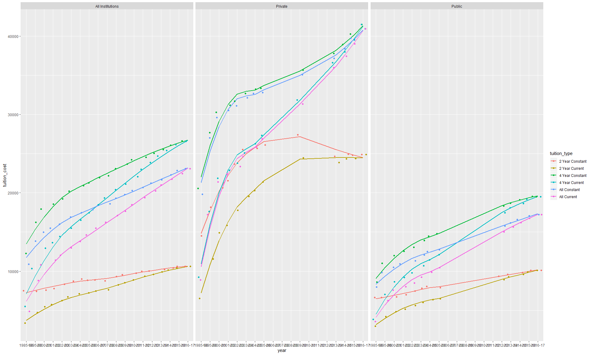
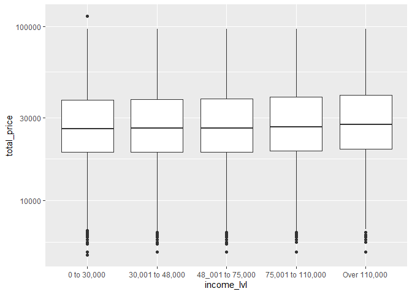
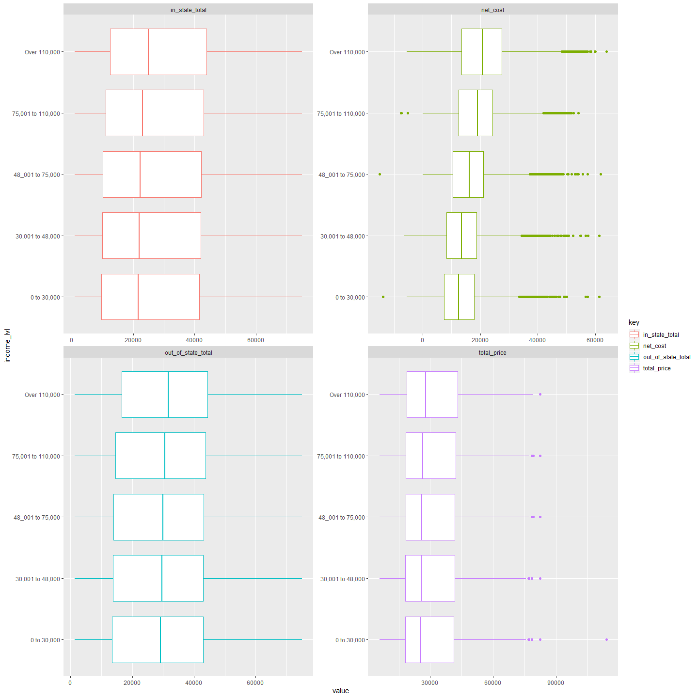
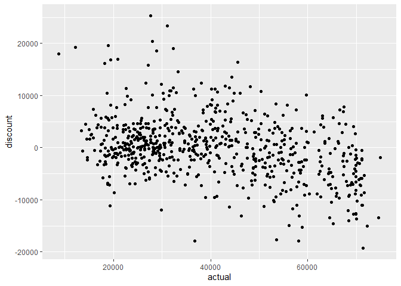

TidyTuesdayUniversityTuition
================

``` r
library(tidyverse)
```

    ## Warning: package 'tidyverse' was built under R version 3.5.3

    ## -- Attaching packages ------------------------------------------------------- tidyverse 1.2.1 --

    ## v ggplot2 3.2.1     v purrr   0.3.3
    ## v tibble  2.1.3     v dplyr   0.8.3
    ## v tidyr   1.0.0     v stringr 1.4.0
    ## v readr   1.3.1     v forcats 0.4.0

    ## Warning: package 'ggplot2' was built under R version 3.5.3

    ## Warning: package 'tibble' was built under R version 3.5.3

    ## Warning: package 'tidyr' was built under R version 3.5.3

    ## Warning: package 'purrr' was built under R version 3.5.3

    ## Warning: package 'dplyr' was built under R version 3.5.3

    ## Warning: package 'stringr' was built under R version 3.5.3

    ## Warning: package 'forcats' was built under R version 3.5.3

    ## -- Conflicts ---------------------------------------------------------- tidyverse_conflicts() --
    ## x dplyr::filter() masks stats::filter()
    ## x dplyr::lag()    masks stats::lag()

``` r
tuition_cost <- readr::read_csv('https://raw.githubusercontent.com/rfordatascience/tidytuesday/master/data/2020/2020-03-10/tuition_cost.csv')
```

    ## Parsed with column specification:
    ## cols(
    ##   name = col_character(),
    ##   state = col_character(),
    ##   state_code = col_character(),
    ##   type = col_character(),
    ##   degree_length = col_character(),
    ##   room_and_board = col_double(),
    ##   in_state_tuition = col_double(),
    ##   in_state_total = col_double(),
    ##   out_of_state_tuition = col_double(),
    ##   out_of_state_total = col_double()
    ## )

``` r
tuition_income <- readr::read_csv('https://raw.githubusercontent.com/rfordatascience/tidytuesday/master/data/2020/2020-03-10/tuition_income.csv') 
```

    ## Parsed with column specification:
    ## cols(
    ##   name = col_character(),
    ##   state = col_character(),
    ##   total_price = col_double(),
    ##   year = col_double(),
    ##   campus = col_character(),
    ##   net_cost = col_double(),
    ##   income_lvl = col_character()
    ## )

``` r
salary_potential <- readr::read_csv('https://raw.githubusercontent.com/rfordatascience/tidytuesday/master/data/2020/2020-03-10/salary_potential.csv')
```

    ## Parsed with column specification:
    ## cols(
    ##   rank = col_double(),
    ##   name = col_character(),
    ##   state_name = col_character(),
    ##   early_career_pay = col_double(),
    ##   mid_career_pay = col_double(),
    ##   make_world_better_percent = col_double(),
    ##   stem_percent = col_double()
    ## )

``` r
historical_tuition <- readr::read_csv('https://raw.githubusercontent.com/rfordatascience/tidytuesday/master/data/2020/2020-03-10/historical_tuition.csv')
```

    ## Parsed with column specification:
    ## cols(
    ##   type = col_character(),
    ##   year = col_character(),
    ##   tuition_type = col_character(),
    ##   tuition_cost = col_double()
    ## )

``` r
diversity_school <- readr::read_csv('https://raw.githubusercontent.com/rfordatascience/tidytuesday/master/data/2020/2020-03-10/diversity_school.csv')
```

    ## Parsed with column specification:
    ## cols(
    ##   name = col_character(),
    ##   total_enrollment = col_double(),
    ##   state = col_character(),
    ##   category = col_character(),
    ##   enrollment = col_double()
    ## )

``` r
historical_tuition %>% ggplot(aes(x = year, y = tuition_cost, color = type, group = type)) + geom_smooth() + geom_point()
```

    ## `geom_smooth()` using method = 'loess' and formula 'y ~ x'

<!-- -->

``` r
historical_tuition %>% 
  group_by(type) %>% 
  summarise(min = min(tuition_cost),
            max = max(tuition_cost)) %>% 
  ungroup() %>% 
  mutate(range = max - min)
```

    ## # A tibble: 3 x 4
    ##   type               min   max range
    ##   <chr>            <dbl> <dbl> <dbl>
    ## 1 All Institutions  3367 26613 23246
    ## 2 Private           6512 41468 34956
    ## 3 Public            2981 19558 16577

``` r
college_df <- tuition_cost %>% left_join(salary_potential, by = "name") %>% drop_na()
```

``` r
college_df %>% 
  select(everything(), -name, -state_code, -type, -degree_length, -state_name, -rank) %>% 
  gather(key = "key", value = "value", -state) %>% 
  group_by(state, key) %>% 
  mutate(value = as.numeric(value)) %>% 
  summarise(min = min(value),
            median = median(value),
            average = mean(value),
            max = max(value)) %>% 
  group_by(key) %>% 
  top_n(median, n = 5) %>% 
  ggplot(aes(x = state, y = median, fill = state)) + 
  geom_col() + 
  coord_flip() + 
  facet_wrap(~key, scales = "free") + 
  theme(legend.position = "none")
```

<!-- -->

``` r
college_df %>% 
  select(in_state_total, out_of_state_total, early_career_pay, mid_career_pay) %>% 
  gather(key = "key", value = "value", -in_state_total, -out_of_state_total) %>% 
  gather(key = "key2", value = "value2", -key, -value) %>% 
  ggplot(aes(x = value, y = value2, color = key)) + 
  geom_point() +
  facet_wrap(~key2, scales = "fixed")
```

<!-- -->

``` r
college_df %>% 
  select(in_state_total, out_of_state_total, early_career_pay, mid_career_pay) %>% summary()
```

    ##  in_state_total  out_of_state_total early_career_pay mid_career_pay  
    ##  Min.   : 8710   Min.   : 8710      Min.   :32500    Min.   : 61900  
    ##  1st Qu.:20135   1st Qu.:31157      1st Qu.:45600    1st Qu.: 81400  
    ##  Median :36975   Median :40125      Median :49600    Median : 89600  
    ##  Mean   :38047   Mean   :42514      Mean   :51124    Mean   : 92577  
    ##  3rd Qu.:53203   3rd Qu.:53581      3rd Qu.:55000    3rd Qu.:100475  
    ##  Max.   :75003   Max.   :75003      Max.   :88800    Max.   :158200

``` r
model_data <- college_df %>%
  filter(degree_length == "4 Year") %>% 
  select(-in_state_tuition, -out_of_state_tuition, -state_name, -degree_length, -room_and_board, -state) 
```

``` r
model_data <- model_data %>% 
  mutate(tuition_total = (in_state_total + out_of_state_total) /2) %>% 
  select(-in_state_total, -out_of_state_total, -rank)
```

``` r
model_data <- model_data %>% 
  select(-stem_percent)
```

``` r
library(broom)
```

    ## Warning: package 'broom' was built under R version 3.5.3

``` r
library(caret)
```

    ## Warning: package 'caret' was built under R version 3.5.3

    ## Loading required package: lattice

    ## 
    ## Attaching package: 'caret'

    ## The following object is masked from 'package:purrr':
    ## 
    ##     lift

``` r
model_data
```

    ## # A tibble: 669 x 7
    ##    name  state_code type  early_career_pay mid_career_pay make_world_bett~
    ##    <chr> <chr>      <chr>            <dbl>          <dbl>            <dbl>
    ##  1 Adam~ CO         Publ~            44400          81400               56
    ##  2 Adve~ FL         Priv~            51600          89800               88
    ##  3 Agne~ GA         Priv~            46000          83600               57
    ##  4 Alab~ AL         Publ~            39800          71500               61
    ##  5 Alas~ AK         Priv~            50300          90000               67
    ##  6 Alba~ NY         Priv~            81000         144800               82
    ##  7 Albe~ CT         Priv~            49700          85900               62
    ##  8 Albi~ MI         Priv~            52100          99300               44
    ##  9 Alco~ MS         Publ~            40900          69500               67
    ## 10 Alma~ MI         Priv~            48400          89900               52
    ## # ... with 659 more rows, and 1 more variable: tuition_total <dbl>

``` r
trainIndex <- createDataPartition(model_data$tuition_total, p = .8, list = FALSE)

train_data <- model_data[trainIndex,]
test_data <- model_data[-trainIndex,]
```

``` r
baseLine_model <- lm(tuition_total~state_code + type + early_career_pay  + mid_career_pay + make_world_better_percent + state_code*type, data = model_data) 
```

``` r
baseLine_model %>% 
  augment() %>%
  cbind(model_data %>% select(name)) %>% 
  select(name, actual =tuition_total, predicted = .fitted, mid_career_pay, early_career_pay) %>% 
  mutate(discount = predicted - actual) %>% 
  top_n(discount, n = 25) %>% 
  arrange(desc(discount))
```

    ##                                       name actual predicted mid_career_pay
    ## 1                       Grove City College  27700  52955.49          98400
    ## 2            Capitol Technology University  31136  54535.60         118400
    ## 3                        Husson University  28010  48348.49          77600
    ## 4          Mount Carmel College of Nursing  18907  38529.54          99700
    ## 5          Brigham Young University-Hawaii  12146  31322.74          93900
    ## 6                   Walla Walla University  32310  51288.43          97800
    ## 7                    Belmont Abbey College  28855  47345.94          82900
    ## 8           Brigham Young University-Idaho   8710  26664.55          93500
    ## 9                          Park University  20850  37836.20          85000
    ## 10 Adventist University of Health Sciences  19350  36127.42          89800
    ## 11                     La Salle University  45640  62043.61         104800
    ## 12                     Bellevue University  18120  34312.06          84800
    ## 13                      Harding University  27179  43037.16          88600
    ## 14         Washington Adventist University  33270  47855.54          97600
    ## 15                      Bradley University  44380  57932.30         104900
    ## 16                   Lindenwood University  26600  39025.56          78500
    ## 17                          Thomas College  38150  50526.19          81500
    ## 18                       Cleary University  29850  42003.47          84700
    ## 19     New England Institute of Technology  43005  54811.34          93200
    ## 20       Wentworth Institute of Technology  48140  59859.90         112700
    ## 21                         Fisk University  32270  43756.25          83600
    ## 22                Ohio Northern University  43910  55317.59         103900
    ## 23                       Louisiana College  22618  33918.33          79800
    ## 24                Southern Vermont College  36511  47786.35          78700
    ## 25              University of the Sciences  40938  52181.18         115200
    ##    early_career_pay discount
    ## 1             54400 25255.49
    ## 2             67400 23399.60
    ## 3             43300 20338.49
    ## 4             56600 19622.54
    ## 5             51700 19176.74
    ## 6             53700 18978.43
    ## 7             46700 18490.94
    ## 8             53700 17954.55
    ## 9             48500 16986.20
    ## 10            51600 16777.42
    ## 11            55800 16403.61
    ## 12            49400 16192.06
    ## 13            49200 15858.16
    ## 14            55600 14585.54
    ## 15            55600 13552.30
    ## 16            45100 12425.56
    ## 17            46100 12376.19
    ## 18            47400 12153.47
    ## 19            51700 11806.34
    ## 20            62700 11719.90
    ## 21            45300 11486.25
    ## 22            54400 11407.59
    ## 23            44800 11300.33
    ## 24            42900 11275.35
    ## 25            60700 11243.18

``` r
baseLine_model %>% 
  augment() %>%
  cbind(model_data %>% select(name)) %>% 
  select(name, actual =tuition_total, predicted = .fitted, mid_career_pay, early_career_pay) %>% 
  mutate(discount = predicted - actual) %>% 
  ggplot(aes(x = actual, y = discount)) + geom_point()
```

<!-- -->

``` r
baseLine_model %>% 
  augment() %>%
  cbind(model_data %>% select(name)) %>% 
  select(name, actual =tuition_total, predicted = .fitted, mid_career_pay, early_career_pay) %>% 
  mutate(discount = predicted - actual) %>% 
  filter(name == "University of Iowa")
```

    ##                 name actual predicted mid_career_pay early_career_pay
    ## 1 University of Iowa  31422  27919.49          99400            54100
    ##    discount
    ## 1 -3502.508
